# 第一章. 理解和设置基础物联网硬件

在本章中，我们将开始使用 Python 和英特尔 Galileo Gen 2 主板探索通往**物联网**（**IoT**）的旅程。Python 是最受欢迎且功能最全面的编程语言之一。您可以使用 Python 创建多平台桌面和 Web、移动以及科学应用。您可以使用 Python 处理大量数据，并开发在大数据场景中流行的复杂算法。有成千上万的 Python 包，这些包允许您将 Python 的能力扩展到您能想象到的任何领域。

我们可以利用我们对 Python 及其所有包的现有知识来编写我们物联网生态系统的不同部分。我们可以使用 Python 中我们喜爱的面向对象特性，在交互英特尔 Galileo Gen 2 主板及其连接的电子组件的代码中。我们可以使用不同的包，使我们能够轻松运行 Web 服务器并提供 RESTful API。我们可以使用我们已知的所有包来与数据库、Web 服务和不同的 API 交互。Python 使我们能够轻松地进入物联网世界。我们不需要学习另一种编程语言，我们可以使用我们已知的并喜爱的语言。

首先，我们将学习英特尔 Galileo Gen 2 主板包含的功能。我们将：

+   理解英特尔 Galileo Gen 2 主板及其组件

+   识别输入/输出和 Arduino 1.0 引脚排列

+   了解额外的扩展和连接功能

+   理解主板中发现的按钮和 LED

+   检查并升级主板固件

# 理解英特尔 Galileo Gen 2 主板及其组件

我们希望轻松地将我们的想法变为现实。我们希望能够在拍手时在屏幕上显示生日快乐的信息。我们希望从现实世界中收集大量数据。我们希望创建能够跟踪我们一整天所有活动的可穿戴设备。我们希望使用数据执行操作并与现实世界元素交互。我们希望使用我们的移动设备来控制机器人。我们希望能够根据从温度传感器获取的数据确定天气是热还是冷。我们希望根据从湿度传感器收集的值做出决策。

我们希望测量杯子里有多少我们最喜欢的饮料，并在 LCD 点阵显示屏上显示信息。我们希望分析所有连接到互联网的事物收集的数据。我们希望利用我们现有的 Python 编程技能，成为物联网时代的创造者。

我们将使用 Python 作为主要的编程语言来控制连接到英特尔 Galileo Gen 2 主板的不同组件，特别是 Python 2.7.3。然而，在我们成为创造者之前，了解这块主板的一些功能是必要的。

在我们打开英特尔 Galileo Gen 2 板后，我们将找到以下元素：

+   英特尔 Galileo Gen 2 板

+   一个 12 VDC（直流伏特），1.5 A（安培）的电源

以下图像显示了未开封的英特尔 Galileo Gen 2 板的前视图：

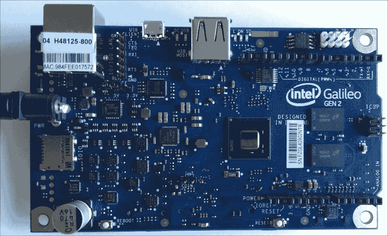

让我们花几分钟时间看看板的前视图。我们会注意到许多熟悉的元素，例如以太网插孔、主机 USB 端口和许多标记的引脚。如果我们之前有 Arduino UNO R3 板的经验，我们会很容易意识到许多元素与该板上的位置相同。如果我们有嵌入式系统和电子方面的经验，我们会很容易意识到该板提供了与支持 I²C 总线的设备通信所需的引脚（SCL 和 SDA）。如果我们没有任何先前的经验，我们将在接下来的章节中包含的示例中学习我们可以用所有这些引脚做什么。

下一个图像显示了 Fritzing 开源免费软件中英特尔 Galileo Gen 2 板的图形表示。正如你可能注意到的，图形表示仅包括板上的重要部件和所有我们可以布线和连接的东西，以及必要的标签以帮助轻松识别。我们将使用 Fritzing 图来展示我们必须完成的全部布线，以便通过本书完成每个示例项目。

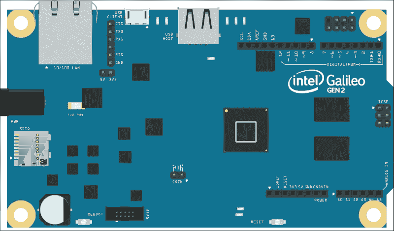

### 小贴士

您可以从[`fritzing.org/download/`](http://fritzing.org/download/)下载 Fritzing 的最新版本。Fritzing 在 Windows、Mac OS X 和 Linux 上运行。您将在具有 FZZ 扩展名（`*.fzz`）的文件中找到本书中包含的所有示例的 Fritzing 草图，这些文件是您可以下载的代码文件的一部分。文件以 Fritzing 0.92 版本保存。因此，您可以在 Fritzing 中打开草图，检查面包板视图，并根据您的需求进行任何更改。

下一个图像显示了英特尔 Galileo Gen 2 板的电子原理图表示，即板的符号表示，以便于理解与板相关的电子电路的互连。电子原理图也称为电路图或电气图。符号包括板上提供的所有引脚，显示为连接器。我们可以轻松识别出板上出现的许多标签，它们是符号中每个连接器的标签。Fritzing 允许我们同时使用面包板和电子原理图表示。

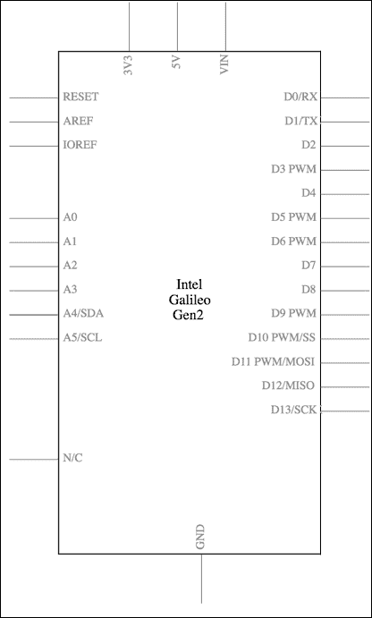

### 小贴士

当你打开书中包含的每个示例的 Fritzing 文件时，你可以通过点击位于主 Fritzing 窗口顶部的面包板或原理图按钮，轻松地在面包板视图和原理图视图之间切换。

下一个图像展示了英特尔 Galileo Gen 2 板的系统框图。该图是英特尔 Galileo Gen 2 设计文档中包含的内容的一部分：[`www.intel.com/content/dam/www/public/us/en/documents/guides/galileo-g2-schematic.pdf`](http://www.intel.com/content/dam/www/public/us/en/documents/guides/galileo-g2-schematic.pdf)。

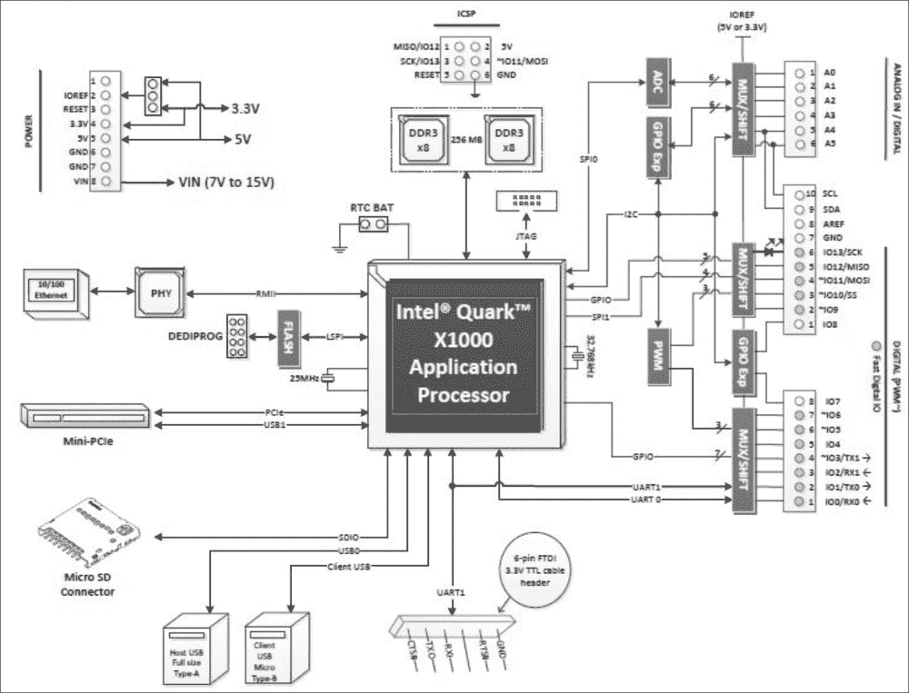

英特尔 Galileo Gen 2 板是 Arduino 认证的嵌入式计算机，我们将用它来开发和原型化我们的物联网项目。该板基于英特尔架构，并使用英特尔 Quark SoC X1000 系统芯片，也称为 SoC 或应用处理器。SoC 是一个单核单线程的应用处理器，与英特尔 Pentium 32 位**指令集架构**（ISA）兼容。其运行速度高达 400 MHz。以下图像显示了位于板中心大约位置的 SoC。以下页面提供了关于英特尔 Quark SoC X1000 的详细信息：[`ark.intel.com/products/79084/Intel-Quark-SoC-X1000-16K-Cache-400-MHz`](http://ark.intel.com/products/79084/Intel-Quark-SoC-X1000-16K-Cache-400-MHz)

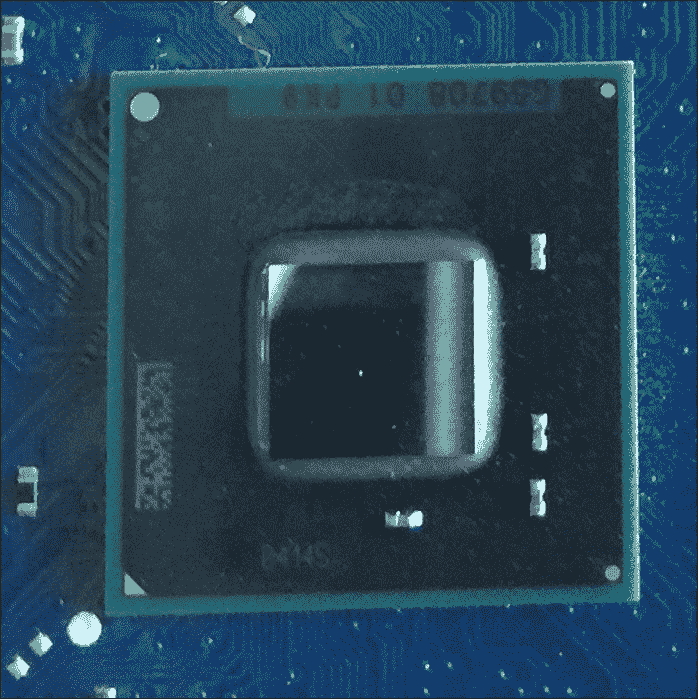

在 CPU 的右侧，该板有两个集成电路，提供 256 MB 的 DDR3**RAM**（随机存取存储器）内存。操作系统和 Python 将能够与这种 RAM 内存一起工作。就像在任何计算机中发生的那样，RAM 内存在我们关闭板子后会丢失其信息。因此，我们说 RAM 是易失的，因为当内存未供电时，存储在其中的数据会丢失。以下图像显示了 DDR3 内存芯片。

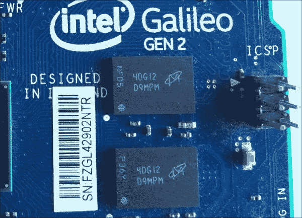

此外，该板还提供了以下板载存储器的访问：

+   512 KB 的嵌入式**SRAM**（静态随机存取存储器）。

+   8 MB 的 Legacy SPI NOR 闪存，非易失性存储器。其目的是存储板的固件和草图。

+   11 KB 的**EEPROM**（电可擦可编程只读存储器）。它是非易失性的，我们可以用它来存储我们自己的数据。

# 识别输入/输出和 Arduino 1.0 引脚布局

该板提供了以下 I/O 引脚：

+   14 个数字 I/O 引脚

+   六个**PWM**（脉冲宽度调制）输出引脚

+   六个模拟输入引脚

该板在硬件和软件引脚上与为 Arduino Uno R3 设计的 Arduino 保护板兼容。编号从 0 到 13 的 14 个数字 I/O 引脚位于板的右上角，它们还包括相邻的**AREF**和**GND**引脚，如 Arduino Uno R3 所示。引脚配置也称为 Arduino 1.0 引脚排布。

### 小贴士

保护板是我们可以插在 Intel Galileo Gen 2 板上以扩展其功能的板。例如，您可以插入一个提供两个高电流电机控制器的保护板，或者插入一个添加 LED 矩阵的保护板。

如同 Arduino Uno R3 一样，我们可以使用这些数字 I/O 引脚中的六个作为 PWM（脉冲宽度调制）输出引脚。具体来说，带有波浪线符号（**~**）作为数字前缀的引脚具有这种功能：引脚**~11**、**~10**、**~9**、**~6**、**~5**和**~3**。以下是从左到右组成引脚头的引脚：

+   SCL

+   SDA

+   AREF

+   GND

+   13

+   12

+   ~11

+   ~10

+   ~9

+   8

+   7

+   ~6

+   ~5

+   4

+   ~3

+   2

+   TX->1

+   RX<-0

下一个图像显示了 14 个数字 I/O 引脚和六个带有波浪线符号（**~**）作为前缀的 PWM 输出引脚。从左数起的前两个引脚是两个 I²C 总线线：**SCL**（串行时钟）和**SDA**（串行数据）。从左数起的最后两个引脚，标记为**TX->1**和**RX<-0**，是 UART 0 端口引脚。**UART**端口代表**通用异步接收/发送器**。

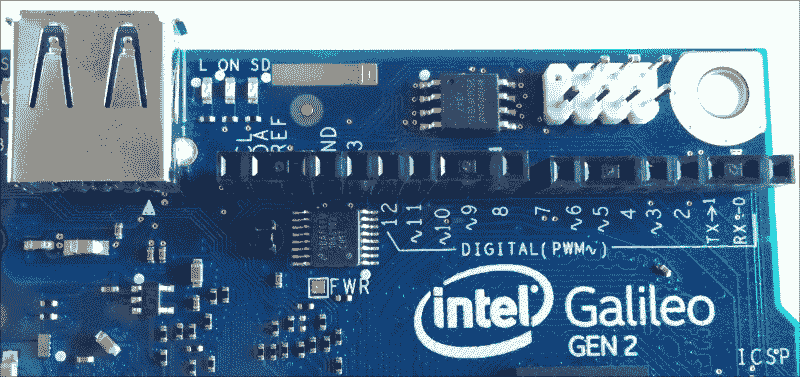

编号从**A0**到**A5**的六个类似输入引脚位于板的右下角，如 Arduino Uno R3 所示。在模拟输入引脚的左侧，我们可以看到以下组成电源头的电源引脚：

+   电源

+   IOREF

+   RESET

+   3.3V

+   5V

+   GND

+   GND

+   VIN

电源头中的**VIN**引脚提供输入电压，该电压通过电源插头供应到板上。盒子中包含的电源提供 12V。然而，该板可以在 7V 到 15V 的输入电压范围内运行。该板还支持以太网供电（PoE），这通过以太网电缆将电力传递到板上，同时传递数据。

以下截图显示了电源引脚，也称为电源头，以及六个模拟输入引脚：

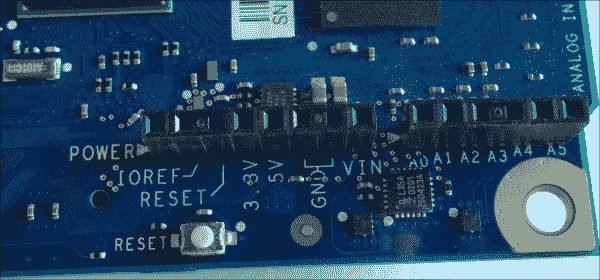

该板包括一个标记为**IOREF**的跳线，允许我们在 3.3V 或 5V 保护板操作之间进行选择，并为所有 I/O 引脚提供电压级别转换。根据跳线位置，该板可以与 3.3V 或 5VArduino 保护板一起工作。默认情况下，**IOREF**跳线设置为 5V 位置，因此初始设置允许我们使用 5V 保护板。以下截图显示了**IOREF**跳线设置为 5V 位置。

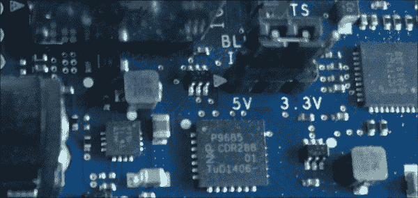

### 小贴士

电源头中的**IOREF**引脚提供基于**IOREF**跳线位置的运行电压参考。因此，根据**IOREF**跳线位置，**IOREF**引脚的电压参考可以是 5V 或 3.3V。

在板的右侧，有一个 6 针，具体是 2x3 针，ICSP（In-Circuit Serial Programming）头，标记为**ICSP**。此头的位置也与 Arduino 1.0 引脚排列兼容。以下截图显示了 ICSP 头：

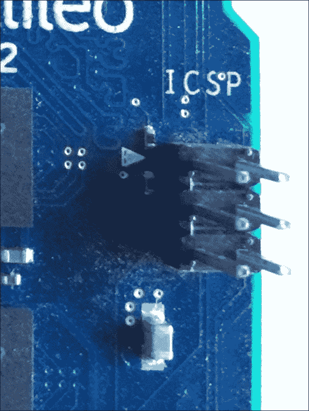

# 识别额外的扩展和连接能力

电源插孔位于板的左侧，标记为**PWR**。在电源插孔下方，有一个微 SD 卡连接器，标记为**SDIO**。微 SD 卡连接器支持最大容量为 32 GB 的微 SD 卡。我们将使用微 SD 卡作为我们的主要存储来存储操作系统、Python 和必要的库。该板可以从微 SD 卡启动。因此，我们可以将微 SD 卡视为我们与物联网项目一起工作的主要硬盘。以下截图显示了连接电源供应的电源插孔以及连接了 8 GB 微 SD 卡的微 SD 卡连接器。

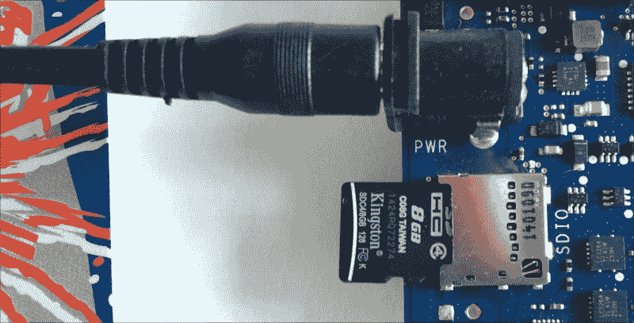

以太网插孔位于板的左上角，标记为**10/100 LAN**，位于电源插孔上方。以太网端口支持以太网和快速以太网标准，因此它可以与 10 Mbps 或 100 Mbps 的标称吞吐量率一起工作。以太网端口对于将板连接到我们的 LAN 并通过 IP 地址访问它来说非常有用。有一个带有以太网板上网络接口卡 MAC（媒体访问控制）地址的粘性标签。MAC 地址也称为物理地址。

以下截图显示了以太网外壳上的这个粘性标签以及插入其中的电缆。图中所示板的 MAC 地址为 A1B2C3D4E5F6。如果我们使用将 MAC 地址表示为用冒号(:)分隔的六组两个十六进制数字的约定，则 MAC 地址将表示为 A1:B2:C3:D4:E5:F6。MAC 地址对于在我们的 LAN DHCP 客户端列表中识别板来说非常有用。出于安全原因，原始 MAC 地址已被擦除，我们使用一个假 MAC 地址作为示例。

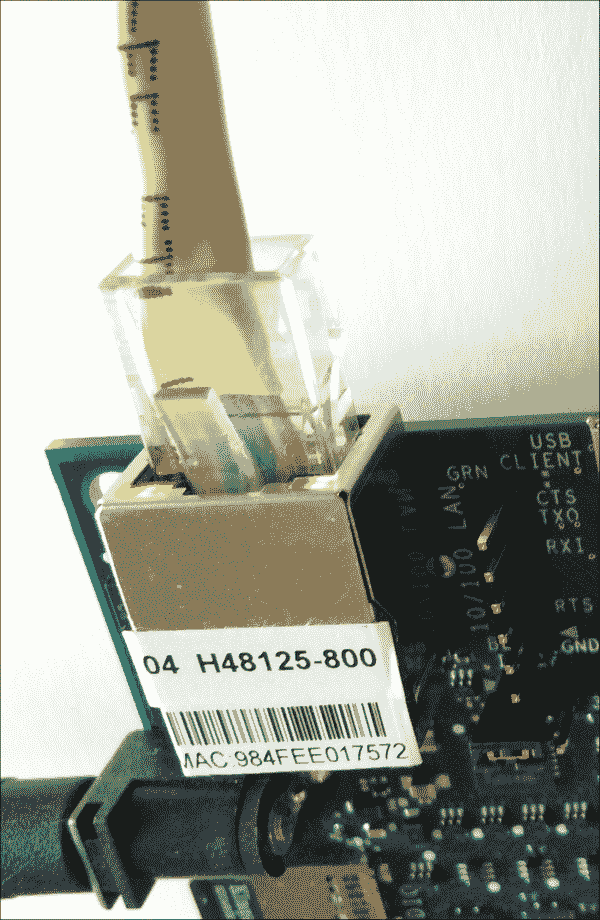

在以太网插孔旁边，有一个六针、3.3V USB TTL UART 头，具体是 UART 1，即板上的第二个 UART 端口。六针、3.3V USB TTL UART 头的右侧有以下标签：

+   CTS

+   TXO

+   RXI

+   无标签（空）

+   RTS

+   GND

在以太网插孔和 UART 引脚旁边，有一个微型 USB Type B 连接，标记为**USB 客户端**。我们可以使用这个连接将计算机连接到板子，以便执行固件更新或传输草图。

### 小贴士

然而，重要的是要知道，您不能通过 USB 关闭板子的电源。此外，在连接电源供应到板子之前，切勿将电缆连接到微型 USB Type B 连接。

在微型 USB 连接旁边，有一个 USB 2.0 主机连接器，标记为**USB 主机**。该连接器支持最多 128 个 USB 端点设备。我们可以使用这个连接器插入 USB 闪存驱动器以进行额外存储，USB 键盘、USB 鼠标或我们可能需要的任何其他 USB 设备。然而，在我们插入任何设备之前，我们必须考虑必要的驱动程序以及它们与我们将在板上使用的 Linux 发行版的兼容性。

以下图片显示了从左到右依次是 UART 引脚、微型 USB 连接器和 USB 2.0 端口，旁边是以太网插孔。

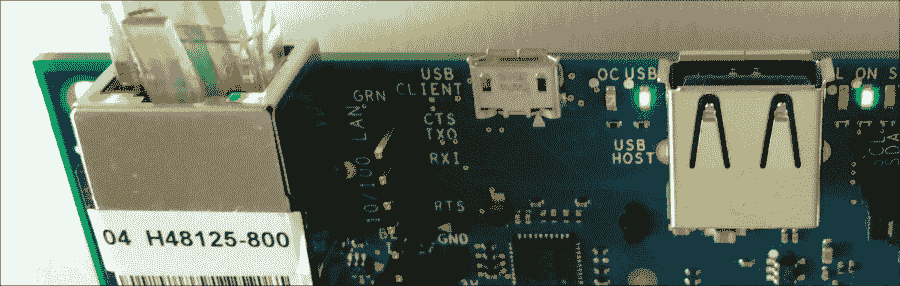

以下图片显示了带有所有连接器和插孔的侧面视图。从左到右，USB 2.0 端口、微型 USB 连接器、UART 引脚和带有绿色（速度）和黄色（链路）LED 的以太网插孔。

板子的背面提供了一个迷你 PCI Express 插槽，也称为 mPCIe 插槽，符合 PCIe 2.0 特性，标记为**PCIE**。该插槽与全尺寸和半尺寸 mPCIe 模块兼容，我们可以将其连接到板上以扩展其功能。半尺寸 mPCIe 模块需要适配器才能连接到板上的插槽。

### 小贴士

通过 mPCIe 插槽添加另一个 USB 主机端口是可能的。mPCIe 插槽对于提供 WiFi、蓝牙和其他类型的不作为板载功能的连接非常有用。

在 mPCIe 插槽旁边，有一个 10 针 JTAG（联合测试行动小组）引脚，标记为**JTAG**。可以使用 JTAG 接口与支持英特尔 Quark SoC X1000 应用处理器的调试软件进行调试，例如免费和开源的片上调试软件 OpenOCD。

下一张图片显示了带有 mPCIe 插槽和 JTAG 引脚的板子背面视图。

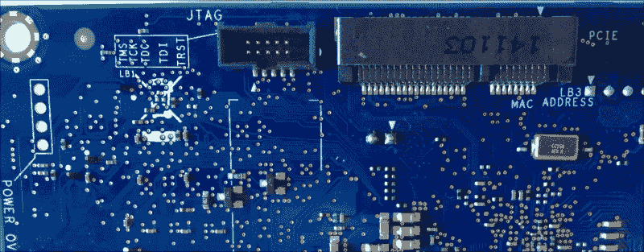

# 理解按钮和 LED

板子的前面提供了两个位于底部的按钮，分别标记为**重启**和**重置**。以下图片显示了这两个按钮：

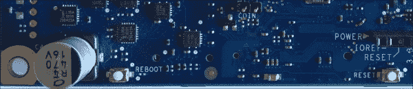

标有**REBOOT**的按钮重置英特尔 Quark SoC X1000 应用处理器。标有**RESET**的按钮重置草图以及任何连接到板上的屏蔽。在这本书中，我们不会使用 Arduino 草图，但我们可能需要重置一个屏蔽。

在 USB 2.0 主机连接器旁边有五个矩形 LED：连接器左侧有两个 LED，右侧有三个 LED。以下是对 LED 标签及其含义的说明：

+   **OC**：当板通过 micro USB 连接器供电时，LED 指示过流。然而，此功能在英特尔 Galileo Gen 2 板上未启用，因此我们只是将 LED 关闭。如果 LED 打开，则表示板工作不正常或电源供应失败。通常，当板被砖化时，此 LED 会打开。我们说板被砖化，当它不再工作，技术上就像一块砖一样有用。

+   **USB**：这是 micro USB 就绪 LED。在板完成引导过程后，LED 会打开，允许我们将 micro USB 电缆连接到标有**USB CLIENT**的 micro USB 连接。我们绝对不应该在 LED 打开之前将电缆连接到 micro USB 连接，因为这可能会损坏板。

+   **L**：该 LED 连接到数字 I/O 引脚的 13 号引脚，因此，向 13 号引脚发送高电平会打开此 LED，而低电平会关闭它。

+   **ON**：这是一个电源 LED，表示板已连接到电源。

+   **SD**：该 LED 指示与 microSD 卡连接器（标为**SDIO**）的 I/O 活动，因此，当板在 microSD 卡上读取或写入时，此 LED 会闪烁。

以下图像显示了 USB 2.0 主机连接器左侧的**OC**和**USB**LED 以及右侧的**L**、**ON**和**SD**LED。

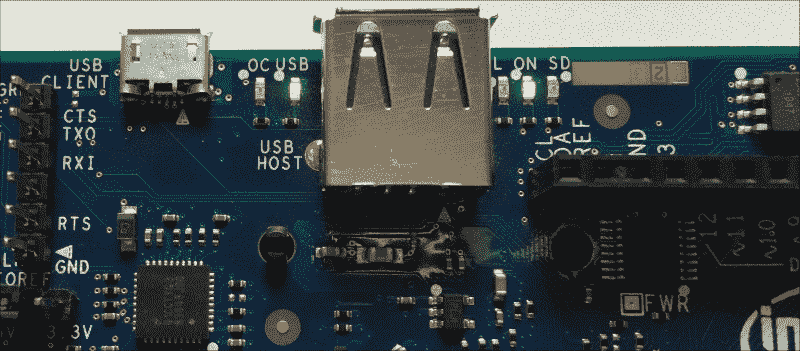

该板包括一个集成的实时时钟，称为 RTC。可以将 3V 的纽扣电池连接到 RTC，以在开机周期之间保持 RTC 运行。不幸的是，电池不包括在包装内。两个 RTC 纽扣电池连接器位于英特尔 Quark SoC X1000 应用处理器左下角，标为**COIN**，并带有电池图标。下一张图像显示了两个 RTC 纽扣电池连接器。

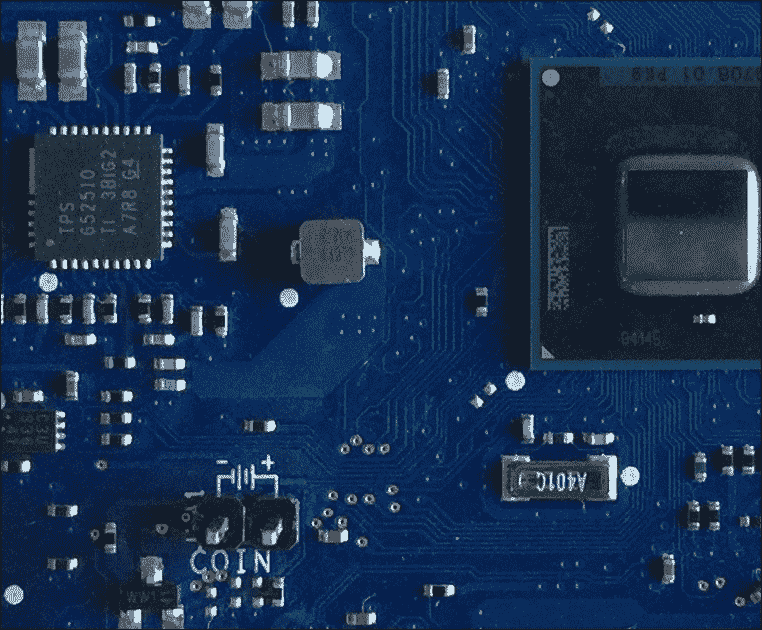

# 检查和升级板上的固件

有时，板中包含的原始固件是英特尔 Galileo Gen 2 可用的最新固件。然而，在某些情况下，我们可能需要固件更新，因此始终确保我们使用的是板上固件的最新可用版本。

### 小贴士

固件更新可以解决错误和兼容性问题。因此，始终使用最新的固件是非常方便的。然而，如果您对遵循固件更新程序没有信心，保留随板卡提供的版本会更方便。在更新固件过程中，如果操作不当或发生断电，可能会损坏板卡，即可能将板卡变成砖头。您肯定不希望这种情况发生在您的板卡上。

如果您想检查当前固件版本并确定是否需要升级板卡的固件，您必须遵循以下步骤：

请访问英特尔 Galileo 固件和驱动程序下载页面[`downloadcenter.intel.com/download/24748/Intel-Galileo-Firmware-and-Drivers-1-0-4`](http://downloadcenter.intel.com/download/24748/Intel-Galileo-Firmware-and-Drivers-1-0-4)。该网址是本书编写时的最新固件版本：1.0.4。然而，请始终确保您从英特尔驱动程序和软件下载中心下载的是最新可用的版本。如果版本高于 1.0.4，则操作步骤相同，只需将 1.0.4 替换为新版本号。

网络浏览器将显示支持的操作系统的可用下载。网页无法检测您正在使用的操作系统，因此它为所有支持的操作系统的下载提供支持：Windows、Mac OS X 和 Linux。以下图片显示了网页的内容：

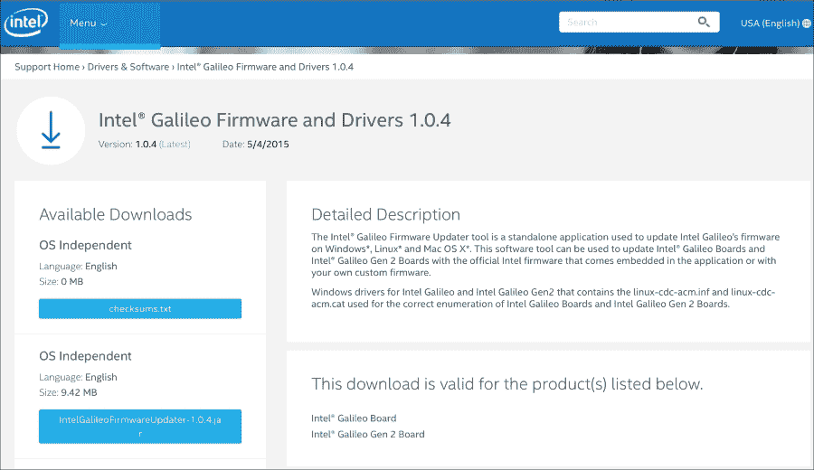

您将在**操作系统独立**下找到 PDF 用户指南：**IntelGalileoFirmwareUpdaterUserGuide-1.0.4.pdf**。点击按钮，阅读并接受英特尔软件许可协议，并阅读英特尔 Galileo 固件更新工具文档。文档包括在 Windows 和 Linux 中安装驱动程序的必要步骤。Mac OS X 不需要安装任何驱动程序。

在您安装驱动程序或开始检查板卡固件版本的流程之前，请从板卡上移除所有连接，例如微型 USB 线缆和任何插入 USB 2.0 主机接口的 USB 设备。移除任何草图以及微型 SD 卡。您的英特尔 Galileo Gen 2 板卡应该像您拆箱时一样为空。

将电源连接到板卡，等待几秒钟，直到标有**USB**的矩形 LED 灯亮起。一旦此 LED 灯亮起，启动过程就已经完成，此时可以安全地将 USB Type A 到 Micro-B USB 线缆从您的计算机连接到板卡上标有**USB CLIENT**的微型 USB 接口。不幸的是，该线缆并未包含在板卡的包装盒内。以下图片显示了已完成连接并正在 Mac OS X 上运行固件更新工具的英特尔 Galileo Gen 2 板卡。

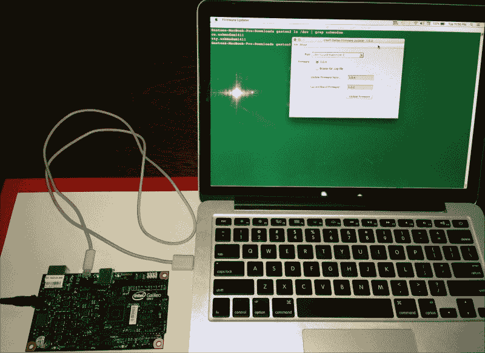

如果您正在使用 Windows 或 Linux，请按照**IntelGalileoFirmwareUpdaterUserGuide-1.0.4.pdf**文档中解释的步骤安装必要的驱动程序。

### 小贴士

您的板已经连接到计算机，因此您可以跳过文档中的此步骤。实际上，许多版本的文档没有解释您在通过微型 USB 连接器将板连接到计算机之前必须等待 USB LED 灯亮起，这导致许多板出现了意外问题。

一旦您在计算机上安装了驱动程序，并且您的板已连接到它，您就可以下载并执行适用于您的操作系统的英特尔 Galileo 固件更新器的 ZIP 文件。对于 Windows，文件是**IntelGalileoFirmwareUpdater-1.0.4-Windows.zip**。对于 Mac OS X，文件是**IntelGalileoFirmwareUpdater-1.0.4-OSX.zip**。通常您需要向下滚动网页以找到适用于您的操作系统的适当文件。一旦点击所需的文件按钮，您必须阅读并接受英特尔软件许可协议，然后才能下载 ZIP 文件。

在 Windows 中，下载**IntelGalileoFirmwareUpdater-1.0.4-Windows.zip**文件，打开它，并执行 ZIP 文件中包含的**firmware-updater-1.0.4.exe**应用程序。**英特尔 Galileo 固件更新工具**窗口将出现，并会自动选择之前安装的驱动程序生成的虚拟 COM 端口号，例如**COM3**，在**端口**下拉菜单中。应用程序将与板通信，然后将在**更新固件版本**中显示工具包含的固件版本，并在**当前板固件**中显示当前板的固件版本。

以下图像显示了在 Windows 10 上运行的英特尔 Galileo 固件更新工具。在这种情况下，该工具具有最新的固件版本，因为它提供**1.0.4**版本，当前板的固件是**1.0.2**。

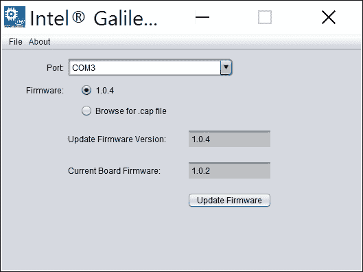

在 Mac OS X 中，下载**IntelGalileoFirmwareUpdater-1.0.4-OSX.zip**文件，然后执行下载的**固件更新器**应用程序。请注意，根据您的安全设置和 OS X 版本，您可能需要授权操作系统运行该应用程序。**英特尔 Galileo 固件更新工具**窗口将出现，并会自动选择连接到板的生成的 USB 调制解调器设备，例如**/dev/cu.usbmodem1411**，在**端口**下拉菜单中。应用程序将与板通信，然后将在**更新固件版本**中显示工具包含的固件版本，并在**当前板固件**中显示当前板的固件版本。

以下图像显示了在 OS X El Capitan 上运行的英特尔 Galileo 固件更新工具。在这种情况下，该工具提供了最新的固件版本，因为它提供的是**1.0.4**版本，而当前板的固件是**1.0.2**版本，这与 Windows 版本的情况相同。

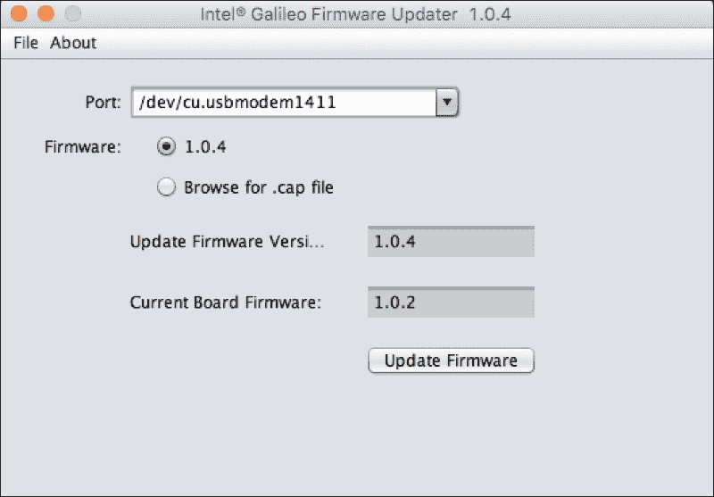

如果您决定需要并想要更新固件，考虑到之前解释的风险，您只需点击**更新固件**按钮，等待工具指示过程已完成。无论是 Windows 还是 Mac OS X，该过程都是相同的。

### 提示

在工具指示固件更新已完成之前，不要从连接到板的计算机上拔下 USB 电缆，不要从板上断开电源供应，不要关闭应用程序。在固件更新过程中，最安全的做法是将电源供应连接到不间断电源（UPS），以保护它免受电源故障的影响。

固件更新过程完成后，工具显示您在板上具有与工具提供的固件版本相同的版本时，您可以关闭应用程序，并从计算机和板上断开 USB 电缆。确保您不要将 USB 电缆留在板上，然后拔掉电源供应。

# 测试你的知识

1.  英特尔 Galileo Gen 2 板包括：

    1.  板上具有三个天线的 WiFi 连接性。

    1.  板上具有以太网连接性。

    1.  板上具有蓝牙连接性。

1.  英特尔 Galileo Gen 2 板与以下广泛的硬件和引脚兼容：

    1.  Arduino Uno R3 屏蔽。

    1.  Arduino Pi 屏蔽。

    1.  Raspberry Pi 屏蔽。

1.  标有 IOREF 的跳线允许我们：

    1.  选择 3.5V 或 7V 的屏蔽操作，并为所有 I/O 引脚提供电平转换。

    1.  选择 3.3V 或 5V 的屏蔽操作，并为所有 I/O 引脚提供电平转换。

    1.  重置板。

1.  标有 L 的 LED 连接到以下数字 I/O 引脚：

    1.  11`.`。

    1.  12`.`。

    1.  13`.`。

1.  板的背面提供了以下插槽：

    1.  Mini PCI Express。

    1.  PCMCIA。

    1.  雷电

# 摘要

在本章中，我们学习了英特尔 Galileo Gen 2 板提供的不同功能。我们可视化了板上的不同组件，并理解了不同引脚、LED 和连接器的含义。我们还学习了如何检查板的固件版本，并在必要时更新它。

现在我们已经识别了板上的不同组件，我们必须准备它以 Python 作为我们的主要编程语言来工作，这是我们将在下一章中讨论的内容。
