# 第二章。在英特尔 Galileo Gen 2 上使用 Python

在本章中，我们将开始使用 Python 和英特尔 Galileo Gen 2 板探索物联网（IoT）之旅。我们将：

+   设置环境以开始使用 Python 作为主要的编程语言

+   在板启动 Yocto Linux 发行版后检索板的分配 IP 地址

+   连接到板的操作系统并在其上运行命令

+   安装和升级必要的库，以便使用 Python 与板的组件交互

+   在板上运行我们的第一行 Python 代码

# 设置板以使用 Python 作为编程语言

为了将 Python 作为主要的编程语言来控制这块板，需要做一些工作。我们需要以下额外的元素，这些元素不包括在板的包装盒内：

+   至少 4GB 的 microSD 卡，最大支持容量为 32GB。使用速度等级 4 或更快的 microSD 卡会更方便。请注意，您将丢失 microSD 卡上的所有内容。

+   一个 microSD 到 SD 存储卡适配器。适配器通常包含在 microSD 卡的包装内。

+   一台带有 SD 存储卡读卡器的电脑。大多数现代笔记本电脑和台式电脑都包括 SD 存储卡读卡器。但是，如果您没有，您可以在电脑的空闲 USB 端口上购买一个 USB SD 存储卡读卡器并将其连接。SD 存储卡读卡器实际上是读写设备，因此我们可以通过 microSD 到 SD 存储卡适配器将它们用于写入 microSD 卡。

+   一根以太网线。

+   一个带有空闲以太网端口的以太网交换机或 WiFi 路由器。您将把英特尔 Galileo Gen 2 板连接到您的局域网。

### 小贴士

如果您无法访问您的局域网交换机，您将需要向您的网络管理员寻求建议。

下一个图片显示了一个标有**SDC4/8GB**（左侧）的 8GB 速度等级 4microSD 卡和一个 microSD 到 SD 存储卡适配器（右侧）。

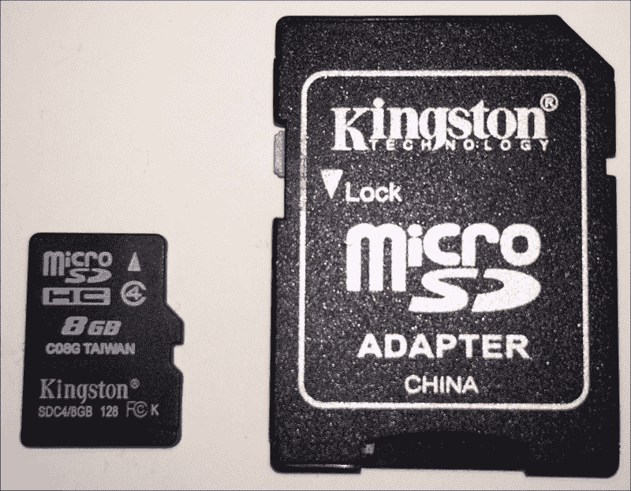

我们必须从英特尔物联网开发套件图像存储库网站下载 Yocto Linux 元分布启动映像的最新版本。在您的网络浏览器中打开[`iotdk.intel.com/images/`](http://iotdk.intel.com/images/)并下载网页上列出的`iot-devkit-latest-mmcblkp0.direct.bz2`压缩文件，其中包含启动映像。您也可以通过在您的网络浏览器中输入完整 URL 来下载它：[`iotdk.intel.com/images/iot-devkit-latest-mmcblkp0.direct.bz2`](http://iotdk.intel.com/images/iot-devkit-latest-mmcblkp0.direct.bz2)。

### 小贴士

我们将使用`devkit-latest-mmcblkp0.direct.bz2`文件，最后修改于 2015 年 7 月 2 日。请确保您不要下载早于这个日期的任何版本，因为之前版本中使用的包名与本章后面提供的说明不兼容。

下载文件后，必须解压缩下载的图像文件，并将提取的图像写入 microSD 卡。在 Windows 和 Mac OS X 中的操作步骤不同。

在 Windows 中，你可以使用 7-Zip 从下载的`.bz2`文件中提取内容。7-Zip 是一个免费的开源软件，你可以从[`www.7-zip.org`](http://www.7-zip.org)下载。

一旦从`.bz2`文件中提取了 Yocto Linux 元分布引导映像`iot-devkit-latest-mmcblkp0.direct`，你必须将此映像写入 microSD 卡。将 microSD 卡插入 microSD 到 SD 存储卡适配器，并将适配器插入计算机的 SD 卡读卡器。

Win32 Disk Imager 工具是 Windows 的一个映像写入器，允许我们将映像写入 U 盘或 SD/CF 卡。你可以使用这款免费软件将映像写入 microSD 卡。你可以从[`sourceforge.net/projects/win32diskimager/files/Archive`](http://sourceforge.net/projects/win32diskimager/files/Archive)下载它。最新版本的安装程序是`Win32DiskImager-0.9.5-install.exe`文件。一旦安装了软件，请注意，你必须以管理员身份在 Windows 中运行应用程序。你可以右键单击应用程序的图标，并选择**以管理员身份运行**。

点击**图像文件**文本框右侧的图标，将文件过滤器从**磁盘映像 (*.img *.IMG)** 更改为***，这样你就可以选择具有**直接**扩展名的 Yocto Linux 引导映像。

在**设备**下拉菜单中选择 Windows 分配给 microSD 卡的驱动器字母。

### 小贴士

确保选择正确的驱动器字母，因为该驱动器的所有内容都将被擦除，并用引导映像覆盖。如果你选择了错误的驱动器字母，你将丢失整个驱动器的内容。

点击**写入**，然后在确认覆盖对话框中点击**是**。现在，等待工具完成将内容写入 microSD 卡。以下截图显示了**Win32 Disk Imager**工具在 Windows 10 中写入映像到 microSD 卡时的进度。

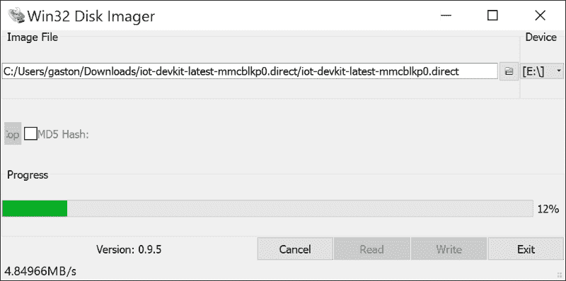

工具将花费几分钟时间将映像写入 microSD 卡。一旦写入过程完成，工具将显示一个包含**写入成功**消息的**完成**对话框。点击**确定**关闭对话框并关闭 Win32 Disk Imager 窗口。

在 Windows 中弹出 microSD 卡，然后从 SD 卡读卡器中移除 SD 存储卡适配器。

在 Mac OS X 和 Linux 中，您可以使用`bunzip2`从下载的**bz2**文件中提取内容，使用`diskutil`卸载 microSD 卡，并使用`dd`将映像写入 microSD 卡。您还可以打开**终端**，在下载文件的文件夹中运行以下命令来解压下载的 bz2 文件：

```py
bunzip -c iot-devkit-latest-mmcblkp0.direct
```

### 小贴士

您需要非常小心地处理命令，以避免擦除硬盘分区等错误的设备。

还可以通过在 Finder 中双击下载的 bz2 文件来解压该文件。然而，我们将在**终端**窗口中运行更多命令，因此，使用命令开始解压文件会更简单。

一旦从 bz2 文件中提取了 Yocto Linux 引导映像`iot-devkit-latest-mmcblkp0.direct`，您就必须将此映像写入 microSD 卡。将 microSD 卡插入 microSD 到 SD 内存卡适配器，然后将适配器插入计算机的 SD 内存卡读卡器。启动**磁盘工具**应用程序并检查连接到读卡器的媒体详细信息。例如，在任一 MacBook 笔记本电脑上，您可以通过点击**APPLE SD 卡读卡器媒体**然后点击**信息**按钮来找到信息。检查**设备名称**或**BSD 设备节点**中列出的名称。我们将使用此名称在写入 microSD 卡的引导映像的命令中。以下图片显示了**磁盘工具**应用程序和设备名称为**disk2**的 microSD 卡的信息。我们只需要在收集到的设备名称前添加`/dev/`作为前缀，因此，在这个示例案例中，完整的名称是`/dev/disk2`。

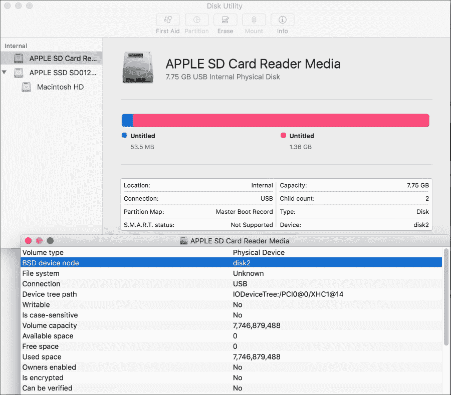

也可以通过运行`diskutil`命令列出所有设备并找出分配给 microSD 卡的设备名称来收集信息。然而，此命令提供的信息阅读起来有点困难，而**磁盘工具**应用程序则使得理解哪个是内存卡读卡器的设备名称变得容易。以下命令列出所有设备：

```py
diskutil list
```

以下是由此命令生成的示例输出。高亮显示的行显示了 microSD 卡的设备名称：`/dev/disk2`。

```py
/dev/disk0 (internal, physical):
   #:                       TYPE NAME                    SIZE       IDENTIFIER
   0:      GUID_partition_scheme                        *121.3 GB   disk0
   1:                        EFI EFI                     209.7 MB   disk0s1
   2:          Apple_CoreStorage Macintosh HD            120.5 GB   disk0s2
   3:                 Apple_Boot Recovery HD             650.0 MB   disk0s3
/dev/disk1 (internal, virtual):
   #:                       TYPE NAME                    SIZE       IDENTIFIER
   0:                  Apple_HFS Macintosh HD           +120.1 GB   disk1
                                 Logical Volume on disk0s2
                                 4BADDDC3-442C-4E75-B8DC-82E38D8909AD
                                 Unencrypted
/dev/disk2 (internal, physical):
 #:                       TYPE NAME                    SIZE       IDENTIFIER
 0:     FDisk_partition_scheme                        *7.7 GB     disk2
 1:                      Linux                         53.5 MB    disk2s1
 2:                      Linux                         1.4 GB     disk2s2

```

### 小贴士

确保您记下正确的设备名称，因为驱动器的所有内容都将被擦除并覆盖以写入引导映像。如果您指定了错误的设备名称，您将丢失整个驱动器的内容。

使用以下命令卸载 microSD 卡。如果您收集到的设备名称是`disk2`，则需要将`/dev/devicename`替换为`/dev/disk2`。如果不是，请替换为适当的设备名称。

```py
sudo diskutil unmountDisk /dev/devicename
```

**终端**将要求您输入密码，并将卸载 microSD 卡。运行以下`dd`命令，将名为`iot-devkit-latest-mmcblkp0.direct`的输入文件中的镜像写入之前步骤中收集到的设备名称的 microSD 卡。如果收集到的设备名称是`disk2`，则需要将`of=/dev/devicename`替换为`of=/dev/disk2`。如果不是，请将其替换为适当的设备名称。该命令没有包含设备名称，这样您就不会意外地覆盖任何磁盘。

```py
sudo dd if=iot-devkit-latest-mmcblkp0.direct of=/dev/devicename bs=8m
```

然后，将镜像写入 microSD 卡需要一些时间。等待命令完成，并再次显示`Terminal`提示符。请注意，这通常需要几分钟，并且在写入过程完成之前没有任何进度指示。命令完成后，您将看到以下输出：

```py
169+1 records in
169+1 records out
1417675776 bytes transferred in 1175.097452 secs (1206433 bytes/sec)
```

现在，使用以下命令卸载 microSD 卡。如果收集到的设备名称是`disk2`，则需要将`/dev/devicename`替换为`/dev/disk2`。如果不是，请将其替换为适当的设备名称。

```py
sudo diskutil unmountDisk /dev/devicename
```

关闭终端窗口，然后从 SD 卡读卡器中取出 SD 内存卡适配器。

现在，我们有一个包含 Python 2.7.3 和许多有用库和工具的 Yocto Linux 分布的 microSD 卡。是时候让英特尔 Galileo Gen 2 板从写入 microSD 卡的 Yocto 镜像启动了。

确保板子已断电，并将带有 Yocto 镜像的 microSD 卡放入板上的 microSD 卡槽中，该槽标有**SDIO**。以下图片显示了插入板槽中的 microSD 卡。

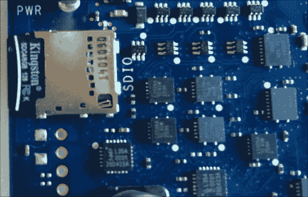

然后，使用以太网线将板子连接到您的局域网，并将板子的电源插头插入以打开板子并启动它。您会注意到标有**SD**的矩形板上 LED 指示灯表示 microSD 卡正在活动中。等待大约 30 秒以确保板子完成启动过程。您会注意到在启动过程完成后，标有**SD**的 LED 停止闪烁。

# 获取板子的分配 IP 地址

板子已经使用 Yocto Linux microSD 卡完成了启动过程，并通过以太网端口连接到我们的局域网。DHCP 服务器已为板子分配了一个 IP 地址，我们需要知道它以便在 Yocto Linux 控制台上运行命令。我们有多种方法可以获取板子的分配 IP 地址。我们将探讨不同的选项，您可以根据您的局域网配置选择最方便的一个。

如果开发板连接到无线路由器的一个以太网端口，并且我们可以访问路由器的 Web 界面，我们可以轻松地知道分配给开发板的 IP 地址。一些路由器的 Web 界面会显示有线客户端列表。由于我们的开发板是通过以太网线连接的，它将被列为有线客户端之一，设备的 MAC 地址将与板上的以太网外壳上的粘性标签上的 MAC 地址打印机匹配。以下图片显示了路由器 Web 界面中的有线客户端列表，列表中包括一个名为**galileo**的设备，其 MAC 地址为**A1-B2-C3-D4-E5-F6**，这与板上打印不带连字符（-）的 MAC 地址**A1B2C3D4E5F6**相匹配。分配给开发板的 IP 地址是**192.168.1.104**。出于安全原因，原始 MAC 地址已被擦除，我们在这个例子中使用了一个假 MAC 地址。

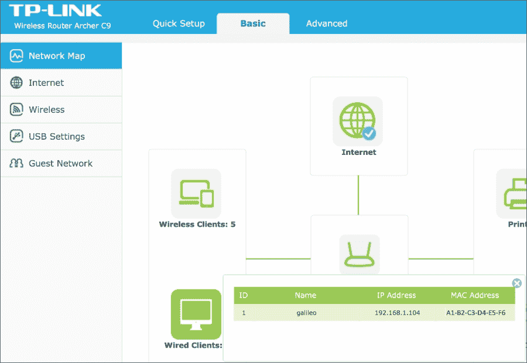

有时，路由器的 Web 界面不提供显示有线客户端列表的选项。如果我们的路由器是这样的，我们总是能够检索提供所有连接到局域网的无线或有线设备分配的 IP 地址的 DHCP 客户端列表。我们只需要找到具有板 MAC 地址的设备。以下图片显示了路由器 Web 界面中的 DHCP 客户端列表，列表中包括一个名为**galileo**的设备，其 MAC 地址为**A1-B2-C3-D4-E5-F6**，这与板上打印不带连字符（-）的 MAC 地址**A1B2C3D4E5F6**相匹配。分配给开发板的 IP 地址是**192.168.1.104**。

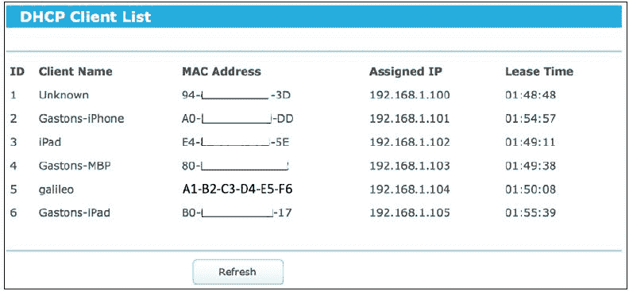

另一个选项是安装 Bonjour 浏览器，通过这种零配置网络实现自动发现板及其在局域网上的服务，而无需知道分配给板的 IP 地址。

在 Windows 中，从[`hobbyistsoftware.com/bonjourbrowser`](http://hobbyistsoftware.com/bonjourbrowser)下载、安装并启动免费的 Windows Bonjour 浏览器。该应用程序将显示许多可用的 Bonjour 服务，其中**galileo**为它们的名称。以下截图显示了以**_ssh._tcp**服务类型和**galileo**名称选中的详细信息。**IP 地址**部分显示了 SSH 服务的 IP 地址和端口号：**192.168.1.105:22**。我们可以使用任何 SSH 客户端的 IP 地址来连接到板。此外，Bonjour 浏览器还让我们知道板有一个 SFTP 服务，这将使我们能够轻松地从运行在板上的 Yocto Linux 传输和接收文件。

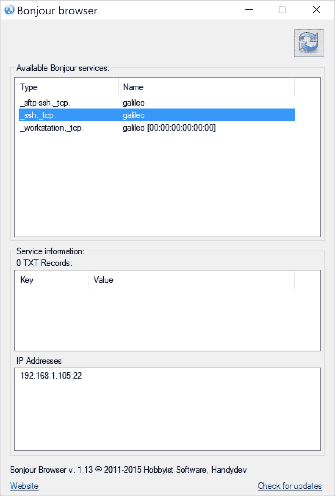

在 OS X 中，从[`www.tildesoft.com`](http://www.tildesoft.com)下载并运行免费的 Bonjour 浏览器。您可以点击**重新加载服务**来刷新发现的设备和它们的服务。以下图片显示了 Bonjour 浏览器中列出的板子和其服务。您必须点击每个右箭头以展开每个列出的服务的详细信息。在这种情况下，所有服务都由名为**galileo**的同一设备提供。一旦展开设备，应用程序将显示 IPv4 和 IPv6 地址。**SSH (_ssh._tcp.)**服务类型列出了一个名为**galileo**的设备，其 IPv4 地址为**192.168.1.105**，端口号为**22**。我们可以使用该 IP 地址和任何 SSH 客户端连接到板子。Bonjour 浏览器还显示了 SFTP 服务的详细信息。

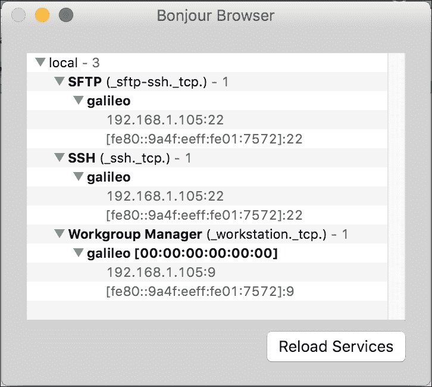

### 小贴士

SSH 代表安全外壳协议，其默认端口是 22。Yocto Linux 在默认端口运行 SSH 服务器，因此，在 SSH 客户端中无需指定端口，我们只需指定发现的 IP 地址即可。

# 连接到板子的操作系统

现在，我们需要使用 SSH 客户端连接到板子上运行的 Yocto Linux 并更新一些我们将用于与板子组件和功能交互的库。OS X 和 Linux 都包含终端中的`ssh`命令。但是，Windows 不包括`ssh`命令，我们必须安装一个 SSH 客户端。

在 Windows 中，我们可以使用免费的开源 PuTTY SSH 和 telnet 客户端。但是，如果您在 Windows 中更喜欢其他 SSH 客户端，您可以使用任何其他软件。我们在终端中执行的命令将取决于我们使用的 SSH 客户端。

您可以从[`www.putty.org`](http://www.putty.org)或[`www.chiark.greenend.org.uk/~sgtatham/putty/download.html`](http://www.chiark.greenend.org.uk/~sgtatham/putty/download.html)下载并安装 PuTTY。安装后，启动它并确保您允许 Windows 防火墙或任何其他已安装的防火墙打开必要的端口以建立连接。您将根据 Windows 上运行的防火墙软件看到弹出的警告。

启动 PuTTY 后，应用程序将显示**PuTTY 配置**对话框。在**主机名（或 IP 地址）**文本框中输入分配给您的板的 IP 地址，并将**端口**值保留为其默认的**22**值。以下图片显示了设置以连接到分配 IP 为**192.168.1.105**的板的对话框。您可以保留默认设置。但是，您绝对应该更改**窗口 | 外观**设置以更改默认字体。

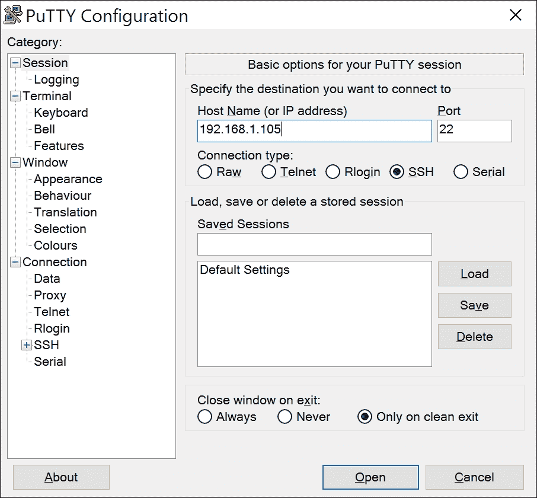

点击 **打开**，第一次建立连接时；PuTTY 将显示一个安全警报，因为服务器的主机密钥未缓存在注册表中。您信任您的板和运行在其上的 Yocto Linux，因此只需点击 **是**。以下图片显示了安全警报。

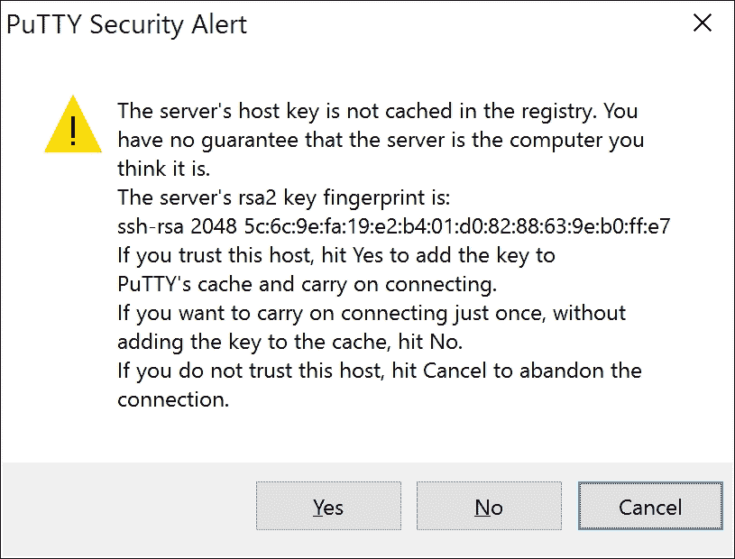

PuTTY 将显示一个新窗口，具体是一个包含 IP 地址的终端窗口。您将看到以下消息，要求您输入登录用户。

```py
login as:
```

输入 **root** 并按 *Enter*。您将以 `root` 用户登录，在 Yocto Linux 的默认配置中，该用户不需要密码。现在，您可以运行任何 shell 命令。例如，您可以使用以下命令来检查已安装的 python 版本：

```py
python --version
```

以下图片显示了以 root 登录并运行了一些命令的 PuTTY 终端窗口：


在 OS X 和 Linux 上，您可以通过打开 **终端** 并运行 `ssh` 命令来连接到板上的 Yocto Linux。您必须输入 `ssh` 后跟一个空格，用户名，一个箭头（@），然后是 IP 地址。在这种情况下，我们想以 `root` 作为用户名进行连接，因此我们将输入 `ssh` 后跟一个空格，`root@`，然后是 IP 地址。以下命令适用于在 `192.168.1.105` IP 地址和端口号 22 上运行 SSH 服务器的板。您必须将 `192.168.1.105` 替换为您检索到的 IP 地址。

```py
ssh root@192.168.1.105
```

第一次建立连接时，`ssh` 命令将显示一个安全警报，因为无法验证主机的真实性。您信任您的板和运行在其上的 Yocto Linux，因此对类似以下问题的回答是 **yes** 并按 *Enter*。

```py
The authenticity of host '192.168.1.105 (192.168.1.105)' can't be established.
ECDSA key fingerprint is SHA256:Ln7j/g1Np4igsgaUP0ujFC2PPcb1pnkLD8Pk0AK+Vow.
Are you sure you want to continue connecting (yes/no)?
```

在您回答 **yes** 并按 *Enter* 后，`ssh` 命令将显示类似于以下行的一条消息：

```py
Warning: Permanently added '192.168.1.105' (ECDSA) to the list of known hosts.
```

在 Yocto Linux 的默认配置中，您将以 `root` 用户登录，该用户不需要密码。现在，您可以运行任何 shell 命令。例如，您可以使用以下命令来检查已安装的 Python 版本。

```py
python --version
```

注意，当您看到以下提示 **root@galileo:~#** 时，这意味着您的所有命令都在板上的 Yocto Linux 上运行，而不是在您的 OS X 终端或 Linux 终端上。以下图片显示了登录为 `root` 并运行了一些命令的 OS X **终端** 窗口：

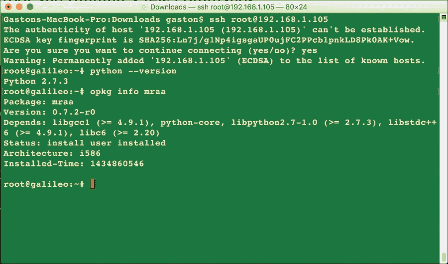

### 小贴士

板上启动的 Yocto Linux 预装了 Python 2.7.3。

我们还可以在移动设备上运行任何 SSH 客户端，例如平板电脑或智能手机。有许多为 iOS 和 Android 开发的 SSH 客户端。使用与蓝牙键盘连接的平板电脑工作，并轻松在 SSH 客户端中运行命令是可能的。

# 安装和升级必要的库以与板子交互

现在，我们将在 SSH 客户端运行许多命令。在运行命令之前，请确保你的 SSH 客户端已连接到板上运行的 Yocto Linux SSH 服务器，如前述章节所述。特别是，如果你在使用 OS X 或 Linux，你必须确保你不在你的计算机上运行命令，而是在远程 shell 上执行此操作。很简单，只需确保在运行任何命令之前，你总是看到提示**root@galileo:~#**。

### 小贴士

你的板应该连接到具有互联网访问的 LAN，因为我们将从互联网下载内容。

我们将使用`opkg`工具下载并安装`mraa`和`upm`库的更新版本。`mraa`库，也称为`libmraa`，是一个低级别的 C/C++库，具有与 Python 的绑定，使我们能够与 Intel Galileo Gen 2 板和其他支持平台上的 I/O 功能进行接口。`upm`库为我们可以连接到`mraa`库支持的平台上的传感器和执行器提供高级接口。`upm`库简化了与传感器和执行器的工作，并包括 Python 的绑定。在接下来的章节中，我们将使用这两个库，因此，我们希望安装它们的最新版本。

`opkg`工具是一个轻量级的包管理器，它允许我们轻松下载和安装 OpenWrt 包。OpenWrt 是一种嵌入式设备的 Linux 发行版。首先，我们将使用`opkg`工具检查 mraa 和 upm 的安装版本。

运行以下命令以检查已安装的 mraa 版本：

```py
opkg info mraa
```

以下行显示了 mraa 包的版本和依赖项的输出。在这种情况下，输出显示安装的 mraa 版本为**0.7.2-r0**。

```py
Package: mraa
Version: 0.7.2-r0
Depends: libgcc1 (>= 4.9.1), python-core, libpython2.7-1.0 (>= 2.7.3), libstdc++6 (>= 4.9.1), libc6 (>= 2.20)
Status: install user installed
Architecture: i586
Installed-Time: 1434860546
```

运行以下命令以检查已安装的 upm 版本：

```py
opkg info upm
```

以下行显示了 upm 包的版本和依赖项的输出。在这种情况下，输出显示安装的 upm 版本为**0.3.1-r0**。

```py
Package: upm
Version: 0.3.1-r0
Depends: libgcc1 (>= 4.9.1), libpython2.7-1.0 (>= 2.7.3), libc6 (>= 2.20), python-core, libstdc++6 (>= 4.9.1), mraa (>= 0.7.2)
Status: install user installed
Architecture: i586
Installed-Time: 1434860596
```

运行以下命令以检查 mraa 和 upm 库的存储库配置。

```py
cat /etc/opkg/mraa-upm.conf
```

如果你看到以下行作为响应，这意味着存储库已配置为使用 1.5 版本，我们需要更改其配置，以便更新 mraa 和 upm 库到最新版本。

```py
src mraa-upm http://iotdk.intel.com/repos/1.5/intelgalactic
```

运行以下命令以配置存储库，使 mraa 和 upm 库与版本 2.0 而不是 1.5 一起工作：

```py
echo "src mraa-upm http://iotdk.intel.com/repos/2.0/intelgalactic" > /etc/opkg/mraa-upm.conf
```

现在，运行以下命令以检查 mraa 和 upm 库的存储库配置，你将注意到输出中已将`1.5`替换为`2.0`。

```py
cat /etc/opkg/mraa-upm.conf
```

你应该看到下一行显示的结果：

```py
src mraa-upm http://iotdk.intel.com/repos/2.0/intelgalactic
```

我们将使用 `opkg` 工具从之前配置的位于互联网上的仓库更新软件包。运行以下命令以使 `opkg` 工具在更改了 mraa 和 upm 库的仓库配置后更新可用软件包列表。

```py
opkg update
```

之前的命令将生成以下输出，指示已更新的可用软件包列表。请注意，输出中的最后几行指示命令已从 `http://iotdk.intel.com/repos/2.0/intelgalactic/Packages` 下载，并将可用软件包保存在 `/var/lib/opkg/mraa-upm`。

```py
Downloading http://iotdk.intel.com/repos/1.5/iotdk/all/Packages.
Updated list of available packages in /var/lib/opkg/iotdk-all.
Downloading http://iotdk.intel.com/repos/1.5/iotdk/i586/Packages.
Updated list of available packages in /var/lib/opkg/iotdk-i586.
Downloading http://iotdk.intel.com/repos/1.5/iotdk/quark/Packages.
Updated list of available packages in /var/lib/opkg/iotdk-quark.
Downloading http://iotdk.intel.com/repos/1.5/iotdk/x86/Packages.
Updated list of available packages in /var/lib/opkg/iotdk-x86.
Downloading http://iotdk.intel.com/repos/2.0/intelgalactic/Packages.
Updated list of available packages in /var/lib/opkg/mraa-upm.

```

运行以下命令以检查存储在 `/var/lib/opkg/mraa-upm` 中的 mraa 和 upm 库的版本。

```py
cat /var/lib/opkg/mraa-upm
```

以下行显示结果。请注意，版本号可能会变化，因为 mraa 和 upm 库都是非常活跃的项目，并且它们经常更新。因此，当你运行之前的命令时，版本号可能会更高。

```py
Package: mraa
Version: 0.9.0
Provides: mraa-dev, mraa-dbg, mraa-doc
Replaces: mraa-dev, mraa-dbg, mraa-doc, libmraa, libmraa-dev, libmraa-doc
Conflicts: mraa-dev, mraa-dbg, mraa-doc
Section: libs
Architecture: i586
Maintainer: Intel IoT-Devkit
MD5Sum: b92167f26a0dc0dba4d485b7bedcfb47
Size: 442236
Filename: mraa_0.9.0_i586.ipk
Source: https://github.com/intel-iot-devkit/mraa
Description:  mraa built using CMake
Priority: optional

Package: upm
Version: 0.4.1
Depends: mraa (>= 0.8.0)
Provides: upm-dev, upm-dbg, upm-doc
Replaces: upm-dev, upm-dbg, upm-doc
Conflicts: upm-dev, upm-dbg, upm-doc
Section: libs
Architecture: i586
Maintainer: Intel IoT-Devkit
MD5Sum: 13a0782e478f2ed1e65b33249be41424
Size: 16487850
Filename: upm_0.4.1_i586.ipk
Source: https://github.com/intel-iot-devkit/upm
Description:  upm built using CMake
Priority: optional
```

在这种情况下，我们有 mraa 版本 **0.9.0** 和 upm 版本 **0.4.1**。版本号高于最初安装的版本。我们肯定希望将 mraa **0.7.2-r0** 升级到 **0.9.0**，将 upm **0.3.1-r0** 升级到 0.4.1。如前所述的行所示，upm 依赖于 mraa 版本 0.8.0 或更高版本，因此我们将首先升级 mraa。

运行以下命令以安装 mraa 库的最新可用版本：

```py
opkg install mraa
```

以下行显示结果：

```py
Upgrading mraa from 0.7.2-r0 to 0.9.0 on root.
Downloading http://iotdk.intel.com/repos/2.0/intelgalactic/mraa_0.9.0_i586.ipk.
Removing package mraa-dev from root...
Removing package mraa-doc from root...
Removing obsolete file /usr/lib/libmraa.so.0.7.2.
Removing obsolete file /usr/bin/mraa-gpio.
Configuring mraa.
```

运行以下命令以安装 upm 库的最新可用版本：

```py
opkg install upm
```

以下行显示一些结果行和最后一行。请注意，包安装会删除大量过时的文件：

```py
Upgrading upm from 0.3.1-r0 to 0.4.1 on root.
Downloading http://iotdk.intel.com/repos/2.0/intelgalactic/upm_0.4.1_i586.ipk.
Removing package upm-dev from root...
Removing obsolete file /usr/lib/libupm-wt5001.so.0.3.1.
Removing obsolete file /usr/lib/libupm-adc121c021.so.0.3.1.
Removing obsolete file /usr/lib/libupm-joystick12.so.0.3.1.
Removing obsolete file /usr/lib/libupm-grove.so.0.3.1.
Removing obsolete file /usr/lib/libupm-tm1637.so.0.3.1.
…
Removing obsolete file /usr/lib/libupm-groveloudness.so.0.3.1.
Configuring upm.
```

现在，运行以下命令以检查已安装的 mraa 版本：

```py
opkg info mraa
```

以下行显示带有版本和依赖项的 mraa 包的输出。前几行显示 mraa 版本 **0.7.2-r0** 已不再安装，而突出显示的行显示已安装 mraa 版本 **0.9.0**。

```py
Package: mraa
Version: 0.7.2-r0
Depends: libgcc1 (>= 4.9.1), python-core, libpython2.7-1.0 (>= 2.7.3), libstdc++6 (>= 4.9.1), libc6 (>= 2.20)
Status: unknown ok not-installed
Section: libs
Architecture: i586
Maintainer: Intel IoT Devkit team <meta-intel@yoctoproject.org>
MD5Sum: b877585652e4bc34c5d8b0497de04c4f
Size: 462242
Filename: mraa_0.7.2-r0_i586.ipk
Source: git://github.com/intel-iot-devkit/mraa.git;protocol=git;rev=299bf5ab27191e60ea0280627da2161525fc8990
Description: Low Level Skeleton Library for Communication on Intel platforms  Low
 Level Skeleton Library for Communication on Intel platforms.

Package: mraa
Version: 0.9.0
Provides: mraa-dev, mraa-dbg, mraa-doc
Replaces: mraa-dev, mraa-dbg, mraa-doc, libmraa, libmraa-dev, libmraa-doc
Conflicts: mraa-dev, mraa-dbg, mraa-doc
Status: install user installed
Section: libs
Architecture: i586
Maintainer: Intel IoT-Devkit
MD5Sum: b92167f26a0dc0dba4d485b7bedcfb47
Size: 442236
Filename: mraa_0.9.0_i586.ipk
Source: https://github.com/intel-iot-devkit/mraa
Description: mraa built using CMake
Installed-Time: 1452800349
```

运行以下命令以检查已安装的 upm 版本：

```py
opkg info upm
```

以下行给出带有版本和依赖项的 upm 包的输出。前几行显示 upm 版本 **0.3.1-r0** 已不再安装，而突出显示的行显示已安装 upm 版本 **0.4.1**。

```py
Package: upm
Version: 0.3.1-r0
Depends: libgcc1 (>= 4.9.1), libpython2.7-1.0 (>= 2.7.3), libc6 (>= 2.20), python-core, libstdc++6 (>= 4.9.1), mraa (>= 0.7.2)
Status: unknown ok not-installed
Section: libs
Architecture: i586
Maintainer: Intel IoT Devkit team <meta-intel@yoctoproject.org>
MD5Sum: 9c38c6a23db13fbeb8c687336d473200
Size: 10344826
Filename: upm_0.3.1-r0_i586.ipk
Source: git://github.com/intel-iot-devkit/upm.git;protocol=git;rev=3d453811fb7760e14da1a3461e05bfba1893c2bd file://0001-adafruitms1438-CMakeLists.txt-stop-RPATH-being-added.patch
Description: Sensor/Actuator repository for Mraa  Sensor/Actuator repository for Mraa.

Package: upm
Version: 0.4.1
Depends: mraa (>= 0.8.0)
Provides: upm-dev, upm-dbg, upm-doc
Replaces: upm-dev, upm-dbg, upm-doc
Conflicts: upm-dev, upm-dbg, upm-doc
Status: install user installed
Section: libs
Architecture: i586
Maintainer: Intel IoT-Devkit
MD5Sum: 13a0782e478f2ed1e65b33249be41424
Size: 16487850
Filename: upm_0.4.1_i586.ipk
Source: https://github.com/intel-iot-devkit/upm
Description: upm built using CMake
Installed-Time: 1452800568
```

现在，我们已经安装了 mraa 和 upm 库的最新版本，我们将能够从任何 Python 程序中使用它们。

# 安装 pip 和附加库

默认情况下，`pip` 包管理系统，它使得安装和管理用 Python 编写的软件包变得容易，并未安装。我们将使用 Python 作为我们的主要编程语言，因此，我们肯定会从安装 `pip` 中受益。

输入以下 `curl` 命令，从 `https://bootstrap.pypa.io` 下载 `get-pip.py` 文件到当前文件夹。

```py
curl -L "https://bootstrap.pypa.io/get-pip.py" > get-pip.py
```

您将看到类似以下行的输出，这将指示下载进度：

```py
  % Total    % Received % Xferd  Average Speed   Time    Time     Time  Current
                                 Dload  Upload   Total   Spent    Left  Speed
100 1379k  100 1379k    0     0   243k      0  0:00:05  0:00:05 --:--:--  411k
```

下载完成后，运行`python`并带上`get-pip.py`作为参数。

```py
python get-pip.py
```

您将看到类似以下行的输出，这将指示安装进度以及与 SSLContext 相关的一些警告。不要担心这些警告。

```py
Collecting pip
/tmp/tmpe2ukgP/pip.zip/pip/_vendor/requests/packages/urllib3/util/ssl_.py:90: InsecurePlatformWarning: A true SSLContext object is not available. This prevents urllib3 from configuring SSL appropriately and may cause certain SSL connections to fail. For more information, see https://urllib3.readthedocs.org/en/latest/security.html#insecureplatformwarning.
  Downloading pip-7.1.2-py2.py3-none-any.whl (1.1MB)
    100% |################################| 1.1MB 11kB/s 
Collecting wheel
  Downloading wheel-0.26.0-py2.py3-none-any.whl (63kB)
    100% |################################| 65kB 124kB/s 
Installing collected packages: pip, wheel
Successfully installed pip-7.1.2 wheel-0.26.0
/tmp/tmpe2ukgP/pip.zip/pip/_vendor/requests/packages/urllib3/util/ssl_.py:90: InsecurePlatformWarning: A true SSLContext object is not available. This prevents urllib3 from configuring SSL appropriately and may cause certain SSL connections to fail. For more information, see https://urllib3.readthedocs.org/en/latest/security.html#insecureplatformwarning.
```

现在，我们可以使用`pip`安装程序轻松地安装额外的 Python 2.7.3 软件包。我们将使用`pip`安装程序从 Python 包索引 PyPI 获取`wiring-x86`软件包，并安装它。`wiring-x86`软件包是一个 Python 模块，它提供了一个类似于 WiringPi 模块的简单 API，用于在 Intel Galileo Gen 2 板和其他支持的平台上的通用 I/O 引脚上使用。我们只需运行以下命令来安装软件包：

```py
pip install wiring-x86
```

输出的最后几行将指示`wiring-x86`软件包已成功安装。不要担心与构建`wiring-x86`轮相关的错误消息。

```py
Installing collected packages: wiring-x86
  Running setup.py install for wiring-x86
Successfully installed wiring-x86-1.0.0
```

# 调用 Python 解释器

我们已经安装了与 Intel Galileo Gen 2 板中包含的功能交互所需的最重要库的最新版本。现在，我们可以通过输入经典命令来调用 Python 解释器：

```py
python
```

现在，输入以下两行 Python 代码：

```py
import mraa
mraa.getVersion()
```

Python 解释器将显示以下输出：

```py
'v0.9.0'
```

我们导入了`mraa`库，并调用了`mraa.getVersion`方法来检查 Python 是否能够检索已安装的`mraa`库版本。调用该方法的结果显示了为`mraa`库安装的版本，因此我们知道 Python 将使用我们期望的版本。请注意，Python 代码是在 Intel Galileo Gen 2 板上的 Yocto Linux 上运行的。

现在，输入以下行来检查`mraa`库是否已成功检测到板类型：

```py
mraa.getPlatformName()
```

Python 解释器将显示以下输出：

```py
'Intel Galileo Gen 2'
```

我们调用了`mraa.getPlatformName`方法，调用该方法的结果显示了我们的板名：Intel Galileo Gen 2。以下截图显示了调用先前方法的结果：

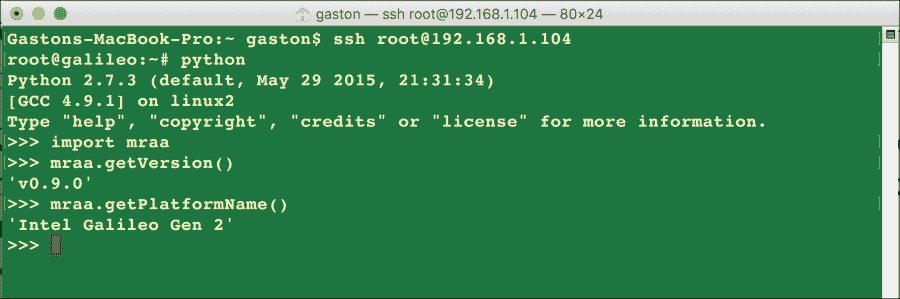

现在，在任何连接到你的局域网中的计算机或设备上打开一个 Web 浏览器，并输入板分配的 IP 地址。例如，如果 IP 地址是**192.168.1.104**，将其作为 URL 进行浏览。以下截图显示了您将在 Web 浏览器中看到的内容：**它工作了！**


该板正在作为 Web 服务器运行，并将`/www/pages/index.html`文件的 内容返回给 Web 浏览器的请求。

# 测试你的知识

1.  我们可以在 Intel Galileo Gen 2 板上访问 Python 2.7.x：

    1.  在从闪存启动预安装的 SPI 镜像后。

    1.  在从 microSD 卡启动 Yocto Linux 后，特别是 IoT Devkit 镜像。

    1.  在启动预安装的 SPI 镜像并按重启按钮三次后。

1.  一旦 Intel Galileo Gen 2 板连接到我们的局域网，我们就可以使用任何允许我们使用以下接口和协议的实用程序来访问它的 shell：

    1.  SSH.

    1.  Telnet.

    1.  X.25.

1.  以下哪个库提供了与 Python 的绑定，并允许我们在 Intel Galileo Gen 2 上处理 I/O：

    1.  IotGalileoGen2.

    1.  Mraa.

    1.  Mupm.

1.  以下哪个包是一个 Python 模块，它提供了一个类似于 WiringPi 模块的 API，用于在 Intel Galieo Gen 2 上使用通用 I/O 引脚：

    1.  wiring-py-galileo.

    1.  galileo-gen2-x86.

    1.  wiring-x86.

1.  以下哪种方法可以返回 mraa 库自动检测到的板：

    1.  mraa.getPlatformName().

    1.  mraa.getBoardName().

    1.  mraa.getGalileoBoardName().

# 摘要

在本章中，我们遵循了许多程序，使得可以使用 Python 作为主要编程语言，用我们的 Intel Galileo Gen 2 板创建物联网项目。我们将 Linux Yocto 镜像写入到 microSD 卡中，并配置了板子使其能够启动这个镜像，这样我们就可以访问 Python 和其他有用的库来与板子交互。我们更新了许多库以使用它们的最新版本，并启动了 Python 解释器。

现在我们已经准备好用 Python 编写代码的板，我们可以开始将电子组件连接到板上，并使用 Python 和库来写入数字值，这是下一章的主题。
