# 第三章：使用 Python 与数字输出交互

在本章中，我们将使用 Python 和两个库：`mraa`和`wiring-x86`来处理数字输入。我们将：

+   将英特尔 Galileo Gen 2 和带有电子组件的面包板之间的第一个连接线焊接好

+   编写一个 Python 脚本的第一个版本，用于控制连接到板上的电子组件的开关

+   将 Python 代码传输到板上的 Yocto Linux 操作系统

+   执行与板交互的 Python 脚本

+   学习利用 Python 的面向对象特性来改进代码并使其更容易理解

+   准备代码，使其易于构建一个 API，允许我们与物联网设备交互

# 打开和关闭板载组件

首先，我们将利用板载 LED（发光二极管）来编写我们的第一条 Python 代码，这些代码将与我们包含在英特尔 Galileo Gen 2 板中的数字输出功能进行交互。这个简单的例子将帮助我们理解`mraa`库如何使我们能够通过 Python 代码轻松地打开和关闭板载组件之一。

在上一章中，我们识别了英特尔 Galileo Gen 2 板中包含的不同元素。我们知道有三个矩形 LED 位于 USB 2.0 主机连接器的右侧。第一个 LED，标记为**L**，连接到数字 I/O 引脚的 13 号引脚，因此，向 13 号引脚发送高电平将打开此 LED，而低电平将关闭它。

我们将编写几行 Python 代码，使用`mraa`库使标记为**L**的板载 LED 重复以下循环，直到 Python 程序被中断：

+   打开

+   保持打开 3 秒钟

+   关闭

+   关闭 2 秒钟。

以下行显示了执行先前解释的操作的 Python 代码。示例代码文件为`iot_python_chapter_03_01.py`。

```py
import mraa
import time

if __name__ == "__main__":
    print ("Mraa library version: {0}".format(mraa.getVersion()))
    print ("Mraa detected platform name: {0}".format(mraa.getPlatformName()))

    # Configure GPIO pin #13 to be an output pin
    onboard_led = mraa.Gpio(13)
    onboard_led.dir(mraa.DIR_OUT)

    while True:
        # Turn on the onboard LED
        onboard_led.write(1)
        print("I've turned on the onboard LED.")
        # Sleep 3 seconds
        time.sleep(3)
        # Turn off the onboard LED
        onboard_led.write(0)
        print("I've turned off the onboard LED.")
        time.sleep(2)
```

### 提示

有关下载代码包的详细步骤，请参阅本书的序言。请查看。

书籍的代码包也托管在 GitHub 上，网址为[`github.com/PacktPublishing/Internet-of-Things-with-Python`](https://github.com/PacktPublishing/Internet-of-Things-with-Python)。我们还有其他丰富的书籍和视频的代码包，可在[`github.com/PacktPublishing/`](https://github.com/PacktPublishing/)找到。请查看它们！

在上一章中，我们了解到在板上运行的 Yocto Linux 通过运行 Bonjour 浏览器提供了**SSH**和**SFTP**（简称**SSH 文件传输协议**或**安全文件传输协议**）服务。我们可以使用任何 SFTP 客户端连接到板并传输我们在任何计算机或移动设备上创建的文件。当然，我们也可以在 SSH 终端中使用任何 Linux 编辑器，如`vi`，或者在 Python 解释器中直接输入代码。然而，通常在计算机或移动设备上使用我们喜欢的编辑器或 IDE 然后使用任何 SFTP 客户端将文件传输到板会更方便。

### 小贴士

一些 Python IDE 具有远程开发功能，并允许我们轻松传输必要的文件并在板上启动它们的执行。一个例子是 JetBrains PyCharm 的付费专业版。不幸的是，社区版不包括此功能。

我们不希望此过程与特定的 IDE 相关联，因此我们将使用 SFTP 客户端传输文件。FileZilla 客户端是一个免费、开源的多平台 FTP 客户端，支持 SFTP。您可以从这里下载和安装它：[`filezilla-project.org`](http://filezilla-project.org)。

一旦您安装并执行了 FileZilla 客户端，您必须按照以下步骤在应用程序的站点管理器中添加板上运行的 SFTP 服务器：

1.  选择**文件** | **站点管理器**。

1.  在**站点管理器**对话框中点击**新建站点**。输入所需名称，例如**IntelGalileo2**，以便轻松识别板的 SFTP 服务。

1.  在**主机**中输入板的 IP 地址。您不需要在**端口**中输入任何值，因为 SFTP 服务器使用默认的 SFTP 端口，即 SSH 守护进程监听的相同端口：端口 22。

1.  在协议下拉菜单中选择**SFTP - SSH 文件传输协议**。

1.  在**登录类型**下拉菜单中选择**正常**。

1.  在**用户**中输入**root**。下一张截图显示了 IP 地址分配为**192.168.1.107**的板的配置值。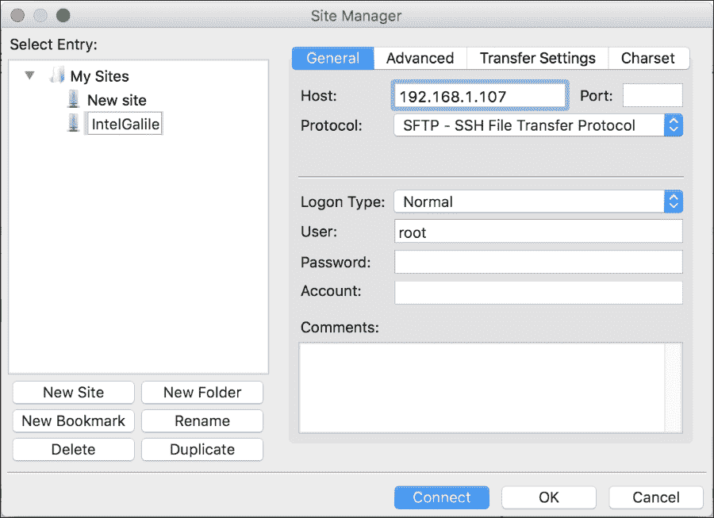

1.  点击**连接**。FileZilla 将显示一个未知主机密钥对话框，表明服务器的宿主密钥是未知的。这类似于您使用 SSH 客户端首次连接到板时提供的信息。详细信息包括宿主和指纹。激活**始终信任此主机，将此密钥添加到缓存**复选框，然后点击**确定**。

1.  FileZilla 将在窗口右侧的**远程站点**下显示 Yocto Linux 运行的`/home/root`文件夹。

1.  在**本地站点**下导航到您在本地计算机中保存要传输的 Python 文件的文件夹。

1.  选择您想要传输的文件，然后按*Enter*键将文件传输到板上的`/home/root`文件夹。另一种方法是右键单击所需的文件并选择**上传**。FileZilla 将在**远程站点**下的`/home/root`文件夹中显示上传的文件。这样，您将能够访问使用 SSH 终端登录时 Yocto Linux 默认位置中的 Python 文件，即您的`root`用户的家目录。以下图片显示了使用 FileZilla 上传到`/home/root`文件夹的许多 Python 文件，并列在`/home/root`文件夹的内容中。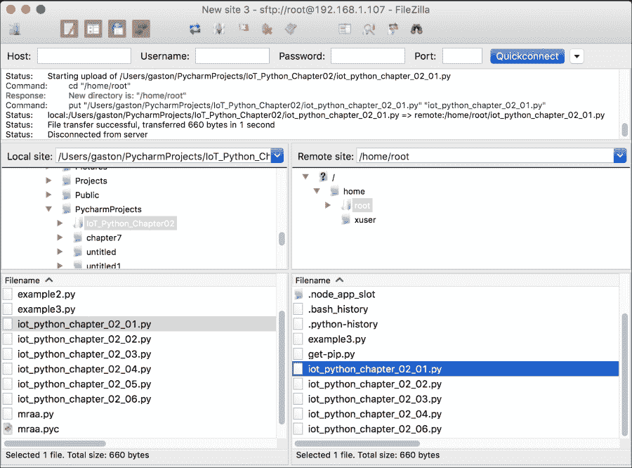

### 小贴士

随着您处理更多项目，您可能需要在`/home/root`下创建新的文件夹，以在 Yocto Linux 文件系统中为您的 Python 代码提供更好的组织。

下次您需要将文件上传到板上时，您不需要在**站点管理器**对话框中设置新的站点以建立 SFTP 连接。您只需选择**文件** | **站点管理器**，在**选择条目**下选择站点名称，然后点击**连接**。

如果您在登录后 SSH 终端中运行以下命令，Linux 将打印您的当前文件夹或目录：

```py
pwd
```

之前命令的结果将是上传 Python 代码文件的同一路径文件夹。

```py
/home/root
```

一旦我们将文件传输到板上，我们可以在板上的 SSH 终端使用以下命令运行之前的代码：

```py
python iot_python_chapter_03_01.py
```

之前的代码非常简单。我们使用了多个打印语句来使它更容易理解控制台上的消息。以下几行显示了运行几秒钟后的生成输出：

```py
Mraa library version: v0.9.0
Mraa detected platform name: Intel Galileo Gen 2
Setting GPIO Pin #13 to dir DIR_OUT
I've turned on the onboard LED.
I've turned off the onboard LED.
I've turned on the onboard LED.
I've turned off the onboard LED.
```

前几行打印了`mraa`库版本和检测到的平台名称。这样，我们就有了 Python 正在使用的`mraa`库版本的信息，并确保`mraa`库已经能够初始化自身并检测到正确的平台：Intel Galileo Gen 2。如果我们遇到特定问题，我们可以使用这些信息来检查与`mraa`库和检测到的平台相关的特定问题。

下一行创建了一个`mraa.Gpio`类的实例。**GPIO**代表**通用输入/输出**，`mraa.Gpio`类的实例代表板上的一个通用输入/输出引脚。在这种情况下，我们将`13`作为`pin`参数的参数，因此我们创建了一个代表板上 GPIO 引脚编号 13 的`mraa.Gpio`类的实例。我们将其命名为`onboard_led`，以便更容易理解该实例允许我们控制板载 LED 的状态。

```py
onboard_led = mraa.Gpio(13)
```

### 小贴士

我们只需指定引脚参数的值来初始化 `mraa.Gpio` 类的一个实例。还有两个额外的可选参数（`owner` 和 `raw`），但我们应该将它们保留为默认值。默认情况下，每次我们创建 `mraa.Gpio` 类的实例时，我们拥有该引脚，并且 `mraa` 库将在析构时关闭它。

如其名称所示，`mraa.Gpio` 类的一个实例允许我们以输入或输出方式工作于引脚。因此，为我们的 `mraa.Gpio` 实例指定所需的方向是必要的。在这种情况下，我们希望将引脚 13 用作输出引脚。以下行调用 `dir` 方法来配置引脚为输出引脚，即将其方向设置为 `mraa.DIR_OUT` 值。

```py
onboard_led.dir(mraa.DIR_OUT)
```

然后，代码无限循环运行，即直到你通过按 *Ctrl* + *C* 或在具有远程开发功能的 Python IDE 中使用停止按钮来中断执行为止。

`while` 循环内的第一行调用 `mraa.Gpio` 实例 `onboard_led` 的 `write` 方法，并将 `1` 作为 `value` 必需参数的参数。这样，我们向配置为数字输出的引脚 13 发送高值（`1`）。因为引脚 13 连有板上 LED，所以在引脚 13 中的高值会导致板上 LED 点亮。

```py
onboard_led.write(1)
```

在我们点亮 LED 后，一行代码使用 `print` 语句将消息打印到控制台输出，这样我们知道 LED 应该被点亮。使用 `time.sleep` 并将 `3` 作为 `seconds` 参数的值来延迟执行三秒钟。因为我们没有改变引脚 13 的状态，所以在这段延迟期间 LED 将保持点亮状态。

```py
time.sleep(3)
```

下一个行调用 `mraa.Gpio` 实例 `onboard_led` 的 `write` 方法，但这次将 `0` 作为 `value` 必需参数的参数。这样，我们向配置为数字输出的引脚 13 发送低值（`0`）。因为引脚 13 连有板上 LED，所以在引脚 13 中的低值会导致板上 LED 关闭。

```py
onboard_led.write(0)
```

在我们关闭 LED 后，一行代码使用 `print` 语句将消息打印到控制台输出，这样我们知道 LED 应该被关闭。使用 `time.sleep` 并将 `2` 作为 `seconds` 参数的值来延迟执行 2 秒钟。因为我们没有改变引脚 13 的状态，所以在这段延迟期间 LED 将保持关闭状态。然后，循环重新开始。

### 小贴士

由于我们可以使用任何 `ssh` 客户端来运行 Python 代码，因此我们可以看到控制台输出中的 `print` 语句的结果，这对我们理解数字输出应该发生什么非常有用。我们将在稍后利用 Python 中包含的更高级的日志功能来处理更复杂的情况。

如我们从上一个例子中学到的，`mraa`库封装了在`mraa.Gpio`类中与 GPIO 引脚一起工作的所有必要方法。之前的代码没有利用 Python 的面向对象特性，它只是与`mraa`库中包含的一个类进行了交互。在接下来的例子中，我们将利用许多 Python 特性。此外，一旦我们开始处理更复杂的例子，我们将使板通过网络进行交互。

# 使用面包板进行原型设计

在上一个例子中，我们与板载 LED 进行了交互，因此我们没有将任何额外的电子元件焊接在板上。现在，是时候转向更复杂的样本了，在这些样本中，我们将不得不开始使用额外的组件和工具。

我们不希望每次想要在板上焊接一些电子元件时都创建一个新的印刷电路板（PCB）并将电子元件焊接在板上。我们将通过这本书进行许多电子项目的原型设计，我们也会在每学完一课后继续进行原型设计，以迈向我们的物联网冒险。因此，我们将使用无焊面包板作为我们电子原型的构建基础。

### 小贴士

无焊面包板也被称为面包板、无焊插拔面包板或原型板。我们将用它们最简短的名字：面包板。

我们将使用带有 2 条电源线的 830 个接点（连接孔）的面包板来制作所有需要将电子元件焊接在板上的原型。以下图片展示了这种面包板，它由一块大约 6.5" x 2.1"的塑料块组成，上面有许多孔。

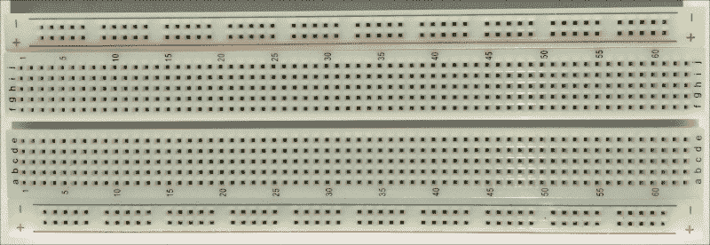

以下图片展示了带有 2 条电源线的 830 个接点面包板的内部连接。面包板内部有金属条，它们将孔连接起来，如图片所示。

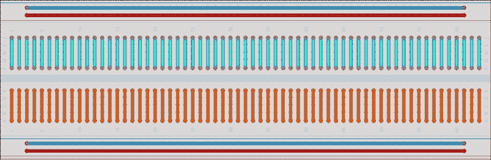

面包板在板子的顶部和底部提供了两条电源线，总线条或水平总线。这些电源线连接了同一行内的所有孔。每一列有五个行孔相连。

然而，我们必须小心，因为有一些类似的面包板会在中间打断电源线或水平总线，因此，电源线并没有连接同一行内的所有孔。以下图片展示了这类面包板的连接方式。

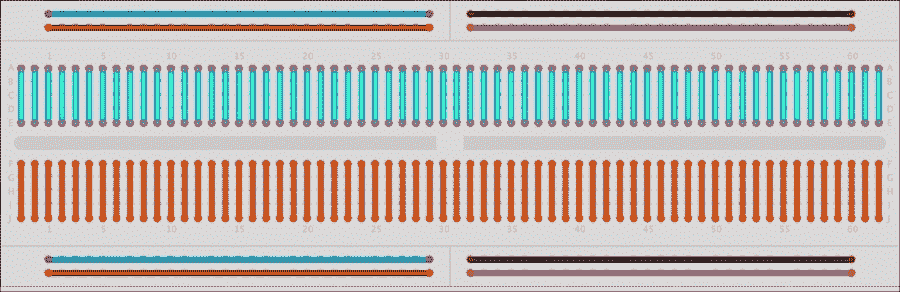

如果你决定使用这种面包板，你必须将以下连接做到总线上。这样，你将模仿第一个面包板中展示的电线。

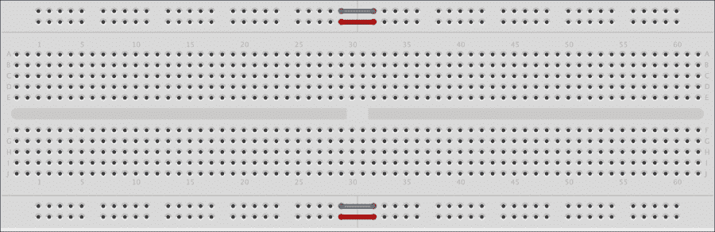

我们可以将没有绝缘层的线端插入面包板的孔中，以便接线元件。准备不同长度的跳线和使用不同颜色的电缆都很方便。以下图片显示了多种不同长度的电缆，它们将作为跳线使用。

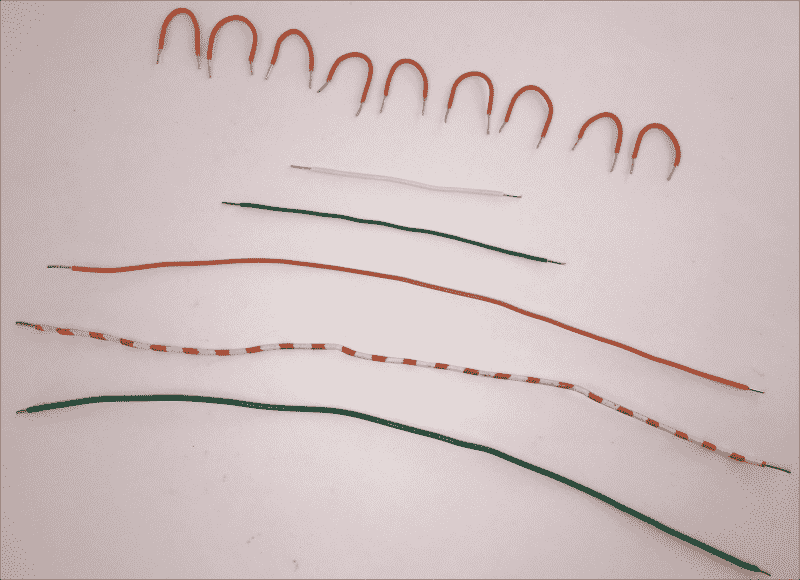

如果我们不希望花费时间制作自己的跳线，我们可以购买预先制作好的公对公无焊锡柔性面包板跳线，线端带有小插头。

### 小贴士

您可以使用之前解释过的任何选项来制作本书中我们将要工作的每个示例所需的连接。如果您决定使用公对公面包板跳线，请确保它们是高质量的。

# 使用原理图进行数字输出接线

现在，是时候利用面包板的原型制作能力，开始制作一个更复杂的示例了。我们将通过使用英特尔 Galileo Gen 2 板的 9 个数字输出，来点亮和熄灭 9 个 LED 灯。每个数字输出将控制一个 LED 灯的点亮或熄灭。

在完成必要的接线后，我们将编写 Python 代码，通过控制数字输出以点亮必要的 LED 灯来从 1 计数到 9。在这种情况下，我们的第一个方法可能不是最好的。然而，在学到了很多东西之后，我们将创建新的版本，并将对初始原型和 Python 代码进行改进。

我们需要以下部件来完成这个示例：

+   三个红色超亮 5mm LED 灯

+   三个白色超亮 5mm LED 灯

+   三个绿色超亮 5mm LED 灯

+   九个 5%容差的 270Ω电阻（红紫棕金）

下面的图示显示了连接到面包板上的组件、必要的接线以及从英特尔 Galileo Gen 2 板到面包板的接线。该示例的 Fritzing 文件为`iot_fritzing_chapter_03_02.fzz`，以下图片是面包板视图。

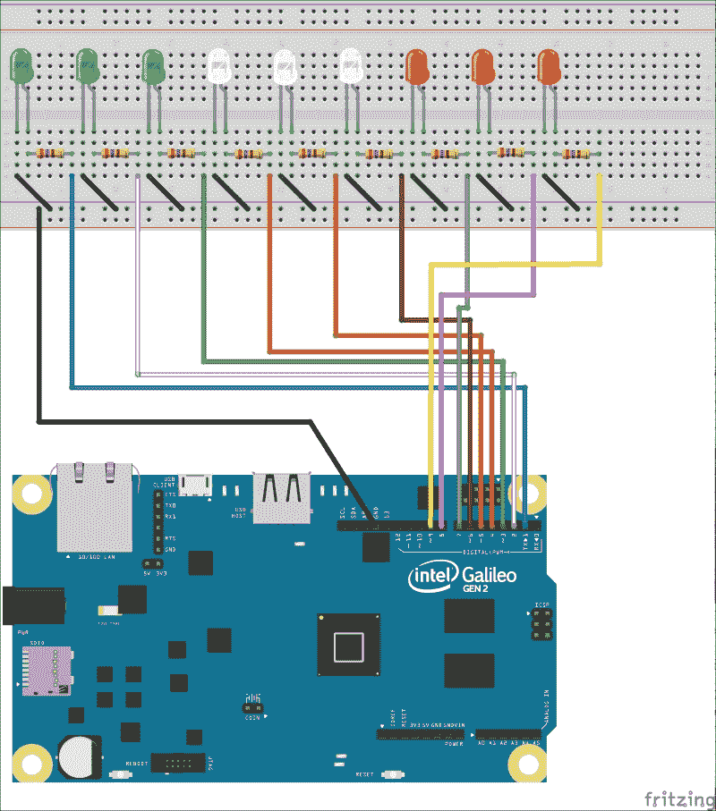

在这种情况下，我们决定将 GPIO 引脚号与 LED 号相匹配。这样，无论何时我们想要点亮 LED 1，我们就在 GPIO 引脚号 1 写入高（1）值，无论何时我们想要点亮 LED 2，我们就在 GPIO 引脚号 2 写入高（1）值，以此类推。稍后，我们会意识到这并不是最佳决定，因为由于板上引脚的位置，接线变得比预期的要复杂一些。然而，我们将在稍后分析这种情况，并基于从第一版学到的一切来创建这个示例的新版本。

以下图片显示了带有电子元件表示为符号的原理图。原理图使得理解 Intel Galileo Gen 2 板 GPIO 引脚和电子元件之间的连接变得更容易。显然，原理图得益于 GPIO 引脚号与 LED 号相匹配的事实，这将使得编写我们的第一个版本的代码变得容易。

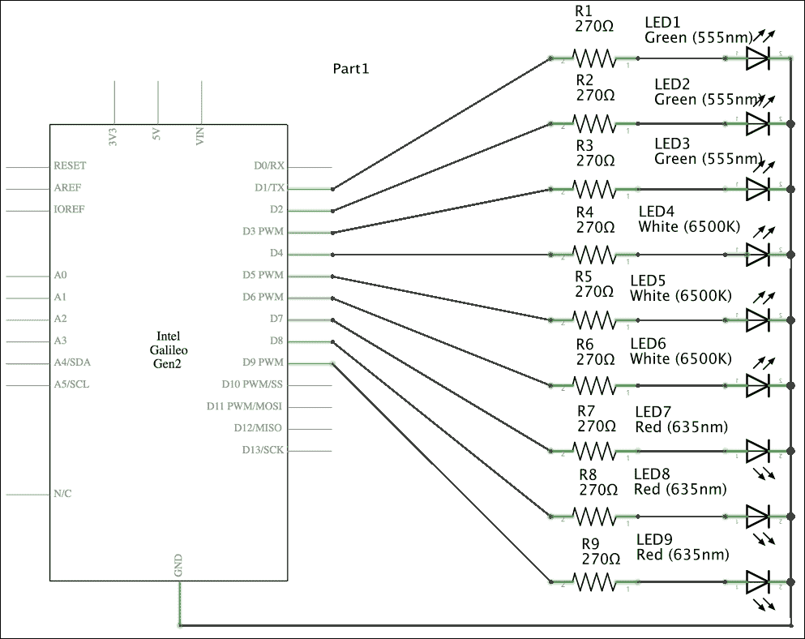

如前一个原理图所示，板上标记为**D1**到**D9**的每个 GPIO 引脚都连接到一个**270Ω**电阻，该电阻连接到 LED 的正极，每个 LED 的负极连接到地。这样，无论我们向哪个 GPIO 引脚写入高（1）值，板都会在该引脚上施加 5V，LED 将点亮。无论我们向哪个 GPIO 引脚写入低（0）值，板都会在该引脚上施加 0V，LED 将熄灭。

### 小贴士

由于我们将标记为**IOREF**的跳线留在了默认的 5V 位置，因此该板将以 5V 为其 GPIO 引脚供电。因此，当我们向其写入高值时，GPIO 引脚将具有 5V。如果我们将此跳线的位置更改为 3.3V，当我们向其写入高值时，GPIO 引脚将具有 3.3V。除非另有说明，否则我们在所有示例中都使用此跳线的默认位置。

现在，是时候将组件插入面包板并完成所有必要的布线了。

### 小贴士

总是关闭 Yocto Linux，等待所有板载 LED 熄灭，然后从 Intel Galileo Gen 2 板上拔掉电源供应，在添加或从板上的引脚移除任何电线之前。在插入或拔除任何屏蔽之前也这样做。

为了关闭 Yocto Linux，请在您的`ssh`终端中输入以下命令。确保在输入命令时已经退出了 Python 解释器。

```py
shutdown
```

上一个命令的结果将显示关闭过程将要开始的时间。消息将与以下输出类似，但日期和时间不同。

```py
Shutdown scheduled for Mon 2016-01-25 23:50:04 UTC, use 'shutdown -c' to cancel.
root@galileo:~# 
Broadcast message from root@galileo (Mon 2016-01-25 23:49:04 UTC):

The system is going down for power-off at Mon 2016-01-25 23:50:04 UTC!
```

然后，等待大约 1 分钟，直到操作系统关闭并且所有板载 LED 熄灭。此时，您可以安全地从板上拔掉电源供应。

在插入 LED 到面包板时，我们必须特别注意。正如我们可以在原理图中看到的那样，电阻连接到 LED 的正极，每个 LED 的负极连接到地。

我们可以很容易地识别 LED 的阳极，即其正极引脚，因为其引脚比另一个引脚稍长。LED 的阴极，即其负极引脚，比另一个引脚短。在以下图片中，LED 的阴极，即其负极引脚是位于左侧（较短的引脚）的引脚。LED 的阳极，即其正极引脚，是位于右侧（稍长的引脚）的引脚。你也可以注意到，连接到 LED 阳极，即其正极引脚的 LED 内部的金属部件比连接到 LED 阴极，即其负极引脚的金属部件小。

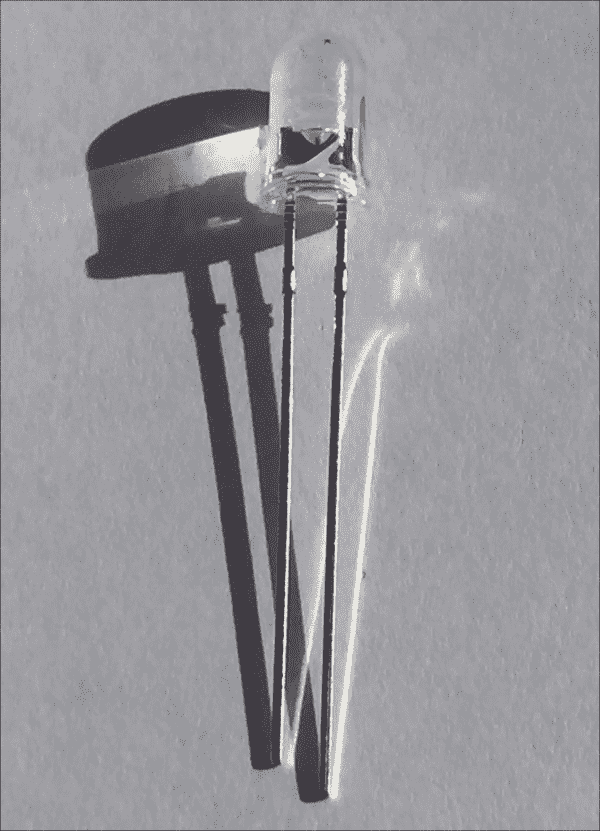

图片中的 LED 位于与之前显示的面包板图片中 LED 连接相同的位置。因此，我们必须在面包板上将较短的引脚连接在左侧，较长的引脚连接在右侧。下一张图片显示了面包板图片中的 LED 表示，包括其阴极和阳极。


以下图片显示了 LED 的原理图电子符号，其阴极和阳极的位置与之前显示面包板图片中的位置相同。


以下图片显示了所有连接到面包板的 LED。你可以根据通过 LED 塑料看到的金属部件来检查阴极和阳极。


以下图片显示了所有连接到面包板的 LED，你可以检查 LED 的连接方式与我们之前在 Fritzing 图中的面包板视图看到的一样。

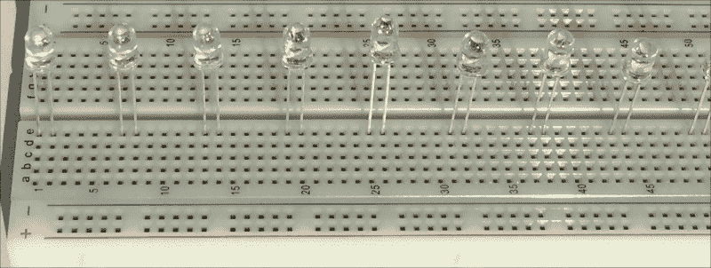

电阻正反方向相同，因此，在面包板上使用它们的方向无关紧要。以下图片显示了一个 270Ω轴向引脚电阻，公差为 5%。请注意，从左到右的颜色带是红色、紫色、棕色和金色。颜色带使我们能够知道电阻的欧姆值和它们的公差值，而无需测量电阻。

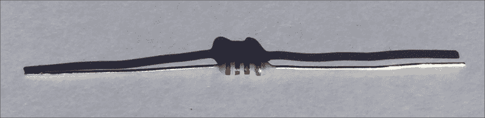

以下图片显示了连接到面包板的组件、必要的布线和从英特尔 Galileo Gen 2 板到面包板的布线。

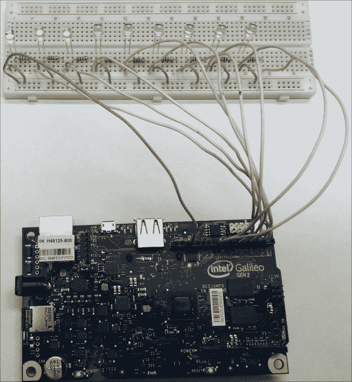

# 使用 LED、Python 代码和 mraa 库从 1 计数到 9

一旦我们完成布线并确保所有组件和电线都放置正确，我们就可以编写我们的第一个 Python 代码版本，用 LED 从 1 计数到 9，通过 SFTP 将其传输到板子上并执行它。

我们将编写几行 Python 代码，使用`mraa`库执行以下步骤从 1 计数到 9，每一步之间有 3 秒的暂停：

+   点亮 LED1

+   点亮 LED1 和 LED2

+   点亮 LED1、LED2 和 LED3

+   点亮 LED1、LED2、LED3 和 LED4

+   点亮 LED1、LED2、LED3、LED4 和 LED5

+   点亮 LED1、LED2、LED3、LED4、LED5 和 LED6

+   点亮 LED1、LED2、LED3、LED4、LED5、LED6 和 LED7

+   点亮 LED1、LED2、LED3、LED4、LED5、LED6、LED7 和 LED8

+   点亮 LED1、LED2、LED3、LED4、LED5、LED6、LED7、LED8 和 LED9

以下行显示了执行之前解释的操作的 Python 代码。示例的代码文件为`iot_python_chapter_03_02.py`。

```py
import mraa
import time

if __name__ == "__main__":
    print ("Mraa library version: {0}".format(mraa.getVersion()))
    print ("Mraa detected platform name: {0}".format(mraa.getPlatformName()))

    # Configure GPIO pins #1 to 9 to be output pins
    output = []
    for i in range(1, 10):
        gpio = mraa.Gpio(i)
        gpio.dir(mraa.DIR_OUT)
        output.append(gpio)

    # Count from 1 to 9
    for i in range(1, 10):
        print("==== Turning on {0} LEDs ====".format(i))
        for j in range(0, i):
            output[j].write(1)
            print("I've turned on the LED connected to GPIO Pin #{0}.".format(j + 1))
        time.sleep(3)
```

一旦我们将文件传输到板上，我们就可以在板上的 SSH 终端使用以下命令运行之前的代码：

```py
python iot_python_chapter_03_02.py
```

我们使用了多个`print`语句，以便通过控制台上的消息使我们更容易理解正在发生的事情。以下行显示了运行代码后生成的输出：

```py
Mraa library version: v0.9.0
Mraa detected platform name: Intel Galileo Gen 2
Setting GPIO Pin #1 to dir DIR_OUT
Setting GPIO Pin #2 to dir DIR_OUT
Setting GPIO Pin #3 to dir DIR_OUT
Setting GPIO Pin #4 to dir DIR_OUT
Setting GPIO Pin #5 to dir DIR_OUT
Setting GPIO Pin #6 to dir DIR_OUT
Setting GPIO Pin #7 to dir DIR_OUT
Setting GPIO Pin #8 to dir DIR_OUT
Setting GPIO Pin #9 to dir DIR_OUT
==== Turning on 1 LEDs ====
I've turned on the LED connected to GPIO Pin #1.
==== Turning on 2 LEDs ====
I've turned on the LED connected to GPIO Pin #1.
I've turned on the LED connected to GPIO Pin #2.
==== Turning on 3 LEDs ====
I've turned on the LED connected to GPIO Pin #1.
I've turned on the LED connected to GPIO Pin #2.
I've turned on the LED connected to GPIO Pin #3.
==== Turning on 4 LEDs ====
I've turned on the LED connected to GPIO Pin #1.
I've turned on the LED connected to GPIO Pin #2.
I've turned on the LED connected to GPIO Pin #3.
I've turned on the LED connected to GPIO Pin #4.
==== Turning on 5 LEDs ====
I've turned on the LED connected to GPIO Pin #1.
I've turned on the LED connected to GPIO Pin #2.
I've turned on the LED connected to GPIO Pin #3.
I've turned on the LED connected to GPIO Pin #4.
I've turned on the LED connected to GPIO Pin #5.
==== Turning on 6 LEDs ====
I've turned on the LED connected to GPIO Pin #1.
I've turned on the LED connected to GPIO Pin #2.
I've turned on the LED connected to GPIO Pin #3.
I've turned on the LED connected to GPIO Pin #4.
I've turned on the LED connected to GPIO Pin #5.
I've turned on the LED connected to GPIO Pin #6.
==== Turning on 7 LEDs ====
I've turned on the LED connected to GPIO Pin #1.
I've turned on the LED connected to GPIO Pin #2.
I've turned on the LED connected to GPIO Pin #3.
I've turned on the LED connected to GPIO Pin #4.
I've turned on the LED connected to GPIO Pin #5.
I've turned on the LED connected to GPIO Pin #6.
I've turned on the LED connected to GPIO Pin #7.
==== Turning on 8 LEDs ====
I've turned on the LED connected to GPIO Pin #1.
I've turned on the LED connected to GPIO Pin #2.
I've turned on the LED connected to GPIO Pin #3.
I've turned on the LED connected to GPIO Pin #4.
I've turned on the LED connected to GPIO Pin #5.
I've turned on the LED connected to GPIO Pin #6.
I've turned on the LED connected to GPIO Pin #7.
I've turned on the LED connected to GPIO Pin #8.
==== Turning on 9 LEDs ====
I've turned on the LED connected to GPIO Pin #1.
I've turned on the LED connected to GPIO Pin #2.
I've turned on the LED connected to GPIO Pin #3.
I've turned on the LED connected to GPIO Pin #4.
I've turned on the LED connected to GPIO Pin #5.
I've turned on the LED connected to GPIO Pin #6.
I've turned on the LED connected to GPIO Pin #7.
I've turned on the LED connected to GPIO Pin #8.
I've turned on the LED connected to GPIO Pin #9.
```

以下九张图片展示了通过执行 Python 代码在面包板上依次点亮 LED 灯的序列。

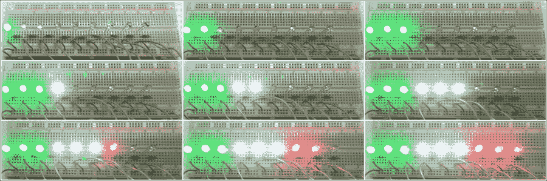

首先，代码声明了一个名为`output`的空列表。然后，一个`for`循环创建了九个`mraa.Gpio`类的实例，每个实例代表板上的一个通用输入/输出引脚。我们将`i`作为`pin`参数的参数传递，因此每个实例代表 GPIO 引脚的编号等于`i`。创建实例后，我们调用`dir`方法将引脚配置为输出引脚，即将其方向设置为`mraa.DIR_OUT`值。然后我们调用`append`方法将`mraa.Gpio`实例（`gpio`）添加到输出列表中。重要的是要理解`range(1, 10)`生成以下列表：`[1, 2, 3, 4, 5, 6, 7, 8, 9]`。因此，我们的`for`循环将从`i`等于 1 开始，其最后一次迭代将是`i`等于 9。

```py
output = []
for i in range(1, 10):
    gpio = mraa.Gpio(i)
    gpio.dir(mraa.DIR_OUT)
    output.append(gpio)
```

另一个`for`循环确定要点亮的 LED 灯数量。我们使用`range(1, 10)`生成与上一个循环相同的列表。`for`循环内的第一行调用`print`方法来显示在迭代中将要点亮的 LED 灯的数量。循环内的循环使用`range(0, i)`生成`output`列表中要点亮的元素的索引列表，这是主`for`循环迭代(`i`)的一部分。

内层循环使用`j`作为其变量，内层循环中的代码只是为每个`mraa.Gpio`实例，`output[j]`，调用`write`方法，并将`1`作为`value`必需参数的参数。这样，我们向等于`j + 1`的引脚发送高值（`1`），该引脚配置为数字输出。如果`j`等于 0，输出列表的第一个元素是配置为引脚 1（`j + 1`）的`mraa.Gpio`实例。因为从 1 到 9 的每个引脚都连接了一个 LED，所以一个或多个引脚上的高值将导致 LED 打开。然后，代码打印一条消息，指示已打开的 LED 编号。

内层循环完成后，调用`time.sleep`并使用`3`作为`seconds`参数的值，将执行延迟三秒钟。这样，LED 或 LEDs 在延迟期间保持打开状态，然后外层循环执行另一个迭代。

```py
for i in range(1, 10):
    print("==== Turning on {0} LEDs ====".format(i))
    for j in range(0, i):
        output[j].write(1)
        print("I've turned on the LED connected to GPIO Pin #{0}.".format(j + 1))
    time.sleep(3)
```

以下图片显示了在笔记本电脑的 SSH 终端上打印的控制台输出，连接到运行 Python 代码的板的电路板上 9 个 LED 打开。

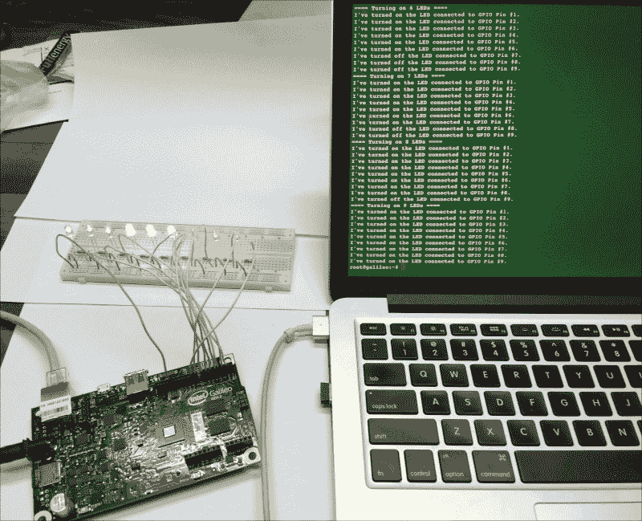

# 利用面向对象代码控制数字输出

之前的示例只是打开了 LED。因此，如果我们想按逆序计数，即从 9 到 1，结果将不会如预期。代码打开 9 个 LED 后，代码将打开 8 个 LED，但仍然会有 9 个 LED 打开。问题是我们从未关闭不需要打开的 LED，因此 9 个 LED 将保持打开状态，直到编辑的循环执行完毕。

我们一直在谈论打开 LED 和关闭 LED。然而，我们一直在使用`mraa.Gpio`类的实例并调用`write`方法。Python 是一种面向对象的编程语言，因此我们可以充分利用其面向对象的功能来编写可重用、易于理解和易于维护的代码。例如，在这种情况下，创建一个`Led`类来表示连接到我们的板上的 LED 非常有意义。

以下行显示了新`Led`类的代码。示例的代码文件为`iot_python_chapter_03_03.py`。

```py
import mraa
import time

class Led:
    def __init__(self, pin):
        self.gpio = mraa.Gpio(pin)
        self.gpio.dir(mraa.DIR_OUT)

    def turn_on(self):
        self.gpio.write(1)
        print("I've turned on the LED connected to GPIO Pin #{0}.".format(self.gpio.getPin()))

    def turn_off(self):
        self.gpio.write(0)
        print("I've turned off the LED connected to GPIO Pin #{0}.".format(self.gpio.getPin()))
```

当我们在`pin`必需参数中创建`Led`类的实例时，我们必须指定 LED 连接的引脚号。构造函数，即`__init__`方法，使用接收到的`pin`作为其`pin`参数创建一个新的`mraa.Gpio`实例，将其引用保存在`gpio`属性中，并调用其`dir`方法来配置引脚为输出引脚。

该类定义了以下两个方法：

+   `turn_on`：调用相关`mraa.Gpio`实例的`write`方法，向引脚发送高值（1）并打开连接到此引脚的 LED。然后，它打印一条包含执行动作详细信息的消息。

+   `turn_off`：调用相关`mraa.Gpio`实例的`write`方法，向引脚发送低值（0）并关闭连接到该引脚的 LED 灯。然后，它打印一条包含执行动作详细信息的消息。

现在，我们可以编写使用新`Led`类的代码，根据我们想要控制的 LED 灯数量和它们连接的引脚来创建必要的实例。以下行显示了使用新`Led`类从 1 到 9 计数并使用 LED 灯的改进代码版本。示例代码文件为`iot_python_chapter_03_03.py`。

```py
if __name__ == "__main__":
    print ("Mraa library version: {0}".format(mraa.getVersion()))
    print ("Mraa detected platform name: {0}".format(mraa.getPlatformName()))

    # Configure GPIO pins #1 to 9 to be output pins
    leds = []
    for i in range(1, 10):
        led = Led(i)
        leds.append(led)

    # Count from 1 to 9
    for i in range(1, 10):
        print("==== Turning on {0} LEDs ====".format(i))
        for j in range(0, i):
            leds[j].turn_on()
        for k in range(i, 9):
            leds[k].turn_off()
        time.sleep(3)
```

首先，代码声明了一个名为`leds`的空列表。然后，一个`for`循环创建了 9 个`Led`类的实例，每个实例代表连接到板上 GPIO 引脚的一个 LED 灯。我们将`i`作为`pin`参数的参数传递。然后，我们调用`leds`列表的`append`方法将`Led`实例（`led`）添加到`leds`列表中。我们的`for`循环将从`i`等于 1 开始，其最后一次迭代将是`i`等于 9。

另一个`for`循环确定要开启的 LED 灯数量。我们使用`range(1, 10)`来生成与上一个循环相同的列表。`for`循环中的第一行调用`print`方法来显示在迭代中将要开启的 LED 灯数量。

循环内的内循环使用`range(0, i)`来生成`leds`列表中要开启的元素的索引列表，以便在主`for`循环的迭代中（`i`）。内循环使用`j`作为其变量，并且这个内循环中的代码只是调用每个`Led`实例的`turn_on`方法。

循环内的另一个内循环使用`range(i, 9)`来生成`leds`列表中要关闭的元素的索引列表，以便在主`for`循环的迭代中（`i`）。内循环使用`k`作为其变量，并且这个内循环中的代码只是调用每个`Led`实例的`turn_off`方法。

### 小贴士

与上一个版本相比，代码更容易理解，`Led`类处理与 LED 灯相关的所有事情。我们可以轻松理解调用`leds[j]`的`turn_on`方法的行是在开启一个 LED 灯。我们肯定知道在调用`leds[k]`的`turn_off`方法的行中，一个 LED 灯正在关闭。

由于新代码关闭了不需要开启的 LED 灯，我们可以轻松地通过更改一行来创建一个从 9 倒数到 1 的新版本。以下行显示了使用`Led`类从 9 倒数到 1 并使用 LED 灯的新代码版本。需要编辑的唯一一行是高亮显示的那一行。示例代码文件为`iot_python_chapter_03_04.py`。

```py
if __name__ == "__main__":
    print ("Mraa library version: {0}".format(mraa.getVersion()))
    print ("Mraa detected platform name: {0}".format(mraa.getPlatformName()))

    # Configure GPIO pins #1 to 9 to be output pins
    leds = []
    for i in range(1, 10):
        led = Led(i)
        leds.append(led)

    # Count from 9 to 1
 for i in range(9, 0, -1):
        print("==== Turning on {0} LEDs ====".format(i))
        for j in range(0, i):
            leds[j].turn_on()
        for k in range(i, 9):
            leds[k].turn_off()
        time.sleep(3)
```

# 改进我们的面向对象代码以提供新功能

现在我们已经让计数器与连接到板上的 LED 灯正常工作，我们想要添加新功能。我们希望能够轻松地将 1 到 9 之间的数字转换为其连接到板上的 LED 灯的表示形式。

以下行显示了新`NumberInLeds`类的代码。示例的代码文件为`iot_python_chapter_03_05.py`。

```py
class NumberInLeds:
    def __init__(self):
        self.leds = []
        for i in range(1, 10):
            led = Led(i)
            self.leds.append(led)

    def print_number(self, number):
        print("==== Turning on {0} LEDs ====".format(number))
        for j in range(0, number):
            self.leds[j].turn_on()
        for k in range(number, 9):
            self.leds[k].turn_off()
```

构造函数，即`__init__`方法，声明了一个名为`leds`的空列表属性（`self.leds`）。然后，一个`for`循环创建了九个`Led`类的实例，每个实例代表连接到板上 GPIO 引脚的一个 LED。我们将`i`作为`pin`参数的参数传递。然后，我们调用`self.leds`列表的`append`方法将`Led`实例（`led`）添加到`self.leds`列表中。我们的`for`循环将从`i`等于 1 开始，其最后一次迭代将是`i`等于 9。

该类定义了一个`print_number`方法，该方法需要一个数字作为`number`参数，我们希望用 LED 点亮来表示这个数字。该方法使用一个`for`循环，其中`j`作为其变量，通过访问`self.leds`列表的适当成员并调用`turn_on`方法来点亮必要的 LED。然后，该方法使用另一个`for`循环，其中`k`作为其变量，通过访问`self.leds`列表的适当成员并调用`turn_off`方法来关闭剩余的 LED。这样，该方法确保只有需要点亮的 LED 真正点亮，其余的 LED 都关闭。

现在，我们可以编写使用新`NumberInLeds`类来使用 LED 从 0 到 9 计数的代码。在这种情况下，我们从 0 开始，因为新类能够关闭所有不应该点亮的 LED 来表示特定的数字。示例的代码文件为`iot_python_chapter_03_05.py`。

```py
if __name__ == "__main__":
    print ("Mraa library version: {0}".format(mraa.getVersion()))
    print ("Mraa detected platform name: {0}".format(mraa.getPlatformName()))

    number_in_leds = NumberInLeds()
    # Count from 0 to 9
    for i in range(0, 10):
        number_in_leds.print_number(i)
        time.sleep(3)
```

代码非常容易理解，我们只需创建一个名为`number_in_leds`的`NumberInLeds`类实例，然后在`for`循环中将其`print_number`方法作为参数调用`i`。

### 小贴士

我们利用 Python 的面向对象特性来创建代表 LED 和 LED 生成数字的类。这样，我们编写了更高级别的代码，更容易理解，因为我们不仅读取将 0 和 1 写入特定引脚号的代码，我们还可以读取打印 LED 上数字的代码，以及打开和关闭 LED 的代码。

# 将引脚号隔离以改善布线

显然，当连接到 GPIO 引脚 1 时，点亮表示数字 1 的 LED 很容易。在我们之前的布线中，代表每个数字的 LED 都连接到相同的 GPIO 引脚号。该电路图也很容易理解，因为 LED 编号与引脚编号相匹配。

然而，板子和面包板之间的连接有点复杂，因为板上的 GPIO 引脚从 13 向下到 1，从左到右。面包板上的 LED 方向相反，即从 1 到 9，从左到右。因此，连接 GPIO 引脚编号 1 和 LED 编号 1 的线必须从右到左，并穿过其他跳线。我们将更改跳线以改进我们的布线，然后我们将对我们的面向对象的 Python 代码进行必要的更改，以隔离引脚编号，使其布线更美观。在更改布线之前，不要忘记关闭操作系统并从板上拔掉电源。

以下图表显示了连接到面包板和从 Intel Galileo Gen 2 板到面包板的新布线的组件。示例的 Fritzing 文件是`iot_fritzing_chapter_03_06.fzz`，以下图片是面包板视图。

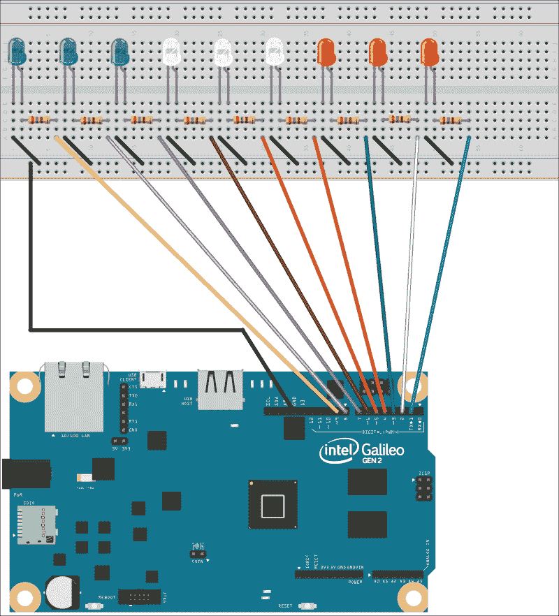

现在，无论何时我们想要打开 LED 1，我们必须将 GPIO 引脚编号 9 写入高（1）值，无论何时我们想要打开 LED 2，我们写入 GPIO 引脚编号 8 的高（1）值，依此类推。由于我们更改了布线，表示电子组件为符号的原理图也发生了变化。以下图片显示了新版本的原理图。

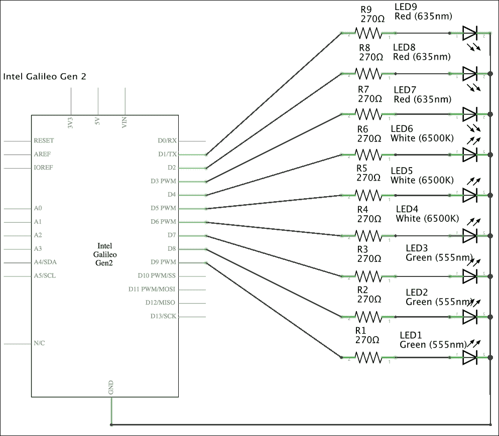

以下行显示了`Led`类的新代码。示例的代码文件是`iot_python_chapter_03_06.py`。

```py
import mraa
import time

class Led:
 def __init__(self, pin, position):
 self.position = position
        self.gpio = mraa.Gpio(pin)
        self.gpio.dir(mraa.DIR_OUT)

    def turn_on(self):
        self.gpio.write(1)
 print("I've turned on the LED connected to GPIO Pin #{0}, in position {1}.".format(self.gpio.getPin(), self.position))

    def turn_off(self):
        self.gpio.write(0)
 print("I've turned off the LED connected to GPIO Pin #{0}, in position {1}.".format(self.gpio.getPin(), self.position))

```

现在，当我们创建`Led`类的实例时，必须指定一个额外的参数：面包板上的`position`，即面包板上的 LED 编号。构造函数，即`__init__`方法，将`position`值保存在具有相同名称的属性中。`turn_on`和`turn_off`方法都使用`self.position`属性值来打印一条消息，指示已打开或关闭的 LED 的位置。由于位置不再与引脚匹配，因此必须改进消息以指定位置。

以下行显示了新版本的`NumberInLeds`类的代码。示例的代码文件是`iot_python_chapter_03_06.py`。

```py
class NumberInLeds:
    def __init__(self):
        self.leds = []
 for i in range(9, 0, -1):
 led = Led(i, 10 - i)
            self.leds.append(led)

    def print_number(self, number):
        print("==== Turning on {0} LEDs ====".format(number))
        for j in range(0, number):
            self.leds[j].turn_on()
        for k in range(number, 9):
            self.leds[k].turn_off()
```

在构造函数中，即`__init__`方法中，有必要对高亮显示的行进行修改。现在创建`Led`类九个实例的`for`循环从`i`等于 9 开始，其最后一次迭代将是`i`等于 1。我们将`i`作为`pin`参数的参数传递，将`10 – i`作为位置参数的参数传递。这样，`self.leds`列表中的第一个`Led`实例将是引脚等于 9 且位置等于 1 的实例。

使用新版本的`NumberInLeds`类从 0 到 9 计数并使用 LED 的代码与之前的代码相同。示例的代码文件是`iot_python_chapter_03_06.py`。

```py
if __name__ == "__main__":
    print ("Mraa library version: {0}".format(mraa.getVersion()))
    print ("Mraa detected platform name: {0}".format(mraa.getPlatformName()))

    number_in_leds = NumberInLeds()
    # Count from 0 to 9
    for i in range(0, 10):
        number_in_leds.print_number(i)
        time.sleep(3)
```

我们只需要在封装 LED 的类（`Led`）和封装用 LED 表示的数字的类（`NumberInLeds`）中进行一些更改。以下图片显示了面包板上的 9 个 LED 在新布线连接到运行新 Python 代码的板之间打开的情况。

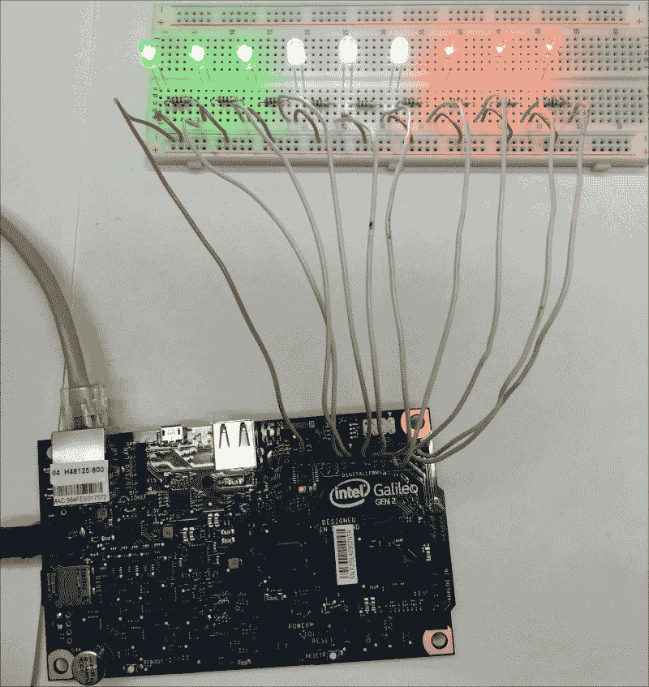

我们可以轻松构建一个 API 并提供一个 REST API，允许任何连接到板的客户端能够通过 HTTP 打印数字。我们的 REST API 只需要创建一个 `NumberInLeds` 类的实例，并使用指定的数字调用 `print_number` 方法来通过 LED 打印。我们将在下一章构建这个 REST API。

# 使用 wiring-x86 库控制数字输出

使用 Python 作为我们的编程语言与板交互的一个巨大优势是我们有大量的 Python 包可用。我们一直在使用 `mraa` 库与数字输出交互。然而，在上一章中，我们也安装了 `wiring-x86` 库。我们只需更改几行面向对象的代码，用 `wiring-x86` 库替换 `mraa` 库来打开和关闭 LED。

以下行显示了 `Board` 类的代码，以及与 `wiring-x86` 库一起工作的 `Led` 类的新版本，而不是使用 `mraa`。示例代码文件为 `iot_python_chapter_03_07.py`。

```py
from wiringx86 import GPIOGalileoGen2 as GPIO
import time

class Board:
    gpio = GPIO(debug=False)

class Led:
    def __init__(self, pin, position):
        self.pin = pin
        self.position = position
        self.gpio = Board.gpio
        self.gpio.pinMode(pin, self.gpio.OUTPUT)

    def turn_on(self):
        self.gpio.digitalWrite(self.pin, self.gpio.HIGH)
        print("I've turned on the LED connected to GPIO Pin #{0}, in position {1}.".format(self.pin, self.position))

    def turn_off(self):
        self.gpio.digitalWrite(self.pin, self.gpio.LOW)
        print("I've turned off the LED connected to GPIO Pin #{0}, in position {1}.".format(self.pin, self.position))
```

`wiring-x86` 库不包括自动检测板的功能，因此，有必要使用代表我们板的类。`GPIOGalileoGen2` 代表英特尔 Galileo Gen 2 板，因此，代码的第一行使用一个 `import` 语句将其导入为 `GPIO` 从 `wiringx86`。这样，每次我们引用 `GPIO` 时，我们实际上是在使用 `wiringx86.GPIOGalileoGen2`。请注意，库的名称是 `wiring-x86`，但模块的名称是 `wiringx86`。

当我们创建 `Led` 类的实例时，我们必须指定 LED 连接的 GPIO 数字 `pin` 和在面包板上的 `position`，即面包板上的 LED 号码。构造函数，即 `__init__` 方法，将 `Board.gpio` 类属性引用保存到 `self.gpio` 中，并调用其 `pinMode` 方法，将接收到的引脚作为其 `pin` 参数，将 `self.gpio.OUTPUT` 作为其 `mode` 参数。这样，我们配置引脚为输出引脚。所有的 `Led` 实例都将保存对创建 `GPIO` 类实例的同一 `Board.gpio` 类属性的引用，特别是具有 `debug` 参数设置为 `False` 的 `wiringx86.GPIOGalileoGen2` 类，以避免低级通信中的不必要调试信息。

`turn_on`方法调用 GPIO 实例的`digitalWrite`方法，将高值（`self.GPIO.HIGH`）发送到由`self.pin`属性值指定的针脚，并打印关于执行动作的消息。

`turn_off`方法调用 GPIO 实例的`digitalWrite`方法，将低值（`self.GPIO.LOW`）发送到由`self.pin`属性值指定的针脚，并打印关于执行动作的消息。

`NumberInLeds`类的代码与之前示例中使用的相同。无需对此类进行更改，因为它将自动与新`Led`类一起工作，并且其构造函数或两个方法的参数没有发生变化。我们只需替换`__main__`方法中打印有关`mraa`库信息的行，因为我们不再使用`mraa`库。

以下行显示了`NumberInLeds`类和`__main__`方法的代码。示例的代码文件为`iot_python_chapter_03_07.py`。

```py
class NumberInLeds:
    def __init__(self):
        self.leds = []
        for i in range(9, 0, -1):
            led = Led(i, 10 - i)
            self.leds.append(led)

    def print_number(self, number):
        print("==== Turning on {0} LEDs ====".format(number))
        for j in range(0, number):
            self.leds[j].turn_on()
        for k in range(number, 9):
            self.leds[k].turn_off()

if __name__ == "__main__":
    print ("Working with wiring-x86 on Intel Galileo Gen 2")

    number_in_leds = NumberInLeds()
    # Count from 0 to 9
    for i in range(0, 10):
        number_in_leds.print_number(i)
        time.sleep(3)
```

我们只需更改几行代码，就可以看到 Python 代码如何使用`wiring-x86`库在面包板上使 LED 从 0 计数到 9。我们使用此库与 GPIO 针脚进行数字输出的方式与`mraa`库中使用的机制略有不同。然而，我们可以通过利用 Python 的面向对象特性轻松封装这些更改。我们可以根据自己的喜好和需求决定哪个库更适合我们的项目。拥有不止一个选项总是一个好主意。

# 测试你的知识

1.  当我们将高值（1）发送到配置为输出的 GPIO 针脚时，该 GPIO 针脚将具有：

    1.  0 V。

    1.  6 V。

    1.  IOREF 跳线所在位置的电压值。

1.  `mraa.Gpio`类的实例表示：

    1.  板上单个 GPIO 针脚。

    1.  板上的所有 I/O 针脚。

    1.  板上的两个 GPIO 针脚。

1.  当我们创建`mraa.Gpio`类的实例时，我们必须指定：

    1.  针脚号作为参数。

    1.  具体的板和针脚号作为参数。

    1.  针脚号和期望的方向：`mraa.DIR_OUT` 或 `mraa.DIR_IN`。

1.  以下哪行将高值写入配置为输出的 GPIO 针脚的`mraa.Gpio`实例名为`gpio10`：

    1.  `gpio10.write(0)`

    1.  `gpio10.write(1)`

    1.  `gpio10.write(mraa.HIGH_VALUE)`

1.  以下哪行配置了名为`gpio10`的`mraa.Gpio`实例以进行数字输出：

    1.  `gpio10.dir(mraa.DIR_DIGITAL).out()`

    1.  `gpio10.dir(mraa.DIR_OUT)`

    1.  `gpio10.dir(mraa.DIR_OUT, mraa.DIGITAL)`

# 摘要

在本章中，我们使用 Python 与两个不同的库：`mraa`和`wiring-x86`。我们将 LED 和电阻连接到面包板上，并编写了代码来从 0 到 9 点亮 LED。我们改进了 Python 代码，以利用 Python 的面向对象特性，并准备了代码，使其易于构建一个 REST API，允许我们使用 LED 打印数字。

现在我们完成了第一次布线，并开始用 Python 控制板，我们可以开始使用额外的输出，并将它们与 REST API 结合，这是下一章的主题。
