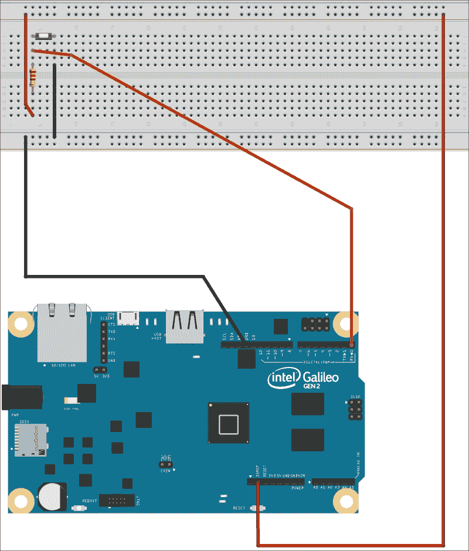
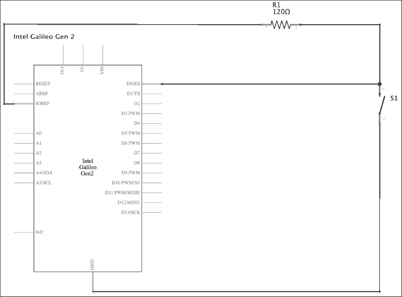
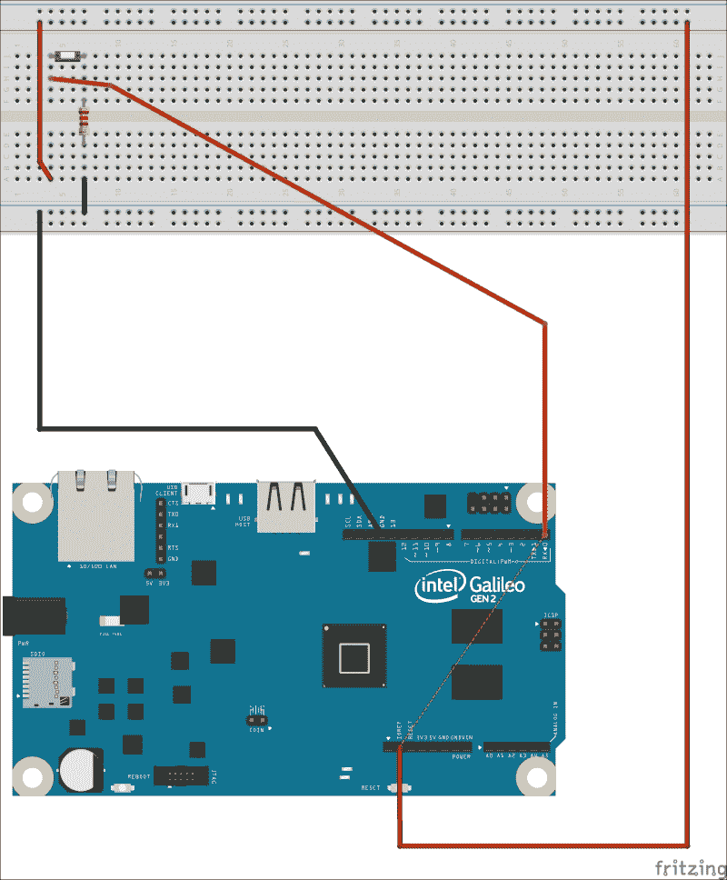
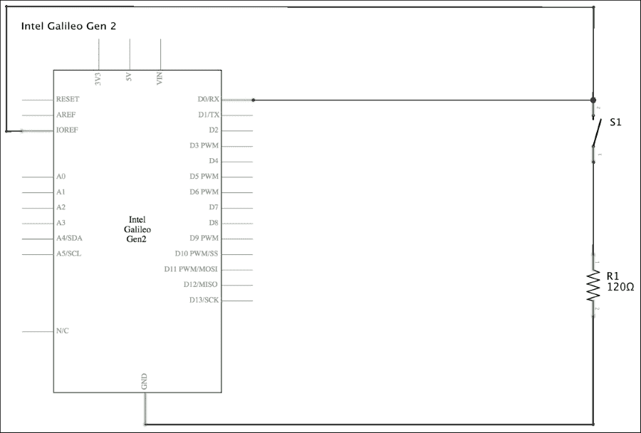
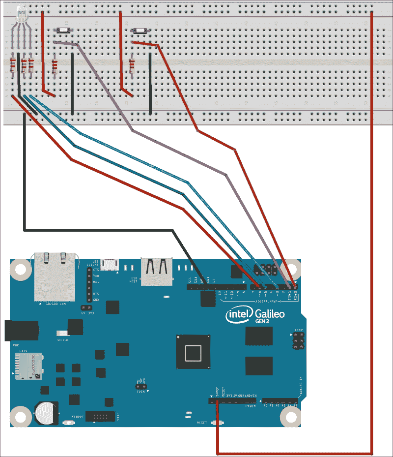
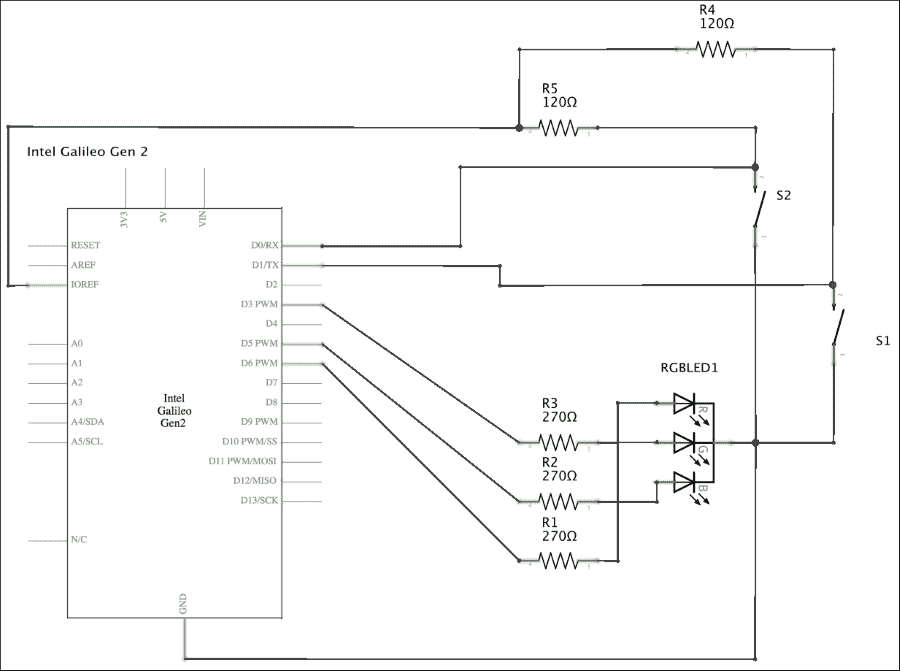
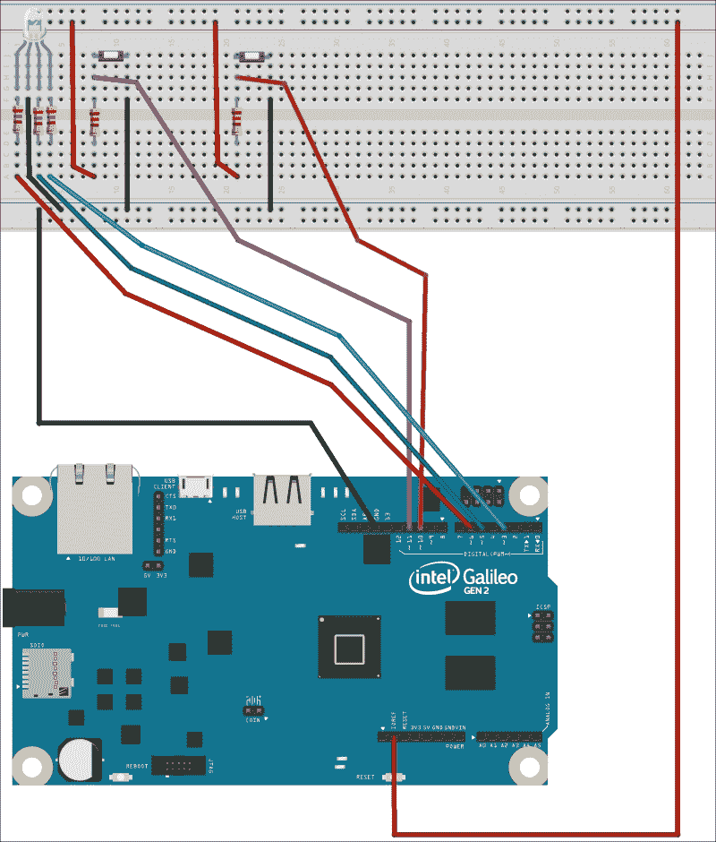
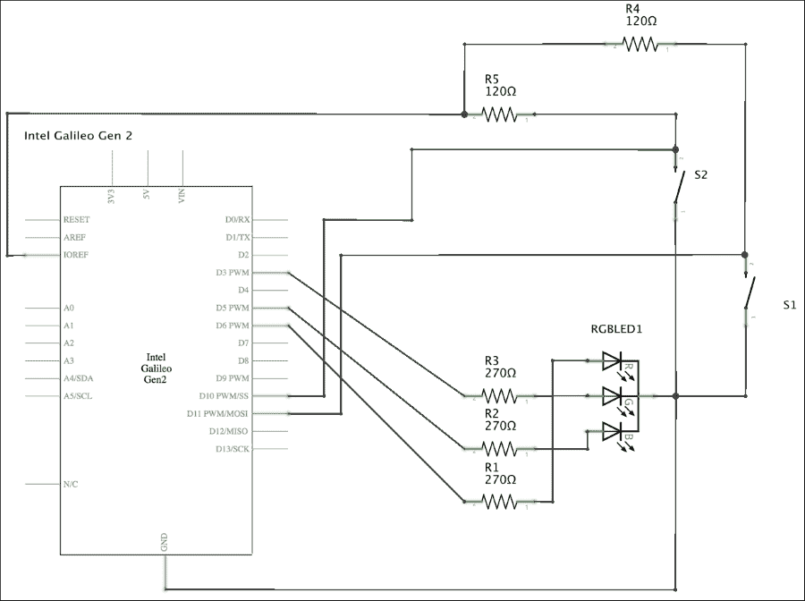

# 第五章：处理数字输入、轮询和中断

在本章中，我们将使用数字输入，以便在处理 HTTP 请求的同时让用户与板交互。我们将：

+   理解上拉电阻和下拉电阻之间的区别，以便连接按钮

+   将按钮与数字输入引脚连接

+   使用轮询检查`mraa`和`wiring-x86`库中的按钮状态

+   在运行 RESTful API 的同时结合轮询读取数字输入

+   编写代码，确保在提供电子组件和 API 的共享功能时保持一致性

+   使用中断和`mraa`库检测按下的按钮

+   理解轮询和中断在检测数字输入变化之间的差异、优势和权衡

# 理解按钮和上拉电阻

我们使用 RESTful API 控制红、绿、蓝 LED 的亮度级别。然后，我们将三个 LED 替换为单个 RGB LED，并使用相同的 RESTful API 生成不同颜色的灯光。现在，我们希望用户能够通过面包板上添加的两个按钮来改变三个组件的亮度级别：

+   一个按钮用于关闭所有颜色，即设置所有颜色亮度级别为 0

+   一个按钮用于将所有颜色设置为最大亮度级别，即设置所有颜色亮度级别为 255

当用户按下按钮，也称为微动开关时，它就像一根电线，因此，它允许电流通过其融入的电路。当按钮未按下时，其融入的电路被中断。因此，每当用户释放按钮时，电路都会被中断。显然，我们不希望在用户按下按钮时短路连接，因此，我们将分析不同的可能方法来安全地将按钮连接到英特尔 Galileo Gen 2 板上。

以下图片显示了我们可以将按钮连接到英特尔 Galileo Gen 2 板的一种方法，并使用 GPIO 引脚号**0**作为输入以确定按钮是否被按下。该示例的 Fritzing 文件为`iot_fritzing_chapter_05_01.fzz`，以下图片是面包板视图：



以下图片显示了用符号表示的电子组件的电路图：



如前图所示，板子符号上标记为**D0/RX**的 GPIO 引脚连接到一个 120Ω电阻，公差为 5%（棕色红棕色金色），并连接到**IOREF**引脚。我们已经知道，标记为**IOREF**的引脚为我们提供 IOREF 电压，即在我们的实际配置中为 5V。由于我们可能希望在将来使用其他电压配置，我们始终可以使用 IOREF 引脚而不是专门使用**5V**或**3V3**引脚。板子符号上标记为**D0/RX**的 GPIO 引脚也连接到**S1**按钮，通过 120Ω电阻和**GND**（地）连接。

### 小贴士

该配置被称为分压器，120Ω电阻被称为上拉电阻。

拉高电阻在按下**S1**按钮时限制电流。由于拉高电阻的作用，如果我们按下**S1**按钮，我们将在标记为**D0/RX**的 GPIO 引脚上读取低值（0V）。当我们释放 S1 按钮时，我们将读取高值，即 IOREF 电压（在我们的实际配置中为 5V）。

由于我们在按钮按下时读取到低值，所以情况可能有些令人困惑。然而，我们可以编写面向对象的代码来封装按钮的行为，并使用更容易理解的状态来隔离上拉电阻的工作方式。

还可以使用下拉电阻。我们可以将 120Ω电阻连接到地，将其从上拉电阻转换为下拉电阻。以下图片显示了如何使用下拉电阻将按钮连接到英特尔 Galileo Gen 2 板，并使用 GPIO 引脚号**0**作为输入来确定按钮是否被按下。该示例的 Fritzing 文件为`iot_fritzing_chapter_05_02.fzz`，以下图片是面包板视图：



下图显示了用符号表示的电子元件的原理图：



如前图所示，在本例中，板子符号上标记为**D0/RX**的 GPIO 引脚连接到**S1**按钮和**IOREF**引脚。S1 按钮的另一个引脚连接到 120Ω电阻，该电阻连接到**GND**（地）。

### 小贴士

在此配置中，120Ω电阻被称为下拉电阻。

拉低电阻在按下**S1**按钮时限制电流。由于拉低电阻的作用，如果我们按下**S1**按钮，我们将在标记为**D0/RX**的 GPIO 引脚上读取高值，即 IOREF 电压（在我们的实际配置中为 5V）。当我们释放**S1**按钮时，我们将读取低值（0V）。因此，拉低电阻与我们在使用上拉电阻时读取的相反值一起工作。

# 使用按钮连接数字输入引脚

现在，我们将使用以下引脚连接两个按钮，并将使用上拉电阻：

+   引脚 **1**（标记为 **D1/TX**）用于连接关闭三种颜色的按钮

+   引脚 **0**（标记为 **D0/RX**）用于连接设置三种颜色到最大亮度级别的按钮

在完成必要的布线后，我们将编写 Python 代码来检查每个按钮是否被按下，同时保持我们的 RESTful API 正常工作。这样，我们将使用户能够通过按钮和 RESTful API 与 RGB LED 交互。为了使用此示例，我们需要以下额外的组件：

+   两个带两个引脚的按钮

+   两个 120Ω 电阻，公差为 5%（棕色 红色 棕色 金色）

以下图显示了连接到面包板上的组件、必要的布线和从英特尔 Galileo Gen 2 板到面包板的布线。示例的 Fritzing 文件是 `iot_fritzing_chapter_05_03.fzz`，以下图片是面包板视图：



以下图片显示了用符号表示的电子组件的原理图。



如前图所示，我们添加了两个按钮（**S1** 和 **S2**）和两个 120Ω 上拉电阻（**R4** 和 **R5**）。板符号中标记为 **D0/RX** 的 GPIO 引脚连接到 **S2** 按钮，**R4** 电阻是其上拉电阻。板符号中标记为 **D1/TX** 的 GPIO 引脚连接到 **S1** 按钮，**R5** 电阻是其上拉电阻。这样，当 **S2** 按钮被按下时，GPIO 引脚编号 0 将为低电平，当 **S1** 按钮被按下时，GPIO 引脚编号 1 将为低电平。**S1** 按钮位于面包板的左侧，而 **S2** 按钮位于右侧。

现在，是时候将组件插入面包板并完成所有必要的布线了。在添加或从板上的引脚移除任何电线之前，不要忘记关闭 Yocto Linux，等待所有板载 LED 熄灭，并从英特尔 Galileo Gen 2 板上拔掉电源。

# 使用数字输入和 mraa 库读取按钮状态

我们将创建一个新的 `PushButton` 类来表示连接到我们的板上的按钮，该按钮可以使用上拉或下拉电阻。以下行显示了与 `mraa` 库一起工作的新 `PushButton` 类的代码。示例的代码文件是 `iot_python_chapter_05_01.py`。

```py
import mraa
import time
from datetime import date

class PushButton:
    def __init__(self, pin, pull_up=True):
        self.pin = pin
        self.pull_up = pull_up
        self.gpio = mraa.Gpio(pin)
        self.gpio.dir(mraa.DIR_IN)

    @property
    def is_pressed(self):
        push_button_status = self.gpio.read()
        if self.pull_up:
            # Pull-up resistor connected
            return push_button_status == 0
        else:
            # Pull-down resistor connected
            return push_button_status == 1

    @property
    def is_released(self):
        return not self.is_pressed
```

在创建`PushButton`类的实例时，我们必须指定按钮连接的引脚号，作为`pin`必需参数。如果我们没有指定其他值，可选的`pull_up`参数将为`True`，实例将像按钮连接了上拉电阻一样工作。如果我们使用下拉电阻，我们必须在`pull_up`参数中传递`False`。构造函数，即`__init__`方法，使用接收到的`pin`作为其`pin`参数创建一个新的`mraa.Gpio`实例，将其引用保存到`gpio`属性中，并调用其`dir`方法将引脚配置为输入引脚（`mraa.DIR_IN`）。

该类定义了以下两个属性：

+   `is_pressed`：调用相关`mraa.Gpio`实例的`read`方法从引脚获取值并将其保存到`push_button_status`变量中。如果按钮连接了上拉电阻（`self.pull_up`为`True`），则代码将返回`True`，表示如果`push_button_status`中的值为`0`（低值），则按钮被按下。如果按钮连接了下拉电阻（`self.pull_up`为`False`），则代码将返回`True`，表示如果`push_button_status`中的值为`1`（高值），则按钮被按下。

+   `is_released`：返回`is_pressed`属性的相反结果。

现在，我们可以编写使用新的`PushButton`类创建每个按钮实例的代码，并轻松检查它们是否被按下。新类处理按钮是否连接了上拉或下拉电阻，因此我们只需检查`is_pressed`或`is_released`属性值，无需担心它们连接的具体细节。

我们将在稍后集成考虑两个按钮状态的代码到我们的 RESTful API 中。首先，我们将通过一个简单的示例将两个按钮隔离出来，以了解我们如何读取它们的状态。在这种情况下，我们将使用轮询，即一个循环，将检查按钮是否被按下。如果按钮被按下，我们希望代码在控制台输出中打印一条消息，指示正在按下的特定按钮。

以下行显示了执行先前解释操作的 Python 代码。示例的代码文件为`iot_python_chapter_05_01.py`。

```py
if __name__ == "__main__":
    s1_push_button = PushButton(1)
    s2_push_button = PushButton(0)
    while True:
        # Check whether the S1 pushbutton is pressed
        if s1_push_button.is_pressed:
            print("You are pressing S1.")
        # Check whether the S2 pushbutton is pressed
        if s2_push_button.is_pressed:
            print("You are pressing S2.")
        # Sleep 500 milliseconds (0.5 seconds)
        time.sleep(0.5)
```

前两行创建了之前编写的`PushButton`类的两个实例。**S1**按钮连接到 GPIO 引脚 1，**S2**按钮连接到 GPIO 引脚 0。在这两种情况下，代码没有为`pull_up`参数指定值。因此，构造函数，即`__init__`方法，将使用此参数的默认值`True`，并将实例配置为与上拉电阻连接的按钮。我们需要在创建两个实例时注意这一点，然后，我们使用包含实例的变量的名称：`s1_push_button`和`s2_push_button`。

然后，代码将无限循环运行，即直到你通过按下*Ctrl* + *C*或停止进程的按钮来中断执行，如果你使用具有远程开发功能的 Python IDE 来运行代码在你的板上。

`while`循环内的第一行检查名为`s1_push_button`的`PushButton`实例的`is_pressed`属性的值是否为`True`。`True`值表示此时按钮被按下，因此代码会在控制台输出中打印一条消息，表明 S1 按钮正在被按下。`while`循环内的后续行对名为`s2_push_button`的`PushButton`实例执行相同的程序。

在我们检查了两个按钮的状态之后，调用`time.sleep`函数，并将`0.5`作为第二个参数的值，将执行延迟 500 毫秒，即 0.5 秒。

以下行将启动示例；不要忘记你需要使用 SFTP 客户端将 Python 源代码文件传输到 Yocto Linux。

```py
python iot_python_chapter_05_01.py
```

在运行示例之后，执行以下操作：

+   按下 S1 按钮 1 秒钟

+   按下 S2 按钮 1 秒钟

+   同时按下 S1 和 S2 按钮 1 秒钟

由于之前的操作，你将看到以下输出：

```py
You are pressing S1.
You are pressing S2.
You are pressing S1.
You are pressing S2.
```

在这种情况下，我们正在使用轮询读取数字输入。`mraa`库还允许我们使用中断，并用 Python 声明中断处理程序。这样，每当用户按下按钮时，事件会生成中断，`mraa`库会调用指定的中断处理程序。如果你曾经从事基于事件的编程，你可以考虑事件和事件处理程序而不是中断和中断处理程序，这样你将很容易理解事情是如何工作的。

中断处理程序在不同的线程中运行，你可以为它们编写的代码有很多限制。例如，你无法在中断处理程序中使用基本类型。因此，在这种情况下，使用中断并不合适，而轮询由于我们必须在用户按下任意一个按钮时执行的任务，使得事情变得更容易。

与之前示例中的轮询读取数字输入相比，用于相同任务的轮询具有以下优点：

+   代码易于理解和阅读

+   流程易于理解，我们不必担心回调中运行的代码。

+   我们可以编写所有必要的代码来执行按钮按下时的动作，而不必担心与中断回调相关的特定限制。

+   我们不必担心多线程中运行的代码。

然而，与使用中断进行相同任务相比，使用轮询读取数字输入有以下缺点：

+   如果我们没有按住按钮特定的时间，代码可能无法检测到按钮被按下。

+   如果我们长时间按住按钮，代码将表现得好像按钮被多次按下。有时，我们不希望这种情况发生。

+   与中断触发的事件相比，循环消耗的资源更多，我们可能无法为其他任务提供这些资源。

在这种情况下，我们希望用户至少按住任意一个按钮半秒钟，因此我们不需要中断的优势。然而，我们将在本章后面使用中断。

# 读取按钮状态和运行 RESTful API。

现在，我们将集成检查两个按钮状态的代码到我们的 RESTful API 中。我们希望能够向 RESTful API 发出 HTTP 请求，并且我们也希望能够使用我们添加到面包板上的两个按钮。

我们必须让 Tornado 运行一个周期性回调，并在该回调中编写检查两个按钮状态的代码。我们将使用我们在上一章中创建最后一个版本的 RESTful API 时编写的代码，使用`mraa`库，并将此代码作为基准来添加新功能。示例代码文件为`iot_python_chapter_04_03.py`。

我们将向现有的`BoardInteraction`类添加两个类属性和三个类方法。示例代码文件为`iot_python_chapter_05_02.py`。

```py
class BoardInteraction:
    # The Red LED is connected to pin ~6
    red_led = AnalogLed(6, 'Red')
    # The Green LED is connected to Pin ~5
    green_led = AnalogLed(5, 'Green')
    # The Blue LED is connected to Pin ~3
    blue_led = AnalogLed(3, 'Blue')
 # The push button to reset colors
 reset_push_button = PushButton(1)
 # The push button to set colors to their maximum brightness
 max_brightness_push_button = PushButton(0)

 @classmethod
 def set_min_brightness(cls):
 cls.red_led.set_brightness(0)
 cls.green_led.set_brightness(0)
 cls.blue_led.set_brightness(0)

 @classmethod
 def set_max_brightness(cls):
 cls.red_led.set_brightness(255)
 cls.green_led.set_brightness(255)
 cls.blue_led.set_brightness(255)

 @classmethod
 def check_push_buttons_callback(cls):
 # Check whether the reset push button is pressed
 if cls.reset_push_button.is_pressed:
 print("You are pressing the reset pushbutton.")
 cls.set_min_brightness()

 # Check whether the maximum brightness push button is pressed
 if cls.max_brightness_push_button.is_pressed:
 print("You are pressing the maximum brightness pushbutton.")
 cls.set_max_brightness()

```

之前的代码向`BoardInteraction`类添加了两个类属性：`reset_push_button`和`max_brightness_push_button`。`reset_push_button`类属性是一个`PushButton`实例，其`pin`属性设置为`1`。这样，该实例可以检查连接到 GPIO 引脚 1 的按钮的状态。`max_brightness_push_button`类属性是一个`PushButton`实例，其`pin`属性设置为`0`，因此，该实例可以检查连接到 GPIO 引脚 0 的按钮的状态。此外，之前的代码还向`BoardInteraction`类添加了以下类方法：

+   `set_min_brightness`: 使用`0`作为参数调用`set_brightness`方法，针对保存在`red_led`、`green_led`和`blue_led`类属性中的三个`AnalogLed`实例。这样，RGB LED 的三个组件将被关闭。

+   `set_max_brightness`：调用`set_brightness`方法，将`255`作为参数传递给保存在`red_led`、`green_led`和`blue_led`类属性中的三个`AnalogLed`实例。这样，RGB LED 的三个组件将以最大亮度级别打开。

+   `check_push_buttons_callback`：首先，通过评估代表复位按钮的`PushButton`实例的`is_pressed`属性值来检查复位按钮是否被按下。即，`cls.reset_push_button`。如果属性的值为`True`，代码将打印一条消息表明您正在按下复位按钮，并调用之前描述的`cls.set_min_brightness`类方法来关闭 RGB LED 的三个组件。然后，代码检查最大亮度按钮是否被按下，通过评估代表最大亮度按钮的`PushButton`实例的`is_pressed`属性值，即`cls.max_brightness_push_button`。如果属性的值为`True`，代码将打印一条消息表明您正在按下最大亮度按钮，并调用之前描述的`cls.set_max_brightness`类方法，以最大亮度级别打开 RGB LED 的三个组件。

### 小贴士

在 Python 中，在类方法标题之前添加`@classmethod`装饰器是必要的，以声明类方法。实例方法接收`self`作为第一个参数，但类方法接收当前类作为第一个参数，参数名称通常称为`cls`。在前面的代码中，我们使用`cls`来访问`BoardInteraction`类的类属性和类方法。

以下几行展示了我们必须添加到现有代码中的新类，以便通过 HTTP 请求设置最小和最大亮度。我们希望能够在我们的 RESTful API 中拥有与通过按钮可以控制的相同功能。代码添加了以下两个类：`PutMinBrightnessHandler`和`PutMaxBrightnessHandler`。示例代码文件为`iot_python_chapter_05_02.py`。

```py
class PutMinBrightnessHandler(tornado.web.RequestHandler):
    def put(self):
        BoardInteraction.set_min_brightness()
        response = dict(
            red=BoardInteraction.red_led.brightness_value,
            green=BoardInteraction.green_led.brightness_value,
            blue=BoardInteraction.blue_led.brightness_value)
        self.write(response)

class PutMaxBrightnessHandler(tornado.web.RequestHandler):
    def put(self):
        BoardInteraction.set_max_brightness()
        response = dict(
            red=BoardInteraction.red_led.brightness_value,
            green=BoardInteraction.green_led.brightness_value,
            blue=BoardInteraction.blue_led.brightness_value)
        self.write(response)
```

代码声明了以下两个`tornado.web.RequestHandler`的子类：

+   `PutMinBrightnessHandler`：定义了调用`BoardInteraction`类的`set_min_brightness`类方法的`put`方法。然后，代码返回一个响应，其中包含已转换为连接到 RGB LED 红、绿、蓝阳极的 PWM 引脚输出占空比百分比的最低亮度级别。

+   `PutMaxBrightnessHandler`：定义了调用`BoardInteraction`类的`set_max_brightness`类方法的`put`方法。然后，代码返回一个响应，其中包含已转换为连接到 RGB LED 红、绿、蓝阳极的 PWM 引脚输出占空比百分比的最高亮度级别。

现在，有必要将高亮行添加到创建名为`application`的`tornado.web.Application`类实例的代码中，该实例包含构成 Web 应用程序的请求处理器列表，即正则表达式和`tornado.web.RequestHandler`子类的元组。示例代码文件为`iot_python_chapter_05_02.py`。

```py
application = tornado.web.Application([
    (r"/putredbrightness/([0-9]+)", PutRedBrightnessHandler),
    (r"/putgreenbrightness/([0-9]+)", PutGreenBrightnessHandler),
    (r"/putbluebrightness/([0-9]+)", PutBlueBrightnessHandler),
    (r"/putrgbbrightness/r([0-9]+)g([0-9]+)b([0-9]+)",
     PutRGBBrightnessHandler),
 (r"/putminbrightness", PutMinBrightnessHandler),
 (r"/putmaxbrightness", PutMaxBrightnessHandler),
    (r"/getredbrightness", GetRedBrightnessHandler),
    (r"/getgreenbrightness", GetGreenBrightnessHandler),
    (r"/getbluebrightness", GetBlueBrightnessHandler),
    (r"/version", VersionHandler)])
```

如我们之前的示例所示，代码创建了一个名为`application`的`tornado.web.Application`类实例，其中包含构成 Web 应用程序的请求处理器列表，即正则表达式和`tornado.web.RequestHandler`子类的元组。

最后，有必要将`__main__`方法替换为一个新的方法，因为我们想要运行一个周期性回调来检查两个按钮中的任何一个是否被按下。示例代码文件为`iot_python_chapter_05_02.py`。

```py
if __name__ == "__main__":
    print("Listening at port 8888")
    application.listen(8888)
 ioloop = tornado.ioloop.IOLoop.instance()
 periodic_callback = tornado.ioloop.PeriodicCallback(BoardInteraction.check_push_buttons_callback, 500, ioloop)
 periodic_callback.start()
 ioloop.start()

```

如前例所示，`__main__`方法调用`application.listen`方法来为应用程序构建一个 HTTP 服务器，该服务器在端口号`8888`上定义了规则。然后，代码检索全局`IOLoop`实例并将其保存到`ioloop`局部变量中。我们必须使用该实例作为创建名为`periodic_callback`的`tornado.ioloop.PeriodicCallback`实例的一个参数。

`PeriodicCallback`实例允许我们安排一个指定的回调定期被调用。在这种情况下，我们指定`BoardInteraction.check_push_buttons_callback`类方法作为每 500 毫秒将被调用的回调。这样，我们指示 Tornado 每 500 毫秒运行一次`BoardInteraction.check_push_buttons_callback`类方法。如果该方法执行时间超过 500 毫秒，Tornado 将跳过后续调用以回到预定时间表。在代码创建`PeriodicCallback`实例后，下一行调用其`start`方法。

最后，调用`ioloop.start()`启动了使用`application.listen`创建的服务器。这样，Web 应用程序将处理接收到的请求，并且还会运行一个回调来检查按钮是否被按下。

以下行将启动 HTTP 服务器和我们的新版本 RESTful API。别忘了你需要使用 SFTP 客户端将 Python 源代码文件传输到 Yocto Linux。

```py
python iot_python_chapter_05_02.py
```

运行示例后，按下设置颜色为最大亮度的按钮一秒钟。RGB LED 将显示白光，你将看到以下输出：

```py
You are pressing the maximum brightness pushbutton.
Red LED connected to PWM Pin #6 set to brightness 255.
Green LED connected to PWM Pin #5 set to brightness 255.
Blue LED connected to PWM Pin #3 set to brightness 255.
```

现在，按下设置颜色为最小亮度的按钮一秒钟。RGB LED 将关闭，你将看到以下输出：

```py
You are pressing the reset pushbutton.
Red LED connected to PWM Pin #6 set to brightness 0.
Green LED connected to PWM Pin #5 set to brightness 0.
Blue LED connected to PWM Pin #3 set to brightness 0.
```

使用新的 RESTful API，我们可以组合以下 HTTP 动词和请求 URL：

```py
PUT http://192.168.1.107:8888/putmaxbrightness

```

之前的请求路径将与之前添加的元组 (`regexp`, `request_class`) 匹配 (`r"/putmaxbrightness", PutMaxBrightnessHandler`)，Tornado 将调用 `PutMaxBrightnessHandler.put` 方法。RGB LED 将显示白色光，就像你按下最大亮度按钮时发生的那样。以下行显示了 HTTP 服务器对三个 LED 设置的亮度级别的响应：

```py
{
    "blue": 255, 
    "green": 255, 
    "red": 255
}
```

以下 HTTP 动词和请求 URL 将关闭 RGB LED，就像我们按下设置颜色为最小亮度按钮时发生的那样：

```py
PUT http://192.168.1.107:8888/putminbrightness

```

以下行显示了 HTTP 服务器对三个 LED 设置的亮度级别的响应：

```py
{
    "blue": 0, 
    "green": 0, 
    "red": 0
}
```

现在，按下设置颜色为最大亮度按钮一秒钟。RGB LED 将显示白色光。然后，以下三个 HTTP 动词和请求 URL 将检索每种颜色的亮度级别。所有请求都将返回 `255` 作为当前值。我们使用按钮设置亮度级别，但代码的效果与调用 API 来更改颜色相同。我们保持了应用程序的一致性。

```py
GET http://192.168.1.107:8888/getredbrightness
GET http://192.168.1.107:8888/getgreenbrightness
GET http://192.168.1.107:8888/getbluebrightness

```

如果我们使用 HTTPie，以下命令将完成工作：

```py
http –b GET http://192.168.1.107:8888/getredbrightness
http –b GET http://192.168.1.107:8888/getgreenbrightness
http –b GET http://192.168.1.107:8888/getbluebrightness
```

以下行显示了三个请求的响应：

```py
{
    "red": 255
}
{
    "green": 255
}
{
    "blue": 255
}
```

我们创建了可以在 API 调用和用户按下按钮时使用的方法。我们可以处理 HTTP 请求并在用户按下按钮时运行操作。当我们使用 Tornado 构建我们的 RESTful API 时，我们必须创建和配置一个 `PeriodicCallback` 实例，以便每 500 毫秒检查按钮是否被按下。

### 小贴士

当我们添加可以通过按钮或其他与板交互的电子组件控制的特性时，考虑一致性非常重要。在这种情况下，我们确保当用户按下按钮并更改三种颜色的亮度值时，通过 API 调用读取的亮度值与设置的值完全一致。我们使用面向对象的代码和相同的方法，因此保持一致性很容易。

# 使用 wiring-x86 库读取数字输入

到目前为止，我们一直在使用 `mraa` 库读取数字输入。然而，在第一章中，我们也安装了 `wiring-x86` 库。我们可以修改几行面向对象的代码，用 `wiring-x86` 库替换 `mraa` 库来检查按钮是否被按下。

当我们使用 `wiring-x86` 库创建我们 RESTful API 的最后一个版本时，我们将使用上一章编写的代码，并将此代码作为基准来添加新功能。示例代码文件为 `iot_python_chapter_04_04.py`。

首先，我们将创建一个`PushButton`类的新版本来表示连接到我们的板上的按钮，该按钮可以使用上拉或下拉电阻。以下行显示了与`wiring-x86`库一起工作的新`PushButton`类的代码。示例代码文件为`iot_python_chapter_05_03.py`。

```py
from wiringx86 import GPIOGalileoGen2 as GPIO

class PushButton:
    def __init__(self, pin, pull_up=True):
        self.pin = pin
        self.pull_up = pull_up
 self.gpio = Board.gpio
 pin_mode = self.gpio.INPUT_PULLUP if pull_up else self.gpio.INPUT_PULLDOWN
 self.gpio.pinMode(pin, pin_mode)

    @property
    def is_pressed(self):
 push_button_status = self.gpio.digitalRead(self.pin)
        if self.pull_up:
            # Pull-up resistor connected
            return push_button_status == 0
        else:
            # Pull-down resistor connected
            return push_button_status == 1

    @property
    def is_released(self):
        return not self.is_pressed
```

我们只需要从`PushButton`类的先前代码中更改几行，即与`mraa`库一起工作的版本。与`wiring-x86`库交互的新行在之前的代码中突出显示。构造函数，即`__init__`方法接收与`mraa`库一起工作的`PushButton`类的相同参数。在这种情况下，此方法将`Board.gpio`类属性的一个引用保存到`self.gpio`中。然后，代码根据`pull_up`参数的值确定`pin_mode`局部变量的值。如果`pull_up`是`true`，则值将是`self.gpio.INPUT_PULLUP`，否则是`self.gpio.INPUT_PULLDOWN`。最后，构造函数使用接收到的`pin`作为其`pin`参数和`pin_mode`作为其模式参数调用`self.gpio.pinMode`方法。这样，我们配置引脚为具有适当的上拉或下拉电阻的数字输入引脚。所有的`PushButton`实例都将保存对创建`GPIO`类实例的同一`Board.gpio`类属性的引用，特别是`wiringx86.GPIOGalileoGen2`类，其`debug`参数设置为`False`以避免不必要的低级通信调试信息。

`is_pressed`属性调用 GPIO 实例（`self.gpio`）的`digitalRead`方法来检索配置为数字输入的引脚的数字值。`self.pin`属性指定`analogRead`方法调用的`pin`值。`is_pressed`属性和`PushButton`类的其余代码与使用`mraa`库的版本保持相同。

然后，我们需要对之前的例子中进行的相同编辑进行修改，以创建`BoardInteraction`类的新版本，添加`PutMinBrightnessHandler`和`PutMaxBrightnessHandler`类，创建`tornado.web.Application`实例以及创建和配置`PeriodicCallback`实例的新版本`__main__`方法。因此，我们 RESTful API 的其余代码与之前示例中使用的代码保持相同。没有必要对代码的其余部分进行修改，因为它将自动与新`PushButton`类一起工作，并且其构造函数或其属性的参数没有发生变化。

以下行将启动 HTTP 服务器和与`wiring-x86`库一起工作的我们新的 RESTful API 版本。不要忘记，你需要使用 SFTP 客户端将 Python 源代码文件传输到 Yocto Linux，正如前一章所述。

```py
python iot_python_chapter_05_03.py
```

### 小贴士

我们可以按下按钮，然后发出我们在上一个示例中发出的相同 HTTP 请求，以检查我们是否可以使用`wiring-x86`库实现完全相同的结果。

# 使用中断检测按下按钮

之前，我们分析了与之前示例中轮询读取数字输入相比，使用中断执行相同任务的优缺点。如果我们长时间按下任何一个按钮，代码的行为就像按钮被多次按下一样。现在，我们不希望这种情况发生，因此我们将使用中断而不是轮询来检测按钮是否被按下。

在我们开始编辑代码之前，有必要修改我们现有的接线。问题是并非所有的 GPIO 引脚都支持中断。实际上，编号为 0 和 1 的引脚不支持中断，而我们的按钮连接到了这些引脚上。在第一章中，*理解和设置基础物联网硬件*，当我们学习到英特尔 Galileo Gen 2 板上的 I/O 引脚时，我们了解到带有波浪线符号（**~**）作为编号前缀的引脚可以用作 PWM 输出引脚。事实上，带有波浪线符号（**~**）作为编号前缀的引脚也支持中断。

因此，我们可以将连接到关闭三个颜色的复位按钮的线从引脚**1**移到引脚**~11**，并将连接到将三个颜色设置为最大亮度的按钮的线从引脚**0**移到引脚**~10**。

以下图显示了连接到面包板的组件、必要的接线以及从英特尔 Galileo Gen 2 板到面包板的接线。该示例的 Fritzing 文件为`iot_fritzing_chapter_05_04.fzz`，以下图片是面包板视图：



以下图片显示了用符号表示的电子元件的电路图：



板上符号中标记为**D10 PWM/SS**的 GPIO 引脚连接到**S2**按钮，**R4**电阻是其上拉电阻。板上符号中标记为**D11 PWM/MOSI**的 GPIO 引脚连接到**S1**按钮，**R5**电阻是其上拉电阻。这样，当**S2**按钮被按下时，GPIO 引脚编号 10 将是低电平，当**S1**按钮被按下时，GPIO 引脚编号 11 将是低电平。

### 提示

当按钮被按下时，信号将从高电平降至低电平，因此，我们对当信号降至低电平时产生的中断感兴趣，因为这表明按钮已被按下。如果用户持续按下按钮，信号不会多次下降，GPIO 引脚将保持在低电平。因此，当我们观察从高电平降至低电平的过程中，即使用户长时间按下按钮，也只会触发一次中断，我们不会对中断处理代码进行多次调用。

请记住，**S1**按钮位于面包板的左侧，而**S2**按钮位于右侧。现在，是时候对连线进行更改了。在从板上的引脚上拔掉任何电线之前，不要忘记关闭 Yocto Linux，等待所有板载 LED 灯熄灭，并从 Intel Galileo Gen 2 板上拔掉电源。完成连线更改后，我们将编写 Python 代码来检测用户按下按钮时使用中断而不是轮询。

当我们使用`mraa`库创建我们 RESTful API 的最后一个版本时，我们将使用之前示例中编写的代码，并将此代码作为基准来添加新功能。示例代码文件为`iot_python_chapter_05_02.py`。

我们将创建一个新的`PushButtonWithInterrupt`类来表示连接到我们板上的按钮，该按钮可以使用上拉或下拉电阻，并将指定当按钮被按下时需要调用的回调，即中断处理程序。当按钮被按下时，将发生中断，指定的回调将作为中断处理程序执行。以下行显示了与`mraa`库一起工作的新`PushButtonWithInterrupt`类的代码。示例代码文件为`iot_python_chapter_05_04.py`。

```py
import mraa
import time
from datetime import date

class PushButtonWithInterrupt:
    def __init__(self, pin, pyfunc, args, pull_up=True):
        self.pin = pin
        self.pull_up = pull_up
        self.gpio = mraa.Gpio(pin)
        self.gpio.dir(mraa.DIR_IN)
        mode = mraa.EDGE_FALLING if pull_up else mraa.EDGE_RISING
        result = self.gpio.isr(mode, pyfunc, args)
        if result != mraa.SUCCESS:
            raise Exception("I could not configure ISR on pin {0}".format(pin))

    def __del__(self):
        self.gpio.isrExit()
```

在创建`PushButtonWithInterrupt`类的实例时，我们必须指定以下参数：

+   在`pin`参数中，按钮连接到的引脚号

+   当中断被触发时将被调用的函数，即中断处理函数，在`pyfunc`参数中

+   将传递给中断处理函数的参数，在`args`参数中

如果我们没有指定额外的值，可选的`pull_up`参数将为`True`，实例将像按钮连接上拉电阻一样工作。如果我们使用下拉电阻，我们必须在`pull_up`参数中传递`False`。

构造函数，即 `__init__` 方法，创建一个新的 `mraa.Gpio` 实例，将接收到的 `pin` 作为其 `pin` 参数，将其引用保存到 `gpio` 属性中，并调用其 `dir` 方法来配置引脚为输入引脚（`mraa.DIR_IN`）。然后，代码根据 `pull_up` 参数的值确定 `mode` 局部变量的值。如果 `pull_up` 为 `true`，则值将为 `mraa.EDGE_FALLING` 和 `mraa.EDGE_RISING`；否则。`mode` 局部变量持有将触发中断的边缘模式。当我们使用上拉电阻并且用户按下按钮时，信号将从高电平下降到低电平，因此我们希望边缘下降场景触发中断，以指示按钮已被按下。

然后，代码使用接收到的 `pin` 作为其 `pin` 参数，局部变量 `mode` 作为其 `mode` 参数，以及接收到的 `pyfunc` 和 `args` 作为其 `pyfunc` 和 `args` 参数来调用 `self.gpio.isr` 方法。这样，我们设置了一个回调，当引脚值改变（即按钮被按下）时将被调用。因为我们之前已经确定了 `mode` 局部变量的适当值，所以我们将根据上拉或下拉电阻的使用配置适当的边缘模式，以便在按钮被按下时触发中断。如前所述，并非所有 GPIO 引脚都支持中断，因此有必要检查调用 `self.gpio.isr` 方法的返回结果。如果之前通过调用 `self.gpio.isr` 方法已经将中断处理程序设置到引脚上，则不会返回 `mraa.SUCCESS` 值。

`PushButtonWithInterrupt` 类还声明了一个 `__del__` 方法，该方法将在 Python 从内存中删除此类的实例之前被调用，即当对象变得不可访问并被垃圾回收机制删除时。该方法只是调用 `self.gpio.isrExit` 方法来移除与引脚关联的中断处理程序。

我们将替换现有 `BoardInteraction` 类中的两个类属性。我们将不再使用 `PushButton` 实例，而是使用 `PushButtonWithInterrupt` 实例。类中声明的类方法与作为基准使用的代码中保持相同，但它们不包括在下述行中。示例代码的文件名为 `iot_python_chapter_05_04.py`。

```py
class BoardInteraction:
    # The Red LED is connected to pin ~6
    red_led = AnalogLed(6, 'Red')
    # The Green LED is connected to Pin ~5
    green_led = AnalogLed(5, 'Green')
    # The Blue LED is connected to Pin ~3
    blue_led = AnalogLed(3, 'Blue')
 # The push button to reset colors
 reset_push_button = PushButtonWithInterrupt(11, set_min_brightness_callback, set_min_brightness_callback)
 # The push button to set colors to their maximum brightness
 max_brightness_push_button = PushButtonWithInterrupt(10, set_max_brightness_callback, set_max_brightness_callback)

```

突出的代码行声明了`BoardInteraction`类的两个类属性：`reset_push_button`和`max_brightness_push_button`。`reset_push_button`类属性是一个`PushButtonWithInterrupt`的实例，其`pin`属性设置为`11`，中断处理程序设置为稍后我们将声明的`set_min_brightness_callback`函数。这样，该实例将在用户按下连接到 GPIO 引脚编号 11 的按钮时调用`set_min_brightness_callback`函数进行所有必要的配置。`max_brightness_push_button`类属性是一个`PushButtonWithInterrupt`的实例，其`pin`属性设置为`10`，因此，将在用户按下连接到 GPIO 引脚编号 10 的按钮时调用`set_max_brightness_callback`函数进行所有必要的配置。

现在，有必要声明当中断被触发时将被调用的函数：`set_min_brightness_callback`和`set_max_brightness_callback`。请注意，这些函数被声明为函数，而不是任何类的成员方法。

```py
def set_max_brightness_callback(args):
    print("You have pressed the maximum brightness pushbutton.")
    BoardInteraction.set_max_brightness()

def set_min_brightness_callback(args):
    print("You have pressed the reset pushbutton.")
    BoardInteraction.set_min_brightness()
```

在前面的代码中声明的两个函数会打印一条消息，指示已按下特定按钮，并调用`BoardInteraction.set_max_brightness`或`BoardInteraction.set_min_brightness`类方法。我们已经从之前的示例中知道了这些类方法，并且我们没有对它们进行任何更改。

最后，有必要用一个新的方法替换`__main__`方法，因为我们不再需要运行周期性回调了。现在，我们的`PushButtonWithInterrupt`实例配置了当按下按钮时将被调用的中断处理程序。示例的代码文件是`iot_python_chapter_05_04.py`。

```py
if __name__ == "__main__":
    print("Listening at port 8888")
    application.listen(8888)
    ioloop = tornado.ioloop.IOLoop.instance()
    ioloop.start()
```

当`__main__`方法开始运行时，`BoardInteraction`类已经执行了创建两个`PushButtonWithInterrupt`实例的代码，因此，每当按下按钮时，中断处理程序都会运行。`__main__`方法只是构建并启动 HTTP 服务器。

以下行将启动 HTTP 服务器和我们的新版本 RESTful API。别忘了你需要使用 SFTP 客户端将 Python 源代码文件传输到 Yocto Linux。

```py
python iot_python_chapter_05_04.py
```

运行示例后，按下设置颜色为最大亮度的按钮 5 秒钟。RGB LED 将显示白色光，你将看到以下输出：

```py
You are pressing the maximum brightness pushbutton.
Red LED connected to PWM Pin #6 set to brightness 255.
Green LED connected to PWM Pin #5 set to brightness 255.
Blue LED connected to PWM Pin #3 set to brightness 255.
```

你按下了按钮 5 秒钟，但输出显示的消息表明你只按了一次按钮。当你按下按钮时，GPIO 引脚编号 10 的信号从高变低一次，因此触发了`mraa.EDGE_FALLING`中断，并执行了配置的中断处理程序(`set_max_brightness_callback`)。你继续按住按钮，但信号保持在低值，因此没有再次触发中断。

### 小贴士

显然，当你只想在按下按钮一次（即使按得很久）时运行代码，中断处理程序的用法提供了轮询所难以实现的必要精度。

现在，按下设置颜色为最低亮度的按钮 10 秒钟。RGB LED 将关闭，你将看到以下输出：

```py
You are pressing the reset pushbutton.
Red LED connected to PWM Pin #6 set to brightness 0.
Green LED connected to PWM Pin #5 set to brightness 0.
Blue LED connected to PWM Pin #3 set to brightness 0.
```

就像其他按钮一样，你按下了按钮很多秒，但显示的消息表明你只按了一次按钮。当你按下按钮时，GPIO 引脚 11 的信号从高电平变为低电平一次，因此，`mraa.EDGE_FALLING`中断被触发，配置的中断处理程序（`set_min_brightness_callback`）被执行。

### 小贴士

我们可以发出与之前示例中相同的 HTTP 请求，以检查我们是否可以使用与使用中断处理程序运行 HTTP 服务器的新代码实现完全相同的结果。

我们可以处理 HTTP 请求，并在用户按下按钮时运行中断处理程序。与之前版本相比，我们提高了准确性，因为代码表现得好像用户长时间按住按钮时按钮被按了很多次。此外，我们还移除了周期性回调。

### 小贴士

每当我们需要读取数字输入时，我们可以根据我们项目中的具体需求在轮询或中断处理程序之间进行选择。有时，中断处理程序是最佳解决方案，但在其他情况下轮询更为合适。非常重要的一点是，`wiring-x86`库不允许我们使用中断处理程序来处理数字输入，因此，如果我们决定使用它们，我们必须使用`mraa`库。

# 测试你的知识

1.  由于在按钮上使用了上拉电阻，当按钮按下连接到 GPIO 引脚时，我们将读取以下值：

    1.  低值（0V）。

    1.  高值，即 IOREF 电压。

    1.  电压值在 1V 到 3.3V 之间。

1.  由于在按钮上使用了上拉电阻，当按钮释放连接到 GPIO 引脚时，我们将读取以下值：

    1.  低值（0V）。

    1.  高值，即 IOREF 电压。

    1.  电压值在 1V 到 3.3V 之间。

1.  如果我们通过轮询读取连接到 GPIO 引脚的按钮状态，循环每 0.5 秒运行一次，并且用户持续按下按钮 3 秒钟：

    1.  代码将表现得好像按钮被按了多次。

    1.  代码将表现得好像按钮被按了一次。

    1.  代码将表现得好像按钮从未被按下。

1.  我们有一个中断处理程序，用于按钮，中断边缘模式设置为`mraa.EDGE_FALLING`，按钮通过上拉电阻连接。如果用户持续按下按钮 3 秒钟：

    1.  代码将表现得好像按钮被按了多次。

    1.  代码将表现得好像按钮只被按下了一次。

    1.  代码将表现得好像按钮从未被按下。

1.  在英特尔 Galileo Gen 2 板上，带有以下符号作为前缀的引脚可以在`mraa`库中配置为数字输入的中断处理程序：

    1.  哈希符号（**#**）。

    1.  美元符号（**$**）。

    1.  波浪符号（**~**）。

# 摘要

在本章中，我们了解了上拉和下拉电阻的区别，以及如何使用`mraa`和`wiring-x86`库读取按钮的状态。我们了解了使用轮询读取按钮状态与使用中断和中断处理程序工作的区别。

我们创建了统一的代码，允许用户使用面包板上的按钮或 HTTP 请求执行相同的操作。我们将响应按钮状态变化的代码与使用 Tornado Web 服务器构建的 RESTful API 相结合。与前面的章节一样，我们利用了 Python 的面向对象特性，并创建了类来封装按钮和必要的配置，使用`mraa`和`wiring-x86`库。我们的代码易于阅读和理解，并且我们可以轻松切换底层低级库。

现在我们能够以不同的方式和配置读取数字输入，这使得用户在设备处理 HTTP 请求的同时能够与之交互，我们可以利用板上的更复杂的通信功能，并利用其存储功能，这些是下一章的主题。
