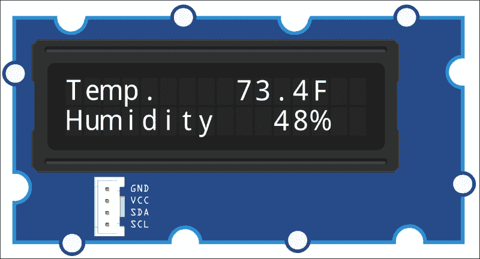
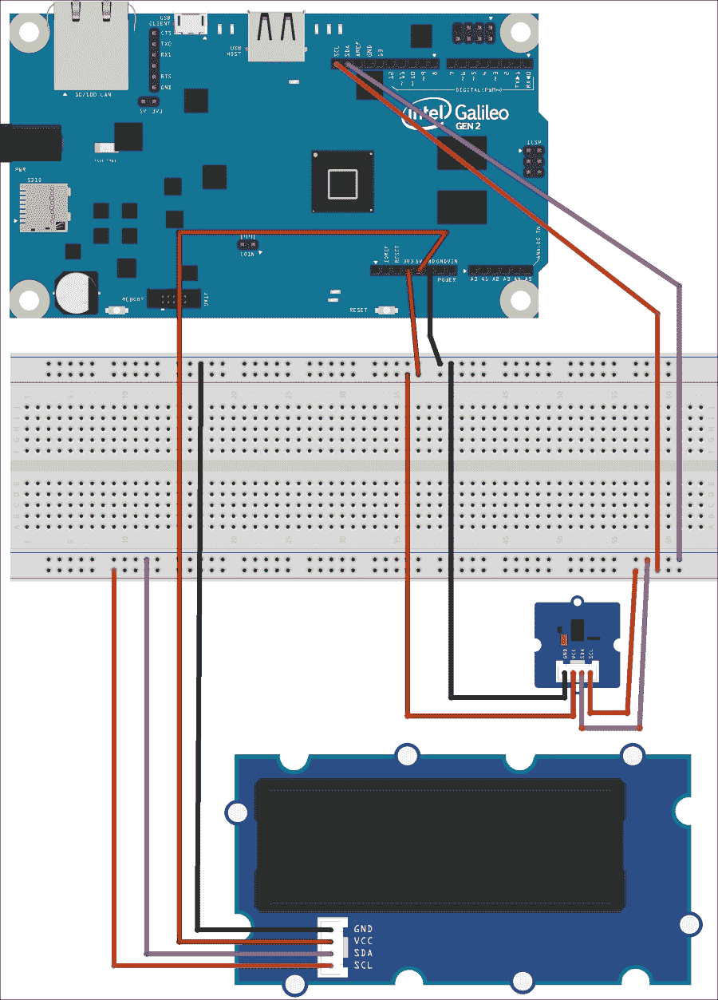
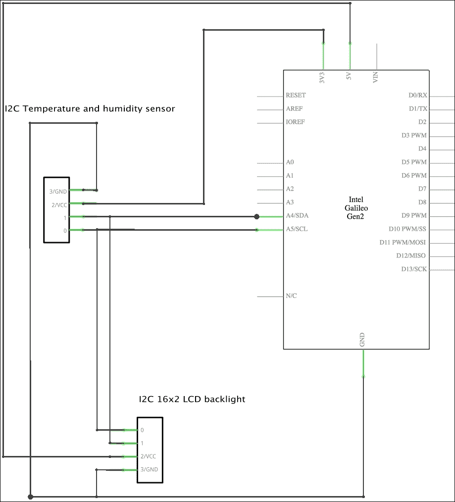
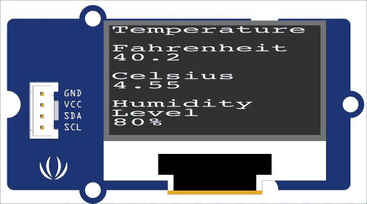
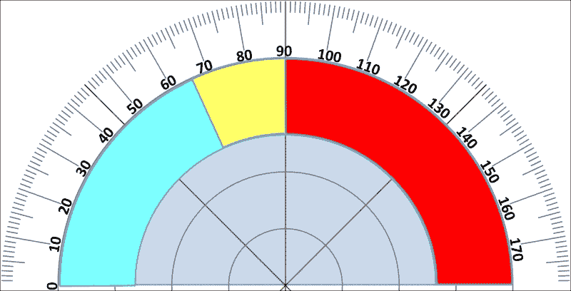
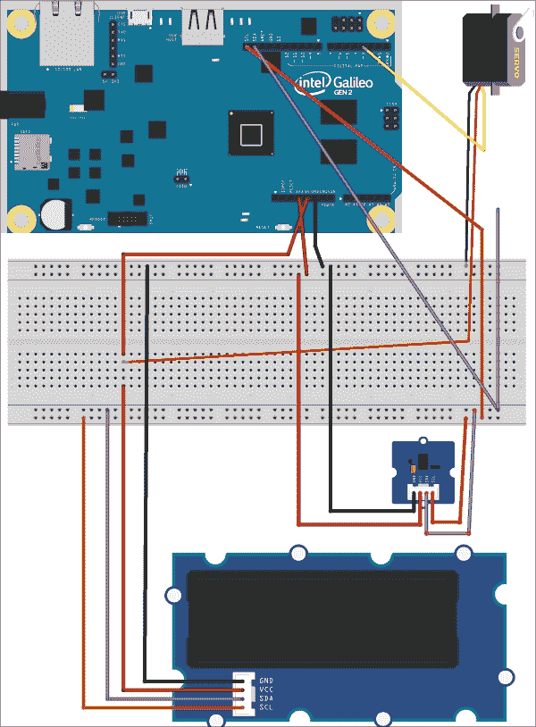
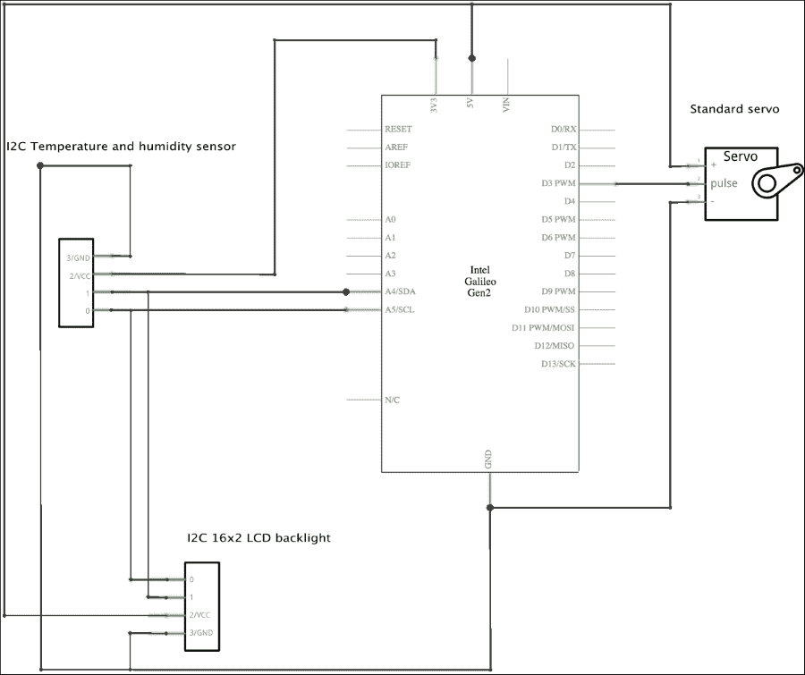

# 第八章. 显示信息并执行操作

在本章中，我们将使用各种扩展板和执行器，通过编写 Python 代码来显示数据和执行操作。我们将：

+   理解 LCD 显示屏及其连接类型

+   学习在选择 LCD 显示屏时必须考虑的最重要事项

+   利用 LCD 显示屏和执行器利用`upm`库

+   使用与 I²C 总线兼容的 RGB 背光 LCD 显示屏

+   在 16x2 LCD 屏幕上显示和更新文本

+   使用与 I²C 总线兼容的 OLED 显示屏

+   在 96x96 点阵 OLED 显示屏上显示和更新文本

+   将标准伺服电机连接到 PWM 进行控制

+   使用伺服电机和轴显示值

# 理解 LCD 显示屏及其连接类型

有时，我们的物联网设备必须通过连接到英特尔 Galileo Gen 2 板的任何设备向用户提供信息。我们可以使用不同类型的电子组件、屏蔽或扩展板来实现这一目标。

例如，我们可以使用简单的 LED 灯来提供可以用颜色表示的信息。例如，一个亮起的红色 LED 可以表示连接到板上的温度传感器检测到环境温度高于 80 华氏度（ºF）或 26.66 摄氏度（ºC）。一个亮起的蓝色 LED 可以表示我们的温度传感器检测到环境温度低于 40 华氏度（ºF）或 4.44 摄氏度（ºC）。一个亮起的红色 LED 可以表示温度介于这两个值之间。这三个 LED 灯使我们能够向用户提供有价值的信息。

我们也可以使用单个 RGB LED 并利用**脉冲宽度调制**（**PWM**）来根据测量的环境温度值改变其颜色，正如我们在第四章中学习的，*使用 RESTful API 和脉冲宽度调制*。

然而，有时颜色不足以向用户提供详细和准确的信息。例如，有时我们希望用百分比值显示湿度水平，而几个 LED 灯不足以表示从 0 到 100%的数字。如果我们想要能够显示 1%的步进值，我们就需要 100 个 LED 灯。我们没有 100 个 GPIO 引脚，因此我们需要一个带有 100 个 LED 灯和数字接口（如 I²C 总线）的屏蔽或扩展板，以便我们可以发送指示要打开的 LED 灯数量的命令。

在这些情况下，一个允许我们打印特定数量字符的液晶屏幕可能是一个合适的解决方案。例如，在一个允许我们每行显示 16 个字符的液晶屏幕上，有 2 行 16 个字符，称为 16x2 液晶模块，我们可以在第一行显示温度，在第二行显示湿度水平。以下表格显示了每一行文本和值的示例，考虑到我们有 16 列和 2 行字符。

| T | e | m | p | . |   |   |   |   | 4 | 0 | . | 2 | F |   |   |
| --- | --- | --- | --- | --- | --- | --- | --- | --- | --- | --- | --- | --- | --- | --- | --- |
| H | u | m | i | d | i | t | y |   |   |   | 8 | 0 | % |   |   |

16x2 液晶模块为每个值提供清晰的描述，包括浮点值和度量单位。因此，我们将使用 16x2 液晶模块作为示例。以下图片显示了 16x2 液晶屏幕中每个字符位置的示例：



有不同功能的液晶模块，我们必须考虑我们在第七章“使用传感器从现实世界获取数据”中分析传感器时学到的大量内容。以下列表列举了在选择液晶模块时我们必须考虑的最重要的因素及其描述。由于我们在学习传感器时分析了这些内容中的许多，因此我们不会重复常见项目的描述。

+   **与英特尔 Galileo Gen 2 板和我们所使用的电压供应（5V 或 3.3V）的兼容性**。

+   **功耗**。

+   **连接类型**：一些液晶显示器消耗太多的引脚，因此，检查它们所需的全部引脚非常重要。液晶显示器最常见的连接类型是 I²C 总线、SPI 总线和 UART 端口。然而，一些液晶显示器需要总线或端口与额外的 GPIO 引脚结合使用。

+   **工作范围和特殊环境要求**。

+   **尺寸**：液晶显示器有不同的尺寸。有时只有特定的尺寸适合我们的项目。

+   **列数和行数**：根据我们必须显示的文本，我们将选择具有适当列数和行数的液晶显示器，以便显示字符。

+   **响应时间**：确定我们能够等待液晶显示器显示替换正在显示的文本或清除显示器的新内容的时间非常重要。

+   **协议，upm 库中的支持以及 Python 绑定**。

+   **支持的字符集和内置字体**：一些液晶显示器支持用户自定义字符，因此，它们允许我们配置和显示自定义字符。检查液晶显示器是否支持我们必须显示的文本的语言中的字符也很重要。

+   **背光颜色、文本颜色和对比度级别**：一些 LCD 显示器允许我们更改背光颜色，而另一些则具有固定的背光颜色。RGB 背光使我们能够结合红色、绿色和蓝色组件来确定所需的背光颜色。此外，始终需要考虑对比度级别是否适合您需要显示信息的照明条件。

+   **成本**。

# 将 LCD RGB 背光连接到 I²C 总线

在我们的第七章“使用传感器从现实世界获取数据”的最后一个示例中，我们使用了一个多功能数字传感器，为我们提供了温度和相对湿度信息。我们使用了一个使用 I²C 总线允许 Intel Galileo Gen 2 板与传感器通信的扩展板。现在，我们将添加一个带有 16x2 LCD RGB 背光的扩展板，以便我们可以用文本和数字显示测量的温度和湿度值。

LCD RGB 背光扩展板也将连接到与温度和湿度数字传感器相同的 I²C 总线。只要它们的 I²C 地址不同，我们就可以在 Intel Galileo Gen 2 板上将许多从设备连接到 I²C 总线。实际上，LCD RGB 背光扩展板有两个 I²C 地址：一个用于 LCD 显示器，另一个用于背光。

我们需要以下部分来使用这个示例：

+   一块 SeeedStudio Grove 温度和湿度传感器（高精度和迷你）扩展板。以下网址提供了有关此扩展板的详细信息：[`www.seeedstudio.com/depot/Grove-TemperatureHumidity-Sensor-HighAccuracy-Mini-p-1921.html`](http://www.seeedstudio.com/depot/Grove-TemperatureHumidity-Sensor-HighAccuracy-Mini-p-1921.html)。

+   一块 SeeedStudio Grove LCD RGB 背光扩展板。以下网址提供了有关此扩展板的详细信息：[`www.seeedstudio.com/depot/Grove-LCD-RGB-Backlight-p-1643.html`](http://www.seeedstudio.com/depot/Grove-LCD-RGB-Backlight-p-1643.html)。

以下图表显示了数字温度和湿度扩展板、LCD RGB 背光扩展板、必要的连接以及从 Intel Galileo Gen 2 板到面包板的连接。该示例的 Fritzing 文件为`iot_fritzing_chapter_08_01.fzz`，以下图像是面包板视图：



以下图像显示了用符号表示的电子元件的原理图：



如前一个原理图所示，我们有以下连接：

+   **SDA**引脚连接到标记为**SDA**的扩展板引脚。这样，我们将数字温度和湿度传感器以及 LCD 背光连接到 I²C 总线的串行数据线。

+   **SCL** 引脚连接到标有 **SCL** 的扩展板引脚。这样，我们可以将数字温度和湿度传感器以及 LCD 背光连接到 I²C 总线的串行时钟线上。

+   标有 **3V3** 的电源引脚连接到标有 **VCC** 的数字温度和湿度传感器扩展板电源引脚。

+   标有 **5V** 的电源引脚连接到标有 **VCC** 的 LCD 背光扩展板电源引脚。

+   标有 **GND** 的地线连接到标有 **GND** 的扩展板引脚。

现在，是时候进行所有必要的接线了。在从板上的引脚添加或移除任何电线之前，不要忘记关闭 Yocto Linux，等待所有板载 LED 灯熄灭，并从 Intel Galileo Gen 2 板上拔掉电源。

# 在 LCD 显示器上显示文本

`upm` 库在 `pyupm_i2clcd` 模块中包括对 16x2 LCD RGB 背光扩展板的支持。在此模块中声明的 `Jhd1313m1` 类代表一个 16x2 LCD 显示屏及其 RGB 背光，连接到我们的板上。该类使得设置 RGB 背光的颜色组件、清除 LCD 显示、指定光标位置以及通过 I²C 总线写入文本变得简单。该类在幕后与 `mraa.I2c` 类一起工作，以与 RGB 背光和 LCD 显示进行通信。这两个设备作为连接到 I²C 总线的从设备，因此，它们在这个总线中都有特定的地址。

我们将使用上一章中编写的代码来读取传感器的温度和湿度值，并将此代码作为基准来添加新功能。示例代码文件为 `iot_python_chapter_07_05.py`。

我们将创建一个 `Lcd` 类来表示 16x2 LCD RGB 背光，并使我们在设置背景颜色和在不担心 `Jhd1313m1` 类实例的具体方法的情况下写入两行文本时更加容易。我们将使用 `Jhd1313m1` 类与 LCD 及其 RGB 背光进行交互。以下行显示了与 `upm` 库一起工作的新 `Lcd` 类的代码，特别是与 `pyupm_i2clcd` 模块一起工作。示例代码文件为 `iot_python_chapter_08_01.py`。

```py
import pyupm_th02 as upmTh02
import pyupm_i2clcd as upmLcd
import time

class Lcd:
    # The I2C address for the LCD display
    lcd_i2c_address = 0x3E
    # The I2C address for the RBG backlight
    rgb_i2c_address = 0x62

    def __init__(self, bus, red, green, blue):
        self.lcd = upmLcd.Jhd1313m1(
            bus,
            self.__class__.lcd_i2c_address,
            self.__class__.rgb_i2c_address)
        self.lcd.clear()
        self.set_background_color(red, green, blue)

    def set_background_color(self, red, green, blue):
        self.lcd.setColor(red, green, blue)

    def print_line_1(self, message):
        self.lcd.setCursor(0, 0)
        self.lcd.write(message)

    def print_line_2(self, message):
        self.lcd.setCursor(1, 0)
        self.lcd.write(message)
```

`Lcd` 类声明了两个类属性：`lcd_i2c_address` 和 `rgb_i2c_address`。第一个类属性定义了 LCD 显示的 I²C 地址，即当光标位于特定行和列时，将处理定位光标和写入文本的命令的地址。该地址为十六进制的 `3E`（即 `0x3E`）。如果我们只是在代码中看到 `0x3E`，我们不会理解它是一个 LCD 显示的 I²C 总线地址。第二个类属性定义了 RGB 背光的 I²C 地址，即处理设置背光红色、绿色和蓝色组件的命令的地址。该地址为十六进制的 `62`（即 `0x62`）。如果我们只是在代码中看到 `0x62`，我们不会理解它是一个 RGB 背光的 I²C 总线地址。这些类属性使得代码更容易阅读。

当我们在 `bus` 必要参数中创建 `Lcd` 类的实例时，我们必须指定连接到 16x2 LCD 和 RGB 背光的 I²C 总线编号。此外，还需要指定红色、绿色和蓝色颜色组件的值来配置 RGB 背光的背景颜色。构造函数，即 `__init__` 方法，使用接收到的 `bus` 参数以及 `lcd_i2c_address` 和 `rgb_i2c_address` 类属性创建一个新的 `upmLcd.Jhd1313m1` 实例，并将新实例的引用保存在 `lcd` 属性中。然后，代码调用新实例的 `clear` 方法来清除 LCD 屏幕。最后，代码调用 `set_background_color` 方法，并使用作为参数接收的红色、绿色和蓝色值来配置 RGB 背光的背景颜色。

该类声明了 `set_background_color` 方法，该方法使用接收到的 `red`、`green` 和 `blue` 值调用 `lcd.setColor` 方法。在底层，`upmLcd.Jhd1313m1` 实例将通过 I²C 总线将数据写入地址等于 `rgb_i2c_address` 类属性的从设备，以指定每个颜色组件的期望值。我们只是创建了一个特定方法来遵循 Python 命名约定，并使使用我们的类的最终代码更容易阅读。

该类定义了以下两个额外的方法，以便于在 LCD 显示的第一行和第二行打印文本：

+   `print_line_1`

+   `print_line_2`

`print_line_1`方法调用`upmLcd.Jhd1313m1`实例（`self.lcd`）的`setCursor`方法，其中`row`和`column`参数的值均为`0`，以将光标定位在第一行和第一列。然后，调用`upmLcd.Jhd1313m1`实例（`self.lcd`）的写入方法，将`message`作为参数传递，在 LCD 显示屏中打印接收到的字符串。在底层，`upmLcd.Jhd1313m1`实例将通过 I²C 总线将数据写入地址等于`lcd_i2c_address`类属性的从设备，以指定光标所需的位置，然后从我们定位光标的位置开始写入指定的文本。第一行用 0 标识，但我们将其命名为`print_line_1`，因为这使我们更容易理解我们正在在 LCD 屏幕的第一行写入消息。

`print_line_2`方法与`print_line_1`方法具有相同的两行代码，只是对`setCursor`方法的调用指定了`1`作为行参数的值。这样，该方法将在 LCD 屏幕的第二行打印消息。

现在，我们将创建一个名为`TemperatureAndHumidityLcd`的之前编写的`Lcd`类的子类。该子类将专门化`Lcd`类，使我们能够轻松地在 LCD 屏幕的第一行打印华氏度表示的温度值，并在第二行打印百分比表示的湿度值。以下行显示了新`TemperatureAndHumidityLcd`类的代码。示例的代码文件是`iot_python_chapter_08_01.py`。

```py
class TemperatureAndHumidityLcd(Lcd):
    def print_temperature(self, temperature_fahrenheit):
        self.print_line_1("Temp.    {:5.2f}F".format(temperature_fahrenheit))

    def print_humidity(self, humidity):
        self.print_line_2("Humidity   {0}%".format(humidity))
```

新的类（`TemperatureAndHumidityLcd`）向其超类（`Lcd`）添加了以下两个方法：

+   `print_temperature`：调用`print_line_1`方法，并使用在`temperature_fahrenheit`参数中接收到的格式化文本来显示温度值。

+   `print_humidity`：调用`print_line_2`方法，并使用在`humidity`参数中接收到的格式化文本来显示湿度水平。

现在，我们将编写一个循环，每 10 秒在 LCD 屏幕上显示环境温度（华氏度，ºF）和湿度值。示例的代码文件是`iot_python_chapter_08_01.py`。

```py
if __name__ == "__main__":
    temperature_and_humidity_sensor = \
        TemperatureAndHumiditySensor(0)
 lcd = TemperatureAndHumidityLcd(0, 0, 0, 128)

    while True:
        temperature_and_humidity_sensor.\
            measure_temperature_and_humidity()
 lcd.print_temperature(
 temperature_and_humidity_sensor.temperature_fahrenheit)
 lcd.print_humidity(
 temperature_and_humidity_sensor.humidity)
        print("Ambient temperature in degrees Celsius: {0}".
              format(temperature_and_humidity_sensor.temperature_celsius))
        print("Ambient temperature in degrees Fahrenheit: {0}".
              format(temperature_and_humidity_sensor.temperature_fahrenheit))
        print("Ambient humidity: {0}".
              format(temperature_and_humidity_sensor.humidity))
        # Sleep 10 seconds (10000 milliseconds)
        time.sleep(10)
```

突出的行显示了与上一个版本相比对`__main__`方法所做的更改。第一行突出显示了使用`0`作为`bus`参数的值、`0`用于`red`和`green`以及`128`用于`blue`来设置背景颜色为浅蓝色的新实例`TemperatureAndHumidityLcd`类的代码。该代码将此实例的引用保存到`lcd`局部变量中。这样，该实例将通过 I²C 总线与 LCD 屏幕和 RGB 背光建立通信。RGB 背光将显示浅蓝色背景。

然后，代码运行一个无限循环，并使用突出显示的行调用`lcd.print_temperature`方法，并使用`temperature_and_humidity_sensor.temperature_fahrenheit`作为参数，即以华氏度（ºF）表示的测量温度。这样，代码在 LCD 屏幕的第一行显示这个温度值。

下一条突出显示的行调用`lcd.print_humidity`方法，并使用`temperature_and_humidity_sensor.humidity`作为参数，即以百分比表示的测量湿度。这样，代码在 LCD 屏幕的第二行显示这个湿度值。

以下行将启动示例：

```py
python iot_python_chapter_08_01.py
```

在运行示例之后，打开空调或加热系统，以产生环境温度和湿度的变化。LCD 屏幕将显示温度和湿度，并且每 10 秒刷新一次。

# 将 OLED 点阵连接到 I²C 总线

当我们需要通过 I²C 或 SPI 总线在外部屏幕上显示内容时，LCD 显示屏并不是唯一的选择。还有一些 OLED 点阵，允许我们控制特定数量的点。在 OLED 点阵中，我们可以控制每个点，而不是控制每个字符空间。其中一些是灰度的，而另一些是 RGB 的。

OLED 点阵的关键优势在于我们可以显示任何类型的图形，而不仅仅是文本。实际上，我们可以将任何类型的图形和图像与文本混合。Grove OLED Display 0.96"是一个 16 灰度 96-by-96 点阵 OLED 显示屏模块的例子，它支持 I²C 总线。以下 URL 提供了关于这块扩展板的详细信息：[`www.seeedstudio.com/depot/Grove-OLED-Display-096-p-824.html`](http://www.seeedstudio.com/depot/Grove-OLED-Display-096-p-824.html)。Xadow RGB OLED 96x24 是一个 RGB 彩色 96-by-64 点阵 OLED 显示屏模块的例子，它支持 SPI 总线。以下 URL 提供了关于这块扩展板的详细信息：[`www.seeedstudio.com/depot/Xadow-RGB-OLED-96x64-p-2125.html`](http://www.seeedstudio.com/depot/Xadow-RGB-OLED-96x64-p-2125.html)。

### 小贴士

另一个选择是与 TFT LCD 点阵或显示屏一起工作。其中一些包括触摸检测的支持。

现在，我们将用一块带有 16 灰度 96-by-96 点阵的 OLED 显示屏的 16x2 LCD RGB 背光板来替换扩展板，这块显示屏也支持 I²C 总线，我们将使用这块新屏幕以不同的配置显示类似值。这些接线与之前的扩展板兼容。

如同我们之前的示例，点阵 OLED 也将连接到与温度和湿度数字传感器相同的 I²C 总线。由于点阵 OLED 的 I²C 地址与温度和湿度数字传感器使用的地址不同，因此我们不需要将两个设备连接到同一个 I²C 总线上。

我们需要以下额外的部件来使用此示例：一个 SeeedStudio Grove OLED 显示屏 0.96 英寸，16 灰度 96x96 点阵 OLED 显示模块。96x96 点阵 OLED 显示屏为我们提供了控制 9,216 个点，即像素的机会。然而，在这种情况下，我们只想使用 OLED 显示屏来显示类似于我们之前示例中的文本，但布局不同。

如果我们使用默认的 8x8 字符框，我们就有 12 列（96/8）和 12 行（96/8）用于字符。以下表格显示了每行文本及其值的示例。

| 温 | 度 |  |  |  |  |  |  |  |  |  |  |
| --- | --- | --- | --- | --- | --- | --- | --- | --- | --- | --- | --- |
|  |  |  |  |  |  |  |  |  |  |  |  |
| 法 | 雷 | 尼 | 哈恩 | 海 | 特 | 海 | 伊 | 特 |  |  |
| 4 | 0 | . | 2 |  |  |  |  |  |  |  |  |
|  |  |  |  |  |  |  |  |  |  |  |  |
| 细 | 节 |  |  |  |  |  |  |  |  |  |  |
| 4 | . | 5 | 5 |  |  |  |  |  |  |  |  |
|  |  |  |  |  |  |  |  |  |  |  |  |
| 湿 | 度 |  |  |  |  |  |  |  |  |  |  |
| 级 | 别 |  |  |  |  |  |  |  |  |  |  |
| 8 | 0 | % |  |  |  |  |  |  |  |  |  |
|  |  |  |  |  |  |  |  |  |  |  |  |

能够使用 12 列和 12 行的字符，使我们能够为每个值提供非常清晰的描述。此外，我们能够显示以华氏度和摄氏度表示的温度值。以下图片显示了带有 8x8 字符框的 96x96 点阵 OLED 显示模块中每个字符的位置示例。



在我们将 LCD 屏幕扩展板替换为 OLED 模块后，我们将有以下连接：

+   **SDA**引脚连接到标记为**SDA**的扩展板引脚。这样，我们将数字温度和湿度传感器以及 OLED 模块连接到 I²C 总线的串行数据线。

+   **SCL**引脚连接到标记为**SCL**的扩展板引脚。这样，我们将数字温度和湿度传感器以及 OLED 模块连接到 I²C 总线的串行时钟线。

+   标记为**3V3**的电源引脚连接到数字温度和湿度传感器扩展板的标记为**VCC**的电源引脚。

+   标记为**5V**的电源引脚连接到 OLED 模块的标记为**VCC**的电源引脚。

+   标记为**GND**的地线连接到标记为**GND**的扩展板引脚。

现在，是时候进行所有必要的接线了。在添加或从板上的引脚移除任何电线之前，不要忘记关闭 Yocto Linux，等待所有板载 LED 熄灭，并从 Intel Galileo Gen 2 板上拔掉电源。

# 在 OLED 显示屏上显示文本

`upm`库在`pyupm_i2clcd`模块中包括了对 SeeedStudio Grove OLED 显示屏 0.96 英寸、16 灰度 96x96 点阵 OLED 显示屏模块的支持。由于该 OLED 显示屏使用 SSD1327 驱动集成电路，因此在此模块中声明的`SSD1327`类代表一个 96x96 点阵 OLED 显示屏，连接到我们的板上。该类使得清除 OLED 屏幕、绘制位图图像、指定光标位置和通过 I²C 总线写入文本变得容易。该类在幕后与`mraa.I2c`类一起工作，以与 OLED 显示屏通信。

我们将创建一个新的`Oled`类，该类将代表 96x96 点阵 OLED 显示屏，并使用其默认的 8x8 字符框来显示文本。我们将使用`SSD1327`类与 OLED 显示屏进行交互。以下行显示了与`upm`库一起工作的新`Oled`类的代码，特别是与`pyupm_i2clcd`模块及其`SSD1327`类。示例代码文件为`iot_python_chapter_08_02.py`：

```py
class Oled:
    # The I2C address for the OLED display
    oled_i2c_address = 0x3C

    def __init__(self, bus, red, green, blue):
        self.oled = upmLcd.SSD1327(
            bus,
            self.__class__.oled_i2c_address)
        self.oled.clear()

    def print_line(self, row, message):
        self.oled.setCursor(row, 0)
        self.oled.setGrayLevel(12)
        self.oled.write(message)
```

`Oled`类声明了`oled_i2c_address`类属性，该属性定义了 OLED 显示屏的 I²C 地址，即一旦光标定位在特定的行和列，将处理定位光标和写入文本的命令的地址。该地址为十六进制的`3C`（`0x3C`）。

在创建`Oled`类的实例时，我们必须指定 OLED 显示屏所连接的 I²C 总线编号，该参数在`bus`必需参数中。构造函数，即`__init__`方法，使用接收到的`bus`参数和`oled_i2c_address`类属性创建一个新的`upmLcd. SSD1327`实例，并将新实例的引用保存在`oled`属性中。最后，代码调用新实例的`clear`方法以清除 OLED 屏幕。

该类声明了`print_line`方法，以便于在特定行上打印文本。代码调用`upmLcd.SSD1327`实例（`self.oled`）的`setCursor`方法，将接收到的`row`值作为`row`参数的值，并将`0`作为`column`参数的值，以将光标定位在指定的行和第一列。然后，调用`setGrayLevel`和`write`方法，将`upmLcd.SSD1327`实例（`self.oled`）的`message`接收作为参数的参数，以默认的 8x8 字符框和灰度设置为 12 打印接收到的字符串到 OLED 显示屏。在幕后，`upmLcd.SSD1327`实例将通过 I²C 总线将数据写入地址等于`oled_i2c_address`类属性的从设备，以指定光标所需的位置，然后从我们定位光标的位置开始写入指定的文本。

现在，我们将创建一个名为`TemperatureAndHumidityOled`的子类，该子类基于之前编写的`Oled`类。这个子类将专门化`Oled`类，使我们能够轻松地打印华氏度表示的温度值、摄氏度表示的温度值以及百分比表示的湿度值。我们将使用之前解释过的文本布局。以下行显示了新`TemperatureAndHumidityOled`类的代码。示例的代码文件是`iot_python_chapter_08_02.py`。

```py
class TemperatureAndHumidityOled(Oled):
    def print_temperature(self, temperature_fahrenheit, temperature_celsius):self.oled.clear()
        self.print_line(0, "Temperature")
        self.print_line(2, "Fahrenheit")
        self.print_line(3, "{:5.2f}".format(temperature_fahrenheit))
        self.print_line(5, "Celsius")
        self.print_line(6, "{:5.2f}".format(temperature_celsius))

    def print_humidity(self, humidity):
        self.print_line(8, "Humidity")
        self.print_line(9, "Level")
        self.print_line(10, "{0}%".format(humidity))
```

新的类（`TemperatureAndHumidityOled`）向其超类（`Oled`）添加了以下两个方法：

+   `print_temperature`: 多次调用`print_line`方法来显示接收到的温度参数，以华氏度（ºF）和摄氏度（ºC）的形式

+   `print_humidity`: 多次调用`print_line`方法来显示接收到的湿度参数

### 小贴士

在这种情况下，我们刷新许多行来更改仅几个值。由于我们将每 10 秒运行一个循环，所以这不会成为问题。然而，在其他情况下，如果我们想在更短的时间内更新值，我们可以编写优化后的代码，该代码仅清除单行并更新该行中的特定值。

现在，我们将编写一个循环，每 10 秒在 OLED 屏幕上显示以华氏度（ºF）和摄氏度（ºC）表示的环境温度以及以百分比表示的湿度值。示例的代码文件是`iot_python_chapter_08_02.py`。

```py
if __name__ == "__main__":
    temperature_and_humidity_sensor = \
        TemperatureAndHumiditySensor(0)
 oled = TemperatureAndHumidityOled(0)

    while True:
        temperature_and_humidity_sensor.\
            measure_temperature_and_humidity()
 oled.print_temperature(
 temperature_and_humidity_sensor.temperature_fahrenheit,
 temperature_and_humidity_sensor.temperature_celsius)
 oled.print_humidity(
 temperature_and_humidity_sensor.humidity)
        print("Ambient temperature in degrees Celsius: {0}".
              format(temperature_and_humidity_sensor.temperature_celsius))
        print("Ambient temperature in degrees Fahrenheit: {0}".
              format(temperature_and_humidity_sensor.temperature_fahrenheit))
        print("Ambient humidity: {0}".
              format(temperature_and_humidity_sensor.humidity))
        # Sleep 10 seconds (10000 milliseconds)
        time.sleep(10)
```

高亮行显示了与上一个版本相比在`__main__`方法中做出的更改。第一条高亮行使用`0`作为`bus`参数的值创建了一个之前编写的`TemperatureAndHumidityOled`类的实例。代码将此实例的引用保存在`oled`局部变量中。这样，实例将通过 I²C 总线与 OLED 屏幕建立通信。

然后，代码无限循环运行，高亮行调用`oled.print_temperature`方法，并使用`temperature_and_humidity_sensor.temperature_fahrenheit`和`temperature_and_humidity_sensor.temperature_celsius`作为参数。这样，代码在 OLED 屏幕的第一行显示这两个温度值。

下一条高亮行调用了`oled.print_humidity`方法，并使用`temperature_and_humidity_sensor.humidity`。这样，代码通过多行来显示这个湿度值在 OLED 屏幕的底部。

以下行将启动示例：

```py
python iot_python_chapter_08_02.py
```

运行示例后，打开空调或加热系统以产生环境温度和湿度的变化。OLED 屏幕将显示温度和湿度，并且每 10 秒刷新一次。

# 连接伺服电机

到目前为止，我们一直在使用传感器从现实世界获取数据，并在液晶显示屏和 OLED 显示屏上显示信息。然而，物联网设备并不仅限于感应和显示数据，它们还可以移动物体。我们可以将不同的组件、屏蔽或分线板连接到我们的英特尔 Galileo Gen 2 板上，并编写 Python 代码来移动连接到板上的物体。

标准伺服电机对于精确控制轴并使其在 0 到 180 度之间的各种角度定位非常有用。在第四章中，*使用 RESTful API 和脉冲宽度调制*，我们使用了脉冲宽度调制，简称 PWM，来控制 LED 和 RGB LED 的亮度。我们还可以使用 PWM 来控制标准模拟伺服电机，并使其轴在特定角度定位。

### 小贴士

标准伺服电机是包含齿轮和反馈控制回路电路的直流电机，它提供了精确的位置定位。它们非常适合齿轮转向、机器人手臂和腿部，以及其他需要精确定位的应用。标准伺服电机不需要电机驱动器。

显然，不是所有的伺服电机都具有相同的特性，我们在为我们的项目选择特定的伺服电机时必须考虑许多因素。这取决于我们需要定位什么，精度，所需的扭矩，最佳伺服电机旋转速度等因素。在这种情况下，我们将专注于使用 PWM 定位标准伺服电机。然而，你不能用同一个伺服电机旋转比你需要旋转的重型机械臂更轻的塑料件。对于每个任务，有必要研究合适的伺服电机。

现在，我们将把标准高灵敏度微型伺服电机连接到我们的现有项目中，并将旋转轴以华氏度数显示测量的温度。轴将允许我们在半圆形的量角器上显示测量的温度，该量角器以度为单位测量角度，并将显示从 0 到 180 度的角度数值。伺服电机与轴和量角器的组合将允许我们通过移动部件显示温度。然后，我们可以创建自己的量角器，带有可以添加颜色、特定阈值和许多其他视觉效果的刻度，使温度测量更有趣。具体来说，我们可以创建一个仪表盘图表、速度计或半圆形甜甜圈，即一个饼图和甜甜圈的组合，在单个图表中显示不同的温度值。以下图片显示了我们可以与伺服电机和轴一起使用的半圆形量角器示例。



我们需要以下附加部件来使用此示例：SeeedStudio Grove 伺服或 EMAX 9g ES08A 高灵敏度迷你伺服。以下网址提供了关于这些伺服的详细信息：[`www.seeedstudio.com/depot/Grove-Servo-p-1241.html`](http://www.seeedstudio.com/depot/Grove-Servo-p-1241.html) 和 [`www.seeedstudio.com/depot/EMAX-9g-ES08A-High-Sensitive-Mini-Servo-p-760.html`](http://www.seeedstudio.com/depot/EMAX-9g-ES08A-High-Sensitive-Mini-Servo-p-760.html)。

下图显示了数字温度和湿度扩展板、LCD RGB 背光扩展板、迷你伺服、必要的布线以及从 Intel Galileo Gen 2 板到面包板的布线。示例的 Fritzing 文件为`iot_fritzing_chapter_08_03.fzz`，以下图片是面包板视图：



下图显示了用符号表示的电子组件的原理图：



如前图所示，我们在现有项目中添加了以下附加连接：

+   在电路符号中标有**5V**的电源针与标有**+**的伺服针相连。伺服通常使用红色电线进行此连接。

+   在电路符号中标有**D3 PWM**的具有 PWM 功能的 GPIO 针与标有**PULSE**的伺服针相连。伺服通常使用黄色电线进行此连接。

+   在电路符号中标有**GND**的接地针与标有**-**的伺服针相连。伺服通常使用黑色电线进行此连接。

现在，是时候进行所有必要的布线了。在添加或从板上的引脚移除任何电线之前，不要忘记关闭 Yocto Linux，等待所有板载 LED 熄灭，并从 Intel Galileo Gen 2 板上拔掉电源。

# 使用伺服电机定位轴以指示值

我们可以使用`mraa.Pwm`类来控制标有**~3**的具有 PWM 功能的 GPIO 针上的 PWM，正如我们在第四章中学习的，*使用 RESTful API 和脉宽调制*。然而，这需要我们阅读伺服的详细规格。`upm`库在`pyupm_servo`模块中包括了对 SeeedStudio Grove 伺服或 EMAX 9g ES08A 高灵敏度迷你伺服的支持。在此模块中声明的`ES08A`类代表连接到我们板上的两种提到的伺服器中的任何一个。

该类使得设置伺服轴所需的角度并使用角度而不是占空比和其他 PWM 细节进行工作变得容易。该类在幕后与`mraa.Pwm`类一起工作以配置 PWM 并根据轴所需的角度控制占空比。

我们将使用之前示例中编写的代码，并将此代码作为添加新功能的基准。示例代码文件为`iot_python_chapter_08_02.py`。

我们将创建一个`TemperatureServo`类来表示伺服器，并使我们能够根据华氏度表示的温度将轴定位在有效角度（从 0 到 180 度）内。我们将使用`ES08A`类与伺服器交互。以下行显示了与`upm`库一起工作的新`TemperatureServo`类的代码，特别是与`pyupm_servo`模块一起工作。示例的代码文件是`iot_python_chapter_08_03.py`。

```py
import pyupm_th02 as upmTh02
import pyupm_i2clcd as upmLcd
import pyupm_servo as upmServo
import time

class TemperatureServo:
    def __init__(self, pin):
        self.servo = upmServo.ES08A(pin)
        self.servo.setAngle(0)

    def print_temperature(self, temperature_fahrenheit):
        angle = temperature_fahrenheit
        if angle < 0:
            angle = 0
        elif angle > 180:
            angle = 180
        self.servo.setAngle(angle)
```

在创建`TemperatureServo`类的实例时，我们必须指定与伺服器连接的引脚号，作为`pin`必需参数。构造函数，即`__init__`方法，使用接收到的`pin`作为其`pin`参数创建一个新的`upmServo.ES08A`实例，将其引用保存在`servo`属性中，并调用其`setAngle`方法，将`0`作为`angle`必需参数的值。这样，底层代码将根据`angle`参数中接收到的值配置 PWM 启用 GPIO 引脚的输出占空比，以将轴定位在所需的角位置。在这种情况下，我们希望轴定位在 0 度。

该类定义了一个`print_temperature`方法，该方法接收一个以华氏度（ºF）表示的温度值，作为`temperature_fahrenheit`参数。代码定义了一个`angle`局部变量，确保所需的轴角度在有效范围内：从 0 到 180 度（包括）。如果`temperature_fahrenheit`参数中接收到的值低于`0`，则`angle`值将为`0`。如果`temperature_fahrenheit`参数中接收到的值大于`180`，则`angle`值将为`180`。然后，代码使用`angle`作为参数调用`upmServo.ES08A`实例（`self.servo`）的`setAngle`方法。在底层，`upmServo.ES08A`实例将根据`angle`参数中接收到的值配置 PWM 启用 GPIO 引脚的输出占空比，以将轴定位在所需的角位置。这样，只要温度值在 0 到 180 华氏度（ºF）之间，轴将定位在与其接收到的华氏度（ºF）温度相同的角位置。

如果温度太低（低于 0 华氏度），则轴将保持在 0 度角度。如果温度高于 180 华氏度，则轴将保持在 180 度角度。

现在，我们将修改我们的主循环，每 10 秒显示以华氏度（ºF）表示的环境温度，并用轴表示。示例的代码文件是`iot_python_chapter_08_03.py`。

```py
if __name__ == "__main__":
    temperature_and_humidity_sensor = \
        TemperatureAndHumiditySensor(0)
    oled = TemperatureAndHumidityOled(0)
 temperature_servo = TemperatureServo(3)
    while True:

        temperature_and_humidity_sensor.\
            measure_temperature_and_humidity()
        oled.print_temperature(
            temperature_and_humidity_sensor.temperature_fahrenheit,
            temperature_and_humidity_sensor.temperature_celsius)
        oled.print_humidity(
            temperature_and_humidity_sensor.humidity)
 temperature_servo.print_temperature(
 temperature_and_humidity_sensor.temperature_fahrenheit)
        print("Ambient temperature in degrees Celsius: {0}".
              format(temperature_and_humidity_sensor.temperature_celsius))
        print("Ambient temperature in degrees Fahrenheit: {0}".
              format(temperature_and_humidity_sensor.temperature_fahrenheit))
        print("Ambient humidity: {0}".
              format(temperature_and_humidity_sensor.humidity))
        # Sleep 10 seconds (10000 milliseconds)
        time.sleep(10)
```

突出的行显示了与上一个版本相比对`__main__`方法所做的更改。第一条突出显示的行使用`3`作为`pin`参数的值创建了一个先前编码的`TemperatureServo`类的实例。代码将此实例的引用保存在`temperature_servo`局部变量中。这样，该实例将为 3 号引脚配置 PWM 并将轴定位在`0`度。

然后，代码无限循环运行，突出显示的行调用`temperature_servo.print_temperature`方法，并将`temperature_and_humidity_sensor.temperature_fahrenheit`作为参数。这样，代码使轴指向温度计中的温度值。

以下行将开始示例。

```py
python iot_python_chapter_08_03.py
```

在运行示例后，打开空调或供暖系统并生成环境温度的变化。您将注意到轴每 10 秒开始移动以反映温度的变化。

# 测试你的知识

1.  英特尔 Galileo Gen 2 板可以作为 I²C 总线主控器，并允许我们：

    1.  只要它们的 I²C 地址不同，就可以将许多从设备连接到 I²C 总线上。

    1.  只要它们的 I²C 地址相同，就可以将许多从设备连接到 I²C 总线上。

    1.  只要它们的 I²C 地址不同，就可以将最多两个从设备连接到 I²C 总线上。

1.  一个 16x2 液晶模块允许我们显示：

    1.  每行 16 个字符，共两行。

    1.  每行 16 个字符，每个字符 2 个。

    1.  每行 16 个字符，每个字符 3 个。

1.  一个 16 灰度 96x96 点阵 OLED 显示器模块允许我们控制：

    1.  每行 96 个字符，共 96 行。

    1.  一行有 96 个点或 96 个字符，具体取决于我们如何配置 OLED 显示器。

    1.  9,216 个点（96*96）。

1.  一个 16 灰度 96x96 点阵 OLED 显示器，带有 8x8 字符框，允许我们显示：

    1.  每行 96 个字符，共 96 行：96 列和 96 行。

    1.  每行 16 个字符，共 16 行：16 列和 16 行。

    1.  每行 12 个字符，共 12 行：12 列和 12 行。

1.  标准伺服允许我们：

    1.  在 OLED 显示器上显示文本。

    1.  将轴定位在各个特定角度。

    1.  通过指定所需的纬度和经度来将轴移动到特定位置。

# 摘要

在本章中，我们学习了我们可以通过 I²C 总线连接到我们的板上的不同显示器。我们使用了一个液晶显示器、一个 RGB 背光，然后将其替换为 OLED 点阵。

我们编写了利用`upm`库中包含的模块和类来简化我们与 LCD 和 OLED 显示屏以及在其上显示文本的代码。此外，我们还编写了与模拟伺服电机交互的代码。我们不是编写自己的代码来根据轴的期望位置设置输出占空比，而是利用了`upm`库中的一个特定模块和一个类。我们可以控制轴，以便创建一个仪表图表来显示通过传感器获取的温度值。我们的 Python 代码可以使物体移动。

现在我们能够将数据展示在黑板上并使用伺服电机，我们将把我们的物联网设备连接到整个世界，并使用云服务，这正是下一章的主题。
