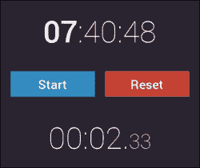
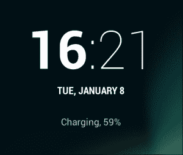
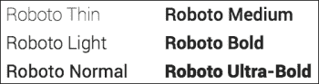
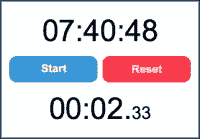
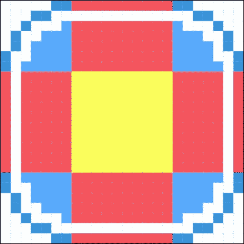
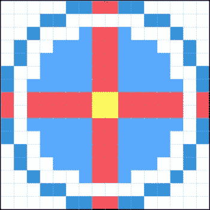
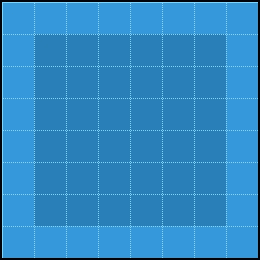
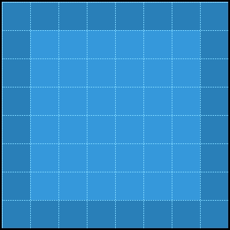

# 第一章. 构建时钟应用

本书将引导你创建九个小 Kivy 程序，每个程序都类似于 Kivy 框架在现实世界中的实际应用案例。在许多情况下，框架将与适合当前任务的 Python 模块一起使用。我们将看到 Kivy 提供了大量的灵活性，使我们能够以干净、简洁的方式解决各种不同的问题。

让我们从简单开始。在本章中，我们将构建一个简单的时钟应用，其概念类似于 iOS 和 Android 中内置的应用程序。在本章的第一部分，我们将创建一个非交互式的数字时钟显示并对其进行样式设计，使我们的程序具有类似 Android 的扁平外观。我们还将简要讨论事件驱动的程序流程和 Kivy 主循环，介绍用于执行重复任务的计时器，例如每帧更新屏幕。

在本章的第二部分，我们将添加计时器显示和控制功能，创建一个适合任何屏幕尺寸和方向的流畅布局。计时器自然需要用户交互，我们将最后实现它。

本章介绍的重要主题如下：

+   Kivy 语言的基礎，这是一个用于布局小部件的内置**领域特定语言**（**DSL**）

+   样式（以及最终子类化）内置的 Kivy 组件

+   加载自定义字体和格式化文本

+   调度和监听事件

我们完成的程序，如以下截图所示，将只有大约 60 行长，Python 源代码和 Kivy 语言（`.kv`）界面定义文件各占一半。



我们将要构建的时钟应用最终外观。

# 起始点

我们在序言中的“Hello, Kivy”示例是本应用的合适起点。我们只需要添加一个布局容器，`BoxLayout`，这样我们就可以在屏幕上放置多个小部件。

到目前为止，这是完整的源代码：

```py
# File: main.py
from kivy.app import App

class ClockApp(App):
    pass

if __name__ == '__main__':
    ClockApp().run()

# File: clock.kv
BoxLayout:
    orientation: 'vertical'

    Label:
        text: '00:00:00'
```

目前，它的外观和行为与之前看到的“Hello, world”应用完全一样。`BoxLayout`容器允许两个或更多子小部件并排存在，垂直或水平堆叠。给定一个嵌套小部件，如前面的代码所示，`BoxLayout`将所有可用的屏幕空间填充为它，因此实际上几乎看不见（就像`Label`是根小部件一样，接管了应用程序窗口）。我们将在稍后更详细地回顾布局。

### 注意

注意，虽然我们可以将`main.py`文件命名为任何我们想要的名称，但`clock.kv`文件是由 Kivy 自动加载的，因此必须以应用程序类的名称命名。例如，如果我们的应用程序类名为`FooBarApp`，相应的`.kv`文件应命名为`foobar.kv`（类名转换为小写且不带`-app`后缀）。严格遵循此命名约定可以让我们避免手动加载 Kivy 语言文件，这无疑是件好事——更少的代码行数就能达到相同的结果。

# 现代用户界面

在撰写本文时，扁平化设计范式在界面设计领域正流行，系统地接管了每一个平台，无论是 Web、移动还是桌面。这种范式转变的突出例子包括 iOS 7 及其后续版本和 Windows 8 及其后续版本。互联网公司随后效仿，在 2014 年 Google I/O 大会上提出了“材料设计原则”，以及许多其他 HTML5 框架，包括那些已经建立起来的，例如 Bootstrap。

方便的是，扁平化设计强调内容而非展示，省略了照片般的阴影和详细的纹理，转而使用纯色和简单的几何形状。这种设计在程序上创建起来比“老式”的拟物化设计要简单得多，后者往往视觉丰富且富有艺术性。

### 注意

**拟物主义**是用户界面设计的一种常见方法。其特点是应用程序在视觉上模仿其现实世界的对应物，例如，一个计算器应用程序具有与廉价物理计算器相同的按钮布局和外观感觉。这可能有助于或可能不助于用户体验（取决于你问谁）。

为了更简单、更流畅的界面而放弃视觉细节，这似乎是今天每个人都正在走的方向。另一方面，仅从彩色矩形等元素中构建一个独特、令人难忘的界面自然具有挑战性。这就是为什么扁平化设计通常与良好的排版同义；根据应用的不同，文本几乎总是 UI 的一个重要部分，因此我们希望它看起来很棒。

## 设计灵感

仿效是最高形式的恭维，我们将仿效来自 Android 4.1 姜饼的时钟设计。这种设计的独特之处在于字体粗细对比。直到 4.4 KitKat 版本中进行了更改，默认时钟曾经看起来是这样的：



在 Android 姜饼版锁屏上看到的时钟。

使用的字体是 Roboto，这是 Google 在 Android 4.0 冰激凌三明治中取代 Droid 字体家族的 Android 字体。

Roboto 可用于商业用途，并受 Apache 许可的宽松许可。可以从 Google Fonts 或来自出色的 Font Squirrel 库[`www.fontsquirrel.com/fonts/roboto`](http://www.fontsquirrel.com/fonts/roboto)下载。

## 加载自定义字体

当谈到排版时，Kivy 默认使用 Droid Sans——谷歌早期的字体。用自定义字体替换 Droid 很容易，因为 Kivy 允许我们为文本小部件（在这种情况下，`Label`）指定`font_name`属性。

在最简单的情况下，当我们只有一种字体变体时，我们可以在小部件的定义中直接分配`.ttf`文件名：

```py
Label:
    font_name: 'Lobster.ttf'
```

然而，对于上述设计，我们希望有不同的字体重量，所以这种方法行不通。原因是字体的每个变体（例如，粗体或斜体）通常都生活在单独的文件中，而我们只能将一个文件名分配给`font_name`属性。

在我们的用例中，涉及到多个`.ttf`文件，`LabelBase.register`静态方法提供了更好的解决方案。它接受以下参数（所有参数都是可选的），以 Roboto 字体家族为例：

```py
# In Python code
LabelBase.register(name="Roboto",
    fn_regular="Roboto-Regular.ttf",
    fn_bold="Roboto-Bold.ttf",
    fn_italic="Roboto-Italic.ttf",
    fn_bolditalic="Roboto-BoldItalic.ttf")
```

在调用此方法后，可以设置小部件的`font_name`属性为之前注册的字体家族名称，在这种情况下是`Roboto`。

这种方法有两个限制需要注意：

+   Kivy 只接受 TrueType `.ttf`字体文件。如果字体打包为 OpenType `.otf`或`.woff`这样的网络字体格式，您可能需要先进行转换。这可以通过 FontForge 编辑器轻松完成，该编辑器可以在[`fontforge.org/`](http://fontforge.org/)找到。

+   每种字体最多有四种可能的样式：正常、斜体、粗体和粗斜体。对于像 Droid Sans 这样的旧字体家族来说，这没问题，但许多现代字体包括从 4 种到 20 种以上的样式，具有不同的字体重量和其他功能。我们即将使用的 Roboto 至少有 12 种样式。



Roboto 字体的六种字体重量

第二点强制我们选择在应用程序中使用的字体样式，因为我们不能随意使用所有 12 种，这本身就是一个糟糕的想法，因为它会导致文件大小大幅增加，例如在 Roboto 字体家族中，可能增加到 1.7 兆字节。

对于这个特定的应用程序，我们只需要两种样式：一种较轻的样式（`Roboto-Thin.ttf`）和一种较重的样式（`Roboto-Medium.ttf`），我们分别将它们分配给`fn_regular`和`fn_bold`：

```py
from kivy.core.text import LabelBase

LabelBase.register(name='Roboto',
                   fn_regular='Roboto-Thin.ttf',
                   fn_bold='Roboto-Medium.ttf')
```

这段代码应该放在`main.py`中的`__name__ == '__main__'`行之后，因为它需要在从 Kivy 语言定义创建界面之前运行。当应用程序类被实例化时，可能已经太晚执行这种基本初始化了。这就是为什么我们必须提前这样做。

现在我们已经设置了自定义字体，接下来要做的就是将其分配给我们的`Label`小部件。这可以通过以下代码完成：

```py
# In clock.kv
Label:
    text: '00:00:00'
    font_name: 'Roboto'
    font_size: 60
```

## 文本格式化

目前最流行且普遍使用的标记语言无疑是 HTML。另一方面，Kivy 实现了一种 BBCode 的变体，这是一种曾经用于在许多论坛上格式化帖子的标记语言。与 HTML 的明显区别是 BBCode 使用方括号作为标签分隔符。

以下标签在 Kivy 中可用：

| BBCode 标签 | 文本效果 |
| --- | --- |
| `[b]...[/b]` | **加粗** |
| `[i]...[/i]` | *斜体* |
| `[font=Lobster]...[/font]` | 更改字体 |
| `[color=#FF0000]...[/color]` | 使用 CSS 类似的语法设置颜色 |
| `[sub]...[/sub]` | 下标（位于行下方的文本） |
| `[sup]...[/sup]` | 上标（位于行上方的文本） |
| `[ref=name]...[/ref]` | 可点击区域，HTML 中的 `<a href="…">` |
| `[anchor=name]` | 命名位置，HTML 中的 `<a name="…">` |

### 提示

这绝对不是一份详尽的参考，因为 Kivy 正在积极开发，自本文编写以来可能已经发布了多个版本，增加了新功能并改进了现有功能。请参考官方网站（[`kivy.org`](http://kivy.org)）上找到的 Kivy 文档，以获取最新的参考手册。

让我们回到我们的项目。为了达到所需的格式（小时加粗，其余文本使用 `fn_regular` 轻细字体），我们可以使用以下代码：

```py
Label:
    text: '[b]00[/b]:00:00'
    markup: True
```

Kivy 的 BBCode 风味只有在我们也设置了小部件的 `markup` 属性为 `True` 时才有效，如前述代码所示。否则，你将直接在屏幕上看到字符串 `[b]…[/b]` 被显示出来，这显然不是我们想要的。

注意，如果我们想使整个文本加粗，没有必要将所有内容都放在 `[b]…[/b]` 标签内；我们只需将小部件的 `bold` 属性设置为 `True`。同样的方法也适用于斜体、颜色、字体名称和大小——几乎所有的配置都可以全局设置，从而影响整个小部件，而不需要修改标记。

## 更改背景颜色

在本节中，我们将调整窗口的背景颜色。窗口背景（OpenGL 渲染器的“清除颜色”）是全局 `Window` 对象的一个属性。为了更改它，我们在 `main.py` 中的 `__name__ == '__main__'` 行之后添加此代码：

```py
from kivy.core.window import Window
from kivy.utils import get_color_from_hex

Window.clearcolor = get_color_from_hex('#101216')
```

`get_color_from_hex` 函数并非严格必需，但使用起来很方便，因为它允许我们使用 CSS 风格的 (`#RRGGBB`) 颜色代替 `(R, G, B)` 元组来编写代码。而且使用 CSS 颜色至少有以下两个优点：

+   **阅读时的认知负担更小**：当你熟悉这种表示法时，`#FF0080` 值会立即被识别为颜色，而 (255, 0, 128) 只是一组数字，其用途可能因上下文而异。`#FF0080` 的浮点变体 (1.0, 0.0, 0.50196) 甚至更糟。

+   **简单且明确的搜索**：元组可以任意格式化，而 CSS 类似的颜色表示法是统一的，尽管不区分大小写。在大多数文本编辑器中进行不区分大小写的搜索非常简单，相比之下，在漫长的 Python 列表中定位给定元组的所有实例则可能更具挑战性，这可能需要正则表达式等工具，因为元组的格式不需要保持一致。

### 提示

关于 `#RRGGBB` 颜色格式的更多信息可以在 Mozilla 开发者网络中找到：[`developer.mozilla.org/en-US/docs/Web/Guide/CSS/Getting_started/Color`](https://developer.mozilla.org/en-US/docs/Web/Guide/CSS/Getting_started/Color)。

我们将在稍后讨论 Kivy 的设计相关特性。同时，让我们让我们的应用程序真正显示时间。

# 使时钟滴答

UI 框架大多是事件驱动的，Kivy 也不例外。与“常规”过程代码的区别很简单——事件驱动代码需要经常返回到主循环；否则，它将无法处理来自用户（如指针移动、点击或窗口调整大小）的事件，界面将“冻结”。如果你是长期使用 Microsoft Windows 的用户，你可能熟悉那些经常无响应和冻结的程序。在我们的应用程序中绝对不能让这种情况发生。

实际上，这意味着我们无法在我们的程序中简单地编写一个无限循环：

```py
# Don't do this
while True:
    update_time()  # some function that displays time
    sleep(1)
```

从技术上讲，这可能可行，但应用程序的 UI 将保持在“未响应”状态，直到用户或操作系统强制停止应用程序。与其采取这种错误的方法，我们应牢记 Kivy 内部有一个主循环正在运行，我们需要通过利用事件和计时器来利用它。

事件驱动架构还意味着在许多地方，我们将监听事件以响应各种条件，无论是用户输入、网络事件还是超时。

许多程序监听的一个常见事件是 `App.on_start`。如果在这个应用程序类中定义了具有此名称的方法，那么一旦应用程序完全初始化，该方法就会被调用。另一个在许多程序中都会找到的事件示例是 `on_press`，当用户点击、轻触或以其他方式与按钮交互时，它会触发。

说到时间和计时器，我们可以使用内置的 `Clock` 类轻松地安排我们的代码在未来运行。它公开以下静态方法：

+   `Clock.schedule_once`：在超时后运行一次函数

+   `Clock.schedule_interval`：定期运行函数

### 注意

任何有 JavaScript 背景的人都会很容易识别这两个函数。它们与 JS 中的 `window.setTimeout` 和 `window.setInterval` 完全一样。实际上，尽管 API 完全不同，Kivy 的编程模型与 JavaScript 非常相似。

重要的是要理解，所有源自 `Clock` 的定时事件都作为 Kivy 主事件循环的一部分运行。这种方法与线程不同，调度这种阻塞函数可能会阻止其他事件及时或根本无法被调用。

## 更新屏幕上的时间

要访问包含时间的 `Label` 小部件，我们将给它一个唯一的标识符（`id`）。稍后，我们可以根据它们的 `id` 属性轻松查找小部件——这又是一个与网络开发非常相似的概念。

通过添加以下内容修改 `clock.kv`：

```py
Label:
    id: time
```

就这些！现在我们可以直接使用`root.ids.time`的表示法（在我们的例子中是`BoxLayout`）从我们的代码中访问这个`Label`小部件。

`ClockApp`类的更新包括添加一个显示时间的`update_time`方法，如下所示：

```py
def update_time(self, nap):
    self.root.ids.time.text = strftime('[b]%H[/b]:%M:%S')
```

现在让我们安排更新函数在程序启动后每秒运行一次：

```py
def on_start(self):
    Clock.schedule_interval(self.update_time, 1)
```

如果我们现在运行应用程序，我们会看到显示的时间每秒都在更新。用尼尔·阿姆斯特朗的话来说，这是人类迈出的一小步，但对于 Kivy 初学者来说是一大步。

值得注意的是，`strftime`函数的参数是如何将之前描述的 Kivy 的 BBCode-like 标签与特定函数的 C 样式格式指令结合起来的。对于不熟悉的人来说，这里有一个关于`strftime`格式化基本内容的快速且不完整的参考：

| 格式字符串（区分大小写） | 结果输出 |
| --- | --- |
| `%S` | 秒，通常是`00`到`59` |
| `%M` | 分钟，从`00`到`59` |
| `%H` | 按照 24 小时制的时，从`00`到`23` |
| `%I` | 按照 12 小时制的时，从`01`到`12` |
| `%d` | 月份中的天数，从`01`到`31` |
| `%m` | 月份（数字），从`01`到`12` |
| `%B` | 月份（字符串），例如，“十月” |
| `%Y` | 四位数的年份，例如`2016` |

### 小贴士

关于显示时间的最完整和最新的文档，请参阅官方参考手册——在这种情况下，Python 标准库参考，位于[`docs.python.org/`](https://docs.python.org/)。

## 使用属性绑定小部件

我们不仅可以通过 Python 代码为每个需要访问的小部件硬编码一个 ID，还可以在 Kivy 语言文件中创建一个属性并为其赋值。这样做的主要动机是**DRY**原则和更清晰的命名，代价是代码行数稍微多了些。

这样的属性可以这样定义：

```py
# In main.py
from kivy.properties import ObjectProperty
from kivy.uix.boxlayout import BoxLayout

class ClockLayout(BoxLayout):
    time_prop = ObjectProperty(None)
```

在这个代码片段中，我们基于`BoxLayout`为我们的应用程序创建一个新的根小部件类。它有一个自定义属性，`time_prop`，它将引用我们需要从 Python 代码中引用的`Label`。

此外，在 Kivy 语言文件`clock.kv`中，我们必须将这个属性绑定到一个相应的`id`上。自定义属性看起来和行为与默认属性没有区别，并且使用完全相同的语法：

```py
ClockLayout:
    time_prop: time

    Label:
        id: time
```

这段代码通过使用新定义的属性`root.time_prop.text = "demo"`，使`Label`小部件从 Python 代码中可访问，而无需知道小部件的 ID。

描述的方法比之前展示的方法更便携，并且消除了在重构时需要保持 Kivy 语言文件中的小部件标识符与 Python 代码同步的需求。否则，选择依赖属性还是通过`root.ids`从 Python 访问小部件，这是一个编码风格的问题。

在本书的后面部分，我们将探讨 Kivy 属性的更高级用法，这有助于几乎无需费力地进行数据绑定。

# 布局基础

为了在屏幕上排列小部件，Kivy 提供了一系列`Layout`类。`Layout`是`Widget`的子类，用作其他小部件的容器。每个布局都以独特的方式影响其子元素的位置和大小。

对于这个应用，我们不需要任何花哨的东西，因为所需的用户界面相当直观。这是我们想要实现的目标：



完成时钟应用程序界面的布局原型。

为了构建这个，我们将使用`BoxLayout`，它基本上是一个一维网格。我们已经在`clock.kv`文件中有了`BoxLayout`，但由于它只有一个子元素，所以它不会影响任何事情。一个只有一个单元格的矩形网格实际上就是这样一个矩形。

Kivy 布局几乎总是试图填满屏幕，因此我们的应用程序将自动适应任何屏幕大小和方向变化。

如果我们在`BoxLayout`中添加另一个标签，它将占据一半的屏幕空间，具体取决于方向：垂直盒布局从上到下增长，水平布局从左到右。

你可能已经猜到，为了在垂直布局中创建一排按钮，我们只需将另一个水平盒布局嵌入到第一个布局中即可。布局是小部件，因此它们可以以任意和创造性的方式嵌套，以构建复杂的界面。

## 完成布局

将三个小部件堆叠到`BoxLayout`中通常会使每个小部件占据可用大小的三分之一。由于我们不想让按钮与时钟显示相比这么大，我们可以向水平（内部）`BoxLayout`添加一个`height`属性，并将其垂直`size_hint`属性设置为`None`。

`size_hint`属性是一个包含两个值的元组，影响小部件的宽度和高度。我们将在下一章讨论`size_hint`对不同布局的影响；现在，我们只需说，如果我们想为宽度或高度使用绝对数字，我们必须相应地将`size_hint`设置为`None`；否则，分配大小将不起作用，因为小部件将继续计算它自己的大小而不是使用我们提供的值。

在更新`clock.kv`文件以考虑计时器显示和控制后，它应该看起来类似于以下内容（注意布局的层次结构）：

```py
BoxLayout:
    orientation: 'vertical'

    Label:
        id: time
        text: '[b]00[/b]:00:00'
        font_name: 'Roboto'
        font_size: 60
        markup: True

    BoxLayout:
        height: 90
        orientation: 'horizontal'
        padding: 20
        spacing: 20
        size_hint: (1, None)

        Button:
            text: 'Start'
            font_name: 'Roboto'
            font_size: 25
            bold: True

        Button:
            text: 'Reset'
            font_name: 'Roboto'
            font_size: 25
            bold: True

    Label:
        id: stopwatch
        text: '00:00.[size=40]00[/size]'
        font_name: 'Roboto'
        font_size: 60
        markup: True
```

如果我们现在运行代码，我们会注意到按钮没有填满`BoxLayout`内部的所有可用空间。这种效果是通过使用布局的`padding`和`spacing`属性实现的。Padding 与 CSS 非常相似，将子元素（在我们的例子中是按钮）从布局的边缘推开，而 spacing 控制相邻子元素之间的距离。这两个属性默认为零，旨在达到最大的小部件密度。

## 减少重复

这个布局是可行的，但有一个严重的问题：代码非常重复。我们可能想要做的每一个更改都必须在文件中的多个地方进行，很容易错过其中一个，从而引入不一致的更改。

### 注意

为了继续与网络平台的类比，在 **CSS**（**层叠样式表**）成为普遍可用之前，样式信息是直接写入围绕文本的标签中的。它看起来像这样：

```py
<p><font face="Helvetica">Part 1</font></p>
<p><font face="Helvetica">Part 2</font></p>

```

使用这种方法，更改任何单个元素的属性很容易，但调整整个文档外观的属性则需要大量的手动劳动。如果我们想在下一版本的页面上更改字体为 Times，我们就必须搜索并替换 Helvetica 这个词的每个出现，同时确保运行文本中没有这个词，因为它可能偶尔也会被替换。

另一方面，使用样式表，我们将所有的样式信息移动到一个 CSS 规则中：

```py
p {font-family: Helvetica}

```

现在我们只需要一个地方来处理文档中每个段落的样式；不再需要搜索和替换来更改字体或任何其他视觉属性，如颜色或填充。请注意，我们仍然可以稍微调整单个元素的属性：

```py
<p style="font-family: Times">Part 3</p>

```

因此，通过实现 CSS，我们没有失去任何东西，实际上没有权衡；这解释了为什么在互联网上采用样式表非常快（特别是考虑到规模）并且非常成功。CSS 到今天仍在广泛使用，没有概念上的变化。

在 Kivy 中，我们不需要为我们的聚合样式或类规则使用不同的文件，就像在网页开发中通常所做的那样。我们只需在 `BoxLayout` 外部向 `clock.kv` 文件添加一个如下定义：

```py
<Label>:
    font_name: 'Roboto'
    font_size: 60
    markup: True
```

这是一个类规则；它的作用类似于之前信息框中描述的 CSS 选择器。每个 `Label` 都从 `<Label>` 类规则继承所有属性。（注意尖括号。）

现在，我们可以从每个单独的 `Label` 中移除 `font_name`、`font_size` 和 `markup` 属性。作为一个一般规则，总是努力将每个重复的定义移动到类中。这是一个众所周知的最佳实践，称为**不要重复自己**（**DRY**）。像前一个代码片段中所示的变化，在这样一个玩具项目中可能看起来微不足道，但最终会使我们的代码更加整洁和易于维护。

如果我们想覆盖某个小部件的属性，只需像往常一样添加即可。立即属性比从类定义中继承的属性具有优先级。

### 小贴士

请记住，类定义与在同一个 `.kv` 文件中定义的小部件完全不同。虽然语法在很大程度上是相同的，但类只是一个抽象定义；它本身不会创建一个新的小部件。因此，如果我们以后不使用它，添加类定义不会对应用程序引入任何更改。

### 命名类

之前描述的直接方法中存在的一个明显问题是，我们只能有一个名为`Label`的类。一旦我们需要将不同的属性集应用于同一种类型的控件，我们就必须为它们定义自己的自定义类。此外，覆盖框架的内置类，如`Label`或`Button`，可能会在整个应用程序中产生不希望的结果，例如，如果另一个组件正在使用我们底层更改的控件。

幸运的是，这很容易解决。让我们为按钮创建一个命名类，`RobotoButton`：

```py
<RobotoButton@Button>:
    font_name: 'Roboto'
    font_size: 25
    bold: True
```

`@`符号之前的部分指定了新的类名，后面跟着我们要扩展的控件类型（在 Python 中，我们会说`class RobotoButton(Button):`），然后可以使用这个结果类代替通用的`Button`类：

```py
RobotoButton:
    text: 'Start'
```

使用类规则允许我们在`clock.kv`文件中减少重复行的数量，并提供一种一致的方式来使用类定义调整类似的控件。接下来，让我们使用这个功能来自定义所有按钮。

# 按钮样式

平面 UI 范式的一个较暗的角落是可点击元素的外观，例如按钮；没有普遍接受的方式来设计它们。

例如，现代 UI 风格（以前称为 Metro，如 Windows 8 所示）非常激进，可点击元素看起来主要是单色矩形，几乎没有或没有明显的图形特征。其他供应商，如苹果，使用鲜艳的渐变；添加圆角的趋势也很明显，尤其是在网页设计中，因为 CSS3 提供了专门用于此的语法。微妙的阴影，虽然有些人认为这是异端，但也不是闻所未闻。

在这方面，Kivy 非常灵活。该框架不对视觉施加任何限制，并提供了许多有用的功能来实现您喜欢的任何设计。我们接下来要讨论的一个实用功能是 9-patch 图像缩放，它用于设计可能具有边框的按钮和类似控件。

## 9-patch 缩放

一个好的缩放算法的动机很简单：几乎不可能为每个按钮提供像素完美的图形，尤其是对于包含（不同数量的）文本的问题按钮。均匀缩放图像很简单实现，但结果最多是平庸的，部分原因是由于长宽比失真。

另一方面，非均匀的 9-patch 缩放产生了无妥协的质量。想法是将图像分成静态和可缩放的部分。以下图像是一个假设的可缩放按钮。中间部分（以黄色显示）是工作区域，其余部分都是边框：



红色区域可以在一个维度上拉伸，而蓝色区域（角落）始终保持完整。这可以从以下屏幕截图中看出：



蓝色显示的角是完全静态的，可能包含几乎所有内容。红色显示的边框在一维（顶部和底部边可以水平拉伸，左侧和右侧边可以垂直拉伸）上是可伸缩的。唯一将均匀缩放的图像部分是内矩形，即工作区域，黄色显示；因此，通常会用单色来绘制它。如果有的话，它还将包含分配给按钮的文本。

## 使用 9-patch 图像

对于这个教程，我们将使用一个简单的平面按钮，带有 1 像素的边框。我们可以为所有按钮重用这个纹理，或者选择不同的纹理，例如用于重置按钮。以下是一个正常状态下的按钮纹理，具有平面颜色和 1 像素边框：



对应于按下状态的纹理——即前一个图像的反转——如下所示：



现在，为了应用 9-patch 魔法，我们需要告诉 Kivy 具有限制伸缩性的边框的大小，如前所述（默认情况下，图像将均匀缩放）。让我们回顾一下 `clock.kv` 文件，并添加以下属性：

```py
<RobotoButton@Button>:
    background_normal: 'button_normal.png'
    background_down: 'button_down.png'
    border: (2, 2, 2, 2)
```

`border` 属性的值排序与 CSS 中的顺序相同：上、右、下、左（即从上开始按顺时针方向）。与 CSS 不同，我们不能为所有边提供单个值；至少在当前 Kivy 版本（1.8）中，`border: 2` 的表示法会导致错误。

### 小贴士

将所有边框设置为相同值的最短方法是 Python 语法 `border: [2] * 4`，这意味着取一个包含单个元素 `2` 的列表，并重复四次。

还要注意，虽然可见的边框只有一像素宽，但我们将自定义按钮的 `border` 属性分配为 `2`。这是由于渲染器的纹理拉伸行为：如果“切割线”两边的像素颜色不匹配，结果将是一个渐变，而我们希望是纯色。

在类规则概述中，我们提到在部件实例上声明的属性会优先于具有相同名称的类规则属性。这可以用来选择性地覆盖 `background_*`、`border` 或任何其他属性，例如，在重用边框宽度定义的同时分配另一个纹理：

```py
RobotoButton:
    text: 'Reset'
    background_normal: 'red_button_normal.png'
    background_down: 'red_button_down.png'
```

现在我们的按钮已经具有样式，但它们仍然没有任何功能。我们朝着目标迈出的下一步是使计时器工作。

# 计时

虽然计时器和常规时钟最终都只是显示时间，但在功能上它们完全不同。墙钟是一个严格递增的单调函数，而计时器时间可以被暂停和重置，减少计数器。更实际地说，区别在于操作系统可以轻松地将其内部墙钟暴露给 Python，无论是直接作为`datetime`对象，还是在`strftime()`函数的情况下透明地暴露。后者可以在没有`datetime`参数的情况下调用，以格式化当前时间，这正是我们需要用于墙钟显示的。

对于创建计时器的任务，我们首先需要构建自己的非单调时间计数器。这很容易实现，因为我们不需要使用 Python 的时间函数，多亏了 Kivy 的`Clock.schedule_interval`事件处理器，它接受调用之间的时间差作为参数。这正是以下代码中`nap`参数的作用：

```py
def on_start(self):
    Clock.schedule_interval(self.update, 0.016)

def update(self, nap):
    pass
```

时间以秒为单位，也就是说，如果应用程序以 60 fps 运行并且每帧调用我们的函数，平均睡眠时间将是*60*^(*−1*)* = 0.016(6)*。

使用此参数后，跟踪经过的时间变得简单，可以通过简单的增量来实现：

```py
class ClockApp(App):
    sw_seconds = 0

    def update(self, nap):
        self.sw_seconds += nap
```

我们刚刚创建的这个计时器，按照定义并不是一个计时器，因为现在用户实际上无法停止它。然而，让我们首先更新显示以递增的时间，这样我们就可以在实现它们时立即看到控制的效果。

## 格式化计时器的时间

对于主要的时间显示，格式化很简单，因为标准库函数`strftime`为我们提供了一系列现成的原语，可以将`datetime`对象转换为可读的字符串表示，根据提供的格式字符串。

此函数有一些限制：

+   它只接受 Python `datetime`对象（而计时器我们只有经过的浮点秒数`sw_seconds`）

+   它没有为秒的小数部分提供格式化指令

前面的`datetime`限制可以很容易地规避：我们可以将我们的`sw_seconds`变量转换为`datetime`。但后者的不足使得这变得不必要，因为我们希望我们的表示以秒的分数结束（精确到 0.01 秒），所以`strftime`格式化就不够了。因此，我们实现自己的时间格式化。

### 计算值

首先，我们需要计算必要的值：分钟、秒和秒的分数。数学很简单；以下是计算分钟和秒的一行代码：

```py
minutes, seconds = divmod(self.sw_seconds, 60)
```

注意使用`divmod`函数。这是一个简写，相当于以下内容：

```py
minutes = self.sw_seconds / 60
seconds = self.sw_seconds % 60
```

虽然更简洁，但`divmod`版本在大多数 Python 解释器上也应该表现得更好，因为它只执行一次除法。在今天的机器上，浮点除法非常有效，但如果我们在每一帧运行大量此类操作，如视频游戏或模拟，CPU 时间将迅速增加。

### 小贴士

通常，作者倾向于不同意关于过早优化是邪恶的常见格言；许多导致性能不佳和标准不高的不良做法可以并且应该很容易避免，而不会影响代码质量，不这样做无疑是过早的悲观化。

还要注意，`minutes` 和 `seconds` 的值仍然是浮点数，因此在我们打印之前需要将它们转换为整数：`int(minutes)` 和 `int(seconds)`。

现在只剩下百分之一秒；我们可以这样计算它们：

```py
int(seconds * 100 % 100)
```

### 放置停表

我们已经拥有了所有值；让我们将它们组合起来。在 Python 中格式化字符串是一项相当常见的任务，与 Python 的 Zen 命令“应该有一个——最好是只有一个——明显的做法来做这件事”([`www.python.org/dev/peps/pep-0020/`](https://www.python.org/dev/peps/pep-0020/))相反，存在几种常见的字符串格式化惯用法。我们将使用其中最简单的一种，即操作符 %，它在某种程度上类似于在其他编程语言中常见的 `sprintf()` 函数：

```py
def update_time(self, nap):
    self.sw_seconds += nap
    minutes, seconds = divmod(self.sw_seconds, 60)
    self.root.ids.stopwatch.text = (
        '%02d:%02d.[size=40]%02d[/size]' %
        (int(minutes), int(seconds),
         int(seconds * 100 % 100)))
```

由于我们现在有了秒的分数，之前使用的 1 fps 刷新频率已经不再足够。让我们将其设置为 0，这样 `update_time` 函数就会在每一帧被调用：

```py
Clock.schedule_interval(self.update_time, 0)
```

### 小贴士

今天，大多数显示器以 60 fps 的刷新率运行，而我们的值精确到 1/100 秒，即每秒变化 100 次。虽然我们可以尝试以正好 100 fps 的速度运行我们的函数，但完全没有必要这样做：对于用户来说，在常见的硬件上不可能看到差异，因为显示器的更新频率最多也只有每秒 60 次。

话虽如此，大多数时候你的代码应该独立于帧率工作，因为它依赖于用户的硬件，而且无法预测应用程序最终会运行在什么机器上。即使今天的智能手机也有截然不同的系统规格和性能，更不用说笔记本电脑和台式计算机了。

就这样；如果我们现在运行应用程序，我们会看到一个递增的计数器。它目前还没有交互性，这将是我们的下一个目标。

# 停表控制

通过按钮按下事件控制应用程序非常简单。我们只需要使用以下代码来实现这一点：

```py
def start_stop(self):
    self.root.ids.start_stop.text = ('Start'
        if self.sw_started else 'Stop')
    self.sw_started = not self.sw_started

def reset(self):
    if self.sw_started:
        self.root.ids.start_stop.text = 'Start'
        self.sw_started = False
    self.sw_seconds = 0
```

第一个事件处理程序是为 **开始** 和 **停止** 按钮的。它改变状态（`sw_started`）和按钮标题。第二个处理程序将一切恢复到初始状态。

我们还需要添加状态属性来跟踪停表是正在运行还是暂停：

```py
class ClockApp(App):
    sw_started = False
    sw_seconds = 0

    def update_clock(self, nap):
        if self.sw_started:
            self.sw_seconds += nap
```

我们修改 `update_clock` 函数，使其仅在停表开始时增加 `sw_seconds`，即 `sw_started` 被设置为 `True`。最初，停表没有开始。

在 `clock.kv` 文件中，我们将这些新方法绑定到 `on_press` 事件：

```py
RobotoButton:
    id: start_stop
    text: 'Start'
    on_press: app.start_stop()

RobotoButton:
    id: reset
    text: 'Reset'
    on_press: app.reset()
```

### 小贴士

在 Kivy 语言中，我们有几个上下文相关的引用可供使用。它们如下：

+   `self`：这始终指当前小部件；

+   `root`：这是给定作用域的最外层小部件；

+   `app`：这是应用程序类实例。

如您所见，实现按钮的事件处理并不困难。到目前为止，我们的应用程序提供了与计时器的交互，使用户能够启动、停止和重置它。为了本教程的目的，我们已经完成了。

# 摘要

在本章中，我们构建了一个功能性的 Kivy 应用程序，准备部署到例如 Google Play 或另一个应用商店供公众使用。这需要一些额外的工作，打包过程是平台特定的，但最困难的部分——编程——已经完成。

通过时钟应用程序，我们成功地展示了 Kivy 应用程序开发周期的许多方面，而没有使代码变得不必要地冗长或复杂。保持代码简短和简洁是框架的一个主要特点，因为它使我们能够快速地进行实验和迭代。能够以极少的旧代码阻碍，实现新的功能部分是无价的。Kivy 确实符合其作为快速应用程序开发库的描述。

在本书（以及 Kivy 开发总体上）中，我们将遇到的一个普遍原则是，我们的程序和 Kivy 都不是孤立存在的；我们始终拥有整个平台可供使用，包括丰富的 Python 标准库，以及从 Python“奶酪店”——位于[`pypi.python.org`](http://pypi.python.org)的**Python 包索引**（**PyPI**）以及其他地方可用的许多其他库，以及底层的操作系统服务。

我们还可以轻松地重新配置许多面向 Web 开发的资产，重用来自 CSS 框架（如 Bootstrap）的字体、颜色和形状。并且无论如何，都应该看看谷歌的*材料设计原则*——这不仅仅是一组设计资产，而是一本完整的指南，它使我们能够在不牺牲应用程序的个性或“性格”的情况下，实现一致且美观的用户界面。

当然，这仅仅是开始。本书中本章简要讨论的许多功能将在后面的章节中更深入地探讨。
