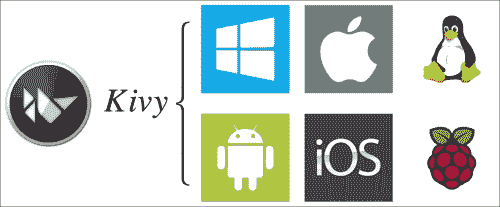
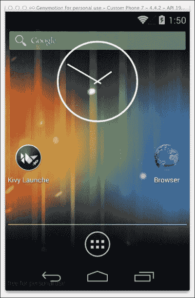
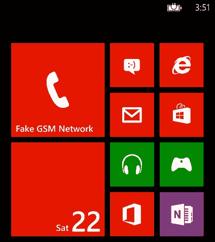
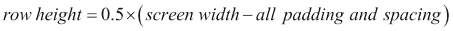
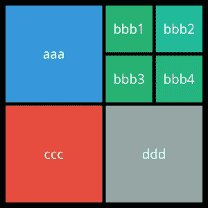
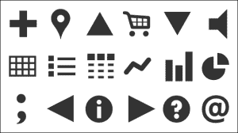
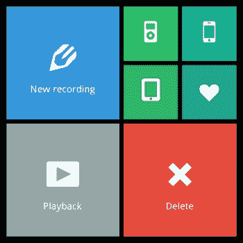
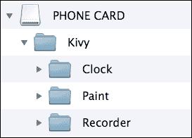
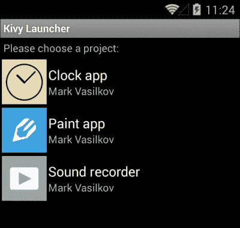
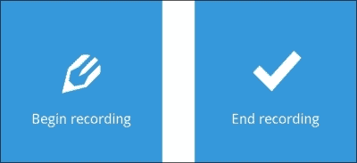

# 第三章。Android 录音机

在上一章中，我们简要讨论了 Kivy 应用程序，通常是跨平台的，其部分代码可能在选定的系统上条件性工作，从而增强某些用户的体验并执行其他特定平台的任务。

有时，这几乎是免费的；例如，如果 Kivy 检测到目标系统支持多点触控，多点触控就会正常工作——你不需要编写任何代码来启用它，只需考虑几个指针事件同时触发以供不同触控使用的情况。

其他平台相关任务包括由于各种原因在其他系统上无法运行的代码。还记得 Paint 应用程序中的鼠标光标自定义吗？那段代码使用了 Pygame 提供的低级绑定来调用 SDL 光标例程，只要你有 SDL 和 Pygame 运行，这是完全正常的。因此，为了使我们的应用程序多平台，我们采取了预防措施，避免在不兼容的系统上进入特定的代码路径；否则，它会导致我们的程序崩溃。

否则，Kivy 应用程序通常可以在所有支持的平台上移植——Mac、Windows、Linux、iOS、Android 和 Raspberry Pi——没有显著的问题。直到它们不再如此；我们将在下一节讨论这个原因。



Kivy 支持广泛的平台

在本章中，我们将涵盖以下主题：

+   使用**Pyjnius**库实现 Python 和 Java 之间的互操作性

+   在运行 Android 操作系统的设备（或模拟器）上测试 Kivy 应用程序

+   从 Python 中与 Android 的声音 API 协同工作，这允许你录制和播放音频文件

+   制作类似 Windows Phone 概念的拼图用户界面布局

+   使用图标字体通过矢量图标改善应用程序的展示

# 编写平台相关代码

本书中的大多数项目都是跨平台的，这得益于 Kivy 的极高可移植性。然而，这次我们将有意识地构建一个单平台的应用程序。这无疑是一个严重的限制，会减少我们的潜在用户群；另一方面，这也给了我们依赖特定平台绑定的机会，这些绑定提供了扩展功能。

这种绑定的需求源于 Kivy 力求尽可能实现跨平台，并在它支持的每个系统上提供类似的用户体验。这本身就是一个巨大的特性；作为加分项，我们还有能力编写一次代码，在各个地方运行，几乎不需要任何调整。

然而，跨平台的缺点是，你只能依赖每个系统支持的核心理念功能。这个“最低共同分母”功能集包括在屏幕上渲染图形、如果有声卡则播放声音、接受用户输入以及其他不多的事情。

由于每个 Kivy 应用程序都是用 Python 编写的，因此它也可以访问庞大的 Python 标准库。它促进了网络通信，支持多种应用程序协议，并提供了许多通用算法和实用函数。

然而，“纯 Kivy”程序的**输入输出**（**IO**）能力仅限于大多数平台上存在的功能。这仅占一个普通计算机系统（如智能手机或平板电脑）实际能做的极小一部分。

让我们来看看现代移动设备的 API 表面（为了本章的目的，让我们假设它正在运行 Android）。我们将把所有内容分成两部分：由 Python 和/或 Kivy 直接支持的内容，以及不支持的内容。

以下是在 Python 或 Kivy 中直接可用的功能：

+   硬件加速图形

+   带有可选多点触控的触摸屏输入

+   音频播放（在撰写本文时，播放仅支持持久存储中的文件）

+   网络，假设存在互联网连接

以下是不支持或需要外部库的功能：

+   调制解调器，支持语音通话和短信

+   使用内置摄像头录制视频和拍照

+   使用内置麦克风来录制声音

+   与用户账户关联的应用程序数据云存储

+   蓝牙和其他近场网络功能

+   定位服务和 GPS

+   指纹识别和其他生物识别安全

+   运动传感器，即加速度计和陀螺仪

+   屏幕亮度控制

+   震动和其他形式的触觉反馈

+   电池充电水平

### 注意

对于“不支持”列表中的大多数条目，已经存在不同的 Python 库来填补空白，例如用于低级声音记录的 Audiostream 和用于处理许多平台特定任务的 Plyer。

所以，这些功能并不是完全不可用给你的应用程序；实际上，挑战在于这些功能片段在不同平台（或者甚至是同一平台的连续版本，例如 Android）上极其碎片化；因此，你最终不得不编写特定平台的、不可移植的代码。

如您从前面的比较中可以看到，Android 上提供了许多功能，但只有部分由现有的 Python 或 Kivy API 覆盖。这为在您的应用程序中使用平台特定功能留下了巨大的未开发潜力。这不仅仅是一个限制，而是一个机会。简而言之，您将很快学会如何从 Python 代码中利用任何 Android API，使您的 Kivy 应用程序几乎可以做任何事情。

将您的应用程序的范围缩小到只有一小部分系统的一个优势是，有一些全新的程序类只能在具有合适硬件规格的移动设备上运行（或甚至有意义）。这些包括增强现实应用程序、陀螺仪控制的游戏、全景相机等等。

## 介绍 Pyjnius

为了充分利用我们选择的平台，我们将使用特定于平台的 API，碰巧这个 API 是 Java，因此主要是面向 Java 的。我们将构建一个录音应用程序，类似于在 Android 和 iOS 中常见的应用程序，尽管更简单。与纯 Kivy 不同，底层的 Android API 确实为我们提供了编程记录声音的方法。

本章的其余部分将贯穿这个小录音程序的开发过程，使用优秀的 Pyjnius 库来展示 Python-Java 的互操作性，这是 Kivy 开发者制作的另一个伟大项目。我们选择的概念——录音和播放——故意很简单，以便在不引起主题的纯粹复杂性和大量实现细节的过多干扰的情况下，概述这种互操作性的功能。

Pyjnius 最有趣的特性是它不提供自己的“覆盖”API 来覆盖 Android 的 API，而是允许你直接从 Python 中使用 Java 类。这意味着你可以完全访问本地的 Android API 和官方的 Android 文档，这对于 Java 开发来说显然更合适，而不是 Python。然而，这仍然比完全没有 API 参考要好。

注意，你不需要在本地安装 Pyjnius 来完成教程，因为我们显然不会在用于开发的机器上运行调用 Android Java 类的代码。

Pyjnius 的源代码、参考手册和一些示例可以在官方仓库[`github.com/kivy/pyjnius`](https://github.com/kivy/pyjnius)找到。

### 小贴士

我们将仅在 Android 开发和互操作性的背景下讨论 Pyjnius，但请记住，你也可以用桌面 Java 进行同样的集成。这是一个有趣的特性，因为从 Python 脚本 Java API 的另一个选项是 Jython，它相当慢且不完整。另一方面，Pyjnius 允许你使用官方的 Python 解释器（CPython），以及像 NumPy 这样的众多库，这有助于非常快速的计算。

因此，如果你绝对必须从 Python 调用 Java 库，那么请务必考虑 Pyjnius 作为一个好的互操作变体。

## 模拟 Android

如前所述，本章的项目仅针对 Android，因此它不会在你的电脑上工作。如果你没有备用 Android 设备，或者如果你不觉得在教程的目的上玩真实的物理设备很舒服，请不要担心。有高质量的 Android 模拟器可以帮助你克服这个小小的障碍，并在你的桌面上玩 Android 操作系统。

目前市面上最好的模拟器之一是 Genymotion（之前称为 AndroVM），它建立在 Oracle 的 VirtualBox 虚拟机之上。你可以从官方网站 [`www.genymotion.com/`](http://www.genymotion.com/) 获取免费副本；在撰写本文时，他们的许可非常宽松，允许几乎无限制的免费个人使用。

VM 软件的安装对于每个模拟器和主机操作系统组合都大不相同，所以我们现在不会提供过于详细的说明。毕竟，这些事情现在应该是用户友好的，包括说明书和图形用户界面。确实，我们已经进入了技术的黄金时代。

即使最后一句话并不完全是讽刺的，但在设置和使用 Android 模拟的虚拟机时，也有一些事情需要考虑：

+   总是使用最新的 Android 版本。向后兼容性或缺乏兼容性可能相当糟糕；调试操作系统级别的错误一点也不有趣。

+   不要犹豫，在网上搜索解决方案。Android 社区非常庞大，如果你有问题，这意味着你很可能并不孤单。

+   Kivy Launcher 应用程序，你可能觉得它非常有用，可以用来测试你自己的程序，可以从官方 Kivy 网站以 `.apk` 文件的形式获取，[`kivy.org/`](http://kivy.org/)；这对于没有访问 Google Play 的模拟 Android 设备来说将非常有用。

+   最后，市面上有许多不同质量、兼容性各异的模拟器。如果事情似乎随机崩溃并停止工作，也许你应该尝试另一个虚拟机或 Android 发行版。调整虚拟机的配置也可能有所帮助。

下一个截图展示了运行最新版本 Android 的 Genymotion 虚拟机，并安装了可用的 Kivy Launcher：



运行 Android 4.4.2 并安装了 Kivy Launcher 的 Genymotion 虚拟机

# Metro UI

当我们谈论这个话题时，让我们构建一个类似于 Windows Phone 主屏幕的用户界面。这个概念，基本上是一个各种尺寸的彩色矩形（瓷砖）的网格，在某个时候被称为 **Metro UI**，但由于商标问题后来更名为 **Modern UI**。不管叫什么名字，这就是它的样子。这将给你一个大致的想法，了解在应用程序开发过程中我们将要达到的目标：



设计灵感 - 带有瓷砖的 Windows Phone 主屏幕

显然，我们不会完全复制它，而是制作一个类似于所描述的用户界面。以下列表基本上总结了我们要追求的独特特性：

+   所有的元素都对齐到矩形网格

+   UI 元素具有与 第一章 中讨论的相同扁平外观，*构建时钟应用程序*（瓷砖使用明亮的纯色，没有阴影或圆角）

+   被认为更有用的（对于“有用”的任意定义）瓷砖更大，因此更容易点击

如果这听起来对你来说很简单，那么你绝对是对的。正如你很快就会看到的，Kivy 实现这样的 UI 非常直接。

## 按钮们

首先，我们将调整一个 `Button` 类，就像我们在之前的程序中做的那样。它类似于 Paint 应用程序中的 `ColorButton` (第二章, *构建 Paint 应用程序*)：

```py
<Button>:
    background_normal: 'button_normal.png'
    background_down: 'button_down.png'
    background_color: C('#95A5A6')
    font_size: 40
```

我们设置的背景纹理是纯白色，利用了在创建调色板时使用的相同技巧。`background_color` 属性充当着色色，将一个纯白色纹理分配给它相当于在 `background_color` 中绘制按钮。这次我们不想有边框。

第二个（按下 `background_down`）纹理是 25% 透明的白色。与应用程序的纯黑色背景颜色结合，我们得到了按钮分配的相同背景颜色的稍微深一点的色调：


按钮的正常（左）和按下（右）状态——背景颜色设置为 #0080FF

## 网格结构

布局构建起来稍微复杂一些。在没有现成的类似现代 UI 的瓷砖布局可用的情况下，我们将使用内置的 `GridLayout` 小部件来模拟它。它表现得就像我们之前使用的 `BoxLayout` 小部件一样，只是在两个维度上而不是一个维度上，因此没有 `orientation: 'horizontal'` 或 `'vertical'` 属性——`GridLayout` 小部件同时具备这两个属性。

如果不是最后一个要求，这样一个布局就能满足我们的所有需求：我们想要有大小不同的按钮。目前，`GridLayout` 不允许合并单元格来创建更大的按钮（如果能有一个类似于 HTML 中的 `rowspan` 和 `colspan` 属性的功能那就太好了）。因此，我们将采取相反的方向：从根 `GridLayout` 开始，使用大单元格，并在一个单元格内添加另一个 `GridLayout` 来细分它。

由于嵌套布局在 Kivy 中表现良好，我们得到了以下 Kivy 语言结构（让我们将文件命名为 `recorder.kv`）：

```py
#:import C kivy.utils.get_color_from_hex

GridLayout:
    padding: 15

    Button:
        background_color: C('#3498DB')
        text: 'aaa'

    GridLayout:
        Button:
            background_color: C('#2ECC71')
            text: 'bbb1'

        Button:
            background_color: C('#1ABC9C')
            text: 'bbb2'

        Button:
            background_color: C('#27AE60')
            text: 'bbb3'

        Button:
            background_color: C('#16A085')
            text: 'bbb4'

    Button:
        background_color: C('#E74C3C')
        text: 'ccc'

    Button:
        background_color: C('#95A5A6')
        text: 'ddd'
```

为了运行此代码，你需要一个标准的 `main.py` 模板作为应用程序的入口点。尝试自己编写这段代码作为练习。

### 小贴士

请参考第一章的开头。应用程序的类名将不同，因为它应该反映之前展示的 Kivy 语言文件的名称。

注意嵌套的 `GridLayout` 小部件与外部的、较大的按钮处于同一级别。如果你查看之前的 WinPhone 主屏幕截图，这应该会很有意义：一组四个较小的按钮占据与一个较大的按钮相同的空间（一个外部网格单元格）。嵌套的 `GridLayout` 是这些较小按钮的容器。

### 视觉属性

在外部网格上，`padding` 提供了一些距离屏幕边缘的空间。其他视觉属性在 `GridLayout` 实例之间共享，并移动到一个类中，结果在 `recorder.kv` 内部的代码如下：

```py
<GridLayout>:
    cols: 2
    spacing: 10
    row_default_height:
        (0.5 * (self.width - self.spacing[0]) -
        self.padding[0])
    row_force_default: True
```

### 注意

值得注意的是，`padding` 和 `spacing` 都实际上是列表，而不是标量。`spacing[0]` 属性指的是水平间距，然后是垂直间距。然而，我们可以使用前面代码中显示的单个值来初始化 `spacing`；然后这个值将被用于所有内容。

每个网格由两列和一些间距组成。`row_default_height` 属性更复杂：我们不能只是说，“让行高等于单元格宽度。”相反，我们手动计算所需的高度，其中 0.5 是因为我们有两个列：



如果我们不应用这个调整，网格内的按钮将填充所有可用的垂直空间，这是不希望的，尤其是在按钮不多的情况下（每个按钮最终都会变得太大）。相反，我们希望所有按钮都整齐划一，底部左侧留有空白，嗯，就是空白。

以下是我们应用 "现代 UI" 磁贴的截图，这是前面代码的结果：



到目前为止的 UI – 可点击的、大小可变的磁贴，与我们设计灵感不太相似

## 可缩放矢量图标

我们可以应用到应用程序 UI 中的一个很好的收尾细节是使用图标，而不仅仅是文本，在按钮上。当然，我们可以简单地加入一堆图片，但让我们借鉴现代网络开发中的一个有用技术，使用图标字体——正如你很快就会看到的，这些提供了极大的灵活性，而且不花任何成本。

### 图标字体

图标字体本质上与常规字体类似，只是它们的符号与语言的字母无关。例如，你输入 "P" 时，会渲染出 Python 的标志而不是字母；每个字体都会发明自己的记忆法来分配字母到图标。

这可能是使用图标字体唯一的缺点——使用这种字体大量代码的可读性并不好，因为字符-图标映射几乎不明显。这可以通过使用常量而不是直接输入符号来缓解。

还有不使用英语字母的字体，它们将图标映射到 Unicode 的 "私有用途区域" 字符代码。这是一种技术上正确构建此类字体的方法，但应用程序对这种 Unicode 功能的支持各不相同——不是每个平台在这方面表现都相同，尤其是在移动平台上。我们将为我们的应用使用的字体不分配私有用途字符，而是使用 ASCII（普通英语字母）。

### 使用图标字体的理由

在网络上，图标字体解决了与（光栅）图像常见的一些问题：

+   首先要考虑的是，位图图像不易缩放，在调整大小时可能会变得模糊——某些算法比其他算法产生更好的结果，但截至目前，“最佳实践”仍然不完美。相比之下，矢量图像按定义是无限可缩放的。

+   包含矢量图形（如图标和 UI 元素）的位图图像文件通常比矢量格式大。这显然不适用于编码为 JPEG 的照片。

+   此外，图标字体通常只是一个文件，包含任意数量的图标，这意味着只需要一次 HTTP 往返。常规图标（图像）通常在单独的文件中，导致显著的 HTTP 开销；有减轻这种影响的方法，例如 CSS 精灵，但它们并不被普遍使用，并且也有它们自己的问题。

+   在图标字体的情况下，颜色更改实际上只需一秒钟——你只需在 CSS 文件中添加`color: red`（例如）即可做到这一点。同样，大小、旋转和其他不涉及改变图像几何形状的属性也是如此。实际上，这意味着对图标进行微调不需要图像编辑器，这在处理位图时通常是必需的。

其中一些观点对 Kivy 应用程序来说并不适用，但总的来说，在当代网络开发中使用图标字体被认为是一种良好的实践，特别是由于有许多免费的高质量字体可供选择——这意味着有成百上千的图标可以包含在你的项目中。

### 小贴士

两个免费字体（包括那些可以免费用于商业用途的字体）的绝佳来源是**Font Squirrel**（[`www.fontsquirrel.com`](http://www.fontsquirrel.com)）和**Google Fonts**（[`www.google.com/fonts`](https://www.google.com/fonts)）。不要在意这些网站的一般网络开发方向，大多数字体在离线程序中的可用性与在网络上一样，甚至更好。因为浏览器的支持仍然不是理想的。

真正重要的是文件格式：目前 Kivy 只支持 True Type（`.ttf`）格式。幸运的是，这已经是目前最流行的字体格式。此外，将任何其他格式的字体转换为`.ttf`格式也是可能的。

### 在 Kivy 中使用图标字体

在我们的应用程序中，我们将使用由 John Caserta 设计的 Modern Pictograms（版本 1）免费字体。以下是其外观的一瞥：



Modern Pictograms 图标字体的一小部分图标样本

要将字体加载到我们的 Kivy 程序中，我们将使用在 第一章 中概述的相同过程，*构建时钟应用程序*。在这种情况下，这并不是严格必要的，因为图标字体很少有不同的字体粗细和样式。然而，通过显示名称（Modern Pictograms）而不是文件名（`modernpics.ttf`）来访问字体是一个更好的方法。你可以稍后通过只更新路径的一次出现来重命名或移动字体文件，而不必在每个使用字体的地方更新。

到目前为止的代码（在 `main.py` 中）看起来像这样：

```py
from kivy.app import App
from kivy.core.text import LabelBase

class RecorderApp(App):
    pass

if __name__ == '__main__':
    LabelBase.register(name='Modern Pictograms',
                       fn_regular='modernpics.ttf')

    RecorderApp().run()
```

字体的实际使用发生在 `recorder.kv` 内。首先，我们希望再次更新 `Button` 类，以便我们可以在文本中使用标记标签来更改字体。这在上面的代码片段中显示：

```py
<Button>:
    background_normal: 'button_normal.png'
    background_down: 'button_down.png'
    font_size: 24
    halign: 'center'
 markup: True

```

`halign: 'center'` 属性意味着我们希望按钮内的每一行文本都居中。`markup: True` 属性是显而易见的，并且是必需的，因为按钮定制的下一步将严重依赖于标记。

现在我们可以更新按钮定义。以下是一个例子：

```py
Button:
    background_color: C('#3498DB')
    text:
        ('[font=Modern Pictograms][size=120]'
        'e[/size][/font]\nNew recording')
```

通常，在 Kivy 语言文件中不需要在字符串周围使用括号；这种语法仅在声明多行时有用。这种表示法实际上等同于在同一行上写一个长字符串。

注意 `[font][size]` 标签内的字符 `'e'`。这是图标代码。我们应用程序中的每个按钮都将使用不同的图标，更改图标相当于在 `recorder.kv` 文件中替换一个字母。Modern Pictograms 字体的代码完整映射可以在其官方网站 [`modernpictograms.com/`](http://modernpictograms.com/) 上找到。

### 小贴士

为了手动探索图标字体，你需要使用字体查看器。通常，无论操作系统如何，你的机器上都会有一个现成的查看器。

+   **字符映射** 程序是 Windows 的一部分

+   在 Mac 上，有一个内置的应用程序叫做 **Font Book**

+   Linux 有多个查看器，取决于你选择的桌面环境，例如，GNOME 中的 **gnome-font-viewer**

或者，只需在网上搜索。流行的字体通常有一些在线的用户手册，解释字符映射。

简而言之，这就是我们在按钮上添加图标后应用程序的 UI 看起来是什么样子：



声音录制器应用程序界面 - 一个具有来自 Modern Pictograms 字体的矢量图标的现代 UI

这已经非常接近原始的 Modern UI 外观了。

### 注意

你可能会想知道顶部右角的小绿色按钮的用途是什么。答案是，目前它们仅仅是为了数量。实际上我们需要实现的三个按钮——录音、播放、删除——不足以说明 Modern UI 的概念，因为它需要更多的多样性才能看起来稍微有趣一些。

# 在 Android 上进行测试

目前，我们的应用程序还不包含任何不可移植的代码，但让我们逐步转向我们选择的平台，并在 Android 上进行测试。进行此操作的唯一先决条件是安装并运行**Kivy Launcher**应用程序的 Android 设备，无论是物理的还是虚拟的。

为 Kivy Launcher 打包应用程序几乎微不足道。我们将添加两个文件，`android.txt`和`icon.png`，到其他源（在这种情况下，`main.py`和`recorder.kv`）所在的同一文件夹，然后将文件夹复制到 Android 设备的 SD 卡上的`/Kivy`目录下。目录结构应类似于以下内容：



Kivy Launcher 的 SD 卡目录结构

当您启动 Kivy Launcher 时，它将显示它搜索项目的完整路径。这可能很有用，例如，当您没有 SD 卡时。

`android.txt`文件的格式相当明显：

```py
title=App Name
author=Your Name
orientation=portrait
```

标题和作者字段只是显示在应用程序列表中的字符串。方向可以是纵向（垂直，*高度 > 宽度*）或横向（水平，*宽度 > 高度*），具体取决于应用程序首选的宽高比。

图标`icon.png`是可选的，如果省略，则将保持空白。建议添加它，因为根据图标查找应用程序要容易得多，而且如果您计划将生成的应用程序发布到 Google Play 商店，您无论如何都需要一个图标。

注意，图标的文件名不可自定义，`main.py`的文件名也不可自定义，它必须指定应用程序的入口点；否则，Kivy Launcher 不会启动应用程序。

当所有文件就绪后，您在启动 Kivy Launcher 时应该能在列表中看到您的录音程序：



Kivy Launcher 应用程序列表，包含我们在本书的整个过程中编写的每个应用程序

### 小贴士

如果您看到一条包含放置文件指示的消息，请重新检查您的路径——遗憾的是，在撰写本文时，Kivy Launcher 搜索项目所在的目录不容易配置。这可能在未来的版本中得到改善。

现在您可以通过点击列表中的相应条目来启动您的应用程序。这是在 Android 上测试 Kivy 程序的最简单方法——只需复制文件，您就设置好了（与打包`.apk`文件相比，后者相对简单，但涉及更多步骤）。

# 使用原生 API

完成了应用的用户界面部分后，我们现在将转向原生 API，并使用合适的 Android Java 类`MediaRecorder`和`MediaPlayer`来实现声音录制和播放逻辑。

技术上，Python 和 Java 都是面向对象的，乍一看，这些语言可能看起来相当相似。然而，面向对象原则的应用却有着根本的不同。与 Python 相比，许多 Java API 都存在（或者根据您询问的人不同，可能会非常享受）过度架构和过度使用面向对象范式的问题。所以，不要对其他非常简单的任务可能需要您导入和实例化很多类而感到惊讶。

### 注意

1913 年，弗拉基米尔·列宁就 Java 架构写道：

*要打破这些类的阻力，只有一个方法，那就是在我们周围的社会中找到能够构成扫除旧事物、创造新事物的力量的力量。*

那篇论文当时没有提到 Python 或 Pyjnius，但信息很明确——即使在一百年前，在当代社会中过度使用类也不是很受欢迎。

幸运的是，手头的任务相对简单。要使用 Android API 录制声音，我们只需要以下五个 Java 类：

+   `android.os.Environment`：此类提供了访问许多有用环境变量的权限。我们将使用它来确定 SD 卡挂载的路径，以便我们可以保存录制的音频文件。直接硬编码`'/sdcard/'`或类似的常量很有诱惑力，但在实践中，每个其他 Android 设备的文件系统布局都不同。所以，即使是为了教程的目的，我们也不应该这样做。

+   `android.media.MediaRecorder`：此类是我们的主要工作马。它便于捕捉音频和视频并将其保存到文件系统中。

+   `android.media.MediaRecorder$AudioSource`，`android.media.MediaRecorder$AudioEncoder`，和`android.media.MediaRecorder$OutputFormat`：这些是枚举，包含我们需要传递给`MediaRecorder`各种方法的参数。

### 提示

**Java 类命名方案**

类名中的美元符号通常表示该类是内部的。这并不是一个精确的启发式方法，因为您可以在没有任何逻辑的情况下自己声明一个类似的名字——`'$'`是 Java 变量和类名中可用的字符，与例如 JavaScript 等语言类似。然而，这种非常规的命名是不被提倡的。

## 加载 Java 类

将上述 Java 类加载到您的 Python 应用程序中的代码如下：

```py
from jnius import autoclass

Environment = autoclass('android.os.Environment')
MediaRecorder = autoclass('android.media.MediaRecorder')
AudioSource = autoclass('android.media.MediaRecorder$AudioSource')
OutputFormat = autoclass('android.media.MediaRecorder$OutputFormat')
AudioEncoder = autoclass('android.media.MediaRecorder$AudioEncoder')
```

如果您此时尝试运行程序，您将收到一个错误，类似于以下内容：

+   **ImportError: 没有名为 jnius 的模块**：如果您在机器上没有安装 Pyjnius，您将遇到此错误。

+   **jnius.JavaException: 类未找到 'android/os/Environment'**：如果您安装了 Pyjnius，但尝试加载的 Android 类缺失（例如，在桌面机器上运行时），您将遇到此错误。

这是一种罕见的情况，收到错误意味着我们做的一切都是正确的。从现在开始，我们应该在 Android 设备或模拟器内部进行所有测试，因为代码不再是跨平台的了。它明确依赖于 Android 特定的 Java 功能。

现在我们可以无缝地在我们的 Python 代码中使用 Java 类。

### 小贴士

请记住，这些类的文档是为与 Java 一起使用而编写的，而不是 Python。你可以在 Google 官方的 Android 开发者门户上查找它 [`developer.android.com/reference/packages.html`](http://developer.android.com/reference/packages.html)——最初将代码示例从 Java 转换为 Python 可能看起来有些令人生畏，但实际上非常简单（如果有些啰嗦）。

## 查找存储路径

让我们用一个简单的例子来说明实际的多语言 API 使用。在 Java 中，我们会这样做来找出 SD 卡挂载的位置：

```py
import android.os.Environment;

String path = Environment.getExternalStorageDirectory()
.getAbsolutePath();
```

当转换为 Python 时，此代码的读取方式如下：

```py
Environment = autoclass('android.os.Environment')
path = Environment.getExternalStorageDirectory().getAbsolutePath()
```

这与之前代码中显示的完全相同，只是用 Python 而不是 Java 编写的。

当我们在做这件事的时候，也让我们记录这个值，这样我们就可以在 Kivy 日志中看到 `getAbsolutePath` 方法返回给我们的代码的确切路径：

```py
from kivy.logger import Logger
Logger.info('App: storage path == "%s"' % path)
```

在我的测试设备上，这会在 Kivy 日志中产生以下行：

```py
[INFO] App: storage path == "/storage/sdcard0"

```

### 从设备读取日志

当你在开发期间从终端运行 Kivy 应用程序时，日志会立即在同一终端窗口中显示。这个非常有用的功能在应用程序在 Kivy 启动器内部运行时也是可用的，尽管不太容易访问。

要读取 Kivy 日志，导航到设备上你的应用程序所在的文件夹（例如，SD 卡上的 `/Kivy/Recorder`）。在这个文件夹内部，Kivy 启动器创建了一个名为 `.kivy` 的另一个目录，其中包含默认配置和一些杂项服务信息。每次应用程序启动时，都会在 `.kivy/logs` 下创建一个日志文件。

或者，如果你已经安装了 Android SDK，你可以在设备上启用 USB 调试，然后使用 `adb logcat` 命令在一个地方查看所有 Android 日志，包括 Kivy 日志。这会产生关于设备内部发生的各种内部过程的大量信息，例如各种硬件的激活和去激活、应用程序窗口状态的变化等等。

日志在调试奇怪的程序行为或当应用程序拒绝启动时非常有价值。Kivy 还会在那里打印关于运行时环境的各种警告，例如缺少库或功能、Python 模块加载失败以及其他潜在问题。

## 录制声音

现在，让我们深入 Android API 的兔子洞，实际上从麦克风录制声音。以下代码基本上是将 Android API 文档翻译成 Python。如果您对这段代码的原始 Java 版本感兴趣，可以在[`developer.android.com/guide/topics/media/audio-capture.html`](http://developer.android.com/guide/topics/media/audio-capture.html)找到——它太长了，无法在这里包含。

下面的代码是初始化`MediaRecorder`对象的准备代码：

```py
storage_path = (Environment.getExternalStorageDirectory()
                .getAbsolutePath() + '/kivy_recording.3gp')

recorder = MediaRecorder()

def init_recorder():
    recorder.setAudioSource(AudioSource.MIC)
    recorder.setOutputFormat(OutputFormat.THREE_GPP)
    recorder.setAudioEncoder(AudioEncoder.AMR_NB)
    recorder.setOutputFile(storage_path)
    recorder.prepare()
```

这就是典型的、直接的、冗长的 Java 初始化方式，用 Python 逐字重写。

您可以在这里调整输出文件格式和编解码器，例如，将`AMR_NB`（**自适应多速率**编解码器，针对语音优化，因此在 GSM 和其他移动电话网络中广泛使用）更改为`AudioEncoder.AAC`（**高级音频编解码器**标准，是一种更通用的编解码器，类似于 MP3）。这样做可能没有很好的理由，因为内置麦克风的动态范围可能不适合录制音乐，但选择权在您手中。

现在是时候来点乐趣了，“开始/结束录音”按钮。以下代码片段使用了与第一章中实现计时器开始/停止按钮时相同的逻辑：

```py
class RecorderApp(App):
    is_recording = False

    def begin_end_recording(self):
        if (self.is_recording):
            recorder.stop()
            recorder.reset()
            self.is_recording = False
            self.root.ids.begin_end_recording.text = \
                ('[font=Modern Pictograms][size=120]'
                 'e[/size][/font]\nBegin recording')
            return

        init_recorder()
        recorder.start()
        self.is_recording = True
        self.root.ids.begin_end_recording.text = \
            ('[font=Modern Pictograms][size=120]'
             '%[/size][/font]\nEnd recording')
```

如您所见，这里也没有应用任何火箭科学：我们只是存储了当前状态，`is_recording`，然后根据它采取行动，即：

1.  开始或停止`MediaRecorder`对象（高亮部分）。

1.  翻转`is_recording`标志。

1.  更新按钮文本，使其反映当前状态（见以下截图）。

需要更新的应用程序的最后部分是`recorder.kv`文件。我们需要调整“开始/结束录音”按钮，使其调用我们的`begin_end_recording()`函数：

```py
Button:
        id: begin_end_recording
        background_color: C('#3498DB')
        text:
            ('[font=Modern Pictograms][size=120]'
            'e[/size][/font]\nBegin recording')
        on_press: app.begin_end_recording()
```

就这样！如果您现在运行应用程序，很可能会记录下要存储在 SD 卡上的声音文件。然而，在这样做之前，请先查看下一节。您创建的按钮看起来可能如下所示：



开始录音和结束录音——这个按钮概括了我们的应用程序到目前为止的功能

### 主要注意事项——权限

编写本文时，默认的 Kivy 启动器应用程序没有记录声音所需的权限，`android.permission.RECORD_AUDIO`。这导致`MediaRecorder`实例初始化时立即崩溃。

有许多方法可以减轻这个问题。首先，最简单的一个：为了这个教程，我们已提供修改后的 Kivy Launcher，其中已启用必要的权限。你可以在书籍的源代码存档中找到`KivyLauncherMod.apk`。该包的最新版本也可在[`github.com/mvasilkov/kivy_launcher_hack`](https://github.com/mvasilkov/kivy_launcher_hack)下载。

在安装提供的`.apk`文件之前，请从你的设备中删除现有版本的应用，如果有的话。

或者，如果你愿意处理为 Google Play 打包 Kivy 应用的繁琐细节，你可以从源代码自行构建 Kivy Launcher。完成这项工作所需的所有信息都可以在官方 Kivy GitHub 账户[`github.com/kivy`](https://github.com/kivy)中找到。

第三种可行的选择（也可能比前一个更容易）是调整现有的 Kivy Launcher 应用。为此，你可以使用**apktool**([`code.google.com/p/android-apktool/`](https://code.google.com/p/android-apktool/))。你需要采取的确切步骤如下：

1.  下载官方的`KivyLauncher.apk`文件，并从命令行提取它，假设 apktool 在你的路径中：

    ```py
    apktool d -b -s -d KivyLauncher.apk KivyLauncher
    ```

1.  将必要的权限声明添加到`AndroidManifest.xml`文件中：

    ```py
    <uses-permission android:name="android.permission.RECORD_AUDIO" />
    ```

1.  以这种方式重新打包`.apk`：

    ```py
    apktool b KivyLauncher KivyLauncherWithChanges.apk
    ```

1.  使用`jarsigner`实用程序对生成的`.apk`文件进行签名。请查看关于在[`developer.android.com/tools/publishing/app-signing.html#signing-manually`](http://developer.android.com/tools/publishing/app-signing.html#signing-manually)手动签名 Android 包的官方文档。

由于此过程，修改后的 Kivy Launcher 包将能够录制声音。

### 小贴士

你可以用同样的方式添加各种其他权限，以便在 Python 代码中使用 Pyjnius 利用它们。例如，为了访问 GPS API，你的应用需要`android.permission.ACCESS_FINE_LOCATION`权限。

所有可用的权限都在 Android 文档[`developer.android.com/reference/android/Manifest.permission.html`](http://developer.android.com/reference/android/Manifest.permission.html)中列出。

## 播放声音

要使声音播放工作变得容易；不需要此权限，API 也更为简洁。我们只需要加载一个额外的类，`MediaPlayer`：

```py
MediaPlayer = autoclass('android.media.MediaPlayer')
player = MediaPlayer()
```

以下是在用户按下播放按钮时运行的代码。我们还会在*删除文件*部分使用`reset_player()`函数；否则，可能有一个稍微长一点的函数：

```py
def reset_player():
    if (player.isPlaying()):
        player.stop()
    player.reset()

def restart_player():
    reset_player()
    try:
        player.setDataSource(storage_path)
        player.prepare()
        player.start()
    except:
        player.reset()
```

每个 API 调用的详细情况可以在官方文档中找到，但总体来说，这个列表相当直观：将播放器重置到初始状态，加载声音文件，然后播放。文件格式会自动确定，这使得我们的任务变得稍微容易一些。

### 小贴士

在实践中，这样的代码应该始终被包裹在一个 `try ... catch` 块中。可能会有太多事情出错：文件可能丢失或以错误的格式创建，SD 卡可能被拔掉或无法读取，以及其他同样可怕的事情，如果有机会，这些事情一定会让你的程序崩溃。在进行输入输出操作时，一个好的经验法则是*宁可靠安全，不可靠后悔*。

## 删除文件

这个最后的功能将使用 `java.io.File` 类，它与 Android 并不严格相关。官方 Android 文档的一个优点是，它还包含了这些核心 Java 类的引用，尽管它们比 Android 操作系统早了十多年。实现文件删除的实际代码正好是一行；它在下述列表中突出显示：

```py
File = autoclass('java.io.File')

class RecorderApp(App):
    def delete_file(self):
        reset_player()
 File(storage_path).delete()

```

首先，我们通过调用 `reset_player()` 函数停止播放（如果有），然后删除文件——简单直接。

有趣的是，Java 中的 `File.delete()` 方法在发生灾难性故障时不会抛出异常，因此在这种情况下不需要执行 `try ... catch`。一致性，无处不在的一致性。

### 注意

一个细心的读者会注意到，我们也可以使用 Python 自己的 `os.remove()` 函数来删除文件。与纯 Python 实现相比，这样做在 Java 中并没有什么特别之处；它也更快。另一方面，作为 Pyjnius 的演示，`java.io.File` 与其他 Java 类一样有效。

还要注意，这个函数在桌面操作系统上也能完美运行，因为它不是 Android 特有的；你只需要安装 Java 和 Pyjnius，这个功能才能工作。

到目前为止，随着用户界面和所有三个主要功能的完成，我们的应用程序对于本教程的目的来说已经完整了。

# 摘要

编写不可移植的代码有其优点和缺点，就像任何其他全局架构决策一样。然而，这个特定的选择尤其困难，因为切换到本地 API 通常发生在项目早期，并且在后期阶段可能完全不切实际地撤销。

这种方法的重大优势在本章的开头已经讨论过：使用平台特定代码，你可以几乎做你平台能做的任何事情。没有人为的限制；你的 Python 代码对相同的底层 API 的访问是无限的。

从另一方面来看，依赖于单一平台是有风险的，原因有很多：

+   仅 Android 的市场规模就比 Android 加上 iOS 的市场规模要小（这适用于几乎所有的操作系统组合）。

+   随着你使用的每个平台特定功能，将程序移植到新系统变得更加困难。

+   如果项目只运行在一个平台上，可能只需要一个政治决定就足以将其扼杀。被谷歌封禁的可能性高于同时被 App Store 和 Google Play 踢出的可能性。（同样，这几乎适用于每一组应用程序市场。）

现在你已经充分了解了各种选项，那么在开发每一个应用程序时，做出明智的选择就取决于你了。

**关于 UI 的一些话**

在任何情况下，你都不应该犹豫去借鉴和重新实现在其他地方看到的思想（以及布局、字体、颜色等等）。归功于巴勃罗·毕加索的这句话，“好艺术家借鉴；伟大的艺术家偷窃”，简洁地总结了今天的网络和应用程序开发。 （“偷窃”部分是比喻性的：请实际上不要真的去偷东西。）

此外，让我们明确一点：仅仅因为微软决定在许多最新的移动和桌面产品中使用“现代 UI”，并不意味着这种设计本身有什么优点。我们确信的是，由于微软操作系统的普及，这种用户界面范式将立即被用户识别出来，无论这种普及是幸运的还是不幸的。

在下一章中，我们将放下 Java，使用流行的 Python 网络框架**Twisted**构建一个简单的基于客户端-服务器架构的聊天程序。
