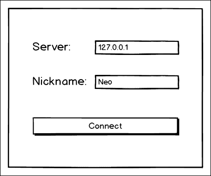

# 第四章：Kivy 网络

之前，我们讨论了在扩展功能集的同时缩小应用兼容性的权衡，例如，仅使用原生 API 进行重负载处理的 Android 应用。现在，让我们探索相反的极端，并基于不妥协、普遍可用的功能——网络——来构建一个应用。

在本章中，我们将构建一个聊天应用，其概念与**互联网中继聊天**（**IRC**）类似，但更加简单。

虽然我们的小应用当然不能取代像 Skype 这样的企业级巨无霸，但到本章结束时，我们的应用将支持互联网上的多用户消息传递。这对于小型友好群体来说已经足够了。

友好实际上是一个要求，因为我们有意简化事情，没有实现身份验证。这意味着用户可以轻易地模仿彼此。调整应用程序以适应敌对环境和灾难性事件（如政治辩论）的任务留给你去完成，如果你特别有冒险精神的话。

我们还旨在实现尽可能广泛的兼容性，至少在服务器端；你甚至可以使用**Telnet**发送和接收消息。虽然不如图形 Kivy 应用那么美观，但 Telnet 在 Windows 95 甚至 MS-DOS 上运行得很好。与恐龙聊天吧！

### 注意

为了更准确地反映历史，Telnet 协议是在 1973 年标准化的，因此它甚至早于 8086 CPU 和 x86 架构。相比之下，MS-DOS 要现代得多，而 Windows 95 几乎可以说是计算的未来。

本章将涵盖以下重要主题：

+   使用 Python 编写和测试自定义服务器，采用**Twisted**框架

+   在不同抽象级别上开发几个客户端应用，从使用原始套接字的简单终端程序到事件驱动的 Twisted 客户端

+   使用 Kivy `ScreenManager`更好地组织应用 UI

+   使用`ScrollView`容器有效地在屏幕上展示长文本小部件

我们的应用程序将采用集中式、客户端-服务器架构；这种拓扑在互联网上非常常见，许多网站和应用都是这样工作的。您很快就会看到，与去中心化、点对点网络相比，实现起来也相当简单。

### 注意

为了本章的目的，我们不区分**局域网**（**LAN**）和互联网，因为在抽象的这一层，这基本上是不相关的。然而，请注意，如果正确部署您的应用程序以供互联网大规模消费，这需要许多额外的知识，从设置安全的 Web 服务器和配置防火墙到使代码跨多个处理器核心甚至多台物理机器扩展。在实践中，这可能没有听起来那么可怕，但本身仍然是一项非同小可的任务。

# 编写聊天服务器

让我们从服务器端代码开始开发，这样在我们开始编写客户端之前就有了一个连接的端点。为此，我们将使用一个优秀的**Twisted**框架，该框架将许多常见的低级别网络任务简化为少量干净、相对高级的 Python 代码。

### 小贴士

**兼容性通知**

Twisted 在撰写本文时不支持 Python 3，因此我们假设以下所有 Python 代码都是针对 Python 2.7 编写的。最终应该很容易将其移植到 Python 3，因为没有任何故意的不兼容设计决策。（相关地，我们还将完全忽略与 Unicode 相关的问题，因为正确解决这些问题取决于 Python 版本。）

Twisted 是一个事件驱动的、低级别的服务器框架，与**Node.js**（实际上，Node.js 的设计受到了 Twisted 的影响）非常相似。与 Kivy 类似，事件驱动的架构意味着我们不会将代码结构化为循环；相反，我们将多个事件监听器绑定到我们认为对我们应用有用的那些事件上。硬核、低级别的网络操作，如处理传入连接和与原始数据包一起工作，由 Twisted 在启动服务器时自动执行。

### 注意

为了在你的机器上安装 Twisted，请在终端中运行常规命令：

```py
pip install -U twisted

```

有几点需要注意：

+   很可能，你需要成为 root（管理员或“超级用户”）才能执行系统范围内的安装。如果你使用 Mac OS 或 Linux，当收到**访问被拒绝**的错误消息时，尝试在命令前加上`sudo`。

+   如果你没有安装 pip，请尝试使用**easy_install twisted**命令（或者**easy_install pip**）。

+   或者，请遵循官方 pip 安装指南[`pip.pypa.io/en/latest/installing.html`](https://pip.pypa.io/en/latest/installing.html)。这也涵盖了 Windows。

## 协议定义

让我们讨论我们将要使用的与聊天服务器通信的协议。由于应用程序将非常简单，我们不会使用像 XMPP 这样的完整协议，而是将创建一个仅包含我们需要的位的裸骨协议。

在本教程的上下文中，我们只想在协议级别实现从客户端到服务器的两条消息——连接到服务器（进入聊天室）以及实际上与其他用户交谈。服务器发送回客户端的所有内容都会被渲染；没有服务事件在服务器上发起。

我们的协议将是文本格式，类似于许多其他应用层协议，包括广泛使用的 HTTP。这是一个非常实用的特性，因为它使得调试和相关活动更加容易。与二进制协议相比，文本协议通常被认为更具可扩展性和未来适应性。纯文本的缺点主要是其大小；二进制枚举通常更紧凑。在这种情况下，这基本上是不相关的，而且可以通过压缩轻松缓解（这正是许多服务器在 HTTP 情况下所做的事情）。

现在我们来回顾构成我们应用程序协议的各个消息：

+   连接到服务器不会传达除用户现在在聊天室的事实之外的其他信息，因此我们将每次只发送单词`CONNECT`。这条消息没有参数化。

+   在聊天室里说话更有趣。有两个参数：昵称和文本消息本身。让我们定义这种消息的格式为`A:B`，其中`A`是昵称（作为直接后果，昵称不能包含冒号`:`字符）。

从这个规范中，我们可以推导出一个有效的算法（伪代码）：

```py
if ':' not in message
    then
        // it's a CONNECT message
        add this connection to user list
    else
        // it's a chat message
        nickname, text := message.split on ':'
        for each user in user list
            if not the same user:
                send "{nickname} said: {text}"
```

测试相同用户是为了减少用户自己的消息回传给他们的不必要的传输（回声）。

## 服务器源代码

在 Twisted 框架的帮助下，我们的伪代码可以几乎直接地翻译成 Python。以下列表包含我们`server.py`应用程序的完整源代码：

```py
from twisted.internet import protocol, reactor

transports = set()

class Chat(protocol.Protocol):
    def dataReceived(self, data):
        transports.add(self.transport)

        if ':' not in data:
            return

        user, msg = data.split(':', 1)

        for t in transports:
            if t is not self.transport:
                t.write('{0} says: {1}'.format(user, msg))

class ChatFactory(protocol.Factory):
    def buildProtocol(self, addr):
        return Chat()

reactor.listenTCP(9096, ChatFactory())
reactor.run()
```

## 操作原理

这是帮助你理解我们的服务器是如何工作的控制流程概述：

+   最后一行，`reactor.run()`，启动监听端口 9096 的`ChatFactory`服务器

+   当服务器接收到输入时，它调用`dataReceived()`回调

+   `dataReceived()`方法实现了协议部分的伪代码，根据需要向其他已连接客户端发送消息

客户端连接的集合被称为`transports`。我们无条件地将当前传输`self.transport`添加到集合中，因为在现有元素的情况下，这是一个无操作，为什么要费那个劲。

列表中的其余部分严格遵循算法。因此，除了发送原始消息的用户之外，每个已连接的用户都将收到通知，`<` **用户名** `> says: <` **消息文本** `>`.

### 注意

注意我们实际上并没有检查连接消息是否说`CONNECT`。这是紧密遵循乔恩·波斯尔在 1980 年 TCP 规范中提出的*网络鲁棒性*原则的例子：*发送时要保守，接受时要宽容*。

除了简化本例中的代码外，我们还获得了一个向前兼容性的选项。假设在未来客户端的版本中，我们向协议中添加了一条新消息，即名为`WHARRGARBL`的虚构消息，根据其名称，它确实做了一些真正令人惊叹的事情。而不是因为收到格式不正确的消息（在这种情况下，因为版本不匹配）而崩溃，旧版本的服务器将简单地忽略这些消息并继续运行。

具体来说，这个方面——版本之间的兼容性——可以通过多种策略轻松处理。然而，在涉及网络，尤其是公共网络时，也存在一些更困难的问题，包括恶意用户试图破坏你的系统并故意使其崩溃。因此，实际上并不存在过度夸大的服务器稳定性。

## 测试服务器

以通常运行任何 Python 程序的方式运行服务器：

```py
python server.py

```

此命令不应产生任何可见的输出。服务器只是静静地坐着，等待客户端连接。然而，在已知的宇宙中没有任何客户端程序能够使用这个协议，因为我们大约在一页半之前就编造了它。我们如何确保服务器能正常工作？

幸运的是，这种“鸡生蛋，蛋生鸡”的问题在这个领域非常普遍，因此有许多有用的工具可以做到这一点——向任何服务器发送任意字节，并接收和显示服务器发送回的任意字节。

适用于篡改使用文本协议的服务器的标准程序之一是 Telnet。像许多“老式”Unix 风格的实用程序一样，Telnet 是一个既可以用作交互式程序，也可以作为更大批处理（shell）脚本一部分的命令行程序。

大多数操作系统都预装了`telnet`命令。如果没有，那么你可能正在使用 Windows 7 或更高版本。在这种情况下，你可以按照以下截图所示，转到**控制面板** | **程序和功能** | **启用或关闭 Windows 功能**：


然后，确保**Telnet 客户端**复选框已勾选，如下所示：


Telnet 接受两个参数：要连接的服务器的名称和端口号。为了使用 telnet 连接到聊天服务器，你首先需要启动`server.py`，然后在另一个终端中运行：

```py
telnet 127.0.0.1 9096

```

或者，你可以在大多数系统中使用`localhost`作为主机名，因为这等同于`127.0.0.1`；两者都表示当前机器。

如果一切顺利，你将打开一个交互式会话，你输入的每一行都会发送到服务器。现在，使用我们之前讨论的聊天协议，你可以与服务器进行通信：

```py
CONNECT
User A:Hello, world!

```

将不会有输出，因为我们以这种方式编程服务器，使其不会将消息回显给原始作者——这将是一种浪费。所以，让我们再打开另一个终端（以及一个 Telnet 会话），这样我们就有两个同时连接的用户。

当一切正常时，聊天会话看起来是这样的：


网络上的交互式聊天达到最佳状态

### 注意

如果由于某种原因，无论是技术原因还是其他原因，您无法在您的系统上使用 Telnet，请不要对此感到特别难过，因为这项测试不是成功完成教程所必需的。

然而，这里有一些（非常个人化，甚至可以说是亲密的）建议，这些建议与您的职业比与本书的主题更相关：为自己做点好事，获取一个 Mac OS 或 Linux 系统，或者也许在同一台机器上使用双启动。这些类 Unix 操作系统比 Windows 更适合软件开发，而且生产力的提升完全值得适应新环境的不便。

通过这一点，我们可以得出结论：我们的服务器正在正常工作：两个 Telnet 窗口正在良好地通信。现在后端工作已经完成，让我们构建一个跨平台的 GUI 聊天客户端。

# 屏幕管理器

让我们从一个新概念开始 UI 开发，即屏幕管理。我们手头的应用程序，即聊天客户端，是一个合适的例子。将会有两个应用程序状态，具有不同的 UI，彼此完全独立：

+   登录屏幕，用户在此输入要连接的主机名和所需的昵称：

+   聊天室屏幕，实际对话发生的地方：

从概念上讲，这些都是聊天应用程序前端的应用程序状态。

一种简单的 UI 分离方法将涉及根据某个变量管理可见和隐藏的控件，该变量持有当前所需的 UI 状态。当小部件数量增加时，这会变得非常繁琐，而且样板代码本身就不太有趣。

正因如此，Kivy 框架为我们提供了一个专门针对此任务定制的容器小部件，即`ScreenManager`。此外，`ScreenManager`支持短动画来可视化屏幕切换，并提供多种预构建的过渡效果可供选择。它可以完全声明性地从 Kivy 语言文件中使用，而不需要接触 Python 代码。

让我们这样做。在`chat.kv`文件中添加以下代码：

```py
ScreenManager:
    Screen:
        name: 'login'

        BoxLayout:
            # other UI controls -- not shown

            Button:
                text: 'Connect'
                on_press: root.current = 'chatroom'

    Screen:
        name: 'chatroom'

        BoxLayout:
            # other UI controls -- not shown

            Button:
                text: 'Disconnect'
                on_press: root.current = 'login'

```

这是程序的基本结构：我们在根目录有一个`ScreenManager`，为每个我们想要的 UI 状态（第一个将默认显示）有一个`Screen`容器。在`Screen`内部是通常的 UI：布局、按钮以及我们迄今为止看到的一切。我们很快就会接触到它。

我们刚才看到的代码还包括屏幕切换按钮，每个`Screen`实例一个。为了切换应用程序状态，我们需要将所需屏幕的名称分配给`ScreenManager`的`current`属性。

## 自定义动画

如前所述，当切换屏幕时发生的简短动画可以自定义。Kivy 提供了多种此类动画，位于`kivy.uix.screenmanager`包中：

| 过渡类名称 | 视觉效果 |
| --- | --- |
| `NoTransition` | 没有动画，立即显示新屏幕。 |
| `SlideTransition` | 滑动新屏幕。传递`'left'`（默认）、`'right'`、`'up'`或`'down'`以选择效果的方向。 |
| `SwapTransition` | 理论上，这个类模拟了 iOS 屏幕切换动画。但实际效果与理论相差甚远。 |
| `FadeTransition` | 淡出屏幕，然后淡入。 |
| `WipeTransition` | 使用像素着色器实现的平滑方向过渡。 |
| `FallOutTransition` | 将旧屏幕缩小到窗口中心并使其透明，从而显示新屏幕。 |
| `RiseInTransition` | `FallOutTransition`的完全相反：从中心生长新屏幕，重叠并隐藏旧的一个。 |

在`.kv`文件中设置这些内容有一个小问题：默认情况下不会导入过渡动画，因此您需要使用以下语法（在`chat.kv`的顶部）导入您想要使用的动画：

```py
#:import RiseInTransition kivy.uix.screenmanager.RiseInTransition
```

现在您可以将其分配给`ScreenManager`。请注意，这是一个 Python 类实例化，因此结尾的括号是必需的：

```py
ScreenManager:
    transition: RiseInTransition()
```

## 登录屏幕布局

在登录屏幕内部，布局方面与上一章的录音应用非常相似：一个`GridLayout`解决了在网格上对齐组件的任务。

本书尚未使用的是`TextInput`小部件。Kivy 的文本输入几乎与按钮的行为完全相同，唯一的区别是您可以在其中输入文本。默认情况下，`TextInput`是多行的，因此我们将`multiline`属性设置为`False`，因为在应用程序的上下文中，多行文本输入没有太多意义。

当在未连接物理键盘的设备上运行时，Kivy 将回退到虚拟屏幕键盘，就像原生应用一样。

这是实现登录屏幕布局的代码（在同一个 Kivy 语言文件`chat.kv`中的`ScreenManager`下）：

```py
Screen:
    name: 'login'

    BoxLayout:
        orientation: 'vertical'

        GridLayout:
            Label:
                text: 'Server:'

            TextInput:
                id: server
                text: '127.0.0.1'

            Label:
                text: 'Nickname:'

            TextInput:
                id: nickname
                text: 'Kivy'

        Button:
            text: 'Connect'
            on_press: root.current = 'chatroom'
```

在这里，我们添加了两个文本字段，`Server`和`Nickname`，以及相应的标签，还有一个**连接**按钮。按钮的事件处理程序目前与实际的网络无关，只是切换到聊天室，但这种情况将在不久的将来改变。

要制作单行的`TextInput`，需要一些有趣的样式。除了将其`multiline`属性设置为`False`外，我们还想将文本垂直居中（否则，它将粘在控制的顶部，底部留下很大的间隙）。我们可以使用如下方式使用填充属性来实现正确的对齐：

```py
<TextInput>:
    multiline: False
    padding: [10, 0.5 * (self.height – self.line_height)]
```

这条`padding`行将左右填充设置为 10，上下填充计算为*（小部件高度 - 一行文本高度）× 0.5*。

这是最终屏幕的显示效果；它与我们在本书的编写过程中制作的其他应用程序非常相似。


聊天应用登录屏幕

我们现在可以开始编写连接服务器的代码，但首先让我们让主屏幕，即聊天室，工作起来。这将使我们能够立即进行有意义的测试。

## 聊天室屏幕布局

接下来在我们的列表中是聊天室屏幕。它包含一个用于长篇对话的`ScrollView`小部件，由于这是第一次在这本书中出现滚动小部件，让我们仔细看看它是如何工作的。

生成滚动小部件最简单的`.kv`片段如下：

```py
<ChatLabel@Label>:
    text_size: (self.width, None)  # Step 1
    halign: 'left'
    valign: 'top'
    size_hint: (1, None)  # Step 2
    height: self.texture_size[1]  # Step 3

ScrollView:
    ChatLabel:
        text: 'Insert very long text with line\nbreaks'
```

如果您添加足够的文本使其溢出屏幕，它就会开始滚动，类似于您在 iOS 或 Android 中期望的长列表项。

这是这种布局的工作原理：

1.  我们将自定义`Label`子类的`text_size`宽度（第一个值）限制为小部件的可用宽度，并通过将第二个值设置为`None`让它根据其内容选择高度。

1.  然后，我们将垂直`size_hint`（第二个值）设置为`None`，以强制小部件的高度独立于其容器计算。否则，它将被父元素限制，因此将没有可滚动的内容。

1.  现在，我们可以将小部件的高度设置为等于`texture_size`的高度（请注意，索引通常是零基的，所以第二个值确实是`texture_size[1]`）。这将迫使`ChatLabel`比包含它的`ScrollView`小部件更大。

1.  当`ScrollView`检测到其子小部件大于可用屏幕空间时，启用滚动。在移动设备上它按常规工作，并在桌面上添加鼠标滚轮支持。

### 滚动模式

您还可以自定义`ScrollView`的滚动回弹效果，以模仿对应平台的原生行为（尽管在概念上相似，但与原生组件相比，仍然看起来明显不同）。截至写作时，Android 风格的边缘发光效果不是默认支持的；可用的选项如下：

+   `ScrollEffect`：此效果允许您在到达末尾时突然停止滚动。这与桌面程序通常的工作方式相似，因此如果所讨论的应用程序主要针对桌面，则此行为可能是有吸引力的。

+   `DampedScrollEffect`：这是默认效果。它与 iOS 中找到的回弹效果相似。这可能是移动设备上最好的模式。

+   `OpacityScrollEffect`：此效果类似于`DampedScrollEffect`，在滚动过内容边缘时增加了透明度。

要使用这些设置之一，从 `kivy.effects` 模块导入它，并将其分配给 `ScrollView.effect_cls` 属性，类似于刚刚讨论的 `ScreenManager` 过渡。我们不会使用这个，因为 `DampedScrollEffect` 已经非常适合我们的应用程序。

考虑到所有这些点，这是聊天室屏幕布局的样子（在 `chat.kv` 中）：

```py
Screen:
    name: 'chatroom'

    BoxLayout:
        orientation: 'vertical'

        Button:
            text: 'Disconnect'
            on_press: root.current = 'login'

        ScrollView:
            ChatLabel:
                id: chat_logs
                text: 'User says: foo\nUser says: bar'

        BoxLayout:
            height: 90
            orientation: 'horizontal'
            padding: 0
            size_hint: (1, None)

            TextInput:
                id: message

            Button:
                text: 'Send'
                size_hint: (0.3, 1)
```

最后一行，`size_hint`，将 `Button` 小部件的横向比例设置为 `0.3`，低于默认的 `1`。这使得 **发送** 按钮比消息输入字段更小。

为了将消息区域的背景设置为白色，我们可以使用以下代码：

```py
<ScrollView>:
    canvas.before:
        Color:
            rgb: 1, 1, 1
        Rectangle:
            pos: self.pos
            size: self.size
```

这将在每次其他绘图操作之前无条件地绘制一个白色矩形在 `ScrollView` 后面。别忘了调整 `<ChatLabel>` 类，将文本颜色设置为在浅色背景上可读：

```py
#:import C kivy.utils.get_color_from_hex

<ChatLabel@Label>:
    color: C('#101010')
```

到目前为止，我们已经有了这些：


没有有意义对话的聊天室屏幕

再次强调，**断开连接** 按钮只是切换屏幕，而不会在幕后进行任何网络操作。这实际上是下一个主题；正如你很快就会看到的，用 Python 实现简单的网络程序在复杂性方面与用 Kivy 构建简单的用户界面并没有太大区别。

# 将应用上线

这是最有趣的部分！我们将与服务器建立连接，发送和接收消息，并向用户显示有意义的输出。

但首先，让我们看看聊天客户端的最小、纯 Python 实现，看看发生了什么。这是使用套接字进行通信的低级代码。在实际应用中，使用更高层次的抽象，如 Twisted，几乎总是建议的；但如果你不熟悉底层概念，可能很难理解代码背后的实际发生情况，这使得调试变成了猜测。

## 构建简单的 Python 客户端

在以下列表中，我们使用内置的 `readline()` 函数从控制台读取用户输入，并使用 `print()` 函数显示输出。这意味着使用这个简单的客户端与使用 Telnet 并无太大区别——UI 由终端窗口中的相同纯文本组成——但这次我们是自己从头开始使用套接字实现的。

我们将需要一些 Python 模块，所有这些模块都来自标准库：`socket`、`sys`（用于 `sys.stdin`，标准输入文件描述符）和 `select` 模块，以实现高效等待数据可用。假设一个新的文件，让我们称它为 `client.py`：

```py
import select, socket, sys
```

这个程序根本不需要外部依赖；这是最纯粹的 Python。

### 注意

注意，在 Windows 上，由于实现细节，`select` 无法像套接字那样轮询文件描述符，因此我们的代码将无法正确运行。由于这只是一个低级网络演示，而不是最终产品，我们不会将其移植到边缘系统。

现在，我们打开到服务器的连接并执行通常的`CONNECT`握手：

```py
s = socket.socket(socket.AF_INET, socket.SOCK_STREAM)
s.connect(('127.0.0.1', 9096))
s.send('CONNECT')
```

下一个有趣的部分：我们等待标准输入（意味着用户输入了某些内容）或`s`套接字（意味着服务器发送了某些内容给我们）上的数据变得可用。等待是通过使用`select.select()`调用来实现的：

```py
rlist = (sys.stdin, s)
while 1:
    read, write, fail = select.select(rlist, (), ())
    for sock in read:
        if sock == s:  # receive message from server
            data = s.recv(4096)
            print(data)
        else:  # send message entered by user
            msg = sock.readline()
            s.send(msg)
```

然后，根据新可用数据源的不同，我们要么在收到来自服务器的消息时将其打印到屏幕上，要么将其发送到服务器，如果它是来自本地用户的消息。再次强调，这基本上就是 Telnet 所做的工作，但没有错误检查。

如您所见，在低级网络中，并没有什么本质上不可能或疯狂复杂的事情。但是，就其价值而言，原始套接字仍然相当难以处理，我们很快将展示相同代码的高级方法。然而，这正是任何框架底层的运作方式；最终，总是套接字在承担重活，只是被不同的抽象（API）所呈现。

### 小贴士

注意，在这个教程中，我们故意没有进行广泛错误检查，因为这会使代码量增加 2-3 倍，并使其难以控制。

在网络上可能会出现很多问题；它比人们通常认为的要脆弱得多。所以如果你计划与 Skype 等软件竞争，准备好进行大量的错误检查和测试：例如，网络问题如数据包丢失和全国范围内的防火墙，肯定会在某个时刻出现。无论你的架构计划多么周密，使网络服务高度可用都是一项艰巨的任务。

## Kivy 与 Twisted 的集成

我们的低级客户端代码不适合 Kivy 应用程序的另一个原因是它依赖于自己的主循环（即`while 1:`部分）。要使这段代码与驱动 Kivy 的事件循环良好地协同工作，需要做一些工作。

相反，让我们利用作为 Kivy 的一部分分发的 Twisted 集成。这也意味着相同的网络库将在客户端和服务器上使用，使代码在整个系统中更加统一。

要使 Kivy 的主循环与 Twisted 良好地协同工作，需要在导入 Twisted 框架之前运行以下代码：

```py
from kivy.support import install_twisted_reactor
install_twisted_reactor()

from twisted.internet import reactor, protocol
```

代码应该在`main.py`文件的非常开头部分。这是至关重要的，否则一切都将以一种神秘的方式停止工作。

现在，让我们使用 Twisted 来实现聊天客户端。

### ChatClient 和 ChatClientFactory

在 Twisted 方面，实际上要做的事情很少，因为框架负责处理与实际网络相关的一切。这些类主要用于将程序的“移动部件”连接起来。

`ClientFactory`子类`ChatClientFactory`在初始化时仅存储 Kivy 应用程序实例，以便我们可以在以后传递事件给它。请看以下代码：

```py
class ChatClientFactory(protocol.ClientFactory):
    protocol = ChatClient

    def __init__(self, app):
        self.app = app
```

相对应的`ChatClient`类监听 Twisted 的`connectionMade`和`dataReceived`事件，并将它们传递给 Kivy 应用程序：

```py
class ChatClient(protocol.Protocol):
    def connectionMade(self):
        self.transport.write('CONNECT')
        self.factory.app.on_connect(self.transport)

    def dataReceived(self, data):
        self.factory.app.on_message(data)
```

注意无处不在的`CONNECT`握手。

这与使用原始套接字的代码非常不同，对吧？同时，这非常类似于在`server.py`服务器端发生的事情。但是，我们不是真正处理事件，而是将它们传递给`app`对象。

## UI 集成

为了最终看到整个画面，让我们将网络代码连接到 UI，并编写缺失的 Kivy 应用程序类。以下是对`chat.kv`文件需要应用的累积更新：

```py
Button:  # Connect button, found on login screen
    text: 'Connect'
    on_press: app.connect()

Button:  # Disconnect button, on chatroom screen
    text: 'Disconnect'
    on_press: app.disconnect()

TextInput:  # Message input, on chatroom screen
    id: message
    on_text_validate: app.send_msg()

Button:  # Message send button, on chatroom screen
    text: 'Send'
    on_press: app.send_msg()
```

注意按钮不再切换屏幕，而是调用`app`上的方法，类似于`ChatClient`事件处理。

在完成这些之后，我们现在需要实现 Kivy 应用程序类中缺失的五个方法：两个用于来自 Twisted 代码的服务器端事件（`on_connect`和`on_message`），以及另外三个用于用户界面事件（`connect`、`disconnect`和`send_msg`）。这将使我们的聊天应用程序真正可用。

## 客户端应用程序逻辑

让我们从大致的生命周期顺序开始编写程序逻辑：从`connect()`到`disconnect()`。

在`connect()`方法中，我们获取用户提供的**服务器**和**昵称**字段的值。然后，昵称被存储在`self.nick`中，Twisted 客户端连接到指定的主机，如下面的代码所示：

```py
class ChatApp(App):
    def connect(self):
        host = self.root.ids.server.text
        self.nick = self.root.ids.nickname.text
        reactor.connectTCP(host, 9096,
                           ChatClientFactory(self))
```

现在，调用`ChatClient.connectionMade()`函数，将控制权传递给`on_connect()`方法。我们将使用这个事件将连接存储在`self.conn`中并切换屏幕。正如之前讨论的，按钮不再直接切换屏幕；相反，我们依赖于更具体的事件处理器，如这个：

```py
# From here on these are methods of the ChatApp class
def on_connect(self, conn):
    self.conn = conn
    self.root.current = 'chatroom'
```

现在是主要部分：发送和接收消息。实际上，这非常直接：要发送消息，我们从`TextInput`获取消息文本，从`self.nick`获取我们的昵称，将它们连接起来，然后将生成的行发送到服务器。我们还在屏幕上回显相同的消息并清除消息输入框。代码如下：

```py
def send_msg(self):
    msg = self.root.ids.message.text
    self.conn.write('%s:%s' % (self.nick, msg))
    self.root.ids.chat_logs.text += ('%s says: %s\n' %
                                     (self.nick, msg))
    self.root.ids.message.text = ''
```

接收消息是完全微不足道的；因为我们没有主动跟踪它们，只需将新到达的消息显示在屏幕上，然后换行，就完成了：

```py
def on_message(self, msg):
    self.root.ids.chat_logs.text += msg + '\n'
```

最后剩下的方法是`disconnect()`。它确实做了它所说的：关闭连接并执行一般清理，以便将事物恢复到程序首次启动时的状态（特别是清空`chat_logs`小部件）。最后，它将用户送回登录屏幕，以便他们可以跳转到另一个服务器或更改昵称。代码如下：

```py
    def disconnect(self):
        if self.conn:
            self.conn.loseConnection()
            del self.conn
        self.root.current = 'login'
        self.root.ids.chat_logs.text = ''
```

这样，我们的应用程序终于有了发送和接收聊天消息的能力。


聊天应用程序运行中

### 小贴士

**注意事项**

在测试期间，`server.py`脚本显然应该始终运行；否则，我们的应用程序将没有连接的端点。目前，这将导致应用程序停留在登录屏幕；如果没有`on_connect()`调用，用户将无法进入聊天室屏幕。

此外，当在 Android 上进行测试时，请确保输入服务器的正确 IP 地址，因为它将不再是`127.0.0.1`——那总是本地机器，所以在 Android 设备上这意味着是设备本身而不是你正在工作的电脑。使用`ifconfig`实用程序（在 Windows 上称为`ipconfig`以增加混淆）来确定你机器的正确网络地址。

## 跨应用互操作性

结果应用程序的一个有趣特性（除了它实际上能工作之外）是它与本章中提到的所有客户端都兼容。用户可以使用 Telnet、纯 Python 客户端或 Kivy UI 程序连接到服务器——核心功能对所有用户都是同样可用的。

这与互联网的运作方式非常相似：一旦你有一个定义良好的协议（如 HTTP），许多无关的各方可以开发服务器和客户端，它们最终将是互操作的：Web 服务器、Web 浏览器、搜索引擎爬虫等等。

协议是 API 的一种高级形式，它是语言和系统无关的，就像一个好的基础应该那样。虽然不是很多网络开发者熟悉例如 2007 年发布的微软 Silverlight 的 API，但在这个领域工作的任何人至少都了解 HTTP 的基础，它是在 1991 年记录的。这种普及程度几乎不可能通过库或框架来实现。

# 增强和视觉享受

现在我们的聊天基本上已经工作，我们可以给它添加一些最后的修饰，例如改进聊天日志的展示。由于客户端已经显示了服务器发送的所有内容，我们可以轻松地使用 Kivy 标记（类似于**BBCode**的标记语言，在第一章中讨论，*构建时钟应用*)来样式化对话日志。

要做到这一点，让我们为每个用户分配一个颜色，然后用这个颜色绘制昵称并使其加粗。这将有助于可读性，并且通常比单色的纯文本墙看起来更美观。

我们将使用**Flat UI**调色板而不是生成纯随机颜色，因为生成看起来搭配在一起时看起来好的显著不同的颜色本身就不是一件容易的事情。

发送的消息（由当前用户发送的消息）不是来自服务器，而是由客户端代码添加到聊天日志中。因此，我们将使用恒定颜色直接在客户端上绘制当前用户的昵称。

在这次更新之后，聊天服务器的最终代码`server.py`如下所示：

```py
colors = ['7F8C8D', 'C0392B', '2C3E50', '8E44AD', '27AE60']

class Chat(protocol.Protocol):
    def connectionMade(self):
        self.color = colors.pop()
        colors.insert(0, self.color)
```

给定一个有限的颜色列表，我们从列表的末尾弹出一个颜色，然后将其重新插入到列表的前端，创建一个旋转缓冲区。

### 小贴士

如果你熟悉标准库中的更高级的`itertools`模块，你可以像这样重写我们刚才看到的代码：

```py
import itertools
colors = itertools.cycle(('7F8C8D', 'C0392B', '2C3E50', '8E44AD', '27AE60'))
def connectionMade(self):
    self.color = colors.next()
    # next(colors) in Python 3
```

现在，我们将讨论将消息传递给客户端的部分。期望效果的标记非常简单：`[b][color]Nickname[/color][/b]`。利用它的代码同样简单：

```py
for t in transports:
    if t is not self.transport:
        t.write('[b][color={}]{}:[/color][/b] {}'
                .format(self.color, user, msg))
```

`main.py`中的客户端也更新以匹配格式，如前所述。这里有一个常量颜色，与服务器分配的不同，这样当前用户总是突出显示。代码如下：

```py
def send_msg(self):
    msg = self.root.ids.message.text
    self.conn.write('%s:%s' % (self.nick, msg))
    self.root.ids.chat_logs.text += (
        '[b][color=2980B9]{}:[/color][/b] {}\n'
        .format(self.nick, msg))
```

然后，我们将对话日志小部件`ChatLabel`的`markup`属性设置为`True`，如下面的代码片段所示，我们（几乎）完成了：

```py
<ChatLabel@Label>:
    markup: True
```

然而，在我们用这种方法解决问题之前（实际上这里确实至少有一个严重的问题），这是必须的最终截图。这就是最终对话屏幕的样子：


彩色的聊天记录有助于可读性，并且通常看起来更好，更“精致”

## 转义特殊语法

如前所述，这个代码的一个缺点是，现在我们在协议中有特殊的语法，在客户端以某种方式解释。用户可以伪造（或者纯粹偶然地使用，纯粹是巧合）BBCode 风格的标记，造成不想要的视觉错误，例如分配非常大的字体大小和难以阅读的颜色。例如，如果某个用户发布了一个未关闭的`[i]`标签，聊天室中所有随后的文本都将被设置为斜体。这相当糟糕。

为了防止用户以随机的方式突出显示文本，我们需要转义消息中可能存在的所有标记。幸运的是，Kivy 提供了一个函数来完成这项工作，即`kivy.utils.escape_markup`。不幸的是，这个函数自 2012 年以来就存在 bug。

有很高的可能性，当你阅读这本书的时候，这个函数已经被修复了，但为了完整性，这里有一个可行的实现：

```py
def esc_markup(msg):
    return (msg.replace('&', '&amp;')
            .replace('[', '&bl;')
            .replace(']', '&br;'))
```

通过这种方式，所有对 Kivy 标记特殊字符都被替换为 HTML 风格的字符实体，因此通过这个函数传递的标记将按原样显示，并且不会以任何方式影响富文本属性。

我们需要在两个地方调用这个函数，在服务器发送消息给客户端时，以及在客户端显示来自 self（当前用户）的消息时。

在`server.py`中，相关代码如下：

```py
t.write('[b][color={}]{}:[/color][/b] {}'
        .format(self.color, user,
                esc_markup(msg)))
```

在`main.py`中，实现方式类似：

```py
self.root.ids.chat_logs.text += (
    '[b][color=2980B9]{}:[/color][/b] {}\n'
    .format(self.nick, esc_markup(msg)))
```

在这里，漏洞已被修复；现在，如果用户选择这样做，他们可以安全地向彼此发送 BBCode 标记。

### 注意

有趣的是，这种类型的 bug 在互联网应用中也非常普遍。当应用于网站时，它被称为**跨站脚本**（**XSS**），它允许造成比仅仅更改字体和颜色更多的损害。

不要忘记在所有可能涉及命令（如标记、内联脚本，甚至是 ANSI 转义码）与数据混合的场景中对所有用户输入进行清理；忽视这一点将是一场灾难，只是等待发生。

## 下一步

显然，这仅仅是开始。当前的实施方案仍然存在大量的缺陷：用户名没有被强制要求唯一，没有历史记录，也没有支持在其他人离线时获取已发送的消息。因此，网络状况不佳且频繁断开连接将使这个应用程序基本无法使用。

但重要的是，这些问题肯定是可以解决的，我们已经有了一个工作原型。在创业界，拥有一个原型是一个吸引人的特质，尤其是在筹集资金时；如果你主要是为了娱乐而编程，那就更是如此，因为看到一款工作产品是非常有动力的（相比之下，观察一堆尚未运行的代码就没有那么有动力了）。

# 摘要

正如我们在本章中看到的，客户端-服务器应用程序开发（以及一般而言，应用层面的网络）并不一定本质上复杂。即使是利用套接字的底层代码也是相当容易管理的。

当然，在编写大量使用网络的程序时，有许多灰色区域和难以处理的问题。这些问题的例子包括处理高延迟、恢复中断的连接，以及在大量节点（尤其是点对点或多主节点，当没有任何机器拥有完整数据集时）上进行同步。

另一类相对较新的网络问题是政治问题。最近，不同压迫程度的政府正在实施互联网法规，从相对合理（例如，封锁推广恐怖主义的资源）到完全荒谬（例如，禁止像维基百科、主要新闻网站或视频游戏这样的教育网站）。这种类型的连接问题也以其高附带损害而闻名，例如，如果**内容分发网络**（**CDN**）崩溃，那么许多链接到它的网站将无法正常工作。

然而，通过仔细的编程和测试，确实有可能克服每一个障碍，并向用户交付一个质量卓越的产品。丰富的 Python 基础设施为你承担了部分负担，正如我们在聊天程序中所展示的那样：许多底层细节都通过 Kivy 和 Twisted 这两个优秀的 Python 库得到了抽象化。

考虑到普遍的可用性，这个领域的可能性几乎是无尽的。我们将在下一章讨论和实施一个更有趣的网络应用程序用例，所以请继续阅读。
