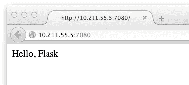
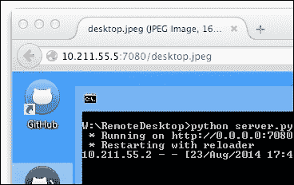
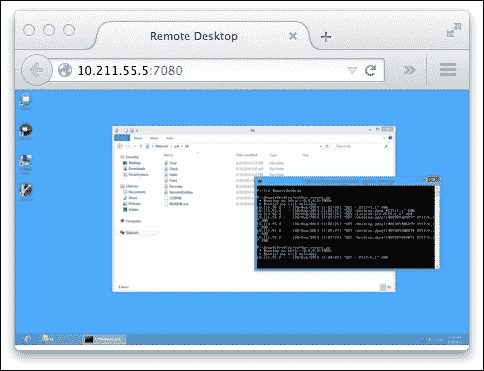
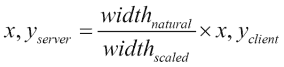
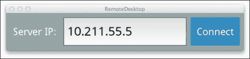
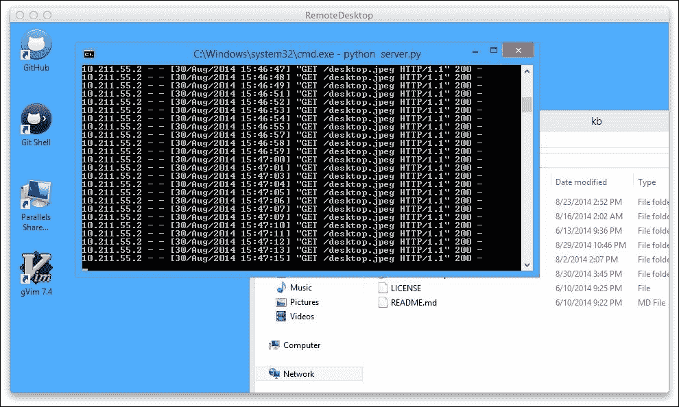

# 第五章：制作远程桌面应用程序

为了总结上一章开始的网络主题，让我们构建另一个客户端-服务器应用程序——一个远程桌面应用程序。这次我们的应用程序将解决一个更复杂的实际任务，并使用“真实”的应用层协议进行通信。

让我们暂时讨论一下手头的任务。首先，目的是：一个典型的远程桌面程序允许用户通过局域网或互联网远程访问其他计算机。这种应用程序通常用于临时技术支持或远程协助，例如，大公司中的 IT 人员。

其次，关于术语：*主机*机器是被远程控制的那一台（运行远程控制服务器），而*客户端*是控制主机的系统。远程系统管理基本上是用户通过另一台计算机系统（客户端）作为代理与主机机器进行交互的过程。

因此，整个努力归结为以下活动：

+   在客户端收集相关用户输入（如鼠标和键盘事件）并将其应用于主机

+   从主机机器发送任何相关输出（通常是屏幕截图，有时是音频等）回客户端

这两个步骤会重复执行，直到会话结束，机器之间的连接关闭。

我们之前讨论的定义非常广泛，许多商业软件包在功能完整性上竞争，有些甚至允许你远程玩视频游戏——带有加速图形和游戏控制器输入。我们将限制我们工作的范围，以便项目可以在合理的时间内完成：

+   对于用户输入，只接受并发送点击（或轻触，在此上下文中没有区别）。

+   对于输出，只捕获屏幕截图，因为捕获声音并通过网络传输可能对教程来说过于具有挑战性。

+   仅支持 Windows 主机。任何较新的 Windows 版本都应没问题；建议使用 Windows 7 或更高版本。我们假设是桌面操作系统，而不是 WinRT 或 Windows Phone。客户端没有这样的限制，因为它运行的是便携式 Kivy 应用程序。

最后一点是不幸的，但既然每个系统都使用不同的 API 来截图和模拟点击，我们仍然应该从最流行的一个开始。可以在稍后添加对其他主机系统的支持；这本身并不复杂，只是非常特定于平台。

### 备注

关于操作系统选择：如果你不使用 Windows 操作系统，不用担心。这和之前的 Android 一样：你可以在虚拟机中轻松运行 Windows。VirtualBox VM 是桌面虚拟化的首选解决方案，并且可以从官方网站免费获取[`www.virtualbox.org/`](https://www.virtualbox.org/)。

在 Mac 上，Parallels 在可用性和操作系统集成方面是一个更好的选择。唯一的可能缺点是它的价格昂贵。

在本章中，我们将介绍以下感兴趣的主题：

+   使用 Flask 微框架在 Python 中编写 HTTP 服务器

+   使用**Python Imaging Library**（**PIL**）进行截图

+   利用 WinAPI 功能在 Windows 上模拟点击

+   设计一个简单的 JavaScript 客户端并用于测试

+   最后，为我们的远程桌面服务器构建一个基于 Kivy 的 HTTP 客户端应用

# 服务器

为了简化测试和可能的未来集成，我们希望这次让我们的服务器使用一个成熟的应用层协议。让我们使用**超文本传输协议**（**HTTP**）；除了相对简单和易于测试之外，它还具有至少两个更有价值的特性：

+   丰富的库支持，包括服务器端和客户端。这显然是 HTTP 作为互联网（迄今为止最大和最受欢迎的网络）的推动力。

+   与许多其他协议不同，对于 HTTP，我们可以编写一个非常简单的概念验证 JavaScript 客户端，该客户端在网页浏览器中运行。这虽然与本书的主题没有直接关系，但在许多场景中可能很有用，尤其是在调试时。

我们将利用 Flask 库来构建服务器。还有一个流行的 Python 网络框架 Django，也非常推荐。然而，Django 项目通常最终会变得比较庞大，所以我们将坚持使用 Flask 来构建这个简单的服务器。

要在服务器上安装 Flask，以下命令就足够了：

```py
pip install Flask

```

如果您还没有安装`pip`，请首先尝试运行`easy_install pip`命令。根据您的 Python 设置，您可能需要以具有足够权限的特权用户身份运行此命令。

在 Windows 上，Python 的设置通常比 Mac OS 或 Linux 复杂得多；请参阅上一章中关于 Python 包管理的更详细信息。或者，您可以直接跳转到官方 pip 参考，网址为[`pip.pypa.io/en/latest/installing.html`](https://pip.pypa.io/en/latest/installing.html)。本文件涵盖了在所有支持的操作系统上安装`pip`。

### 注意

注意，与上一章我们构建的项目（聊天应用）类似，Kivy 框架不需要在服务器上安装。我们的服务器端代码是无头运行的，没有任何用户界面——除了偶尔的命令行输出。

## Flask 网络服务器

一个网络服务器通常由一系列绑定到不同 URL 的处理程序组成。这种绑定通常被称为*路由*。Flask（以及其他框架）的目标之一是消除这种绑定，并使向程序添加新路由变得容易。

最简单的单页 Flask 服务器（让我们称它为`server.py`）如下所示：

```py
from flask import Flask
app = Flask(__name__)

@app.route('/')
def index():
    return 'Hello, Flask'

if __name__ == '__main__':
    app.run(host='0.0.0.0', port=7080, debug=True)
```

在 Flask 中，使用装饰器如`@app.route('/')`来指定路由，当你只有少量不同的 URL 时，这非常完美。

`'/'` 路由是服务器根目录；当你将域名输入地址栏时，这是默认设置。要在你的浏览器中打开我们刚刚编写的简单网站，只需在同一台机器上访问 http://127.0.0.1:7080（别忘了先启动服务器）。当你这样做时，应该会看到一个 **Hello, Flask** 消息，确认我们的玩具 HTTP 服务器正在工作。



由 Flask 驱动的简约网站

对于不熟悉网络服务器的人来说，可能会对 `app.run()` 中的奇怪参数感到好奇，即 **0.0.0.0** IP 地址。这不是一个有效的 IP 地址，你可以连接到它，因为它本身并不指定一个网络接口（它是不可路由的）。在服务器的上下文中，绑定到这个 IP 地址通常意味着我们希望我们的应用程序监听所有 IPv4 网络接口——也就是说，响应来自机器上所有可用 IP 地址的请求。

这与默认的本地主机（或 127.0.0.1）设置不同：仅监听本地主机 IP 允许来自同一台机器的连接，因此，这种操作模式对于调试或测试可能很有帮助。然而，在这个例子中，我们使用了一个更面向生产的设置，0.0.0.0——这使得机器可以从外部世界（通常是局域网）访问。请注意，这并不会自动绕过路由器；它应该适用于您的局域网，但要使其在全球范围内可访问可能需要额外的配置。

此外，别忘了允许服务器通过防火墙，因为它的优先级高于应用程序级别的设置。

### 注意

**端口号选择**

端口号本身并没有太多意义；重要的是你在服务器和客户端使用相同的数字，无论是网页浏览器还是 Kivy 应用。

请注意，在几乎所有的系统中，端口号低于 1024 的端口只能由特权用户账户（root 或管理员）打开。那个范围内的许多端口已经被现有的服务占用，因此不建议为应用程序的特定需求选择低于 1024 的端口号。

HTTP 协议的默认端口号是 80，例如，[`www.w3.org/`](http://www.w3.org/) 与 [`www.w3.org:80/`](http://www.w3.org:80/) 相同，通常你不需要指定它。

你可能会注意到，Python 的网络开发非常简单——只有几行长的 Python 脚本就可以让你启动一个动态网络服务器。预期的是，并不是所有的事情都是这么简单；一些事情并不是立即以可重用库的形式可用。

顺便说一句，这可以被视为一种竞争优势：如果你在实现一个非平凡的功能时遇到困难，那么这种东西的实例可能不多，甚至没有，这使得你的产品最终更加独特和具有竞争力。

## 高级服务器功能 - 截图

一旦我们确定了协议和服务器端工具包，接下来的挑战包括从客户端获取截图和模拟点击。快速提醒一下：在本节中，我们将仅涵盖 Windows 特定的实现；添加 Mac 和 Linux 支持留作读者的练习。

幸运的是，PIL 正好有我们需要的函数；通过调用`PIL.ImageGrab.grab()`，我们得到 Windows 桌面的 RGB 位图截图。剩下的只是将其连接到 Flask，以便通过 HTTP 正确提供截图。

我们将使用一个旧的和基本上不再维护的 PIL 模块的分支，称为**Pillow**。顺便说一句，Pillow 是一个许多开发者使用的优秀开源项目；如果你想为 Python 用户空间做出贡献，那就不用再看了。一个好的起点将是 Pillow 的官方文档[`pillow.readthedocs.org/`](http://pillow.readthedocs.org/)。

按照你安装 Flask 的方式安装库：

```py
pip install Pillow

```

Pillow 为 Windows 预包装了二进制文件，因此你不需要在机器上安装编译器或 Visual Studio。

现在我们已经准备就绪。以下代码演示了如何从 Flask 服务器提供截图（或任何其他 PIL 位图）：

```py
from flask import send_file
from PIL import ImageGrab
from StringIO import StringIO

@app.route('/desktop.jpeg')
def desktop():
    screen = ImageGrab.grab()
    buf = StringIO()
    screen.save(buf, 'JPEG', quality=75)
    buf.seek(0)
    return send_file(buf, mimetype='image/jpeg')
```

如果你不太熟悉`StringIO`，它是一个存储在内存中而不是写入磁盘的文件类似对象。这种“虚拟文件”在需要使用期望在虚拟数据上有一个文件对象的 API 时非常有用。在这个例子中，我们不想将截图存储在物理文件中，因为截图是临时的，按定义不可重复使用。不断将数据写入磁盘的巨大开销是不合理的；通常更好（并且更快）的是分配一块内存，并在响应发送后立即释放它。

代码的其他部分应该是显而易见的。我们通过`PIL.ImageGrab.grab()`调用获取`screen`图片，使用`screen.save()`将其保存为有损、低质量的 JPEG 文件以节省带宽，最后将图像以`'image/jpeg'`的 MIME 类型发送给用户，这样它将被网络浏览器立即识别为正确类型的图片。

### 注意

在这种情况下，就像在其他许多情况下一样，低质量实际上是系统的理想属性；我们正在优化吞吐量和往返速度，而不是单个帧的视觉质量。

对于低质量代码的含义也是如此：有时能够快速制作一个原型实际上是非常好的，例如，当摆弄新概念或进行市场研究时。

虽然一开始看起来很奇怪，但`buf.seek(0)`调用是必需的，以*重置*`StringIO`实例；否则，它位于数据流的末尾，不会向`send_file()`提供任何内容。

现在你可以通过将你的浏览器指向`http://127.0.0.1:7080/desktop.jpeg`来测试我们迄今为止的服务器实现，并查看运行`server.py`脚本的机器的 Windows 桌面。如果代码正确无误，它应该会产生以下截图所示的图片：



通过 Flask 服务器看到的 Windows 桌面（片段）

这里有趣的部分是路由，**"desktop.jpeg"**。根据文件命名 URL 已经成为一种惯例，因为古老的网络服务器工具，如**个人主页**（**PHP**），一种适合构建简单动态站点的玩具编程语言，是在物理文件上操作的。这意味着基本上没有路由的概念——你只需在地址栏中输入脚本的名称，就可以在服务器上运行它。

显然，这为网络服务器安全留下了巨大的漏洞，包括（但不限于）通过输入例如`'/../../etc/passwd'`来远程查看系统配置文件，以及能够上传并运行恶意脚本作为特洛伊木马（后门），最终用于控制服务器。

Python 网络框架大多已经吸取了这个教训。虽然你可以尝试使用 Python 复制这样一个不安全的设置，但这既不简单，也强烈不建议这样做。此外，Python 库通常不会默认捆绑有不良的 PHP 风格配置。

今天，直接从文件系统中提供实际文件并不罕见，但主要用于静态文件。尽管如此，我们有时会像文件一样命名动态路由（例如`/index.html`、`/desktop.jpeg`等），以传达用户应该从这样的 URL 中期望的内容类型。

## 模拟点击

截图部分完成后，服务器上需要实现的最后一个非平凡的功能是点击模拟。为此，我们不会使用外部库；我们将使用 WinAPI（直接或间接为所有 Windows 应用程序提供动力的底层编程接口），通过内置的 Python `ctypes`模块来实现。

但首先我们需要从 URL 中获取点击坐标。让我们使用类似这样的常规`GET`参数：`/click?x=100&y=200`。在浏览器中手动测试应该很简单，与可能需要额外软件来模拟的 POST 和其他 HTTP 方法相比。

Flask 内置了一个简单的 URL 参数解析器，它们可以通过以下代码片段访问：

```py
from flask import request

@app.route('/click')
def click():
    try:
        x = int(request.args.get('x'))
        y = int(request.args.get('y'))
    except TypeError:
        return 'error: expecting 2 ints, x and y'
```

在原型设计时，这里推荐进行错误处理，因为很容易忘记或发送格式不正确的参数，所以我们正在检查这一点——从 `GET` 请求参数中获取数字的能力。如果看到这个明显的错误消息，响应也有助于调试，因为它完全清楚发生了什么以及在哪里查找问题——在传递给 `/click` 的参数的代码中。

在我们获得点击的坐标后，需要调用 WinAPI。我们需要两个函数，这两个函数都位于 `user32.dll` 中：`SetCursorPos()` 函数用于移动鼠标指针，`mouse_event()` 函数用于模拟一系列鼠标相关事件，例如鼠标按钮的按下或释放。

### 注意

顺便说一下，`user32.dll` 中的 `32` 部分与你的系统是 32 位还是 64 位无关。Win32 API 首次出现在 Windows NT 中，它比 AMD64（x86_64）架构早至少 7 年，被称为 Win32，而不是较旧的 16 位 WinAPI。

`mouse_event()` 函数的第一个参数是一个事件类型，它是一个 C 枚举（换句话说，一组整数常量）。为了提高可读性，让我们在我们的 Python 代码中定义这些常量，因为使用字面量 `2` 表示 **鼠标按下** 和 `4` 表示 **鼠标释放** 并不是很直观。这相当于以下几行代码：

```py
import ctypes
user32 = ctypes.windll.user32  # this is the user32.dll reference

MOUSEEVENTF_LEFTDOWN = 2
MOUSEEVENTF_LEFTUP = 4
```

### 提示

关于 WinAPI 函数和常量的完整参考，请访问 **Microsoft 开发者网络**（**MSDN**）网站，或者更具体地说，以下链接：

+   `SetCursorPos()`：[`msdn.microsoft.com/en-us/library/windows/desktop/ms648394%28v=vs.85%29.aspx`](http://msdn.microsoft.com/en-us/library/windows/desktop/ms648394%28v=vs.85%29.aspx)

+   `mouse_event()`：[`msdn.microsoft.com/en-us/library/windows/desktop/ms646260%28v=vs.85%29.aspx`](http://msdn.microsoft.com/en-us/library/windows/desktop/ms646260%28v=vs.85%29.aspx)

由于内容量较大，在这里重现此内容是不可行的，而且我们无论如何也不会使用大多数可用功能；WinAPI 包罗万象，几乎可以做任何事情，通常有多种方式。

这是最有趣的部分：我们实际上可以模拟点击。 (函数的第一部分，其中 `x` 和 `y` 从 `GET` 参数中获取，保持不变。) 代码如下：

```py
@app.route('/click')
def click():
    try:
        x = int(request.args.get('x'))
        y = int(request.args.get('y'))
    except:
        return 'error'

    user32.SetCursorPos(x, y)
    user32.mouse_event(MOUSEEVENTF_LEFTDOWN, 0, 0, 0, 0)
    user32.mouse_event(MOUSEEVENTF_LEFTUP, 0, 0, 0, 0)
    return 'done'
```

如果你尝试大声阅读代码，这个函数就会做它所说的：该函数将鼠标移动到所需位置，然后模拟左键鼠标点击（按钮按下和释放是两个独立的行为）。

现在，你应该能够手动控制宿主机器上的鼠标光标。尝试访问一个 URL，例如 `http://127.0.0.1:7080/click?x=10&y=10`，并确保屏幕的左上角有东西。你会注意到那个项目是如何被选中的。

你甚至可以快速刷新页面来执行双击。这可能需要你在另一台机器上运行浏览器；别忘了用实际的宿主 IP 地址替换 `127.0.0.1`。

# JavaScript 客户端

在本节中，我们将简要介绍 JavaScript 远程桌面客户端原型开发，这主要是因为我们使用了 HTTP 协议。这个简单的客户端将在浏览器中运行，并作为我们接下来要构建的 Kivy 远程桌面应用程序的原型。

如果你不太熟悉 JavaScript，不要担心；这种语言很容易上手，根据代码风格，甚至可能看起来与 Python 相似。我们还将使用 **jQuery** 来处理重负载，例如 DOM 操作和 AJAX 调用。

### 小贴士

在生产环境中，jQuery 的使用可能会受到批评（这是合理的），尤其是在追求精简、高性能的代码库时。然而，对于快速原型设计或虚荣 Web 应用，jQuery 非常出色，因为它可以快速编写出功能性的，尽管不是最优的，代码。

对于一个 Web 应用，我们需要提供一个完整的 HTML 页面，而不仅仅是 **Hello, Flask**。为此，让我们创建一个名为 `static` 的文件夹中的 `index.html` 文件，这是 Flask 期望找到它的位置：

```py
<!DOCTYPE html>
<html>
    <head>
        <meta charset="UTF-8">
        <title>Remote Desktop</title>
    </head>
    <body>
        <script src="img/"></script>
        <script>
            // code goes here
        </script>
    </body>
</html>
```

上述列表是一个非常基本的 HTML5 文档。目前它没有任何特殊功能：jQuery 是从官方 CDN 加载的，但仅此而已——还没有任何动态部分。

要从 Flask 提供这个新文件，将 `server.py` 中的 `index()` 函数替换为以下代码：

```py
@app.route('/')
def index():
    return app.send_static_file('index.html')
```

这与之前提到的 `desktop()` 函数工作原理相同，但这次是从磁盘读取一个真实文件。

## 无限截图循环

首先，让我们显示一个连续的屏幕录制：我们的脚本将每两秒请求一个新的截图，然后立即显示给用户。由于我们正在编写一个 Web 应用，所有复杂的事情实际上都是由浏览器处理的：一个 `` 标签加载图像并在屏幕上显示，我们几乎不需要做任何工作。

这里是这个功能的算法：

1.  移除旧的 `` 标签（如果有）

1.  添加一个新的 `` 标签

1.  2 秒后重复

在 JavaScript 中，可以这样实现：

```py
function reload_desktop() {
    $('img').remove()
    $('', {src: '/desktop.jpeg?' +
                Date.now()}).appendTo('body')
}

setInterval(reload_desktop, 2000)
```

这里有两件事可能需要一些额外的洞察：

+   `$()` jQuery 函数用于选择页面上的元素，以便我们可以对它们执行各种操作，例如 `.remove()` 或 `.insert()`。

+   `Date.now()` 返回当前时间戳，即自 1970 年 1 月 1 日以来的毫秒数。我们使用这个数字来防止缓存。每次调用都会不同；因此，当附加到（否则恒定的）`/desktop.jpeg` URL 时，时间戳将使其对网络浏览器来说是唯一的。

让我们也将图像缩小，使其不超过浏览器窗口的宽度，并移除任何边距。这也很简单实现；只需在 HTML 文档的 `<head>` 部分添加这个小样式表：

```py
<style>
    body { margin: 0 }
    img { max-width: 100% }
</style>
```

尝试调整浏览器窗口大小，注意图像如何缩小以适应。



在浏览器中查看的远程桌面，已缩放到浏览器窗口大小

你也可能注意到，在重新加载时图像闪烁。这是因为我们在图片完全加载之前立即向用户显示 `desktop.jpeg`。比视觉故障更严重的是下载的固定时间框架，我们任意选择为两秒。在慢速网络连接的情况下，用户将无法完成下载并看到他们桌面的完整图片。

我们将在 Kivy 远程桌面客户端的实现中解决这些问题。

## 将点击事件传递给主机

这是更有趣的部分：我们将捕获 `` 元素上的点击事件并将它们传递到服务器。这是通过在（反直觉地）`<body>` 元素上使用 `.bind()` 实现的。这是因为我们不断地添加和删除图片，所以绑定到图片实例上的任何事件在下次刷新后都会丢失（而且不断地重新绑定它们既是不必要的重复也是错误的）。代码列表如下：

```py
function send_click(event) {
    var fac = this.naturalWidth / this.width
    $.get('/click', {x: 0|fac * event.clientX,
                     y: 0|fac * event.clientY})
}

$('body').on('click', 'img', send_click)
```

在此代码中，我们首先计算“实际”的点击坐标：图片可能被缩小以适应浏览器宽度，所以我们计算比例并将点击位置乘以该比例：



JavaScript 中的 `0|expression` 语法是 `Math.floor()` 的更优替代品，因为它既更快又更简洁。还有一些微小的语义差异，但在这个阶段（如果有的话）并不重要。

现在，利用 jQuery 的 `$.get()` 辅助函数，我们将前一次计算的结果发送到服务器。由于我们很快就会显示一个新的截图，所以不需要处理服务器的响应——如果我们的最后操作有任何效果，它将通过视觉反映出来。

使用这个简单的远程桌面客户端，我们已经有能力查看远程主机的屏幕，启动并控制在该机器上运行的程序。现在，让我们在 Kivy 中重新实现这个原型，并在过程中改进它，特别是使其更适合在移动设备上使用，添加滚动并消除闪烁。

# Kivy 远程桌面应用

是时候使用 Kivy 构建一个功能齐全的远程桌面客户端了。我们可以从上一个应用程序中重用几个东西，来自 第四章 的 Chat 应用程序，*Kivy 网络*。从概念上讲，这些应用程序相当相似：每个应用程序都有两个屏幕，其中一个屏幕类似于带有服务器 IP 地址的登录表单。让我们利用这种相似性，并在我们的全新 `remotedesktop.kv` 文件中重用 `chat.kv` 文件的部分，特别是实际上没有变化的 `ScreenManager` 设置。

## 登录表单

以下列表定义了登录表单。它由三个元素组成——字段标题、输入字段本身和登录按钮——位于屏幕顶部的行中：

```py
Screen:
    name: 'login'

    BoxLayout:
        orientation: 'horizontal'
        y: root.height - self.height

        Label:
            text: 'Server IP:'
            size_hint: (0.4, 1)

        TextInput:
            id: server
            text: '10.211.55.5'  # put your server IP here

        Button:
            text: 'Connect'
            on_press: app.connect()
            size_hint: (0.4, 1)
```

这次只有一个输入字段，**服务器 IP**。实际上，如果你可以从给定的机器解析主机名，你也可以输入它，但让我们坚持这种命名方式，因为它更不模糊。局域网可能没有 DNS 服务器，或者它可能被配置成不符合用户对主机名的期望。



简单且明确的登录表单

IP 地址并不是非常用户友好，但在这里我们没有太多选择——构建一个自动发现网络服务来避免这种情况，虽然在现实场景中非常理想，但也可能非常复杂（而且可能因为可用的技术和可能的注意事项数量众多而值得有自己的书籍）。

### 注意

为了在复杂场景中处理机器，例如连接到位于路由器后面的机器，你需要了解基本的网络知识。如前所述，这基本上超出了本工作的范围，但这里有一些快速提示：

+   当所有你的机器都坐在同一个网络中（从路由器的同一侧拓扑连接）时，测试网络应用程序要容易得多。

+   将前面的观点推向极端意味着在每个物理机器上的 VM 中运行每个测试盒。这样，你可以模拟你想要的任何网络拓扑，而无需每次想要调整某些东西时重新排列物理线缆。

+   要查看分配给计算机每个网络接口的每个 IP 地址，请在 Mac 或 Linux 机器上运行`ifconfig`，或在 Windows 上运行`ipconfig`。通常，你的外部（互联网）IP 地址不会显示在输出中，但你的本地（局域网）网络地址是。

关于登录屏幕没有太多可说的，因为它完全由我们在本书的讨论过程中已经讨论过的构建块组成。让我们继续到第二个屏幕，最终到驱动客户端-服务器引擎的源代码。

## 远程桌面屏幕

这是我们的应用程序中的第二个也是最后一个屏幕，远程桌面屏幕。在主机机器屏幕足够大的情况下，它将在两个维度上可滚动。鉴于在今天的移动设备中，全高清（1080p 及以上）的分辨率并不罕见，更不用说桌面计算机了，所以我们可能根本不需要滚动。

我们可以根据与我们在第四章中构建的聊天室面板相似的原则构建一个可滚动的布局，即*Kivy 网络*。如前所述，滚动将是二维的；一个额外的区别是我们这次不想有任何过度滚动（反弹）效果，以避免不必要的混淆。我们向用户展示的是一个（远程）桌面，操作系统的桌面通常没有这个功能。

在这个屏幕背后的`remotedesktop.kv`代码实际上非常简洁。让我们看看它的不同部分是如何为手头的任务做出贡献的：

```py
Screen:
    name: 'desktop'

    ScrollView:
        effect_cls: ScrollEffect

        Image:
            id: desktop
            nocache: True
            on_touch_down: app.send_click(args[1])
            size: self.texture_size
            size_hint: (None, None)
```

为了使滚动工作，我们将`ScrollView`与`Image`结合使用，这可能会比可用的屏幕空间更大。

在`ScrollView`中，我们将`effect_cls: ScrollEffect`设置为禁用越界滚动；如果您希望保留越界滚动行为，只需删除此行。由于`ScrollEffect`名称默认未导入，我们不得不导入它：

```py
#:import ScrollEffect kivy.effects.scroll.ScrollEffect
```

将`Image`的`size_hint`属性设置为`(None, None)`至关重要；否则，Kivy 会缩放图像以适应，这在当前情况下是不希望的。将`size_hint`属性设置为`None`意味着*让我手动设置大小*。

然后，我们就是这样做的，将`size`属性绑定到`self.texture_size`。使用此设置，图像将与服务器提供的`desktop.jpeg`纹理大小相同（这显然取决于主机机的物理桌面大小，因此我们无法将其硬编码）。

还有`nocache: True`属性，它指示 Kivy 永远不要缓存由定义是临时的桌面图像。

最后但同样重要的是，`Image`的一个有趣属性是其`on_touch_down`处理程序。这次，我们想要传递触摸事件的精确坐标和其他属性，这正是`args[1]`的含义。如果您在疑惑，`args[0]`是被点击的部件；在这种情况下，那就是图像本身（我们只有一个`Image`实例，因此没有必要将其传递给事件处理程序）。

## Kivy 中的截图循环

现在，我们将使用 Python 将所有这些组合在一起。与 JavaScript 实现相比，我们不会完全免费获得图像加载和相关功能，所以代码会多一点；然而，实现这些功能相当简单，同时还能更好地控制整个过程，您很快就会看到。

为了异步加载图像，我们将使用 Kivy 内置的`Loader`类，来自`kivy.loader`模块。程序流程将如下所示：

1.  当用户在填写完**服务器 IP**字段后点击或轻触登录屏幕上的**连接**按钮时，将调用`RemoteDesktopApp.connect()`函数。

1.  它将控制权传递给`reload_desktop()`函数，该函数从`/desktop.jpeg`端点开始下载图像。

1.  当图像加载完成后，`Loader`调用`desktop_loaded()`，将图像放在屏幕上并安排下一次调用`reload_desktop()`。因此，我们得到一个从主机系统异步无限循环检索截图的循环。

图像在成功加载后放在屏幕上，所以这次不会有像 JavaScript 原型中那样的闪烁。（在 JS 中也可以解决，当然，但这不是本文的目的。）

让我们更仔细地看看`main.py`中提到的上述函数：

```py
from kivy.loader import Loader

class RemoteDesktopApp(App):
    def connect(self):
        self.url = ('http://%s:7080/desktop.jpeg' %
                    self.root.ids.server.text)
        self.send_url = ('http://%s:7080/click?' %
                         self.root.ids.server.text)
        self.reload_desktop()
```

我们保存 `url`（`/desktop.jpeg` 的完整位置以及服务器 IP）和 `send_url`（将点击传递给主机的 `/click` 端点位置），然后传递执行到 `RemoteDesktopApp.reload_desktop()` 函数，这个函数也非常简洁：

```py
def reload_desktop(self, *args):
    desktop = Loader.image(self.url, nocache=True)
    desktop.bind(on_load=self.desktop_loaded)
```

在前面的函数中，我们开始下载图像。当下载完成时，新加载的图像将被传递到 `RemoteDesktopApp.desktop_loaded()`。

不要忘记通过传递 `nocache=True` 参数禁用默认的积极缓存。省略此步骤将导致 `desktop.jpeg` 图像只加载一次，因为其 URL 保持不变。在 JavaScript 中，我们通过在 URL 后追加 `?timestamp` 来解决这个问题，使其变得独特，我们当然可以在 Python 中模仿这种行为，但这是一种黑客行为。Kivy 指定 `nocache` 的方式更干净、更易读。

在这里，你可以观察到图像下载过程的最终结果：

```py
from kivy.clock import Clock

def desktop_loaded(self, desktop):
    if desktop.image.texture:
        self.root.ids.desktop.texture = \
            desktop.image.texture

    Clock.schedule_once(self.reload_desktop, 1)

    if self.root.current == 'login':
        self.root.current = 'desktop'
```

这个函数接收新的图像，`desktop`。然后，我们继续用新加载的纹理替换屏幕上的纹理，并安排在下一秒发生截图循环的下一个迭代。

### 小贴士

在我们的第一个项目中（第一章, *构建时钟应用*），我们简要讨论了 `Clock` 对象。在那里，我们通过调用 `schedule_interval()` 来执行周期性操作，类似于 JavaScript 中的 `setInterval()`；在这种情况下，我们想要一次调用，`schedule_once()`，类似于 JS 中的 `setTimeout()`。

现在，是时候从登录屏幕切换到远程桌面屏幕了。以下截图总结了到目前为止我们所做的工作：



一个只读（仍然无法将点击传递回主机）的远程桌面应用

## 发送点击

远程桌面查看器已经准备好，具有滚动和帧之间的即时转换功能（完全没有闪烁）。最后剩下的一件事是实现发送点击到主机。为此，我们将监听图像上的 `on_touch_down` 事件，并将触摸坐标传递给事件处理函数 `send_click()`。

这是在 `remotedesktop.kv` 中发生的地方：

```py
Screen:
    name: 'desktop'

    ScrollView:
        effect_cls: ScrollEffect

        Image:
            on_touch_down: app.send_click(args[1])
            # The rest of the properties unchanged
```

为了将其置于上下文中，以下是 `class RemoteDesktopApp` 中的 Python 对应部分：

```py
def send_click(self, event):
    params = {'x': int(event.x),
              'y': int(self.root.ids.desktop.size[1] -
                       event.y)}
    urlopen(self.send_url + urlencode(params))
```

我们收集点击坐标，并通过 Python 标准库中的网络相关函数使用 HTTP `GET` 请求将它们发送到服务器。

这里一个主要的注意事项是坐标系：在 Kivy 中，*y* 轴向上，而在 Windows 和其他地方（例如，在浏览器中）通常是向下（例如，在浏览器中）。为了解决这个问题，我们从桌面高度中减去 `event.y`。

另一个稍微不那么成问题的一面是跨不同 Python 版本使用 Python 的标准库：在从 Python 2 到 Python 3 的过渡中，`urllib[2]` 模块的结构发生了显著变化。

为了应对这些变化，我们可以使用以下方式进行导入：

```py
try:  # python 2
    from urllib import urlencode
except ImportError:  # python 3
    from urllib.parse import urlencode

try:  # python 2
    from urllib2 import urlopen
except ImportError:  # python 3
    from urllib.request import urlopen

```

虽然这个方法并不特别美观，但它应该能帮助你完成 Python 升级，如果你尝试的话。（实际上，针对固定版本的 Python 也是完全可以接受的。事实上，在撰写本文时，包括 Python 编程语言的创造者 Guido van Rossum 的雇主在内的许多公司就是这样做的。）

### 注意

在这种情况下，Python 标准库完全足够；然而，如果你在任何时候发现自己正在编写重复、无聊且缺乏想象力的 HTTP 相关代码，考虑使用 Kenneth Reitz 的优秀的**Requests**库。访问[`python-requests.org/`](http://python-requests.org/)获取更多信息及示例。它的语法简洁明了，非常出色。强烈推荐，这个库堪称艺术品。

## 接下来是什么

现在，你有一个主要按预期工作的远程桌面应用，尤其是在局域网或快速互联网连接下。像往常一样，还有很多额外的问题需要解决，以及许多新功能需要实现，如果你对此感兴趣并且愿意进一步探讨这个话题的话：

+   将鼠标移动作为单独的事件发送。这也可能适用于双击、拖放等。

+   尝试考虑网络延迟。如果用户连接速度慢，你可以在服务器上进一步降低图像质量以补偿。向用户提供视觉线索，表明后台正在发生某些事情，也有帮助。

+   使服务器跨平台，以便在 Mac、Linux 上运行，甚至可能在 Android 和 Chrome OS 上运行。

此外，记住这是一个行业强任务。客观上，构建这样的软件就很困难，更不用说让它完美无瑕且速度极快了。Kivy 在 UI 方面有很大帮助，简化了图像下载和缓存，但仅此而已。

因此，如果你在实施过程中遇到某些东西不能立即工作，不要担心——在这种情况下，试错法并不罕见。有时，你只需要一步一步地前进。

在网络领域有很多东西要学习，而且在这个领域有知识的人很少，而且非常受重视，所以深入研究计算机之间通信的话题肯定是有回报的。

# 摘要

这构成了远程桌面应用的使用说明。生成的应用实际上可以用于简单的任务，例如，偶尔点击 iTunes 中的**播放**按钮或关闭一个程序。更复杂的需求，特别是管理任务，可能需要更复杂的软件。

我们还构建了一个由 Flask 驱动的网络服务器，能够动态生成图像并与主机系统交互。在此基础上，我们还推出了一个具有几乎相同功能的“轻量级”JavaScript 版本的应用。这个故事的核心是，我们的 Kivy 应用并非孤立存在。实际上，我们甚至在与客户端应用的运行原型一起构建服务器——这一切都是在编写任何与 Kivy 相关的代码之前完成的。

作为一条一般规则，按照这样的顺序构建你的软件，以便你可以立即测试其每个部分，这非常有帮助。我这里不是在谈论**测试驱动开发**（**TDD**），因为关于全面、纯粹基于测试的编程是否有助于事业，是有争议的。但即使只是能够调整每个功能组件，也比一开始就编写一大堆代码要高效得多。

最后，当涉及到网络 GUI 应用时，Kivy 配置得相当完善。例如，我们在上一章中使用的 Twisted 集成，以及通过网络加载纹理的支持——这些功能极大地帮助构建多用户、互联网应用。

现在，让我们跳到另一个完全不同的主题：Kivy 游戏开发。
