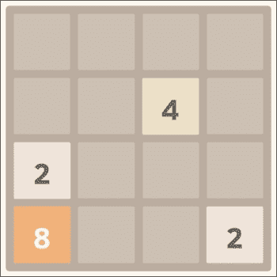
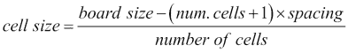
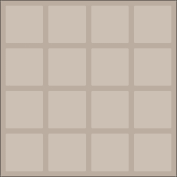
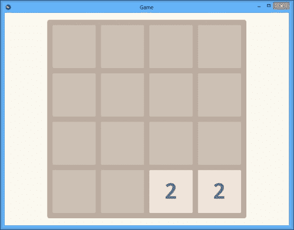
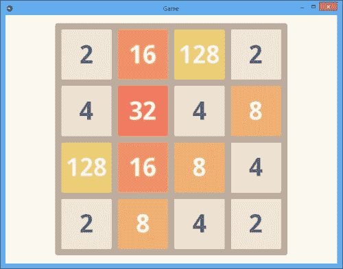

# 第六章：制作 2048 游戏

在接下来的几章中，我们将构建一系列越来越复杂的游戏项目，以展示与游戏开发相关的一些常见概念：状态管理、控制、音效和基于快速着色器的图形，仅举几例。

在一开始需要考虑的重要事情是，没有任何方法实际上是游戏开发独有的：还有其他类别的软件使用与视频游戏相同的算法和性能技巧。

然而，让我们从小处着手，逐步过渡到更复杂的事情。我们的第一个项目是重新实现相对知名的**2048**游戏。

本章将介绍在开发游戏时实际上必需的许多 Kivy 技术：

+   创建具有自定义外观和行为的 Kivy 小部件

+   在画布上绘制并利用内置的图形指令

+   使用绝对定位在屏幕上任意排列小部件（而不是依赖于结构化布局）

+   使用 Kivy 内置的动画支持平滑地移动小部件

使用绝对坐标定位小部件可能听起来是在习惯了布局类之后的一种倒退，但在高度交互式应用程序（如游戏）中是必要的。例如，许多桌面游戏的矩形游戏场可以用`GridLayout`表示，但即使是基本的动画，如从单元格到单元格的移动，也会很难实现。这样的任务注定要包括以某种形式进行小部件的重父化；这本身几乎就抵消了使用固定布局的任何好处。

# 关于游戏

对于初学者来说，2048 游戏是一种数学谜题，玩家需要合并数字以达到 2048，甚至可能超过 2048，达到 4096 和 8192（尽管这可能很有挑战性，所以 2048 是一个足够难以达到的胜利条件）。游戏板是一个 4×4 的方形网格。一开始大部分是空的，只有几个**2**方块。每个回合玩家将所有方块移动到所选的方向：上、右、下或左。如果一个方块无法向该方向前进（没有可用空间），则它将保持在原地。



2048 游戏板（原游戏截图）

当两个具有相同数值的方块接触（或者说，尝试移动到对方上方）时，它们会合并成一个，并相加，将方块的名义值增加到下一个 2 的幂。因此，进度看起来是这样的：2，4，8，16，...，2048 等等；程序员通常会发现这个序列很熟悉。每回合结束后，在随机空位中会生成另一个**2**方块。

2048 游戏的原版有时也会创建**4**而不是**2**；这是一个不太重要的特性，本章不会涉及，但实现起来应该相当简单。

如果玩家没有有效的移动可用（棋盘被填充成一个不幸的组合，其中没有相同值的瓷砖相邻），游戏就会结束。你可以在[`gabrielecirulli.github.io/2048/`](http://gabrielecirulli.github.io/2048/)上玩原始的 2048 游戏。

## 游戏玩法概念和概述

游戏通常非常具有状态性：应用程序会经过多个独特的状态，例如起始屏幕、世界地图、城镇屏幕等，具体取决于游戏的细节。当然，每个游戏都非常不同，并且没有许多方面在大量游戏中是共同的。

其中一个方面，而且非常基础，就是大多数游戏要么有赢的条件，要么有输的条件，通常两者都有。这听起来可能很微不足道，但这些条件和相关的游戏状态可能会对玩家的参与度和对游戏的感知产生巨大影响。

### 注意

有些游戏设计上完全是无限的，规则中没有任何“游戏结束”状态的含义（既不赢也不输），在玩家动机方面非常难以正确实现。这类游戏通常还会提供强烈的局部优势和劣势状态来补偿。

例如，虽然你无法在《魔兽世界》或遵循相同设计概念的许多其他 MMORPG 游戏中赢得游戏或完全死亡并进入“游戏结束”状态，但你确实会因为忽视角色的健康和统计数据而受到惩罚，需要执行游戏内的复活和相关任务，如修复损坏的装备。

此外，如果你特别擅长，你通常可以与其他高技能玩家组队，获得其他玩家无法获得的物品（因此对不良或休闲玩家不可用）。这包括许多 Boss 遭遇战、突袭以及那些难以获得的成就。

2048 中提到的上述失败条件——当棋盘上没有可用的移动时游戏结束——在实践中效果很好，因为它使得游戏在结束时逐渐变得更加困难。

在游戏开始时，游戏本身并不难：玩家基本上可以完全随机地移动，没有任何策略。新瓷砖以相同的值添加到棋盘上，因此在最初的几轮中，不可能填满所有单元格并耗尽有效的移动，即使是有意为之——所有的瓷砖都是兼容的，可以组合，无论玩家选择向哪个方向移动。

然而，随着你在游戏中进一步前进，棋盘上的变化引入，空闲单元格变得越来越稀缺。由于不同的值不能合并在一起，棋盘管理很快就会成为一个问题。

游戏玩法机制是使 2048 如此吸引人的原因：它很容易开始，规则简单，并且在整个游戏过程中不会改变，2048 在游戏初期不会惩罚实验性的行为，即使是以明显次优的行为形式，直到游戏后期。

### 随机性，或者缺乏随机性

由于所有瓦片（最多 16 个）同时移动，如果玩家没有密切注意，一些由此产生的情况可能没有被预见。尽管这个算法是完全确定性的，但它给人的感觉是带有一点随机性。这也通过使 2048 感觉更像街机游戏，略带不可预测性和惊喜，来帮助提高参与度。

这通常是一件好事：随机遭遇（或者更准确地说，像这种情况中被感知为随机的遭遇）可以为其他方面线性的过程增添活力，使游戏玩法更有趣。

## 2048 项目概述

总结来说，以下是该游戏的定义特征：

+   游戏场（即棋盘）是 4×4 个单元格

+   在每一回合中发生以下动作：

    +   玩家将所有瓦片移动到所选方向

    +   合并两个具有相同数值的瓦片会产生一个数值更大的瓦片

    +   在空白空间中生成一个新的**2**瓦片

+   玩家通过创建一个**2048**瓦片获胜

+   当没有有效的移动剩下时（也就是说，没有可能的移动可以再改变棋盘上的情况时），游戏结束

这个清单将在稍后派上用场，因为它形成了我们在本章中将要实现的基本技术概述。

## 什么使 2048 成为项目选择的好选择？

有些人可能会问，重新实现现有游戏是否是一个明智的想法。答案是，无论如何都是肯定的；更详细的解释将在下面提供。

当谈论实际软件开发时，这一点稍微有些离题。但重新创建一个知名项目的理由可能并不明显。如果这个章节的方法对你来说没有冗长的解释就完全合理，那么请随意跳到下一节，那里将开始实际开发。

为了支持选择 2048（以及整体上“重新实现轮子”的方法），让我们首先假设以下情况：游戏开发在许多不同层面上都极具挑战性：

+   有趣的游戏设计很难找到。游戏机制必须有一个中心思想，这可能需要一定程度的创造力。

+   一款好游戏需要游戏玩法不是过于复杂，否则可能会迅速导致挫败感，但也不能过于简单，否则会变得无聊。平衡这一点听起来可能一开始很简单，但通常很难做到恰到好处。

+   有些算法比其他算法更难。在平坦的瓦片地图上寻找路径是容易接近的，但在动态的任意三维空间中寻找路径则完全是另一回事；为射击游戏设计的**人工智能**（**AI**）可能很简单，但仍能提供出色的结果，而策略游戏中的 AI 则必须聪明且不可预测，以提供足够的挑战和多样性。

+   注意细节以及使游戏变得出色的打磨程度，即使是该领域的专业人士也可能感到压倒性，甚至令人难以承受。

这个列表绝对不是详尽的，它的目的不是让所有人都远离游戏开发，而是要传达一个观点——有很多事情可能会出错，所以不要犹豫，将一些任务外包给第三方。这增加了你交付一个可工作的项目的可能性，并减少了相关的挫折感。

在游戏开发中（尤其是像本书项目这样的零预算、偶尔的努力）的一个常用方法就是避免昂贵的创意搜索，尤其是在游戏玩法方面。如果你不能让项目走出大门，其独特性几乎毫无价值。这就是为什么在构建新游戏时，应该尽可能多地重用现有元素。

当然，你不必逐字复制别人的想法——调整游戏的每个方面都可以很有趣，并且是一项非常有回报的努力。

事实上，大多数游戏都借鉴了前人的想法、游戏玩法，有时甚至包括视觉属性，整体上变化非常小（这并不一定是好事，只是当今行业的状态，无论好坏）。

### 简单性作为一项特性

回到 2048 游戏来说，值得注意的是，它的规则非常简单，几乎可以说是微不足道的。然而，乐趣因素却不可思议地高；2048 在相当长的一段时间里非常受欢迎，无数的衍生作品充斥着互联网和应用商店。

仅此一点就使得 2048 游戏值得从头开始重建，尤其是为了学习目的。让我们假设，到这一点，你已经完全确信 2048 是一个绝佳的项目选择，并且渴望继续实际开发。

# 创建 2048 游戏板

到目前为止，我们一直依赖于现有的 Kivy 小部件，根据需要对其进行定制以适应我们的特定用例。对于这个应用程序，我们将构建我们自己的独特小部件：`Board`（游戏区域）和`Tile`。

让我们从简单的事情开始，为游戏区域创建背景。最缺乏想象力的方法就是使用静态图像；这种方法有很多问题，例如，它不能正确支持多种可能的屏幕尺寸（记住，我们同时谈论的是桌面和移动设备，所以屏幕尺寸可能会有很大的变化）。

相反，我们将创建一个`Board`小部件，它将游戏区域的图形渲染到其画布上。这样，游戏板的定位和大小将在 Kivy 语言文件中以声明性方式给出，就像我们之前使用过的其他小部件一样（例如文本标签和按钮）。

可能最容易开始的事情确实是设置游戏板的定位和大小。为了高效地完成这项任务，我们可以使用`FloatLayout`；这是 Kivy 提供的简单布局类之一，它只使用大小和位置提示。以下列表基本上总结了`FloatLayout`的使用（此代码位于`game.kv`文件中）：

```py
#:set padding 20

FloatLayout:
    Board:
        id: board
        pos_hint: {'center_x': 0.5, 'center_y': 0.5}
        size_hint: (None, None)
        center: root.center
        size: [min(root.width, root.height) - 2 * padding] * 2
```

在这里，`Board` 小部件在屏幕上水平和垂直居中。为了考虑到任何可能的屏幕方向或纵横比，我们通过选择屏幕较小的边（宽度或高度）并减去两次填充（我们希望两侧有相同的间隙）来计算棋盘大小。棋盘是正方形的，所以其尺寸相等。

### 提示

在 `size:` 行上的 `[...] * 2` 技巧是 Python 的一个相当标准的特性，用于在初始化数据结构时避免多次重复相同的值，例如，`[1] * 3` 等于 `[1, 1, 1]`。

为了避免与算术乘法混淆，我们应谨慎使用此功能。然而，在生产环境中，您应考虑在适当的地方使用此语法，因为它比手动编写相同的重复列表或元组更简洁。

为了看到我们迄今为止的工作结果，我们需要定义 `Board` 小部件本身并使其渲染某些内容（默认情况下，空小部件是完全不可见的）。这将在 `main.py` 文件中完成：

```py
from kivy.graphics import BorderImage
from kivy.uix.widget import Widget

spacing = 15

class Board(Widget):
    def __init__(self, **kwargs):
        super(Board, self).__init__(**kwargs)
        self.resize()

    def resize(self, *args):
        self.cell_size = (0.25 * (self.width - 5 * spacing), ) * 2
        self.canvas.before.clear()
        with self.canvas.before:
            BorderImage(pos=self.pos, size=self.size,
                        source='board.png')

    on_pos = resize
    on_size = resize
```

与 `game.kv` 中 `padding` 的定义类似，我们在 Python 源代码的顶部定义 `spacing`。这是两个相邻单元格之间的距离，以及从棋盘边缘到附近单元格边缘的距离。

`resize()` 方法在本部分代码中起着核心作用：它在创建 `Board` 小部件（直接从 `__init__()`）或重新定位（借助 `on_pos` 和 `on_size` 事件回调）时被调用。如果小部件确实进行了调整大小，我们预先计算新的 `cell_size`；实际上，这是一个非常简单的计算，所以即使小部件在调用之间的大小没有改变，也不会造成伤害：



在这里，*大小*指的是宽度或高度，因为所有相关对象都是正方形的。

接下来，我们渲染背景。我们清除 `canvas.before` 图形指令组，并用原语（目前仅由 `BorderImage` 表示）填充它。与 `canvas.after` 或 `canvas` 相比，`canvas.before` 组在渲染小部件时首先执行。这使得它非常适合需要位于任何子图形之下的背景图像。

### 注意

画布指令组是 Kivy 组织底层图形操作的方式，例如将图像数据复制到画布、绘制线条和执行原始 OpenGL 调用。有关使用画布的简要介绍，请参阅第二章，*构建绘图应用程序*。

单个画布指令，存在于 `kivy.graphics` 命名空间中，在概念上是 `canvas` 对象（或 `canvas.before` 和 `canvas.after`）的子对象，就像叶小部件是容器或根小部件的子对象一样。代码中的分层定义看起来也非常相似。

然而，一个重要的区别是，小部件具有复杂的生命周期，可以在屏幕上对齐，响应事件，并执行更多操作。相反，渲染指令只是那样——主要是用于绘图的自我包含的基本原语。例如，`Color`指令更改队列中后续指令的颜色（色调）；`Image`在画布上绘制图像；等等。

目前，背景只是一个矩形。由于背景图片`board.png`的使用，它具有圆角，这是通过`BorderImage`指令实现的——一种在第一章中描述的 9 宫格技术，*构建时钟应用*，类似于本书中所有前例中实现带边框按钮的方式。

## 遍历单元格

我们的竞技场是二维的，通过嵌套`for`循环可以非常明显地遍历二维数组，如下所示：

```py
for x in range(4):
    for y in range(4):
        # code that uses cell at (x, y)
```

不仅难以操作，增加了两层缩进，而且当在程序中的许多地方使用时，还会导致代码重复，这是不希望的。在 Python 中，我们可以使用如这里所示的生成器函数重构此代码：

```py
# In main.py
def all_cells():
    for x in range(4):
        for y in range(4):
            yield (x, y)
```

生成器函数本身看起来与前面代码片段中显示的直接方法相似。然而，它的使用却更加清晰：

```py
for x, y in all_cells():
    # code that uses cell at (x, y)
```

这基本上是运行两个嵌套循环的相同代码，但那些细节被抽象化了，因此我们有一个整洁的一行代码，它也比穿插在每个坐标上的直接`for`循环代码更可定制。

在以下代码中，我们将把板坐标（指代板上的单元格，而不是屏幕上渲染对象的像素坐标）称为`board_x`和`board_y`。

## 渲染空单元格

游戏板的整体位置和大小由`Board`小部件的位置定义，但单个单元格的位置尚未确定。接下来，我们将计算每个单元格在屏幕上的坐标，并在画布上绘制所有单元格。

考虑到`spacing`，屏幕上单元格的位置可以这样计算：

```py
# In main.py
class Board(Widget):
    def cell_pos(self, board_x, board_y):
        return (self.x + board_x *
                (self.cell_size[0] + spacing) + spacing,
                self.y + board_y *
                (self.cell_size[1] + spacing) + spacing)
```

画布操作通常期望绝对坐标，这就是为什么我们要将`Board`的位置（`self.x`，`self.y`）添加到计算值中。

现在我们能够遍历竞技场，并根据每个单元格的板位置计算其在屏幕上的位置，剩下要做的就是实际上在画布上渲染单元格。按照以下方式调整`canvas.before`代码应该足够：

```py
from kivy.graphics import Color, BorderImage
from kivy.utils import get_color_from_hex

with self.canvas.before:
    BorderImage(pos=self.pos, size=self.size,
                source='board.png')
    Color(*get_color_from_hex('CCC0B4'))
    for board_x, board_y in all_cells():
        BorderImage(pos=self.cell_pos(board_x, board_y),
                    size=self.cell_size,
                    source='cell.png')
```

在渲染图像时，`Color`指令与本书中之前讨论过的目的相同（例如，在第二章中，*构建绘图应用*）：它允许每个瓦片有不同的颜色，同时使用相同的（白色）图像作为纹理。

此外，请注意 `cell_pos` 和 `cell_size` 的使用——这些是实际的屏幕坐标（以像素为单位）。它们根据应用程序窗口的大小而变化，通常仅用于在屏幕上绘制某些内容。对于游戏逻辑，我们将使用更简单的棋盘坐标 `board_x` 和 `board_y`。

这张截图总结了到目前为止我们所做的工作：



比赛场地，目前没有任何有趣的东西

## 棋盘数据结构

为了能够处理游戏逻辑，我们需要保留棋盘的内部表示。为此，我们将使用一个简单的二维数组（从技术上讲，是一个列表的列表）。棋盘的空白状态如下所示：

```py
[[None, None, None, None],
 [None, None, None, None],
 [None, None, None, None],
 [None, None, None, None]]
```

`None` 的值表示单元格为空。可以使用嵌套列表推导式初始化描述的数据结构，如下面的代码片段所示：

```py
class Board(Widget):
    b = None

    def reset(self):
        self.b = [[None for i in range(4)]
                  for j in range(4)]
```

我们称先前的函数为 `reset()`，因为它不仅会在事先初始化数据结构，而且在游戏结束后也会将游戏状态恢复到空白状态。

列表推导式的使用并非绝对必要；这种表示法只是比之前展示的列表列表形式更为简洁。如果你认为（如之前所示）的原始形式更易读，那么在初始化网格时，完全可以使用它。

### 变量命名

简短的名字 `b` 被认为是合适的，因为这个属性应该被视为类的内部属性，因此它不参与外部 API（或缺乏 API）。我们还将在这个代码中大量使用这个变量，这也起到了减少输入的作用，类似于常用的循环迭代变量 `i` 和 `j`。

在 Python 中，通常使用前导下划线来表示私有字段，例如 `_name`。我们在这里并不严格遵循这一惯例，部分原因是因为当与非常短的名字一起使用时，这看起来不太好。这个类的大部分内容都是应用程序内部的，几乎无法作为单独的模块重用。

在所有目的和意义上，将 `Board.b` 视为一个局部变量，特别是 `Board` 在我们的应用程序中充当单例：在任何给定时间点，应该只有一个实例。

### 调用 reset()

游戏开始时，我们应该调用 `Board.reset()` 来初始化棋盘的内部表示。这样做的地方是应用程序的 `on_start` 回调，如下面的代码片段所示：

```py
# In main.py
from kivy.app import App

class GameApp(App):
    def on_start(self):
        board = self.root.ids.board
        board.reset()
```

## 测试通行性

我们目前还没有什么巧妙的东西可以放入网格中，但这并不妨碍我们编写通行性检查，`can_move()`。这个辅助函数测试我们是否可以在棋盘的指定位置放置一个瓷砖。

检查有两重。首先，我们需要确保提供的坐标在一般情况下是有意义的（也就是说，不要超出棋盘），这个检查将存在于一个名为 `valid_cell()` 的单独函数中。然后，我们查找棋盘单元格以查看它是否为空（等于 `None`）。如果移动是合法的且单元格是空的，则返回值将为 `True`，否则为 `False`。

前面的句子可以直译为 Python：

```py
# In main.py, under class Board:
def valid_cell(self, board_x, board_y):
    return (board_x >= 0 and board_y >= 0 and
            board_x <= 3 and board_y <= 3)

def can_move(self, board_x, board_y):
    return (self.valid_cell(board_x, board_y) and
            self.b[board_x][board_y] is None)
```

这些方法将在编写负责瓦片移动的代码时使用。但首先，我们需要创建瓦片。

# 制作瓦片

本章的这一部分致力于构建 `Tile` 小部件。与我们在前面看到的 `Board` 小部件相比，瓦片在性质上更加动态。为了解决这个问题，我们将在 `Tile` 类上创建多个 Kivy 属性，以便任何对瓦片的可见更改都会自动导致重新绘制它。

Kivy 属性与常规 Python 属性不同：Python 中的属性基本上只是一个绑定到类实例的变量，可能还与获取器和设置器函数相关联。在 Kivy 中，属性具有一个额外的功能：它们在更改时发出事件，因此你可以观察有趣的属性并根据需要调整其他相关变量，或者可能重新绘制屏幕。

大部分工作都在幕后进行，无需你的干预：当你对例如小部件的 `pos` 或 `size` 发出更改时，会触发一个事件（分别是 `on_pos` 或 `on_size`）。

有趣的是，在 `.kv` 文件中定义的所有属性都会自动传播。例如，你可以写一些如下内容：

```py
Label:
    pos: root.pos
```

当 `root.pos` 属性改变时，这个标签的 `pos` 值也会改变；它们可以轻松地保持同步。

当创建 `Tile` 小部件时，我们将利用这一特性。首先，让我们声明在渲染小部件时应考虑的有趣属性：

```py
# In main.py
from kivy.properties import ListProperty, NumericProperty

class Tile(Widget):
    font_size = NumericProperty(24)
    number = NumericProperty(2)  # Text shown on the tile
    color = ListProperty(get_color_from_hex(tile_colors[2]))
    number_color = ListProperty(get_color_from_hex('776E65'))
```

这就是绘制瓦片所需的所有内容；属性名称应该是相当自解释的，可能唯一的例外是 `color`，它是瓦片的背景颜色。`number` 属性表示瓦片的*面值*。

### 小贴士

如果你现在想运行此代码，请将 `tile_colors[2]` 替换为实际的颜色值，例如，`'#EEE4DA'`。我们将在本节的稍后部分正确定义 `tile_colors` 列表。

接下来，在 `game.kv` 文件中，我们定义构成我们小部件的图形元素：

```py
<Tile>:
    canvas:
        Color:
            rgb: self.color

        BorderImage:
            pos: self.pos
            size: self.size
            source: 'cell.png'

    Label:
        pos: root.pos
        size: root.size
        bold: True
        color: root.number_color
        font_size: root.font_size
        text: str(root.number)
```

来自 `Tile` 类的自定义属性被突出显示。请注意，在 `canvas` 声明内部，`self` 指的是 `<Tile>`，而不是画布本身。这是因为 `canvas` 只是相应小部件的一个属性。另一方面，`Label` 是一个独立的小部件，因此它使用 `root.XXX` 来引用 `<Tile>` 属性。在这种情况下，它是顶级定义，所以它有效。

## 瓦片初始化

在原始 2048 游戏中，瓷砖的背景颜色根据它们的数值而变化。我们将实现相同的效果，为此我们需要一个颜色映射，*number → color*。

以下颜色列表接近原始 2048 游戏使用的颜色：

```py
# In main.py
colors = (
    'EEE4DA', 'EDE0C8', 'F2B179', 'F59563',
    'F67C5F', 'F65E3B', 'EDCF72', 'EDCC61',
    'EDC850', 'EDC53F', 'EDC22E')
```

为了将它们映射到数字，在 2048 中这些数字是 2 的幂，我们可以使用以下代码：

```py
tile_colors = {2 ** i: color for i, color in
               enumerate(colors, start=1)}
```

这正是我们需要的映射，以瓷砖编号为键，相应的颜色为值：

```py
{2: 'EEE4DA',
 4: 'EDE0C8',
 # ...
 1024: 'EDC53F',
 2048: 'EDC22E'}
```

在颜色就绪后，我们可以编写`Tile`类的初始化器，即`Tile.__init__`方法。它将主要只是分配所讨论的瓷砖的属性，如下所示：

```py
class Tile(Widget):
    font_size = NumericProperty(24)
    number = NumericProperty(2)
    color = ListProperty(get_color_from_hex(tile_colors[2]))
    number_color = ListProperty(get_color_from_hex('776E65'))

    def __init__(self, number=2, **kwargs):
        super(Tile, self).__init__(**kwargs)
        self.font_size = 0.5 * self.width
        self.number = number
        self.update_colors()

    def update_colors(self):
        self.color = get_color_from_hex(
            tile_colors[self.number])
        if self.number > 4:
            self.number_color = \
                get_color_from_hex('F9F6F2')
```

让我们简要地谈谈我们在这里看到的每个属性：

+   `font_size`: 这设置为`cell_size`的一半。这基本上是一个任意值，看起来还不错。我们无法在这里直接使用绝对字体大小，因为板子是按比例缩放以适应窗口的；最佳方法是保持字体大小与缩放一致。

+   `number`：这是从调用函数传递的，默认为**2**。

+   `color`（瓷砖的背景颜色）：这源于之前讨论的映射，基于`number`的值。

+   `number_color`：这是基于`number`属性选择的，但变化较少。只有两种颜色：一种深色（默认），用于浅色背景，以及一种较浅的颜色，用于在明亮背景上提供更好的对比度，因为数字增加；因此有检查（`if self.number > 4`）。

其他所有内容都以`kwargs`（关键字参数）的形式传递给超类。这包括位置和大小属性，这恰好是下一节的主题。

颜色存在于它们自己的辅助函数中，`update_colors()`，因为稍后我们需要在合并瓷砖时更新它们。

值得注意的是，在这个阶段，你可以使用类似以下的方式创建一个瓷砖：

```py
tile = Tile(pos=self.cell_pos(x, y), size=self.cell_size)
self.add_widget(tile)
```

结果，屏幕上会出现一个新的瓷砖。（前面的代码应该位于`Board`类中。或者，将所有`self`引用更改为`Board`实例。）

## 调整瓷砖大小

瓷砖的另一个问题是它们没有意识到它们应该随着板子的大小调整而保持同步。如果你放大或缩小应用程序窗口，板子会调整其大小和位置，但瓷砖不会。我们将解决这个问题。

让我们从更新所有相关`Tile`属性的一次性辅助方法开始：

```py
class Tile(Widget):
    # Other methods skipped to save space

    def resize(self, pos, size):
        self.pos = pos
        self.size = size
        self.font_size = 0.5 * self.width
```

虽然这个方法不是必需的，但它使下面的代码更加简洁。

实际的调整大小代码将位于`Board.resize()`方法的末尾，该方法由 Kivy 属性绑定调用。在这里，我们可以遍历所有瓷砖，并根据新的`cell_size`和`cell_pos`值调整它们的度量：

```py
def resize(self, *args):
    # Previously-seen code omitted

    for board_x, board_y in all_cells():
        tile = self.b[board_x][board_y]
        if tile:
            tile.resize(pos=self.cell_pos(board_x, board_y),
                        size=self.cell_size)
```

这种方法与我们之前看到的自动属性绑定正好相反：我们以集中和明确的方式完成所有调整大小操作。一些程序员可能会觉得这种方式更易于阅读且不那么*神秘*（例如，Python 代码允许你在事件处理器等内部设置断点；相反，如果需要，Kivy 语言文件更难进行有意义的调试）。

# 实现游戏逻辑

现在我们已经构建了实现 2048 游戏所需的所有组件，让我们继续更有趣的事情：生成、移动和合并瓷砖。

从随机空单元格中开始生成新瓷砖是合乎逻辑的。这样做的方法如下：

1.  找到所有当前为空的单元格。

1.  从步骤 1 中找到的单元格中随机选择一个。

1.  在步骤 2 确定的位置创建一个新的瓷砖。

1.  将其添加到内部网格（`Board.b`），并使用 `add_widget()` 添加到板小部件本身（以便 Kivy 进行渲染）。

行动序列应该是显而易见的；以下 Python 实现此算法也非常简单：

```py
# In main.py, a method of class Board:
def new_tile(self, *args):
    empty_cells = [(x, y) for x, y in all_cells()  # Step 1
                   if self.b[x][y] is None]

    x, y = random.choice(empty_cells)  # Step 2
    tile = Tile(pos=self.cell_pos(x, y),  # Step 3
                size=self.cell_size)
    self.b[x][y] = tile  # Step 4
    self.add_widget(tile)
```

新的瓷砖在游戏开始时以及每次移动后生成。我们很快就会涉及到移动瓷砖，现在我们可以实现开始时生成瓷砖：

```py
def reset(self):
    self.b = [[None for i in range(4)]
              for j in range(4)]  # same as before
    self.new_tile()
    self.new_tile()  # put down 2 tiles
```

如果你在更改后运行程序，你应该会看到两个瓷砖随机添加到板的各个位置。



实际生成瓷砖

## 移动瓷砖

为了有效地实现移动，我们需要将每个输入事件映射到一个方向向量。然后，`Board.move()` 方法将接受这样的向量并相应地重新排列板。方向向量通常是归一化的（其长度等于一），在我们的情况下，我们只需将其添加到当前瓷砖的坐标中，就可以得到其可能的新位置。

2048 游戏只允许四种移动选项，因此键盘映射定义非常简短：

```py
from kivy.core.window import Keyboard

key_vectors = {
    Keyboard.keycodes['up']: (0, 1),
    Keyboard.keycodes['right']: (1, 0),
    Keyboard.keycodes['down']: (0, -1),
    Keyboard.keycodes['left']: (-1, 0),
}
```

在这个列表中，我们指的是箭头键，在 Kivy 的预定义 `keycodes` 字典中恰当地命名为 `'up'`、`'right'`、`'down'` 和 `'left'`。

在 Kivy 中，可以通过 `Window.bind()` 方法实现监听键盘事件，如下面的代码所示：

```py
# In main.py, under class Board:
def on_key_down(self, window, key, *args):
    if key in key_vectors:
        self.move(*key_vectors[key])

# Then, during the initialization (in GameApp.on_start())
Window.bind(on_key_down=board.on_key_down)
```

`Board.move()` 方法因此被调用。它接受从 `key_vectors[key]` 中解包的方向向量分量，`dir_x` 和 `dir_y`。

### 控制迭代顺序

在我们真正构建 `Board.move()` 方法之前，我们需要使 `all_cells()` 生成器函数可定制；正确的迭代顺序取决于移动方向。

例如，当向上移动时，我们必须从每一列的最顶部的单元格开始。这样我们可以确保所有瓷砖都将紧密排列在板的顶部。在迭代错误的情况下，你不可避免地会看到来自底部单元格的孔洞，因为它们在达到顶部可用位置之前撞到了顶部的单元格。

考虑到这个新的要求，我们可以轻松地编写一个新版本的生成函数，如下所示：

```py
def all_cells(flip_x=False, flip_y=False):
    for x in (reversed(range(4)) if flip_x else range(4)):
        for y in (reversed(range(4)) if flip_y else range(4)):
            yield (x, y)
```

你也可以只写`(3, 2, 1, 0)`而不是`reversed(range(4))`。在这种情况下，直接枚举比产生它的迭代器更简洁。是否这样做是个人偏好的问题，并且不会以任何方式影响功能。

### 实现 move()方法

现在，我们可以构建`Board.move()`函数的最简单版本。目前，它将仅便于移动瓦片，但我们将很快将其升级以合并瓦片。

下面是这个函数算法的概述：

1.  遍历所有（现有）瓦片。

1.  对于每个瓦片，将其移动到指定的方向，直到它撞到另一个瓦片或游戏场边界。

1.  如果瓦片的坐标保持不变，则继续到下一个瓦片。

1.  动画化瓦片的过渡到新坐标，并继续到下一个瓦片。

Python 实现紧密遵循之前的描述：

```py
def move(self, dir_x, dir_y):
    for board_x, board_y in all_cells(dir_x > 0, dir_y > 0):
        tile = self.b[board_x][board_y]
        if not tile:
            continue

        x, y = board_x, board_y
        while self.can_move(x + dir_x, y + dir_y):
            self.b[x][y] = None
            x += dir_x
            y += dir_y
            self.b[x][y] = tile

        if x == board_x and y == board_y:
            continue  # nothing has happened

        anim = Animation(pos=self.cell_pos(x, y),
                         duration=0.25, transition='linear')
        anim.start(tile)
```

在这个列表中，你可以看到我们之前构建的`can_move()`函数的使用。

`Animation` API 在浏览器中的工作方式类似于 CSS 过渡。我们需要提供：

+   我们想要动画化的属性值（在这个例子中，是`pos`）

+   持续时间，以秒为单位

+   过渡类型（`'linear'`表示在整个路径上速度相等）

考虑到所有这些，Kivy 通过将小部件从当前状态转换为新的状态，渲染出平滑的动画。

### 注意

所有过渡类型都在 Kivy 手册中详细说明（[`kivy.org/docs/api-kivy.animation.html`](http://kivy.org/docs/api-kivy.animation.html)）。这里的内容太多，无法在此提供有意义的摘要。

### 绑定触摸控制

让我们再实现触摸控制（滑动），除了我们之前实现的键盘绑定。由于 Kivy 中鼠标输入事件的处理方式与触摸相同，我们的代码也将支持鼠标手势。

要做到这一点，我们只需要向`Board`类添加一个事件处理程序：

```py
from kivy.vector import Vector

# A method of class Board:
def on_touch_up(self, touch):
    v = Vector(touch.pos) - Vector(touch.opos)
    if v.length() < 20:
        return

    if abs(v.x) > abs(v.y):
        v.y = 0
    else:
        v.x = 0

    self.move(*v.normalize())
```

在此代码中，我们将任意手势转换为所需的单位向量，以便`Board.move()`函数能够正常工作。完整的操作步骤如下：

1.  `if v.length() < 20:`条件检查消除非常短的手势。如果旅行距离非常短，那么可能是一个点击或轻触，而不是滑动。

1.  `if abs(v.x) > abs(v.y):`条件将向量的较短分量设置为 0。因此，剩余的分量指定了方向。

1.  然后，我们只需将向量归一化并将其输入到`Board.move()`中。

这最后一个观点正是你不应该发明自己的方式来表示*数学上可表达*的事物，如方向的原因。

所有人都知道向量，当你使用它们时，你几乎可以免费获得与其他任何库的兼容性；但是如果你要重新发明轮子并定义另一种表示，例如，`UP = 0`，`RIGHT = 1`等等——那么，你现在就独自一人置身于寒冷、黑暗的虚无之中，与世界上的其他事物不一致。说真的，除非你有至少两个非常好的理由，否则不要这样做。

## 合并瓷砖

现在，我们将讨论游戏最后有趣的部分：当瓷砖相互碰撞时合并。下面的代码出人意料地并不复杂；人们可能会预期它比这更难。

我们将构建另一个辅助函数，`can_combine()`。在概念上与`can_move()`非常相似，这个函数如果我们可以将当前瓷砖与提供的位置的瓷砖合并，即如果坐标相同且位置包含具有相同值的瓷砖，则返回`True`。

这是描述的方法的不完整列表。将此函数与其对应函数`can_move()`进行比较，你会注意到它们几乎完全相同：

```py
def can_combine(self, board_x, board_y, number):
    return (self.valid_cell(board_x, board_y) and
            self.b[board_x][board_y] is not None and
            self.b[board_x][board_y].number == number)
```

在有了这个函数之后，我们现在可以扩展`Board.move()`函数以支持合并单元格。

只需在`while self.can_move()`移动块之后添加以下片段：

```py
if self.can_combine(x + dir_x, y + dir_y,
                    tile.number):
    self.b[x][y] = None
    x += dir_x
    y += dir_y
    self.remove_widget(self.b[x][y])
    self.b[x][y] = tile
    tile.number *= 2
    tile.update_colors()
```

### 小贴士

如果你对代码布局不确定，请参阅此项目的完整源代码。本书所有源代码的最新版本可在[`github.com/mvasilkov/kb`](https://github.com/mvasilkov/kb)找到。

再次强调，此代码与移动逻辑相似，有两个显著的不同之处。我们要合并的瓷砖使用`remove_widget()`移除，剩余瓷砖的数字被更新，这意味着我们还需要更新其颜色。

因此，我们的瓷砖愉快地合并，它们的值相加。如果不是接下来讨论的最后几件事，游戏现在绝对可以玩。

## 添加更多瓷砖

我们的游戏确实应该在每一回合结束后生成新的瓷砖。更进一步的是，这需要在动画序列的末尾完成，当受上一回合影响的瓷砖完成移动后。

幸运的是，有一个合适的事件，`Animation.on_complete`，这正是我们要在这里使用的。由于我们同时运行多个动画，动画的数量等于活动瓷砖的数量，我们只需要将事件绑定到第一个`Animation`实例——它们都同时开始并且具有相同的持续时间，所以同步批量中第一个和最后一个动画之间的时间差不应该有明显的差异。

实现位于我们之前看到的同一个`Board.move()`方法中：

```py
def move(self, dir_x, dir_y):
    moving = False

    # Large portion of the code is omitted to save trees

        if x == board_x and y == board_y:
            continue  # nothing has happened

        anim = Animation(pos=self.cell_pos(x, y),
                         duration=0.25, transition='linear')
        if not moving:
            anim.on_complete = self.new_tile
            moving = True

        anim.start(tile)
```

一旦动画结束并且触发`on_complete`事件，就会调用`new_tile()`，游戏继续。

我们引入名为`moving`的布尔标志的原因是确保`new_tile()`在每个回合中不会调用超过一次。跳过这个检查会导致棋盘在短时间内被新的标题淹没。

### 同步回合

你可能已经注意到，当前动画瓷砖的实现中存在一个错误：玩家可以在前一个回合结束之前开始新的回合。解决这个问题的最简单方法是将移动的持续时间大大增加，例如，增加到 10 秒：

```py
# This is for demonstration only
anim = Animation(pos=self.cell_pos(x, y),
                 duration=10, transition='linear')
```

我们可以修复这个错误的简单方法是忽略在瓷砖移动过程中对`move()`的后续调用。为了做到这一点，我们必须扩大之前看到的`moving`标志的作用范围。从现在起，它将成为`Board`类的一个属性。我们也在相应地调整`move()`方法：

```py
class Board(Widget):
 moving = False

    def move(self, dir_x, dir_y):
 if self.moving:
 return

        # Again, large portion of the code is omitted

            anim = Animation(pos=self.cell_pos(x, y),
                             duration=0.25,
                             transition='linear')
 if not self.moving:
                anim.on_complete = self.new_tile
 self.moving = True

            anim.start(tile)
```

不要忘记在`new_tile()`中将`moving`重置回`False`，否则瓷砖在第一回合之后将不再移动。

## 游戏结束

游戏中缺少的另一件事是“游戏结束”状态。我们在本章开头讨论了胜利和失败的条件，因此以相同的话题结束实现是符合风格的。

### 胜利条件

测试玩家是否成功组装了一个 2048 瓷砖可以在`Board.move()`函数中合并瓷砖时值加倍的唯一地方轻松完成：

```py
tile.number *= 2
if (tile.number == 2048):
    print('You win the game')
```

### 小贴士

注意，报告游戏结束条件的特定 UI 故意省略了。创建另一个带有按钮和一些文本的简单屏幕会不必要地使章节变得杂乱，而不会增加书中已有的内容。

换句话说，实现视觉上吸引人的游戏结束状态再次留作练习——我们只会建议一个检测它们的算法。

为了测试游戏结束条件，可能需要将胜利要求严重降低，例如将`2048`替换为`64`，但别忘了在公开发布前将其改回！

### 失败条件

这个算法稍微复杂一些，因此可以用多种方式编写。最直接的方法可能是在每次移动之前完全遍历棋盘，以测试棋盘是否陷入死胡同：

```py
def is_deadlocked(self):
    for x, y in all_cells():
        if self.b[x][y] is None:
            return False  # Step 1

        number = self.b[x][y].number
        if self.can_combine(x + 1, y, number) or \
                self.can_combine(x, y + 1, number):
            return False  # Step 2
    return True  # Step 3
```

解释：对于棋盘上的每个瓷砖，我们正在测试以下内容：

1.  找到一个空单元格？这立刻意味着我们并没有陷入死胡同——另一个瓷砖可以移动到那个单元格。

1.  否则，如果选中的瓷砖可以与右侧或下方的瓷砖组合，那么我们就没问题，因为我们有一个可能的移动。

1.  如果所有其他方法都失败了，我们找不到满足上述任一条件的单元格，这意味着我们无法移动了——游戏到此结束。



游戏结束：没有有效的移动

运行这个测试的一个合适的地方是在`new_tile()`方法中：

```py
def new_tile(self, *args):
    empty_cells = [(x, y) for x, y in all_cells()
                   if self.b[x][y] is None]

    # Spawning a new tile (omitted)

    if len(empty_cells) == 1 and self.is_deadlocked():
        print('Game over (board is deadlocked)')

    self.moving = False  # See above, "Synchronizing turns"
```

预设条件（`len(empty_cells) == 1`）允许我们减少检查的频率：在棋盘还没有满的情况下测试失败是没有意义的。值得注意的是，我们的`is_deadlocked()`方法在这种情况下也会正确返回`False`，所以这纯粹是一个优化，不会以任何方式影响“业务逻辑”。

### 小贴士

这种方法在性能上仍然略逊一筹，可以通过增加代码长度来改进：一个明显的优化是跳过最后一行和最后一列，然后在每次迭代中不必检查边界，这是`can_combine()`函数隐式执行的。

然而，这种检查的收益可以忽略不计，因为这种检查最多每回合运行一次，我们大多数时间都在等待用户输入。

# 接下来该做什么

游戏现在终于可以玩了，但确实有许多可以改进的地方。如果你愿意进一步探索 2048 的概念，可以考虑以下任务：

+   添加更多动画——它们在感知交互方面大有裨益。

+   作为额外的激励因素，添加分数计数器和相关的基础设施（例如，保存高分并将其传输到全球服务器端排行榜）。

+   调整游戏规则，使其与原始的 2048 游戏完全一致。

+   为了进行更具挑战性的实验，构建一个可以提前预测无果游戏会话的算法。作为一个玩家，我非常希望收到一条通知，内容为：“无论你做什么，7 次回合后游戏就结束了，感谢你的参与。”

+   完全改变规则。添加多人竞技场死亡匹配模式——发挥创意。

### 注意

如果你感兴趣，想看看另一个更完整的 Kivy 实现的 2048 游戏，请查看[`github.com/tito/2048`](https://github.com/tito/2048)。这个项目由核心 Kivy 开发者 Mathieu Virbel 编写，包括 Google Play 集成、成就和排行榜等功能。

应该假设阅读他人的代码是学习的好方法。

# 摘要

在本章中，我们构建了一个可玩复制的 2048 游戏。我们还展示了一些可以在其他类似项目中重用的实现细节：

+   创建一个可伸缩的棋盘，使其在任何分辨率和方向上都能适应屏幕

+   组合自定义的方块，并利用 Kivy 的`Animation` API 实现平滑的移动

+   将玩家的控制映射到触摸屏手势和键盘方向键上，以适应用户可能期望从游戏中得到的任何控制方案

Kivy 框架在游戏开发方面支持得很好；特别是画布渲染和对动画的支持，在构建视频游戏时非常有用。在 Kivy 中进行原型设计也是可行的，尽管比在 JavaScript 中（现代浏览器是一个非常强大的平台，特别是在廉价原型设计方面尤其难以超越）要困难一些。

结果生成的 Python 程序也是跨平台的，除非你以某种方式使用特定于操作系统的 API，这会阻止其他系统运行。这意味着从技术上讲，你的游戏可以被每个人玩，达到最广泛的受众。

使用 Kivy 也不会与在主要应用分发平台上发布你的作品相冲突，无论是苹果应用商店、谷歌应用商店，甚至是 Steam。

当然，与像虚幻引擎或 Unity 这样的完整游戏引擎相比，Kivy 缺乏许多功能以及大部分工具链。这是因为 Kivy 是一个通用 UI 框架，而不是一个游戏引擎本身；有人可能会争论，这种在各自功能集上对截然不同的软件类别进行的比较是不正确的。

总结来说，Kivy 是一个不错的选择，适用于偶尔的独立游戏开发。愤怒的小鸟本可以用 Python 和 Kivy 来实现，这可能是你当时错过的机会规模。 (但请不要为此感到难过，这只是一句鼓励的话。Rovio 成功游戏标题的道路也并不容易。)

这引出了下一章的主题：使用 Kivy 编写街机游戏。它将以各种非常规的方式利用 Kivy 小部件的熟悉概念，创建一个交互式的横向卷轴环境，让人联想到另一款备受好评的独立游戏，Flappy Bird。
