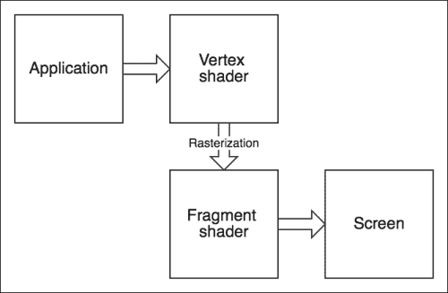
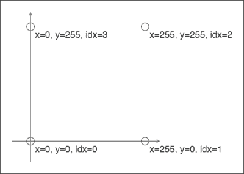
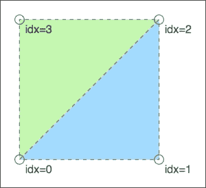
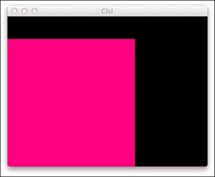
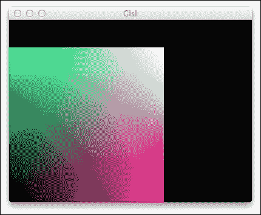
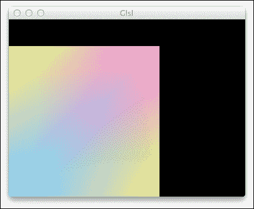
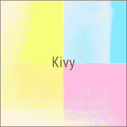
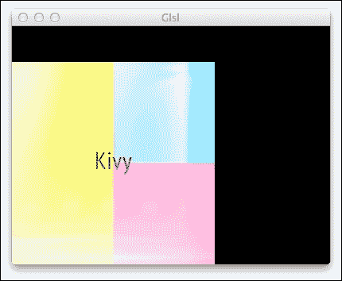
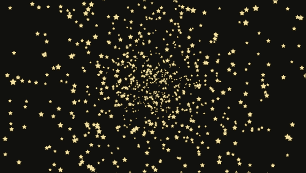

# 第八章. 引入着色器

恭喜您已经走得很远了！最后两章将与本书的其他部分有所不同，因为我们将对 Kivy 采取完全不同的视角，深入探讨 OpenGL 渲染器的底层细节，例如**OpenGL 着色语言**（**GLSL**）。这将使我们能够以极小的开销编写高性能代码。

从对 OpenGL 的非科学介绍开始，我们将继续编写一个用于星系演示（基本上是一个屏幕保护程序）的快速精灵引擎，最后是一个射击游戏（通常简称为*shmup*）。本章的代码将作为下一章的基础，而本书中的其他项目大多是自包含的。我们将在本章打下基础，然后在下一章在此基础上构建，将技术演示转变为可玩的游戏。

本章试图以足够的详细程度涵盖许多复杂主题，但它实在过于简短，无法作为全面参考指南。此外，作为一项标准，OpenGL 的发展非常迅速，不断引入新特性并淘汰过时的内容。因此，如果您在章节中提供的材料与客观现实之间存在差异，请查阅相关资料——很可能您正处于计算技术的光明未来，那里的事物已经发生了显著变化。

需要提前说明的是，这里讨论的高性能渲染方法，尽管与常规的 Kivy 代码截然不同，但大部分仍然与之兼容，可以与普通小部件并行使用。因此，仅将应用程序中资源消耗大的部分用 GLSL 实现——否则这些部分将成为性能瓶颈——是完全可行的。

# 对 OpenGL 的非科学介绍

本节将快速介绍 OpenGL 的基本知识。在这里，几乎不可能有意义地总结标准的所有细节；因此，它被称为“非科学的”、“表面的”。

OpenGL 是一个流行的底层图形 API。它是标准化的，几乎无处不在。桌面和移动操作系统通常都附带 OpenGL 的实现（在移动设备上，是 OpenGL ES，这是标准的一个功能受限子集；在这里，**ES**代表**嵌入式系统**）。现代网络浏览器也实现了 OpenGL ES 的一个变体，称为 WebGL。

广泛的分布和明确的兼容性使 OpenGL 成为跨平台应用程序的良好目标，尤其是视频游戏和图形工具包。Kivy 也依赖于 OpenGL 在所有支持的平台上进行渲染。

## 概念和并行性

OpenGL 在基本原语上操作，例如屏幕上的单个顶点和像素。例如，我们可以向其提供三个顶点并渲染一个三角形，从而为每个受影响的像素计算颜色（取决于下一张图中描述的管道）。你可能已经猜到，在这个抽象级别上工作非常繁琐。这基本上概括了高级图形框架（包括 Kivy）的存在理由：它们的存在是为了在更舒适的抽象（例如使用小部件和布局）背后隐藏渲染管道的细节。

低级渲染管道的工作方式如下：



OpenGL 管道（简化版）

上述图示的完整解释如下：

+   应用程序为 OpenGL 提供一个顶点数组（点）、允许我们重用这些点的**索引**，以及其他任意值（称为**统一变量**）。

+   对于每个顶点，都会调用**顶点着色器**，如果需要则对其进行变换，并可选择执行其他计算。然后，它的输出传递给相应的片段着色器。

+   对于每个受影响的像素，都会调用**片段着色器**（有时称为**像素着色器**），计算该像素的颜色。通常，它会考虑顶点着色器的输出，但也可能返回，例如，一个常量颜色。

+   像素在屏幕上渲染，并执行其他簿记任务；这些任务对我们来说目前没有兴趣。

### 注意

一起用作批次的顶点集合通常称为**模型**或**网格**。它不一定是连续的，也可能由散布的多个多边形组成；这种模型的理由将在稍后提及。

OpenGL 背后高速运行的“秘密配方”是其固有的巨大并行性。前面提到的函数（即顶点和像素着色器）本身可能并不疯狂快速，但它们在 GPU 上同时调用时，着色器引入的延迟通常不会随着着色器复杂性的增加而呈指数增长；在良好的硬件上，这种增长可以接近线性。

为了量化这一点，考虑到今天个人计算机（在撰写本书时），我们谈论的是具有 2 到 16 个 CPU 核心的通用硬件的多任务处理和并行编程。另一方面，中档显卡实际上拥有数千个 GPU 核心；这使得它们能够并行运行更多的计算。

然而，每个任务都是独立运行的。与通用编程中的线程不同，着色器不能在没有显著降低性能的情况下等待其他着色器的输出，除非管道架构暗示了这一点（如前所述，顶点着色器将值传递给片段着色器）。当你开始编写 GLSL 时，这种限制可能会让你感到有些难以理解。

这也是为什么一些算法可以在 GPU 上高效运行，而其他算法则不能。有趣的是，现代加密函数如**bcrypt**是专门设计来降低高度并行化实现的性能——这使得此类函数在本质上更加安全，因为它限制了暴力攻击的有效性。

## 性能提升，或缺乏提升

重要的是要理解，始终使用原始 OpenGL 调用并不会带来即时性能提升；在许多情况下，像 Kivy 这样的高级框架会做得很好。例如，当在屏幕上的某个位置渲染多边形时，大致会发生以下操作序列：

1.  多边形的几何形状和位置在 Python 中定义。

1.  顶点、索引和相关资产（如纹理）被上传到图形驱动器。

1.  调用顶点着色器。它应用必要的变换，包括定位、旋转、缩放等。

1.  最后，调用相应的片段着色器；这会产生可能显示在屏幕上的光栅图像。

无论您是使用 Kivy 小部件来完成这项任务还是坚持编写原始 OpenGL 命令和 GLSL 着色器——性能和结果可能相同，最多只有微小的差异。这是因为 Kivy 在幕后运行非常相似的 OpenGL 代码。

换句话说，这个例子几乎没有低级优化的潜力，这正是像*Kivy Bird*这样的游戏应该以最高级别的抽象实现的原因。基本上，我们可以在 Kivy Bird 中优化掉创建一个或两个小部件，但这几乎无法衡量。

### 提高性能

那么，我们实际上如何提高性能呢？答案是，通过减少 Python 端的工作量并将相似对象批量一起渲染。

让我们考虑这样一个场景，我们需要渲染超过 9,000 个类似的多边形（例如，一个粒子系统，地面上散落的秋叶或在太空中的星团）。

如果我们为单个多边形使用 Kivy 小部件，我们正在创建大量仅用于将自身序列化为 OpenGL 指令的 Python 对象。此外，每个小部件都有自己的顶点集，它将其提供给图形驱动器，从而发出过多的 API 调用并创建大量独特（但非常相似）的网格。

手动操作，我们至少可以做以下事情：

+   避免实例化许多 Python 类，只需将所有坐标保存在一个数组中。如果我们以适合直接 OpenGL 消费的格式存储它们，则无需进行序列化步骤。

+   将所有几何形状组合成一个单一模型，从而大大减少 API 调用。批处理始终是一种很好的优化，因为它允许 OpenGL 更好地并行执行任务。

我们将在本章结束时实现所描述的方法。

## 仔细看看 GLSL

作为一种语言，GLSL 与 C 语言密切相关；特别是在语法上，它们非常相似。GLSL 是强静态类型（比 C 语言更强）。

如果您不熟悉 C 语法，这里有一个非常快速的基础。首先，与 Python 不同，在类似 C 的语言中，缩进是不重要的，并且必须以分号结束语句。逻辑块被大括号包围。

GLSL 支持 C 和 C++风格的注释：

```py
/* ANSI C-style comment */
// C++ one-line comment
```

变量声明格式为`[type] [name] [= optional value];`：

```py
float a; // this has no direct Python equivalent
int b = 1;
```

函数使用`[type] [name] ([arguments]) { [body of function] }`语法定义：

```py
float pow2(float x)
{
    return x * x;
}
```

控制结构是这样写的：

```py
if (x < 9.0)
{
    x = 9.0;
}
```

大部分就是这样；无论您是否有 C 编程背景，您现在都应该能够阅读 GLSL 代码。

着色器的入口点由`main()`函数指定。在以下代码中，我们将将顶点着色器和片段着色器合并到一个文件中；因此，每个文件将有两个`main()`函数。这些函数看起来是这样的：

```py
void main(void)
{
    // code
}
```

特殊的`void`类型表示没有值，并且与 Python 的`NoneType`不同，您不能声明`void`类型的变量。在先前的`main()`函数中，返回值和参数都被省略了；因此，函数的声明读作`void main(void)`。着色器不是从函数返回计算结果，而是将其写入特殊内置变量，如`gl_Position`、`gl_FragColor`等，具体取决于着色器类型和所需效果。这也适用于输入参数。

GLSL 的类型系统紧密地反映了其使用域。与 C 语言不同，它具有高度专业化的向量矩阵类型；这些类型支持对它们的数学操作（因此，您只需使用`mat1 * mat2`语法即可乘以矩阵；这有多酷！）。在计算机图形学中，矩阵通常用于处理坐标系，您很快就会看到这一点。

在下一节中，我们将编写几个简单的 GLSL 着色器来演示之前讨论的一些概念。

# 在 Kivy 中使用自定义着色器

除了 GLSL 之外，我们还需要有初始化窗口、加载着色器等常规 Python 代码。以下程序将作为一个良好的起点：

```py
from kivy.app import App
from kivy.base import EventLoop
from kivy.graphics import Mesh
from kivy.graphics.instructions import RenderContext
from kivy.uix.widget import Widget

class GlslDemo(Widget):
    def __init__(self, **kwargs):
        Widget.__init__(self, **kwargs)
        self.canvas = RenderContext(use_parent_projection=True)
        self.canvas.shader.source = 'basic.glsl'
        # Set up geometry here.

class GlslApp(App):
    def build(self):
        EventLoop.ensure_window()
        return GlslDemo()

if __name__ == '__main__':
    GlslApp().run()
```

在这个例子中，我们只创建了一个名为`GlslDemo`的小部件；它将托管所有渲染。`RenderContext`是一个可定制的`Canvas`子类，允许我们轻松替换着色器，如列表所示。`basic.glsl`文件包含顶点着色器和片段着色器；我们将在下一分钟了解它。

注意，这次我们根本不使用 Kivy 语言，因为没有计划布局层次结构，所以没有相应的`glsl.kv`文件。相反，我们将通过从`GlslApp.build()`方法返回它来手动指定根小部件。

需要调用`EventLoop.ensure_window()`，因为我们希望在运行`GlslDemo.__init__()`时能够访问 OpenGL 功能，例如 GLSL 编译器。如果在那个时间点还没有应用程序窗口（更重要的是，没有相应的 OpenGL 上下文），程序将会崩溃。

## 构建几何形状

在我们开始编写着色器之前，我们需要一些可以渲染的内容——一系列顶点，即模型。我们将坚持使用一个简单的矩形，它由两个具有共同斜边的直角三角形组成（细分是因为基线多边形本质上都是三角形的）。

### 注意

Kivy 虽然大部分是二维的，但它在任何方面都没有强加这种限制。另一方面，OpenGL 本质上是三维的，因此你可以无缝地使用真实模型来创建现代外观的游戏，甚至可以将它们与常规 Kivy 小部件混合用于 UI（游戏菜单等）。这本书中没有进一步详细说明这种可能性，但背后的机制与这里描述的完全相同。

这是`GlslDemo`小部件更新的`__init__()`方法，下面是它的说明：

```py
def __init__(self, **kwargs):
    Widget.__init__(self, **kwargs)
    self.canvas = RenderContext(use_parent_projection=True)
    self.canvas.shader.source = 'basic.glsl'

    fmt = ( # Step 1
        (b'vPosition', 2, 'float'),
    )

    vertices = ( # Step 2
        0,   0,
        255, 0,
        255, 255,
        0,   255,
    )

    indices = (0, 1, 2, 2, 3, 0)  # Step 3

    with self.canvas:
        Mesh(fmt=fmt, mode='triangles',  # Step 4
             indices=indices, vertices=vertices)
```

让我们逐步分析这个函数，因为它在继续处理更复杂的事情之前是至关重要的：

+   当编写利用 OpenGL 的代码时，你首先会注意到没有内置的标准顶点格式供我们遵守；相反，我们需要自己定义这样的格式。在最简单的情况下，我们只需要每个顶点的位置；这被称为`vPosition`。我们的矩形是二维的，所以我们将传递两个坐标，默认情况下是浮点数。因此，我们得到的结果行是`(b'vPosition', 2, 'float')`。

+   现在我们已经决定了顶点的格式，是时候将这些顶点放入一个数组中，这个数组很快就会被交给渲染器。这正是`vertices = (...)`这一行所做的。重要的是这个元组是扁平且无结构的。我们将单独定义记录格式，然后紧密地打包所有值，没有字段分隔符等——所有这些都是在效率的名义下进行的。这也是 C 结构通常的工作方式。

+   需要索引来复制（重用）顶点。通常情况下，一个顶点会被多个三角形使用。我们不会在顶点数组中直接重复它，而是通过在索引数组中重复它的索引来实现——这通常更小，因此整个结构最终占用的内存更少，与单个顶点的尺寸成比例。下一节将更详细地解释索引。

+   在所有必需的数据结构就绪后，我们最终可以使用同名的 Kivy 画布指令`Mesh`组装网格。现在，它将在正常小部件渲染过程中渲染，这有一个很好的副作用，即与其他 Kivy 小部件的可组合性。我们的 GLSL 代码可以毫不费力地与所有先前的发展一起使用。这当然是一件好事。

### 备注

在本章中，我们一直在 C 语言的意义上使用“数组”这个词——一个包含同质数据的连续内存区域。这与具有相同名称的 Python 数据结构只有试探性的关系；实际上，在 Python 方面，我们主要使用元组或列表作为替代。

### 展示索引

为了更好地解释 OpenGL 索引，让我们可视化我们的示例。这些是从前面的示例代码中获取的顶点，格式为(*x*, *y*)：

```py
vertices = (
    0,   0,
    255, 0,
    255, 255,
    0,   255,
)
```

索引只是这样——`vertices`列表中顶点的序列号，它是基于 0 的。以下图展示了在这个设置中对顶点分配索引的情况：



平面上的散点

目前，顶点没有连接，所以它们最多形成点云，而不是有结构的多边形形状。为了解决这个问题，我们需要指定`indices`列表——它将现有的顶点分组成三角形。其定义，再次从示例代码中获取，如下所示：

```py
indices = (
    0, 1, 2, # Three vertices make a triangle.
    2, 3, 0, # And another one.
)
```

我们在这里构建了两个三角形：第一个由顶点 0 到 2 组成，第二个由顶点 2、3 和 0 组成。注意 0^(th)和 2^(nd)顶点的重复使用。

这在下图中得到了说明。颜色不必在意；它们完全是解释性的，还不是“真实”的颜色。我们很快就会在屏幕上给事物上色。



由顶点构建三角形

这基本上总结了在 OpenGL 相关代码中使用索引的用途和用法。

### 备注

在 OpenGL 中优化数据结构内存大小的趋势与节省 RAM 本身关系不大——在大多数情况下，显卡接口吞吐量是一个更严重的瓶颈，因此我们旨在每帧传递更多内容，而不仅仅是压缩数据以节省经济成本。这种区别虽然非常重要，但在一开始并没有什么不同。

## 编写 GLSL

这将是事情变得更有趣的地方。一会儿，我们将编写在 GPU 上执行的 GLSL 代码。正如我们已经提到的，它类似于 C 语言，并且非常快。

让我们从基础知识开始。Kivy 期望顶点着色器和片段着色器都位于同一个文件中，使用特殊语法分隔，即`'---vertex'`和`'---fragment'`（在下一个代码片段中显示）。重要的是要强调，这两个分隔符和`$HEADER$`语法都是 Kivy 特有的；它们不是任何标准的一部分，你不会在其他地方看到它们。

这就是典型 Kivy 着色器文件的样板代码：

```py
---vertex
$HEADER$

void main(void)
{
    // vertex shader
    gl_Position = ...
}

---fragment
$HEADER$

void main(void)
{
    // fragment shader
    gl_FragColor = ...
}
```

从此以后，我们将省略大部分样板代码以缩短列表——但请记住，它始终被假定存在；否则，事情可能不会按预期工作，或者根本不会工作。

`$HEADER$`宏是上下文相关的，根据着色器的类型意味着不同的事情。

在顶点着色器内部，`$HEADER$`是一个大致相当于以下代码的快捷方式：

```py
varying vec4 frag_color;
varying vec2 tex_coord0;

attribute vec2 vPosition;
attribute vec2 vTexCoords0;

uniform mat4  modelview_mat;
uniform mat4  projection_mat;
uniform vec4  color;
uniform float opacity;
```

在片段着色器中，`$HEADER$`扩展为以下代码：

```py
varying vec4 frag_color;
varying vec2 tex_coord0;

uniform sampler2D texture0;
```

（为了清晰起见，一些不太重要的部分已被删除。）

显然，这些可能在 Kivy 的未来版本中发生变化。

### 存储类和类型

在之前的代码中，变量不仅被注释为类型，还被注释为存储限定符。以下是两者的简要概述：

| 存储类 |
| --- |
| `attribute` | 这表示由顶点格式指定的顶点属性。属性由应用程序传递。 |
| `uniform` | 在 GLSL 级别，统一变量是全局变量。它们也由应用程序传递，但与属性不同，这些变量不会随着每个顶点而变化。 |
| `varying` | 这些是从顶点着色器传递到片段着色器的变量。 |
| **常用数据类型** |
| `float` | 这是一个标量浮点变量类型，类似于其他语言。 |
| `vec2`, `vec3`, `vec4` | 这是一个长度为 2、3 和 4 的元组；它包含浮点数。它可以表示点、颜色等等。 |
| `mat2`, `mat3`, `mat4` | 这些分别指的是 2 × 2、3 × 3、4 × 4 大小的矩阵。 |
| `sampler2D` | 这表示一个允许查找（从指定坐标获取颜色）的纹理。 |

### 基本着色器

现在，不再有更多的预备知识，让我们编写我们的第一个也是最简单的着色器，它没有任何特殊的功能。

默认的顶点着色器读取：

```py
void main(void)
{
    vec4 pos = vec4(vPosition.xy, 0.0, 1.0);
    gl_Position = projection_mat * modelview_mat * pos;
}
```

这将每个顶点的位置转换为 Kivy 首选的坐标系，原点位于左下角。

### 注意

我们不会尝试描述坐标变换的细微差别，因为这个主题对于一个入门级教程来说太复杂了。此外，甚至不需要完全理解这段代码，或者读完这本书。

如果你对这个主题有更全面的描述感兴趣，可以在[`www.learnopengles.com/understanding-opengls-matrices/`](http://www.learnopengles.com/understanding-opengls-matrices/)找到关于 OpenGL 坐标空间和矩阵使用的简洁摘要。

最简单的片段着色器是一个返回常量颜色的函数：

```py
void main(void)
{
    gl_FragColor = vec4(1.0, 0.0, 0.5, 1.0);
}
```

这为每个像素输出一个等于`#FF007F`的 RGBA 颜色。

如果你现在运行程序，你会看到类似于以下截图的输出：



基本着色器在实际应用中的效果：默认变换和平滑颜色

最后，我们得到了我们努力的结果。现在它可能并不特别有趣，但总比没有好。让我们摆弄一下，看看这会带我们走向何方。

### 程序化着色

除了总是返回相同值之外，另一种计算颜色的懒惰方法是，从相应着色器中立即可用的某物中推导它，例如，片段坐标。

假设我们想要按照以下方式计算每个像素的 RGB 颜色：

+   `R` 通道将与 *x* 坐标成比例

+   `G` 通道将与 *y* 坐标成比例

+   `B` 将是 `R` 和 `G` 的平均值。

这个简单的算法可以很容易地在一个片段着色器中实现，如下所示：

```py
void main(void)
{
    float r = gl_FragCoord.x / 255.0;
    float g = gl_FragCoord.y / 255.0;
    float b = 0.5 * (r + g);
    gl_FragColor = vec4(r, g, b, 1.0);
}
```

内置变量 `gl_FragCoord` 包含相对于应用程序窗口的片段坐标（不一定代表整个物理像素）。为了将颜色分量放入 [0...1] 范围内，需要进行 `255.0` 的除法——网格的大小，为了简单起见，内联显示。

这将替换之前看到的纯色，以以下渐变的形式：



基于片段坐标计算颜色

### 彩色顶点

通过给顶点赋予它们自己的颜色，可以以数据驱动的方式产生类似的效果。为此，我们需要扩展顶点格式以包含另一个每顶点属性，`vColor`。在 Python 代码中，这相当于以下定义：

```py
fmt = (
    (b'vPosition', 2, 'float'),
    (b'vColor', 3, 'float'),
)

vertices = (
    0,   0,   0.462, 0.839, 1,
    255, 0,   0.831, 0.984, 0.474,
    255, 255, 1,     0.541, 0.847,
    0,   255, 1,     0.988, 0.474,
)

indices = (0, 1, 2, 2, 3, 0)
```

使用更新的格式，顶点现在由五个浮点数组成，比之前多了两个。保持 `vertices` 列表与格式同步至关重要；否则，会发生奇怪的事情。

根据我们的声明，`vColor` 是一个 RGB 颜色，对于一个顶点着色器，我们最终需要 RGBA。我们不会为每个顶点传递一个常量 alpha 通道，而是在顶点着色器中填充它，类似于我们如何将 `vPosition` 从 `vec2` 扩展到 `vec4`。

这就是我们的修订版顶点着色器的外观：

```py
attribute vec3 vColor;

void main(void)
{
    frag_color = vec4(vColor.rgb, 1.0);
    vec4 pos = vec4(vPosition.xy, 0.0, 1.0);
    gl_Position = projection_mat * modelview_mat * pos;
}
```

### 注

GLSL 语法如 `vColor.rgb` 和 `vPosition.xy` 被称为 *swizzling*。它们可以用来高效地操作向量的部分，类似于 Python 切片的概念。

单独来说，`vColor.rgb` 只是意味着“取前三个向量分量”；在 Python 代码中，我们会写成 `vColor[:3]`。例如，也可以轻松地使用 `vColor.bgr` 反转颜色通道的顺序，或者只取一个通道使用 `vColor.ggg`（这将使生成的图片变为灰度图）。

可以以这种方式处理多达四个向量分量，使用 `.xyzw`、`.rgba` 或更神秘的 `.stpq` 语法；它们都做完全相同的事情。

完成这些后，片段着色器变得非常简单：

```py
void main(void)
{
    gl_FragColor = frag_color;
}
```

有趣的是，我们得到了顶点之间的颜色插值，这产生了平滑的渐变；这就是 OpenGL 的工作方式。下一张截图显示了程序的输出：



将颜色作为顶点属性传递

### 纹理映射

为了总结这一系列简单的演示，让我们将纹理应用到我们的矩形上。再一次，我们需要扩展顶点格式的定义，这次是为每个顶点分配纹理坐标：

```py
fmt = (
    (b'vPosition', 2, 'float'),
    (b'vTexCoords0', 2, 'float'),
)

vertices = (
    0,   0,   0, 1,
    255, 0,   1, 1,
    255, 255, 1, 0,
    0,   255, 0, 0,
)
```

纹理坐标通常在[0...1]范围内，原点在左上角——请注意，这与 Kivy 的默认坐标系不同。如果在某个时候，你看到纹理无缘无故地翻转过来，首先检查纹理坐标——它们很可能是罪魁祸首。

在 Python 方面，我们还需要注意的一件事是加载纹理并将其传递给渲染器。这是如何操作的：

```py
from kivy.core.image import Image

with self.canvas:
    Mesh(fmt=fmt, mode='triangles',
         indices=indices, vertices=vertices,
         texture=Image('kivy.png').texture)
```

这将从当前目录加载一个名为`kivy.png`的文件，并将其转换为可用的纹理。为了演示，我们将使用以下图像：



用于演示的纹理

至于着色器，它们与之前的版本没有太大区别。顶点着色器只是简单地传递未受影响的纹理坐标：

```py
void main(void)
{
    tex_coord0 = vTexCoords0;
    vec4 pos = vec4(vPosition.xy, 0.0, 1.0);
    gl_Position = projection_mat * modelview_mat * pos;
}
```

片段着色器使用插值的`tex_coord0`坐标在`texture0`纹理上执行查找，从而返回相应的颜色：

```py
void main(void)
{
    gl_FragColor = texture2D(texture0, tex_coord0);
}
```

当代码组合在一起时，它会产生预期的结果：



简单的 GLSL 纹理映射

总结来说，这篇关于着色器的介绍应该已经给了你足够的勇气去尝试编写自己的小型基于着色器的程序。最重要的是，如果某些事情不太理解，不要感到害怕——GLSL 是一个复杂的话题，系统地学习它不是一件小事情。

然而，这确实有助于你更好地理解底层的工作原理。即使你每天不编写底层代码，你仍然可以使用这些知识来识别和避免性能瓶颈，并通常改善你应用程序的架构。

# 制作星域应用

借助我们对 GLSL 的新认识，让我们构建一个星域屏保，即星星在屏幕中心逃离到边缘的非交互式演示，在想象中的离心力或其他因素的影响下。

### 小贴士

由于动态视觉效果难以明确描述，截图在这方面也不是很有帮助，因此运行本章附带的代码以更好地了解正在发生的事情。

从概念上讲，每颗星星都会经历相同的动作序列：

1.  它会在屏幕中心附近随机生成。

1.  星星会向屏幕中心相反的方向移动，直到它不再可见。

1.  然后，它会重新生成，回到起点。

我们还将使星星在接近屏幕边缘时加速并增大尺寸，以模拟假深度。

以下屏幕截图尝试（或者更具体地说，由于演示的高度动态性而失败）说明最终结果将看起来像什么：



屏幕截图无法传达晕动症，但它确实存在

## 应用程序结构

新的应用程序类与我们本章早期所做的工作非常相似。类似于前面讨论的例子，我们并没有使用 Kivy 语言来描述（不存在的）小部件层次结构，因此没有 `starfield.kv` 文件。

该类包含两个方法，如下所示：

```py
from kivy.base import EventLoop
from kivy.clock import Clock

class StarfieldApp(App):
    def build(self):
        EventLoop.ensure_window()
        return Starfield()

    def on_start(self):
        Clock.schedule_interval(self.root.update_glsl,
                                60 ** -1)
```

`build()` 方法创建并返回根小部件 `Starfield`；它将负责所有数学和渲染——基本上，应用程序中发生的所有事情。

`on_start()` 处理器告诉上述根小部件在应用程序启动后每秒更新 60 次通过调用其 `update_glsl()` 方法。

`Starfield` 类也被分为两部分：有常规的 `__init__()` 方法，负责创建数据结构，以及 `update_glsl()` 方法，它推进场景（计算每个恒星更新的位置）并在屏幕上渲染恒星。

## 数据结构和初始化器

现在我们来回顾一下初始化代码：

```py
from kivy.core.image import Image
from kivy.graphics.instructions import RenderContext
from kivy.uix.widget import Widget

NSTARS = 1000

class Starfield(Widget):
    def __init__(self, **kwargs):
        Widget.__init__(self, **kwargs)
        self.canvas = RenderContext(use_parent_projection=True)
        self.canvas.shader.source = 'starfield.glsl'

        self.vfmt = (
            (b'vCenter',     2, 'float'),
            (b'vScale',      1, 'float'),
            (b'vPosition',   2, 'float'),
            (b'vTexCoords0', 2, 'float'),
        )

        self.vsize = sum(attr[1] for attr in self.vfmt)

        self.indices = []
        for i in range(0, 4 * NSTARS, 4):
            self.indices.extend((
                i, i + 1, i + 2, i + 2, i + 3, i))

        self.vertices = []
        for i in range(NSTARS):
            self.vertices.extend((
                0, 0, 1, -24, -24, 0, 1,
                0, 0, 1,  24, -24, 1, 1,
                0, 0, 1,  24,  24, 1, 0,
                0, 0, 1, -24,  24, 0, 0,
            ))

        self.texture = Image('star.png').texture

        self.stars = [Star(self, i) for i in range(NSTARS)]
```

`NSTARS` 是恒星的总数；尝试增加或减少它以改变星场的密度。关于性能，即使是配备慢速集成英特尔显卡的中等机器也能轻松支持数千颗恒星。任何半数以上的专业图形硬件都能轻松处理数万同时渲染的精灵。

与前面的例子不同，这次我们不会立即用最终的有用数据填充索引和顶点；相反，我们将准备占位符数组，稍后作为 `update_glsl()` 例程的一部分进行持续更新。

`vfmt` 顶点格式包括以下属性；其中一部分在本章中已经展示过：

| 顶点属性 | 其功能 |
| --- | --- |
| `vCenter` | 这表示恒星在屏幕上的中心点坐标 |
| `vScale` | 这是恒星的大小因子，1 表示原始大小（48 × 48 像素） |
| `vPosition` | 这是每个顶点相对于恒星中心点的位置 |
| `vTexCoords0` | 这指的是纹理坐标 |

我们尚未提到的属性 `vsize` 是顶点数组中单个顶点的长度。它从顶点格式中计算出来，是其中间列的和。

`vertices` 列表包含了我们需要保留的几乎所有关于恒星的数据；然而，由于它是扁平的且没有隐式结构，操作起来非常不便。这就是辅助类 `Star` 发挥作用的地方。它封装了访问和更新顶点数组中选定条目的详细信息，这样我们就不必在代码中计算偏移量。

`Star` 类还跟踪一些不属于顶点格式的属性，即极坐标（从中心点的 `angle` 和 `distance`）以及 `size`，这些属性会随时间增加。

这是 `Star` 类的初始化：

```py
import math
from random import random

class Star:
    angle = 0
    distance = 0
    size = 0.1

    def __init__(self, sf, i):
        self.sf = sf
        self.base_idx = 4 * i * sf.vsize
        self.reset()

    def reset(self):
        self.angle = 2 * math.pi * random()
        self.distance = 90 * random() + 10
        self.size = 0.05 * random() + 0.05
```

在这里，`base_idx` 是这个星星在顶点数组中的第一个顶点的索引；我们还保留了对 `Starfield` 实例的引用，`sf`，以便以后能够访问 `vertices`。

当调用 `reset()` 函数时，星星的属性将恢复到默认（略微随机化）的值。

## 推进场景

`Starfield.update_glsl()` 方法实现了星系运动算法，并且经常在应用程序类的 `on_start()` 处理程序中由 Kivy 的时钟调用。其源代码如下：

```py
from kivy.graphics import Mesh

def update_glsl(self, nap):
    x0, y0 = self.center
    max_distance = 1.1 * max(x0, y0)

    for star in self.stars:
        star.distance *= 2 * nap + 1
        star.size += 0.25 * nap

        if (star.distance > max_distance):
            star.reset()
        else:
            star.update(x0, y0)

    self.canvas.clear()

    with self.canvas:
        Mesh(fmt=self.vfmt, mode='triangles',
             indices=self.indices, vertices=self.vertices,
             texture=self.texture)
```

首先，我们计算距离限制，`max_distance`，之后星星将在屏幕中心附近重生。然后，我们遍历星星列表，让它们运动并在途中略微放大。逃离终端距离的星星将被重置。

函数的最后部分看起来应该很熟悉。它与前面示例中看到的渲染代码相同。必须调用 `canvas.clear()`，否则每次调用都会添加一个新的网格，迅速将图形卡压到停机状态。

最后尚未公开的 Python 代码片段是 `Star.update()` 方法。它刷新属于一颗星星的四个顶点，将新的坐标写入 `vertices` 数组中的适当位置：

```py
def iterate(self):
    return range(self.j,
                 self.j + 4 * self.sf.vsize,
                 self.sf.vsize)

def update(self, x0, y0):
    x = x0 + self.distance * math.cos(self.angle)
    y = y0 + self.distance * math.sin(self.angle)

    for i in self.iterate():
        self.sf.vertices[i:i + 3] = (x, y, self.size)
```

`iterate()` 辅助函数仅用于方便，本可以内联，但没有任何多余的可读性，所以让我们保持这种方式。

再次强调（有意为之），整个内存映射过程旨在消除在每一帧中序列化我们众多对象的需求；这有助于性能。

## 编写相应的 GLSL

在以下程序中使用的着色器也让人联想到我们之前看到的；它们只是稍微长一点。这是顶点着色器：

```py
attribute vec2  vCenter;
attribute float vScale;

void main(void)
{
    tex_coord0 = vTexCoords0;
    mat4 move_mat = mat4
        (1.0, 0.0, 0.0, vCenter.x,
         0.0, 1.0, 0.0, vCenter.y,
         0.0, 0.0, 1.0, 0.0,
         0.0, 0.0, 0.0, 1.0);
    vec4 pos = vec4(vPosition.xy * vScale, 0.0, 1.0) * move_mat;
    gl_Position = projection_mat * modelview_mat * pos;
}
```

简而言之，我们正在将所有顶点的相对坐标乘以 `vScale` 因子，按比例调整网格大小，然后将它们平移到由 `vCenter` 属性给出的位置。`move_mat` 矩阵是平移矩阵，这是一种你可能或可能不记得的线性代数课程中的仿射变换方法。

为了补偿，片段着色器非常简单：

```py
void main(void)
{
    gl_FragColor = texture2D(texture0, tex_coord0);
}
```

其最终目的是将这美好的事物呈现在屏幕上：


星系纹理，放大查看

就这样。我们的星系现在已经完成，准备好用肉眼（或任何其他你能想到的用途）进行天文观测。

# 摘要

本章旨在（并希望成功）向您介绍一个充满顶点、索引和着色器的美丽硬件加速的低级 OpenGL 和 GLSL 开发世界。

直接编程 GPU 是一个疯狂强大的概念，而这种力量总是伴随着责任。着色器比常规 Python 代码更难以掌握；调试可能需要相当程度的猜测工作，而且没有方便的交互式环境，比如 Python 的 REPL，可以提及。尽管如此，编写原始 GLSL 是否对任何特定应用有用并没有明确的启发式方法——这应该根据具体情况来决定。

本章中的示例故意设计得简单，以便作为轻松的学习体验，而不是对认知能力的测试。这主要是因为 GLSL 编程是一个非常复杂、错综复杂的学习主题，有众多书籍和在线教程致力于掌握它，而这短短的一章绝对不是 OpenGL 所有内容的全面指南。

到目前为止，我们仅仅只是触及了可能性的表面。下一章将利用我们在这里编写的代码，做一些更有趣的事情：创建一个速度极快的射击游戏。
