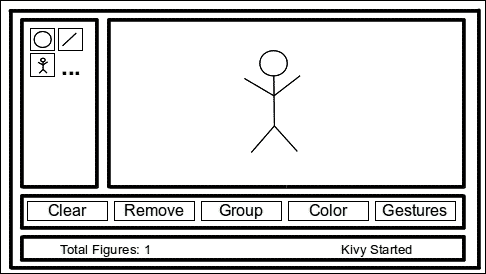

# 第一章. GUI 基础 – 构建界面

Kivy 是一个免费的开源 Python 库，它允许快速轻松地开发高度交互的多平台应用程序。Kivy 的执行速度与原生移动替代方案相当，例如 Android 的 Java 或 iOS 的 Objective C。此外，Kivy 有一个巨大的优势，即能够在多个平台上运行，就像 HTML5 一样；在这种情况下，Kivy 的性能更好，因为它不依赖于沉重的浏览器，并且许多组件都是使用 Cython 库在 C 中实现的，这样大多数图形处理都直接在 GPU 中运行。Kivy 在各种硬件和软件环境中在性能和可移植性之间取得了很好的平衡。Kivy 以一个简单但雄心勃勃的目标出现：

> *"…每个平台相同的代码，至少是我们每天使用的：Linux/Windows/Mac OS X/Android/iOS"*

Mathieu Virbel ([`txzone.net/2011/01/kivy-next-pymt-on-android-step-1-done/`](http://txzone.net/2011/01/kivy-next-pymt-on-android-step-1-done/))

这种支持已经扩展到 Raspberry Pi，这要归功于 Mathieu Virbel 发起的众筹活动，他是 Kivy 的创造者。Kivy 首次在 2011 年的 EuroPython 上推出，作为一个用于创建自然用户界面的 Python 框架。从那时起，它已经变得更大，并吸引了一个热情的社区。

本书需要一些 Python 知识，以及非常基本的终端技能，但它还要求您理解一些面向对象编程（**OOP**）的概念。特别是，假设您理解了继承的概念以及实例和类之间的区别。参考以下表格来回顾一些这些概念：

| 概念 | URL |
| --- | --- |
| 面向对象编程 | [`en.wikipedia.org/wiki/Object-oriented_programming`](http://en.wikipedia.org/wiki/Object-oriented_programming) |
| 继承 | [`en.wikipedia.org/wiki/Inheritance_(object-oriented_programming)`](http://en.wikipedia.org/wiki/Inheritance_(object-oriented_programming)) |
| 实例 | [`en.wikipedia.org/wiki/Instance_(computer_science)`](http://en.wikipedia.org/wiki/Instance_(computer_science)) |
| 类 | [`en.wikipedia.org/wiki/Class_(computer_science)`](http://en.wikipedia.org/wiki/Class_(computer_science)) |

在我们开始之前，您需要安装 Kivy。所有不同平台的安装过程都有文档记录，并且定期在 Kivy 网站上更新：[`kivy.org/docs/installation/installation.html`](http://kivy.org/docs/installation/installation.html)。

### 注意

本书中的所有代码都已使用 Kivy 1.9.0 以及 Python 2.7 和 Python 3.4（但 3.3 也应该可以正常工作）进行测试。

注意，Python 3.3+版本对移动端的支持尚未完成。目前，如果我们想为 Android 或 iOS 创建移动应用，我们应该使用 Python 2.7。如果您想了解您的 Python 版本，您可以在终端中执行`python -V`来检查已安装的 Python 版本。

在本章中，我们首先使用 Kivy 最有趣和最有力的组件之一 – Kivy 语言（`.kv`）来创建用户界面。Kivy 语言将逻辑与表示分离，以保持代码的简单直观；它还将在界面级别链接组件。在未来的章节中，您还将学习如何使用纯 Python 代码和 Kivy 作为库动态构建和修改界面。

这里是您即将学习到的所有技能列表：

+   启动 Kivy 应用程序

+   使用 Kivy 语言

+   通过基本属性和变量实例化和个性化小部件（GUI 组件）

+   区分固定、比例、绝对和相对坐标

+   通过布局创建响应式 GUI

+   在不同的文件中模块化代码

本章涵盖了在 Kivy 中构建**图形用户界面**（GUI）的所有基础知识。首先，我们将学习运行应用程序的技术以及如何使用和集成小部件。之后，我们将介绍本书的主要项目，即*漫画创作者*，并编写 GUI 的主要结构，我们将在接下来的两章中继续使用。在本章结束时，您将能够从铅笔和纸张草图开始构建 GUI，并学习一些使 GUI 能够响应窗口大小的技术。

# 基本界面 – Hello World！

让我们动手编写我们的第一个代码。

### 小贴士

**下载示例代码**

您可以从您在[`www.packtpub.com`](http://www.packtpub.com)的账户中下载您购买的所有 Packt 书籍的示例代码文件。如果您在其他地方购买了这本书，您可以访问[`www.packtpub.com/support`](http://www.packtpub.com/support)并注册，以便将文件直接通过电子邮件发送给您。

以下是一个“Hello World”程序：

```py
1\. # File name: hello.py
2\. import kivy
3\. kivy.require('1.9.0')
4\. 
5\. from kivy.app import App
6\. from kivy.uix.button import Label
7\. 
8\. class HelloApp(App):
9\.     def build(self):
10\.         return Label(text='Hello World!')
11\. 
12\. if __name__=="__main__":
13\.         HelloApp().run()
```

### 注意

这仅仅是 Python 代码。启动 Kivy 程序与启动任何其他 Python 应用程序没有区别。

为了运行代码，您需要在 Windows 或 Linux 中打开一个终端（命令行或控制台），并指定以下命令：`python hello.py --size=150x100`（`--size`是一个用于指定屏幕大小的参数）。

在 Mac 上，您必须在`/Applications`中安装`Kivy.app`后输入`kivy`而不是`python`。第 2 行和第 3 行验证我们在计算机上安装了适当的 Kivy 版本。

### 注意

如果您尝试使用比指定版本更旧的 Kivy 版本（比如 1.8.0）启动我们的应用程序，那么第 3 行将引发`Exception`错误。如果我们有一个更新的版本，则不会引发此`Exception`错误。

在本书的大多数示例中，我们省略了对`kivy.require`的调用，但您将在您在线下载的代码中找到它（[`www.packtpub.com`](https://www.packtpub.com)/），并且强烈建议在实际项目中使用它。程序使用 Kivy 库中的两个类（第 5 行和第 6 行） – `App`和`Label`。类**`App`**是任何 Kivy 应用程序的起点。将`App`视为我们将添加其他 Kivy 组件的空窗口。

我们通过**继承**使用`App`类；`App`类成为`HelloApp`子类或子类的基类（第 8 行）。在实践中，这意味着`HelloApp`类具有`App`类的所有变量和方法，以及我们在`HelloApp`类的主体（第 9 行和第 10 行）中定义的任何内容。最重要的是，`App`是任何 Kivy 应用程序的起点。我们可以看到第 13 行创建了一个`HelloApp`实例并运行了它。

现在，`HelloApp`类的主体只是覆盖了现有的`App`类的一个方法，即`build(self)`方法。这个方法必须返回窗口内容。在我们的例子中，是一个**`Label`**，它包含文本**Hello World**`!`（第 10 行）。**Label**是一个允许你在屏幕上显示一些文本的**小部件**。

### 注意

**小部件**是 Kivy GUI 组件。小部件是我们为了创建用户界面而组合的最小图形单元。

以下截图显示了执行`hello.py`代码后的结果屏幕：


那么，Kivy 仅仅是另一个 Python 库吗？嗯，是的。但作为库的一部分，Kivy 提供自己的语言，以便将逻辑与表示分离，并将界面元素链接起来。此外，请记住，这个库将允许您将应用程序移植到许多平台。

让我们开始探索 Kivy 语言。我们将把之前的 Python 代码分成两个文件，一个用于表示（界面），另一个用于逻辑。第一个文件包括以下 Python 行：

```py
14\. # File name: hello2.py
15\. from kivy.app import App
16\. from kivy.uix.button import Label
17\. 
18\. class Hello2App(App):
19\.     def build(self):
20\.         return Label()
21\. 
22\. if __name__=="__main__":
23\.     Hello2App().run()
```

`hello2.py`代码与`hello.py`非常相似。区别在于`build(self)`方法没有**Hello World!**消息。相反，消息已被移动到 Kivy 语言文件（`hello2.kv`）中的`text`属性。

### 注意

**属性**是一个可以用来改变小部件内容、外观或行为的属性。

以下是`hello2.kv`的代码（规则），它显示了如何使用`text`属性修改`Label`内容（第 27 行）：

```py
24\. # File name: hello2.kv
25\. #:kivy 1.9.0
26\. <Label>:
27\.     text: 'Hello World!'
```

你可能会想知道 Python 或 Kivy 如何知道这两个文件（`hello2.py`和`hello2.kv`）是相关的。这通常在开始时令人困惑。关键是`App`子类的名称，在这个例子中是`HelloApp`。

### 注意

`App`类子类名称的开头部分必须与 Kivy 文件名相匹配。例如，如果类的定义是`class FooApp(App)`，那么文件名必须是`foo.kv`，并且位于主文件（执行`App`的`run()`方法的文件）所在的同一目录中。

一旦包含了这个考虑，这个例子就可以像我们运行上一个例子那样运行。我们只需确保我们调用的是主文件 - `python hello2.py --size=150x100`。

这是我们第一次接触 Kivy 语言，因此我们应该深入了解一下。第 25 行（`hello2.kv`）告诉 Python 应该使用 Kivy 的最小版本。它与`hello.py`中前两行所做的相同。在 Kivy 语言头部以`#:`开头的指令被称为**指令**。我们将在本书的其余部分省略版本指令，但请记住在你的项目中包含它。

`<Label>:`规则（第 26 行）表示我们将要修改`Label`类。

### 注意

Kivy 语言以一系列规则的形式表达。**规则**是一段代码，它定义了 Kivy 小部件类的内 容、行为和外观。一个规则总是以尖括号内的一个小部件类名开头，后面跟着一个冒号，例如这样，`<Widget Class>:`

在规则内部，我们使用`'Hello World!'`（第 27 行）设置了`text`属性。本节中的代码将生成与之前相同的输出屏幕。一般来说，Kivy 中的所有事情都可以使用纯 Python 和从 Kivy 库中导入必要的类来完成，就像我们在第一个例子（`hello.py`）中所做的那样。然而，使用 Kivy 语言有许多优点，因此本书解释了所有 Kivy 语言中的展示编程，除非我们需要添加动态组件，在这种情况下，使用 Kivy 作为传统的 Python 库更为合适。

如果你是一位经验丰富的程序员，你可能担心修改`Label`类会影响我们从`Label`创建的所有潜在实例，因此它们都将包含相同的`Hello World`文本。这是真的，我们将在下一节研究一个更好的方法来做这件事。

# 基本小部件 - 标签和按钮

在最后一节中，我们使用了`Label`类，这是 Kivy 提供的多个小部件之一。你可以把小部件想象成我们用来设置 GUI 的界面块。Kivy 有一套完整的小部件 - 按钮、标签、复选框、下拉菜单等等。你可以在 Kivy 的 API 中找到它们，位于`kivy.uix`包下（[`kivy.org/docs/api-kivy.html`](http://kivy.org/docs/api-kivy.html)）。

我们将学习如何创建我们自己的个性化小部件的基本知识，而不会影响 Kivy 小部件的默认配置。为了做到这一点，我们将在`widgets.py`文件中使用继承来创建`MyWidget`类：

```py
28.# File name: widgets.py
29\. from kivy.app import App
30\. from kivy.uix.widget import Widget
31\. 
32\. class MyWidget(Widget):
33\.     pass
34\. 
35\. class WidgetsApp(App):
36\.     def build(self):
37\.         return MyWidget()
38\. 
39\. if __name__=="__main__":
40\.     WidgetsApp().run()
```

在第 32 行，我们继承自基类**`Widget`**并创建了子类`MyWidget`。创建自己的`Widget`而不是直接使用 Kivy 类是通用的做法，因为我们希望避免将我们的更改应用到所有未来实例的 Kivy `Widget`类。在我们的前一个例子（`hello2.kv`）中，修改`Label`类（第 26 行）将影响其所有未来的实例。在第 37 行，我们直接实例化了`MyWidget`而不是`Label`（就像我们在`hello2.py`中做的那样），因此我们现在可以区分我们的小部件（`MyWidget`）和 Kivy 小部件（`Widget`）。其余的代码与之前我们覆盖的内容类似。

以下是对应的 Kivy 语言代码（`widgets.kv`）：

```py
41\. # File name: widgets.kv
42\. <MyWidget>:
43\.     Button:
44\.         text: 'Hello'
45\.         font_size: 32
46\.         color: .8,.9,0,1
47\.         pos: 0, 100
48\.         size: 100, 50
49\.     Button:
50\.         text: 'World!'
51\.         font_size: 32
52\.         color: .8,.9,0,1
53\.         pos: 100,0
54\.         size: 100, 50
```

注意，现在我们使用的是**按钮**而不是标签。Kivy 中的大多数基本小部件以类似的方式工作。实际上，**`Button`**只是`Label`的子类，它包含更多的属性，如背景颜色。

将`hello2.kv`中第 26 行的注释（`<Label>:`）与前面代码（`widgets.kv`）中的第 43 行（`Button:`）进行比较。我们为`Label`（和`MyWidget`）类使用了规则类注释（`<Class>:`），但对于`Button`使用了不同的注释（`Instance:`）。这样，我们定义了`MyWidget`有两个`Button`实例（第 43 行和第 49 行）。

最后，我们设置了`Button`实例的属性。**`font_size`**属性设置文本的大小。**`color`**属性设置文本颜色，并指定为 RGBA 格式（红色、绿色、蓝色和 alpha/透明度）。**`size`**和**`pos`**属性设置小部件的大小和位置，由一对**固定坐标**（x 为水平，y 为垂直）组成，即窗口上的确切像素。

### 小贴士

注意，坐标（0，0）位于左下角，即笛卡尔原点。许多其他语言（包括 CSS）使用左上角作为（0，0）坐标，所以请注意！

以下截图显示了`widgets.py`和`widgets.kv`的输出，并带有一些有用的注释：


在之前的代码（`widgets.kv`）中，有一些可以改进的地方。首先，按钮有一些重复的属性：`pos`、`color`和`font_size`。相反，让我们像创建`MyWidget`一样创建自己的`Button`，这样就可以轻松保持按钮设计的统一。其次，固定位置相当烦人，因为当屏幕大小调整时，小部件不会调整。让我们在`widgets2.kv`文件中使其对屏幕大小做出响应：

```py
55\. # File name: widgets2.kv
56\. <MyButton@Button>:
57\.     color: .8,.9,0,1
58\.     font_size: 32
59\.     size: 100, 50
60\. 
61\. <MyWidget>:
62\.     MyButton:
63\.         text: 'Hello'
64\.         pos: root.x, root.top - self.height
65\.     MyButton:
66\.         text: 'World!'
67\.         pos: root.right - self.width, root.y
```

在此代码（`widgets2.kv`）中，我们创建并自定义了`MyButton`类（第 56 至第 59 行）和实例（第 62 至第 67 行）。注意我们定义`MyWidget`和`MyButton`的方式之间的差异。

### 注意

由于我们没有在`widgets.py`中将`MyButton`基类定义为`MyWidget`（`widgets.py`的第 32 行），我们必须在 Kivy 语言规则（第 56 行）中指定`@Class`。在`MyWidget`类的情况下，我们也需要从 Python 端定义它的类，因为我们直接实例化了它（`widgets.py`的第 37 行）。

在这个例子中，每个`Button`类的位置都是响应式的，这意味着它们始终位于屏幕的角落，无论窗口大小如何。为了实现这一点，我们需要使用两个内部变量——**`self`**和**`root`**。你可能对变量**`self`**很熟悉。正如你可能猜到的，它只是对`Widget`本身的引用。例如，`self.height`（第 64 行）的值为`50`，因为那是特定`MyButton`类的高度。变量**`root`**是对层次结构顶部的`Widget`类的引用。例如，`root.x`（第 64 行）的值为`0`，因为那是`MyWidget`实例在`widgets.py`的第 37 行创建时的 X 轴位置。

`MyWidget`默认使用整个窗口空间；因此，原点是（0，0）。`x`、`y`、`width`和`height`也是小部件属性，我们可以使用它们分别断开`pos`和`size`。

固定坐标仍然是组织窗口中的小部件和元素的一种费力的方式。让我们转向更智能的方法——布局。

# 布局

毫无疑问，固定坐标是组织多维空间中元素的最灵活方式；然而，它非常耗时。相反，Kivy 提供了一套布局，将简化组织小部件的工作。**`Layout`**是一个实现不同策略来组织嵌入小部件的`Widget`子类。例如，一种策略可以是按网格（`GridLayout`）组织小部件。

让我们从简单的**`FloatLayout`**例子开始。它的工作方式与我们直接在另一个`Widget`子类内部组织小部件的方式非常相似，只是现在我们可以使用**比例坐标**（窗口总大小的“百分比”）而不是固定坐标（精确像素）。

这意味着我们不需要在上一节中使用`self`和`root`所做的计算。以下是一个与上一个例子相似的 Python 代码示例：

```py
68\. # File name: floatlayout.py
69\. 
70\. from kivy.app import App
71\. from kivy.uix.floatlayout import FloatLayout
72\. 
73\. class FloatLayoutApp(App):
74\.     def build(self):
75\.         return FloatLayout()
76\. 
77\. if __name__=="__main__":
78\.     FloatLayoutApp().run()
```

在前面的代码（`floatlayout.py`）中，并没有真正的新内容，除了使用了`FloatLayout`（第 75 行）。有趣的部分在于相应的 Kivy 语言（`floatlayout.kv`）中：

```py
79\. # File name: floatlayout.py
80\. <Button>:
81\.     color: .8,.9,0,1
82\.     font_size: 32
83\.     size_hint: .4, .3
84\. 
85\. <FloatLayout>:
86\.     Button:
87\.         text: 'Hello'
88\.         pos_hint: {'x': 0, 'top': 1}
89\.     Button:
90\.         text: 'World!'
91\.         pos_hint: {'right': 1, 'y': 0}
```

在`floatlayout.kv`中，我们使用了两个新属性——**`size_hint`**（第 83 行）和**`pos_hint`**（第 88 行和第 91 行）。它们与`size`和`pos`类似，但接收比例坐标，值范围从`0`到`1`；（0，0）是左下角，（1，1）是右上角。例如，第 83 行的`size_hint`属性将宽度设置为窗口宽度的 40%，将高度设置为当前窗口高度的 30%。`pos_hint`属性（第 88 行和第 91 行）也有类似的情况，但表示方式不同——一个 Python 字典，其中键（例如，`'x'`或`'top'`）表示引用小部件的哪个部分。例如，`'x'`是左边界。

注意，我们在第 88 行使用`top`键代替`y`键，在第 91 行使用`right`键代替`x`键。**`top`**和**`right`**键分别引用`Button`的顶部和右侧边缘。在这种情况下，我们也可以使用`x`和`y`来表示两个轴；例如，我们可以将第 91 行写成`pos_hint: {'x': .85, 'y': 0}`。然而，**`right`**和**`top`**键避免了我们进行一些计算，使代码更清晰。

下一个截图显示了结果，以及`pos_hint`字典中可用的键：


可用的`pos_hint`键（`x`、**`center_x`**、`right`、`y`、**`center_y`**和`top`）对于对齐边缘或居中很有用。例如，`pos_hint: {'center_x':.5, 'center_y':.5}`可以使小部件无论窗口大小如何都居中。

我们本可以使用`top`和`right`属性与`widgets2.kv`的固定定位（第 64 行和第 67 行），但请注意`pos`不接受 Python 字典（`{'x':0,'y':0}`），只接受与（`x`，`y`）相对应的值对。因此，我们不应使用`pos`属性，而应直接使用`x`、`center_x`、`right`、`y`、`center_y`和`top`属性（不是字典键）。例如，我们不应使用`pos: root.x, root.top - self.height`（第 64 行），而应使用：

```py
x: 0
top: root.height
```

### 注意

属性`x`、`center_x`、`right`、`y`、`center_y`和`top`始终指定**固定坐标**（像素），而不是比例坐标。如果我们想使用**比例坐标**，我们必须在`Layout`（或`App`）内部，并使用`pos_hint`属性。

我们也可以强制`Layout`使用固定值，但如果我们不小心处理属性，可能会出现冲突。如果我们使用任何`Layout`；`pos_hint`和`size_hint`具有优先级。如果我们想使用固定定位属性（`pos`、`x`、`center_x`、`right`、`y`、`center_y`、`top`），我们必须确保我们没有使用`pos_hint`属性。其次，如果我们想使用`size`、`height`或`width`属性，那么我们需要将`size_hint`轴的值设置为`None`，以使用绝对值。例如，`size_hint: (None, .10)`允许我们使用高度属性，但保持窗口宽度的 10%。

以下表格总结了关于定位和尺寸属性我们所看到的内容。第一列和第二列表示属性的名称及其相应的值。第三列和第四列表示它是否适用于布局和小部件。

| 属性 | 值 | 对于布局 | 对于小部件 |
| --- | --- | --- | --- |
| **`size_hint`** | 一对 `w`，`h`：`w` 和 `h` 表示比例（从 `0` 到 `1` 或 `None`）。 | 是 | 否 |
| **`size_hint_x`** **`size_hint_y`** | 从 `0` 到 `1` 或 `None` 的比例，表示宽度（`size_hint_x`）或高度（`size_hint_y`）。 | 是 | 否 |
| **`pos_hint`** | 包含一个 x 轴键（`x`，`center_x` 或 `right`）和一个 y 轴键（`y`，`center_y` 或 `top`）的字典。值是从 `0` 到 `1` 的比例。 | 是 | 否 |
| **`size`** | 一对 `w`，`h`：`w` 和 `h` 表示以像素为单位的固定宽度和高度。 | 是，但需设置 `size_hint: (None, None)` | 是 |
| **`width`** | 固定像素数。 | 是，但需设置 `size_hint_x: None` | 是 |
| **`height`** | 固定像素数。 | 是，但需设置 `size_hint_y: None` | 是 |
| **`pos`** | 一对 `x`，`y`：表示像素中的固定坐标（`x`，`y`）。 | 是，但不要使用 `pos_hint` | 是 |
| **`x, right or center_x`** | 固定像素数。 | 是，但不要在 `pos_hint` 中使用 `x, right` 或 `center_x` | 是 |
| **`y, top or center_y`** | 固定像素数。 | 是，但不要在 `pos_hint` 中使用 `y, top` 或 `center_y` | 是 |

我们必须小心，因为一些属性的行为取决于我们使用的布局。Kivy 目前有八个不同的布局，以下表格中进行了描述。左侧列显示了 Kivy 布局类的名称。右侧列简要描述了它们的工作方式。

| 布局 | 详情 |
| --- | --- |
| **`FloatLayout`** | 通过 `size_hint` 和 `pos_hint` 属性以比例坐标组织小部件。值是介于 0 和 1 之间的数字，表示相对于窗口大小的比例。 |
| **`RelativeLayout`** | 与 `FloatLayout` 以相同的方式操作，但定位属性（`pos`，`x`，`center_x`，`right`，`y`，`center_y`，`top`）相对于 `Layout` 大小而不是窗口大小。 |
| **`GridLayout`** | 以网格形式组织小部件。您必须指定两个属性中的至少一个——`cols`（用于列）或 `rows`（用于行）。 |
| **`BoxLayout`** | 根据属性 `orientation` 的值是 `horizontal` 或 `vertical`，在一行或一列中组织小部件。 |
| **`StackLayout`** | 与 `BoxLayout` 类似，但在空间不足时将移动到下一行或列。在设置 `orientation` 方面有更多的灵活性。例如，`rl-bt` 以从右到左、从下到上的顺序组织小部件。允许任何 `lr`（从左到右）、`rl`（从右到左）、`tb`（从上到下）和 `bt`（从下到上）的组合。 |
| **`ScatterLayout`** | 与 `RelativeLayout` 的工作方式类似，但允许多指触控手势进行旋转、缩放和移动。它在实现上略有不同，所以我们稍后会对其进行回顾。 |
| **`PageLayout`** | 将小部件堆叠在一起，创建一个多页效果，允许使用侧边框翻页。我们经常使用另一个布局来组织每个页面内的元素，这些页面只是小部件。 |

Kivy API ([`kivy.org/docs/api-kivy.html`](http://kivy.org/docs/api-kivy.html)) 提供了每个布局的详细解释和良好示例。属性的行性行为取决于布局，有时可能会出乎意料。以下是一些有助于我们在 GUI 构建过程中的提示：

+   `size_hint`、`size_hint_x` 和 `size_hint_y` 在所有布局上（除了 `PageLayout`）都起作用，但行为可能不同。例如，`GridLayout` 将尝试取同一行或列上的 x 提示和 y 提示的平均值。

+   你应该使用从 0 到 1 的值来设置 `size_hint`、`size_hint_x` 和 `size_hint_y`。然而，你可以使用大于 1 的值。根据布局的不同，Kivy 会使小部件比容器大，或者尝试根据同一轴上的提示总和重新计算比例。

+   `pos_hint` 只适用于 `FloatLayout`、`RelativeLayout` 和 `BoxLayout`。在 `BoxLayout` 中，只有 `axis-x` 键（`x`、`center_x`、`right`）在 `vertical` 方向上工作，反之亦然在 `horizontal` 方向上。对于固定定位属性（`pos`、`x`、`center_x`、`right`、`y`、`center_y` 和 `top`）也适用类似的规则。

+   `size_hint`、`size_hint_x` 和 `size_hint_y` 可以始终设置为 `None` 以便使用 `size`、`width` 和 `height`。

每个布局都有更多属性和特性，但有了这些，我们将能够构建几乎任何 GUI。一般来说，建议使用布局的原样，而不是用我们使用的属性强制它，更好的做法是使用更多布局并将它们组合起来以达到我们的目标。下一节将教我们如何嵌入布局，并提供更全面的示例。

# 嵌入布局

布局是小部件的子类。从开始（第 43 行）我们就已经在小部件内部嵌入小部件了，所以嵌入的小部件是否也是布局并不重要。在本节中，我们将通过一个综合示例来探索上一节讨论的位置属性的效果。这个示例在视觉上可能不太吸引人，但它将有助于说明一些概念，并提供一些你可以用来测试不同属性的代码。以下是为示例编写的 Python 代码 (`layouts.py`)：

```py
92\. # File name: layouts.py
93\. from kivy.app import App
94\. from kivy.uix.gridlayout import GridLayout
95\. 
96\. class MyGridLayout(GridLayout):
97\.     pass
98\. 
99\. class LayoutsApp(App):
100\. def build(self):
101\.      return MyGridLayout()
102\. 
103\. if __name__=="__main__":
104\.     LayoutsApp().run()
```

上一段代码中没有新内容——我们只是创建了`MyGridLayout`。最终输出在下一张截图中有展示，其中包含了一些关于不同布局的说明：


嵌入布局

在此截图中，六个不同的 Kivy 布局被嵌入到两行的**`GridLayout`**中（第 107 行），以展示不同小部件属性的行为。代码简单明了，尽管内容广泛。因此，我们将分五个片段研究相应的 Kivy 语言代码（`layouts.kv`）。以下是片段 1：

```py
105\. # File name: layouts.kv (Fragment 1)
106\. <MyGridLayout>:
107\.     rows: 2
108\.     FloatLayout:
109\.         Button:
110\.             text: 'F1'
111\.             size_hint: .3, .3
112\.             pos: 0, 0
113\.     RelativeLayout:
114\.         Button:
115\.             text: 'R1'
116\.             size_hint: .3, .3
117\.             pos: 0, 0
```

在此代码中，`MyGridLayout`通过**`rows`**属性（第 107 行）定义了行数。然后我们添加了前两个布局——每个布局都有一个`Button`的`FloatLayout`和**`RelativeLayout`**。两个按钮都定义了`pos: 0, 0`属性（第 112 行和第 117 行），但请注意，在前一个截图中的`Button` **F1**（第 109 行）位于整个窗口的左下角，而`Button` **R1**（第 114 行）位于`RelativeLayout`的左下角。原因是`FloatLayout`中的`pos`坐标不是相对于布局的位置。

### 注意

注意，无论我们使用哪种布局，`pos_hint`始终使用相对坐标。换句话说，如果使用`pos_hint`而不是`pos`，前面的例子将不会工作。

在片段 2 中，向`MyGridLayout`添加了一个**`GridLayout`**：

```py
118\. # File name: layouts.kv (Fragment 2)
119\. GridLayout:
120\.     cols: 2
121\.     spacing: 10
122\.     Button:
123\.         text: 'G1'
124\.         size_hint_x: None
125\.         width: 50
126\.     Button:
127\.         text: 'G2'
126\.     Button:
128\.         text: 'G3'
129\.         size_hint_x: None
130\.         width: 50
```

在这种情况下，我们使用**`cols`**属性定义了两列（第 120 行），并使用`spacing`属性将内部小部件彼此之间隔开 10 像素（第 121 行）。注意，在前一个截图中也注意到，第一列比第二列细。我们通过将按钮**G1**（第 122 行）和**G3**（第 128 行）的`size_hint_x`设置为`None`和`width`设置为`50`来实现这一点。

在片段 3 中，添加了一个**`AnchorLayout`**：

```py
131\. # File name: layouts.kv (Fragment 3)
132\. AnchorLayout:
133\.     anchor_x: 'right'
135\.     anchor_y: 'top'
136\.     Button:
137\.         text: 'A1'
138\.         size_hint: .5, .5
139\.     Button:
140\.         text: 'A2'
141\.         size_hint: .2, .2 
```

我们已将**`anchor_x`**属性设置为`right`，将**`anchor_y`**属性设置为`top`（第 134 行和第 135 行），以便将元素排列在窗口的右上角，如前一个截图所示，其中包含两个按钮（第 136 行和第 139 行）。这种布局非常适合在其中嵌入其他布局，例如顶部菜单栏或侧边栏。

在片段 4 中，添加了一个**`BoxLayout`**：

```py
142\. # File name: layouts.kv (Fragment 4)
143\. BoxLayout:
144\.     orientation: 'horizontal'
145\.     Button:
146\.         text: 'B1'
147\.     Button:
148\.         text: 'B2'
149\.         size_hint: 2, .3
150\.         pos_hint: {'y': .4}
151\.     Button:
152\.         text: 'B3' 
```

上述代码展示了如何使用**`orientation`**属性设置为`horizontal`的`BoxLayout`。此外，第 149 行和第 150 行显示了如何使用`size_hint`和`pos_hint`将按钮**B2**向上移动。

最后，片段 5 添加了一个**`StackLayout`**：

```py
153\. # File name: layouts.kv (Fragment 5)
154\. StackLayout:
155\.     orientation: 'rl-tb'
156\.     padding: 10
157\.     Button:
158\.         text: 'S1'
159\.         size_hint: .6, .2
160\.     Button:
161\.         text: 'S2'
162\.         size_hint: .4, .4
163\.     Button:
164\.         text: 'S3'
165\.         size_hint: .3, .2
166\.     Button:
167\.         text: 'S4'
168\.         size_hint: .4, .3 
```

在这种情况下，我们添加了四个不同大小的按钮。注意，理解嵌入布局的规则非常重要，这些规则是通过将**`orientation`**属性设置为`rl-tb`（从右到左，从上到下，第 155 行）来组织小部件的。同时注意，**`padding`**属性（第 156 行）在`StackLayout`的小部件和边框之间增加了 10 像素的空间。

# 页面布局——滑动页面

**`PageLayout`** 的工作方式与其他布局不同。它是一种动态布局，从某种意义上说，它允许通过其边框翻页。其理念是它的组件是堆叠在一起的，我们只能看到最上面的一个。

以下示例说明了其用法，利用了上一节的示例。Python 代码（`pagelayout.py`）如下所示：

```py
169\. # File name: pagelayout.py
170\. import kivy
171\. 
172\. from kivy.app import App
173\. from kivy.uix.pagelayout import PageLayout
174\. 
175\. class MyPageLayout(PageLayout):
176\.     pass
177\. 
178\. class PageLayoutApp(App):
179\.     def build(self):
180\.         return MyPageLayout()
181\. 
182\. if __name__=="__main__":
183\.     PageLayoutApp().run()
```

这段代码中除了使用 `PageLayout` 类之外没有新内容。对于 Kivy 语言代码（`pagelayout.kv`），我们将研究 `PageLayout` 的属性。我们只是简单地修改了上一节中研究的 `layouts.kv` 文件（第 105 至 107 行），现在称为 `pagelayout.kv`：

```py
184\. # File name: pagelayout.kv
185\. <Layout>:
186\.     canvas:
187\.         Color:
188\.             rgba: 1, 1, 1, 1
189\.         Rectangle:
190\.             pos: self.pos
191\.             size: self.size
192\. 
193\. <MyPageLayout>:
194\.     page: 3
195\.     border: 120 
196\.     swipe_threshold: .4
197\.     FloatLay...
```

所有布局都继承自一个名为 `Layout` 的基类。在第 185 行，我们以与之前修改 `Button` 类（第 80 行）相同的方式修改了这个基类。

### 小贴士

如果我们想对具有公共基类（如 `Layout`）的所有子小部件应用更改，我们可以在基类中引入这些更改。Kivy 将将这些更改应用到所有从它派生的类中。

默认情况下，布局没有背景颜色，这在 `PageLayout` 将它们堆叠在一起时不太方便，因为我们能看到底层布局的元素。第 186 至 191 行将绘制一个白色（第 187 和 188 行）矩形，其大小（第 190 行）和位置（第 191 行）与 `Layout` 相对应。为了做到这一点，我们需要使用 **`canvas`**，它允许我们在屏幕上直接绘制形状。这个主题将在下一章（第二章, *图形 - 画布*）中深入解释。您可以在下面的屏幕截图中看到结果：


如果你在电脑上运行代码，你会注意到它会带你到上一节示例中的 `AnchorLayout` 对应的页面。原因是我们将 **`page`** 属性设置为值 `3`（第 194 行）。从 `0` 开始计数，这个属性告诉 Kivy 首先显示哪个页面。**`border`** 属性告诉 Kivy 侧边框有多宽（用于滑动到上一个或下一个屏幕）。最后，**`swipe_threshold`** 告诉我们需要滑动屏幕的百分比，才能更改页面。下一节将使用到目前为止学到的某些布局和属性来显示一个更专业的屏幕。

# 我们的项目 – 漫画创作器

现在我们有了所有必要的概念，能够创建我们想要的任何界面。本节描述了我们将通过以下三个章节（*漫画创作器*）进行改进的项目。该项目的核心思想是一个简单的应用程序，用于绘制一个棍子人。下面的屏幕截图是我们所追求的 GUI 的草图（线框）：



我们可以在草图中区分几个区域。首先，我们需要一个*绘图空间*（右上角）来放置我们的漫画。我们需要一个*工具箱*（左上角）包含一些绘图工具来绘制我们的图形，还有一些*通用选项*（从底部向上数第二个）——清除屏幕、删除最后一个元素、组合元素、更改颜色和使用手势模式。最后，有一个*状态栏*（中心底部）向用户提供一些信息——图形数量和最后执行的操作。根据我们在本章中学到的知识，有多个解决方案来组织这个屏幕。我们将使用以下方案：

+   在左上角的*工具箱*区域使用`AnchorLayout`。在其内部将是一个两列的`GridLayout`，用于*绘图工具*。

+   在右上角的*绘图空间*使用`AnchorLayout`。在其内部将是一个`RelativeLayout`，以便在相对空间中绘制。

+   在底部的*通用选项*和*状态栏*区域使用`AnchorLayout`。在其内部将是一个垂直方向的`BoxLayout`，用于在*状态栏*上方组织*通用选项*：

    +   用于*通用选项*按钮的水平方向的`BoxLayout`。

    +   用于*状态栏*标签的水平方向的`BoxLayout`。

我们将通过为每个区域创建不同的文件来使用这个结构——`comiccreator.py`、`comiccreator.kv`、`toolbox.kv`、`generaltools.kv`、`drawingspace.kv`和`statusbar.kv`。让我们从`comiccreator.py`开始：

```py
198\. # File name: comiccreator.py
199\. from kivy.app import App
200\. from kivy.lang import Builder
201\. from kivy.uix.anchorlayout import AnchorLayout
200\. 
201\. Builder.load_file('toolbox.kv')
202\. Builder.load_file('drawingspace.kv')
203\. Builder.load_file('generaloptions.kv')
204\. Builder.load_file('statusbar.kv')
205\. 
206\. class ComicCreator(AnchorLayout):
207\.     pass
208\. 
209\. class ComicCreatorApp(App):
210\. def build(self):
211\.         return ComicCreator()
212\. 
213\. if __name__=="__main__":
214\.     ComicCreatorApp().run()
```

注意，我们明确使用`Builder.load_file`指令（第 203 行到第 206 行）加载一些文件。没有必要明确加载`comiccreator.kv`，因为 Kivy 会自动通过提取`ComicCreatorApp`名称的第一部分来加载它。对于`ComicCreator`，我们选择`AnchorLayout`。这不是唯一的选择，但它使代码更清晰，因为第二级也由`AnchorLayout`实例组成。

尽管使用一个简单的部件会更清晰，但这是不可能的，因为`Widget`类不遵守`AnchorLayout`内部所需的`size_hint`和`pos_hint`属性。

### 小贴士

记住，只有布局才遵守`size_hint`和`pos_hint`属性。

这是`comiccreator.kv`的代码：

```py
216\. # File name: comiccreator.kv
217\. <ComicCreator>:
218\.     AnchorLayout:
219\.         anchor_x: 'left'
220\.         anchor_y: 'top'
221\.         ToolBox:
222\.             id: _tool_box
223\.             size_hint: None, None
224\.             width: 100
225\.     AnchorLayout:
226\.         anchor_x: 'right'
227\.         anchor_y: 'top'
228\.         DrawingSpace:
229\.             size_hint: None, None
230\.             width: root.width - _tool_box.width
231\.             height: root.height - _general_options.height - _status_bar.height
232\.     AnchorLayout:
233\.         anchor_x: 'center'
234\.         anchor_y: 'bottom'
235\.         BoxLayout:
236\.             orientation: 'vertical'
237\.             GeneralOptions:
238\.                 id: _general_options
239\.                 size_hint: 1,None
240\.                 height: 48
241\.             StatusBar:
242\.                 id: _status_bar
243\.                 size_hint: 1,None
244\.                 height: 24
```

这段代码遵循之前展示的*漫画创作器*结构。在第一级基本上有三个`AnchorLayout`实例（第 219 行、第 226 行和第 233 行）和一个组织*通用选项*和*状态栏*的`BoxLayout`（第 236 行）。

我们将`ToolBox`的宽度设置为 100 像素，将`GeneralOptions`和`StatusBar`的高度分别设置为 48 像素和 24 像素（第 241 行和第 245 行）。这随之带来一个有趣的问题——*绘图空间*应该使用屏幕剩余的宽度和高度（无论屏幕大小如何）。为了实现这一点，我们将利用 Kivy **id**（第 223 行、第 239 行和第 243 行），它允许我们在 Kivy 语言中引用其他组件。在第 231 行和第 232 行，我们从`root.width`（第 231 行）减去`tool_box.width`，从`root.height`（第 232 行）减去`general_options.height`和`status_bar.height`。

### 注意

Kivy 的**id**允许我们在 Kivy 语言规则内创建内部变量，以便访问其他小部件的属性。

现在，让我们继续在`toolbox.kv`中探索 Kivy 语言：

```py
245\. # File name: toolbox.kv
246\. <ToolButton@ToggleButton>:
247\.     size_hint: None, None
248\.     size: 48,48
249\.     group: 'tool'
250\. 
251\. <ToolBox@GridLayout>:
252\.     cols: 2
253\.     padding: 2
254\.     ToolButton:
255\.         text: 'O'
256\.     ToolButton:
257\.         text: '/'
258\.     ToolButton:
259\.         text: '?'
```

我们创建了一个`ToolButton`类，它定义了绘图工具的大小，并引入了一个新的 Kivy 小部件——**`ToggleButton`**。与普通`Button`的区别在于它会在我们再次点击之前保持按下状态。以下是一个带有激活的`ToolButton`的*工具箱*示例：


一个`ToggleButton`实例可以与另一个`ToggleButton`实例关联，因此一次只能点击其中一个。我们可以通过将相同的**`group`**属性（第 250 行）分配给想要一起响应的`ToggleButton`实例来实现这一点。在这种情况下，我们希望属于同一组的所有`ToolButton`实例，因为我们只想一次绘制一个图形；我们将其作为类定义的一部分（第 247 行）。

在第 252 行，我们将`ToolBox`实现为一个`GridLayout`的子类，并给`ToolButton`实例添加了一些字符占位符（`'O'`、`'/'`和`'?'`），这些占位符将在后续章节中替换为更合适的内容。

以下是`generaloptions.kv`文件的代码：

```py
260\. # File name: generaloptions.kv
261\. <GeneralOptions@BoxLayout>:
262\.     orientation: 'horizontal'
263\.     padding: 2
264\.     Button:
265\.         text: 'Clear'
266\.     Button:
267\.         text: 'Remove'
268\.     ToggleButton:
269\.         text: 'Group'
268\.     Button:
270\.         text: 'Color'
271\.     ToggleButton:
272\.         text: 'Gestures'
```

下面是一个如何使用继承来帮助我们分离组件的例子。我们使用了`ToggleButton`实例（第 269 行和第 273 行），它们不受之前`ToolButton`实现的影响。此外，我们没有将它们关联到任何`group`，因此它们彼此独立，只会保持一种模式或状态。代码只定义了`GeneralOptions`类，遵循我们的初始结构。以下是将得到的截图：


`statusbar.kv`文件在用法上与`BoxLayout`非常相似：

```py
274\. # File name: statusbar.kv
275\. <StatusBar@BoxLayout>:
276\.     orientation: 'horizontal'
277\.     Label:
278\.         text: 'Total Figures: ?'
279\.     Label:
280\.         text: "Kivy started"
```

不同之处在于它组织的是标签而不是按钮。以下是将得到的截图：


最后，以下是`drawingspace.kv`文件的代码：

```py
281\. # File name: drawingspace.kv
282\. <DrawingSpace@RelativeLayout>:
283\.     Label:
284\.         markup: True
285\.         text: '[size=32px][color=#3e6643]The[/color] [sub]Comic[/sub] [i][b]Creator[/b][/i][/size]'
```

除了定义 `DrawingSpace` 是 `RelativeLayout` 的子类之外，我们还引入了 Kivy 的 **`markup`**，这是一个用于美化 `Label` 类文本的不错特性。它的工作方式与基于 XML 的语言类似。例如，在 HTML 中，`<b>I am bold</b>` 会指定加粗文本。首先，您需要激活它（第 285 行），然后只需将您想要美化的文本嵌入 `[tag]` 和 `[/tag]` 之间（第 286 行）。您可以在 Kivy API 的文档中找到完整的标签列表和描述，在 `Label` 的文档中（[`kivy.org/docs/api-kivy.uix.label.html`](http://kivy.org/docs/api-kivy.uix.label.html)）。在先前的例子中，`size` 和 `color` 是不言自明的；`sub` 指的是下标文本；`b` 表示加粗；`i` 表示斜体。

下面是显示我们项目 GUI 的截图：


在接下来的章节中，我们将为这个目前仅由占位符小部件组成的界面添加相应的功能。然而，仅仅用几行代码就能得到这样的结果，这令人兴奋。我们的 GUI 已经准备就绪，从现在起我们将专注于其逻辑开发。

# 概述

本章涵盖了所有基础知识，并介绍了一些不那么基本的概念。我们介绍了如何配置类、实例和模板。以下是本章中我们学习使用的 Kivy 元素列表：

+   基本小部件 – `Widget`、`Button`、`ToggleButton` 和 `Label`

+   布局 – `FloatLayout`、`RelativeLayout`、`BoxLayout`、`GridLayout`、`StackLayout`、`AnchorLayout` 和 `PageLayout`

+   属性 – `pos`、`x`、`y`、`center_x`、`center_y`、`top`、`right`、`size`、`height`、`width`、`pos_hint`、`size_hint`、`group`、`spacing`、`padding`、`color`、`text`、`font_size`、`cols`、`rows`、`orientation`、`anchor_x` 和 `anchor_y`

+   变量 – `self` 和 `root`

+   其他 – `id` 和标记标签 `size`、`color`、`b`、`i` 和 `sub`

我们还可以使用 Kivy 语言中的许多其他元素，但通过本章，我们已经理解了如何组织元素的一般思路。借助 Kivy API，我们应该能够显示大多数用于 GUI 设计的元素。然而，还有一个非常重要的元素需要单独研究——`canvas`，它允许我们在小部件内部绘制矢量形状，例如在 `PageLayout` 示例中作为背景绘制的白色矩形。这是 Kivy 中一个非常重要的主题，下一章将完全致力于它。
