# 第六章. Kivy 播放器 – TED 视频流器

在本章中，我们将学习如何搜索、显示和控制视频。我们将整合前几章的知识，构建一个能够适应不同屏幕并最大化空间使用的响应式应用程序。我们将制作一个带有控件和字幕支持的增强型**视频**小部件，并学习如何显示来自 TED API 服务的搜索结果查询（[developer.ted.com](http://developer.ted.com)）。以下是本章我们将涵盖的主要主题：

+   控制流媒体视频的播放进度

+   使用视频的进度在正确的时间显示字幕

+   应用策略和组件使我们的应用程序响应

+   显示和导航本地文件目录树

+   使用 Kivy 检查器调试我们的应用程序

+   向从互联网查询得到的列表结果添加滚动功能

本章总结了迄今为止获得的大量知识。我们将回顾和结合使用属性、事件、动画、触摸、行为、布局，甚至图形。同时，我们将介绍新的小部件，这些小部件将补充您的知识，并作为新编程情况的好例子。我们还将回顾 Kivy 检查器，它将帮助我们检测 GUI 错误。在本章结束时，我们将完成一个看起来专业的界面。

# 视频 – 播放、暂停和停止

在本节中，我们将从简单的代码开始，然后逐步添加功能，直到我们得到一个完整的视频播放器。在本节中，我们将讨论如何使用**`Video`**小部件从互联网上流式传输**视频**。让我们从`video.kv`文件中的代码开始：

```py
1\. # File name: video.kv
2\. #:set _default_video "http://video.ted.com/talk/stream/2004/None/DanGilbert_2004-180k.mp4"
3\. 
4\. <Video>:
5\.     allow_stretch: True
6\.     color: 0,0,0,0
7\.     source: _default_video
```

在此代码中，我们最初使用**`set`**指令创建一个常量值（第 2 行）。此指令允许我们在 Kivy 语言范围内使用全局值。例如，我们使用`_default_video`常量的值设置`Video`类的`source`属性（第 7 行）。

我们为**`Video`**类设置了三个属性。**`allow_stretch`**属性（第 5 行）允许视频根据可用的屏幕大小进行拉伸。**`color`**属性（第 6 行）将使视频变黑，当**视频**未播放时用作前景（以及**封面**图像的背景）。**`source`**属性（第 7 行）包含我们想要播放的视频的 URL（或文件名）。这三个属性实际上属于**`Image`**小部件，它是`Video`的基础类。如果我们把视频看作是一系列图像（伴随声音），这就有意义了。

### 小贴士

为了测试目的，如果您想避免不断从互联网下载视频（或者如果 URL 已经不可用），您可以将`default_video`中的 URL 替换为与代码一起提供的示例文件：`samples/BigBuckBunny.ogg`。

我们将使用 **`Factory`** 类来使用我们在 第四章 中学到的技术，*改进用户体验*。当时，我们使用 **`Factory`** 类来替换 `Line` 顶点指令，使用我们的个性化实现，一个滚动的 `Line`。

### 注意

**`Factory`** 类遵循一种面向对象的软件设计模式，称为工厂模式。工厂模式根据调用标识符（通常是方法）返回默认的新对象（实例）的子集类。在 Kivy 语言的情况下，我们只使用一个名称。([`en.wikipedia.org/wiki/Factory_%28object-oriented_programming%29`](http://en.wikipedia.org/wiki/Factory_%28object-oriented_programming%29))。

我们现在将做类似的事情，但这次我们将个性化我们的 `Video` 小部件：

```py
8\. # File name: video.py
9\. from kivy.uix.video import Video as KivyVideo
10\. 
11\. from kivy.factory import Factory
12\. from kivy.lang import Builder
13\. 
14\. Builder.load_file('video.kv')
15\. 
16\. class Video(KivyVideo): 
17\. 
18\.     def on_state(self, instance, value):
19\.         if self.state == 'stop':
20\.             self.seek(0) 
21\.         return super(self.__class__, self).on_state(instance, value)
22\. 
23\.     def on_eos(self, instance, value):
24\.         if value:
25\.             self.state = 'stop'
26\. 
27\.     def _on_load(self, *largs):
28\.         super(self.__class__, self)._on_load(largs)
29\.         self.color = (1,1,1,1)
30\. 
31\.     def on_source(self, instance, value):
32\.         self.color = (0, 0, 0, 0)
33\. 
34\. Factory.unregister('Video')
35\. Factory.register('Video', cls=Video)
```

`video.py` 文件将导入 Kivy 的 `Video` 小部件，并使用别名 `KivyVideo`（第 9 行）。现在我们将能够使用 `Video` 类名称（而不是不那么吸引人的替代名称，如 `MyVideo`）创建我们的个性化小部件（第 16 行至 32 行）。在文件末尾，我们将默认的 `Video` 小部件替换为我们的个性化 `Video` 并将其添加到 `Factory` 中（第 34 行和 35 行）。从现在起，Kivy 语言中引用的 `Video` 类将对应于我们在此文件中的实现。

我们在 `Video` 类中创建了四个方法（**`on_state`**、**`on_eos`**、**`_on_load`** 和 **`on_source`**）。所有这些都对应于事件：

+   当视频在其三种可能状态（播放 `'play'`）、暂停 (`'pause'`) 或停止 (`'stop'`) 之间改变状态时，会调用 **`on_state`** 方法（第 18 行）。我们确保当视频停止时，使用 **`seek`** 方法（第 20 行）将其重新定位到开始位置。

+   当达到 **流结束**（**EOS**）时，将调用 **`on_eos`** 方法（第 23 行）。当发生这种情况时，我们将确保将状态设置为 `stop`（第 19 行）。

+   我们还需要记住，我们使用 Kivy 语言的 `color` 属性（第 6 行）将视频染成了黑色。因此，我们需要在视频上放置亮光（`1,1,1,1`）才能看到它（第 29 行）。当视频被加载到内存中并准备好播放时，会调用 **`_on_load`** 方法（第 27 行）。我们使用此方法来设置适当的（以及原始 Kivy 默认的）`color` 属性。

    ### 注意

    记住 第二章，*图形 – 画布* 中，`Image` 小部件（`Video` 类的基类）的 `color` 属性在显示上充当着染色或光照。对于 `Video` 小部件，也会发生同样的效果。

+   最后，从 `Image` 类继承的 **`on_source`** 方法将在更改视频源时在视频上方恢复黑色染色。

让我们继续创建一个 `kivyplayer.py` 文件来执行我们的应用程序，并播放、暂停和停止我们的视频：

```py
36\. # File name: kivyplayer.py
37\. from kivy.app import App
38\. 
39\. from video import Video
40\. 
41\. class KivyPlayerApp(App):
42\. 
43\.     def build(self):
44\.         self.video = Video()
45\.         self.video.bind(on_touch_down=self.touch_down)
46\.         return self.video
47\. 
48\.     def touch_down(self, instance, touch):
49\.         if self.video.state == 'play':
50\.             self.video.state = 'pause'
51\.         else:
52\.             self.video.state = 'play'
53\.         if touch.is_double_tap:
54\.             self.video.state = 'stop'
55\. 
56\. if __name__ == "__main__":
57\.     KivyPlayerApp().run()
```

目前，我们将通过触摸来控制视频。在`build`方法（第 43 行）中，我们将视频的`on_touch_down`事件（第 45 行）绑定到`touch_down`方法（第 48 至 54 行）。一次触摸将根据视频当前的**`state`**属性（第 49 和 52 行）播放或暂停视频。状态属性控制视频是否处于三种可能状态之一。如果它在播放，则将其暂停；否则（暂停或停止），则播放它。我们将使用**`double_tap`**键来表示双击（双击或双击），以停止视频。下次我们触摸屏幕时，视频将从开头开始。现在，运行应用程序（`Python kivyplayer.py`），看看当你点击屏幕时，Kivy 是如何立即开始从 TED 流式传输 Dan Gilbert 的视频《幸福的惊人科学》的（[`www.ted.com/`](http://www.ted.com/))：

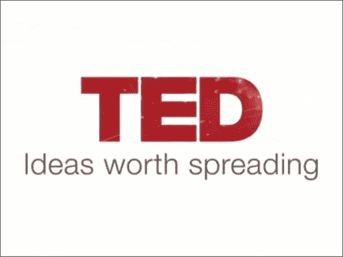

# AsyncImage – 为视频创建封面

在本节中，我们将学习如何设置一个将在视频不播放时显示的**封面**。当视频尚未开始时，此图像将作为装饰，在 TED 视频中，通常涉及演讲者的图像。让我们从在`video.kv`代码中引入一些更改开始：

```py
58\. # File name: video.kv 
59\. ...
60\. #:set _default_image "http://images.ted.com/images/ted/016a827cc0757092a0439ab2a63feca8655b6c29_1600x1200.jpg"
61\. 
62\. <Video>:
63\.     cover: _cover
64\.     image: _default_image
65\.     ...
66\.     AsyncImage:
67\.         id: _cover
68\.         source: root.image
69\.         size: root.width,root.height
```

在此代码中，我们使用**`set`**指令（第 60 行）创建了一个另一个常量（`_default_image`），并为`Video`类创建了一个相关属性（`image`），该属性引用了常量（第 64 行）。我们还创建了`cover`属性（第 63 行），以引用我们添加到`Video`类中的`AsyncImage`（第 66 行），它将作为视频的封面。

### 注意

`Image`和`AsyncImage`之间的主要区别在于，**`AsyncImage`**小部件允许我们在图片加载时继续使用程序，而不是在图片完全下载之前阻塞应用程序。

这很重要，因为我们从互联网上下载图像，它可能是一个大文件。当你运行代码时，你会注意到在图像加载时会出现一个等待的图像：

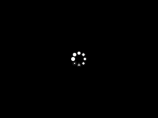

我们还设置了一些`AsyncImage`属性。我们使用新属性（`root.image`）（第 68 行）初始化了`source`属性，该属性我们在`Video`小部件中创建，以引用封面图像（第 64 行）。请记住，这将内部绑定属性，这意味着每次我们更改`image`属性时，`source`属性都将更新为相同的值。第 69 行重复了相同的思想，以保持封面的`size`属性与视频的尺寸相等。

### 小贴士

为了测试目的，您可以将`default_image`中的 URL 替换为代码中包含的以下示例文件：

`samples/BigBuckBunny.png`。

我们将对我们的`视频`小部件进行一些修改，以确保在播放视频时封面被移除（隐藏）：

```py
70\. # File name: video.py
71\.  ...
72\. from kivy.properties import ObjectProperty
73\.  ...
74\. class Video(KivyVideo): 
75\.     image = ObjectProperty(None)
76\. 
77\.     def on_state(self, instance, value):
78\.         if self.state == 'play':
79\.             self.cover.opacity = 0
80\.         elif self.state == 'stop':
81\.             self.seek(0) 
82\.             self.cover.opacity = 1
83\.         return super(self.__class__, self).on_state(instance, value)
84\. 
85\.     def on_image(self, instance, value):
86\.         self.cover.opacity = 1
87\.  ...
```

我们将 **`on_state`** 方法改为在视频播放时（第 79 行）揭示视频，并在视频停止时（第 82 行）再次使用 *不透明度* 属性覆盖它。

### 提示

避免移除在 `.kv` 文件中声明的部件。大多数情况下，这些部件与其他部件（例如，属性边界）有内部边界，并可能导致与缺失内部引用和不一致的边界属性相关的意外运行时错误。

与移除部件相比，有几种替代方案；例如，首先，使用 **`opacity`** 属性使部件不可见，其次，使用 `size` 属性将部件区域设置为零（`size = (0,0)`），最后，使用 `pos` 属性将部件放置在一个永远不会显示的位置（`pos= (99999,999999)`）。我们选择了第一种方法；在这种情况下，这是最优雅的。我们将 `AsyncImage` 的 **`opacity`** 属性设置为使其可见（`opacity = 1`）或不可见（`opacity = 0`）。

### 提示

尽管使用不透明度控制覆盖以使其不可见可能是这里最优雅的解决方案，但你必须小心，因为部件仍然存在，占据了屏幕上的空间。根据情况，你可能需要扩展策略。例如，如果部件捕获了一些触摸事件，你可以结合 **`opacity`** 和 **`disabled`** 属性来隐藏和禁用部件。

我们还创建了 `image` 属性（第 75 行），并使用其 `on_image` 关联事件（第 85 行）确保在更改图像时恢复不透明度（第 86 行）。现在，当你运行应用程序时（`python kivyplayer.py`），将出现丹·吉尔伯特的图像。

# 字幕 – 跟踪视频进度

让我们在我们的应用程序中添加字幕。我们将通过四个简单的步骤来完成这项工作：

1.  创建一个从 `Label` 类派生的 `Subtitle` 部件（`subtitle.kv`），用于显示字幕

1.  在视频部件上方放置一个 `Subtitle` 实例（`video.kv`）

1.  创建一个 `Subtitles` 类（`subtitles.py`），用于读取和解析字幕文件

1.  跟踪 `Video` 进度（`video.py`）以显示相应的字幕

*步骤 1* 包括在 `subtitle.kv` 文件中创建一个新的部件：

```py
88\. # File name: subtitle.kv
89\. <Subtitle@Label>:
90\.     halign: 'center'
91\.     font_size: '20px'
92\.     size: self.texture_size[0] + 20, self.texture_size[1] + 20
93\.     y: 50
94\.     bcolor: .1, .1, .1, 0
95\.     canvas.before:
96\.         Color:
97\.             rgba: self.bcolor
98\.         Rectangle:
99\.             pos: self.pos
100\.             size: self.size
```

这段代码中有两个有趣的元素。第一个是大小属性的定义（第 92 行）。我们将其定义为比 **`texture_size`** 宽度和高度大 20 像素。**`texture_size`** 属性表示由字体大小和文本确定的文本大小，我们使用它来调整 `Subtitles` 部件的大小以适应其内容。

### 注意

**`texture_size`** 是一个只读属性，因为它的值是根据其他参数计算的，例如字体大小和文本显示的高度。这意味着我们将从这个属性中读取，但不会在其上写入。

第二个元素是创建`bcolor`属性（第 94 行）以存储背景颜色，以及如何将矩形的`rgba`颜色绑定到它（第 97 行）。`Label`小部件（像许多其他小部件一样）没有背景颜色，创建一个矩形是创建此类功能的常用方法。我们添加`bcolor`属性是为了从实例外部更改矩形的颜色。

### 提示

我们不能直接修改顶点指令的参数；然而，我们可以创建控制顶点指令内部参数的属性。

让我们继续之前提到的*第 2 步*。我们需要在`video.kv`文件中向当前的`Video`小部件添加一个`Subtitle`实例：

```py
101\. # File name: video.kv 
102\. ...
103\. #:set _default_surl "http://www.ted.com/talks/subtitles/id/97/lang/en"
104\. 
105\. <Video>:
106\.     surl: _default_surl
107\.     slabel: _slabel
108\.     ...
109\. 
110\.     Subtitle:
111\.         id: _slabel
112\.         x: (root.width - self.width)/2
```

我们添加了一个名为`_default_surl`的另一个常量变量（第 103 行），其中包含对应 TED 视频字幕文件的 URL 链接。我们将此值设置为`surl`属性（第 106 行），这是我们刚刚创建的用于存储字幕 URL 的属性。我们添加了`slabel`属性（第 107 行），通过其 ID 引用`Subtitle`实例（第 111 行）。然后我们确保字幕居中（第 112 行）。

为了开始*第 3 步*（解析字幕文件），我们需要查看 TED 字幕的格式：

```py
113\. {
114\.     "captions": [{
115\.         "duration":1976,
116\.         "content": "When you have 21 minutes to speak,",
117\.         "startOfParagraph":true,
118\.         "startTime":0,
119\.     }, ...
```

TED 使用一个非常简单的 JSON 格式（[`en.wikipedia.org/wiki/JSON`](https://en.wikipedia.org/wiki/JSON)），其中包含一个字幕列表。每个`caption`包含四个键，但我们只会使用`duration`、`content`和`startTime`。我们需要解析这个文件，幸运的是，Kivy 提供了一个**`UrlRequest`**类（第 121 行），它将为我们完成大部分工作。以下是创建`Subtitles`类的`subtitles.py`代码：

```py
120\. # File name: subtitles.py
121\. from kivy.network.urlrequest import UrlRequest
122\. 
123\. class Subtitles:
124\. 
125\.     def __init__(self, url):
126\.         self.subtitles = []
127\.         req = UrlRequest(url, self.got_subtitles)
128\. 
129\.     def got_subtitles(self, req, results):
130         self.subtitles = results['captions']
131\. 
132\.     def next(self, secs):
133\.         for sub in self.subtitles:
134\.             ms = secs*1000 - 12000
135\.             st = 'startTime'
136\.             d = 'duration'
137\.             if ms >= sub[st] and ms <= sub[st] + sub[d]:
138\.                 return sub
139\.         return None 
```

`Subtitles`类的构造函数将接收一个 URL（第 125 行）作为参数。然后，它将发出请求以实例化**`UrlRequest`**类（第 127 行）。类实例化的第一个参数是请求数据的 URL，第二个参数是当请求数据返回（下载）时调用的方法。一旦请求返回结果，就会调用`got_subtitles`方法（第 129 行）。**`UrlRequest`**提取 JSON 并将其放置在`got_subtitles`的第二个参数中。我们只需将字幕放入一个类属性中，我们称之为`subtitles`（第 130 行）。

`next`方法（第 132 行）接收秒数（`secs`）作为参数，并将遍历加载的 JSON 字典以查找对应于该时间的字幕。一旦找到，该方法就返回它。我们减去了`12000`微秒（第 134 行，`ms = secs*1000 - 12000`），因为 TED 视频在演讲开始前大约有 12 秒的介绍。

一切都为*第 4 步*做好了准备，在这一步中，我们将所有部件组合起来以查看字幕是否工作。以下是`video.py`文件头部的修改：

```py
140\. # File name: video.py
141\. ...
142\. from kivy.properties import StringProperty
143\. ...
144\. from kivy.lang import Builder
145\. 
146\. Builder.load_file('subtitle.kv')
147\. 
148\. class Video(KivyVideo):
149\.     image = ObjectProperty(None)
150\.     surl = StringProperty(None)
```

我们导入了`StringProperty`并添加了相应的属性（第 142 行）。在本章结束时，我们将使用此属性在 GUI 中切换 TED 演讲。目前，我们只需使用在`video.kv`中定义的`_default_surl`（第 150 行）。我们还加载了`subtitle.kv`文件（第 146 行）。现在，让我们分析对`video.py`文件的其他更改：

```py
151\.     ...
152\.     def on_source(self, instance, value):
153\.         self.color = (0,0,0,0)
154\.         self.subs = Subtitles(name, self.surl)
155\.         self.sub = None
156\. 
157\.     def on_position(self, instance, value):
158\.         next = self.subs.next(value)
159\.         if next is None:
160\.             self.clear_subtitle()
161\.         else:
162\.             sub = self.sub
163\.             st = 'startTime'
164\.             if sub is None or sub[st] != next[st]:
165\.                 self.display_subtitle(next)
166\. 
167\.     def clear_subtitle(self):
168\.         if self.slabel.text != "":
169\.             self.sub = None
170\.             self.slabel.text = ""
171\.             self.slabel.bcolor = (0.1, 0.1, 0.1, 0)
172\. 
173\.     def display_subtitle(self, sub):
174\.         self.sub = sub
175\.         self.slabel.text = sub['content']
176\.         self.slabel.bcolor = (0.1, 0.1, 0.1, .8)
177\. (...)
```

我们在`on_source`方法中添加了一些代码行，以便使用`surl`属性初始化字幕属性为`Subtitles`实例（第 154 行），并初始化包含当前显示字幕的`sub`属性（如果有的话）（第 155 行）。

现在，让我们研究如何跟踪进度以显示相应的字幕。当视频在`Video`小部件内播放时，每秒都会触发`on_position`事件。因此，我们在`on_position`方法（第 157 至 165 行）中实现了显示字幕的逻辑。每次调用`on_position`方法（每秒），我们都会要求`Subtitles`实例（第 158 行）提供下一个字幕。如果没有返回任何内容，我们使用`clear_subtitle`方法（第 160 行）清除字幕。如果当前秒已经有一个字幕（第 161 行），那么我们确保没有字幕正在显示，或者返回的字幕不是我们已显示的字幕（第 164 行）。如果条件满足，我们使用`display_subtitle`方法（第 165 行）显示字幕。

注意到`clear_subtitle`（第 167 至 171 行）和`display_subtitle`（第 173 至 176 行）方法使用`bcolor`属性来隐藏字幕。这是在不从其父元素中删除的情况下使小部件不可见的另一个技巧。让我们看看以下屏幕截图中我们的视频和字幕的当前结果：

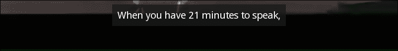

# 控制栏 – 添加按钮以控制视频

在本节中，我们将处理用户与应用程序的交互。目前，我们通过在屏幕上触摸来控制视频，实现播放、暂停和停止视频。然而，这对我们应用程序的新用户来说并不直观。因此，让我们添加一些按钮来提高我们应用程序的可用性。

我们将使用带有`ToggleButtonBehaviour`和`ToggleBehaviour`类的`Image`小部件来创建*播放*/*暂停*按钮和*停止*按钮。以下是本节中将实现的简单*控制栏*的截屏：

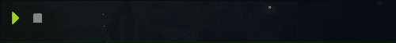

让我们从定义我们的两个`controlbar.kv`小部件开始。我们将逐一介绍每个小部件。让我们从文件的标题和`ControlBar`类定义开始：

```py
178\. # File name: controlbar.kv
179\. <ControlBar@GridLayout>:
180\.     rows: 1
181\.     size_hint: None, None
182\.     pos_hint: {'right': 1}
183\.     padding: [10,0,0,0]
184\.     play_pause: _play_pause
185\.     progress: 0
```

我们从`GridLayout`类派生了`ControlBar`类，并设置了一些熟悉的属性。我们还创建了对*播放*/*暂停*按钮的引用，以及一个新属性（`progress`），它将跟踪视频的进度百分比（从 0 到 1）。让我们继续处理第一个嵌入的小部件，`VideoPlayPause`：

```py
186\.     VideoPlayPause:
187\.         id: _play_pause
188\.         start: 'atlas://data/images/defaulttheme/media-playback-start'
189\.         pause: 'atlas://data/images/defaulttheme/media-playback-pause'
190\.         size_hint: [None, None]
191\.         width: 44
192\.         source: self.start if self.state == 'normal' else self.pause
```

正如我们在`controlbar.py`中将要看到的，`VideoPlayPause`是`Image`和`ToggleButtonBehavior`的组合。我们以这种方式实现了`source`属性（第 192 行），即根据`state`属性的变化（`normal`和`down`）改变小部件的图像。现在让我们看看`VideoStop`的代码：

```py
193\.     VideoStop:
194\.         size_hint: [None, None]
195\.         width: 44
196\.         source: 'atlas://data/images/defaulttheme/media-playback-stop'
197\.         on_press: self.stop(root.parent.video, _play_pause)
```

除了定义一些熟悉的属性外，我们还把事件`on_press`绑定到了`stop`方法（第 197 行），这将在相应的`controlbar.py`文件中展示。请注意，我们假设根的父元素包含对视频的引用（`root.parent.video`）。我们将在`controlbar.py`中继续这个假设：

```py
198\. # File name: controlbar.py 
199\. from kivy.uix.behaviors import ButtonBehavior, ToggleButtonBehavior
200\. from kivy.uix.image import Image
201\. from kivy.lang import Builder
202\. 
203\. Builder.load_file('controlbar.kv')
204\. 
205\. class VideoPlayPause(ToggleButtonBehavior, Image):
206\.     pass
207\. 
208\. class VideoStop(ButtonBehavior, Image):
209\. 
210\.     def stop(self, video, play_pause):
211\.         play_pause.state = 'normal'
212\.         video.state = 'stop'
```

此代码导入了必要的类以及`'controlbar.kv'`（第 198 到 203 行）。然后，使用多重继承，它将`VideoPlayPause`和`VideoStop`类定义为`Image`类和适当行为的组合（第 205 和 208 行）。`VideoStop`类包含一个`stop`方法，当按钮被按下时调用（第 208 行）。这将把*播放*/*暂停*按钮状态设置为正常并停止视频（第 212 行）。

我们还将在`videocontroller.kv`文件中定义一个*视频控制器*，它将是*控制栏*和*视频*的父元素：

```py
213\. # File name: videocontroller.kv
214\. <VideoController >:
215\.     video: _video
216\.     control_bar: _control_bar
217\.     play_pause: _control_bar.play_pause
218\.     control_bar_width: self.width
219\.     playing: _video.state == 'play'
220\. 
221\.     Video:
222\.         id: _video
223\.         state: 'pause' if _control_bar.play_pause.state == 'normal' else 'play'
224\. 
225\.     ControlBar:
226\.         id: _control_bar
227\.         width: root.control_bar_width
228\.         progress: _video.position / _video.duration
```

首先，我们为`VideoContoller`定义了五个属性（第 215 到 219 行）：`video`、`control_bar`、`play_pause`、`control_bar_width`和`playing`。前三个属性引用界面组件，`control_bar_width`将用于外部控制*控制栏*的宽度，而`playing`属性将指示视频是否正在播放（第 219 行）。

然后，我们添加了一个`Video`实例（第 221 行），其状态将取决于*播放*/*暂停*按钮的状态（第 223 行），以及一个`ControlBar`实例。*控制栏*的`width`属性将由我们之前创建的`control_bar_width`（第 227 行）控制，而`progress`属性将以持续时间的百分比表示（第 228 行）。

现在，我们需要在各自的`videocontroller.py`文件中创建`VideoController`类：

```py
229\. # File name: videocontroller.py
230\. from kivy.uix.floatlayout import FloatLayout
231\. from kivy.lang import Builder
232\. 
233\. import video
234\. import controlbar
235\. 
236\. Builder.load_file('videocontroller.kv')
237\. 
238\. class VideoController(FloatLayout):
239\.     pass
```

我们只包含了必要的导入，并将`VideoController`定义为`FloatLayout`的派生类。`kivyplayer.py`文件也必须更新，以便显示`VideoController`实例而不是`Video`：

```py
240\. # File name: kivyplayer.py
241\. from kivy.app import App
242\. from videocontroller import VideoController
243\. 
244\. class KivyPlayerApp(App):
245\.     def build(self):
246\.         return VideoController()
247\. 
248\. if __name__=="__main__":
249\.     KivyPlayerApp().run()
```

随意再次运行应用程序以测试*播放*/*暂停*和*停止*按钮。下一节将向我们的应用程序引入*进度条*。

# 滑块 - 包括进度条

在本节中，我们将介绍一个新的小部件，称为 **`Slider`**。这个小部件将作为 *进度条*，同时允许用户快进和倒退视频。我们将 *进度条* 集成到 *控制栏* 中，如下面的裁剪截图所示：

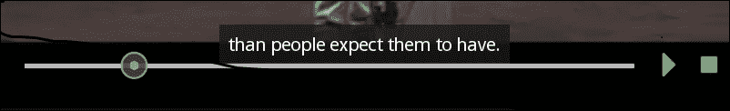

如您所见，`Slider` 出现在 *播放*/*暂停* 和 *停止* 按钮的左侧。让我们将 `controlbar.kv` 修改为添加 `Slider` 以反映这种顺序。让我们从文件的标题和 `ControlBar` 类的定义开始：

```py
250\. # File name: controlbar.kv
251\. <ControlBar@GridLayout>:
252\.     ...
253\.     VideoSlider:
254\.         value: root.progress
255\.         max: 1
256\.     VideoPlayPause:
257\.         ...
```

`VideoSlider` 将使用视频的进度来更新其 **`value`** 属性。**`value`** 属性表示滑块在条上的位置，而 **`max`** 属性是它可以取的最大值。在这种情况下，`1` 是合适的，因为我们用从 0 到 1 的百分比（表示持续时间）来表示进度（第 255 行）。

现在我们将 `VideoSlider` 的定义添加到 `controlbar.py` 文件中：

```py
258\. # File name: controlbar.py 
259\. ...
260\. class VideoSlider(Slider):
261\. 
262\.     def on_touch_down(self, touch):
263\.         video = self.parent.parent.video
264\.         if self.collide_point(*touch.pos):
265\.             self.prev_state = video.state
266\.             self.prev_touch = touch
267\.             video.state = 'pause'
268\.         return super(self.__class__, self).on_touch_down(touch)
269\. 
270\.     def on_touch_up(self, touch):
271\.         if self.collide_point(*touch.pos) and \
272\.             hasattr(self, 'prev_touch') and \
273\.             touch is self.prev_touch:
274\.             video = self.parent.parent.video
275\.             video.seek(self.value)
276\.             if prev_state != 'stop':
277\.                 video.state = self.prev_state
278\.         return super(self.__class__, self).on_touch_up(touch)
```

使用滑块控制视频的进度很棘手，因为视频和滑块需要不断互相更新。视频通过更新滑块来指示其进度，而当用户想要快进或倒退视频时，滑块会更新视频。这创建了一个复杂的逻辑，我们必须考虑以下因素：

1.  我们需要使用触摸事件，因为我们想确保是用户在移动滑块，而不是视频进度。

1.  似乎存在一个无限循环；我们更新了滑块，滑块上传了视频，然后视频又更新了滑块。

1.  用户可能不仅会点击滑块，还可能拖动它，在拖动过程中，视频会再次更新滑块。

由于这些原因，我们需要执行以下步骤：

1.  在更新进度之前暂停视频（第 267 行）。

1.  不要直接使用值属性更新滑块，而是使用 `seek` 方法（第 275 行）更新视频进度。

1.  使用两个事件 `on_touch_down`（第 262 行）和 `on_touch_up`（第 270 行），以便安全地更改视频的进度百分比。

在`on_touch_down`方法（第 262 至 268 行）中，我们存储了视频的当前状态（第 265 行），以及触摸的引用（第 266 行），然后我们暂停了视频（第 267 行）。如果我们不暂停视频，在更新视频到滑块的进度之前，视频的进度可能会影响滑块（记住滑块的`value`在第 254 行绑定到`progression`属性）。在`on_touch_up`事件中，我们确保触摸实例与我们在`on_touch_down`方法中存储的实例相对应（第 272 和 273 行）。然后，我们使用**`seek`**方法（第 275 行）根据滑块的位置设置视频到正确的位置。最后，如果视频的状态与`stop`不同，我们重新建立视频的先前状态（第 276 和 277 行）。

随意再次运行应用程序。您还可以通过不同的选项和滑块来更新视频进行实验。例如，尝试在拖动滑块通过`on_touch_move`事件时实时更新。

# 动画 – 隐藏小部件

在本节中，我们将使*控制栏*在视频开始播放时消失，以便在没有视觉干扰的情况下观看视频。我们需要更改`videocontroller.py`文件以动画化`ControlBar`实例：

```py
279\. # File name: videocontroller.py
280\. from kivy.animation import Animation
281\. from kivy.properties import ObjectProperty
282\. ...
283\. class VideoController(FloatLayout):
284\.     playing = ObjectProperty(None)
285\. 
286\.     def on_playing(self, instance, value):
287\.         if value:
288\.             self.animationVB = Animation(top=0)
289\.             self.control_bar.disabled = True
290\.             self.animationVB.start(self.control_bar)
291\.         else:
292\.             self.play_pause.state = 'normal'
293\.             self.control_bar.disabled = False
294\.             self.control_bar.y = 0
295\. 
296\.     def on_touch_down(self, touch):
297\.         if self.collide_point(*touch.pos):
298\.             if hasattr(self, 'animationVB'):
299\.                self.animationVB.cancel(self.control_bar)
300\.             self.play_pause.state = 'normal'
301\.         return super(self.__class__, self).on_touch_down(touch)
```

除了文件开头必要的导入（第 280 和 281 行）之外，我们还引入了`playing`属性（第 284 行）以及与`on_playing`事件和`on_touch_down`事件相关的两个方法。`playing`属性已经在 Kivy 语言中定义（第 219 行），但请记住，由于文件解析顺序，如果我们想在同一类中使用该属性，我们还需要在 Python 语言中定义它。

当`playing`属性改变时，会触发`on_playing`事件（第 286 行）。此方法开始一个动画（第 290 行）并在视频播放时禁用*控制栏*（第 289 行）。动画将隐藏屏幕底部的*控制栏*。当视频不播放时，`on_playing`方法也会恢复*控制栏*（第 292 至 294 行），使其再次可见。

由于*控制栏*将在视频播放时隐藏，我们需要一种替代方法来停止视频（不同于**停止**按钮）。这就是为什么我们包括了`on_touch_down`事件（第 296 行）。一旦我们触摸屏幕，如果存在动画，动画将被取消（第 298 行），并将**播放**/*暂停*按钮设置为`'normal'`（第 300 行）。这将暂停视频并因此触发我们刚刚定义的`on_playing`事件（在这种情况下，因为它停止了播放）。

您现在可以再次运行应用程序并欣赏当我们按下**播放**/**暂停**按钮时，*控制栏*如何缓慢地消失到屏幕底部。

# Kivy 检查器 – 调试界面

有时，我们在实现我们的界面时会遇到问题，特别是当许多部件没有图形显示时，理解出了什么问题可能很困难。在本节中，我们将使用本章中创建的应用程序来介绍 Kivy **检查器**，这是一个简单的调试界面的工具。为了启动检查器，您运行以下命令：`python kivyplayer.py –m inspector`。一开始您可能不会注意到任何区别，但如果您按下*Ctrl* + *E*，屏幕底部将出现一个栏，就像以下图像左图中的那样：

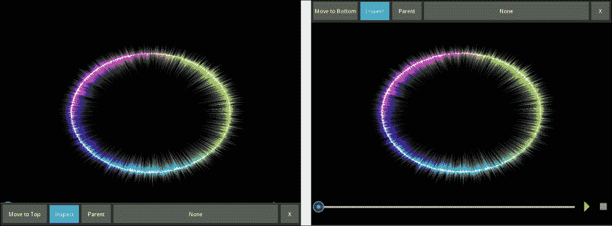

如果我们按下**移至顶部**按钮（从左到右数第一个），则栏将移动到屏幕顶部，正如您在右图中所见，这对于我们的特定应用来说是一个更方便的位置。第二个按钮**检查**激活或关闭检查器行为。我们现在可以通过点击来高亮显示组件。

例如，如果您点击*播放*/*暂停*按钮，视频将不会播放；相反，按钮将以红色高亮显示，正如您在下面的左图中所见：

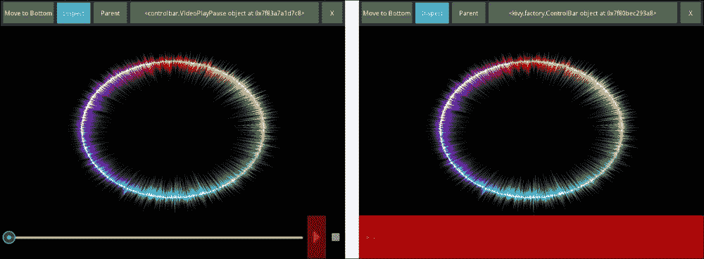

此外，如果我们想可视化当前高亮的部件，我们只需按下**父级**按钮（从左到右数第三个）。在右图中，您可以看到*控制栏*（*播放*/*暂停*按钮的父级）被高亮显示。您还应该注意，长按钮（从左到右数第四个）显示了高亮实例所属的类。如果我们点击此按钮，将显示该部件的所有属性列表，如以下左图所示：

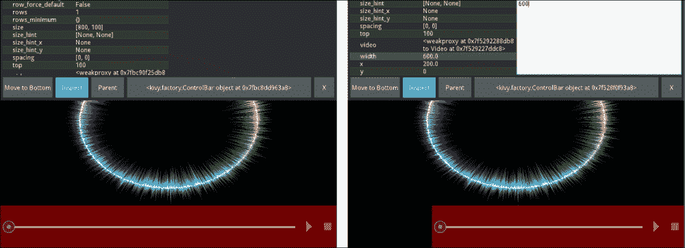

最后，当我们选择一个属性时，我们能够修改它。例如，在右图中，我们修改了*控制栏*的宽度属性，我们可以看到*控制栏*立即调整到这些变化。

请记住，由于 Kivy 部件尽可能简单，这意味着很多时候它们是不可见的，因为更复杂的图形显示意味着不必要的过载。然而，这种行为使得我们难以在 GUI 中找到错误。所以当我们的界面没有显示我们期望的内容时，检查器就变得非常有用，帮助我们理解 GUI 的底层树结构。

# ActionBar – 一个响应式栏

Kivy 1.8.0 引入了一套新的小部件，它们都与 **`ActionBar`** 小部件相关。这个小部件类似于 Android 的操作栏。这不仅会给您的应用程序带来现代和专业的外观，而且还包括更多细微的特性，如对小型屏幕的响应性。根据 `ActionBar` 小部件的层次结构和组件，不同的小部件将折叠以适应设备中可用的屏幕空间。首先，让我们看看我们计划中的 `ActionBar` 的最终结果：

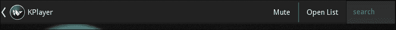

我们将 Kivy 语言代码添加到新文件 `kivyplayer.kv` 中，如下所示：

```py
302\. # File name: kivyplayer.kv
303\. 
304\. <KivyPlayer>:
305\.     list_button: _list_button
306\.     action_bar: _action_bar
307\.     video_controller: _video_controller
308\. 
309\.     VideoController:
310\.         id: _video_controller
311\.         on_playing: root.hide_bars(*args)
312\. 
313\.     ActionBar:
314\.         id: _action_bar
315\.         top: root.height
316\.         ActionView:
317\.             use_separator: True
318\.             ActionListButton:
319\.                 id: _list_button
320\.                 root: root
321\.                 title: 'KPlayer'
322\.             ActionToggleButton:
323\.                 text: 'Mute'
324\.                 on_state: root.toggle_mute(*args)
325\.             ActionGroup:
326\.                 text: 'More Options...'
327\.                 ActionButton:
328\.                     text: 'Open List'
329\.                     on_release: root.show_load_list()
330\.                 ActionTextInput: 
331\.                     on_text_validate: root.search(self.text)
```

之前代码的层次结构很复杂，因此它也以以下图的形式呈现：

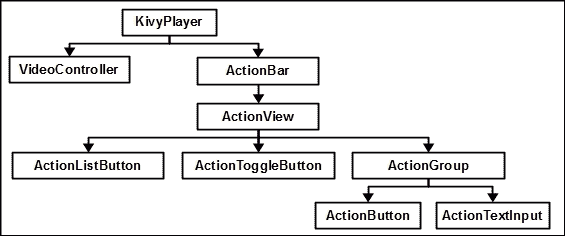

如您在前面的图中所见，**KivyPlayer** 包含两个主要组件，我们在上一节中创建的 `VideoController` 以及 **ActionBar**。如果您还记得，我们为 `VideoController` 创建了 `playing` 属性（第 219 行），并将其关联事件 `on_playing` 绑定到 `hide_bars` 方法（第 311 行），该方法将基本隐藏操作栏。现在，让我们将注意力集中在 `ActionBar` 的层次结构上。

**`ActionBar`** 总是包含一个 **`ActionView`**。在这种情况下，我们添加了一个包含三个小部件的 `ActionView`：`ActionListButton`、**`ActionToggleButton`** 和 **`ActionGroup`**。所有这些小部件都继承自 **`ActionItem`**。

### 注意

**`ActionView`** 应该只包含继承自 **`ActionItem`** 的小部件。我们可以通过继承 `ActionItem` 来创建自己的操作项。

**`ActionGroup`** 将 `ActionItem` 实例分组，以便组织响应式显示。在这种情况下，它包含一个 **`ActionButton`** 实例和一个 `ActionTextInput` 实例。`ActionListButton` 和 `ActionTextInput` 是我们需要创建的个性化小部件。`ActionListButton` 将继承自 **`ActionPrevious`** 和 `ToggleButtonBehaviour`，而 `ActionTextInput` 继承自 **`TextInput`** 和 **`ActionItem`**。

在继续之前，代码中有几个新的属性值得解释。`ActionView` 的 **`use_separator`** 属性（第 317 行）表示是否在每个 `ActionGroup` 前使用分隔符。`title` 属性（第 321 行），它在 `ActionListButton` 的组件中显示标题，是从 `ActionPrevious` 继承的。`ActionPrevious` 只是一个带有一些额外 GUI 特性（如标题，还可以通过 **`app_icon`** 修改 Kivy 图标）的按钮，但更重要的是，它的父级（`ActionView`）将使用 **`action_previous`** 属性保留对其的引用。

现在我们来看看 `actiontextinput.kv` 文件中 `ActionTextInput` 的定义：

```py
332\. # File name: actiontextinput.kv
333\. <ActionTextInput@TextInput+ActionItem>
334\.     background_color: 0.2,0.2,0.2,1
335\.     foreground_color: 1,1,1,1
336\.     cursor_color: 1,1,1,1
337\.     hint_text: 'search' 
338\.     multiline: False
339\.     padding: 14
340\.     size_hint: None, 1
```

正如我们之前所说，`ActionTextInput`继承自**`TextInput`**和**`ActionItem`**，**`TextInput`**小部件是一个简单的显示文本输入字段的小部件，用户可以在其中写入。它直接从`Widget`类和 Kivy 1.9.0 中引入的**`FocusBehaviour`**类继承。我们使用的多重继承表示法（第 333 行）对我们来说是新的。

### 注意

为了在 Kivy 语言中使用多重继承，我们使用表示法`<DerivedClass@BaseClass1+BaseClass2>`。

**`TextInput`**小部件是 Kivy 中最灵活的小部件之一，它包含许多可以用来配置它的属性。我们使用了`background_color`、`foreground_color`和`cursor_color`属性（第 334 至 336 行）来分别设置背景、前景和光标颜色。`hint_text`属性将显示提示背景文本，当`TextInput`获得焦点时（例如，当我们点击或触摸它时）将消失。`multiline`属性将指示`TextInput`是否接受多行，并且当按下*Enter*键时，它将激活`on_text_validate`事件，我们在`kivyplayer.kv`文件（第 331 行）中使用它。

注意，我们还向`KivyPlayer`（第 305 至 307 行）添加了一些引用。我们在`KivyPlayer`的 Python 端使用这些引用，即`kivyplayer.py`。我们将在三个片段中介绍这段代码：

```py
341\. # File name: kivyplayer.py (Fragment 1 of 3)
342\. from kivy.app import App
343\. from kivy.uix.floatlayout import FloatLayout
344\. from kivy.animation import Animation
345\. from kivy.uix.behaviors import ToggleButtonBehavior
346\. from kivy.uix.actionbar import ActionPrevious
347\. 
348\. from kivy.lang import Builder
349\. 
350\. import videocontroller
351\. 
352\. Builder.load_file('actiontextinput.kv')
353\. 
354\. 
355\. class ActionListButton(ToggleButtonBehavior, ActionPrevious):
356\.     pass
```

在这个片段中，我们添加了所有必要的代码导入。我们还加载了`actiontextinput.kv`文件，并定义了从`ToggleButtonBehaviour`和`ActionPrevious`继承的`ActionListButton`类，正如我们之前所指示的。

在`kivyplayer.py`的片段 2 中，我们添加了所有由`ActionItems`调用的必要方法：

```py
357\. # File name: kivyplayer.py (Fragment 2 of 3)
358\. class KivyPlayer(FloatLayout):
359\. 
360\.     def hide_bars(self, instance, playing):
361\.         if playing:
362\.             self.list_button.state = 'normal'
363\.             self.animationAB = Animation(y=self.height)
364\.             self.action_bar.disabled = True
365\.             self.animationAB.start(self.action_bar)
366\.         else:
367\.             self.action_bar.disabled = False
368\.             self.action_bar.top = self.height
369\.             if hasattr(self, 'animationAB'):
370\.                 self.animationAB.cancel(self.action_bar)
371\. 
372\.     def toggle_mute(self, instance, state):
373\.         if state == 'down':
374\.             self.video_controller.video.volume = 0
375\.         else:
376\.             self.video_controller.video.volume = 1
377\. 
378\.     def show_load_list(self):
379\.         pass
380\. 
381\.     def search(self, text):
382\.         pass
```

对于本节，我们只是实现了`hide_bars`和`toggle_mute`方法。`hide_bars`方法（第 360 至 371 行）在视频播放时以类似我们之前隐藏*控制栏*的方式隐藏*操作栏*。`toggle_button`方法（第 372 至 382 行）使用**`volume`**属性在满音量和静音状态之间切换。代码的片段 3 只包含运行代码的最终命令：

```py
383\. # File name: kivyplayer.py (Fragment 3 of 3)
384\. class KivyPlayerApp(App):
385\.     def build(self):
386\.         return KivyPlayer()
387\. 
388\. if __name__=="__main__":
389\.     KivyPlayerApp().run()
```

您现在可以再次运行应用程序。您可能想要调整窗口大小，看看*操作栏*如何根据屏幕大小重新组织组件。以下是中等（左侧）和小型（右侧）尺寸的两个示例：

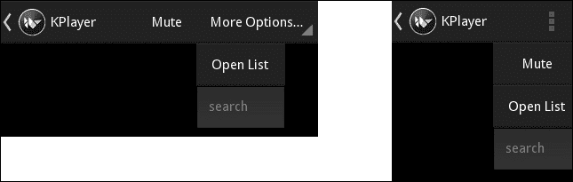

# LoadDialog – 显示文件目录

在本节中，我们将讨论如何在 Kivy 中显示目录树以选择文件。首先，我们将在`loaddialog.kv`中定义界面：

```py
390\. # File name: loaddialog.kv
391\. <LoadDialog>:
392\.     BoxLayout:
393\.         size: root.size
394\.         pos: root.pos
395\.         orientation: "vertical"
396\.         FileChooserListView:
397\.             id: filechooser
398\.             path: './'
399\.         BoxLayout:
400\.             size_hint_y: None
401\.             height: 30
402\.             Button:
403\.                 text: "Cancel"
404\.                 on_release: root.cancel()
405\.             Button:
406\.                 text: "Load"
407\.                 on_release: root.load(filechooser.path, filechooser.selection)
```

这段代码中除了使用了**`FileChooserListView`**控件之外，没有其他新内容。它将显示文件的目录树。`path`属性（第 398 行）将指示开始显示文件的基准路径。除此之外，我们还添加了**取消**（第 402 行）和**加载**按钮（第 405 行），它们调用定义在`loaddialog.py`文件中的`LoadDialog`类的相应函数：

```py
408\. # File name: loaddialog.py
409\. 
410\. from kivy.uix.floatlayout import FloatLayout
411\. from kivy.properties import ObjectProperty
412\. from kivy.lang import Builder
413\. 
414\. Builder.load_file('loaddialog.kv')
415\. 
416\. class LoadDialog(FloatLayout):
417\.     load = ObjectProperty(None)
418\.     cancel = ObjectProperty(None)
```

在这个类定义中实际上没有明确定义的参数，只有几个属性。我们将在`kivyplayer.py`文件中将方法分配给这些属性，Kivy/Python 将分别调用它们：

```py
419\.     def show_load_list(self):
420\.         content = LoadDialog(load=self.load_list, cancel=self.dismiss_popup)
421\.         self._popup = Popup(title="Load a file list", content=content, size_hint=(1, 1))
422\.         self._popup.open()
423\. 
424\.     def load_list(self, path, filename):
425\.         pass
426\. 
427\.     def dismiss_popup(self):
428\.         self._popup.dismiss() 
```

如果你记得，`ActionBar`实例的**打开列表**按钮调用`show_load_list`方法（第 329 行）。这个方法将创建一个`LoadDialog`实例（第 420 行），并将两个其他方法作为构造函数的参数发送：`load_list`（第 424 行）和`dismiss_popup`（第 427 行）。这些方法将被分配给`load`和`cancel`属性。一旦实例创建完成，我们将在`Popup`中显示它（实例行 421 和 422）。

现在，当我们在`LoadDialog`的**加载**按钮（第 420 行）上点击时，将调用`load_list`方法，当按下**取消**按钮时，将调用`dismiss_popup`方法。不要忘记在`kivyplayer.py`中添加相应的导入：

```py
429\. from kivy.uix.popup import Popup
430\. from loaddialog import LoadDialog
431\. from sidebar import ListItem
```

下面是生成的截图，我们可以欣赏到树状目录：

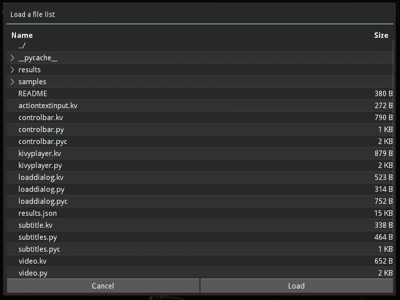

# ScrollView – 显示视频列表

在本节中，我们将展示在 TED 视频网站上执行搜索的结果，这些结果将显示在一个可以上下滚动的**侧边栏**中，如下面的截图所示：

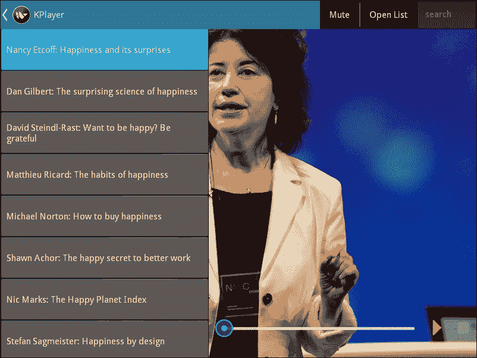

让我们在`sidebar.kv`文件中开始定义侧边栏的组件：

```py
432\. # File name: sidebar.kv
433\. <ListItem>:
434\.     size_hint: [1,None]
435\.     height: 70
436\.     group: 'listitem'
437\.     text_size: [self.width-20, None]
438\. 
439\. 
440\. <Sidebar@ScrollView>:
441\.     playlist: _playlist
442\.     size_hint: [None, None]
443\.     canvas.before:
444\.         Color:
445\.             rgba: 0,0,0,.9
446\.         Rectangle:
447\.             pos: 0,0,
448\.             size: self.width,self.height
449\. 
450\.     GridLayout:
451\.         id: _playlist
452\.         size_hint_y: None
453\.         cols: 1
```

`ListItem`类继承自`ToggleButton`。`text_size`属性将为文本设置边界。如果视频的标题过长，将使用两行显示。`Sidebar`类继承自**`ScrollView`**，这将允许滚动视频列表，类似于我们在上一节`LoadDialog`中滚动文件的方式。`Sidebar`内部的`GridLayout`实例是实际包含和组织`ListItem`实例的控件。这通过`Sidebar`的`playlist`属性（第 442 行）进行引用。

### 小贴士

在`ScrollView`内部的包含元素必须允许比`ScrollView`更大，以便可以滚动。如果你想添加垂直滚动，将`size_hint_y`设置为`None`；如果你想添加水平滚动，将`size_hint_x`设置为`None`。

让我们继续在 Python 文件（`sidebar.py`）中定义侧边栏的定义：

```py
454\. # File name: sidebar.py
455\. 
456\. import json
457\. 
458\. from kivy.uix.togglebutton import ToggleButton
459\. from kivy.properties import ObjectProperty
460\. from kivy.lang import Builder
461\. 
462\. Builder.load_file('sidebar.kv')
463\. 
464\. class ListItem(ToggleButton):
465\.     video = ObjectProperty(None)
466\. 
467\.     def __init__(self, video, meta, surl, **kwargs):
468\.         super(self.__class__, self).__init__(**kwargs)
469\.         self.video = video
470\.         self.meta = meta
471\.         self.surl = surl
472\. 
473\.     def on_state(self, instance, value):
474\.         if self.state == 'down':            
475\.             data = json.load(open(self.meta))['talk']
476\.             self.video.surl = self.surl
477\.             self.video.source = data['media']['internal']['950k']['uri']
478\.             self.video.image = data['images'][-1]['image']['url']
```

此文件提供了`ListItem`类的实现。构造函数中有三个参数（第 473 行）：一个`video`小部件的实例、包含视频元数据的`meta`文件名，这些元数据由 TED 视频提供，以及包含字幕 URL 的`surl`。当`ListItem`小部件的`state`属性发生变化时，会调用`on_state`方法（第 474 行）。此方法将打开 TED 提供的 JSON 格式的文件，并提取更新视频小部件属性所需的信息。我们在本节代码中包含了一个 TED 元数据文件集合，位于结果文件夹中，以便在您包含自己的 API 之前测试代码。例如，`results/97.json`包含我们迄今为止使用的丹·吉尔伯特视频的元数据。您可以在该字幕文件的第 477 行和第 478 行验证 JSON 结构。

现在，我们需要在`kivyplayer.kv`文件中将一个`Sidebar`实例添加到`KivyPlayer`中：

```py
479\. # File name: kivyplayer.kv
480\. <KivyPlayer>:
481\.     list_button: _list_button
482\.     action_bar: _action_bar
483\.     video_controller: _video_controller
484\.     side_bar: _side_bar
485\.     playlist: _side_bar.playlist
486\. 
487\.     VideoController:
488\.         id: _video_controller
489\.         control_bar_width: root.width - _side_bar.right
490\. 
491\. (...)
492\. 
493\.     Sidebar:
494\.         id: _side_bar
495\.         width: min(_list_button.width,350)
496\.         height: root.height - _action_bar.height
497\.         top: root.height - _action_bar.height
498\.         x: 0 - self.width if _list_button.state == 'normal' else 0
```

我们已添加`Sidebar`实例并基于屏幕上的其他元素定义了一些`position`属性（第 495 行至第 498 行）。我们还调整了`控制栏`的`width`为`side_bar`（第 480 行）。当`Sidebar`显示时，则`控制栏`将自动调整到可用空间。我们使用`ActionListButton`类（第 512 行）控制侧边栏的显示，我们将在`kivyplayer.py`中定义此类：

```py
499\. # File name: kivyplayer.py
500\. import json
501\. import os
502\. 
503\. (...)
504\. 
505\. from sidebar import ListItem
506\. 
507\. Builder.load_file('actiontextinput.kv')
508\. 
509\. _surl = 'http://www.ted.com/talks/subtitles/id/%s/lang/en'
510\. _meta = 'results/%s.json'
511\. 
512\. class ActionListButton(ToggleButtonBehavior, ActionPrevious):
513\.     def on_state(self, instance, value):
514\.         if self.state == 'normal':
515\.             self.animationSB = Animation(right=0)
516\.             self.animationSB.start(self.root.side_bar)
517\.         else:
518\.             self.root.side_bar.x=0
519\. 
520\. class KivyPlayer(FloatLayout):
521\. 
522\.     def __init__(self, **kwargs):
523\.         super(self.__class__, self).__init__(**kwargs)
524\.         self.playlist.bind(minimum_height= self.playlist.setter('height'))
```

侧边栏的动画与我们本章中看到的类似。我们还包含了两个全局变量：`_surl`和`_meta`（第 509 行和第 510 行）。这些字符串将作为字幕和元数据文件的模板。请注意，字符串中的`%s`将被替换。我们还向`KivyPlayer`类定义中引入了一个构造函数（`__init__`）（第 522 行和第 524 行）。第 524 行是必要的，以确保`GridLayout`实例（在`ScrollView`内部）适应其高度，从而允许滚动。

现在，我们需要将`ListItem`实例添加到`Sidebar`小部件中。为此，我们将在`kivyplayer.py`中定义`load_list`方法（第 525 行）和`load_from_json`方法（第 532 行）：

```py
525\.     def load_list(self, path, filename):
526\.         json_data=open(os.path.join(path, filename[0]))
527\.         data = json.load(json_data)
528\.         json_data.close()
529\.         self.load_from_json(data)
530\.         self.dismiss_popup()
531\. 
532\.     def load_from_json(self, data):
533\.         self.playlist.clear_widgets()
534\.         for val in data['results']:
535\.             t = val['talk']
536\.             video = self.video_controller.video
537\.             meta = _meta % t['id']
538\.             surl = _surl % t['id']
539\.             item = ListItem(video, meta, surl, text=t['name'])
540\.             self.playlist.add_widget(item)
541\.         self.list_button.state = 'down'
```

我们包含了一个 `results.json` 文件，其中包含从 TED 网站获取的示例搜索结果列表。这个结果以 JSON 格式呈现，您可以在文件中查看。我们需要打开这个文件，并在 *侧边栏* 中显示其内容。为了做到这一点，我们使用 `LoadDialog` 显示选择 `result.json` 文件，并使用 **打开列表** 按钮进行选择。一旦选择，就会调用 `load_list` 方法。该方法打开数据并加载 JSON 数据（第 527 行）。一旦加载，它就会调用 `load_from_json` 方法（第 528 行）。在这个方法中，我们为从 TED 网站搜索得到的结果创建一个 `ListItem` 实例（第 539 行），并将这些实例添加到播放列表中（即 *侧边栏* 内的 `GridLayout` 实例，第 451 行）。第 537 行和 538 行是 Python 中连接字符串的常见方式。它将字符串中存在的 `%s` 替换为 `%` 后面的相应参数。现在，当我们打开 `results.json` 文件时，就像本节开头截图所示，我们将在应用程序中以侧边栏列表的形式看到结果。

# 搜索 – 查询 TED 开发者 API

本节最后将介绍一些代码更改，以便我们能够搜索 TED 网站。

### 小贴士

您需要做的第一件事是从 TED 网站使用以下链接获取 API 密钥：

[`developer.ted.com/member/register`](http://developer.ted.com/member/register)。

TED API 密钥是一个字母数字编号（例如 `'1a3bc2'`），它允许您直接查询 TED 网站，并获取我们上一节中使用的 JSON 格式的请求。一旦您在电子邮件账户中收到 API 密钥，您就可以修改 `kivyplayer.py` 文件，并将其放入 `_api` 全局变量中。目前，我们可以在 `kivyplayer.py` 文件中使用如下占位符：

```py
_api = 'YOUR_API_KEY_GOES_HERE'
```

此外，在 `kivyplayer.py` 文件中，我们需要引入一个包含搜索模板（_`search`_）的全局变量，并替换 `_meta` 全局变量的内容：

```py
_search = 'https://api.ted.com/v1/search.json?q=%s&categories=talks&api-key=%s'
_meta = 'https://api.ted.com/v1/talks/%s.json?api-key=%s'
```

注意，现在 `_meta` 变量有两个 `%`。因此，我们需要在 `load_from_json` 方法（第 533 行）中将 `meta = meta % t['id']` 代码行替换为 `meta = _meta % (t['id'], _api)`。另外，由于我们不再打开文件，我们还需要修改 `ListItem` 类中加载 JSON 的方式，因为我们现在没有文件，而是一个 URL。首先，我们需要在 `sidebar.py` 文件的开始处导入 `URLRequest` 类（`from kivy.network.urlrequest import UrlRequest`），然后修改 `on_state` 方法以使用 `URLRequest` 类，就像我们学习字幕时做的那样：

```py
542\.     def on_state(self, instance, value):
543\.         if self.state == 'down':
544\.             req = UrlRequest(self.meta, self.got_meta)
545\.         
546\.     def got_meta(self, req, results):
547\.         data = results['talk']
548\.         self.video.surl = self.surl
549\.         self.video.source = data['media']['internal']['950k']['uri']
550\.         self.video.image = data['images'][-1]['image']['url'] 
```

我们还需要在 `kivyplayer.py` 中导入 `URLRequest` 类，以便在 `KivyPlayer` 类定义中实现 `search` 方法：

```py
551\.     def search(self, text):
552\.         url = _search % (text, _api)
553\.         req = UrlRequest(url, self.got_search)
554\. 
555\.     def got_search(self, req, results):
556\.         self.load_from_json(results) 
```

现在，您可以检查是否收到了 TED API 密钥。一旦您替换了 `_api` 变量，您将能够使用操作栏中的搜索框查询 TED API。您现在可以使用 `ActionTextInput` 进行搜索：

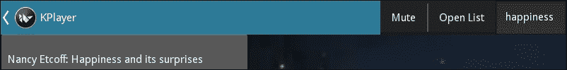

### 小贴士

请记住，您刚刚创建的 API 密钥可以识别您和您的应用程序作为 TED 网站的用户。所有通过该 API 注册的活动都是您的责任。*您不应该将此 API 密钥告诉任何人。*

控制您的 API 密钥的使用涉及设置自己的服务器，其中 API 密钥被安全存储。该服务器将作为您应用程序的代理 ([`en.wikipedia.org/wiki/Proxy_server`](https://en.wikipedia.org/wiki/Proxy_server))，并应限制查询。例如，它应避免大量查询等滥用行为。

# 摘要

在本章中，我们创建了一个集成了许多 Kivy 组件的应用程序。我们讨论了如何控制视频以及如何将屏幕的不同元素与之关联。我们探索了不同的 Kivy 小部件，并实现了复杂的交互来显示可滚动的元素列表。以下是本章中我们使用的新类和组件列表：

+   `Video`: 从 `Image` 继承的 `allow_stretch` 和 `source` 属性；`state` 和 `progress` 属性；`_on_load`、`on_eos`、`on_source` 和 `on_state`、`on_position`、`seek` 方法

+   `AsyncImage`: 从 `Image` 继承的 `source` 属性；从 `Widget` 继承的 `opacity` 属性

+   `Label`: `texture_size` 属性

+   `Slider`: `value` 和 `max` 属性
`Touch`: `double_tap` 键

+   Kivy 检查器类

+   `ActionBar`、`ActionView`、`ActionItem`、`ActionPrevious`、`ActionToggleButton`、`ActionGroup` 和 `ActionButton` 类，以及 `ActionView` 的 `use_separator` 属性和 `ActionPrevious` 的标题属性

+   `Textinput`: `background_color`、`foreground_color`、`cursor_color` 和 `multiLine` 属性

+   `FileChooserListView`: `path` 属性

+   `ScrollView` 类

作为本章的副产品，我们获得了一个经过优化的 `Video` 小部件，我们可以在其他应用程序中使用它。这个 `Video` 小部件将我们以 JSON 格式文件接收的子标题与视频的进度同步，并具有响应式的 *控制栏*。

我们已经掌握了 `Video` 小部件的使用。我们学习了如何控制其进度并添加字幕。我们还介绍了如何查询 TED 开发者 API 以获取结果列表，并练习了操作 JSON 格式的技能。我们还学习了如何使用 Kivy 调试器来检测界面中的错误。

我们还努力使我们的 `KivyPlayer` 应用看起来更专业。我们通过引入隐藏 GUI 组件的动画来优化屏幕的使用，这些动画在不需要时隐藏。在这个过程中，我们使用了许多 Kivy 元素来使我们的小部件保持一致，并审查了诸如行为、工厂、动画、触摸事件以及属性的使用等有趣的主题，以便创建多功能组件。

开始即是结束，因此现在轮到你自己开始自己的应用了。我真心希望，你从这本书中学到的知识能帮助你实现你的想法，并开始你自己的应用。
