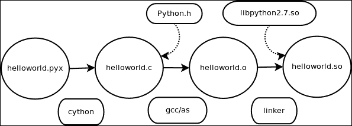

# 第一章. Cython 不会咬人

Cython 远不止是一种编程语言。其起源可以追溯到 SAGE，这是一个数学软件包，其中它被用来提高涉及矩阵等数学计算的性能。更普遍地说，我倾向于将 Cython 视为 SWIG 的替代品，用于生成非常好的 Python 到本地代码的绑定。

语言绑定已经存在多年，SWIG 是最早和最好的用于为多种语言生成绑定的工具之一。Cython 仅生成 Python 代码的绑定，这种单一目的的方法意味着它生成的 Python 绑定是您能得到的最好的，除了手动完成之外，这应该只在您是 Python 核心开发者的情况下尝试。

对我来说，通过生成语言绑定来控制遗留软件是一种很好的重用任何软件包的方法。考虑一个用 C/C++ 编写的遗留应用程序。为仪表板或消息总线添加高级现代功能，如网络服务器，并不是一件简单的事情。更重要的是，Python 拥有数千个经过开发、测试并由人们长期使用、能够完成这些任务的软件包。利用所有这些代码不是很好吗？使用 Cython，我们确实可以做到这一点，我将在过程中通过大量的示例代码来展示方法。

本章将致力于 Cython 的核心概念，包括编译，并应为所有 Cython 核心概念提供一个坚实的参考和介绍。

在本章中，我们将涵盖：

+   安装 Cython

+   入门 - Hello World

+   使用 distutils 与 Cython

+   从 Python 调用 C 函数

+   类型转换

# 安装 Cython

由于 Cython 是一种编程语言，我们必须安装其相应的编译器，而这个编译器恰好被恰当地命名为 *Cython*。

安装 Cython 有许多不同的方法。首选的方法是使用 `pip`：

```py
$ pip install Cython
```

这应该在 Linux 和 Mac 上都适用。或者，您可以使用您的 Linux 发行版的包管理器来安装 Cython：

```py
$ yum install cython     # will work on Fedora and Centos
$ apt-get install cython # will work on Debian based systems.
```

对于 Windows 系统，尽管有众多选项可用，但遵循本维基是保持最新状态的最安全选项：[`wiki.cython.org/InstallingOnWindows`](http://wiki.cython.org/InstallingOnWindows)。

## Emacs 模式

Cython 有一个可用的 **emacs** 模式。尽管语法几乎与 Python 相同，但与简单地使用 Python-mode 存在着冲突。您可以从 Cython 源代码（在 `Tools` 目录内）中获取 `cython-mode.el`。在 emacs 中安装包的首选方法是使用包仓库，如 `MELPA`：

要将包仓库添加到 emacs，打开您的 `~/.emacs` 配置文件并添加：

```py
(when (>= emacs-major-version 24)
  (require 'package)
  (add-to-list
   'package-archives
   '("melpa" . "http://melpa.org/packages/")
   t)
  (package-initialize))
```

一旦添加此内容并重新加载您的配置以安装 Cython 模式，您只需运行：

```py
'M-x package-install RET cython-mode'
```

一旦安装，您可以通过将以下内容添加到您的 emacs 配置文件中来激活模式：

```py
(require 'cython-mode)
```

您可以随时手动激活该模式，方法如下：

```py
'M-x cython-mode RET'
```

## 获取代码示例

在整本书中，我打算展示一些易于消化的真实示例，以帮助你了解你可以使用 Cython 实现的不同事情。要访问和下载使用的代码，请克隆此存储库：

```py
$ git clone git://github.com/redbrain/cython-book.git
```

# 入门 – Hello World

当你运行 **Hello World** 程序时，你会看到 Cython 生成原生 Python 模块。因此，运行任何 Cython 代码时，你将通过 Python 的模块导入来引用它。让我们构建这个模块：

```py
$ cd cython-book/chapter1/helloworld
$ make
```

现在你应该已经创建了 `helloworld.so`！这是一个与 Cython 源代码文件同名的 Cython 模块。在共享对象模块的同一目录下，你可以通过运行相应的 Python 导入来调用此代码：

```py
$ python
Python 2.7.3 (default, Aug  1 2012, 05:16:07)
[GCC 4.6.3] on linux2
Type "help", "copyright", "credits" or "license" for more information.
>>> import helloworld
Hello World from cython!
```

通过打开 `helloworld.pyx`，你可以看到它看起来就像一个普通的 Python Hello World 应用程序，但如前所述，Cython 生成模块。这些模块需要一个名称，以便它们可以被 Python 运行时正确导入。Cython 编译器简单地使用源代码文件的名称。然后它要求我们将这个模块编译成相同的共享对象名称。

总体而言，Cython 源代码文件具有 `.pyx`、`.pxd` 和 `.pxi` 扩展名。目前，我们只关心 `.pyx` 文件；其他文件分别用于 `.pyx` 模块文件中的 **cimports** 和 **includes**。

下面的截图展示了创建可调用的原生 Python 模块所需的编译流程：



我编写了一个基本的 `makefile`，这样你只需运行 `make` 就可以编译这些示例。以下是手动执行此操作的代码：

```py
$ cython helloworld.pyx
$ gcc/clang -g -O2 -fpic `python-config --cflags` -c helloworld.c -o helloworld.o
$ gcc/clang -shared -o helloworld.so helloworld.o `python-config –libs`
```

## 使用 Cython 的 distutils

你也可以使用 Python 的 `distutils` 和 `cythonize` 来编译这个 HelloWorld 示例模块。打开与 Makefile 并排的 `setup.py` 文件，你可以看到编译 Cython 模块的另一种方法：

```py
from distutils.core import setup
from Cython.Build import cythonize

setup(
    ext_modules = cythonize("helloworld.pyx")
)
```

将 `cythonize` 函数作为 `ext_modules` 部分的一部分，可以将任何指定的 Cython 源代码编译成可安装的 Python 模块。这将 `helloworld.pyx` 编译成相同的共享库。这为使用 `distutils` 分发原生模块提供了 Python 实践。

## 从 Python 调用 C 函数

在谈论 Python 和 Cython 时，我们应该小心清晰，因为它们的语法非常相似。让我们用 C 包装一个简单的 `AddFunction` 并使其可从 Python 调用。

首先，打开一个名为 `AddFunction.c` 的文件，并在其中编写一个简单的函数：

```py
#include <stdio.h>

int AddFunction(int a, int b) {
    printf("look we are within your c code!\n");
    return a + b;
}
```

这是我们将要调用的 C 代码——只是一个简单的将两个整数相加的函数。现在，让我们让 Python 调用它。打开一个名为 `AddFunction.h` 的文件，在其中我们将声明我们的原型：

```py
#ifndef __ADDFUNCTION_H__
#define __ADDFUNCTION_H__

extern int AddFunction (int, int);

#endif //__ADDFUNCTION_H__
```

我们需要这个原型，以便 Cython 可以看到我们想要调用的函数的原型。在实践中，你已经在自己的项目中有了自己的头文件，其中包含了你的原型和声明。

打开一个名为 `AddFunction.pyx` 的文件，并在其中插入以下代码：

```py
cdef extern from "AddFunction.h":
    cdef int AddFunction(int, int)
```

在这里，我们必须声明我们想要调用的代码。`cdef` 是一个关键字，表示这是来自将被链接的 C 代码。现在，我们需要一个 Python 入口点：

```py
def Add(a, b):
     return AddFunction(a, b)
```

这个 `Add` 函数是一个位于 `PyAddFunction` 模块中的 Python 可调用函数，它作为 Python 代码的包装器，以便能够直接调用 C 代码。再次强调，我已经提供了一个方便的 `makefile` 来生成模块：

```py
$ cd cython-book/chapter1/ownmodule
$ make
cython -2 PyAddFunction.pyx
gcc -g -O2 -fpic -c PyAddFunction.c -o PyAddFunction.o `python-config --includes`
gcc -g -O2 -fpic -c AddFunction.c -o AddFunction.o
gcc -g -O2 -shared -o PyAddFunction.so AddFunction.o PyAddFunction.o `python-config --libs`
```

注意，`AddFunction.c` 被编译成相同的 `PyAddFunction.so` 共享对象。现在，让我们调用这个 `AddFunction` 并检查 C 是否能正确地添加数字：

```py
$ python
>>> from PyAddFunction import Add
>>> Add(1,2)
look we are within your c code!!
3
```

注意，`AddFunction` 内部的打印语句和最终结果打印正确。因此，我们知道控制流到达了 C 代码，并在 C 中进行了计算，而不是在 Python 运行时内部。这是可能的揭示。在某些情况下，人们可能会引用 Python 的速度较慢。使用这种技术使得 Python 代码能够绕过其自己的运行时，并在不受 Python 运行时限制的不安全环境中运行，这要快得多。

## Cython 中的类型转换

注意，我们不得不在 Cython 源代码 `PyAddFunction.pyx` 内部声明一个原型：

```py
cdef extern from "AddFunction.h":
    cdef int AddFunction(int, int)
```

这让编译器知道存在一个名为 `AddFunction` 的函数，它接受两个整数参数并返回一个整数。除了主机和目标操作系统的调用约定之外，编译器需要知道的所有信息都在这里。然后，我们创建了 Python 入口点，它是一个接受两个参数的 Python 可调用函数：

```py
def Add(a, b):
     return AddFunction(a, b)
```

在这个入口点内部，它简单地返回了本地的 `AddFunction` 并将两个 Python 对象作为参数传递。这就是 Cython 那么强大的原因。在这里，Cython 编译器必须检查函数调用并生成代码，以安全地尝试将这些 Python 对象转换为原生 C 整数。当考虑到精度以及潜在的溢出时，这变得很困难，而这恰好是一个主要的使用场景，因为它处理得非常好。此外，请记住，这个函数返回一个整数，Cython 也生成了代码将整数返回值转换为有效的 Python 对象。

### 小贴士

**下载示例代码**

您可以从您在 [`www.PacktPub.com`](http://www.PacktPub.com) 的账户下载您购买的所有 Packt 书籍的示例代码文件。如果您在其他地方购买了这本书，您可以访问 [`www.PacktPub.com/support`](http://www.PacktPub.com/support) 并注册，以便将文件直接通过电子邮件发送给您。

# 摘要

总体来说，我们安装了 Cython 编译器，运行了 Hello World 示例，并考虑到我们需要将所有代码编译成本地共享对象。我们还了解了如何将原生 C 代码封装以使其可从 Python 调用。我们还看到了 Cython 为我们进行的隐式类型转换，以便调用 C 语言。在下一章中，我们将更深入地探讨 Cython 编程，讨论如何使 Python 代码可从 C 调用，以及如何在 Cython 中操作原生 C 数据结构。
