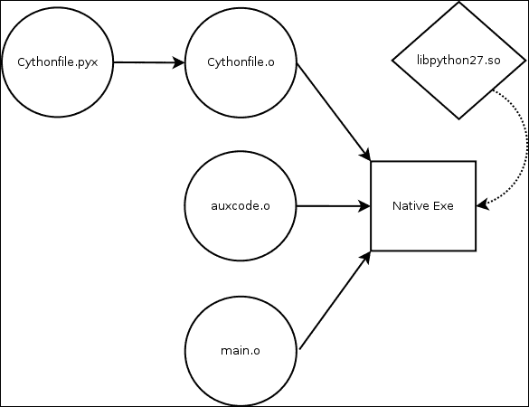
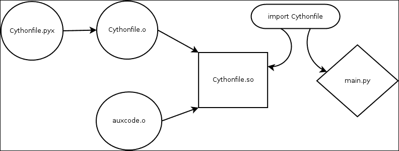

# 第二章。理解 Cython

如我之前提到的，有几种使用 Cython 的方法。由于基础知识对任何 Python 程序员来说都非常熟悉，因此在进入编程语言之前，回顾链接模型非常重要。这是使用 Cython 时驱动应用程序设计的原因。

接下来，我们将更熟悉 Cython 编程语言构造，即 `cdef` 和 `cpdef` 之间的区别。然后，我们将探讨如何通过直接与原生 C 类型接口来充分利用 Cython。在本书的后面部分，我们将看到可以使用原生 C++ STL 容器类型。这就是您将获得执行优化之处，因为不需要 Python 运行时来与原生类型一起工作。

最后，我们将看到与 C 和 Python 代码之间的回调操作是多么容易。这是一种有趣的技术，您可以使用它将逻辑从 C 代码卸载到 Python。

因此，在本章中，我们将深入探讨以下主题：

+   链接模型

+   Cython 关键字 – cdef

+   类型定义和函数指针

+   公共关键字

+   关键字 cpdef

+   从 C/C++ 到 Python 的日志记录

+   在 C/C++ 中使用 Python ConfigParser

+   从 Python 到 C/C++ 的回调

+   Cython PXD

+   与构建系统的集成

# 链接模型

在考虑如何扩展或嵌入原生应用程序时，链接模型非常重要。Cython 有两种主要的链接模型：

在 C/C++ 代码中完全嵌入 Python，如下面的截图所示：



使用将 Python 运行时嵌入到原生应用程序中的这种方法意味着您可以直接从 C/C++ 代码的任何位置启动代码执行，而不是像在第一章*Cython 不会咬人*中那样，我们必须运行 Python 解释器并调用导入来执行原生代码。

为了完整性，这里介绍了使用 Cython 的导入模型：



这将是 Cython 的更 Pythonic 方法，如果您的代码库主要是 Python，这将非常有帮助。在本书中，我们将在后面回顾 Python `lxml` 模块的一个示例，它提供了一个 Cython 后端，我们可以将其与原生 Python 后端进行比较，以审查两个代码库执行相同任务的速度和执行情况。

# Cython 关键字 – cdef

`cdef` 关键字告诉编译器此语句是原生 C 类型或原生函数。记得从第一章*Cython 不会咬人*中我们使用此行来声明 C 原型函数：

```py
cdef int AddFunction(int, int)
```

这是让我们使用 Python `def` 关键字将原生 C 函数包装成 Python 可调用对象的行。我们可以在许多上下文中使用它，例如，我们可以声明在函数内部使用的普通变量以加快执行速度：

```py
def square(int x):
    return x ** 2
```

这是一个简单的例子，但它会告诉编译器我们总是会平方一个整数。然而，对于正常的 Python 代码来说，这要复杂一些，因为 Python 在处理许多不同类型时必须担心精度丢失的问题。但在这个情况下，我们知道确切的类型以及如何处理它。

你可能也注意到这是一个简单的`def`函数，但由于它将被传递给 Cython 编译器，所以它将正常工作，并像预期的那样处理类型参数。

## 结构体

在 Cython 中可以直接处理 C 结构体。例如，这个头文件声明了一个简单的`struct`：

```py
#ifndef __MYCODE_H__
#define __MYCODE_H__

struct mystruct {
 char * string;
 int integer;
 char ** string_array;
};

extern void printStruct (struct mystruct *);

#endif //__MYCODE_H__
```

这个随机的`struct`将演示几个概念，包括处理数组。首先，我们必须在 Cython 中声明`struct`的布局。我们再次可以使用`cdef`块语法。该块内的所有内容都是`cdef`，并将包含指定的头文件，这在 Cython 编译器的输出通过 GCC 或 Clang 编译时很重要：

```py
cdef extern from "mycode.h":
 struct mystruct:
 char * string
 int integer
 char ** string_array
  void printStruct (mystruct *)
```

现在我们已经声明了`printStruct`函数的原型，我们可以使用这个函数来验证 Cython 作用域之外的数据。为了处理这个原始数据类型，我们将创建一个`testStruct` Python 可调用对象，我们将使用简单的 Python 导入来调用它：

```py
def testStruct ():
 cdef mystruct s
 cdef char *array [2]
    s.string = "Hello World"
 s.integer = 2
    array [0] = "foo"
    array [1] = "bar"
    s.string_array = array
 printStruct (&s)

```

让我们更仔细地看看。我们首先在栈上声明了一个`struct`实例。接下来，我们声明了一个大小为 2 的 C 字符串数组。接下来的几行将通过设置`struct`的每个成员的值而变得熟悉。但请注意，我们是在栈上声明了字符串数组，然后将字符串数组成员设置为这个实例。这很重要，因为 Cython 将依赖于程序员正确理解内存和栈与堆。但重要的是要注意，在语言之间传递字符串是完全微不足道的。

关于结构体的最后一个注意事项是在定义函数的`cdef`声明时。如果一个参数是结构体，你永远不要如下声明：

```py
  void myfunc (struct mystruct * x)
```

相反，我们简单地使用以下方法：

```py
  void myfunc (mystruct * x)
```

Cython 会自己处理。

`testStruct`函数有几个细微之处。在 Cython 中，我们有引用操作符"`&`"，它的工作方式与 C 相同。因此，在这个栈上的`struct`中，我们可以通过引用操作符传递指针，就像在 C 中一样。

注意，Cython 中没有"`→`"操作符。当访问`struct`内部的成员（即使它是一个指针）时，我们简单地使用"`.`"操作符。Cython 理解上下文并将处理它。

从前面的例子以及为了完整性考虑，我们可以简单地实现`printStruct`函数如下：

```py
#include <stdio.h>
#include "mycode.h"

void printStruct (struct mystruct * s)
{
    printf(".string = %s\n", s->string);
    printf(".integer = %i\n", s->integer);
    printf(".string_array = \n");

    int i;
    for (i = 0; i < s->integer; ++i)
        printf ("\t[%i] = %s\n", i, s->string_array [i]);
}
```

这表明即使我们从 Cython 代码中初始化 C 结构体，它也是一个有效的 C 类型。在下载的代码中简单地运行这个例子如下：

```py
$ cd chapter2/cpy-cdef-reference
$ make
$ python
>>> from mycodepy import testStruct
>>> testStruct ()
.string = Hello World
.integer = 2
.string_array =
 [0] = foo
 [1] = bar

```

这表明 Cython 可以与 C 结构体一起工作——它初始化了 C 结构体并分配了其数据成员，就像它来自 C 一样。

## 枚举

与 C 枚举的接口很简单。如果你在 C 中有以下的枚举：

```py
enum cardsuit {
   CLUBS,
   DIAMONDS,
   HEARTS,
   SPADES
};
```

然后，这可以表达为以下 Cython 声明：

```py
cdef enum cardsuit:
  CLUBS, DIAMONDS, HEARTS, SPADES
```

然后，在我们的代码中使用以下作为 `cdef` 声明：

```py
cdef cardsuit card = CLUBS
```

这是一个非常小的例子，但重要的是看到它是多么简单。

# `typedef` 和函数指针

在 C/C++ 代码中的 `typedef` 允许程序员给任何类型赋予一个新名称或别名。例如，可以将 `int` `typedef` 为 `myint`。或者你可以简单地 `typedef` 一个结构体，这样你就不必每次都使用 `struct` 关键字来引用结构体。例如，考虑以下 C `struct` 和 `typedef`：

```py
struct foobar {
  int x;
  char * y;
};
typedef struct foobar foobar_t;

```

在 Cython 中，这可以描述如下：

```py
cdef struct foobar:
    int x
    char * y
ctypedef foobar foobar_t

```

注意我们也可以 `typedef` 指针类型如下：

```py
ctypedef int * int_ptr

```

我们也可以 `typedef` C/C++ 函数指针，如下所示：

```py
typedef void (*cfptr) (int)
```

在 Cython 中，这将如下所示：

```py
ctypedef void (*cfptr)(int)
```

使用函数指针正如你所期望的那样：

```py
cdef cfptr myfunctionptr = &myfunc
```

这里有一些关于函数指针的魔法，因为直接从原始 Python 代码调用 Python 函数或反之亦然是不安全的。Cython 理解这种情况，并将为我们包装好以安全地调用。

# 公共关键字

在 Cython 中，这是一个非常强大的关键字。它允许任何带有 `public` 修饰符的 `cdef` 声明输出相应的 C/C++ 头文件，其中相对声明可以从 C/C++ 访问。例如，我们可以声明：

```py
cdef public struct CythonStruct:
    size_t number_of_elements;
    char ** elements;
```

一旦编译器处理了这个，你将得到一个 `cython_input.h` 的输出：

```py
 struct CythonStruct {
    size_t number_of_elements;
    char ** elements;
};
```

如果你要直接从 C 调用 Python 的 `public` 声明，主要的一个注意事项是，如果你的链接模型是完全嵌入的并且链接到 `libpython.so`，你需要使用一些样板代码来正确初始化 Python：

```py
#include <Python.h>

int main(int argc, char **argv) {
    Py_Initialize ();
    // code in here
    Py_Finalize ();
    return 0;
}
```

在调用该函数之前，如果你有一个 `cythonfile.pyx` 文件，你需要初始化 Python 模块 example，并按照以下方式编译具有 `public` 声明的代码：

```py
cdef public void cythonFunction ():
    print "inside cython function!!!"
```

你将不仅得到一个 `cythonfile.c` 文件，还会得到一个 `cythonfile.h` 文件，它声明了一个名为 `extern void initcythonfile (void)` 的函数。所以，在调用任何与 Cython 代码相关的内容之前，使用以下代码：

```py
/* Boiler plate init Python */
  Py_SetProgramName (argv [0]);
  Py_Initialize ();
  /* Init our config module into Python memory */
 initpublicTest ();
 cythonFunction ();

  /* cleanup python before exit ... */
  Py_Finalize ();
```

在调用函数之前，你可以将调用 `initcythonfile` 看作在 Python 中的以下操作：

```py
import cythonfile
```

就像之前的例子一样，这只会影响你如果正在生成一个完全嵌入的 Python 二进制文件。如果你只是编译一个本地模块，你将不需要执行此步骤。

# 关键字 cpdef

到目前为止，我们已经看到了 Cython 中的两种不同的函数声明，`def` 和 `cdef`，用于定义函数。还有一个声明——`cpdef`。`def` 是一个仅适用于 Python 的函数，因此它只能从 Python 或 Cython 代码块中调用；从 C 调用不起作用。`cdef` 是相反的；这意味着它可以从 C 调用，但不能从 Python 调用。例如，如果我们创建一个函数如下：

```py
cpdef public test (int x):
   …
 return 1

```

它将生成以下函数原型：

```py
__PYX_EXTERN_C DL_IMPORT(PyObject) *test(int, int __pyx_skip_dispatch);
```

`public` 关键字将确保我们生成所需的头文件，以便我们可以从 C 中调用它。从纯 Python 调用时，我们可以像使用任何其他 Python 函数一样处理它。使用 `cpdef` 的缺点是原生返回类型是 `PyObject *`，这要求你确切知道返回类型，并查阅 Python API 文档以访问数据。我更喜欢保持语言之间的绑定更简单，因为这对于 void 函数来说是可行的，并且会更简单。但如果你想要返回数据，可能会很令人沮丧。例如，从前面的代码片段中，如果我们知道我们返回的是 `int` 类型，我们可以使用以下代码：

```py
long returnValue = PyInt_AsLong (test (1, 0))
```

注意额外的参数 `__pyx_skip_dispatch`。由于这是一个实现特定的参数，将其设置为 `0`，你的调用应该按预期工作，将第一个参数作为指定的参数。我们使用 `long` 的原因是 Python 中的每个整数都表示为 `long`。你需要参考 [`docs.python.org/2/c-api/`](https://docs.python.org/2/c-api/) 来获取任何其他数据类型，以便从 `PyObject` 中获取数据。

注意，使用公共的 `cpdef` Cython 函数并不是一个好主意。是的，这意味着你创建了可以从 C/C++ 和 Python 中调用的函数，而且无需任何更改。但你失去了 Cython 可以提供的类型安全，这对于非常重要。

# 从 C/C++ 记录到 Python

将一切整合在一起的例子是直接从 C 中重用 Python 日志模块。我们希望有一些宏，例如 `info`、`error` 和 `debug`，它们可以处理可变数量的参数，并且像调用简单的 `printf` 方法一样工作。

为了实现这一点，我们必须为我们的 C/C++ 代码创建一个 Python 日志后端。我们需要一个初始化函数来告诉 Python 关于我们的输出 `logfile`，以及为每个 `info`、`error` 和 `debug` 编写一些包装器。我们可以简单地写出公共的 `cdef` 包装器如下：

```py
import logging

cdef public void initLoggingWithLogFile(const char * logfile):
 logging.basicConfig(filename = logfile,
 level = logging.DEBUG,
 format = '%(levelname)s %(asctime)s: %(message)s',
 datefmt = '%m/%d/%Y %I:%M:%S')

cdef public void python_info(char * message):
 logging.info(message)

cdef public void python_debug(char * message):
 logging.debug(message)

cdef public void python_error(char * message):
 logging.error(message)

```

记住，我们声明我们的公共函数为 `cdef`；如果它们只是 `def`，则不能从 C/C++ 中调用。我们可以通过使用 C99 `__VA_ARGS__`（这允许我们将可变数量的参数传递给函数，因此得名可变参数，这就是 `printf` 的工作方式）以及一个编译器属性来强制执行参数检查，就像使用 `printf` 函数族时从错误格式说明符获得的警告和错误一样。现在，我们可以声明并定义我们的 C API 以使用 Python 日志后端：

```py
#ifndef __NATIVE_LOGGING_H__
#define __NATIVE_LOGGING_H__
#define printflike __attribute__ ((format (printf, 3, 4)))

extern void printflike native_logging_info(const char *, unsigned, const char *, ...);
extern void printflike native_logging_debug(const char *, unsigned, const char *, ...);
extern void printflike native_logging_error(const char *, unsigned, const char *, ...);

#define info(...)  native_logging_info(__FILE__, __LINE__, __VA_ARGS__)
#define error(...) native_logging_debug(__FILE__, __LINE__, __VA_ARGS__)
#define debug(...) native_logging_error(__FILE__, __LINE__, __VA_ARGS__)

extern void SetupNativeLogging(const char * logFileName);
extern void CloseNativeLogging();

#endif // __NATIVE_LOGGING_H__
```

现在，我们需要填写这些函数中的每一个，从 `SetupNativeLogging` 开始：

```py
void SetupNativeLogging(const char * logFileName)
{
    /* Boiler plate init Python */
    Py_Initialize();

    /* Init our config module into Python memory */
    initPythonLoggingBackend();

    /* call directly into our cython module  */
    initLoggingWithLogFile(logFileName);
}
```

这个函数负责初始化 Python 和 Python 日志后端模块。这相当于 Python 中的 `import` 语句，但由于我们在 C 中处于主导地位，我们必须原生地加载它。以及相应的 `initLoggingWithLogFile`，以便记录器将输出到日志文件。我们可以通过使用 `va_list` 和 `vsprintf` 函数族将参数列表和格式转换为 C 字符串来打印，从而实现简单的 C `info`、`error` 和 `debug`：

```py
void native_logging_info(const char * file, unsigned line, const char * fmt, ...)
{
    char buffer[256];
    va_list args;
    va_start(args, fmt);
    vsprintf(buffer, fmt, args);
    va_end(args);

// append file/line information
    char buf[512];
    snprintf(buf, sizeof(buf), "%s:%i -> %s", file, line, buffer);

// call python logging.info
    python_info(buf);
}
```

现在我们已经将这些宏在 C 中调用它们各自的日志函数，我们只需要定义 `CloseNativeLogging`，这很简单，因为我们只需要关闭 Python：

```py
void CloseNativeLogging()
{
    /* cleanup python before exit ... */
    Py_Finalize();
}
```

通过将这些功能连接起来，我们就有了一种非常优雅的方式在 C/C++ 中使用 Python，就像它不是什么奇怪的事情：

```py
#include "NativeLogging.h"

int main(int argc, char **argv)
{
    // we want to ensure we use a command line argument for the output log file
    if (argc < 2) {
        return -1;
    }

    // use the first argument as log file
    SetupNativeLogging(argv[1]);

    // log out some stuff at different levels
    info("info message");
    debug("debug message");
    error("error message");

    // close up everything including Python
    CloseNativeLogging();

    return 0;
}
```

注意，这是 Cython 的完全嵌入链接模型。我决定将所有 Python 特定的代码包裹在实现中。你可以很容易地看到，你甚至可以从使用旧的遗留日志 API 迁移到使用 Python 日志，以便访问大量功能，例如日志记录到网络套接字。

运行这个示例，我们可以看到预期的输出：

```py
$ cd chapter2/PythonLogging
$ make
$ ./example output.log
$ cat output.log
INFO 10/25/2015 07:04:45: main.c:14 -> info message
ERROR 10/25/2015 07:04:45: main.c:15 -> debug message
DEBUG 10/25/2015 07:04:45: main.c-16 -> error message
```

真正令人高兴的是，我们能够从 C/C++ 代码中保留行信息到 Python 代码。这个示例使用了函数包装概念以及嵌入链接模型。在这个示例中没有使用特殊的编程技巧。

# 在 C/C++ 中使用 Python ConfigParser

我真的很喜欢 Python 的 `ConfigParser` API。我发现使用 INI 风格的配置文件比使用 XML 或 JSON 更易于阅读和操作。可用的跨平台库非常少。然而，当你有 Cython 时，你只需要 Python。

对于这个示例，我们将创建一个示例 `INI` 配置文件，并编写一个简单的 API 来访问部分列表、一个部分中可用的键列表，以及从指定键获取部分值的方法。这三个函数将允许程序员访问任何 `INI` 文件。

一个示例 INI 文件可以是：

```py
[example]
number = 15
path = some/path/to/something

[another_section]
test = something
```

INI 文件由方括号内的部分组成，后跟键和值。这是一种非常简单的配置方式。Python 的 API 允许根据 `ConfigParser` 的风味进行变量和替换。首先，我们需要一种查询 INI 文件中部分列表的方法：

```py
from ConfigParser import SafeConfigParser
from libc.stdlib cimport malloc

cdef public struct ConfigSections:
 size_t number_of_sections
 char ** sections

cdef public void ParseSectionsFromConfig(const char *config_path, ConfigSections * const sections):
    parser = SafeConfigParser()
    with open(config_path) as config_fd:
        try:
            parser.readfp(config_fd)
            sectionsInConfig = parser.sections()
            sections.number_of_sections = len(sectionsInConfig)
            sections.sections = <char **>malloc(sections.number_of_sections)
            for i in range(sections.number_of_sections):
                sections.sections[i] = sectionsInConfig[i]
        except:
            sections.number_of_sections = 0
            sections.sections = NULL
```

这里有几个需要注意的地方。首先，以下内容：

```py
cdef public struct ConfigSections
```

如我们所见，这个 `public struct` 声明将被输出到相应的头文件中。这意味着我们不需要在 C/C++ 代码中首先定义它：

```py
cdef public void ParseSectionsFromConfig(const char *config_path, ConfigSections * const sections):
```

这个函数设计用来接收配置文件的路径作为字符串。它还接收指向`struct ConfigSections`的指针。这个`ConfigSections`结构允许我们安全地将部分列表返回到 C 代码中。C 是一种非常简单的语言，没有像 C++ STL 库那样的优雅的变量长度结构。

因此，我们必须返回一个指向 C-String 列表的指针以及该列表中的字符串数量。由于这个结构作为参数传递，Cython 代码不需要分配和返回一个指针，这既不高效也不是这种小型结构的标准 C 方法。注意，我们确实需要分配字符串列表：

```py
sections.sections = <char **>malloc(sections.number_of_sections)
```

与 C++一样，Cython 代码在用 malloc 分配内存时需要显式类型转换。我们将在稍后复习这种类型转换语法，以便进行更高级的使用。接下来，我们需要实现：

```py
cdef public void ParseKeysFromSectionFromConfig(const char * config_path, const char * section, ConfigSectionKeys * keys):
```

最后，为了从部分内的键获取值：

```py
cdef public char * ParseConfigKeyFromSection(const char *config_path, const char * section, const char * key):
```

现在我们有了所有这些函数，我们可以编写 C 代码来遍历任何给定配置文件中的部分，并程序化地打印出所有内容，以展示这有多么强大：

```py
#include "PythonConfigParser.h"

static
void print_config(const char * config_file)
{
 struct ConfigSections sections;
 ParseSectionsFromConfig(config_file, &sections);

    size_t i;
    for (i = 0; i < sections.number_of_sections; ++i) {
        const char *current_section = sections.sections[i];
        printf("[%s]\n", current_section);

 struct ConfigSectionKeys sectionKeys;
 ParseKeysFromSectionFromConfig(config_file, current_section, &sectionKeys);

        size_t j;
        for (j = 0; j < sectionKeys.number_of_keys; ++j) {
            const char * current_key = sectionKeys.keys[j];
            char *key_value = ParseConfigKeyFromSection(config_file, current_section, current_key);

            printf("%s = %s\n", current_key, key_value);
        }
 free(sectionKeys.keys);
    }
 free(sections.sections);
}
```

使用在栈上传递已分配结构引用的技术，我们消除了大量的内存管理，但由于我们在每个结构内部的数组中分配了内存，我们必须释放它们。但请注意，我们可以简单地返回`ParseConfigKeyFromSection`的值：

```py
cdef public char * ParseConfigKeyFromSection(const char *config_path, const char * section, const char * key):
    parser = SafeConfigParser()
    with open(config_path) as config_fd:
        try:
            parser.readfp(config_fd)
 return parser.get(section, key)
        except:
            return NULL
```

### 注意

当从 Cython 函数返回 C 字符串时，我们不需要释放任何东西，因为这是由 Python 垃圾回收器管理的。能够从 Cython 返回这样的字符串感觉非常奇怪，但这样做是完全可行的。

运行这个示例，我们可以看到：

```py
$ cd Chapter2/PythonConfigParser
$ make
$ ./example sample.cfg
[example]
number = 15
path = some/path/to/something
[another_section]
test = something
```

你可以看到，我们成功地将所有部分、键和值从 INI 文件中程序化地解析出来。

# 从 Python 到 C/C++的回调

回调在异步系统中被广泛使用。例如，libevent 库提供了一个强大的异步核心来处理事件。让我们构建一个示例，将 C 函数作为回调设置到 Python 后端中，这将再次通知 C 代码。首先，我们将声明一个公共回调函数`typedef`：

```py
cdef public:
    ctypedef void (*callback)(int)
```

这将输出一个`callback`类型定义。接下来，我们可以在栈上声明一个全局`callback`：

```py
cdef callback GlobalCallback
```

一旦设置完成，我们就可以轻松地通知`callback`。接下来，我们需要一种设置`callback`的方法，以及一种调用`callback`的方法：

```py
cdef public void SetCallback(callback cb):
    global GlobalCallback
    GlobalCallback = cb
```

注意从 Python 传递过来的`global`关键字，编译器通过这个关键字知道使用`global`关键字，而不是在那个套件内部创建一个临时实例：

```py
cdef public void Notify(int value):
    global GlobalCallback
    if GlobalCallback != <callback>0:
        GlobalCallback(value)
```

`Notify`将接受一个参数并将这个参数传递给回调。同样，我们需要使用`global`关键字来确保编译器将使用正确的`global`关键字。再次使用类型转换，我们确保永远不会调用一个空的`callback`。接下来，我们需要在 C 代码内部声明一个`callback`：

```py
static
void MyCallback(int val)
{
    printf("[MYCALLBACK] %i\n", val);
}
```

然后，我们可以设置`callback`：

```py
SetCallback(&MyCallback);
```

最后，`Notify`：

```py
Notify(12345);
```

这是我们应该预期的输出：

```py
$ cd Chapter2/PythonCallbacks
$ make
$ ./example
[MYCALLBACK] 12345
```

之后，我们将更广泛地使用它来生成一个简单的 Python 消息代理。

# Cython PXD

PXD 文件的使用与 C/C++中的头文件非常相似。当编写任何 C/C++代码的绑定时，在`.pxd`文件中声明所有 C/C++接口是一种良好的做法。这代表**Python 外部声明**，至少在我的理解中是这样。因此，当我们添加如下块：

```py
cdef extern from "AddFunction.h":
    cdef int AddFunction(int, int)
```

我们可以将此直接放入一个`bindings.pxd`文件，并在任何`.pyx`文件中的任何时间导入此文件：

```py
cimport bindings
```

注意`cimport`用于`.pxd`文件和简单导入用于所有正常 Python 导入之间的区别。

### 小贴士

Cython 的输入文件名不能处理文件名中的连字符（`-`）。最好尝试使用驼峰命名法，因为在 Python 中不能使用`cimport my-import`。

# 与构建系统的集成

如果您选择共享库方法，此主题基本上取决于您选择的链接模型。我建议使用 Python `distutils`，如果您正在寻找嵌入式 Python，并且如果您喜欢 GNU 或 autotools，本节提供了一个您可以使用的示例。

## Python Distutils

当编译本地 Python 模块时，我们可以在`Setup.py`构建中使用`distutils`和`cythonize`。这是 Python 中使用 Cython 作为构建部分的首选方式：

```py
from distutils.core import setup
from Cython.Build import cythonize

setup(
    ext_modules = cythonize("sourcecode.pyx")
)
```

此构建文件将支持您使用脚本的任何 Python 版本。当您运行构建时，您的输出将与输入源代码的同一名称相同，在这种情况下是一个共享模块`sourcecode.so`。

## GNU/Autotools

要使用 autotools 构建系统在 C/C++应用程序中嵌入 Python 代码，以下代码片段将帮助您。它将使用`python-config`来获取编译器和链接器标志，以便完成此操作：

```py
found_python=no
AC_ARG_ENABLE(
 python,
 AC_HELP_STRING(--enable-python, create python support),
 found_python=yes
)
AM_CONDITIONAL(IS_PYTHON, test "x%found_python" = xyes)

PYLIBS=""
PYINCS=""
if test "x$found_python" = xyes; then
 AC_CHECK_PROG(CYTHON_CHECK,cython,yes)
   if test x"$CYTHON_CHECK" != x"yes" ; then
      AC_MSG_ERROR([Please install cython])
   fi
 AC_CHECK_PROG(PYTHON_CONF_CHECK,python-config,yes)
 PYLIBS=`python-config --libs`
 PYINCS=`python-config --includes`
   if test "x$PYLIBS" == x; then
      AC_MSG_ERROR("python-dev not found")
   fi
fi
AC_SUBST(PYLIBS)
AC_SUBST(PYINCS)

```

这将在您的配置脚本中添加`--enable-python`开关。现在，您有了 Cython 命令`found`以及`PYLIBS`和`PYINCS`变量，用于编译所需的编译标志。现在，您需要一个代码片段来了解如何在 automake 中编译源代码中的`*.pyx`文件：

```py
bin_PROGRAMS = myprog
ACLOCAL_AMFLAGS = -I etc
CFLAGS += -I$(PYINCS)

LIBTOOL_DEPS = @LIBTOOL_DEPS@
libtool: $(LIBTOOL_DEPS)
        $(SHELL) ./config.status libtool

SUFFIXES = .pyx
.pyx.c:
 @echo "  CPY   " $<
 @cython -2 -o $@ $<

myprog_SOURCES = \
        src/bla.pyx \
...
myprog_LDADD = \
 $(PYLIBS)

```

当您对代码的位置和链接模型感到舒适时，嵌入 Python 变得非常容易。

# 摘要

本章中有很多使用 Cython 的基本知识。在使用 Cython 时，回顾您想要实现的目标非常重要，因为它的不同使用方式会影响您设计解决方案的方式。我们研究了`def`、`cdef`和`cpdef`之间的区别。我们创建了公共 C/C++类型和可调用函数的声明。使用这些公共声明，我们展示了 Python 如何回调到 C 代码。对我来说，在本地代码中重用任何 Python 模块非常有用且有趣。我演示了如何从 C 代码中使用 Python 的`logging`和`ConfigParser`模块。欣赏这些简单的示例，我们将在下一章中看到如何使用 Python 代码扩展 C/C++项目。
