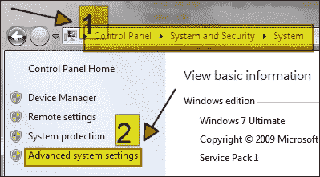
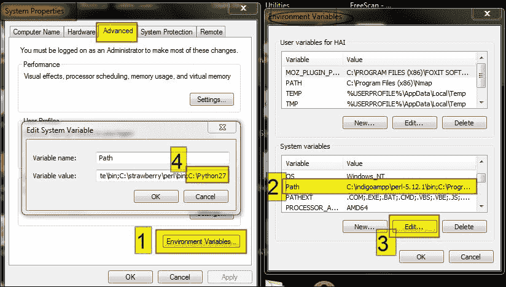
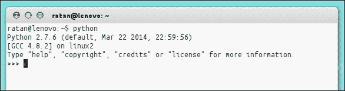
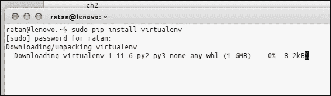
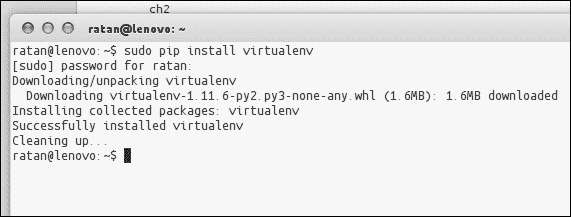
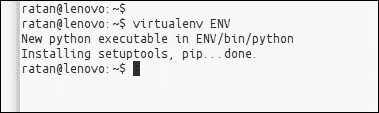
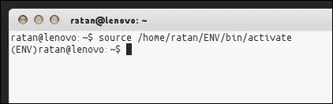
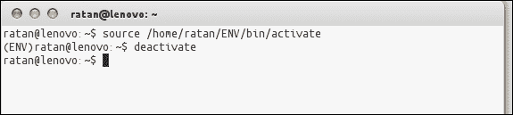
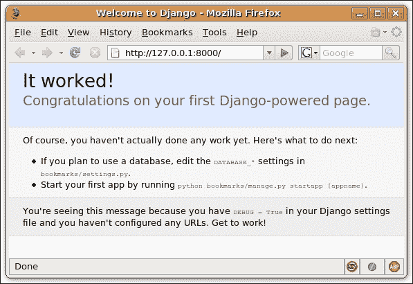

# 第二章：入门

Python 和 Django 适用于多个平台。在本章中，我们将看到如何在 UNIX/Linux、Windows 和 Mac OS X 上设置我们的开发环境。我们还将看到如何创建我们的第一个项目并将其连接到数据库。

在本章中，我们将涵盖以下主题：

+   安装 Python

+   安装 Django

+   安装数据库系统

+   创建您的第一个项目

+   设置数据库

+   启动开发服务器

# 安装所需的软件

我们的开发环境包括 Python、Django 和数据库系统。在接下来的章节中，我们将看到如何安装这些软件包。

## 安装 Python

Django 是用 Python 编写的，因此在设置我们的开发环境的第一步自然是安装 Python。Python 适用于各种操作系统，安装 Python 与安装其他软件包没有什么不同。但是，具体的步骤取决于您的操作系统。

安装时，您需要确保获得 Python 的最新版本。Django 需要 Python 2.7 或更高版本。Python 的最新版本是 3.x 的 3.4.2 和 2.x 版本的 2.7.9。

请阅读与您的操作系统相关的部分以获取安装说明。

### 在 Windows 上安装 Python

Python 有一个标准的 Windows 用户安装程序。只需前往[`www.python.org/download/`](https://www.python.org/download/)并下载最新版本。接下来，双击`.exe`或`.msi`文件，按照安装说明逐步进行安装。图形安装程序将指导您完成安装过程，并在“开始”菜单中创建 Python 可执行文件的快捷方式。

安装完成后，我们需要将 Python 目录添加到系统路径中，以便在使用命令提示符时可以访问 Python。要做到这一点，请按照以下步骤操作：

1.  打开控制面板。

1.  双击**系统和安全**图标或文本，然后查找**系统**（如在 Windows 7 中所示），如下截图所示：

1.  单击**高级系统设置**，将弹出一个窗口。

1.  单击**环境变量**按钮，将打开一个新的对话框。

1.  选择**Path**系统变量并编辑它。

1.  将 Python 安装路径追加为其值（默认路径通常为`c:\PythonXX`，其中`XX`是您的 Python 版本），如下截图所示：

如果要测试安装，请打开**运行**对话框，输入`python`，然后按*Enter*按钮。Python 交互式 shell 应该会打开。

### 注意

不要忘记使用分号(`;`)将新路径与之前的路径分隔开。

### 在 Unix/Linux 上安装 Python

如果您使用 Linux 或其他 Unix 版本，您可能已经安装了 Python。要检查，请打开终端，输入`python`，然后按*Enter*按钮。如果您看到 Python 交互式 shell，则已安装 Python。在终端中输入`python`后，您应该会得到以下输出：

```py
Python 2.7.6 (default, Mar 22 2014, 22:59:56) 
[GCC 4.8.2] on linux2 
Type "help", "copyright", "credits" or "license" for more information.

```



输出的第一行指示您系统上安装的版本（此处为 2.7.6）。

如果您看到错误消息而不是前面的输出，或者安装了旧版本的 Python，请继续阅读。

建议 Unix/Linux 用户通过系统的软件包管理器安装和更新 Python。尽管实际细节因系统而异，但与安装其他软件包没有什么不同。

对于基于 APT 的 Linux 发行版，如**Debian**和**Ubuntu**，打开终端并输入以下内容：

```py
$ sudo apt-get update
$ sudo apt-get install python

```

如果您有**Synaptic Package Manager**，只需搜索 Python，标记其安装包，并单击**应用**按钮。

其他 Linux 发行版的用户应查阅其系统文档，了解如何使用软件包管理器安装软件包。

### 在 Mac OS X 上安装 Python

Mac OS X 预装了 Python。但是，由于苹果的发布周期，通常是一个旧版本。如果您启动 Python 交互式 shell 并发现版本旧于 2.3，请访问[`www.python.org/download/mac/`](http://www.python.org/download/mac/)并下载适用于您的 Mac OS X 版本的新安装程序。

现在 Python 已经准备就绪，我们几乎可以开始了。接下来，我们将安装**virtualenv**。

## 安装 virtualenv

使用 virtualenv 可以创建一个隔离的 Python 环境。在开始阶段并不是很需要，但对于依赖管理来说是一个救命稻草（例如，如果您的一个 Web 应用程序需要库的一个版本，而另一个应用程序由于一些遗留或兼容性问题需要同一库的另一个版本，或者如果对一个库或应用程序所做的更改破坏了其他应用程序）。

Virtualenv 可以用来避免这种问题。它将创建自己的环境，这样就不会影响全局设置。它通常会创建自己的目录和共享库，以使 virtualenv 在没有任何外部干扰的情况下工作。如果你有**pip 1.3**或更高版本，请在全局安装。您可以使用以下命令安装 virtualenv：

```py
$ [sudo] pip install virtualenv

```



一旦完全下载，virtualenv 将如下所示：



### 注意

如果您尚未安装 pip，可以使用`sudo apt-get install python-pip`进行安装。

就这些了！现在您可以使用以下命令创建您的虚拟环境：

```py
$ virtualenv ENV

```



Virtualenv 有非常详细的在线文档，您在使用 virtualenv 时遇到任何问题都必须遵循。以下内容摘自在线文档：

> *这将创建`ENV/lib/pythonX.X/site-packages`，您安装的任何库都将放在这里。它还会创建`ENV/bin/python`，这是一个使用此环境的 Python 解释器。每次使用该解释器（包括当脚本中有`#!/path/to/ENV/bin/python`时），都将使用该环境中的库。*

我们可以在[`pypi.python.org/pypi/virtualenv/1.8.2`](https://pypi.python.org/pypi/virtualenv/1.8.2)找到 virtualenv 在线文档。

新的`virtualenv`文件夹还包括 pip 安装程序，因此您可以使用`ENV/bin/pip`命令将其他软件包安装到环境中。

### 注意

**激活脚本**：在新创建的虚拟环境中将有一个`bin/activate` shell 脚本。对于 Windows 系统，提供了**CMD**和**Powershell**的激活脚本。

您可以在以下网址阅读更多信息：

[`virtualenv.readthedocs.org/en/latest/virtualenv.html`](http://virtualenv.readthedocs.org/en/latest/virtualenv.html)

在 Unix 系统上，我们可以使用以下命令激活`virtualenv`脚本：

```py
$ source bin/activate

```



在 Windows 上，我们可以使用以下命令在命令提示符上激活`virtualenv`脚本：

```py
: > \path\to\env\Scripts\activate

```

输入`deactivate`来撤消更改，如下图所示：



这将更改您的`$PATH`变量。

要了解有关激活脚本的更多信息，例如您正在使用哪个环境或是否需要激活脚本，请访问以下链接：

[`virtualenv.readthedocs.org/en/latest/virtualenv.html`](http://virtualenv.readthedocs.org/en/latest/virtualenv.html)

## 安装 Django

安装 Django 非常简单，但在某种程度上取决于您的操作系统。由于 Python 是一种平台无关的语言，Django 有一个包可以在任何操作系统上使用。

要下载 Django，请访问[`www.djangoproject.com/download/`](http://www.djangoproject.com/download/)并获取最新的官方版本。本书中的代码是在 Django 1.7（本文撰写时的最新版本）上开发的，但大部分代码应该可以在以后的官方版本上运行。接下来，按照与您的平台相关的说明进行操作。

### Django 与操作系统的兼容性- Windows 与 Linux

在处理操作系统时，有一些要注意的地方。在运行 Django 之前，许多软件包和设置需要进行调整，以确保没有任何问题。让我们来看看它们：

+   一些 Python 软件包在 Windows 上无法正确安装，或者根本无法安装；如果可以安装，当您运行 Django 时会带来很多麻烦

+   如果您需要部署 Django 应用程序，最好使用类 Unix 系统，因为 99%的情况下，您的部署环境是相同的

+   如果您的应用程序很复杂，获取所需的依赖项会更容易，无论是 Linux 中的扩展，库等等

### 在 Windows 上安装 Django

在下载了 Django 存档之后，将其解压到 C 驱动器，并打开命令提示符（从**开始** | **附件**）。现在，通过发出以下命令，将当前目录更改为您从中提取 Django 的位置：

```py
c:\>cd c:\Django-x.xx

```

这里，`x.xx`是您的 Django 版本。

接下来，通过运行以下命令来安装 Django（您需要管理员权限）：

### 注意

如果您的系统没有处理`.tar.gz`文件的程序，我建议使用**7-Zip**，它是免费的，可以在[`www.7-zip.org/`](http://www.7-zip.org/)上获得。

```py
c:\Django-x.xx>python setup.py install

```

如果由于某种原因前面的说明没有起作用，您可以手动将存档中的`django`文件夹复制到 Python 安装目录中的`Lib\site-packages`文件夹中。这将执行`setup.py`安装命令的工作。

最后一步是将`Django-x.xx\django\bin`中的`django-admin.py`文件复制到系统路径的某个位置，例如`c:\windows`或您安装 Python 的文件夹。

完成后，您可以安全地删除`c:\Django-x.xx`文件夹，因为它不再需要了。

就是这样！要测试您的安装，请打开命令提示符并输入以下命令：

```py
c:\>django-admin.py --version

```

如果您在屏幕上看到 Django 的当前版本，则一切都已设置好。

### 在 Unix/Linux 和 Mac OS X 上安装 Django

所有 Unix 和 Linux 系统的安装说明都是相同的。您需要在`Django-x.xx.tar.gz`存档所在的目录中运行以下命令。这些命令将为您提取存档并安装 Django：

```py
$ tar xfz Django-x.xx.tar.gz
$ cd Django-x.xx
$ sudo python setup.py install

```

前面的说明应该适用于任何 Unix/Linux 系统，以及 Mac OS X。但是，如果您的系统有 Django 的软件包，通过系统的软件包管理器安装 Django 可能会更容易。Ubuntu 有一个；因此，要在 Ubuntu 上安装 Django，只需在 Synaptic 中查找一个名为`python-django`的软件包，或者运行以下命令：

```py
$ sudo apt-get install python-django

```

您可以通过运行以下命令来测试您的安装：

```py
$ django-admin.py --version

```

如果您在屏幕上看到 Django 的当前版本，则一切都已设置好。

## 安装数据库系统

虽然 Django 不需要数据库来运行，但我们将要开发的应用程序需要。因此，在软件安装的最后一步，我们将确保我们有一个数据库系统来处理我们的数据。

值得注意的是，Django 支持多种数据库引擎：**MySQL**、**PostgreSQL**、**MS SQL Server**、**Oracle**和**SQLite**。然而，有趣的是，您只需要学习一个 API 就可以使用任何这些数据库系统。这是可能的，因为 Django 的数据库层抽象了对数据库系统的访问。我们稍后会学习这一点，但是现在，您只需要知道，无论您选择哪种数据库系统，您都可以运行本书（或其他地方）开发的 Django 应用程序而无需修改。

如果您使用 Python 2.7 或更高版本，则无需安装任何内容。Python 2.7 带有名为`sqlite3`的 SQLite 数据库管理系统模块。与客户端-服务器数据库系统不同，SQLite 不需要内存中的常驻进程，并且它将数据库存储在单个文件中，这使其非常适合我们的开发环境。

如果您没有 Python 2.7，您可以通过在[`www.pysqlite.org/`](http://www.pysqlite.org/)（Windows 用户）下载或通过您的软件包管理器（Unix/Linux）手动安装 SQLite 的 Python 模块。

另一方面，如果您的系统上已经安装了另一个受 Django 支持的数据库服务器，您也可以使用它。我们将在后面的部分中看到，通过编辑配置文件，我们可以告诉 Django 使用哪个数据库系统。

### 提示

**我不需要 Apache 或其他网络服务器吗？**

Django 自带自己的网络服务器，在开发阶段我们将使用它，因为它轻量级且预先配置了 Django。但是，Django 也支持 Apache 和其他流行的网络服务器，如 lighttpd、nginx 等。我们将在本书后面的部分中看到，当我们准备部署应用程序时，如何配置 Django 以适用于 Apache。

数据库管理器也是一样。在开发阶段，我们将使用 SQLite，因为它易于设置，但是当我们部署应用程序时，我们将切换到诸如 MySQL 之类的数据库服务器。

正如我之前所说的，无论我们使用什么组件，我们的代码都将保持不变；Django 会处理与网络和数据库服务器的所有通信。

# 创建您的第一个项目

现在，我们已经准备好了所需的软件，是时候进行有趣的部分了——创建我们的第一个 Django 项目了！

如果您还记得 Django 安装部分，我们使用了一个名为`django-admin.py`的命令来测试我们的安装。这个实用程序是 Django 项目管理设施的核心，因为它使用户能够执行一系列项目管理任务，包括以下内容：

+   创建一个新项目

+   创建和管理项目的数据库

+   验证当前项目并测试错误

+   启动开发网络服务器

我们将在本章的其余部分看到如何使用这些任务。

## 创建一个空项目

要创建您的第一个 Django 项目，请打开终端（或 Windows 用户的命令提示符；即**开始** | **运行** | **cmd**），然后输入以下命令。然后，按*Enter*。

```py
$ django-admin.py startproject django_bookmarks

```

这个命令将在当前目录中创建一个名为`django_bookmarks`的文件夹，并在其中创建初始目录结构。让我们看看创建了哪些类型的文件：

```py
django_bookmarks/
|-- django_bookmarks
|   |-- __init__.py
|   |-- settings.py
|   |-- urls.py
|   `-- wsgi.py
`-- manage.py
```

以下是这些文件的快速解释：

+   `__init__.py`：Django 项目是 Python 包，这个文件是必需的，用于告诉 Python 这个文件夹应该被视为一个包。

Python 术语中的包是模块的集合，它们用于将类似的文件分组在一起，以防止命名冲突。

+   `manage.py`：这是另一个用于管理我们项目的实用脚本。您可以将其视为项目版本的`django-admin.py`文件。实际上，`django-admin.py`和`manage.py`共享相同的后端代码。

+   `settings.py`：这是您的 Django 项目的主要配置文件。在其中，您可以指定各种选项，包括数据库设置、站点语言、需要启用的 Django 功能等。在接下来的章节中，我们将解释此文件的各个部分，但在本章中，我们只会看到如何输入数据库设置。

+   `url.py`：这是另一个配置文件。您可以将其视为 URL 和处理它们的 Python 函数之间的映射。这个文件是 Django 的强大功能之一，我们将在下一章中看到如何利用它。

当我们开始为应用程序编写代码时，我们将在项目文件夹内创建新文件；因此该文件夹也用作我们代码的容器。

现在您已经对 Django 项目的结构有了一个大致的了解，让我们配置我们的数据库系统。

## 设置数据库

在本节中，我们将开始使用各种选项和配置文件设置数据库。

好了，现在我们已经准备好了源代码编辑器，让我们打开项目文件夹中的`settings.py`文件并查看其内容：

```py
"""
Django settings for django_bookmarks project.

For more information on this file, see
https://docs.djangoproject.com/en/1.7/topics/settings/

For the full list of settings and their values, see
https://docs.djangoproject.com/en/1.7/ref/settings/
"""

# Build paths inside the project like this: os.path.join(BASE_DIR, ...)
import os
BASE_DIR = os.path.dirname(os.path.dirname(__file__))

# Quick-start development settings - unsuitable for production
# See https://docs.djangoproject.com/en/1.7/howto/deployment/checklist/

# SECURITY WARNING: keep the secret key used in production secret!
SECRET_KEY = ')9c8g--=vo2*rh$9f%=)=e+@%7e%xe8jptgpfe+(90t7uurfy0'

# SECURITY WARNING: don't run with debug turned on in production!
DEBUG = True

TEMPLATE_DEBUG = True

ALLOWED_HOSTS = []

# Application definition

INSTALLED_APPS = (
    'django.contrib.admin',
    'django.contrib.auth',
    'django.contrib.contenttypes',
    'django.contrib.sessions',
    'django.contrib.messages',
    'django.contrib.staticfiles',
)

MIDDLEWARE_CLASSES = (
    'django.contrib.sessions.middleware.SessionMiddleware',
    'django.middleware.common.CommonMiddleware',
    'django.middleware.csrf.CsrfViewMiddleware',
    'django.contrib.auth.middleware.AuthenticationMiddleware',
    'django.contrib.auth.middleware.SessionAuthenticationMiddleware',
    'django.contrib.messages.middleware.MessageMiddleware',
    'django.middleware.clickjacking.XFrameOptionsMiddleware',
)

ROOT_URLCONF = 'django_bookmarks.urls'

WSGI_APPLICATION = 'django_bookmarks.wsgi.application'

# Database
# https://docs.djangoproject.com/en/1.7/ref/settings/#databases

DATABASES = {
    'default': {
        'ENGINE': 'django.db.backends.sqlite3',
        'NAME': os.path.join(BASE_DIR, 'db.sqlite3'),
    }
}

# Internationalization
# https://docs.djangoproject.com/en/1.7/topics/i18n/

LANGUAGE_CODE = 'en-us'

TIME_ZONE = 'UTC'

USE_I18N = True

USE_L10N = True

USE_TZ = True

# Static files (CSS, JavaScript, Images)
# https://docs.djangoproject.com/en/1.7/howto/static-files/

STATIC_URL = '/static/'
```

您可能已经注意到，该文件包含许多控制应用程序各个方面的变量。输入变量的新值就像执行 Python 赋值语句一样简单。此外，该文件有大量注释，注释详细解释了变量的控制内容。

现在让我们关注配置数据库。如前所述，Django 支持多个数据库系统，因此首先，我们必须指定我们将要使用的数据库系统。这由`DATABASE_ENGINE`变量控制。如果您已安装 SQLite，请将该变量设置为`'sqlite3'`。否则，请从变量名称旁边的注释中选择与您的数据库引擎匹配的值。

接下来是数据库名称。保持数据库名称默认即可。另一方面，如果您正在使用数据库服务器，您需要执行以下操作：

+   输入数据库的相关信息：用户名、密码、主机和端口。（SQLite 不需要这些。）

+   在数据库服务器内创建实际数据库，因为 Django 不会自行执行此操作。例如，在 MySQL 中，可以通过`mysql`命令行实用程序或 phpMyAdmin 来执行此操作。

最后，我们将告诉 Django 使用表填充已配置的数据库。虽然我们尚未为我们的数据创建任何表（并且在下一章之前也不会这样做），但 Django 需要数据库中的一些表才能正常运行一些功能。创建这些表就像发出以下命令一样简单：

```py
$ python manage.py syncdb

```

如果一切正确，状态消息将在屏幕上滚动，指示正在创建表。在提示输入超级用户帐户时，请输入您首选的用户名、电子邮件和密码。另一方面，如果数据库配置错误，将打印错误消息以帮助您排除问题。

完成这些操作后，我们就可以启动我们的应用程序了。

### 提示

**使用 python manage.py**

运行以`python manage.py`开头的命令时，请确保您当前位于项目的目录中，其中包含`manage.py`。

## 启动开发服务器

如前所述，Django 带有一个轻量级的 Web 服务器，用于开发和测试应用程序。该服务器预先配置为与 Django 一起工作，并且更重要的是，每当您修改代码时，它都会重新启动。

要启动服务器，请运行以下命令：

```py
$ python manage.py runserver

```

接下来，打开浏览器，导航至以下 URL：`http://localhost:8000/`。您应该会看到欢迎消息，如下截图所示：



恭喜！您已经创建并配置了您的第一个 Django 项目。这个项目将是我们构建书签应用程序的基础。在下一章中，我们将开始开发我们的应用程序，网页服务器显示的页面将被我们自己编写的内容替换！

### 注意

您可能已经注意到，默认情况下，Web 服务器在端口 8000 上运行。如果要更改端口，可以使用以下命令在命令行上指定：

```py
$ python manage.py runserver <port number>

```

此外，默认情况下，开发服务器只能从本地机器访问。如果您想从网络上的另一台机器访问开发服务器，请使用以下命令行参数：

```py
$ python manage.py runserver 0.0.0.0:<port number>

```

### 提示

**下载示例代码**

您可以从您在[`www.packtpub.com`](http://www.packtpub.com)的帐户中下载您购买的所有 Packt 图书的示例代码文件。如果您在其他地方购买了这本书，您可以访问[`www.packtpub.com/support`](http://www.packtpub.com/support)并注册，以便直接通过电子邮件接收文件。

# 总结

在这一章中，我们已经准备好了我们的开发环境，创建了我们的第一个项目，并学会了如何启动 Django 开发服务器。我们学会了如何在 Windows 和 Linux 中安装 Django 和 virtualenv。我们学习了 Django 设置的基本机制，甚至学会了如何安装数据库。

现在我们准备开始构建我们的社交书签应用程序！下一章将带您了解主要的 Django 组件，并为我们的书签分享应用程序开发一个工作原型。这将是一个有趣的章节，有很多新东西要学习，所以请继续阅读！
