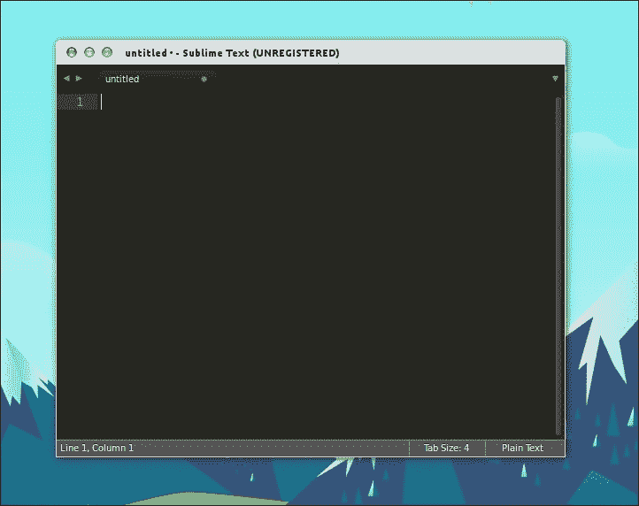
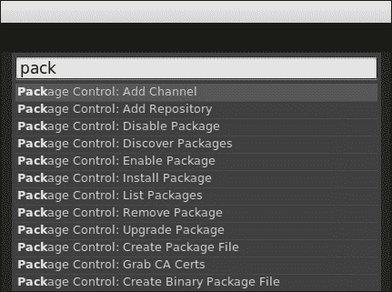
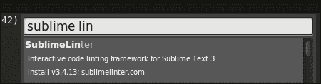
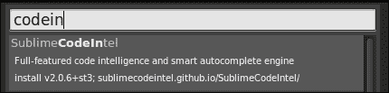
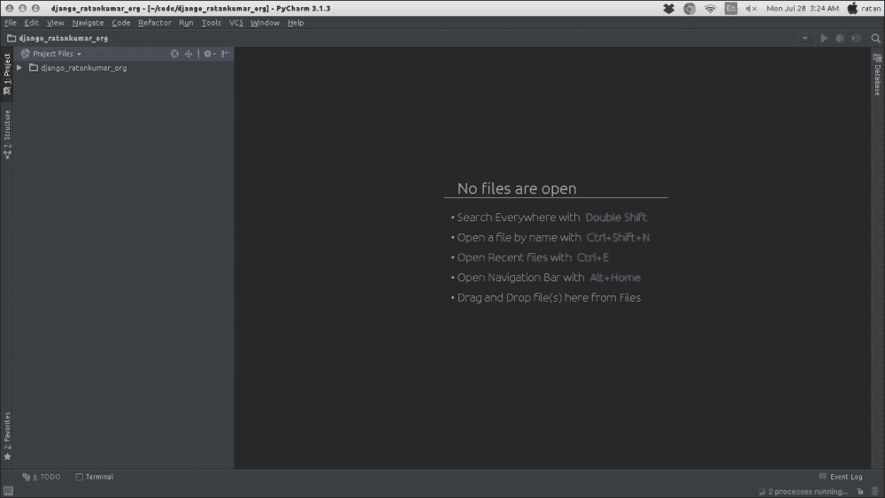
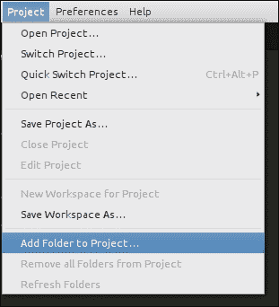
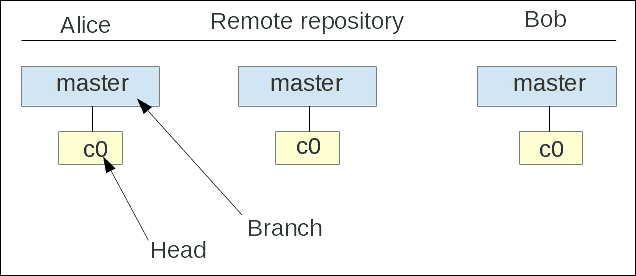
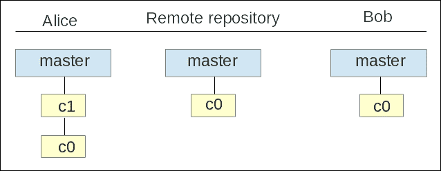
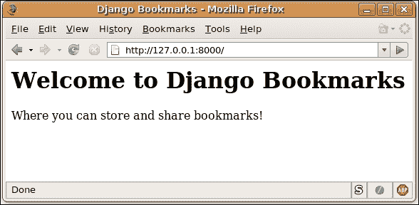

# 第三章：Django 中的代码风格

由于您来自 Python 背景，您可能已经编写了大量的代码，并且当然也享受过。

Python 代码易于维护，并且适用于小型项目或解决任何竞争性编程比赛；您可以通过将 Python 代码存储在本地或存储在公共文件夹中来实现。但是，如果您正在进行协作项目，特别是 Web 开发，那么这将使一切与传统编码不同。这不仅需要纪律，比如遵循项目的代码语法，还可能需要为您的代码编写大量的文档。在使用任何版本控制工具，比如 GIT 时，您的提交消息（在让其他开发人员更容易理解您正在做什么或已经完成的工作方面起着重要作用）也会广播项目的当前进展。

本章将涵盖您需要遵循的所有基本主题，比如更好的 Django Web 开发的编码实践，使用哪个 IDE，版本控制等等。

我们将在本章学习以下主题：

+   Django 编码风格

+   使用 IDE 进行 Django Web 开发

+   Django 项目结构

+   最佳实践——使用版本控制

+   Django 救援团队（在哪里提问 Django 问题）

+   更快的 Web 开发——使用 Twitter-Bootstrap

### 注意

本章基于一个重要事实，即代码被阅读的次数远远多于被编写的次数。因此，在您真正开始构建项目之前，我们建议您熟悉 Django 社区为 Web 开发采用的所有标准实践。

# Django 编码风格

Django 的大部分重要实践都是基于 Python 的。虽然您可能已经知道它们，但我们仍然会停下来写出所有记录的实践，以便您在开始之前就了解这些概念。当然，在构建项目时，您可以回到本章快速查看。

为了使标准实践成为主流，Python 增强提案被提出，其中一个被广泛采用的开发标准实践是 PEP8，Python 代码的风格指南——Guido van Rossum 编写的 Python 代码的最佳风格。

文档中说道，“PEP8 处理与 Python 文档字符串相关的语义和约定。”更多阅读，请访问[`legacy.python.org/dev/peps/pep-0008/`](http://legacy.python.org/dev/peps/pep-0008/)。

## 理解 Python 中的缩进

当你编写 Python 代码时，缩进起着非常重要的作用。它就像其他语言中的块，比如 C 或 Perl。但是程序员们总是在讨论是否应该使用制表符还是空格，以及如果使用空格，应该使用多少——两个、四个还是八个。使用四个空格进行缩进比使用八个更好，如果有更多的嵌套块，使用八个空格进行每次缩进可能会占用更多字符，无法在单行中显示。但是，这又是程序员的选择。

以下是错误的缩进实践导致的结果：

```py
>>> def a():
...   print "foo"
...     print "bar"
IndentationError: unexpected indent

```

那么，我们应该使用哪个：制表符还是空格？

选择其中一个，但在同一个项目中不要混合使用制表符和空格，否则维护起来会是一场噩梦。Python 中最流行的缩进方式是使用空格；制表符排在第二位。如果你遇到了混合使用制表符和空格的代码，你应该将其转换为只使用空格。

### 正确的缩进——我们是否需要每次缩进级别四个空格？

关于这个问题已经有很多混淆，当然，Python 的语法都是关于缩进的。坦率地说：在大多数情况下，确实是这样。因此，强烈建议每个缩进级别使用四个空格，如果你一直使用两个空格的方法，就停止使用它。这没有错，但是当你处理多个第三方库时，你可能最终会得到一个不同版本的代码混乱，最终会变得难以调试。

现在是缩进的问题。当你的代码在一个连续的行中时，你应该垂直对齐，或者你可以选择悬挂缩进。当你使用悬挂缩进时，第一行不应包含任何参数，进一步的缩进应该用来清楚地区分它作为一个连续的行。

### 注意

悬挂缩进（也称为负缩进）是一种缩进风格，其中所有行都缩进，除了段落的第一行。前面的段落就是悬挂缩进的例子。

以下示例说明了在编写代码时应该如何使用适当的缩进方法：

```py
bar = some_function_name(var_first, var_second,
 var_third, var_fourth) 
# Here indentation of arguments makes them grouped, and stand clear from others.
def some_function_name(
 var_first, var_second, var_third,
 var_fourth):
 print(var_first)
# This example shows the hanging intent.

```

我们不鼓励以下编码风格，而且在 Python 中也不起作用：

```py
# When vertical alignment is not used, Arguments on the first line are forbidden
foo = some_function_name(var_first, var_second,
 var_third, var_fourth)
# Further indentation is required as indentation is not distinguishable between arguments and source code.
def some_function_name(
 var_first, var_second, var_third,
 var_fourth):
 print(var_first)

```

虽然不需要额外的缩进，但如果你想使用额外的缩进来确保代码能够工作，你可以使用以下编码风格：

```py
# Extra indentation is not necessary.
if (this
 and that):
 do_something()

```

### 提示

理想情况下，你应该将每行限制在最多 79 个字符。这允许使用`+`或`–`字符来查看使用版本控制的差异。为了编辑器的统一性，最好将行限制在 79 个字符。你可以利用剩余的空间做其他用途。

### 空行的重要性

两个空行和单个空行的重要性如下：

+   **两个空行**：双空行可以用于分隔顶层函数和类定义，从而增强代码的可读性。

+   **单个空行**：单个空行可以用于以下用例--例如，类中的每个函数可以用单个空行分隔，相关函数可以用单个空行分组。你也可以用单个空行分隔源代码的逻辑部分。

## 导入一个包

导入一个包是代码可重用的直接影响。因此，总是将导入放在源文件的顶部，紧跟在任何模块注释和文档字符串之后，在模块的全局和常量变量之前。每个导入通常应该在单独的行上。

导入包的最佳方式如下：

```py
import os
import sys

```

不建议在同一行中导入多个包，例如：

```py
import sys, os

```

你可以按照以下方式导入包，尽管这是可选的：

```py
from django.http import Http404, HttpResponse

```

如果你的导入变得更长，你可以使用以下方法来声明它们：

```py
from django.http import (
Http404, HttpResponse, HttpResponsePermanentRedirect
)

```

### 分组导入的包

包的导入可以按以下方式分组：

+   **标准库导入**：比如`sys`，os，`subprocess`等。

```py
import re
import simplejson

```

+   **相关的第三方导入**：这些通常是从 Python 奶酪商店下载的，也就是**PyPy**（使用 pip install）。这里有一个例子：

```py
from decimal import *

```

+   **本地应用/特定库的导入**：这包括你项目的本地模块，比如模型，视图等。

```py
from models import ModelFoo
from models import ModelBar

```

## Python/Django 的命名约定

每种编程语言和框架都有自己的命名约定。Python/Django 中的命名约定大体上是一样的，但是值得在这里提一下。在创建变量名或全局变量名以及命名类、包、模块等时，你需要遵循这个约定。

这是我们应该遵循的常见命名约定：

+   **正确命名变量**：永远不要使用单个字符，例如，'x'或'X'作为变量名。这在你平常的 Python 脚本中可能没问题，但是当你构建一个 web 应用程序时，你必须适当地命名变量，因为它决定了整个项目的可读性。

+   **包和模块的命名**：建议模块使用小写和短名称。如果使用下划线可以提高可读性，则可以使用下划线。Python 包也应具有短小写名称，尽管不鼓励使用下划线。

+   由于模块名称映射到文件名（`models.py`，`urls.py`等），因此选择模块名称要相当简短是很重要的，因为一些文件系统不区分大小写并且会截断长名称。

+   **命名类**：类名应遵循**CamelCase**命名约定，内部使用的类可以在其名称中加上下划线。

+   **全局变量名称**：首先，应避免使用全局变量，但如果需要使用它们，可以通过`__all__`来防止全局变量被导出，或者通过在名称中定义带有前缀下划线的方式（旧的传统方式）。

+   **函数名称和方法参数**：函数名称应为小写，并用下划线分隔，`self`作为实例化方法的第一个参数。对于类或方法，使用 CLS 或对象进行初始化。

+   **方法名称和实例变量**：使用函数命名规则，必要时使用下划线分隔单词以提高可读性。仅对非公共方法和实例变量使用一个前导下划线。

# 使用 IDE 进行更快的开发

在源代码编辑器方面市场上有很多选择。有些人喜欢全功能的集成开发环境（IDE），而其他人喜欢简单的文本编辑器。选择完全取决于您；选择您感觉更舒适的。如果您已经使用某个程序来处理 Python 源文件，我建议您继续使用，因为它将与 Django 一起很好地工作。否则，我可以提出一些建议，比如这些：

+   **SublimeText**：这个编辑器非常轻巧而功能强大。它适用于所有主要平台，支持语法高亮和代码补全，并且与 Python 兼容。该编辑器是开源的，您可以在[`www.sublimetext.com/`](http://www.sublimetext.com/)找到它

+   **PyCharm**：我要说，这是最智能的代码编辑器，具有高级功能，如代码重构和代码分析，使开发更清洁。Django 的功能包括模板调试（这是一个赢家），还有快速文档，因此这种查找对于初学者来说是必不可少的。社区版是免费的，您可以在购买专业版之前试用 30 天。

# 使用 Sublime 文本编辑器设置您的项目

本书中大多数示例将使用**Sublime 文本编辑器**编写。在本节中，我们将展示如何安装和设置 Django 项目。

1.  **下载和安装**：您可以从网站[www.sublimetext.com](http://www.sublimetext.com)的下载选项卡下载 Sublime。单击下载文件选项进行安装。

1.  **为 Django 设置**：Sublime 拥有非常庞大的插件生态系统，这意味着一旦您下载了编辑器，就可以安装插件以添加更多功能。

安装成功后，它将如下所示：



### 注意

最重要的是**Package Control**，它是在 Sublime 内直接安装附加插件的管理器。这将是您唯一手动安装的软件包。它将处理其余的软件包安装。



使用 Sublime 进行 Python 开发的一些建议如下：

+   **Sublime Linter**：在您编写 Python 代码时，它会立即提供有关代码的反馈。它还支持 PEP8；此插件将实时突出显示我们在前一节中讨论的有关更好编码的内容，以便您可以修复它们。

+   **Sublime CodeIntel**：这是由**SublimeLint**的开发人员维护的。Sublime CodeIntel 具有一些高级功能，例如直接跳转到定义，智能代码完成和导入建议。

您还可以探索其他 Sublime 插件，以提高您的生产力。

# 设置 PyCharm IDE

您可以使用任何您喜欢的 IDE 进行 Django 项目开发。我们将在本书中使用 pycharm IDE。建议使用此 IDE，因为它将在调试时帮助您使用断点，这将节省您大量时间弄清楚实际出了什么问题。

以下是如何安装和设置**pycharm** IDE 用于 Django：

1.  **下载和安装**：您可以从以下链接检查功能并下载 pycharm IDE：

[`www.jetbrains.com/pycharm/`](http://www.jetbrains.com/pycharm/)



1.  **为 Django 设置**：为 Django 设置 pycharm 非常容易。您只需导入项目文件夹并提供`manage.py`路径，如下图所示：

# Django 项目结构

Django 项目结构在 1.6 版本中已更改。Django（`django-admin.py`）还有一个`startapp`命令来创建一个应用程序，因此现在是时候告诉您 Django 中应用程序和项目之间的区别了。

**项目**是一个完整的网站或应用程序，而**应用程序**是一个小型的、独立的 Django 应用程序。应用程序基于这样一个原则，即它应该做一件事，并且做得正确。

为了简化从头开始构建 Django 项目的痛苦，Django 通过自动生成基本项目结构文件来为您提供优势，从而可以将任何项目推进到其开发和功能添加阶段。

因此，总之，我们可以说项目是应用程序的集合，应用程序可以作为一个独立实体编写，并且可以轻松地导出到其他应用程序以供重用。

要创建您的第一个 Django 项目，请打开终端（或 Windows 用户的命令提示符），输入以下命令，然后按*Enter*：

```py
$ django-admin.py startproject django_mytweets

```

此命令将在当前目录中创建一个名为`django_mytweets`的文件夹，并在其中创建初始目录结构。让我们看看创建了哪些类型的文件。

新结构如下：

```py
django_mytweets///
django_mytweets/
manage.py
```

这是`django_mytweets/`的内容：

```py
django_mytweets/
__init__.py
settings.py
urls.py
wsgi.py
```

以下是这些文件的快速解释：

+   `django_mytweets`（外部文件夹）：此文件夹是项目文件夹。与以前的项目结构相反，在以前的项目结构中，整个项目都保存在一个文件夹中，新的 Django 项目结构在某种程度上暗示着每个项目都是 Django 中的一个应用程序。

这意味着您可以在与 Django 项目相同的级别上导入其他第三方应用程序。此文件夹还包含`manage.py`文件，其中包括所有项目管理设置。

+   `manage.py`：这是用于管理我们的项目的实用程序脚本。您可以将其视为项目版本的`django-admin.py`。实际上，`django-admin.py`和`manage.py`共享相同的后端代码。

### 注意

当我们要调整更改时，将提供有关设置的进一步澄清。

让我们看看`manage.py`文件：

```py
#!/usr/bin/env python
import os
import sys
if __name__ == "__main__":
    os.environ.setdefault("DJANGO_SETTINGS_MODULE", "django_mytweets.settings")
    from django.core.management import execute_from_command_line
    execute_from_command_line(sys.argv)
```

一旦阅读以下代码解释，`manage.py`文件的源代码将不言自明。

```py
#!/usr/bin/env python

```

第一行只是声明接下来的文件是一个 Python 文件，然后是导入部分，其中导入了`os`和`sys`模块。这些模块主要包含与系统相关的操作。

```py
import os
import sys
```

下一段代码检查文件是否由主函数执行，这是要执行的第一个函数，然后将 Django 设置模块加载到当前路径。由于您已经在运行虚拟环境，这将为所有模块设置路径为当前运行虚拟环境的路径。

```py
if __name__ == "__main__":
    os.environ.setdefault("DJANGO_SETTINGS_MODULE", "django_mytweets.settings")
django_mytweets/ ( Inner folder)
__init__.py
```

Django 项目是 Python 包，这个文件是必需的，用于告诉 Python 这个文件夹应该被视为一个包。在 Python 的术语中，包是模块的集合，它们用于将类似的文件分组在一起，并防止命名冲突。

+   `settings.py`：这是 Django 项目的主要配置文件。在其中，您可以指定各种选项，包括数据库设置、站点语言、需要启用的 Django 功能等。在接下来的章节中，随着我们构建应用程序的进展，将解释该文件的各个部分。

默认情况下，数据库配置为使用 SQLite 数据库，这是用于测试目的的建议使用。在这里，我们将只看到如何在设置文件中输入数据库；它还包含基本的设置配置，并且在`manage.py`文件中稍作修改，它可以被移动到另一个文件夹，比如`config`或`conf`。

要使每个其他第三方应用程序成为项目的一部分，我们需要在`settings.py`文件中注册它。`INSTALLED_APPS`是一个包含所有已安装应用程序条目的变量。随着项目的增长，管理起来变得困难；因此，`INSTALLED_APPS`变量有三个逻辑分区，如下所示：

+   `DEFAULT_APPS`：此参数包含默认的 Django 已安装应用程序（如管理员）

+   `THIRD_PARTY_APPS`：此参数包含其他应用程序，比如**SocialAuth**，用于社交认证

+   `LOCAL_APPS`：此参数包含您创建的应用程序

+   `url.py`：这是另一个配置文件。您可以将其视为 URL 和 Django 视图函数之间的映射。这个文件是 Django 更强大的功能之一，我们将在下一章中看到如何利用它。

当我们开始为我们的应用程序编写代码时，我们将在项目文件夹内创建新文件。因此，该文件夹也作为我们代码的容器。

现在您对 Django 项目的结构有了一个大致的了解，让我们配置我们的数据库系统。

# 最佳实践 - 使用版本控制

版本控制是一个系统，它会记住您在项目中所做的所有更改，随着您的不断进展。在任何时间点，您都可以查看对特定文件所做的更改；随着时间的推移，您可以还原它或进一步编辑它。

对于具有多个贡献者的项目，特别是那些同时在同一文件上工作的项目，版本控制更有意义。版本控制是一个救命稻草，因为它记录了文件的各个版本，并允许选项，比如通过合并或丢弃任一副本来保存两个版本。

我们将使用分布式版本控制，也就是说，每个开发人员都有项目的完整副本（与子版本控制相反，其中存储库托管在系统服务器上）。

## Git - 最新和最流行的版本控制工具

**Git**是我们将用于项目的版本控制工具。它是目前最好的版本控制工具，也是开源的。Git 除了源代码文件外，还可以很好地处理其他类型的文件，比如图像、PDF 等。您可以从以下网址下载 Git：

[`git-scm.com/downloads`](http://git-scm.com/downloads)

大多数现代集成开发环境已经内置了版本控制系统支持；像 PyCharm、Sublime 这样的 IDE 已经有了可以将 Git 集成到工作目录中的插件。Git 可以使用`git`命令从终端初始化，并且您可以使用`git --help`命令查看它提供的更多选项。

### Git 的工作原理

作为开发人员，我们有一个与远程服务器（通常称为存储库）同步的本地项目副本，并且可以将其发送到远程存储库。当其他开发人员想要将更改推送到远程存储库时，他们必须首先拉取您的更改。这最大程度地减少了中央存储库上的冲突机会，其中每个开发人员都是同步的。整个工作流程在下一节中显示。

### 设置您的 Git

任何项目都可以添加到 Git 进行版本控制，将文件夹创建为 Git 存储库。要做到这一点，使用以下命令：

+   `$git init`：如果要复制现有的 Git 存储库，这可能是您的朋友已经在**GitHub**或**Bitbucket**上托管了它的情况，请使用以下命令：

+   `$git clone URL`：远程存储库的 URL，如[`github.com/AlienCoders/web-development.git`](https://github.com/AlienCoders/web-development.git)。

**暂存区**：暂存区是您在提交文件之前必须首先列出所有文件的地方。简而言之，暂存是需要作为中间步骤而不是直接提交的，因为当发生冲突时，它们会在暂存区中标记。只有在冲突解决后才能提交文件。

让我们看看以下命令及其用途：

+   `$git add <file-name>`或`$git add`：用于批量将所有文件添加到暂存区。

+   `$git status`：了解您的工作目录的状态，已添加哪些文件，哪些文件尚未添加。

+   `$git diff`：获取已修改和已暂存的状态，或者获取已修改但尚未暂存的状态。

+   `$ git commit -m`：要提交所做的更改，首先必须将它们添加到暂存区；然后，您必须使用此命令提交它们。

+   `$ git rm <file-name>`：如果您错误地将任何文件添加到暂存区，可以使用此命令从暂存区中删除它。

+   `$git stash`: Git 不跟踪重命名的文件。换句话说，如果您已经重命名了已经暂存的文件，您将不得不再次将它们添加到暂存区，然后提交。您可以通过使用以下命令将更改保存到存储库而不实际提交。

+   `$git stash apply`：它将所有当前更改保存到堆栈中。然后，您可以继续使用您的更改。一旦您有能力获取您保存的更改，您可以使用此命令。

### Git 中的分支

版本控制的另一个概念是**分支**（Git）。分支就像您的提交路径，默认情况下，所有提交都在主分支上进行。分支主要用于跟踪项目中的功能。每个功能都可以作为分支进行工作；一旦功能完成，就可以将其合并回主分支。

分支的基本工作流程是这样的：您最初有一个主分支，并为每个新功能创建一个新分支。更改将提交到新分支，一旦完成功能，您可以将其合并回主分支。这可以用以下方式直观表示：

+   `$git branch`：要列出使用 Git 的现有分支，我们需要使用此命令。

+   `git checkout -b <new-branch-name>`：使用此命令可以在现有存储库中创建一个新分支。我们可以通过以下块图逻辑地看到它的外观：

您将收到一条消息，通知您已切换到新分支。如果要切换回旧分支，可以使用以下命令：

+   `$git checkout <old-branch-name>`：您将看到消息`切换到分支<old-branch-name>`。

+   `$git merge <branch-name>`：功能完成后，您可以使用此命令将其合并到您选择的分支。这将分支`<branch-name>`合并到当前分支。要将更改同步回`<branch-name>`，您可以从当前分支切换到分支`<branch-name>`并再次合并。您还可以使用标签在提交历史中标记重要的点。

+   提交后，您可以使用`$git tag -a v1.0`命令标记重要的提交。

+   要从远程服务器获取新更改，您可以使用`$git fetch`命令从 Git 中获取更改。

+   将更改直接合并到当前分支，您可以使用`$git pull`命令。

+   完成更改后，您可以使用`$git push`命令将其提交并推送到远程存储库。

# 设置数据库

在本节中，我们将首次开始使用代码。因此，我们将不得不选择一个源代码编辑器来输入和编辑代码。您可以使用任何您喜欢的源代码编辑器。如前所述，我们已经使用 Sublime 文本编辑器来编写本书的代码。

好了，现在您已经准备好一个源代码编辑器，让我们打开项目文件夹中的`settings.py`并查看其中包含的内容：

```py
# Django settings for django_mytweets project.
DEBUG = True
TEMPLATE_DEBUG = DEBUG
ADMINS = (
    # ('Your Name', 'your_email@domain.com'),
)
MANAGERS = ADMINS
DATABASE_ENGINE = ''   # 'postgresql_psycopg2', 'postgresql',
                       # 'mysql', 'sqlite3' or 'ado_mssql'.
DATABASE_NAME = ''     # Or path to database file 
                       # if using sqlite3.
DATABASE_USER = ''     # Not used with sqlite3.
DATABASE_PASSWORD = '' # Not used with sqlite3.
DATABASE_HOST = ''     # Set to empty string for localhost.
                       # Not used with sqlite3.
DATABASE_PORT = ''     # Set to empty string for default.
                       # Not used with sqlite3.
```

`settings.py`文件中还有许多行，但我们已经削减了此文件的其余内容。

您可能已经注意到，该文件包含许多控制应用程序各个方面的变量。输入变量的新值就像执行 Python 赋值语句一样简单。此外，该文件有大量注释，并且注释详细解释了变量控制的内容。

现在让我们关注配置数据库。如前所述，Django 支持多个数据库系统，因此，首先，我们必须指定要使用的数据库系统。这由`DATABASE_ENGINE`变量控制。如果安装了 SQLite，请将变量设置为`sqlite3`。否则，从变量名称旁边的注释中选择与您的数据库引擎匹配的值。

接下来是数据库名称。我们将为您的数据库选择一个描述性名称；编辑`DATABASE_NAME`并将其设置为`django_mytweetsdb`。如果您使用 SQLite，这就是您需要做的。另一方面，如果您使用数据库服务器，请按照以下说明操作：

+   输入数据库的相关信息-用户名、密码、主机和端口（SQLite 不需要这些）。

+   在数据库服务器中创建实际数据库，因为 Django 不会自行执行此操作。例如，在 MySQL 中，可以通过`mysql`命令行实用程序或`phpMyAdmin`来完成此操作。

进行这些简单的编辑后，`settings.py`中的数据库部分现在如下所示：

```py
DATABASE_ENGINE = 'sqlite3'
DATABASE_NAME = 'django_mytweetsdb'
DATABASE_USER = ''
DATABASE_PASSWORD = ''
DATABASE_HOST = ''
DATABASE_PORT = ''
```

最后，我们将告诉 Django 使用表填充配置的数据库。尽管我们尚未为我们的数据创建任何表（直到下一章我们才会这样做），但 Django 需要数据库中的一些表才能正常运行一些功能。创建这些表就像发出以下命令一样简单：

```py
$ python manage.py syncdb

```

如果一切正确，状态消息将在屏幕上滚动，指示正在创建表。在提示超级用户帐户时，请输入您首选的用户名、电子邮件和密码。另一方面，如果数据库配置错误，将打印错误消息以帮助您排除故障。

完成后，我们准备启动我们的应用程序。

### 注意

**使用 python manage.py**

运行以`python manage.py`开头的命令时，请确保您当前位于项目的目录中，其中包含`manage.py`文件。

# 启动开发服务器

如前所述，Django 带有一个轻量级的 Web 服务器，用于开发和测试应用程序。该服务器预先配置为与 Django 一起工作，更重要的是，每当您修改代码时，它都会重新启动。

要启动服务器，请运行以下命令：

```py
$ python manage.py runserver

```

接下来，打开浏览器并导航到此 URL：`http://localhost:8000/`。您应该会看到欢迎消息，如下面的截图所示：



恭喜！您已经创建并配置了您的第一个 Django 项目。这个项目将是我们构建书签应用程序的基础。在下一章中，我们将开始开发我们的应用程序，Web 服务器显示的页面将被我们自己编写的内容替换！

正如您可能已经注意到的，Web 服务器默认在端口`8000`上运行。如果要更改端口，可以使用以下命令在命令行上指定：

```py
$ python manage.py runserver <port number>

```

此外，默认情况下，开发服务器只能从本地机器访问。如果要从网络上的另一台机器访问开发服务器，请使用以下命令行参数：

```py
$ python manage.py runserver 0.0.0.0:<port number>

```

# 更快的 Web 开发

在 Web 开发中，对 Web 项目成功起到重要帮助的一件事是其用户界面和用户体验。尽管 Django 在后端处理所有业务逻辑，但无疑需要一个令人敬畏的前端设计框架，不仅可以在编码时简化开发人员的生活，而且还可以增强整个 Web 项目的用户体验。因此，我们选择在这里解释**Twitter Bootstrap**。

## 最小化的 Bootstrap

**Bootstrap**是一个完整的前端框架，超出了本书的范围，无法让您熟悉它的每个方面。您一定会想知道为什么我们会在 Django 书中讨论 Bootstrap。您被告知了一个前端框架。这里的想法是帮助您构建一个可以直接用于生产的 Web 应用程序，并且您将部署到**AWS**和**Heroku**等云中。一旦您完成本书，您需要您的项目达到生产级别。因此，通过尽可能简化 Bootstrap，您仍然可以构建一个外观出色的 Django Web 应用程序。

有许多种方法可以根据排列和组合来布置您的网页。为了帮助您了解这一点，我们将看一些例子。

**线框**是 Web 开发的第一步，这意味着它必须处理页面上内容的位置。如果您已经了解了 Web 设计的基础知识，那么这一部分对您来说将更有意义。如果没有，请先阅读一些内容，以对 Web 开发有一个基本的了解。查找`div`和`span`之间的区别，然后一切都会对您有意义。您可以从这里了解更多信息：[`developer.mozilla.org/en-US/Learn/HTML`](https://developer.mozilla.org/en-US/Learn/HTML)。Bootstrap 基本页面线框分为行和列；每列进一步分为 12 个部分。通过这些子部分，您可以使用排列来设计您的布局。

当我们从开发人员的角度看网站时，我们注意到的第一件事是使用的线框。例如，当您访问[www.facebook.com](http://www.facebook.com)时，您会在页面中央看到您的新闻订阅，左侧是其他重要链接（例如消息、页面和群组的链接）。在右侧，您会看到可以聊天的朋友。

在 Bootstrap 中可以想象相同的布局为 2-8-2。左侧链接的列将是“2 列”，新闻订阅将是“8 列”，聊天部分将是“2 列”。这是一个基本的线框。

### 提示

请记住，总和始终必须为 12，因为 Bootstrap 中的活动流体网格系统是基于 12 列网格原则的，以获得更好和更灵活的布局。

现在，Bootstrap 不仅用于使网页响应式-它还有许多其他组件可以使网页看起来更好，更清洁。

要在 Django 中使用 Bootstrap，有两种方式：

+   **Django 方式**：`pip install django-bootstrap3`

+   **手动方式**：下载 Bootstrap 资源并将其复制到静态位置

### Django 方式

如果您想使用命令安装 Bootstrap，则必须将`settings.py`文件中的`INSTALLED_APPS`变量附加到`bootstrap3`。

以下是使用此方法的简单 HTML 表单的示例 Django 模板：

```py


<form action="action_url">
    
    
    
        <button type="submit" class="btn btn-primary">
             SUBMIT
        </button>
    
</form>
```

### 提示

要了解更多并进行探索，您可以参考以下链接：

[`django-bootstrap3.readthedocs.org/`](http://django-bootstrap3.readthedocs.org/)

### 手动安装 Bootstrap

这种方法适合初学者，但一旦你有信心，你可以通过遵循命令方法来快捷操作。

在这里，我们将学习项目文件的基本包含，并且其余内容将在即将到来的章节中涵盖。一旦您从在线来源（[`getbootstrap.com`](http://getbootstrap.com)）下载了 Bootstrap，解压后的文件夹结构看起来像这样：

```py
|-- css 
|   |-- bootstrap.css 
|   |-- bootstrap.css.map 
|   |-- bootstrap.min.css 
|   |-- bootstrap-theme.css 
|   |-- bootstrap-theme.css.map 
|   `-- bootstrap-theme.min.css 
|-- fonts 
|   |-- glyphicons-halflings-regular.eot 
|   |-- glyphicons-halflings-regular.svg 
|   |-- glyphicons-halflings-regular.ttf 
|   `-- glyphicons-halflings-regular.woff 
`-- js 
 |-- bootstrap.js 
 `-- bootstrap.min.js 

```

Django 中使用的本地文件约定有两种类型：一种是“静态”，另一种是“媒体”。静态文件指的是项目的资产，如 CSS，JavaScript 等。媒体文件是项目中上传的文件，主要包括图片，用于显示或下载的视频等。

通过将以下行添加到`setting.py`文件中，可以将静态文件添加到您的项目中：

```py
STATICFILES_DIRS = (
    # put absolute path here as string not relative path.
    # forward slash to be used even in windows.
    os.path.join(
        os.path.dirname(__file__),
        'static',
    ),
)
```

现在，您只需要在项目目录中创建一个文件夹，并复制所有 Bootstrap 资源。

# 总结

在本章中，我们准备了开发环境，创建了我们的第一个项目，设置了数据库，并学会了如何启动 Django 开发服务器。我们学习了为我们的 Django 项目编写代码的最佳方式，并了解了默认的 Django 项目结构。我们学习了命名约定，空行的重要性，以及我们应该使用哪种导入风格以及在哪里使用。

我们看到了哪种编辑器和哪种 IDE 更适合基于 Python 和 Django 的 Web 开发。我们学会了如何使用 Git 来保持我们的代码在存储库中更新。我们学习了一些关于 Bootstrap 来进行前端开发。

下一章将带您了解主要的 Django 组件，并帮助开发我们的 Twitter 应用程序的工作原型。这将是一个有趣的章节，有许多新东西要学习，所以请继续阅读！
