# 第四章：构建类似 Twitter 的应用程序

在之前的章节中，我们学习了编写代码的更好方法。牢记这些要点，现在是时候开始真正的 Django 项目开发，并了解视图、模型和模板。

本章中每个部分的第一部分将介绍基础知识以及特定主题中的工作原理。这将包括适当的实践、标准方法和重要术语。

每个部分的第二部分将是我们的 mytweets Django 应用程序开发中该概念的应用。第一部分可以被视为主题的章节描述，第二部分可以被视为我们的 Django 项目形式的练习，这将是一个独特的学习体验。

本章涵盖以下主题：

+   关于 Django 术语的说明

+   设置基本模板应用程序

+   创建 Django 项目的模板结构

+   设置应用程序的基本引导

+   创建主页

+   介绍基于类的视图

+   我们的 mytweets 项目的 Django 设置

+   生成用户页面

+   设计初始数据库模式

+   用户注册和账户管理

+   为主页创建模板

# 关于 Django 术语的说明

Django 是一个 MVC 框架。但是，在整个代码中，控制器被称为**视图**，视图被称为**模板**。Django 中的视图是检索和操作数据的组件，而模板是向用户呈现数据的组件。因此，有时称 Django 为**模型模板视图**（**MTV**）框架。这种不同的术语既不改变 Django 是一个 MVC 框架的事实，也不影响应用程序的开发方式，但请记住这些术语，以避免可能的混淆，如果您以前使用过其他 MVC 框架。

您可以将本章视为主要 Django 组件的深入介绍。您将学习如何使用视图创建动态页面，如何使用模型存储和管理数据库中的数据，以及如何使用模板简化页面生成。

在学习这些功能的同时，您将对 Django 组件如何工作和相互交互形成一个坚实的理解。随后的章节将更深入地探讨这些组件，因为我们开发更多功能并将它们添加到我们的应用程序中。

# 设置基本模板应用程序

我们的项目将是一个微博网站，每个用户都将有一个公共页面，其中将显示他们发布的时间轴。

在看到开发服务器的欢迎页面后，首先想到的是如何更改它。要创建我们自己的欢迎页面，我们需要定义一个 URL 形式的应用程序入口点，并告诉 Django 在访问此 URL 时调用特定的 Python 函数。我们将自己编写这个 Python 函数，并让它显示我们自己的欢迎消息。

本节基本上是对我们在上一章中进行的配置的重做，但意图是将所有说明放在一起，以便项目引导需要更少的页面查找。

## 创建虚拟环境

我们将使用以下命令设置 Django 的虚拟环境，以使其正常工作：

```py
$ virtualenv django_env

```

输出如下：

```py
New python executable in django_env/bin/python
Installing setuptools, pip...done.

```

我们现在需要激活虚拟环境并设置所有环境变量，以便所有 Python 安装都将被路由到此环境目录，而不会影响其他设置：

```py
$ source django_env/bin/activate

```

输出如下：

```py
(django_env)ratan@lenovo:~/code$

```

# 安装 Django

虽然您已经安装了 Django，但我们将再次进行安装，因为 Django 将由`virtualenv`管理，其他项目或用户（或您自己）在其他地方工作时不会被搞乱。

```py
$pip install django

```

您可能会收到以下错误：

```py
bad interpreter: No such file or directory

```

如果是这样，请在不带空格的路径中创建您的虚拟环境。很可能，在您创建虚拟环境的位置存在一个包含空格的目录，例如，`/home/ratan/folder name with space$virtualenv django_env`。

如果是这样，请将目录名称更改为以下内容：

`/home/ratan/folder_name_with_no_space$virtualenv django_env`

我们可以使用命令`pip install django`继续进行 Django 安装。

输出将如下所示：

```py
Downloading/unpacking django
Downloading Django-1.6.5-py2.py3-none-any.whl (6.7MB): 6.7MB downloaded
Installing collected packages: django
Successfully installed django
Cleaning up...

```

现在，在我们开始创建 Django 应用程序之前，我们将确保 Git 已安装。使用以下命令查找我们安装的 Git 版本：

```py
$git --version

```

输出将如下所示：

```py
git version 1.9.1

```

这证实了我们已安装了 Git。当然，你一定想知道我们是否会在这个项目中使用版本控制。答案是肯定的：随着项目的进行，我们将对大部分项目文件进行版本控制。

## 创建 Django 项目的模板结构

在本节中，我们将为项目创建结构，例如，为我们的项目创建一个名为`mytweets`的文件夹，安装所需的包等。运行以下命令：

```py
$django-admin.py startproject mytweets

```

这将创建名为`mytweets`的文件夹，我们将使用它作为我们的项目目录。在当前文件夹中，我们看到两个子文件夹：`environment`和`mytweets`。现在的问题是我们是否要对我们的环境文件夹进行版本控制。我们不会，因为这些文件非常特定于您当前的系统。它们不会帮助任何人设置与我们相同的环境。然而，在 Python 中还有另一种方法：使用`pip freeze`命令。这实际上会拍摄您的 Django 应用程序中当前安装的所有库的快照，然后您可以将该列表保存在文本文件中并进行版本控制。因此，您的同事开发人员可以下载相同版本的库。这真的是一种 Pythonic 的做法，不是吗？

您安装新包的最常见方法是使用`pip`命令。`pip install`命令有三个版本，如下所示：

```py
$ pip install PackageName

```

这是默认设置，并安装包的最新版本：

```py
$ pip install PackageName==1.0.4

```

使用`==`参数，您可以安装特定版本的包。在这种情况下，即 1.0.4。使用以下命令安装带有版本号的包：

```py
$ pip install 'PackageName>=1.0.4' # minimum version

```

当您不确定要安装的包版本但有一个想法需要库的最低版本时，请使用上述命令。

使用`pip`命令安装库非常容易。您只需在命令行中输入以下内容即可：

```py
$pip install -r requirements.txt

```

现在我们需要冻结当前项目的库：

```py
$pip freeze > requirements.txt

```

此命令会冻结项目中当前安装的库以及版本号（如果指定），并将它们存储在名为`requirements.txt`的文件中。

在我们项目的这个阶段，`pip freeze`命令将看起来像这样。

```py
Django==1.6.5
argparse==1.2.1
wsgiref==0.1.2
```

要将这些库与项目一起安装回您的新环境中，我们可以运行以下命令：

```py
$pip install -r requirements.txt

```

因此，我们可以继续初始化我们的代码目录作为 Git 仓库，并将当前路径更改为`$cd mytweets`。执行以下命令在项目文件夹中构建 Git 仓库：

```py
$git init

```

输出将如下所示：

```py
Initialized empty Git repository in /home/ratan/code/mytweets/.git/

```

如果我们在基于 Linux 的系统上运行所有命令以获取详细的目录列表，我们可以看到以下输出：

```py
...
drwxrwxr-x 7 ratan ratan 4096 Aug 2 16:07 .git/
...
```

这是`.git`文件夹，根据其命名约定（以点开头），它在目录的正常列表中是隐藏的，即存储所有 Git 相关文件（如分支、提交、日志等）的目录。删除该特定目录将使您的目录无 Git（无版本控制）并且与您当前系统中的任何其他目录一样正常。

我们可以使用以下命令将当前目录中的所有文件添加到暂存区：

```py
$git add .

```

使用以下命令进行项目的第一次提交：

```py
$git commit -m "initial commit of the project."

```

输出将如下所示：

```py
[master (root-commit) 597b6ec] initial commit of the project.
5 files changed, 118 insertions(+)
create mode 100755 manage.py
create mode 100644 mytweets/__init__.py
create mode 100644 mytweets/settings.py
create mode 100644 mytweets/urls.py
create mode 100644 mytweets/wsgi.py
```

第一行（这里是主分支）表示我们在主分支中，接下来的是被提交的文件。

到目前为止，我们已经设置了基本的 Django 模板并将其添加到了版本控制中。可以使用以下命令验证相同的事情：

```py
$git log

```

输出将如下所示：

```py
commit 597b6ec86c54584a758f482aa5a0f5781ff4b682
Author: ratan <mail@ratankumar.org>
Date: Sat Aug 2 16:50:37 2014 +0530
initial commit of the project.

```

有关设置作者和为远程存储库推送生成`SSH`密钥的说明，请参阅以下链接：

[`help.github.com/articles/set-up-git`](https://help.github.com/articles/set-up-git)

[`help.github.com/articles/generating-ssh-keys`](https://help.github.com/articles/generating-ssh-keys)

# 为应用程序设置基本的 Twitter Bootstrap

如前一章介绍的，bootstrap 是用户界面设计的基本框架。我们将继续使用前面提到的第二种方法，即手动下载 bootstrap 文件并将其链接到静态文件夹中。

我们跳过的方法意味着我们不会执行以下命令：

```py
$pip install django-bootstrap3

```

有关此实现的详细文档，请参阅[`django-bootstrap3.readthedocs.org/`](http://django-bootstrap3.readthedocs.org/)。

我们将要遵循的方法是下载 bootstrap 文件并将其放置在项目的静态文件夹中。

要开始使用 bootstrap，我们必须从以下官方 bootstrap 网址下载静态文件：

[`getbootstrap.com/`](http://getbootstrap.com/)

当您访问此链接时，您将找到一个下载按钮。单击**下载**，然后单击**下载 Bootstrap**。这将以压缩格式提供 bootstrap 资源文件。下载的文件将具有类似`bootstrap-3.2.0-dist.zip`的名称。解压此 zip 文件的内容。解压后，文件夹`bootstrap-3.2.0-dist`的结构如下：

```py
|-- css
| |-- bootstrap.css
| |-- bootstrap.css.map
| |-- bootstrap.min.css
| |-- bootstrap-theme.css
| |-- bootstrap-theme.css.map
| |-- bootstrap-theme.min.css
|-- fonts
| |-- glyphicons-halflings-regular.eot
| |-- glyphicons-halflings-regular.svg
| |-- glyphicons-halflings-regular.ttf
| |-- glyphicons-halflings-regular.woff
|-- js
|-- bootstrap.js
|-- bootstrap.min.js
```

特定于应用程序的静态文件存储在应用程序的`static`子目录中。

Django 还会查找`STATICFILES_DIRS`设置中列出的任何目录。让我们更新项目设置，指定`settings.py`文件中的静态文件目录。

我们可以更新项目的`setting.py`文件如下以使用 Twitter bootstrap：

```py
STATICFILES_DIRS = (
os.path.join(
os.path.dirname(__file__),
'static',
),
)
```

这里，`static`变量将是我们将保存 bootstrap 文件的文件夹。我们将在当前项目目录内创建`static`文件夹，并将所有解压缩的 bootstrap 文件复制到该文件夹中。

出于开发目的，我们将保持大多数设置不变，例如默认数据库 SQLite；稍后在部署测试应用程序到 MySQL 或我们选择的任何其他数据库时，我们可以将其移动。

在我们实际在项目中使用 bootstrap 之前，我们必须了解一些基本概念，以理解 bootstrap 作为前端框架。

Bootstrap 基于网格系统设计网页，该网格有三个主要组件，如下：

+   **容器**：容器用于为整个网页提供基础，通常，bootstrap 的所有组件将是容器的直接或嵌套子对象。换句话说，容器为响应式宽度提供宽度约束。当屏幕分辨率更改时，容器会在设备屏幕上改变其宽度。行和列是基于百分比的，因此它们会自动修改。

容器还为内容提供了来自浏览器边缘的填充，以便它们不会触及视图区域的边缘。默认填充为 15 像素。您永远不需要在容器内部放置另一个容器。以下图片显示了容器的结构：

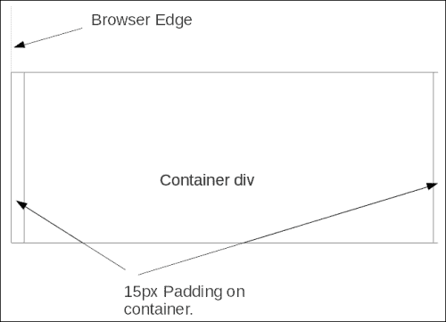

+   **行**：行放置在容器内并包含列。Bootstrap 的基本设计层次结构是`容器` | `行` | `列`。行也像列的包装器一样，因此在列由于默认的左浮动属性而变得奇怪的情况下，保持它们分开分组，以便这个问题不会反映在行外部。

行两侧有 15 像素的负边距，这将它们推出容器的 15 像素填充之上。因此，它们被否定，行与容器的边缘相接触，负边距被填充所覆盖。因此，行不会受到容器填充的推动。永远不要在容器外使用行。

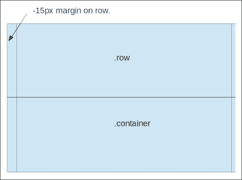

+   **列**：列有 15 像素的填充。这意味着列实际上与行的边缘相接触，行已经与容器的边缘相接触，因为在前一段讨论的容器的否定属性。

列再次有 15 像素的填充，因此列的内容与容器的视图边缘相距 15 像素。

因此，我们不需要特殊的第一列和最后一列，左右都有填充。现在所有列之间都有一个一致的 15 像素间隙。

列内的内容被推送到列的位置，并且它们之间也被 30 像素的间距分隔。我们可以在列内部使用行进行嵌套布局。

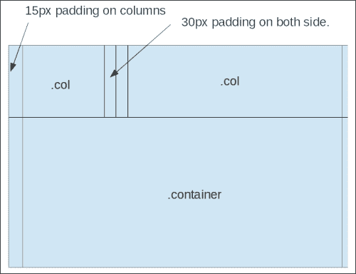

永远不要在行外使用列。

牢记这些要点，我们可以继续设计我们的第一个布局。

# URL 和视图 - 创建主页

在 Django 术语中，视图是一个普通的 Python 函数，通过生成相应的页面来响应页面请求。要为主页编写我们的第一个 Django 视图，我们首先需要在项目内创建一个 Django 应用程序。您可以将应用程序视为视图和数据模型的容器。要创建它，请在我们的`django_mytweets`文件夹内发出以下命令：

```py
$ python manage.py startapp tweets

```

应用程序创建的语法与项目创建的语法非常相似。我们使用`startapp`命令作为`python manage.py`命令的第一个参数，并提供`tweets`作为我们应用程序的名称。

运行此命令后，Django 将在项目文件夹内创建一个名为`tweets`的文件夹，其中包含这三个文件：

+   `__init__.py`：这个文件告诉 Python`tweets`是一个 Python 包

+   `views.py`：这个文件将包含我们的视图

+   `models.py`：这个文件将包含我们的数据模型

现在让我们创建主页视图。我们将首先在项目内创建一个`template`文件夹，以保存所有 HTML 文件：

```py
$mkdir templates

```

现在在其中创建一个名为`base.html`的基本 HTML 文件，内容如下：

```py

<html>
<head>
<link href=""
rel="stylesheet" media="screen" />">
</head>

<body>

<h1 class="text-info">">HELLO DJANGO!</h1>


<script src="img/bootstrap.min.js' %}"></script>
</body>
</html>
```

我们的目录结构现在看起来像这样（如果您使用 Linux 操作系统，请使用`tree`命令）：

```py
mytweets/
|-- manage.py
|-- mytweets
| |-- __init__.py
| |-- __init__.pyc
| |-- settings.py
| |-- settings.pyc
| |-- urls.py
| |-- urls.pyc
| |-- wsgi.py
| `-- wsgi.pyc
|-- static
| |-- css
| | |-- bootstrap.css
| | |-- bootstrap.css.map
| | |-- bootstrap.min.css
| | |-- bootstrap-theme.css
| | |-- bootstrap-theme.css.map
| | `-- bootstrap-theme.min.css
| |-- fonts
| | |-- glyphicons-halflings-regular.eot
| | |-- glyphicons-halflings-regular.svg
| | |-- glyphicons-halflings-regular.ttf
| | `-- glyphicons-halflings-regular.woff
| `-- js
| |-- bootstrap.js
| `-- bootstrap.min.js
|-- templates
| `-- base.html
`-- tweets
|-- admin.py
|-- __init__.py
|-- models.py
|-- tests.py
`-- views.py
```

# 介绍基于类的视图

基于类的视图是在 Django 中定义视图的新方法。它们不取代基于函数的视图。它们只是一种以 Python 对象而不是函数实现视图的替代方法。它们有两个优点，优于基于函数的视图。使用基于类的视图，不同的 HTTP 请求可以映射到不同的函数，而不是基于`request.method`参数进行分支的函数视图。可以使用面向对象的技术来重用代码组件，例如**混入**（多重继承）。

虽然我们将在项目中使用基于类的视图，但为了了解两者之间的确切区别，我们将在这里呈现两者的代码。

我们将不得不更新我们项目的`url.py`文件，以便在用户请求网站时提供`base.html`文件。

**基于函数的视图**：

按照以下方式更新`view.py`文件：

```py
from django.http import HttpResponse

def index(request):
if request.method == 'GET': 
return HttpResponse('I am called from a get Request')
elif request.method == 'POST':
return HttpResponse('I am called from a post Request')
```

按照以下方式更新`urls.py`文件：

```py
from django.conf.urls import patterns, include, url
from django.contrib import admin
from tweets import views
admin.autodiscover()

urlpatterns = patterns('',
url(r'^$', views.index, name='index'),
url(r'^admin/', include(admin.site.urls)),
)
```

使用以下命令运行开发服务器：

```py
$python manage.py runserver

```

我们将看到一个响应，显示**我是从 get 请求中调用的**。

**基于类的视图**：

更新`views.py`文件如下：

```py
from django.http import HttpResponse
from django.views.generic import View

class Index(ViewV iew):
def get(self, request): 
return HttpResponse('I am called from a get Request')
def post(self, request): 
return HttpResponse('I am called from a post Request')

urls.py
from django.conf.urls import patterns, include, url
from django.contrib import admin
from tweets.views import Index
admin.autodiscover()

urlpatterns = patterns('',
url(r'^$', Index.as_view()),
url(r'^admin/', include(admin.site.urls)),
)
```

在开发服务器被访问后，它也会在浏览器上生成相同的结果。我们将在整个项目中使用基于类的视图。

我们所呈现的只是一个字符串，这有点简单。我们在模板文件夹中创建了一个`base.html`文件，现在将继续使用我们的基于类的视图并呈现我们的`base.html`文件。

在 Django 中，有多种方法可以呈现我们的页面。我们可以使用这三个函数中的任何一个来呈现我们的页面：`render()`，`render_to_response()`或`direct_to_template()`。但是，让我们首先看看它们之间的区别以及我们应该使用哪一个：

+   `render_to_response(template[, dictionary][, context_instance][, mimetype])`：`render_to_response`命令是标准的呈现函数，要使用`RequestContext`，我们必须指定`context_instance=RequestContext(request)`。

+   `render(request, template[, dictionary][, context_instance][, content_type][, status][, current_app])`。这是`render_to_response`命令的新快捷方式，从 Django 的 1.3 版本开始可用。这将自动使用`RequestContext`。

+   `direct_to_template()`: 这是一个通用视图。它自动使用`RequestContext`和所有它的`context_processor`参数。

但是，应该避免使用`direct_to_template`命令，因为基于函数的通用视图已被弃用。

我们将选择第二个，`render()`函数，来呈现我们的`base.html`模板。

下一步是在我们的 Django 应用程序中包含模板文件夹（我们已经创建的带有名为`base.html`的基本文件的模板文件夹）。为了包含模板，我们将以以下方式更新`settings.py`文件：

```py
TEMPLATE_DIRS = (
BASE_DIR + '/templates/'
)
TEMPLATE_LOADERS = (
'django.template.loaders.filesystem.Loader',
'django.template.loaders.app_directories.Loader', 
)
```

这定义了模板目录并初始化了基本的`TEMPLATE_LOADER`参数。

# mytweets 项目的 Django 设置

让我们使用我们`mytweets`项目所需的最小设置更新`settings.py`文件。在启动我们的 mytweets 应用程序之前，我们将添加许多设置，我们将在以下更改中看到。有关此文件的更多信息，请访问[`docs.djangoproject.com/en/1.6/topics/settings/`](https://docs.djangoproject.com/en/1.6/topics/settings/)。

有关设置及其值的完整列表，请访问[`docs.djangoproject.com/en/1.6/ref/settings/`](https://docs.djangoproject.com/en/1.6/ref/settings/)。

使用以下内容更新我们项目的`settings.py`文件：

```py
# Build paths inside the project like this: os.path.join(BASE_DIR, ...)
import os
BASE_DIR = os.path.dirname(os.path.dirname(__file__))

# Quick-start development settings - unsuitable for production
# See https://docs.djangoproject.com/en/1.6/howto/deployment/checklist/

# SECURITY WARNING: keep the secret key used in production secret!
SECRET_KEY = 'XXXXXXXXXXXXXXXXXXXXXXXXXX'

# SECURITY WARNING: don't run with debug turned on in production!
DEBUG = True
TEMPLATE_DEBUG = True
ALLOWED_HOSTS = []

# Application definition
INSTALLED_APPS = (
'django.contrib.admin',
'django.contrib.auth',
'django.contrib.contenttypes',
'django.contrib.sessions',
'django.contrib.messages',
'django.contrib.staticfiles',
)

MIDDLEWARE_CLASSES = (
'django.contrib.sessions.middleware.SessionMiddleware',
'django.middleware.common.CommonMiddleware',
'django.middleware.csrf.CsrfViewMiddleware',
'django.contrib.auth.middleware.AuthenticationMiddleware',
'django.contrib.messages.middleware.MessageMiddleware',
'django.middleware.clickjacking.XFrameOptionsMiddleware',
)

ROOT_URLCONF = 'mytweets.urls'
WSGI_APPLICATION = 'mytweets.wsgi.application'

# Database
# https://docs.djangoproject.com/en/1.6/ref/settings/#databases

DATABASES = {
'default': {
'ENGINE': 'django.db.backends.sqlite3',
'NAME': os.path.join(BASE_DIR, 'db.sqlite3'),
}
}

#static file directory inclusion
STATICFILES_DIRS = ( 
os.path.join(
os.path.dirname(__file__),
'static',
),
)

TEMPLATE_DIRS = (
BASE_DIR + '/templates/'
)

# List of callables that know how to import templates from various sources.
TEMPLATE_LOADERS = (
'django.template.loaders.filesystem.Loader',
'django.template.loaders.app_directories.Loader',
# 'django.template.loaders.eggs.Loader',
)

# Internationalization
# https://docs.djangoproject.com/en/1.6/topics/i18n/

LANGUAGE_CODE = 'en-us'
TIME_ZONE = 'UTC'
USE_I18N = True
USE_L10N = True
USE_TZ = True

# Static files (CSS, JavaScript, Images)
# https://docs.djangoproject.com/en/1.6/howto/static-files/

STATIC_URL = '/static/'
```

现在，如果我们启动开发服务器，我们的屏幕将如下截图所示：

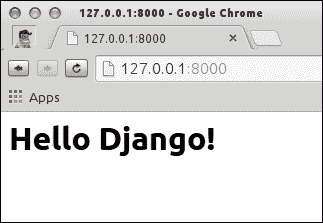

### 注意

在我们的`base.html`文件中，我们写了`class="h1"`而不是`<h1></h1>`。这是故意为了在运行时检查是否加载了引导文件，即`Header 1`属性。

正如您可能已经注意到的，我们没有向模板传递任何变量，这大致区分了静态页面和动态页面。让我们继续做这个。我们只需要对`views.py`和`base.html`文件进行一些更改，如下所示：

+   `views.py`文件中的更改：

```py
from django.views.generic import View
from django.shortcuts import render 
class Index(View):
def get(self, request): 
params = {}
params["name"] = "Django"
return render(request, 'base.html', params)
```

+   `base.html`文件中的更改

```py

<html>
<head>
<link href=""
rel="stylesheet" media="screen">
</head>

<body>

<h1>Hello {{name}}!</h1>


<script src="img/bootstrap.min.js' %}"></script>
</body>
</html>
```

我们可以看到它有多简单。我们所做的只是创建一个映射（在 Python 中称为**字典**）并将`name`属性分配给它作为 Django，并将其添加到`render()`函数中作为新参数。它被呈现到 HTML 的基础上，并且可以轻松地调用`{{name}}`。当它被呈现时，它会用 Django 替换自己。

我们将提交我们到目前为止所做的所有更改。在这之前，让我们创建一个`.gitignore`文件。它的作用是，无论这个文件中有什么内容（或者我们在`.gitignore`文件中写入的文件的通配符），它都会阻止所有这些内容提交，并将它们发送到存储库服务器。

它如何帮助？它在许多重要的用例中都有帮助。假设我们不想将任何本地配置文件放到生产服务器上。在这种情况下，`.gitignore`文件可以成为救世主，也可以在`.py`文件生成它们的`.pyc`文件时使用，这些文件在运行时被编译。我们不需要在服务器上存储这些二进制文件，因为它们每次代码更改时都会单独生成。

在 Linux 命令行中，只需在项目目录的根文件夹中键入`$vim .gitignore`命令，然后写入`*.pyc`。然后，以通常的方式保存并退出。

现在，如果我们执行`$git status`命令，我们将看不到任何扩展名为`.pyc`的文件，这意味着 Git 已经忽略了以`.pyc`结尾的文件进行跟踪。

`$git status`命令的结果如下：

```py
Changes not staged for commit:
(use "git add <file>..." to update what will be committed)
(use "git checkout -- <file>..." to discard changes in working directory)

modified: mytweets/settings.py
modified: mytweets/urls.py

Untracked files:
(use "git add <file>..." to include in what will be committed)

.gitignore
static/
templates/
tweets/
```

这是相当清楚的，正如应该的。我们之前已经提交了`settings.py`和`urls.py`文件，现在我们对它们进行了一些更改，而提到的未跟踪文件甚至没有被添加到 Git 进行跟踪。

我们可以使用`git add .`命令将所有更改添加到目录中。但是，为了避免将任何不需要的文件推送到 Git 跟踪，建议在开发的高级阶段逐个添加文件。对于当前的情况，一次性添加文件是可以的。要将所需的文件添加到我们的项目中，请使用以下命令：

```py
$git add .

```

输出将如下所示：

```py
On branch master
Changes to be committed:
(use "git reset HEAD <file>..." to unstage)

new file: .gitignore
modified: mytweets/settings.py
modified: mytweets/urls.py
new file: static/css/bootstrap-theme.css
new file: static/css/bootstrap-theme.css.map
new file: static/css/bootstrap-theme.min.css
new file: static/css/bootstrap.css
new file: static/css/bootstrap.css.map
new file: static/css/bootstrap.min.css
new file: static/fonts/glyphicons-halflings-regular.eot
new file: static/fonts/glyphicons-halflings-regular.svg
new file: static/fonts/glyphicons-halflings-regular.ttf
new file: static/fonts/glyphicons-halflings-regular.woff
new file: static/js/bootstrap.js
new file: static/js/bootstrap.min.js
new file: templates/base.html
new file: tweets/__init__.py
new file: tweets/admin.py
new file: tweets/models.py
new file: tweets/tests.py
new file: tweets/views.py

```

提交更改并附上适当的消息，比如“*添加基本的引导模板*”：

```py
$git commit -m "basic bootstap template added"

```

输出将如下所示：

```py
[master 195230b] basic bootstap template added
21 files changed, 9062 insertions(+), 1 deletion(-)
create mode 100644 .gitignore
create mode 100644 static/css/bootstrap-theme.css
create mode 100644 static/css/bootstrap-theme.css.map
create mode 100644 static/css/bootstrap-theme.min.css
create mode 100644 static/css/bootstrap.css
create mode 100644 static/css/bootstrap.css.map
create mode 100644 static/css/bootstrap.min.css
create mode 100644 static/fonts/glyphicons-halflings-regular.eot
create mode 100644 static/fonts/glyphicons-halflings-regular.svg
create mode 100644 static/fonts/glyphicons-halflings-regular.ttf
create mode 100644 static/fonts/glyphicons-halflings-regular.woff
create mode 100644 static/js/bootstrap.js
create mode 100644 static/js/bootstrap.min.js
create mode 100644 templates/base.html
create mode 100644 tweets/__init__.py
create mode 100644 tweets/admin.py
create mode 100644 tweets/models.py
create mode 100644 tweets/tests.py
create mode 100644 tweets/views.py

```

# 将所有内容放在一起 - 生成用户页面

到目前为止，我们已经涵盖了很多材料，比如介绍了视图和模板的概念。在最后一节中，我们将编写另一个视图，并利用到目前为止学到的所有信息。这个视图将显示属于某个用户的所有推文的列表。

## 熟悉 Django 模型

模型是标准的 Python 类，具有一些附加功能。它们是`django.db.models.Model`的子类。在后台，**对象关系映射器**（**ORM**）与这些类及其对象绑定在一起。这使它们与底层数据库进行通信。ORM 是 Django 的一个重要特性，没有它，我们将不得不编写自己的查询（如果是 MySQL，则为 SQL）来访问数据库内容。模型的每个属性都由数据库字段表示。没有字段，模型将只是一个空容器，毫无意义。

以下是 Django 的模型属性及其预期用途的解释。完整的字段列表可以在[`docs.djangoproject.com/en/dev/ref/models/fields/`](https://docs.djangoproject.com/en/dev/ref/models/fields/)的标准文档中找到。

以下是这些类型的部分表：

| 字段类型 | 描述 |
| --- | --- |
| `IntegerField` | 一个整数 |
| `TextField` | 一个大文本字段 |
| `DateTimeField` | 一个日期和时间字段 |
| `EmailField` | 一个最大长度为 75 个字符的电子邮件字段 |
| `URLField` | 一个最大长度为 200 个字符的 URL 字段 |
| `FileField` | 一个文件上传字段 |

每个模型字段都带有一组特定于字段的参数。例如，如果我们想要一个字段是`CharField`字段，我们必须将其`max_length`参数作为其参数传递，该参数映射到数据库中`varchar`的字段大小。

以下是可以应用于所有字段类型的参数（它们是可选的）：

+   `null`：默认情况下，它设置为`false`。当设置为`true`时，允许将`null`的关联字段的值存储在数据库中。

+   `blank`：默认情况下，它设置为`false`。当设置为`true`时，允许将`blank`的关联字段的值存储在数据库中。

### 注意

`null`和`blank`参数之间的区别在于，`null`参数主要与数据库相关，而`blank`参数用于验证字段。换句话说，如果属性设置为`false`，则属性的空值（`blank`）将不会被保存。

+   `choices`：这可以是一个列表或元组，并且必须是可迭代的。如果这是一个元组，第一个元素是将存储到数据库中的值，第二个值用于在小部件形式或`ModelChoiceField`中显示。

例如：

```py
USER_ROLE = ( 
('U', 'USER'), 
('S', 'STAFF'), 
('A', 'ADMIN')
)
user_role = models.CharField(max_length=1, choices=USER_ROLE)
```

+   `default`：每次实例化类的对象时分配给属性的值。

+   `help_text`：以小部件形式显示的帮助文本。

+   `primary_key`：如果设置为`True`，则该字段将成为模型的主键。如果模型中没有主键，Django 将创建一个整数字段并将其标记为主键。

## 模型中的关系

有三种主要类型的关系：多对一，多对多和一对一。

### 多对一关系

在 Django 中，`django.db.models.ForeignKey`参数用于将一个模型定义为另一个模型属性的外键，从而产生多对多的关系。

它被用作模型类的任何其他属性，包括它所在的类。例如，如果学生在特定学校学习，那么学校有很多学生，但学生只去一个学校，这是一个多对一的关系。让我们看一下以下代码片段：

```py
from django.db import models
class School(models.Model):
# ...
ass
class Student(models.Model):
school = models.ForeignKey(School)
# …
```

### 一对一关系

一对一关系与多对一关系非常相似。唯一的区别是，反向映射在一对一关系的情况下会导致单个对象，而不是多对一关系。

例如：

```py
class EntryDetail(models.Model):
entry = models.OneToOneField(Entry)
details = models.TextField()
```

在前面的示例中，`EntryDetail()`类有一个名为`entry`的属性，它与`Entry`模型一对一映射。这意味着每个`Entry`对象都映射到`EntryDetail`模型。

### 多对多关系

正如名称本身所示，具有多对多关系的模型属性提供对其指向的两个模型的访问（例如向后的一对多关系）。属性命名是这两种关系之间唯一的重要区别。

如果我们通过以下示例来说明，这将更清楚：

```py
class Product(models.Model):
name = models.CharField(_(u"Name"), max_length=50)
class Category(models.Model):
name = models.CharField(_(u"Name"), max_length=50)
products = models.ManyToManyField("Product", blank=True, null=True)
```

有了属性和主要关系的想法，我们现在可以直接创建我们的项目模型，在接下来的部分中我们将很快做到这一点。

如果我们要为应用程序设计模型，如果模型太多，我们应该拆分应用程序。如果我们的应用程序中有超过大约 15 个模型，我们应该考虑如何将我们的应用程序拆分成更小的应用程序。这是因为，对于现有的 15 个模型应用程序，我们可能正在做太多事情。这与 Django 的哲学不符，即*应用程序应该只做一件事，并且做得正确*。

# 模型-设计初始数据库模式

回到我们的项目，我们在初始阶段将需要两个模型：`user`模型和`tweet`模型。`user`模型将用于存储在我们的项目中拥有帐户的用户的基本用户详细信息。

接下来是`tweet`模型，它将存储与推文相关的数据，例如推文文本，创建该推文的用户，以及推文发布的时间戳等其他重要细节。

要列出用户的推文，最好是创建一个专门针对项目中所有用户的用户应用程序。我们的用户模型将通过扩展 Django 的`AbstractBaseUser`用户模型类来创建。

### 注意

永远不建议更改 Django 源树中的实际`user`类和/或复制和修改`auth`模块。

这将是使用框架进行 Web 开发的第一个应用程序，而不是自己编写整个身份验证，这对所有 Web 开发场景都是非常普遍的。Django 带有预定义的库，因此我们不必重新发明轮子。它同时提供了认证和授权，并称为认证系统。

## Django 的用户对象

Django 1.5 附带了一个可配置的用户模型，这是在应用程序中存储特定于用户的数据的更简单的方法。

我们将创建一个用户应用程序，然后将 Django 的默认用户模型导入其中：

```py
$python manage.py startapp user_profile

```

我们将根据当前项目的需要扩展 Django 用户模型，通过创建一个继承自`AbstractBaseUser`类的自定义`User()`类。因此，我们的`models.py`文件将如下所示：

```py
from django.db import models
from django.contrib.auth.models import AbstractBaseUser

class User(AbstractBaseUser):

Custom user class.
```

现在我们已经为项目创建了自定义的`user`类，我们可以向这个`user`类添加所有我们希望在用户模型中的基本属性。

现在`models.py`看起来是这样的：

```py
from django.db import models
from django.contrib.auth.models import AbstractBaseUser

class User(AbstractBaseUser):

Custom user class.

username = models.CharField('username', max_length=10, unique=True, db_index=True)
email = models.EmailField('email address', unique=True)
joined = models.DateTimeField(auto_now_add=True)
is_active = models.BooleanField(default=True)
is_admin = models.BooleanField(default=False)
```

在上述代码片段中，自定义用户模型`email`字段具有一个设置为`True`的`unique`属性。这意味着用户只能使用给定的电子邮件地址注册一次，验证可以在注册页面上完成。您还将在`username`属性中看到一个`db_index`选项，其值为`True`，这将在`username`属性上为用户表建立索引。

`joined`是`dateTimeField`参数，当创建新用户配置文件时会自动填充；当创建新用户帐户时，默认情况下`is_active`字段设置为`True`，同时`is_admin`字段初始化为`False`。

还需要一个字段，使其几乎与默认的 Django 用户模型相同，即`username`字段。

在`models.py`文件中添加`USERNAME_FIELD`字段如下：

```py
USERNAME_FIELD = 'username' 
def __unicode__(self):
return self.username
```

`USERNAME_FIELD`也作为 Django 中用户模型的唯一标识符。我们已经将我们的`username`参数映射到 Django 的`username`字段。这个字段在定义时必须是唯一的（`unique=True`），而我们的`username`字段已经是唯一的。

`__unicode__()`方法也被添加为显示用户模型对象的人类可读表示的定义。

因此，最终的`models.py`文件将如下所示：

```py
from django.db import models
from django.contrib.auth.models import AbstractBaseUser

class User(AbstractBaseUser):
"""
Custom user class.
"""
username = models.CharField( 'username', max_length=10, unique=True, db_index=True)
email = models.EmailField('email address', unique=True)
joined = models.DateTimeField(auto_now_add=True)
is_active = models.BooleanField(default=True)
is_admin = models.BooleanField(default=False)

USERNAME_FIELD = 'username'
def __unicode__(self):
return self.username
```

现在，在定义了我们的用户模型之后，我们可以继续设计推文模型。这是我们创建的同一个应用程序，用于查看基本的基于类的视图。我们将向其`models.py`文件添加内容，如下所示：

```py
from django.db import models
from user_profile import User
class Tweet(models.Model):
"""
Tweet model
"""
user = models.ForeignKey(User)
text = models.CharField(max_length=160)
created_date = models.DateTimeField(auto_now_add=True)
country = models.CharField(max_length=30)
is_active = models.BooleanField(default=True)
```

推文模型的设计尽可能简单，`attribute`参数是对我们已经创建的`User`对象的外键。`text`属性是推文内容，它将主要由纯文本组成。`created_Date`属性是在未初始化`tweet`对象时自动添加到数据库中的，它存储了实际发布推文的国家名称。在大多数情况下，它将与用户的国家相同。`is_active`标志用于表示推文的当前状态，即它是否处于活动状态并且可以显示，或者已被用户删除。

我们需要在数据库中为我们刚刚创建的两个模型`user_profile`和`tweet`创建表。我们将不得不更新项目的`settings.py`文件中的`INSTALLED_APPS`变量，以告诉 Django 在 Django 项目中包括这两个应用程序。

我们更新后的`INSTALLED_APPS`变量将如下所示：

```py
INSTALLED_APPS = (
'django.contrib.admin',
'django.contrib.auth',
'django.contrib.contenttypes',
'django.contrib.sessions',
'django.contrib.messages',
'django.contrib.staticfiles',
'user_profile',
'tweet'
)
```

您可以看到我们添加的最后两个条目以添加我们的模型。

现在，为了为我们的项目创建数据库表，我们将在终端中从根项目文件夹运行以下命令：

```py
$python manage.py syncdb

```

输出将如下所示：

```py
Creating tables ...
Creating table django_admin_log
Creating table auth_permission
Creating table auth_group_permissions
Creating table auth_group
Creating table auth_user_groups
Creating table auth_user_user_permissions
Creating table auth_user
Creating table django_content_type
Creating table django_session
Creating table user_profile_user
Creating table tweet_tweet
```

您刚刚安装了 Django 的 auth 系统，这意味着您没有定义任何超级用户。您可以在终端上看到以下内容：

```py
Would you like to create one now? (yes/no): yes
Username (leave blank to use 'ratan'):
Email address: mail@ratankumar.org
Password: XXXX
Password (again): XXXX
Superuser created successfully.
Installing custom SQL ...
Installing indexes ...
Installed 0 object(s) from 0 fixture(s)
```

因此，我们的数据库已填充了一个表。我们的项目中将出现一个名为`db.sqlite3`的数据库文件。

与 Django 1.6 一样，默认情况下会出现管理员面板。我们的模型要在 Django 的管理面板中可用，只需为两个应用程序的模型名称添加`admin.site.register`参数作为参数。

因此，在`admin.py`文件中添加`admin.site.register(parameter)`到`mytweets`和`user_profile`文件下将如下所示：

+   `tweet`应用程序的`admin.py`文件如下所示：

```py
from django.contrib import admin
from models import Tweet

admin.site.register(Tweet)
```

+   `user_profile`应用程序的`admin.py`文件如下所示：

```py
from django.contrib import admin
from models import User
admin.site.register(User)
```

使用以下命令启动服务器：

```py
$python manage.py runserver

```

然后访问 URL`http://127.0.0.1:8000/admin`；它会要求登录信息。您可能还记得，我们在运行`$python manage.py syncdb`命令时创建了默认用户；使用相同的用户名和密码。

成功登录后，管理面板看起来像以下截图：

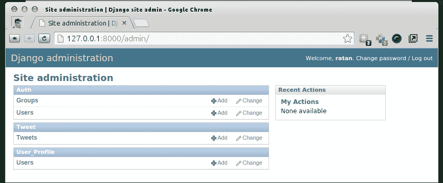

让我们在管理面板中玩耍，并创建一个我们将在首页视图中使用的`user`和`tweet`对象。要向项目添加新用户，只需点击用户模型框前面的**添加**按钮，如下截图所示：

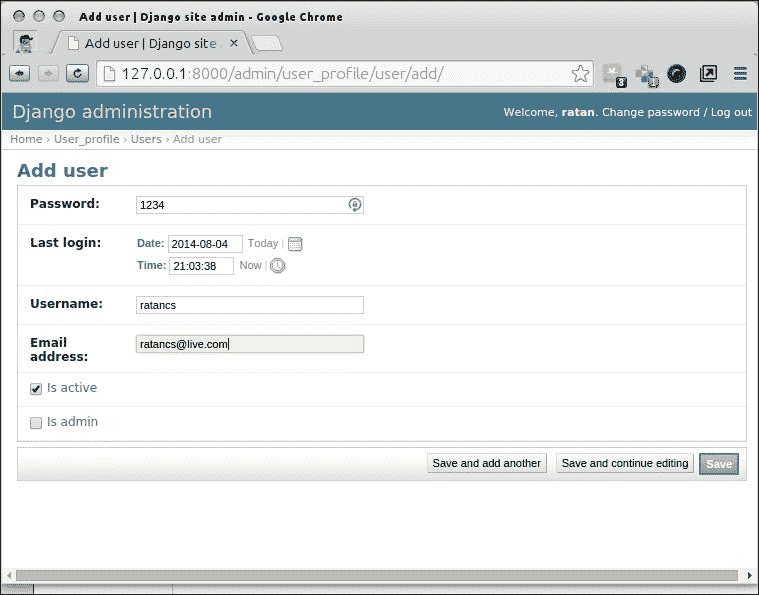

然后填写详细信息并保存。您将看到如下截图中显示的**"用户创建成功"**消息：

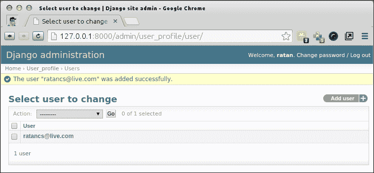

我们将按照类似的流程创建一条推文。首先返回到`http://127.0.0.1:8000/admin/`。然后，在推文框前面点击**添加**按钮。

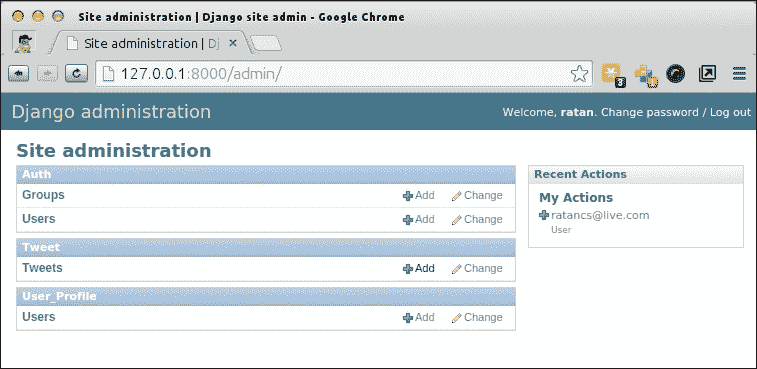

通过填写框并从下拉菜单中选择用户来撰写新推文。由于我们已将用户映射到用户对象，因此此用户列表已经填充。随着我们不断添加用户，下拉菜单将填充所有用户对象。

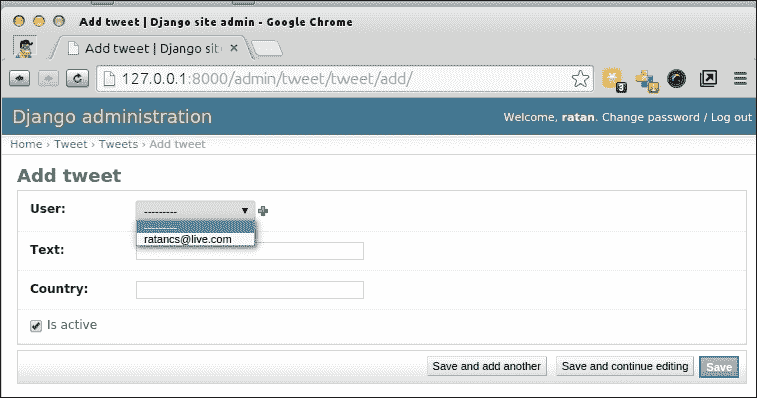

最后，在撰写推文后，点击**保存**按钮。您将看到以下截图中显示的相同屏幕：

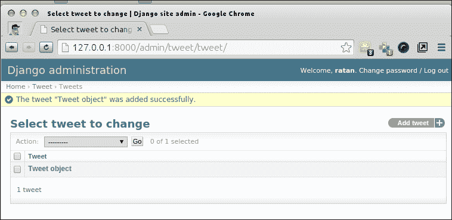

如果您仔细观察，管理员列表页面会显示每条推文都是一个`tweet`对象，这不太友好。实际上，对于 Django 管理视图中或任何其他地方显示的所有模型基础表示，都适用相同的规则。

在我们的项目的`admin.py`文件中添加以下代码片段：

```py
def __unicode__(self): 
return self.text
```

我们的管理视图现在将显示确切的文本，而不是写入推文对象。

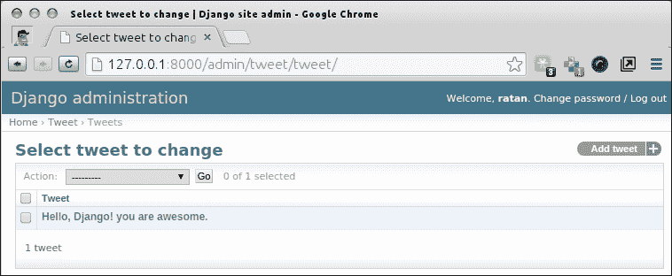

## 创建 URL

我们项目中的每个用户都将具有以下格式的唯一 URL 的个人资料：`http://127.0.0.1:8000/user/<username>`。这里，`username`变量是我们想要查看推文的所有者。这个 URL 与我们之前添加的第一个 URL 不同，因为它包含一个动态部分，所以我们必须利用正则表达式的能力来表示这个 URL。打开`urls.py`文件并编辑它，使 URL 表格如下所示：

```py
url(r'^user/(\w+)/$', Profile.as_view()), urls.py
from django.conf.urls import patterns, include, url
from django.contrib import admin
from tweet.views import Index,Profile
admin.autodiscover()

urlpatterns = patterns('',
url(r'^$', Index.as_view()),
url(r'^user/(\w+)/$', Profile.as_view()),
url(r'^admin/', include(admin.site.urls)),
)
```

这里的模式看起来比第一个更复杂。注释`\w`表示字母数字字符或下划线。其后的`+`符号会导致正则表达式匹配前面的内容的一个或多个重复。因此，实际上，`\w+`表示由字母数字字符和可能的下划线组成的任何字符串。我们用括号括起了正则表达式的这部分。这将导致 Django 捕获与这部分匹配的字符串并将其传递给视图。

在我们看到视图生效之前，还有一件事需要解释。如果您以前没有使用过正则表达式，我们使用的正则表达式看起来可能有点奇怪。这是一个包含两个字符`^`和`$`的原始字符串。注释`r''`是 Python 定义原始字符串的语法。如果 Python 遇到这样的原始字符串，反斜杠和其他转义序列将保留在字符串中，而不会以任何方式解释。在这种语法中，反斜杠保留在字符串中而不会改变，转义序列不会被解释。这在处理正则表达式时非常有用，因为它们经常包含反斜杠。

在正则表达式中，`^`表示字符串的开头，`$`表示字符串的结尾。因此，`^$`基本上表示一个不包含任何内容的字符串，即空字符串。鉴于我们正在编写主页的视图，页面的 URL 是根 URL，确实应该是空的。

`re`模块的 Python 文档详细介绍了正则表达式。如果您想对正则表达式进行彻底的处理，我建议阅读它。您可以在[`docs.python.org/lib/module-re.html`](http://docs.python.org/lib/module-re.html)上找到在线文档。以下是一个总结正则表达式语法的表格，供那些想要快速复习的人使用：

| 符号/表达式 | 匹配的字符串 |
| --- | --- |
| `. (Dot)` | 任何字符 |
| `^ (Caret)` | 字符串的开头 |
| `$` | 字符串的结尾 |
| `*` | 0 次或多次重复 |
| `+` | 1 次或多次重复 |
| `?` | 0 或 1 次重复 |
| `&#124;` | A &#124; B 表示 A 或 B |
| `[a-z]` | 任何小写字符 |
| `\w` | 任何字母数字字符或 _ |
| `\d` | 任何数字 |

我们现在将在我们的推文应用程序的`view.py`文件中创建一个带有`GET`函数的`Profile()`类。这里需要学习的重要事情是`get()`函数如何处理通过 URL 传递的动态参数，即`username`变量。

我们的推文应用程序的`view.py`将如下所示：

```py
class Profile(View):
"""User Profile page reachable from /user/<username> URL"""
def get(self, request, username):
params = dict()()()
user = User.objects.get(username=username)
tweets = Tweet.objects.filter(user=user)
params["tweets"] = tweets
params["user"] = user
return render(request, 'profile.html', params)
```

## 模板 - 为主页创建模板

我们几乎完成了项目的模型创建。现在我们将继续创建视图页面。

我们要创建的第一个页面是基本页面，它将列出用户发布的所有推文。这可以是一个所谓的公共个人资料页面，可以在没有任何身份验证的情况下访问。

正如你可能已经注意到的，我们在`views.py`文件的`Profile`类中使用了`profile.html`文件，它属于我们的推文应用程序。

我们项目的`views.py`文件将如下所示：

```py
class Profile(View):
"""User Profile page reachable from /user/<username> URL"""
def get(self, request, username):
params = dict()
user = User.objects.get(username=username)
tweets = Tweet.objects.filter(user=user)
params["tweets"] = tweets
params["user"] = user
return render(request, 'profile.html', params)
```

我们将使用已经在我们的`base.html`文件中导入的 Bootstrap 框架来设计`Profile.html`文件。

我们将首先重构我们为应用程序创建的`base.html`文件。现在这个`base.html`文件将被用作我们项目的模板或主题。我们将在整个项目中导入此文件，这将导致项目中的用户界面保持一致。

我们将从我们的`base.html`文件中删除我们放在块内容中的`div`标签。

我们还需要 jQuery，这是一个用于完全实现 bootstrap 功能的 JavaScript 库。可以从[`jquery.com/download/`](http://jquery.com/download/)下载。对于我们当前的项目，我们将在生产就绪阶段下载最新版本的 jQuery。我们将在 bootstrap 的 JavaScript 导入之前添加它。

现在`base.html`文件应该是这样的：

```py

<html>
<head>
<link href=""
rel="stylesheet" media="screen">
</head>

<body>



<script src="img/jquery-2.1.1.min.js' %}"></script>
<script src="img/bootstrap.min.js' %}"></script>
</body>
</html>
```

在这种情况下，块如下所示：

```py


```

这意味着，无论我们要扩展哪个模板`base.html`文件，当前在`profile.html`文件中，`profile.html`文件的内容将在这些块引用之间呈现。为了更好地理解这一点，考虑这样做：每个页面都有页眉（在某些情况下是导航栏）和页脚，页面内容根据视图而变化。通过前面的模板，我们通常需要在块内容之前放置页眉代码，并在块内容下方放置页脚内容。

现在使用页眉要容易得多，因为我们有前端框架的优势。我们将首先选择项目的布局。为简单起见，我们将整个页面分为三个部分。第一个将是页眉，随着我们在整个项目中导航，它将是恒定的。同样的情况也适用于页面底部，即我们的页脚。

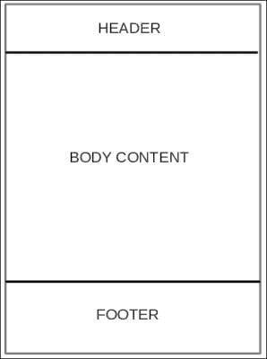

为了实现前面的布局，我们的 bootstrap 代码将以这种方式构建：我们将使用 bootstrap 的`navbar`作为页眉部分以及页脚部分。然后我们将放置容器`div`标签。我们的`base.html`文件的更新代码将更改为以下内容：

```py

<html>
<head>
<link href=""
rel="stylesheet" media="screen">
</head>
<body>
<nav class="navbar navbar-default navbar-fixed-top" role="navigation">
<a class="navbar-brand" href="#">MyTweets</a>
<p class="navbar-text navbar-right">User Profile Page</p>
</nav>
<div class="container">



</div>
<nav class="navbar navbar-default navbar-fixed-bottom" role="navigation">
<p class="navbar-text navbar-right">Footer </p>

</nav>
<script src="img/bootstrap.min.js' %}"></script>
</body>
</html>
```

`navbar`参数将在主体中启动，但在容器之前，以便它可以包裹整个容器。我们使用 Django 块内容来呈现我们将在扩展模板中定义的行，在这种情况下是`profile.html`文件。页脚部分最后出现，这是在`endblock`语句之后。

这将呈现以下页面：

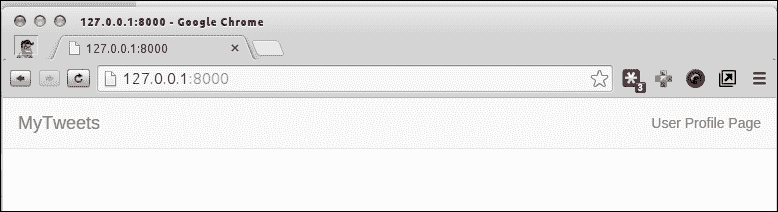

### 提示

请注意，如果您没有包含静态文件，请在您的`settings.py`文件中用以下内容替换`STATICFILES_DIRS`变量：

```py
STATICFILES_DIRS = (
BASE_DIR + '/static/',
)
```

个人资料页面的设计如下：

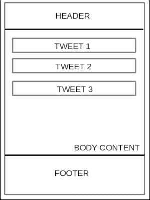

这可以很容易地再次设计，借助名为`well`的 bootstrap 组件。`well`或`wellbox`组件与元素一起使用，以产生内嵌效果。`profile.html`文件将只扩展`base.html`文件，并且只包含行和进一步的元素。

我们项目的`profile.html`文件如下所示：

```py


<div class="row clearfix">
<div class="col-md-12 column">

<div class="well">
<span>{{ tweet.text }}</span>
</div>

</div>
</div>

```

这将显示我们通过 URL 参数传递的用户的推文。我们采用的示例是用户`ratancs`，我们在初始设置期间创建的用户。您可以在以下截图中看到他们的推文：

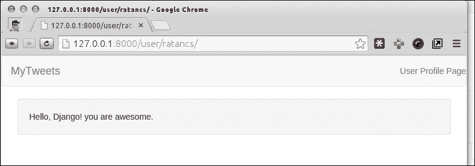

# 总结

我们学习了与我们的 Django 项目相关的基本术语，我们需要设置项目的基本模板结构，以及如何为我们的类似推文的应用程序设置 bootstrap。我们还看到了 MVC 在这里的工作方式以及在创建主页时 URL 和视图的作用。

然后，我们介绍了基于类的视图来生成用户页面。我们看到了模型在 Django 中的工作方式，以及如何为项目设计数据库模式。我们还学会了构建用户注册页面、帐户管理页面和主页模板。

我们将学习设计构建标签模型的算法，以及在接下来的章节中如何在您的帖子中使用标签的机制。
