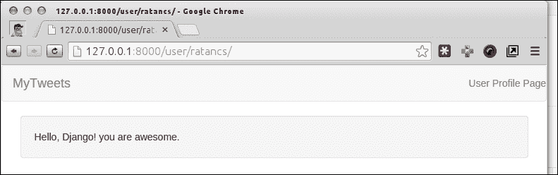
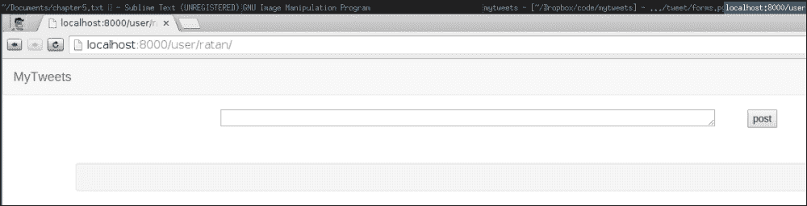
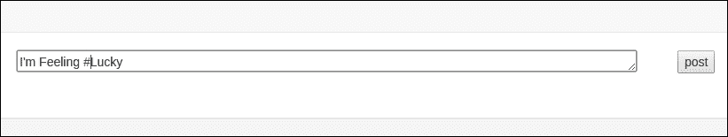
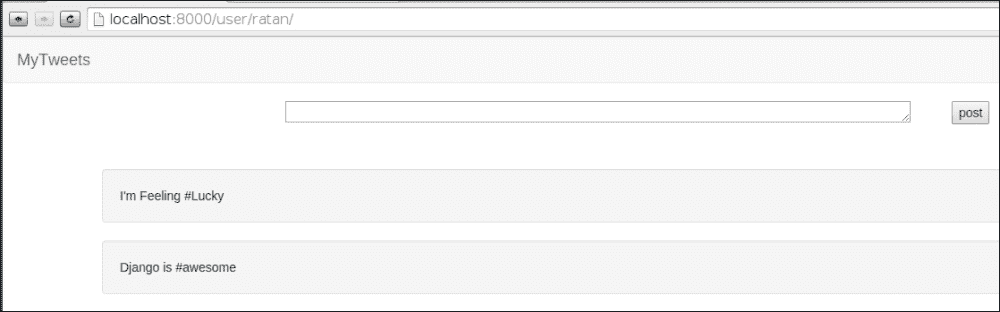

# 第五章：引入标签

标签是 Web 2.0 应用程序中最突出的功能之一。**标签**是与信息（如文章、图片或链接）相关联的关键词。**标记**是将标签分配给内容的过程。通常由作者或用户完成，并允许用户定义的内容分类。

我们还将在我们的项目中使用标签，并将其称为**hashtags**。标签在 Web 应用程序中变得非常流行，因为它们使用户能够轻松分类、查看和共享内容。如果您不熟悉标签，可以通过访问 Twitter、Facebook 或 Google Plus 等社交网站的示例来了解。在这些网站上，标签被固定到每个状态或对话中，以帮助我们找到热门话题。由于我们将构建一个微型博客网站，标签将帮助我们对用户之间的对话进行分类。

为了将标签引入我们的系统，我们需要一种机制，使用户能够将带有标签的 tweet 提交到数据库中。稍后，我们还需要一种浏览特定标签下分类的 tweet 的方法。

在本章中，您将学习以下内容：

+   设计标签数据模型

+   构建一个从 tweet 表单中分离出标签的算法

+   为特定标签下的 tweet 列表创建页面

+   构建标签云

# 标签数据模型

标签需要存储在数据库中并与 tweet 关联。因此，引入标签到我们的项目的第一步是为标签创建一个数据模型。一个标签对象只会保存一个数据，一个代表标签的字符串。此外，我们需要维护与特定 tweet 关联的标签列表。

你可能还记得第四章中，*构建类似 Twitter 的应用程序*，我们使用外键将 tweet 与用户关联起来，并将其称为一对多关系。然而，标签和 tweet 之间的关系不是一对多，因为一个标签可以与多个 tweet 关联，一个 tweet 也可以与多个标签关联。这被称为多对多关系，并且在 Django 模型中使用`models.ManyToManyField`参数表示。

到目前为止，您应该很清楚数据模型放在`mytweet` | `models.py`文件中。因此，打开文件并将以下`HashTag`类添加到其中：

```py
class HashTag(models.Model):
  """
  HashTag model
  """
  name = models.CharField(max_length=64, unique=True)
  tweet = models.ManyToManyField(Tweet)
  def __unicode__(self):
    return self.name
```

相当简单，不是吗？我们只是为标签定义了一个数据模型。该模型在其`ManyToManyField`参数中保存了标签名称及其 tweet。当您完成输入代码后，不要忘记运行以下命令，以便在数据库中为模型创建一个表：

```py
$ python manage.py syncdb

```

输出：

```py
 Creating tables ...
 Creating table tweet_hashtag_tweet
 Creating table tweet_hashtag
 Installing custom SQL ...
 Installing indexes ...
 Installed 0 object(s) from 0 fixture(s)

```

现在，要查看 Django 如何创建和实现所有关系的详细 SQL 查询，以及如何为它们创建表，我们只需使用`manage.py`中的模型名称发出`sql`命令。它将显示要运行以创建对象实例的 SQL 查询。熟悉 SQL 的人都知道，多对多关系通常是通过创建连接两个相关表的第三个表来实现的。现在，让我们看看 Django 如何实现这种类型的关系。在终端中，发出以下命令：

```py
$ python manage.py sql tweet

```

输出：

```py
 BEGIN;
 CREATE TABLE "tweet_tweet" (
 "id" integer NOT NULL PRIMARY KEY,
 "user_id" integer NOT NULL REFERENCES "user_profile_user" ("id"),
 "text" varchar(160) NOT NULL,
 "created_date" datetime NOT NULL,
 "country" varchar(30) NOT NULL,
 "is_active" bool NOT NULL
 )
 ;
 CREATE TABLE "tweet_hashtag_tweet" (
 "id" integer NOT NULL PRIMARY KEY,
 "hashtag_id" integer NOT NULL,
 "tweet_id" integer NOT NULL REFERENCES "tweet_tweet" ("id"),
 UNIQUE ("hashtag_id", "tweet_id")
 )
 ;
 CREATE TABLE "tweet_hashtag" (
 "id" integer NOT NULL PRIMARY KEY,
 "name" varchar(64) NOT NULL UNIQUE
 )
 ;
 COMMIT;

```

输出可能会因您的数据库引擎而略有不同。事实上，Django 会自动创建一个名为`tweet_hashtag_tweet`的额外表来维护多对多关系。

在 Django 的模型 API 中定义多对多关系时，值得注意的是，`models.ManyToMany`字段可以放置在两个相关模型中的任何一个。我们本可以将这个字段放在 tweet 模型中而不是 hashtag；因为我们后来创建了 hashtag 模型，所以我们把`models.ManyToMany`字段放在了它里面。

为了测试目的，我们将转到管理面板并创建带有标签的推文，就像我们为用户和推文创建一样。但首先，我们需要在`admin.py`文件中为管理面板注册标签。

修改后的`admin.py`文件将如下所示：

```py
  from django.contrib import admin
  from models import Tweet,Hashtag
  # Register your models here.
  admin.site.register(Tweet)
  admin.site.register(HashTag)
```

现在我们可以转到/administration URL 的管理面板。

在为推文创建标签之前，我们需要创建一个带有标签的推文。稍后，我们将编写一个程序，它将解析推文并自动创建与之关联的标签实例。

参考我们在第四章中展示的创建推文的演示图，并创建一条带有以下文本的推文：

```py
Hello, #Django! you are awesome.
```

使用我们之前使用的相同用户`ratancs`，然后转到标签模型并创建标签`#Django`并将其与我们创建的推文关联起来。这将让你了解我们如何将标签分配给推文。

让我们创建一个合适的推文提交表单，它将要求用户将推文写入输入框。它将创建与推文相关的所有标签，并保存推文。

查看我们创建的用户个人资料页面。在页面的顶部中央，将有一个已与用户关联的输入框；因此，当他写一条推文并点击提交按钮时，推文将被保存与他的 ID 关联。

现在，访问这个 URL：`http://localhost:8000/user/ratancs/`。你会看到我们之前创建的推文。



我们将返回到`profile.html`代码，并追加一个文本区域和一个提交按钮，为用户发布一条推文。设计将与我们选择显示推文的方式相同，也就是说，我们将使用`Twitter bootstrap`的相同的 well box。

我们的`profile.html`文件模板如下：

```py
  
  
  <div class="row clearfix">
    <div class="col-md-12 column">
      
      <div class="well">
        <span>{{ tweet.text }}</span>
      </div>
      
    </div>
  </div>
  
```

这个`{%for ...}`块用于表示多条推文，每条推文都在下面，因为它们有`div`标签。

现在我们将在`{% for ...}`块的上方创建一个`div`标签，并添加我们的推文提交表单。

在我们编写表单之前，让我们了解一下 Django 表单以及它们的使用方法。

## Django 表单

创建、验证和处理表单是一项非常常见的任务。Web 应用程序通过 Web 表单接收输入并收集用户数据。因此，自然地，Django 自带了处理这些任务的库。你所要做的就是导入这个库并开始编写你的表单：

```py
from django import forms
```

Django 表单库处理三个常见任务：

+   HTML 表单生成

+   用户输入的服务器端验证

+   在输入错误的情况下重新显示 HTML 表单

这个库的工作方式类似于 Django 的数据模型的工作方式。你首先定义一个代表你的表单的类。这个类必须派生自`forms.Form`基类。这个类中的属性代表表单字段。`forms`包提供了许多字段类型。

当你从派生自`forms.Form`基类的类创建对象时，你可以使用各种方法与它交互。有用于生成 HTML 代码的方法，用于访问输入数据的方法，以及用于验证表单的方法。

在下一节中，我们将通过创建一个推文发布表单来学习表单库。

# 设计推文发布表单

让我们从创建我们的第一个 Django 表单开始。在推文应用程序文件夹中创建一个新文件，命名为`forms.py`。然后，在代码编辑器中打开文件并输入以下代码：

```py
  from django import forms
  class TweetForm(forms.Form):
    text = forms.CharField(widget=forms.Textarea(attrs={'rows': 1, 'cols': 85}), max_length=160)
    country = forms.CharField(widget=forms.HiddenInput())
```

在检查了代码之后，你会注意到我们定义这个类的方式类似于我们定义模型类的方式。我们从`forms.Form`派生了`TweetForm`类。所有表单类都需要继承自这个类。接下来，我们定义这个表单包含的字段：

```py
  text = forms.CharField(widget=forms.Textarea(attrs={'rows': 1, 'cols': 85}), max_length=160)
```

表单包含一个文本字段，它将具有文本区域的 HTML 标签，一个用于行和列的附加属性，以及一个输入的最大大小限制，与 tweet 的最大长度相同。

```py
  country = forms.CharField(widget=forms.HiddenInput())
```

请注意，表单还包含一个名为`country`的隐藏字段，它将是一个 char 字段。

`forms`包中有许多字段类型。以下是一些参数，可以传递给任何字段类型的构造函数。一些专门的字段类型除了这些参数之外还可以接受其他参数。

+   `label`：生成 HTML 代码时字段的标签。

+   `required`：用户是否必须输入值。默认设置为`True`。要更改它，将`required=False`传递给构造函数。

+   `widget`：这个参数让你控制字段在 HTML 中的呈现方式。我们刚刚用它来使密码的`CharField`参数成为密码输入字段。

+   `help_text`：在表单呈现时，字段的描述将被显示。

以下是常用字段类型的表格：

| 字段类型：描述 |
| --- | --- |
| `CharField`：返回一个字符串。 |
| `IntegerField`：返回一个整数。 |
| `DateField`：返回 Python 的`datetime.date`对象。 |
| `DateTimeField`：返回 Python 的`datetime.datetime`对象。 |
| `EmailField`：返回一个有效的电子邮件地址字符串。 |
| `URLField`：返回一个有效的 URL 字符串。 |

以下是可用的表单小部件的部分列表：

| 小部件类型 | 描述 |
| --- | --- |
| `PasswordInput`：密码文本字段。 |
| `HiddenInput`：隐藏输入字段。 |
| `Textarea`：允许在多行上输入文本的文本区域。 |
| `FileInput`：文件上传字段。 |

现在，我们需要根据`form.py`文件修改`profile.html`文件。更新`profile.html`文件如下：

```py
  
  
  <div class="row clearfix">
    <div class="col-md-12 column">
      <form method="post" action="post/">
        <div class="col-md-8 col-md-offset-2 fieldWrapper">
          {{ form.text.errors }}
          {{ form.text }}
        </div>
        {{ form.country.as_hidden }}
        <div>
          <input type="submit" value="post">
        </div>
      </form>
    </div>
    <h3>&nbsp;</h3>
    <div class="col-md-12 column">
      
      <div class="well">
        <span>{{ tweet.text }}</span>
      </div>
      
    </div>
  </div>
  
```

通过一个简单的表单实现了发布 tweet，即`<form method="post" action="post/">`。表单将被提交的方法是`"post"`，发布 tweet 表单的相对 URL 将是`post/`，

```py
  
```

这段代码生成了 CSRF 令牌，实际上解决了一个安全问题；它保护这个`post` URL 免受另一个服务器的攻击；关于这一点将在本章的后面部分进行解释。

我们在 tweet `<div>`之前添加了一个`div`标签，这个`div`标签包含一个表单，当单击发布按钮时将保存 tweet。

```py
<div class="col-md-8 col-md-offset-2 fieldWrapper">
  {{ form.text.errors }}
  {{ form.text }}
</div>
```

`fieldWrapper`类在`div`标签中被 Django 的表单库使用，用于呈现我们在表单类中提到的文本的 HTML 标签（即文本区域），随后是表单呈现的任何错误情况。

这将呈现如下截图所示的表单：



现在，我们需要做两件事来使这个表单工作：

1.  我们必须在控制器中定义一个方法，该方法将接受这个表单提交请求，并将 tweet 数据保存到我们的 tweet 模型类对象中。

1.  我们必须定义一个 URL 模式，以便将该表单提交为 tweet 内容。

为了处理请求，我们将添加一个新的类，该类将接受来自表单的 tweet。我们将把这个类命名为`PostTweet`。这个类被添加在`tweet/view.py`中，有一个导入依赖`from tweet.forms import TweetForm`。

```py
  class PostTweet(View):
    """Tweet Post form available on page /user/<username> URL"""
    def post(self, request, username):
      form = TweetForm(self.request.POST)
      if form.is_valid():
        user = User.objects.get(username=username)
        tweet = Tweet(text=form.cleaned_data['text'],
        user=user,
        country=form.cleaned_data['country'])
        tweet.save()
        words = form.cleaned_data['text'].split(" ")
        for word in words:
        if word[0] == "#":
          hashtag, created = HashTag.objects.get_or_create(name=word[1:])
          hashtag.tweet.add(tweet)
        return HttpResponseRedirect('/user/'+username)
```

我们只需要定义 post 方法，因为我们只需要这个类来接受数据。这里的逻辑非常清楚；如果表单有效，那么数据才会被持久化。重定向总是发生。代码还执行了另一个特殊任务；即从 tweet 中分离出所有的 hashtags。这与分割 tweet 中的所有单词的方式类似，如果单词以`#`（井号）开头，它将创建该单词的 hashtag（在这里考虑一个正则表达式）。对于第二部分，我们将在我们的`urls.py`文件中添加一个条目，如下所示：

```py
from django.conf.urls import patterns, include, url
from django.contrib import admin
from tweet.views import Index, Profile, PostTweet

admin.autodiscover()

urlpatterns = patterns('',
  url(r'^$', Index.as_view()),
  url(r'^user/(\w+)/$', Profile.as_view()),
  url(r'^admin/', include(admin.site.urls)),
  url(r'^user/(\w+)/post/$', PostTweet.as_view())
)
```

如果你仔细看最后一行，我们有：

```py
  url(r'^user/(\w+)/post/$', PostTweet.as_view())
```

这意味着所有形式为`/user/<username>/post`的请求将由`PostTweet`渲染。

通过这个，我们已经制作了一个简单的 Django 表单，用户可以从他的 Twitter 页面发布推文，如下图所示：



一旦推文发布，页面将显示所有推文，如下图所示：



# 创建标签页面

接下来，我们将创建一个类似于 Twitter 标签列表的页面。对于这个任务，我们几乎会遵循我们为用户个人资料所遵循的相同架构。让我们从为标签页面添加 URL 条目开始。打开`urls.py`文件并插入以下条目（最好是在用户页面条目下方，以保持表格有序）：

```py
  url(r'^hashTag/(\w+)/$', HashTagCloud.as_view()),
```

这个正则表达式捕获的部分与用户页面的相同。我们只允许标签中包含字母数字字符。

我们将在控制器中定义`hashtag`类如下：

```py
  class HashTagCloud(View):
    """Hash Tag  page reachable from /hastag/<hashtag> URL"""
    def get(self, request, hashtag):
      params = dict()
      hashtag = HashTag.objects.get(name=hashtag)
      params["tweets"] = hashtag.tweet
      return render(request, 'hashtag.html', params)
```

我们将使用的 HTML 模板页面几乎与个人资料页面相同，除了我们用于发布推文的表单部分。

我们需要使用以下代码创建`hashtag.html`文件：

```py
  
  
  <div class="row clearfix">
    <div class="col-md-12 column">
      
      <div class="well">
        <span>{{ tweet.text }}</span>
      </div>
      
    </div>
  </div>
  
```

这将列出所有通过 URL 传递的标签的推文。

# 总结

我们已经学会了如何设计标签数据模型以及从推文中分离标签所需的算法。然后，我们创建了用于列出特定标签下推文的页面。我们看到了如何构建带有标签的推文的代码片段，就像许多博客网站中看到的标签云一样。

在下一章中，我们将看到如何使用 Django 和 AJAX 增强 UI 体验。
