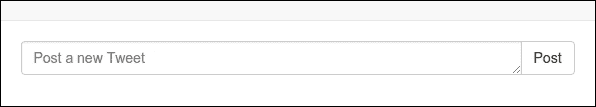

# 第七章：关注和评论

我们应用程序的主要思想是为用户提供一个通过推文分享他们的想法的平台。让用户创建新推文只是其中的一部分，如果用户无法与现有推文进行交互，则应用程序将被认为是不完整的。在本章中，我们将完成另一部分，即使用户能够关注特定用户并评论现有推文。在此过程中，您还将学习到几个新的 Django 功能。

在本章中，您将学习以下内容：

+   让用户关注另一个用户

+   显示最受关注的用户

# 让用户关注另一个用户

到目前为止，我们的用户可以通过浏览标签和用户页面发现新的推文。让我们为用户提供一种方法来关注另一个用户，这样他们就可以在他们各自的主页上看到来自他们关注的所有用户的聚合推文。让我们还使用户能够评论新的推文。

我们还将创建一个页面，用户可以按关注者数量列出受欢迎的用户。这个功能对我们的应用程序很重要，因为它将把主页从一个基本的欢迎页面变成一个经常更新的用户列表，用户可以在其中找到热门用户和他们有趣的推文。

我们实现此功能的策略如下：

+   创建一个数据模型来存储用户及其关注者。这个模型将跟踪与用户相关的各种信息。

+   在他们的标题旁边给每个用户一个关注按钮。我们还将创建一个视图，显示计数，比如用户发表的推文数量和他们的关注者数量。这需要大量的工作，但结果将是值得的，我们将在这个过程中学到很多有用的信息。

让我们开始吧！

首先，我们要做的是为每个推文添加一个转发计数，并跟踪用户投票赞成的所有推文。为了实现这一点，我们需要创建一个新的`UserFollowers`数据模型。

## UserFollowers 数据模型

当一个用户被另一个用户关注时，我们需要在数据库中存储以下信息：

+   用户被关注的日期。我们需要这个信息来显示在一段时间内拥有最多关注者的用户。

+   用户拥有的关注者数量。

+   关注我们用户的用户列表。

这是为了防止用户两次关注同一个用户。

为此，我们将创建一个名为`UserFollowers`的新数据模型。打开`user_profile/model.py`并将以下类添加到其中：

```py
class UserFollowers(models.Model):
  user = models.ForeignKey(User, unique=True))
  date = models.DateTimeField(auto_now_add=True)
  count = models.IntegerField(default=1))
  followers = models.ManyToManyField(User, related_name='followers')
  def __str__(self):
    return '%s, %s' % self.user, self.count
```

这个数据模型利用了一些重要的特性，所以我们将逐个介绍它的字段。用户字段是一个外键，指回被关注的用户。我们希望它是唯一的，这样同一个用户就不能被多次关注。

日期字段的类型是`models.DateTimeField`。顾名思义，您可以使用此字段存储日期/时间值。参数`auto_now_add`告诉 Django 在首次创建此数据模型的对象时自动将此字段设置为当前日期/时间。

计数字段的类型是`models.IntegerField`。该字段保存一个整数值。通过在该字段使用`default=1`参数，我们告诉 Django 在首次创建此数据模型的对象时将字段的值设置为 1。

以下的`ManyToManyField`参数包含了关注此用户的用户列表。

### 注意

这里，`related_name='followers'`参数必须作为第二个参数给出。用户和关注者都指向相同的类`user`，如果通过相关名称进行区分，可能会出现错误，例如，访问字段`user`的访问器与相关的 m2m 字段`User.userfollowers_set`冲突。

将数据模型代码输入到`user_profile/models.py`文件后，运行以下命令在数据库中创建相应的表：

```py
$ python manage.py syncdb

```

有了这个，我们就可以存储所有我们需要维护关注者的信息。

接下来，我们将创建一个视图，用户可以通过单击其个人资料名称旁边的关注按钮来关注其他用户。

如果访问的用户不是已经关注你的用户，那么应该有一个按钮来关注该用户。如果用户已经被关注，同样的按钮应该允许取消关注。

让我们编辑现有的用户个人资料，`profile.html`。

对用户名添加用户图标，我们可以使用以下 Bootstrap 图标。这是默认 Bootstrap 附带的图标集。

```py
  
  <p class="navbar-text navbar-right">
    <span class="glyphicon glyphicon-user"></span> {{ user.username }}
  </p>
  
```

我们还将在个人资料页面上设计一个新的推文发布文本框。更新后的`user_profile.html`文件如下：

```py
  
  
  <p class="navbar-text navbar-right">
    <span class="glyphicon glyphicon-user"></span> {{ user.username }}
  </p>
  
  
  <div class="row clearfix">
    <div class="col-md-6 col-md-offset-3 column">
      <form id="search-form" action="post/" method="POST">
        <div class="input-group">
          {{ form.text.errors }}
          {{ form.text }}
          {{ form.country.as_hidden }}
          <span class="input-group-btn">
            <button class="btn btn-default" type="submit">Post</button>
          </span>
        </div><!-- /input-group -->
      </form>
    </div>
    <h1>&nbsp;</h1>
    <div class="col-md-12 column">
      
      <div class="well">
        <span>{{ tweet.text }}</span>
      </div>
      
    </div>
  </div>
  
```

更新`forms.py`文件以呈现一个新表单：

```py
class TweetForm(forms.Form):
  text = forms.CharField(widget=forms.Textarea(attrs={'rows': 1, 'cols': 85, 'class':'form-control', 'placeholder': 'Post a new Tweet'}), max_length=160)
  country = forms.CharField(widget=forms.HiddenInput())
```

表单的更新 UI 将如下所示：



要添加关注用户的功能，我们首先需要创建另一个用户。我们将遵循之前使用的相同方法，即通过 Django 管理员。

我们一直在推迟的一个非常重要的事情是用户登录和注册。没有它，关注功能无法使用。我们将首先实现 Django 登录，然后再转向关注功能。

## 用户登录模型

为了实现用户登录，我们需要为登录和注册添加默认 URL。我们将在`urls.py`文件中添加以下 URL 模式：

```py
  url(r'^login/$', 'django.contrib.auth.views.login'),
  url(r'^logout/$', 'django.contrib.auth.views.logout')
```

现在，我们的`urls.py`文件将如下所示：

```py
  from django.conf.urls import patterns, include, url
  from django.contrib import admin
  from tweet.views import Index, Profile, PostTweet, HashTagCloud, Search, SearchHashTag, HashTagJson
  admin.autodiscover()

  urlpatterns = patterns('',
    url(r'^$', Index.as_view()),
    url(r'^user/(\w+)/$', Profile.as_view()),
    url(r'^admin/', include(admin.site.urls)),
    url(r'^user/(\w+)/post/$', PostTweet.as_view()),
    url(r'^hashTag/(\w+)/$', HashTagCloud.as_view()),
    url(r'^search/$', Search.as_view()),
    url(r'^search/hashTag$', SearchHashTag.as_view()),
    url(r'^hashtag.json$', HashTagJson.as_view()),
    url(r'^login/$', 'django.contrib.auth.views.login'),
    url(r'^logout/$', 'django.contrib.auth.views.logout')   
  )
```

登录和注销视图都有默认模板名称，分别为`registration/login.html`和`registration/logged_out.html`。因为这些视图是特定于用户而不是我们可重用的应用程序，我们将使用以下命令在`mytweets`项目内创建一个新的模板/registration 目录：

```py
 $  mkdir -p mytweets/templates/registration

```

然后，创建一个简单的登录和注销页面。在`login.html`文件中使用以下代码片段：

```py
  
  
  
  <p>Your username and password didn't match. Please try again.</p>
  
  <form method="post" action="">
    
    <table>
      <tr>
        <td>{{ form.username.label_tag }}</td>
        <td>{{ form.username }}</td>
      </tr>
      <tr>
        <td>{{ form.password.label_tag }}</td>
        <td>{{ form.password }}</td>
      </tr>
    </table>
    <input type="submit" value="login"/>
    <input type="hidden" name="next" value="{{ next }}"/>
  </form>
  
```

在`logout.html`文件中使用以下代码片段：

```py
  
  
    You have been Logged out!
  
```

我们刚刚启用了 Django 的默认身份验证系统。由于这是基本授权，它具有特定重定向的预定义 URL。例如，我们已经知道`/login`将把用户带到`/registration/login.html`页面。同样，一旦用户经过身份验证，他们将被重定向到 URL`accounts/profile`。在我们的项目中，每个用户都有一个自定义的 URL。我们将在`settings.py`文件中更新这些条目

```py
LOGIN_REDIRECT_URL = '/profile'
LOGIN_URL = 'django.contrib.auth.views.login'
```

为了保持简单，我们将只创建一个视图，该视图将带着经过身份验证的用户到个人资料，然后将用户重定向到他们的个人资料页面。基本上，我们将在有效身份验证后构造用户名的参数；换句话说，将在单独的类视图中生成`/profile` | `/profile/<username>`。为此，我们还需要创建以下 URL 条目：

```py
  url(r'^profile/$', UserRedirect.as_view()),
```

以及`Profile`重定向类和`get()`方法如下：

```py
class UserRedirect(View):
  def get(self, request):
  return HttpResponseRedirect('/user/'+request.user.username)
```

就是这样。现在每个已登录用户都将被重定向到他的个人资料页面。

现在，回到最初的问题，当用户访问另一个用户的个人资料时，他们将有选择关注该用户的个人资料；这意味着关注者将在他们的主页上获取所有发布的推文的更新。

一旦关注了用户，关注者将有选项取消关注该用户，如果用户访问自己的个人资料，他们应该根本看不到任何东西。

用户个人资料的更新代码如下：

```py
  
  
  <p class="navbar-text navbar-left">
    <span class="glyphicon glyphicon-user"> </span> {{ profile.username }}'s Profile Page
    
    <span class="btn btn-xs btn-default follow-btn" title="Click to follow {{ profile.username }}">
    <input id="follow" type="hidden" name="follow" value="{{ profile.username }}">
    <span class="glyphicon glyphicon-plus"> </span>  Unfollow  Follow </span>
    
  </p>
  <p class="navbar-text navbar-right">
    <span class="glyphicon glyphicon-user"></span> {{ user.username }}
  </p>
  
  
  <div class="row clearfix">
    <div class="col-md-6 col-md-offset-3 column">
      <form id="search-form" action="post/" method="POST">
        <div class="input-group">
          {{ form.text.errors }}
          {{ form.text }}
          {{ form.country.as_hidden }}
          <span class="input-group-btn">
            <button class="btn btn-default" type="submit">Post</button>
          </span>
        </div>
        <!-- /input-group -->
      </form>
    </div>
    <h1>&nbsp;</h1>
    <div class="col-md-12 column">
      
      <div class="well">
        <span>{{ tweet.text }}</span>
      </div>
      
    </div>
  </div>
  
```

以下代码检查用户是否正在查看自己的个人资料；如果是，他们将不会看到关注按钮。它还检查已登录的用户是否正在关注他们访问的个人资料；如果是，将显示取消关注按钮，如果不是，将显示关注按钮。

```py
  
  <span class="btn btn-xs btn-default follow-btn" title="Click to follow {{ profile.username }}">
    <input id="follow" type="hidden" name="follow" value="{{ profile.username }}">
  <span class="glyphicon glyphicon-plus"> </span>  Unfollow  Follow </span>
  
```

为了呈现更新后的视图，`class Profile()`也已更新如下：

```py
class Profile(LoginRequiredMixin, View):
  """User Profile page reachable from /user/<username> URL"""
  def get(self, request, username):
    params = dict()
    userProfile = User.objects.get(username=username))
    userFollower = UserFollower.objects.get(user=userProfile)
    if userFollower.followers.filter(username=request.user.username).exists():
      params["following"] = True
    else:
      params["following"] = False
      form = TweetForm(initial={'country': 'Global'})
      search_form = SearchForm()
      tweets = Tweet.objects.filter(user=userProfile).order_by('-created_date')
      params["tweets"] = tweets
      params["profile"] = userProfile
      params["form"] = form
      params["search"] = search_form
      return render(request, 'profile.html', params)
```

以下代码检查已登录用户是否是正在访问的用户的关注者：

```py
  if userFollower.followers.filter(username=request.user.username).exists():
```

## 添加或删除关注者

让我们为个人资料创建一个`post()`方法，根据参数添加或删除关注者：

```py
  def post(self, request, username):
    follow = request.POST['follow']
    user = User.objects.get(username= request.user.username)))
    userProfile === User.objects.get(username=username)
    userFollower, status = UserFollower.objects.get_or_create(user=userProfile)
    if follow=='true':
      #follow user
      userFollower.followers.add(user)
    else:
      #unfollow user
      userFollower.followers.remove(user)
    return HttpResponse(json.dumps(""), content_type="application/json")
```

这是一个简单的函数，用于检查参数以将用户添加到或从关注者列表中删除。

`profile.html`文件中的关注按钮部分应更新为类名，以便我们可以触发 JavaScript 事件功能，如下所示：

```py
<p class="navbar-text navbar-left">
  <span class="glyphicon glyphicon-user"> </span> {{ profile.username }}'s Profile Page
    
    <span class="btn btn-xs btn-default follow-btn" title="Click to follow {{ profile.username }}" value="{{ following }}" username="{{ profile.username }}">
      <span class="glyphicon glyphicon-plus"></span><span class="follow-text">
      {{ following|yesno:"Unfollow,Follow" }}
    </span>
  </span>
  
</p>
```

最后，让我们创建`profile.js`文件，其中包含`post()`方法，每当单击关注/取消关注按钮时都会调用该方法：

创建一个名为`profile.js`的 JavaScript 文件，并添加以下代码：

```py
$(".follow-btn").click(function () {
  var username = $(this).attr('username');
  var follow = $(this).attr('value') != "True";
  $.ajax({
    type: "POST",
    url:  "/user/"+username+"/",
    data: { username: username , follow : follow  },
    success: function () {
      window.location.reload();
    },
    error: function () {
      alert("ERROR !!");
    }
  })
});
```

不要忘记在页面底部的`profile.html`文件中添加此 JavaScript 文件，如下面的代码所示：

```py
  
  <script src="img/profile.js' %}"></script>
  
```

# 显示最受关注的用户

在我们实现了关注用户的功能之后，我们可以继续进行新页面设计，我们将在其中列出最受关注的用户。这个页面的逻辑可以被重用来设计具有最多评论数量的页面。

这个页面设计的基本组件包括：

+   **视图**：`users.html`文件

+   **控制器**：最受关注的用户

+   URL 映射

在`view.html`文件中添加以下内容：

```py
  
  
  
  <p class="navbar-text navbar-right">
    <span class="glyphicon glyphicon-user"></span> {{ user.username }}
  </p>
  
  
  <div class="row clearfix">
    <div class="col-md-12 column">
      
      <div class="well">
        <span class="username">{{ userFollower.user.username }}</span>
        <span class="count text-muted"> ({{ userFollower.count }} followers)</span>
      </div>
      
    </div>
  </div>
  
```

在控制器中添加以下类：

```py
class MostFollowedUsers(View):
  def get(self, request):
    userFollowers = UserFollower.objects.order_by('-count')
    params = dict()
    params['userFollowers'] = userFollowers
    return render(request, 'users.html', params)
```

以下一行按照拥有最多关注者的顺序对关注者进行排序：

```py
  userFollowers = UserFollower.objects.order_by('-count')
```

我们还需要更新 URL 映射，如下所示：

```py
  url(r'^mostFollowed/$', MostFollowedUsers.as_view()),
```

就这些了！我们已经完成了一个页面，其中所有用户都按关注者数量列出。如果数量太高，您还可以使用这种基本的 Python 列表语法进行限制：

```py
  userFollowers = UserFollower.objects.order_by('-count')[:10]
```

这将只列出前 10 名用户。

# 摘要

在本章中，我们学习了如何创建登录、注销和注册页面模板。我们还学会了如何允许关注另一个用户并显示最受关注的用户。

下一章将转到新的主题。迟早，您将需要一个管理界面来管理应用程序的数据模型。幸运的是，Django 带有一个成熟的管理界面，可以立即使用。我们将在下一章中学习如何启用和自定义此界面，所以请继续阅读！
