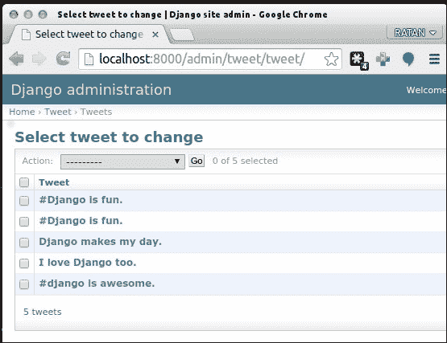
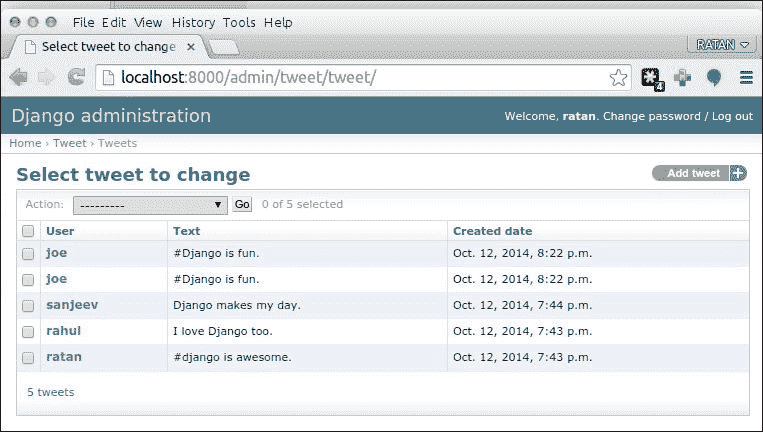
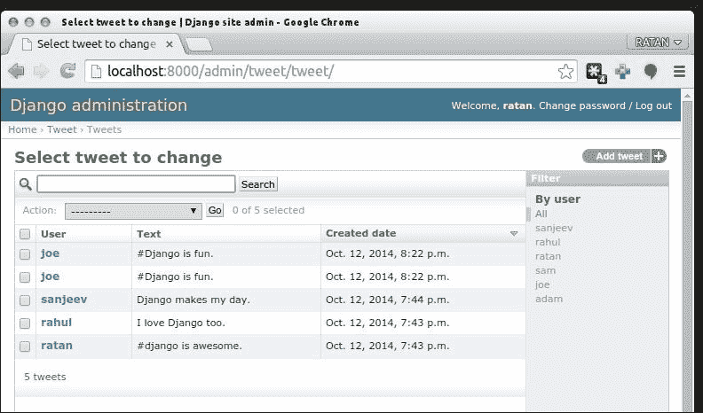
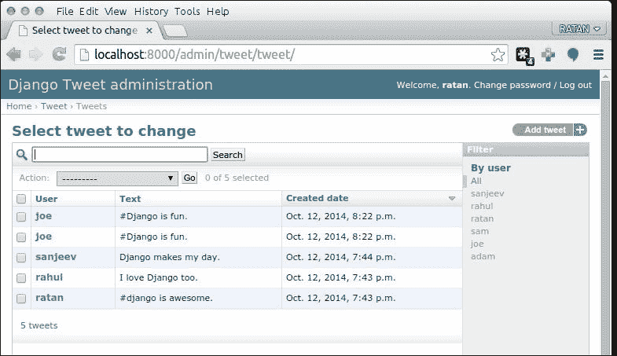
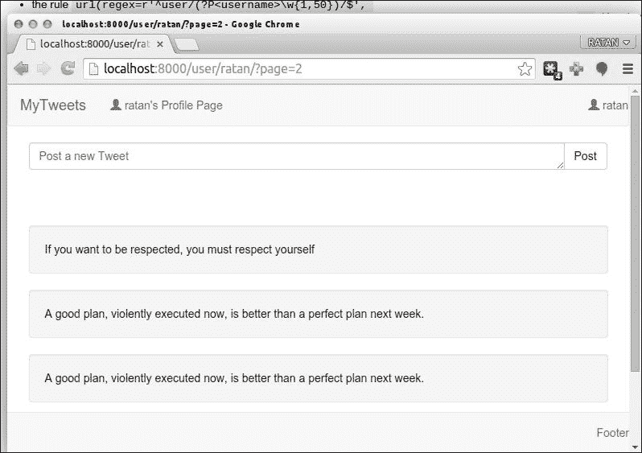
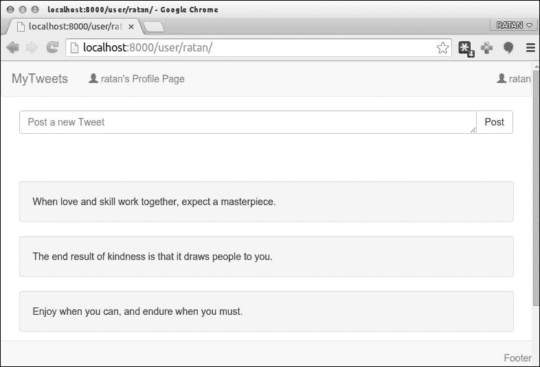

# 第八章：创建管理界面

在本章中，我们将学习使用 Django 的内置功能的管理员界面的特性。我们还将介绍如何以自定义方式显示推文，包括侧边栏或启用分页。本章将涉及以下主题：

+   自定义管理界面

+   自定义列表页面

+   覆盖管理模板

+   用户、组和权限

+   用户权限

+   组权限

+   在视图中使用权限

+   将内容组织成页面（分页）

# 自定义管理界面

Django 提供的管理界面非常强大和灵活，从 1.6 版本开始，默认情况下就已激活。这将为您的站点提供一个功能齐全的管理工具包。尽管管理应用程序对大多数需求应该足够了，但 Django 提供了几种自定义和增强它的方法。除了指定哪些模型可用于管理界面外，您还可以指定如何呈现列表页面，甚至覆盖用于呈现管理页面的模板。因此，让我们了解这些功能。

# 自定义列表页面

正如我们在上一章中看到的，我们使用以下方法将我们的模型类注册到管理界面：

+   `admin.site.register` (`Tweet`)

+   `admin.site.register` (`Hashtag`)

+   `admin.site.register` (`UserFollower`)

我们还可以自定义管理页面的几个方面。让我们通过示例来了解这一点。推文列表页面显示每条推文的字符串表示，如下面的屏幕截图所示：



如果此页面能够显示发布推文的用户的名称以及发布时间，那不是更有用吗？事实证明，实现这个功能只需要添加几行代码。

编辑`tweet/admin.py`文件中的推文模型如下：

```py
  from django.contrib import admin
  from models import Tweet, HashTag
  from user_profile.models import UserFollower
  # Register your models here.
  admin.site.register(Tweet)
  admin.site.register(HashTag)
  admin.site.register(UserFollower)
```

在“＃在此注册您的模型”上方添加新的代码行，更新后的代码将如下所示：

```py
  from django.contrib import admin
  from models import Tweet, HashTag
  from user_profile.models import UserFollower
 class TweetAdmin(admin.ModelAdmin):
 list_display = ('user', 'text', 'created_date')
  # Register your models here.
  admin.site.register(Tweet, TweetAdmin)))
  admin.site.register(HashTag)
  admin.site.register(UserFollower)
```

此代码为`TweetAdmin()`类的管理员视图添加了额外的列：

```py
  class TweetAdmin(admin.ModelAdmin):
    list_display = ('user', 'text', 'created_date')
```

此外，我们为管理员推文传递了一个额外的参数；即`admin.site.register(Tweet)`现在变成了`admin.site.register(Tweet, TweetAdmin)`。刷新同一页面，注意变化，如下面的屏幕截图所示：



表现得更有条理了！我们只需在`Tweet`模型的`TweetAdmin()`类中定义一个名为`list_display`的元组属性。该元组包含要在列表页面中使用的字段的名称。

在 Admin 类中还有其他属性可以定义；每个属性应该定义为一个或多个字段名称的元组。

+   `list_filter`：如果定义了，这将创建一个侧边栏，其中包含可以根据模型中一个或多个字段来过滤对象的链接。

+   `ordering`：用于在列表页面中对对象进行排序的字段。

+   `search_fields`：如果定义了，它将创建一个可用于搜索的搜索字段。字段名称前面加上减号，并且根据一个或多个字段的数据模型中的可用对象，使用降序而不是升序。

让我们在推文列表页面中利用前述每个属性。再次编辑`tweet/admin.py`文件中的推文模型，并追加以下突出显示的行：

```py
  from django.contrib import admin
  from models import Tweet, HashTag
  from user_profile.models import UserFollower

  class TweetAdmin(admin.ModelAdmin):
    list_display = ('user', 'text', 'created_date')
 list_filter = ('user', )
 ordering = ('-created_date', )
 search_fields = ('text', )

  # Register your models here.
  admin.site.register(Tweet, TweetAdmin)
  admin.site.register(HashTag)
  admin.site.register(UserFollower)
```

使用这些属性后的效果如下：



正如您所看到的，我们能够只用几行代码来自定义和增强推文列表页面。接下来，我们将学习如何自定义用于呈现管理页面的模板，这将使我们对管理界面有更大的控制权。

# 覆盖管理模板

有时您想要更改管理界面的外观或移动各种管理页面上的元素并重新排列它们。幸运的是，管理界面足够灵活，可以通过允许我们覆盖其模板来执行所有这些操作及更多操作。自定义管理模板的过程很简单。首先，您将模板从管理应用程序文件夹复制到项目的模板文件夹中，然后编辑此模板并根据您的喜好进行自定义。管理模板的位置取决于 Django 的安装位置。以下是 Django 在主要操作系统下的默认安装路径列表：

+   Windows：`C:\PythonXX\Lib\site-packages\django`

+   UNIX 和 Linux：`/usr/lib/pythonX.X/site-packages/django`

+   Mac OS X：`/Library/Python/X.X/site-packages/django`

（这里，**X.X**是您系统上 Python 的版本。`site-packages`文件夹也可以被称为`dist-packages`。）

如果您在操作系统的默认安装路径中找不到 Django，请执行文件系统搜索`django-admin.py`。您会得到多个结果，但您想要的结果将在 Django 安装路径下，位于名为`bin`的文件夹内。

找到 Django 安装路径后，打开`django/contrib/admin/templates/`，您将找到管理应用程序使用的模板。

此目录中有许多文件，但最重要的文件是这些：

+   `admin/base_site.html`：这是管理的基本模板。此模板生成界面。所有页面都继承自以下模板。

+   `admin/change_list.html`：此模板生成可用对象的列表。

+   `admin/change_form.html`：此模板生成用于添加或编辑对象的表单。

+   `admin/delete_confirmation.html`：此模板在删除对象时生成确认页面。

让我们尝试自定义其中一个模板。假设我们想要更改所有管理页面顶部的字符串**Django administration**。为此，在我们项目的`templates`文件夹内创建一个名为`admin`的文件夹，并将`admin/base_site.html`文件复制到其中。然后，编辑文件以将所有`Django`的实例更改为`Django Tweet`：

```py
  
  
  {{ title|escape }} |
  
  
  <h1 id="site-name"></h1>
  
  
```

结果将如下所示：



由于管理模板的模块化设计，通常不需要也不建议替换整个模板。通常最好只覆盖您需要更改的模板部分。

这个过程非常简单，不是吗？随意尝试其他模板。例如，您可能想要向列表或编辑页面添加帮助消息。

管理模板利用了 Django 模板系统的许多高级功能，因此如果您看到一个您不熟悉的模板标签，可以参考 Django 文档。

# 用户、组和权限

到目前为止，我们一直使用`manage.py syncdb`命令创建的超级用户帐户登录到管理界面。但实际上，您可能有其他受信任的用户需要访问管理页面。在本节中，我们将看到如何允许其他用户使用管理界面，并在此过程中了解更多关于 Django 权限系统的信息。

但在我们继续之前，我想强调一点：只有受信任的用户应该被授予对管理页面的访问权限。管理界面是一个非常强大的工具，所以只有你熟悉的人才应该被授予访问权限。

## 用户权限

如果数据库中除了超级用户之外没有其他用户，请使用我们在第七章中构建的注册表单创建一个新用户帐户，*关注和评论*。或者，您可以通过单击**用户**，然后单击**添加用户**来使用管理界面本身。

接下来，返回用户列表，然后单击新创建的用户的名称。您将获得一个表单，可用于编辑用户帐户的各个方面，例如姓名和电子邮件信息。在编辑表单的**权限**部分下，您将找到一个名为**员工状态**的复选框。启用此复选框将允许新用户进入管理界面。但是，他们登录后将无法做太多事情，因为此复选框仅授予对管理区域的访问权限；它不会赋予查看或更改数据的能力。

为了给新用户足够的权限来更改数据模型，您可以启用**超级用户状态**复选框，这将授予新用户执行任何所需功能的完全权限。此选项使帐户与`manage.py syncdb`命令创建的超级用户帐户一样强大。

然而，总的来说，不希望将用户对所有内容都授予完全访问权限。因此，Django 允许您通过权限系统对用户的操作进行精细控制。在**超级用户状态**复选框下方，您将找到可以授予用户的权限列表。如果您查看此列表，您将发现每个数据模型都有三种类型的权限：

+   向数据模型添加对象

+   更改数据模型中的对象

+   从数据模型中删除对象

这些权限是由 Django 自动生成的，用于包含 Admin 类的数据模型。使用箭头按钮向我们正在编辑的帐户授予一些权限。例如，给予帐户添加、编辑和删除推文和主题标签的能力。接下来，注销然后使用新帐户再次登录到管理界面。您会注意到您只能管理推文和主题标签数据模型。

用户编辑页面的权限部分还包含一个名为**活跃**的复选框。此复选框可用作全局开关，用于启用或禁用帐户。取消选中时，用户将无法登录到主站点或管理区域。

## 组权限

如果您有大量共享相同权限的用户，编辑每个用户帐户并为他们分配相同权限将是一项繁琐且容易出错的任务。因此，Django 提供了另一个用户管理设施：组。简单来说，组是对共享相同权限的用户进行分类的一种方式。您可以创建一个组并为其分配权限。当您将用户添加到组时，该用户将被授予组的所有权限。

创建组与创建其他数据模型并没有太大的不同。在管理界面的主页上点击**组**，然后点击**添加组**。接下来，输入组名并为组分配一些权限；最后，点击**保存**。

要将用户添加到组中，请编辑用户帐户，滚动到编辑表单中的**组**部分，然后选择要将用户添加到的任何组。

## 在视图中使用权限

尽管到目前为止我们只在管理界面中使用了权限，但 Django 还允许我们在编写视图时利用权限系统。在编写视图时，可以使用权限来授予一组用户对特定功能或页面的访问权限，例如私人内容。我们将在本节中了解可以用来实现此目的的方法。我们不会实际更改应用程序的代码，但如果您想尝试解释的方法，请随意这样做。

如果您想要检查用户是否具有特定权限，可以在`User`对象上使用`has_perm()`方法。该方法采用表示权限的字符串，格式如下：

```py
app.operation_model
```

`app`参数指定了模型所在的应用程序的名称；`operation`参数可以是`add`、`change`或`delete`；`model`参数指定了模型的名称。

例如，要检查用户是否可以添加推文，使用以下代码：

```py
  user.has_perm('tweets.add_tweet')
```

要检查用户是否可以更改推文，使用以下代码：

```py
  user.has_perm('tweets.change_tweet')
```

此外，Django 提供了一个名为`decorator`的函数，可以用来限制只有特定权限的用户才能访问视图。这个装饰器叫做`permission_required`，位于`django.contrib.auth.decorators`包中。

使用这个装饰器类似于我们使用`login_required`函数的方式。这个装饰器函数是为了限制页面只对已登录用户开放。假设我们想要将`tweet_save_page`视图（在`tweets/views.py`文件中）限制为具有`tweet.add_tweet`权限的用户。为此，我们可以使用以下代码：

```py
from django.contrib.auth.decorators import permission_required
@permission_required('tweets.add_tweet', login_url="/login/")
def tweet_save_page(request):
  # [...]
```

这个装饰器接受两个参数：要检查的权限以及如果用户没有所需权限时要重定向用户的位置。

使用`has_perm`方法还是`permission_required`装饰器取决于您想要的控制级别。如果您需要控制对整个视图的访问权限，请使用`permission_required`装饰器。但是，如果您需要对视图内的权限进行更精细的控制，请使用`has_perm`方法。这两种方法应该足够满足任何权限相关的需求。

# 将内容组织成页面 - 分页

在之前的章节中，我们已经涵盖了列出用户的推文和列出最多关注的用户等内容，但是考虑到当这些小数字扩大并且我们开始获得大量结果时的使用情况。为了应对这种情况，我们应该调整我们的代码以支持分页。

页面的大小会增加，而在页面中找到项目将变得困难。幸运的是，这有一个简单直观的解决方案：分页。**分页**是将内容分成页面的过程。而且，正如以往一样，Django 已经有一个实现这个功能的组件，可以供我们使用！

如果我们有一大堆推文，我们将这些推文分成每页十个（左右）项目的页面，并向用户呈现第一页，并提供链接以浏览其他页面。

Django 分页功能封装在一个名为`Paginator`的类中，该类位于`django.core.paginator`包中。让我们使用交互式控制台来学习这个类的接口：

```py
  from tweet.models import *
  from django.core.paginator import Paginator
  query_set = Tweet.objects.all()
  paginator = Paginator(query_set, 10)
```

### 注意

使用`python manage.py shell`命令打开 Django shell。

在这里，我们导入一些类，构建一个包含所有书签的查询集，并实例化一个名为`Paginator`的对象。这个类的构造函数接受要分页的查询集，以及每页的项目数。

让我们看看如何从`Paginator`对象中检索信息（当然，结果会根据您拥有的书签数量而有所不同）：

```py
>>> paginator.num_pages # Number of pages
1
>>> paginator.count # Total number of items
5
# Items in first page (index is zero-based)
>>> paginator.object_list
[<Tweet: #django is awesome.>, <Tweet: I love Django too.>, <Tweet: Django makes my day.>, <Tweet: #Django is fun.>, <Tweet: #Django is fun.>]

# Does the first page have a previous page?
>>> page1 = paginator.page(1)
# Stores the first page object to page1
>>> page1.has_previous()
False
# Does the first page have a next page?
>>> page1.has_next()
True

```

正如您所看到的，`Paginator`为我们做了大部分的工作。它接受一个查询集，将其分成页面，并使我们能够将查询集呈现为多个页面。

让我们将分页功能实现到我们的一个视图中，例如推文页面。打开`tweet/views.py`并修改`user_page`视图如下：

我们有我们的用户个人资料页面列表，其中包含以下类：

```py
  class Profile(LoginRequiredMixin, View):
    """User Profile page reachable from /user/<username> URL"""
    def get(self, request, username):
      params = dict()
      userProfile = User.objects.get(username=username)
      userFollower = UserFollower.objects.get(user=userProfile)
      if userFollower.followers.filter(username=request.user.username).exists():
        params["following"] = True
      else:
        params["following"] = False
        form = TweetForm(initial={'country': 'Global'})
        search_form = SearchForm()
        tweets = Tweet.objects.filter(user=userProfile).order_by('-created_date')
        params["tweets"] = tweets
        params["profile"] = userProfile
        params["form"] = form
        params["search"] = search_form
        return render(request, 'profile.html', params)
```

我们需要修改前面的代码以使用分页：

```py
  class Profile(LoginRequiredMixin, View):
    """User Profile page reachable from /user/<username> URL"""
    def get(self, request, username):
      params = dict()
      userProfile = User.objects.get(username=username)
      userFollower = UserFollower.objects.get(user=userProfile)
      if userFollower.followers.filter(username=request.user.username).exists():
        params["following"] = True
      else:
        params["following"] = False
        form = TweetForm(initial={'country': 'Global'})
        search_form = SearchForm()
        tweets = Tweet.objects.filter(user=userProfile).order_by('-created_date')
        paginator = Paginator(tweets, TWEET_PER_PAGE)
        page = request.GET.get('page')
      try:
        tweets = paginator.page(page)
        except PageNotAnInteger:
          # If page is not an integer, deliver first page.
          tweets = paginator.page(1)
      except EmptyPage:
        # If page is out of range (e.g. 9999), deliver last page of results.
        tweets = paginator.page(paginator.num_pages)
        params["tweets"] = tweets
        params["profile"] = userProfile
        params["form"] = form
        params["search"] = search_form
        return render(request, 'profile.html', params)
```

以下代码片段主要在前面的代码中实现了分页的魔法：

```py
        tweets = Tweet.objects.filter(user=userProfile).order_by('-created_date')
        paginator = Paginator(tweets, TWEET_PER_PAGE)
        page = request.GET.get('page')
        try:
          tweets = paginator.page(page)
        except PageNotAnInteger:
          # If page is not an integer, deliver first page.
          tweets = paginator.page(1)
        except EmptyPage:
          # If page is out of range (e.g. 9999), deliver last page of results.
          tweets = paginator.page(paginator.num_pages)
```

为了使这段代码工作，需要在`settings.py`文件中添加`TWEET_PER_PAGE = 5`参数，并在前面的代码中，只需在代码顶部添加`import settings.py`语句。

我们从请求中读取了一个名为`page`的`get`变量，告诉 Django 请求了哪个页面。我们还在`settings.py`文件中设置了`TWEET_PER_PAGE`参数，以显示单个页面上的推文数量。对于这种特定情况，我们选择了`5`。

`paginator = Paginator(tweets, TWEET_PER_PAGE)`方法创建一个分页对象，其中包含有关查询的所有信息。

现在，只需使用 URL `user/<username>/?page=<page_numer>`，页面将如下截图所示。第一张图片显示了带有 URL 中页面编号的用户推文。



以下截图显示了用户主页上的推文列表：



# 总结

尽管本章相对较短，但我们学会了如何实现许多事情。这强调了 Django 让您只需几行代码就能做很多事情的事实。您学会了如何利用 Django 强大的管理界面，如何自定义它，以及如何利用 Django 提供的全面权限系统。

在下一章中，您将了解到几乎每个 Web 2.0 应用程序中都有的一些令人兴奋的功能。
