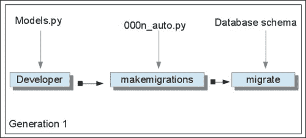
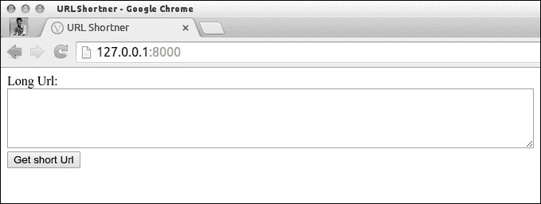

# 第十一章：数据库连接

Django 是一个数据库无关的框架，这意味着 Django 提供的数据库字段被设计为在不同的数据库中工作，比如 SQLite、Oracle、MySQL 和 PostgreSQL。事实上，它们也可以在几个第三方数据库后端上工作。PostgreSQL 是 Django 在生产中的一个很好的数据库，而 SQLite 用于开发环境，如果你不想为项目使用关系数据库管理系统（RDBMS），你将需要做很多工作。本章将详细介绍这两种类型的区别，并向您展示哪种更适合 Django，以及我们如何在 Django 项目中实际实现它们。

以下是本章将涉及的主题：

+   SQL 与 NoSQL

+   Django 与关系数据库

+   Django 与 NoSQL

+   建立数据库系统

+   单页应用项目 - URL 缩短器

首先，让我们看看 SQL 和 NoSQL 之间的区别。

# SQL 与 NoSQL

SQL 数据库或关系数据库已经存在很长时间；事实上，直到新术语被创造出来之前，数据库大致被假定为 SQL 数据库，这个新术语就是 NoSQL。

好吧，我们正在谈论 SQL 和 NoSQL 之间的高级区别。以下是它们之间的区别：

| SQL 数据库（RDBMS） | NoSQL 数据库 |
| --- | --- |
| SQL 数据库是关系数据库（RDBMS） | NoSQL 数据库是非关系或分布式数据库 |
| SQL 数据库基于表及其与其他表的关系 | NoSQL 基于文档、键值对、图数据库或宽列存储 |
| SQL 数据库将数据存储在表的行中 | NoSQL 是一组键值对、文档、图数据库或宽列存储 |
| SQL 数据库有预定义的模式 | NoSQL 有动态模式 |
| SQL 数据库是纵向可扩展的 | NoSQL 数据库是横向可扩展的 |
| SQL 数据库的例子有 MySQL、Oracle、SQLite、PostgreSQL 和 MS SQL | NoSQL 数据库的例子有 MongoDB、BigTable、Redis、RavenDB、Cassandra、HBase、Neo4j 和 CouchDB |

让我们试着了解一些著名的 SQL 和 NoSQL 数据库的基本特性。

## SQL 数据库

以下部分涉及不同的 SQL 数据库及其用法。

### MySQL - 开源

作为世界上最流行的数据库之一，MySQL 具有一些优点，使其适用于各种业务问题。以下是 MySQL 的一些重要优点：

+   **复制**：MySQL 支持复制，通过复制 MySQL 数据库，可以显著减少一台机器的工作负载，并且可以轻松扩展应用程序

+   **分片**：当写操作数量非常高时，分片通过将应用服务器分区来将数据库分成小块，有助于减轻负载

### PostgreSQL

如前所述，PostgreSQL 是 Django 社区中最受欢迎的数据库。它也拥有核心支持的数据库中最广泛的功能集。

进化的 PostgresSQL 的高级查询和功能使得将复杂的传统 SQL 查询转换为更简单的查询变得可能。然而，使用传统的 SQL 数据库实现数组、hstore、JSON 等功能有点棘手。

## NoSQL 数据库

这个概念是在水平扩展困难且基于 RDBMS 的数据库无法像预期的那样扩展时引入的。它通常被称为 Not only SQL。它提供了一种存储和检索数据的机制，而不是传统的 SQL 方法。

### MongoDB

MongoDB 是最受欢迎的基于文档的 NoSQL 数据库之一，它以类似 JSON 的文档存储数据。它是一个非关系数据库，具有动态模式。它是由**DoubleClick**的创始人开发的。它是用**C++**编写的，目前被一些大公司使用，如纽约时报、Craigslist 和 MTV Networks。以下是 MongoDB 的一些优点和优势：

+   **速度**：对于简单的查询，它具有良好的性能，因为所有相关数据都在一个单个文档中，消除了连接操作

+   **可扩展性**：它是水平可扩展的，也就是说，您可以通过增加资源池中服务器的数量来减少工作负载，而不是依赖独立的资源

+   **易管理**：对开发人员和管理员都很容易使用。这也使得 MondoDB 具有共享数据库的能力

+   **动态模式**：它为您提供了在不修改现有数据的情况下演变数据模式的灵活性

### CouchDB

CouchDB 也是一种基于文档的 NoSQL 数据库。它以 JSON 文档的形式存储数据。以下是 CouchDB 的一些优点和优势：

+   **无模式**：作为 NoSQL 家族的一员，它也具有无模式的特性，使其更加灵活，因为它具有存储数据的 JSON 文档形式

+   **HTTP 查询**：您可以使用 Web 浏览器访问数据库文档

+   **冲突解决**：它具有自动冲突，当您要使用分布式数据库时非常有用

+   **易复制**：复制相当简单

### Redis

Redis 是另一个开源的 NoSQL 数据库，主要因其闪电般的速度而被广泛使用。它是用 ANSI C 语言编写的。以下是 Redis 的一些优点和优势：

+   **数据结构**：Redis 提供了高效的数据结构，有时被称为数据结构服务器。存储在数据库中的键可以是哈希、列表和字符串，并且可以是排序或无序集合。

+   **Redis 作为缓存**：您可以使用 Redis 作为缓存，通过实现具有有限时间的键来提高性能。

+   **非常快**：它被认为是最快的 NoSQL 服务器之一，因为它使用内存数据集。

# 设置数据库系统

Django 支持多种数据库引擎。然而有趣的是，您只需要学习一个 API 就可以使用任何这些数据库系统。

这可能是因为 Django 的数据库层抽象了对数据库系统的访问。

稍后您将了解这一点，但是现在，您只需要知道无论您选择哪种数据库系统，都可以在不修改的情况下运行本书（或其他地方）开发的 Django 应用程序。

与客户端-服务器数据库系统不同，SQLite 不需要在内存中保留进程，并且将数据库存储在单个文件中，使其非常适合我们的开发环境。这就是为什么我们在整个项目中一直使用这个数据库，直到现在。当然，您可以自由选择使用您喜欢的数据库管理系统。我们可以通过编辑配置文件告诉 Django 使用哪个数据库系统。值得注意的是，如果您想使用 MySQL，您需要安装 MySQL，这是 Python 的 MySQL 驱动程序。

在 Django 中安装数据库系统非常简单；您只需要先安装要配置的数据库，然后在`settings.py`文件中添加几行配置，数据库设置就完成了。

## 设置 MySQL

我们将在接下来的几节中逐步安装和配置 MySQL 及其相关插件。

### 在 Linux - Debian 中安装 MySQL

在 Linux 中执行以下命令安装 MySQL（这里是 Debian）：

```py
sudo apt-get install mysql-server 

```

执行此命令后，将要求您设置 MySQL 并使用用户名和密码配置数据库。

### 安装 Python 的 MySQL 插件

要安装所需的与 MySQL 相关的插件，请使用以下命令：

```py
pip install MySQL-python 

```

现在，打开`settings.py`文件，并添加以下行以使 Django 连接到 MySQL：

```py
DATABASES = {
  'default': {
  'ENGINE': 'django.db.backends.mysql',
  'NAME': 'django_db',
  'USER': 'your_username',
  'PASSWORD': 'your_password',
  }
}
```

就是这样，现在你需要做的就是在新配置的数据库中重新创建所有表，并运行以下命令：

```py
python manage.py syncdb 

```

### 注意

如果您尝试访问未定义的数据库，将会收到`django.db.utils.ConnectionDoesNotExist`异常。

Django 的优势在于您可以同时在多个数据库中使用它。

然而，您可能会想，为什么在同一个项目中需要多个数据库？

直到 NoSQL 数据库出现之前，在大多数情况下，通常使用同一个数据库来保存所有类型的数据记录，从关键数据（如用户详细信息）到转储数据（如日志）；所有这些都保存在同一个数据库中，系统在扩展系统时面临挑战。

对于多数据库系统，一个理想的解决方案可能是将关系信息（例如用户、角色和其他帐户信息）存储在 SQL 数据库（如 MySQL）中。独立的应用程序数据可以存储在 NoSQL 数据库（如 MongoDB）中。

我们需要通过配置文件定义多个数据库。当您想要使用多个数据库与您使用的数据库服务器时，Django 需要告诉您。因此，在`settings.py`文件中，您需要使用数据库别名映射更改`DATABASES`设置。

多数据库配置的一个适当示例可以写成如下形式：

```py
DATABASES = {
  'default': {
    'NAME': 'app_data',
    'ENGINE': 'django.db.backends.postgresql_psycopg2',
    'USER': 'postgres_user',
    'PASSWORD': 's3krit'
  },
  'users': {
    'NAME': 'user_data',
    'ENGINE': 'django.db.backends.mysql',
    'USER': 'mysql_user',
    'PASSWORD': 'priv4te'
  }
}
```

上述示例使用了两个数据库，分别是 PostgreSQL 和 MySQL，具有所需的凭据。

## 迁移和迁移的需求

迁移允许您通过创建代表模型更改的迁移文件来更新、更改和删除模型，并且可以在任何开发、暂存或生产数据库上运行。

Django 的模式迁移经历了漫长而复杂的历史；在过去的几年里，第三方应用**South**是唯一的选择。如果您考虑迁移的重要性，Django 1.7 发布时内置了迁移支持。

我们还需要了解 South 与 Django 迁移的区别。对于熟悉 South 的人来说，这应该感觉相当熟悉，可能会更清晰一些。为了方便参考，以下表格比较了旧的 South 工作流程和新的 Django 迁移工作流程：

| 步骤 | South | Django 迁移 |
| --- | --- | --- |
| 初始迁移 | 运行 `syncdb` 然后 `./manage.py schemamigration <appname> --initial` | `./manage.py makemigrations <appname>` |
| 应用迁移 | `./manage.py migrate <appname>` | `./manage.py migrate <appname>` |
| 非首次迁移 | `./manage.py schemamigration <appname> --auto` | `./manage.py makemigration <appname>` |

因此，从表中我们可以看出，Django 迁移基本上遵循与 South 相同的流程，至少对于标准迁移流程来说，这只是简化了一些事情。

### Django 迁移中的新功能

新的迁移代码将是 South 的改进版本，但将基于相同的概念，如下所示：

+   每个应用程序的迁移

+   自动检测变化

+   数据迁移与模式迁移同时进行

让我们看一下以下术语列表，以了解 Django 迁移的优势：

+   **改进的迁移格式**：改进的迁移格式可读性更强，因此可以在不实际执行的情况下进行优化或检查

+   **重置基线**：在这种情况下，不需要每次保留或执行整个迁移历史，因为现在可以随着项目的增长创建新的第一次迁移

+   **改进的自动检测**：新的和自定义字段更改将更容易被检测到，因为迁移将与改进的字段 API 一起构建

+   **更好的合并检测**：新的迁移格式将自动解决不同版本控制系统分支之间的合并，如果我们能够合并这些更改，就不再需要任何工作

一旦您设置好项目并启动应用程序，也就是说，您的应用程序已经在数据库中生成了必要的表，您不应该对 Django 模型进行复杂的更改，也就是说，您不应该从一个类中删除属性。然而，在实际情况下，这是不可能的，因为您可能需要相应地更改您的模型类。在这种情况下，我们有一个解决这些问题的方法。这个过程被称为**迁移**，在 Django 中，这些迁移是通过一个叫做 South 的模块来完成的。

直到 Django 的 1.7 版本，即最新版本，您必须单独安装 south 模块。然而，自 Django 的 1.7 迁移以来，south 模块是一个内置模块。您可能一直在这样做，例如，当您使用以下命令更改（例如添加新属性）您的模型类时：

```py
$python manage.py syncdb 

```

使用更新版本，`manage.py syncdb`已经被弃用以进行迁移，但如果您仍然喜欢旧的方式，现在可以使用。

## 后端支持

这对于任何用于生产的 Django 应用程序来说都是非常重要的，以获得迁移支持。因此，选择一个主要受迁移模块支持的数据库总是一个更好的决定。

一些最兼容的数据库如下：

+   **PostgreSQL**：在迁移或模式支持方面，PostgresSQL 是最兼容的数据库。

### 注意

您可以使用`null=True`初始化新列，因为这样可以更快地添加。

+   **MySQL**：MySQL 是一个广泛使用的数据库，因为 Django 无缝支持它。这里的问题是，在进行模式更改操作时，没有事务支持，也就是说，如果一个操作失败，您将不得不手动回滚更改。此外，对于每个模式更新，所有表都将被重写，这可能需要很长时间，重新启动应用程序可能需要很长时间。

+   **SQLite**：这是 Django 默认的数据库，主要用于开发目的。因此，它对以下情况的模式更改支持有限：

+   创建新表

+   数据复制

+   删除旧表

+   重命名表

## 如何进行迁移？

迁移主要是通过以下三个命令完成的，如下所示：

+   `makemigrations`：这是基于您对准备迁移查询的模型所做的更改

+   `migrate`：这将应用`makemigrations`查询准备的更改并列出它们的状态。

+   `sqlmigrate`：这显示了`makemigrations`查询准备的 SQL 查询

因此，Django 的模式迁移流程可以如下所述：

```py
$python manage.py makemigrations 'app_name'

```

这将准备迁移文件，其外观类似于以下内容：

```py
Migrations for 'app_name':
  0003_auto.py:
    - Alter field name on app_name
```

然后，在文件创建后，您可以检查目录结构。您将在`migration`文件夹下看到一个名为`0003_auto.py`的文件；您可以使用以下命令应用更改：

```py
$ python manage.py migrate app_name

```

以下是您需要执行的操作：

```py
Synchronize non migrated apps: sessions, admin, messages, auth, staticfiles, contenttypes
Apply all migrations: app_name
Synchronizing apps without migrations:
Creating tables...
Installing custom SQL...
Installing indexes...
Installed 0 object(s) from 0 fixture(s)
Running migrations:
Applying app_name.0003_auto... OK

```

`OK`消息表示迁移已成功应用。

为了使它更容易理解，迁移可以用以下图表来解释：



有三个独立的实体：

+   源代码

+   迁移文件

+   数据库

开发人员在源代码中进行更改，主要是在`models.py`文件中，并修改先前定义的模式。例如，当他们根据业务需求创建一个新字段，或者将 max_length 从 50 更新为 100。

我们将完成项目的适当迁移，以查看这个迁移实际上是如何工作的。

首先，我们必须创建应用程序的初始迁移：

```py
$ python manage.py makemigrations tweet

```

其输出如下：

```py
Migrations for 'tweet': 
0001_initial.py: 
- Create model HashTag 
- Create model Tweet 
- Add field tweet to hashtag 

```

这表明初始迁移已经创建。

现在，让我们改变我们的推文模态，现在如下所示：

`text = models.CharField(max_length=160, null=False, blank=False)`

我们将更改之前的推文模态为：

`text = models.CharField(max_length=140, null=False, blank=False)`

由于我们已经更改了我们的模式，现在我们必须进行迁移以正确运行应用程序。

从迁移流程中，我们了解到，现在我们必须运行`makemigrations`命令，如下所示：

```py
$python manage.py makemigrations tweet

```

其输出如下：

```py
Migrations for 'tweet': 
0002_auto_20141215_0808.py: 
- Alter field text on tweet 

```

正如你所看到的，它已经检测到了我们字段的更改。

为了验证，我们将打开我们的 SQL 数据库并检查 tweet 表的当前模式。

登录到 MySQL：

```py
$mysql -u mysql_username -pmysql_password mytweets 

```

在 MySQL 控制台中，写入：

```py
$mysql> desc tweet_tweet;

```

这将显示 tweet 表的模式，如下所示：

```py
+-------------------+-------------+------+-----+---------+----------------+
| Field | Type | Null | Key | Default | Extra |
+--------------+--------------+------+-----+---------+----------------+
| id | int(11) | NO | PRI | NULL | auto_increment |
| user_id | int(11) | NO | MUL | NULL | |
| text | varchar(160) | NO | | NULL | |
| created_date | datetime | NO | | NULL | |
| country | varchar(30) | NO | | NULL | |
| is_active | tinyint(1) | NO | | NULL | |
+--------------+--------------+------+-----+---------+----------------+
6 rows in set (0.00 sec)

```

由于我们还没有应用我们的迁移，数据库中明显显示字符字段中的文本为 160：

```py
text | varchar(160) | NO | | NULL

```

我们在应用我们的迁移后将做完全相同的事情：

```py
$python manage.py migrate tweet

```

以下是我们需要执行的操作：

```py
Apply all migrations: tweet
Running migrations:
Applying tweet.0002_auto_20141215_0808... OK

```

我们的迁移已成功应用；让我们从数据库中验证一下。

要在`tweet_tweet`表上运行相同的 MySQL `desc`命令，请使用以下命令：

```py
mysql> desc tweet_tweet;
+--------------+--------------+------+-----+---------+----------------+
| Field | Type | Null | Key | Default | Extra |
+--------------+--------------+------+-----+---------+----------------+
| id | int(11) | NO | PRI | NULL | auto_increment |
| user_id | int(11) | NO | MUL | NULL | |
| text | varchar(140) | YES | | NULL | |
| created_date | datetime | NO | | NULL | |
| country | varchar(30) | NO | | NULL | |
| is_active | tinyint(1) | NO | | NULL | |
+--------------+--------------+------+-----+---------+----------------+
6 rows in set (0.00 sec)

```

确实！我们的迁移已成功应用：

```py
| text | varchar(140) | YES | | NULL | |

```

### 迁移如何知道要迁移什么

Django 永远不会在同一个数据库上运行两次迁移，这意味着它会保留这些信息。这些信息由一个名为`django_migrations`的表管理，它是在第一次启动 Django 应用程序时创建的，之后每次迁移都会插入一行新数据。

例如，运行我们的迁移后，表格可能会看起来像这样：

```py
mysql> select * from django_migrations;
+----+-------+-------------------------+---------------------+
| id | app | name | applied |
+----+-------+-------------------------+---------------------+
| 1 | tweet | 0001_initial | 2014-12-15 08:02:34 |
| 2 | tweet | 0002_auto_20141215_0808 | 2014-12-15 08:13:19 |
+----+-------+-------------------------+---------------------+

```

前面的表格显示了有两个带有标记信息的迁移，并且每次迁移时，它都会跳过这些更改，因为这个表中已经有了对应于该迁移文件的条目。

这意味着即使你手动更改迁移文件，它也会被跳过。

这是有道理的，因为通常你不希望运行两次迁移。

然而，如果出于某种原因你真的想要应用两次迁移，你可以简单地删除表格条目中的*"THIS IS NOT A OFFICIALLY RECOMMENDED WAY"*，它将正常工作。

相反，如果你想要撤消特定应用的所有迁移，你可以迁移到一个名为 zero 的特殊迁移。

例如，如果你键入，tweet 应用的所有迁移将被撤销：

```py
$python manage.py migrate tweet zero

```

除了使用 zero，你还可以使用任意的迁移，如果那个迁移在过去，那么数据库将回滚到那个迁移的状态，或者如果还没有运行该迁移，那么数据库将向前滚动。

## 迁移文件

那么，迁移文件包含什么，当我们运行以下命令时到底发生了什么？

```py
$python manage.py migrate tweet 

```

运行完这个命令后，你会看到一个名为`migrations`的目录，里面存储着所有的迁移文件。让我们来看看它们。由于它们是 Python 文件，可能很容易理解。

打开`tweet/migrations/0001_initial.py`文件，因为这是初始迁移代码创建的文件。它应该看起来类似于以下内容：

```py
# -*- coding: utf-8 -*-
from __future__ import unicode_literals
from django.db import models, migrations

class Migration(migrations.Migration):
dependencies = [
  ('user_profile', '__first__'),
]

operations = [
  migrations.CreateModel(
  name='HashTag',
  fields=[
    ('id', models.AutoField(verbose_name='ID', serialize=False, auto_created=True, primary_key=True)),
    ('name', models.CharField(unique=True, max_length=64)),
  ],
  options = {
  },
  bases=(models.Model,),
  ),
  migrations.CreateModel(
  name='Tweet',
  fields=[
    ('id', models.AutoField(verbose_name='ID', serialize=False, auto_created=True, primary_key=True)),
    ('text', models.CharField(max_length=160)),
    ('created_date', models.DateTimeField(auto_now_add=True)),
    ('country', models.CharField(default=b'Global', max_length=30)),
    ('is_active', models.BooleanField(default=True)),
    ('user', models.ForeignKey(to='user_profile.User')),
  ],
  options = {
  },
  bases=(models.Model,),
  ),
  migrations.AddField(
    model_name='hashtag',
    name='tweet',
    field=models.ManyToManyField(to='tweet.Tweet'),
    preserve_default=True,
  ),
]
```

要使迁移实际工作，必须有一个名为`Migration()`的类，它继承自`django.db.migrations.Migration`模块。这是用于迁移框架的主要类，这个迁移类包含两个主要列表，如下所示：

+   **依赖项**：这是必须在迁移开始之前运行的其他迁移的列表。在存在依赖关系的情况下，比如外键关系的情况下，外键模型必须在其键被添加到这里之前存在。在前面的情况下，我们对`user_profile`参数有这样的依赖。

+   **操作**：这个列表包含要应用的迁移列表，整个迁移操作可以属于以下类别：

+   `CreateModel`：从名称本身，很明显这将创建一个新模型。从前面的模型文件中，你可以看到这样的行：

```py
migrations.CreateModel(
name='HashTag',....
migrations.CreateModel(
name='Tweet',..
```

这些迁移行创建了具有定义属性的新模型。

+   `DeleteModel`：这将包含从数据库中删除模型的语句。这些与`CreateModel`方法相反。

+   `RenameModel`：这将使用给定的新名称从旧名称重命名模型。

+   `AlterModelTable`：这将更改与模型关联的表的名称。

+   `AlterUniqueTogether`：这是更改的表的唯一约束。

+   `AlteIndexTogether`：这将更改模型的自定义索引集。

+   `AddField`：这只是向现有模型添加新字段。

+   `RemoveField`：这将从模型中删除字段。

+   `RenameField`：这将为模型将字段名称从旧名称重命名为新名称。

在更新应用程序时，模式的迁移不是唯一需要迁移的事情；还有另一件重要的事情叫做**数据迁移**。这是由先前操作已经存储在数据库中的数据，因此也需要迁移。

数据迁移可以在许多情况下使用。其中，最合乎逻辑的情况是：

+   将外部数据加载到应用程序中

+   当模型架构发生变化并且数据集也需要更新时

让我们通过从`username.txt`文件中加载推文来玩耍我们的项目。使用以下命令为我们的项目创建一个空迁移：

```py
$python manage.py makemigrations --empty tweet

```

这将生成一个名为`mytweets/migrations/003_auto<date_time_stamp>.py`的迁移文件。

打开这个文件；它看起来像下面这样：

```py
# -*- coding: utf-8 -*-
from __future__ import unicode_literals

from django.db import models, migrations

class Migration(migrations.Migration):

dependencies = [
  ('tweet', '0002_auto_20141215_0808'),
]

operations = [
]
```

这只是 Django 迁移工具的基本结构，要进行数据迁移，我们必须在操作中添加`RunPython()`函数，如下所示：

```py
# -*- coding: utf-8 -*-
from __future__ import unicode_literals

from django.db import models, migrations

def load_data(apps, schema_editor):
  Tweet(text='This is sample Tweet',
    created_date=date(2013,11,29),
    country='India',
    is_active=True,
  ).save()

class Migration(migrations.Migration):

dependencies = [
  ('tweet', '0002_auto_20141215_0808'),
]

operations = [
  migrations.RunPython(load_data)
]
```

就这些了。现在，运行迁移命令：

```py
$python manage.py migrate

```

这些是您需要执行的操作：

```py
Synchronize unmigrated apps: user_profile
Apply all migrations: admin, contenttypes, tweet, auth, sessions
Synchronizing apps without migrations:
Creating tables...
Installing custom SQL...
Installing indexes...
Running migrations:
Applying contenttypes.0001_initial... FAKED
Applying auth.0001_initial... FAKED
Applying admin.0001_initial... FAKED
Applying sessions.0001_initial... FAKED
Applying tweet.0003_auto_20141215_1349... OK

```

执行上述命令后，该命令迁移了所有应用程序，并最终应用了我们创建新推文的迁移，从加载的数据中创建了新推文：

```py
mysql> select * from tweet_tweet;
+----+---------+---------------------------------------------+---------------------+---------+-----------+
| id | user_id | text | created_date | country | is_active |
+----+---------+---------------------------------------------+---------------------+---------+-----------+
| 1 | 1 | This Tweet was uploaded from the file. | 2014-12-15 14:17:42 | India | 1 |
+----+---------+---------------------------------------------+---------------------+---------+-----------+
2 rows in set (0.00 sec)

```

很棒，对吧？

当您有以 JSON 或 XML 文件形式的外部数据时，这种解决方案非常必要。

理想的解决方案是使用命令行参数来获取文件路径并加载数据，如下所示：

```py
$python load data tweet/initial_data.json

```

不要忘记将迁移文件夹添加到 Git 中，因为它们与源代码一样重要。

## Django 与 NoSQL

Django 并不正式支持 NoSQL 数据库，但是在有这么多开发者的伟大社区的支持下，Django 有一个支持**MongoDB**作为后端数据库的分支。

为了说明问题，我们将使用 Django-Norel 项目来配置 Django 与 MongoDB 数据库。

您可以在[`django-nonrel.org/`](http://django-nonrel.org/)找到关于此的详细信息。

可以按照[`docs.mongodb.org/manual/installation/`](http://docs.mongodb.org/manual/installation/)中提到的步骤安装 MongoDB，根据您的配置。

在这里，我们将为 Linux 的 Debian 版本（具体来说是 Ubuntu）设置 MongoDB。

导入 MongoDB 公共 GPG 密钥：

```py
sudo apt-key adv --keyserver hkp://keyserver.ubuntu.com:80 --recv 7F0CEB10

```

为 MongoDB 创建一个列表文件：

```py
echo 'deb http://downloads-distro.mongodb.org/repo/ubuntu-upstart dist 10gen' | sudo tee /etc/apt/sources.list.d/mongodb.list

```

重新加载本地软件包数据库：

```py
sudo apt-get update

```

安装 MongoDB 软件包：

```py
sudo apt-get install -y mongodb-org

```

启动 MongoDB：

```py
sudo service mongod start

```

# 单页面应用项目 - URL 缩短器

MongoDB 可以与 Django 一起使用的两种方式如下：

+   **MongoEngine**：这是一个**文档对象映射器**（类似于 ORM，但用于文档数据库），用于从 Python 与 MongoDB 一起使用。

+   **Django non-rel**：这是一个支持 Django 在非关系型（NoSQL）数据库上的项目；目前支持 MongoDB。

## MongoEngine

在我们继续展示如何配置 MongoEngine 与 Django 之前，需要安装 MongoEngine。通过输入以下命令来安装 MongoEngine：

```py
sudo pip install mongoengine 

```

为了保护我们之前创建的项目，并更好地理解，我们将创建一个单独的新项目来配置 MongoDB，并且我们将使用现有项目来配置 MySQL：

```py
$django-admin.py startproject url_shortner
$cd url_shortner
$python manage.py startapp url

```

这将创建项目的基本结构，我们非常了解。

### 将 MongoDB 连接到 Django

我们将不得不修改`settings.py`文件，如果我们只在项目中使用 MognoDB，这在这种情况下是正确的，那么我们可以忽略标准数据库设置。我们所要做的就是在`settings.py`文件上调用`connect()`方法。

我们将为 MongoDB 放置一个虚拟后端。只需在`settings.py`文件中替换以下代码，如下所示：

```py
DATABASES = {
  'default': {
  'ENGINE': 'django.db.backends.sqlite3',
  'NAME': os.path.join(BASE_DIR, 'db.sqlite3'),
  }
}
```

用以下内容替换上述代码：

```py
DATABASES = {
  'default': {
  'ENGINE': 'django.db.backends.dummy'
  }
}
```

### Django 中的身份验证

MongoEngine 的优势在于它包括了 Django 身份验证后端。

用户模型成为 MongoDB 文档，并实现了大部分普通 Django 用户模型的方法和属性，这使得 MongoEngine 与 Django 兼容。我们还可以使用身份验证基础设施和装饰器，例如`login_required()`和`authentication()`方法。`auth`模块还包含`get_user()`方法，它接受用户 ID 作为参数并返回用户对象。

要为 MognoEngine 启用此后端，请在`settings.py`文件中添加以下内容：

```py
AUTHENTICATION_BACKENDS = (
  'mongoengine.django.auth.MongoEngineBackend',
)
```

### 存储会话

在 Django 中，您可以使用不同的数据库来存储应用程序的会话。要启用存储在 MongoDB 中的 MongoEngine 会话，`settings.py`文件中的`MIDDLEWARE_CLASSES`必须有`django.contrib.sessions.middleware.SessionMiddleware`参数的条目。还必须在`INSTALLED_APPS`中有`django.contrib.sessions`的条目，因为我们是从 Django 的基本结构开始的。

现在，您只需要在`settings.py`文件中添加以下行：

```py
SESSION_ENGINE = 'mongoengine.django.sessions'
SESSION_SERIALIZER = 'mongoengine.django.sessions.BSONSerializer'
```

我们现在已经准备好开始一个小型演示项目，在其中我们将在 MongoDB 中实现 URL 缩短项目。

让我们首先创建一个 URL 模型，我们将在其中存储所有长 URL 及其对应的短 URL。

转到以下`url/models.py`文件：

```py
from django.db import models
from mongoengine import *
connect('urlShortener')
```

您已经熟悉了上述代码的前两行，它们导入了模块。

第三行，即`connect('urlShortener')`，将 Django 连接到名为`urlShortener`的 MongoDB 数据库。

MongoDB 提供了许多连接机制供您选择，它们如下：

```py
from mongoengine import connect
connect('project1')
```

我们正在使用的方法将 MongoDB 从其默认端口（27017）中获取；如果您在其他端口上运行 MongoDB，请使用`connect()`方法进行连接：

```py
connect('project1', host='192.168.1.35', port=12345)
```

如果您为 MongoDB 配置了密码，可以传递参数如下：

```py
connect('project1', username='webapp', password='pwd123')
```

像 Django 的默认模型字段一样，MongoDB 也为您提供了不同的字段，它们是：

+   `BinaryField`：此字段用于存储原始二进制数据。

+   `BooleanField`：这是一个布尔字段类型。

+   `DateTimeField`：这是一个日期时间字段。

+   `ComplexDateTimeField`：这样处理微秒，而不是像`DateTimeField`那样将它们四舍五入。

+   `DecimalField`：这是一个固定小数点十进制数字段。

+   `DictField`：这是一个包装了标准 Python 字典的字典字段。这类似于嵌入式文档，但结构未定义。

+   `DynamicField`：这是一种真正动态的字段类型，能够处理不同和多样化的数据类型。

+   `EmailField`：这是一个验证输入为电子邮件地址的字段。

+   `FileField`：这是一个 GridFS 存储字段。

+   `FloatField`：这是一个浮点数字段。

+   `GeoPointField`：这是一个存储经度和纬度坐标的列表。

+   `ImageField`：这是图像文件存储字段。

+   `IntField`：这是一个 32 位整数字段。

+   `ListField`：这是一个列表字段，它包装了一个标准字段，允许在数据库中使用字段的多个实例作为列表。

+   `MapField`：这是一个将名称映射到指定字段类型的字段。这类似于`DictField`，只是每个项目的“值”必须与指定的字段类型匹配。

+   `ObjectIdField`：这是 MongoDB 对象 ID 的字段包装器。

+   `StringField`：这是一个 Unicode 字符串字段。

+   `URLField`：这是一个验证输入为 URL 等的字段。

### 注意

默认情况下，字段不是必需的。要使字段成为必需字段，请将字段的 required 关键字参数设置为`True`。字段还可以具有可用的验证约束（例如，前面示例中的 max_length）。字段还可以采用默认值，如果未提供值，则将使用默认值。默认值可以选择是可调用的，将调用以检索值（如前面的示例）。

可以在[`docs.mongoengine.org/en/latest/apireference.html`](http://docs.mongoengine.org/en/latest/apireference.html)上看到完整的不同字段列表。

现在，我们将创建我们的`Url()`类，它将类似于我们迄今为止创建的其他模型，比如推文等等：

```py
class Url(Document):
full_url = URLField(required=True)
short_url = StringField(max_length=50, primary_key=True, unique=True)
date = models.DateTimeField(auto_now_add=True)
```

让我们来看一下以下术语列表：

+   `full_url`：这是一个 URL 字段，将存储完整的 URL，以及触发其短 URL 时请求将重定向的相同 URL

+   `short_url`：这是相应长 URL 的短 URL

+   `date`：这将存储`Url`对象创建的日期。

现在，我们将转到视图并创建两个类：

+   **索引**：在这里，用户可以生成短链接。这也将有一个`post()`方法，保存每个长 URL。

+   **链接**：这是短 URL 重定向控制器。当查询短 URL 时，此控制器将请求重定向到长 URL，如下面的代码片段所示：

```py
class Index(View):
def get(self, request):
return render(request, 'base.html')

def post(self, request):
long_url = request.POST['longurl']
short_id = str(Url.objects.count() + 1)
url = Url()
url.full_url = long_url
url.short_url = short_id
url.save()
params = dict()
params["short_url"] = short_id
params['path'] = request.META['HTTP_REFERER']
return render(request, 'base.html', params)
```

让我们来看一下以下术语列表：

+   `get()`方法很简单：它将请求转发到`base.html`文件（我们将很快创建）

+   `post()`方法从请求的 POST 变量中获取长 URL 并设置对象计数，就像短 URL 保存`Url`对象到数据库一样：

```py
params['path'] = request.META['HTTP_REFERER'] 
```

这用于将当前路径传递给视图，以便可以使用锚标记使短 URL 可点击。

这就是这个 URL 对象在数据库中保存的方式：

```py
{ "_id" : ObjectId("548d6ec8e389a24f5ea44258"), "full_url" : "http://sample_long_url", "short_url" : "short_url" } 
```

现在，我们将继续创建`Link()`类，它将接受短 URL 请求并重定向到长 URL：

```py
class Link(View):
def get(self, request, short_url):
url = Url.objects(short_url=short_url)
result = url[0]
return HttpResponseRedirect(result.full_url)
```

`short_url`参数是来自请求 URL 的`short_url`代码：

```py
url = Url.objects(short_url=short_url)
```

前一行查询数据库，检查给定短 URL 的匹配长 URL 是否存在：

```py
return HttpResponseRedirect(result.full_url) 
```

这将重定向请求以从数据库中查找长 URL。

对于视图，我们需要创建的只是`base.html`文件。

由于这个项目的目的不是教你用户界面，我们不会包含任何库，并且会尽可能少地使用 HTML 来制作页面。

`base.html`文件的代码如下：

```py
<!DOCTYPE html>
  <html>
    <head lang="en">
      <meta charset="UTF-8">
      <title>URL Shortner</title>
    </head>
    <body>
      <form action="" method="post">
        
        Long Url:<br>
        <textarea rows="3" cols="80" name="longurl"></textarea>
        <br>
        <input type="submit" value="Get short Url">
      </form>

      <div id="short_url">
      
        <span>
          <a href="{{ path }}link/{{ short_url }}" target="_blank">{{ path }}link/{{ short_url }}</a>
        </span>
        
      </div>
    </body>
  </html>
```

这显示了一个带有表单的文本区域，并在提交表单后，在长 URL 下方显示了短链接。

这就是极简主义 URL 缩短器主页的样子：



为了使这个工作，我们现在需要做的就是创建所需的 URL 映射，如下所示：

```py
url_shortner/urlmapping.py

from django.conf.urls import patterns, url
from url.views import Index, Link
from django.contrib import admin
admin.autodiscover()

urlpatterns = patterns('',
url(r'^$', Index.as_view()),
url(r'^link/(\w+)/$', Link.as_view()),
)
```

# 摘要

本章的目的是为您准备使用不同数据库创建项目，并为您提供有关数据库迁移以及这些迁移如何工作的基本概念。这不仅将帮助您调试迁移，还可以创建自己的数据迁移脚本，将数据从 JSON 文件或任何其他文件格式直接加载到 Django 应用程序中进行初始化。

本章还为您提供了如何使用 Django 和 MongoDB 设置的基本概念，并且我们还看到了一个小项目演示，随后是在这里使用 MongoDB 扩展 Django 系统的实际应用。
