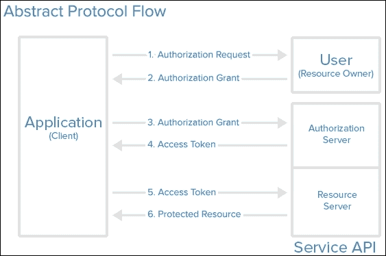
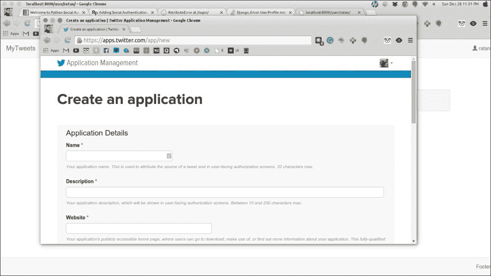
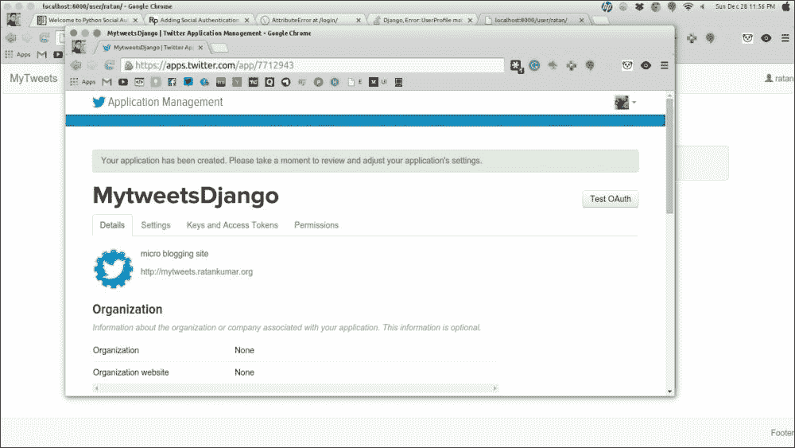
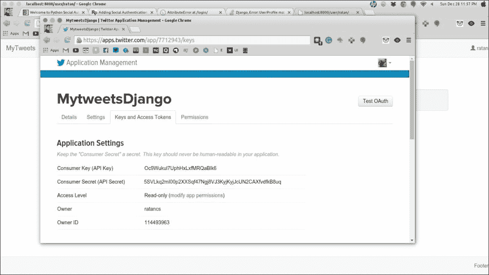
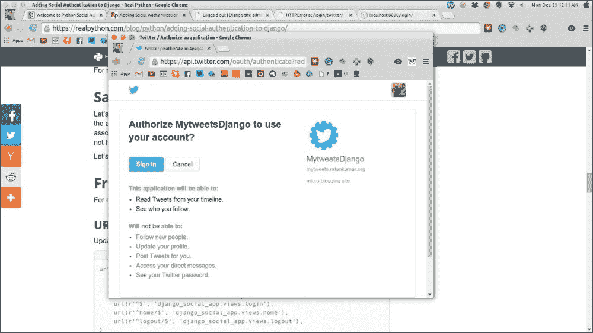
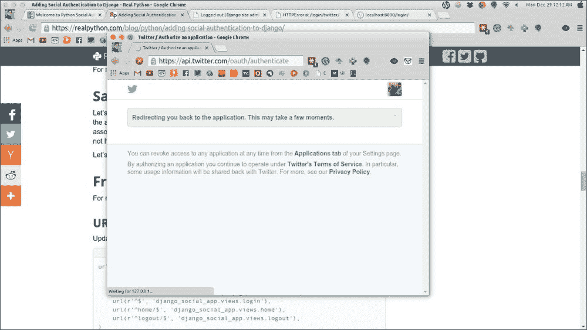
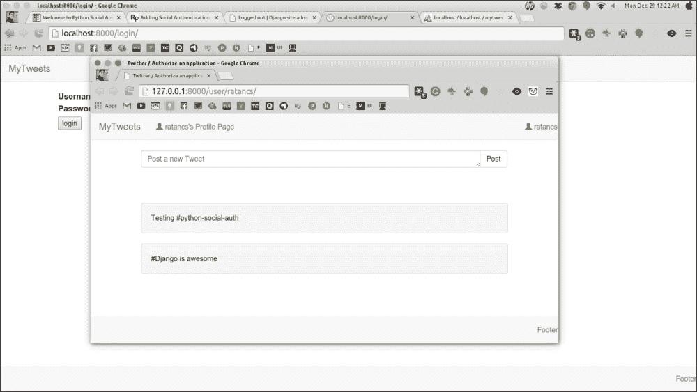
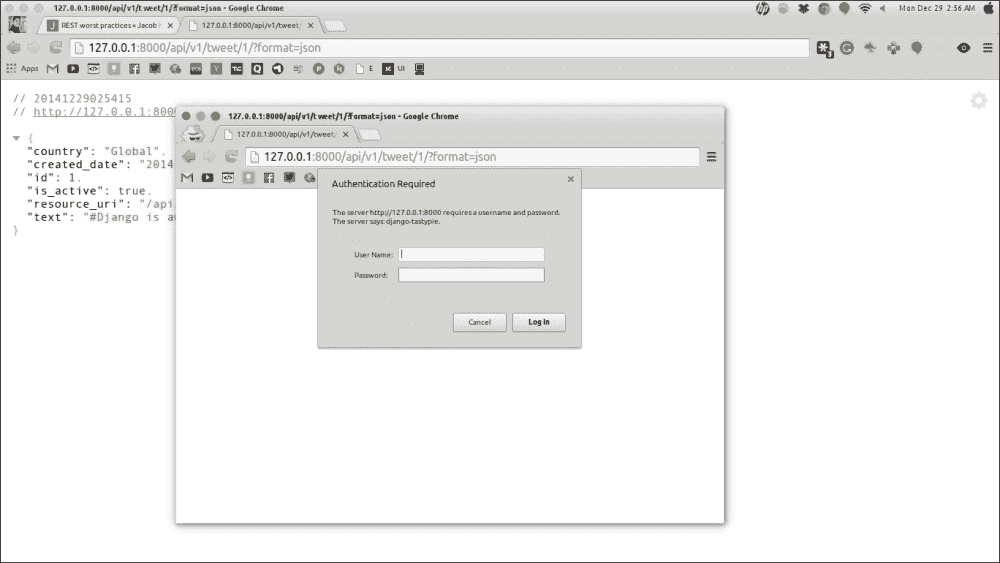

# 第十二章：使用第三方软件包

现在是时候将我们迄今学到的所有理论和原则结合起来，尝试理解我们如何利用第三方软件包来实现许多可能的项目，比如 Twitter API 的使用，Social Auth 等等。

在本章中，您将学习以下主题：

+   深入开源世界

+   在 Django 项目中使用 Social Auth

+   在 Django 中构建 REST API

除了使用 Django 和 Python 构建网站所需的核心模块之外，我们还需要一些第三方软件包。互联网上有许多免费的第三方软件包；您可以在[`www.djangopackages.com/`](https://www.djangopackages.com/)找到许多有用的软件包。我们将尝试为我们的项目使用开源第三方软件包。

# 深入开源世界

当我们看到开源这个词时，首先浮现在我们脑海中的问题是开源实际上是什么意思？

嗯，开源是一个指的是设计公开可访问并且可以根据任何人的需要进行修改，而无需事先获得任何许可的术语。

好的，那么，让我们继续，深入探讨开源世界的各个方面。

## 什么是开源软件？

开源软件意味着软件的源代码是公开可访问的，因此可以以任何可能的方式进行修改。此外，任何人都可以为源代码做出贡献，这通常会导致软件的增强。

现在，大多数软件用户从未看到源代码，程序员可以修改源代码以满足他们的需求；这基本上意味着程序员手中有源代码可以完全控制软件。

然后程序员可以通过修复任何错误或添加任何新功能来继续使用软件。

## 开源和其他软件有什么区别？

如果源代码没有公开访问，或者代码只对创建它的特定人群可访问，这种类型的软件称为**专有软件**或**闭源软件**。闭源软件的例子包括微软产品，如 Microsoft Windows，Word，Excel，PowerPoint，Adobe Photoshop 等。

要使用专有软件，用户必须同意（通常是通过签署许可证，该许可证在第一次运行该软件时显示）他们不会对软件进行任何软件作者未明确允许的操作。

而开源软件是不同的。开源软件的作者将其代码提供给其他人，希望他们可以查看代码，复制代码，从中学习，修改代码或分享代码。Python 和 Django 程序是开源软件的例子。

就像专有软件有许可证一样，开源软件也有许可证，但是有很大的不同。这些许可证促进了开源开发；它们允许修改和修复源代码。

开源难道不只是指某物是免费的吗？

“开源不仅意味着获得访问源代码。”正如**开源倡议**所解释的那样，这意味着任何人都应该能够修改源代码以满足程序员的需求。

对于开源生态系统可能会有一些误解。程序员可以对他们创建的开源软件收费，但这没有任何意义，因为购买者有权修改并免费分发它。程序员不是为开源软件收费，而是为他们围绕它构建的服务收费，比如支持或其他增值的次要组件。像 Red Hat 这样的公司通过为其开源 Red Hat 操作系统提供支持而收费。Elasticsearch 收费的是一个名为 marvel 的组件，用于监视 Elasticsearch，在 Elasticsearch 运行时非常有帮助。

很多人认为只有互联网上有名的摇滚明星程序员才能为开源项目做出贡献，但事实上，开源社区靠初学者到专家，甚至非程序员的贡献而蓬勃发展。

# 在 Django 项目中使用 SocialAuth

每个网站都需要存储用户数据，以给他们更好和独特的体验，但为了做到这一点，网站需要你通过填写用户详细信息表格进行注册，他们要求你输入基本信息。填写这些信息可能会很无聊和繁琐。这个问题的一个实际解决方案是**Social Auth**，通过单击即可从你已经注册的社交网站自动填写你的基本信息注册到网站上。

例如，你可能在浏览网页时看到许多网站提供了一些社交按钮的选项，比如 Google、Facebook、Twitter 等，用于在他们的网站上登录或注册。如果你使用这些社交按钮登录或注册，它们将从社交网站上拉取你的基本信息，比如电子邮件、性别等，这样你就不需要手动填写表格。

单独构建这个完整的端到端实现可能是 Django 中的一个项目，如果你希望你的网站具有相同的功能，你不需要重复造轮子。我们只需导入一个第三方库，在`settings.py`文件中进行最小的配置更改，就可以让用户通过他们现有的社交账户登录或注册。

## OAuth 的工作原理

要理解**OAuth**的工作原理，让我们考虑以下例子。

OAuth 就像是 Web 的代客泊车钥匙。大多数豪华车都配备了代客泊车钥匙，车主将其交给停车员。有了这把钥匙，车辆就不允许行驶更远的距离，其他功能，比如行李箱和豪华功能都被禁用了。

同样，你在网站上看到的登录按钮并不会给予网站对你社交账户的完全访问权限；它只会传递你授予的详细信息，或者默认信息，比如电子邮件、性别等。

为了访问这些信息，网站过去通常要求用户输入用户名和密码，这增加了个人信息泄露或账户被盗的风险。人们可能会在他们的银行账户上使用相同的用户名和密码，这使得情况更加危险。

因此，OAuth 的目的是为用户提供一种方法，让第三方访问他们的信息，而不用分享密码。通过遵循这种方法，也可以授予有限的访问权限（比如，电子邮件、创建帖子的权限等）。

例如，对于一个登录注册网站，如果他们要求访问你的个人照片，那将会非常奇怪。因此，在使用 OAuth 给予应用程序权限的时候，权限实际上是可以被审查的。

以下图表给出了 OAuth 机制的概述：



在上图中，你可以看到需要你的凭据的客户端应用程序要求你使用任何社交账户登录或注册。这在图的第一部分中显示，客户端要求用户进行社交账户授权。

一旦你决定通过社交账户登录，并授予客户端应用程序访问你的社交账户的权限，已经在同一社交网站上注册并拥有自己 API 密钥的客户端应用程序，会向社交网站请求你的用户详细信息。在这个阶段，你可能已经看到了客户端应用程序将访问的记录列表。一些网站也许会让你编辑这些访问权限。在服务器授权客户端应用程序之后，客户端会获得你的社交账户访问的访问令牌。

客户端应用程序可能会存储此访问令牌以供将来使用，或者，如它通常被称为的**离线访问**。

使用此社交 OAuth 方法注册和登录的区别在于，当您已经注册时，客户端应用程序可能会存储您的访问令牌，这样下次尝试登录时，您就不必再次通过相同的社交网站授权页面，因为您已经向他们提供了授权凭据。

## 实施社交 OAuth

在本节中，我们将学习如何在现有项目中实现社交 OAuth。为了为我们的应用程序实现社交认证，我们将使用一个名为`python-social-auth`的第三方库。我们将使用 Twitter 社交 Auth 来验证我们的用户。让我们来看一下以下步骤：

1.  首先，我们将安装名为**Python-Social-Auth**的第三方应用程序。可以使用以下命令简单地安装`python-social-auth`：

```py
$pip install python-social-auth

```

1.  完成安装此第三方库后，我们将转到我们的 mytweet 应用程序，并在`settings.py`文件中进行配置更改。

我们将此第三方库作为应用程序包含在我们的应用程序中，因此我们必须在`INSTALLED_APPS`变量中创建此应用程序的条目。

因此，将`'social.apps.django_app.default'`参数添加到`INSTALLED_APPS`变量中，如下所示：

```py
INSTALLED_APPS = (
'django.contrib.admin',
'django.contrib.auth',
'django.contrib.contenttypes',
'django.contrib.sessions',
'django.contrib.messages',
'django.contrib.staticfiles',
'user_profile',
'tweet',
'social.apps.django_app.default',
)
```

1.  接下来，我们需要在`settings.py`文件中添加`AUTHENTICATION_BACKEND`变量，列出我们想要支持的所有社交登录站点。对于此演示，我们将仅添加 Twitter 社交 Auth，但根据用例，您可以添加任何或尽可能多的 Twitter 社交 Auth。`AUTHENTICATION_BACKENDS`参数是 Python 类路径的列表，它知道如何验证用户。默认情况下指向`'django.contrib.auth.backends.ModelBackend'`参数。我们将`'social.backends.twitter.TwitterOAuth'`参数添加到`AUTHENTICATION_BACKENDS`变量中：

```py
AUTHENTICATION_BACKENDS = (
  'social.backends.twitter.TwitterOAuth',
  'django.contrib.auth.backends.ModelBackend',
)
```

1.  我们需要添加`TEMPLATE_CONTEXT_PROCESSORS`参数，它将在模板的上下文中添加后端和关联数据，这将反过来使用三个条目加载后端密钥，如下所示：

+   **关联**：如果用户已登录，则这将是 UserSocialAuth 实例的列表；否则，它将为空。

+   **未关联**：如果用户已登录，则这将是未关联后端的列表；否则，它将包含所有可用后端的列表。

+   **后端**：这是所有可用后端名称的列表。让我们来看一下以下代码片段：

```py
TEMPLATE_CONTEXT_PROCESSORS = (
'django.contrib.auth.context_processors.auth',
'django.core.context_processors.debug',
'django.core.context_processors.i18n',
'django.core.context_processors.media',
'django.contrib.messages.context_processors.messages',
'social.apps.django_app.context_processors.backends',
)
```

1.  我们的 mytweet 应用程序已经有一个用户模型，通过该模型用户可以登录并发布推文。我们将使用相同的模型类来从社交 Auth 创建用户。为此，我们需要添加此行，告诉`python-social-auth`使用现有的`user_profile`参数：

```py
SOCIAL_AUTH_USER_MODEL = 'user_profile.User'
```

1.  现在，我们将添加用于社交 Auth 的自定义 URL：

```py
SOCIAL_AUTH_LOGIN_REDIRECT_URL = '/profile/'
SOCIAL_AUTH_LOGIN_ERROR_URL = '/login-error/'
SOCIAL_AUTH_LOGIN_URL = '/login/'
SOCIAL_AUTH_DISCONNECT_REDIRECT_URL = '/logout/'
```

将这些添加到`settings.py`文件中告诉社交 Auth 在以下情况下使用相应的 URL：

+   `SOCIAL_AUTH_LOGIN_REDIRECT_URL`：当社交认证成功时，将触发此 URL。我们将使用此 URL 向已登录用户发送他的个人资料页面。

+   `SOCIAL_AUTH_LOGIN_ERROR_URL`：在社交认证期间出现错误时，将触发此 URL。

+   `SOCIAL_AUTH_LOGIN_URL`：这是进行社交 Auth 的 URL。

+   `SOCIAL_AUTH_DISCONNECT_REDIRECT_URL`：用户注销后，将重定向到此 URL。

1.  由于我们在现有项目中添加了一个新应用程序，因此我们需要在数据库中创建相应的表，这是我们在之前章节中已经学习过的。

现在，我们需要迁移我们的数据库：

```py
$ python manage.py makemigrations
Migrations for 'default':
0002_auto_XXXX_XXXX.py:
- Alter field user on user_profile
$ python manage.py migrate
Operations to perform:
Apply all migrations: admin, default, contenttypes, auth, sessions
Running migrations:
Applying default.0001_initial... OK
Applying default.0002_auto_XXXX_XXXX... OK

```

1.  对于最后的配置更改，我们需要向社交 Auth URLs 添加一个条目：

```py
url('', include('social.apps.django_app.urls', namespace='social'))
```

更新后的 URL 模式将如下所示：

```py
urlpatterns = patterns('',
....
url('', include('social.apps.django_app.urls', namespace='social'))
)
```

## 创建 Twitter 应用程序

现在，我们将继续创建一个 Twitter 应用程序，该应用程序将为我们提供 API 密钥，以使这个社交认证工作：

1.  登录到您的 Twitter 账户并打开[`apps.twitter.com/app/new`](https://apps.twitter.com/app/new)。

页面将看起来有点像这样：



1.  填写详细信息并创建您的 Twitter 应用程序。

由于我们正在本地测试我们的应用程序，请将`http://127.0.0.1:8000/complete/twitter`作为回调 URL，并检查**允许此应用程序用于使用 Twitter 登录**复选框。

当成功创建时，您的应用程序将如下所示：



1.  继续使用**Keys and Access Tokens**选项卡，并复制**Consumer Key**（API 密钥）和**Consumer Secret**（API 密钥）密钥，如下截图所示：

1.  将以下行添加到`settings.py`文件中：

```py
SOCIAL_AUTH_TWITTER_KEY = 'your_key'
SOCIAL_AUTH_TWITTER_SECRET = 'your_secret'
```

1.  更新我们的用户类以适当地使用 Auth：

```py
class User(AbstractBaseUser, PermissionsMixin):
"""
Custom user class.
"""
  username = models.CharField('username', max_length=10, unique=True, db_index=True)
  email = models.EmailField('email address', unique=True)
  date_joined = models.DateTimeField(auto_now_add=True)
  is_active = models.BooleanField(default=True)
  is_admin = models.BooleanField(default=False)
  is_staff = models.BooleanField(default=False)

  USERNAME_FIELD = 'username'
  objects = UserManager()
  REQUIRED_FIELDS = ['email']
  class Meta:
    db_table = u'user'
    def __unicode__(self):
  return self.username 

importing the PermissionsMixin as from |django.contrib.auth.models import AbstractBaseUser, PermissionsMixin
```

1.  现在，启动服务器或打开`http://127.0.0.1:8000/login/twitter/`。

这将带您到以下授权页面：



1.  点击**登录**按钮，因为我们将使用这个 Twitter 应用程序来登录我们的应用程序。

完成后，它将将请求重定向回 mytweet 应用程序，并显示您的基本信息，如下截图所示：



如果用户名在我们的数据库中不存在，它将使用 Twitter 用户名创建用户配置文件。

1.  让我们创建两条推文并保存它们。

现在，只是为了检查社交认证是否有效，我们将注销并尝试再次打开 URL。重定向后，您将被重定向到相同的先前配置文件页面。

因此，我们学会了如何逐步创建 Twitter API，通过在 Twitter 注册您的应用程序来设置程序中的密钥。然后，我们看到我们的应用程序如何将您发送到 Twitter 网站进行身份验证，以及如何在 Twitter 网站完成身份验证后将您重定向到我们的网站。

# 在 Django 中构建 REST API

**表述性状态转移**（**REST**）是 Web 的基本架构原则。遵循 REST 原则的任何 API 都是设计成这样，即这里的浏览器客户端不需要了解 API 的结构。API 服务器只需要响应客户端发出的请求。

HTTP 的工作是应用于资源的动词。一些非常流行的动词是 GET 和 POST，但还有其他重要的动词，比如 PUT，DELETE 等。

例如，我们将使用由 Web 服务管理的 Twitter 数据库作为 REST API。对于所有 REST 通信，媒体类型是 API 服务器必须关心的主要内容，以及它必须响应客户端请求的格式。我们的 API 服务使用基于 JSON 的自定义超媒体，为此我们将分配/`json+tweetdb` MIME 类型应用程序。

对基本资源的请求将返回如下内容：

```py
Request
GET /
Accept: application/json+tweetdb
Response
200 OK
Content-Type: application/json+tweetdb
{
  "version": "1.0",
  "links": [
    {
      "href": "/tweets",
      "rel": "list",
      "method": "GET" 
    },
    {
      "href": "/tweet",
      "rel": "create",
      "method": "POST"
    }
  ]
}
```

我们可以通过引用`href`链接来观察输出，通过这些链接我们试图发送或检索信息，这些链接就是超媒体控制。我们可以通过`/user`命令和`GET`请求发送另一个请求来获取用户列表：

```py
Request
GET /user
Accept: application/json+tweetdb
  Response
  200 OK
  Content-Type: application/json+tweetdb

    {
      "users": [
      {
        "id": 1,
        "name": "Ratan",
        "country: "India",
        "links": [
          {
            "href": "/user/1",
            "rel": "self",
            "method": "GET"
          },
          {
            "href": "/user/1",
            "rel": "edit",
            "method": "PUT"
          },
          {
            "href": "/user/1",
            "rel": "delete",
            "method": "DELETE"
          }
        ]
      },
      {
        "id": 2,
        "name": "Sanjeev",
        "country: "India",
        "links": [
        {
          "href": "/user/2",
          "rel": "self",
          "method": "GET"
        },
        {
          "href": "/user/2",
          "rel": "edit",
          "method": "PUT"
        },
        {
          "href": "/user/2",
          "rel": "delete",
          "method": "DELETE"
        }
      ]
    }
  ],
  "links": [
    {
      "href": "/user",
      "rel": "create",
      "method": "POST"
    }
  ]
}
```

查看前面生成的输出，我们可以猜出所有用户是谁，以及我们可以发送哪些请求，比如`DELETE`或`PUT`请求。同样，我们甚至可以通过向`/user`发送`POST`请求来创建新用户，如下面的代码片段所示：

```py
Request
POST /user
Accept: application/json+tweetdb
  Content-Type: application/json+tweetdb
  {
    "name": "Zuke",
    "country": "United States"
  }
  Response
  201 Created
  Content-Type: application/json+tweetdb
  {
    "user": {
      "id": 3,
      "name": "Zuke",
      "country": "United States",
      "links": [
        {
          "href": "/user/3",
          "rel": "self",
          "method": "GET"
        },
        {
          "href": "/user/3",
          "rel": "edit",
          "method": "PUT"
        },
        {
          "href": "/user/3",
          "rel": "delete",
          "method": "DELETE"
        }
      ]
    },
    "links": {
      "href": "/user",
      "rel": "list",
      "method": "GET"
    }
  }
```

我们也可以更新现有的数据：

```py
Request
PUT /user/1
Accept: application/json+tweetdb
  Content-Type: application/json+tweetdb
  {
    "name": "Ratan Kumar",
    "country": "United States"
  }
  Response
  200 OK
  Content-Type: application/json+tweetdb
  {
    "user": {
      "id": 1,
      "name": "Ratan Kumar",
      "country": "United States",
      "links": [
        {
          "href": "/user/1",
          "rel": "self",
          "method": "GET"
        },
        {
          "href": "/user/1",
          "rel": "edit",
          "method": "PUT"
        },
        {
          "href": "/user/1",
          "rel": "delete",
          "method": "DELETE"
        }
      ]
    },
    "links": {
      "href": "/user",
      "rel": "list",
      "method": "GET"
    }
  }
```

正如您可以轻松注意到的那样，我们正在使用不同的`HTTP`动词（`GET`，`PUT`，`POST`，`DELETE`等）来操作这些资源。

现在，您已经对 REST 的工作原理有了基本的了解，所以我们将继续使用一个名为**Tastypie**的第三方库来操作我们的 mytweets 应用程序。

## 使用 Django Tastypie

Django Tastypie 使为 Web 应用程序开发 RESTful API 变得更加容易。

要安装 Tastypie，请运行以下命令：

```py
$pip install django-tastypie

```

在`settings.py`文件中的`INSTALLED_APPS`变量中添加`tastypie`参数。

API 需要许多其他可配置的设置，例如 API 调用的限制等，但默认情况下它们最初设置为默认值。您可以更改这一点，也可以保持不变。

一些您应该了解并根据需要修改的 API 设置如下：

+   `API_LIMIT_PER_PAGE`（可选）：此选项控制 Tastypie 在用户未指定 GET 参数的情况下在`view.applies`列表中返回的默认记录数。结果的数量不会被`resource`子类覆盖。

例如：

```py
API_LIMIT_PER_PAGE = 15
```

这里的默认限制是 20。

+   `TASTYPIE_FULL_DEBUG`（可选）：当发生异常时，此设置控制是否显示 REST 响应还是 500 错误页面。

如果设置为`True`并且`settings.DEBUG = True`，将显示**500 错误**页面。

如果未设置或设置为`False`，Tastypie 将返回序列化响应。

如果`settings.DEBUG`为`True`，您将获得实际的异常消息和跟踪。

如果`settings`.`DEBUG`为`False`，Tastypie 将调用`mail_admins()`函数并在响应中提供一个预定义的错误消息（您可以用`TASTYPIE_CANNED_ERROR`覆盖）。

例如：

```py
TASTYPIE_FULL_DEBUG = True
```

默认值为`False`。

+   `TASTYPIE_CANNED_ERROR`（可选）：当发生未处理的异常并且`settings.DEBUG`为`False`时，您可以编写自定义错误消息。

例如：

```py
TASTYPIE_CANNED_ERROR = "it's not your fault, it's our we will fix it soon."
```

这里的默认值是*“抱歉，无法处理此请求。请稍后重试。”*

+   `TASTYPIE_ALLOW_MISSING_SLASH`（可选）：您可以在不提供最终斜杠的情况下调用 REST API，这主要用于与其他系统迭代 API。

您还必须有`settings.APPEND_SLASH = False`，以便 Django 不发出 HTTP 302 重定向。

例如：

```py
TASTYPIE_ALLOW_MISSING_SLASH = True
```

这里的默认值是`False`。

+   `TASTYPIE_DATETIME_FORMATTING`（可选）：此设置配置 API 的全局日期/时间数据。

此设置的有效选项包括：

+   iso-8601

+   DateTime::ISO8601

+   ISO-8601（例如：2015-02-15T18:37:01+0000）

+   iso-8601-strict，与 iso-8601 相同，但会触发微秒

+   rfc-2822

+   DateTime::RFC2822

+   RFC 2822（例如，Sun, 15 Feb 2015 18:37:01 +0000）

```py
TASTYPIE_DATETIME_FORMATTING = 'rfc-2822'
```

以以下代码为例：

这里的默认值是 iso-8601。

+   `TASTYPIE_DEFAULT_FORMATS`（可选）：这个设置全局配置整个站点的序列化格式列表。

例如：

```py
TASTYPIE_DEFAULT_FORMATS = [json, xml]
```

默认为[`json, xml, yaml,html, plist`]。

### 实施简单的 JSON API

为了创建 REST 风格的架构，我们需要为我们的 tweets 定义资源类，所以让我们在`tweets`文件夹中创建一个`api.py`文件，内容如下：

```py
from tastypie.resources import ModelResource
from tweet.models import Tweet

class TweetResource(ModelResource):
class Meta:
queryset = Tweet.objects.all()
resource_name = 'tweet'
```

我们还需要一个 URL，用于所有 API 请求的 Tweet 资源，因此让我们在`urls.py`文件中添加一个条目：

```py
from tastypie.api import Api
from tweet.api import TweetResource

v1_api = Api(api_name='v1')
v1_api.register(TweetResource())

urlpatterns = patterns('',
...
url(r'^api/', include(v1_api.urls)),
)
```

这就是我们创建 tweets 的基本 REST API 所需的全部内容。

现在，我们将根据 REST URL 的变化来看各种输出。在浏览器中打开以下 URL，并观察`.json`格式的输出。

第一个 URL 将以`.json`格式显示 Tweet API 的详细信息：

`http://127.0.0.1:8000/api/v1/?format=json`

```py
{
  "tweet": {
    "list_endpoint": "/api/v1/tweet/",
    "schema": "/api/v1/tweet/schema/"
  }
}
```

根据第一个输出，我们将调用我们的 tweet API，这将给我们 tweet 信息和其他细节，如下所示：

`http://127.0.0.1:8000/api/v1/tweet/?format=json`

```py
{
  "meta": {
    "limit": 20,
    "next": null,
    "offset": 0,
    "previous": null,
    "total_count": 1
  },
  "objects": [
    {
      "country": "Global",
      "created_date": "2014-12-28T20:54:27",
      "id": 1,
      "is_active": true,
      "resource_uri": "/api/v1/tweet/1/",
      "text": "#Django is awesome"
    }
  ]
}
```

我们的基本 REST API 已经准备就绪，可以列出所有的 tweets。如果您查看架构，它会给我们很多关于 API 的细节，比如允许使用哪些 HTTP 方法，输出将是哪种格式，以及其他不同的字段。这实际上帮助我们了解我们可以使用我们的 API 做什么：

`http://127.0.0.1:8000/api/v1/tweet/schema/?format=json`

```py
{
  "allowed_detail_http_methods": [
    "get",
    "post",
    "put",
    "delete",
    "patch"
  ],
  "allowed_list_http_methods": [
    "get",
    "post",
    "put",
    "delete",
    "patch"
  ],
  "default_format": "application/json",
  "default_limit": 20,
  "fields": {
    "country": {
      "blank": false,
      "default": "Global",
      "help_text": "Unicode string data. Ex: \"Hello World\"",
      "nullable": false,
      "readonly": false,
      "type": "string",
      "unique": false
    },
    "created_date": {
      "blank": true,
      "default": true,
      "help_text": "A date & time as a string. Ex: \"2010-11- 10T03:07:43\"",
      "nullable": false,
      "readonly": false,
      "type": "datetime",
      "unique": false
    },
    "id": {
      "blank": true,
      "default": "",
      "help_text": "Integer data. Ex: 2673",
      "nullable": false,
      "readonly": false,
      "type": "integer",
      "unique": true
    },
    "is_active": {
      "blank": true,
      "default": true,
      "help_text": "Boolean data. Ex: True",
      "nullable": false,
      "readonly": false,
      "type": "boolean",
      "unique": false
    },
    "resource_uri": {
      "blank": false,
      "default": "No default provided.",
      "help_text": "Unicode string data. Ex: \"Hello World\"",
      "nullable": false,
      "readonly": true,
      "type": "string",
      "unique": false
    },
    "text": {
      "blank": false,
      "default": "No default provided.",
      "help_text": "Unicode string data. Ex: \"Hello World\"",
      "nullable": false,
      "readonly": false,
      "type": "string",
      "unique": false
    }
  }
}
```

一些 API 可能需要授权访问，比如用户资料、账户详情等等。只需添加一个基本授权行，就可以在 Tastypie API 中添加基本的 HTTP 授权：

```py
authentication = BasicAuthentication()
```

基本的 HTTP 授权可以通过头文件添加：

```py
from tastypie.authentication import BasicAuthentication
```

这将通过一个基本的 HTTP 请求来请求认证，看起来像下面的截图。一旦成功，当前会话中的所有请求都将得到认证。



这之后，通过演示，展示了如何使用 MongoDB 扩展 Django 系统的真实应用。

# 摘要

在本章中，您了解了开源以及如何在我们的项目中使用和实现开源的第三方包。现在，您将可以舒适地实现来自 Twitter 的社交认证。您也可以尝试自己实现 Facebook 和 Google+的相同功能。

在下一章中，您将学习更多关于调试技术的知识，当我们在代码中遇到任何错误或警告，或者一些配置问题时，我们需要使用这些技术。您还将学习产品开发工具，比如 Git，Sublime Text 编辑器等等。
