# 第十三章：调试的艺术

在本章中，您将学习关于 Django 的 Web 开发的三个重要内容，每个程序员都应该了解。这些是您在代码出错时需要的概念和技术：

+   记录

+   调试

+   IPDB-消除错误的交互方式

# 记录

每个在生产环境中运行的应用程序都必须启用一些日志记录；如果没有启用，那么很难弄清楚出了什么问题以及问题出现在哪里。

Django 使用 Python 的基本日志记录，因此我们将在以下部分详细介绍 Python 日志记录，并看看我们如何在 Django 中使用日志记录服务。

日志的正式定义是软件中事件的跟踪。开发人员调用日志服务来说明事件已经发生或将要发生。日志可以包括需要跟踪的某些重要变量的描述或值。

Python 的`logging`模块带有五个基于事件严重性分类的日志函数。这些是`debug（）`，`info（）`，`warning（）`，`error（）`和`critical（）`。

这些按严重性分类在表格中，从最不严重到最严重：

+   `debug（）`：在修复错误时使用，通常包含数据的详细信息。

+   `info（）`：当事情按照预期进行时，会记录日志。这基本上告诉执行是否成功。

+   警告（）：当发生意外事件时会引发此警告。这实际上并不会停止执行，但可能会在将来停止执行。例如，“磁盘空间不足”。

+   `error（）`：这是警告的下一个级别，表示某个函数的执行可能已经停止。

+   `critical（）`：这是任何日志函数的最高级别。当发生非常严重的错误时，可能会停止整个程序的执行。

`logging`模块分为以下四个类别：

+   **记录器**：记录器是系统日志消息的入口点。程序将日志信息写入记录器，然后处理是否将其输出到控制台或写入文件。

每个记录器包括前面五个日志函数。写入记录器的每条消息称为日志记录。日志记录包含日志的严重性以及重要的日志变量或详细信息，例如错误代码或完整的堆栈跟踪。

记录器本身具有日志级别，其工作原理是：如果日志消息的日志级别大于或等于记录器的日志级别，则消息将进一步进行日志记录；否则，记录器将忽略该消息。

当记录器对日志的评估进行预处理并且需要处理生成的日志时，消息将传递给处理程序。

+   **处理程序**：处理程序实际上决定如何处理日志消息。它们负责对日志记录采取行动，例如写入控制台或文件，或通过网络发送。

与记录器一样，处理程序也有日志级别。如果日志记录的日志级别不大于或等于处理程序的级别，则处理程序将忽略日志消息。

可以将多个处理程序绑定到记录器，例如，可以为将 ERROR 和 CRITICAL 消息发送到电子邮件的记录器添加一个处理程序，而另一个处理程序可以将相同的日志写入文件以供以后调试分析。

+   **过滤器**：当日志记录从记录器传递到处理程序时，过滤器会添加额外的评估。默认行为是当日志消息级别达到处理程序级别时开始处理邮件。

此过程可以通过应用过滤器进一步中断进行额外评估。

例如，过滤器只允许一个来源将 ERROR 消息记录到处理程序。

过滤器还可以用于改变日志记录的优先级，以便相应地触发记录器和处理器。

+   **格式化程序**：在实际记录日志消息之前的最后一步是格式化程序实际格式化由 Python 格式化字符串组成的日志记录。

为了在我们的应用程序中启用日志记录，我们首先需要创建一个记录器。我们需要在`settings.py`文件中创建描述记录器、处理器、过滤器和格式化程序的 LOGGING 字典。

有关日志设置的完整文档可以在[`docs.python.org/2/library/logging.config.html`](https://docs.python.org/2/library/logging.config.html)找到。

以下是一个简单日志设置的示例：

```py
# settings.py
LOGGING = {
  'version': 1,
  'disable_existing_loggers': False,
  'formatters': {
    'simple': {
      'format': '%(levelname)s %(message)s'
    },
  },
  'handlers': {
    'file':{
      'level':'DEBUG',
      'class': 'logging.FileHandler',
      'formatter': 'simple',
      'filename': 'debug.log',
    }
  },
  'loggers': {
    'django': {
      'handlers':['file'],
      'propagate': True,
      'level':'INFO',
    },
  }
}
```

这个日志设置定义了一个用于 Django 请求的记录器（Django），以及一个写入日志文件的处理器（文件）和一个格式化程序。

我们将使用相同的方法来测试我们的`mytweet`项目的日志记录。

现在，我们需要将记录器的条目添加到我们想要跟踪事件的视图中。

为了测试项目，我们将更新我们的用户资料重定向类，以便在未经授权的用户尝试访问时进行日志记录，以及在注册用户尝试打开 URL 时也进行日志记录。

打开`tweet/view.py`文件，并将`UserRedirect`类更改为以下内容：

```py
class UserRedirect(View):
  def get(self, request):
    if request.user.is_authenticated():
      logger.info('authorized user')
      return HttpResponseRedirect('/user/'+request.user.username)
    else:
      logger.info('unauthorized user')
      return HttpResponseRedirect('/login/')
```

还要用`import`语句初始化记录器，并将以下代码添加到前面的代码中：

```py
import logging
logger = logging.getLogger('django')
```

就是这样。现在，打开浏览器，单击 URL `http://localhost:8000/profile`。

如果您尚未登录，将被重定向到登录页面。

现在，打开`debug.log`文件。它包含未经授权用户的`INFO`，这意味着我们的记录器工作正常：

```py
INFO unauthorized user
```

# 调试

调试是查找和消除错误（bug）的过程。当我们使用 Django 开发 Web 应用程序时，我们经常需要知道在 Ajax 请求中提交的变量。

调试工具有：

+   Django 调试工具栏

+   IPDB（交互式调试器）

## Django 调试工具栏

这是一组面板，用于显示当前页面请求/响应的各种信息，当单击面板时会显示更详细的信息。

与其简单地在 HTML 注释中显示调试信息，**Django 调试工具**以更高级的方式显示它。

### 安装 Django 调试工具栏

要安装 Django 调试工具栏，请运行以下命令：

```py
$ pip install django-debug-toolbar

```

安装后，我们需要进行基本配置更改以查看 Django 调试工具栏。

在`settings.py`文件的`INSTALLED_APPS`变量中添加`debug_toolbar`参数：

```py
# Application definition
INSTALLED_APPS = (
    'django.contrib.admin',
    'django.contrib.auth',
    'django.contrib.contenttypes',
    'django.contrib.sessions',
    'django.contrib.messages',
    'django.contrib.staticfiles',
    'user_profile',
    'tweet',
    'social.apps.django_app.default',
    'tastypie',
    'debug_toolbar',
)
```

对于一个简单的 Django 项目来说，这已经足够了。当服务器运行在开发模式下时，Django 调试工具栏将自动调整自己。

重新启动服务器以查看 Django 调试工具栏，如下截图所示：

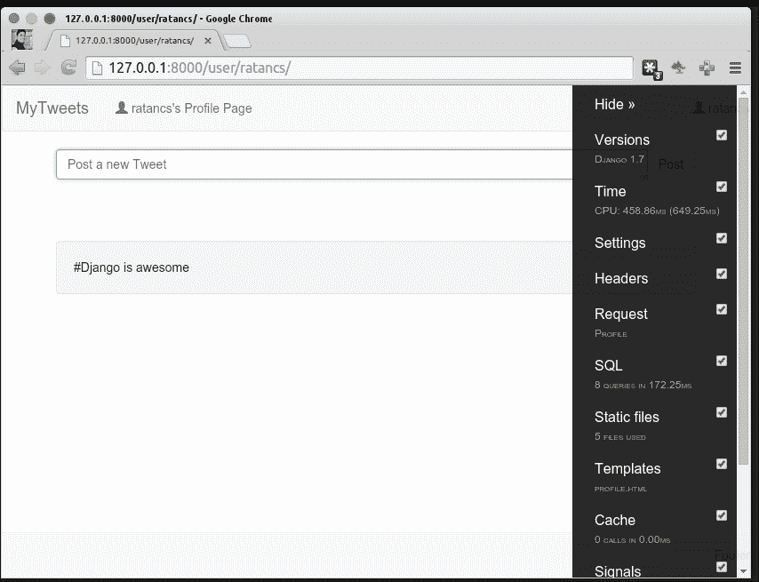

如您所见，个人资料页面右侧有一个工具栏。Django 调试工具栏有许多面板，默认安装了一些，您可以在前面的截图中看到，还可以在此安装其他第三方面板。

现在，我们将讨论默认启用的面板：

+   **VersionPath**：`debug_toolbar.panels.versions.VersionsPanel`。该面板显示了基本信息，例如 Python、Django 的版本以及其他已安装应用的版本，如果信息可用：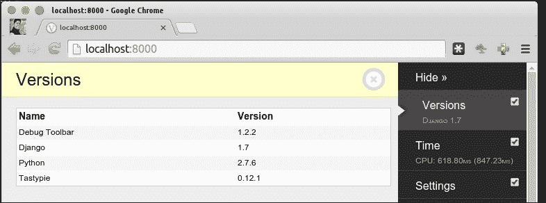

+   **TimerPath**：`debug_toolbar.panels.timer.TimerPanel`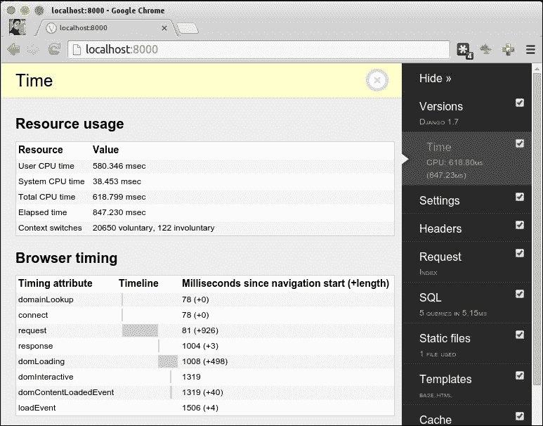

该面板包含了 Django 开发的一些非常重要的统计信息。它显示了两个表，如前面的截图所示，分别是**资源使用**和**浏览器定时**。

+   **资源使用**：显示服务器机器上 Django 的资源消耗。

+   **浏览器时间**：这显示了客户端的详细信息。请求和响应时间对于了解代码是否可以优化至关重要，如果渲染过多导致页面加载缓慢，可以查看 domLoading。

+   **SettingsPath**：`debug_toolbar.panels.settings.SettingsPanel`。`settings.py`文件中定义的设置列表为**headers**

+   **路径**：`debug_toolbar.panels.headers.HeadersPanel`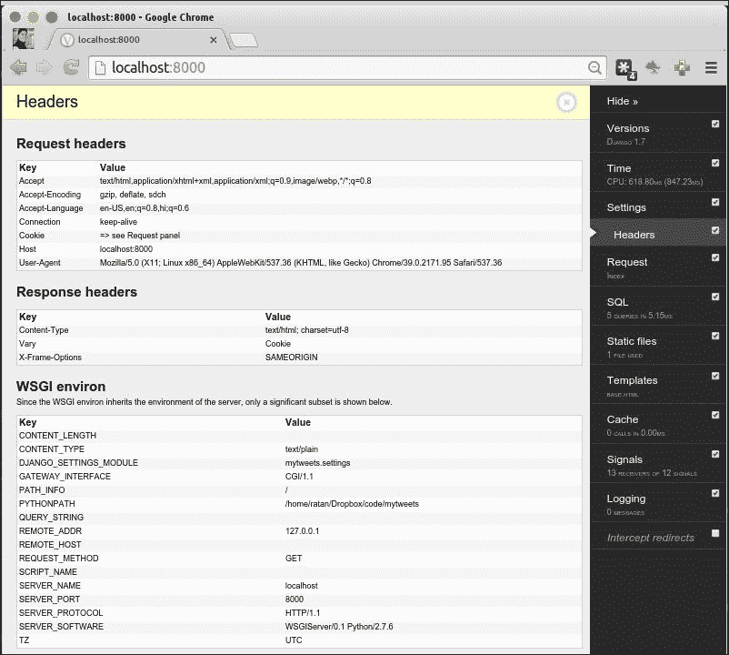

该面板显示 WSGI 环境中的 HTTP 请求和响应头和变量。

+   **请求路径**：`debug_toolbar.panels.request.RequestPanel`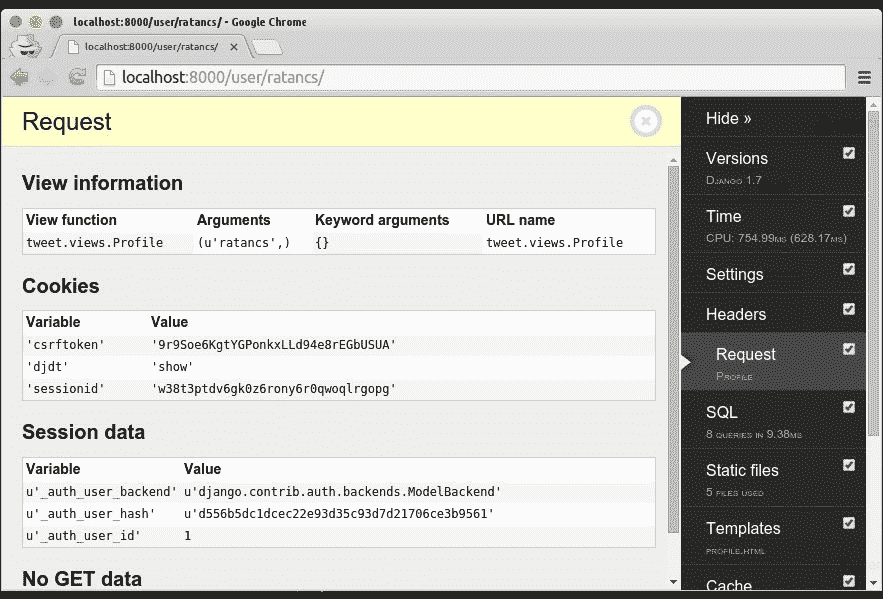

该面板显示了从框架中的变量，从视图变量开始，还有**ratancs**参数变量；然后是**Cookies**，**Session**，以及 GET 和 POST 变量，因为这些对调试表单提交非常有帮助。

+   **SQL 路径**：`debug_toolbar.panels.sql.SQLPanel`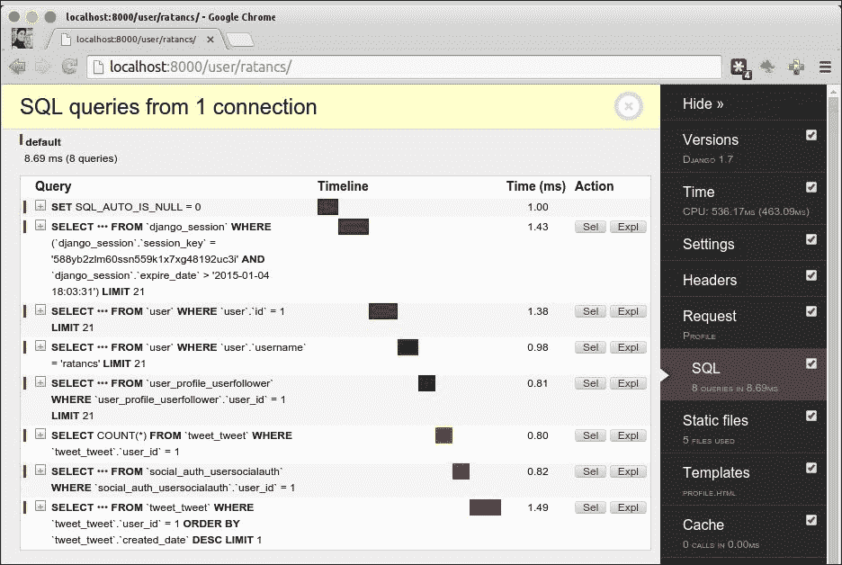

这个面板也非常重要，因为它显示了页面响应的数据库查询。这在应用程序扩展时非常有帮助，因为可以彻底检查查询并将其组合在一起，以减少数据库访问并改善页面响应性能。

这还显示了生成 SQL 调用的代码片段，这在调试应用程序时也非常有帮助。

+   **静态文件路径**：`debug_toolbar.panels.staticfiles.StaticFilesPanel`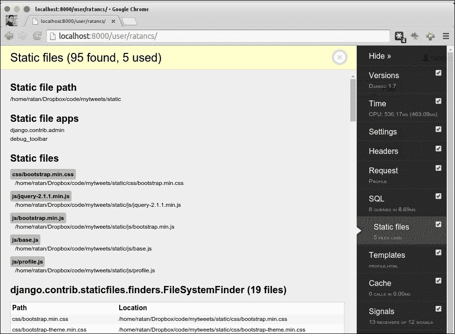

这将列出从我们在`settings.py`文件中设置的静态文件位置使用的所有静态文件。

+   **模板路径**：`debug_toolbar.panels.templates.TemplatesPanel`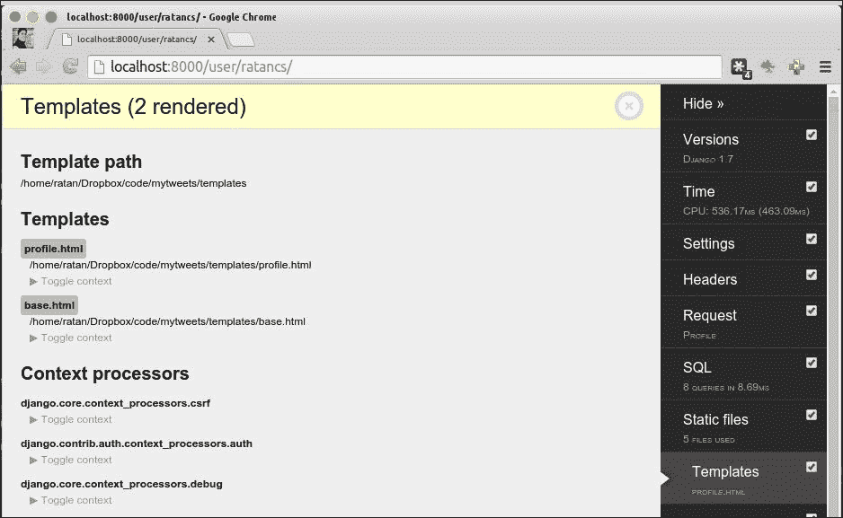

这将列出当前请求使用的模板和上下文。

+   **缓存路径**：`debug_toolbar.panels.cache.CachePanel`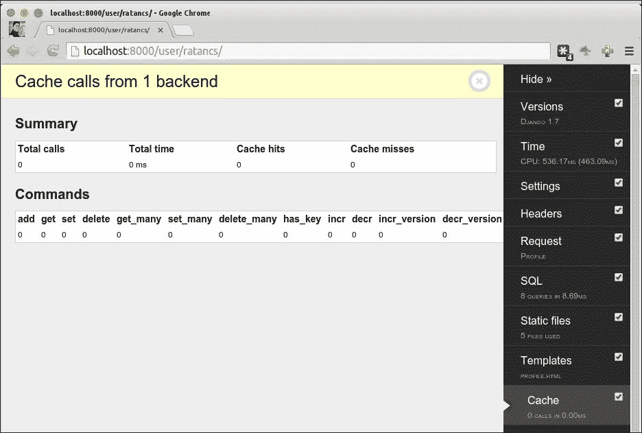

如果我们启用了缓存，那么这将显示给定 URL 的缓存命中的详细信息。

+   **信号路径**：`debug_toolbar.panels.signals.SignalsPanel`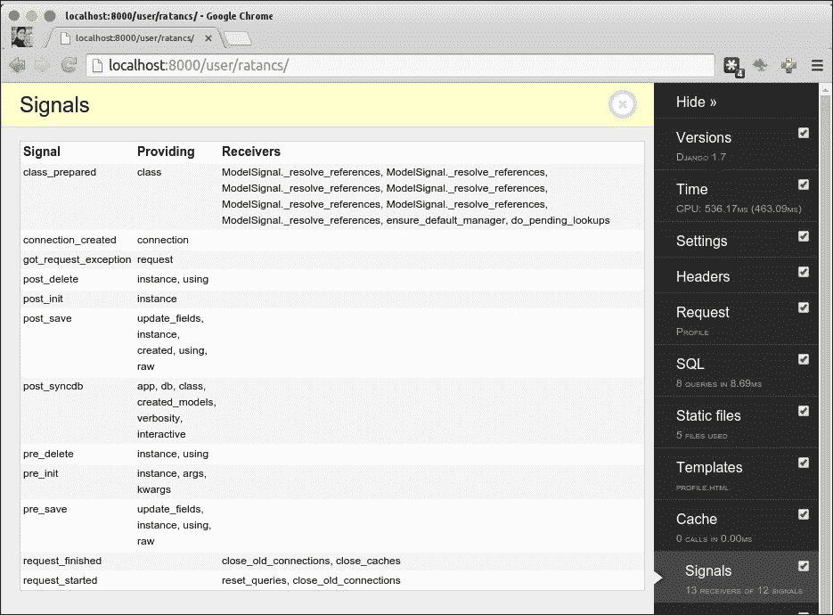

该面板显示信号列表及其参数和接收器。

+   **日志路径**：`debug_toolbar.panels.logging.LoggingPanel`

如果启用了日志记录，那么该面板将显示日志消息，如下截图所示：

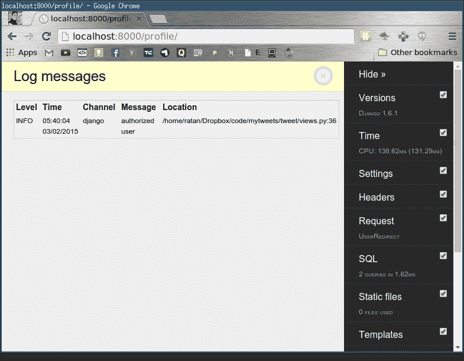

+   **重定向路径**：`debug_toolbar.panels.redirects.RedirectsPanel`

当 URL 发生页面重定向时，启用此功能以调试中间页面。通常不调试重定向 URL，因此默认情况下此功能已禁用。

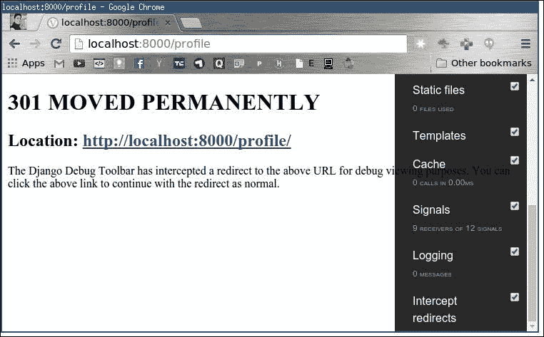

# IPDB - 消灭错误的交互方式

**Ipdb**是 Python 程序的交互式源代码调试器。

运行以下命令安装 Ipdb：

```py
$pip install ipdb

```

Ipdb 是调试 Python 应用程序的交互方式。安装 Ipdb 后，要在任何函数中使用它，只需编写以下代码：

```py
import ipdb;ipdb.set_trace()
```

这行神奇的代码将在代码出现的地方停止整个 Django 执行，并为您提供一个活动控制台，在那里您可以实时查找错误或检查变量的值。

在活动控制台中，Ipdb 的快捷键是：

+   `n`：这表示下一个

+   `ENTER`：这表示重复上一个

+   `q`：这表示退出

+   `p <variable>`：这是打印值

+   `c`：这表示继续

+   `l`：这是你所在的列表

+   `s`：这是进入子程序的步骤

+   `r`：这意味着继续执行子程序直到结束

+   `！<python 命令>`：在活动控制台中运行 Python 命令

# 总结

这一章涵盖的内容远不止这些。这些只是我们在 Django 项目中要使用的调试基础知识。你学会了如何记录和调试我们的代码，以便更好地进行高效编码实践。我们还看到了如何使用 Ipdb 进行更多的调试。

在下一章中，你将学习部署 Django 项目的各种方法。
