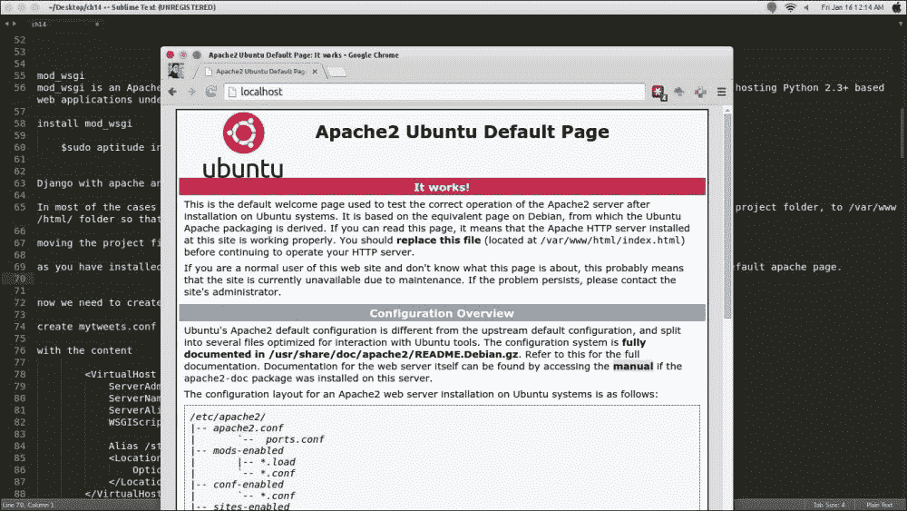
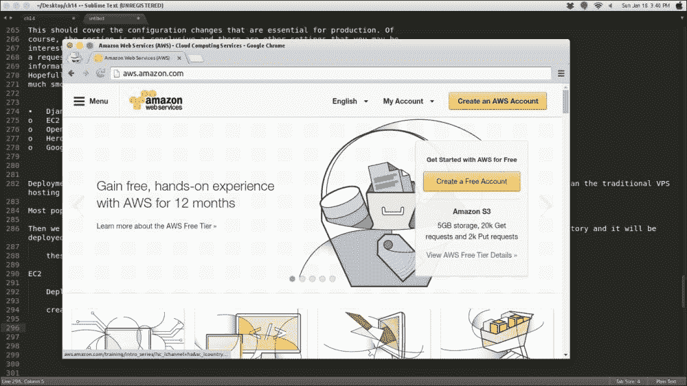
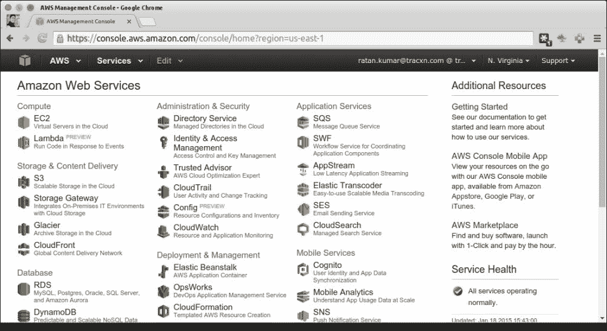
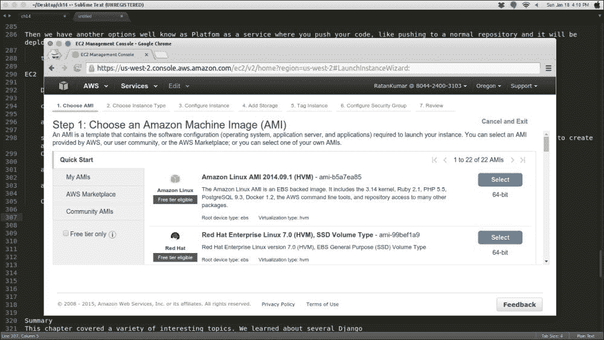
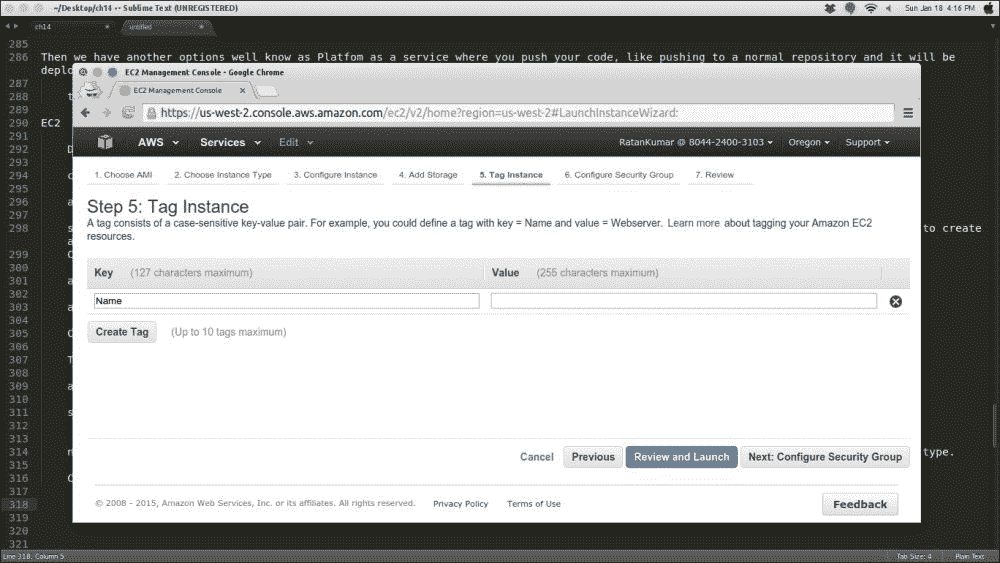
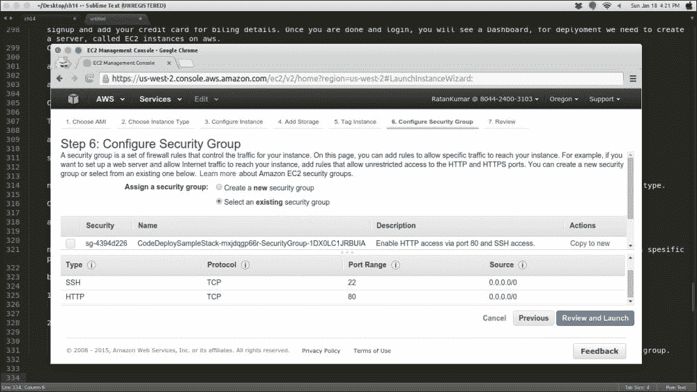
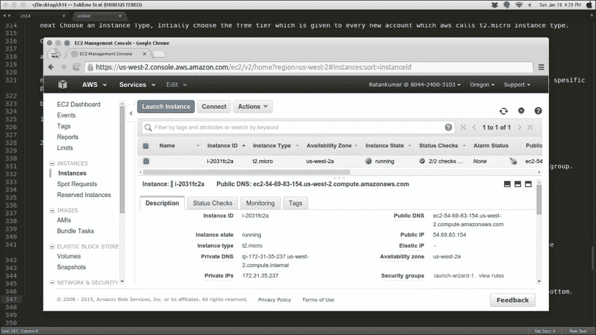
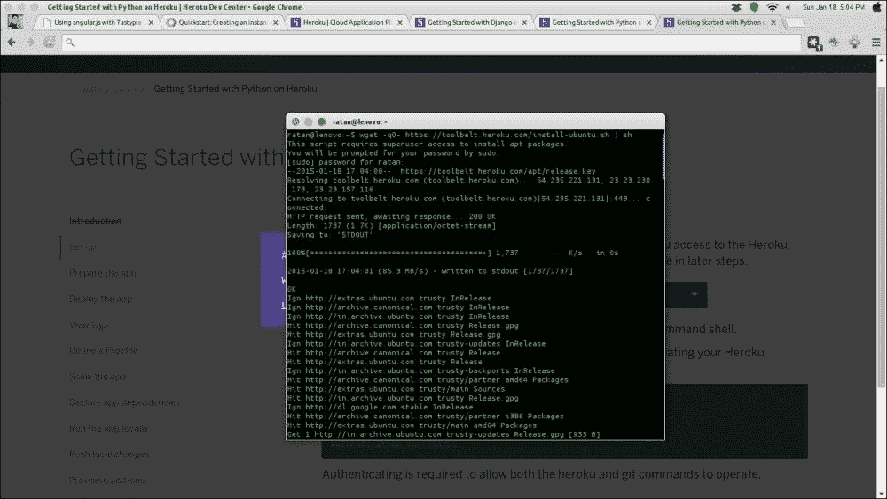
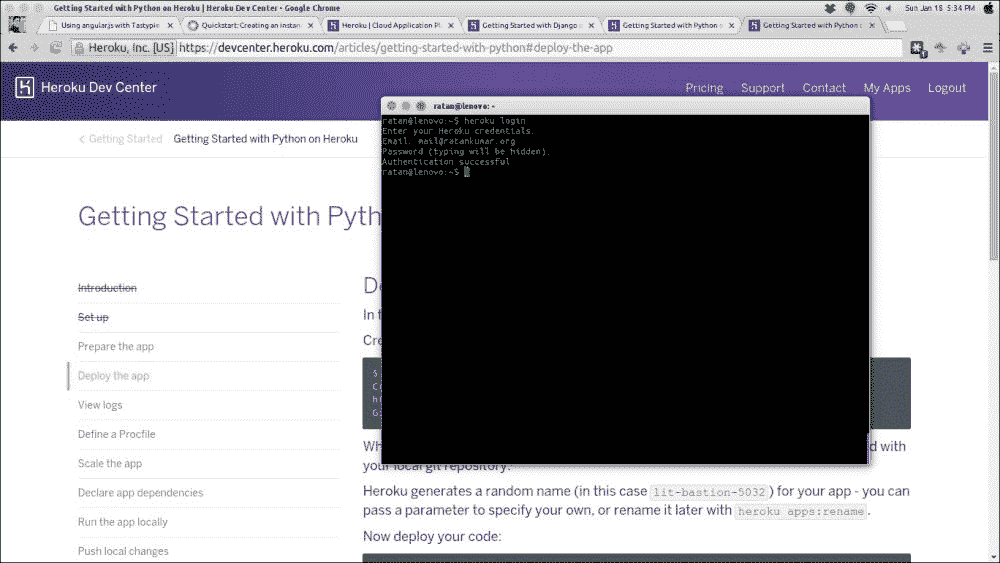

# 第十四章：部署 Django 项目

因此，您在 Web 应用程序上做了很多工作，现在是时候让它上线了。为了确保从开发到生产的过渡顺利进行，必须对应用程序进行一些更改。本章涵盖了以下主题的更改，以帮助您成功启动 Web 应用程序：

+   生产 Web 服务器

+   生产数据库

+   关闭调试模式

+   更改配置变量

+   设置错误页面

+   云上的 Django

# 生产 Web 服务器

在本书中，我们一直在使用 Django 自带的开发 Web 服务器。虽然这个服务器非常适合开发过程，但绝对不适合作为生产 Web 服务器，因为它没有考虑安全性或性能。因此，它绝对不适合生产环境。

在选择 Web 服务器时有几个选项可供选择，但**Apache**是迄今为止最受欢迎的选择，Django 开发团队实际上推荐使用它。如何使用 Apache 设置 Django 取决于您的托管解决方案。一些托管计划提供预配置的 Django 托管解决方案，您只需将项目文件复制到服务器上，而其他托管计划则允许您自行配置一切。

如何设置 Apache 的详细信息因多种因素而异，超出了本书的范围。如果您想自己配置 Apache，请查阅 Django 在线文档[`docs.djangoproject.com/en/1.8/howto/deployment/wsgi/apache-auth/`](https://docs.djangoproject.com/en/1.8/howto/deployment/wsgi/apache-auth/)获取详细说明。

在本节中，我们将在 Apache 和`mod_wsgi`模块上部署我们的 Django 应用程序。因此，让我们首先安装这两个。

运行以下命令安装 Apache：

```py
$sudo apt-get install apache2

```

`mod_wsgi`参数是 Apache HTTP 服务器模块，提供符合**Web 服务器网关接口**（**WSGI**）标准的接口，用于在 Apache 下托管基于 Python 2.3+的 Web 应用程序。

运行以下命令安装`mod_wsgi`模块：

```py
$sudo aptitude install libapache2-mod-wsgi

```

使用 Apache 和`mod_wsgi`模块的 Django 是在生产中部署 Django 的最流行方式。

在大多数情况下，开发机器和部署机器是不同的。因此，建议您将项目文件夹复制到`/var/www/html/`文件夹，以便您的部署文件具有有限的权限和访问权限。

安装了 Apache 服务器后，请尝试在浏览器中访问`localhost`，即`127.0.0.1`。通过这样做，您应该会看到默认的 Apache 页面，如下截图所示：



我们必须将 Apache 服务器设置为我们的 Django 项目。为此，我们需要为 Apache 创建`configuration`文件。

为此，在`/etc/apache2/sites-available`导航到的`sites-available`文件夹中创建一个`mytweets.conf`文件，内容如下：

```py
<VirtualHost *:80>
  ServerAdmin mail@ratankumar.org
  ServerName mytweets.com
  ServerAlias www.mytweets.com
  WSGIScriptAlias / /var/www/html/mytweets/mytweets/wsgi.py
  Alias /static/ /var/www/html/mytweets/static/
  <Location "/static/">
    Options -Indexes
  </Location>
</VirtualHost>
```

让我们来看看以下术语列表，描述了前面代码片段中使用的各种参数：

+   `ServerAdmin`：如果您没有配置自定义错误页面，将显示此电子邮件地址，该页面将告诉用户联系此电子邮件地址。

+   `ServerName`：这是您想在其上运行项目的服务器的名称。

+   `ServerAlias`：这是您要在项目上运行的站点的名称。

+   `WSGIScriptAlias`：这是项目的`wsgi.py`文件的位置，在我们运行第一个命令创建 Django 项目时已经存在。

+   `Alias`：这是路径别名，磁盘上的文件夹的实际位置被映射为项目目录。

现在，我们需要使用`a2ensite`命令启用此站点配置，并使用`a2dissite`命令禁用现有站点配置。

让我们通过以下命令为 Apache 启用`mytweets.conf`文件：

```py
$a2ensite mytweets.conf

```

这将启用我们的`mytweets.conf`文件。你也可以使用以下命令禁用`default 000-default.conf`配置：

```py
$a2dissite 000-default.conf

```

### 注意

验证项目静态文件的文件权限。不要忘记在`settings.py`文件中允许主机的条目。

现在，重新启动服务器：

```py
$sudo service apache2 restart

```

这样，Django 现在运行在部署模式下，也就是说，它现在已经准备好投入生产。

# 生产数据库

到目前为止，我们一直在使用 SQLite 作为我们的数据库引擎。它简单，不需要常驻内存中的服务器。对于小型网站，SQLite 在生产模式下表现良好。然而，强烈建议您在生产中切换到使用客户端-服务器模型的数据库引擎。正如我们在前面的章节中看到的，Django 支持多种数据库引擎，包括所有流行的数据库引擎。Django 团队建议您使用 PostgreSQL，但 MySQL 也应该可以。无论你的选择是什么，你只需要在`settings.py`文件中更改数据库选项，就可以切换到不同的数据库引擎。

如果你想使用 MySQL，为 Django 创建一个数据库、用户名和密码。然后，相应地更改`DATABASE_*`变量。其他一切都应该保持不变。这就是 Django 数据库层的全部意义。

# 关闭调试模式

在开发过程中发生错误时，Django 会呈现一个详细的错误页面，提供大量有用的信息。然而，当应用进入生产阶段时，你不希望用户看到这样的信息。除了让用户感到困惑，如果让陌生人看到这样的信息，你还会面临网站安全问题的风险。

当我们使用`django-admin.py mytweets`命令时，它为项目创建了所有基本配置，我们在`settings.py`文件中使用了`debug=True`参数，当这个模式为`True`时。Django 会做一些额外的工作来帮助你更快地调试问题。Django 的内存使用更多，因为所有的查询都存储在数据库中的`django.db.connection.queries`中。

对于每个错误消息，都会显示消息的适当堆栈跟踪，这在生产模式下是不推荐的，因为这可能包含敏感信息，可能会削弱整个 Web 应用程序的安全性。

关闭调试模式非常简单。打开`settings.py`文件，将`DEBUG`变量更改为`False`：

`DEBUG = False`

禁用调试信息还有一个额外的好处；你可以提高网站的性能，因为 Django 不必跟踪调试数据以显示它。

# 更改配置变量

有许多需要为生产创建或更新的配置变量。生产环境是一个非常恶劣的环境。以下是你应该在部署过程中检查的清单。仔细检查`setting.py`文件，因为每个设置必须以正确的方式定义，以保持项目的安全。

设置可以是特定于环境的，比如在本地运行设置时。数据库凭据可能会改变，甚至数据库也可能会根据环境而改变。在进行部署过程时，启用可选的安全功能。

启用性能优化。第一步是禁用调试，这会提高网站的性能。如果有一个合适的错误报告机制，一旦`DEBUG`为`False`，就很难知道出了什么问题，所以最好在禁用调试模式后准备好你的日志。

在进行 Django 部署时，必须注意以下关键设置：

+   `SECRET_KEY`：此密钥必须选择大且随机，并且应保密。事实上，建议您永远不要将此信息保存在`settings.py`文件或版本控制存储库中。相反，将此信息保存在非版本控制文件中或环境路径中的安全位置：

```py
import os
SECRET_KEY = os.environ['SECRET_KEY']
```

这将从当前操作系统的环境中导入密钥。另一种建议的方法是从文件中导入，可以使用以下方法完成：

```py
with open('/etc/secret_key.txt') as f:
    SECRET_KEY = f.read().strip()
```

+   `ALLOWED_HOSTS`：这必须具有有效的主机配置。当调试模式关闭时，这用于保护 CSRF 攻击：

```py
ALLOWED_HOSTS = [
    '.example.com',  # Allow domain and subdomains
    '.example.com.',  # Also allow FQDN and subdomains
]
```

+   `ADMIN`：`ADMIN`键保存站点管理员的名称和电子邮件地址。您将在`settings.py`文件中找到它，注释如下：

```py
ADMINS = (
# ('Your Name', 'your_email@domain.com'),
)
```

在此处插入您的姓名和电子邮件地址，并删除`#`符号以取消注释，以便在发生代码错误时接收电子邮件通知。

当`DEBUG=False`并且视图引发异常时，Django 将通过电子邮件向这些人发送完整的异常信息。

+   `EMAIL`：由于您的生产服务器的电子邮件服务器很可能与您的开发机器不同，因此您可能需要更新电子邮件配置变量。在`settings.py`文件中查找以下变量并更新它们：

+   `EMAIL_HOST`

+   `EMAIL_PORT`

+   `EMAIL_HOST_USER`

+   `EMAIL_HOST_PASSWORD`

此外，您的 Web 应用程序现在有自己的域名，因此您需要更新以下设置以反映这一点：`SITE_HOST`和`DEFAULT_FROM_EMAIL`。

最后，如果您使用缓存，请确保在`CACHE_BACKEND`参数中设置正确的设置（理想情况下是`memcached`参数）；在生产环境中，您不希望开发后端出现在这里。

# 设置错误页面

在调试模式禁用时，您应该为错误页面创建模板，特别是这两个文件：

+   `404.html`：当请求的 URL 不存在时（换句话说，当页面未找到时，例如未捕获的异常时），将显示此模板。

创建两个文件，内容随意。例如，您可以在`404.html`模板中放置一个“页面未找到”的消息，或者一个搜索表单。

+   `500.html`：当发生内部服务器错误时，将显示此模板。

建议您通过从站点的基本模板派生它们，使这些模板具有一致的外观。将模板放在`templates`文件夹的顶部，Django 将自动使用它们。

这应涵盖对生产至关重要的配置更改。当然，此部分并非穷尽一切，还有其他您可能感兴趣的设置。例如，您可以配置 Django 在请求的页面未找到时通过电子邮件通知您，或者提供可以查看调试信息的 IP 地址列表。有关这些以及更多信息，请参阅`settings.py`文件中的 Django 文档。

希望本节能够帮助您使从开发到生产的过渡更加顺利。

# 云上的 Django

Web 开发中的部署方式随着时间的推移发生了变化。大多数初创公司正在转向云设置，远离传统的 VPS 托管方法，这是因为可靠性、性能和易于扩展性。

提供**基础设施即服务**（**IAS**）的最受欢迎的云平台是 Amazon EC2 和 Google Compute Engine。

然后，我们还有其他众所周知的选项，例如**平台即服务**（**PaaS**），在这种服务中，您可以像将代码推送到普通存储库一样将代码推送，以便自动部署。这些包括 Google App Engine、Heroku 等。

让我们逐一介绍它们。

## EC2

在**EC2**上部署很简单。按照给定的步骤在 EC2 上部署所需的设置：

1.  为 AWS 创建一个帐户。请访问[`aws.amazon.com`](http://aws.amazon.com)并单击**创建免费帐户**，如下面的屏幕截图所示：

1.  注册并添加信用卡以获取结算明细。完成后，登录，您将看到一个仪表板。为了部署，我们需要在 AWS 上创建一个名为 EC2 实例（它可以被视为服务器）的服务器。

1.  点击 EC2（在左上角），如下截图所示：

如前面的截图所示，我已经有一个正在运行的实例（**1 Running Instances**）。单击**启动实例**以创建新实例。这将显示可用的 AWS 映像（类似于 VMware 中的截图或上次备份的磁盘）：



1.  向下滚动以选择 Ubuntu 64 位实例（Ubuntu 服务器）。

接下来，选择一个实例类型；最初，选择免费套餐，这是 AWS 为每个新帐户提供的**t2.micro**实例类型。检查其他设置，因为大多数设置都保持默认值。转到**标签**实例并为您的实例命名：



1.  接下来要做的重要事情是选择安全组。AWS 具有此功能，可保护您的服务器免受攻击。在这里，您可以配置哪些特定端口将是公开可访问的。基本上，您需要打开两个端口以使推文公开可访问。

1.  您应该使用 SSH（端口 22）从本地机器连接系统以部署代码。

1.  HTTP（端口 80）用于运行您的 Django 服务器。

### 注意

由于我们将使用的数据库运行在同一实例上，因此我们不会将 MySQL 端口添加到安全组中。

确保您已经配置了类似以下内容：



接下来，审查并启动实例。此外，您必须创建一个密钥对以通过 SSH 访问您的 AWS 机器。密钥是一个`.pem`文件，您将使用它与 SSH 远程登录到您的机器。创建一个密钥对并下载`.pem`文件。

### 注意

确保`PEM`文件具有特定的 400 权限。如果要使 SSH 工作，您的密钥文件不得公开可见。如有需要，请使用以下命令：`chmod 400 mykey.pem`。

这将需要一段时间，并且将作为正在运行的实例重新显示在您的仪表板上。

单击屏幕左侧的实例。然后，您可以看到正在运行的实例。单击实例行以在屏幕底部获取更多详细信息，如下图所示：



在详细信息的右侧，您可以看到公共 DNS：<public DNS>和公共 IP：<public IP>。这就是您需要的一切（当然还有`.pem`文件）来登录到您的实例。

在您的机器上，转到终端中下载`PEM`文件的文件夹，并在终端上键入`$ssh -i <pemfilename>.pem ubuntu@<pubic IP>`。

否则，输入以下内容：

`$ssh -i <pemfilename>.pem ubuntu@<public Dns>`。

通过这样做，您将登录到远程服务器。

这是您从头开始的在线系统。如果要从本地机器部署网站，则可以转到以前的章节并安装虚拟环境所需的一切。Django 和 Apache 在此服务器上执行部署。

部署后，使用我们用于 SSH 的公共 IP，您应该看到已部署的服务器。

## 谷歌计算引擎

**谷歌计算引擎**的工作原理与 AWS EC2 相同。目前，谷歌计算引擎没有免费套餐。

谷歌服务器以其可靠性和性能而闻名。因此，如果您考虑具有此需求的项目，请选择它们。

谷歌云为您提供了一个云 SDK 来使用其实例，并且大部分初始配置可以从终端完成。

要在谷歌计算引擎上创建一个实例，请转到：

[`cloud.google.com/compute/docs/quickstart`](https://cloud.google.com/compute/docs/quickstart)。

此链接将帮助您设置在 Apache 服务器上运行的实例。

## 红帽开源混合云应用平台

红帽提供了另一种云部署解决方案，免费使用一定限额，名为 OpenShift 的服务。

您可以创建一个 OpenShift 帐户，并从[`www.openshift.com/app/account/new`](https://www.openshift.com/app/account/new)获取一个免费的基本 3 dynamo 云服务器。

创建帐户后，您可以转到[`openshift.redhat.com/app/console/applications`](https://openshift.redhat.com/app/console/applications)并添加您的帐户。

OpenShift 为您提供了一个已经设置好版本控制的 Django 存储库。

您只需要进行更改并推送代码。它将自动部署代码。

OpenShift 还提供 SSH 功能，可以登录到您的云服务器，并进行一些基本的故障排除。

## Heroku

这也是一个很好的平台，可以顺利地将您的 Django 代码部署到云端。与谷歌计算引擎一样，Heroku 还为您提供了一个 SDK 工具，可以从本地终端安装并执行配置更改。您需要获取一个工具包（Heroku 的 SDK）。

在[`signup.heroku.com`](https://signup.heroku.com)上创建一个 Heroku 帐户。

以下是从[`devcenter.heroku.com/articles/getting-started-with-python`](https://devcenter.heroku.com/articles/getting-started-with-python)中获取的步骤。查看最新更新。以下步骤解释了如何创建和使用 Heroku：

1.  首先，我们需要安装 Heroku Toolbelt。这为您提供了访问 Heroku 命令行实用程序的权限：

```py
$wget -qO- https://toolbelt.heroku.com/install-ubuntu.sh | sh

```

将出现以下屏幕：



1.  它将在本地机器上安装 Heroku Toolbelt。从命令行登录到 Heroku：

```py
$heroku login

```

1.  使用与 Web 登录相同的用户名和密码。让我们来看一下下面的截图：

1.  现在，访问[`devcenter.heroku.com/articles/getting-started-with-django`](https://devcenter.heroku.com/articles/getting-started-with-django)来在 Heroku 上部署 Django。

## 谷歌应用引擎

谷歌应用引擎的工作方式不同，它不使用传统的数据库，而是有自己的数据库。因此，要在谷歌应用引擎上部署 Django，我们将使用一个名为 Django-nonrel 的单独项目。

Django-nonrel 是一个允许开发人员在非关系数据库上运行原生 Django 项目（包括 Django 的 ORM）的项目，其中之一就是谷歌应用引擎的数据存储。这是除了 Django 一直支持的标准传统 SQL 数据库之外的所有内容。谷歌应用引擎确实具有一些 Django 支持，但该支持主要涉及模板和视图。对于其他允许快速开发的工具，例如表单、内置管理界面或 Django 身份验证，这些都无法直接运行。Django-nonrel 改变了这一点，为 Django 开发人员提供了支持。

# 总结

本章涵盖了各种有趣的主题。您了解了几种在部署 Django 时有用的基于 Django 的部署选项。您还学会了如何将 Django 项目从开发环境迁移到生产环境。值得注意的是，您学到的这些框架都非常易于使用，因此您将能够在将来的项目中有效地利用它们。
