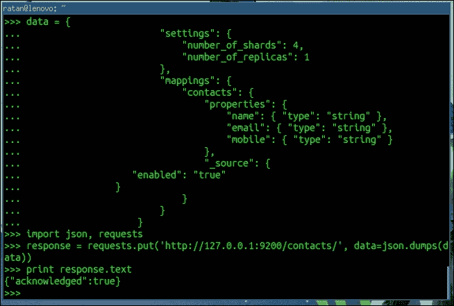
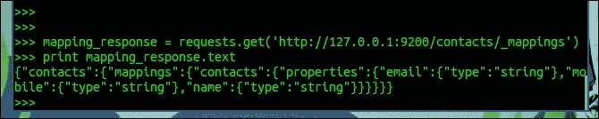
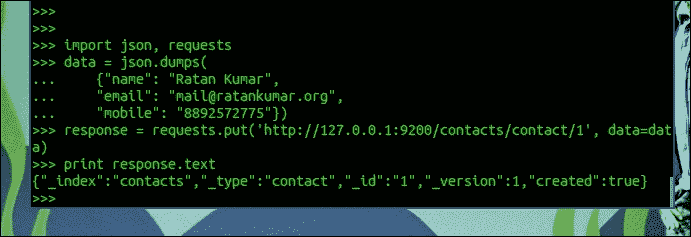
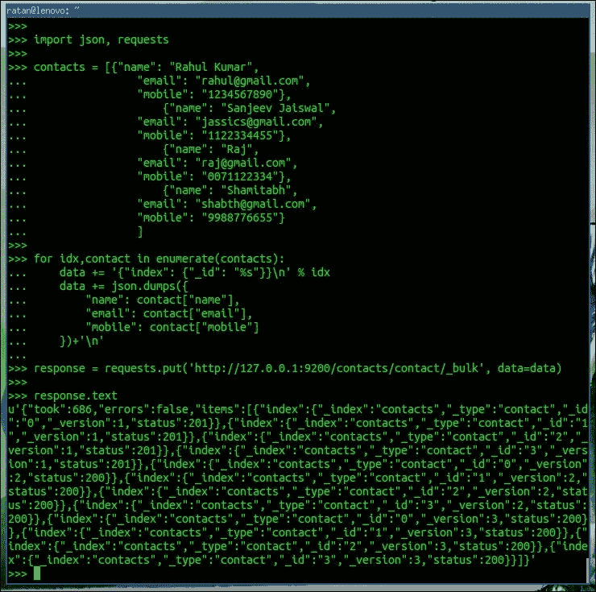
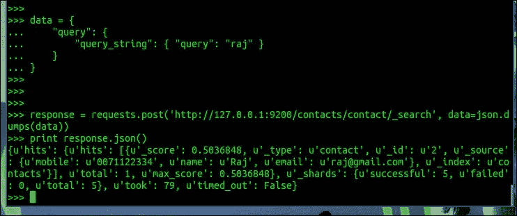

# 第十五章：接下来是什么？

网络开发随着时间的推移发生了变化，用户消费信息的设备也发生了变化。网络最初是为大屏设备设计的，但最近的趋势表明，小屏设备和手持设备的使用量增加了。因此，有必要调整网络以适应小屏设备，但这些设备对功耗非常敏感。因此，在 Django 中有必要将后端功能与前端功能分开。

其中一个最广泛使用的解决方案是在 Django 后端使用启用了 API 的前端来使用它。对于这种情况，使用**AngularJS**是最合适的。

REST 一直是 Web 开发的未来，REST API 是现代 Web 的一个组成部分。随着设备之间的碎片化增加，出现了需要一个单一的最小端点的需求，该端点不执行任何呈现操作。例如，信息检索或通信可能尽可能快，也可能扩展，而这方面的呈现或业务逻辑则由现代浏览器使用前端框架来处理。

# AngularJS 满足 Django

AngularJS 是一个现代的 JavaScript 框架，用于在浏览器中创建复杂的 Web 应用程序。

自 2009 年以来，AngularJS 一直在快速发展，并被广泛接受为生产级前端框架。现在由 Google 维护。

AngularJS 有一个非常有趣的诞生故事。当 angular 的一位创始人在 3 周内重新创建了一个网页应用程序时，引起了很大的关注，而最初开发这个应用程序需要 6 个月的时间，通过将代码行数从 17,000 行减少到 1,000 行。

AngularJS 在传统 Web 开发框架上有许多特点。其中，一些独特和创新的特点是双向数据绑定、依赖注入、易于测试的代码以及使用指令扩展 HTML 方言。

对于服务器端，我们可以使用**Django REST 框架**或**Tastypie**来进行 REST 端点。然后，我们可以使用 AngularJS，它专注于 MVC 模型，以鼓励创建易于维护的模块。

Web 技术已经从同步发展到异步，也就是说，网站请求现在大量使用异步调用来刷新内容，而不重新加载页面，一个例子就是你的 Facebook 动态。

AngularJS 是 Django Web 开发中更好的异步需求解决方案之一。

在下面的示例中，我们将使用 AngularJS 创建一个单页面，该页面使用我们已经创建的推文 API。

我们将使用 AngulaJS 列出所有推文，但在此之前，我们需要熟悉 AngularJS 的关键术语：

+   **指令**：为此，HTML 文件使用自定义属性和元素进行扩展。AngularJS 使用**ng-directives**扩展 HTML。**ng-app**指令用于定义 AngularJS 的应用程序。**ng-model**指令将 HTML 控件（输入、复选框、单选按钮、选择和文本区域）的值绑定到应用程序。**data.ng-bind**指令将应用程序数据绑定到 HTML 视图。

+   **模型**：这是向用户显示的数据，用户与之交互。

+   **作用域**：这是存储模型的上下文，以便控制器、指令和表达式可以访问它。

+   **控制器**：这是视图背后的主要业务逻辑。

当我们设计基于 API 的 Web 应用程序时，很有可能（API 的后端和 Web 应用程序的前端）它们位于不同的服务器上。因此，有必要为**跨域资源共享**配置 Django。

根据维基百科上的定义：

> *跨域资源共享（CORS）是一种机制，允许从资源原始域之外的另一个域请求网页上的许多资源（例如字体、JavaScript 等）*

我们需要修改我们的 Django API，以允许来自其他服务器的请求。我们现在将更新`tweets`应用程序的`api.py`文件，以允许对服务器的跨站点请求：

```py
class CORSResource(object):
  """
  Adds CORS headers to resources that subclass this.
  """
  def create_response(self, *args, **kwargs):
    response = super(CORSResource, self).create_response(*args, **kwargs)
    response['Access-Control-Allow-Origin'] = '*'
    response['Access-Control-Allow-Headers'] = 'Content-Type'
    return response

  def method_check(self, request, allowed=None):
    if allowed is None:
      allowed = []

    request_method = request.method.lower()
    allows = ','.join(map(unicode.upper, allowed))
    if request_method == 'options':
      response = HttpResponse(allows)
      response['Access-Control-Allow-Origin'] = '*'
      response['Access-Control-Allow-Headers'] = 'Content-Type'
      response['Allow'] = allows
      raise ImmediateHttpResponse(response=response)

    if not request_method in allowed:
      response = http.HttpMethodNotAllowed(allows)
      response['Allow'] = allows
      raise ImmediateHttpResponse(response=response)
    return request_method
```

添加了这个类之后，我们可以创建任何资源的子类，以便为跨域请求公开。我们现在将更改我们的`Tweet`类，以便可以跨站点访问。

让我们将`Tweet`类更新为以下内容：

```py
class TweetResource(CORSResource, ModelResource):
  class Meta:
    queryset = Tweet.objects.all()
    resource_name = 'tweet'
```

现在，推文资源已准备好从不同的域访问。

以下是一个基本的 AngularJS 示例：

创建一个名为`app.html`的单个 HTML 文件（由于此文件与我们现有的 Django 项目无关，因此可以在项目文件夹之外创建），内容如下。当前，此页面使用来自本地磁盘的 AngularJS，您也可以从 CDN 导入页面：

```py
<html ng-app="tweets">
  <head>
    <title>Tweets App</title>
    <script src="img/angular.min.js"></script>
  </head>
  <body>
    <div ng-controller="tweetController"> 
      <table>
        <tr ng-repeat="tweet in tweets">
          <td>{{ tweet.country }}</td>
          <td>{{ tweet.text }}</td>
        </tr>
      </table>
    </div>
    <script src="img/app.js"></script>
  </body>
</html>
```

在以下代码中，`ng-controller`指令在其渲染时触发，它处理任何业务逻辑，并将计算的模型注入作用域内。

`<div ng-controller="tweetController">`标签是一个例子，其中`tweetController`参数在其`div`呈现之前被处理。

我们的业务逻辑完全在`app.js`文件中的 JavaScript 中：

```py
var app = angular.module('tweets', []);
app.controller("tweetController", function($scope,$http) {
  $http({ headers: {'Content-Type': 'application/json; charset=utf-8'},
  method: 'GET',
  url: "http://127.0.0.1:8000/api/v1/tweet/?format=json"
  })
    .success(function (data) {
    $scope.tweets = data.objects;
  })
});
```

此`app.js`文件向推文的 API 端点发出请求，并将`tweets`对象注入到作用域中，由 AngularJS 在视图（`app.html`）中使用`ng-repeat`循环指令呈现：

```py
  <tr ng-repeat="tweet in tweets">
    <td>{{ tweet.country }}</td>
    <td>{{ tweet.text }}</td>
  </tr>
```

上述代码的输出如下图所示，显示了国家和推文：


这只是一个基本的 AngularJS 应用程序，因为高级 Web 开发已完全从后端转移到前端。基于 AngularJS 的应用程序最适合完整的单页应用程序。

# 使用 Elasticsearch 的 Django 搜索

搜索已成为我们现在处理的大多数应用程序的一个组成部分。从 Facebook，搜索朋友，到 Google，在那里您搜索整个 Web，从博客到日志，一切都需要搜索功能来解锁网站上的隐藏信息。

Web 正以指数速度发展。现在，1GB 的数据已经过时，每天产生数百 TB 的结构化和非结构化数据。

**Elasticsearch**（**ES**）比其他替代方案更好，因为除了提供全文搜索外，它还提供有意义的实时数据分析，并且在集群数据基础设施方面具有高度可扩展性的强大支持。

Elasticsearch 还为您提供了一个简单的 REST API，可以轻松集成到任何自定义应用程序和 Django（更广泛地说，Python）开发环境中，提供了许多很酷的开箱即用的工具来实现 Elasticsearch。

Elasticsearch 网站（[`www.elasticsearch.org/`](http://www.elasticsearch.org/)）包含详尽的文档，网上还有很多很好的例子，这些例子将帮助您构建任何您需要的搜索。通过充分利用 Elasticsearch，您可能可以用它构建自己的“Google”。

## 安装 Elasticsearch 服务器

首先安装 Java。然后，下载并提取 Elasticsearch。您可以将 ES 作为服务运行，也可以使用以下 Shell 命令启动 ES 服务器（根据您的系统更改路径）：

```py
set JAVA_HOME=\absolute\path\to\Java
\absolute\path\to\ES\bin\elasticsearch

```

如果做得正确，您可以在浏览器中调用以下 URL：

`http://127.0.0.1:9200/`

它将以以下方式给出响应，但`build_hash`参数不同：

```py
{
  "status" : 200,
  "name" : "MN-E (Ultraverse)",
  "cluster_name" : "elasticsearch",
  "version" : {
    "number" : "1.4.1",
    "build_hash" : "89d3241d670db65f994242c8e8383b169779e2d4",
    "build_timestamp" : "2014-11-26T15:49:29Z",
    "build_snapshot" : false,
    "lucene_version" : "4.10.2"
  },
  "tagline" : "You Know, for Search"
}
```

Elasticsearch 带有基本的部署配置。但是，如果您想调整配置，那么请参考其在线文档，并在`elasticsearch.yml`文件中更改 Elasticsearch 配置。

### Elasticsearch 与 Django 之间的通信

Django 可以使用基本的 Python 编程与 Elasticsearch 无缝集成。在此示例中，我们将使用 Python 请求库从 Django 向 Elasticsearch 发出请求。我们可以通过输入以下代码来安装请求：

```py
$pip install requests

```

对于搜索功能，我们主要需要执行三个操作：

1.  创建一个 Elasticsearch 索引。

1.  向索引提供数据。

1.  检索搜索结果。

#### 创建 Elasticsearch 索引

在加载 Elasticsearch 索引并检索搜索结果之前，Elasticsearch 必须了解有关您的内容以及数据处理方式的一些详细信息。因此，我们创建了一个包含设置和映射的 ES 索引。**映射**是 ES 中 Django 模型的等价物-用于定义内容的数据字段。

虽然映射是完全可选的，因为 Elasticsearch 会根据其用于索引的信息动态创建映射，但建议您预定义用于索引的数据映射。

创建一个 ES 索引的 Python 示例如下：

```py
  data = {
    "settings": {
      "number_of_shards": 4,
      "number_of_replicas": 1
    },
    "mappings": {
      "contacts": {
        "properties": {
          "name": { "type": "string" },
          "email": { "type": "string" },
          "mobile": { "type": "string" }
        },
        "_source": {
          "enabled": "true"
        }
      }
    }
  }
}

import json, requests
response = requests.put('http://127.0.0.1:9200/contacts/', data=json.dumps(data))
print response.text
```

上述代码的输出如下图所示：



对于使用 Elasticearch 进行的每个操作，它都会给出一个响应消息，例如`{"acknowledged":true}`，这意味着我们的索引已成功由 Elasticsearch 创建。

我们可以通过执行查询命令来检查映射是否实际已更新：

```py
mapping_response = requests.get('http://127.0.0.1:9200/contacts/_mappings')
print mapping_response.text

```

以下图显示了 Elasticsearch 已更新了新的映射：



在创建了我们的第一个 Elasticsearch 索引之后，我们创建了包含信息的 JSON 字典，并通过 Python 请求将此信息转储到 Elasticsearch 中。**"contacts"**参数是我们选择的索引名称，我们将使用这个名称来向 Elasticsearch 服务器提供和检索数据。**"mappings"**键描述了您的索引将保存的数据。我们可以有尽可能多的不同映射。每个映射都包含一个字段，其中存储数据，就像 Django 模型一样。一些基本的核心字段是字符串、数字、日期、布尔值等等。完整的列表在 Elasticsearch 文档中给出。"shards"和"replicas"参数在 ES 术语表中有解释。没有"settings"键，ES 将简单地使用默认值-在大多数情况下这是完全可以的。

#### 向索引提供数据

现在您已经创建了一个索引，让我们将内容存储在其中。一个包含标题、描述和内容作为文本字段的虚构 BlogPost 模型的示例 Python 代码如下：

```py
import json, requests
data = json.dumps(
  {"name": "Ratan Kumar",
  "email": "mail@ratankumar.org",
  "mobile": "8892572775"})
response = requests.put('http://127.0.0.1:9200/contacts/contact/1', data=data)
print response.text
```

您将看到如下所示的输出：



这个确认显示我们的联系人数据已被索引。当然，索引单个数据并搜索它并没有太多意义，所以在进行检索查询之前，我们将索引更多的联系人。

Elasticsearch 还提供了批量索引，可以按如下方式使用：

```py
import json, requests
contacts = [{"name": "Rahul Kumar",
  "email": "rahul@gmail.com",
  "mobile": "1234567890"},
  {"name": "Sanjeev Jaiswal",
  "email": "jassics@gmail.com",
  "mobile": "1122334455"},
  {"name": "Raj",
  "email": "raj@gmail.com",
  "mobile": "0071122334"},
  {"name": "Shamitabh",
  "email": "shabth@gmail.com",
  "mobile": "9988776655"}
]

for idx, contact in enumerate(contacts):
  data += '{"index": {"_id": "%s"}}\n' % idx
  data += json.dumps({
    "name": contact["name"],
    "email": contact["email"],
    "mobile": contact["mobile"]
  })+'\n'
```

让我们看一下以下的屏幕截图：



正如您在前面的屏幕截图中所看到的，**"status": 201**参数在 HTTP 状态中表示记录已成功创建。Elasticsearch 逐行读取数据，因此我们在每个数据集的末尾使用了**"\n"**。批量操作比运行多个单个请求要快得多。

这个例子是一个简单的 JSON 例子。当我们在 Django 应用程序中使用 Elasticsearch 时，相同的 JSON 对象可以被 Django 模型替换，并且可以通过`ModelName.objects.all()`查询获取所有 Django 模型对象，然后解析并保存它。此外，在手动 ID 的情况下，正如我们在前面的例子中使用的那样，它是索引计数，如果您将主键用作 Elasticsearch ID 进行索引，那将更加方便。这将帮助我们直接查询结果对象，如果我们没有将对象信息作为有效负载传递。

#### 从索引中检索搜索结果

搜索索引相当简单。同样，我们使用 Python 请求将 JSON 编码的数据字符串发送到我们的 ES 端点：

```py
data = {
  "query": {
    "query_string": { "query": "raj" }
  }
}

response = requests.post('http://127.0.0.1:9200/contacts/contact/_search', data=json.dumps(data))
print response.json()
```

这给出了如下图所示的结果：



在示例中，我们正在搜索我们的联系人索引中的术语**"raj"**。ES 以 JSON 编码格式返回所有按相关性排序的命中。每个命中都包含一个**"_id"**字段，该字段提供了所关联博客文章的主键。使用 Django 的 ORM，现在可以简单地从数据库中检索实际对象。

### 注意

ES 搜索端点提供了无限的选项和过滤器；从大型数据集中快速检索、分页以及构建强大搜索引擎所需的一切。

这只是冰山一角。当您使用 Elasticsearch 构建 Django 应用程序时，您将探索许多有趣的功能，例如聚合，可以在前面的示例中使用。它列出了 Ratan 的所有联系信息和自动完成，该功能将用于建议用户在搜索联系人的搜索框中开始输入时从 Elasticsearch 中完整地名称。

# 摘要

在本章中，我们了解了在涉及 Django 项目时最常用的两个重要组件，即 AngularJS 和 Elasticsearch。作为前端框架，AngularJS 不仅通过将渲染逻辑推送到浏览器来减少服务器的负载，还为用户在使用基于 AngularJS 的应用程序时提供丰富的体验。

另一方面，Elasticsearch 是最流行的搜索引擎之一，也是开源的。设置和扩展 Elasticsearch 的便利性使其成为任何搜索引擎需求的选择。您也学到了一些关于 Django 的知识。正如本章开始时所说，我们相信您的目标是学习一项技能并成为其中的专家。好吧，这只是开始；还有更多的事情需要您去探索，以达到本章讨论的每个主题的专家级水平。我们已经到达了本书的结尾。在本书中，我们从头开始构建了一个微型博客应用程序的过程，使用 Django 作为我们的框架。我们涵盖了许多与 Web 2.0 和社交应用程序相关的主题，以及许多 Django 组件。您可以随时参考 Django 的在线文档。如果您想了解特定功能或组件的更多信息，请访问[`docs.djangoproject.com`](https://docs.djangoproject.com)。

感谢选择本书来学习 Django Web 开发基础知识。我们祝愿您在职业生涯中取得成功。
