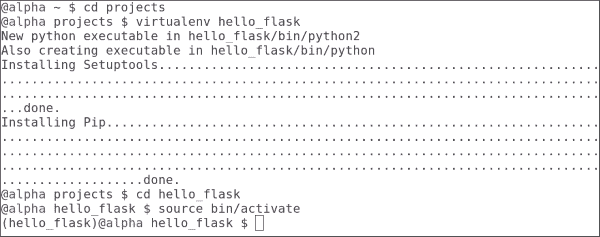
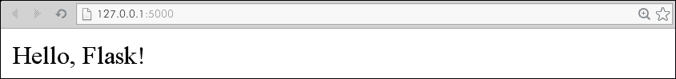
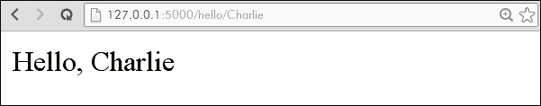
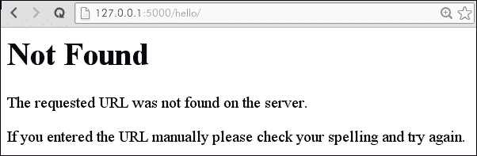
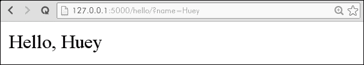
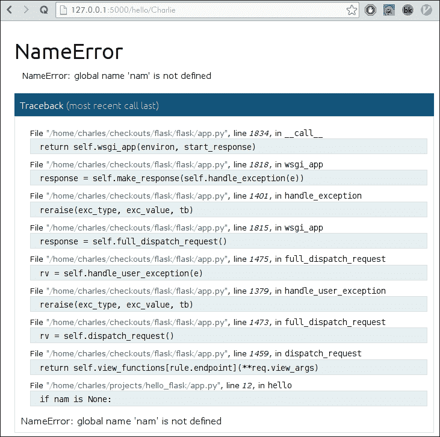
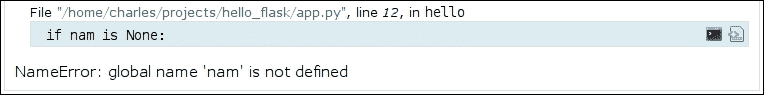
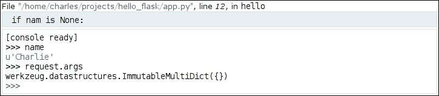
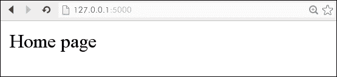
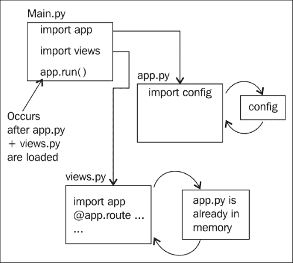

# 第一章：创建您的第一个 Flask 应用程序

*Flask 很有趣*。这是您在查看官方 Flask 文档时看到的第一件事情之一，而在本书的过程中，您将了解为什么这么多 Python 开发人员同意这一观点。

在本章中，我们将：

+   简要讨论 Flask 框架的特点

+   设置开发环境并安装 Flask

+   实现一个最小的 Flask 应用程序并分析其工作原理

+   尝试常用 API 和交互式调试器

+   开始着手博客项目，该项目将在本书的过程中逐步增强

# 什么是 Flask？

Flask 是一个用 Python 编写的轻量级 Web 框架。Flask 最初是一个愚人节玩笑，后来成为 Python Web 框架世界中备受欢迎的黑马。它现在是创业公司中最广泛使用的 Python Web 框架之一，并且正在成为大多数企业快速简单解决方案的完美工具。在其核心，它提供了一组强大的库，用于处理最常见的 Web 开发任务，例如：

+   URL 路由，使 URL 映射到您的代码变得容易

+   使用 Jinja2 进行模板渲染，这是最强大的 Python 模板引擎之一。

+   会话管理和保护 Cookie

+   HTTP 请求解析和灵活的响应处理

+   交互式基于 Web 的调试器

+   易于使用的灵活应用程序配置管理

本书将通过实际的实例教您如何使用这些工具。我们还将讨论 Flask 中未包含的常用第三方库，例如数据库访问和表单验证。通过本书的学习，您将准备好使用 Flask 处理下一个大型项目。

## 自由伴随着责任

正如文档所述，*Flask 很有趣*，但在构建大型应用程序时可能会具有挑战性。与 Django 等其他流行的 Python Web 框架不同，Flask 不强制规定模块或代码的结构方式。如果您有其他 Web 框架的经验，您可能会惊讶于在 Flask 中编写应用程序感觉像编写 Python 而不是框架样板。

本书将教您使用 Flask 编写清晰、表达力强的应用程序。随着本书的学习，您不仅将成为熟练的 Flask 开发人员，还将成为更强大的 Python 开发人员。

# 设置开发环境

Flask 是用 Python 编写的，因此在我们开始编写 Flask 应用程序之前，我们必须确保已安装 Python。大多数 Linux 发行版和最新版本的 OSX 都预装了 Python。本书中的示例将需要 Python 2.6 或 2.7。有关安装 Python 的说明，请访问[`www.python.org`](http://www.python.org)。

如果这是您第一次使用 Python，网上有许多优秀的免费资源可供使用。我建议阅读*Learn Python The Hard Way*，作者是*Zed Shaw*，可在[`learnpythonthehardway.org`](http://learnpythonthehardway.org)免费在线阅读。还想了解更多？您可以在[`resrc.io/list/10/list-of-free-programming-books/#python`](http://resrc.io/list/10/list-of-free-programming-books/#python)找到大量免费的 Python 资源。

您可以通过从命令提示符运行 Python 交互解释器来验证 Python 是否已安装并且您拥有正确的版本：

```py
$ python
Python 2.7.6 (default, Nov 26 2013, 12:52:49)
[GCC 4.8.2] on linux2
Type "help", "copyright", "credits" or "license" for more information.
>>>

```

在提示符（`>>>`）中键入`exit()`并按*Enter*离开解释器。

## 支持 Python 3

本书将包含兼容 Python 2 和 Python 3 的代码。不幸的是，由于 Python 3 相对于 Python 2 仍然相对较新，本书中使用的并非所有第三方包都保证与 Python 3 无缝工作。许多人正在努力使流行的开源库与两个版本兼容，但在撰写本文时，仍有一些库尚未移植。为了获得最佳结果，请确保您在系统上安装的 Python 版本为 2.6 或更高。

# 安装 Python 包

现在您已经确保 Python 正确安装，我们将安装一些流行的 Python 包，这些包将在本书的过程中使用。

我们将系统范围内安装这些包，但一旦它们安装完成，我们将专门在虚拟环境中工作。

## 安装 pip

事实上，Python 包安装程序是`pip`。我们将在整本书中使用它来安装 Flask 和其他第三方库。

如果您已经安装了`setuptools`，您可以通过运行以下命令来安装`pip`：

```py
$ sudo easy_install pip

```

安装完成后，请验证`pip`是否正确安装：

```py
$ pip --version
pip 1.2.1 from /usr/lib/python2.7/site-packages/pip-1.2.1-py2.7.egg (python 2.7)

```

版本号可能会发生变化，因此请参考官方说明，网址为[`www.pip-installer.org/en/latest/installing.html`](http://www.pip-installer.org/en/latest/installing.html)。

## 安装 virtualenv

安装了 pip 之后，我们可以继续安装任何 Python 开发人员工具包中最重要的工具：`virtualenv`。Virtualenv 可以轻松创建隔离的 Python 环境，其中包括它们自己的系统和第三方包的副本。

### 为什么使用 virtualenv？

Virtualenv 解决了与包管理相关的许多问题。想象一下，您有一个使用非常早期版本的 Flask 构建的旧应用程序，您想使用最新版本的 Flask 构建一个新项目。如果 Flask 是系统范围内安装的，您将被迫要么升级旧项目，要么针对旧的 Flask 编写新项目。如果两个项目都使用 virtualenv，那么每个项目都可以运行自己的 Flask 版本，而不会有冲突或问题。

Virtualenv 可以轻松控制项目使用的第三方包的版本。

另一个考虑因素是，通常需要提升权限（`sudo pip install foo`）才能在系统范围内安装包。通过使用 virtualenv，您可以创建 Python 环境并像普通用户一样安装包。如果您正在部署到共享托管环境或者在没有管理员权限的情况下，这将非常有用。

### 使用 pip 安装 virtualenv

我们将使用 pip 来安装`virtualenv`；因为它是一个标准的 Python 包，所以可以像安装其他 Python 包一样安装。为了确保`virtualenv`被系统范围内安装，运行以下命令（需要提升的权限）：

```py
$ sudo pip install virtualenv
$ virtualenv --version
1.10.1

```

版本号可能会发生变化，因此请参考[`virtualenv.org`](http://virtualenv.org)上的官方说明。

# 创建您的第一个 Flask 应用程序

现在我们已经安装了适当的工具，我们准备创建我们的第一个 Flask 应用程序。首先，在一个方便的地方创建一个目录，用于保存所有的 Python 项目。在命令提示符或终端中，导航到您的项目目录；我的是`/home/charles/projects`，或者在基于 Unix 的系统中简写为`~/projects`。

```py
$ mkdir ~/projects
$ cd ~/projects

```

现在我们将创建一个`virtualenv`。下面的命令将在您的项目文件夹中创建一个名为`hello_flask`的新目录，其中包含一个完整的、隔离的 Python 环境。

```py
$ virtualenv hello_flask

New python executable in hello_flask/bin/python2.
Also creating executable in hello_flask/bin/python
Installing setuptools............done.
Installing pip...............done.
$ cd hello_flask

```

如果列出`hello_flask`目录的内容，您将看到它创建了几个子目录，包括一个包含 Python 和 pip 副本的`bin`文件夹（在 Windows 上是`Scripts`）。下一步是激活您的新 virtualenv。具体的说明因使用 Windows 还是 Mac OS/Linux 而有所不同。要激活您的 virtualenv，请参考以下截图：



创建 hello_flask virtualenv

当您`激活`一个`virtualenv`时，您的 PATH 环境变量会被临时修改，以确保您安装或使用的任何软件包都受限于您的`virtualenv`。

## 在您的 virtualenv 中安装 Flask

现在我们已经验证了我们的`virtualenv`设置正确，我们可以安装 Flask 了。

当您在虚拟环境中时，永远不应该使用管理员权限安装软件包。如果在尝试安装 Flask 时收到权限错误，请仔细检查您是否正确激活了您的`virtualenv`（您的命令提示符中应该看到(`hello_flask`)）。

```py
(hello_flask) $ pip install Flask

```

当 pip 下载 Flask 包及其相关依赖项并将其安装到您的 virtualenv 时，您将看到一些文本滚动。Flask 依赖于一些额外的第三方库，pip 将自动为您下载和安装这些库。让我们验证一下是否一切都安装正确：

```py
(hello_flask) $ python
>>> import flask
>>> flask.__version__
'0.10.1'
>>> flask
<module 'flask' from '/home/charles/projects/hello_flask/lib/python2.7/site-packages/flask/__init__.pyc'>

```

恭喜！您已经安装了 Flask，现在我们准备开始编码。

## Hello, Flask!

在`hello_flask` virtualenv 中创建一个名为`app.py`的新文件。使用您喜欢的文本编辑器或 IDE，输入以下代码：

```py
from flask import Flask

app = Flask(__name__)

@app.route('/')
def index():
    return 'Hello, Flask!'

if __name__ == '__main__':
    app.run(debug=True)
```

保存文件，然后通过命令行运行`app.py`来执行它。您需要确保已激活`hello_flask` virtualenv：

```py
$ cd ~/projects/hello_flask
(hello_flask) $ python app.py
* Running on http://127.0.0.1:5000/

```

打开您喜欢的 Web 浏览器，导航到显示的 URL（`http://127.0.0.1:5000`）。您应该在一个空白的白色页面上看到消息**Hello, Flask!**。默认情况下，Flask 开发服务器在本地运行在`127.0.0.1`，绑定到端口`5000`。



您的第一个 Flask 应用程序。

## 理解代码

我们刚刚创建了一个非常基本的 Flask 应用程序。要理解发生了什么，让我们逐行分解这段代码。

`from flask import Flask`

我们的应用程序通过导入`Flask`类开始。这个类代表一个单独的 WSGI 应用程序，是任何 Flask 项目中的核心对象。

WSGI 是 Python 标准的 Web 服务器接口，在 PEP 333 中定义。您可以将 WSGI 视为一组行为和方法，当实现时，允许您的 Web 应用程序与大量的 Web 服务器一起工作。Flask 为您处理所有实现细节，因此您可以专注于编写 Web 应用程序。

`app = Flask(__name__)`

在这一行中，我们在变量`app`中创建了一个应用程序实例，并将其传递给我们模块的名称。变量`app`当然可以是任何东西，但是对于大多数 Flask 应用程序来说，`app`是一个常见的约定。应用程序实例是诸如视图、URL 路由、模板配置等的中央注册表。我们提供当前模块的名称，以便应用程序能够通过查看当前文件夹内部找到资源。这在以后当我们想要渲染模板或提供静态文件时将会很重要。

```py
@app.route('/')
def index():
 return 'Hello, Flask!'

```

在前面的几行中，我们指示我们的 Flask 应用程序将所有对`/`（根 URL）的请求路由到这个视图函数（`index`）。视图只是一个返回某种响应的函数或方法。每当您打开浏览器并导航到我们应用程序的根 URL 时，Flask 将调用这个视图函数并将返回值发送到浏览器。

关于这些代码行有一些需要注意的事项：

+   `@app.route`是上面定义的`app`变量的 Python 装饰器。这个装饰器(`app.route`)包装了下面的函数，这种情况下是`index`，以便将特定 URL 的请求路由到特定视图。这里选择`index`作为函数的名称，因为它是 Web 服务器使用的第一个页面的通用名称。其他示例可能是主页或主要。装饰器是 Python 开发人员丰富且有趣的主题，所以如果您对它们不熟悉，我建议使用您喜欢的搜索引擎找到一个好的教程。

+   `index`函数不带任何参数。如果您来自其他 Web 框架，并且期望有一个请求对象或类似的东西，这可能看起来有点奇怪。在接下来的示例中，我们将看到如何从请求中访问值。

+   `index`函数返回一个普通的字符串对象。在后面的示例中，我们将看到如何渲染模板以返回 HTML。

+   以下行使用调试模式下内置的开发服务器执行我们的应用程序。`if`语句是一个常见的 Python 约定，确保只有在通过 python `app.py`运行脚本时才会运行应用程序，如果我们尝试从另一个 Python 文件导入此应用程序，则不会运行。

```py
if __name__ == '__main__':
    app.run(debug=True)
```

## 路由和请求

现在我们的 Flask 应用程序并不那么有趣，所以让我们看看我们可以以不同方式为我们的 Web 应用程序添加更有趣的行为。一种常见的方法是添加响应式行为，以便我们的应用程序将查看 URL 中的值并处理它们。让我们为我们的 Hello Flask 应用程序添加一个名为`hello`的新路由。这个新路由将向出现在 URL 中的人显示问候语：

```py
from flask import Flask

app = Flask(__name__)

@app.route('/')
def index():
    return 'Hello, Flask!'

@app.route('/hello/<name>')
def hello(name):
    return 'Hello, %s' % name

if __name__ == '__main__':
    app.run(debug=True)
```

再次运行我们的应用程序并在 Web 浏览器中打开它。现在我们可以导航到 URL，比如`http://127.0.0.1/hello/Charlie`，并看到我们的自定义消息：



我们的 Flask 应用程序显示自定义消息

在前面的示例中，我们添加的路由指定了一个参数：`name`。这个参数也出现在函数声明中作为唯一的参数。Flask 自动将 URL`/hello/Charlie`与`hello`视图进行匹配；这被称为映射。然后将字符串`Charlie`作为参数传递给我们的视图函数。

如果我们导航到`http://127.0.0.1:5000/hello/`而没有指定名称会发生什么？正如您所看到的，Flask 开发服务器将返回`404`响应，表示 URL 与任何已知路由不匹配。



Flask 404 页面

### 从请求中读取值

除了 URL 之外，值可以通过查询字符串传递给您的应用程序。查询字符串由任意键和值组成，这些键和值被附加到 URL 上，使用问号：

| URL | 参数值 |
| --- | --- |
| `/hello/?name=Charlie` | name: Charlie |
| `/hello/?name=Charlie&favorite_color=green` | name: Charliefavorite_color: green |

为了在视图函数中访问这些值，Flask 提供了一个请求对象，该对象封装了关于当前 HTTP 请求的各种信息。在下面的示例中，我们将修改我们的`hello`视图，以便通过查询字符串传递的名称也能得到响应。如果在查询字符串或 URL 中未指定名称，我们将返回 404。

```py
from flask import Flask, abort, request

app = Flask(__name__)

@app.route('/')
def index():
    return 'Hello, Flask!'

@app.route('/hello/<name>')
@app.route('/hello/')
def hello(name=None):
    if name is None:
        # If no name is specified in the URL, attempt to retrieve it
        # from the query string.
        name = request.args.get('name')
        if name:
            return 'Hello, %s' % name
    else:
        # No name was specified in the URL or the query string.
        abort(404)

if __name__ == '__main__':
    app.run(debug=True)
```

正如您所看到的，我们已经为我们的`hello`视图添加了另一个路由装饰器：Flask 允许您将多个 URL 路由映射到同一个视图。因为我们的新路由不包含名称参数，我们需要修改视图函数的参数签名，使`name`成为可选参数，我们通过提供默认值`None`来实现这一点。

我们视图的函数体也已经修改为检查 URL 中是否存在名称。如果未指定名称，我们将中止并返回`404`页面未找到状态码。



使用查询字符串问候某人

## 调试 Flask 应用程序

不可避免的是，迟早我们会在我们的代码中引入一个 bug。由于 bug 是不可避免的，作为开发人员，我们所能希望的最好的事情就是有助于我们快速诊断和修复 bug 的好工具。幸运的是，Flask 自带了一个非常强大的基于 Web 的调试器。Flask 调试器使得在错误发生的瞬间内省应用程序的状态成为可能，消除了需要添加打印语句或断点的必要。

这可以通过在运行时告诉 Flask 应用程序以`debug`模式运行来启用。我们可以通过几种方式来做到这一点，但实际上我们已经通过以下代码做到了这一点：

```py
if __name__ == '__main__':
    app.run(debug=True)
```

为了尝试它，让我们通过制造一个拼写错误来引入`hello_flask`应用程序中的一个 bug。在这里，我只是从变量`name`中简单地删除了末尾的 e：

```py
@app.route('/hello/<name>')
@app.route('/hello/')
def hello(name=None):
    if nam is None:
        # No name was specified in the URL or the query string.
        abort(404)
```

当我们启动开发服务器并尝试访问我们的视图时，现在会出现调试页面：



在 Web 浏览器中运行的 Flask 交互式调试器

这个代码列表被称为**Traceback**，它由调用堆栈组成，即在实际错误之前的嵌套函数调用列表。Traceback 通常提供了一个很好的线索，可以解释发生了什么。在底部我们看到了我们有意打错的代码行，以及实际的 Python 错误，这是一个**NameError**异常，告诉我们**nam**未定义。



Traceback 详细显示了我们的拼写错误和错误的描述。

真正的魔力发生在你把鼠标放在高亮的行上时。在右侧，你会看到两个小图标，代表终端和源代码文件。点击**Source Code**图标将展开包含错误行的源代码。这对于解释错误时建立一些上下文非常有用。

终端图标最有趣。当你点击**Terminal**图标时，一个小控制台会出现，带有标准的 Python 提示符。这个提示符允许你实时检查异常发生时本地变量的值。尝试输入`name`并按*Enter*——它应该显示在 URL 中指定的值（如果有的话）。我们还可以通过以下方式检查当前请求参数：



使用调试控制台内省变量

当你在章节中工作并进行实验时，能够快速诊断和纠正任何 bug 将是一项非常有价值的技能。我们将在第八章中回到交互式调试器，*测试 Flask 应用程序*，但现在要知道它的存在，并且可以在代码中断时和地方使用它进行内省。

# 介绍博客项目

在本书的其余部分，我们将构建、增强和部署一个对程序员友好的博客站点。这个项目将介绍你最常见的 Web 开发任务，比如使用关系数据库、处理和验证表单数据，以及（每个人都喜欢的）测试。在每一章中，你将通过实际的、动手编码的项目学习一个新的技能。在下表中，我列出了核心技能的简要描述，以及博客相应的功能：

| 技能 | 博客站点功能 |
| --- | --- |
| 使用 SQLAlchemy 的关系数据库 Flask-SQLAlchemy | 在关系数据库中存储条目和标签。执行各种查询，包括分页、日期范围、全文搜索、内连接和外连接等。 |
| 表单处理和验证 Flask-WTF | 使用表单创建和编辑博客条目。在后面的章节中，我们还将使用表单来让用户登录站点并允许访问者发表评论。 |
| 使用 Jinja2 模板渲染 Jinja2 | 创建一个干净、可扩展的模板集，适当时使用继承和包含。 |
| 用户认证和管理仪表板 Flask-Login | 将用户帐户存储在数据库中，并将帖子管理页面限制为注册用户。构建一个管理面板，用于管理帖子、用户帐户，并显示页面浏览量、IP 地理位置等统计信息。 |
| Ajax 和 RESTful APIsFlask-API | 构建一个 Ajax 驱动的评论系统，该系统将显示在每个条目上。使用 RESTful API 公开博客条目，并构建一个简单的命令行客户端，用于使用 API 发布条目。 |
| 单元测试 unittest | 我们将为博客构建一个完整的测试套件，并学习如何模拟真实请求并使用模拟简化复杂的交互。 |
| 其他 | **跨站点请求伪造**（**CSRF**）保护，Atom feeds，垃圾邮件检测，异步任务执行，部署，**安全套接字层**（**SSL**），托管提供商等等。 |

## 规范

当开始一个大型项目时，拥有一个功能规范是个好主意。对于博客网站，我们的规范将简单地是我们希望博客具有的功能列表。这些功能是基于我在构建个人博客时的经验：

+   条目应该使用基于 web 的界面输入。对于格式，作者可以使用**Markdown**，这是一种轻量级、外观吸引人的标记语言。

+   图片可以上传到网站，并轻松地嵌入到博客条目中。

+   条目可以使用任意数量的标签进行组织。

+   该网站应支持多个作者。

+   条目可以按发布顺序显示，也可以按月份、标签或作者列出。条目的长列表将被分页。

+   条目可以保存为*草稿*，并由其作者查看，但在*发布*之前其他人无法查看。

+   访问者可以在条目上发表评论，评论将被检查是否为垃圾邮件，然后由作者自行决定是否应该保持可见。

+   所有帖子都将提供 Atom feeds，包括每个作者和标签的单独 feeds。

+   可以使用 RESTful API 访问条目。作者将获得一个 API 令牌，允许他们使用 API 修改条目。

虽然这个列表并不详尽，但它涵盖了我们博客网站的核心功能，你将有希望发现它既有趣又具有挑战性。在本书的最后，我将提出一些你可能添加的其他功能的想法，但首先你需要熟悉使用 Flask。我相信你迫不及待地想要开始，所以让我们设置我们的博客项目。

## 创建博客项目

让我们从在我们的工作目录中创建一个新项目开始；在我的笔记本电脑上是`/home/charles/projects`，或者在 Unix 系统中是`~/projects`，简称为。这正是我们创建`hello_flask`应用程序时所做的事情：

```py
$ cd ~/projects
$ mkdir blog
$ cd blog

```

然后，我们需要设置我们的`virtualenv`环境。这与我们之前所做的不同，因为这是一种更有结构的使用虚拟环境的方式：

```py
$ virtualenv blog

```

下一步将是将 Flask 安装到我们的虚拟环境中。为此，我们将`激活`虚拟环境，并使用`pip`安装 Flask：

```py
$ source blog/bin/activate
(blog) $ pip install Flask

```

到目前为止，所有这些对你来说应该都有些熟悉。但是，我们可以创建一个名为`app`的新文件夹，而不是为我们的应用程序创建单个文件，这是完全可以的，对于非常小的应用程序来说是有意义的，这样可以使我们的应用程序模块化和更加合乎逻辑。在该文件夹内，我们将创建五个空文件，分别命名为`__init__.py`、`app.py`、`config.py`、`main.py`和`views.py`，如下所示：

```py
mkdir app
touch app/{__init__,app,config,main,views}.py

```

这个最后的命令使用了你的 shell 的一个小技巧，来创建括号内的多个文件名。如果你使用版本控制，你会希望将`app`目录视为你的代码库的根目录。app 目录将包含博客应用的源代码、模板和静态资源。如果你还没有使用版本控制，现在是一个很好的时机来尝试一下。*Pro Git*是一个很好的资源，可以免费在[`git-scm.com/book`](http://git-scm.com/book)上获取。

我们刚刚创建的这些文件是什么？正如你将看到的，每个文件都有重要的作用。希望它们的名称能够提供关于它们作用的线索，但这里是每个模块责任的简要概述：

| `__init__.py` | 告诉 Python 将 app/目录作为 Python 包使用 |
| --- | --- |
| `app.py` | Flask 应用 |
| `config.py` | 我们的 Flask 应用的配置变量 |
| `main.py` | 执行我们应用的入口点 |
| `views.py` | 应用的 URL 路由和视图 |

### 一个简单的 Flask 应用

让我们用最少量的代码填充这些文件，以创建一个可运行的 Flask 应用程序。这将使我们的项目在第二章中处于良好的状态，我们将开始编写代码来存储和检索数据库中的博客条目。

我们将从`config.py`模块开始。这个模块将包含一个`Configuration`类，指示 Flask 我们想要在`DEBUG`模式下运行我们的应用。将以下两行代码添加到`config.py`模块中：

```py
class Configuration(object):
    DEBUG = True
```

接下来我们将创建我们的 Flask 应用，并指示它使用`config`模块中指定的配置值。将以下代码添加到`app.py`模块中：

```py
from flask import Flask

from config import Configuration  # import our configuration data.

app = Flask(__name__)
app.config.from_object(Configuration)  # use values from our Configuration object.
```

视图模块将包含一个映射到站点根 URL 的单个视图。将以下代码添加到`views.py`中：

```py
from app import app

@app.route('/')
def homepage():
    return 'Home page'
```

你可能注意到，我们仍然缺少对`app.run()`的调用。我们将把这段代码放在`main.py`中，这将作为我们应用的入口点。将以下代码添加到`main.py`模块中：

```py
from app import app  # import our Flask app
import views

if __name__ == '__main__':
    app.run()
```

我们不调用`app.run(debug=True)`，因为我们已经指示 Flask 在`Configuration`对象中以调试模式运行我们的应用。

你可以通过执行以下命令行来运行应用程序：

```py
$ python main.py
 * Running on http://127.0.0.1:5000/
* Restarting with reloader

```



从小小的开始...

### 放大

除了`Configuration`类之外，大部分代码对你来说应该很熟悉。我们基本上是将`hello_flask`示例中的代码分离成了几个模块。可能每个文件只写两三行代码看起来有些愚蠢，但随着我们项目的增长，你会看到这种早期组织的承诺是如何得到回报的。

你可能已经注意到，这些文件有一个内部的优先级，根据它们被导入的顺序—这是为了减轻循环导入的可能性。循环导入发生在两个模块相互导入并且因此根本无法被导入时。在使用 Flask 框架时，很容易创建循环导入，因为很多不同的东西依赖于中心应用对象。为了避免问题，有些人只是把所有东西放到一个单一的模块中。这对于较小的应用程序来说是可以的，但在一定规模或复杂性之后就无法维护了。这就是为什么我们将我们的应用程序分成几个模块，并创建一个单一的入口点来控制导入的顺序。

### 导入流程

当你从命令行运行 python `main.py`时，执行就开始了。Python 解释器运行的第一行代码是从`app`模块导入`app`对象。现在我们在`app.py`内部，它导入了 Flask 和我们的`Configuration`对象。`app.py`模块的其余部分被读取和解释，然后我们又回到了`main.py`。`main.py`的第二行导入了`views`模块。现在我们在`views.py`内部，它依赖于`app.py`的`@app.route`，实际上已经从`main.py`中可用。随着`views`模块的解释，URL 路由和视图被注册，然后我们又回到了`main.py`。由于我们直接运行`main.py`，'if'检查将评估为`True`，我们的应用程序将运行。



执行 main.py 时的导入流程

# 摘要

到目前为止，你应该已经熟悉了为 Python 项目设置新的虚拟环境的过程，能够安装 Flask，并创建了一个简单的应用程序。在本章中，我们讨论了如何为项目创建虚拟环境，并使用`pip`安装第三方包。我们还学习了如何编写基本的 Flask 应用程序，将请求路由到视图，并读取请求参数。我们熟悉了交互式调试器以及 Python 解释器如何处理导入语句。

如果你已经熟悉本章大部分内容，不用担心；很快事情会变得更具挑战性。

在下一章中，你将了解如何使用关系数据库来存储和检索博客条目。我们将为项目添加一个新模块来存储我们的数据库特定代码，并创建一些模型来表示博客条目和标签。一旦我们能够存储这些条目，我们将学习如何以各种方式通过过滤、排序和聚合来读取它们。更多信息，请参考以下链接：

+   [`www.python.org/dev/peps/pep-0333/`](https://www.python.org/dev/peps/pep-0333/)

+   [`wiki.python.org/moin/PythonDecorators`](https://wiki.python.org/moin/PythonDecorators)

+   [`charlesleifer.com`](http://charlesleifer.com)
