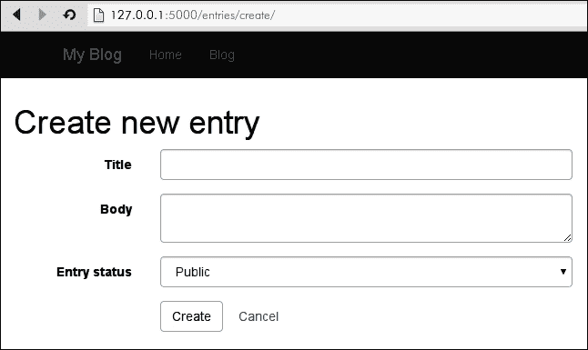
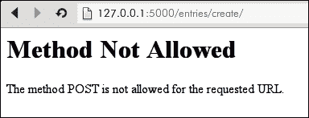
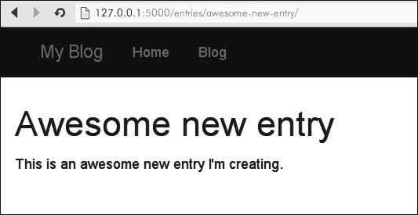
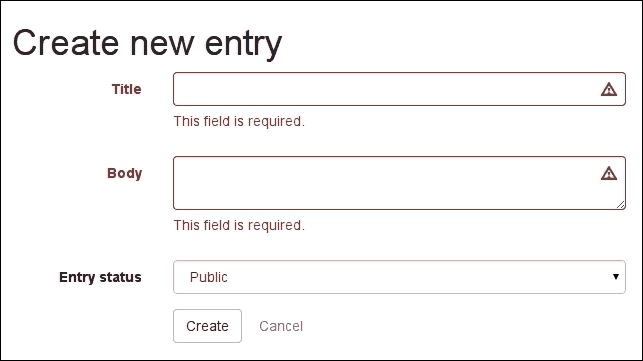
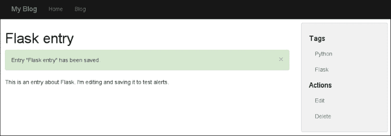
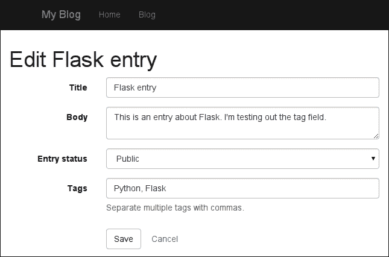

# 第四章：表单和验证

在本章中，我们将学习如何使用表单直接通过网站修改博客上的内容。这将是一个有趣的章节，因为我们将添加各种新的与网站交互的方式。我们将创建用于处理 Entry 模型的表单，学习如何接收和验证用户数据，并最终更新数据库中的值。表单处理和验证将由流行的 WTForms 库处理。我们将继续构建视图和模板来支持这些新的表单，并在此过程中学习一些新的 Jinja2 技巧。

在本章中，我们将：

+   安装 WTForms 并创建一个用于处理 Entry 模型的表单

+   编写视图来验证和处理表单数据，并将更改持久化到数据库中

+   创建模板来显示表单和验证错误

+   使用 Jinja2 宏来封装复杂的模板逻辑

+   向用户显示闪存消息

+   创建一个图片上传器，并学习如何安全处理文件上传

+   学习如何存储和提供静态资产，如 JavaScript、样式表和图像上传

# 开始使用 WTForms

**WTForms**是 Flask 社区中处理表单和验证的流行选择。它使用一种声明性的方法来构建表单（类似于我们定义 SQLAlchemy 模型的方式），并支持各种不同的字段类型和验证器。

### 注意

在撰写本书时，WTForms 2.0 仍然是一个开发版本，但应该很快就会成为官方版本。因此，我们将在本书中使用版本 2.0。

让我们开始通过将 WTForms 安装到我们的博客项目`virtualenv`中：

```py
(blog) $ pip install "wtforms>=2.0"
Successfully installed wtforms
Cleaning up...

```

我们可以通过打开一个 shell 并检查项目版本来验证安装是否成功：

```py
(blog) $ ./manage.py shell
In [1]: import wtforms

In [2]: wtforms.__version__
Out[2]: '2.0dev'

```

我的版本显示了开发版本，因为 2.0 尚未正式发布。

## 为 Entry 模型定义一个表单

我们的目标是能够直接通过我们的网站创建和编辑博客条目，因此我们需要回答的第一个问题是——我们将如何输入我们的新条目的数据？答案当然是使用表单。表单是 HTML 标准的一部分，它允许我们使用自由格式的文本输入、大型多行文本框、下拉选择、复选框、单选按钮等。当用户提交表单时，表单会指定一个 URL 来接收表单数据。然后该 URL 可以处理数据，然后以任何喜欢的方式做出响应。

对于博客条目，让我们保持简单，只有三个字段：

+   `标题`，显示为简单的文本输入

+   `正文`，显示为大型自由格式文本框

+   `状态`，将显示为下拉选择

在`entries`目录中，创建一个名为`forms.py`的新 Python 文件。我们将定义一个简单的表单类，其中包含这些字段。打开`forms.py`并添加以下代码：

```py
import wtforms

from models import Entry

class EntryForm(wtforms.Form):
    title = wtforms.StringField('Title')
    body = wtforms.TextAreaField('Body')
    status = wtforms.SelectField(
        'Entry status',
        choices=(
            (Entry.STATUS_PUBLIC, 'Public'),
            (Entry.STATUS_DRAFT, 'Draft')),
        coerce=int)
```

这应该看起来与我们的模型定义非常相似。请注意，我们正在使用模型中列的名称作为表单字段的名称：这将允许 WTForms 自动在 Entry 模型字段和表单字段之间复制数据。

前两个字段，`标题`和`正文`，都指定了一个参数：在渲染表单时将显示的标签。`状态`字段包含一个标签以及两个额外的参数：`choices`和`coerce`。`choices`参数由一个 2 元组的列表组成，其中第一个值是我们感兴趣存储的实际值，第二个值是用户友好的表示。第二个参数，`coerce`，将把表单中的值转换为整数（默认情况下，它将被视为字符串，这是我们不想要的）。

## 一个带有视图的表单

为了开始使用这个表单，我们需要创建一个视图，该视图将显示表单并在提交时接受数据。为此，让我们打开`entries`蓝图模块，并定义一个新的 URL 路由来处理条目创建。在`blueprint.py`文件的顶部，我们需要从`forms`模块导入`EntryForm`类：

```py
from app import db
from helpers import object_list
from models import Entry, Tag
from entries.forms import EntryForm

```

然后，在`detail`视图的定义之上，我们将添加一个名为`create`的新视图，该视图将通过导航到`/entries/create/`来访问。我们必须将其放在`detail`视图之上的原因是因为 Flask 将按照定义的顺序搜索 URL 路由。由于`/entries/create/`看起来非常像一个条目详细信息 URL（想象条目的标题是`create`），如果首先定义了详细信息路由，Flask 将在那里停止，永远不会到达创建路由。

在我们的创建视图中，我们将简单地实例化表单并将其传递到模板上下文中。添加以下视图定义：

```py
@entries.route('/create/')
def create():
    form = EntryForm()
    return render_template('entries/create.html', form=form)
```

在我们添加代码将新条目保存到数据库之前，让我们构建一个模板，看看我们的表单是什么样子。然后我们将回过头来添加代码来验证表单数据并创建新条目。

## create.html 模板

让我们为我们的新表单构建一个基本模板。在其他条目模板旁边创建一个名为`create.html`的新模板。相对于应用程序目录，该文件的路径应为`entries/templates/entries/create.html`。我们将扩展基本模板并覆盖内容块以显示我们的表单。由于我们使用的是 bootstrap，我们将使用特殊的 CSS 类来使我们的表单看起来漂亮。添加以下 HTML 代码：

```py


Create new entry

Create new entry


  <form action="{{ url_for('entries.create') }}" class="form form-horizontal" method="post">
    
      <div class="form-group">
        {{ field.label(class='col-sm-3 control-label') }}
        <div class="col-sm-9">
          {{ field(class='form-control') }}
        </div>
      </div>
    
    <div class="form-group">
      <div class="col-sm-offset-3 col-sm-9">
        <button type="submit" class="btn btn-default">Create</button>
        <a class="btn" href="{{ url_for('entries.index') }}">Cancel</a>
      </div>
    </div>
  </form>

```

通过迭代我们传入上下文的表单，我们可以渲染每个单独的字段。要渲染字段，我们首先通过简单调用`field.label()`并传入所需的 CSS 类来渲染字段的标签。同样，要渲染字段，我们调用`field()`，再次传入 CSS 类。还要注意的是，除了`submit`按钮，我们还添加了一个`Cancel`链接，该链接将返回用户到条目列表。

启动开发服务器并导航到`http://127.0.0.1:5000/entries/create/`以查看以下表单：



尝试提交表单。当您点击**创建**按钮时，您应该会看到以下错误消息：



您看到此消息的原因是因为默认情况下，Flask 视图只会响应 HTTP `GET`请求。当我们提交表单时，浏览器会发送`POST`请求，而我们的视图目前不接受。让我们返回`create`视图并添加代码来正确处理`POST`请求。

### 提示

每当表单对数据进行更改（创建、编辑或删除某些内容）时，该表单应指定`POST`方法。其他表单，例如我们的搜索表单，不进行任何更改，应使用`GET`方法。此外，当使用`GET`方法提交表单时，表单数据将作为查询字符串的一部分提交。

## 处理表单提交

在修改视图之前，让我们向我们的`EntryForm`添加一个辅助方法，我们将使用该方法将数据从表单复制到我们的`Entry`对象中。打开`forms.py`并进行以下添加：

```py
class EntryForm(wtforms.Form):
    ...
    def save_entry(self, entry):
 self.populate_obj(entry)
 entry.generate_slug()
 return entry

```

这个辅助方法将用表单数据填充我们传入的`entry`，根据标题重新生成条目的 slug，然后返回`entry`对象。

现在表单已配置为填充我们的`Entry`模型，我们可以修改视图以接受和处理`POST`请求。我们将使用两个新的 Flask 辅助函数，因此修改`blueprint.py`顶部的导入，添加`redirect`和`url_for`：

```py
from flask import Blueprint, redirect, render_template, request, url_for

```

添加导入后，更新`blueprint.py`中`create`视图的以下更改：

```py
from app import db
@entries.route('/create/', methods=['GET', 'POST'])
def create():
    if request.method == 'POST':
        form = EntryForm(request.form)
        if form.validate():
            entry = form.save_entry(Entry())
            db.session.add(entry)
            db.session.commit()
            return redirect(url_for('entries.detail', slug=entry.slug))
    else:
        form = EntryForm()

    return render_template('entries/create.html', form=form)
```

这是相当多的新代码，让我们仔细看看发生了什么。首先，我们在路由装饰器中添加了一个参数，指示此视图接受`GET`和`POST`请求。这将消除当我们提交表单时出现的**方法不允许**错误。

在视图的主体中，我们现在正在检查`request`方法，并根据这一点做两件事中的一件。让我们首先看看'else'子句。当我们收到`GET`请求时，比如当有人打开他们的浏览器并导航到`/entries/create/`页面时，代码分支将执行。当这种情况发生时，我们只想显示包含表单的 HTML 页面，因此我们将实例化一个表单并将其传递到模板上下文中。

如果这是一个`POST`请求，当有人提交表单时会发生，我们想要实例化`EntryForm`并传入原始表单数据。Flask 将原始的 POST 数据存储在特殊属性`request.form`中，这是一个类似字典的对象。WTForms 知道如何解释原始表单数据并将其映射到我们定义的字段。

在用原始表单数据实例化我们的表单之后，我们需要检查并确保表单有效，通过调用`form.validate()`。如果表单由于某种原因未能验证，我们将简单地将无效的表单传递到上下文并呈现模板。稍后您将看到我们如何在用户的表单提交出现问题时向用户显示错误消息。

如果表单验证通过，我们最终可以继续保存条目。为此，我们将调用我们的`save_entry`辅助方法，传入一个新的`entry`实例。WTForms 将使用表单数据填充`Entry`对象，然后将其返回给我们，在那里我们将其添加到数据库会话中，提交并重定向。重定向助手将发出 HTTP 302 重定向，将用户的浏览器从`/entries/create/`发送到新创建的博客文章的详细页面。

打开你的浏览器，试一试。



## 验证输入并显示错误消息

我们的表单存在一个明显的问题：现在没有任何东西可以阻止我们意外地提交一个空的博客条目。为了确保在保存时有标题和内容，我们需要使用一个名为验证器的 WTForm 对象。验证器是应用于表单数据的规则，WTForms 附带了许多有用的验证器。一些常用的验证器列在下面：

+   `DataRequired`：此字段不能为空

+   `Length(min=?, max=?)`：验证输入的数据的长度是否超过最小值，或者是否不超过最大值

+   `NumberRange(min=?, max=?)`：验证输入的数字是否在给定范围内

+   `Email`：验证数据是否为有效的电子邮件地址

+   `URL`：验证输入的数据是否为有效的 URL

+   `AnyOf(values=?)`：验证输入的数据是否等于提供的值之一

+   `NoneOf(values=?)`：验证输入的数据是否不等于提供的任何值

对于博客条目表单，我们将只使用`DataRequired`验证器来确保条目不能在没有标题或正文内容的情况下创建。让我们打开`forms.py`并将验证器添加到我们的表单定义中。总的来说，我们的表单模块应该如下所示：

```py
import wtforms
from wtforms.validators import DataRequired

from models import Entry

class EntryForm(wtforms.Form):
    title = wtforms.StringField(
        'Title',
        validators=[DataRequired()])
    body = wtforms.TextAreaField(
        'Body',
        validators=[DataRequired()])
    status = wtforms.SelectField(
        'Entry status',
        choices=(
            (Entry.STATUS_PUBLIC, 'Public'),
            (Entry.STATUS_DRAFT, 'Draft')),
        coerce=int)

    def save_entry(self, entry):
        self.populate_obj(entry)
        entry.generate_slug()
        return entry
```

启动开发服务器，现在尝试提交一个空表单。正如你所期望的那样，由于对`form.validate()`的调用返回`False`，它将无法保存。不幸的是，前端没有任何指示我们的表单为什么没有保存。幸运的是，WTForms 将使验证错误在模板中可用，我们所需要做的就是修改我们的模板来显示它们。

为了显示验证错误，我们将使用几个 bootstrap CSS 类和结构，但最终结果将非常好看，如下面的截图所示：



对`create.html`模板中的字段显示代码进行以下更改：

```py

  <div class="form-group has-error has-feedback">
    {{ field.label(class='col-sm-3 control-label') }}
    <div class="col-sm-9">
      {{ field(class='form-control') }}
      
        <span class="glyphicon glyphicon-warning-sign form-control-feedback"></span>
      
      <span class="help-block">{{ error }}</span>
    </div>
  </div>

```

我们通过查看`field.errors`属性来检查字段是否有任何错误。如果有任何错误，那么我们会做以下事情：

+   向`form-group` div 添加 CSS 类

+   添加一个特殊的图标表示有错误发生

+   在表单字段下方显示每个错误的`<span>`。由于`field.errors`是一个列表，可能包含多个验证错误，我们将使用 for 循环来遍历这些错误。

现在，您可以使用表单创建有效的博客条目，该表单还会执行一些验证，以确保您不会提交空白表单。在下一节中，我们将描述如何重复使用相同的表单来编辑现有条目。

## 编辑现有条目

信不信由你，我们实际上可以使用相同的表单来编辑现有条目。我们只需要对视图和模板逻辑进行一些微小的更改，所以让我们开始吧。

为了编辑条目，我们将需要一个视图，因此我们将需要一个 URL。因为视图需要知道我们正在编辑哪个条目，所以将其作为 URL 结构的一部分传达是很重要的，因此我们将在`/entries/<slug>/edit/`设置`edit`视图。打开`entries/blueprint.py`，在详细视图下方，添加以下代码以获取`edit`视图。请注意与`create`视图的相似之处：

```py
@entries.route('/<slug>/edit/', methods=['GET', 'POST'])
def edit(slug):
    entry = Entry.query.filter(Entry.slug == slug).first_or_404()
    if request.method == 'POST':
        form = EntryForm(request.form, obj=entry)
        if form.validate():
            entry = form.save_entry(entry)
            db.session.add(entry)
            db.session.commit()
            return redirect(url_for('entries.detail', slug=entry.slug))
    else:
        form = EntryForm(obj=entry)

    return render_template('entries/edit.html', entry=entry, form=form)
```

就像我们在`create`视图中所做的那样，我们检查`request`方法，并根据它，我们将验证和处理表单，或者只是实例化它并将其传递给模板。

最大的区别在于我们如何实例化`EntryForm`。我们向它传递了一个额外的参数，`obj=entry`。当 WTForms 接收到一个`obj`参数时，它将尝试使用从`obj`中获取的值（在本例中是我们的博客条目）预填充表单字段。

我们还将在模板上下文中传递一个额外的值，即我们正在编辑的条目。我们这样做是为了能够向用户显示条目的标题；这样，我们可以使表单的**取消**按钮链接回条目详细视图。

### 编辑.html 模板

正如您可能猜到的，`edit.html`模板几乎与`create.html`相同。由于字段渲染逻辑的复杂性，复制并粘贴所有代码似乎是一个坏主意。如果我们决定更改表单字段的显示方式，我们将发现自己需要修改多个文件，这应该始终是一个很大的警告信号。

为了避免这种情况，我们将使用一个强大的 Jinja2 功能，称为宏，来渲染我们的字段。字段渲染代码将在宏中定义，然后，无论我们想要渲染一个字段的地方，我们只需调用我们的宏。这样可以很容易地更改我们的字段样式。

### 提示

宏是 Jinja2 的一个功能，允许您将模板的一部分视为函数，因此可以使用不同的参数多次调用它，并生成基本相似的 HTML。您可以在 Jinja 文档网站上查看更多内容：[`jinja.pocoo.org/docs/dev/templates/`](http://jinja.pocoo.org/docs/dev/templates/)

由于这个宏对于我们可能希望显示的任何表单字段都是有用的，我们将把它放在我们应用程序的模板目录中。在应用程序的模板目录中，创建一个名为`macros`的新目录，并添加一个字段`form_field.html`。相对于应用程序目录，该文件的路径是`templates/macros/form_field.html`。添加以下代码：

```py

  <div class="form-group has-error has-feedback">
    {{ field.label(class='col-sm-3 control-label') }}
    <div class="col-sm-9">
      {{ field(class='form-control', **kwargs) }}
      <span class="glyphicon glyphicon-warning-sign form-control-feedback"></span>
      <span class="help-block">{{ error }}</span>
    </div>
  </div>

```

在大部分情况下，我们只是从`create`模板中复制并粘贴了字段渲染代码，但有一些区别我想指出：

+   模板以`macro`模板标签开头，定义了`macro`的名称和它接受的任何参数。

+   当我们渲染字段时，我们传入`**kwargs`。WTForms 字段可以接受任意关键字参数，然后将其转换为 HTML 标记上的属性。虽然我们目前不打算使用这个功能，但我们将在后面的章节中使用它。

+   我们使用`endmacro`标记表示宏的结束。

现在让我们更新`create.html`以使用新的宏。为了使用这个宏，我们必须首先`import`它。然后我们可以用一个简单的宏调用替换所有的字段标记。通过这些更改，`create.html`模板应该是这样的：

```py



Create new entry

Create new entry


  <form action="{{ url_for('entries.create') }}" class="form form-horizontal" method="post">
    
      {{ form_field(field) }}
    
    <div class="form-group">
      <div class="col-sm-offset-3 col-sm-9">
        <button type="submit" class="btn btn-default">Create</button>
        <a class="btn" href="{{ url_for('entries.index') }}">Cancel</a>
      </div>
    </div>
  </form>

```

搞定这些之后，我们可以继续创建我们的`edit.html`模板。它看起来几乎和`create`模板一样，只是我们将在`app/entries/templates/entries`目录中显示文本，以指示用户他们正在编辑一个现有条目：

```py



Edit {{ entry.title }}

Edit {{ entry.title }}


  <form action="{{ url_for('entries.edit', slug=entry.slug) }}" class="form form-horizontal" method="post">
    
      {{ form_field(field) }}
    
    <div class="form-group">
      <div class="col-sm-offset-3 col-sm-9">
        <button type="submit" class="btn btn-default">Save</button>
        <a class="btn" href="{{ url_for('entries.detail', slug=entry.slug) }}">Cancel</a>
      </div>
    </div>
  </form>

```

为了结束这一部分，在条目详细页面上，让我们在侧边栏中添加一个链接，可以带我们到`Edit`页面。在`detail.html`的侧边栏中添加以下链接：

```py
<a href="{{ url_for('entries.edit', slug=entry.slug) }}">Edit</a>
```

## 删除条目

为了完成这一部分，我们将添加一个用于删除条目的视图。我们将设计这个视图，当用户去删除一个条目时，他们会被带到一个确认页面。只有通过提交确认表单（一个`POST`请求），他们才能真正删除条目。因为这个表单不需要任何字段，我们不需要一个特殊的 WTForms 类，可以直接使用 HTML 创建它。

在`create.html`和`edit.html`模板旁边创建一个名为`delete.html`的模板，并添加以下 HTML：

```py


{{ entry.title }}

{{ entry.title }}


  <form action="{{ url_for('entries.delete', slug=entry.slug) }}" method="post">
    <fieldset>
      <legend>Delete this entry?</legend>
      <button class="btn btn-danger" type="submit">Delete</button>
      <a class="btn" href="{{ url_for('entries.detail', slug=entry.slug) }}">Cancel</a>
    </fieldset>
  </form>

```

现在我们需要定义`entries.delete`视图。与`edit`视图一样，删除条目的 URL 需要条目 slug 作为 URL 结构的一部分。因此，我们将使用`/entries/<slug>/delete/`。

当表单提交时，我们可以简单地从数据库中删除条目，但根据我的经验，我通常会后悔永久删除内容。我们不会真正从数据库中删除条目，而是给它一个`_DELETED`状态；我们将把它的状态改为`STATUS_DELETED`。然后我们将修改我们的视图，以便具有这种状态的条目永远不会出现在网站的任何部分。在所有方面，条目都消失了，但是，如果我们将来需要它，我们可以从数据库中检索它。在`edit`视图下面添加以下视图代码：

```py
@entries.route('/<slug>/delete/', methods=['GET', 'POST'])
def delete(slug):
    entry = Entry.query.filter(Entry.slug == slug).first_or_404()
    if request.method == 'POST':
        entry.status = Entry.STATUS_DELETED
        db.session.add(entry)
        db.session.commit()
        return redirect(url_for('entries.index'))

    return render_template('entries/delete.html', entry=entry)
```

我们还需要在 model.py 中的 Entries 模型中添加 STATUS_DELETED：

```py
class Entry(db.Model):
    STATUS_PUBLIC = 0
    STATUS_DRAFT = 1
    STATUS_DELETED = 2
```

与编辑链接一样，花点时间在详细视图侧边栏中添加一个`delete`链接。

## 清理

让我们花点时间重构我们的蓝图。由于我们不想在网站上显示已删除的条目，我们需要确保通过状态筛选我们的条目。此外，看着`detail`、`edit`和`delete`视图，我看到了三个我们复制并粘贴查询条目的代码的实例。让我们也将其移动到一个辅助函数中。

首先，让我们更新`entry_list`辅助函数，以筛选出公共或草稿条目。

### 提示

在下一章中，我们将为网站添加登录功能。一旦我们有了这个功能，我们将添加逻辑，只向创建它们的用户显示草稿条目。

```py
def entry_list(template, query, **context):
    valid_statuses = (Entry.STATUS_PUBLIC, Entry.STATUS_DRAFT)
    query = query.filter(Entry.status.in_(valid_statuses))
    if request.args.get('q'):
        search = request.args['q']
        query = query.filter(
            (Entry.body.contains(search)) |
            (Entry.title.contains(search)))

    return object_list(template, query, **context)
```

现在我们可以确信，无论我们在哪里显示条目列表，都不会显示已删除的条目。

现在让我们添加一个新的辅助函数来通过其 slug 检索`Entry`。如果找不到条目，我们将返回 404。在`entry_list`下面添加以下代码：

```py
def get_entry_or_404(slug):
  valid_statuses = (Entry.STATUS_PUBLIC, Entry.STATUS_DRAFT) (Entry.query
          .filter(
              (Entry.slug == slug) &
              (Entry.status.in_(valid_statuses)))
          .first_or_404())
```

用`get_entry_or_404`替换`detail`、`edit`和`delete`视图中的`Entry.query.filter()`调用。以下是更新后的 detail 视图：

```py
@entries.route('/<slug>/')
def detail(slug):
    entry = get_entry_or_404(slug)
    return render_template('entries/detail.html', entry=entry)
```

# 使用闪存消息

当用户在网站上执行操作时，通常会在随后的页面加载时显示一次性消息，指示他们的操作已成功。这些称为闪存消息，Flask 带有一个辅助函数来显示它们。为了开始使用闪存消息，我们需要在`config`模块中添加一个秘钥。秘钥是必要的，因为闪存消息存储在会话中，而会话又存储为加密的 cookie。为了安全地加密这些数据，Flask 需要一个秘钥。

打开`config.py`并添加一个秘钥。可以是短语、随机字符，任何你喜欢的东西：

```py
class Configuration(object):
    APPLICATION_DIR = current_directory
    DEBUG = True
    SECRET_KEY = 'flask is fun!'  # Create a unique key for your app.
    SQLALCHEMY_DATABASE_URI = 'sqlite:///%s/blog.db' % APPLICATION_DIR
```

现在，无论我们的用户在哪个页面上执行操作，我们都希望向他们显示一个消息，指示他们的操作成功。 这意味着我们将在`create`，`edit`和`delete`视图中添加一个消息。 打开条目蓝图并将闪存函数添加到模块顶部的 flask 导入列表中：

```py
from flask import Blueprint, flash, redirect, render_template, request, url_for
```

然后，在每个适当的视图中，让我们调用`flash`并显示一个有用的消息。 在重定向之前应该发生调用：

```py
def create():
        ...
            db.session.commit()
            flash('Entry "%s" created successfully.' % entry.title, 'success')
            return redirect(url_for('entries.detail', slug=entry.slug))
        ...

def edit(slug):
        ...
        db.session.commit()
        flash('Entry "%s" has been saved.' % entry.title, 'success')
        return redirect(url_for('entries.detail', slug=entry.slug))
        ...

def delete(slug):
        ...
        db.session.commit()
        flash('Entry "%s" has been deleted.' % entry.title, 'success')
        return redirect(url_for('entries.index'))
        ...
```

## 在模板中显示闪存消息

因为我们并不总是知道在需要显示闪存消息时我们将在哪个页面上，所以将显示逻辑添加到基本模板是一种标准做法。 Flask 提供了一个 Jinja2 函数`get_flashed_messages`，它将返回一个待显示的消息列表。

打开`base.html`并添加以下代码。 我已经将我的代码放在`content_title`块和`content`块之间：

```py
<h1></h1>

 <div class="alert alert-dismissable alert-{{ category }}">
 <button type="button" class="close" data-dismiss="alert">&times;</button>
 {{ message }}
 </div>


```

让我们试试看！ 启动开发服务器并尝试添加一个新条目。 保存后，您应该被重定向到新条目，并看到一个有用的消息，如下面的屏幕截图所示：



# 保存和修改帖子上的标签

我们已经讨论了如何保存和修改条目上的标签。 管理标签的最常见方法之一是使用逗号分隔的文本输入，因此我们可以将标签列为*Python*，*Flask*，*Web-development*。 使用 WTForms 似乎非常简单，因为我们只需使用`StringField`。 然而，由于我们正在处理数据库关系，这意味着我们需要在`Tag`模型和逗号分隔的字符串之间进行一些处理。

虽然我们可以通过许多方式来实现这一点，但我们将实现一个自定义字段类`TagField`，它将封装在逗号分隔的标签名称和`Tag`模型实例之间进行转换的所有逻辑。

### 提示

另一个选项是在`Entry`模型上创建一个*property*。 属性看起来像一个普通的对象属性，但实际上是 getter 和（有时）setter 方法的组合。 由于 WTForms 可以自动处理我们的模型属性，这意味着，如果我们在 getter 和 setter 中实现我们的转换逻辑，WTForms 将正常工作。

让我们首先定义我们的标签字段类。 我们需要重写两个重要的方法：

+   `_value()`: 将`Tag`实例列表转换为逗号分隔的标签名称列表

+   `process_formdata(valuelist)`: 接受逗号分隔的标签列表并将其转换为`Tag`实例的列表

以下是`TagField`的实现。 请注意，我们在处理用户输入时要特别小心，以避免在`Tag`表中创建重复行。 我们还使用 Python 的`set()`数据类型来消除用户输入中可能的重复项。 将以下类添加到`forms.py`中的`EntryForm`上方：

```py
from models import Tag
class TagField(wtforms.StringField):
    def _value(self):
        if self.data:
            # Display tags as a comma-separated list.
            return ', '.join([tag.name for tag in self.data])
        return ''

    def get_tags_from_string(self, tag_string):
        raw_tags = tag_string.split(',')

        # Filter out any empty tag names.
        tag_names = [name.strip() for name in raw_tags if name.strip()]

        # Query the database and retrieve any tags we have already saved.
        existing_tags = Tag.query.filter(Tag.name.in_(tag_names))

        # Determine which tag names are new.
        new_names = set(tag_names) - set([tag.name for tag in existing_tags])

        # Create a list of unsaved Tag instances for the new tags.
        new_tags = [Tag(name=name) for name in new_names]

        # Return all the existing tags + all the new, unsaved tags.
        return list(existing_tags) + new_tags

    def process_formdata(self, valuelist):
        if valuelist:
            self.data = self.get_tags_from_string(valuelist[0])
        else:
            self.data = []
```

现在，我们只需要将字段添加到`EntryForm`中。 在`status`字段下面添加以下字段。 请注意`description`关键字参数的使用：

```py
class EntryForm(wtforms.Form):
    ...
    tags = TagField(
        'Tags',
        description='Separate multiple tags with commas.')
```

为了显示这个有用的`description`文本，让我们对`form_field`宏进行快速修改：

```py

  <div class="form-group has-error has-feedback">
    {{ field.label(class='col-sm-3 control-label') }}
    <div class="col-sm-9">
      {{ field(class='form-control', **kwargs) }}
      <span class="glyphicon glyphicon-warning-sign form-control-feedback"></span>
      <span class="help-block">{{ field.description|safe }}</span>
      <span class="help-block">{{ error }}</span>
    </div>
  </div>

```

启动开发服务器，并尝试保存一些标签。 您的表单应该看起来像下面的屏幕截图：



## 图像上传

我们将通过为网站添加一个图片上传功能来完成表单处理章节。 这个功能将是一个简单的视图，接受一个图像文件并将其存储在服务器上的上传目录中。 这将使我们能够轻松在博客条目中显示图像。

第一步是创建一个处理图像上传的表单。 除了`EntryForm`，让我们添加一个名为`ImageForm`的新表单。 这个表单将非常简单，包含一个文件输入。 我们将使用自定义验证器来确保上传的文件是有效的图像。 将以下代码添加到`forms.py`中：

```py
class ImageForm(wtforms.Form):
    file = wtforms.FileField('Image file')
```

在我们添加一个视图来保存表单之前，我们需要知道我们将在哪里保存文件。通常，应用程序的资源（如图像、JavaScript 和样式表）都是从一个名为`static`的单个目录中提供的。通常的做法是在 web 服务器中覆盖此目录的路径，以便它可以在不经过 Python 中介的情况下传输此文件，从而使访问速度更快。我们利用`static`目录来存储我们的图像上传。在博客项目的`app`目录中，让我们创建一个名为`static`的新目录和一个子目录`images`：

```py
(blog) $ cd ~/projects/blog/blog/app
(blog) $ mkdir -p static/images

```

现在让我们向配置文件中添加一个新值，这样我们就可以轻松地引用磁盘上图像的路径。这样可以简化我们的代码，以后如果我们选择更改此位置，也会更加方便。打开`config.py`并添加以下值：

```py
class Configuration(object):
    ...
    STATIC_DIR = os.path.join(APPLICATION_DIR, 'static')
    IMAGES_DIR = os.path.join(STATIC_DIR, 'images')
```

## 处理文件上传

我们现在准备创建一个用于处理图像上传的视图。逻辑将与我们的其他表单处理视图非常相似，唯一的区别是，在验证表单后，我们将把上传的文件保存到磁盘上。由于这些图像是用于我们博客条目的，我将视图添加到 entries blueprint 中，可在`/entries/image-upload/`访问。

我们需要导入我们的新表单以及其他辅助工具。打开`blueprint.py`并在模块顶部添加以下导入：

```py
import os

from flask import Blueprint, flash, redirect, render_template, request, url_for
from werkzeug import secure_filename

from app import app, db
from helpers import object_list
from models import Entry, Tag
from entries.forms import EntryForm, ImageForm

```

在视图列表的顶部，让我们添加新的`image-upload`视图。重要的是它出现在`detail`视图之前，否则 Flask 会错误地将`/image-upload/`视为博客条目的 slug。添加以下视图定义：

```py
@entries.route('/image-upload/', methods=['GET', 'POST'])
def image_upload():
    if request.method == 'POST':
        form = ImageForm(request.form)
        if form.validate():
            image_file = request.files['file']
            filename = os.path.join(app.config['IMAGES_DIR'],
                                    secure_filename(image_file.filename))
            image_file.save(filename)
            flash('Saved %s' % os.path.basename(filename), 'success')
            return redirect(url_for('entries.index'))
    else:
        form = ImageForm()

    return render_template('entries/image_upload.html', form=form)
```

这里的大部分代码可能看起来很熟悉，值得注意的例外是使用`request.files`和`secure_filename`。当文件上传时，Flask 会将其存储在`request.files`中，这是一个特殊的字典，以表单字段的名称为键。我们使用`secure_filename`进行一些路径连接，以防止恶意文件名，并生成到`static/images`目录的正确路径，然后将上传的文件保存到磁盘上。就是这么简单。

### 图片上传模板

让我们为我们的图片上传表单创建一个简单的模板。在 entries 模板目录中创建一个名为`image_upload.html`的文件，并添加以下代码：

```py



Upload an image

Upload an image


  <form action="{{ url_for('entries.image_upload') }}" enctype="multipart/form-data" method="post">
    
      {{ form_field(field) }}
    
    <div class="form-group">
      <div class="col-sm-offset-3 col-sm-9">
        <button type="submit" class="btn btn-default">Upload</button>
        <a class="btn" href="{{ url_for('entries.index') }}">Cancel</a>
      </div>
    </div>
  </form>

```

为了让 Flask 处理我们上传的文件，我们必须在定义`<form>`元素时指定`enctype="multipart/form-data"`。这是一个非常常见的错误，所以我会再次重复：每当您接受文件上传时，您的表单元素必须指定`enctype="multipart/form-data"`。

继续尝试图片上传。您应该在应用程序中的`static/images/directory`中看到您上传的文件。您还可以通过浏览器导航到`http://127.0.0.1:5000/static/images/the-file-name.jpg`来查看图像。

# 提供静态文件

Flask 将自动从我们的`/static/`目录中提供文件。当我们在第十章部署我们的网站时，*部署您的应用程序*，我们将使用**Nginx** web 服务器来提供静态资产，但是对于本地开发，Flask 使事情变得非常简单。

除了我们的图像上传，让我们还从`/static/`提供我们网站的 JavaScript 和样式表。下载 jQuery 和 Bootstrap，并将 JavaScript 文件（`jquery-<version>.min.js`和`boostrap.min.js`）放在`static/js`中。将压缩的 bootstrap CSS 文件（`bootstrap.min.css`）放在`static/css`中。Bootstrap 还带有一些用于图标的特殊字体。将 bootstrap 字体目录也复制到 static 目录中。现在，您的应用程序的 static 目录中应该有四个目录：`css`、`fonts`、`images`和`js`，每个目录中都包含相关文件：

```py
(blog) $ cd static/ && find . -type f
./fonts/glyphicons-halflings-regular.woff
./fonts/glyphicons-halflings-regular.ttf
./fonts/glyphicons-halflings-regular.eot
./fonts/glyphicons-halflings-regular.svg
./images/2012-07-17_16.18.18.jpg
./js/jquery-1.10.2.min.js
./js/bootstrap.min.js
./css/bootstrap.min.css

```

为了将我们的基本模板指向这些文件的本地版本，我们将使用`url_for`助手来生成正确的 URL。打开`base.html`，删除旧的样式表和 JavaScript 标签，并用本地版本替换它们：

```py
<head>
  <meta charset="utf-8">
  <title> | My Blog</title>

  <link rel="stylesheet" href="{{="{{ url_for('static', filename='css/bootstrap.min.css') }}">
  <style type="text/css">
    body { padding-top: 60px; }
  </style>
  

  <script src="img/jquery-1.10.2.min.js') }}"></script>
  <script src="img/bootstrap.min.js') }}"></script>
  
</head>
```

如果您愿意，可以在`static/css`目录中创建一个`site.css`文件，并将`<style>`标签替换为指向`site.css`的链接。

# 摘要

在本章中，我们添加了各种与网站交互的新方法。现在可以直接通过网站创建和修改内容。我们讨论了如何使用 WTForms 创建面向对象的表单，包括从视图处理和验证表单数据，以及将表单数据写入数据库。我们还创建了模板来显示表单和验证错误，并使用 Jinja2 宏来删除重复的代码，使代码更加模块化。然后，我们能够向用户显示单次使用的闪存消息，当他们执行操作时。最后，我们还解释了如何使用 WTForms 和 Flask 处理文件上传，并提供静态资产，如 JavaScript、样式表和图像上传。

在跳转到下一章之前，花一些时间尝试一下我们在网站中添加的新功能。以下是一些可以改进本章内容的方法：

+   在页眉中添加一个链接到图像上传表单。

+   在图像上传视图中，验证文件的扩展名是否是已识别的图像扩展名（.png、.jpg、.gif）。

+   添加一个只读的 StringField 来显示条目的 slug。

+   我们的标签索引视图将显示与零个条目关联的标签（如果我们添加了一个标签，然后从条目中删除它，这可能是这种情况）。改进查询，只列出具有一个或多个关联条目的标签。提示：`Tag.query.join(entry_tags).distinct()`。

+   在标签索引中显示与标签关联的条目数量。高级：在单个查询中完成。

+   高级：创建一个图像模型和用于创建、编辑和删除图像的视图。

在下一章中，我们将为我们的网站添加身份验证，以便只有受信任的用户才能创建和修改内容。我们将构建一个模型来代表博客作者，添加登录/注销表单，并防止未经身份验证的用户访问网站的某些区域。
