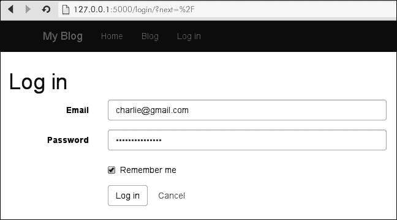
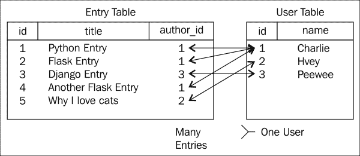

# 第五章：用户身份验证

在本章中，我们将向我们的网站添加用户身份验证。能够区分一个用户和另一个用户使我们能够开发一整套新功能。例如，我们将看到如何限制对创建、编辑和删除视图的访问，防止匿名用户篡改网站内容。我们还可以向用户显示他们的草稿帖子，但对其他人隐藏。本章将涵盖向网站添加身份验证层的实际方面，并以讨论如何使用会话跟踪匿名用户结束。

在本章中，我们将：

+   创建一个数据库模型来表示用户

+   安装 Flask-Login 并将 LoginManager 助手添加到我们的站点

+   学习如何使用加密哈希函数安全存储和验证密码

+   构建用于登录和退出网站的表单和视图

+   查看如何在视图和模板中引用已登录用户

+   限制对已登录用户的视图访问

+   向 Entry 模型添加作者外键

+   使用 Flask 会话对象跟踪网站的任何访问者

# 创建用户模型

构建我们的身份验证系统的第一步将是创建一个表示单个用户帐户的数据库模型。我们将存储用户的登录凭据，以及一些额外的信息，如用户的显示名称和他们的帐户创建时间戳。我们的模型将具有以下字段：

+   `email`（唯一）：存储用户的电子邮件地址，并将其用于身份验证

+   `password_hash`: 不是将每个用户的密码作为明文串联起来，而是使用单向加密哈希函数对密码进行哈希处理

+   `name`: 用户的名称，这样我们就可以在他们的博客条目旁边显示它

+   `slug`: 用户名称的 URL 友好表示，也是唯一的

+   `active`: 布尔标志，指示此帐户是否处于活动状态。只有活动用户才能登录网站

+   `created_timestamp`: 用户帐户创建的时间

### 提示

如果您认为还有其他字段可能有用，请随意向此列表添加自己的内容。

现在我们有了字段列表，让我们创建`model`类。打开`models.py`，在`Tag`模型下面，添加以下代码：

```py
class User(db.Model):
    id = db.Column(db.Integer, primary_key=True)
    email = db.Column(db.String(64), unique=True)
    password_hash = db.Column(db.String(255))
    name = db.Column(db.String(64))
    slug = db.Column(db.String(64), unique=True)
    active = db.Column(db.Boolean, default=True)
    created_timestamp = db.Column(db.DateTime, default=datetime.datetime.now)

    def __init__(self, *args, **kwargs):
        super(User, self).__init__(*args, **kwargs)
        self.generate_slug()

    def generate_slug(self):
        if self.name:
            self.slug = slugify(self.name)
```

正如您在第二章中所记得的，*使用 SQLAlchemy 的关系数据库*，我们需要创建一个迁移，以便将这个表添加到我们的数据库中。从命令行，我们将使用`manage.py`助手来审查我们的模型并生成迁移脚本：

```py
(blog) $ python manage.py db migrate
INFO  [alembic.migration] Context impl SQLiteImpl.
INFO  [alembic.migration] Will assume non-transactional DDL.
INFO  [alembic.autogenerate.compare] Detected added table 'user'
 Generating /home/charles/projects/blog/app/migrations/versions/40ce2670e7e2_.py ... done

```

生成迁移后，我们现在可以运行`db upgrade`来进行模式更改：

```py
(blog) $ python manage.py db upgrade
INFO  [alembic.migration] Context impl SQLiteImpl.
INFO  [alembic.migration] Will assume non-transactional DDL.
INFO  [alembic.migration] Running upgrade 2ceb72931f66 -> 40ce2670e7e2, empty message

```

现在我们有了用户，下一步将允许他们登录网站。

# 安装 Flask-Login

Flask-Login 是一个轻量级的扩展，用于处理用户登录和退出网站。根据项目的文档，Flask-Login 将执行以下操作：

+   登录和退出网站的用户

+   将视图限制为已登录用户

+   管理 cookie 和“记住我”功能

+   帮助保护用户会话 cookie 免受盗窃

另一方面，Flask-Login 不会做以下事情：

+   对用户帐户的存储做出任何决定

+   管理用户名、密码、OpenID 或任何其他形式的凭据

+   处理分层权限或任何超出已登录或已注销的内容

+   帐户注册、激活或密码提醒

从这些列表中得出的结论是，Flask-Login 最好被认为是一个会话管理器。它只是管理用户会话，并让我们知道哪个用户正在发出请求，以及该用户是否已登录。

让我们开始吧。使用`pip`安装 Flask-Login：

```py
(blog) $ pip install Flask-Login
Downloading/unpacking Flask-Login
...
Successfully installed Flask-Login
Cleaning up...

```

为了开始在我们的应用程序中使用这个扩展，我们将创建一个`LoginManager`类的实例，这是由 Flask-Login 提供的。除了创建`LoginManager`对象之外，我们还将添加一个信号处理程序，该处理程序将在每个请求之前运行。这个信号处理程序将检索当前登录的用户并将其存储在一个名为`g`的特殊对象上。在 Flask 中，`g`对象可以用来存储每个请求的任意值。

将以下代码添加到`app.py`。导入放在模块的顶部，其余部分放在末尾：

```py
from flask import Flask, g
from flask.ext.login import LoginManager, current_user

# Add to the end of the module.
login_manager = LoginManager(app)
login_manager.login_view = "login"

@app.before_request
def _before_request():
    g.user = current_user
```

现在我们已经创建了我们的`login_manager`并添加了一个信号处理程序来加载当前用户，我们需要告诉 Flask-Login 如何确定哪个用户已登录。Flask-Login 确定这一点的方式是将当前用户的 ID 存储在会话中。我们的用户加载器将接受存储在会话中的 ID 并从数据库返回一个`User`对象。

打开`models.py`并添加以下代码行：

```py
from app import login_manager

@login_manager.user_loader
def _user_loader(user_id):
    return User.query.get(int(user_id))
```

现在 Flask-Login 知道如何将用户 ID 转换为 User 对象，并且该用户将作为`g.user`对我们可用。

## 实现 Flask-Login 接口

为了让 Flask-Login 与我们的`User`模型一起工作，我们需要实现一些特殊方法，这些方法构成了 Flask-Login 接口。通过实现这些方法，Flask-Login 将能够接受一个`User`对象并确定他们是否可以登录网站。

打开`models.py`并向`User`类添加以下方法：

```py
class User(db.Model):
    # ... column definitions, etc ...

    # Flask-Login interface..
    def get_id(self):
        return unicode(self.id)

    def is_authenticated(self):
        return True

    def is_active(self):
        return self.active

    def is_anonymous(self):
        return False
```

第一个方法`get_id()`指示 Flask-Login 如何确定用户的 ID，然后将其存储在会话中。它是我们用户加载器函数的反向，它给我们一个 ID 并要求我们返回一个`User`对象。其余的方法告诉 Flask-Login，数据库中的`User`对象不是匿名的，并且只有在`active`属性设置为`True`时才允许登录。请记住，Flask-Login 对我们的`User`模型或数据库一无所知，因此我们必须非常明确地告诉它。

现在我们已经配置了 Flask-Login，让我们添加一些代码，以便我们可以创建一些用户。

# 创建用户对象

创建新用户就像创建条目或标签一样，只有一个例外：我们需要安全地对用户的密码进行哈希处理。您永远不应该以明文形式存储密码，并且由于黑客的技术日益复杂，最好使用强大的加密哈希函数。我们将使用**Flask-Bcrypt**扩展来对我们的密码进行哈希处理和检查，因此让我们使用`pip`安装这个扩展：

```py
(blog) $ pip install flask-bcrypt
...
Successfully installed Flask-Bcrypt
Cleaning up...

```

打开`app.py`并添加以下代码来注册扩展到我们的应用程序：

```py
from flask.ext.bcrypt import Bcrypt

bcrypt = Bcrypt(app)
```

现在让我们为`User`对象添加一些方法，以便创建和检查密码变得简单：

```py
from app import bcrypt

class User(db.Model):
    # ... column definitions, other methods ...

    @staticmethod
    def make_password(plaintext):
        return bcrypt.generate_password_hash(plaintext)

    def check_password(self, raw_password):
        return bcrypt.check_password_hash(self.password_hash, raw_password)

    @classmethod
    def create(cls, email, password, **kwargs):
        return User(
            email=email,
            password_hash=User.make_password(password),
            **kwargs)

    @staticmethod
    def authenticate(email, password):
        user = User.query.filter(User.email == email).first()
        if user and user.check_password(password):
            return user
        return False
```

`make_password`方法接受明文密码并返回哈希版本，而`check_password`方法接受明文密码并确定它是否与数据库中存储的哈希版本匹配。然而，我们不会直接使用这些方法。相反，我们将创建两个更高级的方法，`create`和`authenticate`。`create`方法将创建一个新用户，在保存之前自动对密码进行哈希处理，而`authenticate`方法将根据用户名和密码检索用户。

通过创建一个新用户来尝试这些方法。打开一个 shell，并使用以下代码作为示例，为自己创建一个用户：

```py
In [1]: from models import User, db

In [2]: user = User.create("charlie@gmail.com", password="secret",
name="Charlie")

In [3]: print user.password
$2a$12$q.rRa.6Y2IEF1omVIzkPieWfsNJzpWN6nNofBxuMQDKn.As/8dzoG

In [4]: db.session.add(user)

In [5]: db.session.commit()

In [6]:  User.authenticate("charlie@gmail.com", "secret")
Out[6]:  <User u"Charlie">

In [7]: User.authenticate("charlie@gmail.com", "incorrect")
Out[7]: False
```

现在我们有了一种安全地存储和验证用户凭据的方法，我们可以开始构建登录和注销视图了。

# 登录和注销视图

用户将使用他们的电子邮件和密码登录我们的博客网站；因此，在我们开始构建实际的登录视图之前，让我们从`LoginForm`开始。这个表单将接受`用户名`、`密码`，并且还会呈现一个复选框来指示网站是否应该`记住我`。在`app`目录中创建一个`forms.py`模块，并添加以下代码：

```py
import wtforms
from wtforms import validators
from models import User

class LoginForm(wtforms.Form):
    email = wtforms.StringField("Email",
        validators=[validators.DataRequired()])
    password = wtforms.PasswordField("Password",
        validators=[validators.DataRequired()])
    remember_me = wtforms.BooleanField("Remember me?",
        default=True)
```

### 提示

请注意，WTForms 还提供了一个电子邮件验证器。但是，正如该验证器的文档所告诉我们的那样，它非常原始，可能无法捕获所有边缘情况，因为完整的电子邮件验证实际上是非常困难的。

为了在正常的 WTForms 验证过程中验证用户的凭据，我们将重写表单的`validate()`方法。如果找不到电子邮件或密码不匹配，我们将在电子邮件字段下方显示错误。将以下方法添加到`LoginForm`类：

```py
def validate(self):
    if not super(LoginForm, self).validate():
        return False

    self.user = User.authenticate(self.email.data, self.password.data)
    if not self.user:
        self.email.errors.append("Invalid email or password.")
        return False

    return True
```

现在我们的表单已经准备好了，让我们创建登录视图。我们将实例化`LoginForm`并在`POST`时对其进行验证。此外，当用户成功验证时，我们将重定向他们到一个新页面。

当用户登录时，将其重定向回用户先前浏览的页面是一个很好的做法。为了实现这一点，我们将在查询字符串值`next`中存储用户先前所在页面的 URL。如果在该值中找到了 URL，我们可以将用户重定向到那里。如果未找到 URL，则用户将默认被重定向到主页。

在`app`目录中打开`views.py`并添加以下代码：

```py
from flask import flash, redirect, render_template, request, url_for
from flask.ext.login import login_user

from app import app
from app import login_manager
from forms import LoginForm

@app.route("/")
def homepage():
    return render_template("homepage.html")

@app.route("/login/", methods=["GET", "POST"])
def login():
    if request.method == "POST":
        form = LoginForm(request.form)
        if form.validate():
            login_user(form.user, remember=form.remember_me.data)
            flash("Successfully logged in as %s." % form.user.email, "success")
            return redirect(request.args.get("next") or url_for("homepage"))
    else:
        form = LoginForm()
    return render_template("login.html", form=form)
```

魔法发生在我们成功验证表单（因此验证了用户身份）后的`POST`上。我们调用`login_user`，这是 Flask-Login 提供的一个辅助函数，用于设置正确的会话值。然后我们设置一个闪存消息并将用户送上路。

## 登录模板

`login.html`模板很简单，除了一个技巧，一个例外。在表单的 action 属性中，我们指定了`url_for('login')`，但我们还传递了一个额外的值`next`。这允许我们在用户登录时保留所需的下一个 URL。将以下代码添加到`templates/login.html`：

```py


Log in
Log in

<form action="{{ url_for('login', next=request.args.get('next','')) }}" class="form form-horizontal" method="post">
{{ form_field(form.email) }}
{{ form_field(form.password) }}
<div class="form-group">
    <div class="col-sm-offset-3 col-sm-9">
        <div class="checkbox">
            <label>{{ form.remember_me() }} Remember me</label>
        </div>
    </div>
</div>
<div class="form-group">
    <div class="col-sm-offset-3 col-sm-9">
        <button type="submit" class="btn btn-default">Log in</button>
        <a class="btn" href="{{ url_for('homepage') }}">Cancel</a>
    </div>
</div>
</form>

```

当您访问登录页面时，您的表单将如下截图所示：



## 注销

最后让我们添加一个视图，用于将用户从网站中注销。有趣的是，此视图不需要模板，因为用户将简单地通过视图，在其会话注销后被重定向。将以下`import`语句和注销视图代码添加到`views.py`：

```py
# Modify the import at the top of the module.
from flask.ext.login import login_user, logout_user  # Add logout_user

@app.route("/logout/")
def logout():
    logout_user()
    flash('You have been logged out.', 'success')
    return redirect(request.args.get('next') or url_for('homepage'))
```

再次说明，我们接受`next` URL 作为查询字符串的一部分，默认为主页，如果未指定 URL。

# 访问当前用户

让我们在导航栏中创建登录和注销视图的链接。为此，我们需要检查当前用户是否已经通过身份验证。如果是，我们将显示一个指向注销视图的链接；否则，我们将显示一个登录链接。

正如您可能还记得本章早些时候所说的，我们添加了一个信号处理程序，将当前用户存储为 Flask `g`对象的属性。我们可以在模板中访问这个对象，所以我们只需要在模板中检查`g.user`是否已经通过身份验证。

打开`base.html`并对导航栏进行以下添加：

```py
<ul class="nav navbar-nav">
    <li><a href="{{ url_for('homepage') }}">Home</a></li>
    <li><a href="{{ url_for('entries.index') }}">Blog</a></li>
    
    <li><a href="{{ url_for('logout', next=request.path) }}">Log
out</a></li>
    
    <li><a href="{{ url_for('login', next=request.path) }}">Log
in</a></li>
    
  
</ul>
```

注意我们如何调用`is_authenticated()`方法，这是我们在`User`模型上实现的。Flask-Login 为我们提供了一个特殊的`AnonymousUserMixin`，如果当前没有用户登录，将使用它。

还要注意的是，除了视图名称，我们还指定了`next=request.path`。这与我们的登录和注销视图配合使用，以便在单击登录或注销后将用户重定向到其当前页面。

# 限制对视图的访问

目前，我们所有的博客视图都是不受保护的，任何人都可以访问它们。为了防止恶意用户破坏我们的条目，让我们为实际修改数据的视图添加一些保护。Flask-Login 提供了一个特殊的装饰器`login_required`，我们将使用它来保护应该需要经过身份验证的视图。

让我们浏览条目蓝图并保护所有修改数据的视图。首先在`blueprint.py`模块的顶部添加以下导入：

```py
from flask.ext.login import login_required
```

`login_required`是一个装饰器，就像`app.route`一样，所以我们只需包装我们希望保护的视图。例如，这是如何保护`image_upload`视图的方法：

```py
@entries.route('/image-upload/', methods=['GET', 'POST'])
@login_required
def image_upload():
    ...
```

浏览模块，并在以下视图中添加`login_required`装饰器，注意要在路由装饰器下面添加：

+   `image_upload`

+   `create`

+   `edit`

+   `删除`

当匿名用户尝试访问这些视图时，他们将被重定向到`login`视图。作为额外的奖励，Flask-Login 将在重定向到`login`视图时自动处理指定下一个参数，因此用户将返回到他们试图访问的页面。

## 存储条目的作者

正如您可能还记得我们在第一章中创建的规范，*创建您的第一个 Flask 应用程序*，我们的博客网站将支持多个作者。当创建条目时，我们将把当前用户存储在条目的作者列中。为了存储编写给定`Entry`的`User`，我们将在用户和条目之间创建一个*一对多*的关系，以便一个用户可以有多个条目：



为了创建*一对多*的关系，我们将在`Entry`模型中添加一个指向`User`表中用户的列。这个列将被命名为`author_id`，因为它引用了一个`User`，我们将把它设为外键。打开`models.py`并对`Entry`模型进行以下修改：

```py
class Entry(db.Model):
    modified_timestamp = ...
    author_id = db.Column(db.Integer, db.ForeignKey("user.id"))

    tags = ...
```

由于我们添加了一个新的列，我们需要再次创建一个迁移。从命令行运行`db migrate`和`db upgrade`：

```py
(blog) $ python manage.py db migrate
INFO  [alembic.migration] Context impl SQLiteImpl.
INFO  [alembic.migration] Will assume non-transactional DDL.
INFO  [alembic.autogenerate.compare] Detected added column 'entry.author_id'
 Generating /home/charles/projects/blog/app/migrations/versions/33011181124e_.py ... done

(blog) $ python manage.py db upgrade
INFO  [alembic.migration] Context impl SQLiteImpl.
INFO  [alembic.migration] Will assume non-transactional DDL.
INFO  [alembic.migration] Running upgrade 40ce2670e7e2 -> 33011181124e, empty message

```

就像我们对标签所做的那样，最后一步将是在用户模型上创建一个反向引用，这将允许我们访问特定用户关联的`Entry`行。因为用户可能有很多条目，我们希望对其执行额外的过滤操作，我们将把反向引用暴露为一个查询，就像我们为标签条目所做的那样。

在`User`类中，在`created_timestamp`列下面添加以下代码行：

```py
entries = db.relationship('Entry', backref='author', lazy='dynamic')
```

现在我们有能力将`User`作为博客条目的作者存储起来，下一步将是在创建条目时填充这个列。

### 注意

如果数据库中有任何博客条目，我们还需要确保它们被分配给一个作者。从交互式 shell 中，让我们手动更新所有现有条目上的作者字段：

```py
In [8]: Entry.query.update({"author_id": user.id})
Out[8]: 6
```

这个查询将返回更新的行数，在这种情况下是数据库中的条目数。要保存这些更改，再次调用`commit()`：

```py
In [9]: db.session.commit()
```

## 设置博客条目的作者

现在我们有一个适合存储`Entry`作者的列，并且能够访问当前登录的用户，我们可以通过在创建条目时设置条目的作者来利用这些信息。在每个请求之前，我们的信号处理程序将把当前用户添加到 Flask `g`对象上，由于`create`视图受`login_required`装饰器保护，我们知道`g.user`将是来自数据库的`User`。

因为我们正在使用`g 对象`来访问用户，所以我们需要导入它，所以在条目蓝图的顶部添加以下导入语句：

```py
from flask import g
```

在条目蓝图中，我们现在需要修改`Entry`对象的实例化，手动设置作者属性。对`create`视图进行以下更改：

```py
if form.validate():
 entry = form.save_entry(Entry(author=g.user))
    db.session.add(entry)
```

当您要创建一个条目时，您现在将被保存在数据库中作为该条目的作者。试一试吧。

## 保护编辑和删除视图

如果多个用户能够登录到我们的网站，没有什么可以阻止恶意用户编辑甚至删除另一个用户的条目。这些视图受`login_required`装饰器保护，但我们需要添加一些额外的代码来确保只有作者可以编辑或删除他们自己的条目。

为了清晰地实现此保护，我们将再次重构条目蓝图中的辅助函数。对条目蓝图进行以下修改：

```py
def get_entry_or_404(slug, author=None):
    query = Entry.query.filter(Entry.slug == slug)
    if author:
        query = query.filter(Entry.author == author)
    else:
        query = filter_status_by_user(query)
    return query.first_or_404()
```

我们引入了一个新的辅助函数`filter_status_by_user`。此函数将确保匿名用户无法看到草稿条目。在`get_entry_or_404`下方的条目蓝图中添加以下函数：

```py
def filter_status_by_user(query):
    if not g.user.is_authenticated:
        return query.filter(Entry.status == Entry.STATUS_PUBLIC)
    else:
        return query.filter(
            Entry.status.in_((Entry.STATUS_PUBLIC,
Entry.STATUS_DRAFT)))
```

为了限制对`edit`和`delete`视图的访问，我们现在只需要将当前用户作为作者参数传递。对编辑和删除视图进行以下修改：

```py
entry = get_entry_or_404(slug, author=None)
```

如果您尝试访问您未创建的条目的`edit`或`delete`视图，您将收到`404`响应。

最后，让我们修改条目详细模板，以便除了条目的作者之外，所有用户都无法看到*编辑*和*删除*链接。在您的`entries`应用程序中编辑模板`entries/detail.html`，您的代码可能如下所示：

```py

  <li><h4>Actions</h4></li>
  <li><a href="{{ url_for('entries.edit', slug=entry.slug)
}}">Edit</a></li>
<li><a href="{{ url_for('entries.delete', slug=entry.slug)
}}">Delete</a></li>

```

## 显示用户的草稿

我们的条目列表仍然存在一个小问题：草稿条目显示在普通条目旁边。我们不希望向任何人显示未完成的条目，但同时对于用户来说，看到自己的草稿将是有帮助的。因此，我们将修改条目列表和详细信息，只向条目的作者显示公共条目。

我们将再次修改条目蓝图中的辅助函数。我们将首先修改`filter_status_by_user`函数，以允许已登录用户查看自己的草稿（但不是其他人的）：

```py
def filter_status_by_user(query):
    if not g.user.is_authenticated:
        query = query.filter(Entry.status == Entry.STATUS_PUBLIC)
    else:
        # Allow user to view their own drafts.
 query = query.filter(
 (Entry.status == Entry.STATUS_PUBLIC) |
 ((Entry.author == g.user) &
 (Entry.status != Entry.STATUS_DELETED)))
 return query

```

新的查询可以解析为：“给我所有公共条目，或者我是作者的未删除条目。”

由于`get_entry_or_404`已经使用了`filter_status_by_user`辅助函数，因此`detail`、`edit`和`delete`视图已经准备就绪。我们只需要处理使用`entry_list`辅助函数的各种列表视图。让我们更新`entry_list`辅助函数以使用新的`filter_status_by_user`辅助函数：

```py
    query = filter_status_by_user(query)

    valid_statuses = (Entry.STATUS_PUBLIC, Entry.STATUS_DRAFT)
    query = query.filter(Entry.status.in_(valid_statuses))
    if request.args.get("q"):
        search = request.args["q"]
        query = query.filter(
            (Entry.body.contains(search)) |
            (Entry.title.contains(search)))
    return object_list(template, query, **context)
```

就是这样！我希望这展示了一些辅助函数在正确的位置上是如何真正简化开发者生活的。在继续进行最后一节之前，我建议创建一个或两个用户，并尝试新功能。

如果您计划在您的博客上支持多个作者，您还可以添加一个作者索引页面（类似于标签索引），以及列出与特定作者相关联的条目的作者详细页面（`user.entries`）。

# 会话

当您通过本章工作时，您可能会想知道 Flask-Login（以及 Flask）是如何能够在请求之间确定哪个用户已登录的。Flask-Login 通过将用户的 ID 存储在称为会话的特殊对象中来实现这一点。会话利用 cookie 来安全地存储信息。当用户向您的 Flask 应用程序发出请求时，他们的 cookie 将随请求一起发送，Flask 能够检查 cookie 数据并将其加载到会话对象中。同样，您的视图可以添加或修改存储在会话中的信息，从而在此过程中更新用户的 cookie。

Flask 会话对象的美妙之处在于它可以用于站点的任何访问者，无论他们是否已登录。会话可以像普通的 Python 字典一样处理。以下代码显示了您如何使用会话跟踪用户访问的最后一个页面：

```py
from flask import request, session

@app.before_request
def _last_page_visited():
    if "current_page" in session:
        session["last_page"] = session["current_page"]
    session["current_page"] = request.path
```

默认情况下，Flask 会话只持续到浏览器关闭。如果您希望会话持久存在，即使在重新启动之间也是如此，只需设置`session.permanent = True`。

### 提示

与`g`对象一样，`session`对象可以直接从模板中访问。

作为练习，尝试为您的网站实现一个简单的主题选择器。创建一个视图，允许用户选择颜色主题，并将其存储在会话中。然后，在模板中，根据用户选择的主题应用额外的 CSS 规则。

# 总结

在本章中，我们为博客应用程序添加了用户身份验证。我们创建了一个`User`模型，安全地将用户的登录凭据存储在数据库中，然后构建了用于登录和退出站点的视图。我们添加了一个信号处理程序，在每个请求之前运行并检索当前用户，然后学习如何在视图和模板中使用这些信息。在本章的后半部分，我们将`User`模型与 Entry 模型集成，从而在过程中使我们的博客更加安全。本章以对 Flask 会话的简要讨论结束。

在下一章中，我们将构建一个管理仪表板，允许超级用户执行诸如创建新用户和修改站点内容等操作。我们还将收集和显示各种站点指标，如页面浏览量，以帮助可视化哪些内容驱动了最多的流量。
