# 第六章：构建管理仪表板

在本章中，我们将为我们的网站构建一个管理仪表板。我们的管理仪表板将使特定的、选择的用户能够管理整个网站上的所有内容。实质上，管理站点将是数据库的图形前端，支持在应用程序表中创建、编辑和删除行的操作。优秀的 Flask-Admin 扩展几乎提供了所有这些功能，但我们将超越默认值，扩展和定制管理页面。

在本章中，我们将：

+   安装 Flask-Admin 并将其添加到我们的网站

+   添加用于处理`Entry`、`Tag`和`User`模型的视图

+   添加管理网站静态资产的视图

+   将管理与 Flask-Login 框架集成

+   创建一个列来标识用户是否为管理员

+   为管理仪表板创建一个自定义索引页面

# 安装 Flask-Admin

Flask-Admin 为 Flask 应用程序提供了一个现成的管理界面。Flask-Admin 还与 SQLAlchemy 很好地集成，以提供用于管理应用程序模型的视图。

下面的图像是对本章结束时**Entry**管理员将会是什么样子的一个 sneak preview：

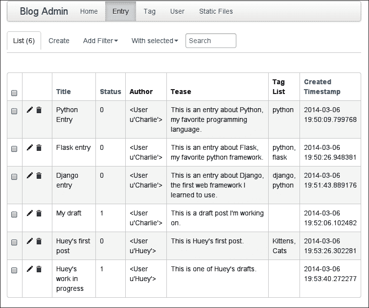

虽然这种功能需要相对较少的代码，但我们仍然有很多内容要涵盖，所以让我们开始吧。首先使用`pip`将`Flask-Admin`安装到`virtualenv`中。在撰写本文时，Flask-Admin 的当前版本是 1.0.7。

```py
(blog) $ pip install Flask-Admin
Downloading/unpacking Flask-Admin
...
Successfully installed Flask-Admin
Cleaning up...

```

如果您希望测试它是否安装正确，可以输入以下代码：

```py
(blog) $ python manage.py shell
In [1]: from flask.ext import admin
In [2]: print admin.__version__
1.0.7

```

## 将 Flask-Admin 添加到我们的应用程序

与我们应用程序中的其他扩展不同，我们将在其自己的模块中设置管理扩展。我们将编写几个特定于管理的类，因此将它们放在自己的模块中是有意义的。在`app`目录中创建一个名为`admin.py`的新模块，并添加以下代码：

```py
from flask.ext.admin import Admin
from app import app

admin = Admin(app, 'Blog Admin')
```

因为我们的`admin`模块依赖于`app`模块，为了避免循环导入，我们需要确保在`app`之后加载`admin`。打开`main.py`模块并添加以下内容：

```py
from flask import request, session

from app import app, db
import admin  # This line is new, placed after the app import.
import models
import views
```

现在，您应该能够启动开发服务器并导航到`/admin/`以查看一个简单的管理员仪表板-默认的仪表板，如下图所示：

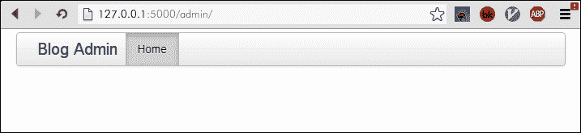

随着您在本章中的进展，我们将把这个无聊和普通的管理界面变成一个丰富而强大的仪表板，用于管理您的博客。

# 通过管理公开模型

Flask-Admin 带有一个`contrib`包，其中包含专门设计用于与 SQLAlchemy 模型一起工作的特殊视图类。这些类提供开箱即用的创建、读取、更新和删除功能。

打开`admin.py`并更新以下代码：

```py
from flask.ext.admin import Admin
from flask.ext.admin.contrib.sqla import ModelView

from app import app, db
from models import Entry, Tag, User

admin = Admin(app, 'Blog Admin')
admin.add_view(ModelView(Entry, db.session))
admin.add_view(ModelView(Tag, db.session))
admin.add_view(ModelView(User, db.session))
```

请注意我们如何调用`admin.add_view()`并传递`ModelView`类的实例，以及`db`会话，以便它可以访问数据库。Flask-Admin 通过提供一个中央端点来工作，我们开发人员可以向其中添加我们自己的视图。

启动开发服务器并尝试再次打开您的管理站点。它应该看起来像下面的截图：

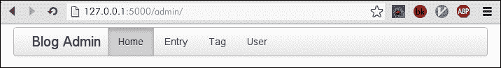

尝试通过在导航栏中选择其链接来点击我们模型的视图之一。点击**Entry**链接以干净的表格格式显示数据库中的所有条目。甚至有链接可以创建、编辑或删除条目，如下一个截图所示：

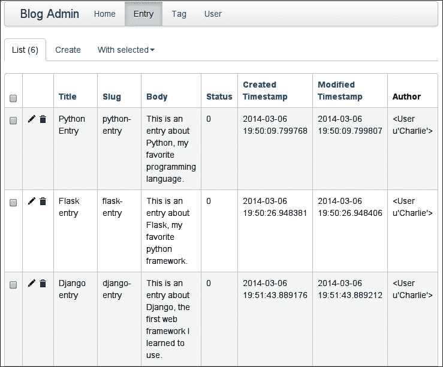

Flask-Admin 提供的默认值很好，但是如果您开始探索界面，您会开始注意到一些微妙的东西可以改进或清理。例如，可能不需要将 Entry 的正文文本包括在列中。同样，**状态**列显示状态为整数，但我们更希望看到与该整数相关联的名称。我们还可以单击每个`Entry`行中的*铅笔*图标。这将带您到默认的编辑表单视图，您可以使用它来修改该条目。

所有看起来都像下面的截图：

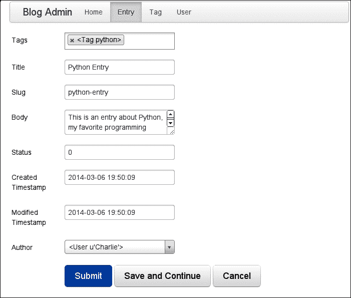

如前面的截图所示，Flask-Admin 在处理我们的外键到键和多对多字段（作者和标签）方面做得非常出色。它还相当不错地选择了要为给定字段使用哪个 HTML 小部件，如下所示：

+   标签可以使用漂亮的多选小部件添加和删除

+   作者可以使用下拉菜单选择

+   条目正文方便地显示为文本区域

不幸的是，这个表单存在一些明显的问题，如下所示：

+   字段的排序似乎是任意的。

+   **Slug**字段显示为可编辑文本输入，因为这是由数据库模型管理的。相反，此字段应该从 Entry 的标题自动生成。

+   **状态**字段是一个自由格式的文本输入字段，但应该是一个下拉菜单，其中包含人类可读的状态标签，而不是数字。

+   **创建时间戳**和**修改时间戳**字段看起来是可编辑的，但应该自动生成。

在接下来的部分中，我们将看到如何自定义`Admin`类和`ModelView`类，以便管理员真正为我们的应用程序工作。

## 自定义列表视图

让我们暂时把表单放在一边，专注于清理列表。为此，我们将创建一个 Flask-Admin 的子类`ModelView`。`ModelView`类提供了许多扩展点和属性，用于控制列表显示的外观和感觉。

我们将首先通过手动指定我们希望显示的属性来清理列表列。此外，由于我们将在单独的列中显示作者，我们将要求 Flask-Admin 从数据库中高效地获取它。打开`admin.py`并更新以下代码：

```py
from flask.ext.admin import Admin
from flask.ext.admin.contrib.sqla import ModelView

from app import app, db
from models import Entry, Tag, User

class EntryModelView(ModelView):
    column_list = [
        'title', 'status', 'author', 'tease', 'tag_list', 'created_timestamp',
    ]
    column_select_related_list = ['author']  # Efficiently SELECT the author.

admin = Admin(app, 'Blog Admin')
admin.add_view(EntryModelView(Entry, db.session))
admin.add_view(ModelView(Tag, db.session))
admin.add_view(ModelView(User, db.session))
```

您可能会注意到`tease`和`tag_list`实际上不是我们`Entry`模型中的列名。Flask-Admin 允许您使用任何属性作为列值。我们还指定要用于创建对其他模型的引用的列。打开`models.py`模块，并向`Entry`模型添加以下属性：

```py
@property
def tag_list(self):
    return ', '.join(tag.name for tag in self.tags)

@property
def tease(self):
    return self.body[:100]
```

现在，当您访问**Entry**管理员时，您应该看到一个干净、可读的表格，如下图所示：

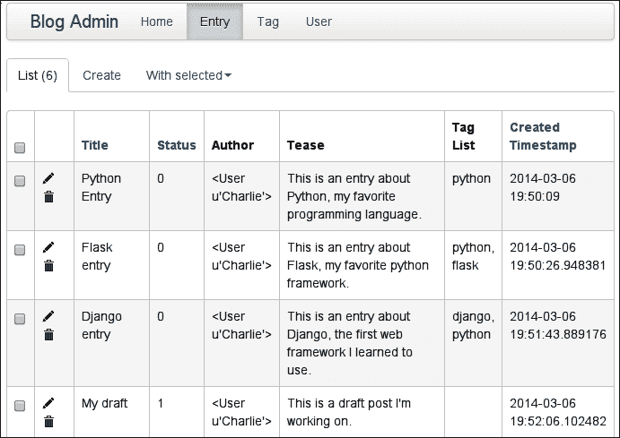

让我们也修复**状态**列的显示。这些数字很难记住 - 最好显示人类可读的值。Flask-Admin 带有*枚举*字段（如**状态**）的辅助程序。我们只需要提供要显示值的状态值的映射，Flask-Admin 就会完成剩下的工作。在`EntryModelView`中进行以下添加：

```py
class EntryModelView(ModelView):
    _status_choices = [(choice, label) for choice, label in [
 (Entry.STATUS_PUBLIC, 'Public'),
 (Entry.STATUS_DRAFT, 'Draft'),
 (Entry.STATUS_DELETED, 'Deleted'),
 ]]

 column_choices = {
 'status': _status_choices,
 }
    column_list = [
        'title', 'status', 'author', 'tease', 'tag_list', 'created_timestamp',
    ]
    column_select_related_list = ['author']
```

我们的`Entry`列表视图看起来好多了。现在让我们对`User`列表视图进行一些改进。同样，我们将对`ModelView`进行子类化，并指定要覆盖的属性。在`admin.py`中在`EntryModelView`下面添加以下类：

```py
class UserModelView(ModelView):
    column_list = ['email', 'name', 'active', 'created_timestamp']

# Be sure to use the UserModelView class when registering the User:
admin.add_view(UserModelView(User, db.session))
```

以下截图显示了我们对`User`列表视图的更改：

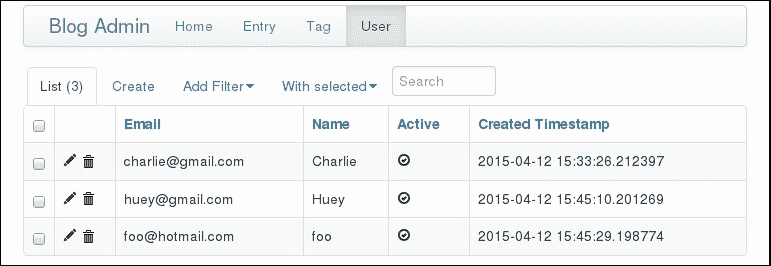

## 向列表视图添加搜索和过滤

除了显示我们的模型实例列表外，Flask-Admin 还具有强大的搜索和过滤功能。假设我们有大量条目，并且想要找到包含特定关键字（如 Python）的条目。如果我们能够在列表视图中输入我们的搜索，并且 Flask-Admin 只列出标题或正文中包含单词'Python'的条目，那将是有益的。

正如您所期望的那样，这是非常容易实现的。打开`admin.py`并添加以下行：

```py
class EntryModelView(ModelView):
    _status_choices = [(choice, label) for choice, label in [
        (Entry.STATUS_PUBLIC, 'Public'),
        (Entry.STATUS_DRAFT, 'Draft'),
        (Entry.STATUS_DELETED, 'Deleted'),
    ]]

    column_choices = {
        'status': _status_choices,
    }
    column_list = [
        'title', 'status', 'author', 'tease', 'tag_list', 'created_timestamp',
    ]
    column_searchable_list = ['title', 'body']
    column_select_related_list = ['author']
```

当您重新加载`Entry`列表视图时，您将看到一个新的文本框，允许您搜索`title`和`body`字段，如下面的屏幕截图所示：

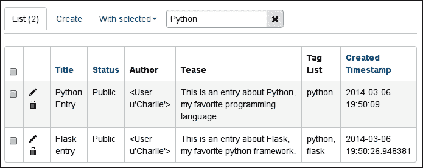

尽管全文搜索可能非常有用，但对于**状态**或**创建时间戳**等非文本字段，拥有更强大的过滤能力会更好。再次，Flask-Admin 提供了易于使用、易于配置的过滤选项，来拯救我们。

让我们通过向`Entry`列表添加几个过滤器来看看过滤器是如何工作的。我们将再次修改`EntryModelView`如下：

```py
class EntryModelView(ModelView):
    _status_choices = [(choice, label) for choice, label in [
        (Entry.STATUS_PUBLIC, 'Public'),
        (Entry.STATUS_DRAFT, 'Draft'),
        (Entry.STATUS_DELETED, 'Deleted'),
    ]]

    column_choices = {
        'status': _status_choices,
    }
    column_filters = [
 'status', User.name, User.email, 'created_timestamp'
 ]
    column_list = [
        'title', 'status', 'author', 'tease', 'tag_list', 'created_timestamp',
    ]
    column_searchable_list = ['title', 'body']
    column_select_related_list = ['author']
```

`column_filters`属性包含`Entry`模型上的列名称，以及来自`User`的*相关*模型的字段：

```py
column_filters = [
    'status', User.name, User.email, 'created_timestamp'
]
```

当您访问`Entry`列表视图时，您现在将看到一个名为**添加过滤器**的新下拉菜单。尝试各种数据类型。请注意，当您尝试在**状态**列上进行过滤时，Flask-Admin 会自动使用`Public`、`Draft`和`Deleted`标签。还要注意，当您在**创建时间戳**上进行过滤时，Flask-Admin 会呈现一个漂亮的日期/时间选择器小部件。在下面的屏幕截图中，我设置了各种过滤器：

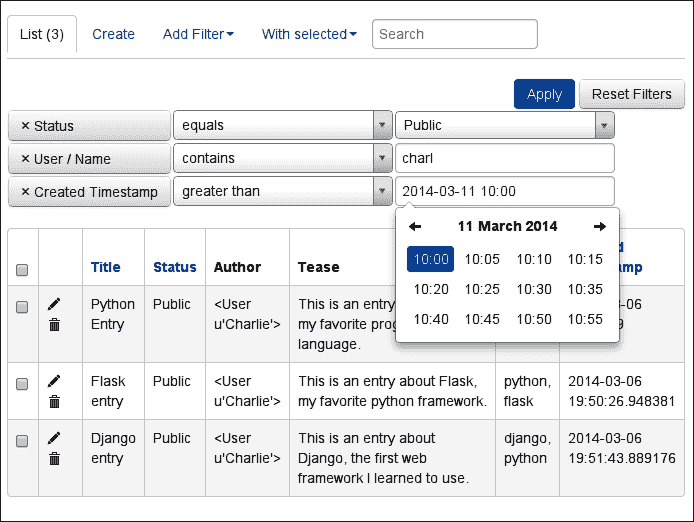

此时，`Entry`列表视图非常实用。作为练习，为`User` `ModelView`设置`column_filters`和`column_searchable_list`属性。

## 自定义管理模型表单

我们将通过展示如何自定义表单类来结束模型视图的讨论。您会记得，默认表单由 Flask-Admin 提供的有一些限制。在本节中，我们将展示如何自定义用于创建和编辑模型实例的表单字段的显示。

我们的目标是删除多余的字段，并为**状态**字段使用更合适的小部件，实现以下屏幕截图中所示的效果：

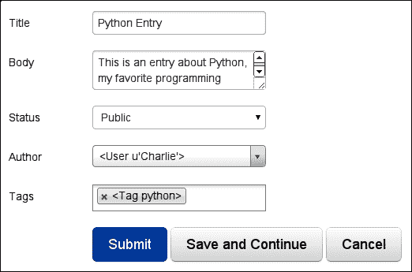

为了实现这一点，我们首先手动指定我们希望在表单上显示的字段列表。这是通过在`EntryModelView 类`上指定`form_columns`属性来完成的：

```py
class EntryModelView(ModelView):
    ...
    form_columns = ['title', 'body', 'status', 'author', 'tags']
```

此外，我们希望`status`字段成为一个下拉小部件，使用各种状态的可读标签。由于我们已经定义了状态选择，我们将指示 Flask-Admin 使用 WTForms `SelectField`覆盖`status`字段，并传入有效选择的列表：

```py
from wtforms.fields import SelectField  # At top of module.

class EntryModelView(ModelView):
    ...
    form_args = {
        'status': {'choices': _status_choices, 'coerce': int},
    }
    form_columns = ['title', 'body', 'status', 'author', 'tags']
    form_overrides = {'status': SelectField}
```

默认情况下，用户字段将显示为一个带有简单类型的下拉菜单。不过，想象一下，如果此列表包含数千个用户！这将导致一个非常大的查询和一个慢的渲染时间，因为需要创建所有的`<option>`元素。

当包含外键的表单呈现到非常大的表时，Flask-Admin 允许我们使用 Ajax 来获取所需的行。将以下属性添加到`EntryModelView`，现在您的用户将通过 Ajax 高效加载：

```py
form_ajax_refs = {
    'author': {
        'fields': (User.name, User.email),
    },
}
```

这个指令告诉 Flask-Admin，当我们查找**作者**时，它应该允许我们在作者的姓名或电子邮件上进行搜索。以下屏幕截图显示了它的外观：

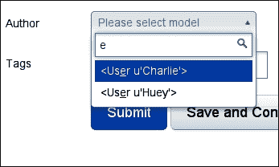

我们现在有一个非常漂亮的`Entry`表单。

## 增强用户表单

因为密码在数据库中以哈希形式存储，直接显示或编辑它们的价值很小。然而，在`User`表单上，我们将使输入新密码来替换旧密码成为可能。就像我们在`Entry`表单上对`status`字段所做的那样，我们将指定一个表单字段覆盖。然后，在模型更改处理程序中，我们将在保存时更新用户的密码。

对`UserModelView`模块进行以下添加：

```py
from wtforms.fields import PasswordField  # At top of module.

class UserModelView(ModelView):
    column_filters = ('email', 'name', 'active')
    column_list = ['email', 'name', 'active', 'created_timestamp']
    column_searchable_list = ['email', 'name']

    form_columns = ['email', 'password', 'name', 'active']
    form_extra_fields = {
 'password': PasswordField('New password'),
 }

    def on_model_change(self, form, model, is_created):
 if form.password.data:
 model.password_hash = User.make_password(form.password.data)
 return super(UserModelView, self).on_model_change(
 form, model, is_created)

```

以下截图显示了新的`User`表单的样子。如果您希望更改用户的密码，只需在**新密码**字段中输入新密码即可。

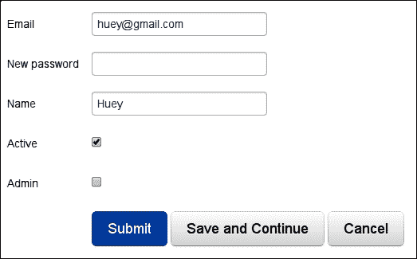

## 生成 slug

仍然有一个方面需要解决。当创建新的`Entry`、`User`或`Tag`对象时，Flask-Admin 将无法正确生成它们的`slug`。这是由于 Flask-Admin 在保存时实例化新模型实例的方式。为了解决这个问题，我们将创建一些`ModelView`的子类，以确保为`Entry`、`User`和`Tag`对象正确生成`slug`。

打开`admin.py`文件，并在模块顶部添加以下类：

```py
class BaseModelView(ModelView):
    pass

class SlugModelView(BaseModelView):
    def on_model_change(self, form, model, is_created):
        model.generate_slug()
        return super(SlugModelView, self).on_model_change(
            form, model, is_created)
```

这些更改指示 Flask-Admin，每当模型更改时，应重新生成 slug。

为了开始使用这个功能，更新`EntryModelView`和`UserModelView`模块以扩展`SlugModelView`类。对于`Tag`模型，直接使用`SlugModelView`类进行注册即可。

总结一下，您的代码应该如下所示：

```py
from flask.ext.admin import Admin
from flask.ext.admin.contrib.sqla import ModelView
from wtforms.fields import SelectField

from app import app, db
from models import Entry, Tag, User, entry_tags

class BaseModelView(ModelView):
    pass

class SlugModelView(BaseModelView):
    def on_model_change(self, form, model, is_created):
        model.generate_slug()
        return super(SlugModelView, self).on_model_change(
            form, model, is_created)

class EntryModelView(SlugModelView):
    _status_choices = [(choice, label) for choice, label in [
        (Entry.STATUS_PUBLIC, 'Public'),
        (Entry.STATUS_DRAFT, 'Draft'),
        (Entry.STATUS_DELETED, 'Deleted'),
    ]]

    column_choices = {
        'status': _status_choices,
    }
    column_filters = ['status', User.name, User.email, 'created_timestamp']
    column_list = [
        'title', 'status', 'author', 'tease', 'tag_list', 'created_timestamp',
    ]
    column_searchable_list = ['title', 'body']
    column_select_related_list = ['author']

    form_ajax_refs = {
        'author': {
            'fields': (User.name, User.email),
        },
    }
    form_args = {
        'status': {'choices': _status_choices, 'coerce': int},
    }
    form_columns = ['title', 'body', 'status', 'author', 'tags']
    form_overrides = {'status': SelectField}

class UserModelView(SlugModelView):
    column_filters = ('email', 'name', 'active')
    column_list = ['email', 'name', 'active', 'created_timestamp']
    column_searchable_list = ['email', 'name']

    form_columns = ['email', 'password', 'name', 'active']
    form_extra_fields = {
        'password': PasswordField('New password'),
    }

    def on_model_change(self, form, model, is_created):
        if form.password.data:
            model.password_hash = User.make_password(form.password.data)
        return super(UserModelView, self).on_model_change(
            form, model, is_created)

admin = Admin(app, 'Blog Admin')
admin.add_view(EntryModelView(Entry, db.session))
admin.add_view(SlugModelView(Tag, db.session))
admin.add_view(UserModelView(User, db.session))
```

这些更改确保正确生成 slug，无论是保存现有对象还是创建新对象。

# 通过管理员管理静态资产

Flask-Admin 提供了一个方便的界面，用于管理静态资产（或磁盘上的其他文件），作为管理员仪表板的扩展。让我们向我们的网站添加一个`FileAdmin`，它将允许我们上传或修改应用程序的`static`目录中的文件。

打开`admin.py`文件，并在文件顶部导入以下模块：

```py
from flask.ext.admin.contrib.fileadmin import FileAdmin
```

然后，在各种`ModelView`实现下，添加以下突出显示的代码行：

```py
class BlogFileAdmin(FileAdmin):
 pass

admin = Admin(app, 'Blog Admin')
admin.add_view(EntryModelView(Entry, db.session))
admin.add_view(SlugModelView(Tag, db.session))
admin.add_view(UserModelView(User, db.session))
admin.add_view(
 BlogFileAdmin(app.config['STATIC_DIR'], '/static/', name='Static Files'))

```

在浏览器中打开管理员，您应该会看到一个名为**静态文件**的新选项卡。单击此链接将带您进入一个熟悉的文件浏览器，如下截图所示：

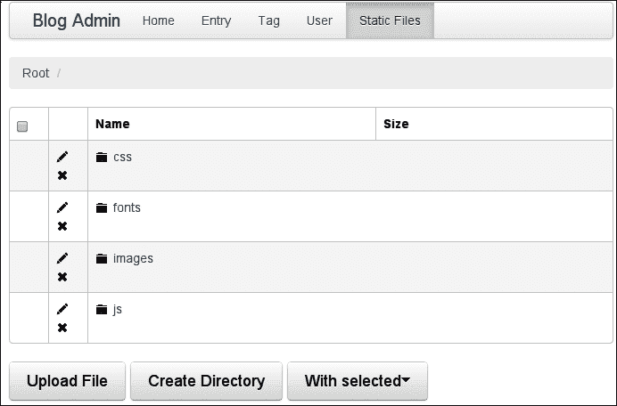

### 提示

如果您在管理文件时遇到问题，请确保为`static`目录及其子目录设置了正确的权限。

# 保护管理员网站

当您测试新的管理员网站时，您可能已经注意到它没有进行任何身份验证。为了保护我们的管理员网站免受匿名用户（甚至某些已登录用户）的侵害，我们将向`User`模型添加一个新列，以指示用户可以访问管理员网站。然后，我们将使用 Flask-Admin 提供的钩子来确保请求用户具有权限。

第一步是向我们的`User`模型添加一个新列。将`admin`列添加到`User`模型中，如下所示：

```py
class User(db.Model):
    id = db.Column(db.Integer, primary_key=True)
    email = db.Column(db.String(64), unique=True)
    password_hash = db.Column(db.String(255))
    name = db.Column(db.String(64))
    slug = db.Column(db.String(64), unique=True)
    active = db.Column(db.Boolean, default=True)
 admin = db.Column(db.Boolean, default=False)
    created_timestamp = db.Column(db.DateTime, default=datetime.datetime.now)
```

现在我们将使用 Flask-Migrate 扩展生成模式迁移：

```py
(blog) $ python manage.py db migrate
INFO  [alembic.migration] Context impl SQLiteImpl.
INFO  [alembic.migration] Will assume non-transactional DDL.
INFO  [alembic.autogenerate.compare] Detected added column 'user.admin'
 Generating /home/charles/projects/blog/app/migrations/versions/33011181124e_.py ... done

(blog) $ python manage.py db upgrade
INFO  [alembic.migration] Context impl SQLiteImpl.
INFO  [alembic.migration] Will assume non-transactional DDL.
INFO  [alembic.migration] Running upgrade 40ce2670e7e2 -> 33011181124e, empty message

```

让我们还向`User`模型添加一个方法，用于告诉我们给定的用户是否是管理员。将以下方法添加到`User`模型中：

```py
class User(db.Model):
    # ...

    def is_admin(self):
        return self.admin
```

这可能看起来很傻，但如果您希望更改应用程序确定用户是否为管理员的语义，这是很好的代码规范。

在继续下一节之前，您可能希望修改`UserModelView`类，将`admin`列包括在`column_list`、`column_filters`和`form_columns`中。

## 创建身份验证和授权混合

由于我们在管理员视图中创建了几个视图，我们需要一种可重复使用的表达我们身份验证逻辑的方法。我们将通过组合实现此重用。您已经在视图装饰器（`@login_required`）的形式中看到了组合-装饰器只是组合多个函数的一种方式。Flask-Admin 有点不同，它使用 Python 类来表示单个视图。我们将使用一种友好于类的组合方法，称为**mixins**，而不是函数装饰器。

mixin 是提供方法覆盖的类。在 Flask-Admin 的情况下，我们希望覆盖的方法是`is_accessible`方法。在这个方法内部，我们将检查当前用户是否已经验证。

为了访问当前用户，我们必须在`admin`模块的顶部导入特殊的`g`对象：

```py
from flask import g, url_for
```

在导入语句下面，添加以下类：

```py
class AdminAuthentication(object):
    def is_accessible(self):
        return g.user.is_authenticated and g.user.is_admin()
```

最后，我们将通过 Python 的多重继承将其与其他几个类*混合*在一起。对`BaseModelView 类`进行以下更改：

```py
class BaseModelView(AdminAuthentication, ModelView):
    pass
```

还有`BlogFileAdmin 类`：

```py
class BlogFileAdmin(AdminAuthentication, FileAdmin):
    pass
```

如果尝试访问/admin/entry/等管理员视图 URL 而不符合`is_accessible`条件，Flask-Admin 将返回 HTTP 403 Forbidden 响应，如下截图所示：

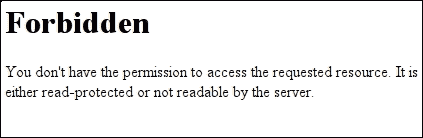

### 注意

由于我们没有对`Tag`管理员模型进行更改，因此仍然可以访问。我们将由您来解决如何保护它。

## 设置自定义首页

我们的管理员着陆页（/admin/）非常无聊。实际上，除了导航栏之外，它根本没有任何内容。Flask-Admin 允许我们指定自定义索引视图，我们将使用它来显示一个简单的问候语。

为了添加自定义索引视图，我们需要导入几个新的帮助程序。将以下突出显示的导入添加到`admin`模块的顶部：

```py
from flask.ext.admin import Admin, AdminIndexView, expose

```

`from flask import redirect`请求提供`@expose`装饰器，就像 Flask 本身使用`@route`一样。由于这个视图是索引，我们将要暴露的 URL 是`/`。以下代码将创建一个简单的索引视图，用于呈现模板。请注意，在初始化`Admin`对象时，我们将索引视图指定为参数：

```py
class IndexView(AdminIndexView):
    @expose('/')
    def index(self):
        return self.render('admin/index.html')

admin = Admin(app, 'Blog Admin', index_view=IndexView())
```

最后还缺少一件事：身份验证。由于用户通常会直接访问/admin/来访问管理员，因此检查索引视图中当前用户是否经过身份验证将非常方便。我们可以通过以下方式来检查：当前用户是否经过身份验证。

```py
class IndexView(AdminIndexView):
    @expose('/')
    def index(self):
        if not (g.user.is_authenticated and g.user.is_admin()):
 return redirect(url_for('login', next=request.path))
        return self.render('admin/index.html')
```

## Flask-Admin 模板

Flask-Admin 提供了一个简单的主模板，您可以扩展它以创建统一的管理员站点外观。Flask-Admin 主模板包括以下区块：

| 区块名称 | 描述 |
| --- | --- |
| `head_meta` | 头部页面元数据 |
| `title` | 页面标题 |
| `head_css` | 头部的 CSS 链接 |
| `head` | 文档头部的任意内容 |
| `page_body` | 页面布局 |
| `brand` | 菜单栏中的标志 |
| `main_menu` | 主菜单 |
| `menu_links` | 导航栏 |
| `access_control` | 菜单栏右侧的区域，可用于添加登录/注销按钮 |
| `messages` | 警报和各种消息 |
| `body` | 主内容区域 |
| `tail` | 内容下方的空白区域 |

对于这个示例，`body`块对我们来说最有趣。在应用程序的`templates`目录中，创建一个名为`admin`的新子目录，其中包含一个名为`index.html`的空文件。

让我们自定义管理员着陆页，以在服务器上显示当前日期和时间。我们将扩展 Flask-Admin 提供的`master`模板，仅覆盖`body`块。在模板中创建`admin`目录，并将以下代码添加到`templates/admin/index.html`：

```py



  <h3>Hello, {{ g.user.name }}</h3>

```

以下是我们新着陆页的截图：

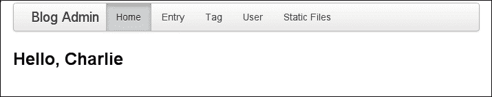

这只是一个例子，用来说明扩展和定制管理面板是多么简单。尝试使用各种模板块，看看是否可以在导航栏中添加一个注销按钮。

# 阅读更多

Flask-Admin 是一个多才多艺、高度可配置的 Flask 扩展。虽然我们介绍了 Flask-Admin 的一些常用功能，但是要讨论的功能实在太多，无法在一个章节中全部涵盖。因此，我强烈建议您访问该项目的文档，如果您想继续学习。文档可以在[`flask-admin.readthedocs.org/`](https://flask-admin.readthedocs.org/)上找到。

# 总结

在本章中，我们学习了如何使用 Flask-Admin 扩展为我们的应用程序创建管理面板。我们学习了如何将我们的 SQLAlchemy 模型公开为可编辑对象的列表，以及如何定制表格和表单的外观。我们添加了一个文件浏览器，以帮助管理应用程序的静态资产。我们还将管理面板与我们的身份验证系统集成。

在下一章中，我们将学习如何向我们的应用程序添加 API，以便可以通过编程方式访问它。
