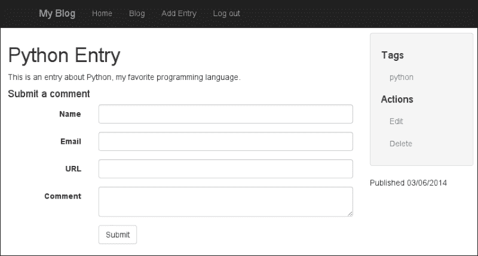
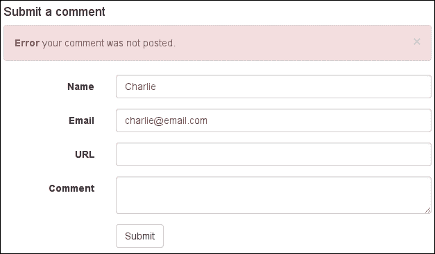
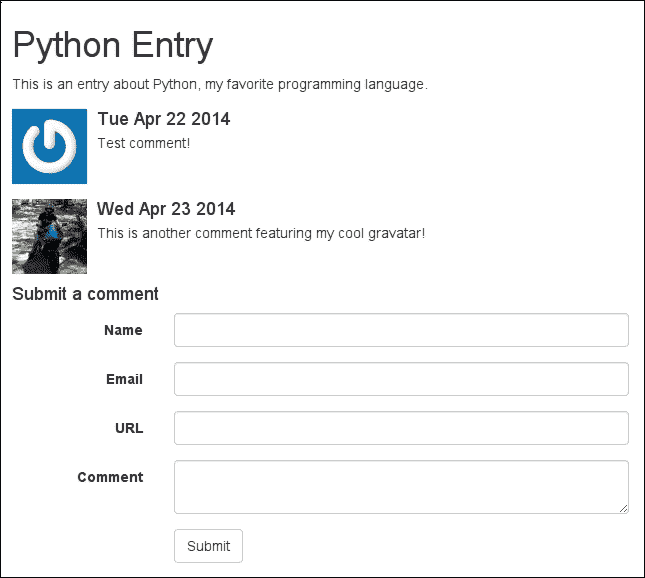

# 第七章：AJAX 和 RESTful API

在本章中，我们将使用 Flask-Restless 为博客应用创建一个 RESTful API。RESTful API 是以编程方式访问您的博客的一种方式，通过提供代表您的博客的高度结构化的数据。Flask-Restless 非常适用于我们的 SQLAlchemy 模型，并且还处理复杂的任务，如序列化和结果过滤。我们将使用我们的 REST API 为博客条目构建一个基于 AJAX 的评论功能。在本章结束时，您将能够为您的 SQLAlchemy 模型创建易于配置的 API，并在您的 Flask 应用中进行 AJAX 请求的创建和响应。

在本章中，我们将：

+   创建一个模型来存储博客条目上的评论

+   安装 Flask-Restless

+   为评论模型创建一个 RESTful API

+   构建一个用于使用 Ajax 与我们的 API 进行通信的前端

# 创建评论模型

在我们开始创建 API 之前，我们需要为我们希望共享的资源创建一个数据库模型。我们正在构建的 API 将用于使用 AJAX 创建和检索评论，因此我们的模型将包含存储未经身份验证用户在我们条目中的评论的所有相关字段。

对于我们的目的，以下字段应该足够：

+   `name`，发表评论的人的姓名

+   `email`，评论者的电子邮件地址，我们将仅使用它来显示他们在**Gravatar**上的图片

+   `URL`，评论者博客的 URL

+   `ip_address`，评论者的 IP 地址

+   `body`，实际评论

+   `status`，其中之一是`Public`，`Spam`或`Deleted`

+   `created_timestamp`，评论创建的时间戳

+   `entry_id`，评论相关的博客条目的 ID

让我们通过在我们的应用程序的`models.py`模块中创建`Comment`模型定义来开始编码：

```py
class Comment(db.Model):
    STATUS_PENDING_MODERATION = 0
    STATUS_PUBLIC = 1
    STATUS_SPAM = 8
    STATUS_DELETED = 9

    id = db.Column(db.Integer, primary_key=True)
    name = db.Column(db.String(64))
    email = db.Column(db.String(64))
    url = db.Column(db.String(100))
    ip_address = db.Column(db.String(64))
    body = db.Column(db.Text)
    status = db.Column(db.SmallInteger, default=STATUS_PUBLIC)
    created_timestamp = db.Column(db.DateTime, default=datetime.datetime.now)
    entry_id = db.Column(db.Integer, db.ForeignKey('entry.id'))

    def __repr__(self):
        return '<Comment from %r>' % (self.name,)
```

在添加`Comment`模型定义之后，我们需要设置`Comment`和`Entry`模型之间的 SQLAlchemy 关系。您会记得，我们在设置`User`和`Entry`之间的关系时曾经做过一次，通过 entries 关系。我们将通过在`Entry`模型中添加一个 comments 属性来为`Comment`做这个。 

在`tags`关系下面，添加以下代码到`Entry`模型定义中：

```py
class Entry(db.Model):
    # ...
    tags = db.relationship('Tag', secondary=entry_tags,
        backref=db.backref('entries', lazy='dynamic'))
    comments = db.relationship('Comment', backref='entry', lazy='dynamic')

```

我们已经指定了关系为`lazy='dynamic'`，正如您从第五章*验证用户*中所记得的那样，这意味着在任何给定的`Entry`实例上，`comments`属性将是一个可过滤的查询。

## 创建模式迁移

为了开始使用我们的新模型，我们需要更新我们的数据库模式。使用`manage.py`助手，为`Comment`模型创建一个模式迁移：

```py
(blog) $ python manage.py db migrate
INFO  [alembic.migration] Context impl SQLiteImpl.
INFO  [alembic.migration] Will assume non-transactional DDL.
INFO  [alembic.autogenerate.compare] Detected added table 'comment'
 Generating /home/charles/projects/blog/app/migrations/versions/490b6bc5f73c_.py ... done

```

然后通过运行`upgrade`来应用迁移：

```py
(blog) $ python manage.py db upgrade
INFO  [alembic.migration] Context impl SQLiteImpl.
INFO  [alembic.migration] Will assume non-transactional DDL.
INFO  [alembic.migration] Running upgrade 594ebac9ef0c -> 490b6bc5f73c, empty message

```

`Comment`模型现在已经准备好使用了！在这一点上，如果我们使用常规的 Flask 视图来实现评论，我们可能会创建一个评论蓝图并开始编写一个视图来处理评论的创建。然而，我们将使用 REST API 公开评论，并直接从前端使用 AJAX 创建它们。

# 安装 Flask-Restless

有了我们的模型，我们现在准备安装 Flask-Restless，这是一个第三方 Flask 扩展，可以简单地为您的 SQLAlchemy 模型构建 RESTful API。确保您已经激活了博客应用的虚拟环境后，使用`pip`安装 Flask-Restless：

```py
(blog) $ pip install Flask-Restless

```

您可以通过打开交互式解释器并获取已安装的版本来验证扩展是否已安装。不要忘记，您的确切版本号可能会有所不同。

```py
(blog) $ ./manage.py shell

In [1]: import flask_restless

In [2]: flask_restless.__version__
Out[2]: '0.13.0'

```

现在我们已经安装了 Flask-Restless，让我们配置它以使其与我们的应用程序一起工作。

## 设置 Flask-Restless

像其他 Flask 扩展一样，我们将从`app.py`模块开始，通过配置一个将管理我们新 API 的对象。在 Flask-Restless 中，这个对象称为`APIManager`，它将允许我们为我们的 SQLAlchemy 模型创建 RESTful 端点。将以下行添加到`app.py`：

```py
# Place this import at the top of the module alongside the other extensions.
from flask.ext.restless import APIManager

# Place this line below the initialization of the app and db objects.
api = APIManager(app, flask_sqlalchemy_db=db)
```

因为 API 将依赖于我们的 Flask API 对象和我们的`Comment`模型，所以我们需要确保我们不创建任何循环模块依赖关系。我们可以通过在应用程序目录的根目录下创建一个新模块“api.py”来避免引入循环导入。

让我们从最基本的开始，看看 Flask-Restless 提供了什么。在`api.py`中添加以下代码：

```py
from app import api
from models import Comment

api.create_api(Comment, methods=['GET', 'POST'])
```

`api.py`中的代码调用了我们的`APIManager`对象上的`create_api()`方法。这个方法将用额外的 URL 路由和视图代码填充我们的应用程序，这些代码一起构成了一个 RESTful API。方法参数指示我们只允许`GET`和`POST`请求（意味着评论可以被读取或创建，但不能被编辑或删除）。

最后的操作是在`main.py`中导入新的 API 模块，这是我们应用程序的入口点。我们导入模块纯粹是为了它的副作用，注册 URL 路由。在`main.py`中添加以下代码：

```py
from app import app, db
import admin
import api
import models
import views

...
```

## 发出 API 请求

在一个终端中，启动开发服务器。在另一个终端中，让我们看看当我们向我们的 API 端点发出`GET`请求时会发生什么（注意没有尾随的斜杠）：

```py
$ curl 127.0.0.1:5000/api/comment
{
 "num_results": 0,
 "objects": [],
 "page": 1,
 "total_pages": 0
}

```

数据库中没有评论，所以没有对象被序列化和返回给我们。然而，有一些有趣的元数据告诉我们数据库中有多少对象，我们在哪一页，以及有多少总页的评论存在。

让我们通过向我们的 API POST 一些 JSON 数据来创建一个新的评论（我将假设你的数据库中的第一个条目的 id 为`1`）。我们将使用`curl`提交一个包含新评论的 JSON 编码表示的`POST`请求：

```py
$ curl -X POST -H "Content-Type: application/json" -d '{
 "name": "Charlie",
 "email": "charlie@email.com",
 "url": "http://charlesleifer.com",
 "ip_address": "127.0.0.1",
 "body": "Test comment!",
 "entry_id": 1}' http://127.0.0.1:5000/api/comment

```

假设没有拼写错误，API 将以以下数据回应，确认新的`Comment`的创建：

```py
{
  "body": "Test comment!",
  "created_timestamp": "2014-04-22T19:48:33.724118",
  "email": "charlie@email.com",
  "entry": {
    "author_id": 1,
    "body": "This is an entry about Python, my favorite programming language.",
    "created_timestamp": "2014-03-06T19:50:09",
    "id": 1,
    "modified_timestamp": "2014-03-06T19:50:09",
    "slug": "python-entry",
    "status": 0,
    "title": "Python Entry"
  },
  "entry_id": 1,
  "id": 1,
  "ip_address": "127.0.0.1",
  "name": "Charlie",
  "status": 0,
  "url": "http://charlesleifer.com"
}
```

正如你所看到的，我们 POST 的所有数据都包含在响应中，除了其余的字段数据，比如新评论的 id 和时间戳。令人惊讶的是，甚至相应中已经序列化并包含了相应的`Entry`对象。

现在我们在数据库中有了一个评论，让我们尝试向我们的 API 发出另一个`GET`请求：

```py
$ curl 127.0.0.1:5000/api/comment
{
 "num_results": 1,
 "objects": [
 {
 "body": "Test comment!",
 "created_timestamp": "2014-04-22T19:48:33.724118",
 "email": "charlie@email.com",
 "entry": {
 "author_id": 1,
 "body": "This is an entry about Python, my favorite programming language.",
 "created_timestamp": "2014-03-06T19:50:09",
 "id": 1,
 "modified_timestamp": "2014-03-06T19:50:09",
 "slug": "python-entry",
 "status": 0,
 "title": "Python Entry"
 },
 "entry_id": 1,
 "id": 1,
 "ip_address": "127.0.0.1",
 "name": "Charlie",
 "status": 0,
 "url": "http://charlesleifer.com"
 }
 ],
 "page": 1,
 "total_pages": 1
}

```

第一个对象包含了当我们进行`POST`请求时返回给我们的完全相同的数据。此外，周围的元数据已经改变，以反映数据库中现在有一个评论的事实。

# 使用 AJAX 创建评论

为了允许用户发表评论，我们首先需要一种捕获他们输入的方法，我们将通过使用`wtforms`创建一个`Form`类来实现这一点。这个表单应该允许用户输入他们的姓名、电子邮件地址、一个可选的 URL 和他们的评论。

在条目蓝图的表单模块中，添加以下表单定义：

```py
class CommentForm(wtforms.Form):
    name = wtforms.StringField('Name', validators=[validators.DataRequired()])
    email = wtforms.StringField('Email', validators=[
        validators.DataRequired(),
        validators.Email()])
    url = wtforms.StringField('URL', validators=[
        validators.Optional(),
        validators.URL()])
    body = wtforms.TextAreaField('Comment', validators=[
        validators.DataRequired(),
        validators.Length(min=10, max=3000)])
    entry_id = wtforms.HiddenField(validators=[
        validators.DataRequired()])

    def validate(self):
        if not super(CommentForm, self).validate():
            return False

        # Ensure that entry_id maps to a public Entry.
        entry = Entry.query.filter(
            (Entry.status == Entry.STATUS_PUBLIC) &
            (Entry.id == self.entry_id.data)).first()
        if not entry:
            return False

        return True
```

你可能会想为什么我们要指定验证器，因为 API 将处理 POST 的数据。我们这样做是因为 Flask-Restless 不提供验证，但它提供了一个我们可以执行验证的钩子。这样，我们就可以在我们的 REST API 中利用 WTForms 验证。

为了在条目详细页面使用表单，我们需要在渲染详细模板时将表单传递到上下文中。打开条目蓝图并导入新的`CommentForm`：

```py
from entries.forms import EntryForm, ImageForm, CommentForm

```

然后修改“详细”视图，将一个表单实例传递到上下文中。我们将使用请求的条目的值预填充`entry_id`隐藏字段：

```py
@entries.route('/<slug>/')
def detail(slug):
    entry = get_entry_or_404(slug)
    form = CommentForm(data={'entry_id': entry.id})
    return render_template('entries/detail.html', entry=entry, form=form)
```

现在表单已经在详细模板上下文中，剩下的就是渲染表单。在`entries/templates/entries/includes/`中创建一个空模板，命名为`comment_form.html`，并添加以下代码：

```py

<form action="/api/comment" class="form form-horizontal" id="comment-form" method="post">
  {{ form_field(form.name) }}
  {{ form_field(form.email) }}
  {{ form_field(form.url) }}
  {{ form_field(form.body) }}
  {{ form.entry_id() }}
  <div class="form-group">
    <div class="col-sm-offset-3 col-sm-9">
      <button type="submit" class="btn btn-default">Submit</button>
    </div>
  </div>
</form>
```

值得注意的是，我们没有使用`form_field`宏来处理`entry_id`字段。这是因为我们不希望评论表单显示一个对用户不可见的字段的标签。相反，我们将用这个值初始化表单。

最后，我们需要在`detail.html`模板中包含评论表单。在条目正文下面，添加以下标记：

```py

  {{ entry.body }}

  <h4 id="comment-form">Submit a comment</h4>
 

```

使用开发服务器，尝试导航到任何条目的详细页面。你应该会看到一个评论表单：



## AJAX 表单提交

为了简化进行 AJAX 请求，我们将使用 jQuery 库。如果你愿意，可以随意替换为其他 JavaScript 库，但是由于 jQuery 如此普遍（并且与 Bootstrap 兼容），我们将在本节中使用它。如果你一直在跟着代码进行开发，那么 jQuery 应该已经包含在所有页面中。现在我们需要创建一个 JavaScript 文件来处理评论提交。

在`statics/js/`中创建一个名为`comments.js`的新文件，并添加以下 JavaScript 代码：

```py
Comments = window.Comments || {};

(function(exports, $) { /* Template string for rendering success or error messages. */
  var alertMarkup = (
    '<div class="alert alert-{class} alert-dismissable">' +
    '<button type="button" class="close" data-dismiss="alert" aria-hidden="true">&times;</button>' +
    '<strong>{title}</strong> {body}</div>');

  /* Create an alert element. */
  function makeAlert(alertClass, title, body) {
    var alertCopy = (alertMarkup
                     .replace('{class}', alertClass)
                     .replace('{title}', title)
                     .replace('{body}', body));
    return $(alertCopy);
  }

  /* Retrieve the values from the form fields and return as an object. */
  function getFormData(form) {
    return {
      'name': form.find('input#name').val(),
      'email': form.find('input#email').val(),
      'url': form.find('input#url').val(),
      'body': form.find('textarea#body').val(),
      'entry_id': form.find('input[name=entry_id]').val()
    }
  }

  function bindHandler() {
    /* When the comment form is submitted, serialize the form data as JSON
             and POST it to the API. */
    $('form#comment-form').on('submit', function() {
      var form = $(this);
      var formData = getFormData(form);
      var request = $.ajax({
        url: form.attr('action'),
        type: 'POST',
        data: JSON.stringify(formData),
        contentType: 'application/json; charset=utf-8',
        dataType: 'json'
      });
      request.success(function(data) {
        alertDiv = makeAlert('success', 'Success', 'your comment was posted.');
        form.before(alertDiv);
        form[0].reset();
      });
      request.fail(function() {
        alertDiv = makeAlert('danger', 'Error', 'your comment was not posted.');
        form.before(alertDiv);
      });
      return false;
    });
  }

  exports.bindHandler = bindHandler;
})(Comments, jQuery);
```

`comments.js`代码处理将表单数据序列化为 JSON 后，提交到 REST API。它还处理 API 响应，并显示成功或错误消息。

在`detail.html`模板中，我们只需要包含我们的脚本并绑定提交处理程序。在详细模板中添加以下块覆盖： 

```py

  <script type="text/javascript" src="img/comments.js') }}"></script>
  <script type="text/javascript">
    $(function() {
      Comments.bindHandler();
    });
  </script>

```

试着提交一两条评论。

## 在 API 中验证数据

不幸的是，我们的 API 没有对传入数据进行任何类型的验证。为了验证`POST`数据，我们需要使用 Flask-Restless 提供的一个钩子。Flask-Restless 将这些钩子称为请求预处理器和后处理器。

让我们看看如何使用 POST 预处理器对评论数据进行一些验证。首先打开`api.py`并进行以下更改：

```py
from flask.ext.restless import ProcessingException

from app import api
from entries.forms import CommentForm
from models import Comment

def post_preprocessor(data, **kwargs):
    form = CommentForm(data=data)
    if form.validate():
        return form.data
    else:
        raise ProcessingException(
            description='Invalid form submission.',
            code=400)

api.create_api(
    Comment,
    methods=['GET', 'POST'],
    preprocessors={
        'POST': [post_preprocessor],
    })
```

我们的 API 现在将使用来自`CommentForm`的验证逻辑来验证提交的评论。我们通过为`POST`方法指定一个预处理器来实现这一点。我们已经实现了`post_preprocessor`作为`POST`预处理器，它接受反序列化的`POST`数据作为参数。然后我们可以将这些数据传递给我们的`CommentForm`并调用它的`validate()`方法。如果验证失败，我们将引发一个`ProcessingException`，向 Flask-Restless 发出信号，表明这些数据无法处理，并返回一个`400` Bad Request 响应。

在下面的截图中，我没有提供必需的**评论**字段。当我尝试提交评论时，我收到了一个错误消息：



## 预处理器和后处理器

我们刚刚看了一个使用 Flask-Restless 的`POST`方法预处理器的示例。在下表中，你可以看到其他可用的钩子：

| 方法名称 | 描述 | 预处理器参数 | 后处理器参数 |
| --- | --- | --- | --- |
| `GET_SINGLE` | 通过主键检索单个对象 | `instance_id`，对象的主键 | `result`，对象的字典表示 |
| `GET_MANY` | 检索多个对象 | `search_params`，用于过滤结果集的搜索参数字典 | `result`，对象的`search_params`表示 |
| `PUT_SINGLE` | 通过主键更新单个对象 | `instance_id`数据，用于更新对象的数据字典 | `result`，更新后对象的字典表示 |
| `PUT_MANY` | 更新多个对象 | `search_params`，用于确定要更新哪些对象的搜索参数字典。data，用于更新对象的数据字典。 | `query`，表示要更新的对象的 SQLAlchemy 查询。`data``search_params` |
| `POST` | 创建新实例 | `data`，用于填充新对象的数据字典 | `result`，新对象的字典表示 |
| `DELETE` | 通过主键删除实例 | `instance_id`，要删除的对象的主键 | `was_deleted`，一个布尔值，指示对象是否已被删除 |

# 使用 AJAX 加载评论

现在我们能够使用 AJAX 创建经过验证的评论，让我们使用 API 来检索评论列表，并在博客条目下方显示它们。为此，我们将从 API 中读取值，并动态创建 DOM 元素来显示评论。您可能还记得我们之前检查的 API 响应中返回了相当多的私人信息，包括每条评论相关联的整个序列化表示的`Entry`。对于我们的目的来说，这些信息是多余的，而且还会浪费带宽。

让我们首先对评论端点进行一些额外的配置，以限制我们返回的`Comment`字段。在`api.py`中，对`api.create_api()`的调用进行以下添加：

```py
api.create_api(
    Comment,
    include_columns=['id', 'name', 'url', 'body', 'created_timestamp'],
    methods=['GET', 'POST'],
    preprocessors={
        'POST': [post_preprocessor],
    })
```

现在请求评论列表会给我们一个更易管理的响应，不会泄露实现细节或私人数据：

```py
$ curl http://127.0.0.1:5000/api/comment
{
 "num_results": 1,
 "objects": [
 {
 "body": "Test comment!",
 "created_timestamp": "2014-04-22T19:48:33.724118",
 "name": "Charlie",
 "url": "http://charlesleifer.com"
 }
 ],
 "page": 1,
 "total_pages": 1
}

```

一个很好的功能是在用户的评论旁边显示一个头像。Gravatar 是一个免费的头像服务，允许用户将他们的电子邮件地址与图像关联起来。我们将使用评论者的电子邮件地址来显示他们关联的头像（如果存在）。如果用户没有创建头像，将显示一个抽象图案。

让我们在`Comment`模型上添加一个方法来生成用户 Gravatar 图像的 URL。打开`models.py`并向`Comment`添加以下方法：

```py
def gravatar(self, size=75):
    return 'http://www.gravatar.com/avatar.php?%s' % urllib.urlencode({
        'gravatar_id': hashlib.md5(self.email).hexdigest(),
        'size': str(size)})
```

您还需要确保在模型模块的顶部导入`hashlib`和`urllib`。

如果我们尝试在列的列表中包括 Gravatar，Flask-Restless 会引发异常，因为`gravatar`实际上是一个方法。幸运的是，Flask-Restless 提供了一种在序列化对象时包含方法调用结果的方法。在`api.py`中，对`create_api()`的调用进行以下添加：

```py
api.create_api(
    Comment,
    include_columns=['id', 'name', 'url', 'body', 'created_timestamp'],
    include_methods=['gravatar'],
    methods=['GET', 'POST'],#, 'DELETE'],
    preprocessors={
        'POST': [post_preprocessor],
    })
```

继续尝试获取评论列表。现在你应该看到 Gravatar URL 包含在序列化响应中。

## 检索评论列表

现在我们需要返回到我们的 JavaScript 文件，并添加代码来检索评论列表。我们将通过向 API 传递搜索过滤器来实现这一点，API 将仅检索与请求的博客条目相关联的评论。搜索查询被表示为一系列过滤器，每个过滤器指定以下内容：

+   列的名称

+   操作（例如，等于）

+   要搜索的值

打开`comments.js`并在以下行之后添加以下代码：

```py
(function(exports, $) {:
function displayNoComments() {
  noComments = $('<h3>', {
    'text': 'No comments have been posted yet.'});
  $('h4#comment-form').before(noComments);
}

/* Template string for rendering a comment. */
var commentTemplate = (
  '<div class="media">' +
    '<a class="pull-left" href="{url}">' +
      '' +
    '</a>' +
    '<div class="media-body">' +
    '<h4 class="media-heading">{created_timestamp}</h4>{body}' +
  '</div></div>'
);

function renderComment(comment) {
  var createdDate = new Date(comment.created_timestamp).toDateString();
  return (commentTemplate
          .replace('{url}', comment.url)
          .replace('{gravatar}', comment.gravatar)
          .replace('{created_timestamp}', createdDate)
          .replace('{body}', comment.body));
}

function displayComments(comments) {
  $.each(comments, function(idx, comment) {
    var commentMarkup = renderComment(comment);
    $('h4#comment-form').before($(commentMarkup));
  });
}

function load(entryId) {
  var filters = [{
    'name': 'entry_id',
    'op': 'eq',
    'val': entryId}];
  var serializedQuery = JSON.stringify({'filters': filters});

  $.get('/api/comment', {'q': serializedQuery}, function(data) {
    if (data['num_results'] === 0) {
      displayNoComments();
    } else {
      displayComments(data['objects']);
    }
  });
}
```

然后，在文件底部附近，导出`load`函数以及`bindHandler`导出，如下所示：

```py
exports.load = load;
exports.bindHandler = bindHandler;
```

我们添加的新 JavaScript 代码会向 API 发出 AJAX 请求，以获取与给定条目相关联的评论。如果没有评论存在，将显示一条消息，指示尚未发表评论。否则，条目将作为列表呈现在`Entry`正文下方。

最后的任务是在页面呈现时在详细模板中调用`Comments.load()`。打开`detail.html`并添加以下突出显示的代码：

```py
<script type="text/javascript">
  $(function() {
    Comments.load({{ entry.id }});
    Comments.bindHandler();
  });
</script>
```

在发表了一些评论之后，评论列表看起来如下图所示：



作为练习，看看你是否能够编写代码来呈现用户发表的任何新评论。您会记得，当成功创建评论时，新数据将作为 JSON 对象返回。

# 阅读更多

Flask-Restless 支持许多配置选项，由于篇幅原因，本章未能涵盖。搜索过滤器是一个非常强大的工具，我们只是触及了可能性的表面。此外，预处理和后处理钩子可以用于实现许多有趣的功能，例如以下功能：

+   可以在预处理器中实现的身份验证

+   `GET_MANY`的默认过滤器，可以用于限制评论列表，例如只显示公开的评论

+   向序列化响应添加自定义或计算值

+   修改传入的`POST`值以在模型实例上设置默认值

如果 REST API 是您的应用程序中的关键组件，我强烈建议花时间阅读 Flask-Restless 文档。文档可以在网上找到：[`flask-restless.readthedocs.org/en/latest/`](https://flask-restless.readthedocs.org/en/latest/)。

# 总结

在本章中，我们使用 Flask-Restless 扩展为我们的应用程序添加了一个简单的 REST API。然后，我们使用 JavaScript 和 Ajax 将我们的前端与 API 集成，允许用户查看和发布新评论，而无需编写一行视图代码。

在下一章中，我们将致力于创建可测试的应用程序，并找到改进我们代码的方法。这也将使我们能够验证我们编写的代码是否按照我们的意愿进行操作；不多，也不少。自动化这一过程将使您更有信心，并确保 RESTful API 按预期工作。
