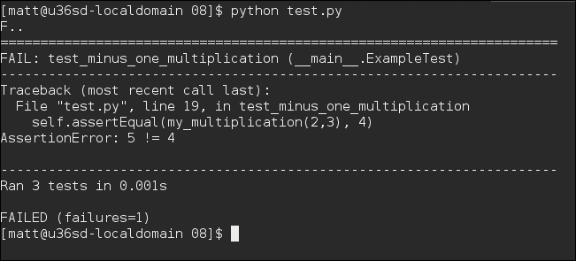
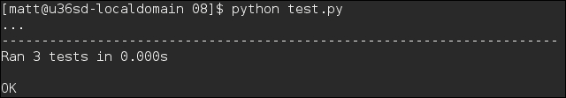
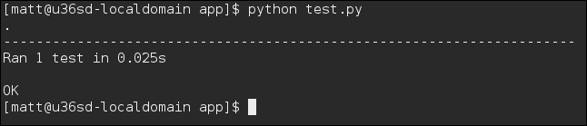
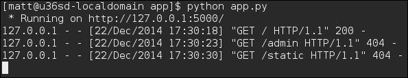

# 第八章：测试 Flask 应用

在本章中，我们将学习如何编写覆盖博客应用程序所有部分的单元测试。我们将利用 Flask 的测试客户端来模拟实时请求，并了解 Mock 库如何简化测试复杂交互，比如调用数据库等第三方服务。

在本章中，我们将学习以下主题：

+   Python 的单元测试模块和测试编写的一般指导

+   友好的测试配置

+   如何使用 Flask 测试客户端模拟请求和会话

+   如何使用 Mock 库测试复杂交互

+   记录异常和错误邮件

# 单元测试

单元测试是一个让我们对代码、bug 修复和未来功能有信心的过程。单元测试的理念很简单；你编写与你的功能代码相辅相成的代码。

举个例子，假设我们设计了一个需要正确计算一些数学的程序；你怎么知道它成功了？为什么不拿出一个计算器，你知道计算机是什么吗？一个大计算器。此外，计算机在乏味的重复任务上确实非常擅长，那么为什么不编写一个单元测试来为你计算出答案呢？对代码的所有部分重复这种模式，将这些测试捆绑在一起，你就对自己编写的代码完全有信心了。

### 注意

有人说测试是代码“味道”的标志，你的代码如此复杂，以至于需要测试来证明它的工作。这意味着代码应该更简单。然而，这真的取决于你的情况，你需要自己做出判断。在我们开始简化代码之前，单元测试是一个很好的起点。

单元测试的巧妙之处在于测试与功能代码相辅相成。这些方法证明了测试的有效性，而测试证明了方法的有效性。它减少了代码出现重大功能错误的可能性，减少了将来重新编写代码的头痛，并允许你专注于你想要处理的新功能的细枝末节。

### 提示

单元测试的理念是验证代码的小部分，或者说是测试简单的功能部分。这将构建成应用程序的整体。很容易写出大量测试代码，测试的是代码的功能而不是代码本身。如果你的测试看起来很大，通常表明你的主要代码应该被分解成更小的方法。

## Python 的单元测试模块

幸运的是，几乎总是如此，Python 有一个内置的单元测试模块。就像 Flask 一样，很容易放置一个简单的单元测试模块。在你的主要博客应用程序中，创建一个名为`tests`的新目录，并在该目录中创建一个名为`test.py`的新文件。现在，使用你喜欢的文本编辑器，输入以下代码：

```py
import unittest

class ExampleTest(unittest.TestCase):
  def setUp(self):
    pass

  def tearDown(self):
    pass

  def test_some_functionality(self):
    pass

  def test_some_other_functionality(self):
    pass

if __name__ == "__main__":
  unittest.main()
```

前面的片段演示了我们将编写的所有单元测试模块的基本框架。它简单地利用内置的 Python 模块`unittest`，然后创建一个包装特定测试集的类。在这个例子中，测试是以单词`test`开头的方法。单元测试模块将这些方法识别为每次调用`unittest.main`时应该运行的方法。此外，`TestCase`类（`ExampleTest`类在这里继承自它）具有一些特殊方法，单元测试将始终尝试使用。其中之一是`setUp`，这是在运行每个测试方法之前运行的方法。当您想要在隔离环境中运行每个测试，但是，例如，要在数据库中建立连接时，这可能特别有用。

另一个特殊的方法是`tearDown`。每次运行测试方法时都会运行此方法。同样，当我们想要维护数据库时，这对于每个测试都在隔离环境中运行非常有用。

显然，这个代码示例如果运行将不会做任何事情。要使其处于可用状态，并且遵循**测试驱动开发**（**TDD**）的原则，我们首先需要编写一个测试，验证我们即将编写的代码是否正确，然后编写满足该测试的代码。

## 一个简单的数学测试

在这个示例中，我们将编写一个测试，验证一个方法将接受两个数字作为参数，从第二个参数中减去一个，然后将它们相乘。看一下以下示例：

| 参数 1 | 参数 2 | 答案 |
| --- | --- | --- |
| `1` | `1` | `1 * (1-1) = 0` |
| `1` | `2` | `1 * (2-1) = 1` |
| `2` | `3` | `2 * (3-1) = 4` |

在你的`test.py`文件中，你可以创建一个在`ExampleTest`类中表示前面表格的方法，如下所示：

```py
  def test_minus_one_multiplication(self):
    self.assertEqual(my_multiplication(1,1), 0)
    self.assertEqual(my_multiplication(1,2), 1)
    self.assertEqual(my_multiplication(2,3), 4)
    self.assertNotEqual(my_multiplication(2,2), 3)
```

前面的代码创建了一个新的方法，使用 Python 的`unittest`模块来断言问题的答案。`assertEqual`函数将`my_multiplication`方法返回的响应作为第一个参数，并将其与第二个参数进行比较。如果通过了，它将什么也不做，等待下一个断言进行测试。但如果不匹配，它将抛出一个错误，并且你的测试方法将停止执行，告诉你出现了错误。

在前面的代码示例中，还有一个`assertNotEqual`方法。它的工作方式与`assertEqual`类似，但是检查值是否不匹配。还有一个好主意是检查你的方法何时可能失败。如果你只检查了方法将起作用的情况，那么你只完成了一半的工作，并且可能会在边缘情况下遇到问题。Python 的`unittest`模块提供了各种各样的断言方法，这将是有用的去探索。

现在我们可以编写将给出这些结果的方法。为简单起见，我们将在同一个文件中编写该方法。在文件中，创建以下方法：

```py
def my_multiplication(value1, value2):
  return value1 * value2 – 1
```

保存文件并使用以下命令运行它：

```py
python test.py

```



哎呀！它失败了。为什么？嗯，回顾`my_multiplication`方法发现我们漏掉了一些括号。让我们回去纠正一下：

```py
def my_multiplication(value1, value2):
  return value1 * (value2 – 1)
```

现在让我们再次运行它：



成功了！现在我们有了一个正确的方法；将来，我们将知道它是否被更改过，以及在以后需要如何更改。现在来用这个新技能与 Flask 一起使用。

# Flask 和单元测试

你可能会想：“单元测试对于代码的小部分看起来很棒，但是如何为整个 Flask 应用程序进行测试呢？”嗯，正如之前提到的一种方法是确保所有的方法尽可能离散——也就是说，确保你的方法尽可能少地完成它们的功能，并避免方法之间的重复。如果你的方法不是离散的，现在是整理它们的好时机。

另一件有用的事情是，Flask 已经准备好进行单元测试。任何现有应用程序都有可能至少可以应用一些单元测试。特别是，任何 API 区域，例如无法验证的区域，都可以通过利用 Flask 中已有的代表 HTTP 请求的方法来进行极其容易的测试。以下是一个简单的示例：

```py
import unittest
from flask import request
from main import app

class AppTest(unittest.TestCase):
  def setUp(self):
    self.app = app.test_client()

  def test_homepage_works(self):
    response = self.app.get("/")
    self.assertEqual(response.status_code, 200)

if __name__ == "__main__":
  unittest.main()
```

这段代码应该看起来非常熟悉。它只是重新编写了前面的示例，以验证主页是否正常工作。Flask 公开的`test_client`方法允许通过代表 HTTP 调用的方法简单访问应用程序，就像`test`方法的第一行所示。`test`方法本身并不检查页面的内容，而只是检查页面是否成功加载。这可能听起来微不足道，但知道主页是否正常工作是很有用的。结果呢？你可以在这里看到：



### 提示

需要注意的一件事是，我们不需要测试 Flask 本身，必须避免测试它，以免为自己创造太多工作。

## 测试一个页面

关于运行先前的测试的一件事需要注意的是，它们非常简单。实际上没有浏览器会以这种方式行事。浏览器会执行诸如存储用于登录的 cookie、请求 JavaScript、图像和 CSS 文件等静态文件，以及请求特定格式的数据等操作。不知何故，我们需要模拟这种功能，并测试结果是否正确。

### 提示

这是单元测试开始变成功能测试的部分。虽然这本身并没有什么错，但值得注意的是，较小的测试更好。

幸运的是，Flask 通过使用先前的`app.get`方法来为您完成所有这些工作，但是您可以使用一些技巧来使事情变得更容易。例如，向`TestCase`类添加登录和退出功能将使事情变得简单得多：

```py
    LOGIN_URL = "/login/"
    LOGOUT_URL = "/logout/"

    def login (self, email, password):
        return self.app.post(self.LOGIN_URL, data={
            "email": email,
            "password": password
        }, follow_redirects=True)
```

前面的代码是未来测试用例的框架。每当我们有一个需要登录和退出的测试用例时，只需将此`Mixin`添加到继承列表中，它就会自动可用：

```py
class ExampleFlaskTest(unittest.TestCase, FlaskLoginMixin):
  def setUp(self):
    self.app = app.test_client()

  def test_login(self):
    response = self.login("admin", "password")
    self.assertEqual(response.status_code, 200)
    self.assertTrue("Success" in response.data)

  def test_failed_login(self):
    response = self.login("admin", "PASSWORD")
        self.assertEqual(response.status_code, 200)
        self.assertTrue("Invalid" in response.data)

  def test_logout(self):
    response = self.logout()
    self.assertEqual(response.status_code, 200)
    self.assertTrue("logged out" in response.data)
```

我们刚刚解释的测试用例使用了`FlaskLoginMixin`，这是一组方法，可以帮助检查登录和退出是否正常工作。这是通过检查响应页面是否发送了正确的消息，并且页面内容中是否有正确的警告来实现的。我们的测试还可以进一步扩展，以检查用户是否可以访问他们不应该访问的页面。Flask 会为您处理会话和 cookie，所以只需使用以下代码片段即可：

```py
class ExampleFlaskTest(unittest.TestCase, FlaskLoginMixin):
  def setUp(self):
    self.app = app.test_client()

  def test_admin_can_get_to_admin_page(self):
    self.login("admin", "password")
    response = self.app.get("/admin/")
    self.assertEqual(response.status_code, 200)
    self.assertTrue("Hello" in response.data)

  def test_non_logged_in_user_can_get_to_admin_page(self):
    response = self.app.get("/admin/")
    self.assertEqual(response.status_code, 302)
    self.assertTrue("redirected" in response.data)

  def test_normal_user_cannot_get_to_admin_page(self):
    self.login("user", "password")
    response = self.app.get("/admin/")
    self.assertEqual(response.status_code, 302)
    self.assertTrue("redirected" in response.data)

  def test_logging_out_prevents_access_to_admin_page(self):
    self.login("admin", "password")
    self.logout()
    response = self.app.get("/admin/")
    self.assertEqual(response.status_code, 302)
    self.assertTrue("redirected" in response.data)
```

前面的代码片段显示了如何测试某些页面是否受到正确保护。这是一个非常有用的测试。它还验证了，当管理员注销时，他们将无法再访问他们在登录时可以访问的页面。方法名称是自解释的，因此如果这些测试失败，很明显可以知道正在测试什么。

## 测试 API

测试 API 甚至更容易，因为它是程序干预。使用第七章中设置的先前评论 API，*AJAX 和 RESTful API*，我们可以很容易地插入和检索一些评论，并验证它是否正常工作。为了测试这一点，我们需要`import` json 库来处理我们的基于`JSON`的 API：

```py
class ExampleFlaskAPITest(unittest.TestCase, FlaskLoginMixin):
  def setUp(self):
    self.app = app.test_client()
    self.comment_data = {
      "name": "admin",
      "email": "admin@example.com",
      "url": "http://localhost",
      "ip_address": "127.0.0.1",
      "body": "test comment!",
      "entry_id": 1
    }

  def test_adding_comment(self):
    self.login("admin", "password")
      data=json.dumps(self.comment_data), content_type="application/json")
    self.assertEqual(response.status_code, 200)
    self.assertTrue("body" in response.data)
    self.assertEqual(json.loads(response.data)['body'], self.comment_data["body"])

  def test_getting_comment(self):
            result = self.app.post("/api/comment",
            data=json.dumps(self.comment_data), content_type="application/json")
        response = self.app.get("/api/comment")
        self.assertEqual(response.status_code, 200)
        self.assertTrue(json.loads(result.data) in json.loads(response.data)['objects'])
```

前面的代码示例显示了创建一个评论字典对象。这用于验证输入的值与输出的值是否相同。因此，这些方法测试将评论数据发布到`/api/comment`端点，验证服务器返回的数据是否正确。`test_getting_comment`方法再次检查是否将评论发布到服务器，但更关心所请求的结果，通过验证发送的数据是否与输出的数据相同。

# 测试友好的配置

在团队中编写测试或在生产环境中编写测试时遇到的第一个障碍之一是，我们如何确保测试在不干扰生产甚至开发数据库的情况下运行。您肯定不希望尝试修复错误或试验新功能，然后发现它所依赖的数据已经发生了变化。有时，只需要在本地数据库的副本上运行一个快速测试，而不受任何其他人的干扰，Flask 应用程序知道如何使用它。

Flask 内置的一个功能是根据环境变量加载配置文件。

```py
app.config.from_envvar('FLASK_APP_BLOG_CONFIG_FILE')
```

前面的方法调用通知您的 Flask 应用程序应该加载在环境变量`FLASK_APP_BLOG_CONFIG_FILE`中指定的文件中的配置。这必须是要加载的文件的绝对路径。因此，当您运行测试时，应该在这里引用一个特定于运行测试的文件。

由于我们已经为我们的环境设置了一个配置文件，并且正在创建一个测试配置文件，一个有用的技巧是利用现有的配置并覆盖重要的部分。首先要做的是创建一个带有 __init__.py 文件的 config 目录。然后可以将我们的 testing.py 配置文件添加到该目录中，并覆盖 config.py 配置文件的一些方面。例如，你的新测试配置文件可能如下所示：

```py
TESTING=True
DATABASE="sqlite://
```

上面的代码添加了 TESTING 属性，可以用来确定你的应用程序当前是否正在进行测试，并将 DATABASE 值更改为更适合测试的数据库，一个内存中的 SQLite 数据库，不必在测试结束后清除。

然后这些值可以像 Flask 中的任何其他配置一样使用，并且在运行测试时，可以指定环境变量指向该文件。如果我们想要自动更新测试的环境变量，我们可以在`test`文件夹中的`test.py`文件中更新 Python 的内置 OS 环境变量对象：

```py
import os
os.environ['FLASK_APP_BLOG_CONFIG_FILE'] = os.path.join(os.getcwd(), "config", "testing.py")
```

# 模拟对象

模拟是测试人员工具箱中非常有用的一部分。模拟允许自定义对象被一个对象覆盖，该对象可以用来验证方法对其参数是否执行正确的操作。有时，这可能需要重新构想和重构你的应用程序，以便以可测试的方式工作，但是概念很简单。我们创建一个模拟对象，将其运行通过方法，然后对该对象运行测试。它特别适用于数据库和 ORM 模型，比如`SQLAlchemy`。

有很多模拟框架可用，但是在本书中，我们将使用`Mockito`：

```py
pip install mockito

```

这是最简单的之一：

```py
>>> from mockito import *
>>> mock_object = mock()
>>> mock_object.example()
>>> verify(mock_object).example()
True

```

上面的代码从`Mockito`库导入函数，创建一个可以用于模拟的`mock`对象，对其运行一个方法，并验证该方法已经运行。显然，如果你希望被测试的方法在没有错误的情况下正常运行，你需要在调用模拟对象上的方法时返回一个有效的值。

```py
>>> duck = mock()
>>> when(duck).quack().thenReturn("quack")
>>> duck.quack()
"quack"

```

在上面的例子中，我们创建了一个模拟的`duck`对象，赋予它`quack`的能力，然后证明它可以`quack`。

### 注意

在 Python 这样的动态类型语言中，当你拥有的对象可能不是你期望的对象时，使用鸭子类型是一种常见的做法。正如这句话所说“如果它走起来像鸭子，叫起来像鸭子，那它一定是鸭子”。这在创建模拟对象时非常有用，因为很容易使用一个假的模拟对象而不让你的方法注意到切换。

当 Flask 使用其装饰器在你的方法运行之前运行方法，并且你需要覆盖它，例如，替换数据库初始化程序时，就会出现困难。这里可以使用的技术是让装饰器运行一个对模块全局可用的方法，比如创建一个连接到数据库的方法。

假设你的`app.py`看起来像下面这样：

```py
from flask import Flask, g

app = Flask("example")

def get_db():
  return {}

@app.before_request
def setup_db():
  g.db = get_db()

@app.route("/")
def homepage():
  return g.db.get("foo")
```

上面的代码设置了一个非常简单的应用程序，创建了一个 Python 字典对象作为一个虚假的数据库。现在要覆盖为我们自己的数据库如下：

```py
from mockito import *
import unittest
import app

class FlaskExampleTest(unittest.TestCase):
  def setUp(self):
    self.app = app.app.test_client()
    self.db = mock()
    def get_fake_db():
      return self.db
    app.get_db =  get_fake_db

  def test_before_request_override(self):
    when(self.db).get("foo").thenReturn("123")
    response = self.app.get("/")
    self.assertEqual(response.status_code, 200)
    self.assertEqual(response.data, "123")

if __name__ == "__main__":
  unittest.main()
```

上面的代码使用 Mockito 库创建一个虚假的数据库对象。它还创建了一个方法，覆盖了 app 模块中创建数据库连接的方法，这里是一个简单的字典对象。你会注意到，当使用 Mockito 时，你也可以指定方法的参数。现在当测试运行时，它会向数据库插入一个值，以便页面返回；然后进行测试。

# 记录和错误报告

记录和错误报告对于一个生产就绪的网络应用来说是内在的。即使你的应用程序崩溃，记录仍然会记录所有问题，而错误报告可以直接通知我们特定的问题，即使网站仍在运行。

在任何人报告错误之前发现错误可能是非常令人满意的。这也使得您能够在用户开始向您抱怨之前推出修复。然而，为了做到这一点，您需要知道这些错误是什么，它们是在什么时候发生的，以及是什么导致了它们。

幸运的是，现在您应该非常熟悉，Python 和 Flask 已经掌握了这一点。

## 日志记录

Flask 自带一个内置的记录器——Python 内置记录器的一个已定义实例。你现在应该对它非常熟悉了。默认情况下，每次访问页面时都会显示记录器消息。



前面的屏幕截图显然显示了终端的输出。我们可以在这里看到有人在特定日期从`localhost`（`127.0.0.1`）访问了根页面，使用了`GET`请求，以及其他一些目录。服务器响应了一个“`200`成功”消息和两个“`404`未找到错误”消息。虽然在开发时拥有这个终端输出是有用的，但如果您的应用程序在生产环境中运行时崩溃，这并不一定很有用。我们需要从写入的文件中查看发生了什么。

### 记录到文件

有各种各样依赖于操作系统的将这样的日志写入文件的方法。然而，如前所述，Python 已经内置了这个功能，Flask 只是遵循 Python 的计划，这是非常简单的。将以下内容添加到`app.py`文件中：

```py
from logging.handlers import RotatingFileHandler
file_handler = RotatingFileHandler('blog.log')
app.logger.addHandler(file_handler)
```

需要注意的一点是，记录器使用不同的处理程序来完成其功能。我们在这里使用的处理程序是`RotatingFileHandler`。这个处理程序不仅会将文件写入磁盘（在这种情况下是`blog.log`），还会确保我们的文件不会变得太大并填满磁盘，潜在地导致网站崩溃。

### 自定义日志消息

在尝试调试难以追踪的问题时，一个非常有用的事情是我们可以向我们的博客应用程序添加更多的日志记录。这可以通过 Flask 内置的日志对象来实现，如下所示：

```py
@app.route("/")
def homepage():
  app.logger.info("Homepage has been accessed.")
```

前面的示例演示了如何创建自定义日志消息。然而，这样的消息实际上会相当大幅地减慢我们的应用程序，因为它会在每次访问主页时将该消息写入文件或控制台。幸运的是，Flask 也理解日志级别的概念，我们可以指定在不同环境中应记录哪些消息。例如，在生产环境中记录信息消息是没有用的，而用户登录失败则值得记录。

```py
app.logger.warning("'{user}' failed to login successfully.".format(user=user))
```

前面的命令只是记录了一个警告，即用户未能成功登录，使用了 Python 的字符串格式化方法。只要 Python 中的错误日志记录足够低，这条消息就会被显示。

### 级别

日志级别的原则是：日志的重要性越高，级别越高，根据您的日志级别，记录的可能性就越小。例如，要能够记录警告（以及以上级别，如`ERROR`），我们需要将日志级别调整为`WARNING`。我们可以在配置文件中进行这样的调整。编辑`config`文件夹中的`config.py`文件，添加以下内容：

```py
import logging
LOG_LEVEL=logging.WARNING
Now in your app.py add the line:
app.logger.setLevel(config['LOG_LEVEL'])
```

前面的代码片段只是使用内置的 Python 记录器告诉 Flask 如何处理日志。当然，您可以根据您的环境设置不同的日志级别。例如，在`config`文件夹中的`testing.py`文件中，我们应该使用以下内容：

```py
LOG_LEVEL=logging.ERROR
```

至于测试的目的，我们不需要警告。同样，我们应该为任何生产配置文件做同样的处理；对于任何开发配置文件，使用样式。

## 错误报告

在机器上记录错误是很好的，但如果错误直接发送到您的收件箱，您可以立即收到通知，那就更好了。幸运的是，像所有这些东西一样，Python 有一种内置的方法可以做到这一点，Flask 可以利用它。这只是另一个处理程序，比如`RotatingFileHandler`。

```py
from logging.handlers import SMTPHandler
email_handler = SMTPHandler("127.0.0.1", "admin@localhost", app.config['ADMIN_EMAILS'], "{appname} error".format(appname=app.name))
app.logger.addHandler(email_handler)
```

前面的代码创建了一个`SMTPHandler`，其中配置了邮件服务器的位置和发送地址，从配置文件中获取要发送邮件的电子邮件地址列表，并为邮件设置了主题，以便我们可以确定错误的来源。

# 阅读更多

单元测试是一个广阔而复杂的领域。Flask 在其他编写有效测试的技术方面有一些很好的文档：[`flask.pocoo.org/docs/0.10/testing/`](http://flask.pocoo.org/docs/0.10/testing/)。

当然，Python 有自己的单元测试文档：[`docs.python.org/2/library/unittest.html`](https://docs.python.org/2/library/unittest.html)。

Flask 使用 Python 的日志模块进行日志记录。这又遵循了 C 库结构的日志记录级别。更多细节可以在这里找到：[`docs.python.org/2/library/logging.html`](https://docs.python.org/2/library/logging.html)。

# 总结

在本章中，我们已经学会了如何为我们的博客应用创建一些测试，以验证它是否正确加载页面，以及登录是否正确进行。我们还设置了将日志记录到文件，并在发生错误时发送电子邮件。

在下一章中，我们将学习如何通过扩展来改进我们的博客，这些扩展可以在我们的部分付出最小的努力的情况下添加额外的功能。
