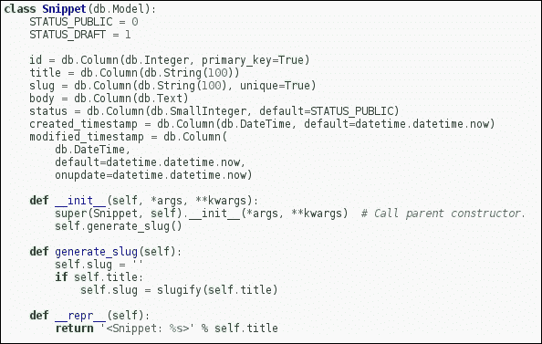
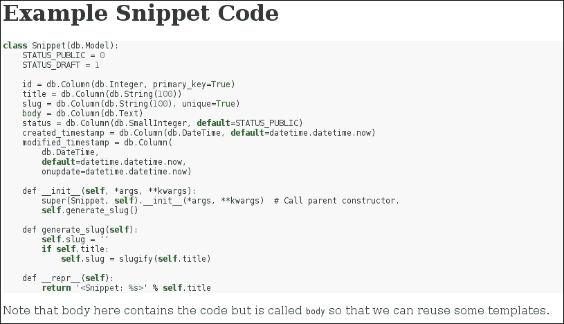

# 第九章：优秀的扩展

在本章中，我们将学习如何通过一些流行的第三方扩展增强我们的 Flask 安装。扩展允许我们以非常少的工作量添加额外的安全性或功能，并可以很好地完善您的博客应用程序。我们将研究**跨站点请求伪造**（**CSRF**）保护您的表单，Atom 订阅源以便其他人可以找到您的博客更新，为您使用的代码添加语法高亮，减少渲染模板时的负载的缓存，以及异步任务，以便您的应用程序在进行密集操作时不会变得无响应。

在本章中，我们将学习以下内容：

+   使用 Flask-SeaSurf 进行 CSRF 保护

+   使用 werkzeug.contrib 生成 Atom 订阅源

+   使用 Pygments 进行语法高亮

+   使用 Flask-Cache 和 Redis 进行缓存

+   使用 Celery 进行异步任务执行

# SeaSurf 和表单的 CSRF 保护

CSRF 保护通过证明 POST 提交来自您的站点，而不是来自另一个站点上精心制作的恶意利用您博客上的 POST 端点的网络表单，为您的站点增加了安全性。这些恶意请求甚至可以绕过身份验证，如果您的浏览器仍然认为您已登录。

我们避免这种情况的方法是为站点上的任何表单添加一个特殊的隐藏字段，其中包含由服务器生成的值。当提交表单时，可以检查特殊字段中的值是否与服务器生成的值匹配，如果匹配，我们可以继续提交表单。如果值不匹配或不存在，则表单来自无效来源。

### 注意

CSRF 保护实际上证明了包含 CSRF 字段的模板用于生成表单。这可以减轻来自其他站点的最基本的 CSRF 攻击，但不能确定表单提交只来自我们的服务器。例如，脚本仍然可以屏幕抓取页面的内容。

现在，自己构建 CSRF 保护并不难，而且通常用于生成我们的表单的 WTForms 已经内置了这个功能。但是，让我们来看看 SeaSurf：

```py
pip install flask-seasurf

```

安装 SeaSurf 并使用 WTForms 后，将其集成到我们的应用程序中现在变得非常容易。打开您的`app.py`文件并添加以下内容：

```py
from flask.ext.seasurf import SeaSurf
csrf = SeaSurf(app)
```

这只是为您的应用程序启用了 SeaSurf。现在，要在您的表单中启用 CSRF，请打开`forms.py`并创建以下 Mixin：

```py
from flask.ext.wtf import HiddenField
import g

from app import app

class CSRFMixin(object):
  @staticmethod
  @app.before_request
  def add_csrf():
    self._csrf_token = HiddenField(default=g._csrf_token)
```

上述代码创建了一个简单的 CSRF Mixin，可以选择在所有表单中使用。装饰器确保在请求之前运行该方法，以便向您的表单添加具有随机生成的 CSRF 令牌值的`HiddenField`字段。要在您的表单中使用此 Mixin，在这种情况下是您的登录表单，更新类如下：

```py
class LoginForm(Form, CSRFMixin):
```

就是这样。我们需要对所有要保护的表单进行这些更改，通常是所有表单。

# 创建 Atom 订阅源

任何博客都非常有用的一个功能是让读者能够及时了解最新内容。这通常是通过 RSS 阅读器客户端来实现的，它会轮询您的 RSS 订阅源。虽然 RSS 被广泛使用，但更好、更成熟的订阅格式是可用的，称为 Atom。

这两个文件都可以由客户端请求，并且是标准和简单的 XML 数据结构。幸运的是，Flask 内置了 Atom 订阅源生成器；或者更具体地说，Flask 使用的 WSGI 接口中内置了一个贡献的模块，称为 Werkzeug。

让它运行起来很简单，我们只需要从数据库中获取最近发布的帖子。最好为此创建一个新的 Blueprint；但是，您也可以在`main.py`中完成。我们只需要利用一些额外的模块：

```py
from urlparse import urljoin
from flask import request, url_for
from werkzeug.contrib.atom import AtomFeed
from models import Entry
```

并创建一个新的路由：

```py
@app.route('/latest.atom')
def recent_feed():
    feed = AtomFeed(
        'Latest Blog Posts',
        feed_url=request.url,
         url=request.url_root,
         author=request.url_root
     )
    entries = EntrY.query.filter(Entry.status == Entry.STATUS_PUBLIC).order_by(EntrY.created_timestamp.desc()).limit(15).all()
    for entry in entries:
        feed.add(
            entry.title,
            entry.body,
            content_type='html',
            url=urljoin(request.url_root, url_for("entries.detail", slug=entry.slug) ),
            updated=entry.modified_timestamp,
            published=entry.created_timestamp
        )
    return feed.get_response()
```

现在运行您的 Flask 应用程序，Atom 订阅源将可以从`http://127.0.0.1:5000/latest.atom`访问

# 使用 Pygments 进行语法高亮

通常，作为编码人员，我们希望能够在网页上显示代码，虽然不使用语法高亮显示阅读代码是一种技能，但一些颜色可以使阅读体验更加愉快。

与 Python 一样，已经有一个模块可以为您完成这项工作，当然，您可以通过以下命令轻松安装它：

```py
pip install Pygments

```

### 注意

Pygments 仅适用于已知的代码部分。因此，如果您想显示代码片段，我们可以这样做。但是，如果您想突出显示代码的内联部分，我们要么遵循 Markdown 的下一节，要么需要使用一些在线 Javascript，例如`highlight.js`。

要创建代码片段，我们需要首先创建一个新的蓝图。让我们创建一个名为`snippets`的目录，然后创建一个`__init__.py`文件，接着创建一个名为`blueprint.py`的文件，其中包含以下代码：

```py
from flask import Blueprint, request, render_template, redirect, url_for
from helpers import object_list
from app import db, app

from models import Snippet
from forms import SnippetForm

from pygments import highlight
from pygments.lexers import PythonLexer
from pygments.formatters import HtmlFormatter

snippets = Blueprint('snippets', __name__, template_folder='templates')

@app.template_filter('pygments')
def pygments_filter(code):
    return highlight(code, PythonLexer(), HtmlFormatter())

@snippets.route('/')
def index():
    snippets = Snippet.query.order_by(Snippet.created_timestamp.desc())
    return object_list('entries/index.html', snippets)

@snippets.route('/<slug>/')
def detail(slug):
    snippet = Snippet.query.filter(Snippet .slug == slug).first_or_404()
    return render_template('snippets/detail.html', entry=snippet)

@snippets.route('/create/', methods=['GET', 'POST'])
def create():
    if request.method == 'POST':
        form = SnippetForm(request.form)
        if form.validate():
            snippet = form.save_entry(Snippet())
            db.session.add(snippet)
            db.session.commit()
            return redirect(url_for('snippets.detail', slug=snippet.slug))
    else:
        form = SnippetForm()

    return render_template('snippets/create.html', form=form)

@snippets.route('/<slug>/edit/', methods=['GET', 'POST'])
def edit(slug):
    snippet = Snippet.query.filter(Snippet.slug == slug).first_or_404()
    if request.method == 'POST':
        form = SnippetForm(request.form, obj=snippet)
        if form.validate():
            snippet = form.save_entry(snippet)
            db.session.add(snippet)
            db.session.commit()
            return redirect(url_for('snippets.detail', slug=entry.slug))
    else:
        form = EntryForm(obj=entry)

    return render_template('entries/edit.html', entry=snippet, form=form)
```

在前面的示例中，我们设置了 Pygments 模板过滤器，允许将一串代码转换为 HTML 代码。我们还巧妙地利用了完全适合我们需求的条目模板。我们使用我们自己的`detail.html`，因为那里是 Pygments 发生魔法的地方。我们需要在 snippets 目录中创建一个 templates 目录，然后在 templates 中创建一个名为 snippets 的目录，这是我们存储 detail.html 的地方。因此，现在我们的目录结构看起来像 app/snippets/templates/snipperts/detail.html 现在让我们设置该文件，如下所示：

```py


{{ entry.title }} - Snippets

Snippet


    {{ entry.body | pygments | safe}}

```

这基本上与我们在书中早期使用的`detail.html`相同，只是现在我们通过我们在应用程序中创建的 Pygments 过滤器传递它。由于我们早期使用的模板过滤器生成原始 HTML，我们还需要将其输出标记为安全。

我们还需要更新博客的 CSS 文件，因为 Pygments 使用 CSS 选择器来突出显示单词，而不是在页面上浪费地编写输出。它还允许我们根据需要修改颜色。要找出我们的 CSS 应该是什么样子，打开 Python shell 并运行以下命令：

```py
>>> from pygments.formatters import HtmlFormatter
>>> print HtmlFormatter().get_style_defs('.highlight')

```

前面的命令现在将打印出 Pygments 建议的示例 CSS，我们可以将其复制粘贴到`static`目录中的`.css`文件中。

这段代码的其余部分与之前的 Entry 对象没有太大不同。它只是允许您创建、更新和查看代码片段。您会注意到我们在这里使用了一个`SnippetForm`，我们稍后会定义。

还要创建一个`models.py`，其中包含以下内容：

```py
class Snippet(db.Model):
    STATUS_PUBLIC = 0
    STATUS_DRAFT = 1

    id = db.Column(db.Integer, primary_key=True)
    title = db.Column(db.String(100))
    slug = db.Column(db.String(100), unique=True)
    body = db.Column(db.Text)
    status = db.Column(db.SmallInteger, default=STATUS_PUBLIC)
    created_timestamp = db.Column(db.DateTime, default=datetime.datetime.now)
    modified_timestamp = db.Column(
        db.DateTime,
        default=datetime.datetime.now,
        onupdate=datetime.datetime.now)

    def __init__(self, *args, **kwargs):
        super(Snippet, self).__init__(*args, **kwargs)  # Call parent constructor.
        self.generate_slug()

    def generate_slug(self):
        self.slug = ''
        if self.title:
            self.slug = slugify(self.title)

    def __repr__(self):
        return '<Snippet: %s>' % self.title
```

现在我们必须重新运行`create_db.py`脚本以创建新表。

我们还需要创建一个新的表单，以便可以创建代码片段。在`forms.py`中添加以下代码：

```py
from models import Snippet

class SnippetForm(wtforms.Form):
    title = wtforms.StringField('Title', validators=[DataRequired()])
    body = wtforms.TextAreaField('Body', validators=[DataRequired()])
    status = wtforms.SelectField(
        'Entry status',
        choices=(
            (Snippet.STATUS_PUBLIC, 'Public'),
            (Snippet.STATUS_DRAFT, 'Draft')),
        coerce=int)

    def save_entry(self, entry):
        self.populate_obj(entry)
        entry.generate_slug()
        return entry
```

最后，我们需要确保通过编辑`main.py`文件使用此蓝图并添加以下内容：

```py
from snippets.blueprint import snippets
app.register_blueprint(snippets, url_prefix='/snippets')
```

一旦我们在这里添加了一些代码，使用`Snippet`模型，生成的代码将如下图所示呈现：



# 使用 Markdown 进行简单编辑

Markdown 是一种现在广泛使用的网络标记语言。它允许您以特殊格式编写纯文本，可以通过程序转换为 HTML。在从移动设备编辑文本时，这可能特别有用，例如，突出显示文本使其加粗比在 PC 上更加困难。您可以在[`daringfireball.net/projects/markdown/`](http://daringfireball.net/projects/markdown/)上查看如何使用 Markdown 语法。

### 注意

Markdown 的一个有趣之处在于，您仍然可以同时使用 HTML 和 Markdown。

当然，在 Python 中快速简单地运行这个是很容易的。我们按照以下步骤安装它：

```py
sudo pip install Flask-Markdown

```

然后我们可以将其应用到我们的蓝图或应用程序中，如下所示：

```py
from flaskext.markdown import Markdown
Markdown(app)
```

这将在我们的模板中创建一个名为`markdown`的新过滤器，并且在渲染模板时可以使用它：

```py
{{ entry.body | markdown }}
```

现在，您只需要在 Markdown 中编写并保存您的博客条目内容。

如前所述，您可能还希望美化代码块；Markdown 内置了这个功能，因此我们需要扩展先前的示例如下：

```py
from flaskext.markdown import Markdown
Markdown(app, extensions=['codehilite'])
```

现在可以使用 Pygments 来渲染 Markdown 代码块。但是，由于 Pygments 使用 CSS 为代码添加颜色，我们需要从 Pygments 生成我们的 CSS。但是，这次使用的父块具有一个名为`codehilite`的类（之前称为 highlight），因此我们需要进行调整。在 Python shell 中，键入以下内容：

```py
>>> from pygments.formatters import HtmlFormatter
>>> print HtmlFormatter().get_style_defs('.codehilite')

```

现在将输出添加到`static`目录中的`.css`文件中。因此，使用包含的 CSS，您的 Markdown 条目现在可能如下所示：



还有许多其他内置的 Markdown 扩展可以使用；您可以查看它们，只需在初始化 Markdown 对象时使用它们的名称作为字符串。

# 使用 Flask-Cache 和 Redis 进行缓存

有时（我知道很难想象），我们会为我们的网站付出很多努力，添加功能，这通常意味着我们最终不得不为一个简单的静态博客条目执行大量数据库调用或复杂的模板渲染。现在数据库调用不应该很慢，大量模板渲染也不应该引人注目，但是，如果将其扩展到大量用户（希望您是在预期的），这可能会成为一个问题。

因此，如果网站大部分是静态的，为什么不将响应存储在单个高速内存数据存储中呢？无需进行昂贵的数据库调用或复杂的模板渲染；对于相同的输入或路径，获取相同的内容，而且更快。

正如现在已经成为一种口头禅，我们已经可以在 Python 中做到这一点，而且就像以下这样简单：

```py
sudo pip install Flask-Cache

```

要使其运行，请将其添加到您的应用程序或蓝图中：

```py
from flask.ext.cache import Cache

app = Flask(__name__)
cache = Cache(app, config={'CACHE_TYPE': 'redis'})
```

当然，您还需要安装 Redis，这在 Debian 和 Ubuntu 系统上非常简单：

```py
sudo apt-get install redis-server

```

不幸的是，Redis 尚未在 Red Hat 和 CentOS 的打包系统中提供。但是，您可以从他们的网站上下载并编译 Redis

[`redis.io/download`](http://redis.io/download)

默认情况下，Redis 是不安全的；只要我们不将其暴露给我们的网络，这应该没问题，而且对于 Flask-Cache，我们不需要进行任何其他配置。但是，如果您希望对其进行锁定，请查看 Redis 的 Flask-Cache 配置。

现在我们可以在视图中使用缓存（以及任何方法）。这就像在路由上使用装饰器一样简单。因此，打开一个视图并添加以下内容：

```py
@app.route("/")
@cache.cached(timeout=600) # 10 minutes
def homepage():
…
```

您将在这里看到，缓存的装饰器在路由内部，并且我们有一个 10 分钟的超时值，以秒为单位。这意味着，无论您的主页的渲染有多繁重，或者它可能进行多少数据库调用，响应都将在该时间段内直接从内存中获取。

显然，缓存有其时间和地点，并且可能是一门艺术。如果每个用户都有一个自定义的主页，那么缓存将是无用的。但是，我们可以缓存模板的部分内容，因此诸如`<head>`中的所有`<link>`元素这样的常见区域很少会更改，但是`url_for('static', ...)`过滤器不必每次重新生成。例如，看下面的代码：

```py

<link rel="stylesheet" href="{{ url_for('static', filename='css/blog.min.css') }}">

```

前面的代码部分表示链接元素应该缓存 30 分钟，以秒为单位。您可能还希望对脚本的引用进行相同的操作。我们也可以用它来加载最新博客文章的列表，例如。

# 通过创建安全、稳定的站点版本来创建静态内容

对于低动态内容的高流量网站的一种技术是创建一个简单的静态副本。这对博客非常有效，因为内容通常是静态的，并且每天最多更新几次。但是，您仍然需要为实际上没有变化的内容执行大量数据库调用和模板渲染。

当然，有一个 Flask 扩展程序可以解决这个问题：Frozen-Flask。Frozen-Flask 识别 Flask 应用程序中的 URL，并生成应该在那里的内容。

因此，对于生成的页面，它会生成 HTML，对于 JavaScript 和图像等静态内容，它会将它们提取到一个基本目录中，这是您网站的静态副本，并且可以由您的 Web 服务器作为静态内容提供。

这样做的另一个好处是，网站的*活动*版本更加安全，因为无法使用 Flask 应用程序或 Web 服务器更改它。

当然，这也有一些缺点。如果您的网站上有动态内容，例如评论，就不再可能以常规方式存储和呈现它们。此外，如果您的网站上有多个作者，您需要一种共享数据库内容的方式，以便它们不会生成网站的单独副本。解决方案将在本节末尾提出。但首先，让我们按照以下方式安装 Frozen-Flask：

```py
pip install Frozen-Flask

```

接下来，我们需要创建一个名为`freeze.py`的文件。这是一个简单的脚本，可以自动设置 Frozen-Flask：

```py
from flask_frozen import Freezer
from main import app

freezer = Freezer(app)

if __name__ == '__main__':
    freezer.freeze()
```

以上代码使用了 Frozen-Flask 的所有默认设置，并在以下方式运行：

```py
python freeze.py

```

将创建（或覆盖）包含博客静态副本的`build`目录。

Frozen-Flask 非常智能，将自动查找所有链接，只要它们是从根主页按层次引用的；对于博客文章，这样做效果很好。但是，如果条目从主页中删除，并且它们通过另一个 URL 上的存档页面访问，您可能需要向 Frozen-Flask 提供指针以找到它们的位置。例如，将以下内容添加到`freeze.py 文件`中：

```py
import models

@freezer.register_generator
def archive():
    for post in models.Entry.all():
        yield {'detail': product.id}
```

Frozen-Flask 很聪明，并使用 Flask 提供的`url_for`方法来创建静态文件。这意味着`url_for 方法`可用的任何内容都可以被 Frozen-Flask 使用，如果无法通过正常路由找到。

## 在静态站点上发表评论

因此，您可能已经猜到，通过创建静态站点，您会失去一些博客基本原理——这是鼓励交流和辩论的一个领域。幸运的是，有一个简单的解决方案。

博客评论托管服务，如 Disqus 和 Discourse，工作方式类似于论坛，唯一的区别是每个博客帖子都创建了一个主题。您可以免费使用它们的服务来进行讨论，或者使用 Discourse 在自己的平台上免费运行他们的服务器，因为它是完全开源的。

## 同步多个编辑器

Frozen-Flask 的另一个问题是，对于分布在网络上的多个作者，您如何管理存储帖子的数据库？每个人都需要相同的最新数据库副本；否则，当您生成站点的静态副本时，它将无法创建所有内容。

如果您都在同一个环境中工作，一个解决方案是在网络内的服务器上运行博客的工作副本，并且在发布时，它将使用集中式数据库来创建博客的已发布版本。

然而，如果您都在不同的地方工作，集中式数据库不是理想的解决方案或无法保护，另一个解决方案是使用基于文件系统的数据库引擎，如 SQLite。然后，当对数据库进行更新时，可以通过电子邮件、Dropbox、Skype 等方式将该文件传播给其他人。然后，他们可以从本地运行 Frozen-Flask 创建可发布内容的最新副本。

# 使用 Celery 进行异步任务

Celery 是一个允许您在 Python 中运行异步任务的库。这在 Python 中特别有帮助，因为 Python 是单线程运行的，您可能会发现自己有一个长时间运行的任务，您希望要么启动并丢弃；要么您可能希望向您网站的用户提供有关所述任务进度的反馈。

一个这样的例子是电子邮件。用户可能会请求发送电子邮件，例如重置密码请求，您不希望他们在生成和发送电子邮件时等待页面加载。我们可以将其设置为启动和丢弃操作，并让用户知道该请求正在处理中。

Celery 能够摆脱 Python 的单线程环境的方式是，我们必须单独运行一个 Celery 代理实例；这会创建 Celery 所谓的执行实际工作的工作进程。然后，您的 Flask 应用程序和工作进程通过消息代理进行通信。

显然，我们需要安装 Celery，我相信您现在可以猜到您需要的命令是以下命令：

```py
pip install celery

```

现在我们需要一个消息代理服务器。有很多选择；查看 Celery 的网站以获取支持的选择，但是，由于我们已经在 Flask-Cache 设置中设置了 Redis，让我们使用它。

现在我们需要告诉 Celery 如何使用 Redis 服务器。打开 Flask 应用程序配置文件并添加以下行：

```py
CELERY_BROKER_URL = 'redis://localhost:6379/0'
```

此配置告诉您的 Celery 实例在哪里找到它需要与 Celery 代理通信的消息代理。现在我们需要在我们的应用程序中初始化 Celery 实例。在`main.py 文件`中添加以下内容：

```py
from celery import Celery

celery = Celery(app.name, broker=app.config['CELERY_BROKER_URL'])
```

这将使用来自 Flask 配置文件的配置创建一个`Celery`实例，因此我们还可以从 Celery 代理访问`celery`对象并共享相同的设置。

现在我们需要为 Celery 工作进程做一些事情。在这一点上，我们将利用 Flask-Mail 库：

```py
pip install Flask-Mail

```

我们还需要一些配置才能运行。将以下参数添加到您的 Flask 配置文件中：

```py
MAIL_SERVER = "example.com"
MAIL_PORT = 25
MAIL_USERNAME = "email_username"
MAIL_PASSWORD = "email_password"
```

此配置告诉 Flask-Mail 您的电子邮件服务器在哪里。很可能默认设置对您来说已经足够好，或者您可能需要更多选项。查看 Flask-Mail 配置以获取更多选项。

现在让我们创建一个名为`tasks.py`的新文件，并创建一些要运行的任务，如下所示：

```py
from flask_mail import Mail, Message
from main import app, celery

mail = Mail(app)

@celery.task
def send_password_verification(email, verification_code):
  msg = Message(
    "Your password reset verification code is: {0}".format(verification_code),
                  sender="from@example.com",
                  recipients=[email]
  )
  mail.send(msg)
```

这是一个非常简单的消息生成；我们只是生成一封电子邮件，内容是新密码是什么，电子邮件来自哪里（我们的邮件服务器），电子邮件发送给谁，以及假设是用户账户的电子邮件地址，然后发送；然后通过已设置的邮件实例发送消息。

现在我们需要让我们的 Flask 应用程序利用新的异步能力。让我们创建一个视图，监听被 POST 到它的电子邮件地址。这可以在与帐户或主应用程序有关的任何蓝图中进行。

```py
import tasks

@app.route("/reset-password", methods=['POST'])
def reset_password():
  user_email = request.form.get('email')
  user = db.User.query.filter(email=user_email).first()
  if user:
    new_password = db.User.make_password("imawally")
    user.update({"password_hash": new_password})
    user.commit()
    tasks.send_password_verification.delay(user.email, new_password)
    flash("Verification e-mail sent")
  else:
    flash("User not found.")
  redirect(url_for('homepage'))
```

前面的视图接受来自浏览器的 POST 消息，其中包含声称忘记密码的用户的电子邮件。我们首先通过他们的电子邮件地址查找用户，以查看用户是否确实存在于我们的数据库中。显然，在不存在的帐户上重置密码是没有意义的。当然，如果他们不存在，用户将收到相应的消息。

但是，如果用户帐户确实存在，首先要做的是为他们生成一个新密码。我们在这里使用了一个硬编码的示例密码。然后更新数据库中的密码，以便用户在收到电子邮件时可以使用它进行登录。一切都搞定后，我们就可以在之前创建的`任务`上运行.delay，并使用我们想要使用的参数。这会指示 Celery 在准备好时运行底层方法。

### 注意

请注意，这不是进行密码重置的最佳解决方案。这只是为了说明您可能希望以简洁的方式执行此操作。密码重置是一个令人惊讶地复杂的领域，有很多事情可以做来提高此功能的安全性和隐私性，例如检查 CSRF 值，限制调用方法的次数，并使用随机生成的 URL 供用户重置密码，而不是通过电子邮件发送的硬编码解决方案。

最后，当我们运行 Flask 应用程序时，我们需要运行 Celery 代理；否则，几乎不会发生任何事情。不要忘记，这个代理是启动所有异步工作者的进程。我们可以做的最简单的事情就是从 Flask 应用程序目录中运行以下命令：

```py
celeryd -A main worker

```

这很简单地启动了 Celery 代理，并告诉它查找`main`应用程序中的 celery 配置，以便它可以找到配置和应该运行的任务。

现在我们可以启动我们的 Flask 应用程序并发送一些电子邮件。

# 使用 Flask-script 创建命令行指令

使用 Flask 非常有用的一件事是创建一个命令行界面，这样当其他人使用您的软件时，他们可以轻松地使用您提供的方法，比如设置数据库、创建管理用户或更新 CSRF 密钥。

我们已经有一个类似的脚本，并且可以在这种方式中使用的脚本是第二章中的`create_db.py`脚本，*使用 SQLAlchemy 的关系数据库*。为此，再次有一个 Flask 扩展。只需运行以下命令：

```py
pip install Flask-Script

```

现在，Flask-Script 的有趣之处在于，命令的工作方式与 Flask 中的路由和视图非常相似。让我们看一个例子：

```py
from flask.ext.script import Manager
from main import app

manager = Manager(app)
@manager.command
def hello():
    print "Hello World"

if __name__ == "__main__":
    manager.run()
```

您可以在这里看到，Flask-Script 将自己称为 Manager，但管理器也将自己挂钩到 Flask 应用程序中。这意味着您可以通过使用`app`引用来对 Flask 应用程序执行任何操作。

因此，如果我们将`create_db.py`应用程序转换为 Flask-Script 应用程序，我们应该创建一个文件来完成这项工作。让我们称之为`manage.py`，并从文件`create_db.py`中插入：

```py
from main import db

@manager.command
def create_db():
    db.create_all()
```

所有这些只是设置一个装饰器，以便`manage.py`带有参数`create_db`将运行`create_db.py`中的方法。

现在我们可以从以下命令行运行：

```py
python manage.py create_db

```

# 参考

+   [`highlightjs.org/`](https://highlightjs.org/)

+   [`pythonhosted.org/Flask-Markdown/`](http://pythonhosted.org/Flask-Markdown/)

+   [`daringfireball.net/projects/markdown/`](http://daringfireball.net/projects/markdown/)

+   [`pythonhosted.org/Markdown/extensions`](http://pythonhosted.org/Markdown/extensions)

+   [`pythonhosted.org/Frozen-Flask/`](https://pythonhosted.org/Frozen-Flask/)

+   [`disqus.com/`](https://disqus.com/)

+   [`www.discourse.org`](http://www.discourse.org)

+   [`eviltrout.com/2014/01/22/embedding-discourse.html`](http://eviltrout.com/2014/01/22/embedding-discourse.html)

+   [`flask-script.readthedocs.org/en/latest/`](http://flask-script.readthedocs.org/en/latest/)

+   [`pythonhosted.org/Flask-Mail/`](https://pythonhosted.org/Flask-Mail/)

# 总结

在本章中，我们做了各种各样的事情。您已经看到如何创建自己的 Markdown 渲染器，以便编辑更容易，并将命令移动到 Flask 中，使其更易管理。我们创建了 Atom feeds，这样我们的读者可以在发布新内容时找到它，并创建了异步任务，这样我们就不会在等待页面加载时锁定用户的浏览器。

在我们的最后一章中，我们将学习如何将我们的简单应用程序转变为一个完全部署的博客，具有所有讨论的功能，已经得到保护，并且可以使用。
