# 第八章：模块和包

在上一章中，你学习了 Python 函数。在本章中，你将学习 Python 模块。Python 模块是 Python 源文件，它可以包含语句、类、函数和变量。

# 模块

模块是旨在供其他程序使用的代码文件。为了使用模块，我们使用 `import` 语句。一个模块可以导入其他模块。

让我们讨论一个简单的 Python 程序：

```py
def sum1(a,b):
 c = a+b
 return c

def mul1(a,b):
 c = a*b
 return c

```

上述代码是一个非常简单和基本的例子。让我们将程序保存为 `module1.py`。你可以认为上述程序是 Python 模块。我们将使用 `module1.py`。考虑，在编写另一个程序时，你需要两个数字的乘法或加法。你不需要创建任何函数。你可以利用 `module1.py`。

# `import` 语句

为了使用 `module1.py` 程序的函数和变量，我们将使用 `import` 语句。`import` 语句的语法如下所示：

```py
Import module1, module2, module 

```

这样，你可以导入多个模块。让我们再写一个程序 `mod1.py`，它将导入 `module1.py`：

```py
 import module1
 x = 12
 y = 34
 print "Sum is ", module1.sum1(x,y)
 print "Multiple is ", module1.mul1(x,y)

```

如你所知，模块包含语句和定义，并且这些语句和定义在解释器首次遇到 `import` 语句中的模块名时执行。

在前面的代码中，当解释器遇到 `import` 语句中的 `module1` 名称时，`module1` 模块将被执行。为了使用模块变量和函数，使用 `module_name.variable` 和 `module_name.function()` 表示法。在前面代码中，我们想要使用 `module1` 的 `sum1()` 函数，这就是为什么我们使用 `module1.mul1()`。

让我们看看输出：

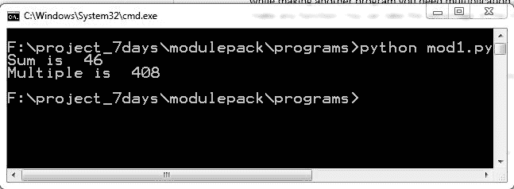

`mod1.py` 程序的输出

如果你认为每次都要写 `module1` 和 `module1.py` 中的每个函数很繁琐且耗时，那么 Python 允许你使用 `as` 语句，如下所示。语法如下：

```py
import module_name as new_name

```

让我们编写一个程序 `mod2.py`：

```py
import module1 as md
x = 12
y = 34
print "Sum is ", md.sum1(x,y)
print "Multiple is ", md.mul1(x,y)

```

在上述代码中，`module1` 被用作 `md`。让我们看看输出：

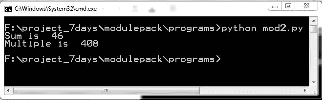

`mod2.py` 程序的输出

你可以明确地定义所需的函数。考虑我们只想使用 `sum1()` 函数而不是 `mul1()`。语法如下：*module-name import function-name*

让我们编写代码：

```py
 from module1 import sum1
 x = 12
 y = 34
 print "Sum is ", sum1(x,y)

```

在第一行，我定义了从哪里获取 `sum1()` 函数，然后将不再需要使用 `module1` 与函数名一起使用。让我们看看代码的输出：

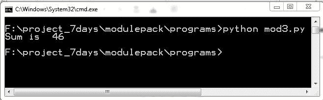

`mod3` 程序的输出

考虑一个包含许多函数的模块，你必须导入所有这些函数。你可以使用以下语句，如下所示：

```py
from module-name import *

```

但我建议你不要使用前面的语句，因为如果你导入多个模块，那么很难确定哪个函数来自哪个模块。让我们举一个例子。考虑另一个名为 `module2` 的模块：

```py
def sub1(a,b):
    c = a-b
    return c

def divide1(a,b):
    c = a/b
    return c

```

现在我们有两个模块 `module1` 和 `module2`。我们之前已经定义了 `module1`。接下来，让我们编写下一个程序 `mod4.py`：

```py
 from module1 import *
 from module2 import *
 x = 36
 y = 12
 print "Sum is ", sum1(x,y)
 print "Substraction is ", sub1(x,y)
 print "after divide ", divide1(x,y)
 print "Multiplication is ", mul1(x,y)

```

在前面的函数中，我们导入了 `module1` 和 `module2` 的所有函数。但很难确定哪个函数来自哪个模块。程序的输出如下所示：

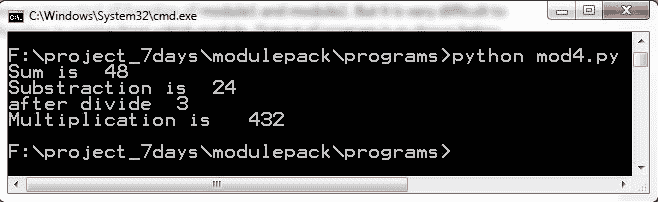

mod4 程序的输出

然而，Python 提供了一个内置函数 `dir()`，可以用来识别函数。请参考 `mod5.py` 的示例：

```py
 import module1
 print dir(module1)

```

程序的输出如下所示：

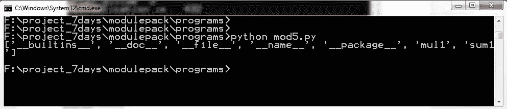

前面的输出是 `mod5` 程序的输出。看到输出后，我们可以确定 `mul1()` 和 `sum1()` 函数来自 `module1` 模块。

# 定位 Python 模块

在遇到 `import` 语句后，Python 解释器会按照以下顺序搜索模块：

1.  当前目录，包含正在运行的脚本。我建议你确保，你的程序名称与导入的模块名称不同。

1.  在 Windows 操作系统中，`PYTHONPATH` 必须在环境变量中定义。让我们通过示例来学习。假设我们将 `mod5.py` 程序移动到另一个目录，如下截图所示。

但当前目录不包含任何 `module1` 模块。输出将如下所示：

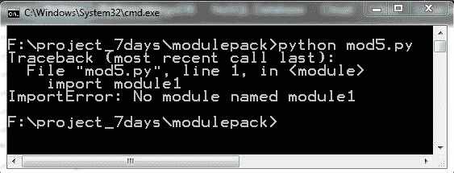

不同目录中 mod5.py 的输出

我们正在从 `F:project_7daysmodulepack` 运行 `mod5.py` 程序。那里显示的输出是找不到 `module1` 模块。让我们按照以下截图设置 `PYTHONPATH` 变量：

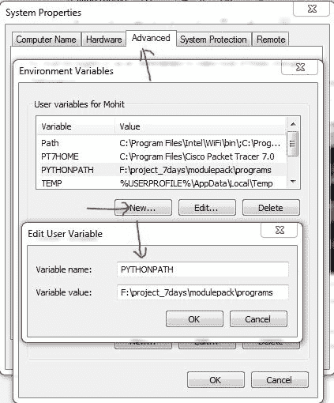

设置 PYTHONPATH 变量

设置 `PYTHONPATH` 后，你将需要重新启动计算机。重启后，再次启动程序。

输出将如下所示：

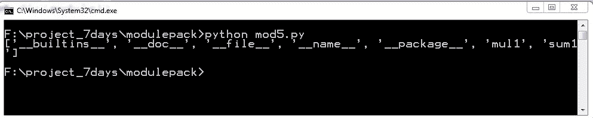

这是设置 `PYTHONPATH` 后程序的输出。现在你可以看到没有错误，这意味着解释器能够找到 `module1` 模块。

1.  这里默认安装了 Python。如果你想了解安装路径，可以在 `sys` 模块中检查 `sys.path` 变量。请参考以下示例：

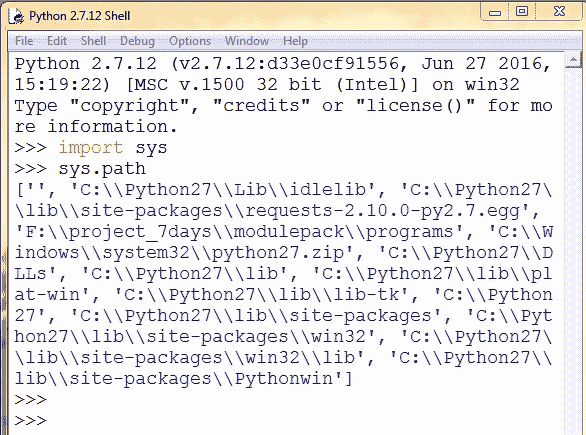

展示 sys 路径的截图

`sys.path` 返回一个默认路径列表。

# 编译后的 Python 文件

每当 `module1.py` 和 `module2.py` 成功编译后，都会尝试将编译版本分别写入 `module1.pyc` 和 `module2.pyc`。请参考以下截图：

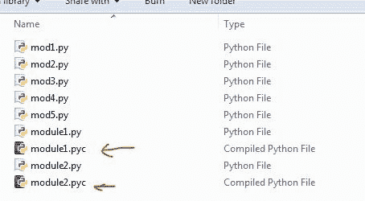

展示编译文件的截图

编译文件的 内容与平台无关，因此 Python 模块可以在不同架构的机器上使用。

让我们讨论一个特殊场景，假设 Bob 编写了一个名为 `myprog.py` 的程序，如下所示：

```py
def sum1(a,b):
  c = a+b
  return c
  print "Sum is ", sum1(3,6)

```

让我们运行它：

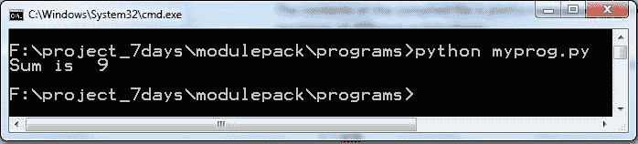

myprog.py 程序的输出

Bob 的程序正在成功运行。考虑另一个用户 Alice，她将你的程序作为模块使用。

参考 Alice 的程序 `alice1.py`：

```py
import myprog
num = 10
total = num+myprog.sum1(23,12)
print "Alice total is ", total

```

上述程序非常简单，只需将`myprog.py`作为模块导入，并使用`myprog`模块的`sum1()`函数。让我们看看输出：

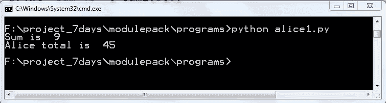

alice1.py 程序的输出

程序运行成功。从`alice1.py`的输出中，`myprog.py`的输出也被打印出来，这是不需要的。任何意外将`myprog.py`作为模块导入的用户都会得到`myprog.py`的输出。为了避免这种情况，我们在`myprog.py`中做了一些修改。

你可以在这里看到程序`myprog.py`的新版本：

```py
def sum1(a,b):
 c = a+b
 return c

if __name__ == '__main__' :
 print "Sum is ", sum1(3,6)

```

从前面的代码中，`__name__`和`__main__`有什么意义？`__name__`是一个特殊变量，它包含字符串`"__main__"`。如果程序是从另一个程序导入的，那么`__name__`将被设置为模块的名称。

让我们看看程序`myprog.py`和`alice1.py`的输出：

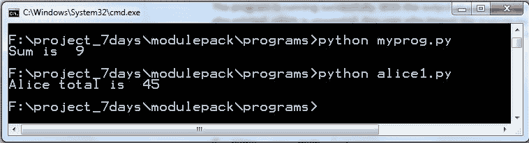

myprog.py 和 alice1.py 程序的输出

如果你仍然不明白`__name__`变量的含义，让我们通过例子来讨论。我在`myprog.py`程序中做了临时修改：

```py
def sum1(a,b):
 c = a+b
 return c

print "name is ", __name__

if __name__ == '__main__' :
 print "Sum is ", sum1(3,6)

```

让我们运行两个程序`myprog.py`和`alice1.py`：

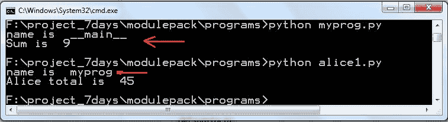

myprog.py 和 alice1.py 程序的输出

因此，在前面的输出中，当运行`myprog.py`时，`__name__`变量返回字符串值`"__main__"`。进一步地，当`myprog`被另一个程序作为模块导入时，它返回名为`myprog`的模块。我希望现在一切都变得清晰了。

# Python 包

Python 模块是一个单独的文件，而 Python 包是一组模块的集合。包是一个包含 Python 模块和一个额外的文件`__init__.py`的目录。为什么需要包？假设一个团队接到了一个将录音转换为 MP3 格式的项目。一位开发者编写了`rectomp3.py`代码，在`sound_conversion`目录中将录音语音转换为 MP3 声音。过了一段时间，团队得到了新的需求，需要将录音转换为`.wav`格式。我们不是在`rectomp3.py`文件中编写代码，而是在`sound_conversion`目录中编写自己的代码`rectowav.py`文件。然后，又有一个新的需求，需要将录音转换为 WMA 格式。再次，另一位开发者在同一目录`sound_conversion`中编写了新的代码`rectowma.py`文件。这样，他们通过添加一个额外的文件`__init__.py`来创建了一个包。让我们举一个实际例子。

这里，你可以看到`sound_conversion`目录中的代码`rectomp3.py`：

```py
 #Written by Mohit
 def rec2mp3():
    """
    Converions code
    """
    return "recording voice converted to Mp3"

```

上述代码是示例代码，仅用于理解。让我们看看同一目录`sound_conversion`中的第二个代码`rectowav.py`：

```py
 #Written by Bhaskar
 def rec2wav():
   """
   Converions code
   """
   return"recording voice converted to wav"

```

上述代码将录音语音转换为 WAV 格式。让我们看看新的代码：

```py
#Written by Denim
def rec2wma():
  """
  Converions code
  """
  return "recording voice converted to wma"

```

现在所有的代码都写好了，在`sound_conversion`目录中创建一个空文件`__init__.py`。`__init__.py`文件可以是一个空文件，也可以用来导入模块。现在我们的包已经准备好了；让我们导入它。我们将编写一个新的程序`voice_changer.py`。将程序放在`sound_conversion`目录外。参考以下程序：

```py
from sound_conversion import rectomp3
from sound_conversion.rectowma import rec2wma
print rectomp3.rec2mp3()
print rec2wma()

```

在执行前面的文件时，解释器可能会给出错误，因为 Python 解释器不知道`sound_conversion`的路径，如下所示。

将`PYTHONPATH`设置如下：

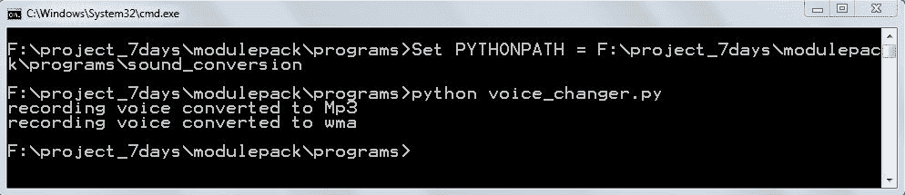

前面的截图也显示代码正在运行。如果你想在其他目录（例如`F:/`）中创建`voice_changer.py`，让我们将`voice_changer.py`在`F:/`中的代码复制粘贴并运行。如果解释器无法找到包，你可能会得到如下错误：

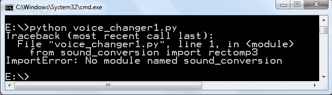

显示错误的输出

在前面的代码中，我们遇到了错误 `No module named sound_conversion`，这意味着解释器没有获取到该包或模块。让我们编辑代码。参考以下代码：

```py
 import sys
 sys.path.append("F:project_7daysmodulepackprograms")
 from sound_conversion import rectomp3
 from sound_conversion.rectowma import rec2wma
 print rectomp3.rec2mp3()
 print rec2wma()

```

在`voice_changer1.py`程序中，我们使用`syntax sys.path.append("F:project_7daysmodulepackprograms")`编辑了程序中的`sys.path`。让我们看看输出：

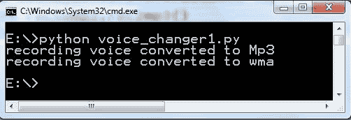

voice_chnager1.py 程序的输出

前面的截图显示代码正在成功运行。这样，你可以加载包和模块。

# 摘要

在*模块*部分，你已经学习了如何创建模块以及如何导入它们。通过使用`dir()`函数，你可以检查模块中涉及到的函数。Python 包是模块的集合：通常一个 Python 包是一个目录。你已经学习了 Python 如何搜索模块和包。
