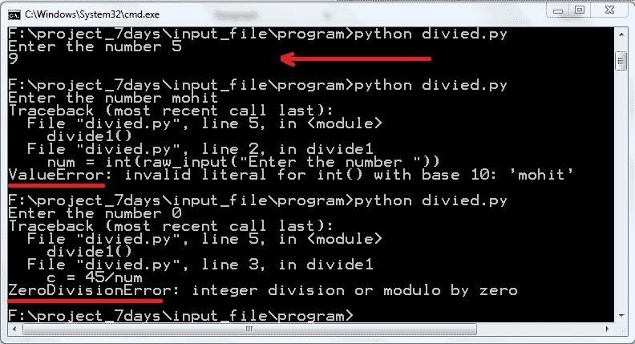

# 第九章：文件处理和异常

到目前为止，你已经看到了各种 Python 程序，它们从键盘获取输入并在屏幕上显示输出。然而，在本章中，你将学习如何从文件中获取输入并将结果写入文件。我们还将讨论异常的概念。

# 从文件中读取文本

为了读取和写入文件，我们将使用内置的`open()`函数来打开文件。`open()`函数创建了一个`file_object`对象。什么是对象？你将在第十一章类和对象中了解。语法如下：

```py
file_object = open(file_name ,access_mode)

```

第一个参数`file_name`指定了你要打开的文件名。第二个参数`access_mode`确定文件必须以哪种模式打开，即读取、写入、追加等。

# read()方法

现在我们将通过程序读取一个文件。读取的访问模式是`r`。

让我们以包含著名引言的文本文件为例：


样本文件

我已经将前面的文件保存为`sample1.txt`。

让我们编写一个`readfile.py`程序来读取前面的文件：

```py
file_input = open("sample1.txt",'r')
all_read = file_input.read()
print all_read
file_input.close()

```

在给定的代码中，我们首先创建了一个`file_input`文件对象，然后调用`file_input.read()`来读取文件内容。读取后，通过`file_input.close()`关闭`file_input`文件对象。为了确保样本文件和代码`readfile.py`在同一个目录下，让我们检查输出：


读取文件

前面的代码正在成功运行。为了从文件中读取字符，你可以将参数传递给`read()`函数，例如，`read(5)`将读取文件的前五个字符。

让我们了解样本代码`readcount1.py`：

```py
file_input = open("sample1.txt",'r')
print file_input.read(20)
print file_input.read(15)
print file_input.read(10)
file_input.close()

```

让我们分析输出：


读取代码的输出

代码的第二行读取文件的前`20`个字符，第三行读取接下来的`15`个字符，第四行读取接下来的`10`个字符。

# readline()方法

为了逐行读取文件，使用`readline()`。

让我们看看样本代码`readline1.py`：

```py
file_input = open("sample1.txt",'r')
print file_input.readline()
print file_input.readline()
print file_input.readline()
file_input.close()

```

让我们看看代码的输出：


在代码中，我们打印了三行。如果你在`readline(count)`中指定`count`会发生什么？看看代码`readlinecount.py`：

```py
file_input = open("sample1.txt",'r')
print  file_input.readline(100)
print  file_input.readline(20)
file_input.close()

```

让我们看看输出：


在`file_input.readline(100)`语法中打印了第一行的`100`个字符。但第一行只有 48 个字符。语法`file_input.readline(20)`从`sample1.txt`的第二行打印了`20`个字符。

# readlines()方法

考虑你想制作一个文件行列表的情况；在这种情况下，`readlines()`方法允许你这样做。

看看`readlines1.py`中的代码：

```py
file_input = open("sample1.txt",'r')
print  file_input.readlines()
file_input.close()

```

让我们检查代码的输出：


在前面的屏幕截图中，你可以轻松地看到行列表。

对于读取目的，你可以遍历文件对象。让我们分析`readfileforloop.py`中的代码：

```py
file_input = open("sample1.txt",'r')
for line in file_input:
      print line

```

这是输出结果：


你可以看到所有行。这是内存高效、快速且代码简单的。

# 练习

让我们做一个练习。

看看给定的文件`batman.txt`，其中包含著名好莱坞电影的引言。

我们的目的是编写一个程序从文件中查找一个特定的单词：


batman.txt 的截图

让我们编写一个程序从文件中查找特定的单词。我们假设程序应该是大小写不敏感的，这意味着字符是大写还是小写无关紧要。

看看`findword.py`中的代码：

```py
word = raw_input("Enter the word ")
word = word.lower()
file_txt = open("batman.txt", "r")
count = 0
for each in file_txt:
    if word in each.lower():
        count = count+1
print "The ", word ," occured ",count, " times"

```

程序非常容易理解。让我们看看代码的输出结果：


findword.py 的输出

`findword.py`程序运行正常。

# 向文件写入文本

在本节中，我们将学习如何使用 Python 编写新文件。

这次我们将在`open()`中使用写模式`'w'`。`'w'`模式创建一个新文件。如果文件已存在，则文件会被覆盖。我们将使用`write()`函数。

让我们讨论`filewrite1.py`中的代码：

```py
file_input = open("motivation.txt",'w')
file_input.write("Never give up")
file_input.write("nRise above hate")
file_input.write("nNo body remember second place")
file_input.close()

```

你可以看到我已经写下了著名 WWE 明星约翰·塞纳的引言。

让我们看看输出结果：


code filewrite.py 的输出

我们通过添加一个新行字符`n`逐行写入。你可以一次性提供所有这些，如下所示：

```py
file_input = open("motivation.txt",'w')
file_input.write("Never give up nRise above hate nNo body remember second place")
file_input.close()

```

接下来，我将使用`writelines()`函数。此方法将 Python 字符串列表写入文件。

让我们看看代码：

```py
list1 = ["Blood sweat and respectn",
 "The first two you given"
 "The last you earnn"
 "Give it Earn it"]
text_file = open("wwerockquotes.txt", 'w')
text_file.writelines(list1)
text_file.close()

```

在前面的代码中，Python 列表`list1`包含一些励志的语句，我们想要将它们保存到文件中。我们可以使用`writelines()`函数来满足我们的需求。让我们看看输出结果：


filewriteline.py 的输出

每次运行程序，文件都会被覆盖，意味着会创建一个新的文件。考虑你想向之前的文件添加内容的情况；你可以使用访问模式`'a'`。

让我们使用前面程序`filewritea.py`的访问模式`'a'`。

```py
file_input = open("newmotivation.txt",'a')
file_input.write("Never give up")
file_input.write("nRise above hate")
file_input.write("nNo body remember second place")
file_input.close() 

```

让我们看看输出结果：


filewritea.py 的输出

让我们用不同的行运行程序：

```py
file_input = open("newmotivation.txt",'a')
file_input.write("nBlood sweat and respect")
file_input.write("nThe first two you give")
file_input.write("nThe last you earn")
file_input.write("nGive it Earn it")
file_input.close()

```

让我们看看输出结果：


program filewritea1.py 的输出

`newmotivation.txt`文件已成功追加。

还有其他访问模式。

# 示例

`"r+"`模式打开一个文件用于读写。此模式将指针放置在文件的开头。

`"w+"`模式打开一个文件用于读写。如果文件不存在，则创建一个新文件。如果文件存在，则文件会被覆盖。

`"a+"`模式打开一个文件用于追加和读取。如果文件不存在，则创建一个新文件。如果文件已存在，则指针放置在文件末尾。

# 序列化

文本文件使用方便，因为你可以用任何文本编辑器读取、写入和追加它们，但它们仅限于存储一系列字符。有时你可能想存储复杂的信息，如列表和字典。在这里，我们将使用 Python 的 `pickle` 模块。`pickle` 模块用于存储复杂的数据，如列表和字典。让我们通过一个例子来讨论：

```py
import pickle
name = ["mohit","bhaskar", "manish"]
skill = ["Python", "Python", "Java"]
pickle_file = open("emp1.dat","w")
pickle.dump(name,pickle_file)
pickle.dump(skill,pickle_file)
pickle_file.close()

```

这个程序看起来难以理解。让我们逐行理解代码。

`name` 和 `skill` 是两个我们需要存储的列表。

`pickle_file = open("emp1.dat","w")` 语法以写入模式创建一个 `pickle_file` 对象，就像我们之前做的那样。

`pickle.dump()` 用于将列表 `name` 和 `skill` 导出到 `pick.dat` 文件中。`pickle.dump()` 需要两个参数，第一个是要 `pickle` 的数据（如列表），第二个是存储它的文件。`pickle_file.close()` 最终关闭文件。让我们看看输出：


pickle 文件输出

现在你应该有了如何存储复杂数据的概念。

# 反序列化

反序列化意味着从 `pickle` 文件中检索数据。在前面的话题中，你学习了如何将 `(list, dictionary)` 数据存储在 `pickle` 文件中；现在是时候检索存储的数据了。为了执行反序列化，我们将使用 `pickle.load()`。`pickle.load()` 接收一个文件对象作为参数。

让我们看看程序：

```py
import pickle
pickle_file = open("emp1.dat",'r')
name_list = pickle.load(pickle_file)
skill_list =pickle.load(pickle_file)
print name_list ,"n", skill_list

```

让我们逐行理解程序。`pickle_file = open("emp1.dat",'r')` 语法以读取模式创建一个文件对象。`name_list = pickle.load(pickle_file)` 语法读取文件中的第一个 pickled 对象并将其反序列化为产生 `['mohit', 'bhaskar', 'manish']` 列表。同样，`skill_list =pickle.load(pickle_file)` 读取文件中的第二个 pickled 对象并将其反序列化为产生 `['Python', 'Python', 'Java']` 列表。

让我们看看输出以消除任何混淆：


filepickle2.py 文件输出

在 `pickle` 中，你不能随机访问数据。`Pickle` 按顺序存储和检索列表。

你首先在 `pickle` 文件中导出的数据将首先被检索。这是 `pickle` 文件的限制。

由于 `pickle` 文件的限制，你不能随机访问列表，但你可以使用包含列表的字典来随机检索列表。

考虑以下示例：

```py
leapx_team = {
name : ["mohit", "Ravender", "Himmat", "Robbin"],
skill : ["Python","Data Analytic", "Information Security", "SAP"]
             }

```

通过导出这个字典，你可以随机访问任何列表。

让我们看看程序：

```py
import pickle
pickle_file = open("emp2.dat",'w')
leapx_team = {
     'name' : ["Mohit", "Ravender", "Himmat", "Robbin"],
     'skill' : ["Python","Data Analytic", "Information Security", "SAP"]
     }
pickle.dump(leapx_team,pickle_file)
pickle_file.close() 

```

在前面的程序中，我们导出了一个名为 `leapx_team` 的字典。运行前面的程序并检查目录。必须形成一个名为 `emp2.dat` 的文件。

让我们检索 `emp2.dat` 文件的内容。

```py
import pickle
pickle_file = open("emp2.dat",'r')
all_data = pickle.load(pickle_file)
print all_data["skill"]
print all_data["name"] 

```

在前面的程序中，`all_data` 是字典，我们通过键访问字典的值。

让我们看看输出：


我们正在随机访问列表。

`pickle` 模块是用 Python 编写的，而 `cPickle` 模块是用 C 语言编写的，它比 `pickle` 模块运行更快。

让我们看看 `filecpickle1.py` 中的示例代码：

```py
import cPickle as pickle
name = ["mohit","bhaskar", "manish"]
skill = ["Python", "Python", "Java"]
pickle_file = open("emp1.dat","w")
pickle.dump(name,pickle_file)
pickle.dump(skill,pickle_file)
pickle_file.close()

```

# 异常

假设你创建了一个程序 `calc.py`，并且它正在成功运行。过了一段时间，第三方人员编辑了程序 `calc.py`。在执行程序时，解释器抛出了一些错误。由于错误，整个程序停止工作。我们如何避免这种情况，即如果发生任何错误，整个程序执行不会受到影响？

答案很简单：只需使用异常处理。在执行过程中检测到的错误称为异常。在下一节中，你将看到详细的示例，我们将看到如何使用 `try...except` 子句进行异常处理。

# 带有 `except` 子句的 `try` 语句

在本节中，你将看到如何使用 `try...except` 块来处理异常。让我们通过示例来理解 `try...except` 块的用法。

考虑以下程序：

```py
def sum1(a,b):
            c = a+b
            return c
print sum1(10,0)

```

假设第三方人员编辑了程序 `calc.py`；完整的程序如下所示：

```py
def sum1(a,b):
            c = a+b
            return c
def divide(a,b):
            c = a/b
            return c          
print divide(10,0)
print sum1(10,0)

```

让我们运行程序：


`calc.py` 的输出

在前面的输出中，程序显示了一个错误，因为我们执行了除以 `0` 的操作。由于一个错误，整个程序停止。为了处理这种情况，我们使用 `try and except` 块。

让我们看看程序 `calc.py`：

```py
def sum1(a,b):
    try:
        c = a+b
        return c
    except :
         print "Error in sum1 function"
def divide(a,b):
    try:
        c = a/b
        return c
    except :
        print "Error in divide function"
print divide(10,0)
print sum1(10,0)

```

让我们再次运行它：


`calc.py` 的输出

现在 `sum1()` 函数输出为“`divide` 函数中发生错误”。

让我们详细讨论 `try...except`。首先看看语法：

```py
try:
            operation block;
except Exception_name:
            If there is Exception_name1 then execute this block.
except Exception_name2:
            If there is Exception_name2, then execute this block.
 else:
            If there is no exception then execute this block.

```

在 `calc.py` 程序中，调用 `divide` 函数会引发异常；异常被捕获并显示了一个定制的消息：“`divide` 函数错误”。如果没有引发异常，程序将跳过 `except` 子句，继续执行其余代码。

# 多个异常块

在前面的例子中，你学习了如何捕获异常。但你不知道发生了什么类型的错误。每个异常都有一定的类型。示例中的类型有 `ZeroDivisionError`、`NameError` 和 `TypeError`。类型在错误消息中写出。考虑一个不同的程序 `divide1.py`：

```py
def divide1():
    num = int(raw_input("Enter the number "))
    c = 45/num
    print c
divide1()

```

在给定的程序中，当我们从键盘输入时，输入的字符串将被转换为 int 类型。

让我们用不同的输入运行程序：



`divied.py` 程序的输出

当我们输入 `5` 时，程序返回 `9`。当我们提供一个字符串而不是数字时，解释器会返回一个带有 `ValueError` 错误的消息，如红色下划线所示。当我们提供数字 `0` 时，则返回 `ZeroDivisionError`。通过使用多个异常块，你可以处理这两种异常。

请参考程序 `divide1.py`：

```py
 def divide1():
    try:
        num = int(raw_input("Enter the number "))
        c = 45/num         
        print c     
    except ValueError :         
        print "Value is not int type" 
    except ZeroDivisionError : 
       print "Don't use zero" 
    else: 
      print "result is ",c
divide1()

```

在前面的程序中，已经处理了多个异常，并显示了一个定制的消息。让我们看看输出：


`divide1.py`程序的输出

在前面的输出中，显示了自定义的消息，以便用户可以理解他的错误。

# try...finally 语句

在你完全确信某个代码块无论程序是否抛出异常都会被执行的情况下，`try...finally`是有用的。考虑当你打开一个文件并读取输入时的情况，但由于某种原因程序抛出了异常，而你想要的文件无论是否发生异常都需要关闭，那么`try...finally`将解决这个问题。

语法如下：

```py
try:
              #run this action first
except:
             # Run if exception occurs
Finally :
               #Always run this code

```

语句的顺序应该是：

```py
try -> except -> else -> finally

```

让我们讨论`finally1.py`中的代码：

```py
try: 
    num = int(raw_input("Enter the number ")) 
    re = 100/num 
except: 
    print "Something is wrong" 
else: 
    print "result is ",re 
finally : 
    print "finally program ends"

```

在前面的代码中，我们使用了`try`、`except`、`else`和`finally`块。让我们通过执行代码来讨论其功能：


`finally1.py`的输出

在前面的输出中，第一次运行时提供了输入`10`，并且`try`、`else`和`finally`块被执行。在第二次运行中，提供了字符串`Mohit`。由于类型转换错误，`except`和`finally`块被执行。

通过这个，你已经看到了`finally`语句的重要性。

# 异常参数

当你编写程序时，逐个编写每个异常类型是非常枯燥和乏味的。你不需要逐个编写异常，只需一行即可。看看`exceptiontype.py`中的代码：

```py
try: 
    num = int(raw_input("Enter the number ")) 
    re = 100/num 
    print re
except Exception as e : 
    print e, type(e)

```

上一段代码将异常捕获为`e`，`type(e)`显示了其异常类型。让我们看看输出。在代码中，`e`是异常的参数：参数的内容因异常而异：


`exceptiontype.py`程序的输出

你可以看到我们运行了程序三次。第一次我们传递了值`10`。它运行成功。在第二次运行中，我们传递了字符串`'mohit'`，这是解释器处理异常并显示异常信息和其类型的时候。在第三次运行中，我们传递了`0`，这是解释器显示了相应的异常信息和其类型的时候。

# 抛出异常

`raise`语句允许程序员显式地触发特定的异常。

考虑以下示例：

```py
>>> raise IOError
Traceback (most recent call last):
   File "<pyshell#0>", line 1, in <module>
      raise IOError
IOError

```

在前面的例子中，通过`raise`关键字抛出了特定的异常`IOError`：

```py
>>> raise IOError("Hi there")
Traceback (most recent call last):
 File "<pyshell#1>", line 1, in <module>
 raise IOError("Hi there")
IOError: Hi there
>>>

```

在前面的例子中，传递了一个字符串`"Hi there"`参数，它被打印出来，并伴随着异常。

# 用户定义的异常

在本节中，我们将使用类，因为你还没有阅读第十一章，*类和对象*，你可以跳过这个主题，完成类和对象的学习后再回来。

Python 允许你定义自己的异常。异常应该继承自`Exception`类。

让我们通过一个例子来讨论：

```py
class MyException(Exception): 
    def __init__(self, value):
       self.value = value 
    def __str__(self):
       return (self.value) 
try: 
     num = raw_input("Enter the number : ")
     if num == '2':
         raise MyException("ohh") 
     else :
         print "number is not 2"
except MyException : 
     print "My exception occurred"

```

不要害怕查看完整的代码。

让我们看看类部分：

```py
class MyException(Exception): 
      def __init__(self, value):
           self.value = value 
      def __str__(self):
           return (self.value)

```

上一段代码定义了`MyException`类，它继承自基类`Exception`。

在这个例子中，`default __init__()` 异常已被覆盖。

```py
try: 
    num = raw_input("Enter the number : ")
    if num == '2':
         raise MyException("ohh") 
    else :
         print "number is not 2"
except MyException : 
    print "My exception occurred"

```

如果你传递的值是 `2`，前面的代码会引发用户定义的异常。这个异常由 `except` 块处理。

查看代码的输出：


程序 userdefined.py 的输出

在前面的代码中，如果你传递的值是 `2`，则会引发一个用户定义的自定义错误。如果你传递的不是 `2` 的数字，则不会发生错误。让我们对代码进行一些修改，以便更清楚地理解这个例子。

查看程序 `userdefined2.py`：

```py
class MyException(Exception): 
    def __init__(self, value):
        self.value = value 
    def __str__(self):
        return (self.value) 
try: 
     num = raw_input("Enter the number : ")
     if num == '2':
          raise MyException("ohh") 
     else :
          print "number is not 2"
except IOError: 
      print "My exception occurred"

```

只修改了 `except` 块。现在，`except` 块只处理 `IOError` 而不是 `MyException`。

让我们看看输出：


程序 userdefind2.py 的输出

当你传递的值不是 `2` 时，则会引发 `MyException` 异常，而 `except` 块不会处理这个引发的异常。解释器会显示带有异常类型的错误。

如果你不想打印异常信息，可以使用 `except: pass` 语句。

# 概述

在本章中，你学习了如何从文本文件中读取数据。你学习了如何将数据写入文本文件。文本文件不是存储复杂数据（如列表和字典）的好选择。为了存储复杂数据，我们使用了 `pickle` 文件。之后，你学习了如何处理异常。不处理异常，你无法编写标准代码。在异常处理中，你学习了如何处理多个异常以及如何打印其异常类型。在章节的结尾，你学习了如何创建自己的异常。
