# 第十一章：类和对象

在我们深入探讨类和对象之前，让我们首先尝试理解它们是什么以及为什么它们是 Python 编程的一部分。Python 语言也支持面向对象编程。对于初学者来说，这可能是一个有点令人困惑的话题，但请放心，理解面向对象编程（OOP）的概念并不那么困难。让我们尝试理解什么是面向对象编程。在引入这个概念之前，我们主要是过程式编程的奴隶，也就是说，逐行编写。在这个层面上，你不需要理解什么是过程式编程，但肯定有一个例子可以说明它，那就是 C 语言。在过程式编程中，有很多复杂性，最重要的是过程式编程几乎没有代码重用概念。

# 面向对象编程概述

面向对象编程的概念被认为解决了许多过程式编程无法解决的问题。在面向对象编程中，一切就像现实世界中的对象一样。在现实世界中，一切都是对象。一个对象可以具有状态和行为。现实世界中的对象可以与另一个对象进行通信。例如，现实世界中的狗对象具有状态和行为。OOPs 基于四个支柱。它们是：

+   多态

+   继承

+   抽象

+   封装

# 关键概念

面向对象编程是一个广泛的话题，需要在中级水平上涵盖。然而，在 Python 编程中，我们将在本章中介绍一些关键概念。

+   **类**：类被认为是对象创建的蓝图。它可以被理解为生产对象的工厂。它提供了一个模板来创建对象，并通过方法指定其行为，通过变量实例名称指定其状态。

+   **对象**：它们可以被视为类的一个实例。一个对象可以具有状态和行为或属性。对象基本上捆绑了一组相关的状态和行为，例如，狗有状态（*名字*）和行为（*吠叫*）。

+   **继承**：继承是许多编程语言支持的一个特性，在现实生活中可以关联为父母传给子女的属性。在面向对象编程中，子类可以从父类继承许多属性。在这里，我们的意思是子类可以使用父类定义的现有方法或行为，并在它们自己的类中相应地使用它们。继承可以是单一继承或多重继承。单一继承，正如其名所示，指的是只有一个父类，而多重继承指的是从多个父类继承属性。

+   **多态**：好吧，这字面上意味着某种具有多种形式的东西。在 OOPs 中，一个对象可以通过不同的属性具有多种形式。为了简化，在我们的例子中，我们可以通过具有相同名称但输出不同的方法来理解它。

+   **抽象**：在这里，我们隐藏必要的细节，只对向其他预期用户展示的相关细节感兴趣。在这里，其他预期用户指的是另一个软件应用、另一个类或其他客户端，他们将是程序的最终用户。

+   **封装**：这指的是隐藏必要的方法和它们的相关细节，不让外界知道。一个类可以被视为提供封装的最佳例子，它为方法和相关实例提供了封装。

# 创建一个类

现在，在理解了一些面向对象编程（OOPs）的基本概念之后，让我们通过一些编程来理解它们。

在 Python 中创建一个类相当简单。参考以下语法：

```py
 class <class name >(<parent class name>):
      <method definition-1>
      <method definition-n>

```

让我们创建一个 `class1.py` 程序。在这个程序中，我们创建了一个空类：

```py
class Leapx_org():
 pass

```

我们刚刚创建了一个 `Leapx_org` 类。这个类是空的，类体中只包含一个 pass 语句。基本上，这个类是一个创建实例的蓝图。让我们创建实例：

```py
L_obj1 = Leapx_org()
L_obj2 = Leapx_org() 
print L_obj1
print L_obj2

```

让我们运行 `class1.py` 程序：

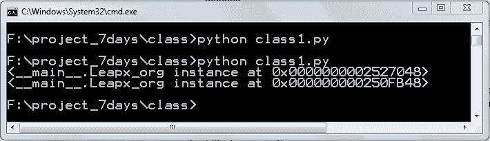

程序 class1.py 的输出

在前面的截图中，你可以看到 `Leapx_org` 类的两个实例在内存中的不同位置。

# 实例变量

实例变量指的是对实例（对象）独有的数据。让我们创建一个实例变量。我们将编写一个新的 `class2.py` 程序：

```py
class Leapx_org():
  pass
L_obj1 = Leapx_org()
L_obj2 = Leapx_org() 
L_obj1.f_name = "Mohit"
L_obj1.L_name = "RAJ"
L_obj1.pamount = "60000"
L_obj2.f_name = "Ravender"
L_obj2.L_name = "Dahiya"
L_obj2.pamount = "70000"
print L_obj1.f_name+ " "+ L_obj1.L_name
print L_obj2.f_name+ " "+ L_obj2.L_name

```

在前面的代码中，`L_obj1.f_name`、`L_obj1.L_name` 和 `L_obj1.pamount` 是实例变量，它们是 `L_obj1` 实例独有的。同样地，`L_obj2.f_name`、`L_obj2.L_name` 和 `L_obj2.pamount` 是 `L_obj2` 实例的实例变量。

让我们运行代码：

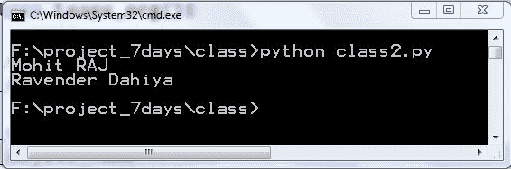

代码 class2.py 的输出

如果我们创建一个实例变量，如代码所示，那么我们就不会从创建类中获得好处。你可以看到两个实例都有可重复的代码。所以我们就不用每次都设置变量。为了使其自动，我们将使用特殊的 `__init__()` 方法。

# `__init__` 方法

`__init__()` 方法必须以两个连续的下划线开始和结束。在这里，`__init__` 作为类的构造函数工作。当用户实例化类时，它会自动运行。让我们通过代码来查看和理解这个概念。这里我们将编写 `classinit.py` 的完整代码，然后我们将逐行理解它：

```py
class Leapx_org():
  def __init__(self,first,last,pay):
    self.f_name = first
    self.l_name = last
    self.pay_amt = pay 
    self.full_name = first+" "+last
L_obj1 = Leapx_org('mohit', 'RAJ', 60000)
L_obj2 = Leapx_org('Ravender', 'Dahiya',70000) 
print L_obj1.full_name
print L_obj2.full_name

```

所以，从前面的代码来看，似乎很难理解；让我们逐行理解它。第一行定义了一个类，正如我们之前所知道的。当我们类内部创建 `__init__(self,first,last,pay)` 方法时，`__init__()` 方法的第一个参数 `self` 自动接收类的实例。按照惯例，我们称之为 `self`，你可以使用另一个名字，但坚持惯例是一个好主意。在声明 `self` 变量之后，我们可以指定我们想要接受的其它参数。所以我们将接受三个值 `first`、`last` 和 `pay`。在 `__init__()` 方法内部，我们将声明实例变量。所以 `self.f_name`、`self.l_name`、`self.pay_amt` 和 `self.full_name` 是实例变量。`self` 变量接收实例。`self.f_name = first` 语句与我们在之前的代码 `class2.py` 中看到的 `L_obj1.f_name = "Mohit"` 是同一个东西。`L_obj` 是类的实例，变量是 `self` 指向类的实例，这在某种程度上是相似的。当我们创建一个实例，如 `L_obj1 = Leapx_org('mohit','RAJ',60000)` 时，值 `('mohit','RAJ',60000)` 会自动传递到 `__init__(self,first,last,pay)` 方法。我们不需要传递 `self` 变量的值，因为 `L_obj1` 实例会自动传递。类似的事情也发生在 `L_obj2` 实例上。如果你对 `self` 和实例变量还有疑问，你可以参考以下图表以获得澄清：

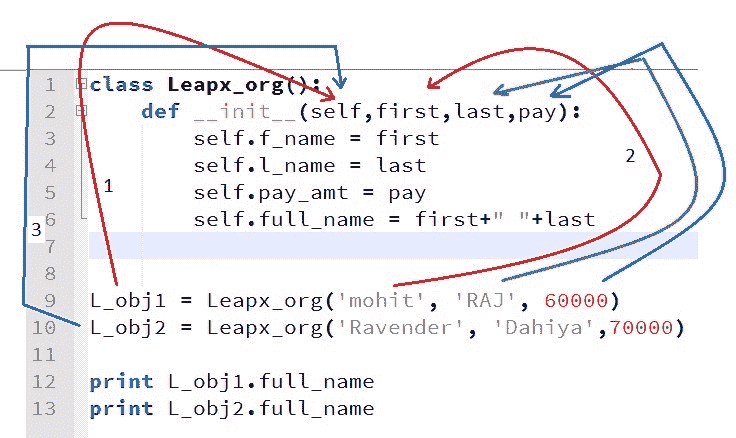

与对象的自关联

现在你已经了解了实例变量：`self.f_name`、`self.l_name`、`self_pay_amt` 和 `self.full_name` 是实例变量，对于实例 `L_obj1` 和 `L_obj2` 是唯一的。例如，`self.f_name`、`self.l_name`、`self_pay_amt` 和 `self.full_name` 包含值 `mohit`、`RAJ` 和 `60000`，例如，`L_obj1` 的 `Ravender`、`Dahiya` 和 `70000`，例如，`L_obj2` 分别。

让我们运行代码：

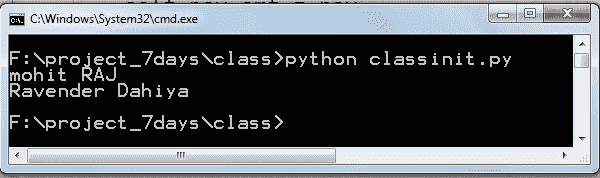

`classinit.py` 类的输出

你可以看到，前面的结果和 `class2.py` 的结果相同。但我们从 `classinit.py` 的代码中减少了几个行。

让我们在类内部创建方法。我们想要一个生成用户电子邮件地址的功能。我们将编写 `classmethod1.py` 的完整代码并讨论它：

```py
class Leapx_org():
  def __init__(self,first,last,pay):
    self.f_name = first
    self.l_name = last
    self.pay_amt = pay 
    self.full_name = first+" "+last
  def make_email(self):
    return self.f_name+ "."+self.l_name+"@xyz.com"
L_obj1 = Leapx_org('mohit', 'RAJ', 60000)
L_obj2 = Leapx_org('Ravender', 'Dahiya',70000) 
print L_obj1.full_name
print L_obj1.make_email()
print L_obj2.full_name
print L_obj2.make_email()

```

代码与之前的代码非常相似。我们在这里添加了 `make_email()` 方法，它使用了实例变量 `self.f_name` 和 `self.l_name`。通过使用 `L_obj1.make_email()` 语法，`L_obj1` 实例调用了 `make_email()` 方法。

`make_email()` 是常规方法。什么是常规方法？类中的常规方法自动将实例作为第一个参数。这就是为什么按照惯例，我们使用 `self` 作为第一个参数，它期望一个实例。

如果你记得，在字符串和列表中，我们做了与在 `list1.append()` 中相同的事情。如果你将列表与前面的类联系起来，那么 `list1` 是实例，`append()` 是类列表的方法。你也可以像下面这样定义列表：

```py
List1 = list()

```

让我们进一步探索 `self` 变量。如果你还有疑问，下一个示例将澄清它。参考 `classmethod2.py` 中的代码如下：

```py
class Leapx_org():
  def __init__(self,first,last,pay):
    self.f_name = first
    self.l_name = last
    self.pay_amt = pay 
    self.full_name = first+" "+last
  def make_email():
    return self.f_name+ "."+self.l_name+"@xyz.com"
L_obj1 = Leapx_org('mohit', 'RAJ', 60000)
print L_obj1.make_email()

```

前面的代码与 `classmethod2.py` 非常相似。为了进行实验，我们只使用了一个实例 `L_obj1`。在 `make_email()` 方法中，已经移除了参数 `self`。让我们运行代码：

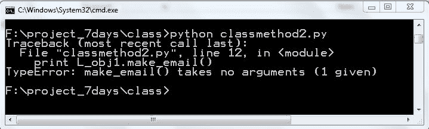

`classmethod2.py` 代码的输出

你可以看到错误 `make_email() takes no arguments (1 given)`。这可能会令人困惑，因为我们没有在语法 `L_obj1.make_email()` 中传递任何参数。`make_email()` 方法期望什么？在这种情况下，`L_obj1` 实例是自动传递的。这就是为什么我们使用 `self` 参数到类的方法中。

让我们看看以下代码 `classmethod3.py` 以更好地理解这一点：

```py
class Leapx_org():
  def __init__(self,first,last,pay):
    self.f_name = first
    self.l_name = last
    self.pay_amt = pay 
    self.full_name = first+" "+last 
  def make_email(self):
    return self.f_name+ "."+self.l_name+"@xyz.com"
L_obj1 = Leapx_org('mohit', 'RAJ', 60000)
print L_obj1.make_email()
print Leapx_org.make_email(L_obj1)

```

在前面的代码中，`self` 变量已经被放入了 `make_email(self)` 方法中。在最后一行，`Leapx_org.make_email(L_obj1)` 表示后台正在运行的内容。语法 `L_obj1.make_email()` 和 `Leapx_org.make_email(L_obj1)` 都是一样的。

语法 `Leapx_org.make_email(L_obj1)` 表示 `class.method(instance)`。在这个语法中，我们传递实例到 `make_email()` 方法，而 `self` 参数接受这个实例。因此，`L_obj1.make_email()` 转换为 `Leapx_org.make_email(L_obj1)`。

# 类变量

类变量是那些在类的所有实例之间可以共享的变量。类变量对于所有实例都必须是相同的。为了通过示例来理解，让我们假设 `leapx_org` 根据 `pay_amt` 提供了 5% 的增量。让我们使用另一种方法来计算增量。参考 `classinstance1.py` 程序：

```py
class Leapx_org():
  def __init__(self,first,last,pay):
    self.f_name = first
    self.l_name = last
    self.pay_amt = pay 
    self.full_name = first+" "+last
  def make_email(self):
    return self.f_name+ "."+self.l_name+"@xyz.com"
  def incrementpay(self):
    self.pay_amt = int(self.pay_amt*1.20)
    return self.pay_amt
L_obj1 = Leapx_org('mohit', 'RAJ', 60000)
L_obj2 = Leapx_org('Ravender', 'Dahiya',70000) 
print L_obj1.pay_amt
print L_obj1.incrementpay()

```

在前面的程序中，有一些新内容。我们添加了 `incrementpay()`，它返回增加的 `pay_amt` 金额。最后一行 `print L_obj1.incrementpay()` 表示 `L_obj1` 实例调用了 `incrementpay()` 方法。让我们运行程序：

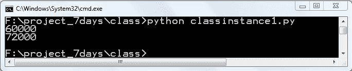

`classinstance1.py` 代码的输出

前面的程序运行成功，但其中大部分内容在逻辑上是错误的。在 `incrementpay()` 方法中，我们使用了乘数 `1.20`，这对于所有实例都是相同的。因此，我们可以将乘数 `1.20` 作为类变量。

让我们编写新的代码 `classinstance2.py` 并进行修改：

```py
class Leapx_org():
    mul_num = 1.20
    def __init__(self,first,last,pay):
       self.f_name = first
       self.l_name = last
       self.pay_amt = pay 
       self.full_name = first+" "+last
   def make_email(self):
       return self.f_name+ "."+self.l_name+"@xyz.com"
   def incrementpay(self):
       self.pay_amt = int(self.pay_amt*self.mul_num)
       return self.pay_amt
L_obj1 = Leapx_org('mohit', 'RAJ', 60000)
L_obj2 = Leapx_org('Ravender', 'Dahiya',70000) 
print L_obj1.pay_amt
print L_obj1.incrementpay()

```

在前面的程序中，我们创建了一个包含值`1.20`的`mul_num`类变量。在`incrementpay()`方法中，我们通过`self`（即实例）来访问`mul_num`类变量。你可以使用`self`或类名与`mul_num`一起使用。如果你使用类名与`mul_num`一起使用，那么它将是`Leapx_org.mul_num`。如果你不使用它们中的任何一个，那么解释器会抛出一个错误。如果你觉得这是一个类变量，那么我们如何通过实例来访问类变量呢？让我们添加一些代码来更好地理解它。在代码的末尾添加以下行：

```py
print L_obj1.mul_num
print L_obj2.mul_num
print Leapx_org.mul_num

```

运行程序并查看输出：

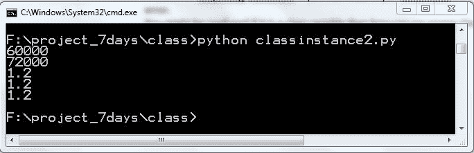

添加了新行的程序`classinstance2`的输出

如你所见，我们正在通过实例`L_obj1`、`L_obj2`和`Leapx_org`类来访问`mul_num`类变量。它们都显示了相同的值`1.2`。那么当我们尝试通过实例访问属性时会发生什么？实例首先检查实例是否包含该属性。如果实例不包含该属性，那么它会检查类或其父类是否包含该属性。因此，实例`L_obj1`和`L_obj2`从类中访问`mul_num`。为了更清晰地说明，你可以查看类和实例的属性。

以下是`classinstance3.py`的完整代码：

```py
class Leapx_org():
   mul_num = 1.20
   def __init__(self,first,last,pay):
        self.f_name = first
        self.l_name = last
        self.pay_amt = pay 
        self.full_name = first+" "+last

   def make_email(self):
       return self.f_name+ "."+self.l_name+"@xyz.com"

   def incrementpay(self):
      self.pay_amt = int(self.pay_amt*self.mul_num)
      return self.pay_amt

L_obj1 = Leapx_org('mohit', 'RAJ', 60000)
L_obj2 = Leapx_org('Ravender', 'Dahiya',70000) 
print "instance space ",L_obj1.__dict__
print "class space ",Leapx_org.__dict__

```

除了最后两行之外，其余代码与上一个类似。`L_obj1.__dict__`语法打印了`L_obj1`实例的所有属性，而`Leapx_org.__dict__`打印了`Leapx_org`类的所有属性。运行程序查看输出：

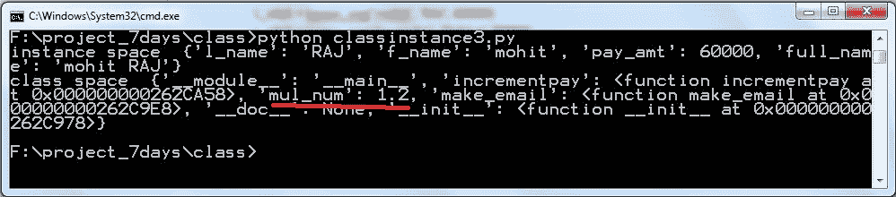

代码`classinstance3.py`的输出

你可以看到，实例命名空间不包含`mul_num`类变量，但类命名空间包含`mul_num`。让我们将`mul_num`添加到`L_obj1`实例的命名空间中。为了避免混淆，我们将编写`classinstance4.py`：

```py
class Leapx_org():
    mul_num = 1.20
    def __init__(self,first,last,pay):
       self.f_name = first
       self.l_name = last
       self.pay_amt = pay 
       self.full_name = first+" "+last

   def make_email(self):
       return self.f_name+ "."+self.l_name+"@xyz.com"

   def incrementpay(self):
       self.pay_amt = int(self.pay_amt*self.mul_num)
       return self.pay_amt

L_obj1 = Leapx_org('mohit', 'RAJ', 60000)
L_obj2 = Leapx_org('Ravender', 'Dahiya',70000) 
L_obj1.mul_num = 1.3

print "instance space L_obj1 n",L_obj1.__dict__
print "ninstance space L_obj2 n",L_obj2.__dict__
print "nclass space n",Leapx_org.__dict__

print L_obj1.mul_num 
print L_obj2.mul_num 
print Leapx_org.mul_num

```

在前面的代码中，第`L_obj1.mul_num = 1.3`行在`L_obj1`实例的命名空间中添加了`mul_num`变量。代码的最后三行打印了实例`L_obj1`、`L_obj2`和`Leapx_org`类的命名空间。让我们运行代码：

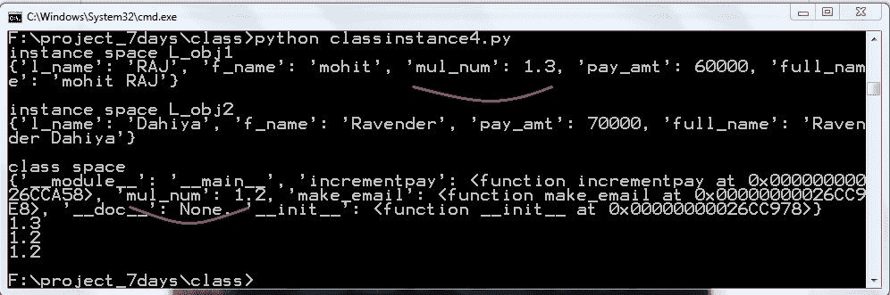

代码`classinstance4.py`的输出

上述输出显示，`L_obj1`实例首先在其自己的命名空间中找到`mul_num`，然后再在类命名空间中搜索。这就是为什么`L_obj1`显示`1.3`的原因。我们没有设置`mul_num`，例如`L_obj2`，所以`L_obj2`仍然从类命名空间中获取值。在`incrementpay()`方法中，我们使用`self.mul_num`而不是`Leapx_org.mul_num`，因为`self.mul_num`赋予我们改变`mul_num`值的单例能力，如果需要的话。让我们再创建一个类变量来计算员工数量。

让我们看看下一份代码`classinstance5.py`：

```py
class Leapx_org():
    mul_num = 1.20
    count= 0
    def __init__(self,first,last,pay):
        self.f_name = first
        self.l_name = last
        self.pay_amt = pay 
        self.full_name = first+" "+last
        Leapx_org.count = Leapx_org.count+1

    def make_email(self):
        return self.f_name+ "."+self.l_name+"@xyz.com"

    def incrementpay(self):
        self.pay_amt = int(self.pay_amt*self.mul_num)
        return self.pay_amt

L_obj1 = Leapx_org('mohit', 'RAJ', 60000)
L_obj2 = Leapx_org('Ravender', 'Dahiya',70000) 
L_obj3 = Leapx_org('Bhaskar', 'DAS',70000)
print "Number of Employees are : ", Leapx_org.count

```

之前我们创建了新的类变量 count，并初始化为 `0`。语法 `Leapx_org.count = Leapx_org.count+1` 会将类变量增加一。我们创建了三个实例。每次我们创建一个新的实例时，`count` 变量都会增加一。让我们看看输出结果：

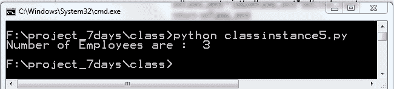

代码 classinstance5.py 的输出

现在你已经理解了类变量的概念。如果你将 `self.count = self.count+1` 而不是 `Leapx_org.count = Leapx_org.count+1`，那么你会得到 `0` 名员工。

# 类继承

在本节中，我们将学习继承。继承允许我们继承父类的方法和属性。通过继承，新的子类会自动获得现有父类的所有方法和属性。语法如下：

```py
class DerivedClassName(BaseClassName):
   <statement-1>
   .
   . .
   <statement-N>

```

如果你记得，在 第十章 *文件处理和异常* 中，我们继承了内置的类异常。从现有代码开始，让我们创建一个 `instructor` 类，它将继承 `Leapx_org` 类的方法。参考 `classinheri1.py` 中的代码：

```py
class Leapx_org():
   mul_num = 1.20
   count= 0
   def __init__(self,first,last,pay):
      self.f_name = first
      self.l_name = last
      self.pay_amt = pay 
      self.full_name = first+" "+last
      Leapx_org.count = Leapx_org.count+1

   def make_email(self):
      return self.f_name+ "."+self.l_name+"@xyz.com"

   def incrementpay(self):
      self.pay_amt = int(self.pay_amt*self.mul_num)
      return self.pay_amt

class instructor(Leapx_org):
      pass
I_obj1 = instructor('mohit', 'RAJ', 60000)
I_obj2 = instructor('Ravender', 'Dahiya',70000) 
print "number of employees ", instructor.count
print I_obj1.make_email()
print I_obj2.make_email()

```

在前面的代码中，我们创建了一个新的类 instructor，它从 `Leapx_org` 类继承方法和属性。`Leapx_org` 类是基类，而 instructor 类是子类。我们留空了 instructor 类的主体。我们创建了 instructor 类的两个实例，然后打印了电子邮件。让我们运行代码：

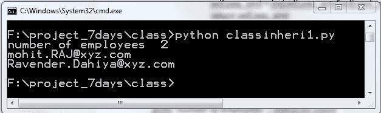

代码 classinheri1.py 的输出

前面的结果表明子类成功访问了父类的属性。当我们实例化 instructor 类时，它首先查找 instructor 类的 `__init__` 方法。由于 instructor 类为空，解释器会检查继承链。如果你想检查继承链，你需要使用 `help()` 函数。在 `classinheri1.py` 代码中添加以下行并运行它：

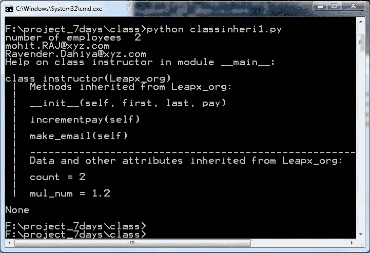

帮助函数的输出

在前面的屏幕截图中，你可以轻松地看到哪些方法、数据和属性是从基类继承的。你可以认为基类是通用类，而子类是特定类。让我们继续更复杂的例子。在 instructor 类中，我们将添加一个额外的功能，即讲师教授哪门课程。为了做到这一点，我们需要在 instructor 类中添加 `__init__` 方法。让我们看看 `classinheri2.py` 代码并讨论添加的内容：

```py
class Leapx_org():
   mul_num = 1.20
   count= 0
   def __init__(self,first,last,pay):
      self.f_name = first
      self.l_name = last
      self.pay_amt = pay 
      self.full_name = first+" "+last
      Leapx_org.count = Leapx_org.count+1

   def make_email(self):
      return self.f_name+ "."+self.l_name+"@xyz.com"

   def incrementpay(self):
      self.pay_amt = int(self.pay_amt*self.mul_num)
      return self.pay_amt

class instructor(Leapx_org):
   def __init__(self,first,last,pay, subject):
   Leapx_org.__init__(self,first,last,pay)
   self.subject = subject

I_obj1 = instructor('mohit', 'RAJ', 60000, "Python")
I_obj2 = instructor('Ravender', 'Dahiya',70000, "Data Analytic") 
print I_obj1.make_email()
print I_obj1.subject
print I_obj2.make_email()
print I_obj2.subject

```

在类父类中，我们创建了一个 `new __init__` 方法，它接受数据 `first`、`last`、`pay` 和 `subject`。现在，没有必要从 `Leapx_org` 基类复制和粘贴 `__init__` 方法的代码。为了获取 `first`、`last` 和 `pay` 参数的数据，我们使用了 `Leapx_org.__init__(self,first,last,pay)` 语法。这个语法将 `first`、`last` 和 `pay` 参数传递给 `Leapx_org` 基类。参数 `first`、`last` 和 `pay` 由 `Leapx_org` 类处理，而 `subject` 参数由类父类处理。

我们创建了两个实例 `I_obj1` 和 `l_obj2`，并将数据传递给父类。让我们运行代码：

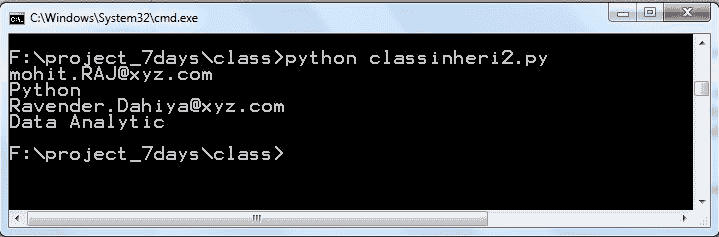

`classinheri2.py` 代码的输出

现在你应该能理解，通过使用这个类，我们可以避免重复大量代码。

# 多重继承

在多重继承中，一个类可以从多个父类继承属性和方法。让我们通过一个简单的例子 `classmultiple.py` 来看看：

```py
class A():
   def sum1(self,a,b):
     c = a+b
     return c
class B():
   def sub1(self,a,b):
     c = a-b 
     return c
class C(A,B):
   pass
c_obj = C()
print "Sum is ", c_obj.sum1(12,4)
print "After substraction ",c_obj.sub1(45,5)

```

在前面的代码中，我们创建了三个类。类 `A` 包含一个 `sum1()` 方法，用于计算两个数字的和。类 `B` 包含一个 `sub1()` 方法，用于计算两个数字的差。类 `C` 是继承自类 `A` 和 `B` 的类。`c_obj` 实例是类 `C` 的实例。语句 `c_obj.sum1(12,4)` 调用类 `A` 的 `sum1()` 方法。`c_obj.sub1(45,5)` 语句调用类 `B` 的 `sub1()` 方法。让我们运行代码 `classmultiple.py`：

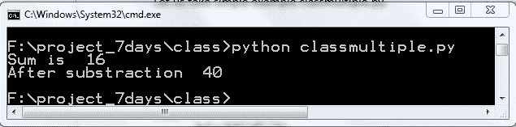

`classmultiple.py` 程序的输出

前面的输出显示程序正在成功运行。

# 多级继承

在这种继承类型中，一个类可以继承自子类或派生类。让我们通过一个简单的例子代码 `classmultilevel.py` 来理解：

```py
class A():
  def sum1(self,a,b):
    c = a+b
    return c

class B(A):
  pass

class C(B):
  pass

c_obj = C()
print "Sum is ", c_obj.sum1(12,4)

```

在前面的例子中，你可以看到类 `B` 从类 `A` 继承，类 `C` 从类 `B` 继承。类 `C` 的实例可以调用类 `A` 的方法。让我们看看输出：

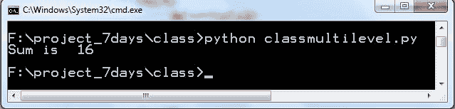

`classmultilevel.py` 代码的输出

前面的输出显示代码正在成功运行。

# 方法重写

重写方法允许用户重写父类方法。有时类提供了一个通用方法，但在子类中，用户希望有一个特定实现的方法。方法名必须在父类和子类中相同。

让我们看看程序 `classover1.py`：

```py
class A():
  def sum1(self,a,b):
    print "In class A"
    c = a+b
    return c

class B(A):
  def sum1(self,a,b):
    print "In class B"
    c= a*a+b*b
    return c

b_obj = B()
print B.__dict__
print b_obj.sum1(4,5)

```

在前面的例子中，类 `A` 和 `B` 都有一个相同的方法 `sum1()`，但实现不同。我们还使用 `B.__dict__` 打印了类名空间。让我们看看代码的输出：

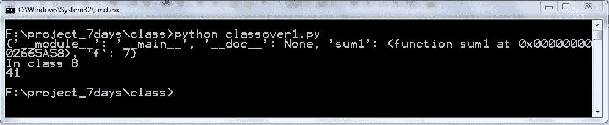

`classover1.py` 代码的输出

在前面的输出中，你可以看到 `sum1` 函数。解释器首先检查实例的类名空间：如果找到了方法，解释器就使用它。

# 运算符重载

在本节中，我们将学习使用特殊方法进行操作符重载。通常，人们称它们为魔法方法。我们将使用这些方法进行操作符重载。首先，让我们了解什么是操作符重载。使用特殊方法，我们可以改变运算符的内置行为。特殊方法由双下划线（`__`）包围。有些人称之为 dunder 方法。以下是一个`+`运算符的例子，如下所示：

```py
>>> "M"+"R"
'MR'
>>> 4+6
10
>>>

```

你可以看到`+`运算符的不同行为。整数相加，字符串连接。根据你正在处理的对象，`+`运算符有不同的行为。然而，`+`调用是一个在后台运行的特殊方法。为了进行两个整数的加法，`+`运算符会调用`int.__add__(1,2)`，对于字符串加法`+`会调用`str.__add__(“a”, “b”)`。参考以下示例：

```py
>>> int.__add__(4,6)
10
>>> str.__add__("M","R")
'MR'
>>>

```

因此，我们可以使用`__add__()`方法来自定义加法。以下是一个类似之前代码片段的例子`classoperator1.py`：

```py
class Leapx_org():
   def __init__(self,first,last,pay):
      self.f_name = first
      self.l_name = last
      self.pay_amt = pay 
      self.full_name = first+" "+last

   def make_email(self):
      return self.f_name+ "."+self.l_name+"@xyz.com"

L_obj1 = Leapx_org('mohit', 'RAJ', 60000)
L_obj2 = Leapx_org('Ravender', 'Dahiya',70000) 
print L_obj1+L_obj2

```

我们将添加两个实例`L_obj1`和`L_obj2`。让我们看看输出结果：

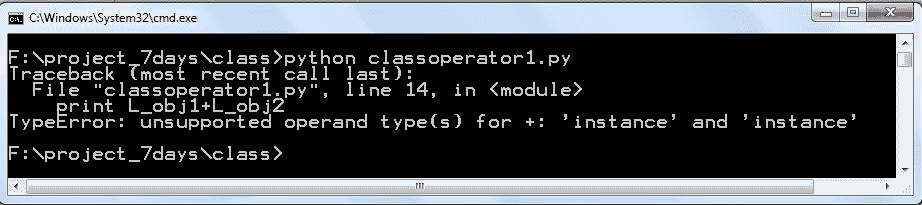

`classoperator1.py`代码的输出

上述输出显示了代码中的错误。对于`+`运算符`L_obj1`和`L_obj2`是不支持的。我们不知道我们想要从加法中得到什么。假设我们想要将两个实例的工资总额相加。当我使用`obj1+L_obj2`时，`+`运算符应该加上工资总额，即*60000+70000*。让我们参考程序并看看如何重载`+`运算符：

```py
class Leapx_org():
   def __init__(self,first,last,pay):
     self.f_name = first
     self.l_name = last
     self.pay_amt = pay 
     self.full_name = first+" "+last

   def make_email(self):
     return self.f_name+ "."+self.l_name+"@xyz.com"

   def __add__(self,other):
     result = self.pay_amt+ other.pay_amt
     return result
L_obj1 = Leapx_org('mohit', 'RAJ', 60000)
L_obj2 = Leapx_org('Ravender', 'Dahiya',70000) 
print L_obj1+L_obj2

```

前面的程序与上一个程序相同，只是多了`magic __add__()`方法。当我们使用`L_obj1+L_obj2`时，`+`运算符会调用`__add__()`方法。`__add__()`方法接受两个实例作为参数。语法`result = self.pay_amt+ other.pay_amt`表示将两个实例的`pay_amt`相加，在我们的例子中是`L_obj1`和`L_obj2`。让我们看看输出结果：

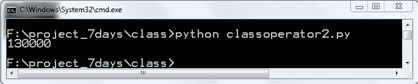

`classoperator2.py`的输出

让我们再写一个程序，这个程序比较两个实例的`pay_amt`。以下是`classoperator3.py`的代码：

```py
class Leapx_org():
   def __init__(self,first,last,pay):
      self.f_name = first
      self.l_name = last
      self.pay_amt = pay 
      self.full_name = first+" "+last

   def make_email(self):
      return self.f_name+ "."+self.l_name+"@xyz.com"

   def __gt__(self,other):
      return self.pay_amt>=other.pay_amt

L_obj1 = Leapx_org('mohit', 'RAJ',60000)
L_obj2 = Leapx_org('Ravender', 'Dahiya',70000) 
print L_obj1>L_obj2

```

在前面的程序中，最后的语句`L_obj1>L_obj2`会调用接受两个实例的`__gt__()`方法；在这个方法中，我们根据它们的`pay_amt`进行比较。让我们看看输出结果：

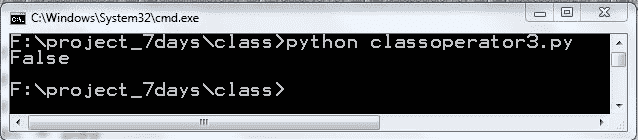

`classoperator3.py`程序的输出

使用不同的`pay_amt`值进行实验。

让我们使用相同的程序并打印实例长度和实例。请参考`classoperator4.py`的代码：

```py
class Leapx_org():
   def __init__(self,first,last,pay):
      self.f_name = first
      self.l_name = last
      self.pay_amt = pay 
      self.full_name = first+" "+last

   def make_email(self):
      return self.f_name+ "."+self.l_name+"@xyz.com"

L_obj1 = Leapx_org('mohit', 'RAJ',60000)
print L_obj1
print "n"
print "Lenght is ",len(L_obj1)

```

在前面的代码中，我们打印了实例及其长度。让我们看看输出结果：

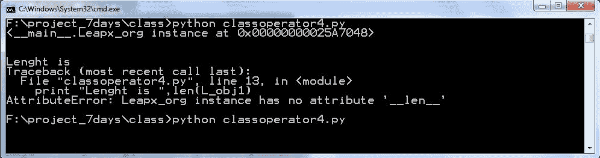

`classoperator4.py`代码的输出

我们需要使用两个魔术方法：为了自定义实例打印，我们将使用`__str__()`，为了找出长度，我们将使用`__len__()`。对于`__len__()`方法，我们将使用全名的长度。参见代码`classoperator5.py`：

```py
class Leapx_org():
    def __init__(self,first,last,pay):
        self.f_name = first
        self.l_name = last
        self.pay_amt = pay 
        self.full_name = first+" "+last

    def make_email(self):
        return self.f_name+ "."+self.l_name+"@xyz.com"

    def __str__(self):
        str1 = "instance belongs to "+self.full_name
        return str1

    def __len__(self):
        return len(self.f_name+self.l_name)

L_obj1 = Leapx_org('mohit', 'RAJ',60000)
print L_obj1
print "n"
print "Lenght is ",len(L_obj1)

```

如前所述，我们需要使用两种方法：一个是`__str__()`，另一个是`__len__()`。我们使用了自定义输出`instance is belong to`。`__len__()`函数返回第一个名字和第二个名字的组合长度。参考输出：

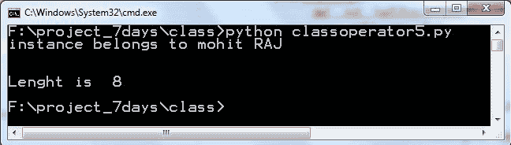

代码 classoperator5.py 的输出

哈哈！所以我们的两个目的都达到了，即自定义输出和打印实例的长度。我希望您已经了解了如何使用运算符重载和魔术方法。

# 类方法

您已经看到了类的常规方法。常规方法自动接受一个实例作为第一个参数，并且按照惯例，我们将其称为`self`。我们如何将类作为参数传递，以便我们可以在方法中更改类变量？为了做到这一点，我们使用类方法。类方法接受类作为第一个参数。要将常规方法转换为类方法，我们将在方法的顶部使用装饰器（`@classmethod`）。让我们看看`methodclass1.py`的示例：

```py
class Leapx_org():
    mul_num = 1.20
    def __init__(self,first,last,pay):
       self.f_name = first
       self.l_name = last
       self.pay_amt = pay 
       self.full_name = first+" "+last

    def make_email(self):
       return self.f_name+ "."+self.l_name+"@xyz.com"

    def incrementpay(self):
       self.pay_amt = int(self.pay_amt*self.mul_num)
       return self.pay_amt

    @classmethod
    def mul_num_set(cls, amt):
       cls.mul_num=amt

L_obj1 = Leapx_org('mohit', 'RAJ', 60000)
L_obj2 = Leapx_org('Ravender', 'Dahiya',70000)
Leapx_org.mul_num_set(1.40)
print L_obj1.mul_num
print L_obj2.mul_num

```

在前面的程序中，有几个新事物。常规方法`mul_num_set()`已经被装饰器`@classmethod`在顶部转换为类方法。在`mul_num_set(cls,amt)`方法中，第一个参数`cls`代表类。按照惯例，我们使用`cls`。不要使用`class`作为参数，因为`class`是关键字，使用它来定义一个类。语法`cls.mul_num=amt`将`mul_num`类变量设置为`amt`值，该值通过`Leapx_org.mul_num_set(1.40)`这一行传递。`Leapx_org.mul_num_set(1.40)`这一行使用类调用类方法`mul_num_set()`。您也可以使用实例来调用类方法，如`L_obj1.mul_num_set(1.40)`所示：

让我们运行程序：

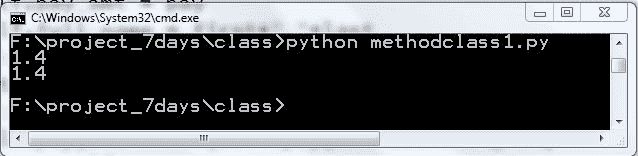

程序方法 class1.py 的输出

同样，可以使用`Leapx_org.mul_num= 1.40`这一行实现相同的效果。但在这里我们使用了类方法。

# 静态方法

静态方法不接收实例或类作为第一个参数。它们只是简单的函数。但我们将它们包含在类中，因为它们与类有一定的逻辑联系。考虑`methodclass1.py`程序中的情况，当一个人的工资少于`50000`时，增加的工资金额将是工资金额的`1.30`倍，否则是`1.20`倍。要将常规方法转换为类方法，我们将在方法的顶部使用装饰器（`@staticmethod`）。

让我们编写程序：

```py
class Leapx_org():
   mul_num = 1.20
   mul_num2 = 1.30
   def __init__(self,first,last,pay):
      self.f_name = first
      self.l_name = last
      self.pay_amt = pay 
      self.full_name = first+" "+last
   @staticmethod
   def check_amt(amt):
      if amt <50000:
         return True
      else :
         return False
   def incrementpay(self):
      if self.check_amt(self.pay_amt):
         self.pay_amt = int(self.pay_amt*self.mul_num2)
      else :
         self.pay_amt = int(self.pay_amt*self.mul_num)
         return self.pay_amt

L_obj1 = Leapx_org('mohit', 'RAJ', 40000)
L_obj2 = Leapx_org('Ravender', 'Dahiya',70000)
L_obj1.incrementpay()
L_obj2.incrementpay()
print L_obj1.pay_amt
print L_obj2.pay_amt

```

在前面的程序中，`check_amt()`方法是一个静态方法，这是通过装饰器`@staticmethod`指定的。`check_amt()`方法检查`amt`是否大于`50000`。`incrementpay()`方法使用了`check_amt()`静态方法。`check_amt()`方法不会改变类和实例变量。但它与常规方法`incrementpay()`有一些逻辑联系。

参考以下输出：

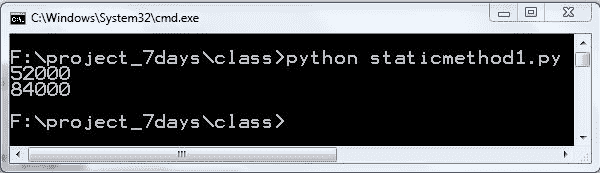

程序 staticmethod1.py 的输出

希望你理解了静态方法。

# 私有变量

Python 没有真正的私有方法，所以两个下划线在开头使变量和方法变为私有。让我们看一个非常简单的例子：

```py
class A:
     __amount = 45
    def __info(self):
        print "I am in Class A"
    def hello(self):
        print "Amount is ",A.__amount
a = A()
a.hello()
a.__info()
a.__amount

```

在前面的程序中，`__info()`是私有方法，`__amount`是私有变量。让我们看看输出：

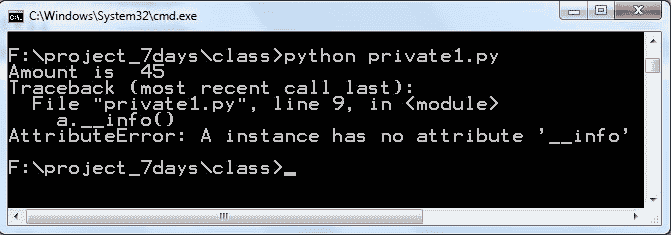

程序 private1.py 的输出

你可以看到私有变量的好处。在类外部，你不能访问私有方法以及私有变量，但在类内部，你可以访问私有变量。在`hello()`方法中，`__amount`变量可以像输出中所示那样访问（`Amount is printed`）。

然而，你可以从类外部访问私有变量和私有方法。使用类似`instance `_class-name__private-attribute`的语法。

现在，让我们用正确的语法重写程序：

```py
class A:
    __amount = 45

    def __info(self):
       print "I am in Class A"

    def hello(self):
       print "Amount is ",A.__amount

a = A()
a.hello()
a._A__info()
print a._A__amount

```

让我们看看输出：

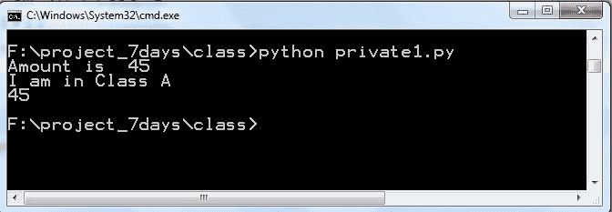

程序 private1.py 的输出

那么在类外部访问私有变量的好处是什么？好处是防止类方法和变量被他人意外更改。希望你能理解私有方法的概念。

# 概述

在本章中，我们学习了什么是类以及创建类的益处。我们学习了如何创建一个实例或对象。实例和对象是同一件事物。我们学习了类变量和实例变量之间的区别。类变量可以在所有常规方法之间共享。静态方法仅对实例是唯一的。在类继承中，我们学习了继承和代码重用的好处。通过使用方法重写，我们可以覆盖父类的方法。在运算符重载中，我们学习了如何改变内置运算符的行为。我们学习了为什么要创建静态方法和类方法。类方法是为了改变类属性而创建的。最后，我们学习了私有方法和私有变量的好处。
