# 第一章：开发简单应用

Python 是最广泛使用的动态编程语言之一。它支持丰富的包、GUI 库和 Web 框架，使您能够构建高效的跨平台应用。它是快速应用开发的理想语言。这种快速的开发往往伴随着自己的负担，可能会降低代码的整体质量、性能和可扩展性。本书将向您展示如何处理这种情况，并帮助您开发更好的 Python 应用。关键概念将通过命令行应用进行解释，这些应用将在后续章节中逐步改进。

本章将是一个入门章节。它将作为 Python 编程的复习。话虽如此，我们假设您对 Python 语言以及**面向对象编程**（**OOP**）概念有所了解。

本章节的组织结构如下：

+   我们将从安装必备条件开始，并为 Python 开发设置一个合适的环境。

+   为了为本书的其余部分定下基调，下一节将简要介绍本书的**高幻想主题**。

+   接下来是第一个程序。它是一个简单的基于文本的幻想游戏，以 Python 脚本的形式呈现。

+   我们将向这个游戏添加一些复杂性，并使用简单的函数开发游戏的增量版本。

+   在继续前进之前，我们将添加更多功能到游戏中，并通过应用 OOP 概念重新设计代码。

+   最后一个主题将简要介绍 Python 中的**抽象基类**（**ABCs**）。

代码解释将稍微详细一些。有经验的读者可以快速浏览示例并进入下一章，但请确保理解本书的主题并回顾`ch01_ex03.py`文件中的代码。在接下来的几章中，您将学习逐步改进此代码的技术。

# 重要准备工作笔记

在深入本章的其余部分之前，让我们先做一些准备工作。如果您还没有做，您应该阅读*前言*，它记录了以下大部分内容：

+   每个章节都将有自己的 Python 源文件集。虽然我们将讨论大部分代码，但您应该手头保留相关文件。

+   源代码可以从 Packt Publishing 网站下载。遵循*前言*中提到的说明。

+   本书中的代码与 Python 版本 3.5.1 兼容。支持代码包还提供了与版本 2.7.9 兼容的文件。

+   如前所述，我们假设您熟悉 Python 语言的基础知识，并且了解 OOP 概念。

+   本书采用有趣、基于文本的游戏主题作为解释各种应用开发方面的载体。然而，本书本身并不是关于开发游戏应用的！

+   练习的解答（如果有）通常不会提供。

+   本书提供了几个外部链接（URL）供进一步阅读。随着时间的推移，其中一些链接可能会损坏。如果发生这种情况，请尝试使用适当的搜索词在网络上搜索。

# 安装先决条件

确保我们已经安装了先决条件。以下是一个表格，总结了本章及以后所需的基本工具；更详细的安装说明将在下一节中提供：

| 工具 | 备注 |
| --- | --- |
| Python 3.5 | 本书中的代码与版本 3.5 兼容。请参阅下一表以获取可用的 Python 发行版。支持代码捆绑还提供与 2.7.9 兼容的文件。 |
| **pip**（Python 的包管理器） | pip 已经在 3.5 和 2.7.9 版本的官方发行版中提供。 |
| **IPython** | 可选安装。IPython 是一个增强型 Python 解释器。 |
| **集成开发环境（IDE**） | 使用 Python 编辑器或您选择的任何 IDE。本章后面将列出一些好的 IDE。 |

在后续章节中，我们需要安装一些额外的依赖项。Python 包管理器（pip）将使这项任务变得简单。

### 小贴士

您已经设置了所需的 Python 环境，或者知道如何设置吗？只需跳过下面的设置说明，继续到 *本书主题* 部分，那里才是真正的行动开始的地方！

## 安装 Python

安装 Python 有两种选择。您可以使用官方 Python 版本或免费提供的捆绑发行版之一。

### 选项 1 – 官方发行版

对于 Linux 或 Mac 用户，Python 可能已经安装在您的系统上。如果没有，您可以使用操作系统的包管理器进行安装。Windows 操作系统用户可以从官方 Python 网站下载 Python 安装程序来安装 Python 3.5：

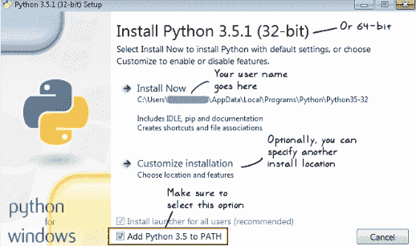

在安装过程中，只需确保选择将 Python 3.5 添加到系统环境变量 `PATH` 的选项，如前面的截图所示。您还可以访问官方 Python 网站 [`www.python.org/downloads`](https://www.python.org/downloads)，以获取特定平台的发行版。

### 选项 2 – 捆绑发行版

或者，还有几个免费提供的 Python 捆绑发行版，它们将一些有用的 Python 软件包捆绑在一起，包括 pip 和 IPython。以下表格总结了最流行的几个 Python 发行版，包括官方发行版：

| 发行版 | 支持的平台 | 备注 |
| --- | --- | --- |
| 官方 Python 发行版[`www.python.org`](https://www.python.org) | Windows, Linux, Mac |

+   免费提供

+   2.7.9 和 3.5 版本默认包含 pip

|

| Anaconda[`continuum.io`](http://continuum.io) | Windows, Linux, Mac |
| --- | --- |

+   免费提供

+   包含 pip、IPython 和 Spyder IDE

+   主要捆绑科学、数学、工程和数据分析的软件包

|

| Enthought Canopy Express[`www.enthought.com/canopy-express/`](https://www.enthought.com/canopy-express/) | Windows, Linux, Mac |
| --- | --- |

+   免费提供

+   包含 pip 和 IPython

+   集成 Python 代码编辑器和应用程序开发平台

|

| Python(x, y)[`python-xy.github.io/`](https://python-xy.github.io/) | Windows |
| --- | --- |

+   免费提供

+   包含 pip、IPython 和 Spyder IDE

|

### Python 安装位置

让我们简要谈谈 Python 的安装路径，以及如何确保`python`在你的终端窗口中作为命令可用。当然，具体取决于你安装的位置和选择的 Python 发行版，情况会有很大差异。

### 小贴士

官方 Python 文档页面提供了在不同平台上设置 Python 环境的详细信息。以下是一个链接，以防你需要进一步的帮助，超出我们已覆盖的内容：[`docs.python.org/3/using/index.html`](https://docs.python.org/3/using/index.html)。

#### 类 Unix 操作系统

在类似于 Linux 的 Unix 操作系统上，默认位置通常是`/usr/bin/python`或`/usr/local/bin/python`。

如果你使用操作系统的包管理器安装 Python，`python`或`python3`命令应该在终端窗口中可用。如果不是，你需要更新`PATH`系统环境变量，包括 Python 可执行文件的目录路径。例如，如果你有一个**Bash** shell，将以下内容添加到你的用户主目录中的`.bashrc`文件：

```py
export PATH=$PATH:/usr/bin/

```

用你的 Python 安装的实际路径替换`/usr/bin`。

#### Windows 操作系统

在 Windows 操作系统上，默认的 Python 安装路径通常是以下目录：`C:\Users\name\AppData\Local\Programs\Python\Python35-32\python.exe`。将`name`替换为你的 Windows 用户名。根据你的安装程序和系统，Python 目录也可以是`Python35-64`。如前所述，在安装时，你应该选择**将 Python 3.5 添加到 PATH**选项，以确保`python`或`python.exe`自动被识别为命令。或者，你可以仅选择此选项重新运行安装程序。

### 验证 Python 安装

在 Windows 操作系统的终端窗口（或命令提示符）中输入以下命令以验证 Python 版本。如果 Python 已安装并且作为终端窗口中的命令可用，则此命令将生效。否则，指定 Python 可执行文件的完整路径。例如，在 Linux 上，如果 Python 安装在`/usr/bin`，你可以指定为`/usr/bin/python`：

```py
$ python -V 

```

### 小贴士

注意，上一条命令行中的`$`符号属于终端窗口，不是命令本身的一部分！换句话说，实际命令只是`python -V`。在终端窗口中，`$`或`%`符号是 Linux 上普通用户的提示符。对于 root（管理员）用户，符号是`#`。同样，在 Windows 操作系统上，相应的符号是`>`。你将在该符号之后输入实际命令。

以下只是示例输出，如果我们运行前面的命令：

```py
[user@hostname ~]$ python -V
Python 3.5.1 :: Anaconda 4.0.0 (64-bit)

```

### 安装 pip

pip 是一个软件包管理器，它使得从官方第三方软件仓库 **PyPI** 安装 Python 软件包变得非常简单。对于 Python-2 版本 2.7.9 或更高版本和 Python-3 版本 3.4 或更高版本，pip 已经安装。如果你使用的是不同的 Python 版本，请查看[`pip.pypa.io/en/stable/installing`](https://pip.pypa.io/en/stable/installing) 以获取安装说明。

在 Linux 操作系统上，pip 的默认位置与 Python 可执行文件的默认位置相同。例如，如果你有 `/usr/bin/python`，那么 pip 应该可用为 `/usr/bin/pip`。在 Windows 操作系统上，默认的 `pip.exe` 通常如下所示：`C:\Users\name\AppData\Local\Programs\Python\Python35-32\Scripts\pip.exe`。如前所述，将 `name` 替换为你的 Windows 用户名。根据你的安装程序和系统，Python 目录也可以是 `Python35-64`。

### 安装 IPython

这是一个可选安装。IPython 是 Python 解释器的增强版本。如果它还没有包含在你的 Python 发行版中，你可以使用以下命令安装它：

```py
$ pip install ipython 

```

安装完成后，只需在终端中键入 `ipython` 即可启动 IPython 交互式外壳。以下是使用 Anaconda Python 3.5 发行版的 IPython 外壳的截图：

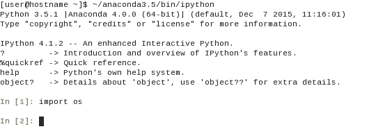

### 小贴士

使用 **Jupyter Notebook** 编写和分享交互式程序通常非常方便。它是一个网络应用程序，它允许在丰富的文本、图像、图表等旁边编写 Python 代码的交互式环境。有关更多详细信息，请查看项目主页[`jupyter.org/`](http://jupyter.org/)。Jupyter Notebook 可以使用以下命令安装：

```py
$ pip install "ipython[notebook]"

```

### 选择 IDE

使用 IDE 进行开发是个人偏好的问题。简单来说，IDE 是一个旨在加速应用程序开发的工具。它通过集成他们最常用的工具，使开发者能够快速编写高效的代码。Python 安装附带了一个名为 **IDLE** 的程序。这是一个基本的 Python IDE，应该能帮助你入门。对于高级开发，你可以从许多免费或商业工具中选择。任何好的 Python IDE 都有以下基本功能：

+   具有代码补全和语法高亮功能的源代码编辑器

+   用于浏览文件、项目、函数和类的代码浏览器

+   用于交互式识别问题的调试器

+   集成版本控制系统，如 **Git**

你可以通过尝试使用一个免费可用的 IDE 来开始。以下是一些流行的 IDE 的部分列表。如果你只对简单的源代码编辑器感兴趣，你可以查看[`wiki.python.org/moin/PythonEditors`](https://wiki.python.org/moin/PythonEditors)，以获取可用的选择列表。

| Python IDE | 备注 |
| --- | --- |
| PyCharm Community Edition[`www.jetbrains.com/pycharm`](https://www.jetbrains.com/pycharm) | 提供免费社区版。是开始 Python 开发的优秀工具！ |
| Wing IDE 101[`wingware.com/downloads/wingide-101`](http://wingware.com/downloads/wingide-101) | 仅限非商业用途免费。提供额外功能的商业版本。另一个优秀的 Python IDE。 |
| Spyder [`pythonhosted.org/spyder`](https://pythonhosted.org/spyder) | 免费且开源。也包含在 Python(x,y)和 Anaconda 等捆绑 Python 发行版中。 |
| Eclipse PyDev[www.pydev.org](http://www.pydev.org) | 免费且开源。 |
| Sublime Text 2 或 Sublime Text 3（beta）[`www.sublimetext.com/2`](http://www.sublimetext.com/2) | 仅限评估目的免费。高度可配置的 IDE。 |

# 本书主题

你读过 J.R.R. Tolkien 的高奇幻小说，如《魔戒》或《霍比特人》吗？或者看过基于这些小说的电影？好吧，这里有一本关于 Python 应用开发的“托尔金式”主题的高奇幻书籍。

### 小贴士

要了解更多关于 J.R.R. Tolkien 的作品，请参阅[`en.wikipedia.org/wiki/J._R._R._Tolkien`](https://en.wikipedia.org/wiki/J._R._R._Tolkien)。术语*高奇幻*常用来表示设定在另一个虚构世界的奇幻主题。更多信息请查看[`en.wikipedia.org/wiki/High_fantasy`](https://en.wikipedia.org/wiki/High_fantasy)。

本书带你进入一个虚构的世界，在那里你将基于上述主题开发一个文本游戏。是的，你甚至在这个虚构世界中也可以继续作为开发者！在本书的过程中，你将伴随着许多虚构角色。当你学习 Python 开发的各个方面时，这些角色会与你交谈，提问，要求新功能，甚至与敌人战斗。

应注意，本书并非关于开发游戏应用。它使用简单的基于文本的游戏作为学习各种开发方面的媒介。

### 小贴士

闲话少说，如果你对玩高奇幻主题游戏感兴趣，有很多可供选择。在开源游戏中，*Battle for Wesnoth* 是评分最高的免费、回合制策略游戏之一，具有高奇幻主题。更多信息请查看[`www.wesnoth.org`](https://www.wesnoth.org)。

## 遇见角色

让我们遇见将在各个章节中陪伴你的虚构角色：

|  | **Sir Foo**一位被描绘为守护南部平原的伟大骑士的人类骑士。他是我们的主角，将在整本书中与我们交谈。 |
| --- | --- |
|  | **Orc Rider**奥克是一种类似人类的人造生物。在这里，它被描绘为敌军士兵。奥克被看到骑在类似野猪的生物上。你将在本章中看到这种生物。 |
|  | **精灵骑士**精灵是一种超自然的神话生物。精灵骑在一匹精灵马上。他被描绘为友好的。你将在第六章，*设计模式*中遇到 Mr. Elf。 |
|  | **仙女**一位具有内在魔法能力的聪明仙女。当她找到她在第七章，*性能识别瓶颈*中找到的魔法护身符时，她会使用她的魔法一次。（见 *O(log n)*）。你将在第六章，*设计模式*中第一次遇见她。 |
|  | **矮人**矮人是一种类似人类的小型神话生物。他被描绘为 Foo 山脉的“伟大的矮人”。他问了很多问题。你将在本书的第二部分看到他，从第六章开始，*设计模式*。 |

以这个有趣的主题为载体，让我们从简单的命令行应用程序开始我们的旅程。这将是一个基于文本的游戏。后续章节中添加的复杂性将挑战你面对有趣的问题。本书将向你展示如何优雅地处理这种情况。

# 简单脚本 – 兽人攻击 v0.0.1

我们已经准备好了所需的工具和环境。现在是时候编写我们的第一个 Python 程序了。它将是一个简单的机会游戏，作为一个命令行应用程序开发。随着我们进一步深入，我们将为游戏添加更多复杂性，并学习新的技术来开发高效的应用程序。所以，准备好行动吧！

## 游戏 – 兽人攻击 v0.0.1

| *人类与其宿敌，兽人之间的战争即将爆发。一支庞大的兽人军队正向人类定居点进发。他们几乎摧毁了他们所经过的一切。人类种族的伟大国王们携手合作，为了他们时代的伟大战役，击败他们最凶恶的敌人。人们被召集加入军队。Foo 爵士，一位勇敢的骑士，负责守卫南部的平原，开始了一段漫长的东行之旅，穿过一片未知的茂密森林。在两天两夜的谨慎行进中，他穿过茂密的树林。在路上，他发现了一个小型的孤立定居点。疲惫不堪，希望补充他的食物储备，他决定绕道而行。当他接近村庄时，他看到了五座小屋。周围看不到任何人。犹豫不决，他决定进入一座小屋...* |
| --- |


## 问题陈述

你正在设计一个简单的游戏，玩家需要为 Foo 爵士选择一座小屋。小屋可能被朋友或敌人随机占据，也可能有些小屋是空的。如果选中的是敌人的小屋，玩家就会失败。在其他两种情况下，玩家获胜。

## 模拟代码 – 版本 0.0.1

既然目标已经明确，打开您最喜欢的编辑器并记下主要步骤。这有时被称为伪代码。

当用户希望继续玩游戏时：

+   打印游戏任务

+   创建一个`huts`列表

+   随机放置`'enemy'`、`'friend'`或`'unoccupied'`在 5 个小屋中

+   提示玩家选择小屋编号

+   `if enemy`: print `"you lose"`

+   `else`: print `"you win"`

如您所注意到的，代码的关键部分是随机占用五个小屋，要么是敌人，要么是朋友，其余的保持空置。我们如何做到这一点？让我们快速使用 Python 解释器来解决这个问题。如果您已安装 IPython，请启动 IPython 解释器。否则，只需在终端窗口中键入命令`python`即可使用默认的 Python 解释器。首先，我们需要一个 Python 列表来存储所有占用者类型。接下来，我们将使用内置的`random`模块并调用`random.choice`从该列表中随机选择一个元素。此代码在以下屏幕截图中显示：

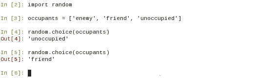

现在，我们只需要编写周围的代码。让我们接下来回顾它。

## 检查代码

从本章提供的补充代码包中下载源代码，`ch01_ex01.py`。文件扩展名，`.py`，表示这是一个 Python 文件。在您选择的 Python 编辑器或 IDE 中打开它。建议您在阅读以下讨论时保留此文件。通常，浏览完整代码更容易理解。观察以下代码片段。这只是上述文件中`if __name__ == '__main__'`条件块内的一小部分代码。

### 小贴士

如果您已安装 Python 2.7.9，支持代码包中提供了一个单独的 Python 2.7.9 兼容源。

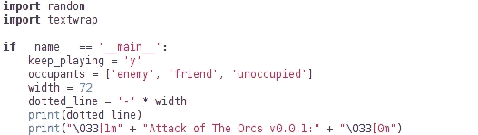

让我们回顾一下前面截图中的代码片段：

+   前两行导入两个内置模块以访问这些模块内提供的功能。`textwrap`模块本质上提供了格式化在命令行上打印的消息的功能。

+   `if`条件块`if __name__ == '__main__'`仅在文件作为独立脚本运行时调用。换句话说，如果您在其他文件中导入此文件，则此条件块内的代码不会执行。

+   现在，让我们看看这个条件块中的代码。首先，我们将初始化一些变量。如前所述，列表`occupants`存储小屋的潜在占用者类型。

+   最后几行只是为了格式化在终端窗口中打印的文本。`dotted_line`是一个字符串，将显示一个由连字符符号组成的 72 个字符长的行。

+   使用 ASCII 转义序列来打印粗体文本。序列`"\0331m"`用于使文本加粗，而`"\033[0m"`用于返回正常打印样式。

接下来的几行代码在控制台中打印有关游戏的更多信息：

![审查代码让我们看看前面截图中的代码：+   变量 `msg` 是一个非常长的字符串。这就是使用 `textwrap` 模块的地方。+   `textwrap.fill` 函数将消息包装成每行 72 个字符，正如我们在代码中指定的 `width`。现在，让我们回顾以下 `while` 循环。### 小贴士对于 Python 2.7.9，在第一个例子中需要做的唯一更改是将所有对内置函数 `input` 的调用替换为 `raw_input`：```py# For Python 2.7 user_choice = raw_input(msg)```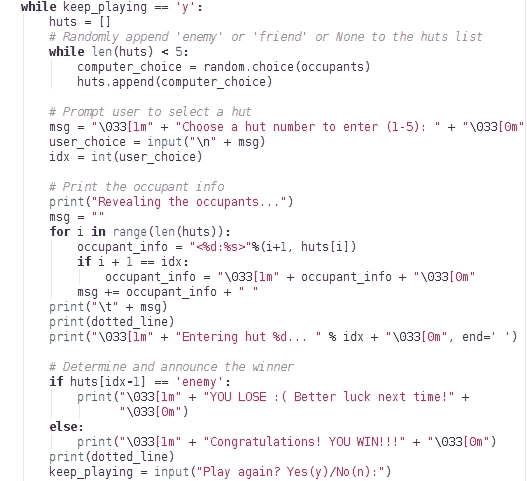

+   这个顶层循环给玩家提供了再次玩游戏的选择。

+   使用 `random.choice`，我们从 `occupants` 列表中的居住者中随机选择一个并添加到 `huts` 列表中。这已经在前面说明了。

+   内置的 `input` 函数接受用户选择的棚屋编号作为整数。`idx` 变量存储一个数字。

接下来，它通过打印相关信息来揭示居住者。最后，通过检查与棚屋编号相对应的列表项来确定获胜者。请注意，`huts` 列表索引从 0 开始。因此，为了检索给定棚屋编号的列表元素 `idx`，我们需要检查 `idx-1` 的列表索引。

## 运行奥克之攻 v0.0.1

假设你已经在系统环境变量中安装了 Python，`PATH`（可用作 `python` 或 `python3`），从命令行运行程序如下：

```py
$ python ch01_ex01.py

```

就这些！只需玩游戏，并尝试通过选择正确的棚屋来救出 Sir Foo！以下是一个 Linux 终端窗口的快照，显示了我们的游戏正在运行：

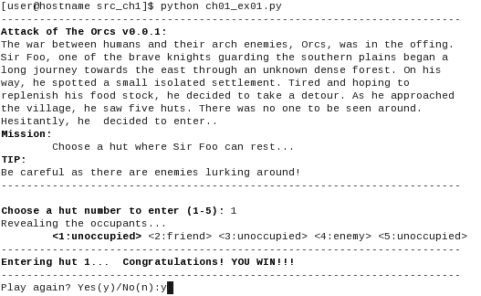

# 使用函数 – 奥克之攻 v0.0.5

在最后一节中，你编写了一套快速指令来创建一个不错的命令行游戏。你让朋友们试玩，他们似乎很喜欢（也许他们只是想表现得友好！）。你收到了第一个关于游戏的特性请求。

| *"我认为这个游戏有很大的发展潜力。关于在游戏的下一个版本中加入战斗怎么样？当 Sir Foo 遇到敌人时，他不应该那么轻易放弃。与敌人战斗！让战斗决定胜负。"-你的朋友* |
| --- |


你喜欢这个想法，并决定在下一个版本中添加这个功能。此外，你还想让它更具交互性。

你为第一个程序编写的脚本很小。然而，随着我们继续添加新功能，它很快就会变成一个维护难题。作为进一步的操作，我们将现有代码封装成小的函数，以便更容易管理。在函数式编程中，通常关注的是函数的排列和它们的组合。例如，你可以使用一组可重用的简单函数构建复杂的逻辑。

## 回顾上一个版本

在添加任何新功能之前，让我们回顾一下您在上一版本（版本 0.0.1）中编写的脚本。我们将识别可以封装成函数的代码块。以下两个代码片段中标记了这样的代码块：

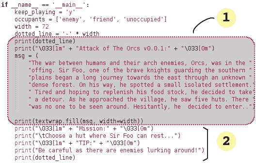

我们将把大部分高亮显示的代码封装成单独的函数，如下所示：

```py
1:  show_theme_message 
2:  show_game_mission 
3:  occupy_huts 
4:  process_user_choice 
5:  reveal_occupants
6:  enter_hut
```

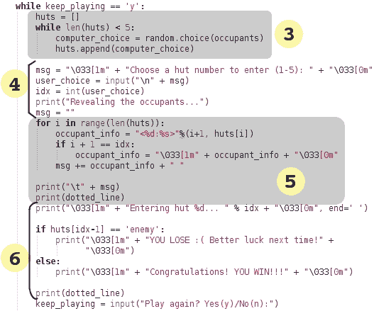

除了这六个代码块之外，我们还可以创建一些顶级函数来处理所有这些逻辑。在 Python 中，使用 `def` 关键字创建函数，后跟括号内的函数名和参数。例如，`reveal_occupants` 函数需要 `huts` 列表的信息。我们还需要可选地传递 `dotted_line` 字符串，如果我们不想在函数中重新创建它。因此，我们将小屋编号 `idx`、`huts` 列表和 `dotted_line` 字符串作为函数参数传递。这个函数可以写成如下所示：

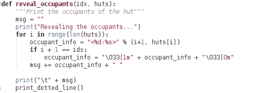

在这项初步工作之后，原始脚本可以被重写为：

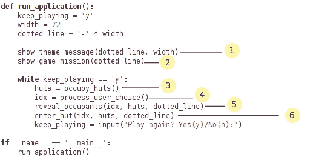

现在阅读起来容易多了。我们刚才所做的也被称为**重构**；关于各种重构技术的更多内容将在后面的章节中介绍。这使得对单个方法的更改变得更加容易。例如，如果您想自定义任务声明或场景描述，您不需要打开主函数 `run_application`。同样，`occupy_huts` 可以进一步扩展，而不会在主代码中造成混乱。

### 小贴士

代码的初始重构版本并不完美。还有很多改进的空间。你能减少传递 `dotted_line` 参数的负担，或者想出其他处理打印粗体文本的方法吗？

## 带有攻击功能的伪代码 – 版本 0.0.5

在上一节中，我们将游戏逻辑封装到单独的函数中。这不仅提高了代码的可读性，还使得维护变得更加容易。让我们继续前进，并将新的 `attack()` 函数包含到游戏中。以下步骤展示了包含攻击功能的游戏逻辑。

当用户希望继续玩游戏时：

+   打印游戏任务

+   创建一个 `huts` 列表

+   在 5 个小屋中随机放置 `'enemy'`、`'friend'` 或 `'unoccupied'`

+   提示玩家选择小屋编号

+   `if` 小屋里有敌人，执行以下操作：

    +   `while` 用户希望继续攻击，使用 `attack()` 方法对敌人进行攻击

        每次攻击后，更新并显示 Sir Foo 和敌人的健康状态；`if enemy health <= 0:` 打印 `"You Win".`

        但是，`if Sir Foo health <= 0:` 打印 `"You Lose".`

+   `else`（小屋里有朋友或为空）打印 `"you win"`

初始时，弗鲁爵士和兽人将拥有满血量。为了量化血量，让我们给这些角色（或游戏单位）分配生命值。所以当我们说角色拥有满血量时，意味着它拥有最大可能的生命值。根据角色不同，默认的生命值数量会有所不同。以下图片显示了弗鲁爵士和兽人默认的生命值，由**生命值**标签指示：

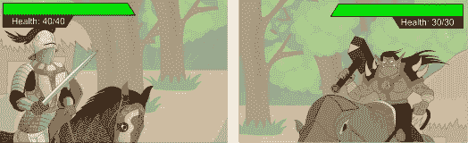

图像中**生命值**标签上方的条形图代表生命值。本质上，它跟踪的是*生命值*。在接下来的讨论中，我们将交替使用生命值和生命值表这两个术语。在战斗中，玩家或敌人可能会受伤。目前，忽略双方都毫发无损逃走的第三种可能性。伤害将减少受伤单位可用的生命值数量。在游戏中，我们将假设在单个攻击回合中只有一个角色被击中。以下图片将帮助您想象这样的攻击回合：

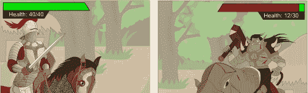

在这里，弗鲁爵士的生命值显示为最大值，而兽人则受到了伤害！


| 嗯，兽人认为他能打败弗鲁爵士！这很有趣。我们先开发游戏，然后再看看谁有更大的胜算！ |
| --- |

在理解了这个问题之后，让我们回顾实现这个功能的代码。

## 审查代码

从章节代码包中下载源文件`ch01_ex02.py`，并浏览代码。关键逻辑将在`attack()`函数中。我们还需要一个数据结构来保存弗鲁爵士和敌人的生命记录。让我们先介绍以下一些处理打印业务的实用函数：

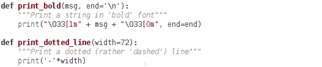

现在，看看主函数`run_application`和辅助函数`reset_health_meter`。除了引入`health_meter`字典外，我们还将游戏逻辑封装在`play_game`中：

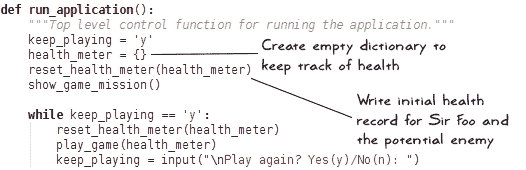

在新游戏开始时，通过调用`reset_health_meter`将`health_meter`字典的值重置为初始值：

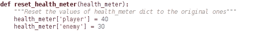

接下来，让我们回顾一下`play_game`函数。如果小屋里有敌人，玩家将被询问是否继续攻击（`while`循环的开始）。根据用户输入，代码将调用`attack`函数或退出当前游戏：

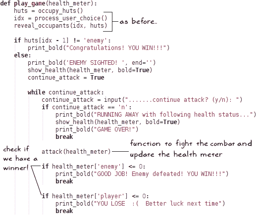

敌人通过交互式的`while`循环反复受到攻击，该循环接受用户输入。执行`attack`函数可能会导致 Sir Foo 或敌人受伤，或者两者都受伤。也有可能没有人受伤。为了简单起见，我们只考虑两种可能性：一次攻击可能会伤害敌人或 Sir Foo。在前一节中，我们使用了内置的随机数生成器来随机确定棚屋的居住者。我们可以使用同样的技术来确定谁会受伤：

```py
injured_unit = random.choice(['player', 'enemy'])
```

| *但是等等。Sir Foo 有话要说：* |
| --- |


我们应该考虑玩家和敌人受伤的可能性。在下面的`attack`函数中，我们将假设大约*60%*的时间敌人会被击中，而剩下的*40%*，Sir Foo 将成为受害者。

最简单的方法是创建一个包含 10 个元素的列表。这个列表应该有六个条目为`'enemy'`和四个条目为`'player'`。然后，让`random.choice`从这个列表中选择一个元素。你总是可以在游戏中引入一个难度级别并改变这种分布：

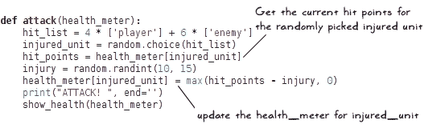

一旦随机选择`injured_unit`，伤害将通过在`10`和`15`之间选择一个随机数字来确定，包括`10`和`15`。在这里，我们使用`random.randint`函数。最后重要的一步是更新受伤单位的`health_meter`字典，减少其生命值。

## 魔兽攻击 v0.0.5

我们已经讨论了这款游戏中最重要的功能。请回顾从下载的文件中获取的其他辅助功能。以下截图显示了游戏的实际运行情况：

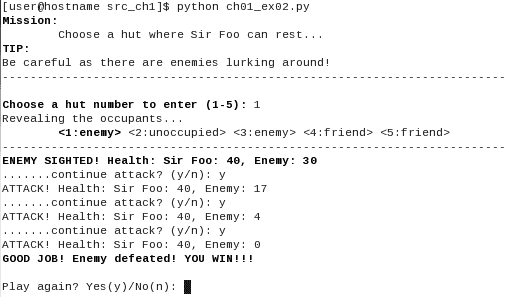

# 使用面向对象编程 – 魔兽攻击 v1.0.0

你在上一款游戏中添加的攻击功能使游戏变得更加有趣。你可以看到一些朋友一次又一次地回来玩游戏。新的功能请求已经开始涌入。

这里是请求的功能的部分列表：

1.  新任务：占领所有棚屋并击败所有敌人。这也意味着游戏开始时就应该揭示棚屋的居住者。

1.  在友好的或未被占用的棚屋中恢复健康的能力。

1.  放弃战斗（或从敌人那里逃跑）的能力。这是一个逃跑、在友好的棚屋中恢复健康并继续战斗的战略举措。

1.  引入一个或多个骑手来协助 Sir Foo。他们可以轮流获得棚屋。理想情况下，这是一个用户可配置的选项。

1.  可配置每个敌人单位和每个骑手的最大生命值。

1.  可配置的总棚屋数量；例如，增加到 10 个。

1.  每个棚屋都可以有一些金币或武器，Sir Foo 和他的朋友们可以捡起。

1.  让一个精灵骑手加入 Sir Foo。他的能力使他有很高的几率在更少的攻击中获胜。

这是一个相当长的列表。你正在制定一个计划。以下是你需要添加到现有代码中以实现一些这些功能的部分列表：

+   跟踪占据各个小屋的多个敌方单位的生命值

+   维护爵士福及其所有伴随骑手的健康记录

+   监控爵士福的军队占领了多少个小屋

+   另一个字典或列表用于跟踪每个小屋中的金币，还有一个用于武器；此外，如果有人想在小屋中放置盔甲怎么办？

+   不要忘记，还有另一个列表，为每个单位接受这些好东西的字典

+   啊！他们想要一个具有自己特性和能力的精灵骑手...不错...感谢你带来的额外麻烦！

这已经是一个很长的列表了。虽然你仍然可以使用函数式编程方法，但随着游戏的演变和新功能的添加，在这种情况下将会变得更加困难。

幸运的是，面向对象编程来拯救我们。我们是否可以让爵士福成为一个`Knight`类的实例？有了这个，应该很容易管理与爵士福相关的参数。例如，一个属性`hitpoints`可以用来跟踪爵士福的健康状况，而不是使用早期示例中的`health_meter`字典。同样，类中的其他属性可以跟踪在占领小屋时收集的金币或武器数量（另一个请求的功能）。

这本书籍之外还有很多内容。这个类中的各种方法可以实现对行为的具体实现，例如攻击、奔跑、治疗等等。伴随爵士福的骑手也可以是这个类`Knight`的实例。或者，你可以创建一个新的类`HorseRider`，用于所有这些接受爵士福命令的单位。

## 优先处理功能请求

对于这个新版本，让我们从早期的列表中挑选一些请求的功能。实际上，爵士福应该是做出这个决定的人：


| *如您所愿，爵士福...我们只会在这个版本中添加新的治疗功能。* |
| --- |

## 问题陈述

现在是明确定义这次发布目标的时候了。你不仅是在你的应用程序中添加新功能，还在对代码进行一些基本的更改，以适应未来的请求。

在这个版本中，任务是占领所有五个小屋。在这里，你将实现一个新的`治疗`功能，以恢复爵士福的全部生命值。你还将实现一些战略控制，例如逃离战斗、在友好的小屋中治疗，然后焕然一新地返回击败敌人。

## 重新设计代码

我们已经讨论过创建`Knight`类将如何帮助简化与爵士福相关的数据处理和其他所有事情，无论是生命值还是他攻击敌人的方式。

还可以划分出哪些其他类？如何将敌人作为一个对象？敌人可以占据多个小屋。记住，我们需要击败所有敌人。想象以下场景：Sir Foo 在编号 2 的小屋中伤害了一个敌人，从而减少了其生命值。然后，他移动到另一个由另一个敌人占据的小屋。现在，我们需要为每个这些敌人单位维护两个独立的生命值计数器。

在未来的版本中，你可以期待用户请求不同的敌人类型，具有攻击或治愈的能力，就像我们对 Sir Foo 所做的那样。因此，在这个阶段，有一个单独的类，其实例代表敌人单位是有意义的。我们将把这个类命名为`OrcRider`。它将具有与`Knight`类相似的属性。然而，为了简单起见，我们不会给敌人提供诸如治愈、改变小屋等能力。

| *Sir Foo 说他很高兴看到敌人被剥夺了一些重要能力。（但你无法看到他头盔后面的笑脸。)* |
| --- |

我们还应该考虑其他事情。到目前为止，`huts`只是一个简单的 Python `list`对象，包含有关占用类型的信息作为字符串。

看到请求的功能列表，我们还需要记录小屋中金币和盔甲的数量，并根据战斗结果更新其居住者。在未来的版本中，你可能还希望显示一些统计数据，例如居住者的历史记录、金币数量的变化等。为此以及更多，我们将创建一个类，`Hut`。

## 描绘整体画面

拿起笔和纸，写下到目前为止讨论的每个类所需的重要属性。在这个阶段，不要担心将它们分类为实例变量或封装执行特定任务指令的类方法。只需写下你认为属于每个类的属性即可。

下面的示意图显示了`Knight`、`Hut`和`OrcRider`类可能具有的属性列表。斜体字中的属性名称表示在本示例中不会实现的潜在属性。但是，在设计阶段始终考虑未来并牢记于心总是好的：

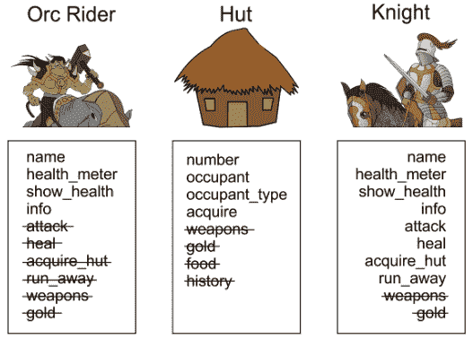

这不是一个完整的规范，但现在我们有一个良好的起点。当 Sir Foo 进入敌人的小屋时，我们可以选择调用`Knight`类的`attack`方法。和以前一样，`attack`方法将随机选择谁会受到伤害，并扣除该角色的生命值。在`Knight`类中，有一个新的属性`enemy`将代表活跃的对手。在这个例子中，`enemy`将是一个`OrcRider`类的实例。

让我们进一步开发这个设计。你注意到`Knight`和`OrcRider`类有几个共同点吗？我们将使用**继承**原则为这些类创建一个超类，并将其命名为`GameUnit`。我们将把共同代码移动到超类中，并让子类覆盖它们想要不同实现的部分。在下一节中，我们将用类似**统一建模语言**（**UML**）的图来表示这些类。

### 伪 UML 表示

下面的图将有助于了解各种组件之间是如何相互通信的：

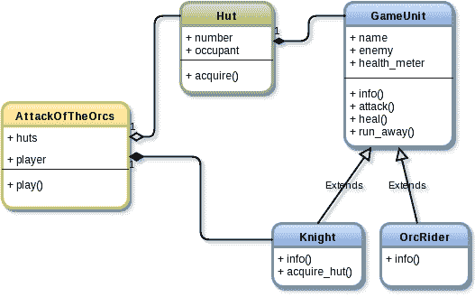

前面的图类似于 UML 表示。它有助于创建软件设计的视觉表示。在这本书中，我们将松散地遵循 UML 表示。让我们称这里使用的图为伪 UML 图（或类似 UML 图）。

### 理解伪 UML 图

对于这里使用的类似 UML 的约定，需要加以解释。我们将用圆角矩形表示图中的每个类。它显示了类名后跟其属性。属性前的加号（**+**）表示它是公共的。受保护的或私有方法通常用负号（**-**）表示。此图中显示的所有属性都是公共属性。因此，你可以选择在每个属性旁边添加一个加号。在后面的章节中，我们将遵循此约定。为了便于说明，只列出了几个相关的公共属性。请注意，我们在此图中使用了不同类型的连接器：

+   带有空三角符号的箭头表示继承；例如，`Knight`类继承自`GameUnit`类

+   带有实心菱形符号的箭头表示**对象组合**，例如，一个`Hut`实例拥有`GameUnit`类（或其子类）的对象

+   带有空菱形符号的箭头表示**对象聚合**

现在，让我们来讨论之前展示的图中的各个组成部分。

`Knight`和`OrcRider`类继承自`GameUnit`。在这种情况下，`Knight`类将覆盖默认方法，如`attack`、`heal`和`run_away`。`OrcRider`类将不会有这样的覆盖方法，因为我们不会赋予敌人这些能力。

`Hut`类将有一个居住者。居住者可以是`Knight`或`OrcRider`的实例，或者如果小屋未被占用，则是`None`类型。图中的实心菱形连接器表示组合。

### 小贴士

**对象组合**

这是一个重要的面向对象编程原则。它意味着一种“拥有”关系。在这种情况下，`Hut`包含，或由，一些其他对象组成，这些对象将被用来执行特定任务。大声说出来；一个`Hut`有一个`Knight`，一个`Hut`有一个`OrcRider`，等等。

除了前面讨论的四个类，我们还将引入另一个类来封装顶层代码。让我们称它为 `AttackOfTheOrcs`。由于有五个小屋，`AttackOfTheOrcs` 类中的一个类方法创建了相应数量的 `Hut` 实例。这是对象聚合，如前图中空菱形箭头所示。

你是否注意到了 `AttackOfTheOrcs` 中的另一个“有”关系？这个类中的 `player` 属性是 `Knight` 类的一个实例，但将来这可能会改变。这种关系由连接 `Knight` 和 `AttackOfTheOrcs` 方框的实心菱形头连接器表示。

## 检查代码

在有了这个高级理解之后，让我们开始编写代码。下载 Python 源文件 `ch01_ex03.py`。我们将在代码中仅审查几个重要方法。请参考此源文件以获取完整代码。

### 小贴士

此示例的代码 `ch01_ex03.py` 全部压缩在一个文件中。这是否是良好的实践？当然不是！随着我们的进行，你将了解最佳实践。本书的后面部分，我们将讨论应用开发的一些重要构建块，即重构、编码标准和设计模式。作为练习，尝试将代码拆分成更小的模块，并添加代码文档。

主要执行代码在此处展示，以及 `AttackOfTheOrcs` 类的一些细节。在 `__init__` 方法中，我们将初始化一些实例变量，稍后更新它们所持有的值。例如，`self.player` 代表游戏开始时 `Knight` 类的实例：

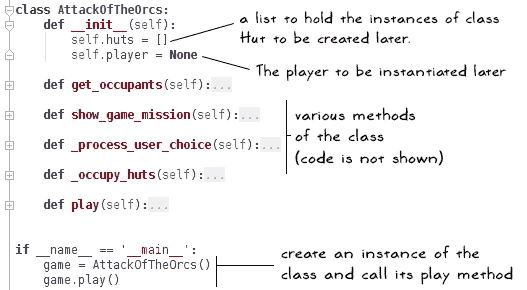

### 小贴士

作为复习，`__init__` 方法在类似于 C++ 这样的语言中类似于构造函数；然而，请注意一些差异。例如，你不能像在这些语言中那样重载 `__init__`。相反，你可以通过使用可选参数或 `classmethod` 装饰器轻松地完成这个任务。我们将在本书的后面部分介绍一些方面。

让我们快速回顾 `play` 和 `_occupy_huts` 方法：

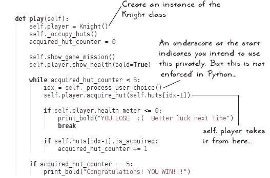

`self.player` 是 `Knight` 类的一个实例。我们将调用此实例的 `acquire_hut` 方法，其中大部分高级动作发生。之后，程序简单地查找玩家的健康参数和敌人的健康参数。它还会查询 `Hut` 实例以查看是否已获取。

在 `_occupy_hut` 方法中，`Hut` 对象被创建并附加到 `self.huts` 列表中。此方法在以下图中展示：

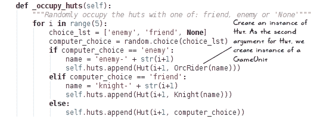

### 注意

**Python 中的公共、受保护和私有**

你会注意到`AttackOfTheOrcs`类的一些方法以下划线开头，例如`_process_user_choice()`。这是一种表示该方法不打算公开使用的方式。它打算在类内部使用。像 C++这样的语言定义了类访问说明符，即`private`、`protected`和`public`。这些用于对类属性的访问进行限制。

在 Python 中不存在这样的东西。它允许通过单个下划线作为`game._process_user_choice()`从外部访问属性。如果属性名以下划线开头，则不能直接调用。例如，你不能直接调用`game.__process_user_choice()`。话虽如此，还有另一种从外部访问此类属性的方法。但让我们不要谈论它。尽管 Python 允许你访问这样的属性，但这并不是一个好的做法！

观察骑士类中的`acquire_hut`方法：

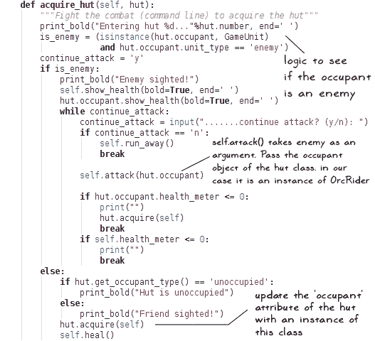

让我们接下来讨论这个方法：

+   首先，我们需要检查小屋的居住者是朋友还是敌人。这由前面的图中的变量`is_enemy`确定。

+   小屋的居住者可以是以下类型之一：`Knight`类的实例、`OrcRider`类的实例，或者设置为`None`。

+   `GameUnit`类及其子类`Knight`和`OrcRider`定义了一个`unit_type`属性。这只是一个设置为`'friend'`或`'enemy'`的字符串。

+   因此，为了确定小屋中是否隐藏着敌人，我们首先检查`hut.occupant`是否是超类`GameUnit`的实例。如果是真的，我们将知道它有一个`unit_type`参数。因此，我们将检查`hut.occupant.unit_type`是否等于`'enemy'`。对于`OrcRider`类，`unit_type`默认设置为`'enemy'`。

+   其余的逻辑很简单。如果居住者是敌人，它会询问用户下一步做什么：攻击或逃跑。

+   `Knight.attack`方法与之前讨论的方法类似。这里的一个变化是我们可以访问受伤单位的`health_meter`属性并更新它。

+   如果`hut.occupant`恰好是`'friend'`或`None`，它将调用`hut.acquire()`。

当调用`Hut.acquire()`方法时会发生什么？以下是`Hut`类的代码片段：

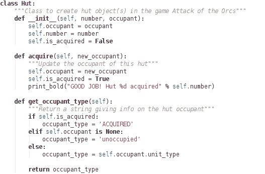

`acquire`方法只是简单地使用传递给此方法的参数更新`occupant`属性。

## 运行兽人攻击 v1.0.0

玩耍时间到了！我们已经回顾了新类中最重要的一些方法。你可以从`ch01_ex03.py`文件中查看其余的代码，或者更好的方法是尝试自己编写这些方法。像之前一样，从命令行运行应用程序。以下截图显示了游戏运行情况：

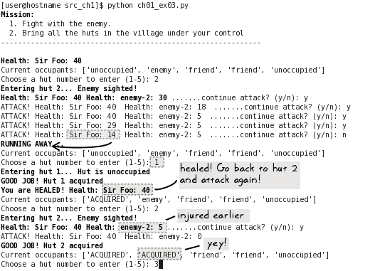

# Python 中的抽象基类

在上一节中，我们使用面向对象的方法重新设计了代码。我们还通过定义超类 `GameUnit` 并从它派生 `Knight` 和 `OrcRider` 子类来演示了继承的使用。作为本章的最后一个话题，让我们来谈谈在 Python 中使用抽象基类。

### 小贴士

本节旨在提供 Python 中 ABC 的基本理解。这里的讨论远非全面，但足以在我们的应用程序代码中实现 ABC。欲了解更多信息，请参阅 [`docs.python.org/3/library/abc.html`](https://docs.python.org/3/library/abc.html) 的 Python 文档。

如果你熟悉像 Java 或 C++ 这样的面向对象语言，你可能已经知道 ABC 的概念。

基类是一个父类，其他类可以从它派生。类似地，你可以有一个抽象基类，并创建继承这个类的其他类。那么，区别在哪里呢？其中一个主要区别是 ABC 不能被实例化。但这并不是唯一的区别。ABC 强制派生类实现该类内部定义的特定方法。关于 ABC 的这些知识应该足够你处理这本书中的示例。更多细节，请参阅上述 Python 文档链接。让我们回顾一个简单的例子，展示如何在 Python 中实现抽象基类以及它与普通基类的区别。`abc` 模块提供了必要的框架。以下代码片段比较了 ABC 的实现与普通基类的实现：


左侧的类 `AbstractGameUnit` 是抽象基类，而右侧的 `GameUnit` 类是一个普通基类。ABC 实现中的三个区别用数字标记，如前面的截图所示。

+   使用 `metaclass=ABCMeta` 参数定义 `AbstractGameUnit` 为一个 ABC。

+   `ABCMeta` 是一个用于定义抽象基类的 **元类**。这是一个广泛讨论的话题，但元类的简化意义如下：要创建一个对象，我们使用一个类。同样，想象一下元类是用于创建类的一种类。

+   Python 的 **装饰器** 提供了一种简单的方法来动态改变方法、类或函数的功能。这是一种特殊的 Python 语法，以一个 @ 符号开始，后跟装饰器名称。装饰器直接放在方法定义之上。

+   `@abstractmethod` 是一个装饰器，它使得下一行定义的方法成为一个抽象方法。

+   抽象方法是 ABC 要求所有子类必须实现的方法。在这种情况下，`AbstractGameUnit`要求其`Knight`子类实现`info()`方法。如果子类没有实现此方法，Python 将简单地不会实例化该子类，并抛出`TypeError`。您可以尝试删除`Knight.info`方法并运行代码来测试这一点。

+   如果`Knight`类继承自一个普通基类，例如`GameUnit`，则没有这样的限制。

### 小贴士

这里展示的代码是为 Python 3.5 版本准备的。对于 2.7 版本，语法有所不同。请参阅支持材料中 Python2 目录下的`ch01_ex03_AbstractBaseClass.py`文件以获取等效示例。

## 练习

在`ch01_ex03.py`文件中，您将看到一些注释。这些注释是故意保留的，以给您一个改进代码部分的机会。此代码中有许多改进的空间。看看您是否可以重写代码的部分，使其更加健壮。如果您更喜欢一个定义明确的问题，这里有一个：

`Knight`和`OrcRider`类继承自`GameUnit`超类。这个练习是将`GameUnit`转换为抽象基类`AbstractGameUnit`。以下是一个为您准备的速查表；以下图中显示的代码骨架是 Python 3.5 的语法。

请参阅`ch01_ex03_AbstractBaseClass.py`文件：

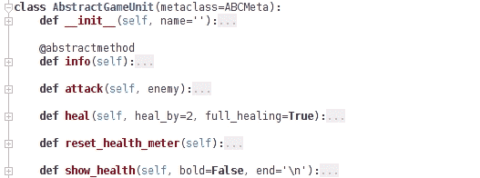

### 小贴士

注意，对于 Python 2.7，此代码有一个单独的版本。请参阅支持代码包中的`src_ch1_Python2`目录。

# 摘要

在本章中，我们简要介绍了 Python 的一些基本概念，以开发一个简单的命令行应用程序。我们首先通过设置 Python 开发环境来装备自己。

我们编写的第一个程序是一个简单的 Python 脚本。我们很快意识到，如果添加更多功能，简单的脚本将很难维护。作为下一步，我们进行了一些重构，并将代码封装在函数中。这提高了代码的可读性，也使其更容易管理。向应用程序引入更多功能使我们重新思考了设计。我们学习了如何将代码转换为面向对象的设计，并实现了这些新功能中的几个。

我们怎能忘记 Sir Foo！他将陪伴我们走过整本书。

代码是否开发得没有错误？您在玩游戏时可能已经注意到了一些问题！在下一章中，我们将看到如何通过处理异常来使应用程序更加健壮。

## 对于电子书阅读器的重要提示

您在这本书中看到的代码示例实际上是图像文件或代码快照。

这些图像的渲染质量将根据您的 PDF 阅读器的页面显示分辨率和缩放级别而有所不同。

如果您在阅读此代码时遇到困难，您可以在您的 PDF 或电子书阅读器中尝试以下操作：

+   将缩放级别设置为 100%

+   使用 96 像素/英寸或类似的页面显示分辨率

如果问题仍然存在，你可以尝试使用不同的分辨率。

你如何设置这个分辨率？这取决于你的电子书阅读器。例如，如果你正在使用 Adobe Reader，请转到**编辑** | **首选项**，然后从左侧面板中选择**页面显示**。你将在右侧面板中看到**分辨率**作为选项。选择**96 像素/英寸**或类似的设置，看看是否有助于更好地渲染图像。
