# 第二章 处理异常

在上一章中，我们从一个简单的命令行脚本开始，逐渐将其转换为面向对象的代码。在这个过程中添加了几个新功能。到目前为止，我们很少关注应用程序质量。我们忽略了在程序执行过程中遇到的任何明显错误。在应用程序运行时检测到的这些错误被称为**异常**。在本章中，你将学习通过处理异常来使应用程序更加健壮的技术。

具体来说，我们将涵盖以下主题：

+   Python 中有哪些异常？

+   使用 `try…except` 子句控制程序流程

+   通过处理异常处理常见问题

+   创建和使用自定义异常类

让我们从回顾用户反馈开始。

# 重新审视《兽人攻击》v1.0.0

在 v1.0.0 中添加的恢复功能在核心用户中非常受欢迎。面向对象的方法使你能够更好地实现新功能（或者你认为如此！）。随着功能请求的涌入，报告的 bug 也越来越多。

| *游戏还可以，但有几个令人烦恼的地方。例如，当被提示选择小屋时，有时我会输入大于 5 的数字或误输入字符。之后，它只打印一些奇怪的错误信息，应用程序就终止了。你能修复这个问题吗？* |
| --- |

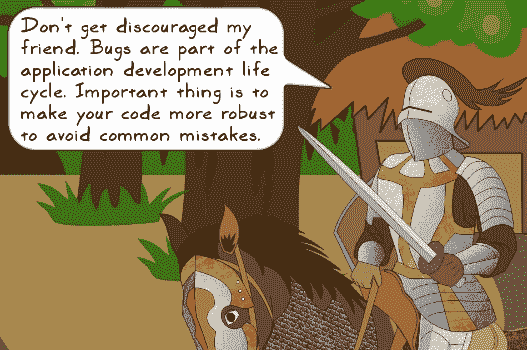

## 调试问题

让我们尝试重现报告的问题。运行来自 第一章 的示例，*开发简单应用程序*：

```py
$ python ch01_ex03.py

```

当提示输入小屋编号时，输入任何字符，如下面的截图所示：

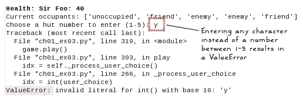

应用程序在控制台中出现错误**跟踪回溯**后被终止。跟踪回溯是在异常（错误）发生时的调用栈快照。在这个特定的例子中，`_process_user_choice` 方法是由 `play` 方法调用的，而 `play` 方法直接从模块中调用。行号显示了这些调用发生的位置。这对于调试很有用。在这种情况下报告的错误是 `ValueError`。它发生是因为我们假设用户选择的是一个整数。另一个报告的问题是当小屋编号不在 1 到 5 的范围内时。收到的跟踪回溯错误是 `IndexError`。它发生在访问用户输入对应的 `huts` 列表条目时：

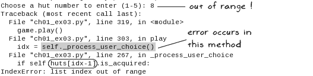

如果你仔细查看两个跟踪回溯，这两个错误都发生在 `AttackOfTheOrcs` 类的 `_process_user_choice` 方法中。让我们回顾一下原始方法：

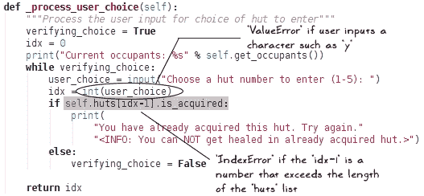

好的！我们已经确定了问题的所在。现在，下一个任务是修复这些错误。

## 修复错误…

| *Sir Foo 对修复错误有一些想法…* |
| --- |

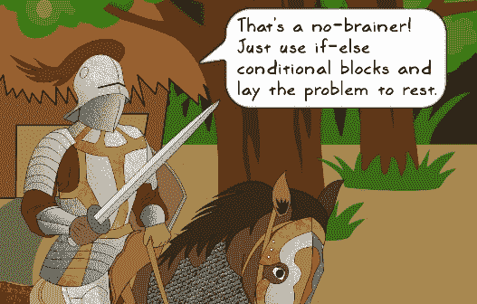

| *当然。修复报告问题的方法之一是添加条件块，以确保用户输入是介于 1 和 5 之间的数字。* |
| --- |

但像许多其他语言一样，Python 提供了一种优雅的方式来处理这种情况，即使用`try…except`子句。它基于**更容易请求原谅而不是请求许可**（**EAFP**）原则。

### 注意

**EAFP 原则**

在编码时，你假设某些事物存在，并相应地编写代码。但如果这证明是一个错误的假设，你将通过捕获那个例外来请求原谅。这是在 Python 开发中非常常见的一种方法。你可以查看 Python 3 文档（[`docs.python.org/3/glossary.html`](https://docs.python.org/3/glossary.html)），其中定义了这个习语。在某些情况下，与使用`if`条件块相比，异常处理可能会影响性能；然而，当你使用`try…except`子句时，你很可能会发现更多的好处而不是坏处。

# 例外

在直接跳入代码并修复这些问题之前，让我们首先了解什么是例外，以及我们所说的处理例外是什么意思。

## 什么是例外？

在 Python 中，**例外**是一个对象。它为我们提供了关于程序执行过程中检测到的错误的信息。在调试应用程序时注意到的错误是**未处理的例外**，因为我们没有预料到这些错误。在接下来的章节中，你将学习处理这些例外情况的技术。

在早期的跟踪信息中看到的`ValueError`和`IndexError`例外是 Python 中内置例外类型的例子。在下一节中，你将了解 Python 支持的一些其他内置例外。

## 最常见的例外

让我们快速回顾一些最常遇到的例外情况。最简单的方法是尝试运行一些有问题的代码，让它报告问题作为错误跟踪信息！启动你的 Python 解释器，并编写以下代码：

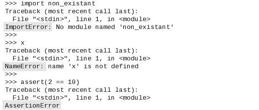

这里有一些额外的例外情况：

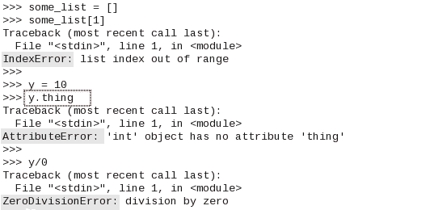

如你所见，代码的每一行都会抛出一个带有例外类型的错误跟踪信息（显示为高亮）。这些是 Python 中的一些内置例外。可以在[`docs.python.org/3/library/exceptions.html#bltin-exceptions`](https://docs.python.org/3/library/exceptions.html#bltin-exceptions)找到内置例外的完整列表。

Python 为所有内置例外提供了`BaseException`作为基类。然而，大多数内置例外并不直接继承自`BaseException`。相反，它们从一个称为`Exception`的类中派生，该类反过来又继承自`BaseException`。处理程序退出的内置例外（例如，`SystemExit`）直接从`BaseException`派生。你还可以创建自己的例外类作为`Exception`的子类。你将在本章后面了解这一点。

## 异常处理

到目前为止，我们已经看到了异常的发生。现在，是时候学习如何使用`try…except`子句来处理这些异常了。以下伪代码展示了`try…except`子句的一个非常简单的例子：

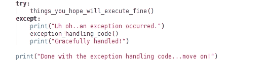

让我们回顾一下前面的代码片段：

+   首先，程序尝试执行`try`子句中的代码。

+   在这个执行过程中，如果出现问题（如果发生异常），它将跳出这个`try`子句。`try`块中剩余的代码将不会执行。

+   然后它将在`except`子句中寻找合适的异常处理器并执行它。

这里使用的`except`子句是一个通用的。它将捕获`try`子句中发生的所有类型的异常。与其使用这个“捕获所有”的处理程序，不如更好地实践是捕获你预期的错误，并为这些错误编写特定的异常处理代码。例如，`try`子句中的代码可能会抛出`AssertionError`。而不是使用通用的`except`子句，你可以编写一个特定的异常处理器，如下所示：

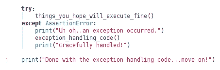

这里，我们有一个专门处理`AssertionError`的`except`子句。这也意味着除了`AssertionError`之外的其他错误将作为一个未处理的异常滑过。为此，我们需要定义多个具有不同异常处理器的`except`子句。然而，在任何时候，只有一个异常处理器会被调用。这可以通过一个例子更好地解释。让我们看看以下代码片段：

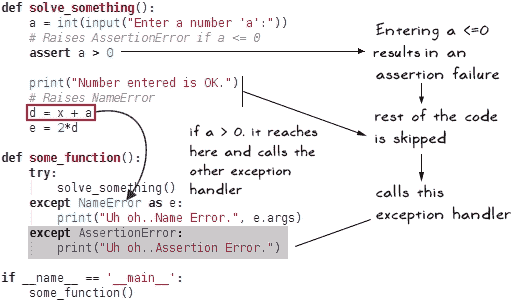

`try`块调用`solve_something()`。这个函数接受一个用户输入的数字，并断言这个数字大于零。如果断言失败，它将直接跳转到处理器，`except AssertionError`。

在另一种场景中，如果`a > 0`，`solve_something()`中的其余代码将被执行。你会注意到变量`x`未定义，这导致`NameError`。这个异常由另一个异常子句`except NameError`处理。同样，你可以为预期的错误定义特定的异常处理器。

## 抛出和重新抛出异常

Python 中的`raise`关键字用于强制抛出一个异常。换句话说，它引发了一个异常。语法很简单；只需打开 Python 解释器并输入：

```py
>>> raise AssertionError("some error message")

```

这会产生以下错误跟踪信息：

```py
Traceback (most recent call last): 
 File "<stdin>", line 1, in <module> 
AssertionError :  some error message

```

在某些情况下，我们需要重新抛出一个异常。为了更好地理解这个概念，这里有一个简单的场景。假设，在`try`子句中，你有一个除以零的表达式。在普通算术中，这个表达式没有意义。这是一个错误！这会导致程序抛出一个名为`ZeroDivisionError`的异常。如果没有异常处理代码，程序将只打印错误消息并终止。

如果您希望将此错误写入某个日志文件然后终止程序呢？在这里，您可以使用 `except` 子句首先记录错误。然后，使用不带任何参数的 `raise` 关键字重新抛出异常。异常将向上传播到堆栈中。在这个例子中，它将终止程序。可以使用不带任何参数的 `raise` 关键字重新抛出异常。

这里有一个示例，展示了如何重新抛出异常：

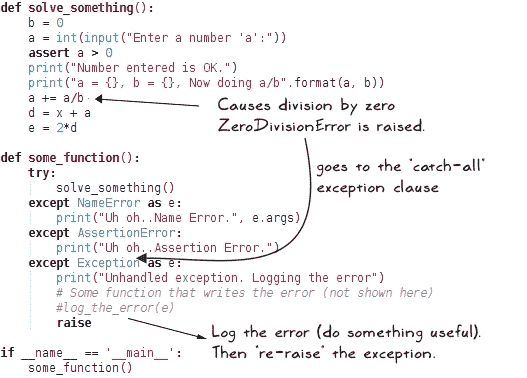

如所示，在解决 `a/b` 表达式时抛出了除以零的异常。这是因为变量 `b` 的值被设置为 `0`。为了说明目的，我们假设没有为这个错误指定特定的异常处理器。因此，我们将使用通用的 `except` 子句，在记录错误后重新抛出异常。如果您想亲自尝试，只需将前面展示的代码写入一个新的 Python 文件，并在终端窗口中运行它。以下截图显示了前面代码的输出：

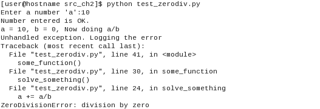

## try…except 的 else 块

在 `try…except` 子句中可以指定一个可选的 `else` 块。只有当 `try…except` 子句中没有发生异常时，`else` 块才会执行。其语法如下：

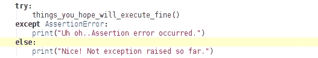

`else` 块在 `finally` 子句之前执行，我们将在下一节学习。

## finally...清理它！

在 `try…except…else` 的故事中还有其他要补充的内容：一个可选的 `finally` 子句。正如其名所示，此子句中的代码在相关的 `try…except` 块结束时执行。无论是否抛出异常，如果指定了 `finally` 子句，它将肯定在 `try…except` 子句结束时执行。想象一下，这是 Python 给出的一个全方位的保证！以下代码片段显示了 `finally` 块的实际操作：

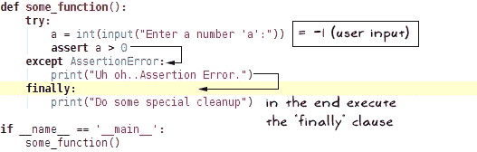

运行此简单代码将产生以下输出：

```py
$ python finally_example1.py 
Enter a number: -1
Uh oh..Assertion Error. 
Do some special cleanup 

```

输出的最后一行是 `finally` 子句中的 `print` 语句。

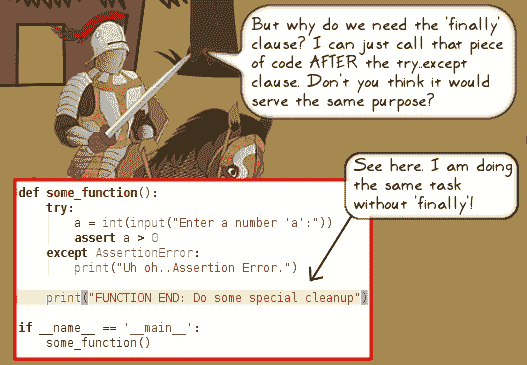

| *这是一个很好的问题！让我们给这个故事加一个转折。如果 except 子句中的新代码强制函数返回，会发生什么？在这种情况下，您的解决方案会执行前面截图中的最后一行代码吗？* |
| --- |

以下截图显示了带有和没有 `finally` 子句的代码片段。`finally` 子句中的代码确保在 `except` 子句指示从函数返回之前执行。

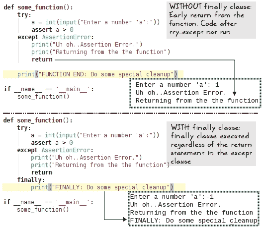

`finally` 子句通常用于在离开函数之前执行清理任务。一个示例用法是关闭数据库连接或文件。然而，请注意，为此目的，您也可以在 Python 中使用 `with` 语句。

# 回到游戏 – 奥克之攻 v1.1.0

在了解了异常处理的知识后，让我们开始工作，制作应用程序的下一个增量版本。

## 准备工作

在编写任何代码之前，让我们首先了解本节的其他部分是如何组织的。简而言之，我们将从 第一章，*开发简单应用程序* 的代码 v1.0.0 版本开始，逐步添加异常处理代码，并调用新的版本 v1.1.0。

### 注意

支持代码包中的 Python 文件已经包含了本节以及本章后续部分“定义自定义异常”中将要讨论的异常处理代码。

以下要点进一步阐述了详细内容：

+   我们将首先从 第一章，*开发简单应用程序* 下载游戏的 v1.0.0 版本。文件名为 `ch01_ex03_AbstractBaseClass.py`（回想一下，这是在 第一章，*开发简单应用程序* 中提供的练习题的解决方案）。你可以在这个章节的代码包中找到此文件。

+   将上述文件与 `ch01_ex03.py` 进行比较。这里唯一的区别是使用了抽象基类 `AbstractGameUnit` 而不是普通基类 `GameUnit`。其余代码完全相同。

+   让我们复制 `ch01_ex03_AbstractBaseClass.py` 并将其保存为 `attackoftheorcs_v1_1.py`，或者你可以给它起任何你喜欢的名字。在接下来的讨论中，我们将以此新名字来引用该文件，并逐步向其中添加异常处理代码。

+   如前所述，支持代码包中包含了我们将要审查的所有异常处理代码。你将在代码包中找到一个同名文件（`attackoftheorcs_v1_1.py`），其中包含了所有更改。

## 添加异常处理代码

这将基本上是一个修复错误的版本，不会添加任何新功能。之前所做的调试已经帮助我们找到了问题所在。打开 Python 文件（`attackoftheorcs_v1_1.py`），并更新 `AbstractGameUnit` 类的 `_process_user_choice` 方法。带有新 `try…except` 子句的此方法更新版本如下所示：

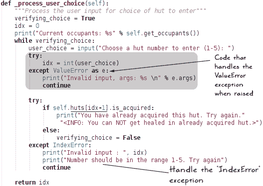

### 小贴士

如果你之前错过了阅读这部分内容，你应该复制 `ch01_ex03_AbstractBaseClass.py` 文件，并将其命名为 `attackoftheorcs_v1_1.py`。然后使用这个新文件添加前面的异常处理代码。或者，你也可以简单地查看代码包中提供的同名文件。它包含了我们将要讨论的所有更改。Python 2.7.9 兼容的源文件也包含在代码包中。

让我们回顾一下前面的代码：

+   在 `try` 子句中，如果 `user_choice` 变量不是一个数字，将发生 `ValueError` 异常，该异常由 `except ValueError as e` 处理。

+   使用`as`关键字将异常分配给`e`对象

+   或者，你也可以直接使用语法`except ValueError`

+   第二个`try…except`子句处理输入数字超出`huts`列表范围的情况

+   当发生`IndexError`异常时，`except`子句中的`continue`语句会使用户重新输入输入值

这就是我们需要的所有内容。现在，让我们运行应用程序。

## 运行《奥克之攻》v1.1.0

是时候运行应用程序，看看这些更改是否解决了报告的问题。在终端窗口中运行程序，如下代码片段所示：

```py
$ python attackoftheorcs_v1_1.py

```

当提示输入时，输入一个不可接受的棚屋编号值：

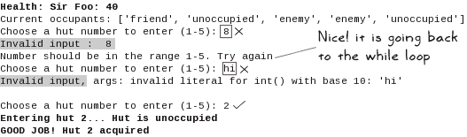

看起来不错！至少报告的问题已经解决。很容易找到更多这样的错误。例如，用户在选择棚屋时还可以输入 0 或负数，或者当程序请求允许攻击敌人时，任何除`y`或`n`之外的输入都没有得到优雅的处理。作为练习，尝试自己修复这些问题！

# 定义自定义异常

你可以通过从`Exception`基类或任何其他异常类继承来自定义异常类。为什么我们需要这样的定制？首先，你可以创建一个具有描述性名称的异常类。这允许我们仅通过查看描述性名称就能识别异常的目的。例如，而不是`ValueError`，一个名为`ValueGreaterThanFiveError`的自定义异常将立即帮助我们识别问题。还有其他优点。你可以使用这样的类根据错误子类别添加自定义消息、编写错误日志等。让我们学习如何定义自定义异常。

## 准备工作

这里是我们将使用的文件列表：

+   `attackoftheorcs_v1_1.py`: 这是上一节中我们将使用的文件。如前所述，支持代码包已经有一个同名文件。它包括我们将讨论的所有修改。

+   `gameuniterror.py`: 这是一个新的模块，用于存放自定义异常类。

+   `heal_exception_example.py`: 这里将编写顶层控制代码。这是一个简化版的游戏，我们不需要玩完整游戏就能重现问题。

你需要将所有上述文件放在同一个目录下。

## 自定义异常 – 问题

为了演示自定义异常的使用，让我们识别一个简单的问题。观察下面显示的`heal`方法（回想一下，它定义在`Knight`的父类`AbstractGameUnit`中）。你可以在`attackoftheorcs_v1_1.py`文件中找到它。

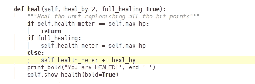

该方法有两个可选参数。如果 `full_healing` 设置为 `True`，游戏单位将恢复所有失去的生命值。另一个选项 `heal_by` 通过一小部分来 `heal` 游戏单位。在这个版本中，我们没有使用 `heal_by` 选项。但在未来的版本中，你可能想在游戏中引入回合制功能，其中受伤的单位在每个回合中通过一小部分来恢复健康*。

为了演示如何创建和使用自定义异常，让我们在 `heal_by` 功能中引入一个人工错误！将以下代码保存为 `heal_exception_example.py` 并将此文件放置在 `attackoftheorcs_v1_1.py` 相同的目录中。

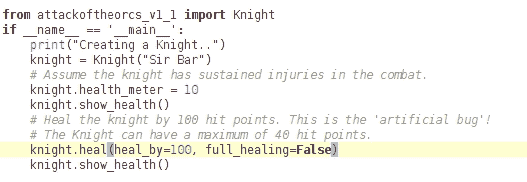

这是一个简化版的游戏，我们不需要玩完整游戏就能创建这个人工错误！这是一个顶层控制代码，它创建一个 `Knight` 实例，强制减少生命值（查看 `knight.health_meter`），就像骑士已经战斗并受伤一样。最后，它使用 `heal_by` 参数调用 `heal` 函数。

你注意到这里有什么问题吗？回想一下，`knight` 实例的最大生命值是 `40`（查看实例属性 `Knight.max_hp`）。前面的代码试图使用 `heal_by` 参数通过 `100` 点来 `heal` 骑士。显然，这将超过限制。防止这种情况的一种方法是在 `heal` 方法中添加一个断言语句，如下面的代码片段所示：

```py
assert (self.health_meter + heal_by  <= self.max_hp)
```

这将引发一个 `AssertionError`。这是一个可接受的解决方案。另一种实现方式是使用自定义异常类。接下来将演示。

## 编写新的异常类

从 `Exception` 类派生一个新的异常类是非常简单的。打开你的 Python 解释器，创建以下类：

```py
>>> class GameUnitError(Exception):
...     pass
... 
>>>

```

那就全部了！我们有一个新的异常类 `GameUnitError`，准备部署。如何测试这个异常？只需 `raise` 它。在你的 Python 解释器中输入以下代码行：

```py
>>> raise GameUnitError("ERROR: some problem with game unit")

```

抛出新创建的异常将打印以下跟踪回溯：

```py
>>> raise GameUnitError("ERROR: some problem with game unit")
Traceback (most recent call last):
 File "<stdin>", line 1, in <module>
__main__.GameUnitError: ERROR: some problem with game unit

```

将 `GameUnitError` 类复制到其自己的模块 `gameuniterror.py` 中，并将其保存到与 `attackoftheorcs_v1_1.py` 相同的目录中。

接下来，更新 `attackoftheorcs_v1_1.py` 文件以包含以下更改：

+   首先，在文件开头添加以下导入语句：

    ```py
    from gameuniterror import GameUnitError
    ```

+   第二个更改是在 `AbstractGameUnit.heal` 方法中。更新的代码如下所示。观察高亮显示的代码，当 `self.health_meter` 的值超过 `self.max_hp` 时，会抛出自定义异常。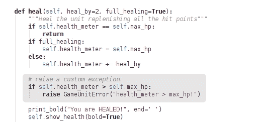

通过这两个更改，运行之前创建的 `heal_exception_example.py`。你将看到新异常被抛出，如下面的截图所示：

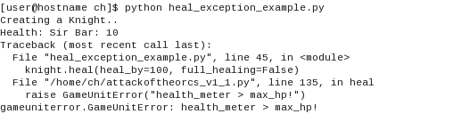

## 扩展异常类

我们能否对`GameUnitError`类做更多的事情？当然可以！就像任何其他类一样，我们可以定义属性并使用它们。让我们进一步扩展这个类。在修改后的版本中，它将接受一个额外的参数和一些预定义的错误代码。更新后的`GameUnitError`类如下所示：

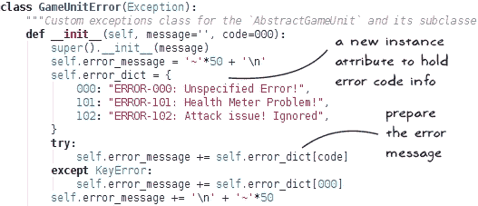

让我们看一下前面截图中的代码：

+   首先，它调用`Exception`超类的`__init__`方法，然后定义一些额外的实例变量。

+   一个新的字典对象`self.error_dict`持有错误整数代码和错误信息作为键值对。

+   `self.error_message`根据提供的错误代码存储有关当前错误的信息。

+   `try…except`子句确保`error_dict`实际上具有由`code`参数指定的键。在`except`子句中并不存在；我们只是使用默认错误代码`000`来检索值。

现在，让我们看看这个类的消费者。观察修改后的`heal`方法。这里唯一的改变是向`GameUnitError`实例添加了一个额外的参数。在这里，我们将错误代码作为第二个参数传递：

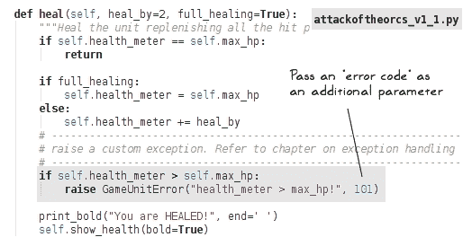

到目前为止，我们已经对`GameUnitError`类和`AbstractGameUnit.heal`方法进行了修改。我们还没有完成。最后一部分是要修改`heal_exception_example.py`文件中的`main`程序。代码如下所示：

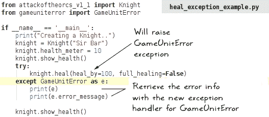

让我们回顾一下代码：

+   由于`heal_by`值太大，`try`子句中的`heal`方法抛出了`GameUnitError`异常。

+   新的`except`子句像处理任何其他内置异常一样处理`GameUnitError`异常。

+   在`except`子句中，我们有两条`print`语句。第一条打印`health_meter > max_hp!`（回想一下，当这个异常在`heal`方法中被抛出时，这个字符串被作为`GameUnitError`实例的第一个参数）。第二条`print`语句检索并打印`GameUnitError`实例的`error_message`属性。

我们已经完成了所有的更改。我们可以从终端窗口运行这个示例：

```py
$ python heal_exception_example.py

```

程序的输出如下所示：

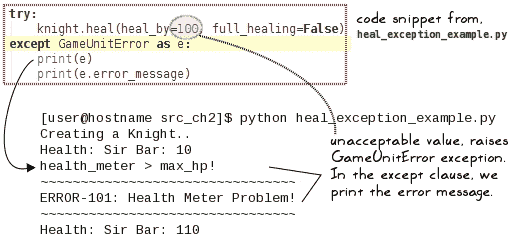

在这个简单的例子中，我们只是将错误信息打印到控制台。你可以进一步将详细的错误日志写入文件，并跟踪应用程序运行期间生成的所有错误消息。

## 从异常类继承

| *Sir Foo 有* *一些关于之前在`GameUnitError.error_dict`中维护的错误代码的看法…* |
| --- |

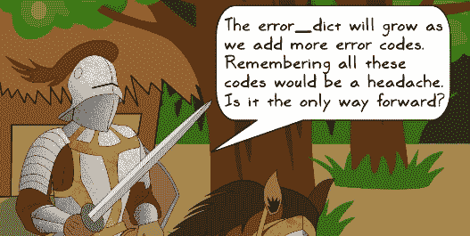

| *你是正确的。在抛出异常时，你需要记住每个错误号对应的内容。让我们讨论一些替代方案。* |
| --- |

一种选择是使用唯一的字符串作为`error_dict`的键，而不是错误号，例如：

```py
self.error_dict = { 
    'health_meter_problem':"ERROR: Health meter problem!"}
```

这减轻了记住错误代码的问题。然而，如果你想要做的不仅仅是打印消息，这种方法就不适用了。例如，根据错误类型，你可能想要进行一些额外的处理。

一个更好的方法是使用`GameUnitError`作为基异常类，并派生出针对特定错误的新的类。这些异常类的描述性名称应该有助于传达相同的信息。以下代码片段展示了如何实现它的一个示例。你可以用以下截图中的代码替换`gameuniterror.py`中现有的代码：

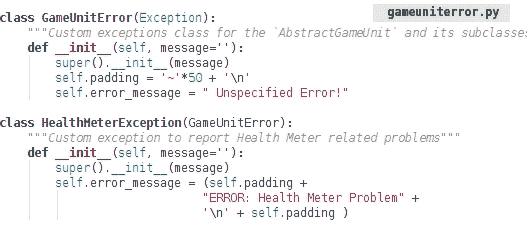

现在，在`heal`方法中，不要抛出`GameUnitError`异常，而是直接`raise``HealthMeterException`。确保按照以下代码片段中的指示导入`HealthMeterException`模块。

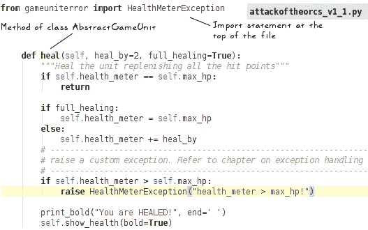

使用上述更改运行代码会产生类似的输出。只是我们修订了`HealthMeterException`类的`error_message`。输出如下所示：

```py
$ python heal_exception_example.py 
Creating a Knight..
Health: Sir Bar: 10
health_meter > max_hp!
~~~~~~~~~~~~~~~~~~~~~~~~~~~~~~~~~~~~~~~~~~~~~~~~~~
ERROR: Health Meter Problem
~~~~~~~~~~~~~~~~~~~~~~~~~~~~~~~~~~~~~~~~~~~~~~~~~~

Health: Sir Bar: 110

```

同样，你也可以创建其他子类来处理特定问题。

# 练习

识别任何可以从异常处理中受益的代码。例如，创建一个新的`HutError`异常，并使用它来抛出与`Hut`类相关的错误。以下是一个速查表：

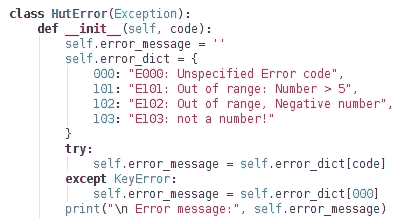

你也可以不使用`error_dict`，而是创建子类，例如：

```py
class HutNumberGreaterThanFiveError(HutError): pass
class NegativeHutNumberError(HutError): pass 
```

# 摘要

本章介绍了 Python 中异常处理的基础。我们看到了异常是如何发生的，了解了一些常见的内置异常类，并编写了简单的代码来使用`try…except`子句处理这些异常。通过处理异常，我们修复了“奥克之攻”游戏中的某些明显错误。

本章还演示了技术，例如抛出和重新抛出异常，使用`finally`子句等。本章的后期部分专注于实现自定义异常类。我们定义了一个新的异常类，并使用它为我们的应用程序抛出自定义异常。

通过异常处理，代码的形态变得更好。然而，我们仍然有大部分代码挤在一个单独的文件（`attackoftheorcs_v1_1.py`）中。在下一章中，你将学习如何打包应用程序代码并将其发布给更广泛的受众。
