# 第三章。模块化、打包、部署！

在过去几章中，你编写了一个简单的应用程序，为其添加了新功能，并确保修复了一些常见错误。现在，是时候让它面向更广泛的受众了。在本章中，你将学习以下主题：

+   将前几章编写的代码模块化和打包

+   准备和部署源代码分发

+   设置私有 Python 包仓库

+   制作增量发布

+   将代码纳入版本控制

多亏了口碑宣传，高奇幻游戏应用正在获得更多的关注。越来越多的人要求获取代码，要么是为了在自己的应用程序中使用功能，要么只是为了简单地玩游戏。到目前为止，你已经向请求的用户发送了完整的源代码。但是，继续这样做是愚蠢的，因为你已经进行了相当频繁的升级。

有几种处理方式。最基本的选择是将代码托管在某个服务器上，并要求用户从该位置下载。另一个选择是使用版本控制系统，如**Git**来管理代码，并允许其他人克隆它。另一种选择，我们将在下一节中看到，是将它作为 Python 包部署。


| *别急，先生 Foo！我们首先得做一些准备工作。现在先抑制一下你的热情。顺便说一句，你的军队还远着呢。你将在第六章“设计模式”中与你的战友们重逢。Chapter 6。 |
| --- |

# 选择版本控制约定

我们如何命名代码的新版本？目前有几种版本控制方案在使用中。让我们快速回顾几个流行的方案。

## 序列递增

在这个方案中，你只需以序列方式逐次增加版本号进行升级，例如，v1、v2、v3，依此类推。然而，这并没有提供关于特定版本内容的任何信息。仅通过查看版本号，很难判断特定版本是引入了革命性功能还是仅仅修复了一个小错误。它也没有提供关于 API 兼容性的信息。如果你有一个小应用，用户基础小，范围有限，可以选择这种简单的版本控制方案。


### 注意

**API 兼容性**

简单来说，**应用程序编程接口**（**API**）允许程序的一部分，比如库或应用程序，通过一组标准的函数、方法或对象与另一部分进行通信。

想象一个名为`car`的软件库，它存储了一些关于豪华汽车的数据。你的应用程序希望获取一些关于汽车颜色的信息。库会说：“只需调用我的`color()`方法即可获取所需信息。”在这里，`color()`方法是`car`库的 API 方法。有了这个信息，你开始在应用程序中使用`car.color()`。

在`car`库的最新版本中，`color()`已被重命名为`get_color()`。如果您切换到这个新版本，由于您仍然使用`car.color()`从库中检索颜色信息，您的应用程序代码将会中断。在这种情况下，新的 API 被认为与库的旧版本不兼容。相反，**向后兼容**的 API 是指使用库旧版本的应用程序即使在新的版本中也能正常运行。这是看待 API 兼容性的一个方法。

## 使用日期格式

在这个约定中，版本名称通过嵌入发布时间的信息来标记。例如，它可能遵循 YYYY-MM 约定来包含发布年份和月份。这样的约定有助于确定特定发布的年龄。然而，正如之前一样，除非您遵循某种混合命名约定，否则发布名称本身不会提供有关 API 兼容性的任何信息。这个方案通常在您遵循常规发布计划或发布中包含一些时间敏感功能时很有用。

## 语义版本控制方案

这是一个推荐的版本控制约定。在我们迄今为止开发的应用中，我们大致遵循了语义版本控制方案。在这个方案中，版本通过三个数字（**MAJOR.MINOR.PATCH**）来表示。例如，当我们说版本 1.2.4 时，这意味着主版本号是 1，次要版本是 2，补丁或维护版本号是 4。当你向 API 引入不兼容的更改以访问你的包的功能时，主版本号会增加。当向包中添加一些新的次要功能，同时保持代码向后兼容时，次要版本会增加。例如，你向下一个版本添加一个新内部功能，但这不会破坏上一个版本的任何代码。访问包功能的 API 与之前保持相同。最后一个数字代表补丁。当修复了一些错误时，它会增加。

### 小贴士

Python *PEP 440* 规范深入讨论了 Python 发行版的语义版本控制方案。这是 Python 社区推荐的。您可以在[`www.python.org/dev/peps/pep-0440/`](https://www.python.org/dev/peps/pep-0440/)找到这个规范。选择最适合您应用的版本控制约定。

本书中所展示的版本控制方案仅大致遵循语义版本控制。例如，在早期的示例中，在修复了一些重要错误之后，我们更新了次要版本号而不是补丁版本号。

在理解了各种版本控制约定之后，让我们回到*奥克之攻*代码，并将其拆分为独立的模块。这将是我们创建包的第一步。

# 代码模块化

我们在前面几章中提到了模块。现在需要对此进行解释。具有 `.py` 扩展名的单个 Python 文件是一个 **模块**。您可以使用 `import` 语句在源代码中使用此模块。模块名称与文件名相同，只是没有 `.py` 扩展名。例如，如果文件名是 `knight.py`，则 `import knight` 将将模块导入到您的源文件中。

在本节中，我们将 `attackoftheorcs_v1_1.py` 文件中的代码拆分为单独的模块。您可以在上一章的支持代码包中找到此文件。

## 《奥克之战》v2.0.0 版

我们将这个版本命名为 2.0.0。由于我们即将进行一些 API 级别的更改，主版本号增加到 2。引入新模块后，我们从代码中访问功能的方式将发生变化。让我们回顾一下来自 第二章，*处理异常* 的源文件 `attackoftheorcs_v1_1.py`。第一步是为每个类创建一个模块（一个新文件）。模块名称最好是全部小写。

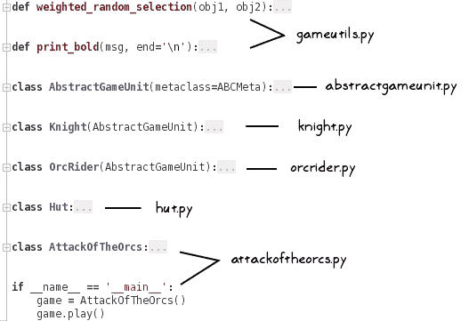

让我们看一下前面的截图中的代码：

+   创建一个名为 `gameutils.py` 的新模块，并将 `weighted_random_selection` 和 `print_bold` 这两个实用函数复制到该模块中。

+   `attackoftheorcs.py` 文件包含 `AttackOfTheOrcs` 类。在同一文件中，复制运行游戏的主体执行代码。可选地，为主要的代码创建一个新的模块。

+   参考前面的截图中的代码，并将其他类放入它们自己的模块中。

我们还没有完成。将代码拆分为多个模块会导致未解决引用。我们现在需要修复这些新错误。之前这并不是一个问题，因为整个代码都在一个文件中。例如，在 `AttackOfTheOrcs` 类中创建 `Hut` 实例时，Python 可以在同一个文件中找到 `Hut` 类的定义。现在，我们需要从各自的模块中导入这些类。

### 小贴士

如果您正在使用 PyCharm 等集成开发环境 (IDE)，则可以使用 **代码检查** 功能轻松检测此类未解决引用。IDE 将为所有问题引用显示视觉指示（例如，红色下划线）。此外，Inspect Code 功能允许您一次性找到所有问题代码。

在 `attackoftheorcs.py` 文件的开始处添加以下 `import` 语句：


在这里，我们从新模块 `hut` 中导入 `Hut` 类，等等。以下代码截图显示了 `knight.py` 文件中的 `import` 语句：


以下代码截图显示了 `abstractgameunit.py` 文件中的 `import` 语句：

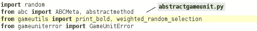

同样，您必须更新所有剩余的文件并包含必要的 `import` 语句。这些更改在此不讨论。有关更多详细信息，您可以参考本章支持代码包中的相应文件。

将所有新模块放在一个目录中，命名为 `wargame` 或您喜欢的任何名称。回想一下，在 第二章 中，我们曾在 `gameuniterror.py` 文件中创建了一个名为 `GameUnitError` 的类。请确保将此文件复制到新目录中。复制 `gameuniterror.py` 后的目录结构如下截图所示：


作为最后一步，让我们通过执行以下命令来验证应用程序是否运行顺畅：

```py
$ python attackoftheorcs.py

```

其中 `python` 版本可以是 3.5 或 2.7.9（或更高版本），具体取决于您的环境。

# 创建一个包

现在我们已经模块化了代码，让我们创建一个 Python 包。什么是包？它是一种对 Python 模块所在目录的别称。然而，它不仅仅如此。为了使这样的目录被称为包，它还必须包含一个 `__init__.py` 文件。这个文件可以保持为空，或者你可以在这个文件中放入一些初始化代码。为了将 `wargame` 目录转换为 Python 包，我们将在该目录中创建一个空的 `__init__ .py` 文件。新的目录结构如下截图所示：


## 从包中导入

让我们看看如何使用这个新创建的包的功能。为了测试这一点，在 `wargame` 包的同一目录级别创建一个新的文件，名为 `run_game.py`。目录结构将如下所示。在这里，`mydir` 是顶级目录（可以是任何名称）：


将以下代码添加到 `run_game.py` 文件中：

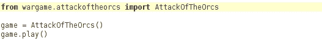

第一行是新的 `import` 语句。在这里，我们是从 `attackoftheorcs.py` 文件中导入 `AttackOfTheOrcs` 类。如果您在终端窗口中执行此文件，程序可能会突然结束，并显示以下代码中的错误跟踪：

```py
$ python run_game.py
Traceback (most recent call last): 
 File "run_game.py", line 2, in <module> 
 from wargame.attackoftheorcs import AttackOfTheOrcs 
 File "/mydir/wargame/attackoftheorcs.py", line 29, in <module> 
 from hut import Hut 
ImportError: No module named 'hut'

```

如果 `wargame` 目录路径未包含在 Python 环境中，将会出现此类错误。在错误跟踪中，无法找到 `hut.py` 文件。该文件位于 `/mydir/wargame/hut.py`。然而，位置 `/mydir/wargame` 不在 Python 的搜索路径中。因此，它无法找到该目录中的模块。有几种方法可以解决这个问题。最简单的方法是在终端中指定一个 `PYTHONPATH` 环境变量。在 Linux 操作系统的 Bash shell 中，可以这样指定：

```py
$ export PYTHONPATH=$PYTHONPATH:/mydir/wargame

```

在 Windows 操作系统上，您可以从命令提示符设置它，如下所示：

```py
> set PYTHONPATH=%PYTHONPATH%;C:\mydir\wargame

```

只需将 `/mydir/wargame` 替换为您系统上的适当路径。另一种修复问题的方法是，在 `run_game.py` 代码中的 `import` 语句之前，添加一个 `sys.path.append` `("/mydir/wargame")` 语句，如下面的代码所示：

```py
import sys 
sys.path.append("/mydir/wargame") 
from wargame.attackoftheorcs import AttackOfTheOrcs
```

然而，使用这两种选项，您都必须指定完整路径。另一种处理问题的方法是在 `wargame/__init__.py` 文件中添加以下代码：

```py
import sys 
import os 
current_path = os.path.dirname(os.path.abspath(__file__)) 
sys.path.append(current_path) 
# optionally print the sys.path for debugging)
#print("in __init__.py sys.path:\n ",sys.path)
```

当前路径给出了 `__init__.py` 文件所在目录的绝对路径。通过这次更新，您应该已经准备好运行游戏了。

# 在 PyPI 上发布包

**Python 包索引** (**PyPI**) ([`pypi.python.org/pypi`](https://pypi.python.org/pypi)) 是 Python 社区的包分发机制。它是第三方包的官方仓库。默认情况下，Python 包管理器 pip 会搜索这个仓库来安装包。

这是我们上传源分发的地方，使其对 Python 社区普遍可用。PyPI 仓库有一个专门的 **测试服务器** ([`testpypi.python.org/pypi`](https://testpypi.python.org/pypi))，供刚开始学习打包代码的开发者使用。由于这是一个学习活动，我们将首先在测试服务器上部署我们的包。

## 准备分发

让我们从为发布奠定基础开始。我们首先需要准备要发布的分发。以下步骤提供了一组最小指令来准备分发。

### 步骤 1 – 设置包目录

创建一个新的目录，命名为 `testgamepkg` 或您喜欢的任何名称。在这个目录中，复制我们之前创建的 `wargame` 包。现在，在这个目录中创建以下四个空文件，`README`、`LICENSE.txt`、`MANIFEST.in` 和一个 `setup.py` 文件。目录树如图所示：

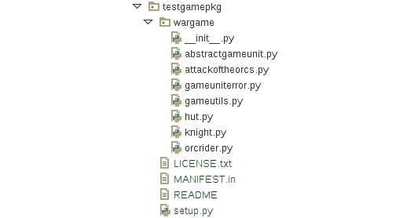

### 小贴士

不需要创建新的目录 `testgamepkg`。相反，您可以在包含 `wargame` 包的同一目录中创建这四个文件。所有这些文件也可以在本章的支持材料中找到。

接下来，我们将向每个新文件添加内容。

### 步骤 2 – 编写 setup.py 文件

`setup.py` 文件是一个必需的文件，其中包含您要发布的包的元数据。让我们在这个文件中写下以下代码：

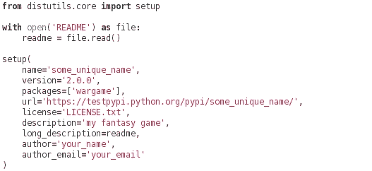

第一行的 `import` 语句导入内置的 `setup` 函数。在接下来的几行中，`README` 文件的内容被存储在一个名为 `readme` 的字符串中。最后，我们使用前面代码片段中所示的各种参数调用 `setup` 函数。

在这些参数中，只有`name`、`version`和`packages`是必需字段。您可以为`setup`函数添加几个其他可选元数据参数。在前面的代码中，我们指定了最常见的参数。

### 小贴士

`setup`函数接受多个可选参数。有关详细信息，请参阅 API 参考（[`docs.python.org/3/distutils/apiref.html`](https://docs.python.org/3/distutils/apiref.html)）。

在代码中，使用一个唯一的字符串更新`name`字段。确保该名称尚未被用作 PyPI 软件包的名称。`version`字段表示软件包的当前版本。在本章的早期部分，我们给模块化代码指定了版本号 2.0.0。你可以采用这个方案，或者使用自己的版本控制约定。第三个必需的字段`packages`是一个包含在分发中的源软件包列表。在这种情况下，它只是包含所有代码的`wargame`软件包。存储在`long_description`字段中的字符串用于在 PyPI 网站上显示软件包的主页。在代码中，我们将`README`文件的内容作为`long_description`。

### 第 3 步 – 更新 README 和 LICENSE.txt 文件

在`LICENSE.txt`文件中，只需复制你想要发布软件包的许可描述即可。例如，如果你正在根据**MIT 许可协议**（[`opensource.org/licenses/MIT`](https://opensource.org/licenses/MIT)）分发此软件包，请将 MIT 许可描述复制并粘贴到该文件中。

`README`文件是您可以添加项目详细描述的文件。PyPI 期望此文件以**reStructuredText**（**RST**）或`.rst`格式存在。有关此格式的更多信息，请参阅[`docutils.sourceforge.net/rst.html`](http://docutils.sourceforge.net/rst.html)。以下是`README`文件的示例。请注意，每个标题之前和`.. code:: python`关键字之后的新行都很重要：

```py
Attack of the Orcs 
================== 

Introduction 
------------- 
This is a command line fantasy war game! 

Documentation 
-------------- 
Documentation can be found at... 

Example Usage 
------------- 
Here is an example to import the modules from this package. 

.. code:: python 

    from wargame.attackoftheorcs import AttackOfTheOrcs 
    game = AttackOfTheOrcs() 
    game.play() 

LICENSE 
------- 
See LICENSE.txt file.
```

### 第 4 步 – 更新`MANIFEST.in`文件

默认情况下，`distutils`在创建分发时包含以下文件：

+   `README`、`README.txt`、`setup.py`或`setup.cfg`文件位于顶级分发目录中

+   `setup.py`中`*.py`文件列表中隐含的所有文件

+   所有`test/test*.py`文件

+   由`setup.py`中的`libraries`或`ext_modules`指示的`C`源文件

但如果你想在项目中包含一些额外的文件怎么办？例如，我们希望将`LICENSE.txt`与分发一起打包。由于默认情况下没有提供添加它的方法，它将不会被包含。为此，`distutils`会查找一个名为`MANIFEST.in`的模板文件，其中可以指定自定义规则以包含额外的文件。

让我们编辑`MANIFEST.in`文件，并为`LICENSE.txt`的包含制定一个规则。将以下行添加到该文件并保存：

```py
include *.txt 
```

此模板中的每一行代表一个命令。前面的行告诉 Python 包含顶级分发目录中的所有 `.txt` 文件。因此，`LICENSE.txt` 现在将被包含在分发中。

所有文件现在都已更新。现在是时候构建分发啦！

### 第 5 步 – 构建部署就绪的分发

让我们创建一个源分发。在终端窗口中，运行以下命令：

```py
$ cd testgamepkg
$ python setup.py sdist 

```

`sdist` 命令创建一个包含源文件的分发。运行第二个命令创建一个包含存档文件的新 `dist` 目录。例如，在 `setup.py` 中，如果 `name` 字段是 `testgamepkg` 且版本是 `2.0.0`，则存档在 Linux 上将是 `testgamepkg-2.0.0.tar.gz`，在 Windows OS 上将是 `testgamepkg-2.0.0.zip`。

此外，它创建一个包含包中所有包含文件的 `MANIFEST` 文件。以下截图显示了运行 `python setup.py sdist` 命令后的命令行输出：

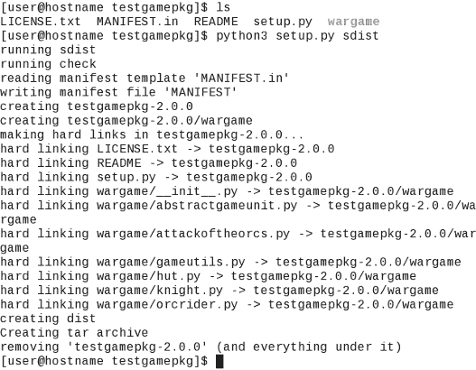

### 注意

**创建 bdist**

`sdist` 命令创建一个源分发。本章中的示例将仅使用 `sdist`。然而，你也可以创建一个构建分发。创建构建分发的最简单方法是 `$ python setup.py bdist`。这将在你的平台上创建一个默认的构建分发，例如在 Linux OS 上的 `dist/testgamepkg-2.0.0.linux-x86_64.tar.gz`。作为一个练习，创建这个分发并查看存档的内容。创建 `bdist` 的另一种方法是使用一个名为 `wheel` 的 Python 包（[`pypi.python.org/pypi/wheel`](https://pypi.python.org/pypi/wheel)）。它是一种构建包格式，尽管使用 `wheel` 需要一些工作。你可以尝试这个作为另一个练习。你可能需要执行以下操作：

```py
$ pip install pip --upgrade 
$ pip install wheel 
$ pip install setuptools –upgrade

```

然后，将以下 `import` 语句添加到 `setup.py` 文件中：`import setuptools`。最后，运行命令 `$ python setup.py bdist_wheel`。这将创建一个在 `dist` 目录下具有 `.whl` 扩展名的分发存档。

## 上传分发

分发已准备好部署。现在让我们部署它！

### 第 1 步 – 在 PyPI 测试网站上创建账户

如果你没有 PyPI 测试网站的账户，请在 [`testpypi.python.org/pypi?:action=register_form`](https://testpypi.python.org/pypi?:action=register_form) 上创建一个。按照该网站上的步骤创建新账户。

### 第 2 步 – 创建 .pypirc 文件

这是一个重要的步骤。Python 假设上传分发的默认仓库是 [`pypi.python.org/pypi`](https://pypi.python.org/pypi)。然而，PyPI 测试服务器有一个不同的地址，需要在 `.pypirc` 文件中指定（注意名称开头的点）。此文件具有特殊格式。将以下内容添加到 `.pypirc` 文件中：

```py
[distutils] 
index-servers= 
pypitest 

[pypitest] 
repository = https://testpypi.python.org/pypi 
username=<add username>
password=<add password>
```

该文件在 `[pypitest]` 标题下包含 PyPI 测试仓库的详细信息。在此文件中，你可以存储不同的配置文件。在这里，`[pypitest]` 是一个存储仓库 URL 和 PyPI 测试仓库用户凭据的配置文件。这提供了一个方便的方法来指定注册或上传发行版时的账户凭据和仓库 URL。配置文件名可以更改为任何其他字符串，只要更新`index-servers`变量中的对应条目。例如，你可以将其命名为 `[test]`。如果你在 PyPI 或 PyPI 测试网站上拥有多个账户，你也可以创建多个这样的配置文件。

在此文件中，使用你的实际凭据更新`username`和`password`字段，并保存文件。在 Linux 操作系统上，将此文件放在用户主目录中：`~/.pypirc`。在 Windows 操作系统上，在`C:\Users\user_name\.pypirc`处创建它。将`user_name`替换为实际的用户名。

### 步骤 3 – 注册你的项目

注册你的项目的一个简单方法是登录到测试 PyPI 网站，然后使用包提交表单：[`testpypi.python.org/pypi?:action=register_form`](https://testpypi.python.org/pypi?:action=register_form)

或者，项目注册也可以通过命令行完成。打开一个终端窗口，并输入以下命令。将`/path/to/testgamepkg`替换为包含`setup.py`的实际路径：

```py
$ cd /path/to/testgamepkg
$ python setup.py register -r pypitest

```

`register`命令的`-r`选项用于指定 PyPI 测试仓库的 URL。请注意，我们在这里没有直接写 URL，而是简单地写了配置文件名，`pypitest`。或者，你也可以指定完整的 URL，如下面的命令所示：

```py
$ python setup.py register -r  https://testpypi.python.org/pypi

```

以下截图显示了命令执行后的输出：

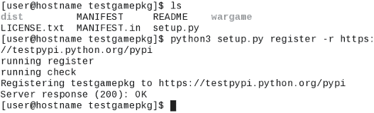

如果你登录到测试 PyPI 网站，你将看到一个名为你选择的唯一名称的新项目（在这个例子中，它是`testgamepkg`）。

### 步骤 4 – 上传包

最后，是时候上传包了。这可以通过以下命令完成：

```py
$ python setup.py sdist upload -r pypitest

```

此命令执行了两件事。首先，使用`sdist`命令创建源分布，然后使用`upload`命令将源分布上传到 PyPI 测试仓库。


| *这是一个很好的观点，Sir Foo！在准备发行版部分（见**步骤 4 – 更新 MANIFEST.in 文件**）*，我们确实使用了* `python setup.py sdist` *命令来创建发行版。 |
| --- |

在本书编写时，`setuptools` 没有提供上传现有发行版的选项——发行版的创建和上传需要在单个命令中完成。好消息是，有一个名为 `twine` 的第三方 Python 包，它允许上传已创建的发行版。

此包可以使用 pip 安装：

```py
$ pip install twine

```

这将在与你的 Python 可执行文件相同的目录下安装 `twine`。例如，如果 Python 3 通过 `/usr/bin/python` 访问，那么 `twine` 可以通过 `/usr/bin/twine` 访问。现在，按照以下方式上传现有的源发行版：

```py
$ twine upload -r pypitest dist/* 
Uploading distributions to https://testpypi.python.org/pypi 
Uploading testgamepkg-2.0.0.tar.gz 

```

现在这个发行版可供任何人下载和安装到 PyPI 测试仓库！要验证这一点，请访问 PyPI 测试站点上的包主页，`https://testpypi.python.org/pypi/your_package_name`。以下截图显示了 `testgamepkg` 的 **2.0.2** 版本的主页：

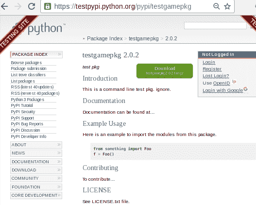

### 小贴士

**安全提示**

对于旧版本的 Python（在 v2.7.9 或 v3.2 之前），当你使用 `python seup.py sdist upload` 时，会使用 HTTP 连接上传文件。这意味着如果发生网络攻击，你的用户名和密码将面临安全风险！在这种情况下，强烈建议使用 `twine` 包。它通过验证的连接安全地使用 HTTPS 上传发行版。

对于 Python 2.7.9+ 和 3.2+，HTTPS 是上传发行版的默认选择。但你仍然可以使用 `twine` 来获得之前讨论的其他优势。有关更多信息，请访问 [`pypi.python.org/pypi/twine`](https://pypi.python.org/pypi/twine)。

## 一个命令就能完成所有操作

现在我们已经知道了所有步骤，让我们将这些三个步骤结合起来，即注册项目、创建发行版，以及将发行版上传到单个命令中。

为了使这生效，我们将在 `setup.py` 中进行两个小的修改，如下所示：

1.  将 `name` 字段更改为另一个唯一的名称。这应该与你在之前步骤中选择的名称不同。

1.  更新 `url` 字段以反映这个新名称。

在终端窗口中运行以下命令后，这些更改将生效：

```py
$ python setup.py register -r pypitest sdist upload -r pypitest

```

这是一个三个命令的序列组合。第一个命令，`register -r pypitest`，注册一个新的项目；第二个命令，`sdist`，创建源发行版；最后，第三个命令，`upload -r pypitest`，将发行版提交到 PyPI 测试仓库！

## 安装自己的发行版

现在可以使用 pip 安装这个发行版。让我们自己安装它以确保没有问题。运行以下代码片段中的 `pip` 命令。将 `testgamepkg` 替换为你上传的发行版名称：

```py
$ pip install -i https://testpypi.python.org/pypi testgamepkg

```

`-i`（或者 `--index-url`）选项指定 PyPI 的基本 URL。如果你不指定此选项，它将默认为 [`pypi.python.org/simple`](https://pypi.python.org/simple)。以下是执行 `install` 命令时的一个示例响应：

```py
Collecting testgamepkg 
Downloading https://testpypi.python.org/packages/source/t/testgamepkg/testgame pkg-2.0.0.tar.gz 
Installing collected packages: testgamepkg 
  Running setup.py install for testgamepkg 
Successfully installed testgamepkg-2.0.0
```

一旦包成功安装，通过调用该包的功能来测试它。例如，启动你的 Python 解释器并编写以下代码：

```py
>>> from wargame.attackoftheorcs import AttackOfTheOrcs 
>>> game = AttackOfTheOrcs() 
>>> game.play()

```

如果你没有看到任何错误，那么一切按预期工作！现在，我们的用户可以在 PyPI 测试网站上一般性地获取这个发行版。


| *你说得对。我们只讨论了使用 Python 社区仓库的开放分发！如果你想创建私有分发，你应该设置并维护自己的 PyPI 仓库。让我们接下来讨论这个话题。* |
| --- |

# 使用私有 PyPI 仓库

本节将简要介绍如何设置私有 PyPI 仓库。讨论将限于创建一个简单的基于 HTTP 的本地服务器。有几个包可以帮助你完成这项工作。让我们使用一个流行的包，称为 `pypiserver` ([`pypi.python.org/pypi/pypiserver`](https://pypi.python.org/pypi/pypiserver))。让我们打开一个终端窗口并准备行动。

## 步骤 1 – 安装 pypiserver

首先，安装所需的包：

```py
$ pip install pypiserver 

```

`pypi-server` 可执行文件位于与 Python 可执行文件相同的目录。例如，如果你有 `/usr/bin/python`，则 `pypi-server` 将作为 `/usr/bin/pypi-server` 可用。

## 步骤 2 – 构建新的源分发

前往包含 `setup.py` 和所有其他文件的目录。在前面讨论中，我们将其命名为 `testgamepkg`：

```py
$ cd /path/to/testgamepkg

```

我们已经在前面部分安装了 `testgamepkg`。为了简化，在 `setup.py` 中，让我们将 `name` 字段更改为其他内容。在此过程中，也请更改 `url` 和 `version` 字段。带有这些更改的 `setup.py` 如下截图所示。更改已突出显示：

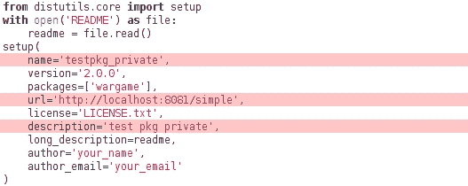

现在，让我们创建一个名为 `testpkg_private` 的新源分发。和以前一样，存档将创建在 `dist` 目录中：

```py
$ python setup.py sdist 

```

## 步骤 3 – 启动本地服务器

接下来，让我们在你的计算机上启动一个本地服务器：

```py
$ pypi-server -p 8081 ./dist

```

`-p` 选项用于指定端口号。你可以选择除 `8081` 以外的数字。命令还接受一个目录作为参数。我们将其指定为 `dist` 目录。这就是它将搜索你的私有分发包的地方。

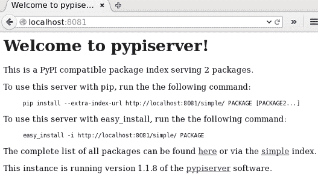

服务器将监听 `http://localhost:8081`。就这样！在浏览器中打开此 URL。它将显示一个带有说明的简单网页，如前一个截图所示：

## 步骤 4 – 安装私有分发

在 `http://localhost:8081` 的安装说明是自我解释的。你可以点击 **简单** 链接查看所有可用的包。它基本上显示了我们在启动服务器时指定的 `dist` 目录的内容。如果你想包含任何额外的包，你可以简单地将其复制到这个目录。以下命令安装此私有分发：

```py
$ pip install -i http://localhost:8081 testpkg_private

```

### 小贴士

这只是一个快速介绍如何设置私有 PyPI 仓库。为了说明，我们只是基于 HTTP 创建了一个本地服务器。在实践中，你应该设置一个使用 HTTPS 协议的安全服务器并验证用户，类似于 PyPI 网站所做的那样。此外，我们有一个基本的机制，其中包被复制到仓库目录。在现实世界的情况下，你需要支持远程上传。有关进一步阅读，请访问`pypiserver`的 GitHub 页面[`github.com/pypiserver/pypiserver`](https://github.com/pypiserver/pypiserver)。其他一些有助于设置私有仓库的包包括位于[`pypi.python.org/pypi/pyshop`](https://pypi.python.org/pypi/pyshop)的`pyshop`和位于[`pypi.python.org/pypi/djangopypi`](https://pypi.python.org/pypi/djangopypi)的`djangopypi`。

# 制作增量发布

包已经发布，但这并不是故事的结束。很快，你将需要对代码进行更改并再次使新版本可用。在本节中，我们将学习如何向已部署的分布提交增量补丁。

## 打包和上传新版本

准备新版本发布相当简单。只需在`setup.py`文件中将版本号更新为，例如`2.0.1`。在做出这个更改后，运行之前创建源分布并一次性上传包的命令：

```py
$ python setup.py sdist upload -r pypitest

```

v2.0.1 的增量发布现在将在 PyPI 测试仓库中可用。

## 升级已安装的版本

如果包的先前版本已经安装在你的计算机上，请使用`--upgrade`选项更新到最新发布版本。这一步是可选的，但始终是一个好习惯来验证发布版本是否按预期工作：

```py
$ pip install -i https://testpypi.python.org/pypi testgamepkg --upgrade

```

如我们之前所做的那样，将名称`testgamepkg`替换为你选择的包名。

# 代码版本控制

让我们回顾一下到目前为止我们所做的工作。我们从一个简单的脚本开始应用程序开发。逐渐地，我们对应用程序进行了重新设计，添加了新功能并修复了错误，使其转变为现在的状态。如果你想要回到代码的早期状态，比如说两天前你写的代码，你会怎么做？你可能出于各种原因想要这样做。例如，最新的代码可能有一些你在两天前没有看到的错误。想象另一种场景，你正在与你的同事合作一个项目，你们所有人都需要工作在同一组文件上。我们如何完成这个任务？

在这种情况下，一个**版本控制系统**（**VCS**）会帮助我们。它记录了你所做的代码更改。现在文件和目录都有了与之关联的版本。VCS 使你能够拉取任何文件的特定版本。

目前有几种版本控制系统在使用中。Git、SVN、CVS 和 Mercurial 是最受欢迎的开源 VCS 之一。在这本书中，我们将介绍一些关于使用 Git（一个分布式版本控制系统）的初步操作指令。

## Git 资源

Git 是协作开发的一个非常强大的工具。这是一个相当大的主题。本章仅简要概述了一些常见用例。这里的目的是提供一组最小的指令，以便将我们的 Python 应用程序代码纳入版本控制。

### 注意

以下是一些涵盖 Git 的资源的链接，其深度远超我们的范围：

+   [`git-scm.com/documentation`](https://git-scm.com/documentation)

+   [`gitref.org`](http://gitref.org)

如果您已经熟悉 Git，或者使用过 SVN 等其他版本控制系统，请直接跳转到最后的话题以解决练习。此外，即将进行的讨论将主要关注从命令行使用 Git。如果您更喜欢 GUI 客户端，*使用 GUI 客户端进行 Git*这一节将提供一些提示。

## 安装 Git

Git 软件可以从[`git-scm.com/downloads`](https://git-scm.com/downloads)下载。该网站为各种操作系统提供了详细的安装说明。

对于大多数 Linux 发行版，可以使用操作系统的包管理器简单地安装。例如，在 Ubuntu 上，可以从终端安装，如下所示：

```py
$ sudo apt-get install git

```

对于 Windows 操作系统，可以使用 Git 网站上的安装程序进行安装。安装完成后，您应该能够从命令行访问 Git 可执行文件。如果不可用，请在您的环境变量中将`PATH`添加到其可执行文件中。

## 配置您的身份

在创建 Git 仓库并提交任何代码之前，您应该告诉 Git 您的身份：

```py
$ git config --global user.name  "YOUR NAME HERE" 
$ git config --global user.email YOUR_EMAIL_HERE
```

使用此命令，您所做的任何提交都将自动与您的用户名和电子邮件地址关联。

## 基本 Git 术语

让我们了解 Git 中一些常用的命令。这个列表远非详尽无遗。目的是仅学习最常用的 Git 命令：

+   `add`：这是一个用于将任何文件或目录纳入版本控制的关键字。使用`add`命令，Git 索引将被更新，新文件将被暂存以供下一次提交，同时还包括目录中的其他更改。

+   `commit`：在更改任何受版本控制文件后，可以使用此关键字将文件提交到仓库以注册更改。换句话说，Git 为文件记录了一个新版本，其中还包含有关谁进行了这些更改的信息。在提交文件时，您还可以添加有关所做更改的说明性消息。

+   `clone`：在 Git 术语中，这个关键字意味着将原始仓库复制到一个新的仓库中。您计算机上的这个克隆仓库可以用作源代码的本地或工作仓库。这样的仓库会跟踪您对包含代码的所有本地更改。

+   `push`：假设你有一个与你的团队共享的中央仓库。它可能位于远程服务器上。你已经在你的电脑上克隆了这个仓库，并对这个仓库进行了几个更改。现在你想要将这些更改提供给其他人。`push` 命令用于将这些更改发送到中央仓库。

+   `pull`：你已经使用 `push` 命令更新了中央仓库。现在，如果其他人想要使用这个代码，他们的克隆仓库需要与中央仓库同步。`pull` 命令可以用来使用中央仓库中可用的新更改更新克隆仓库。如果使用此命令更新的任何文件都有本地修改，Git 将尝试将中央仓库的更改合并到本地仓库中。

## 创建和使用 Git 仓库

让我们为我们的应用程序设置一个 Git 仓库。我们即将遵循的步骤在以下简化的示意图中表示。

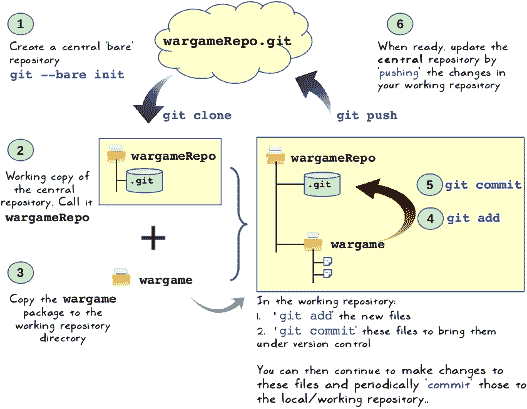

### 小贴士

有许多方法可以将代码纳入版本控制。这里展示的只是其中一种选项。例如，你可以在现有的 `wargame` 软件包目录中直接使用 `git init` 而不是创建裸仓库然后克隆它。

### 创建裸远程仓库

首先，我们将创建一个 **裸** Git 仓库。它只是一个存储你的项目修订历史记录的目录。请注意，它没有任何提交或分支。我们将使用这个裸仓库作为我们的中央或远程仓库。

### 小贴士

Git 使用远程仓库的概念。在这本书中，我们不会真正设置一个真正的远程仓库。远程仓库将只是你电脑上的另一个本地目录。为了避免混淆，在接下来的讨论中，我们将把远程仓库称为中央仓库。远程仓库和 Git 分支的详细信息存储在 `.git/config` 文件中。

习惯上是在名称后添加 `.git` 扩展名。在命令行中，执行以下命令以初始化一个裸仓库：

```py
$ mkdir wargameRepo.git
$ cd wargameRepo.git
$ git --bare init

```

首先，创建一个名为 `wargameRepo.git` 的目录。在这个目录内部，`git --bare init` 命令初始化一个新的仓库。这个命令为你的项目创建一个 `.git` 目录。点前缀表示这是一个隐藏目录。`--bare` 选项表示这是一个裸仓库。

### 克隆仓库

如前所述，`clone` 命令可以用来创建中央仓库的副本。以下是执行此操作的命令：

```py
$ git clone ~/wargameRepo.git wargameRepo
Cloning into 'wargameRepo'... 
warning: You appear to have cloned an empty repository. 
done.

```

在这里，它将 `wargameRepo.git` 克隆为 `wargameRepo`（一个新目录）。这假设你没有任何同名目录。现在你可以使用克隆的仓库，`wargameRepo`，作为你的工作副本。这个仓库包含完整的工作树。然而，在这种情况下，里面除了 `.git` 文件夹外没有其他内容。接下来，我们将向这个工作树添加文件和目录。

### 将代码复制到克隆的仓库中

在克隆后，将之前创建的 `wargame` 包复制到克隆的仓库中。此操作后的目录结构如下所示：


### 预处理代码并提交

只是将代码复制到仓库并不意味着它被版本控制。为了做到这一点，打开命令提示符，并使用 `cd` 命令转到 `wargameRepo` 目录。

```py
$ cd wargameRepo

```

现在，运行以下命令。注意命令中的点。这假设 `git` 在你的终端窗口中被识别为一个命令。如果不是这样，你需要更新 `PATH` 环境变量，或者直接指定此可执行文件的完整路径。

```py
$ git add  .

```

这告诉 Git 将当前目录中的所有内容进行暂存以进行提交。在这种情况下，它将添加 `wargame` 目录及其内部的所有文件。如果你运行 `git status` 命令，它将显示所有为初始提交准备的新文件（无论何时发生）。下一步是实际上提交我们工作仓库中的文件：

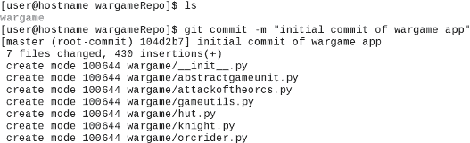

`git commit` 命令中的 `-m` 参数用于指定关于提交内容的描述性信息。在此命令之后的消息将显示在执行此命令后从 Git 收到的响应中。

### 将更改推送到中央仓库

这一步非常有用，尤其是在你与其他开发者共同开发代码时。在这种情况下，将会有一个中央仓库，我们之前使用 `--bare` 选项创建的。为了使你的更改对他人可用，你需要将这些更改推送到中央仓库。如前所述的旁注中提到，这个中央仓库只是你电脑上另一个 Git 目录。

我们从一个空的仓库开始。对于初始推送到中央仓库，请执行以下命令：

```py
$ git push origin master

```

这里的 `origin` 是什么意思？回想一下，我们克隆的仓库 `wargameRepo` 是从中央仓库 `wargameRepo.git` 出发的。`origin` 简单来说就是指向你的中央仓库的 URL。第二个参数 `master` 是 Git 中的分支名称，更改将被推送到这个分支。默认分支被称为 master。你也可以创建不同的分支。我们将限制这次讨论到默认分支。`.git/config` 文件存储了关于本地仓库中 origin 和分支的详细信息。

总结一下，前面提到的命令是将你工作仓库中的 master 分支推送到中央仓库中的新 master 分支（`origin/master`）。

在初次推送后，如果你对代码进行了任何修改，你首先需要在工作仓库中提交这些修改：

```py
$ git commit -m "some changes to files" foo.py

```

假设你继续在同一个分支（master）上工作，对于任何后续推送到中央仓库的操作，只需执行以下命令：

```py
$ git push

```

这将更新中央仓库的 master 分支以包含你的更改。有了这个，你就可以准备好与其他开发者共享你的代码了。如果你想获取其他开发者所做的更改，可以使用 `$ git pull` 来获取这些更改并将它们合并到你的工作副本中。我们没有讨论其他 Git 功能，如对代码打标签、创建分支、解决冲突等。建议你阅读 Git 文档，[`git-scm.com/doc`](https://git-scm.com/doc)，以更好地理解这些概念。

# 使用 Git 的 GUI 客户端

早期章节专门讨论了如何从命令行使用 Git。这些命令也可以通过图形用户界面（GUI）访问。有许多 Git 的 GUI 客户端可用，例如 Linux 上的 **gitk** ([`gitk.sourceforge.net/`](http://gitk.sourceforge.net/)) 或适用于 Mac 和 Windows 7 或更高版本的 **Github Desktop** ([`desktop.github.com/`](https://desktop.github.com/))。免费的 Python IDE，如 PyCharm 的社区版，为 Git 和其他版本控制系统提供了易于使用的 GUI 集成。PyCharm 为 Git 命令提供了上下文菜单集成。例如，在 IDE 中右键单击文件将提供一个上下文菜单选项，用于将文件添加或提交到仓库。

# 练习

由于这只是一个小问题，我们将分发版发布到了 PyPI 测试仓库。对于更严肃的内容，你应该将包部署到 PyPI 主仓库，[`pypi.python.org/pypi`](https://pypi.python.org/pypi)。作为一个练习，将包部署到主 PyPI 服务器。这个过程与我们之前讨论的类似。

+   在 PyPI 网站上创建一个新账户。请注意，你需要创建一个单独的账户；测试 PyPI 账户在这里不起作用。

+   在 `.pypirc` 文件中，创建一个新的配置文件来存储主服务器的凭证。以下插图可以提供灵感：

    ```py
    [distutils] 
    index-servers= 
    pypitest 
    pypimain

    [pypimain]
    repository = https://pypi.python.org/pypi
    username=<add PyPI main username>
    password=<add PyPI main password>

    [pypitest] 
    repository = https://testpypi.python.org/pypi 
    username=<add username>
    password=<add password>
    ```

+   适当地更新 `setup.py` 中的 `url` 字段。

+   按照包创建和发布的其他步骤进行。请记住，在所有地方指定主仓库，而不是测试仓库。例如：

    ```py
    $ python setup.py register -r pypimain
    $ python setup.py sdist upload -r pypimain

    ```

+   看看如果不指定 `-r` 选项会发生什么？它会默认到哪个仓库？

# 摘要

本章介绍了应用开发的一些关键方面，特别是 Python 应用开发。本章从介绍不同的版本控制约定开始。它演示了如何创建 Python 模块和包。

通过逐步说明，本章演示了如何准备一个分发版（也称为包），将其部署到 PyPI 测试服务器，并使用 pip 安装已部署的包。此外，它还展示了如何进行增量发布和设置私有 Python 分发。最后，本章概述了使用 Git 进行版本控制。

编码规范是一套你在编写代码时应该遵循的指南。遵守这些规范可以对代码的可读性和代码的寿命产生重大影响。在下一章中，你将学习软件开发的重要方面之一，即代码文档和最佳实践。
