# 第四章：文档和最佳实践

到目前为止，我们的重点是开发代码和推出第一个版本。我们还没有谈到应用开发的另一个重要方面，即文档和编码标准。尽管代码库仍然相当易于管理，但在为时已晚之前，我们应该学习提高代码可读性的技术。在本章中，我们将涵盖以下主题：

+   理解 **reStructuredText** （**RST**） 格式的基础以及如何使用它来编写文档字符串

+   学习如何使用 **Sphinx** 文档生成器为代码创建 HTML 文档

+   涵盖一些重要的编码标准以编写 Python 代码

+   使用 **Pylint** 来评估我们遵循这些指南的情况

如您从前面的话题中可以猜到的，我们暂时从编码中抽身，学习这些非常重要的概念。

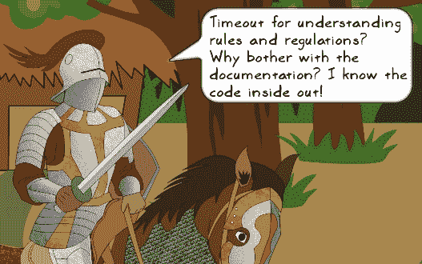

| *如果你对代码非常熟悉，你可能会觉得文档是不必要的。但想象一下，你被分配了一个拥有大量代码库但文档很少的不同项目。你会怎么想？当然，你无论如何都要审查代码以熟悉它。但如果代码没有很好地记录，你的生产力将会受到打击。你花费在理解这种代码上的时间也取决于它编写得有多好。这就是编码标准方面发挥作用的地方。* |
| --- |

总结来说，永远不要忽视编码标准和文档。确保在代码开发过程中遵循这些指南。维护文档并不过度文档化也很重要。让我们从学习为 Python 项目创建良好文档的技术开始。

# 记录代码

广义上，有三种级别的文档。在顶部，你有项目或 **分发级别文档**。它的目的是提供关于项目的高级信息，例如安装说明、许可条款等。在 第三章 中，*模块化、打包、部署！*，你已经感受到了这种文档的滋味。我们创建了 `README` 和 `LICENSE` 文件来配合分发。此外，你可以添加更多文件以使文档更全面，例如 `INSTALL`、`TODO`、`RELEASENOTES`、`CREDITS` 等。

第二级是 **API 级文档**。它总结了如何使用函数、方法、类或模块。我们将在下一节学习的 Python 文档字符串用于生成 API 级文档。

第三级文档是以 **代码注释** 的形式存在的。这样的注释有助于解释代码是如何工作的。

**Sphinx** 是一个用于 Python 的文档生成工具，用于创建项目和 API 级别的文档。在本章中，我们将使用 Sphinx 从文档字符串创建 API 级别的文档。但在深入这个主题之前，让我们首先了解 Python 中的文档字符串是什么。

### 注意

**Python 增强提案 (PEPs)** 提供了一种提出和记录 Python 语言各种设计标准的方法。有几个 PEPs，每个都有一个永久编号。例如，*PEP 8*，*PEP 257*，*PEP 287* 等等。

*PEP 257* 记录了编写文档字符串的指南，而 *PEP 287* 提供了关于 reStructuredText 文档字符串格式的信息（关于 reStructuredText 格式的更多内容将在本章后面介绍）。

本章的目的不是重复这些 PEPs 已经记录的内容。在接下来的章节中，我们会适当参考这些指南。为了全面理解这些和其他 PEPs，请查看 [`www.python.org/dev/peps`](https://www.python.org/dev/peps)。

## 文档字符串

文档字符串或文档字符串是一个用于描述类、方法、函数或模块的字符串字面量。文档字符串的目的是简要描述代码的功能。它与详细阐述代码内部工作原理的注释不同。它可以通过内置属性 `__doc__` 访问。让我们写一个例子来说明这个概念。打开 Python 解释器并编写以下简单的函数：

```py
>>> def get_number(): 
...     return 10
... 
>>>

```

让我们看看这个函数的 `__doc__` 属性存储了什么：

```py
>>> get_number.__doc__ 
>>> 

```

函数的 `__doc__` 属性是一个空字符串，因为我们还没有为这个函数编写任何文档。现在让我们为这个函数编写一个文档字符串，并再次打印这个属性：

```py
>>> def get_number(): 
...     """Return a special number""" 
...     return 10 
... 
>>> get_number.__doc__ 
'Return a special number'

```

现在的 `__doc__` 属性显示了函数的文档字符串。如所见，文档字符串的表示方式与注释不同。它被三重双引号（推荐风格）`"""Return a special number"""` 或三重单引号 `'''Return a special number'''` 所包围，并作为该类、方法、函数或模块的第一个语句编写。

### 小贴士

**PEP 257**

之前代码中显示的简单示例是单行文档字符串。同样，你也可以有多行文档字符串。查看 PEP 257 规范 ([`www.python.org/dev/peps/pep-0257`](https://www.python.org/dev/peps/pep-0257)) 以获取更多详细信息。

要使用 Sphinx 生成有效的文档，文档字符串应该用一种称为 reStructuredText 的标记语言编写。让我们了解这种格式的基础知识。

## reStructuredText 简介

**reStructuredText** （**RST**）定义了一种简单的标记语法，主要用于 Python 文档。它是 Python 文档处理系统的一部分，称为 **docutils** ([`docutils.sourceforge.net/index.html`](http://docutils.sourceforge.net/index.html))。

### 小贴士

**RST**

这听起来熟悉吗？在 第三章 中，没有太多解释，我们创建了一个 RST 格式的 `README` 文件。在该章中，参考 *准备分发* 部分以获取更多信息。本节将向您提供一个关于 RST 语法的最低限度介绍。有关进一步阅读，完整的文档可在 [`docutils.sourceforge.net/rst.html`](http://docutils.sourceforge.net/rst.html) 获取。

让我们回顾一下 RST 最常用的功能。

### 部分标题

为了区分部分标题和其余文本，它被使用任何非字母数字字符（如 `~~~~`、`====`、`–---` 或 `####`）创建的下划线装饰。装饰的下划线应与标题文本的长度相同（或更长），如下例标题所示：

```py
1\. Introduction
----------------
```

在这里，破折号 (`---`) 用于装饰标题。假设这被认为是文档中的 *标题 1* 样式；任何后续使用此装饰器都将产生相同的样式。在下面的屏幕截图中，RST 语法显示在左侧列；右侧列显示了在浏览器中的显示方式：

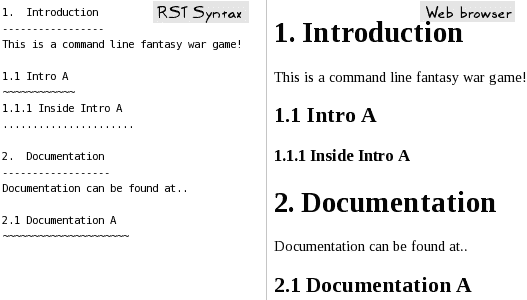

### 小贴士

**试试看！**

您可以使用在线 RST 编辑器，如 [`rst.ninjs.org`](http://rst.ninjs.org)，快速测试您的 RST 文件将如何被处理。

### 段落

要创建一个段落，只需写一个。完成后，在段落末尾至少留一个空白行。此外，如果在 RST 文件中缩进一个段落，它将在浏览器中显示为缩进的块。以下是写两个段落的 RST 语法：

```py
para1\. Just write the sentences in the para 
and end it by adding one or more blank line.

    para2 . blah blah blah. 
    ...more stuff in paragraph 2 See how it gets appended.. 
```

作为练习，使用任何在线 RST 编辑器，看看它将在网页浏览器中如何显示。

### 文本样式

你可以在段落内部或正文文本中应用不同的文本样式。使用双星号装饰文本以使其显示为粗体，例如，`**粗体文本**`。同样，单个星号装饰 `*斜体文本*` 用于 *斜体* 样式。

### 代码片段

RST 提供了各种指令来处理格式化的文档块。`code-block` 指令通过语法指定，例如，`.. code-block::`。请注意，在单词 `code-block` 和前面的两个点之间有一个空格。`code-block` 指令可以与代码语言一起指定来构建一个文本块。在下面的 RST 示例中，我们指定了 Python 作为代码语言：

```py
.. code-block:: python 

    from wargame.attackoftheorcs import AttackOfTheOrcs 
    game = AttackOfTheOrcs() 
    game.play() 
```

`code-block` 指令的参数指定为 `python`。它告诉文档生成器这是 Python 语法。此外，请注意，在编写实际代码之前，指令之后应该有一个空白行。你也可以使用 `code` 指令，`.. code::`，来表示一段代码。对于语法高亮，需要一个名为 **Pygments** 的 Python 包。我们将在学习 Sphinx 文档生成器时进一步讨论这个问题。

### 数学公式

`math`指令用于编写数学方程。请注意，您需要在数学方程块前后留出空白空间。以下语法（左侧列）是表示数学公式的一种方式。右侧列显示了它在网页浏览器中的显示方式：

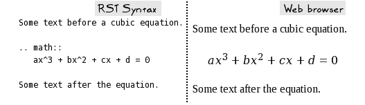

### 列表和编号

可以使用以下任何字符添加项目符号：`*`、`+`或`-`。要求在第一个项目符号之前和最后一个项目符号之后至少有一个空白行：

```py
Text before the bullet points. A blank line follows...

* First bullet item
  Some continuation text for first bullet, 
  Note that its alignment should match the bullet it is part of.  
* second bullet item
* last bullet item

Text after the bullets. Again needs a blank line after the last bullet. 
```

类似地，您可以指定编号列表，如下所示：

```py
Text before the enumerated list. A blank line follows...

1\. item 1
2\. item 2
   some continuation stuff in item 2
3\. item 3

Text after the enumerated lust. Again needs a blank line after the last item. 
```

### 小贴士

**需要记住的关键事项**

RST 语法要求您在不同样式块之间留出空白行。例如，当您编写代码片段、数学方程或段落时，您需要在这些文档块前后各留一个空白行。RST 对缩进敏感。

## 使用 RST 的文档字符串

为了生成我们应用程序的漂亮文档，我们首先需要用 RST 格式编写文档字符串。*PEP 287*提出了使用 RST 格式编写文档字符串的指南。有关全面描述，请查看[`www.python.org/dev/peps/pep-0287`](https://www.python.org/dev/peps/pep-0287)。在这里，我们将讨论您编写文档字符串时需要记住的一些最重要的要点。为了说明这个概念，让我们为`wargame/hut.py`模块编写一个文档字符串。文档也提供了该章节的补充代码。

以下代码截图显示了`Hut`类的示例类级别文档字符串：

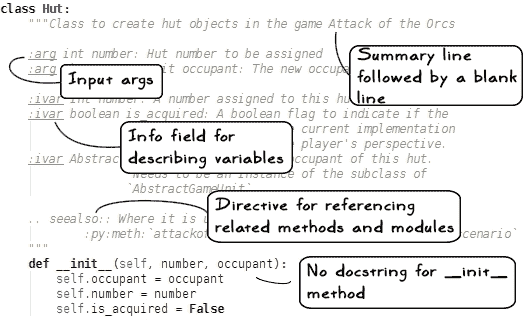

让我们现在回顾一下这个语法：

+   文档标准建议在下一描述块之前留有一行总结，并留有空白行。

+   `:arg`字段描述了此类输入参数，如`__init__`方法中给出的。您也可以使用`:param`字段。

+   `:ivar`字段用于描述类的实例变量。您可以选择在相同行上指定实例变量的类型，例如：

    ```py
    :ivar int number: A number assigned to this hut.
    :ivar AbstractGameUnit occupant: The occupant of...
    ```

    当 Sphinx 生成 HTML 文档时，实例变量类型将显示在其名称旁边。它还会尝试创建对该类型的链接。

+   `.. seealso::`字段指令用于引用与该类相关的任何重要内容。

+   `:py:meth:`字段用于交叉引用方法。请注意，方法名称应由反引号（符号`` ` ``）括起来。

+   注意我们没有为`__init__`方法编写任何文档字符串。指南建议您为类或其`__init__`方法编写文档字符串。为了简单起见，让我们遵循刚才展示的风格，即在类级别编写文档字符串。

### 小贴士

当 Sphinx 生成文档时，默认情况下，它会忽略 `__init__` 方法的文档字符串。您可以使用 `conf.py` 中的 `autodoc-skip-member` 事件来更改此默认行为。有关更多信息，请参阅 [`sphinx-doc.org/ext/autodoc.html#skipping-members`](http://sphinx-doc.org/ext/autodoc.html#skipping-members)。

Sphinx 生成的 `Hut` 类的 HTML 文档将如图所示。您将很快学会如何创建这样的文档！

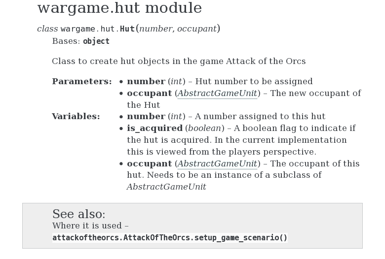

刚才展示的内容应作为一个基本示例。您可以使用 RST 和 Sphinx 做很多事情。下表列出了编写文档字符串时最常用的功能（指令、信息字段和语法）。请像前例中所示那样使用这些字段。要获取全面文档，请访问 Sphinx 网站 ([`sphinx-doc.org`](http://sphinx-doc.org))。

| 信息字段或指令 | 描述 |
| --- | --- |
| `:param` | 参数描述。 |
| `:arg` | 用于描述输入参数。 |
| `:key` | 关键字描述。 |

| `:type` | 参数或参数的类型，例如，`int`，`string` 等。您也可以使用替代语法，例如：

```py
:param type param_name: description 
```

|

| `:ivar` 或 `:var` | 任何变量描述。通常用于实例变量。 |
| --- | --- |
| `:vartype` | 变量类型描述。 |

|

+   `:py:meth:`

+   `:py:func:`

+   `:py:class:`

+   `:py:attr:`

| 用于交叉引用 Python 方法、函数、类或属性的语法。例如，`` :py:meth:`MyClassA.method_a` `` 将显示为 `MyClassA.method_a()`。 |
| --- |
| `.. code::` | 可以在此处包含任何代码示例。此指令下的部分将由 Sphinx 文档生成器作为代码块处理。 |
| `.. todo::` | 使用此指令列出 TODO 项。 |
| `.. note::` | 使用笔记指令记录任何值得注意的内容。 |
| `.. warning::` | 用于在文档字符串中写入警告的指令。警告块通常以浅红色背景显示。 |
| `.. seealso::` | 使用此指令引用与您正在编写的文档字符串相关的代码（方法、函数等）。 |

## 文档字符串格式化样式

在本章中，我们将仅使用默认的 RST 格式来编写文档字符串。各种项目遵循自己的约定来编写文档字符串。许多这些样式与 Sphinx 文档生成器兼容。

这里将简要讨论 *Google Python 风格指南* ([`google.github.io/styleguide/pyguide.html`](https://google.github.io/styleguide/pyguide.html))。这种风格因其简洁性而被广泛使用。您将在下面的代码截图中看到这一点。这是我们为 `Hut` 类编写的相同文档字符串，使用 *Google Python 风格指南* 重新编写：

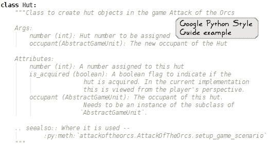

为了与 Sphinx 一起使用，您需要安装**napoleon**，这是 Sphinx 的一个扩展。它本质上是一个预处理器，可以将 Google 风格的文档字符串解析并转换为 RST 格式。有关 napoleon 的安装说明，请查看[`pypi.python.org/pypi/sphinxcontrib-napoleon/`](https://pypi.python.org/pypi/sphinxcontrib-napoleon/)。有关 Google Python 文档风格的示例，可以在 napoleon 文档页面上找到，[`sphinxcontrib-napoleon.readthedocs.org`](http://sphinxcontrib-napoleon.readthedocs.org)。

### 小贴士

**Numpy**风格的文档是 Python 社区中另一种流行的风格。它也由 napoleon 扩展支持。有关更多详细信息，请查看[`sphinxcontrib-napoleon.readthedocs.org`](http://sphinxcontrib-napoleon.readthedocs.org)。

## 自动创建文档字符串占位符

这是一个相对高级的话题，主要是因为它需要一些使用命令行工具（如**patch**）的背景知识。

在许多情况下，您甚至没有为函数、方法和类编写基本的文档字符串。或者，您可能正在遵循 Google 文档字符串风格，但现在您想切换到不同的风格，比如基本的 RST 风格。开源工具**pyment**就是为了这样的场景而设计的。它可以用来创建或更新文档字符串，也可以在 RST、Google 文档字符串和**numpydoc**等一些常见格式化风格之间进行转换。

### 小贴士

再读一遍……工具的名称是"pyment"，而不是"payment"（不要与 Python 包`Pygment`混淆）。此工具可在 GitHub 上找到（[`github.com/dadadel/pyment`](https://github.com/dadadel/pyment)）。在撰写本章时，它不在 PyPi 网站上提供。因此，您可能无法使用`pip install pyment`命令安装它。

由于 pyment 无法使用 pip 安装，安装说明不同。请遵循 GitHub 项目主页上的安装说明（[`github.com/dadadel/pyment`](https://github.com/dadadel/pyment)）。这里提供了不使用 Git 的替代安装说明：

1.  从项目主页下载 pyment 的 ZIP 存档。

1.  将此 ZIP 文件解压到某个文件夹中，例如，`pyment-master`。

1.  打开命令提示符并执行以下命令：

    ```py
    $ cd  pyment-master
    $ python setup.py install

    ```

最后一条命令应该在包含 Python 可执行文件的同一目录下安装 pyment。根据 Python 的安装位置，您可能需要以管理员身份执行前面的命令。安装完成后，按照以下方式从命令行运行此工具：

```py
$ pyment hut.py

```

这将生成一个名为`hut.py.patch`的补丁文件，其中包含基本的文档字符串占位符。

### 小贴士

这里，重要的是要注意，pyment 只会创建基本的文档字符串占位符。填写空白是我们的责任。换句话说，我们应该通过编写适当的函数或方法的总结来进一步改进这些文档字符串——关于每个输入参数（如果有的话）做了什么等的简短一行。

接下来，你预计要将这个补丁与主文件 `hut.py` 合并。在 Linux 上，使用以下 `patch` 命令（查看 [`en.wikipedia.org/wiki/Patch_(Unix)`](https://en.wikipedia.org/wiki/Patch_(Unix)) 获取更多详细信息) 将生成的文档字符串与主文件合并：

```py
$ patch hut.py hut.py.patch 
patching file hut.py 

```

### 小贴士

**Windows 用户**

这里描述的 `patch` 命令是一个 Unix 命令。在 Windows 上，修补文件可能不是那么直接。以下是一些可以用来应用补丁的选项：

+   **Gnu utilities for win32**：这将还会安装一些在 Unix 平台上常见的其他实用工具。使用 `patch.exe` 可执行文件来应用补丁。你可以在 [`unxutils.sourceforge.net`](http://unxutils.sourceforge.net) 查看这些工具。

+   **python-patch**：查看这个跨平台的 Python 工具 [`github.com/techtonik/python-patch`](https://github.com/techtonik/python-patch)。

+   **TortoiseMerge**：这是一个用于应用补丁的 GUI 工具 ([`tortoisesvn.net/docs/release/TortoiseMerge_en/tmerge-dug.html`](https://tortoisesvn.net/docs/release/TortoiseMerge_en/tmerge-dug.html))。

这样，`hut.py` 模块应该会显示基本的文档字符串占位符。我们已经对创建文档字符串有了基本理解。让我们使用 Sphinx 将文档提升到下一个层次。

## 使用 Sphinx 生成文档

Sphinx 是 Python 的**事实标准**文档生成工具。不要将其与文档字符串混淆。文档字符串是你用来总结对象行为的内容。例如，类的文档字符串通常根据你的项目文档指南列出实例变量和公共方法。

Sphinx 使用这样的文档字符串或任何 RST 文件来创建看起来很棒的文档。它可以生成各种输出格式的文档，如 HTML、PDF 等。让我们一步一步地使用 Sphinx 生成 HTML 格式的 API 文档。

### 第 1 步 – 使用 pip 安装 Sphinx

Sphinx 可以使用 pip 安装，如下所示命令行：

```py
$ pip install Sphinx

```

### 小贴士

pip 是用于安装 Python 包的包管理器。有关 pip 的更多信息，请参阅 第一章，*开发简单应用程序*。

这会创建四个可执行脚本，`sphinx-autogen`、`sphinx-apidoc`、`sphinx-build` 和 `sphinx-quickstart`。

### 小贴士

在 Linux 上，这些可执行文件放置在与你的 Python 可执行文件相同的位置。例如，如果 Python 可用为 `/usr/bin/python`，则 Sphinx 可执行文件可以从相同的位置访问。在 Windows OS 上，Sphinx 可执行文件放在 `Scripts` 目录中。这是你放置 `pip.exe` 的同一目录。有关更多详细信息，请参阅第一章*开发简单应用程序*。

为了代码的语法高亮显示，Sphinx 使用一个名为 **Pygments** 的工具([`pygments.org`](http://pygments.org))。如果它尚未包含在你的 Python 发行版中，请使用 pip 安装此包：

```py
$ pip install pygments

```

### 步骤 2 – 切换到源目录

在第三章*模块化、打包、部署*中，我们创建了一个名为 `wargame` 的 Python 包，其中包含所有模块。打开一个终端窗口并 `cd` 到此目录。目录内容如下所示：

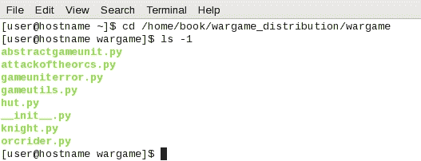

### 步骤 3 – 运行 sphinx-quickstart

如其名所示，此脚本将帮助你开始使用 Sphinx。它设置一个目录，文档文件将放置于此，并创建一个默认配置文件 `conf.py`。运行以下命令：

```py
$ sphinx-quickstart

```

当你运行此工具时，它将询问你几个问题以完成基本设置。在 Mac 上按 *return* 键或在其他系统上按 *Enter* 键选择大多数问题的默认答案。我们将为几个问题定制答案，如下所示。第一个提示要求输入放置文档的目录。我们将为此目的创建一个名为 `docs` 的新目录：

```py
> Root path for the documentation [.]: docs 

> Separate source and build directories (y/n) [n]: y 

> Project name: wargame

> Author name(s): Your_Name 

> Project version: 2.0.0 

Please indicate if you want to use one of the following Sphinx extensions: 
> autodoc: automatically insert docstrings from modules (y/n) [n]: y

```

最后一个答案启用了 Sphinx 的 `autodoc` 扩展。此扩展将帮助我们创建从之前创建的 docstrings 生成的文档。将其他问题保留为默认答案。最后，`sphinx-quickstart` 打印以下摘要信息：

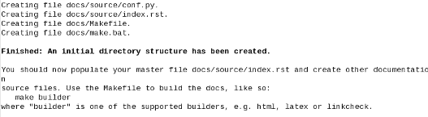

此脚本创建的目录结构如下所示：

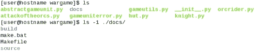

生成的 `Makefile`（Linux/Mac）和 `make.bat`（Windows OS）将在本主题的最后一部分使用，即*步骤 6 – 构建文档*。`docs/source` 目录是我们需要放置所有 RST 文件（或文档源文件）的地方。默认情况下，它会创建一个空的 `index.rst` 文件。它还包含一个名为 `conf.py` 的文件，接下来将对其进行讨论。

### 步骤 4 – 更新 conf.py

`sphinx-quickstart` 脚本创建了一个构建配置文件，`conf.py`。这里，它位于 `docs/source/conf.py`。这是定义所有 Sphinx 定制的文件。例如，你可以在生成文档时指定要使用的 Sphinx 扩展。在上一个步骤中，我们启用了 `autodoc` 扩展以包含来自 docstrings 的文档。它在 `conf.py` 中的表示如下：

```py
extensions = [   'sphinx.ext.autodoc', ]
```

为了处理与 `.. todo::` 指令相关的某些警告，将以下内容添加到 `extensions` 列表中（你也可以在 `sphinx-quickstart` 中指定此内容）：

```py
extensions = [   'sphinx.ext.autodoc', 'sphinx.ext.todo', ]
```

我们只需要对这个文件进行一点小的修改。由于我们的源代码不在 `docs` 目录下，我们需要添加一个适当的路径，以避免在生成文档时出现导入错误。取消以下代码行的注释。你应该在这个 `import` 语句之后立即找到这一行：

```py
#sys.path.insert(0, os.path.abspath('.'))
```

你还需要指定包含系统上 `wargame` 包的目录的完整路径。以下代码是一个示例：

```py
sys.path.insert(0,   
  os.path.abspath('/home/book/wargame_distribution')
)
```

### 步骤 5 – 运行 sphinx-apidoc

现在，是时候使用 `sphinx-apidoc` 工具创建文档源文件（RST 文件）了。此工具使用 `autodoc` 扩展从 docstrings 中提取文档。其语法如下：

```py
$ sphinx-apidoc [options] -o <outputdir> <sourcedir> [pathnames …]

```

在终端窗口中，运行以下命令（在运行以下命令之前，请确保你位于 `docs` 目录中，使用 `cd` 命令进入该目录）：

```py
$ sphinx-apidoc  -o source/ ../

```

`-o` 参数指定了生成的 RST 文件将被放置的输出目录。在这种情况下，输出目录是以 `source` 命名的目录。这个名字可能有点令人费解，但请记住，`source` 目录是我们存放文档源文件的目录。在下一步中，这些文件将被用来创建最终的输出（例如 HTML 文件）。第二个参数代表包含 Python 代码的目录路径。在这种情况下，目录路径是相对于当前工作目录指定的。你也可以指定完整的路径，例如：

```py
$ sphinx-apidoc  -o source/  /home/book/wargame_distribution

```

运行此工具后的命令行输出如下所示：

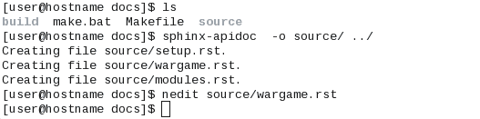

### 小贴士

作为一项练习，检查自动生成的文件 `source/wargame.rst`。它包含 `autodoc` 扩展的 `automodule` 指令。有关更多详细信息，请参阅 Sphinx 文档 ([`sphinx-doc.org/ext/autodoc.html`](http://sphinx-doc.org/ext/autodoc.html))。

### 步骤 6 – 构建文档

上一步已经创建了所有我们需要创建美观文档的原始材料！创建 HTML 文档有两种方式。第一种方式是使用 `sphinx-build` 工具，另一种方式是使用我们之前创建的 `Makefile`。接下来让我们讨论这些选项。

#### 使用 sphinx-build

使用 `sphinx-build` 工具可以轻松地生成最终的文档。在仍然位于 `docs` 目录下时，运行以下命令：

```py
$ sphinx-build source build

```

第一个参数是我们拥有所有 RST 文件的源目录，第二个参数是最终 HTML 文档将被创建的目录。在网页浏览器中打开 `docs/build/index.html` 文件，通过链接导航以查看文档！

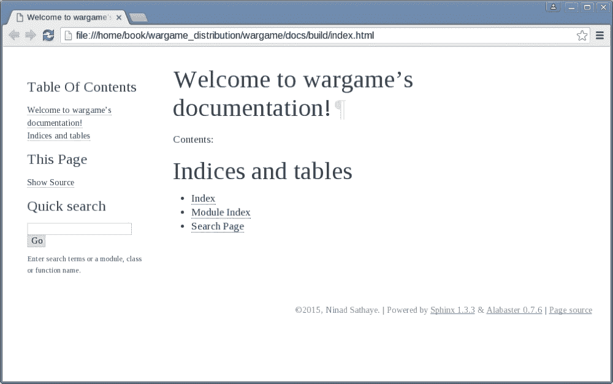

#### 使用 Makefile

`sphinx-build` 的一个替代方案是使用在 *步骤 3 – 运行 sphinx-quickstart* 中创建的 `Makefile`（或 `make.bat`）。在 Linux 上，输入以下命令（首先使用 `cd` 命令移动到 `docs/source` 目录）：

```py
$ cd /home/book/wargame_distribution/wargame/docs/source
$ make html 

```

最后一个命令在 `docs/build` 目录中创建 HTML 文档。如果你使用 Windows 操作系统，使用 `make.bat`，例如：

```py
> make.bat  html

```

现在你已经学会了如何编写良好的文档，让我们进一步了解在编写 Python 代码时应遵循哪些指南。

# Python 编码标准

编码标准作为编写高质量代码的指南。遵守这些标准可以对代码的可读性产生重大影响，并且在一般情况下对代码的生命周期产生影响。

### 小贴士

**Python 代码的 PEP 8 风格指南**

*PEP 8* 规范为编写 Python 代码提供了一个风格指南。如果你在一个遵循自己编码规范的项目上工作，而不是强制执行 *PEP 8* 标准，你应该遵守项目特定的规范。最重要的是一致性。对于任何新的项目，强烈建议使用 *PEP 8* 风格指南。在本节中，我们将介绍你应该了解的最基本的指南集合。对于全面的概述，请查看 [`www.python.org/dev/peps/pep-0008`](https://www.python.org/dev/peps/pep-0008)。

以下表格列出了在 *PEP 8* 中记录的一些编写 Python 代码的重要指南：

| Python 代码的 PEP 8 风格指南 | 详情 |
| --- | --- |
| 每个缩进级别使用四个空格 | 这可以在大多数 Python 编辑器中设置为偏好设置。 |
| 使用空格而不是制表符进行缩进 | Python 3 中不允许混合使用制表符和空格。大多数编辑器都有一个选项将制表符转换为空格。 |
| 限制最大行长度为 79 个字符 | 这可能因项目而异。一些项目遵循 80 个字符的限制。本书中的插图使用 80 列限制。大多数编辑器都会提供一个选项，在指定的列处绘制一条线，作为视觉指示。 |
| 将所有 `import` 语句放在文件顶部 | 不要在类或函数体内放置 `import` 语句。将它们移出来并放在顶部。 |

| 每行一个 `import` 语句 | 此指南的一个例外是，如果你从一个模块中导入多个对象，可以使用单个导入。以下导入是可以接受的：

```py
import os
import sys
from numpy import trapz, polyfit
```

|

| 模块名称 | 尽量保持简短。它们应该是全部小写。例如:`attackoftheorcs.py` |
| --- | --- |

| 类名 | 使用 **UpperCamelCase**，每个单词的首字母大写。例如：

```py
class AttackOfTheOrcs:
```

|

| 函数和方法名称 | 应该全部小写；如果可以提高可读性，则使用下划线。例如：

```py
def show_game_mission(self):
```

避免以下风格：`showGameMission`（**小驼峰式**）。仅在您正在从事使用此约定的项目时使用此类名称。如果您来自不同的编程背景，如 C++，这可能会让您感到惊讶。在方法和函数名称中使用下划线是 Python 的方式。 |

| 与`None`比较 | 总是像这样将变量与`None`进行比较：

```py
if my_var is None:
    # do something
```

或者像这样：

```py
if my_var is not None: 
    # do something else. 
```

永远不要像这样比较：`if my_var == None` 或 `my_var != None` |

| 异常：

+   在捕获异常时，指定异常类型而不是仅使用裸`except`子句。

+   使用`Exception`类来派生异常，而不是使用`BaseException`类。

+   避免在单个`try`子句中编写大量代码；这样做会使隔离错误变得困难。

| 参考第二章处理异常，讨论了这些指南的一些内容。 |
| --- |

| 公共和非公共属性：

+   非公共属性应该以一个前导下划线开头。

+   当不确定时，将属性设置为非公共的。

| 如第一章开发简单应用程序中所述，Python 不会强制执行任何规则来使非公共属性对外部世界不可访问。然而，一个好的做法是在作用域之外避免使用非公共属性。如果你不确定它应该被定义为公共还是非公共，作为一个起点，让它成为非公共的。以后，如果需要，可以将其更改为公共属性。请参考第五章单元测试和重构，其中我们讨论了非公共方法`_occupy_huts`的测试策略。 |
| --- |

如前所述，这只是一个全面*PEP 8*指南的代表性样本。请阅读*PEP 8*文档以获取更多详细信息。

# 代码分析 – 我们做得怎么样？

在本节中，我们将讨论帮助检测编码标准违规的工具。


| 欢迎回来，Sir Foo！你一直很安静，希望你在认真听讲。你* *提出了一个有效的担忧。开发者们在试图遵守这么多指南时可能会感到不知所措。最初，这可能看起来像是一个挑战，但练习应该会使你变得完美。话虽如此，你仍然有可能忘记一个指南。幸运的是，有一些工具不仅可以检测编码标准违规，还可以检查代码中的错误。一些工具还试图重新格式化代码以符合编码标准。让我们接下来学习这一点。* |
| --- |

## 使用 IDE 进行代码分析

在第一章 *开发简单应用程序*中列出了一些流行的 Python **集成开发环境**（**IDE**）。在查看以下讨论的任何检查工具之前，请先从您的 IDE 开始。许多 IDE 都配备了代码检查和重排工具。例如，PyCharm Community Edition 对代码检查提供了出色的支持。以下截图显示了**代码**菜单下提供的一些选项：

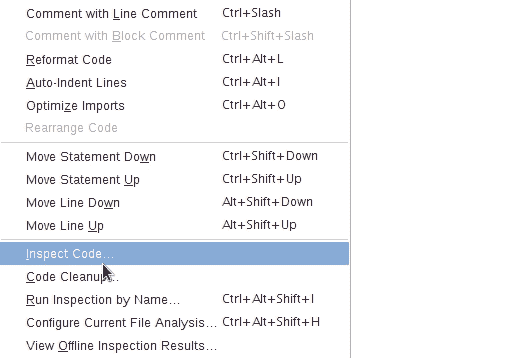

使用具有良好代码分析工具的 IDE 具有主要优势。它可以帮助您在编写代码时检测问题。该工具可以持续监控代码以查找常见的编码违规，并在代码旁边显示错误或警告的视觉指示。通常，这种指示会像拼写检查器在文字处理器中显示拼写错误一样出现。这些及时的指示在解决常见编码错误时非常有帮助。

## Pylint

**Pylint**是一个检查代码错误并警告您关于编码标准违规的工具。它与几个 IDE 集成（有关 Pylint 可用或可作为插件安装的 IDE 和编辑器的列表，请参阅[`docs.pylint.org/ide-integration`](http://docs.pylint.org/ide-integration)）。我们将看到如何将 Pylint 用作命令行工具。首先，使用 pip 安装它——根据您的 Python 安装，您可能需要管理员权限才能安装它：

```py
$ pip install pylint 

```

这将在您有 Python 可执行文件的位置安装`pylint`（或在 Windows 上的`pylint.exe`）。现在，您应该能够从命令行使用此工具。在 Linux 上，语法如下：

```py
$ pylint module_name.py

```

其中`module_name.py`是您想要检查错误和编码风格问题的文件。当您从命令行运行`pylint`时，它会打印出详细的分析报告。此报告包含有关编码风格、警告、错误和重构需求的信息。最后，它根据 10 分制对您的代码进行评分。

您还可以自定义默认设置以适应项目需求。这是通过配置文件完成的。在 Linux 上，请在终端中运行以下命令：

```py
$ pylint --generate-rcfile > ~/.pylintrc

```

这将在您的`$HOME`目录（`~/.pylintrc`）中创建一个默认的 Pylint 配置模板并保存。即使在 Windows 操作系统上，此文件也可以在您的用户主目录中创建。或者，您也可以指定`PYLINTRC`环境变量，它包含文件的完整路径。

### Pylint 的实际应用

是时候采取一些行动了。对`wargame/hut.py`文件运行 Pylint 代码分析。回想一下，在早期部分*使用 RST 的文档字符串*中，我们添加了一个类级别的文档字符串。这就是我们对这个文件的文档。Pylint 可能不会喜欢这样，所以请准备好接受“打击”！

```py
$ cd wargame
$ pylint hut.py

```

最后一个命令会在命令行上打印详细的报告。让我们看看我们得到了什么。以下截图显示了最终的报告——代码被评为 **5.00** 分，满分 **10** 分：

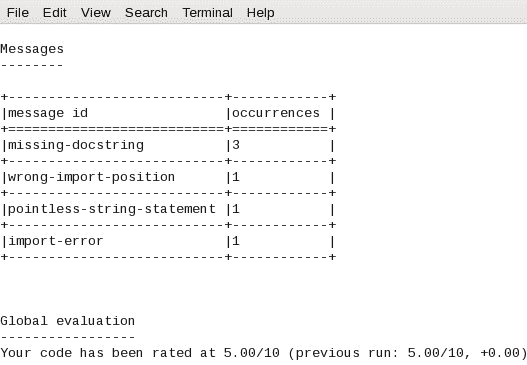

这相当糟糕！让我们通过审查 Pylint 生成的报告来找出我们可以改进的地方。在报告中，它抱怨一个 `import` 错误。嗯，导入没有问题。显然，缺少 Python 目录 `PATH`。这可以通过编辑 `.pythonrc` 文件来修复。查找一个注释行，内容为 `init-hook`（它应该出现在文件的开头附近）。取消注释它并写入以下代码：

```py
init-hook='import sys; sys.path.append("/path/to/wargame/")' 
```

将 `/path/to/wargame` 替换为系统上 `wargame` 目录的实际路径。进行此更改后，重新运行 Pylint 对此文件进行检查。新的评估结果如下：

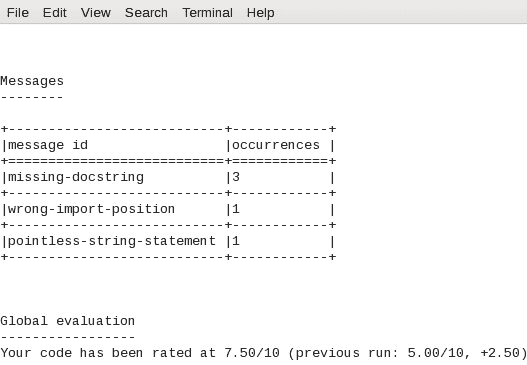

还不错！仅仅修复导入错误就已经使分数提高了 **2.50** 分。让我们再次审查生成的报告。在报告的开头，Pylint 列出了文件中存在的所有问题。在这种情况下，它抱怨模块和类方法的文档字符串缺失。它不高兴的另一点是模块的第一行 `import` 语句，即 `from __future__ import print_function`。

### 小贴士

**PEP 236 规范**

虽然 `__future__` `import` 语句必须作为第一行出现，但此规则的例外是模块文档字符串。模块文档字符串可以在写入 `__future__` `import` 语句之前编写。有关更多信息，请参阅 *PEP 236* 规范 ([`www.python.org/dev/peps/pep-0236`](https://www.python.org/dev/peps/pep-0236))。

我们可以轻松修复这两个问题。以下代码截图显示了重新工作的模块文档字符串以及重新排列的 `__future__ import` 语句：

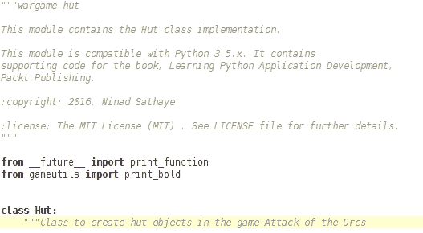

让我们通过再次运行 Pylint 来看看我们做得怎么样：

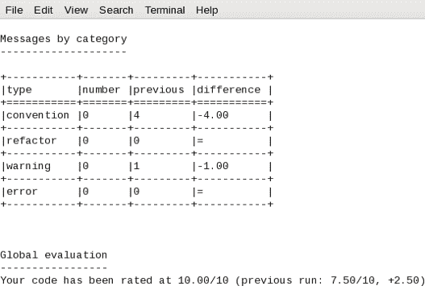

哈哈！我们在这个模块上得到了满分！按照类似的过程改进其余的代码。作为练习，为类方法添加文档字符串。你也可以从本章的补充材料中下载`wargame/hut.py`，其中已经写好了所有的文档字符串。

### PEP8 和 AutoPEP8

**PEP 8** 是另一个检查代码是否遵循 *PEP 8* 编码风格指南的工具。可以使用以下方式使用 pip 安装：

```py
$ pip install pep8

```

要了解如何使用 pep8，请访问项目页面 ([`pypi.python.org/pypi/pep8`](https://pypi.python.org/pypi/pep8))。还有一个叫做 **autopep8** 的实用工具，它会自动重新格式化代码，以符合 *PEP 8* 指南推荐的风格。此工具也可以使用 pip 安装：

```py
$ pip install autopep8

```

注意，此工具需要安装 pep8。有关更多信息和使用示例，请参阅 [`pypi.python.org/pypi/autopep8`](https://pypi.python.org/pypi/autopep8)。

# 练习

在本章中，你学习了如何编写代码文档，使用 Sphinx 生成文档，以及使用 Pylint 等工具分析代码。以下是一个涵盖这三个方面的练习：

+   下载 第三章 中展示的代码，*模块化、打包、部署*（你也可以使用你自己的 Python 代码代替）。

+   为此代码编写文档字符串（确保在模块、类和方法/函数级别编写文档字符串）。你可以使用默认的 RST 格式来编写文档字符串，或者选择 *Google Python 风格指南*。

+   使用 Sphinx 生成 HTML 文档。

+   运行代码分析，使用 Pylint 或任何其他工具，以修复编码错误和风格问题。

本章的支持代码已经达到一定程度的文档化。你可以使用此代码作为参考，并尝试进一步改进现有的文档。

# 摘要

你学习了如何使用 RST 格式编写代码文档。本章介绍了用于为我们的应用程序代码创建 HTML 文档的 Sphinx 文档生成器。你还了解了一些重要的 Python 编码标准，这些标准有助于提高可读性。最后，我们看到了如何使用代码分析来检查我们的应用程序代码中的错误和风格违规。

在理想的世界里，你希望你的代码完全符合编码规范。然而，由于各种原因，从新团队成员到紧张的项目截止日期，这通常并不成立。有时，为了使其符合编码标准，你需要在稍后的阶段重构它。在此过程中，你还需要确保没有功能被破坏。这是通过编写单元测试来实现的。我们将在下一章研究这些相互关联的方面。
