# 第五章。单元测试和重构

这里是对你迄今为止所学内容的快速回顾。你使用面向对象的方法开发了一个命令行应用程序，然后学习了通过处理异常来使代码健壮的技术。你将代码模块化，准备分发，并将其发布给更广泛的受众。最后，你学习了编码标准和文档。

到目前为止，我们并没有过多关注应用程序的测试。我们完全依赖手动测试，其中一些功能是通过玩游戏来测试的。随着应用程序的复杂性增加，手动测试的任务变得越来越困难。很快你就会感到不堪重负，错误就会开始出现。虽然可能无法完全避免手动测试，但我们需要一个自动化的方式来确保功能按预期工作。在本章中，你将执行以下操作：

+   了解 Python 中的单元测试框架 unittest

+   为我们的应用程序编写一些单元测试

+   查看如何在单元测试中使用模拟库

+   学习如何衡量单元测试的有效性（代码覆盖率）

+   理解代码重构是什么，为什么，何时以及如何进行

+   在进行一些代码重构后，回到单元测试的讨论

# 这是本章的组织方式

本章从一个游戏场景开始，其中有一个错误通过了生产环境并一直隐藏，直到用户发现它。这个场景强调了自动化测试的需要，然后引出了对 Python 中单元测试框架的讨论。你将介绍 Python 中的 unittest 框架和 mock 库。本章将通过为我们的项目编写一些单元测试来演示这些库的使用。

接下来，它展示了在没有先重构代码的情况下难以编写单元测试的例子（参见*重构前言*）。这就是我们绕道而行，学习重构的基本知识，重构代码，然后开发最后一个单元测试的地方。

## 重要的注意事项

如果你还没有阅读前面的章节，这些笔记将很有用。否则，请继续阅读下一部分。像其他每个章节一样，这一章也有它自己的 Python 源代码文件。源代码可以从*Packt Publishing*网站下载。只需遵循本书*前言*中提到的说明。

这是最后一章，它依赖于前面章节中开发的代码。从第六章*设计模式*开始，我们将有独立、简化的例子来展示各种概念。话虽如此，所有这些都会与同一个高幻想主题联系起来。

# 为什么进行测试？

你玩过到目前为止开发的游戏吗？如果没有，就试玩一次。在与敌人的战斗中，可以观察到以下情况。对于每次攻击，Sir Foo 或敌人都会受到伤害。这通过减少生命值来表示。例如，在下面的示例游戏输出中，Sir Foo 在第一次攻击回合中被击中，而敌人则在接下来的两个攻击回合中受伤。

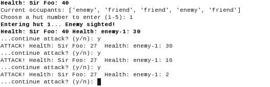

## 请求了一个新功能

| *用户请求增强战斗场景："在战斗中，程序会询问你是否想继续攻击敌人。在每次攻击移动中，战士、玩家或敌人中的一位会受到伤害。你能让它更有趣吗？有时两位战士都能毫发无损地逃脱呢？"* |
| --- |

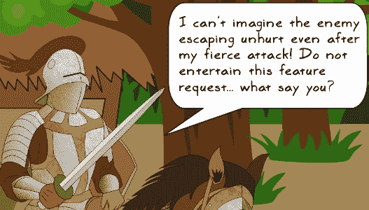

| *这对 Sir Foo 也有好处！我们将继续实施这个小的增强功能。尽管 Sir Foo 强烈反对，你还是匆忙实现了这个新功能。* |
| --- |

## 你实现了这个功能

请记住，`gameutils.weighted_random_selection` 函数会从 `weighted_list` 中随机选择一个元素。列表被填充得使得大约 30%的时间，`obj1` 的唯一标识符被选中，而在其余时间，代表 `obj2` 的唯一标识符被选择。换句话说，Sir Foo (`obj1`) 受伤的概率大约是 30%，而敌人的 (`obj2`) 概率接近 70%。

为了添加没有人受伤的可能性，你通过添加一个新元素 `None` 来更改 `weighted_list` 的组成。战士受伤的新概率如下：

+   敌人 (`obj2`) 受伤的概率约为 60%

+   Sir Foo (`obj1`) 受伤的概率约为 30%

+   两者都毫发无损（`None`）的概率约为 10%

以下是上述更改前后的 `weighted_random_selection` 函数：

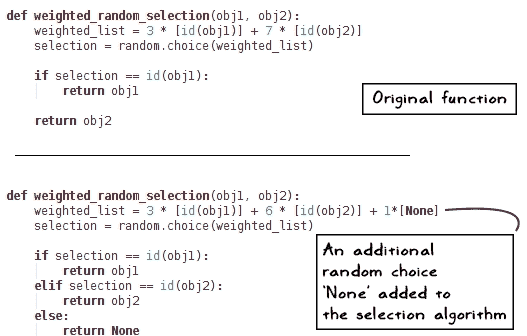

这很简单，不是吗？你玩了一次游戏以确保没有出错。看起来一切正常。没有延迟，你发布了新版本。

## 但有些不对劲...

然而，发布后不久，用户投诉开始涌入。这是意料之外的。你的提交引入了一个新的错误！

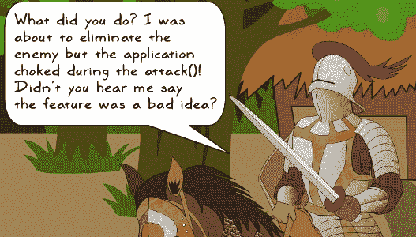

| *冷静下来，Sir Foo！你还在战争模式中！放松并深呼吸。我们很快就会解决这个问题。* |
| --- |

那么出了什么问题呢？你写的函数没有问题。它正按预期运行。然而，你忘记对调用 `weighted_random_selection` 的代码做一些更改。结果，出现了以下未捕获的异常：

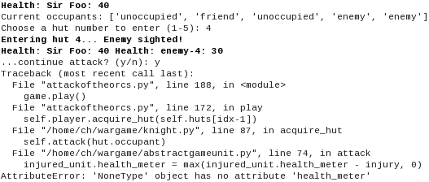

错误跟踪信息指向 `AbstractGameUnit.attack` 方法。该方法调用 `weighted_random_selection` 函数随机选择一个受伤的单位。当 `injured_unit` 为 `None` 时，问题就出现了。导致问题的代码行在下面的代码片段中显示：

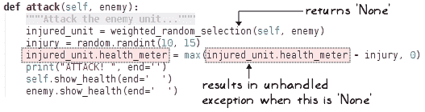

## 这需要彻底的测试

你已经通过运行游戏一次进行了基本的测试。但为什么你没有注意到这个问题呢？函数返回 `None` 的可能性很小。例如，对于 `weighted_random_selection` 函数的每次调用，平均只有一次会返回值 `None`。在这种情况下，你所进行的测试不足以重现问题。

这只是需要彻底测试的场景之一。同时，由于输出的随机性，它也容易受到人为错误的影响。如果你有一些自动化的方式来测试这个功能，那么这个错误就可以轻松避免。

因此，让我们学习如何使用 unittest 框架在 Python 中创建自动化测试。在你学会编写单元测试之后，我们将回来编写一个针对这里讨论的 `weighted_random_selection` 函数的单元测试。

# 单元测试

在单元测试中，你会在应用程序中调整一小段代码。主要任务是验证这段代码在整个应用程序的生命周期中是否继续按预期工作。这是通过编写针对该功能的测试来实现的。

单元测试可以通过一个例子更好地解释。考虑一个简单的函数，它返回两个数字的和。在单元测试中，你通过传递两个数字作为参数来调用这个函数，然后验证函数返回的值确实是给定数字的和。

有许多框架可用于编写单元测试。本章中的示例将基于内置的单元测试框架，称为 unittest。请参阅标题 *其他单元测试工具*，它提供了一个关于替代单元测试工具和框架的简要概述。

## Python unittest 框架

`unittest` 模块提供了自动化测试的功能。在我们为应用程序实现任何测试之前，让我们首先从术语开始。

### 基本术语

+   **测试用例**：当你编写单元测试时，它被称为测试用例。`TestCase` 是创建不同测试用例的基类。

+   **测试套件**：当你将各种测试用例组合在一起时，它就变成了一个测试套件。一个测试套件也可能代表其他测试套件的集合。`unittest.TestSuite` 提供了一个创建套件的基类。`TestSuite` 并没有定义任何单元测试，它只是累积测试或其他测试套件。这是 `TestSuite` 和 `TestCase` 之间的一个主要区别。

+   **测试固定装置**：这些是为单元测试顺利运行而做的准备工作。例如，`TestCase.setUp`在执行测试用例之前被调用。它可以用来向测试用例提供所需的数据。同样，`TestCase.tearDown`方法在测试执行后立即被调用。这些方法可以组合使用，例如启动和停止单元测试所消耗的服务。

+   **测试运行器**：运行器帮助执行测试用例或测试套件。它还提供了一种表示测试结果的方式。例如，结果可以在命令行或某种图形形式中显示。基本实现由`unittest.TextTestRunner`类提供。

### 使用 unittest.TestCase 创建测试

为了理解构建和运行测试的基本知识，让我们编写一个简单的程序。观察以下代码：

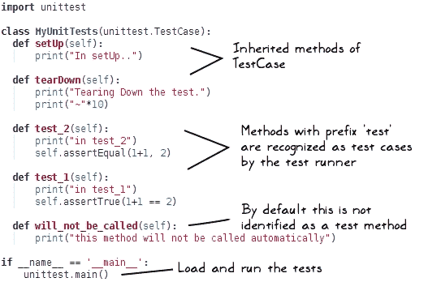

如前所述，`setUp`和`tearDown`方法被称为固定装置。`MyUnitTests.setUp()`在执行每个测试之前被调用。这允许在测试执行之前初始化一些公共变量。`MyUnitTests.tearDown()`方法在每次测试之后被调用。

当调用`unittest.main()`程序时，`MyUnitTests`类中定义的测试将依次运行。此程序还可以接受一个测试运行器作为可选参数（在此示例中未使用）。默认情况下，程序仅加载和运行名称以`test`开头的所有方法。在`MyUnitTests`类中，`test_1`和`test_2`方法中定义的测试将按以下命令行输出所示执行：

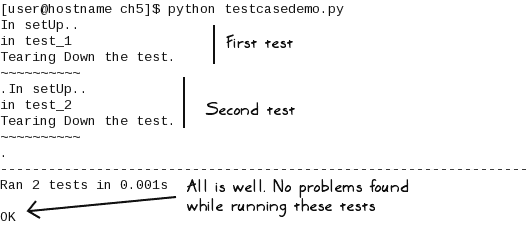

既然我们已经知道了测试用例是如何执行的，让我们回顾一下其中一个方法，如下所示：

```py
def test_2(self):
    print("in test_2")
    self.assertEqual(1+1, 2)
```

`assertEqual`方法是`TestCase`类的一个内置方法。它本质上检查两个输入参数是否相等，如果不相等，则抛出断言错误。前面代码片段中展示的测试将通过。让我们回顾一个将失败的测试：

```py
def test_2(self):
    print("in test_2")
    self.assertEqual(1+1, 3)
```

显然，`1+1 != 3`，所以我们预计测试将失败，如下所示命令行输出。对于失败的测试，它还会在输出中打印字母`F`：

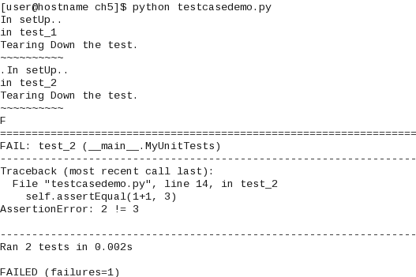

同样，`unittest.TestCase`类定义了一系列方便的方法。例如，`assertTrue`和`assertFalse`方法用于验证一个条件。另一个方法`assertRaises`用于检查代码是否抛出了特定的异常。

### 控制测试执行

有没有只运行选定测试用例的方法？一种方法是为要忽略的测试使用 Python **装饰器**。让我们将此装饰器添加到上一个示例中的两个测试用例中：

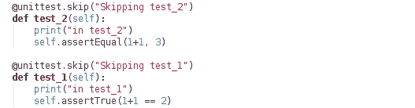

实际上，没有任何测试用例会被运行。代码运行后的输出表明这些测试已被跳过。对于每个跳过的测试，它会在输出中打印`s`：

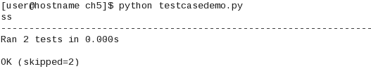

### 小贴士

这里还有两个没有涵盖的装饰器，即`skipIf`和`skipUnless`。这些装饰器用于基于条件的跳过测试。有关详细信息，请参阅以下文档页面：[`docs.python.org/3/library/unittest.html`](https://docs.python.org/3/library/unittest.html)。

有时候，你确实期望一些测试用例失败。例如，一个测试可能因为开发环境和生产环境之间的差异而失败，或者因为期望的数据库内容的缺失或存在而失败。这种预期的失败可以用另一个装饰器标记。我们知道`test_2`失败了，所以让我们为这个测试添加装饰器：

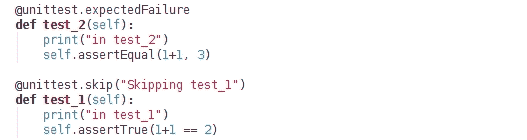

对于每个预期的失败，它会在输出中打印`x`。最后，它会总结出预期失败的测试数量：

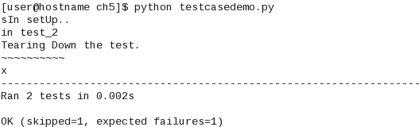

### 使用 unittest.TestSuite

请参考本章支持代码包中的`testsuitedemo.py`文件。该模块包含两个类，即`MyUnitTestA`和`MyUnitTestB`。这些类都继承自`unittest.TestCase`，并定义了一些简单的作为单元测试的方法。

### 小贴士

在第三章中，*模块化、打包、部署*，我们为每个类创建了一个独立的模块。在这里，`testsuitedemo.py`模块包含两个类。作为一个练习，你可以将这些类放入单独的模块中。

以下代码片段显示了这些类。为了简洁，这里省略了代码注释：

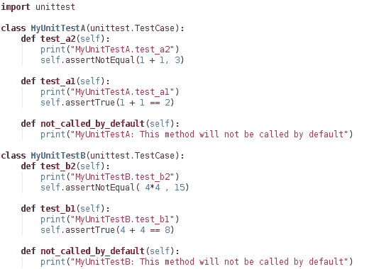

`unittest`模块的`makeSuite`函数可以用来创建`TestSuite`的实例：

```py
suite_a = unittest.makeSuite(MyUnitTestA)
```

上一行代码将构建一个测试套件，使用在`MyUnitTestA`类中定义的所有单元测试。只有以`test*`开头的方法名会被添加到测试套件中。在这个例子中，这些方法是`test_a2`和`test_a1`。第三个方法`not_called_by_default`将不会自动被视为单元测试。

### 小贴士

非测试方法（例如本例中的`not_called_by_default`），通常在测试之间共享代码时很有用。

让我们看看如何将这些方法包含在测试套件中。下面的代码片段显示了在这个模块中定义的函数`suite()`：

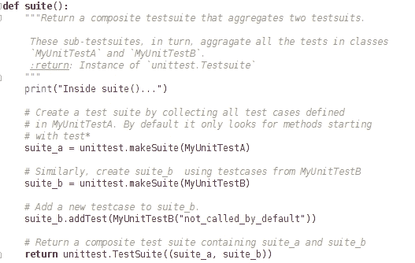

让我们回顾一下前面的代码片段：

+   这个函数创建了两个`TestSuite`实例，即`suite_a`和`suite_b`。

+   使用`addTest`方法，将`MyUnitTest.not_called_by_default`方法添加到测试套件中作为测试用例。

+   这个函数返回一个新的`TestSuite`对象。它接受一个 Python 元组作为参数。在这个例子中，元组包括之前创建的两个`TestSuite`实例。

本模块的最后部分是执行代码：

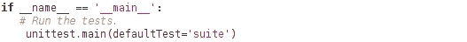

运行 `testsuitedemo.py` 模块会产生以下输出。注意，它还执行了在 `MyUnitTestB.not_called_by_default` 中定义的测试：

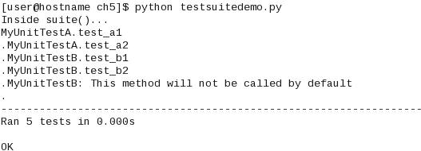

### 小贴士

测试套件也非常方便地根据它们的运行时间对测试用例进行分组。例如，您可以一起分组快速运行的测试和慢速运行的测试，并为测试运行脚本提供一个命令行选项来选择运行哪一个。

# 编写应用程序的单元测试

是时候为应用程序编写一些单元测试了。我们将创建一个新的 `unittest.TestCase` 子类来存放所有的单元测试。

## 设置测试包

作为第一步，让我们创建一个新的包来存放测试用例。在您其余代码所在的同一级别创建一个名为 `test` 的新目录。接下来，在这个 `test` 目录内创建两个新文件，如下所示：

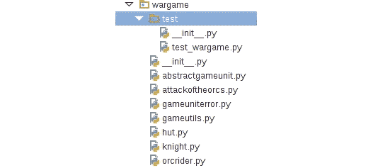

`test_wargame.py` 模块是创建新单元测试的地方。为了将目录识别为 Python 包，添加一个空的 `__init__.py` 文件。

### 小贴士

如果您还没有阅读，请阅读 第三章，*模块化、打包、部署！* 了解创建 Python 包的详细信息。

## 创建用于单元测试的新类

`test_wargame.py` 文件也可以在支持代码中找到。它包含了接下来要讨论的所有代码。在接下来的讨论中，假设您将从空文件从头开始编写代码。

创建一个新的 `unittest.TestCase` 子类，并将其命名为 `TestWarGame` 或您喜欢的任何名称。类定义如下所示：

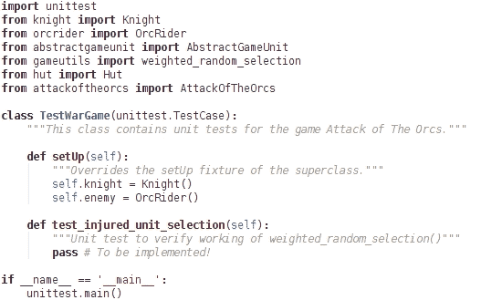

我们首先进行必要的导入。回想一下，`setUp()` 修复程序在运行单元测试之前立即被调用。在 `setUp` 中，创建了 `Knight` 和 `OrcRider` 类的实例，然后它们被用于我们即将编写的单元测试 `test_injured_unit_selection` 中：如之前所见，对 `unittest.main()` 的调用将自动执行以 `test` 开头的方法名。在这个例子中，它将运行 `test_injured_unit_selection()`。

### 小贴士

您也可以不使用修复程序编写相同的代码。只需在您编写的测试中创建所需的实例。如您接下来将看到的，`test_injured_unit_selection()` 单元测试使用了在 `setUp()` 中创建的对象。或者，您可以在测试中本地创建这些实例，如下所示：

```py
def test_injured_unit_selection(self): 
    knight = Knight() 
    enemy = OrcRider() 
    # rest of the test code...
```

## 第一个单元测试 – 受伤单位选择

让我们回到在 *为什么测试？* 部分讨论的场景。记得您修改了 `weighted_random_selection` 函数的行为，使其也可以返回 `None`（没有人受伤）。这个新功能破坏了程序，并且由于未捕获的异常，应用程序终止。

我们即将编写的测试将验证这个函数的原始行为。原始行为是选择 Sir Foo（`Knight`实例）或敌人（`OrcRider`实例）作为受伤的单位。我们即将编写的单元测试将验证这一点。观察以下代码：

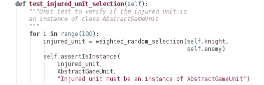

使用这个先前的函数，`self.enemy`受伤的概率大约是 70%，而`self.knight`（Sir Foo）的概率接近 30%。顶层的`for`循环只是确保它被调用`100`次，以考虑到函数返回值的随机性。如果`injured_unit`不是`Knight`或`OrcRider`的实例，`TestCase.assertInstance()`将引发断言错误。现在让我们运行这个测试。

## 运行第一个单元测试

在终端窗口中，从顶层`wargame`目录运行此测试：

```py
$ cd wargame
$ python -m unittest test.test_wargame

```

`-m`是 Python 的一个内置命令行选项。它允许你将一个库模块作为脚本运行。在这种情况下，它将运行`unittest`模块作为脚本。参数`test.test_wargame`代表文件`test/test_wargame.py`。`unittest`脚本将运行该模块中定义的测试。

如果`weighted_random_selection`的旧行为保持不变，测试将通过。但是，如果你实现了新行为，其中函数也可以返回`None`，它将通过引发`AssertionError`而失败，如下所示：

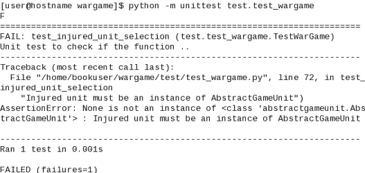

### 提示

没有必要运行`for`循环`100`次。只需确保至少调用该函数`10`次。作为一个练习，更新测试以验证更多细节。例如，验证函数大约 30%的时间返回`Knight`实例，等等。

## 第二次单元测试 – 获得小屋

让我们选择另一个功能进行测试。这次，它来自`Hut`类的一个方法：

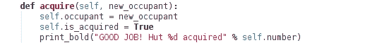

在这个方法中，你认为我们可以测试什么？该方法有以下用途：(a) 更新占用信息，(b) 将`is_acquired`标志设置为`True`。

### 提示

**重新设计练习**：

在这个应用中，我们假设所有内容都是从玩家的上下文出发的。例如，`Hut`实例的`is_acquired`标志是从玩家的角度出发的。如果它被设置为`True`，这意味着小屋被玩家获得，而不是敌人。这已经容易产生错误。想象一下一个`OrcRider`实例调用这个方法！你可以添加断言来确保它只接受`Knight`实例。作为一个练习，从代码中移除对`is_acquired`标志的依赖。

在编写测试时，我们将确保新占用者与作为方法参数传递的对象是相同的。

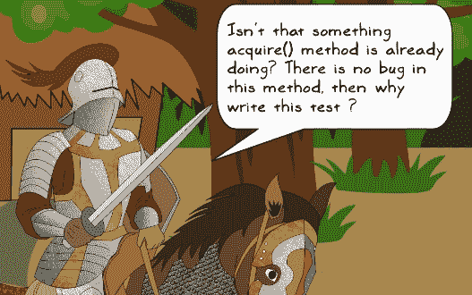

| *Sir Foo，这是个好问题。为什么还要写这个测试，如果方法已经运行得很好了？记住我们之前讨论的场景。功能上的有意改变给我们带来了很多麻烦。为什么要等到这样的错误出现呢？**今天，这段代码的表现符合预期。单元测试是为了明天准备的。想象一下，多个开发者共同贡献这个应用程序。结果，代码会越来越多，有人可能会无意中引入会破坏此方法预期功能的代码。在这种情况下，你如何确保基本行为保持不变？单元测试会注意到这样的变化。**未来的需求甚至可能会改变方法的基本行为。这在**为什么测试？**标题下的场景中得到了说明。当这种情况发生时，你编写的单元测试显然会失败。你确实期望它失败，这将迫使你更新测试以匹配新的要求。**简而言之，单元测试将确保代码的意外更改立即被捕获，而不会成为你的噩梦，比如当有人报告了一个错误，而你艰难地发现它是由你几个月前写的代码中的一个小错误引起的。** |
| --- |

让我们在同一个类`TestWarGame`中编写一个新的方法：

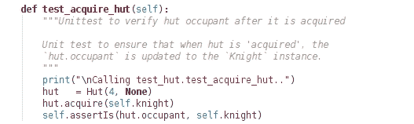

在前面的代码中，我们首先创建了一个`Hut`的实例。在第二行，这个小屋被`self.knight`获得。`TestCase.assertIs`检查代表小屋占用者的对象是否与`self.knight`相同，否则会引发`AssertionError`。

### 仅运行第二个测试

如果我们执行以下命令，它将运行`test_wargame.py`模块中定义的所有测试：

```py
$ cd wargame
$ python -m unittest test.test_wargame

```

如果你只想运行`test_acquire_hut`怎么办？假设你已经处于`wargame`目录中，以下是一个完成此任务的命令：

```py
$ python -m unittest test.test_wargame.TestWarGame.test_acquire_hut

```

这个命令行参数可以读作`package_name.module_name.class_name.method_name`。

运行此测试后的输出如下所示：

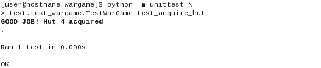

## 创建单独的测试模块

我们编写的最后一个单元测试是为了测试`Hut`类中的功能。我们在`test_wargame.py`模块中将这个作为`TestWarGame`类的一个方法创建。

我们是否必须将应用程序的所有测试都放在一个模块中？不！你可以选择为每个类创建单独的测试模块。

### 小贴士

对于大型应用程序，在类级别或包级别拥有单独的测试模块通常很方便。选择最适合你项目的策略。如果合理，你还可以创建一个测试类，将应用程序中的一些常用功能组合在一起。

让我们重新整理之前的例子。我们将创建一个新的模块`test_hut.py`，作为新类`TestHut`的家园。源代码也包含在本章的补充材料中——见`wargame/test/test_hut.py`。接下来，我们将`TestWarGame.test_acquire_hut`方法移动到这个类中。如下所示：

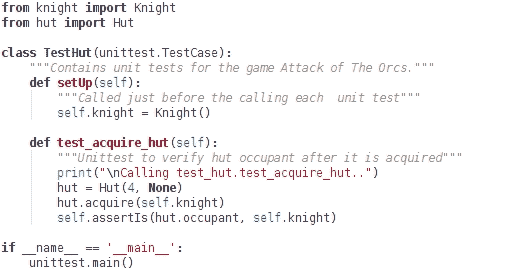

执行单元测试的语法与之前使用的类似：

```py
$ cd wargame
$ python -m unittest test.test_hut

```

## 批量执行单元测试

如果你的测试目录包含多个测试模块，你如何在目录内一次性运行所有测试？一个选项是编写一个脚本，列出执行单元测试的命令。然而，`unittest`模块提供了一个发现选项，可以在命令行上批量执行测试：

```py
$ python -m unittest discover

```

以下命令行输出显示了在`test`目录内批量执行的两个测试模块：


# 使用模拟库的单元测试

我们之前编写的两个测试相对简单易行。通常，编写一个用于验证功能的测试并非易事。原因可能多种多样。在某些情况下，代码可能需要重构，以便访问你想要测试的功能。在另一种情况下，代码可能存在依赖关系，这要求你编写比必要更多的代码。此外，要测试的功能可能需要进行耗时的准备工作，例如处理一些数字。这会增加总的测试执行时间。现在，我们将学习如何使用模拟库在这种情况下编写单元测试。在实际编写代码之前，让我们了解这个库提供了哪些功能。

## 模拟快速入门

模拟库提供了一种灵活的方式来创建虚拟对象，这些对象可以用来替换你正在测试的程序中的一些部分。

### 小贴士

模拟库从 Python 标准库（v3.3 及以后版本）中可用，作为`unittest.mock`。如果你使用的是早期版本，请使用以下命令安装：

```py
$ pip install mock

```

访问 [`pypi.python.org/pypi/mock`](https://pypi.python.org/pypi/mock) 获取更多信息。

使用模拟对象，你可以专注于要测试的主要功能，而不必过多担心这个功能所依赖的事物。它提供了一种方法，将支持代码块与正在测试的功能解耦。这可以通过一个例子更好地解释。参考以下卡通：

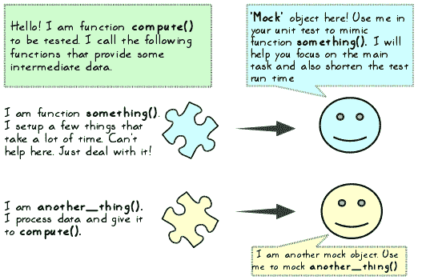

假设你正在编写一个名为`compute()`的函数的单元测试，该函数执行大量的科学计算。在这个函数内部，你调用其他支持函数来处理一些数据。这是一个耗时的操作。如果你知道支持函数提供的信息，你可以使用模拟对象来定义它们的行为。

## 让我们进行模拟！

是时候采取一些行动了。打开你的 Python 解释器，并开始编写以下代码。假设 mock 模块已经可用。如果它不可用，请使用前面建议的方式使用 pip 安装。首先，按照以下方式导入 `Mock` 类：

```py
>>> from unittest.mock import Mock

```

接下来，创建一个 `Mock` 对象：

```py
>>> mockObj = Mock()

```

对象类型及其唯一 ID 可以通过以下方式找到：

```py
>>> mockObj 
<Mock id='140524045365320'> 

```

继续前进，在 Python 解释器中输入以下代码：

```py
>>> mockObj.foo

```

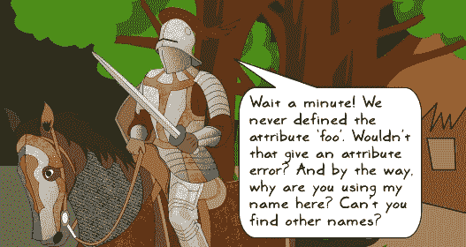

| *良好的观察！对于在这里使用你的名字表示歉意……这是无意的。在开发者世界中，人们非常喜欢你的名字！所以问题是，它真的会引发属性错误吗？自己试试看！* |
| --- |

执行最后一行代码将打印出类似于以下内容的输出：

```py
>>> mockObj.foo
<Mock name='mockObj.foo' id='140524032172664'>

```

这是有趣的部分！它没有抱怨缺少属性；相反，它创建了一个新的模拟对象。你可以像它已经定义一样访问这个对象的任何任意属性。它将创建并返回一个代表该属性的新 `Mock` 对象。在这里，`foo` 也被称为 `mockObj` 的子模拟。

让我们看看如何利用这个功能。`Mock.mock_calls` 可以用来跟踪模拟对象及其子模拟的所有调用。结果以 Python 列表的形式返回。在 Python 解释器中编写以下代码行：

```py
>>> mockObj.mock_calls
[]

```

这里，它返回一个空 Python 列表，因为我们还没有调用 `mockObj` 或其子模拟。

接下来，让我们看看这个列表是如何被填充的。`Mock` 对象是可调用的。编写以下代码来调用 `mockObj.foo`：

```py
>>> mockObj.foo()
<Mock name='mockObj.foo()' id='140524032173280'> 

```

我们将创建并调用另一个新的子模拟，如下所示：

```py
>>> mockObj.foo2(return_value = 20) 
<Mock name='mock.foo2()' id='140271893632056'> 

```

现在，让我们再次调用 `mockObj.mock_calls`：

```py
>>> test_call_list = mockObj.mock_calls 
>>> test_call_list
[call.foo(), call.foo2(return_value=20)]

```

返回的列表现在包含两个对象，即 `call.foo()` 和 `call.foo2()`。这些都是 `unittest.mock.call` 提供的辅助对象。

我们如何使用这些信息？当你编写单元测试时，你可以使用这个列表来断言哪些对象被调用以及它们的调用顺序。为了更好地理解这个概念，我们将在下一节编写一个简单的单元测试。

## 在单元测试中使用 Mock 对象

让我们为类 `MyClassA` 的 `compute` 方法编写一个单元测试。类定义如下。你还可以从支持代码包中下载 `wargame/test/mockdemo.py` 文件：

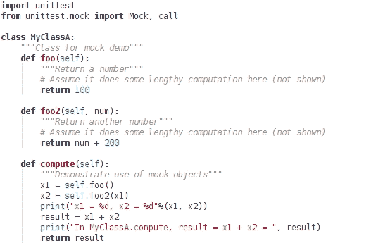

这是一个简单的例子。`compute` 方法依赖于两个方法返回的值，即 `foo` 和 `foo2`。它使用这些值来计算并返回结果。在这个例子中，`foo` 和 `foo2` 方法很简单。

想象一个场景，上述方法执行的任务需要非常长的时间。现在，要编写一个验证`compute`方法功能的单元测试，你需要检查`result`的最终值。由于在`foo`和`foo2`中花费的时间，这自然会花费很长时间。如果你知道这些方法的预期结果，你可以在测试中简单地用`Mock`对象替换它们。我们可以这样做，因为假设`foo`和`foo2`是辅助函数，而要测试的主要功能是结果值。

`Mock`对象将表现得像它们是原始方法一样，并返回所需的输出。但在现实中，我们绕过了耗时的计算。在此说明中，我们已经知道`foo`预期返回值为`100`。`foo2`方法的返回值取决于输入参数`x`。

查看 compute 方法，我们可以轻松推断出`foo2`的返回值将是`100 + 200 = 300`。因此，让我们编写一个单元测试来模拟这些方法调用。代码如下：

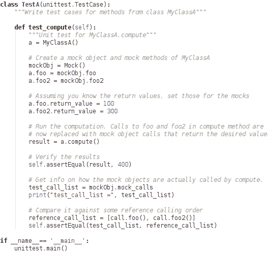

让我们回顾前面代码片段中的方法

+   `a.foo`和`a.foo2`方法现在分别由新的`Mock`对象`mockObj.foo`和`mockObj.foo2`表示。在`a.compute()`内部，`self.foo()`和`self.foo2()`调用现在被这些新对象模拟。

+   测试通过调用`TestCase.assertEqual`验证参数 result 的值。

+   测试还验证了被调用的对象以及它们的调用顺序。如前所述，`test_call_list`用于跟踪对`mockObj`及其子模拟的所有调用。此列表与存储对象预期调用顺序的参考列表进行比较。在此示例中，`reference_call_list`存储此信息。它期望`foo`和`foo2`方法按此顺序调用。在未来，如果有人更改`MyClassA.compute`中的此顺序，这个测试将有助于捕捉到变化。

    ### 注意

    **The MagicMock class**:

    `MagicMock`是`Mock`的子类。它本质上提供了你从`Mock`类期望的所有功能。此外，它为 Python 中的许多魔术方法提供了默认实现。魔术方法是一种具有双下划线作为前缀和后缀名称的特殊方法。魔术方法的示例包括`__init__`、`__iter__`、`__len__`等。在说明中，你可以使用`MagicMock`而不是`Mock`类。有关更多详细信息，请参阅以下页面：[`docs.python.org/3/library/unittest.mock.html`](https://docs.python.org/3/library/unittest.mock.html)。

## 使用补丁

在上一个标题下，我们介绍了`Mock`类的一些基础知识。mock 库以补丁装饰器形式提供了另一个重要的功能。补丁是一种机制，允许您在测试中临时更改对象的行为。这是一个广泛的话题。在这本书中，我们将限制我们的讨论范围，仅限于使用`unittest.mock.patch`创建补丁。

### 小贴士

补丁可以通过四种不同的方式调用，即`patch`、`patch.object`、`patch.dict`和`patch.multiple`。有关更多信息，请参阅[`docs.python.org/3/library/unittest.mock.html`](https://docs.python.org/3/library/unittest.mock.html)上的文档。

`patch`装饰器函数将`target`作为必需参数，后面跟着一系列可选参数。这里只显示了其中一个可选参数（`new`）。有关其他可选参数的信息，请参阅 unittest 文档：

```py
patch(target, new=DEFAULT)
```

+   在前面的函数中，`target`参数是你想要补丁的东西。它可以是一个函数、类方法或一个对象。

+   `target`被导入，应该用一个字符串表示，类似于典型的`import`语句（没有`import`关键字）。

+   例如，如果您想在测试用例中补丁一个方法，则`target`应表示为：`pkg.module.myclass.mymethod`。

+   如果此方法与您创建补丁的文件相同（例如，方法和其测试在同一 Python 文件中），则`target`应写作：`__main__.myclass.mymethod`。

在可选参数中，我们只将讨论和使用`new`。`new`参数告诉哪个对象将替换`target`。它可以是一个类或一个`Mock`对象。这可以通过一个例子更好地理解。请参见以下代码行：

```py
patch('__main__.MyClassA.foo', new=Mock(return_value=500))
```

第一个参数是`target`。它是`MyClassA`类的一个方法`foo`，其行为需要在测试中临时更改。换句话说，这就是需要补丁的方法（或`target`）。`new`参数指定了将替换此方法的对象。换句话说，`target`通过`new`对象进行补丁。如果您不指定`new`参数，则`target`将自动使用`MagicMock`对象进行补丁。

### 在单元测试中使用补丁

为了演示`patch`装饰器的使用，我们将使用在标题*在单元测试中使用 Mock 对象*下讨论的例子。在阅读以下讨论之前，请回顾`MyClassA.compute`方法。它在上文标题中已说明，代码也可以在文件`wargame/test/mockdemo.py`中找到。以下是为`MyClassA.compute`编写的使用补丁的单元测试：

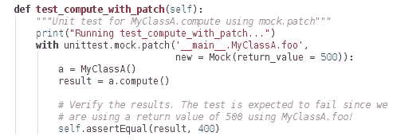

在前面的单元测试中：

+   `patch`是一个使用 with 语句调用的上下文处理器。

+   `with`关键字在代码执行后清理使用的资源。

+   `MyClassA.foo`方法被用可选参数`new`创建的`Mock`对象替换。

+   换句话说，`MyClassA.compute`中的`self.foo()`调用被替换为这个`Mock`对象的`return_value`。在运行时，表达式`x = self.foo()`变成了`x = 500`，而不实际调用 foo 方法。

    ### 小贴士

    之前示例中的测试会通过吗？为此，请回顾`MyClassA.compute`方法中的代码。由`new`参数创建的`Mock`对象返回值为`500`。在单元测试中，如果结果不是`400`，则会引发断言错误。因此，这个测试预期会失败。

如果没有指定`new`参数会发生什么？如前所述，`target`会自动被替换为一个新的`MagicMock`对象。这里还有另一种编写相同测试的方法。作为一个练习，运行这个测试，并打印`foo_patch.__class__`以找出它属于哪个类：

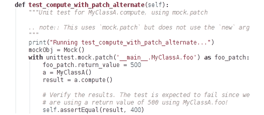

在对模拟库的介绍之后，让我们使用`patch`装饰器为我们的应用程序中的某个方法编写一个单元测试。

## 第三个单元测试 – 游戏方法

在本节中，我们将使用模拟库为`AttackOfTheOrcs.play`编写一个单元测试。让我们首先回顾一下这个方法。你还可以在`wargame/attackoftheorcs.py`文件中找到源代码：

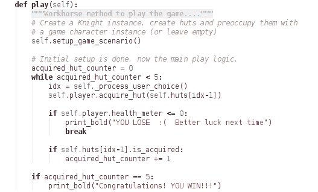

这个先前的游戏方法做了很多事情。它首先创建一些必要的对象，例如玩家和小屋。然后程序运行，直到玩家占领所有小屋或玩家在战斗中失败。仔细观察代码。它依赖于用户输入来选择小屋。这并不是它需要的唯一用户输入。对`Knight.acquire_hut`方法的调用会再次询问用户是否继续攻击。

在自动化测试中，你不能期望有人输入小屋编号和其他输入以继续执行。那么我们如何为这个方法编写单元测试呢？这就是我们可以使用`patch`装饰器来模拟用户输入的地方：

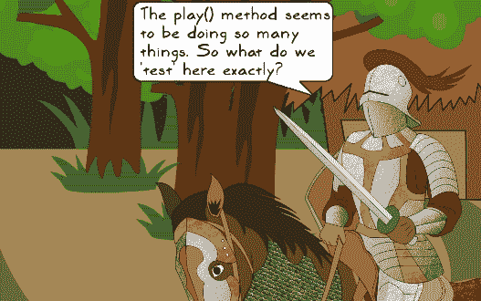

我们在这里应该测试什么？我们应该测试该方法的整体功能。这里有几个需要测试的事项：

+   胜利或失败的标准。当所有小屋都被占领时，玩家被宣布为胜利者。

+   为了实现这一点，玩家也必须处于良好的健康状况，这意味着`player.health_meter`的值应该大于零。

因此，只有在这两个条件都为真时才会宣布胜利者。同样，也将会有一个容易确定的失败标准。为了精确控制，你还应该为`play`方法中调用的单个方法编写单独的单元测试。例如，应该有一个单独的测试来验证`Knight.acquire_huts`的工作情况。

让我们编写一个测试来验证整体功能。这个测试将使用`patch`来处理用户输入。和之前一样，你可以在这个模块`wargame/test/test_wargame.py`中找到这个测试。以下代码片段显示了该模块中的`TestWarGame.test_play`方法。在模块的开始部分，像这样导入 mock 库：

```py
from unittest import mock
```

本模块中剩余的代码将在此不讨论。请查看上述文件以获取更多详细信息：


上述代码中的重要部分是`mock.patch`。我们的第一个目标是确保用户输入得到适当的处理。回想一下，在 Python 3 中，用户输入由内置函数`input()`处理。因此，我们需要用模拟用户输入的东西来修补这个函数。换句话说，用`new`参数表示的处理函数替换`builtins.input`函数。

`self.hut_selection_counter`属性被用作一个简单的计数器来模拟用户输入。其余的代码实现了验证获胜和失败标准的逻辑。`acquired_hut_list`使用列表推导生成。关于列表推导的更多内容，我们将在讨论性能改进时再谈。`all`函数在所有列表元素都是`True`时返回`True`。

### 小贴士

如果你在使用 Python 2.7.9，尝试将`builtins.input`替换为`__builtin__.raw_input`。然而，这种方法似乎效果不佳，因为在运行测试时仍然会提示你！在 Python 3.5 中，这不是问题。正如之前所说，在 Python 3.3 之前，mock 不是一个内置模块（`unittest.mock`）。因此，对于 Python 2.7.9，你可能需要安装 mock 作为`pip install mock`，并对`import`语句进行适当的修改。

接下来，我们将回顾`user_input_processor`，它用于修补内置的`input`函数：

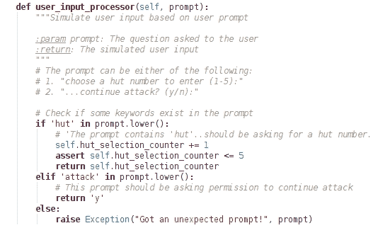

它将用户`prompt`作为参数，并返回对该提示的答案（用户输入）。例如，当提示输入小屋编号时，它会将`self.hut_selection_counter`增加`1`，并返回更新后的值。这个属性在`test_play`方法中被初始化为`0`。为了更好地理解这段代码，向这两个方法添加一些`print`语句，并按照以下方式执行测试：

```py
$ cd wargame
$ python -m unittest test.test_wargame.TestWarGame.test_play

```

执行测试时的输出如下所示。注意，它不会在命令行输出中打印用户提示，如继续攻击？（y/n）：

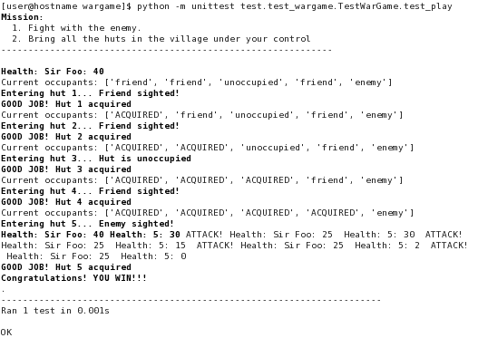

# 你的代码是否被覆盖了？

有没有一种方法可以检查你在测试方面的表现如何？单元测试覆盖了多少代码？为此，你需要一个名为`coverage`的 Python 包。它可以按照以下方式使用 pip 安装：

```py
$ pip install coverage

```

此命令在 Python 安装的同一位置创建了一个名为`coverage`的可执行文件。在 Linux 中，如果 Python 3 安装在`/usr/bin/`，则`coverage`将在与`/use/bin/coverage`相同的路径下可用。在 Windows 操作系统上，它将在`Scripts`目录中可用，与`pip.exe`在同一位置。按照以下方式运行`coverage`命令：

```py
$ cd wargame
$ coverage run -m test.test_wargame && coverage report

```

此命令是两个命令的组合，由`&&`分隔，依次执行。第一个命令运行测试：`coverage run -m test.test_wargame`。这与我们运行单元测试的方式相似。`run`选项运行 Python 程序，并测量代码执行。如前所述，`-m`选项指示`coverage`将下一个参数视为可导入的 Python 模块，而不是将其视为脚本。这就是为什么我们指定下一个参数为`test.test_wargame`（就像一个`import`语句）而不是编写`test/test_wargame.py`。

第二个命令，`coverage report`，会生成显示测试覆盖率的报告。以下是运行此命令后覆盖报告的呈现方式。为了便于说明，以下截图未显示与测试用例执行（第一个命令）相关的输出：

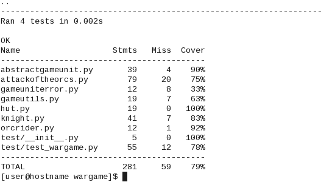

要查看不同的覆盖率报告，尝试在`test_wargame.py`中禁用一些测试，然后重新运行前面提到的`coverage`命令。

## 解决导入错误（如果有）

只有在执行覆盖率时遇到任何导入错误时，才阅读本节。如果您按照说明运行`coverage`，不太可能遇到没有名为`knight`的模块之类的导入错误。换句话说，从顶级目录`wargame`运行测试，并确保以模块（`-m`选项）而不是脚本的方式运行。如果您以以下方式运行`coverage`，可能会看到导入错误：

```py
$ cd wargame/test
$ coverage run test_wargame.py && coverage report

```

在前一个例子中，它无法从`wargame`目录中找到模块的正确`PATH`。请确保`wargame`和`test`目录都在您的`sys.path`中。一个快速且简单的解决方案是将以下代码添加到`test_wargame.py`中。假设您在`test`目录内运行覆盖率，请在`from knight import Knight`等导入语句之前添加以下代码：

```py
import sys 
# Append the directory one level up to the sys.path . 
# Alternatively specify the full path to that dir.
sys.path.append('../')
```

# 其他单元测试工具

在本章中，我们专门使用了内置的`unittest`框架来编写测试。还有其他一些单元测试工具未被讨论。本节的目的仅在于向您介绍除了内置的`unittest`模块之外的其他单元测试工具。例如，有如 nose 或 pytest 之类的工具，在很大程度上简化了单元测试的编写。让我们简要回顾一些这些单元测试工具。

## Doctest

这是一个内置模块，它寻找类似于在解释器中编写的 Python 代码的文本。以下是一个简单的示例，展示了带有函数示例用法的文档字符串：

```py
def add_nums(a, b): 
    """Return sum of two numbers 

    Example usage: 
    .. doctest:: 

    >>> add_nums(10, 20) 
    30 
    """ 
    return (a + b)
```

**Doctest**识别这样的代码，并运行它以检查它是否真的做了它所说的。这是一种非常有效的方式来验证你在文档和/或文档字符串中编写的代码示例的正确性。虽然这非常有用，但在这里值得注意，文档字符串中的大量代码示例可能会分散注意力。有关更多详细信息，请参阅[`docs.python.org/3/library/doctest.html#module-doctest`](https://docs.python.org/3/library/doctest.html#module-doctest)。

## Nose

Nose 是一个流行的第三方工具，它简化了单元测试的编写和运行。使用以下方式安装：

```py
$ pip install nose

```

Nose 扩展了`unittest`。使用这个工具的一个优点是它不需要你将测试编写为`unittest.TestCase`的继承类方法。你甚至可以将测试编写为单独的函数。让我们编写一个简单的测试，并用`nosetests`运行它。在名为`test_nose.py`的文件中创建以下函数：

```py
def test_a(): 
   assert( 1 == 1) 
```

按如下命令行运行此测试：

```py
$ nosetests test_nose.py

```

那就结束了。它将运行测试。显然，这个测试将会通过。正如所见，我们不需要将测试放在`unittest.TestCase`的子类中。函数名需要包含`test`或`Test`，因为我们正在使用默认的 nose 配置。尝试重命名函数，使其不包含单词`test`。例如，命名为`foo_a`。如果你再次运行`nosetests`，它将排除这个函数。要考虑不包含单词`test`的函数名，使用命令行选项`--tests`，如下所示：

```py
$ nosetests --tests foo_a test_nose.py 

```

查看[`nose.readthedocs.org`](https://nose.readthedocs.org)了解如何有效地使用 nose。

## Pytest

Pytest 是另一个流行的工具，它简化了单元测试的编写。可以使用以下方式使用`pip`安装：

```py
$ pip install pytest

```

你可以运行我们为 nose 编写的相同测试。让我们将以下代码保存到文件中，命名为`test_pytest.py`：

```py
def test_a(): 
   assert( 1 == 1) 
```

按如下命令行运行前面的测试：

```py
$ py.test test_pytest.py

```

查看[`pytest.org/`](http://pytest.org/)了解更多关于这个工具的信息。

# 重构前缀

让我们为游戏编写另一个单元测试。这次我们将关注主类`AttackOfTheOrcs`。当调用`play`方法时，它首先随机占领五个小屋。我们将编写一个测试来验证恰好有五个小屋。另一件要测试的事情是，小屋的居住者必须是`AbstractGameUnit`类的实例，或者应该是`None`类型。

`_occupy_hut`方法有相关的代码。但这需要编写一个针对非公共方法的测试（或者称之为受保护的或私有的）。


| *你说得对！虽然 Python 没有限制你调用以下划线开头的函数，但我们应该对他人友好，并尽量避免调用这样的函数。* |
| --- |

那么，我们如何处理这种情况？以下是一个可用的选项列表：

1.  在测试中，创建一个`AttackOfThOrcs`的实例，并直接调用受保护的方法。

1.  将此方法转换为`public`方法（从名称中移除下划线前缀）。

1.  调用`play`方法，然后它将调用`_occupy_huts`。

1.  重构`play`方法，并将`_occupy_huts`包装成一个可测试的`public`方法。

我们已经与第一个选项产生了道德冲突，因为`_occupy_huts`是一个非公共方法。第二个选项建议将其转换为`public`方法。这是可能的，但如果出于任何原因这个方法不应该从外部调用，我们应该避免这种改变。我们将记住这个选项，并寻找其他替代方案。

第三个选项需要调用`play`方法。我们已经在上一个例子中使用 patch 装饰器做到了这一点。虽然可行，但为了测试一个小功能而运行一大块代码是不高效的。让我们暂时不考虑这个选项。第四个选项建议重构代码。让我们进一步讨论。

### 小贴士

在我们开发的简单应用程序中，将`_occupy_huts`更改为`public`方法没有坏处！我们可以简单地将其重命名为`occupy_huts`（没有下划线前缀），然后更新调用代码，并愉快地编写测试！实际上，重命名也是一种将要介绍的重构形式。然而，在现实世界中，你可能没有将受保护的方法转换为公共方法的奢侈。考虑到这种情况，我们将重构代码以展示一种使代码易于测试的方法。

## 转弯——重构以提高可测试性

上一节中的第 4 步需要我们在编写测试之前重构`play`方法。这种重构将提高我们编写更干净测试的能力。那么，什么是重构？它是如何执行的？好消息是，你在第一章 *开发简单应用程序* 中已经进行了一种形式的重构，将初始的命令行脚本转换成一系列函数。让我们暂时偏离一下，学习一些重构技术。然后我们将带着重构后的代码回来，为我们的应用程序开发最终的单元测试。

# 重构

你已经在前面的章节中遇到了“重构”这个词，可能想知道它的意思。现在需要对此进行解释。

只需四处看看。窥视你的衣柜或打开你的办公桌抽屉。第一天，一切看起来都很整洁且易于管理。抽屉原本是用来存放所有重要的财务文件的。随着时间的推移，东西开始积累，抽屉里现在不仅装满了财务文件，还有各种各样的事物，从潦草的笔记、办公文件到贺卡。很快，你就找不到你现在需要的那个重要文件。你花了大量时间去挖掘你需要的东西。

金色时刻终于到来。你开始清理操作！发现了一些无用的东西，被扔掉了。还有一些其他的东西仍然有用，比如下周的足球比赛门票。你把这些东西移到另一个抽屉里，那里才是它们真正属于的地方。你还发现了几张属于同一类别的纸张：房屋维护账单。你把这些纸张整理在一起，放在一个单独的文件夹里。最后，通过所有的重新排列和清理，你的抽屉迎来了新的一天！

## 什么是重构？

重构与你的桌面抽屉非常相似。应用程序代码就像是抽屉里装满了文件。随着代码的演变，好的和坏的东西都会慢慢渗入。从外面看，抽屉的行为保持不变。你仍然可以往里面放文件（代码），业务照常进行。如果没有重构，总有一天会达到一个临界点，变得无法容纳新的文件。

### 备注

通过重构，你可以在不影响代码外部行为的情况下对代码进行内部更改。

## 为什么重构？

简短的回答是，如果你希望你的代码拥有长久和健康的生活！及时的重构对于保持代码的可维护性和可扩展性非常重要。你宁愿花更多的时间开发一个酷炫的新功能，也不愿熬夜去修复一个微不足道的问题——一个本可以在几分钟内修复的 bug，如果代码得到了适当的维护。

### 备注

重构应该更多的是一种习惯，而不是一种义务。

## 何时进行重构？

所以我们何时重构代码？你必须寻求最佳平衡。如果你在开发周期中意识到太晚，它会影响生产力，因为你需要花费相当多的时间进行代码清理。很多时候，项目截止日期会让你放弃重构。不幸的是，软件的用户可见部分胜过了内部的清理。你只考虑了立即的可交付成果，而忽略了重构只会帮助你更快地交付产品的这一事实。

一种策略是定期审查代码，并留出一些时间进行重构。如果你遵循**Scrum**方法论，你可以将一个冲刺时间用于一些较小的重构项目。这种维护冲刺从长远来看会带来回报。如果你面对的是需要立即重构以生存的大规模遗留代码，所需的变化可能会造成破坏。在这种情况下，考虑将其分解成更小的问题，并使用下一段中讨论的另一种策略。

### 备注

**敏捷开发方法论**

这通常与一套非传统的软件开发方法相关联，用于管理项目。在这个方法中，你定义在短时间内可实现的短期目标。有定期的检查点，称为冲刺或迭代。冲刺的结束应该产生一个增量且可发布的版本。这在复杂项目中很有用，因为很难规划整个项目，或者由于项目的动态性质，很难预测接下来会发生什么。该方法采用增量迭代的方法来处理这项任务。有关进一步阅读，请参阅以下维基页面：[`en.wikipedia.org/wiki/Agile_software_development`](https://en.wikipedia.org/wiki/Agile_software_development)。

**Scrum**

这是一个产品开发方法。它是一个基于敏捷开发方法的框架，用于管理复杂系统。它实现了产品开发的增量迭代（冲刺）策略。以下链接是有关详细信息的维基页面：[`en.wikipedia.org/wiki/Scrum_(software_development)`](https://en.wikipedia.org/wiki/Scrum_(software_development))。

另一种策略是在主要发布后立即进行重构任务。客户刚刚得到了他们所要求的东西。在没有任何阻止性错误的情况下，你通常会在这个期间找到一些空闲的工作周期。这是进行下一版发布规划和代码重构任务的好时机。这会因项目而异。它取决于应用程序的开发活跃度、大小、架构等因素。

## 如何进行重构？

现在我们已经了解了重构的含义，让我们看看如何进行它。首先的任务是识别那些制造麻烦的代码片段，然后对其进行重构。重构不应该影响代码的外部行为。同时，它应该通过简化内部机制（代码）来帮助开发者更容易地工作。我们将讨论一些最常见的重构操作。为了帮助理解这些操作，我们将在适当的地方使用类似 UML 的代表性块。

### 小贴士

**统一建模语言**（**UML**）表示。请参阅[`www.uml.org`](http://www.uml.org)。

### 重命名

假设一位开发者在一个名为 *Orcs 的攻击* 的游戏中引入了一个新功能。每个小屋都有一个秘密的盒子。每当一个单位获得小屋时，盒子的内容就会以打印语句的形式向新主人展示。这位开发者已经在 `Hut` 类中引入了一个名为 `showStuff()` 的新方法。然而，这里使用的名称并不直观。不清楚它是显示盒子里的东西，还是提供了关于小屋中其他东西的一些信息。重命名这样的方法是代码重构最简单的形式之一。你可以将其重命名为更详细的名称，例如 `show_box_contents` 或 `reveal_box_contents`。但是，确保你彻底执行重命名任务，包括重命名所有方法调用。

### 小贴士

**编码规范**：

这个例子提出了一个有趣的话题，Python 编码规范。如果你直接跳到了这一章，请阅读第四章 *文档和最佳实践*，它讨论了编码规范！这些规范基本上为 Python 程序员提供了一个编码风格指南。遵循这些规范并为项目定义自己的指南将有助于减少这样的重命名任务。

### 提取

在第一章 *开发简单应用程序* 中，我们有一个代表游戏的单个脚本。我们识别出可以写成单独函数的代码片段。每个函数的名称都是根据函数体应该执行的操作来选择的。这在上面的代码片段中显示：

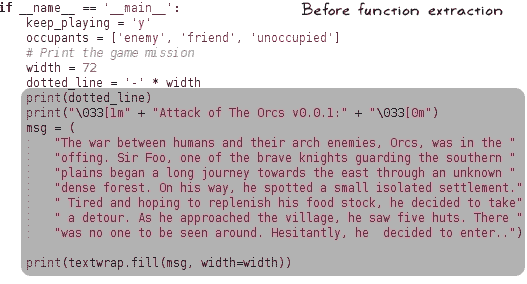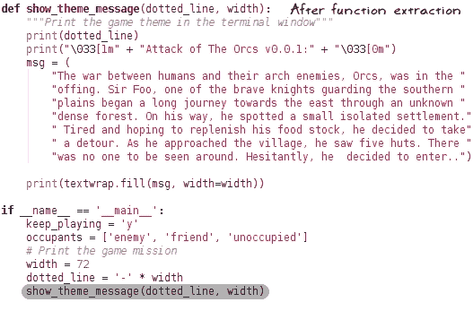

这个重构操作被称为函数提取。同样，你可以将相关的代码片段组合在一起，在类中提取一个方法或提取一个新的类。

## 移动

在第三章 *模块化、打包、部署!* 中，我们又进行了一种类型重构操作。你能猜到是什么吗？应用程序代码包含在一个单独的文件中。我们通过将每个类移动到自己的文件中，并更新引用的代码来对其进行模块化。

假设你有一个类 A 的方法，这个方法主要被类 B 的各种功能使用。根据问题的性质，看看这个方法是否更适合在类 B 中而不是现有的类 A 中。如果是这样，将这个方法移动到类 B 中可能是一个选择。

### 向下推

有一个新的功能请求。这次它来自 Sir Foo！

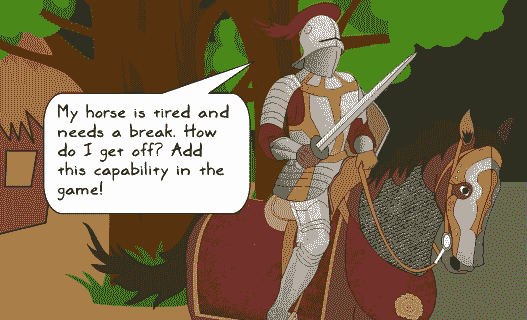

`Knight` 和 `OrcRider` 分别是骑马和类似野猪的单位的骑乘单位。你在超类 `AbstractGameUnit` 中引入了一个新的方法 `unmount`，它赋予它们从骑乘的动物上下来的能力：


然而，你现在已经在游戏中引入了几个其他的虚构角色。对于大多数角色来说，这种方法已经变得不相关了。现在将`unmount`方法推到继承层次结构中的子类中，使其相关，是有意义的。这在下图中有所展示。`unmount`方法被移动到子类`Knight`和`OrcRider`中：

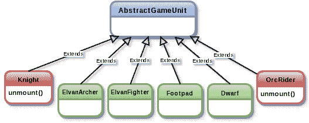

### 小贴士

当向上拉（见下一标题）或向下推类型重构简化了事情，但它可能并不总是达到其目的。`unmount`方法只是作为一个示例。马与运动相关联。一个选项是在这里定义一个移动行为。例如，用马移动，用野猪移动，等等。另一个替代方案是定义单元类型为骑乘或未骑乘。参考第六章，《设计模式》，它展示了处理类似情况的一种优雅方式。

### 向上拉

这是与向下推相反的操作，我们使用继承原则。一个子类定义了一些功能。完全相同的方法在其他子类中定义。这个方法可以被拉上来并在超类中定义，使其对所有子类可用。

### Python 的重构工具

有一些工具可以自动化某些类型重构。例如，如果你想重命名一个方法，该工具将重命名它，并自动更新代码中对该方法的全部引用。以下是一些此类工具的部分列表：

+   **使用 Python IDE**：假设你正在使用 IDE 进行 Python 应用程序开发，最方便的选项是使用 IDE 内置的功能来重构代码。例如，PyCharm 提供了重构的菜单项，并支持最常执行的重构操作，如前几节中讨论的。

+   **绳索**：Rope 是一个开源库，用于重构 Python 代码。如果你是 vim 或 emacs 等编辑器的粉丝，可以安装插件以在编辑器中集成重构功能。可以使用 pip 安装此库。有关更多信息，请参阅 GitHub 页面[`github.com/python-rope`](https://github.com/python-rope)。

+   **自行车修理工**：这是 Python 可用的另一个重构工具。可以使用 pip 安装此库。有关更多信息，请访问[`pypi.python.org/pypi/bicyclerepair`](https://pypi.python.org/pypi/bicyclerepair)。

# 单元测试回顾

这里是对我们之前关于单元测试讨论的快速回顾。我们的意图是为在非公共方法`AttackOfTheOrcs._occupy_huts`中找到的功能编写单元测试。一个直接的选择是从单元测试中直接调用此方法。然而，调用非公共方法不被认为是最佳实践，所以我们开始寻找替代方案。另一个选择是重构`AttackOfTheOrcs.play`，并在单元测试中使用提取的`public`方法。在这个时候，我们偏离了单元测试，学习了重构的基础。现在是我们使用刚刚学到的技术重构`AttackOfTheOrcs.play`的时候了。

## 重构以提高可测试性

游戏源代码《奥克之攻》提供了足够的重构机会。下面的代码展示了`play`方法。为了说明，省略了代码注释：

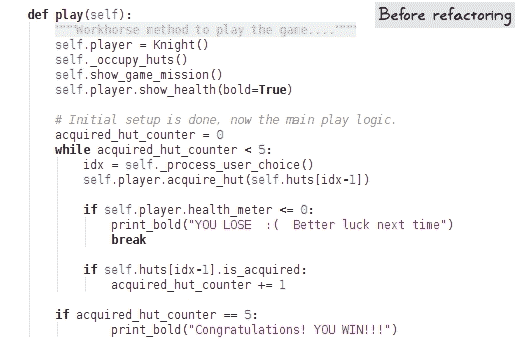

上述代码的前一部分做一些准备工作以创建所需的对象。它创建了`Knight`和`Hut`实例，以及代表小屋居住者的对象。此外，它还在游戏中打印了一些信息。作为一个初步的重构，我们将提取一个新的`public`方法，如下所示：

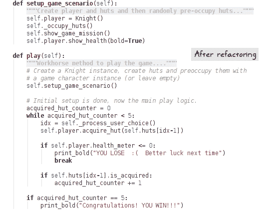

新方法主要提高了代码的可读性，并简化了编写测试的难度。

### 小贴士

如在*重构前言*章节所述，这是一个玩具问题。这里使用的重构策略是提取一个新的方法以提高可读性和可测试性。你也可以用其他方式重构。例如，设置代码创建了诸如玩家和小屋之类的对象。也许你应该也将`_occupy_huts`重命名为`create_huts`？选择可能各不相同，重构策略也是如此。本节不仅回答了在这里重构的最佳策略是什么的问题，而且主要作为一个示例，说明重构如何帮助简化编写单元测试的任务。

对`play`方法的基本重构将使得编写`setup_game_scenario`方法的单元测试成为可能，这反过来又有助于测试`_occupy_huts`中的功能。

## 第四个单元测试 – setup_game_scenario

如在*重构前言*章节所述，此测试将验证以下事项：(a)恰好有五个小屋，(b)小屋居住者是一个`AbstractGameUnit`的实例，或者是一个`None`类型的实例。

下面的测试展示了这一点。你还可以在支持代码中找到这个测试以及其他测试。请参阅`wargame/test/test_wargame.py`文件。代码注释应该能够使代码自解释：

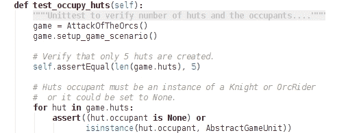

按以下方式运行前面的单元测试：

```py
$ cd wargame
$ python -m unittest test.test_wargame.TestWarGame.test_occupy_huts

```

# 练习

本章的各个部分已经提出了一些练习。尝试这些练习。例如，将单元测试拆分，以便你有单独的模块来测试不同类别的功能。添加更多单元测试以提高代码覆盖率。此外，尝试运行`nosetests`来测试我们已编写的测试。

## 重构和重新设计练习

在重构方面有几个低垂的果实！请审查`AttackOfTheOrcs._occupy_huts`方法。它创建了小屋对象，并将一个居住者在每个小屋中。作为第一步，你可以将其重命名为`create_huts`。这个方法中的代码可以写得更好。它使用`if...else`条件来决定创建哪个居住者。尽管在这个简单的应用中它可行，但如果添加其他类型的居住者（精灵、矮人、巫师等等），它将变成一个维护的头疼问题。

我们在这里能做什么？一种策略是让`Hut`类管理`occupant`对象的创建。小屋可以要求工厂随机创建一个居住者。你将在第六章*设计模式*中学习关于工厂模式的内容。由于我们将这个问题视为一个重构问题，你可以尝试以下方法：

+   修改`Hut.__init__`的签名，以便你可以选择指定`occupant`。

+   在`Hut`类内部，通过调用一个新的实用函数`create_unit`来创建一个`occupant`（如果尚未创建）。你需要编写这个新的实用函数（解决方案未提供）。这个函数不应是`Hut`类的一个方法。

# 摘要

这一章开始强调了测试的需要。它介绍了 Python 中的单元测试框架。你学习了如何编写和执行单元测试。下一个主题是 Python 模拟库的介绍。章节展示了在单元测试中使用`Mock`对象。接下来，它展示了在没有先重构代码的情况下难以编写单元测试的例子。在这个时候，你学习了重构的基本知识，重构了代码，然后为这个例子开发了一个单元测试。

在开发过程中，你经常会遇到一个反复出现的问题。通常，存在一个通用的解决方案（或配方）适用于这个问题。这通常被称为设计模式。在下一章中，我们将回顾 Python 中一些常用的设计模式。
