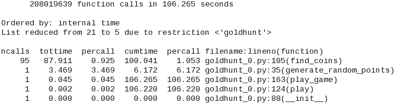

# 第八章。提高性能 – 第一部分

让我们回顾一下上一章学到的内容。我们从一个看似无害的程序开始，直到一些参数被调整。这种变化揭示了性能问题。因此，我们执行了*搜索操作*（性能分析）来捕捉*罪魁祸首*（瓶颈）。现在，让我们看看我们可以做些什么来加快应用程序代码。具体来说，我们将涵盖以下主题：

+   减少黄金狩猎应用程序的运行时间

+   学习以下方法来提高应用程序性能：

    +   修改算法

    +   避免函数重新评估

    +   使用列表和字典推导式

    +   使用生成器表达式

    +   使用技巧提高涉及循环的代码的性能

    +   选择合适的数据结构

    +   简要讨论`collections`和`itertools`模块

总结来说，本章将介绍几种（但不是全部）加快应用程序速度的技术。其中一些可以直接应用于缓解上一章中*黄金狩猎*场景的性能问题。对于其余的，我们将使用通用示例来说明这些技术的有效性。

# 本章的先决条件

您已经阅读了第七章*性能 – 识别瓶颈*了吗？它教您如何识别性能瓶颈。本章的一部分使用了上一章讨论的相同问题，并逐步提高其性能。此外，在本章中，我们假设您已经知道如何对代码进行性能分析。

# 这是本章的组织方式

我们将首先介绍*黄金狩猎*场景的性能改进的第一部分。目标是提供一个实际示例，说明如何解决问题，并逐步减少运行时间。以下图表显示了本章结束时将要完成的内容的预览——这是与上一章相同的图表。应用程序的运行时间将减少超过 50%！


本书的后半部分将向您展示许多提高应用速度的方法。为了这次讨论，我们将使用通用示例，因为并非所有技术都可以直接应用于*黄金狩猎*场景。后半部分将作为性能改进的便捷参考。

### 小贴士

Python 维基百科记录了几个性能改进技巧。其中一些将在本章中介绍。有关更多详细信息，请参阅[`wiki.python.org/moin/PythonSpeed/PerformanceTips`](https://wiki.python.org/moin/PythonSpeed/PerformanceTips)。

# 回顾黄金狩猎场景

在这一点上，你应该回到第七章，*性能 – 识别瓶颈*，并回顾一下*黄金狩猎*场景。为了总结问题，一个圆形区域散布着金币，你需要穿越整个区域尽可能多地捡起金币。然而，你只能捡起位于小搜索圆圈内的金币。我们编写了一个应用程序代码，并讨论了调整`search_radius`和`field_coins`（总散布金币）参数如何影响性能。在接下来的讨论中，我们将逐步提高这段代码的性能。

## 选择问题规模

| *为了* *在优化代码后看到时间上的真正差异，让我们进一步增加问题规模。在上一章中，**大矮人**要我们在场地上放置一百万枚金币。**让我们翻倍**。现在，有**两百万**金币可以争夺！简而言之，*`search_radius`*和*`field_coins`*将分别设置为*`0.1`*和*`2000000`*。 |
| --- |

### 小贴士

**注意！在运行任何示例之前阅读此内容**

本章中的示例可能会消耗大量计算资源（本章将展示示例输出，因此您不必运行这些示例）。例如，`goldhunt_0.py`文件在一个 64 位 Linux 机器上完成需要近两分钟，该机器有 8GB RAM，处理器性能良好且只有少量运行任务。在执行过程中，它也消耗了相当多的内存。对于这种系统配置，性能并不算太差。一般来说，它将取决于您机器的规格。所以，要小心！一种策略是将`field_coins`设置为`5000`，`search_radius`设置为`1`，看看应用程序运行得如何。然后，逐步调整这些参数到一个可接受的配置。

## 分析初始代码

我们将从源`goldhunt_0.py`文件开始（参见本章的支持代码）。这与`goldhunt_inefficient.py`相同，除了以下方面：

+   它使用`cProfile`分析游戏执行并打印统计信息。因此，它还包括`profiling_goldhunt.py 模块`中的函数。虽然将这两个模块结合起来不是最佳实践，但它将有助于简化即将到来的说明。

+   下一个展示的是更新后的`play_game()`函数。它使用新的参数值，如下所示：

代码可以按以下方式运行——如果需要，调整`GoldHunt()`的输入参数：

```py
$ python goldhunt_0.py

```

以下截图显示了这次运行的性能分析统计：



注意到`find_coins`消耗了相当多的时间。接下来是`generate_random_points`。让我们看看我们能做些什么来提高性能。

# 优化黄金狩猎——第一部分

是时候采取一些行动了。本节按以下方式组织——你将学习一些优化代码和加速应用程序的技术。这些技术将直接应用于提高 *黄金狩猎* 游戏的性能。

这是优化任务的第一部分。在这里，性能将通过三个步骤得到提升。我们将称之为 *优化第一步*、*第二步* 和 *第三步*。在实施每个策略之后，代码将重新进行性能分析，以了解所实现的加速。让我们从 *优化第一步* 开始。

## 调整算法——平方根

性能分析输出（参考 *性能分析初始代码* 部分）显示 `find_distance` 方法是瓶颈。作为一个起点，让我们对这个算法做一些修改，使其运行得更快。以下是 第七章 中 *审查初始代码* 部分提出的原始方法，*性能——识别瓶颈*：


该方法计算从搜索圆心到每个金币的距离，并确定给定的金币是否位于搜索圆内。计算出的距离，表示为 `dist`，是一个平方根。

我们真的需要计算平方根吗？平方根的计算很耗时，在这种情况下是不必要的。我们只是比较两个数。我们能否通过比较两个数的平方来避免这种情况？困惑了吗？看看下面的比较：


我们有两个正数，*a=4* 和 *b=9*。显然，*a* 小于 *b*。因此，比较 *a < b* 总是会返回 `true`。即使比较它们的平方根也适用。同样的逻辑可以应用到我们的问题上。`dist` 和 `self.search_radius` 变量可以被视为两个数的平方根。我们得到了以下代码：

```py
dist = math.sqrt(delta_x*delta_x + delta_y*delta_y)
```

或者，我们可以这样说，`dist` 是某个数，`dist_square` 的平方根，如下所示：

```py
dist_square = delta_x*delta_x + delta_y*delta_y
```

接下来，我们已经知道了 `self.search_radius` 的值。现在，想象它作为另一个数，`search_radius_square` 的平方根。这个数目前还没有，需要按照以下方式计算：

```py
search_radius_square = self.search_radius*self.search_radius
```

作为最后一步，我们需要比较这两个数，而不是它们的平方根：

```py
if dist_square <= search_radius_square: 
    # more code follows...
```


| *这是一个很好的观察！它需要我们进行额外的计算来找出* `self.search_radius`* 的平方。但是，我们不需要在 *for* 循环的每次迭代中都进行这个计算。*self.search_radius* 在循环中不会改变。因此，这个计算可以在 *for* 循环之前只做一次。* |
| --- |

### 黄金狩猎优化——第一步

将所有这些放在一起，更新的 `find_coins` 方法如下所示：


现在是时候再次配置此代码，看看我们是否能获得性能上的任何改进。支持源文件`goldhunt_pass1.py`已包含这些更改。可以按照以下方式运行：

```py
$ python goldhunt_pass1.py 

```

以下截图显示了本次运行的配置文件统计信息：


将计时与原始代码的计时进行比较。应用程序的运行时间有显著提高。之前，总运行时间超过 100 秒，但这次优化将其降低到 60 秒以下！你还可以将输出中的第一行（`find_coins`）与原始计时进行比较。分析器的计时将取决于机器规格和选择的输入值。

### 注意

即使再次运行相同的程序，计时也会略有变化。这背后有两个原因；首先，我们在战场上随机分配金币。因此，对于每次运行，列表中附加的总金币数都会有所变化。第二个影响因素是系统上的其他运行进程。理想情况下，你应该在相同的环境中运行它以减少这些变化（或*噪声*）。例如，关闭其他正在运行的应用程序，以免它们干扰计时。在性能基准测试过程中，经常多次运行相同的应用程序，并记录平均时间以减少这些变化的影响。

## 跳过点

Python 中的**点**表示法允许访问给定对象的属性。看看以下代码，这是从上一个例子中的`find_coins`方法的`for`循环中取出的。这个例子是：

```py
for x, y in zip(x_list, y_list):
    # Some code follows...
    # ...
    if dist_square <= search_radius_square: 
        collected_coins.append((x, y))
```

在这个循环中，对于每一次迭代，`collected_coins.append`函数都会被重新评估。回想一下，在第六章中，你学习了关于一等函数的内容。让我们用一个局部函数来表示`collected_coins.append`。这样可以避免函数的重新评估（跳过点），并有助于加快循环速度。

### 金矿优化 – 第二次通过

在第二次通过中，我们将改进之前通过（*优化第一次通过*）的代码。支持代码包中的`goldhunt_pass2.py`文件包含了接下来要讨论的所有更改。以下是修改后的`find_coins`方法：


在这里，一个名为`append_coins_function`的局部函数被分配给 Python `list`的内置`append`函数。这样可以避免`append`函数的重新评估。同样，`self.xref`和`self.yref`也被表示为局部变量。让我们配置这个新代码，看看我们是否能获得任何改进。命令如下：

```py
$ python goldhunt_pass2.py 

```


性能有所提升，但结果并不像优化的第一个步骤那样令人印象深刻。这仍然是一个合理的提升，大约 10 秒或超过 15%。

| *你可以在代码的其他地方进行类似的更改，但在你急于行动之前，Sir Foo 有一个重要的信息要告诉你。* |
| --- |


| *这是一个非常好的观点！在采用此类技术时应谨慎行事。你应该记录代码或定义一个项目特定的编码规范，以便局部函数可以清楚地突出。这将帮助其他开发者理解此类赋值的目的。更普遍地说，不要过度使用，看看是否有真正的益处。* |
| --- |

## 使用局部作用域

当寻找变量或函数定义时，Python 会按照以下顺序搜索以下**命名空间**：**局部**、**全局**和**内置**。用更简单的话说，它首先寻找局部变量或函数，然后在模块级别进行搜索，如果找不到任何东西，它会寻找内置函数或变量名称。因此，查找局部变量或函数是最快的。用局部函数替换全局或内置函数可能有助于提高性能。你获得的速度提升将取决于问题。

让我们回顾一下 `generate_random_points` 函数。原始代码如下所示。请参阅第七章中的*回顾初始代码*部分，*性能 – 识别瓶颈*，其中进行了解释。


在原始函数中，我们调用内置模块 `random` 和 `math` 的各种函数。让我们在下一个优化步骤中更新 `generate_random_points`。

### 金矿优化 – 第三个步骤

让我们进一步深入优化过程。我们将用局部函数替换 `generate_random_points` 函数中的内置函数调用。修改后的代码如下所示。在这里，`l_uniform` 变量代表 `random.uniform` 函数。同样，你可以在这段代码片段中看到其他赋值。


### 小贴士

此步骤之后的优化是将使用局部作用域和跳过点结合起来。作为一个练习，你可以尝试将这些组件分开。例如，为了避免使用点，在模块顶部导入`pi`、`cos`和其他符号，并在函数中直接使用它们。然后比较使用和不使用局部函数的性能。

此外，在实现此类代码之前，问自己几个问题：通过使用局部作用域，代码质量是否受到影响（是否更难阅读和维护）？最终的性能提升是否超过了所有其他因素？

您也可以在`goldhunt_pass3.py`中找到此代码。以下是该文件的`cProfile`输出。整体时间上只有轻微的改进。如果您将列表的第二行（`generate_random_points`）与*优化通过二*的对应输出进行比较，真正的差异将变得明显：


总运行时间已从最初的约 3.2 秒减少到约 2.6 秒。增加问题规模（硬币数量）可以使这种差异更加明显。

| *但看起来有人对这种加速并不太满意...* |
| --- |


| *绝对可以！提高**黄金狩猎**游戏性能的任务还远未结束！在我们这么做之前，让我们讨论一些其他有助于加快应用程序速度的技术。我们将使用通用示例，因为许多这些技术在前文提到的游戏场景中并不相关。**在下一章中，我们将重新审视**黄金狩猎**问题，并使用 NumPy 和并行化进一步加快应用程序的速度。这将带来显著的性能提升。如果您不想打断连贯性，请先阅读下一章，然后再回来继续讨论。* |
| --- |

# 性能提升技巧

让我们花些时间讨论一些有助于提高代码运行时性能的杂项技巧和窍门。您仍然可以将其中的一些技术应用到*黄金狩猎*问题上，但让我们只使用通用示例来解释这些概念。

### 提示

本节中所有的插图都可以在辅助文件`misc_performance.py`中找到。为了比较性能，我们将使用在第七章中讨论的`timeit`模块，*性能 – 识别瓶颈*（请参阅*测量小代码片段的运行时间*部分）。另请参阅`timeit`文档，[`docs.python.org/3/library/timeit.html`](https://docs.python.org/3/library/timeit.html)。

## 列表推导

**列表推导**是创建 Python `列表`的一种紧凑方式。它常被用来替换嵌套的`for`循环或`map`和`filter`功能。除了紧凑之外，与例如等效的`for`循环相比，它也更为高效。其基本语法如下：

```py
a = [i*i for i in range(5)] 
```

这将创建一个包含以下元素的列表：`[0, 1, 4, 9, 16]`

前面的语法等同于以下：

```py
mylist = []
for i in range(5):
    mylist.append(i*i)
```

让我们将这些代码块封装在两个函数中。我们将使用`timeit`模块来衡量每个函数的性能。之前提到的文件`misc_performance.py`也有这些函数。为了更好地了解性能提升，我们将选择更大的问题规模。正如本书中多次提到的，根据您的机器能够舒适处理的问题规模来选择。

下面的代码片段显示了这些函数：


`sample_size_1`变量被选择得足够大，以便可以看到差异。使用`timeit.timeit`方法捕获运行时间，其第一个参数是一个表示函数名称的字符串。第二个参数是一个`setup`参数，它告诉我们在哪里查找此函数。可以通过执行脚本进行比较运行性能，如下所示：

```py
$ python misc_preformance.py

```

如以下输出所示，列表推导式与等效的`for`循环相比更快：

```py
Without list comprehension : 1.218718248004734 
With list comprehension    : 0.8486306999984663 
```

### 提示

作为一个练习，尝试比较嵌套`for`循环与等效列表推导式语法的计时。请参考`misc_performance.py`文件中的`list_comprehension_ex2`函数。

在*黄金狩猎*问题中，也可以在`generate_random_points`函数中使用列表推导式。例如，你可以选择性地将`theta`编写如下：

```py
theta = [random.uniform(0.0, 2*math.pi) 
         for i in range(total_points)] 
```

但在做出这样的更改之前，请阅读下一章，其中展示了 NumPy 包如何极大地提高此函数的性能。

## 记录执行时间

在前节中，我们使用`timeit.timeit`函数记录并比较列表推导式与经典`for`循环的性能。让我们将`timeit`代码封装成一个实用函数，以便我们可以将其用于后续的讨论。`run_timeit`函数如下所示：


在这里，`func_1`和`func_2`是需要记录执行时间的函数名称（字符串）。`timeit.timeit`函数中的`number`参数表示给定函数执行的次数。`run_timeit`的调用者可以通过使用可选的`num`参数来调整这个数字。请参阅文档以获取更多详细信息。

### 提示

此函数不执行任何错误检查。作为一个练习，你可以添加这个功能。例如，添加`try…except`子句以捕获如果函数未找到的错误。

在接下来的讨论中，我们将使用`run_timeit`来比较两个功能等效的代码块的性能。

## 字典推导式

就像列表推导式一样，**字典推导式**是创建 Python 字典对象的语法结构。以下函数展示了两种创建字典的方法。第一个（`no_dict_comprehension`）使用`for`循环创建字典，而第二个函数展示了字典推导式语法。


如前节所述，从现在开始，我们将使用`run_timeit`实用函数来记录时间。执行此代码后的`timeit`输出如下：

```py
Function: no_dict_comprehension, time: 0.14393422298599035 
Function: dict_comprehension, time: 0.13295511799515225
```

## 交换条件块和 for 循环

考虑以下简单的代码。有一个顶层的`for`循环和一个`if…else`条件块。根据`num`变量的值（假设它发生变化），将执行`if`或`else`条件。和之前一样，应该为`sample_size_1`变量选择一个合适的整数：


我们可以通过交换`for`循环和`if…else`块来编写相同的代码。新函数有一个顶层的`if…else`块。在每一个条件语句中，我们都有相同的`for`循环。下面的`if_condition_loop_opt`函数展示了这一点（其输出保持不变）：


让我们来找出这两个函数之间的胜者：

```py
Function: no_if_condition_loop_opt, time: 0.1894498920009937 
Function: if_condition_loop_opt, time   : 0.15955313100130297 
```

总结来说，具有顶层`if…else`块的函数比具有顶层`for`循环的函数运行得更快。

### 小贴士

这是一个简单的例子，其中交换`for`循环和条件块很容易。然而，在现实世界中，权衡进行此类修改的优势与引入错误的风险。性能分析真的显示这个代码块是一个主要的瓶颈吗？如果你最终决定继续进行，请添加足够的自动化测试以确保函数输出保持不变！参见第五章，*单元测试和重构*，了解如何编写单元测试。

## 在循环中尝试

记住**求饶比求许可更容易**（**EAFP**）原则，它鼓励使用`try…except`子句？这在第二章，*处理异常*中简要讨论过。让我们看看`try…except`子句如何节省一些执行时间。考虑以下函数，它根据`i`的值在`for`循环中填充一个列表。只有对于`for`循环的第一个迭代（`i=0`），执行`if`语句。对于所有其他`i`的值，它执行`else`块，`val /=i`。


让我们用`try…except`子句替换`if…else`块。`try`子句将始终尝试执行`val /= i`语句。当我们有`i=0`时，它引发`ZeroDivisionError`异常，该异常在`except`子句中处理。


在这里，我们只需要捕获初始值`i=0`的错误。对于循环的其余部分，代码应该运行顺畅。`try…except`子句有效地消除了`if…else`条件块强加的额外检查。换句话说，我们不再需要为每个`i`的值检查`if i==0`。因此，代码运行得更快。下面显示了这些函数的执行时间——显然，`using_try`函数表现更好：

```py
Function: not_using_try, time: 0.1821241550205741 
Function: using_try, time    : 0.09502803898067214
```

## 选择合适的数据结构

这是一个相当广泛的话题。数据结构的选择很大程度上取决于你试图解决的问题。在本节中，我们将仅讨论一个示例，以展示正确选择数据结构如何提高运行时性能。观察`data_struct_choice_list`函数；它首先创建一个列表对象`mylist`。接下来，在`for`循环内部，代码检查`j`是否是`mylist`的元素之一，并相应地更新`val`参数。


现在看看下面的`data_struct_choice_set`函数。它不是创建一个`list`对象，而是创建一个由`myset`变量表示的`set`对象。语法与我们之前看到的`list`或字典推导式语法类似（其余代码保持不变，并且这两个函数返回相同的值）。


当涉及到检查元素是否属于集合时，Python 的`set`比`list`更快。换句话说，"`if (j in myset)`"操作比"`if (j in mylist)`"操作更快。如第七章中的表格总结所示，*性能 – 识别瓶颈*，这个操作的平均时间复杂度对于`set`是*O(1)*，对于`list`是*O(n)*。

下文展示了这两个函数的`timeit`输出。显然，实现`set`的函数比实现`list`的函数要快得多：

```py
Function: data_struct_choice_list, time: 1.7527358299994376 
Function: data_struct_choice_set, time: 0.015494994004257023
```

### 小贴士

你有没有注意到这个例子中的问题？`timeit`报告的运行时间包括了创建`list`和`set`对象所需的时间。为了进行准确的比较，你应该只比较这些函数中的`for`循环。换句话说，将`list`和`set`的创建部分移出函数定义，然后进行时间比较。

让我们继续讨论数据结构，并接下来回顾 Python 的`collections`模块。

## 集合模块

`collections`模块提供了一些特殊用途的容器数据类型。让我们回顾其中的一些常见类型。如果你想知道这个模块中的其他数据结构，请参阅 Python 文档([`docs.python.org/3/library/collections.html`](https://docs.python.org/3/library/collections.html))。

### `deque`类

`deque`类允许从`deque`数据结构的任一侧添加或删除元素。`deque`类中的`append`和`pop`操作内存高效且线程安全，复杂度为*O(1)*。以下代码展示了创建`deque`并移除最右侧元素的一种简单方法：

```py
>>> dq = deque(range(10)) 
>>> dq 
deque([0, 1, 2, 3, 4, 5, 6, 7, 8, 9]) 
>>> dq.pop() 
9 
>>> dq 
deque([0, 1, 2, 3, 4, 5, 6, 7, 8])
```

让我们比较 `deque` 与等效 `list` 的性能。观察以下两个函数，其中我们调用 `list` 和 `deque` 类的 `pop()` 方法——请注意，我们在这两个函数外部创建 `list` 和 `deque` 对象，以确保报告的计时不受对象创建的影响：


以下 `timeit` 输出显示了在 `deque` 上执行 `pop()` 操作比在 `list` 上更快：

```py
Function: list_example, time: 0.1243858500092756 
Function: deque_example, time: 0.0937135319982189
```

那么，我们应该在什么情况下使用 `deque`？一般来说，如果你的代码涉及大量需要在两端进行数据追加或弹出操作的操作，`deque` 比列表更受欢迎。但是，如果代码需要快速随机访问元素，`list` 是更好的数据结构选择。

### defaultdict 类

`defaultdict` 类是从内置的 `dict` 类派生出来的。如果你尝试访问一个不存在的键，一个简单的 Python 字典会抛出 `KeyError` 异常。但是，`defaultdict` 类会创建一个新的键。这可以通过以下示例更好地解释：

```py
>>> d1 = {} 
>>> d1['a'] 
Traceback (most recent call last): 
  File "<stdin>", line 1, in <module> 
KeyError: 'a' 
```

标准字典对象 `d1` 没有 `'a'` 键，因此会抛出错误。如果你尝试使用 `defaultdict` 类访问这个键，它将简单地创建它，如下例所示：

```py
>>> from collections import defaultdict 
>>> d2 = defaultdict(int)
>>> d2['a'] 
0 
>>> d32
defaultdict(<class 'int'>, {'a': 0})
```

### 小贴士

标准字典的内置 `setdefault()` 方法执行类似的功能。如果你试图访问的键不存在，它会在字典中插入一个新的键，并给它分配一个默认值，然后返回这个默认值。然而，与 `setdefault` 方法相比，使用 `defaultdict` 更快。有关更多信息，请参阅文档([`docs.python.org/3/library/stdtypes.html#dict`](https://docs.python.org/3/library/stdtypes.html#dict))。

这只是 `defaultdict` 提供的功能之一。它还提供了一种有效的方法来计算容器中元素出现的次数。让我们通过一个例子来看看。以下 `dict_counter` 函数定义了一个名为 `game_characters` 的列表。这个列表中有许多重复的元素。该函数使用标准字典来计算每个元素出现的次数，然后返回这个字典。


例如，这个函数的输出将是一个字典：

```py
{'orc': 2000000, 'knight': 3000000, 'elf': 1000000} 
```

`sample_size_1` 只是一个乘数，使得这个列表足够大，以便可以看到执行时间上的差异。在这个例子中，它被选为 `100000`。现在，让我们编写一个使用 `defaultdict` 类来完成相同工作的函数。看看结果代码是多么紧凑：


让我们比较这两个函数的性能。以下 `timeit` 输出确认实现 `defaultdict` 的函数运行得更快：

```py
Function: dict_counter, time: 0.6270602609729394 
Function: defaultdict_counter, time: 0.4926446119789034
```

计数操作也可以使用`collections.Counter`类来完成。与`defaultdict`类相比，其语法简单且高效（我们将在本书中不讨论`Counter`类）。作为练习，阅读文档并编写一个使用`Counter`类的函数，用于前面的示例。

## 生成器和生成器表达式

**生成器**基本上是一个迭代器。它是一个强大的工具，用于处理非常大的数据集或无限数据集。生成器函数的编写方式与常规函数相同，但其特点是使用`yield`语句。在返回值方面，它与`return`语句类似。然而，生成器函数在`yield`之后“冻结”了当前环境。因此，下次您想要一个值时，生成器函数将从上次离开的地方继续，并返回下一个值。

换句话说，生成器一次返回一个值（例如从列表中），跟踪迭代当前状态（记住它在之前的调用中返回的所有值），并在再次被调用时，从上次离开的位置继续。当您向函数中添加`yield`语句时，它自动成为生成器函数。让我们写一个简单的例子来更好地理解这个概念：

```py
>>> def get_data(): 
...     for i in range(3): 
...         yield i*i 
... 
>>> g = get_data() 
>>> g 
<generator object get_data at 0x7f704c55fb40>
```

`get_data()`函数返回一个生成器对象`g`。`next()`函数只是从生成器中获取值的一种方法：

```py
>>> next(g) 
0 
```

在`get_data()`函数的第一个迭代中，我们有`i=0`。因此，生成器返回的值是`i*i=0`。现在到了有趣的部分。让我们再次调用`next()`函数：

```py
>>> next(g) 
1 
```

它返回了`1`这个值。这对应于`get_data()`函数中迭代器的下一个值，即`i=1`，这使得`i*i=1`。如果我们再次调用`next()`，它将返回`i=2`的结果，如下所示：

```py
>>> next(g) 
4 
```

这将一直持续到生成器耗尽所有值。如果我们再次调用`next()`，它将引发一个`StopIteration`异常，如下所示：

```py
>>> next(g) 
Traceback (most recent call last): 
  File "<stdin>", line 1, in <module> 
StopIteration 
```

使用`yield`语句是创建生成器函数，从而创建生成器对象的一种方法。让我们来了解生成器表达式，它提供了创建生成器对象的另一种方式。

### 生成器表达式

生成器表达式被提议为*PEP 289*，并总结为列表推导式和生成器的高性能内存高效泛化。

### 小贴士

有关*PEP 289*的更多详细信息，请参阅[`www.python.org/dev/peps/pep-0289`](https://www.python.org/dev/peps/pep-0289)。

生成器表达式的语法与列表推导式类似。它使用圆括号`()`而不是方括号`[]`来创建生成器对象：

```py
>>> g = (i*i for i in range(3)) 
>>> g 
<generator object <genexpr> at 0x7f0b71b0c8b8>
```

我们已经看到了如何使用`next()`函数从生成器对象中获取值。您也可以使用`for`循环从生成器中获取数据，如下所示：

```py
>>> g = (i*i for i in range(3)) 
>>> for data in g: 
...     print(data) 
... 
0 
1 
4 
```

让我们看看一个简单的例子，其中可以使用生成器表达式。内置的 `sum` 函数接受一个可迭代对象作为输入。它将可迭代对象的所有元素相加，并返回一个单一的总和值：

```py
>>> g = (i*i for i in range(3)) 
>>> sum(g) 
5
```

注意，你甚至可以将一个 `list` 传递给 `sum()` 方法以获得相同的结果。接下来，我们将比较生成器表达式与列表推导式的内存效率。

### 比较内存效率

对于中等规模的问题，列表推导式的运行时性能通常比等效的生成器表达式更好。我们在这里不会进行这种比较。相反，我们将看看生成器表达式和列表推导式在内存消耗方面的比较。

在上一章中，我们看到了如何使用 `memory_profiler` 包。让我们在这里使用它来分析内存使用情况。创建一个 `compare_memory.py` 文件或从本章的支持代码包中下载它。代码如下：


`list_comp_memory` 函数使用列表推导式语法创建一个 `list`。`generator_expr_memory` 函数使用生成器表达式语法创建一个生成器对象。`@profile` 装饰器标记该函数以供内存分析器进行性能分析。让我们在这个文件上运行 `memory_profiler` 函数：

```py
$ python -m memory_profiler compare_memory.py

```

这是这次运行的输出：


让我们回顾一下对 `compare_memory.py` 文件进行的性能分析所得到的输出：

+   `Increment` 列表明列表推导式创建一个 `list` 并将其放入内存中。在本例中，它消耗了大约 0.37 MiB。

+   内存分析器报告的使用量为 MiB。对于生成器表达式，它报告 0.0 MiB 或在本例中将其解释为只有几个字节。

+   如果你进一步增加 `sample_size` 变量，列表推导式消耗的内存将相应增加。

+   对于非常大的 `sample_size`，你的计算机在创建列表推导式中的 `list` 时甚至可能会崩溃。

+   使用生成器表达式时，无论数据大小如何，消耗的内存将保持不变。当操作非常大的或无限的数据集时，这是一个极其有用的特性。

### 生成器表达式或列表推导式？


| *好问题。如何在生成器表达式和列表推导式之间做出选择？选择取决于你处理的问题类型。以下要点将帮助你做出决定：* |
| --- |

+   当您处理一个非常大的（或无限的）数据集，并且只迭代一次时，请使用生成器表达式。列表推导式会将整个列表放入内存中，这对于小型或中型数据集来说工作良好。然而，随着数据集大小的增加，您会发现问题。另一方面，生成器表达式使用的是恒定内存。它即时返回数据。一旦数据生成，内存就会被释放。

+   这实际上是将第一个观点的另一种说法。如果您想多次遍历整个数据集，请不要使用生成器表达式。在这种情况下，请使用列表推导式。

+   生成器表达式不支持列表操作，如**切片**。因此，如果您想执行此类操作，请使用列表推导式。

## itertools 模块

既然我们已经了解了生成器表达式的工作原理，让我们简要回顾一下`itertools`，这是 Python 中另一个重要的内置模块。它提供了创建迭代器的功能，以实现高效的循环。`itertools`模块为迭代器提供了几个构建块。一些常用的迭代器包括`count()`、`repeat()`、`chain()`、`groupBy()`、`tee()`、`product()`、`permutation()`、`combination()`等等。这只是支持的功能的部分列表。在本章中，我们只将回顾`chain()`迭代器。

### 注意

有关`itertools`模块提供的其他迭代器的信息，请参阅[`docs.python.org/3/library/itertools.html`](https://docs.python.org/3/library/itertools.html)。

### itertools.chain 迭代器

这个迭代器用于将多个迭代器连接在一起。它可以接受列表、元组、生成器，甚至这些迭代器的组合作为输入。让我们回顾一个简单的例子，说明如何创建一个`chain`对象：

```py
>>> from itertools import chain
>>> mylist_1 = [1, 2, 3] 
>>> mytuple = ('x', 'y') 
>>> mylist_2 = [10, 20] 
>>> mychain = chain(mylist_1, mytuple, mylist_2) 
>>> mychain 
<itertools.chain object at 0x7fc6fcc1c2e8> 
```

查看这个`chain`对象内容的最简单方法是将它打印为一个新的`list`对象：

```py
>>> print(list(mychain)) 
[1, 2, 3, 'x', 'y', 10, 20]
```

如所示，`chain`迭代器将两个输入列表和一个元组（或迭代器）组合在一起。有时，您可能想要在多个列表或任何其他可迭代数据结构上执行相同的操作。`chain`迭代器通过组合或连接这些数据结构来实现这一点。更重要的是，它不会消耗任何显著的内存。就像生成器一样，`chain`对象消耗的内存保持恒定，即使数据的大小增加。同样重要的是要注意，就像生成器一样，`chain`对象只能用于迭代给定的数据集一次。以下代码说明了这一点：

```py
>>> mychain = chain(mylist_1, mytuple, mylist_2) 
>>> for item in mychain: 
...     print(item) 
... 
1 
2 
3 
x 
y 
10 
20 
>>> next(chain) 
Traceback (most recent call last): 
  File "<stdin>", line 1, in <module> 
TypeError: 'type' object is not an iterator
```

您可以将`chain`对象的内存效率与合并输入列表的等效代码进行比较。代码如下所示。这些函数中的`for`循环只是为了说明`chain`对象如何在循环中使用。


你也可以在 `compare_memory.py` 文件中找到这段代码。在这个文件中，只需添加 `@profile` 装饰器。通过这个更改，将内存分析器作为练习运行。以下是从内存分析器输出中可以观察到的（此处未显示）：

+   `chain` 对象消耗大约 0.004 MiB 的内存，并且即使你增加输入列表 `data_1`、`data_2` 和 `data_3` 的大小，其消耗也保持不变。

+   `list_memory` 函数在创建 `mylist` 对象时消耗了近 0.383 MiB 的内存。该函数消耗的内存随着输入数据大小的增加而增加。

# 练习

已经提出了一些练习。让我们列出其中的一些。（注意，这些练习没有提供解决方案）： 

+   为嵌套的 `for` 循环编写一个列表推导式语法。比较嵌套 `for` 循环和列表推导式的执行时间。以下是一个示例：

    ```py
    x = [ i*j for i in range(4) for j in range(4)]
    ```

+   为前面的列表推导式编写一个生成器表达式。你只需要将外层的方括号 `[]` 改为圆括号 `()`。

# 摘要

在本章中，你学习了多种有助于减少应用程序运行时间的技巧。我们首先通过提高 **《黄金狩猎》** 应用程序的速度开始。运行此应用程序的总时间提高了超过 50%——我们通过更改算法，使其不需要计算距离比较的平方根来实现这一点。另外两个更改又从总执行时间中节省了几秒钟。我们避免了函数重新评估（跳过了“点”）并优先考虑局部作用域的变量而不是全局作用域。这是 **《黄金狩猎》** 程序性能改进的第一部分的结束。

接下来，本章教你多种加快代码速度的方法。它说明了列表推导式与等效的 `for` 循环相比做得更好。我们还看到了数据结构的选择如何影响性能。本章进一步介绍了提供比列表推导式内存优势的生成器表达式。此外，我们还简要回顾了 `itertools` 和 `collections` 模块提供的功能。

我们承诺对应用程序进行进一步的改进，**《伟大的矮人》**。在下一章中，让我们学习那些能帮助我们履行承诺的东西！
