# 第九章。提高性能 – 第二部分，NumPy 和并行化

这是关于性能改进的三章中的最后一章。它将介绍两个重要的库，**NumPy**，一个第三方包，以及内置的 **multiprocessing** 模块。在本章中，我们将涵盖以下主题：

+   NumPy 包的简要介绍

+   使用 NumPy 加速 *Gold Hunt* 应用

+   使用 `multiprocessing` 模块介绍并行处理

+   使用 `multiprocessing` 模块进一步改善应用运行时间

# 本章的先决条件

你应该阅读最后两个章节，第七章，*性能 – 识别瓶颈*，和第八章，*提高性能 – 第一部分*，这些章节介绍了如何识别性能瓶颈并使用内置功能来提高运行时间。本章通过大幅提高性能将应用提升到下一个层次。

# 这是本章的组织结构

本章将是性能改进的 *第二部分*。就像上一章一样，*Gold Hunt* 程序的性能将通过逐步改进。我们将从对 NumPy 的快速介绍开始，仅足够使用其功能进行 *优化过程四* 和 *五*，接下来将介绍。继续前进，将对 `multiprocessing` 模块进行浅显的介绍。在 *优化过程六* 中，我们将使用此模块来并行化应用代码的一部分。让我们拉起上一章中相同的柱状图。最后两个柱子表示到本章结束时实现的加速。

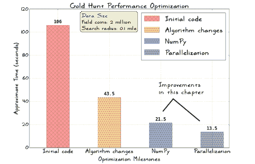

但图表并没有讲述完整的故事。*优化过程四*将显著加快 *Gold Hunt* 程序的 `generate_random_points` 函数。这种加速在图表中没有体现，因为在这个场景中该函数对运行时间没有显著贡献。在结尾部分，本章将提供关于 **PyPy** 的初步信息，供进一步阅读。PyPy 是一个提供 **即时** (**JIT**) 编译器的 Python 解释器。

### 注意

**运行 Gold Hunt 优化示例**

如果你仔细查看即将讨论的性能分析输出，你会注意到一个文件名，`goldhunt_run_master.py`。使用此文件是可选的，但它提供了一种方便的方式来运行任何优化过程。你可以在这个章节的支持代码包中找到此文件。

# NumPy 简介

NumPy 是一个强大的 Python 科学计算包。它提供了一个多维`array`对象，使得在 Python 中高效实现数值计算成为可能。与列表相比，它的内存占用相对较小。`array`对象只是 NumPy 的许多重要特性之一。除此之外，它还提供了线性代数和随机数生成功能。它还提供了访问用其他语言编写的代码的工具，例如 C/C++和 Fortran。让我们从一个简短的介绍开始，以了解其功能。本书中我们将讨论的更多像是 NumPy 表面的冰山一角！本章涵盖了以后用于加速*黄金狩猎*应用程序的一些特性。

### 提示

查阅官方 NumPy 文档([`docs.scipy.org`](http://docs.scipy.org))，了解这里未涵盖的几个其他特性。

如果你已经熟悉 NumPy，你可以选择性地跳过这个介绍，直接进入*优化黄金狩猎 – 第二部分*部分。

## 安装 NumPy

一些 Python 发行版，例如 Anaconda ([`www.continuum.io/downloads`](https://www.continuum.io/downloads))，默认提供 NumPy。如果不可用，请使用`pip`安装它。以下是在 Linux 上安装的方法，假设`pip`可以在终端作为命令使用：

```py
$ pip install numpy 

```

这应该会安装 NumPy。如果你遇到问题，请参阅[`www.scipy.org/install.html`](http://www.scipy.org/install.html)上的平台特定安装说明。或者，你可以使用前面提到的 Anaconda Python 发行版。

安装完成后，打开 Python 解释器并输入以下命令：

```py
>>> import numpy as np 

```

假设安装成功，它应该导入 NumPy。在接下来的讨论中，我们将使用`np`作为`numpy`的别名。保持解释器窗口打开。在接下来的介绍中，我们将运行一些简单的 NumPy 操作。

## 创建数组对象

如前所述，多维（**N 维**）数组对象是 NumPy 的核心功能之一。这个数组由内置类`numpy.ndarray`提供。它表示同一类型的元素集合。换句话说，它是一个同质数组。有几种方法可以创建 NumPy 数组。在你的 Python 解释器中输入以下代码：

```py
>>> import numpy as np 
>>> x = np.array([2, 4]) 
>>> x 
array([2, 4])

```

这将创建一个由`x`变量表示的数组实例，包含两个元素。这是一个`numpy.ndarray`类型的数组。它是一个一维数组。你可以访问任何元素或更改其值，就像 Python 的`list`一样：

```py
>>> x[0] 
2 
>>> x[0]=8 
>>> x 
array([8, 4]) 

```

在这个简单的例子中，数组的大小是`2`。这也被称为数组的*形状*。NumPy 将数组形状表示为整数元组。它给出了每个维度的数组大小。这如下面的代码行所示：

```py
>>> x.shape 
(2,)

```

继续深入，这里还有一个创建二维数组的例子：

```py
>>> p = np.array([[4, 8], [10, 20]]) 
>>> p 
array([[ 4,  8], 
 [10, 20]]) 
>>> p.ndim
2
>>> p.shape 
(2, 2)

```

这里，`ndim`代表数组的维度数。数组形状表示每个维度的大小。

让我们回顾一下`numpy.arange`函数。这与 Python 的`range`函数类似。但是，`arange`返回一个`array`对象而不是`list`。以下是用`numpy.arange`创建数组的另一种方法：

```py
>>> a = np.arange(10) 
>>> a 
array([0, 1, 2, 3, 4, 5, 6, 7, 8, 9]) 

```

NumPy 中创建数组的方法有很多。有关更多详细信息，请参阅文档（[`docs.scipy.org/doc/numpy/reference/`](http://docs.scipy.org/doc/numpy/reference/））。特别是，查找数组创建例程。

## 简单数组操作

我们将回顾一些可以在 NumPy 数组上执行的基本数学操作。让我们创建两个数组，`x`和`y`（这些是一维数组或向量）：

```py
>>> import numpy as np 
>>> x = np.array([2, 4]) 
>>> y = np.array([2, 4]) 

```

使用这些数组，您可以执行数学运算，如加法、减法、乘法等。NumPy 按元素逐个执行所有这些操作：

```py
>>> x - y 
array([0, 0]) 
>>> x + y 
array([4, 8]) 
>>> x*y 
array([ 4, 16]) 

```

在这里需要注意的是，`x*y`不是内积。它只是`x`和`y`数组中相应元素的乘法。这些向量的内积可以通过`dot`函数实现，如下所示：

```py
>>> x.dot(y) 
20 

```

以下代码使用二维数组说明了这个概念。在这里，`x2.dot(y2)`是一个矩阵乘法操作：

```py
>>> x2 = np.array([[2, 4], [6, 8]]) 
>>> y2 = np.array([[2, 4], [1, 2]]) 
>>> x2*y2 
array([[ 4, 16], 
 [ 6, 16]]) 
>>> x2.dot(y2) 
array([[ 8, 16], 
 [20, 40]])

```

## 数组切片和索引

对于一维数组，**索引**和**切片**操作与 Python `list`类似。如果您不熟悉`list`切片操作，请参阅[`docs.python.org/3/tutorial/introduction.html#lists`](https://docs.python.org/3/tutorial/introduction.html#lists)。这是一个重要的概念。在本章中，我们只需要执行几个基本的索引操作。

### 索引

数组索引本质上是一种操作，使我们能够访问数组中的特定元素。这里有一个简单的一维数组，大小为五个：

```py
>>> b = np.arange(5) 
>>> b 
array([0, 1, 2, 3, 4]) 

```

下面展示了最简单的索引操作，它访问了这个数组的一个元素。这个操作与 Python `list`中的操作类似：

```py
>>> b[2] 
2 

```

以下是您如何从二维数组中检索元素的方法：

```py
>>> p = np.array([[2,2], [4,4]]) 
>>> p 
array([[2, 2], 
 [4, 4]]) 
>>> p[0] 
array([2, 2]) 

```

完成后，它返回一个只包含第一行的数组。

### 小贴士

重要的是要注意，基本的数组索引不会返回原始数组的副本。它只是指向与原始数组相同的内存位置。请参阅以下链接，其中详细记录了基本和高级索引：[`docs.scipy.org/doc/numpy/reference/arrays.indexing.html`](http://docs.scipy.org/doc/numpy/reference/arrays.indexing.html）

以下代码将从二维数组中检索一个值：

```py
>>> p[0][1] 
2

```

在对数组索引的基本介绍之后，让我们学习一些常见的切片操作。

### 切片

假设你想要获取只包含前两个元素的数组。就像一个`list`一样，你需要指定一个起始点和结束点。例如，`b[start:stop]`意味着结果（切片）数组将从`start`索引开始，并在`stop-1`索引结束：

```py
>>> b[0:2] 
array([0, 1]) 

```

同样，要获取只包含位置`1`和`2`的元素的任何数组，你可以这样做：

```py
>>> b[1:3] 
array([1, 2]) 

```

对于 N 维数组，你必须在每个方向上给出切片指令。考虑以下具有四行四列的数组：

```py
>>> z2 = np.array([[2, 4, 6, 8], [1, 5, 7, 9], [3, 3, 3, 3], [4, 4, 9, 4]]) 
>>> z2 
array([[2, 4, 6, 8], 
 [1, 5, 7, 9], 
 [3, 3, 3, 3], 
 [4, 4, 9, 4]]) 
>>> z2.shape 
(4, 4) 

```

让我们切片这个数组，使其只返回第一行。这里是实现这一点的语法：

```py
>>> z2[0:1, :] 
array([[2, 4, 6, 8]]) 

```

如果你只想获取`z2`的第一个列，那么可以这样指定切片：

```py
>>> z2[:, 0:1] 
array([[2], 
 [1], 
 [3], 
 [4]]) 

```

以下切片操作将使用前两行和列的元素创建一个新的数组：

```py
>>> z2[0:2, 0:2] 
array([[2, 4], 
 [1, 5]])

```

为了更好地理解数组切片操作，请在 Python 解释器中尝试更多示例。有关详细信息，请参阅文档（在网络上搜索 NumPy 数组切片）。

## 广播

广播是 NumPy 的另一个重要特性。让我们通过一个简单的例子来理解这个概念。我们有两个数组，`p0`和`p1`，如下例所示：

```py
>>> p0 = np.array([10]) 
>>> p1 = np.array([[1, 2], [3,4]]) 

```

这些数组的形状如下：

```py
>>> p0.shape 
(1,) 
>>> p1.shape 
(2,2) 

```

尽管数组具有不同的形状，NumPy 可以在这些数组上执行算术运算。下面展示了一个基本的乘法操作：

```py
>>> p0*p1 
array([[10, 20], 
 [30, 40]]) 

```

这被称为广播。`p0`数组相对于`p1`具有较小的形状。广播使得这个数组可以与`p1`一起工作。在这个例子中，它使得乘法操作成为可能。当然，这两个数组需要满足某些要求才能利用这个特性。请参考 NumPy 文档以了解更多关于广播的信息。

## 其他函数

让我们看看你可以使用 NumPy 数组执行的一些高级数学运算。

### 提示

这里展示的大部分操作将在后续关于使用 NumPy 进行性能改进的讨论中使用。所以，请密切关注这一部分。

### numpy.ndarray.tolist

这是一个实用的函数，它将 NumPy 数组作为 Python `list`对象返回。根据数组维度，它可以是嵌套列表。以下是一个展示此函数如何工作的示例：

```py
>>> x = np.array([2, 4]) 
>>> x_list = x.tolist() 
>>> x_list 
[2, 4]

```

### numpy.reshape

如其名所示，它在不实际更改数据的情况下改变数组的形状。看看以下代码；`x`数组是一维的，大小（形状）为`9`：

```py
>>> x = np.arange(9) 
>>> x 
array([0, 1, 2, 3, 4, 5, 6, 7, 8]) 
>>> x.shape 
(9,) 

```

让我们看看如何将其重塑为具有三行三列的矩阵。换句话说，以下代码返回一个形状为`(3,3)`的新数组：

```py
>>> np.reshape(x, (3,3)) 
array([[0, 1, 2], 
 [3, 4, 5], 
 [6, 7, 8]]) 

```

选择的新形状应该与数组的原始形状兼容；否则，它将抛出一个错误。对于前面的例子，如果你将其重塑为`np.reshape(x, (3,2))`，它将抛出一个值错误，抱怨大小已更改。

### numpy.random

此模块提供了几个随机抽样的函数。有关详细列表，请参阅 [`docs.scipy.org/doc/numpy/reference/routines.random.html`](http://docs.scipy.org/doc/numpy/reference/routines.random.html)。

让我们回顾一下 `np.random.uniform`，它从均匀分布中抽取样本：

```py
>>> np.random.uniform(0.0, 2.0, size=3) 
array([ 0.24061728,  0.66123504,  1.86137435]) 
>>> np.random.uniform(0.0, 2.0, size=4) 
array([ 1.81382452,  1.20355728,  1.07085075,  0.9653697 ]) 

```

该函数的前两个参数代表输出区间的下限（`0.0`）和上限（`2.0`）。你可以指定任何浮点值作为限制。函数生成的所有随机值或样本都位于这两个限制之间。默认的下限和上限分别是 `0.0` 和 `1.0`。`size` 参数代表输出数组的形状。在先前的例子中，它指定为一个单个整数值。如果你不指定 `size` 参数，它默认为 `None`。在这种情况下，函数将简单地返回一个单一的浮点数。以下是一个 `size`（或形状）参数为元组 `(2,2)` 的稍微复杂一点的例子：

```py
>>> np.random.uniform(0.0, 2.0, size=(2,2)) 
array([[  1.02970767e+00,   4.48798719e-02], 
 [  5.20609066e-04,   6.10167655e-01]]) 

```

你是否已经注意到 Python 内置的 `random.uniform` 函数和 NumPy 等效的 `np.random.uniform` 函数之间的区别？NumPy 的 `np.random.uniform` 函数可以选择性地给我们一个包含从均匀分布中抽取的样本的 `array` 对象，而内置的 `random.uniform` 只能给我们一个单一的数字。我们将在 *优化过程四* 中使用这个 NumPy 函数。

### numpy.dstack

这提供了一种简单的方法来沿第三个轴堆叠或连接一系列数组。考虑两个 NumPy 数组，`x` 和 `y`，它们代表空间中一些点的 x 和 y 坐标。这些数组如下所示：

```py
>>> x = np.array((1, 2, 3, 4)) 
>>> y = np.array((10, 20, 30, 40)) 

```

因此，`x[0]=1` 和 `y[0]=10` 代表一个点 `(1, 10)`。同样，我们可以为剩余的元素表示其他点。有时，使用一个单一的数组来表示这些点的坐标是很方便的，如下所示：

```py
points = [ [1,10], [2,20], [3, 30], [4, 40]] 
```

我们如何使用前面显示的 `x` 和 `y` 数组创建这样的数组？有多种方法可以做到这一点。一个选项是使用 `numpy.dstack`。此函数允许沿第三个轴堆叠数组以创建单个数组。以下代码显示了如何使用输入的 `x` 和 `y` 数组创建前面讨论的 `points` 数组：

```py
>>> points = np.dstack((x,y)) 
>>> points 
array([[[ 1, 10], 
 [ 2, 20], 
 [ 3, 30], 
 [ 4, 40]]]) 

```

注意，结果数组是三维的：

```py
>>> points.ndim 
3 

```

沿每个轴（或维度）的数组大小由其形状给出：

```py
>>> points.shape 
(1, 4, 2) 

```

我们将在 *优化过程五* 中使用此函数。同样，还有其他堆叠数组的方法，例如 `numpy.hstack` 或 `numpy.vstack`。这些在本章中未讨论。有关更多详细信息，请参阅 NumPy 文档。

### numpy.einsum

此函数提供了一种在输入数组上计算 **爱因斯坦符号**（或 **爱因斯坦求和约定**）的方法，用于操作（称为 **操作数**）。在性能方面，此函数提供了极大的效率。在章节的后面，我们将利用它来找到两点之间的距离的平方。

### 注意

理解 `einsum` 背后的数学概念可能有点挑战性，尤其是如果你没有数学背景的话。在这种情况下，只需记住关于 `numpy.einsum` 的一个关键点——它是一个允许你执行一些涉及数组的非常高效操作的函数。例如，两个 NumPy 数组之间的矩阵乘法操作或点积可以使用 `numpy.einsum` 更高效地完成。

请参阅 NumPy 文档以获取有关此函数的更多信息。有关爱因斯坦符号的信息，请参阅 [`en.wikipedia.org/wiki/Einstein_notation`](https://en.wikipedia.org/wiki/Einstein_notation)。

这可以通过一个例子来更好地解释。考虑以下表示两个向量 *A* 和 *B* 的方程：


这些是空间中的两个点，具有一些 *x*、*y* 和 *z* 坐标。这些向量的点积表示如下：


### 小贴士

要了解更多关于点积的信息，请参阅 [`en.wikipedia.org/wiki/Dot_product`](https://en.wikipedia.org/wiki/Dot_product)。

它是一个标量积，可以表示为以下方程中的求和，如下所示：


前述方程的爱因斯坦求和约定如下所示：


在这里，隐含的是 *AiBi* 是对 *i* 的求和，下限为 *1*，上限为 *3*。这就是爱因斯坦求和约定的精髓。

`numpy.einsum` 对给定的输入数组评估爱因斯坦求和约定。以下显示了基本语法——还有其他可选参数，但在此处未显示：

```py
numpy.einsum(subscripts, *operands)
```

第一个参数，`subscripts`，是一个表示一系列下标标签的字符串。这些标签通过逗号分隔，每个标签代表特定操作数的维度。在我们刚才看到的例子中，只有一个下标标签，*i*。第二个参数，`operands`，代表输入数组（例如，例子中的 *A* 和 *B*）。

假设 *A* 和 *B* 向量是一维的。它们的内积可以用下标字符串 `'i,i'` 来表示。以下是一个更好的例子来解释这一点：

```py
>>> import numpy as np 
>>> a = np.array([2, 2]) 
>>> b = np.array([4, 4]) 
>>> np.einsum('i,i', a, b) 
16 

```

数组 `a` 和 `b` 是一维的。您也可以使用 `numpy.inner` 函数来交叉检查答案，该函数返回相同的答案：

```py
>>> np.inner(a,b) 
16 

```

`numpy.einsum` 函数更快，而且内存效率更高。现在，看看以下代码——它表示两个向量 `a2` 和 `b2` 的点积（或矩阵乘法）：

```py
>>> a2 = np.array([[1,1], [2, 2]]) 
>>> b2 = np.array([[4,4], [6, 6]]) 
>>> np.einsum('ij,jk', a2, b2) 
array([[10, 10], 
 [20, 20]]) 

```

`numpy.einsum` 的下标字符串为 `'ij,jk'`，其中 `ij` 是数组 `a2` 的两个维度的下标，而 `jk` 是数组 `b2` 的下标。点积也可以通过以下示例获得：

```py
>>> np.dot(a2, b2) 
array([[10, 10], 
 [20, 20]])

```

### 使用 einsum 计算距离平方

到目前为止展示的示例应该只是给你一个关于`einsum`函数的味觉。让我们只讨论如何使用这个函数来计算两点之间的距离的平方。再次提醒，为了全面的参考，请参阅 NumPy 文档。

考虑任意一个坐标为(`0, 2`)的点`p1`。此外，假设中心位于(`0,` `0`)。由于`p1`点的 x 坐标是`0`，你可以很容易地确定`p1`和中心之间的距离是 2 个单位。距离的平方可以使用`einsum`函数找到，如下所示：

```py
>>> p1 = np.array([0,2]) 
>>> center = np.array([0, 0]) 
>>> d = p1 - center 
>>> d 
array([0, 2]) 
>>> np.einsum('i,i', d, d) 
4 

```

现在，假设有多个这样的点，并且你想找到每个点与中心的距离的平方。这是使用`einsum`计算的一种方法：

```py
>>> points = np.array([[0,2], [0,4], [2, 2], [4, 4]]) 
>>> center = np.array([0,0]) 

```

`points`数组代表一系列点。对于这些点中的每一个，我们将找到一个向量，以`center`作为起点，以`points`数组中的给定点作为终点。让我们将这样的向量数组表示为`diff`，如下面的示例所示：

```py
>>> diffs = points - center 
>>> diffs.shape 
(4, 2) 
>>> diffs 
array([[0, 2], 
 [0, 4], 
 [2, 2], 
 [4, 4]]) 

```

由于中心是(`0,0`)，`diff`数组本质上与`points`数组相同。以下代码行显示了`einsum`语法——它使用省略号符号(`…`)在子脚本的每个项的左侧：

```py
>>> np.einsum('...i,...i', diffs, diffs) 
array([ 4, 16,  8, 32]) 

```

它返回一个包含`points`数组中每个点距离平方的数组。这就是我们需要的全部！

这个省略号符号表示什么？为什么我们没有使用早期的语法？

```py
>>>  np.einsum('i,i', d, d) 

```

早期的语法涉及单维数组（`d`），它只有一个下标标签。在这里我们不能使用它作为操作数（或`diffs`数组），因为爱因斯坦求和的操作数是一个二维数组。为了理解这一点，让我们再次看看`diffs`数组：

```py
>>> diffs 
array([[0, 2], 
 [0, 4], 
 [2, 2], 
 [4, 4]]) 

```

考虑这个数组的任意一行。它本质上是一个点和中心之间的向量。例如，`[0, 2]`代表一个中心`[0,0]`和一个点`[0,2]`之间的向量。数组的另一个维度是用来存放许多这样的向量。省略号符号"`…`"是一个方便地广播第二个维度的方式。得到相同结果的另一种语法如下：

```py
>>> np.einsum('ij,ij->i', diffs, diffs) 
array([ 4, 16,  8, 32]) 

```

然而，如果数组形状进一步改变，你将需要再次工作于为`einsum`函数构建一个合适的下标字符串。NumPy 文档中有几个示例展示了如何使用`einsum`。以下是一个 NumPy 1.10 版本的文档：[`docs.scipy.org/doc/numpy-1.10.0/reference/generated/numpy.einsum.html`](http://docs.scipy.org/doc/numpy-1.10.0/reference/generated/numpy.einsum.html)。

## 哪里可以找到更多关于 NumPy 的信息？

在 NumPy 的介绍中，你被提供了几个指向文档的链接。为了完整性，让我们总结一下在哪里可以找到更多关于 NumPy 的信息。你可以从访问他们的网站([`www.numpy.org/`](http://www.numpy.org/))或在网上搜索 NumPy 以到达其主页开始。

**SciPy** 是另一个值得提及的项目。它是一个集成了数学、科学和工程学科多个开源工具的库。NumPy、matplotlib 和 pandas 是其核心包之一。更多信息请参阅项目网站([`www.scipy.org/`](https://www.scipy.org/))。

在之前的讨论中，提供了一些指向 NumPy 文档的链接。查看这些链接，你一定已经注意到它们都指向 SciPy 网站。NumPy 和 SciPy 的文档都位于[`docs.scipy.org/doc/`](http://docs.scipy.org/doc/)。

用于 Python 数据分析的开源 pandas 库。它提供了高性能的数据结构和工具来分析数据。更多信息请参阅[`pandas.pydata.org/`](http://pandas.pydata.org/)。

# 优化黄金狩猎 – 第二部分

前一节简要介绍了 NumPy。回想一下，在早期章节中，我们逐步提高了游戏的运行性能。最后一次记录的时间是使用**优化迭代三次**获得的时间。我们成功将总运行时间从大约 106 秒减少到近 44 秒。NumPy 支持向量化计算例程，如元素级乘法。它内部使用高效的 C 循环，有助于加快此类操作的运行速度。让我们利用 NumPy 的功能，进一步加快*黄金狩猎*游戏的运行速度。

## 黄金狩猎优化 – 第四次迭代

现在是时候继续对*黄金狩猎*问题进行优化操作了。让我们从**优化迭代四次**开始。我们将再次关注函数`generate_random_numbers`。作为一个复习，上次优化运行的`cProfiler`输出报告了总时间为约 2.6 秒，累计时间（包括子函数花费的时间）为约 5.2 秒**。


| *你说得对。对于这个例子，优化这段代码不值得。5.2 秒的时间看起来并不那么糟糕。目前，该函数只被调用一次，正如`cProfile`输出的`ncalls`列所示。但任何未来的需求都可能使这个函数成为新的瓶颈。例如，想象一个新游戏场景，其中有成百上千这样的黄金区域或充满废弃武器的场所。我们可能需要多次调用这样的函数。这将增加生成点所需的总时间。考虑到这一点，让我们努力提高其性能。* |
| --- |

我们将重新编写上次优化运行中的代码（`goldhunt_pass3.py`）。支持源代码位于`goldhunt_pass4.py`文件中。我们将首先在文件开头添加 NumPy 的`import`语句：

```py
import numpy as np
```

以下代码片段展示了重新工作的`generate_random_points`函数：

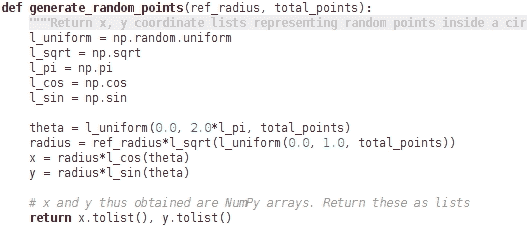

使用局部变量，如 `l_uniform`，是可选的。这些变量在这里用于跳过函数重新评估。这已经在上一章的 *跳过点* 部分中讨论过了。让我们接下来回顾这个函数：

+   将新函数与之前的实现进行比较。这里需要注意的关键点是使用 NumPy 函数，例如 `np.random.uniform`、`np.sqrt` 等，来替代内置函数。

+   另一个主要区别是我们不再需要 `for` 循环。`np.random.uniform` 函数返回一个 NumPy 数组。最后一个参数指定其大小。有关 `random.uniform` 功能的更多信息，请参阅之前关于 NumPy 的介绍部分。

+   使用 `radius` 和 `theta` 数组计算 `x` 和 `y` 坐标。请注意，变量 `x` 和 `y` 是作为 NumPy 数组创建的。出于效率考虑，我们将以 Python 列表的形式返回这些坐标。这是通过使用 `numpy.ndarray.tolist()` 方法实现的，该方法对 NumPy `array` 对象可用。

让我们来分析这段代码，并将其性能与之前的优化过程进行比较。以下是执行此代码的命令：

```py
$ python goldhunt_pass4.py

```

分析器的输出如下所示：

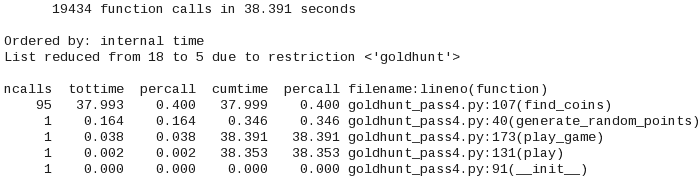

观察到 `generate_random_points` 函数的累积时间列。原始函数的累积时间约为 5.2 秒，现在已减少到 `0.346` 秒。这已经是一个显著的改进。

### 小贴士

有可能进一步改进 `generate_random_points` 函数的性能。例如，在函数的开始处，你可以计算乘积 `2*l_pi`，例如：

```py
two_pi = 2*np.pi 
```

然后在计算 `theta` 时使用这个变量。然而，这只会对运行时间产生微小的改进。

## 黄金狩猎优化 – 第五次迭代

在这次优化过程中，我们将进一步改进 `GoldHunt.find_coins` 方法的运行时性能。为了方便起见，原始方法在以下代码片段中显示。你还可以在之前的 `goldhunt_pass4.py` 文件中找到它。有关更多详细信息，请参阅上一章的 *黄金狩猎优化 – 第二次迭代* 部分。

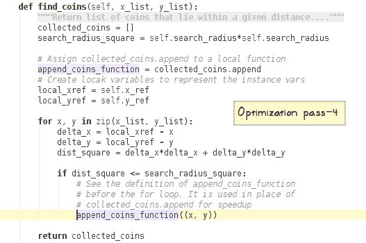

回想一下，此方法最后记录的运行时间约为 38 秒。我们的任务是进一步改进它。我们将通过修改 `generate_random_points` 函数来开始优化工作。回想一下，这个函数返回场地上 *金币* 的 `x` 和 `y` 坐标作为 Python 列表。相反，让我们将这些作为 NumPy 数组返回。

### 小贴士

如果你跳过了之前关于 NumPy 的介绍部分，现在应该是返回去阅读它的时候了！*优化第五次迭代* 使用了该部分讨论的 NumPy 函数。更具体地说，下面的代码片段使用了 `einsum` 和 `dpstack` 函数。你可能觉得 `einsum` 语法很复杂。因此，建议你在深入研究代码之前先阅读介绍。

在 `find_coins` 方法中，我们将使用与这些 NumPy 数组高效工作的 NumPy 函数。下面的代码片段显示了更新的函数：

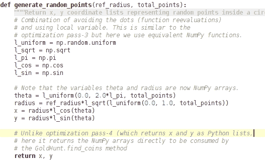

通过这个修改，让我们快速回顾一下重新工作的 `find_coins` 方法：

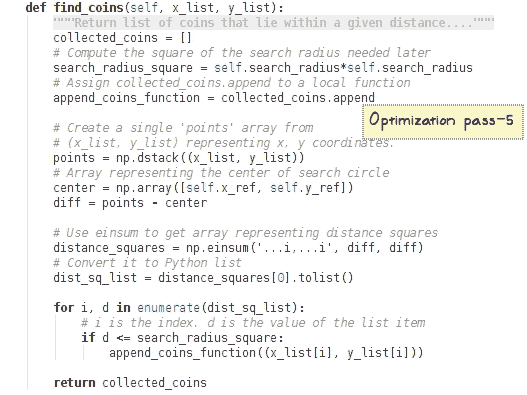

让我们回顾一下前面的代码片段：

+   回想一下，我们的任务是找到场地上任何金币与搜索圆心的距离平方，然后使用这个值来检查金币是否位于搜索圆内。

+   输入参数 `x_list` 和 `y_list` 是表示金币在场地上 x 和 y 位置的 NumPy 数组。

+   使用这些坐标，我们将创建一个包含 (x, y) 坐标对的 `points` 数组，作为其元素。这是通过使用 `numpy.dstack` 实现的。请参阅之前关于 NumPy 的介绍部分以获取示例用法。

+   接下来，我们将找到 `points` 数组中每个点与搜索圆的 `center` 数组之间的向量。这些向量作为 `diff` 数组的元素存储。

+   使用这个 `diff` 数组，我们将使用 `einsum` 计算所有金币与中心的距离平方。请参阅前面的，*使用 einsum 计算距离平方* 部分，其中对此进行了详细讨论。

+   最后，我们将通过比较距离平方来检查金币是否位于圆内。`enumerate()` 函数是一个内置函数，它以更简洁的方式提供获取循环当前索引（`i`）和对应值（`d`）的方法。

代码已经准备好了。现在，是时候分析它了：

```py
$ python goldhunt_pass5.py

```

以下是分析器的输出：

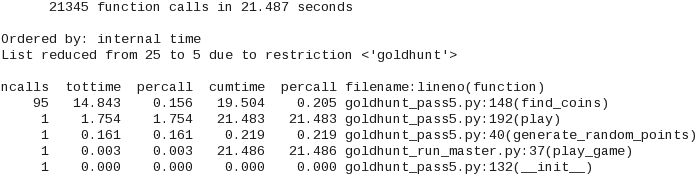

观察到 `find_coins` 函数的累积时间已经从之前的 ~38 秒下降到 ~19.5 秒。仅对于这个函数来说，这几乎是 50% 的改进。此外，总运行时间现在是 ~21.5 秒，而之前的计时是 ~38 秒。

### 小贴士

可以通过使用列表推导而不是 `for` 循环来提高 `find_coins` 的性能。然而，这种改进将是微不足道的。你可以将其作为练习尝试（不提供解决方案）。以下是一个使用列表推导的示例代码：

```py
collected_coins = [(x_list[i], y_list[i]) 
                    for i, d in enumerate(dist_sq_list) 
                    if d <= search_radius_square]
```

# 使用 multiprocessing 模块进行并行化

在讨论`multiprocessing`模块之前，让我们首先了解我们所说的并行化是什么意思。这将是一个非常简短的并行化介绍，仅足够理解如何使用`multiprocessing`模块的一些功能。

## 并行化简介

想象你站在一家杂货店收银台的长队中，等待你的轮次。现在，又开了三个收银台来服务顾客，现有的队列被分割。结果，你可以快速付款并离开商店。

在某种意义上，并行化实现了类似的结果。在这个例子中，每个计数器可以想象成一个独立的过程，执行独立的接受支付任务。顾客的初始队列可以想象成你的程序。然后，这个长队列被分成独立的队列（或任务），在各自的计数器（进程）上并行处理。

我们迄今为止编写的**黄金狩猎**程序是顺序执行的。程序在一个单一处理器上依次执行一系列任务。这类似于之前提到的杂货店例子中的单个计数器。很多时候，可以将程序分成更小的任务，并使用多个进程或线程独立运行。

让我们快速回顾两种处理并行进程通信的广泛编程模型。这些是**共享内存**和**分布式内存**并行化。

### 共享内存并行化

在共享内存编程模型中，并行进程访问相同的内存段。因此，数据交换和进程间的通信通过这个公共内存进行。这种编程模型通常被称为**线程编程**。共享内存模型的缺点是所谓的**竞态条件**。在这里，多个线程竞争访问或修改，例如，内存位置的数据。可以通过使用**锁**来控制对关键信息的访问来避免竞态条件。然而，这会增加编程开销。有关更多信息，请参阅[`en.wikipedia.org/wiki/Shared_memory`](https://en.wikipedia.org/wiki/Shared_memory)。

### 分布式内存并行化

在这里，每个进程都有自己的内存空间。进程之间不共享任何内存资源，并且它们独立运行。进程间的通信通过进程间通信通道进行。这被称为**消息传递**。要了解更多关于消息传递的信息，请参阅[`en.wikipedia.org/wiki/Message_passing`](https://en.wikipedia.org/wiki/Message_passing)。由于进程不共享相同的内存空间，与分布式内存机制相关的通信开销也额外增加。

## 全局解释器锁

在 Python 中，`threading`模块提供了一个基于线程的并行化的高级接口。为了避免前面讨论的竞争条件，Python 采用了一种称为**全局解释器锁**（**GIL**）的机制。当一个线程正在执行代码块时，它会获取一个全局锁。这个锁确保在 Python 解释器环境中一次只有一个线程被执行。GIL 的缺点是，你无法充分利用多核处理器。

## 多进程模块

`multiprocessing`模块解决了 GIL 问题，并为并行化 Python 程序提供了一种简单的方法。它不是使用线程，而是使用子进程，并避免了 GIL。在这个模块中，进程间数据交换是通过两个通信通道实现的，一个`Queue`类和一个`Pipe`函数。此模块还提供了其他一些有用的功能，如*管理器*和*代理对象*。`Manager`对象是通过`multiprocessing.Manager()`创建的。它控制一个服务器进程，该进程管理 Python 对象。管理器还允许其他进程通过代理来操作这些 Python 对象。讨论这些功能超出了本书的范围。Python 文档中有关于这些功能如何工作的优秀示例。有关更多信息，请参阅[`docs.python.org/3/library/multiprocessing.html`](https://docs.python.org/3/library/multiprocessing.html)。

在本章中，我们将仅介绍`Pool`类的几个功能。

### `Pool`类

`multiprocessing.Pool`类提供了一种简单的方法来并行化程序。它用于管理一组工作进程，并定义了允许以各种方式并行运行给定任务的方法。

### 提示

另一种基本的方法是使用`Process`类，本书没有讨论这个类。有关详细信息，请参阅前面的文档链接。

`Pool.map`和`Pool.apply`方法是经常使用的方法之一。这些是 Python 内置的`map`和`apply`函数的并行等效方法。这两种方法都会阻塞主程序，直到工作进程完成并且结果准备好。如果你对从并行进程中获取顺序输出感兴趣，这种阻塞特性是有用的。它们也有它们的异步变体，即`map_async`和`apply_async`。异步变体更适合运行你不在乎结果返回顺序的并行作业。

### 提示

`apply`函数在 Python 3 中不再是内置函数。然而，它在 Python 2.7 中得到了支持。你可以参考 Python 2 文档来了解这个函数的功能。

让我们通过一个简单的例子来展示如何使用`Pool`类及其方法`map`和`apply`。观察以下代码：

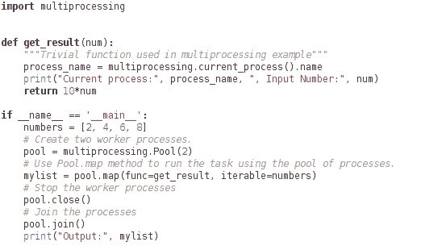

让我们回顾一下前面的代码片段：

+   我们首先导入`multiprocessing`模块。

+   使用两个工作进程创建`pool`实例。您可以指定工作进程的数量作为可选输入参数。

+   在创建工作进程池之后，调用`pool.map`方法。如前所述，这是内置`map`函数的并行等效。第一个参数是一个简单的函数`get_result`。此函数应用于作为第二个参数指定的`iterable`。

+   在这种情况下，`get_result`函数应用于`numbers`列表的每个元素。在这个函数内部，我们还打印出执行任务的当前工作进程的名称。

+   `pool.close()`方法在执行后停止工作进程，而`pool.join()`方法阻塞，直到工作进程终止。这模仿了`threading`模块提供的 API。

前面的代码也可以在`pool_example.py`文件中找到。在这个文件中，您只需要启用相关代码并禁用其他函数调用。该文件可以从命令提示符运行，如下所示：

```py
$ python  pool_example.py 

```

这是执行后的一个示例命令行输出：

```py
Current process: ForkPoolWorker-1 , Input Number: 2 
Current process: ForkPoolWorker-2 , Input Number: 4 
Current process: ForkPoolWorker-2 , Input Number: 6 
Current process: ForkPoolWorker-1 , Input Number: 8 
Output: [20, 40, 60, 80] 

```

注意，输出列表（`mylist`）的元素排列顺序与输入列表（`numbers`）相同。换句话说，我们有输入`[2, 4, 6, 8]`，输出是每个元素的 10 倍，给出`[20, 40, 60, 80]`。对于异步变体，情况可能如此也可能不如此。这取决于进程完成并返回结果的顺序。

只需一行代码的更改，我们就可以使用`Pool.apply`运行相同的示例。下面的代码片段显示了如何做到这一点。`get_result`函数没有显示，因为它与之前相同，如下所示：

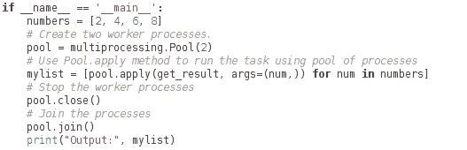

在这里，我们使用列表推导式创建了`mylist`。对于`numbers`列表中的每个元素，它调用`Pool.apply`方法。该方法的第一参数是函数的名称，而第二个参数`args`用于指定此函数的其他参数。此方法提供了方便的语法来指定要发送给工作进程的函数的任意数量的参数。其余的代码和编程输出保持不变，如`Pool.map`方法示例中所示。让我们回顾一下异步变体之一，`Pool.apply_async`。代码如下：

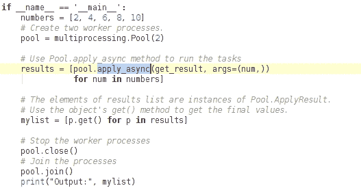

让我们分析一下这段代码：

+   这涉及两个更改。第一个是微不足道的。将`apply`方法简单地替换为`apply_async`（如高亮显示所示）。方法语法没有变化。

+   然而，`apply_async`调用的输出并不直接给出我们需要的最终值。相反，它返回`Pool.ApplyResult`类的对象。

+   在这个例子中，`apply_async`被用在列表推导式中。因此，`results`列表的元素是`ApplyResult`类的对象。

+   最终值可以通过使用`ApplyResult.get()`方法获得。我们使用列表推导，如图中所示。或者，你也可以使用前一章中讨论的生成器表达式语法。

在对并行化进行简短介绍之后，让我们看看如何将*黄金狩猎*应用程序的一些功能并行化。

# 并行化黄金狩猎程序

从之前的分析器输出中可以看出，`find_coins`函数仍然是主要的瓶颈，累计耗时约 19.5 秒。让我们看看并行化如何帮助进一步加快速度。

## 重新审视金矿场

这里是第七章中*性能 – 识别瓶颈*的*金矿场*图像：

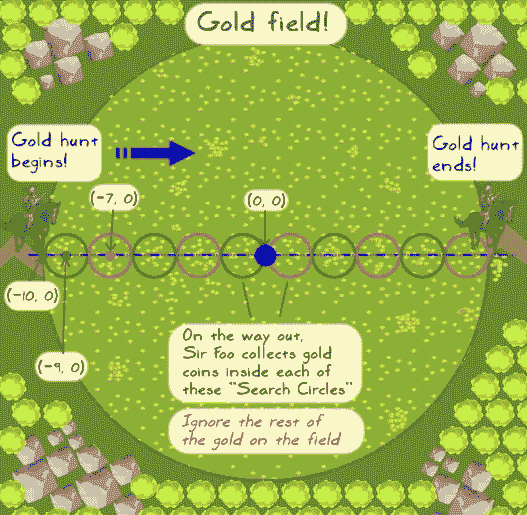

让我们快速总结一下我们在第七章中已经看到的内容，*性能 – 识别瓶颈*：

+   `find_coins`方法被调用以显示图中的每个小搜索圆。因此，如果有 10 个搜索圆，`find_coins`将被连续调用 10 次。

+   `find_coins`方法返回给定搜索圆内金币的坐标。

+   所有这些收集到的金币信息都保存在一个列表对象中。

这里有一个需要注意的重要事项。这是一个串行执行。你从第一个圆开始，收集金币，然后移动到下一个，重复此过程，直到到达田野的另一端。

| *那么我们如何进一步优化搜索操作呢？有什么想法吗，伟大的矮人先生？* |
| --- |


| *太棒了！**由于每个圆内的搜索操作与其他操作是独立的，因此`find_coins`函数可以独立于每个搜索圆执行。这是一个并行化的理想候选者。* |
| --- |


| *这甚至更好！**由于结果返回的顺序（由工作进程返回）并不重要，我们可以使用* `Pool.apply_async` *来并行化这个任务。* |
| --- |

## 黄金狩猎优化 – 第六次流程，并行化

作为第一步，你应该浏览一下上一次**优化流程五**的`play`方法。我们即将进行的多数更改都将在这个方法中进行。此外，我们还将向`find_coins`方法传递一些额外的参数。

因此，我们决定使用一个由`Pool`对象表示的工作进程池。这个`Pool`对象的工作队列由之前显示的金矿内的所有搜索圆组成。每个工作进程将并行运行搜索操作（`find_coins`），并且它不依赖于其他搜索圆。通常，`Pool`对象内的工作进程在处理完完整的工作队列之前不会终止。当一个工作进程完成特定搜索圆中硬币的查找后，它可能会被分配去为另一个搜索圆执行此操作。

| *那么需要对`play`方法进行哪些更改？代码将与之前看到的`apply_async`基本示例非常相似。在现有方法中还需要更改其他内容吗？我们的朋友精灵有一个问题...* |
| --- |

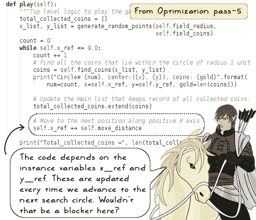

| *你说得对！现有的* `play` *方法串行运行搜索操作。它从最左边的圆开始，找到硬币，然后通过更新* `x_ref` *移动到下一个圆。* 注意，在这个例子中，我们选择了 `y_ref` *为* 0.0 *。**当我们并行运行这个搜索操作时，每个圆都将有其独特的中心坐标。我们需要为每个并行过程提供这些坐标的适当值。为此，让我们移除对* `x_ref` *和* `y_ref` *的依赖。在并行化搜索操作之前，将确定并存储所有圆的中心坐标。* |
| --- |

带有前面更改的`play`方法如下所示：

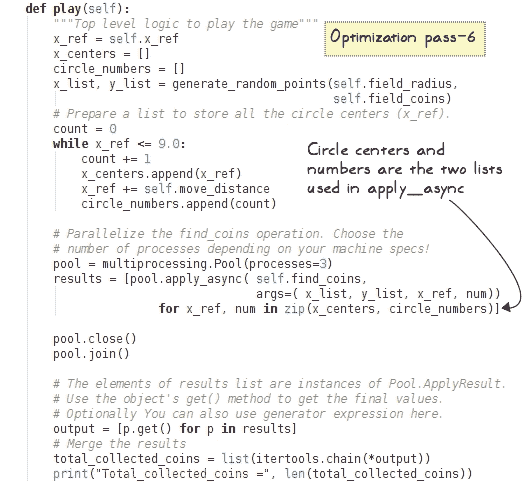

让我们讨论一下这个方法中的重要变化：

+   在一个`while`循环中，我们首先确定所有搜索圆的中心，并将坐标存储在一个名为`x_centers`的列表中。y 坐标（`y_ref`）没有更新，因为我们已经选择将其作为所有圆的常量（0.0）。

+   在相同的`while`循环中，另一个`circle_number`列表被填充以表示圆的 ID。这只是为了打印目的，这样我们就会知道正在执行哪个搜索操作。

+   准备好列表后，创建了一个工作线程池，然后在列表推导式中调用`apply_async`。

+   回想一下，`Pool.apply_async`方法的第一个参数是函数的名称（`self.find_coins`），而第二个参数`args`用于指定此函数的所有参数。

+   代码的其余部分与我们在`multiprocessing`模块介绍中看到的内容类似。`apply_async`调用返回一个包含`ApplyResult`类对象的列表。然后，使用这个类的方法`get()`来获取最终值。

### 小贴士

如果您使用的是 Python 2.7.9，您可能需要创建并使用一个全局函数作为`apply_async`的第一个参数。然后这个全局函数可以返回`GoldHunt.find_coins`方法。这是在测试代码时发现`PicklingError`异常的解决方案。对于 Python 3.x，没有这个问题。此代码包含在补充代码包中。有关`goldhunt_pass6_parallel.py`文件的 Python 2 等价物的详细信息，请参阅。

最后，对`GoldHunt.find_coins`方法进行了一些修改。现在它接受`process_x_ref`和`circle_number`函数作为两个新的参数。`process_x_ref`函数表示给定搜索圆的 x 坐标。添加`process_`前缀是为了区分它和`self.x_ref`，并表明其值对于每个工作进程将是不同的。

使用`apply_async`，我们将在这个单独的并行进程中运行这个方法。每个进程都有自己的圆心坐标和要提供给`find_coins`方法的数字。该方法在下面的代码片段中显示。高亮显示的代码表示与之前的优化迭代相比的变化。

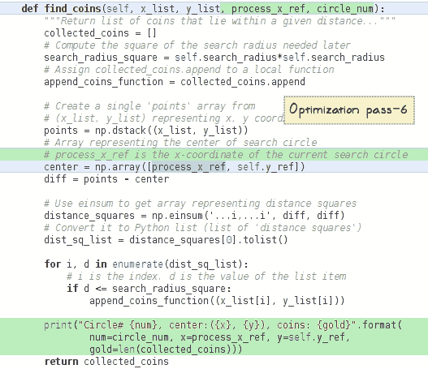

代码的其余部分与之前的优化迭代保持相同。源代码在`goldhunt_pass6_parallel.py`文件中提供。让我们运行这段代码并查看分析器的输出：

```py
$ python goldhunt_pass6_parallel.py

```

这将打印出与之前相同的信息，以下是分析器的输出：

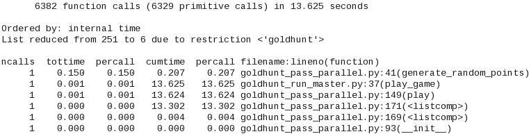

注意，`find_coins`调用在分析器输出中没有显示。它隐藏在`play`方法报告的时间中。比较`play`方法的累积时间（`cumtime`）应该可以给出并行化带来的性能提升的合理估计。

总结来说，并行化帮助将总时间从之前的约 21.5 秒减少到约 13.5 秒。

### 小贴士

根据您的机器配置，您可以尝试通过更新`Pool`类的参数来增加工作进程的数量。例如，您可以用四个进程而不是三个进程来运行程序。然而，这是一个简单的情况，运行时间非常短，您几乎看不到任何进一步的改进。实际上，子进程的开销甚至可能导致性能略有下降。此外，根据问题，超过一定数量的进程后，由于并行化带来的性能提升可能会逐渐消失。

### 其他并行化方法

`apply_async`方法是并行化这个问题的唯一方法吗？当然不是。`multiprocessing`模块中有其他方法可以有效地完成这项工作。`Pool.starmap_async`是 Python 3.3 及以上版本中可用的一种方法。我们不会在这里讨论它，但以下代码展示了如何使用`itertools.repeat`函数调用它：

```py
results = pool.starmap_async(self.find_coins, 
                               zip(itertools.repeat(x_list), 
                                   itertools.repeat(y_list), 
                                   x_centers, 
                                   circle_numbers))
```

要了解更多关于此类方法的信息，请参阅 `multiprocessing` 模块文档。

# 进一步阅读

在关于性能的三个章节系列中，我们涵盖了几个重要的方面。在这里学到的知识将帮助你完成大多数常见的应用性能提升任务。接下来我们该做什么呢？还有一些其他重要的主题你可以探索，其中包括即时编译器（JIT compilers）和**图形处理单元**（**GPU**）编程。本节旨在提供这两个主题的一些基本信息。你可以通过这里提供的链接进一步了解。

## JIT 编译器

Python 是一种解释语言。简单来说，这意味着代码是直接解析和执行的，而不涉及任何代码编译。虽然这提供了很大的灵活性，但程序通常运行得较慢。

在像 C++ 这样的高级编程语言中，代码是在编译之前或执行之前编译的。一般来说，编译程序（C++）比等效的解释程序（Python）运行得更快。

因此，我们在一边有一个提供灵活性的解释代码，在另一边有一个运行速度更快的编译代码。即时编译器取两者之长。它编译代码，但不是在执行之前编译，而是在程序执行期间即时编译。

PyPy 是这样一个项目，它提供了一个带有 JIT 编译器的 Python 语言的替代实现。Python 程序在 PyPy 上通常运行得更快。它还内存高效，并与现有的 Python 代码具有高度的兼容性。要了解更多关于 PyPy 的信息，请查看 [`pypy.org`](http://pypy.org)。

**Numba** 是另一个旨在加速应用的计划。它提供了一个即时编译器和一个非常简单的语法来标记一个函数，以便使用即时编译器进行优化。你只需要使用 `numba.git()` 装饰器。换句话说，在函数名上方添加 `@jit` 来标记该函数进行优化。如果你正在使用第一章中讨论的 Anaconda Python 发行版，*开发简单应用*，它默认已经提供了 `numba` 模块。要了解更多信息，请访问项目主页 ([`numba.pydata.org`](http://numba.pydata.org))。

### GPU 加速计算

GPU 一直被用于涉及大量渲染的应用程序，如游戏应用程序。现在它被广泛用于涉及科学模拟、神经网络、金融建模等应用程序。GPU 的海量并行架构在性能上比基于 CPU 的并行化有巨大的提升（达到 100 倍或更多）。一个典型的策略是确定应用程序中最计算密集的部分，然后将它发送到 GPU。其余的代码可以继续使用 CPU。然而，这并不像听起来那么简单，尤其是如果你正在处理遗留代码。在这种情况下，挑战可能在于使其与 GPU 加速完全兼容。

**PyCUDA** ([`pypi.python.org/pypi/pycuda`](https://pypi.python.org/pypi/pycuda)) 是一个流行的 Python 包，它提供了一个包装器来访问 Nvidia 的 CUDA 并行 API。CUDA 是由 NVIDIA 开发的一个并行计算平台。更多信息可以在 [`www.nvidia.com/object/cuda_home_new.html`](http://www.nvidia.com/object/cuda_home_new.html) 找到。

**PyOpenCL** ([`pypi.python.org/pypi/pyopencl`](https://pypi.python.org/pypi/pyopencl)) 是另一个 Python 包。它提供了一个简单的接口来访问 **Open Computing Language** (**OpenCL**) API。OpenCL 是一个并行计算的框架。有关更多信息，请参阅 [`en.wikipedia.org/wiki/OpenCL`](https://en.wikipedia.org/wiki/OpenCL)。

# 摘要

在本章中，我们结束了关于性能提升的一系列章节。让我们首先总结一下本章学到的内容。我们从 NumPy 库的基本介绍开始，看到了如何利用它来进一步加速 *Gold Hunt* 应用程序。特别是，我们使用了数组 (`numpy.ndarray`) 数据结构以及其他功能，如 `numpy.random.uniform` 和 `numpy.einsum` 来实现加速。最后的优化步骤涉及并行化代码。本章简要介绍了并行处理的基础知识。我们使用了 Python 的 `multiprocessing.Pool` 类的功能来进一步缩短应用程序的运行时间。

最后，让我们将三个性能章节的内容一起总结一下。我们首先对代码进行性能分析以确定性能瓶颈，并了解了大 O 表示法。我们逐步解决这些瓶颈以提高应用程序的性能。这是通过多种方式实现的，包括改变算法、实现高效的数据结构以及使用 Python 标准库的功能。我们还通过使用 NumPy 和并行化代码进一步提高了运行时间。

### 小贴士

分析器报告的时间可能会有很大的差异。它取决于你的机器规格，也取决于当前运行的任务。因此，你观察到的时间可能与本书中报告的数字不同。

对于这些章节中讨论的*黄金狩猎*示例，总运行时间几乎减少了一个数量级，从最初的约 106 秒减少到最终的近 13.5 秒。

到目前为止，在这本书中，你已经学习了使用命令行程序进行应用开发的几个关键方面。在最后一章，我们将看到如何使用 Python 开发简单的图形用户界面（GUI）应用程序。
