# 第十章：简单的 GUI 应用程序

到目前为止的所有章节都是关于学习如何用 Python 编写更好的应用程序代码。从一个简单的程序开始，我们看到了如何开发健壮和高效的应用程序。我们触及了软件开发的重要领域。更具体地说，我们涵盖了异常处理、部署应用程序、文档、采用最佳实践、单元测试、重构、设计模式和性能改进。关键概念是通过各种逐步改进的命令行应用程序进行解释的。

我们接下来要做什么？除了命令行之外，还有提供交互式用户界面的应用程序。桌面、移动 GUI 应用程序或 Web 应用程序都属于这一类别。此外，还有针对特定领域（如网络和数据库编程）的应用程序。这些都是广泛的话题，每个领域都有其独特的优点，有助于使应用程序更加健壮。尽管如此，本书中学到的技术为所有这些领域提供了一个坚实的基础。

这最后一章旨在让您对这样一个领域有一个基本的了解。它将是对使用 Python 进行桌面 GUI 应用程序开发的浅显介绍。

### 注意

GUI 编程太大，无法在一个章节中涵盖。尽管如此，我们仍然会这样做，同时考虑到有大量的机会可以在这里讨论之外学习。本章不会向您展示如何创建完整的、复杂的 GUI 应用程序。相反，我们只是用 Python 的 Tkinter 库浅尝辄止地涉足 GUI 应用程序开发。

下面是如何组织本章剩余内容的：

+   本章将从对可用的 GUI 框架的概述开始。

+   接下来，我们将看到什么是事件驱动编程，然后是 Tkinter 库的入门介绍。

+   接下来的是我们的第一个项目，一个使用 Tkinter 的简单 GUI 应用程序。它本质上是我们第一章中开发的第一个应用程序的 GUI 版本，即*开发简单应用程序*。

+   下一节将作为对**模型-视图-控制器**（**MVC**）架构的介绍。这将随后是我们的第二个项目，其中之前的应用程序被重写以实现 MVC 架构。

+   本章还将讨论测试 GUI 应用程序。这将是一个高级讨论，不会涉及编写任何代码。

+   由于这是最后一章，因此我们将通过简要讨论各种应用程序前沿来结束本章，并因此结束本书。

# GUI 框架概述

用户界面通常是用户可以看到并用来与应用程序进行通信的东西。到目前为止，我们已经介绍了一种基于文本的用户界面。例如，在*奥克之攻*应用程序中，用户被提示指定小屋编号，并根据输入的编号采取进一步的操作。

另一方面，**图形用户界面**（**GUI**）向用户提供了一个可能包含按钮、图标、文本字段、图形等的界面。有几种 Python 图形用户界面框架可供选择。其中许多基于跨平台技术，如 Tk、Qt、wxWidgets 等。让我们简要讨论一些最受欢迎的框架。目的是让您了解可用的 GUI 技术。

## Tkinter

**Tkinter** 提供了 Python 绑定或接口到开源的 Tk 图形用户界面小部件工具包。有关 Tk 的更多信息，请参阅其官方网站，[`www.tcl.tk/`](http://www.tcl.tk/)。它作为 Python 的标准模块提供。这意味着只要安装了 Python，我们就不需要任何额外的安装来使用它。在本书中，我们将使用 Tkinter 库演示基本的 GUI 概念。

## PyQt

**PyQt** ([`wiki.python.org/moin/PyQt`](https://wiki.python.org/moin/PyQt)) 是一个广泛使用的 Python 图形用户界面库。它是目前最成熟的框架之一。它本质上提供了对流行的 Qt 图形用户界面应用程序开发框架的 Python 绑定。为了使用这个框架，您首先需要安装 Qt。

值得注意的是，Qt 根据项目不同有不同的许可方案。例如，如果您的项目是开源发行版，根据 LGPL 或 GPL 条款许可，您可以自由使用 Qt。如果您将其用于商业目的，您必须购买许可证。有关详细信息，请访问 Qt 网站，[`www.qt.io/`](https://www.qt.io/)。

## PySide

PySide 是 Qt 图形用户界面框架的另一个 Python 绑定。它是一个免费软件，在 LGPL 许可下发布。PySide 支持 Windows、Mac 和 Linux 操作系统。有关更多信息，请参阅 [`wiki.qt.io/PySide`](https://wiki.qt.io/PySide)。

## Kivy

这是创建跨平台交互式用户界面的最有前途的开源框架之一。使用 kivy，您可以快速为移动或桌面开发原生多点触控应用程序。它提供了一个名为 Kv 的设计语言用于 GUI 设计。kivy 网站列出了许多支持的操作系统，包括 Windows、Mac OS X、Ubuntu 和 Android，为这些操作系统提供了安装程序。

### 提示

如果您使用的是不在 kivy 网站上列出的操作系统，安装可能会是一个挑战。例如，在撰写本书时，没有为 **Red Hat Enterprise Linux**（**RHEL**）版本 6.x 提供安装程序。另一个选择是从源代码构建它。但如果您不熟悉代码编译和构建过程，这可能是一个挑战。如果您真的想使用它，您也可以在运行支持操作系统的虚拟机中安装它。

## wxPython

此软件包为**wxWidgets**提供了一个包装器，它是一个跨平台的 GUI 库。这是一个开源工具包，根据项目网站([`www.wxpython.org`](http://www.wxpython.org))，支持的平台包括 32 位 Windows、许多类 Unix 操作系统和 Mac OS X。

虽然我们有多种选择可供选择，但在这个章节中，我们将使用前面提到的内置 Tkinter 模块。范围将限于开发一个演示基于 GUI 应用程序开发主要组件的简单应用程序。

# GUI 编程设计考虑因素

虽然本章的重点是开发简单的 GUI 应用程序，但花一点时间简要讨论一些重要的实际设计考虑因素或指南，对于开发用户界面来说是有价值的。这些指南对于基于 Web 或移动应用程序也很有用。我们即将讨论的一些方面实际上应该是您 GUI 应用程序开发生命周期的一部分。

## 理解用户需求

第一和最重要的任务是站在最终用户的立场上。你正在为最终用户开发 GUI 应用程序。了解他们希望看到的功能的反馈是非常重要的。这通常是需求收集的一部分。

## 开发用户故事

好的，你知道了所需的功能，并准备了一个将在即将推出的版本中支持的功能列表。准备一个模拟用户界面，说明如何访问各种功能以及它们如何交互，通常是有用的。这个模拟用户界面可以是一个简单的演示。然后你可以从开发团队以及产品的关键用户那里获取反馈。这将使你能够立即识别问题（如果有的话），或者在编写代码之前就完善你的设计策略。与关键利益相关者的此类讨论也可能揭示出你尚未考虑的未来需求。这反过来又可以帮助你完善软件架构，为这些需求做出规定。接下来，让我们了解一些设计原则。

## 简洁性和易用性

GUI 应该足够简单，以便最常用的任务易于访问。开发者认为的“简单”可能并不总是与最终用户相匹配。获取用户反馈和进行设计迭代起着重要作用。在设计简洁性时，通常需要记住以下几点：

+   如何在应用程序窗口中布局各种组件很重要。这是直观的吗？是否易于访问？

+   在用户界面(UI)中突出显示常用和重要的功能。

+   尽量隐藏高级或不太常用的功能。如果可能的话，你可以在你的图形用户界面(GUI)中创建一个专家模式，让这些功能突出显示。

+   在适用的情况下设置默认值。

+   常见用户操作应该容易执行。例如，如果更改背景颜色是一个常见任务，允许用户通过点击按钮或使用键盘快捷键来访问此选项。

+   尽量不要在默认显示中放入太多东西。减少杂乱。

当然，这不是一个完整的列表，具体内容会根据应用程序和领域的变化而变化。

## 一致性

用户界面应该是统一的。如果你有类似的功能，它们应该有类似的外观和感觉，类似的执行步骤，等等。标准功能或功能的位置不应改变。例如，在文本编辑器中，**打开**按钮通常放置在应用程序窗口的右上角。这个默认位置应该保持不变。

## 可预测性和熟悉性

当按钮被点击时，用户应该能够预测下一步的操作。一个简单的例子是**另存为...**按钮——当点击时，用户期待一个对话框，可以选择指定位置和文件格式。为什么？因为他或她熟悉在其他应用程序中使用类似的功能。此外，用户会期待一些默认目录位置来保存文件。UI 不应该通过改变这种行为来让用户感到惊讶。

同样，当你设计图标时，它应该能够自我表达。例如，齿轮图标通常表示某种可配置的设置。UI 设计应该是用户可以轻松猜测在特定情况下下一步要执行的操作，无论是退出当前模式还是返回上一步，等等。

## 其他设计考虑因素

我们已经介绍了一些在设计 GUI 之前你应该知道的重要因素。还有很多其他的设计原则。其中一些原则与我们之前讨论的方面相关。以下是一些可以列举的原则：

+   GUI 应该具有视觉吸引力和清晰度。

+   它应该是可理解的。换句话说，新用户应该能够快速上手。

+   它应该预见常见问题，并优雅地处理用户错误。

# 事件驱动编程

在一个由算法驱动的程序中，程序的流程是由该程序中预定义的步骤决定的。程序可能会提示用户输入这些指令。一个例子是命令行应用程序按照预定义的顺序请求用户输入。

相比之下，具有图形用户界面的应用程序允许用户决定程序流程。应用程序等待用户操作，然后对这些操作做出响应。例如，如果你正在阅读一本书的 PDF 副本，你可以执行诸如跳转到下一页、放大、滚动或通过点击适当的按钮关闭窗口等操作。在这里，你实际上是在告诉应用程序接下来要做什么。这被称为事件驱动编程。在这里，程序的流程控制由触发的事件控制。应用程序在事件发生时对这些事件做出响应。响应可能是改变图形元素的状态或运行一些后台任务等。例如，如果用户点击代表下一页的按钮，应用程序将显示书的下一页。接下来，让我们简要谈谈事件驱动编程中的一些重要概念。

## 事件

简而言之，事件代表在 GUI 窗口内发生的一个动作。事件可能由各种来源触发。例如，当用户点击鼠标按钮时，它生成一个点击事件；按下键盘上的键被识别为另一个事件，等等。事件也可能在没有直接用户输入的情况下生成。例如，应用程序可能在后台完成了一些计算，现在想要更新 GUI 显示的内容。这可能会自动触发一些更新事件，从而重新绘制视图。

## 事件处理

当一个事件被触发时，应用程序会对该事件做出响应。例如，当你点击浏览器的关闭按钮时，你期望浏览器窗口关闭。在这个例子中，关闭窗口是应用程序对由于用户操作而生成点击事件的响应。换句话说，应用程序有一个*监听器*对象来*处理*这个点击事件。每个 GUI 框架都提供了一种将事件*绑定*（或*连接*）到处理函数的方法。

## 事件循环

事件循环是 GUI 程序的主要控制循环。当你启动应用程序时，主循环开始，并等待事件发生。它监视事件源，并在事件发生时调度事件。

通过这个简短的介绍，让我们总结一下关于事件驱动编程我们已经学到了什么：

+   程序执行的整体流程由事件控制

+   应用程序运行（主循环开始）并等待事件发生

+   当一个事件被触发时，监听事件的程序代码会通过运行一个特定的处理函数来做出响应

+   因此，程序的流程取决于触发的事件

# 使用 Tkinter 进行 GUI 编程

如前所述，GUI 提供了一种与应用程序交互的方式。用户不是通过基于文本的输入，而是通过文本框、单选按钮、工具栏等元素进行交互。本节将介绍使用 Tkinter 进行 GUI 编程的基础。这个库是 Python 的标准模块之一。

## Tkinter 文档链接

让我们为方便参考记录一些链接。官方 Tkinter 文档页面可在[`docs.python.org/3/library/tkinter.html#module-tkinter`](https://docs.python.org/3/library/tkinter.html#module-tkinter)找到。此页面列出了多个外部参考。一个很好的介绍可在[`effbot.org/tkinterbook`](http://effbot.org/tkinterbook)找到。当然，你可以始终使用如 python 和 Tkinter 之类的搜索词进行网络搜索以找到更多资源。

或者，你可以快速使用 Python 解释器查找支持的功能和文档！

```py
>>> import tkinter
>>> dir(tkinter)

```

前面的命令列出了支持的类、函数等。要提取文档字符串，可以在给定的属性上调用`__doc__`。以下是一个 Tkinter 中`mainloop()`的文档字符串示例：

```py
>>> tkinter.mainloop.__doc__
'Run the main loop of Tcl.'

```

## Tkinter 中的 mainloop()

在关于事件驱动编程的讨论中，我们学习了主控制循环。在 Tkinter 中编写事件循环或主循环非常简单。以下代码片段展示了主循环的作用。这是你可以用 Tkinter 编写的最简单的 GUI 应用程序：

```py
from tkinter import Tk

if __name__ == '__main__':
    mainwin = Tk()
    mainwin.mainloop()
```

让我们逐行分析这段代码：

+   第一条语句从`tkinter`模块中导入`Tk`类。

+   接下来，我们通过实例化`Tk`类创建一个主应用程序窗口。它由变量`mainwin`表示。在 Tkinter 术语中，它通常被称为 root 或 master。在本章中，我们将称之为`mainwin`。

+   通过调用`mainloop()`方法启动主事件循环。

下文展示了这个简单程序的结果。你可以像运行其他 Python 程序一样运行它。代码也可以在本书的支持材料中找到（请参阅文件`mainloop_example.py`）。根据你的操作系统和环境，这个窗口的外观和感觉可能会有所不同。

```py
$ python mainloop_example.py

```

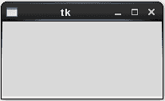

### 小贴士

在 Python 2.x 中，`import`语句有细微的变化。对于 Python 版本 2，模块`tkinter`作为 Tkinter（首字母大写）可用。支持代码已经通过以下条件`import`处理了这个问题。其余代码保持不变。

```py
if sys.version_info < (3, 0):
    from Tkinter import Tk
else:
    from tkinter import Tk
```

## 简单 GUI 应用程序 – 第一次尝试

我们刚刚看到了如何启动`mainloop()`方法。让我们更进一步，向这个应用程序添加一些小部件。观察以下代码。你还可以在本章的代码包中看到文件`simple_application_1.py`。

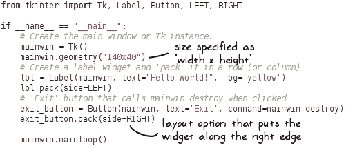

代码注释基本上解释了代码的功能。以下是总结：

+   我们首先从`tkinter`模块导入必要的类和选项。注意，你也可以这样做：`from tkinter import *`。然而，我们在本书中之前看到的最佳实践并不推荐这样做。

+   接下来，使用`geometry()`方法指定主窗口的大小。这是可选的。

+   接下来的几行代码创建了两个小部件，一个将显示文本`Hello World!`的`Label`小部件，以及一个`Button`，当点击时会终止应用程序。

+   我们需要某种方式来安排这些小部件在应用程序窗口内的布局。这被称为几何或布局管理。有三种方法可以做到这一点。这里展示的是`pack()`方法。关于几何管理的更多内容将在后面讨论。

+   当点击**退出**按钮时，我们需要某种方式来处理这个事件。这是通过将命令选项分配给回调函数来完成的。在这个例子中，我们简单地终止应用程序窗口，并通过调用`mainwin.destroy()`来终止`mainloop()`。

    ### 小贴士

    回想一下，Python 函数是一等对象。参见第六章，*设计模式*，我们在那里讨论了这一点。回调函数`mainwin.destroy`被分配给命令变量。

从命令行运行此应用程序将显示一个简单的 GUI 窗口，如下所示：

```py
$ python simple_application_1.py

```

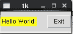

如果你点击**退出**按钮，它将终止主应用程序窗口。

| *看起来福爵士对这个简单的脚本并不太满意...* |
| --- |

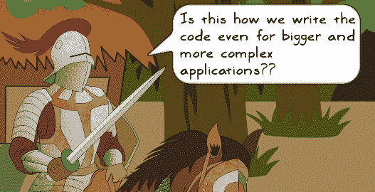

| *对于更大和更复杂的应用程序，遵循面向对象编程方法会更好。**让我们重写这个应用程序，并将其封装在一个类中。然而，请记住，这只是一个朝着创建更好的应用程序迈出的小小一步。在本章的后面部分，你将学习关于 MVC 架构，以及如何在 GUI 应用程序中实现它的基本示例。* |
| --- |

## 简单 GUI 应用程序 – 第 2 次

是时候给这个混合物添加一些面向对象的风味了。上一节中的应用程序可以重写如下：

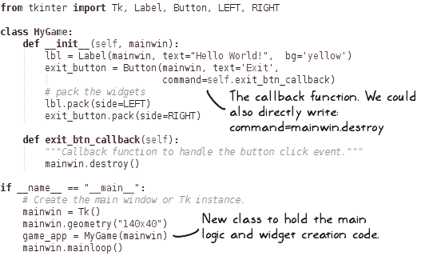

让我们简要地讨论一下前面的代码：

+   将此代码与之前的代码进行比较。

+   `MyGame`类是我们创建小部件和定义主要逻辑的地方。

+   注意，按钮的命令回调函数被设置为`exit_btn_callback`。

+   这意味着当按下**退出**按钮时，它将调用`exit_btn_callback()`而不是直接调用`mainwin.destroy()`。

+   这只是为了向你展示如何指定不同的回调函数。你总是可以将它设置回`command=mainwin.destroy()`。

其余的代码是自我解释的。你可以执行它以获得与第一个程序相同的`Hello world!`窗口。命令如下所示：

```py
$ python simple_application_2.py

```

支持代码包中的 `simple_application_2.py` 文件基本上包含了我们刚才审查的程序。

### 提示

在所有示例中，我们将使用 `Tk` 实例 `mainwin` 作为创建的小部件的主对象或父对象。在实践中，创建一个容器来在 GUI 中包含其他小部件通常很有用。该容器可以是 `Frame` 类的实例或任何其他小部件，具体取决于应用程序。例如，您可以编写以下内容：

```py
mainwin = Tk()
container = Frame(mainwin)
some_label = Label(container, text="blah blah")
```

现在我们已经知道了如何创建一个具有图形用户界面的简单应用程序，让我们继续讨论 Tkinter 库中可用的各种小部件。

## Tkinter 中的 GUI 小部件

在本节中，我们将简要介绍一些常用的小部件。请注意，我们即将介绍的小部件并不特定于任何 GUI 库。然而，以下讨论是针对 Tkinter 库量身定制的。例如，您将在许多 GUI 库中找到一个 `Menu` 小部件。Tkinter 通过 `Menu` 类提供它，PyQt 库将其称为 `QMenu` 等。

### 提示

我们即将看到的内容远非详尽无遗。我们鼓励您探索以下维基页面，该页面列出了其他几个 GUI 元素：[`en.wikipedia.org/wiki/List_of_graphical_user_interface_elements`](https://en.wikipedia.org/wiki/List_of_graphical_user_interface_elements)。

小部件是图形用户界面中的一个元素，它允许用户交互。换句话说，用户可以执行某些操作，如按下按钮并与 GUI 交互。

我们已经看到了如何创建 `Label` 和 `Button` 小部件。以下表格总结了 Tkinter 中一些重要的小部件类。

| 小部件类 | 基本语法 | 描述 |
| --- | --- | --- |
| `Menu` |

```py
menubar = Menu(parent)
```

| 此小部件表示一个菜单，例如菜单栏或弹出菜单。它包含菜单项。 |
| --- |
| `Frame` |

```py
container = Frame(parent, 
        width=100,          
        height=100,
        bg='white')
```

| 这通常用作容器来包含其他小部件。框架小部件也有自己的网格布局，并且像许多其他小部件一样，您可以指定背景颜色、边框和其他属性。 |
| --- |
| `Canvas` |

```py
my_canvas = Canvas(parent,
              width=100,
              height=100)
```

| 这是一个图形小部件。这是您可以绘制或写入内容的地方。例如，您可以渲染形状、图表、图像，或者使用此小部件来写入文本。 |
| --- |
| `Label` |

```py
 lbl = Label(parent, 
       text= "some text",
       bg = 'blue')
```

| 在标签中，您可以添加文本或图像。当您点击标签时，不会触发事件。相反，您可以在其他地方生成某些事件响应时更新标签。 |
| --- |
| `Button` |

```py
ok_button = 
 Button(parent, 
        text="OK",   
        command=parent.quit)
```

可选的 `command` 参数也可以分配给任何用户定义的函数。| 一个简单的按钮小部件。当按下或释放时，它触发一个事件。|

| `Radiobutton` |
| --- |

```py
rbutton_1 = 
   Radiobutton(parent,
           text="Option 1", 
           variable=var, 
           value=1)
rbutton_2 = 
   Radiobutton(parent,
           text="Option 2", 
           variable=var, 
           value=0)
```

一组单选按钮与一个公共变量 `var` 相关联。当您点击单选按钮时，该变量的值会更改为一个预定义的值，该值由值指定。| 单选按钮小部件允许用户从给定的一组值中选择单个值。它可以包含文本或图像。|

| `Checkbutton` |
| --- |

```py
c_button =  
    Checkbutton(parent,  
       text="Enable Audio",  
       variable=var)
```

当复选框被选中时，变量`var`的值为 1，否则值设置为 0。这是默认行为。| 此小部件允许将两个不同的值设置到变量中。典型用法是切换变量的状态（开启或关闭选择）。|

|

```py
Listbox

```

|

```py
lstbox = Listbox(parent)
```

然后，您可以使用以下`insert()`方法向此列表框添加元素：

```py
lstbox.insert(END, "item1")
```

| 这个小部件用于显示一系列选项。用户可以从`Listbox`小部件中选择一个或多个元素。 |
| --- |

|

```py
Entry

```

|

```py
text_edit= Entry(parent)
```

| 这是一个文本输入小部件，允许您显示或输入文本。在其他一些 GUI 框架中，它被称为行编辑小部件。 |
| --- |

上表中显示的基本语法仅用于说明目的。您可以指定许多其他选项。传递给小部件的`parent`参数表示父小部件或基本小部件。

### 小贴士

在本书中，我们将在创建小部件时仅使用最基本选项。您可以通过指定适当的可选参数或调用相关方法来进一步配置这些小部件。为了进一步学习，请参考以下链接中官方 Tkinter 文档页面上列出的各种参考资料：[`docs.python.org/3/library/tkinter.html#module-tkinter`](https://docs.python.org/3/library/tkinter.html#module-tkinter)。

## 几何管理

布局或几何管理涉及在 GUI 中组织各种小部件。在 Tkinter 中，这种布局管理是通过称为几何管理器的机制实现的。有三种不同的几何管理器来组织小部件，即*网格*、*包装*和*放置*。在这些中，网格管理器是推荐的选择。在本章的后续内容中，我们将演示网格管理器的使用。

### 网格几何管理器

网格管理器在安排各种小部件方面提供了灵活性，并且也非常容易使用。

+   网格管理器的父小部件（例如，一个框架或对话框）被视为一个具有行和列的表格。

+   此表格的最小元素是一个单元格，它具有高度和宽度。

+   您可以在这样的单元格中放置其他小部件。也可以有一个跨越多个单元格的小部件。

+   表格中每行的高度由该行中最高的单元格（或小部件）的高度决定。同样，表格中每列的宽度由该列中最宽的单元格控制。

+   网格几何管理器中的每一行和每一列都可以使用权重选项进行配置。权重决定了如果主小部件有可用空间时，特定行或列可以扩展多少。可以使用`grid_rowconfigure`或`grid_columnconfigure`方法分别指定行和列的权重。默认权重值为 0。

以下截图显示了一个代表性的网格布局：

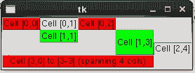

在前面的图像中，一些 `Label` 小部件被排列在网格布局中。标签文本 **Cell[0,0]** 表示我们将此标签放置在网格的第 0 行和第 0 列。观察 **Cell[3,0]**，它显示一个宽度占用四个列的标签。同样，**Cell [1,3]** 是一个高度跨越两行的标签。

### 包布局管理器

在我们的第一个 Tkinter 应用程序中，我们已经使用了包布局管理器来排列小部件。作为一个复习，这里是有关的代码片段（`pack`方法）：

```py
lbl = Label(mainwin, text="Hello World!",  bg='yellow')
lbl.pack(side=LEFT)
```

包布局管理器提供了如扩展、填充和侧边等选项来控制小部件的位置。当您想要排列多个小部件，无论是并排还是重叠时，它非常有用。另一种用例是当您希望小部件占据包含它的整个容器时。

### 小贴士

在同一个主窗口中使用网格和包布局管理器可能会导致不理想的结果。不要一起使用这些布局管理器。

### 位置布局管理器

位置布局管理器允许您指定小部件及其大小的绝对或相对位置。它在某些特殊场景中有用。我们不会进一步讨论这个布局管理器。在大多数情况下，您可以使用网格布局管理器代替。

## Tkinter 中的事件

让我们简要地谈谈 Tkinter 支持的各种事件及其描述的语法。

### 事件类型

下表显示了最常用的几种事件类型。阅读文档以了解这里未列出的其他事件类型。下一节 *事件描述符* 将详细说明如何使用事件类型来描述事件。

| 事件名称 | 描述 |
| --- | --- |
| `Button`（或`ButtonPress`） | 鼠标按钮之一被按下。是哪一个？这由事件描述符的`detail`字段确定（见下一节）。 |
| `ButtonRelease` | （之前按下的）鼠标按钮之一被释放。 |
| `Enter` | 鼠标指针进入了一个小部件。这与键盘上的 *Enter* 或 *return* 键无关。 |
| `Leave` | 鼠标指针离开了一个小部件。 |
| `KeyPress` | 一个键盘键被按下。是哪一个？这由事件描述符的`detail`字段确定。 |
| `KeyRelease` | 一个键盘键被释放。 |
| `FocusIn` | 一个小部件获得输入焦点。 |
| `FocusOut` | 小部件不再具有输入焦点。 |

### 事件描述符

Tkinter 有一个特殊的语法来描述事件。它是一个具有以下一般形式的字符串：

```py
<[modifier-]type[-detail]>
```

+   指定的事件被括号`<>`包围。

+   类型指定了事件的类型，例如鼠标点击。

+   修饰符和详细指定符是可选的。

+   修饰符是事件修饰符。想象一下，当按下鼠标按钮时，同时按下了控制按钮。在这里，控制按钮是事件修饰符，而鼠标按钮的按下是事件的类型。

+   详细指定符提供了关于事件类型的更多信息。如果类型是鼠标点击，则详细信息将描述它是左鼠标按钮、右按钮还是中间按钮。

以下表格总结了某些常见的事件指定符。

| 事件语法 | 描述 |
| --- | --- |
| `<Button-1>` | 按下鼠标按钮 1（左鼠标按钮）。 |
| `<Button-2>` | 鼠标按钮 2 被按下（如果有中间按钮）。 |
| `<Button-3>` | 按下鼠标按钮 3（最右边的按钮）。 |
| `<KeyPress-B>` | 按下 *B* 键。同样，你也可以为其他键编写，例如 `<KeyPress-G>`。 |
| `<Return>` | 按下回车键。 |
| `<Configure>` | 小部件的大小已更改（例如，窗口大小调整）。新大小存储为事件对象的宽度和高度属性。 |
| `<Shift-Button-1>` | 按下 *Shift* 键的同时按下左鼠标按钮。 |

### 事件对象属性

`Event` 类的实例持有描述事件的详细信息。以下表格列出了 `Event` 类的一些重要属性。

| 事件属性 | 描述 |
| --- | --- |
| `widget` | 触发此事件的部件对象。 |
| `x`, `y` | 当前鼠标位置的像素。 |
| `x_root`, `y_root` | 以像素为单位，相对于左上角的鼠标位置。 |
| `width`, `height` | `<Configure>` 类型事件的更改大小（宽度和高度）。 |

## Tkinter 中的事件处理

在本章的早期，我们学习了事件和事件处理（参见 *事件驱动编程* 部分）。在本节中，我们将了解如何将用户交互引起的各种事件与适当的处理函数绑定。

### 命令回调（按钮小部件）

回想一下，当我们编写第一个 Tkinter 应用程序时，我们将回调函数绑定到 `Button` 小部件的 `command` 参数。下面是相关代码行的复制，以便于参考：

```py
exit_button = Button(mainwin,text='Exit',command=mainwin.destroy)
```

当你点击**退出**按钮时，它会调用 `mainwin.destroy()`，这由 `command` 参数表示。需要注意的是，虽然 `Button` 小部件支持命令回调，但此功能并非所有支持的部件都可用。为此，Tkinter 提供了 `bind()` 方法，该方法定义在所有小部件上。`bind()` 方法只是 Tkinter 事件绑定级别中的一级。接下来，让我们谈谈几个事件绑定级别。

### bind() 方法

此方法提供实例级别绑定。它将事件绑定到特定的小部件实例。另一种思考方式是，这可以指定对特定事件敏感的确切 GUI 元素。基本语法如下：

```py
widget.bind(sequence=None, func=None, add=None)
```

应该注意的是，你也可以使用此方法为 `toplevel` 窗口。

为了便于理解，让我们将可选参数序列表示为`even_descriptor`，将`func`表示为`event_handler`。第三个可选参数`add`可以指定为字符串`+`。它允许你向现有绑定添加一个新函数。我们在此不讨论`add`参数。请参阅文档以获取更多详细信息。

```py
widget.bind(event_descriptor, event_handler)
```

在前面的语句中，`widget`是生成一个或多个事件的任何小部件。例如，该小部件可以是`Button`、`Entry`小部件等。`event_descriptor`是实际触发的事件，例如按键或点击等。`event_handler`是当事件被触发时被调用的函数。

让我们看看如何使用此方法来处理`Button`小部件，而不是命令回调。除了语法之外，我们还需要定义一个处理生成的事件的回调函数。让我们重写*简单 GUI 应用程序*部分中展示的代码。

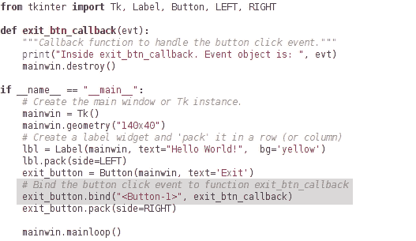

注意，我们已经定义了一个新的事件处理函数`exit_btn_clicked()`，它接受事件对象（`evt`）作为参数。绑定到`bind`的第一个参数表示事件类型或事件格式。在这个例子中，`<Button-1>`表示在控件上按下左鼠标按钮。在本章中，我们只会使用`bind()`方法。但在我们进一步讨论之前，让我们简要地谈谈其他绑定级别。

### `bind_class()`方法

此方法提供类级别的绑定。它将一个事件绑定到特定的小部件类。基本语法如下所示：

```py
bind_class(className, event_descriptor, event_handler)
```

在前面的语法中，`className`是一个表示小部件类名的字符串。其他参数与上一节中讨论的相同。

假想你应用程序中的所有`Button`小部件代表一些数字。你可以配置它们以响应右键点击事件，使得每个都返回该数字的平方。在这个例子中，你可以像这样使用`bind_class`方法：

```py
bind_class('Button', '<Button-3>', compute_square)
```

在这里，假设你已经定义了一个函数，`compute_square`。

### `bind_all()`方法

此方法提供应用级别的绑定。正如其名所示，此方法将事件绑定到应用级别的所有小部件。例如，在某些游戏应用中，你可能想要配置一个键来暂停游戏，无论当前焦点的小部件是什么。在这种情况下，你可以使用此方法。基本语法如下：

```py
bind_all(event_descriptor, event_handler)
```

### 提示

Tkinter 支持称为绑定标签的功能。每个小部件都有自己的绑定标签列表。这些标签决定了与控件相关的事件处理的顺序。内置方法`bindtags()`可以用来设置或获取与控件关联的标签。请参阅文档以获取更多详细信息。

# 项目-1 – 兽人攻击 V10.0.0

| *你已经开发了一个强大且流行的命令行应用程序，**兽人攻击**。虽然用户对当前版本很满意，但现在有一个新的和不断增长的需求。用户现在希望应用程序有一个图形用户界面！* |
| --- |

是时候开始另一个简单的程序了。还记得我们在第一章中编写的第一个命令行应用程序吗，*开发简单应用程序*？让我们使用相同的主题，开发一个等效的 GUI 程序。

## 背景场景

作为复习，以下是我们在第一章中看到的游戏主题，*开发简单应用程序*：

| *在穿越茂密森林的路上，福爵士发现了一个小型的孤立定居点。又累又希望补充食物储备，他决定绕道而行。当他接近村庄时，他看到了五座小屋。周围看不到任何人。犹豫了一下，他决定进入一座小屋...* |
| --- |

## 问题说明

| *任务是设计一个* *简单的 GUI 程序。玩家可以选择福爵士可以休息的五座小屋中的一座。小屋可能被朋友或敌人占据，也可能空着。如果玩家选择的小屋是空的或有友军单位在里面，则玩家获胜。* |
| --- |

以下截图显示了即将发生的事情。但不要太过兴奋！这是一个相当简单的游戏，将帮助你学习一些重要的 GUI 编程方面。

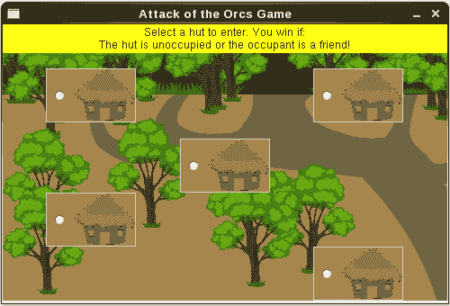

当你点击一个小屋时，它会检查居住者是谁，然后弹出一个消息框宣布获胜者。就是这样！

## 编写代码

我们将使用 `hutgame.py` 文件中提供的代码。请从本章的代码包中下载此文件以及两个图像，`Hut_small.gif` 和 `Jungle_small.gif`。

### 提示

建议你在阅读以下讨论时打开文件 `hutgame.py` 作为便捷的参考。在源代码编辑器中快速浏览完整代码通常很有帮助！

我们将从主执行代码开始：

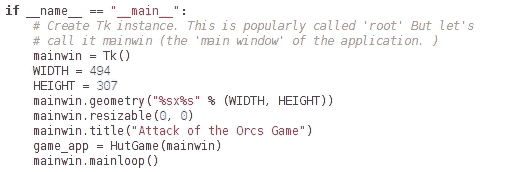

让我们分析一下这段代码：

+   将它与“简单 GUI 应用程序 - 第二次尝试”部分中的主执行块进行比较。注意，两者之间没有太大的区别。

+   我们使用 `geometry` 和 `title` 方法设置应用程序窗口的大小和标题。`mainwin.resizable` 调用冻结窗口大小。这是可选的，但可以确保背景图像完美地适应窗口。

+   `HutGame` 类是我们创建小部件和定义主要逻辑的地方。

+   通过调用 `mainloop()` 启动主事件循环。

### HutGame 类概述

在审查 `HutGame` 类中的任何代码之前，让我们先了解整体情况。这个类的关键方法如下图中所示：

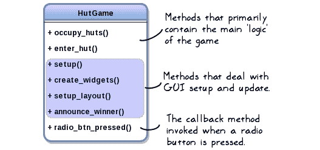

如上图所示，这些方法可以根据功能大致分为三组。我们将在讨论 MVC 架构时再讨论这种分组。接下来，让我们回顾一下这个类中的各种方法。

### 小贴士

**给更有经验的读者的一则笔记！**

在接下来的几节中，我们将讨论 `HutGame` 类的方法。你可能会觉得这个讨论有点冗长！你可以选择只查看 `hutgame.py` 文件中的代码。代码有很好的文档说明。如果有什么不清楚的地方，请返回并阅读相关部分！

### The __init__ method

看看当 `HutGame` 被实例化时调用的代码：

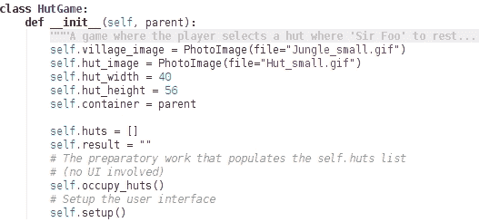

以下是对 `__init__` 方法的描述：

+   `PhotoImage` 类用于在标签、按钮等控件中显示背景图像。它支持 GIF 图像格式。还有使用 **Python Imaging Library**（**PIL**）加载图像的方法。我们在这里不会讨论这些细节。

+   我们将在 `RadioButton` 上使用 `hut_image`，并将 `village_image` 设置为应用程序的背景。

+   `self.setup()` 调用确保控件被创建并适当地放置在应用程序窗口中。

### The occupy_huts method

以下方法与 第一章 中的第一个示例相同，即 *开发简单应用程序*：

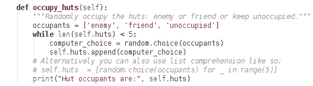

确切有五个小屋。这段代码基本上是从给定的 `occupants` 列表中随机选择居民来填充 `self.huts` 列表。

### The create_widgets method

如其名所示，这个方法涉及创建我们应用程序的控件。实际上，控件并不多。我们只有一个标签来显示一些信息，以及一些代表小屋的单选按钮。方法如下所示：

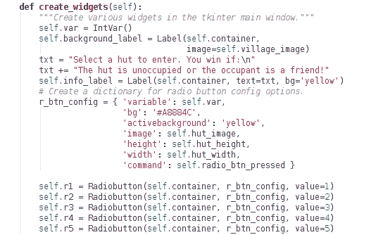

上述方法可以这样解释：

+   `self.var` 是一个 Tkinter 变量。它是 Tkinter 支持的变量类的一个实例。在这里，它代表一个整型变量（`IntVar` 类）。同样，还有其他类，如 `StringVar`，用于处理字符串变量等。

+   简而言之，Tkinter 变量使跟踪更改成为可能。我们有五个与单个 Tkinter 变量 `self.var` 相关联的单选按钮。可以为每个单选按钮指定一个值选项。当单选按钮被选中时，这个值会被分配给 `self.var`。

+   字典 `r_btn_config` 用于设置所有单选按钮的共同配置选项。它作为参数传递给 `Radiobutton`。

+   一个例子有助于理解单选按钮的工作原理。按钮 `self.r4` 有一个关联的值 `4`，代表小屋编号。当你选择按钮时，这个值会被分配给 `self.var`。这会调用 `self.radio_btn_pressed()`，即按钮的命令回调函数。

+   `self.background_label`用于为我们的应用程序窗口设置村庄背景。还有其他方法可以实现这一点。在这本书中，我们不会讨论此类自定义细节。

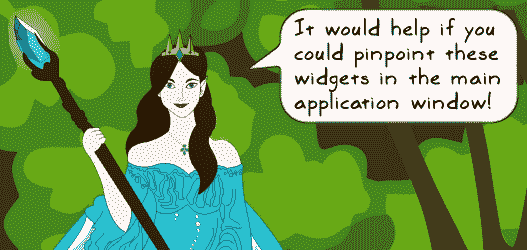

| *当然！请查看以下应用程序窗口，其中一些小部件或配置选项已标注。* |
| --- |

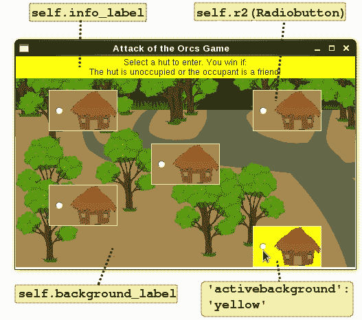

### 设置布局方法

以下代码片段显示了`setup_layout()`方法以及它在顶级`setup()`方法中的调用方式：

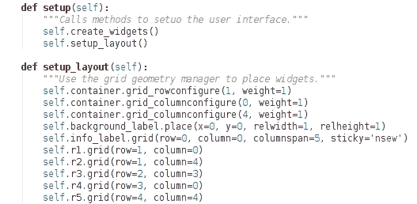

### 小贴士

网格布局在安排小部件方面提供了很多灵活性。在这幅插图中，我们只是触及了 Tkinter 的表面！要获得专业知识，您应该创建自己的 GUI 小部件，并尝试不同的布局配置选项。请参阅文档了解其他可用选项。

现在我们来分析这段代码：

+   记住，我们可以在网格布局中为特定的行或列分配一个相对`weight`。这是通过使用`grid_rowconfigure`和`grid_columnconfigure`方法实现的。`weight`决定了行或列相对于其他行或列将占用多少空闲空间。默认值 0 表示即使有可用空间，它也不会增长。

+   在这个例子中，容器中的`第 1 行`被赋予一个相对权重或`1`，允许它扩展并占用更多空闲空间。同样，`第 0 列`和`第 4 列`被分配了相对权重`1`。尝试这个选项，看看它如何影响布局。另一个要尝试的选项是`pad`，它为小部件添加填充。

+   对于`background_label`，我们使用`place()`几何管理器。标签锚定在`(0, 0)`。`relwidth`和`relheight`参数表示父窗口的高度和宽度的分数。1.0 的值意味着标签的大小将与它的父窗口（主应用程序窗口）相同。

+   `info_label`的`sticky`选项确保小部件沿单元格的四个边缘对齐。值`nsew`分别沿北、南、东、西单元格边缘对齐小部件。您还可以指定几个值，例如，`sticky='ew'`将小部件沿左右边缘对齐。

### radio_btn_pressed 和 enter_hut 方法

让我们一起回顾这些方法。在`create_widgets()`方法中，我们指定了命令选项，如下代码片段所示：

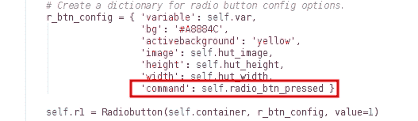

`radio_btn_pressed`是所有单选按钮的命令回调。它如下所示：

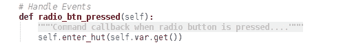

该方法只是调用 `self.enter_hut`。当单选按钮被选中时，它更新存储在 Tkinter 变量 `self.var` 中的值。这个值不过是分配给所选小屋的小屋编号，可以通过调用 Tkinter 的 `IntVar` 类的 `get()` 方法来获取。

让我们看看 `enter_hut` 方法：

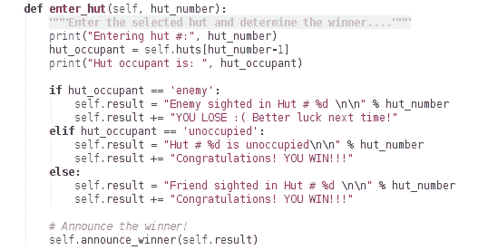

上述代码是自我解释的。它检查居住者，并宣布结果。获胜者公告是通过 `messagebox` 小部件完成的。

### `announce_winner` 方法

这是我们将要审查的最后一个方法：

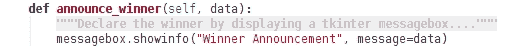

在上述方法中，我们使用 Tkinter 的 `messagebox` 模块来显示信息框。此模块提供了几种其他类型的对话框。有关更多详细信息，请参阅文档。

## 运行应用程序

是时候采取一些行动了！按照以下方式运行此应用程序：

```py
$ python hutgame.py

```

最后一条命令应该显示之前显示的 GUI 窗口。以下截图显示了游戏的实际运行情况。首先，你选择一个小屋：

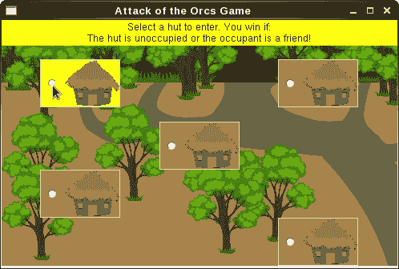

当你点击单选按钮时，它会显示通知获胜者的信息框。

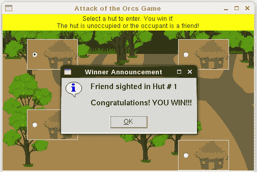

# MVC 架构

MVC 是基于 GUI 的应用程序中广泛使用的软件架构模式。它有三个组件，即处理业务逻辑的 *模型*、用于用户界面的 *视图* 和处理用户输入、操作数据并更新视图的 *控制器*。以下是一个简化的示意图，展示了各个组件之间的基本交互：

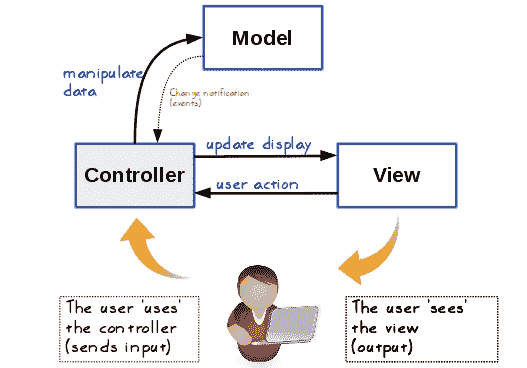

让我们进一步讨论这些组件的每个部分。

## 模型

MVC 架构中的模型组件代表应用程序的数据。它还代表作用于这些数据的核心业务逻辑。模型对视图或控制器没有任何了解。当模型中的数据发生变化时，它只是通知其监听器这一变化。在这种情况下，控制器对象是其监听器。

## 视图

视图组件是用户界面。它负责向用户显示模型的当前状态，并为用户提供与应用程序交互的手段。如果用户操作（如按钮点击）改变了这一状态，视图将刷新以显示这一变化。

## 控制器

在某种意义上，控制器使得模型和视图之间能够进行握手。它监控模型的变化。当用户与视图中的某个元素交互时，控制器在后台工作并处理由用户操作触发的事件，例如鼠标点击。处理函数可以进一步更新模型。当模型的状态发生变化时，控制器更新视图以反映这些变化。

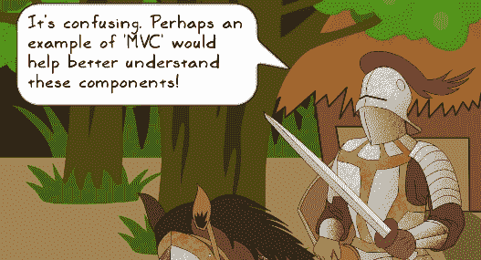

| *你说得对。通过插图可以更好地理解 MVC 的各个组件及其工作原理。让我们使用本节中先前给出的简单示例**事件驱动编程**。 |
| --- |

假设你打开了 PDF 文件进行阅读。在这种情况下，MVC 及其组件可以这样解释：

+   PDF 阅读器是运行中的应用程序。

+   它将显示你打开的文件的内容，并且还将有按钮用于在文件中导航。这是处理用户界面的视图组件。

+   要跳转到下一页，你需要与视图交互并点击下一页按钮。这是一个用户输入，它生成一个事件。

+   这样的事件由控制器内部处理，然后更新模型，或者在这个上下文中，检索请求页面的相关数据。

+   模型的状态已更改。控制器进一步与视图通信，以更新其新内容。

+   视图被刷新，最后，你看到所需的页面。

## MVC 的优势

MVC 架构传统上用于桌面 GUI 应用程序，并且在网络应用程序开发中也得到了广泛的应用。由于这是一个三组件架构，它提供的一个主要优势是跨多个应用程序的代码重用。例如，假设你有多款具有不同用户界面的应用程序，它们都需要相同的企业逻辑。使用 MVC 架构，你可以简单地重用模型对象在这些应用程序中表示的企业逻辑。

此外，MVC 允许用户界面开发者专注于 UI 代码，不必过多担心处理企业逻辑的代码。同样，专注于企业逻辑的开发者可以专注于那部分代码，而无需为 UI 小部件和相关的代码选择而烦恼。这被称为*关注点分离*。模型关注企业逻辑或数据，视图关注用户界面，控制器代码关注诸如启用视图操作和处理输入等问题。

# 项目 2 – Attack of the Orcs v10.1.0

让我们再做一个小型项目。实际上，这正是我们在 *Project-1 – Attack of the Orcs V10.0.0* 中开发的相同的小屋游戏。区别在于底层架构。我们将重写程序以实现 MVC 架构。

## 重新审视 HutGame 类

在第一个项目中，我们编写了 `HutGame` 类。让我们拉出表示这个类高级结构的图：

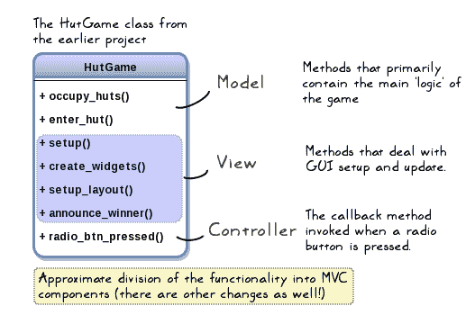

根据功能，这个类的函数可以大致分为三类，即模型、视图和控制器。前面的图示显示了这种划分。我们还需要进一步更新其中的一些方法。

## 创建 MVC 类

在上一节中，我们将旧类`HutGame`的方法分为三大类。现在是时候告别这个类了。我们将将其分解，并将它的方法分配给三个新的类，即`Model`、`View`和`Controller`。当然，你可以给这些类起更描述性的名字，但让我们继续使用上述名称。

观察以下类似于 UML 的表示，它显示了这些方法所在的类。这里只列出了重要的属性。

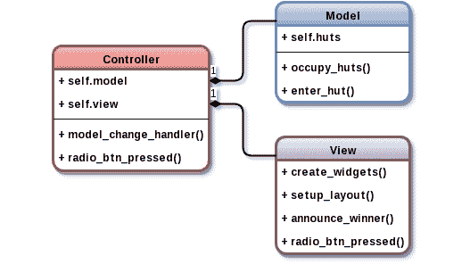

### 提示

在第一章，*开发简单应用程序*中，我们简要地讨论了类似于 UML 的表示。创建此类图的一种方法是通过使用[`www.draw.io`](https://www.draw.io)。这是一个免费、在线的图表软件，用于制作流程图、UML 图等。

现在我们知道了类的布局，让我们了解这些类是如何交换信息的。

## MVC 对象之间的通信

在深入探讨 MVC 对象如何通信的细节之前，让我们首先列出关于 MVC 架构的一些重要观点：

+   控制器不仅了解模型，还了解视图

+   模型对其他两个（即控制器和视图）一无所知

+   视图（就像模型一样）对控制器和模型一无所知

MVC 架构可能有其他一些变体。在这本书中，我们将坚持上述观点，并设计一个解决方案。

### 控制器到模型或视图通信

让我们从学习控制器如何将信息发送到模型或视图开始讨论。

`Controller`对象可以直接通过`self.model`和`self.view`分别与`Model`和`View`实例进行通信。例如，它可以这样调用一个`View`方法：

```py
self.view.announce_winner(data)
```

这很简单。现在让我们看看它是如何从模型或视图接收数据的。

### 模型到控制器通信

控制器是如何从模型接收信息的？例如，在棚屋游戏场景中，胜利者是根据谁在所选的棚屋内来确定的。一旦确定了胜利者，`Model`类就需要将其传达给`Controller`类。这是通过`Controller`类的`model_change_handler()`方法实现的。每当`Model`类的状态发生变化时，该方法就会被调用。

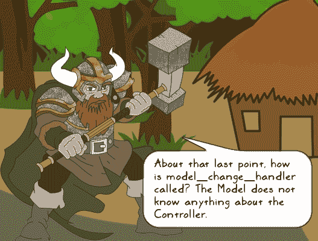

| *好问题！* `Model` *类对* `Controller` *和* `View` *一无所知。那么* `Controller` *是如何知道* `Model` *发生了变化的？让我们看看下一个问题。* |
| --- |

`Controller`类可以通过多种方式从`Model`类接收信息。让我们简要地讨论两种这样的方法。

#### 使用方法分配

记住，在 Python 中，你可以将一个方法赋值给一个变量。设计模式章节详细讨论了第一类对象。以下行代码可以添加到`Controller.__init__`中。

```py
self.model.changed = self.model_change_handler
```

然后，在`Model`类中，你可以调用`self.changed()`，如下所示：

```py
def enter_hut(self, hut_number):
    # Some code goes here (not shown)
    self.changed()
```

这会自动通知`Controller`模型已更改。虽然这非常方便，但我们将改用发布-订阅 API，这使得事情更加简单。

#### 使用发布-订阅模式

发布-订阅是一种消息模式。发布者可以是任何向一个主题广播一些数据的程序。可能有一个或多个应用程序正在监听这个主题。这些被称为订阅者，他们接收发布的数据。发布者不知道（或不需要知道）关于订阅者的任何信息。同样，订阅者对发布者也没有任何了解。以下示意图给出了发布-订阅系统的高级概述：

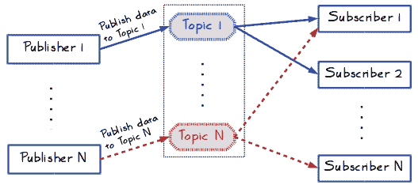

通过现实世界的类比可以更好地理解发布-订阅的概念。想象一个在线零售商每周进行闪购。你已经选择接收以短信或电子邮件警报形式的通知。还有几位其他客户也希望得到关于销售的通知。

在发布-订阅的世界里，在线零售商是一个发布者，将销售信息（数据）广播到主题，比如*闪购*。你和几位其他客户是这个主题的订阅者。同样，在线零售商可以以不同的主题发布其他信息，例如，*周五特卖*，*半价特卖*等等。每个主题可能有多个订阅者。如果你没有订阅*周五特卖*，你将不会收到发送到该主题的任何通知。

##### PyPubSub 包

我们如何在 Python 中实现一个发布-订阅框架？一个选项是从头开始编写代码。相反，我们将只使用一个名为`pypubsub`的 Python 包。它提供了一个发布-订阅 API，简化了设计并提高了代码的可读性和可测试性。该包可以按照以下方式安装：

```py
$ pip install pypubsub 

```

这里有一个简单的例子，展示了典型的用法。实际上，这个语法就是本章所需的所有内容。

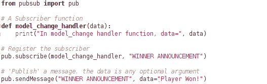

当你运行这个脚本时，它会产生以下输出：

```py
$ "In model_change handler function, data= Player Won"

```

`pub.subscribe()`的第一个参数是你想要订阅的特定主题的函数。这里的主题名是 WINNER ANNOUNCMENT。代码的最后一行显示了如何使用`pub.sendMessage()`向特定主题广播消息。`pub.sendMessage()`的第一个参数是主题名。你可以指定任意数量的可选参数，只需确保订阅者函数接受所有这些参数！在这个例子中，它只发送数据作为唯一的可选参数。

### 小贴士

更多关于 PyPubSub 包的信息，请参阅项目主页：[`pubsub.sourceforge.net/`](http://pubsub.sourceforge.net/)

PyDispatcher 是 PyPubSub 包的替代品。虽然我们不会使用它，但这里有一个项目的链接：[`pypi.python.org/pypi/PyDispatcher`](https://pypi.python.org/pypi/PyDispatcher)

### `View`到`Controller`的通信

就像`Model`一样，`View`对象到`Controller`对象之间没有直接的通信链接。当用户按下单选按钮时，控制器需要被通知。我们可以采用类似前一个章节中讨论的方法。例如，你可以将`Controller`的一个方法分配给`View`方法。或者，你可以使用发布-订阅 API 与`Controller`对象通信。

### `View`和`Model`之间的通信

让我们讨论一下`View`和`Model`是如何相互交流的：

+   当用户按下单选按钮时，`View`使用之前讨论过的一种方法与`Controller`通信

+   然后`Controller`对象与`Model`通信，指示其更新

+   `Model`的状态被更新，并将结果反馈给`Controller`

+   `Controller`要求`View`更新显示

### 注意

**使用发布-订阅 API 进行`View`和`Model`通信**：

你可以使用发布-订阅框架在`Model`和`View`对象之间建立通信通道。请注意，这仍然保持了基本规则。`Model`对`View`对象一无所知。它只是将数据发布到指定的主题。`View`对`Model`对象也没有任何了解。它只是注册为订阅者，订阅`Model`广播数据的同一主题。因此，每当`Model`的状态发生变化时，`View`可以通过发布-订阅 API 获得通知。同样，对于从`View`到`Model`的通信也是如此。潜在的负面影响是，这些发布-订阅信号本质上是全球变量，可能会带来与之相关的痛苦问题。所以请谨慎使用！

然而，对于这个项目，我们将坚持使用经典方法，其中通信是通过`Controller`发生的。

## 查看代码

到目前为止，你已经得到了关于新类及其相互通信方式的高级概述。在第一个项目中，我们已经审查了每个新类下列出的大多数方法。话虽如此，为了实现 MVC 架构，我们需要做一些修改。让我们仅从文件`hutgame_mvc.py`中回顾几个重要的方法。请注意，所有类都放在了同一个文件中。作为一个练习，将单独的类放入它们自己的模块中！

### 小贴士

由于我们不会逐行审查代码，您应该下载本章代码包中的文件 `hutgame_mvc.py` 以及两张图片，`Hut_small.gif` 和 `Jungle_small.gif`。在阅读即将到来的讨论时，请保留源文件。通常，快速浏览完整代码有助于更好地理解！

主要执行代码如下。它与我们在第一个项目中看到的是几乎相同的。唯一的区别是 `game_app`（已突出显示）。现在它是一个 `Controller` 类的实例，而不是 `HutGame`。实际上，本项目没有 `HutGame` 类！回想一下，我们将其分解，创建了三个新的类。

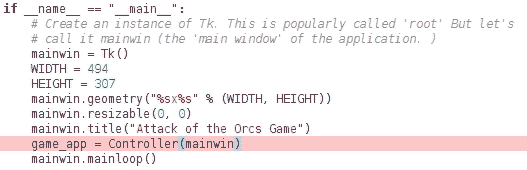

### 控制器类

如下所示，`Controller` 类相当小：

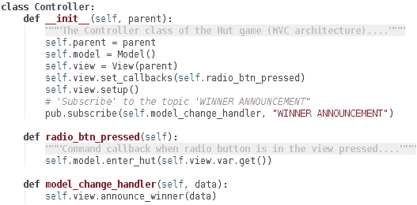

让我们分析一下代码。如果您已经理解了它，可以跳过阅读这些要点！

+   `Controller` 类由 `Model` 和 `View` 实例组成。这使得它可以直接调用这些类的功能。

+   `self.view.set_callbacks()` 函数本质上是将 `radio_btn_pressed` 方法分配给 `View` 的一个适当属性。简单来说，这意味着每当用户按下单选按钮时，就会调用此方法。请参阅 *视图到控制器通信* 部分，以获取更多详细信息。

+   `Controller` 类通过订阅主题 `"WINNER ANNOUNCEMENT"` 从 `Model` 实例接收数据。我们已经看到了 `pub.subscribe()` 函数的一个例子。简单来说，每当宣布赢家时，就会调用 `model_change_handler` 方法。

+   `model_change_handler` 方法调用适当的 `View` 方法来显示宣布赢家信息的消息。

## 模型类

`Model` 类中没有太多变化。唯一的重大变化是给定代码中突出显示的行（`enter_hut` 方法中的 `pub.sendMessage` 调用）。其他方法的细节没有显示。这些方法在编辑器中以代码折叠的形式显示。

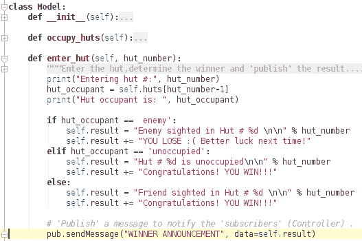

将此方法与我们第一个项目中编写的代码进行比较。请注意，它没有直接调用 `View.announce_winner`。相反，它使用 `pub.sendMessage()` 通知 `Controller` 实例。其余代码保持不变，您可以查看 `hutgame_mvc.py` 文件以获取更多详细信息。

### 提示

如 *视图与模型之间的通信* 部分所述，您可以使用相同的发布-订阅框架来通知 `Model` 的状态变化给 `View`，反之亦然。

### 注意

**对象关系映射器 (ORM)**:

简而言之，这是一个库，它使您能够使用像 Python 这样的面向对象语言来访问和更新数据库中的数据。在 Python 中，Django ORM 和 SQLAlchemy 是流行的 ORM 库之一。您可以在网上搜索这些库以找到有用的资源。

模型类和 ORM：本书不涵盖与 Web 或数据库应用程序编程相关的任何内容，但值得提及的是，`Model`类通常继承自 ORM，并代表数据库表，其中每个对象都是表中的一行。为这样的系统编写单元测试可能是一个挑战，因为你通常不希望在每次运行这些测试时实际击中数据库。在第五章中，我们看到了如何使用 Python 的 mock 库。mock 通常对单元测试这样的系统很有用（本书未涵盖）。

## 视图类

下图展示了`View`类。唯一显著的变化是名为`set_callbacks`的方法。其他方法以代码折叠的形式展示。

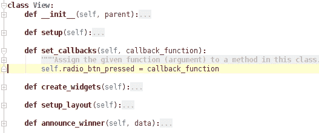

记住，在`Controller.__init__`方法中，我们有以下代码：

```py
self.view.set_callbacks(self.radio_btn_pressed)
```

上述代码表明，`View`类的`radio_btn_pressed`属性代表`Controller`类的`radio_btn_pressed()`方法。其余的代码与第一个项目中的代码相同。

## 运行应用程序

在这个项目中，我们没有向 GUI 添加任何新功能。我们的想法只是展示一个实现 MVC 架构的初步示例。你可以按照以下步骤运行此应用程序：

```py
$ python hutgame_mvc.py

```

这应该会显示与第一个项目相同的 GUI 窗口和功能。

# 测试图形用户界面应用程序

在一个复杂且功能丰富的图形用户界面应用程序中，用户会看到许多小部件、菜单、键盘快捷键等选择。如本章前面所述，GUI 程序的事件驱动特性让用户可以决定程序流程。这通常为用户提供了许多执行特定操作以获得所需输出的可能方式。

### 小贴士

应该注意的是，我们在这里不会编写任何代码。这只是一个高级讨论，涉及到一些重要的测试考虑因素。关于这个主题的进一步学习，请从以下维基页面开始：[`en.wikipedia.org/wiki/Graphical_user_interface_testing`](https://en.wikipedia.org/wiki/Graphical_user_interface_testing)。

想象一个图形用户界面应用程序，它允许在应用程序窗口中选择某个对象，例如，桌面上的文件夹图标。用户可以将鼠标悬停在图标上以突出显示该对象，然后点击它以选择它。或者，他可以进行窗口选择，在对象周围绘制选择窗口以选择它。另一种选择可能是使用键盘上的组合键。虽然用户很高兴能够以不同的方式完成任务，但这对于开发者来说编写无错误的代码却是一个挑战。

事件驱动编程的本质使得编写健壮的代码和全面的测试来应对大多数用户输入场景变得困难。错误可能会以某种方式悄悄出现。当然，这取决于应用程序和测试策略，但通常是大型和复杂 GUI 应用程序的一个问题。

## 测试考虑因素

有多种测试策略可以使 GUI 应用程序代码更加健壮。让我们探讨一些重要的测试考虑因素。

### 单元测试和 MVC

单元测试可以帮助你测试代码的某个部分。集成测试是指将多个单元测试组合在一起以测试更大的功能。在回归测试中，你通常会有单元和集成测试的组合。在这里，测试会重新运行以确保没有东西被破坏。一个好的回归测试框架对于作为防止错误的防线至关重要。单元测试通常有助于解决一些常见问题。在早期章节中，我们已经通过命令行应用程序的示例介绍了这个主题。

GUI 程序的 MVC 架构进一步有助于使代码更加健壮。关注点的分离或代码分解为模型、视图和控制组件，使我们能够为特定类型的错误编写单元测试。例如，在某些应用程序中，你可能会在`Model`类而不是`View`类中预测到`ZeroDivisionError`。因此，你可以为`Model`类编写专注于这种情况的单元测试，以便优雅地处理此类情况。

### 手动测试

虽然一个好的回归测试套件有助于解决常见问题，但程序的事件驱动特性经常提出未被考虑的场景。在手动测试中，软件测试人员通过操作 GUI 中提供的不同功能来手动检查应用程序的工作情况。如果某些功能不符合预期，测试人员会创建一个错误报告来记录重现问题的说明。许多隐藏的错误在手动测试阶段出现。

随着程序复杂性的增加，重复的手动测试工作对测试人员来说变得令人难以承受。这就是自动化 GUI 测试发挥作用的地方。

### 自动化 GUI 测试

在这里，测试工具记录用户操作以创建测试。如果你运行此类测试，用户操作会自动以相同的顺序重复。这允许快速识别损坏的功能。

### 小贴士

自动化测试不应取代手动测试。除非工具中集成了人工智能，否则你仍然需要有人来测试新功能，并以之前未尝试过的方式使用现有功能。通常，自动化测试应补充手动 GUI 测试活动。

在 Python 中，有几种开源和商业工具可用于自动 GUI 测试。以下表格总结了几个突出的、免费可用的 GUI 自动化测试工具。要获取完整列表，请参阅 Python 维基页面 [`wiki.python.org/moin/PythonTestingToolsTaxonomy`](https://wiki.python.org/moin/PythonTestingToolsTaxonomy)。

| 工具名称和链接 | 备注 |
| --- | --- |
| Sikuli (SikuliX) [`www.sikuli.org/`](http://www.sikuli.org/) | 支持 Windows、Mac 和一些 Linux 操作系统。访问网站以检查您的操作系统是否受支持。 |
| StoryText [`pypi.python.org/pypi/StoryText`](https://pypi.python.org/pypi/StoryText) | 支持的 GUI 框架包括 Tkinter、PyGTK、wxPython 等。请访问网站以获取完整列表。 |
| Dogtail [`fedorahosted.org/dogtail/`](https://fedorahosted.org/dogtail/) | 旨在用于类似 Fedora 的 Linux 操作系统。检查它是否与您的操作系统兼容。 |

这种自动化测试系统的弱点之一是，看似无辜的 GUI 变化可能需要您更改大量测试，并且根据您的 GUI 应用程序的复杂性，这可能会很麻烦。

# 练习

这里有一些您可以进一步改进 GUI 应用程序的方法。除了一个例外，这些练习的解决方案没有提供。

1.  将 `Model`、`View` 和 `Controller` 类放入它们自己的模块中！

1.  使用发布-订阅 API 从 `View` 到 `Controller` 进行通信。您可以参考文件 `hutgame_mvc_pubsub.py` 以获取解决方案。

1.  添加更多小部件，如菜单栏和按钮。实现**重新启动游戏**按钮。当点击时，游戏应该重新启动。当此按钮被点击时，执行以下操作：

    +   通过调用 `occupy_huts()` 再次随机分配居民。

    +   清除单选按钮的状态。所有按钮都应该被取消选中。

1.  向应用程序添加异常处理。

1.  尝试将 `View.add_callbacks` 方法泛化，使其能够用于设置更多的回调函数。

# 进一步阅读

本书已涉及应用程序开发的几个重要方面。关键概念主要通过开发命令行应用程序来教授。如本章前面所述，有许多应用程序需要您学习特定领域的技巧。例如，在本章中，我们学习了在 GUI 应用程序中常见实现的 MVC 架构。让我们通过简要讨论一些重要的应用程序领域来结束本章，以及本书。这将为您提供一些有用的指针（附带大量链接！）到相关的库或应用程序框架。为了避免混乱，有关更多信息的相关网址将单独提供在本节末尾。以下是一个其他重要应用程序领域的列表；然而，这远非一个详尽的列表：

1.  网页和移动应用程序开发：

    这些是重要的应用开发领域。要学习 Python 网络应用程序开发，你可以从探索 Python 中的 Flask 或 Django 框架开始。了解 MVC 也会有所帮助。对于移动应用程序开发，kivy 库可能是一个好的起点。

1.  涉及数据库的应用程序：

    **数据库管理系统**（**DBMS**）是另一个重要的应用领域。简而言之，DBMS 提供了一种创建、访问和管理数据的方式。Python 有几个库可以让你与数据库进行通信。

    SQLite3 是一个简单、轻量级的数据库系统。sqlite3 模块是 Python 的内置模块，它提供了一个符合 DB-API 2.0 的 SQL 接口。有几个用 Python 编写的客户端库提供了与数据库通信的方式。例如，PyMongo 模块提供了与 MongoDB 一起工作的工具，等等。

1.  机器学习和深度学习：

    在数据科学领域，机器学习和深度学习库的使用正在迅速增长。了解 GPU 编程知识在这里会有所帮助。

    ### 小贴士

    数据科学应用程序几乎总是涉及数据的可视化。使用 IPython 或 Jupyter 笔记本编写和共享交互式数据科学应用程序非常方便。有关更多详细信息，请参阅[`jupyter.org/`](http://jupyter.org/)。

    对于机器学习，你可以探索 Apache Spark。这是一个通用集群计算系统，它为 Python 和其他语言提供了高级 API。MLlib 是 Apache Spark 的可扩展机器学习库。对于深度学习应用，Caffe 和 Tensorflow 是流行的深度学习框架之一。

1.  物联网：

    这是一个快速发展的领域，Python 是开发应用程序时最受欢迎的语言之一。在这里，你可以使用 Python 不仅在服务器端处理数据（分析应用程序），还可以在终端设备上运行 Python 客户端。在这些应用程序中，你可以找到使用发布-订阅消息模式的例子，其中设备将数据发布到主题，而服务器端应用程序是一个接收这些数据的订阅者。

1.  多媒体和游戏应用程序：

    这是一个广泛的话题，有几个框架和库可用于开发多媒体应用程序：

    +   Python 维基文档了许多处理音频和视频的工具。**GStreamer**、**MoviePy** 和 **MLT** 是流行的框架之一。还可以查看 PyMedia 模块。

    +   图像处理有很多选项。查看 scikit-image、Opencv 和 pillow（Python Imaging Library 或 PIL 的分支）。

    +   有很多库对开发游戏和动画相关应用程序很有用。查看 PyGame 和 Pyglet。再次提醒，你可以在 Python 维基页面上找到完整的列表。

下表列出了一些有用的网络链接，提供了有关先前讨论的各种工具或领域的更多信息。

### 小贴士

在撰写本书时，书中所有提供的网页链接（URL）都是可访问的。正如 第一章 中所述，*开发简单应用程序*，这些链接可能会随着时间的推移而失效。如果发生这种情况，请使用适当的搜索词进行网络搜索。例如，如果你发现 PyMongo 模块的链接已损坏，你可以通过 Google 搜索 PyMongo Python MongoDB 来找到一些有用的资源！

| 工具或应用程序领域 | 进一步信息的网页链接 |
| --- | --- |
| Flask | [`flask.pocoo.org`](http://flask.pocoo.org) |
| Django | [`www.djangoproject.com`](https://www.djangoproject.com) |
| Kivy | [`kivy.org`](https://kivy.org) |
| sqlite3 | [`docs.python.org/3/library/sqlite3.html`](https://docs.python.org/3/library/sqlite3.html) |
| PyMongo | [`api.mongodb.com/python/current/`](https://api.mongodb.com/python/current/) |
| Jupyter 笔记本 | [`jupyter.org/`](http://jupyter.org/) |
| Apache Spark | [`spark.apache.org`](https://spark.apache.org) |
| Caffe 框架 | [`caffe.berkeleyvision.org`](http://caffe.berkeleyvision.org) |
| Tensorflow | [`www.tensorflow.org/`](https://www.tensorflow.org/) |
| **物联网** (**IoT**) | [`en.wikipedia.org/wiki/Internet_of_things`](https://en.wikipedia.org/wiki/Internet_of_things) |
| 音频、视频处理 | [`wiki.python.org/moin/AudioVideo`](https://wiki.python.org/moin/AudioVideo) |
| 游戏和动画 | [`wiki.python.org/moin/PythonGameLibraries`](https://wiki.python.org/moin/PythonGameLibraries) |

# 摘要

本章作为 Python GUI 编程的入门介绍。从不同 GUI 框架的概述开始，讨论了开发用户界面的一些重要实际设计考虑因素。你了解了事件驱动编程是什么，以及事件和事件处理。通过快速介绍 Tkinter 库，我们开发了简单的 Hut 游戏，这是 第一章 中第一个应用程序的 GUI 版本，*开发简单应用程序*。

本章的后半部分介绍了 MVC 架构，并将 Hut 游戏转换为实现此架构。本章以对 GUI 应用程序测试的高级讨论结束。

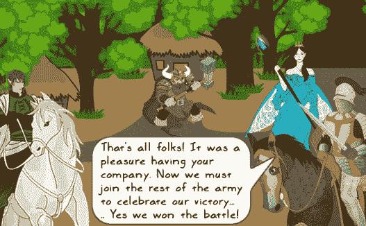
