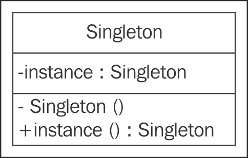
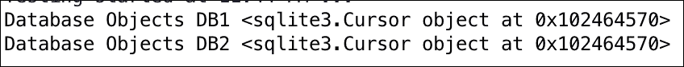
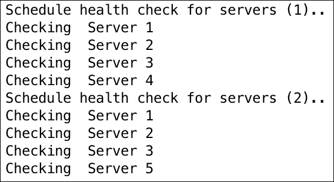

# 第二章：单例设计模式

在上一章中，我们探讨了设计模式和它们的分类。正如我们所知，设计模式可以分为三大类：结构型、行为型和创建型模式。

在本章中，我们将探讨单例设计模式——这是在应用程序开发中使用的最简单和最知名创建型设计模式之一。本章将简要介绍单例模式，带您通过一个可以使用此模式的真实世界示例，并使用 Python 实现来详细解释它。您将了解单态（或 Borg）模式，这是单例模式的变体。

在本章中，我们将简要介绍以下内容：

+   理解单例设计模式

+   单例模式的真实世界示例

+   Python 中的单例模式实现

+   单态（Borg）模式

在本章末尾，我们将对单例进行简要总结。这将帮助您独立思考单例设计模式的一些方面。

# 理解单例设计模式

单例提供了一种机制，确保只有一个给定类型的对象被创建，并提供了一个全局访问点。因此，单例通常用于需要跨应用程序只有一个实例以避免对同一资源冲突请求的场景，例如日志记录或数据库操作、打印机打印队列等。例如，我们可能希望使用一个数据库对象来对数据库进行操作以维护数据一致性，或者在一个多服务中跨多个服务使用一个日志类对象来顺序地写入特定的日志文件。

简而言之，单例设计模式的意图如下：

+   确保只有一个类的对象被创建

+   为全局程序提供一个对象的访问点

+   控制对共享资源的并发访问

下面的 UML 图是单例的：



实现单例的一种简单方法是通过使构造函数私有，并创建一个静态方法来完成对象初始化。这样，在第一次调用时创建一个对象，之后类返回相同的对象。

在 Python 中，我们将以不同的方式实现它，因为没有创建私有构造函数的选项。让我们看看 Python 语言中单例是如何实现的。

## 在 Python 中实现经典的单例

这里是 Python 3.5 版本中单例模式的一个示例代码。在这个例子中，我们将做两件主要的事情：

1.  我们将允许创建`Singleton`类的一个实例。

1.  如果存在实例，我们将再次提供相同的对象。

以下代码展示了这一点：

```py
class Singleton(object):
     def __new__(cls):
       if not hasattr(cls, 'instance'):
         cls.instance = super(Singleton, cls).__new__(cls)
       return cls.instance

s = Singleton()
print("Object created", s)

s1 = Singleton()
print("Object created", s1)
```

通过覆盖`__new__`方法（Python 中用于实例化对象的特殊方法）来控制对象创建。`s`对象通过`__new__`方法创建，但在创建之前，它会检查对象是否已经存在。使用`hasattr`方法（Python 中用于判断对象是否具有特定属性的特殊方法）来查看`cls`对象是否具有实例属性，这会检查类是否已经有一个对象。直到请求`s1`对象时，`hasattr()`会检测到已经存在一个对象，因此`s1`分配了现有的对象实例（位于`0x102078ba8`）。

# 单例模式中的延迟实例化

单例模式的一个用例是延迟实例化。例如，在模块导入的情况下，我们可能会在不必要的时候意外创建一个对象。延迟实例化确保对象仅在真正需要时才被创建。将延迟实例化视为一种以减少资源使用并仅在需要时创建资源的方式。

在下面的代码示例中，当我们说`s=Singleton()`时，它调用`__init__`方法，但没有创建新的对象。然而，实际的对象创建发生在我们调用`Singleton.getInstance()`时。这就是如何实现延迟实例化的。

```py
class Singleton:
    __instance = None
    def __init__(self):
        if not Singleton.__instance:
            print(" __init__ method called..")
        else:
            print("Instance already created:", self.getInstance())
    @classmethod
    def getInstance(cls):
        if not cls.__instance:
            cls.__instance = Singleton()
        return cls.__instance

s = Singleton() ## class initialized, but object not created
print("Object created", Singleton.getInstance()) # Object gets created here
s1 = Singleton() ## instance already created
```

# 模块级单例

由于 Python 的导入行为，所有模块默认都是单例。Python 以以下方式工作：

1.  检查 Python 模块是否已被导入。

1.  如果已导入，则返回模块的对象。如果尚未导入，则导入并实例化它。

1.  因此，当一个模块被导入时，它会被初始化。然而，当相同的模块再次被导入时，它不会被再次初始化，这与单例行为有关，即只有一个对象并返回相同的对象。

# 单态单例模式

我们在第一章中讨论了四人帮及其书籍，《设计模式简介》。四人帮的单例设计模式指出，一个类应该只有一个对象。然而，根据亚历克斯·马尔蒂尼的观点，程序员通常需要的是具有相同状态的实例。他建议开发者应该关注状态和行为，而不是身份。由于这个概念基于所有对象共享相同的状态，它也被称为单态模式。

在 Python 中，单态模式可以通过非常简单的方式实现。在下面的代码中，我们将 Python 的特殊变量`__dict__`（一个特殊的 Python 变量）与`__shared_state`类变量关联。Python 使用`__dict__`来存储类中每个对象的状态。在下面的代码中，我们故意将`__shared_state`分配给所有创建的实例。因此，当我们创建两个实例`'b'`和`'b1'`时，我们得到两个不同的对象，这与单例不同，我们只有一个对象。然而，对象状态`b.__dict__`和`b1.__dict__`是相同的。现在，即使对象变量`x`对对象`b`发生变化，这个变化也会复制到所有对象共享的`__dict__`变量中，甚至`b1`也会从`x`设置的一个变为四：

```py
class Borg:
    __shared_state = {"1":"2"}
    def __init__(self):
        self.x = 1
        self.__dict__ = self.__shared_state
        pass

b = Borg()
b1 = Borg()
b.x = 4

print("Borg Object 'b': ", b) ## b and b1 are distinct objects
print("Borg Object 'b1': ", b1)
print("Object State 'b':", b.__dict__)## b and b1 share same state
print("Object State 'b1':", b1.__dict__)
```

实现 Borg 模式的另一种方法是调整`__new__`方法本身。正如我们所知，`__new__`方法负责对象的创建：

```py
class Borg(object):
     _shared_state = {}
     def __new__(cls, *args, **kwargs):
       obj = super(Borg, cls).__new__(cls, *args, **kwargs)
       obj.__dict__ = cls._shared_state
       return obj
```

# 单例和元类

让我们从对元类的简要介绍开始。元类是类的类，这意味着类是其元类的实例。通过元类，程序员有机会从预定义的 Python 类中创建他们自己的类型的类。例如，如果你有一个对象`MyClass`，你可以创建一个元类`MyKls`，它重新定义了`MyClass`的行为，使其符合你的需求。让我们详细了解一下。

在 Python 中，一切都是对象。如果我们说`a=5`，那么`type(a)`返回`<type 'int'>`，这意味着`a`是 int 类型。然而，`type(int)`返回`<type 'type'>`，这表明存在一个元类，因为 int 是`type`类型的类。

类的定义由其元类决定，因此当我们使用`class A`创建一个类时，Python 通过`A = type(name, bases, dict)`来创建它：

+   `name`: 这是类的名称

+   `base`: 这是基类

+   `dict`: 这是属性变量

现在，如果一个类有一个预定义的元类（名为`MetaKls`），Python 将通过`A = MetaKls(name, bases, dict)`来创建这个类。

让我们看看 Python 3.5 中的一个示例元类实现：

```py
class MyInt(type):
    def __call__(cls, *args, **kwds):
        print("***** Here's My int *****", args)
        print("Now do whatever you want with these objects...")
        return type.__call__(cls, *args, **kwds)

class int(metaclass=MyInt):
    def __init__(self, x, y):
        self.x = x
        self.y = y

i = int(4,5)
```

以下为上述代码的输出：


当需要为已存在的类创建对象时，Python 的特殊`__call__`方法会被调用。在这段代码中，当我们使用`int(4,5)`实例化`int`类时，`MyInt`元类的`__call__`方法会被调用，这意味着元类现在控制了对象的实例化。哇，这不是很棒吗？！

上述哲学也用于单例设计模式。由于元类对类创建和对象实例化有更多的控制，它可以用来创建单例。（注意：为了控制类的创建和初始化，元类会覆盖`__new__`和`__init__`方法。）

使用元类实现的单例可以通过以下示例代码更好地解释：

```py
class MetaSingleton(type):
    _instances = {}
    def __call__(cls, *args, **kwargs):
        if cls not in cls._instances:
            cls._instances[cls] = super(MetaSingleton, \
                cls).__call__(*args, **kwargs)
        return cls._instances[cls]

class Logger(metaclass=MetaSingleton):
    pass

logger1 = Logger()
logger2 = Logger()
print(logger1, logger2)
```

# 真实场景 - Singleton 模式，第一部分

作为实际用例，我们将通过一个数据库应用程序来展示 Singleton 的使用。考虑一个涉及数据库多次读写操作的云服务示例。完整的云服务被分割成多个执行数据库操作的服务。UI（Web 应用程序）上的操作在内部会调用 API，最终导致数据库操作。

很明显，跨不同服务的共享资源是数据库本身。因此，如果我们需要更好地设计云服务，以下这些点必须注意：

+   数据库操作的一致性——一个操作不应该与其他操作发生冲突

+   内存和 CPU 利用率应该是最优的，以便处理数据库上的多个操作

这里提供了一个 Python 实现的示例：

```py
import sqlite3
class MetaSingleton(type):
    _instances = {}
    def __call__(cls, *args, **kwargs):
        if cls not in cls._instances:
            cls._instances[cls] = super(MetaSingleton, \
                cls).__call__(*args, **kwargs)
        return cls._instances[cls]

class Database(metaclass=MetaSingleton):
  connection = None
  def connect(self):
    if self.connection is None:
        self.connection = sqlite3.connect("db.sqlite3")
        self.cursorobj = self.connection.cursor()
    return self.cursorobj

db1 = Database().connect()
db2 = Database().connect()

print ("Database Objects DB1", db1)
print ("Database Objects DB2", db2)
```

上述代码的输出如下：



在前面的代码中，我们可以看到以下要点：

1.  我们创建了一个名为`MetaSingleton`的元类。正如我们在上一节中解释的，Python 的特殊`__call__`方法在元类中被用来创建 Singleton。

1.  `database`类被`MetaSingleton`类装饰，开始像 Singleton 一样工作。因此，当实例化`database`类时，它只会创建一个对象。

1.  当 Web 应用程序想要在数据库上执行某些操作时，它会多次实例化数据库类，但实际上只创建了一个对象。由于只有一个对象，对数据库的调用是同步的。此外，这不会消耗太多系统资源，我们可以避免内存或 CPU 资源不足的情况。

假设我们不是只有一个 webapp，而是一个由多个 webapp 组成的集群设置，但只有一个数据库。现在，这并不是 Singleton 的好情况，因为随着每个 webapp 的增加，一个新的 Singleton 会被创建，并且会添加一个新的查询数据库的对象。这会导致数据库操作不同步，并且资源消耗很大。在这种情况下，数据库连接池比实现 Singleton 更好。

# 真实场景 - Singleton 模式，第二部分

让我们考虑另一个场景，其中我们为我们的基础设施实现健康检查服务（如 Nagios）。我们创建了一个`HealthCheck`类，它被实现为 Singleton。我们还维护了一个需要运行健康检查的服务器列表。如果从该列表中删除服务器，健康检查软件应该检测到并将其从配置为检查的服务器中删除。

在下面的代码中，`hc1`和`hc2`对象与 Singleton 中的类相同。

使用`addServer()`方法将服务器添加到基础设施中，以进行健康检查。首先，健康检查的迭代运行在这些服务器上。`changeServer()`方法移除最后一个服务器，并将一个新的服务器添加到为健康检查而计划的基础设施中。因此，当健康检查在第二次迭代中运行时，它会选择更改后的服务器列表。

所有这些都可以通过 Singleton 实现。当服务器被添加或移除时，健康检查必须是知道对基础设施所做的更改的对象：

```py
class HealthCheck:
    _instance = None
    def __new__(cls, *args, **kwargs):
        if not HealthCheck._instance:
            HealthCheck._instance = super(HealthCheck, \
                cls).__new__(cls, *args, **kwargs)
        return HealthCheck._instance
    def __init__(self):
        self._servers = []
    def addServer(self):
        self._servers.append("Server 1")
        self._servers.append("Server 2")
        self._servers.append("Server 3")
        self._servers.append("Server 4")
    def changeServer(self):
        self._servers.pop()
        self._servers.append("Server 5")

hc1 = HealthCheck()
hc2 = HealthCheck()

hc1.addServer()
print("Schedule health check for servers (1)..")
for i in range(4):
    print("Checking ", hc1._servers[i])

hc2.changeServer()
print("Schedule health check for servers (2)..")
for i in range(4):
    print("Checking ", hc2._servers[i])
```

代码的输出如下：



# Singleton 模式的缺点

虽然 Singleton 在多个地方被有效使用，但这个模式可能存在一些陷阱。由于 Singleton 具有全局访问点，以下问题可能会发生：

+   全局变量可能会在一个地方被错误地更改，由于开发者可能认为它们保持不变，变量在应用程序的其他地方被使用。

+   可能会创建对同一对象的多个引用。由于 Singleton 只创建一个对象，因此此时可以创建对同一对象的多个引用。

+   所有依赖于全局变量的类都会紧密耦合，因为一个类对全局数据的更改可能会无意中影响其他类。

### 注意

作为本章的一部分，你学习了关于 Singleton 的很多内容。以下是我们应该记住的关于 Singleton 的几个要点：

+   在许多现实世界的应用中，我们只需要创建一个对象，例如线程池、缓存、对话框、注册设置等。如果我们为每个这些应用创建多个实例，将导致资源的过度使用。Singleton 在这种情况下工作得非常好。

+   Singleton；这是一个经过时间考验且被证明的，在无需许多缺点的情况下提供全局访问点的方法。

+   当然，也有一些缺点；Singleton 在与全局变量一起工作或实例化资源密集型类时可能会产生意外影响，而这些类最终没有使用这些资源。

# 摘要

在本章中，你学习了 Singleton 设计模式及其使用上下文。我们了解到，当需要为类只有一个对象时，会使用 Singleton。

我们还探讨了在 Python 中实现 Singleton 的各种方法。经典实现允许多次实例化尝试，但返回相同的对象。

我们还讨论了 Borg 或 Monostate 模式，这是 Singleton 模式的一种变体。Borg 允许创建多个对象，这些对象共享相同的状态，与 GoF 描述的单例模式不同。

我们继续探索了在多个服务中应用 Singleton 以实现一致数据库操作的 webapp 应用。

最后，我们还探讨了 Singleton 可能出错的情况以及开发者需要避免的情况。

到本章结束时，我们已经足够熟悉，可以继续下一步，研究其他创建型模式并从中受益。

在下一章中，我们将探讨另一种创建型设计模式，即工厂设计模式。我们将介绍`Factory`方法和抽象工厂模式，并在 Python 实现中理解它们。
