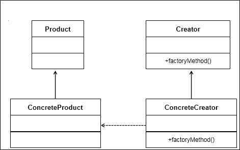
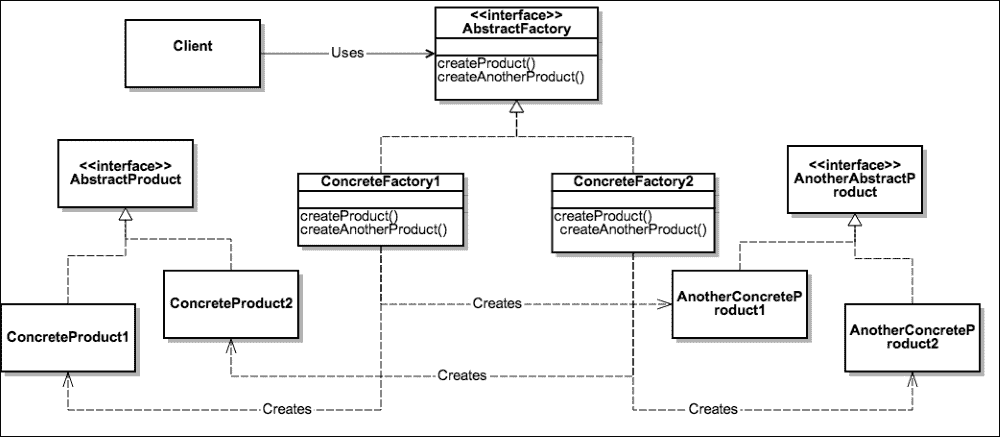
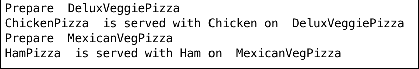

# 第三章：工厂模式——构建工厂以创建对象

在上一章中，您学习了单例设计模式——它们是什么以及如何在现实世界中使用，包括 Python 实现。单例设计模式是创建型设计模式之一。在本章中，我们将继续学习另一个创建型模式，即工厂模式。

工厂模式可以说是最常用的设计模式。在本章中，我们将了解工厂的概念，并学习简单工厂模式。然后，您将学习工厂方法模式和抽象工厂模式，包括 UML 图、现实世界场景和 Python 3.5 实现。我们还将比较工厂方法和抽象工厂方法。

在本章中，我们将简要介绍以下内容：

+   理解简单工厂设计模式

+   讨论工厂方法和抽象工厂方法及其区别

+   使用 Python 代码实现来模拟现实世界场景

+   讨论模式的优缺点及其比较

# 理解工厂模式

在面向对象编程中，工厂这个术语指的是一个负责创建其他类型对象的类。通常，充当工厂的类有一个与之关联的对象和方法。客户端使用某些参数调用此方法；然后依次创建所需类型的对象，并由工厂返回给客户端。

所以这里真正的问题是，当客户端可以直接创建对象时，我们为什么还需要工厂？答案是，工厂提供了一些优势，如下列所示：

+   第一个优势是松散耦合，其中对象的创建可以独立于类实现。

+   客户端不需要知道创建对象的类，而该类反过来被客户端使用。只需知道接口、方法和需要传递的参数，以便创建所需类型的对象。这简化了客户端的实现。

+   向工厂添加另一个类以创建另一种类型的对象可以很容易地完成，而无需客户端更改代码。至少，客户端需要传递另一个参数。

+   工厂还可以重用现有对象。然而，当客户端直接创建对象时，这总是创建一个新的对象。

让我们考虑一个制造玩具的公司的情况，该公司制造玩具车或娃娃。假设公司中的一台机器目前正在制造玩具车。然后，公司的 CEO 觉得根据市场需求，迫切需要制造娃娃。这种情况需要工厂模式。在这种情况下，机器成为接口，CEO 是客户端。CEO 只关心要制造的物体（或玩具），并且知道可以创建该对象的接口——机器。

工厂模式有三个变体：

+   **简单工厂模式**：这允许接口创建对象而不暴露对象创建逻辑。

+   **工厂方法模式**：这允许接口创建对象，但将决定创建哪个类的决策推迟到子类。

+   **抽象工厂模式**：抽象工厂是一个创建相关对象的接口，而不指定/暴露它们的类。该模式提供另一个工厂的对象，该工厂内部创建其他对象。

# 简单工厂模式

```py
Animal. Animal is an abstract base class (ABCMeta is Python's special metaclass to make a class Abstract) and has the do_say() method. We create two products (Cat and Dog) from the Animal interface and implement do_say() with appropriate sounds that these animals make. ForestFactory is a factory that has the make_sound() method. Based on the type of argument passed by the client, an appropriate Animal instance is created at runtime and the right sound is printed out:
```

```py
from abc import ABCMeta, abstractmethod

class Animal(metaclass = ABCMeta):
    @abstractmethod
    def do_say(self):
        pass

class Dog(Animal):
    def do_say(self):
        print("Bhow Bhow!!")

class Cat(Animal):
    def do_say(self):
        print("Meow Meow!!")

## forest factory defined
class ForestFactory(object):
    def make_sound(self, object_type):
        return eval(object_type)().do_say()

## client code
if __name__ == '__main__':
    ff = ForestFactory()
    animal = input("Which animal should make_sound Dog or Cat?")
    ff.make_sound(animal)
```

# 工厂方法模式

以下要点有助于我们理解工厂方法模式：

+   我们定义了一个创建对象的接口，但工厂不负责对象创建，而是将责任推迟到决定要实例化哪个类的子类。

+   工厂方法的创建是通过继承而不是通过实例化。

+   工厂方法使设计更具可定制性。它可以返回相同的实例或子类，而不是特定类型的对象（如简单工厂方法）。

    工厂方法的 UML 图

在前面的 UML 图中，我们有一个包含 `factoryMethod()` 的抽象类 `Creator`。`factoryMethod()` 方法负责创建特定类型的对象。`ConcreteCreator` 类实现了 `Creator` 抽象类的 `factoryMethod()`，并且这个方法可以在运行时改变创建的对象。`ConcreteCreator` 创建 `ConcreteProduct` 并确保它创建的对象实现了 `Product` 类，并为 `Product` 接口中的所有方法提供了实现。

简而言之，`Creator` 接口和 `ConcreteCreator` 类的 `factoryMethod()` 决定了要创建哪个 `Product` 子类。因此，工厂方法模式定义了一个创建对象的接口，但将决定实例化哪个类的决策推迟到其子类。

## 实现工厂方法

让我们通过一个现实世界的场景来理解工厂方法实现。假设我们想要为个人或公司创建不同类型的社交网络配置文件，如 LinkedIn 和 Facebook。现在，每个配置文件都会有某些部分。在 LinkedIn 上，你会看到一个关于个人已申请的专利或已发表的出版物部分。在 Facebook 上，你会在相册中看到你最近访问度假地的照片部分。此外，在这两个配置文件中，都会有关于个人信息的公共部分。简而言之，我们想要创建具有正确部分添加的不同类型的配置文件。

现在我们来看一下实现方式。在下面的代码示例中，我们首先定义 `Product` 接口。我们将创建一个 `Section` 抽象类，它定义了如何定义一个部分。我们将保持它非常简单，并提供一个抽象方法，`describe()`。

现在我们创建了多个 `ConcreteProduct` 类，`PersonalSection`、`AlbumSection`、`PatentSection` 和 `PublicationSection`。这些类实现了 `describe()` 抽象方法，并打印它们各自的分区名称：

```py
from abc import ABCMeta, abstractmethod

class Section(metaclass=ABCMeta):
    @abstractmethod
    def describe(self):
        pass

class PersonalSection(Section):
    def describe(self):
        print("Personal Section")

class AlbumSection(Section):
    def describe(self):
        print("Album Section")

class PatentSection(Section):
    def describe(self):
        print("Patent Section")

class PublicationSection(Section):
    def describe(self):
        print("Publication Section")
```

我们创建一个名为 `Profile` 的 `Creator` 抽象类。`Profile [Creator]` 抽象类提供了一个工厂方法，`createProfile()`。`createProfile()` 方法应由 `ConcreteClass` 实现，以实际创建具有适当部分的配置文件。`Profile` 抽象类不知道每个配置文件应该有哪些部分。例如，Facebook 配置文件应该有个人信息和相册部分。因此，我们将让子类来决定这一点。

我们创建了两个 `ConcreteCreator` 类，`linkedin` 和 `facebook`。这些类中的每一个都实现了 `createProfile()` 抽象方法，该方法在运行时实际创建（实例化）多个部分（`ConcreteProducts`）：

```py
class Profile(metaclass=ABCMeta):
    def __init__(self):
        self.sections = []
        self.createProfile()
    @abstractmethod
    def createProfile(self):
        pass
    def getSections(self):
        return self.sections
    def addSections(self, section):
        self.sections.append(section)

class linkedin(Profile):
    def createProfile(self):
        self.addSections(PersonalSection())
        self.addSections(PatentSection())
        self.addSections(PublicationSection())

class facebook(Profile):
    def createProfile(self):
        self.addSections(PersonalSection())
        self.addSections(AlbumSection())
```

最后，我们编写客户端代码，以确定要实例化哪个 `Creator` 类来创建所需选择的配置文件：

```py
if __name__ == '__main__':
    profile_type = input("Which Profile you'd like to create? [LinkedIn or FaceBook]")
    profile = eval(profile_type.lower())()
    print("Creating Profile..", type(profile).__name__)
    print("Profile has sections --", profile.getSections())
```

## 工厂方法模式的优点

既然你已经学习了工厂方法模式及其实现方法，让我们来看看工厂方法模式的优点：

+   它带来了很多灵活性，并使代码通用，不受特定类实例化的限制。这样，我们依赖于接口（Product），而不是 `ConcreteProduct` 类。

+   由于创建对象的代码与使用它的代码是分离的，因此存在松散耦合。客户端无需担心传递什么参数以及实例化哪个类。添加新类很容易，并且维护成本低。

# 抽象工厂模式

抽象工厂模式的主要目标是提供一个接口来创建一系列相关的对象，而不指定具体的类。虽然工厂方法将实例的创建推迟到子类中，但抽象工厂方法的目标是创建一系列相关的对象：



抽象工厂模式的 UML 图

如图中所示，`ConcreteFactory1` 和 `ConcreteFactory2` 是从 `AbstractFactory` 接口创建的。该接口有创建多个产品的方法。

`ConcreteFactory1` 和 `ConcreteFactory2` 实现了抽象工厂，并创建了 `ConcreteProduct1`、`ConcreteProduct2`、`AnotherConcreteProduct1` 和 `AnotherConcreteProduct2` 的实例。

`ConcreteProduct1`和`ConcreteProduct2`是从`AbstractProduct`接口创建的，而`AnotherConcreteProduct1`和`AnotherConcreteProduct2`是从`AnotherAbstractProduct`接口创建的。

实际上，抽象工厂模式确保客户端与对象的创建相隔离，但允许使用创建的对象。客户端只能通过接口访问对象。如果需要使用同一家族的产品，抽象工厂模式帮助客户端一次使用一个家族的对象。例如，如果一个正在开发的应用程序应该是平台无关的，那么它需要抽象出依赖项，如操作系统、文件系统调用等。抽象工厂模式负责创建整个平台所需的服务，以便客户端不必直接创建平台对象。

## 实现抽象工厂模式

考虑你最喜欢的披萨店的例子。它提供多种类型的披萨，对吧？等等，我知道你马上就想点一个，但现在让我们先回到例子上！

现在，想象一下我们创建了一个披萨店，你可以品尝到美味的印度和美国披萨。为此，我们首先创建了一个抽象基类，`PizzaFactory`（在先前的 UML 图中为`AbstractFactory`）。`PizzaFactory`类有两个抽象方法，`createVegPizza()`和`createNonVegPizza()`，需要由`ConcreteFactory`实现。在这个例子中，我们创建了两个具体工厂，即`IndianPizzaFactory`和`USPizzaFactory`。请看以下具体工厂的代码实现：

```py
from abc import ABCMeta, abstractmethod

class PizzaFactory(metaclass=ABCMeta):

    @abstractmethod
    def createVegPizza(self):
        pass

    @abstractmethod
    def createNonVegPizza(self):
        pass

class IndianPizzaFactory(PizzaFactory):

    def createVegPizza(self):
        return DeluxVeggiePizza()

    def createNonVegPizza(self):
        return ChickenPizza()

class USPizzaFactory(PizzaFactory):

    def createVegPizza(self):
        return MexicanVegPizza()

    def createNonVegPizza(self):
        return HamPizza()
```

现在，让我们继续前进并定义`AbstractProducts`。在下面的代码中，我们创建了两个抽象类，`VegPizza`和`NonVegPizza`（在先前的 UML 图中为`AbstractProduct`和`AnotherAbstractProduct`）。它们各自定义了一个方法，`prepare()`和`serve()`。

这里的思路是，素食披萨使用适当的饼底、蔬菜和调味料制作，而非素食披萨则在素食披萨上加上非素食配料。

然后，我们为每个`AbstractProducts`定义`ConcreteProducts`。现在，在这种情况下，我们创建了`DeluxVeggiePizza`和`MexicanVegPizza`并实现了`prepare()`方法。`ConcreteProducts1`和`ConcreteProducts2`将代表 UML 图中的这些类。

之后，我们定义了`ChickenPizza`和`HamPizza`并实现了`serve()`方法——这些代表`AnotherConcreteProducts1`和`AnotherConcreteProducts2`：

```py
class VegPizza(metaclass=ABCMeta):
    @abstractmethod
    def prepare(self, VegPizza):
        pass

class NonVegPizza(metaclass=ABCMeta):
    @abstractmethod
    def serve(self, VegPizza):
        pass

class DeluxVeggiePizza(VegPizza):
    def prepare(self):
        print("Prepare ", type(self).__name__)

class ChickenPizza(NonVegPizza):
    def serve(self, VegPizza):
        print(type(self).__name__, " is served with Chicken on ", type(VegPizza).__name__)

class MexicanVegPizza(VegPizza):
    def prepare(self):
        print("Prepare ", type(self).__name__)

class HamPizza(NonVegPizza):
    def serve(self, VegPizza):
        print(type(self).__name__, " is served with Ham on ", type(VegPizza).__name__)
```

当最终用户接近`PizzaStore`并要求一份美国非素食披萨时，`USPizzaFactory`负责准备素食披萨作为底料，并在上面加上火腿来提供非素食披萨！

```py
class PizzaStore:
    def __init__(self):
        pass
    def makePizzas(self):
        for factory in [IndianPizzaFactory(), USPizzaFactory()]:
            self.factory = factory
            self.NonVegPizza = self.factory.createNonVegPizza()
            self.VegPizza = self.factory.createVegPizza()
            self.VegPizza.prepare()
            self.NonVegPizza.serve(self.VegPizza)

pizza = PizzaStore()
pizza.makePizzas()
```

以下是在先前的代码示例中的输出：



# 工厂方法与抽象工厂方法

现在你已经学习了工厂方法和抽象工厂方法，让我们看看这两种方法的比较：

| 工厂方法 | 抽象工厂方法 |
| --- | --- |
| 这向客户端公开了一个创建对象的方法 | 抽象工厂方法包含一个或多个工厂方法来创建一个相关对象系列 |
| 这使用继承和子类来决定创建哪个对象 | 这使用组合来委托创建另一个类的对象的责任 |
| 工厂方法用于创建一个产品 | 抽象工厂方法关于创建相关产品系列 |

# 摘要

在本章中，你了解了工厂设计模式及其使用场景。我们了解了工厂的基本原理，以及它在软件架构中的有效应用。

我们探讨了简单工厂模式，其中根据客户端传递的参数类型在运行时创建一个适当的实例。

我们还讨论了工厂方法模式，这是简单工厂模式的一种变体。在这个模式中，我们定义了一个接口来创建对象，但对象的创建被延迟到子类中。

我们继续探索抽象工厂方法，它提供了一个创建相关对象系列的接口，而不指定具体的类。

我们还为所有三种模式实现了实际的 Python 实现，并比较了工厂方法和抽象工厂方法。

在本章结束时，我们现在准备迈出下一步，研究其他类型的模式，所以请保持关注。
