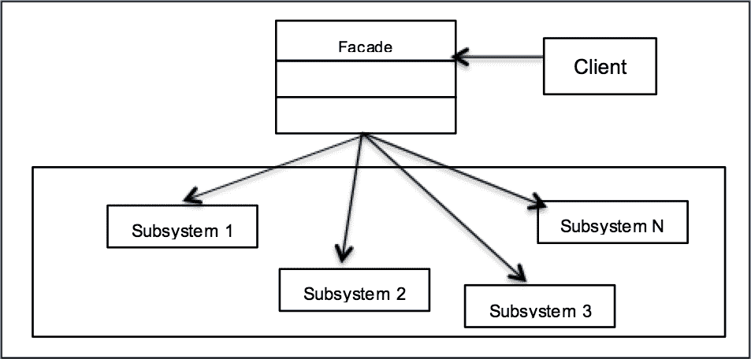
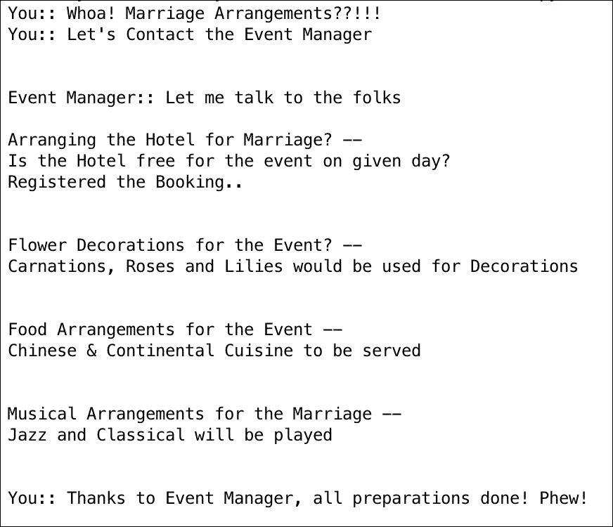

# 第四章. 外观模式 – 使用外观实现适应性

在上一章中，你学习了工厂设计模式。我们讨论了三种变体——简单工厂、工厂方法和抽象工厂模式。你还学习了它们在现实世界中的应用，并查看了解决方案。我们还比较了工厂方法和抽象工厂模式，并列出了它们的优缺点。正如我们所知，工厂设计模式和单例设计模式（第二章，*单例设计模式*）都被归类为创建型设计模式。

在本章中，我们将继续学习另一种类型的设计模式，即结构设计模式。我们将介绍外观设计模式及其在软件开发中的应用。我们将通过一个示例用例并使用 Python v3.5 来实现它。

简要来说，在本章中我们将涵盖以下主题：

+   结构设计模式的简介

+   使用 UML 图理解外观设计模式

+   一个带有 Python v3.5 代码实现的现实世界用例

+   外观模式与最少知识原则

# 理解结构设计模式

以下要点将帮助我们更好地理解结构模式：

+   结构模式描述了对象和类如何组合成更大的结构。

+   结构模式可以被视为通过识别实现或展示实体之间关系更简单的方法来简化设计的设计模式。实体在面向对象世界中意味着对象或类。

+   当类模式通过继承帮助描述抽象并提供更有用的程序接口时，对象模式描述了对象如何关联和组合以形成更大的对象。结构模式是类模式和对象模式的结合。

以下是一些不同结构模式的示例。你会注意到，这些模式中的每一个都涉及到对象或类之间的交互，以实现高级设计或架构目标。

结构设计模式的以下是一些示例：

+   **适配器模式**：将一个接口适配到另一个接口，以满足客户端的期望。它试图根据客户端的需求匹配不同类的接口。

+   **桥接模式**：将对象的接口与其实现解耦，以便它们可以独立工作。

+   **装饰器模式**：在运行时或动态地为对象定义额外的职责。我们通过接口为对象添加某些属性。

在这本书中，你还将学习到一些更多的结构模式。因此，让我们首先从外观设计模式开始。

# 理解外观设计模式

门面通常被称为建筑的立面，尤其是吸引人的立面。它也可以指一种行为或外观，给人一种关于某人真实感受或情况的错误印象。当人们走过门面时，他们可以欣赏到外观，但并不了解内部结构的复杂性。这就是门面模式的使用方式。门面隐藏了内部系统的复杂性，并为客户端提供了一个可以非常简化的方式访问系统的接口。

考虑一个店主的例子。现在，当你作为顾客去商店购买某些商品时，你并不了解商店的布局。你通常会去找店主，店主对商店系统非常了解。根据你的需求，店主挑选商品并将其交给你。这不是很容易吗？顾客不需要知道商店的外观，他们可以通过一个简单的接口，即店主，来完成所需的事情。

门面设计模式本质上执行以下操作：

+   它提供了一个统一的接口，用于访问子系统中的多个接口，并定义了一个高级接口，帮助客户端以简单的方式使用子系统。

+   门面讨论了用一个单一的接口对象来表示复杂的子系统。它并不**封装**子系统，而是实际上组合了底层子系统。

+   它促进了实现与多个客户端的解耦。

# UML 类图

我们现在将借助以下 UML 图来讨论门面模式：



当我们观察 UML 图时，你会意识到在这个模式中有三个主要参与者：

+   **门面**：门面的主要责任是将一组复杂的子系统封装起来，以便它可以为外界提供一个令人愉悦的外观。

+   **系统**：这代表了一组不同的子系统，使整个系统变得复杂，难以观察或操作。

+   **客户端**：客户端与门面交互，以便它可以轻松地与子系统通信并完成工作。它不必担心系统的复杂性质。

你现在将从数据结构的角度了解三个主要参与者的一些更多信息。

## 门面

以下要点将使我们更好地了解门面：

+   它是一个接口，知道哪些子系统负责处理请求

+   它通过组合使用将客户端的请求委派给适当的子系统对象。

例如，如果客户端需要完成某些工作，它不需要去访问各个子系统，而可以直接联系完成工作的接口（门面）。

## 系统

在门面世界中，系统是一个执行以下功能的实体：

+   它实现了子系统功能，并由一个类表示。理想情况下，系统由一组负责不同操作的类组成。

+   它处理外观对象分配的工作，但没有关于外观的知识，也不保留对其的引用。

例如，当客户端请求外观提供某种服务时，外观会根据服务类型选择提供该服务的正确子系统。

## 客户端

下面我们来描述一下客户端：

+   客户端是一个实例化外观的类

+   客户端会向外观发送请求，以从子系统完成工作

# 在现实世界中实现外观模式

为了展示外观模式的用途，让我们举一个我们在生活中可能遇到过的例子。

假设你家里有一场婚礼，你负责所有的安排。哇！这是一项艰巨的任务。你必须预订婚礼的酒店或场所，与餐饮服务商沟通食物安排，组织花卉装饰，最后处理活动所需的音乐安排。

在过去，你可能需要自己完成所有这些工作，例如通过与相关人员交谈、与他们协调、协商价格，但现在生活更简单了。你去找一个活动经理，他会为你处理这些事情。他/她会确保与个别服务提供商交谈，为你争取到最好的交易。

从外观模式的角度来看：

+   **客户端**：就是你，需要在婚礼前及时完成所有的婚礼准备工作。这些准备工作应该是顶级的，客人应该喜欢庆祝活动。

+   **外观**：负责与所有需要处理特定安排的人（如食物、花卉装饰等）进行沟通的事件经理

+   **子系统**：它们代表提供餐饮、酒店管理和花卉装饰等服务系统

让我们用 Python 3.5 开发一个应用程序并实现这个用例。我们首先从客户端开始。记住，你就是那个被赋予确保婚礼准备工作完成并确保活动顺利进行的人！

现在我们继续前进，谈谈外观类。如前所述，外观类简化了客户端的接口。在这种情况下，`EventManager`充当外观，简化了你的工作。外观与子系统交谈，代表你完成婚礼的所有预订和准备工作。以下是`EventManager`类的 Python 代码：

```py
class EventManager(object):

    def __init__(self):
        print("Event Manager:: Let me talk to the folks\n")

    def arrange(self):
        self.hotelier = Hotelier()
        self.hotelier.bookHotel()

        self.florist = Florist()
        self.florist.setFlowerRequirements()

        self.caterer = Caterer()
        self.caterer.setCuisine()

        self.musician = Musician()
        self.musician.setMusicType()
```

现在我们已经完成了外观和客户端的开发，让我们深入到子系统。为此场景，我们已经开发了以下类：

+   `Hotelier`用于酒店预订。它有一个方法来检查那天酒店是否空闲（`__isAvailable`）。

+   `Florist`类负责花卉装饰。Florist 类有`setFlowerRequirements()`方法，用于设置对婚礼装饰所需花卉的期望。

+   `Caterer` 类用于处理餐饮服务，并负责食物安排。Caterer 提供了 `setCuisine()` 方法来接受婚礼上要提供的菜系。

+   `Musician` 类是为婚礼音乐编排设计的。它使用 `setMusicType()` 方法来理解活动的音乐需求。

让我们现在看看 `Hotelier` 对象，然后是 `Florist` 对象及其方法：

```py
class Hotelier(object):
    def __init__(self):
        print("Arranging the Hotel for Marriage? --")

    def __isAvailable(self):
        print("Is the Hotel free for the event on given day?")
        return True

    def bookHotel(self):
        if self.__isAvailable():
            print("Registered the Booking\n\n")

class Florist(object):
    def __init__(self):
        print("Flower Decorations for the Event? --")

    def setFlowerRequirements(self):
        print("Carnations, Roses and Lilies would be used for Decorations\n\n")

class Caterer(object):
    def __init__(self):
        print("Food Arrangements for the Event --")

    def setCuisine(self):
        print("Chinese & Continental Cuisine to be served\n\n")

class Musician(object):
    def __init__(self):
        print("Musical Arrangements for the Marriage --")

    def setMusicType(self):
        print("Jazz and Classical will be played\n\n")
```

然而，你在这里很聪明，把责任转给了事件经理，不是吗？现在让我们看看 `You` 类。在这个例子中，你创建了一个 `EventManager` 类的实例，这样经理就可以在婚礼准备期间与相关人员合作，而你则可以放松。

```py
class You(object):
    def __init__(self):
        print("You:: Whoa! Marriage Arrangements??!!!")
    def askEventManager(self):
        print("You:: Let's Contact the Event Manager\n\n")
        em = EventManager()
        em.arrange()
    def __del__(self):
        print("You:: Thanks to Event Manager, all preparations done! Phew!")

you = You()
you.askEventManager()
```

上述代码的输出如下所示：



我们可以通过以下方式将外观模式与现实世界场景联系起来：

+   `EventManager` 类是简化 `You` 接口的外观

+   `EventManager` 使用组合来创建子系统如 `Hotelier`、`Caterer` 等的对象

# 最少知识原则

正如你在本章的初始部分所学的，外观提供了一个统一的系统，使得子系统易于使用。它还使客户端与组件子系统解耦。外观模式背后的设计原则是**最少知识原则**。

最少知识原则引导我们减少对象之间的交互，仅限于几个足够接近你的“朋友”。在实际情况中，这意味着以下内容：

+   在设计系统时，对于每个创建的对象，都应该考虑它与多少个类交互以及交互的方式。

+   遵循此原则，确保我们避免出现创建许多紧密耦合的类的情况。

+   如果类之间存在很多依赖关系，系统就难以维护。系统任何一部分的变化都可能导致其他部分出现意外的变化，这意味着系统容易受到回归的影响，这应该避免。

# 常见问题

Q1. 迪米特法则是什么，它与工厂模式有何关系？

A：迪米特法则是一种设计指南，它讨论以下内容：

1.  每个单元应该只对系统中的其他单元有有限的知识

1.  一个单元应该只与其朋友交流

1.  一个单元不应该了解它所操作对象的内部细节

最少知识原则和迪米特法则相同，两者都指向松耦合的哲学。最少知识原则符合外观模式的使用场景，因为名称直观，原则一词作为指导，不是严格的，只有在需要时才有用。

Q2. 一个子系统可以有多个外观吗？

A: 是的，可以为一组子系统实现多个外观。

Q3. 最少知识原则的缺点是什么？

A: 面向对象提供了一个简化的接口，供客户端与子系统交互。在提供简化接口的精神下，一个应用程序可能包含多个不必要的接口，这些接口增加了系统的复杂性并降低了运行时性能。

Q4. 客户能否独立访问子系统？

A: 是的，事实上，外观模式提供了简化的接口，这样客户端就不必担心子系统的复杂性。

Q5. 外观是否添加了任何自己的功能？

A: 外观可以为子系统添加其“思考”，例如确保子系统的创新顺序可以由外观来决定。

# 摘要

我们首先通过理解结构设计模式开始了本章。然后，您学习了外观设计模式及其使用场景。我们了解了外观的基础以及它在软件架构中的有效应用。我们探讨了外观设计模式如何为客户创建一个简化的接口。它们简化了子系统的复杂性，从而使客户端受益。

外观并没有封装子系统，客户端可以自由访问子系统，甚至无需通过外观。您还通过 UML 图和 Python 3.5 的示例代码实现了该模式。我们理解了最少知识原则及其哲学如何指导外观设计模式。

我们还涵盖了一个关于常见问题解答的部分，这将帮助您获得更多关于该模式和其可能缺点的想法。我们现在准备在接下来的章节中学习更多的结构模式。
