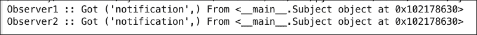
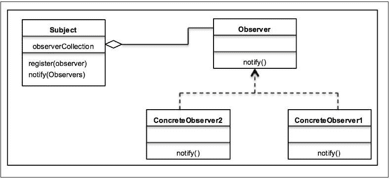
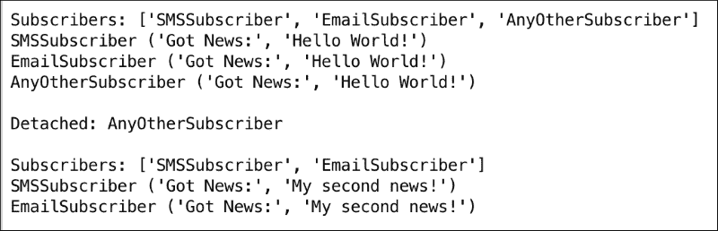

# 第六章。观察者模式——保持对象知情

在上一章中，我们从对代理的简要介绍开始，然后讨论了代理设计模式。我们通过 UML 图理解了代理模式的概念，并学习了如何借助 Python 实现将其应用于现实世界。你在 FAQ 部分学习了代理模式的优缺点。

在本章中，我们将讨论第三种设计模式——行为设计模式。我们将介绍观察者设计模式，它属于行为模式范畴。我们将讨论观察者设计模式在软件开发中的应用。我们将使用一个示例用例并在 Python 3.5 中实现它。

在本章中，我们将简要介绍以下主题：

+   行为设计模式的介绍

+   观察者模式及其 UML 图

+   带有 Python 3.5 代码实现的现实世界用例

+   松散耦合的力量

+   常见问题解答

在本章结束时，我们将总结整个讨论——请将此视为要点。

# 介绍行为模式

在本书的前几章中，你学习了创建模式（单例）和结构模式（外观）。在本节中，我们将简要了解行为模式。

创建模式基于对象如何被创建。它们隔离了对象创建的细节。代码与要创建的对象类型无关。结构模式设计对象和类的结构，以便它们可以一起工作以实现更大的结果。它们的主要重点是简化结构并识别类与对象之间的关系。

如其名所示，行为模式关注对象所具有的职责。它们处理对象之间的交互以实现更大的功能。行为模式建议，虽然对象应该能够相互交互，但它们仍然应该是松散耦合的。我们将在本章后面学习松散耦合的原则。

观察者设计模式是行为模式中最简单的一种。因此，让我们做好准备，更深入地了解它们。

# 理解观察者设计模式

在观察者设计模式中，一个对象（主题）维护一个依赖者（观察者）列表，以便主题可以使用观察者定义的任何方法通知所有观察者它所经历的变化。

在分布式应用的世界中，多个服务相互交互以执行用户想要实现的大操作。服务可以执行多个操作，但它们执行的操作直接或严重依赖于与之交互的服务对象的状态。

考虑一个用户注册的使用场景，其中用户服务负责网站上的用户操作。假设我们还有一个名为电子邮件服务的其他服务，该服务观察用户状态并向用户发送电子邮件。例如，如果用户刚刚注册，用户服务将调用电子邮件服务的一个方法，向用户发送账户验证的电子邮件。如果账户已验证但信用额度较少，电子邮件服务将监控用户服务并向用户发送低信用额的电子邮件警报。

因此，如果应用程序中有一个核心服务，许多其他服务都依赖于它，那么这个核心服务就成为了需要被观察者观察/监控以进行变更的主题。观察者反过来应该根据主题发生的变更对其自身对象的状态进行更改或采取某些行动。上述场景，即依赖服务监控核心服务状态变更，是观察者设计模式的经典案例。

在广播或发布/订阅系统中，你会找到观察者设计模式的使用。考虑一个博客的例子。假设你是一个技术爱好者，喜欢阅读这个博客上关于 Python 的最新文章。你会怎么做？你会订阅这个博客。像你一样，还有多个订阅者也注册了这个博客。所以，每当有新的博客文章时，你会收到通知，或者如果已发布的博客有变更，你也会被告知编辑。你收到变更通知的方式可以是电子邮件。现在，如果你将这个场景应用到观察者模式中，博客就是维护订阅者或观察者列表的主题。所以，当博客中添加新条目时，所有观察者都会通过电子邮件或其他通知机制（如观察者定义的）收到通知。

观察者模式的主要意图如下：

+   它定义了对象之间的一对多依赖关系，以便任何对象的变更都会自动通知其他依赖对象

+   它封装了主题的核心组件

观察者模式在以下多个场景中使用：

+   分布式系统中事件服务的实现

+   新闻机构的框架

+   股市也是观察者模式的一个很好的案例

以下 Python 代码实现了观察者设计模式：

```py
class Subject:
    def __init__(self):
        self.__observers = []

    def register(self, observer):
        self.__observers.append(observer)

    def notifyAll(self, *args, **kwargs):
        for observer in self.__observers:
            observer.notify(self, *args, **kwargs)

class Observer1:
    def __init__(self, subject):
        subject.register(self)

    def notify(self, subject, *args):
        print(type(self).__name__,':: Got', args, 'From', subject)

class Observer2:
    def __init__(self, subject):
        subject.register(self)

    def notify(self, subject, *args):
        print(type(self).__name__, ':: Got', args, 'From', subject)

subject = Subject()
observer1 = Observer1(subject)
observer2 = Observer2(subject)
subject.notifyAll('notification')
```

上述代码的输出如下：



## 观察者模式的 UML 类图

现在让我们借助以下 UML 图来更深入地了解观察者模式。

如前一段所述，观察者模式有两个主要角色：`Subject`和`Observer`。让我们将这些放入 UML 图中，看看类是如何表现的：



当我们查看 UML 图时，你会意识到这个模式中有三个主要参与者：

+   `Subject`：`Subject` 类了解 `Observer`。`Subject` 类具有 `register()` 和 `deregister()` 等方法，这些方法由 `Observers` 用于将自己注册到 `Subject` 类。因此，`Subject` 可以处理多个 `Observers`。

+   `Observer`：它定义了一个接口，供观察 `Subject` 的对象使用。它定义了 `Observer` 需要实现的方法，以便在 `Subject` 发生变化时得到通知。

+   `ConcreteObserver`：它存储应与 `Subject` 的状态一致的状态。它通过实现 `Observer` 接口来保持状态与 `Subject` 的变化一致。

流程很简单。`ConcreteObservers` 通过实现 `Observer` 提供的接口来将自己注册到主体。每当状态发生变化时，主体通过 `Observers` 提供的 `notify` 方法通知所有 `ConcreteObservers`。

# 实际世界中的观察者模式

我们将采用一个新闻机构的案例来展示观察者模式在实际世界中的应用场景。新闻机构通常从各个地点收集新闻，并将其发布给订阅者。让我们看看这个用例的设计考虑因素。

由于信息是实时发送/接收的，新闻机构应该能够尽快将其新闻发布给订阅者。此外，由于技术行业的进步，不仅报纸，订阅者也可以是不同类型，如电子邮件、手机、短信或语音通话。我们还应该能够添加任何其他类型的订阅者，并为任何新技术预留预算。

让我们在 Python 3.5 中开发一个应用程序并实现前面的用例。我们将从主体，即新闻发布者开始：

+   主体行为由 `NewsPublisher` 类表示。

+   `NewsPublisher` 提供了一个接口，使订阅者可以与之交互。

+   `attach()` 方法由 `Observer` 用于注册到 `NewsPublisher`，而 `detach()` 方法有助于注销 `Observer`。

+   `subscriber()` 方法返回已经注册到 `Subject` 的所有订阅者的列表。

+   `notifySubscriber()` 方法遍历所有已注册到 `NewsPublisher` 的订阅者。

+   发布者使用 `addNews()` 方法创建新的新闻，而 `getNews()` 用于返回最新的新闻，然后通过 `Observer` 通知。

让我们先看看 `NewsPublisher` 类：

```py
class NewsPublisher:
    def __init__(self):
        self.__subscribers = []
        self.__latestNews = None

    def attach(self, subscriber):
        self.__subscribers.append(subscriber)

    def detach(self):
        return self.__subscribers.pop()

    def subscribers(self):
        return [type(x).__name__ for x in self.__subscribers]

    def notifySubscribers(self):
        for sub in self.__subscribers:
            sub.update()

    def addNews(self, news):
        self.__latestNews = news

    def getNews(self):
        return "Got News:", self.__latestNews
```

现在我们来谈谈 `Observer` 接口：

+   在这个例子中，`Subscriber` 代表 `Observer`。它是一个抽象基类，代表任何其他 `ConcreteObserver`。

+   `Subscriber` 有一个 `update()` 方法，需要由 `ConcreteObservers` 实现。

+   `update()` 方法由 `ConcreteObserver` 实现，以便它们能够从 `Subject` (`NewsPublishers`) 接收任何新闻发布的通知。

让我们现在看看 `Subscriber` 抽象类的代码：

```py
from abc import ABCMeta, abstractmethod

class Subscriber(metaclass=ABCMeta):

    @abstractmethod
    def update(self):
        pass
```

我们还开发了一些代表 `ConcreteObserver` 的类：

+   在这种情况下，我们有两个主要的观察者：实现了订阅者接口的 `EmailSubscriber` 和 `SMSSubscriber`。

+   除了这两个之外，我们还有一个名为 `AnyOtherObserver` 的其他观察者，它展示了 `Observers` 与 `Subject` 的松耦合。

+   每个 `ConcreteObserver` 的 `__init__()` 方法使用 `attach()` 方法将其注册到 `NewsPublisher`。

+   `ConcreteObserver` 的 `update()` 方法由 `NewsPublisher` 内部使用来通知新闻的增加。

下面是如何实现 `SMSSubscriber` 类的示例：

```py
class SMSSubscriber:
    def __init__(self, publisher):
        self.publisher = publisher
        self.publisher.attach(self)

    def update(self):
        print(type(self).__name__, self.publisher.getNews())

class EmailSubscriber:
    def __init__(self, publisher):
        self.publisher = publisher
        self.publisher.attach(self)

    def update(self):
        print(type(self).__name__, self.publisher.getNews())

class AnyOtherSubscriber:
    def __init__(self, publisher):
        self.publisher = publisher
        self.publisher.attach(self)

    def update(self):
        print(type(self).__name__, self.publisher.getNews())
```

现在所有必需的订阅者都已实现，让我们看看 `NewsPublisher` 和 `SMSSubscribers` 类的实际应用：

+   客户端创建一个 `NewsPublisher` 对象，该对象被 `ConcreteObservers` 用于各种操作。

+   `SMSSubscriber`、`EmailSubscriber` 和 `AnyOtherSubscriber` 类使用发布者对象进行初始化。

+   在 Python 中，当我们创建对象时，会调用 `__init__()` 方法。在 `ConcreteObserver` 类中，`__init__()` 方法内部使用 `NewsPublisher` 的 `attach()` 方法来注册自己以接收新闻更新。

+   然后我们打印出所有已注册到 `Subject` 的订阅者（`ConcreteObservers`）的列表。

+   使用 `addNews()` 方法通过 `NewsPublisher`（news_publisher）对象创建新的新闻。

+   `NewsPublisher` 的 `notifySubscribers()` 方法用于通知所有订阅者新闻的增加。`notifySubscribers()` 方法内部调用 `ConcreteObserver` 实现的 `update()` 方法，以便它们获取最新的新闻。

+   `NewsPublisher` 还有一个 `detach()` 方法，用于从已注册订阅者列表中删除订阅者。

以下代码实现表示了 `Subject` 和 `Observers` 之间的交互：

```py
if __name__ == '__main__':
    news_publisher = NewsPublisher()

    for Subscribers in [SMSSubscriber, EmailSubscriber, AnyOtherSubscriber]:
        Subscribers(news_publisher)
    print("\nSubscribers:", news_publisher.subscribers())

    news_publisher.addNews('Hello World!')
    news_publisher.notifySubscribers()

    print("\nDetached:", type(news_publisher.detach()).__name__)
    print("\nSubscribers:", news_publisher.subscribers())

    news_publisher.addNews('My second news!')
    news_publisher.notifySubscribers()
```

上述代码的输出如下：



# 观察者模式的方法

通知 `Observer` 关于 `Subject` 中发生的变化有两种不同的方式。它们可以被归类为推送或拉模型。

## 拉模型

在拉模型中，`Observers` 扮演着以下积极的角色：

+   当有任何变化时，`Subject` 向所有已注册的 `Observers` 广播。

+   当有变更时，`Observer` 负责获取变更或从订阅者那里拉取数据。

+   拉模型是无效的，因为它涉及两个步骤——第一步是 `Subject` 通知 `Observer`，第二步是 `Observer` 从 `Subject` 中拉取所需的数据。

## 推送模型

在推送模型中，`Subject` 扮演着主导角色如下：

+   与拉模型不同，更改是由`Subject`推送到`Observer`的。

+   在这个模型中，`Subject`可以向`Observer`发送详细的信息（即使可能不需要）。当`Subject`发送大量数据时，这可能会导致响应时间缓慢，但这些数据实际上从未被`Observer`使用。

+   只从`Subject`发送所需的数据，从而提高性能。

# 松散耦合与观察者模式

松散耦合是一个重要的设计原则，应该在软件应用中使用。松散耦合的主要目的是努力在相互交互的对象之间实现松散耦合的设计。耦合指的是一个对象对其交互对象所具有的知识程度。

松散耦合的设计使我们能够构建灵活的面向对象系统，可以处理变化，因为它们减少了多个对象之间的依赖性。

松散耦合架构确保以下特性：

+   它降低了在一个元素内部做出的更改可能对其他元素产生未预期影响的风险

+   它简化了测试、维护和故障排除问题

+   系统可以轻松地分解为可定义的元素

观察者模式为你提供了一个对象设计，其中`Subject`和`Observer`是松散耦合的。以下要点将更好地解释这一点：

+   `Subject`对`Observer`的唯一了解是它实现了一个特定的接口。它不需要知道`ConcreteObserver`类。

+   任何新的`Observer`都可以在任何时候添加（正如我们在本章前面的示例中所看到的）。

+   添加任何新的`Observer`不需要修改`Subject`。在示例中，我们看到`AnyOtherObserver`可以添加/删除，而无需对`Subject`进行任何更改。

+   `Subject`或`Observer`之间没有绑定，可以独立使用。因此，如果需要，`Observer`可以在任何其他地方重用。

+   `Subject`或`Observer`的变化不会相互影响。由于两者都是独立的或松散耦合的，它们可以自由地进行自己的更改。

# 观察者模式 - 优点和缺点

观察者模式为你提供了以下优点：

+   它支持对象之间松散耦合的原则

+   它允许在`Subject`或`Observer`类不发生变化的情况下，有效地将数据发送到其他对象

+   `Observers`可以在任何时间添加/删除

以下列举了观察者模式的缺点：

+   `ConcreteObserver`必须实现观察者接口，这涉及到继承。没有组合的选项，因为观察者接口可以被实例化。

+   如果没有正确实现，`Observer`可能会增加复杂性并导致意外的性能问题。

+   在软件应用中，通知有时可能不可靠，导致竞争条件或不一致性。

# 常见问题解答

Q1. 是否可以有多个主题（Subjects）和观察者（Observers）？

A：对于软件应用来说，存在一个情况是拥有多个主题（Subjects）和观察者。为了使这可行，观察者需要被通知主题（Subjects）的变化以及哪个主题发生了变化。

Q2. 谁负责触发更新？

A：正如你之前所学的，观察者模式可以在推送和拉取模型中工作。通常，当有变化时，主题（Subject）会触发更新方法，但有时根据应用需求，**观察者（Observer）**也可以触发通知。然而，需要注意频率不应过高，否则可能会导致性能下降，尤其是在主题更新频率较低时。

Q3. 主题（Subject）或观察者能否用于其他用例的访问？

A：是的，这就是观察者模式中体现的松耦合的力量。主题（Subject）/观察者都可以独立使用。

# 摘要

我们从理解行为设计模式开始本章。我们了解了观察者模式的基础以及它在软件架构中的有效应用。我们探讨了如何使用观察者设计模式来通知主题（Subject）的变化。它们管理对象之间的交互，并管理对象的一对多依赖关系。

你还学习了使用 UML 图和 Python 3.5 的示例代码实现该模式。

观察者模式有两种不同的实现方式：推送和拉取模型。你学习了这些模式，并讨论了它们的实现和性能影响。

我们理解了软件设计中的松耦合原则，以及观察者模式如何利用这一原则进行应用开发。

我们还涵盖了一个关于常见问题解答（FAQs）的部分，这将帮助你获得更多关于该模式及其可能的优势/劣势的想法。

在本章结束时，我们现在准备在接下来的章节中学习更多的行为模式。
