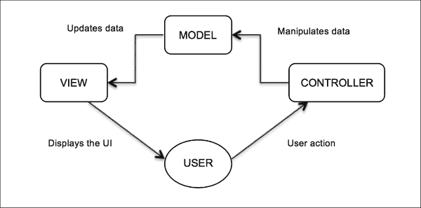
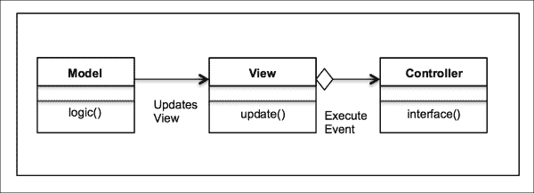
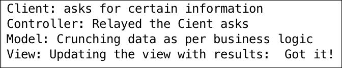
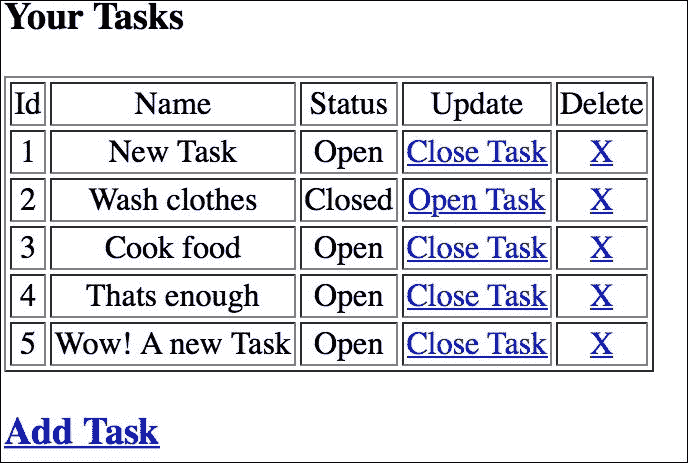
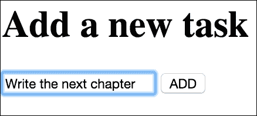
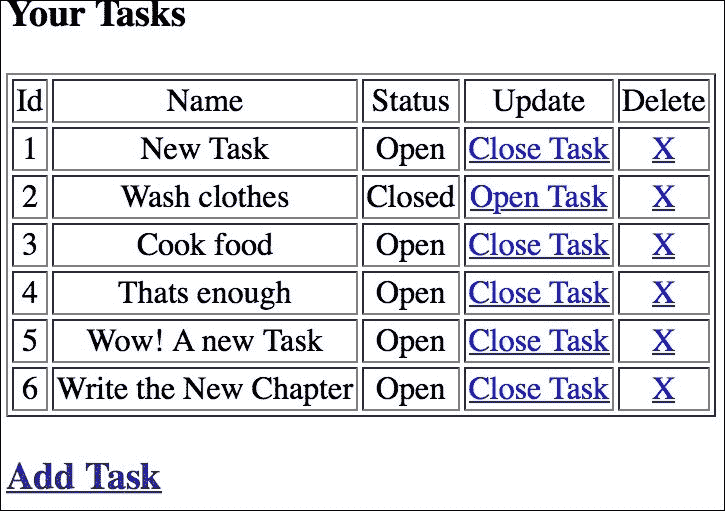
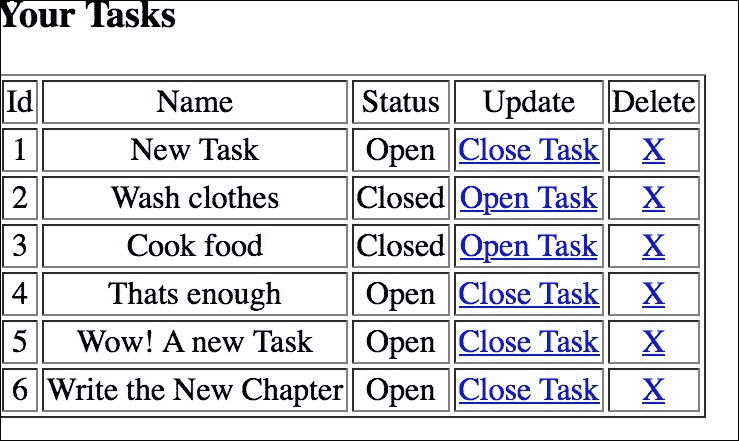
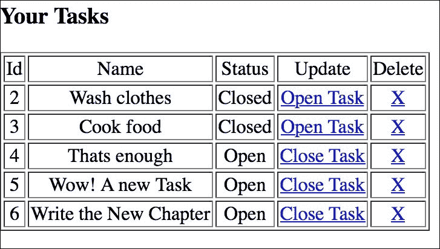

# 第九章。模型-视图-控制器 – 复合模式

在上一章中，我们从一个模板方法设计模式的介绍开始，其中子类重新定义了算法的具体步骤，从而实现了灵活性和代码重用。您学习了模板方法及其如何通过一系列步骤构建算法。我们讨论了 UML 图，其优缺点，在常见问题解答部分对其进行了更多了解，并在本章末尾总结了讨论。

在本章中，我们将讨论复合模式。我们将介绍**模型-视图-控制器**（**MVC**）设计模式，并讨论它在软件开发中的应用。我们将使用一个示例用例，并在 Python v3.5 中实现它。

在本章中，我们将简要介绍以下内容：

+   复合模式与模型-视图-控制器简介

+   MVC 模式和它的 UML 图

+   带有 Python v3.5 代码实现的实际用例

+   MVC 模式——优点和缺点

+   常见问题

在本章结束时，我们将总结整个讨论——请将此视为一个要点。

# 复合模式简介

在整本书中，我们探讨了各种设计模式。正如我们所见，设计模式被分为三个主要类别：结构型、创建型和行为型设计模式。您还通过示例学习了这些内容。

然而，在软件实现中，模式并不是孤立的。每个软件设计或解决方案并不是仅使用一个设计模式实现的。实际上，模式通常一起使用并组合起来，以实现特定的设计解决方案。正如 GoF 所定义的，“*复合模式将两个或更多模式结合成一个解决方案，该解决方案解决重复或普遍问题*。”复合模式不是一组一起工作的模式；它是对问题的通用解决方案。

现在，我们将探讨模型-视图-控制器复合模式。它是复合模式的最佳示例，并且在多年的设计解决方案中得到了应用。

# 模型-视图-控制器模式

MVC 是一种用于实现用户界面和易于修改和维护的架构的软件模式。本质上，MVC 模式讨论的是将应用程序分为三个基本部分：模型、视图和控制器。这三个部分相互关联，有助于将信息表示的方式与信息呈现的方式分开。

这就是 MVC 模式的工作方式：模型代表数据和业务逻辑（信息如何存储和查询），视图只是数据的表示（如何呈现），控制器是两者之间的粘合剂，它根据用户的需求指导模型和视图以某种方式行为。有趣的是，视图和控制器依赖于模型，但反之则不然。这主要是因为用户关心数据。模型可以独立工作，这是 MVC 模式的关键方面。

考虑网站的情况。这是描述 MVC 模式的经典例子之一。在网站上会发生什么？你点击一个按钮，发生一些操作，然后你看到你想要的内容。这是怎么发生的？

+   你是用户，你与视图交互。视图是你看到的网页。你点击视图上的按钮，它告诉控制器需要做什么。

+   控制器从视图中获取输入并将其发送到模型。模型根据用户的操作进行操作。

+   控制器还可以根据从用户接收到的操作请求视图更改，例如更改按钮、呈现额外的 UI 元素等。

+   模型通知视图状态的变化。这可能基于一些内部变化或外部触发器，如点击按钮。

+   视图随后显示它直接从模型获得的状态。例如，如果用户登录到网站，他们可能会看到一个仪表板视图（登录后）。仪表板上需要填充的所有详细信息都由模型提供给视图。

MVC 设计模式与以下术语一起工作——模型、视图、控制器和客户端：

+   **模型**：这声明了一个用于存储和操作数据的类

+   **视图**：这声明了一个用于构建用户界面和数据显示的类

+   **控制器**：这声明了一个连接模型和视图的类

+   **用户**：这声明了一个基于某些操作请求特定结果的类

以下图像解释了 MVC 模式的流程：



要在软件开发术语中讨论 MVC 模式，让我们看看 MVC 模式中涉及的主要类：

+   `模型`类用于定义在数据上发生的所有操作（如创建、修改和删除），并提供如何使用数据的方法。

+   `视图`类是用户界面的表示。它将包含帮助我们根据应用程序的上下文和需求构建 Web 或 GUI 界面的方法。它不应包含任何自己的逻辑，只需显示它接收到的数据。

+   `控制器`类用于接收请求数据并将其发送到系统的其他部分。它包含用于路由请求的方法。

MVC 模式在以下情况下使用：

+   当需要更改展示方式而不更改业务逻辑时

+   可以使用多个控制器与多个视图一起工作，以更改用户界面的表示。

+   再次强调，模型可以改变，而视图不需要改变，因为它们可以独立工作。

简而言之，MVC 模式的主要意图如下：

+   保持数据和数据展示的分离。

+   类和实现的易于维护。

+   修改数据存储和展示方式的灵活性。两者都是独立的，因此具有更改的灵活性。

让我们详细看看模型、视图和控制层，正如在*学习 Python 设计模式*、*Gennadiy Zlobin*、*Packt Publishing*中所述。

## 模型 – 应用程序的知识

模型是应用程序的基石，因为它独立于视图和控制层。反过来，视图和控制层依赖于模型。

模型还提供客户端请求的数据。通常，在应用程序中，模型由存储和返回信息的数据库表表示。模型具有改变状态的状态和方法，但不知道数据将如何被客户端看到。

确保模型在多次操作中保持一致性至关重要；否则，客户端可能会被损坏或显示过时的数据，这是完全不可接受的。

由于模型完全独立，因此在此部分工作的开发者可以专注于维护，而无需最新的视图更改。

## 视图 – 外观

视图是客户端在界面上看到的数据表示。视图可以独立开发，但不应该包含任何复杂逻辑。逻辑仍然应该位于控制器或模型中。

在当今世界，视图需要足够灵活，并且应该适应多个平台，如桌面、移动设备、平板电脑和多种屏幕尺寸。

视图应避免直接与数据库交互，并依赖模型获取所需数据。

## 控制器 – 粘合剂

如其名所示，控制器控制用户在界面上的交互。当用户点击界面上某些元素时，基于交互（按钮点击或触摸），控制器会调用模型，从而创建、更新或删除数据。

控制器也将数据传递给视图，以便用户可以在界面上查看信息。

控制器不应进行数据库调用或参与数据展示。控制器应作为模型和视图之间的粘合剂，尽可能薄。

现在我们开始动手，开发一个示例应用程序。下面的 Python 代码实现了 MVC 设计模式。假设我们想要开发一个应用程序，告诉用户云公司提供的营销服务，包括电子邮件、短信和语音设施。

我们首先开发`model`类（模型），该类定义了产品提供的服务，即电子邮件、短信和语音。每个服务都有指定的费率，例如，1000 封电子邮件将向客户收取 2 美元，1000 条消息的收费是 10 美元，1000 条语音消息的收费是 15 美元。因此，模型代表了产品服务和价格的数据。

然后，我们定义了`view`类（视图），它提供了一个方法将信息呈现回客户端。这些方法分别是`list_services()`和`list_pricing()`；正如其名所示，一个方法用于打印产品提供的服务，另一个用于列出服务的定价。

然后，我们定义了`Controller`类，该类定义了两个方法，`get_services()`和`get_pricing()`。每个方法都查询模型并获取数据。然后，数据被传递到视图，从而呈现给客户端。

`Client`类实例化控制器。`controller`对象用于根据客户端的请求调用适当的方法：

```py
class Model(object):
    services = {
                 'email': {'number': 1000, 'price': 2,},
                 'sms': {'number': 1000, 'price': 10,},
                 'voice': {'number': 1000, 'price': 15,},
    }

class View(object):
    def list_services(self, services):
        for svc in services:
            print(svc, ' ')

    def list_pricing(self, services):
        for svc in services:
            print("For" , Model.services[svc]['number'],
                               svc, "message you pay $",
                           Model.services[svc]['price'])

class Controller(object):
    def __init__(self):
        self.model = Model()
        self.view = View()

    def get_services(self):
        services = self.model.services.keys()
        return(self.view.list_services(services))

    def get_pricing(self):
        services = self.model.services.keys()
        return(self.view.list_pricing(services))

class Client(object):
    controller = Controller()
    print("Services Provided:")
    controller.get_services()
    print("Pricing for Services:")
    controller.get_pricing()
```

以下是为前面代码的输出：


# MVC 设计模式的 UML 类图

让我们借助以下 UML 图来更深入地了解 MVC 模式。

正如我们在前面的章节中讨论的那样，MVC 模式有以下主要参与者：`Model`（模型）、`View`（视图）和`Controller`（控制器）类。



在 UML 图中，我们可以看到这个模式中的三个主要类：

+   `Model`类：这定义了与客户端某些任务相关的业务逻辑或操作。

+   `View`类：这定义了客户端看到的视图或表示。模型根据业务逻辑向视图呈现数据。

+   `Controller`类：这本质上是一个介于视图和模型之间的接口。当客户端采取某些操作时，控制器将视图的查询导向模型。

以下是一个包含所有参与者的代码示例，以了解该模式：

```py
class Model(object):
    def logic(self):
        data = 'Got it!'
        print("Model: Crunching data as per business logic")
        return data

class View(object):
    def update(self, data):
        print("View: Updating the view with results: ", data)

class Controller(object):
    def __init__(self):
        self.model = Model()
        self.view = View()

    def interface(self):
        print("Controller: Relayed the Client asks")
        data = self.model.logic()
        self.view.update(data)

class Client(object):
    print("Client: asks for certain information")
    controller = Controller()
    controller.interface()
```

以下是为前面代码的输出：



# 现实世界中的 MVC 模式

我们那些古老的 Web 应用程序框架基于 MVC 的哲学。以 Django 或 Rails（Ruby）为例：它们以 Model-View-Controller 格式结构化他们的项目，除了它被表示为**MTV**（**Model**，**Template**，**View**）之外，其中模型是数据库，模板是视图，控制器是视图/路由。

例如，让我们以 Tornado Web 应用程序框架（[`www.tornadoweb.org/en/stable/`](http://www.tornadoweb.org/en/stable/)）为例，开发一个单页应用程序。这个应用程序用于管理用户的任务，并且用户有权限添加任务、更新任务和删除任务。

让我们看看设计考虑因素：

+   让我们先从控制器开始。在 Tornado 中，控制器已被定义为视图/app 路由。我们需要定义多个视图，例如列出任务、创建新任务、关闭任务以及处理无法提供服务的请求的操作。

+   我们还应该定义模型，即列出、创建或删除任务的数据库操作。

+   最后，在 Tornado 中，视图由模板表示。根据我们的应用程序，我们需要一个模板来显示任务、创建或删除任务，以及如果 URL 未找到的模板。

## 模块

我们将使用以下模块来构建此应用程序：

+   Torando==4.3

+   SQLite3==2.6.0

让我们先在我们的应用程序中导入 Python 模块：

```py
importtornado
import tornado.web
import tornado.ioloop
import tornado.httpserver
import sqlite3
```

以下代码表示数据库操作，本质上，是 MVC 中的模型。在 Tornado 中，数据库操作是在不同的处理器下执行的。处理器根据用户在 Web 应用中请求的路由在数据库上执行操作。在这里，我们讨论我们在这个示例中创建的四个处理器：

+   `IndexHandler`：这返回存储在数据库中的所有任务。它返回一个包含键 tasks 的字典。它执行 `SELECT` 数据库操作以获取这些任务。

+   `NewHandler`：正如其名所示，这有助于添加新任务。它检查是否有创建新任务的 `POST` 调用并在数据库中执行 `INSERT` 操作。

+   `UpdateHandler`：这在标记任务为完成或重新打开指定任务时很有用。在这种情况下，执行 `UPDATE` 数据库操作以设置状态为打开/关闭的任务。

+   `DeleteHandler`：这将从数据库中删除指定的任务。一旦删除，任务将不再在任务列表中可见。

我们还开发了一个 `_execute()` 方法，该方法接受一个 SQLite 查询作为输入并执行所需的数据库操作。`_execute()` 方法在 SQLite 数据库上执行以下操作：

+   创建 SQLite 数据库连接

+   获取游标对象

+   使用游标对象进行事务

+   提交查询

+   关闭连接

让我们看看 Python 实现中的处理器：

```py
class IndexHandler(tornado.web.RequestHandler):
    def get(self):
        query = "select * from task"
        todos = _execute(query)
        self.render('index.html', todos=todos)

class NewHandler(tornado.web.RequestHandler):
    def post(self):
        name = self.get_argument('name', None)
        query = "create table if not exists task (id INTEGER \
            PRIMARY KEY, name TEXT, status NUMERIC) "
        _execute(query)
        query = "insert into task (name, status) \
            values ('%s', %d) " %(name, 1)
        _execute(query)
        self.redirect('/')

    def get(self):
        self.render('new.html')

class UpdateHandler(tornado.web.RequestHandler):
    def get(self, id, status):
        query = "update task set status=%d where \
            id=%s" %(int(status), id)
        _execute(query)
        self.redirect('/')

class DeleteHandler(tornado.web.RequestHandler):
    def get(self, id):
        query = "delete from task where id=%s" % id
        _execute(query)
        self.redirect('/')
```

如果你查看这些方法，你会注意到一个叫做 `self.render()` 的东西。这本质上代表了 MVC 中的视图（在 Tornado 框架中的模板）。我们主要有三个模板：

+   `index.html`：这是一个列出所有任务的模板

+   `new.html`：这是一个创建新任务的视图

+   `base.html`：这是一个基础模板，其他模板都是从它继承的

考虑以下代码：

```py
base.html
<html>
<!DOCTYPE>
<html>
<head>
        
</head>
<body>
        
</body>
</html>

index.html


<title>ToDo</title>

<h3>Your Tasks</h3>
<table border="1" >
<tralign="center">
<td>Id</td>
<td>Name</td>
<td>Status</td>
<td>Update</td>
<td>Delete</td>
</tr>
    
<tralign="center">
<td>{{todo[0]}}</td>
<td>{{todo[1]}}</td>
            
<td>Open</td>
            
<td>Closed</td>
            
            
<td><a href="/todo/update/{{todo[0]}}/0">Close Task</a></td>
            
<td><a href="/todo/update/{{todo[0]}}/1">Open Task</a></td>
            
<td><a href="/todo/delete/{{todo[0]}}">X</a></td>
</tr>
    
</table>

<div>
<h3><a href="/todo/new">Add Task</a></h3>
</div>


new.html


<title>ToDo</title>

<div>
<h3>Add Task to your List</h3>
<form action="/todo/new" method="post" id="new">
<p><input type="text" name="name" placeholder="Enter task"/>
<input type="submit" class="submit" value="add" /></p>
</form>
</div>

```

在 Tornado 中，我们也有 MVC 中的控制器，即应用路由。在这个示例中，我们有四个应用路由：

+   `/`：这是列出所有任务的路由

+   `/todo/new`：这是创建新任务的路由

+   `/todo/update`：这是将任务状态更新为打开/关闭的路由

+   `/todo/delete`：这是删除已完成任务的路由

代码示例如下：

```py
class RunApp(tornado.web.Application):
    def __init__(self):
        Handlers = [
            (r'/', IndexHandler),
            (r'/todo/new', NewHandler),
            (r'/todo/update/(\d+)/status/(\d+)', UpdateHandler),
            (r'/todo/delete/(\d+)', DeleteHandler),
        ]
        settings = dict(
            debug=True,
            template_path='templates',
            static_path="static",
        )
        tornado.web.Application.__init__(self, Handlers, \
            **settings)
```

我们还有应用程序设置，并且可以启动 HTTP Web 服务器来运行应用程序：

```py
if__name__ == '__main__':
    http_server = tornado.httpserver.HTTPServer(RunApp())
    http_server.listen(5000)
    tornado.ioloop.IOLoop.instance().start()
```

当我们运行 Python 程序时：

1.  服务器已启动并运行在端口`5000`上。适当的视图、模板和控制器已经配置好。

1.  在浏览`http://localhost:5000/`时，我们可以看到任务列表。以下屏幕截图显示了浏览器中的输出：

1.  我们还可以添加一个新任务。一旦你点击**添加**，就会添加一个新的任务。在下面的屏幕截图中，添加了一个新的任务`编写新章节`，并在任务列表中列出：

    当我们输入新任务并点击 ADD 按钮时，任务会被添加到现有任务列表中：

    

1.  我们还可以从 UI 关闭任务。例如，我们更新了**做饭**任务，列表也会更新。如果我们选择的话，可以重新打开任务：

1.  我们还可以删除一个任务。在这种情况下，我们删除了第一个任务**新任务**，任务列表将更新以删除该任务：

# MVC 模式的优点

以下是一些 MVC 模式的优点：

+   使用 MVC，开发者可以将软件应用分成三个主要部分：模型、视图和控制器。这有助于实现易于维护、强制松散耦合和降低复杂性。

+   MVC 允许在前端进行独立更改，而无需在后台逻辑上进行任何或很少的更改，因此开发工作仍然可以独立进行。

+   类似地，模型或业务逻辑可以更改，而不会在视图中进行任何更改。

+   此外，控制器可以更改，而不会对视图或模型产生影响。

+   MVC 还有助于招聘具有特定能力的人员，如平台工程师和 UI 工程师，他们可以在自己的专业领域独立工作。

# 常见问题

Q1. MVC 不是一个模式吗？为什么它被称为复合模式？

A: 复合模式本质上是由多个模式组合在一起来解决软件应用开发中的大型设计问题。MVC 模式是最受欢迎和最广泛使用的复合模式。由于其广泛的使用和可靠性，它被视为一个模式本身。

Q2. MVC 只用于网站吗？

A: 不，网站是描述 MVC 的最佳例子。然而，MVC 可以用于多个领域，例如 GUI 应用程序或任何需要以独立方式松散耦合和分割组件的地方。MVC 的典型例子包括博客、电影数据库应用程序和视频流网页应用。虽然 MVC 在许多地方都很实用，但如果用于着陆页、营销内容或快速的单页应用，则可能有些过度。

Q3. 多个视图可以与多个模型一起工作吗？

A: 是的，你经常会遇到需要从多个模型中收集数据并在一个视图中展示的情况。在当今的 Web 应用世界中，一对一映射很少见。

# 摘要

我们通过理解复合模式开始本章，并探讨了模型-视图-控制器（MVC）模式及其在软件架构中的有效应用。然后我们研究了 MVC 模式是如何被用来确保松散耦合并维护一个用于独立任务开发的分层框架的。

您还学习了与 UML 图和 Python 3.5 示例代码实现一起的解释，该模式。我们还涵盖了一个关于常见问题解答（FAQs）的部分，这将帮助您获得更多关于该模式和其可能的优势/劣势的想法。

在下一章中，我们将讨论反模式。那里见！
