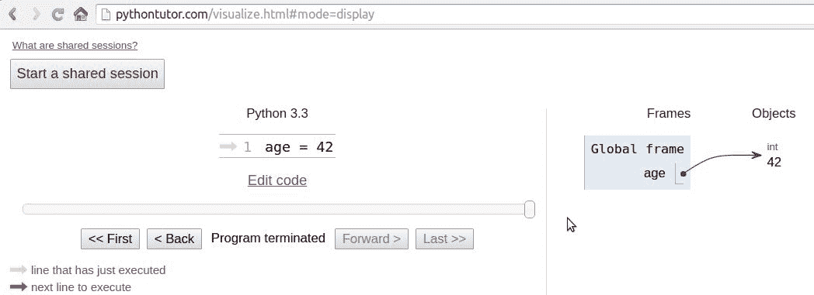
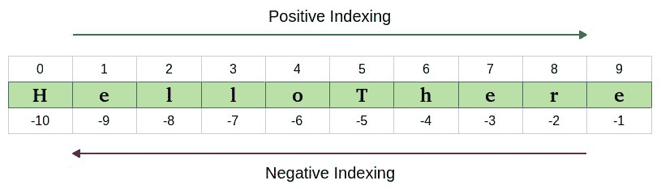

# 第二章：内置数据类型

“数据！数据！数据！”他不耐烦地喊道。“没有黏土，我就无法制造砖块。”– 福尔摩斯 – 铜山毛榉的冒险

你在计算机上所做的一切都是在管理数据。数据有许多不同的形状和风味。这是你听的音乐，你流媒体的电影，你打开的 PDF。甚至你正在阅读的本章的来源只是一个文件，也就是数据。

数据可以是简单的，比如用整数表示年龄，也可以是复杂的，比如在网站上下的订单。它可以是关于单个对象或关于它们的集合。数据甚至可以是关于数据的，也就是元数据。描述其他数据结构的设计或描述应用程序数据或其上下文的数据。在 Python 中，*对象是数据的抽象*，Python 有各种各样的数据结构，你可以用它们来表示数据，或者组合它们来创建自己的自定义数据。

在这一章中，我们将涵盖以下内容：

+   Python 对象的结构

+   可变性和不可变性

+   内置数据类型：数字、字符串、序列、集合和映射类型

+   集合模块

+   枚举

# 一切都是对象

在我们深入具体内容之前，我希望你对 Python 中的对象非常清楚，所以让我们再多谈一点关于它们。正如我们已经说过的，Python 中的一切都是对象。但是当你在 Python 模块中输入`age = 42`这样的指令时，真正发生了什么呢？

如果你去[`pythontutor.com/`](http://pythontutor.com/)，你可以在文本框中输入该指令并获得其可视化表示。记住这个网站；它对于巩固你对幕后发生的事情的理解非常有用。

因此，创建了一个对象。它得到了一个`id`，`type`设置为`int`（整数），`value`设置为`42`。一个名为`age`的名称被放置在全局命名空间中，指向该对象。因此，每当我们在全局命名空间中，在执行该行之后，我们可以通过简单地通过其名称访问它来检索该对象：`age`。

如果你要搬家，你会把所有的刀、叉和勺子放在一个盒子里，贴上“餐具”的标签。你能看到这正是相同的概念吗？这是一个可能看起来像这样的屏幕截图（你可能需要调整设置以获得相同的视图）：



因此，在本章的其余部分，每当你读到诸如`name = some_value`这样的内容时，想象一下一个放置在命名空间中的名称，它与写入该指令的范围相关联，并且有一个漂亮的箭头指向具有`id`、`type`和`value`的对象。关于这个机制还有一些要说的，但是通过一个例子来谈论它要容易得多，所以我们稍后再回到这个问题。

# 可变还是不可变？这是个问题

Python 对数据所做的第一个基本区分是关于对象的值是否会改变。如果值可以改变，对象称为**可变**，而如果值不能改变，对象称为**不可变**。

非常重要的是，你要理解可变和不可变之间的区别，因为它会影响你编写的代码，所以这里有一个问题：

```py
>>> age = 42
>>> age
42
>>> age = 43  #A
>>> age
43
```

在前面的代码中，在`#A`行，我改变了 age 的值吗？嗯，没有。但现在是`43`（我听到你说...）。是的，是`43`，但`42`是一个整数，类型是`int`，是不可变的。因此，真正发生的是在第一行，`age`是一个名称，它被设置为指向一个`int`对象，其值为`42`。当我们输入`age = 43`时，真正发生的是创建了另一个对象，类型为`int`，值为`43`（此外，`id`将不同），并且名称`age`被设置为指向它。因此，我们并没有将`42`改为`43`。实际上，我们只是将`age`指向了一个不同的位置：值为`43`的新`int`对象。让我们看看相同的代码也打印出 ID：

```py
>>> age = 42
>>> id(age)
4377553168
>>> age = 43
>>> id(age)
4377553200
```

请注意，我们通过调用内置的`id`函数打印了这些 ID。如你所见，它们是不同的，这是预期的。请记住，`age`一次只指向一个对象：首先是`42`，然后是`43`。从来不会同时存在。

现在，让我们看看使用可变对象的相同例子。对于这个例子，让我们只使用一个`Person`对象，它有一个`age`属性（现在不用担心类的声明；它只是为了完整起见）：

```py
>>> class Person():
...     def __init__(self, age):
...         self.age = age
...
>>> fab = Person(age=42)
>>> fab.age
42
>>> id(fab)
4380878496
>>> id(fab.age)
4377553168
>>> fab.age = 25  # I wish!
>>> id(fab)  # will be the same
4380878496
>>> id(fab.age)  # will be different
4377552624
```

在这种情况下，我设置了一个`fab`对象，它的`type`是`Person`（一个自定义类）。在创建时，对象被赋予`42`的`age`。我打印它，以及对象的`id`，以及`age`的 ID。请注意，即使我将`age`更改为`25`，`fab`的 ID 仍然保持不变（当然，`age`的 ID 已经改变了）。Python 中的自定义对象是可变的（除非你编写代码使它们不可变）。记住这个概念；这是非常重要的。我会在本章的其余部分提醒你。

# 数字

让我们从探索 Python 内置的数字数据类型开始。Python 是由一位数学和计算机科学硕士设计的，因此它对数字有很好的支持是合乎逻辑的。

数字是不可变对象。

# 整数

Python 整数具有无限范围，只受可用虚拟内存的限制。这意味着你想要存储的数字有多大并不重要：只要它能适应计算机的内存，Python 就会处理它。整数可以是正数、负数和 0（零）。它们支持所有基本的数学运算，如下例所示：

```py
>>> a = 14
>>> b = 3
>>> a + b  # addition
17
>>> a - b  # subtraction
11
>>> a * b  # multiplication
42
>>> a / b  # true division
4.666666666666667
>>> a // b  # integer division
4
>>> a % b  # modulo operation (reminder of division)
2
>>> a ** b  # power operation
2744
```

前面的代码应该很容易理解。只要注意一件重要的事情：Python 有两个除法运算符，一个执行所谓的**真除法**(`//`)，返回操作数的商，另一个是所谓的**整数除法**(`//`)，返回操作数的*向下取整*商。值得注意的是，在 Python 2 中，除法运算符`/`的行为与 Python 3 中不同。看看对于正数和负数的不同之处：

```py
>>> 7 / 4  # true division
1.75
>>> 7 // 4  # integer division, truncation returns 1
1
>>> -7 / 4  # true division again, result is opposite of previous
-1.75
>>> -7 // 4  # integer div., result not the opposite of previous
-2
```

这是一个有趣的例子。如果你在最后一行期望得到`-1`，不要感到难过，这只是 Python 的工作方式。在 Python 中，整数除法的结果总是向负无穷大舍入。如果你想要将一个数字截断为整数，而不是向下取整，你可以使用内置的`int`函数，如下例所示：

```py
>>> int(1.75)
1
>>> int(-1.75)
-1
```

注意截断是朝着`0`进行的。

还有一个运算符可以计算除法的余数。它被称为模运算符，用百分号(`%`)表示：

```py
>>> 10 % 3  # remainder of the division 10 // 3
1
>>> 10 % 4  # remainder of the division 10 // 4
2
```

Python 3.6 中引入的一个很好的特性是在数字文字中添加下划线的能力（在数字或基数指示符之间，但不是在前导或尾随）。目的是帮助使一些数字更易读，比如`1_000_000_000`：

```py
>>> n = 1_024
>>> n
1024
>>> hex_n = 0x_4_0_0  # 0x400 == 1024
>>> hex_n
1024 
```

# 布尔值

布尔代数是代数的一个子集，在其中变量的值是真值：真和假。在 Python 中，`True`和`False`是两个关键字，用于表示真值。布尔值是整数的一个子类，分别像`1`和`0`一样行为。布尔值的等价于`int`类的是`bool`类，它返回`True`或`False`。每个内置的 Python 对象在布尔上下文中都有一个值，这意味着当它们被传递给`bool`函数时，它们基本上会被评估为`True`或`False`。我们将在第三章中详细了解这一切，*迭代和做决定*。

布尔值可以使用逻辑运算符`and`、`or`和`not`组合成布尔表达式。我们将在下一章中详细介绍它们，所以现在让我们看一个简单的例子：

```py
>>> int(True)  # True behaves like 1
1
>>> int(False)  # False behaves like 0
0
>>> bool(1)  # 1 evaluates to True in a boolean context
True
>>> bool(-42)  # and so does every non-zero number
True
>>> bool(0)  # 0 evaluates to False
False
>>> # quick peak at the operators (and, or, not)
>>> not True
False
>>> not False
True
>>> True and True
True
>>> False or True
True
```

你可以看到，当你尝试将`True`和`False`相加时，它们是整数的子类。Python 将它们提升为整数并执行加法：

```py
>>> 1 + True
2
>>> False + 42
42
>>> 7 - True
6 
```

**向上转型**是一种从子类到其父类的类型转换操作。在这里介绍的例子中，`True`和`False`属于从整数类派生的类，当需要时会转换回整数。这个主题涉及继承，将在第六章 *OOP, Decorators, and Iterators*中详细解释。

# 实数

实数，或浮点数，根据 IEEE 754 双精度二进制浮点格式在 Python 中表示，该格式存储在 64 位信息中，分为三个部分：符号、指数和尾数。

在维基百科上了解有关这种格式的知识：[`en.wikipedia.org/wiki/Double-precision_floating-point_format`](http://en.wikipedia.org/wiki/Double-precision_floating-point_format)。

通常，编程语言给程序员提供两种不同的格式：单精度和双精度。前者占用 32 位内存，后者占用 64 位。Python 仅支持双精度格式。让我们看一个简单的例子：

```py
>>> pi = 3.1415926536  # how many digits of PI can you remember?
>>> radius = 4.5
>>> area = pi * (radius ** 2)
>>> area
63.617251235400005 
```

在计算面积时，我在`radius ** 2`外面加了括号。尽管这并不是必要的，因为幂运算符的优先级高于乘法运算符，但我认为这样公式读起来更容易。此外，如果你对面积得到了稍微不同的结果，不要担心。这可能取决于你的操作系统，Python 是如何编译的等等。只要前几位小数正确，你就知道这是正确的结果。

`sys.float_info`结构序列包含有关浮点数在您的系统上的行为的信息。这是我在我的电脑上看到的：

```py
>>> import sys
>>> sys.float_info
sys.float_info(max=1.7976931348623157e+308, max_exp=1024, max_10_exp=308, min=2.2250738585072014e-308, min_exp=-1021, min_10_exp=-307, dig=15, mant_dig=53, epsilon=2.220446049250313e-16, radix=2, rounds=1)
```

让我们在这里做一些考虑：我们有 64 位来表示浮点数。这意味着我们最多可以用`2 ** 64 == 18,446,744,073,709,551,616`个数字来表示这些位数。查看浮点数的`max`和`epsilon`值，你会意识到不可能表示它们所有。空间不够，因此它们被近似到最接近的可表示数字。你可能认为只有极大或极小的数字才会受到这个问题的影响。好吧，再想一想，尝试在你的控制台上输入以下内容：

```py
>>> 0.3 - 0.1 * 3  # this should be 0!!!
-5.551115123125783e-17 
```

这告诉你什么？它告诉你，双精度数甚至在处理简单的数字如`0.1`或`0.3`时也会受到近似问题的影响。为什么这很重要？如果你处理价格、金融计算或任何不需要近似的数据，这可能是一个大问题。不用担心，Python 给了你**decimal**类型，它不会受到这些问题的影响；我们马上就会看到它们。

# 复数

Python 为您提供了复数支持。如果你不知道什么是复数，它们是可以用*a + ib*的形式表示的数字，其中*a*和*b*是实数，*i*（或者如果你是工程师，是*j*）是虚数单位，即*-1*的平方根。*a*和*b*分别被称为数字的*实部*和*虚部*。

实际上，你可能不会经常使用它们，除非你在编写科学代码。让我们看一个小例子：

```py
>>> c = 3.14 + 2.73j
>>> c.real  # real part
3.14
>>> c.imag  # imaginary part
2.73
>>> c.conjugate()  # conjugate of A + Bj is A - Bj
(3.14-2.73j)
>>> c * 2  # multiplication is allowed
(6.28+5.46j)
>>> c ** 2  # power operation as well
(2.4067000000000007+17.1444j)
>>> d = 1 + 1j  # addition and subtraction as well
>>> c - d
(2.14+1.73j)
```

# 分数和小数

让我们结束数字部分的介绍，看一看分数和小数。分数以最简形式保存有理数的分子和分母。让我们看一个快速的例子：

```py
>>> from fractions import Fraction
>>> Fraction(10, 6)  # mad hatter?
Fraction(5, 3)  # notice it's been simplified
>>> Fraction(1, 3) + Fraction(2, 3)  # 1/3 + 2/3 == 3/3 == 1/1
Fraction(1, 1)
>>> f = Fraction(10, 6)
>>> f.numerator
5
>>> f.denominator
3
```

尽管它们有时可能非常有用，但在商业软件中很少见。相反，更容易看到小数被用在所有那些需要精度的情境中；例如，在科学和金融计算中。

重要的是要记住，任意精度的十进制数当然会影响性能。每个数字要存储的数据量远远大于分数或浮点数，以及它们的处理方式，这会导致 Python 解释器在幕后做更多的工作。另一个有趣的事情是，您可以通过访问`decimal.getcontext().prec`来获取和设置精度。

让我们用十进制数看一个快速的例子：

```py
>>> from decimal import Decimal as D  # rename for brevity
>>> D(3.14)  # pi, from float, so approximation issues
Decimal('3.140000000000000124344978758017532527446746826171875')
>>> D('3.14')  # pi, from a string, so no approximation issues
Decimal('3.14')
>>> D(0.1) * D(3) - D(0.3)  # from float, we still have the issue
Decimal('2.775557561565156540423631668E-17')
>>> D('0.1') * D(3) - D('0.3')  # from string, all perfect
Decimal('0.0')
>>> D('1.4').as_integer_ratio()  # 7/5 = 1.4 (isn't this cool?!)
(7, 5)
```

请注意，当我们从`float`构造一个`Decimal`数字时，它会带有所有可能出现的近似问题。另一方面，当`Decimal`没有近似问题时（例如，当我们将`int`或`string`表示传递给构造函数时），则计算没有古怪的行为。在涉及货币时，请使用小数。

这结束了我们对内置数字类型的介绍。现在让我们来看看序列。

# 不可变序列

让我们从不可变序列开始：字符串、元组和字节。

# 字符串和字节

Python 中的文本数据是使用`str`对象处理的，更常见的是**字符串**。它们是**Unicode 代码点**的不可变序列。Unicode 代码点可以表示一个字符，但也可以有其他含义，例如格式化数据。与其他语言不同，Python 没有`char`类型，因此单个字符只是一个长度为`1`的字符串。

Unicode 是处理数据的一种出色方式，应该用于任何应用程序的内部。但是，当涉及存储文本数据或在网络上传输文本数据时，您可能希望对其进行编码，使用适合您使用的介质的适当编码。编码的结果会产生一个`bytes`对象，其语法和行为类似于字符串。Python 中的字符串文字使用单引号、双引号或三引号（单引号或双引号）编写。如果使用三引号构建，字符串可以跨多行。一个例子将澄清这一点：

```py
>>> # 4 ways to make a string
>>> str1 = 'This is a string. We built it with single quotes.'
>>> str2 = "This is also a string, but built with double quotes."
>>> str3 = '''This is built using triple quotes,
... so it can span multiple lines.'''
>>> str4 = """This too
... is a multiline one
... built with triple double-quotes."""
>>> str4  #A
'This too\nis a multiline one\nbuilt with triple double-quotes.'
>>> print(str4)  #B
This too
is a multiline one
built with triple double-quotes.
```

在`#A`和`#B`中，我们打印`str4`，首先是隐式地，然后是显式地，使用`print`函数。一个很好的练习是找出它们为什么不同。您敢挑战吗？（提示：查找`str`函数。）

字符串，像任何序列一样，都有一个长度。您可以通过调用`len`函数来获得这个长度：

```py
>>> len(str1)
49
```

# 编码和解码字符串

使用`encode`/`decode`方法，我们可以对 Unicode 字符串进行编码和解码字节对象。**UTF-8**是一种可变长度的字符编码，能够编码所有可能的 Unicode 代码点。它是网络的主要编码。还要注意，通过在字符串声明前面添加文字`b`，我们正在创建一个*字节*对象：

```py
>>> s = "This is üŋíc0de"  # unicode string: code points
>>> type(s)
<class 'str'>
>>> encoded_s = s.encode('utf-8')  # utf-8 encoded version of s
>>> encoded_s
b'This is \xc3\xbc\xc5\x8b\xc3\xadc0de'  # result: bytes object
>>> type(encoded_s)  # another way to verify it
<class 'bytes'>
>>> encoded_s.decode('utf-8')  # let's revert to the original
'This is üŋíc0de'
>>> bytes_obj = b"A bytes object"  # a bytes object
>>> type(bytes_obj)
<class 'bytes'>
```

# 索引和切片字符串

在操作序列时，非常常见的是必须在一个精确的位置访问它们（索引），或者从它们中获取一个子序列（切片）。在处理不可变序列时，这两种操作都是只读的。

虽然索引以一种形式出现，即零为基础的访问序列中的任何位置，但切片以不同的形式出现。当您获取序列的一部分时，可以指定`start`和`stop`位置以及`step`。它们用冒号（`:`）分隔，就像这样：`my_sequence[start:stop:step]`。所有参数都是可选的，`start`是包含的，`stop`是排他的。最好通过示例来展示，而不是用更多的文字来解释它们：

```py
>>> s = "The trouble is you think you have time."
>>> s[0]  # indexing at position 0, which is the first char
'T'
>>> s[5]  # indexing at position 5, which is the sixth char
'r'
>>> s[:4]  # slicing, we specify only the stop position
'The '
>>> s[4:]  # slicing, we specify only the start position
'trouble is you think you have time.'
>>> s[2:14]  # slicing, both start and stop positions
'e trouble is'
>>> s[2:14:3]  # slicing, start, stop and step (every 3 chars)
'erb '
>>> s[:]  # quick way of making a copy
'The trouble is you think you have time.'
```

在所有行中，最后一行可能是最有趣的。如果您不指定参数，Python 将为您填充默认值。在这种情况下，`start`将是字符串的开头，`stop`将是字符串的结尾，`step`将是默认值`1`。这是一种轻松快速地获取字符串`s`的副本的方法（相同的值，但不同的对象）。您能找到一种使用切片获取字符串的反向副本的方法吗（不要查找，自己找找）？

# 字符串格式化

字符串具有的一个特性是可以用作模板。有几种不同的格式化字符串的方法，对于所有可能性的完整列表，我鼓励您查阅文档。以下是一些常见的例子：

```py
>>> greet_old = 'Hello %s!'
>>> greet_old % 'Fabrizio'
'Hello Fabrizio!'
>>> greet_positional = 'Hello {} {}!'
>>> greet_positional.format('Fabrizio', 'Romano')
'Hello Fabrizio Romano!' 
>>> greet_positional_idx = 'This is {0}! {1} loves {0}!'
>>> greet_positional_idx.format('Python', 'Fabrizio')
'This is Python! Fabrizio loves Python!'
>>> greet_positional_idx.format('Coffee', 'Fab')
'This is Coffee! Fab loves Coffee!'
 >>> keyword = 'Hello, my name is {name} {last_name}'
>>> keyword.format(name='Fabrizio', last_name='Romano')
'Hello, my name is Fabrizio Romano'
```

在上一个例子中，您可以看到四种不同的格式化字符串的方法。第一种依赖于`%`运算符，已经被弃用，不应再使用。格式化字符串的当前、现代方式是使用`format`字符串方法。从不同的例子中可以看出，一对大括号在字符串中充当占位符。当我们调用`format`时，我们提供替换占位符的数据。我们可以在大括号中指定索引（以及更多），甚至名称，这意味着我们将不得不使用关键字参数而不是位置参数来调用`format`。

注意`greet_positional_idx`通过向`format`调用提供不同的数据而呈现出不同的方式。显然，我喜欢 Python 和咖啡...大惊喜！

我想向您展示的最后一个特性是 Python 的一个相对较新的添加（版本 3.6），它被称为**格式化字符串文字**。这个特性非常酷：字符串以`f`为前缀，并包含用大括号括起来的替换字段。替换字段是在运行时评估的表达式，然后使用`format`协议进行格式化：

```py
>>> name = 'Fab'
>>> age = 42
>>> f"Hello! My name is {name} and I'm {age}"
"Hello! My name is Fab and I'm 42"
>>> from math import pi
>>> f"No arguing with {pi}, it's irrational..."
"No arguing with 3.141592653589793, it's irrational..."
```

查看官方文档，了解有关字符串格式化以及它的强大功能的一切。

# 元组

我们将看到的最后一个不可变序列类型是元组。**元组**是任意 Python 对象的序列。在元组中，项目用逗号分隔。它们在 Python 中随处可见，因为它们允许在其他语言中难以复制的模式。有时元组被隐式使用；例如，一次设置多个变量，或者允许函数返回多个不同的对象（通常函数只返回一个对象，在许多其他语言中），甚至在 Python 控制台中，您可以隐式使用元组以一条指令打印多个元素。我们将看到所有这些情况的例子：

```py
>>> t = ()  # empty tuple
>>> type(t)
<class 'tuple'>
>>> one_element_tuple = (42, )  # you need the comma!
>>> three_elements_tuple = (1, 3, 5)  # braces are optional here
>>> a, b, c = 1, 2, 3  # tuple for multiple assignment
>>> a, b, c  # implicit tuple to print with one instruction
(1, 2, 3)
>>> 3 in three_elements_tuple  # membership test
True
```

注意，成员运算符`in`也可以与列表、字符串、字典以及一般的集合和序列对象一起使用。

注意，要创建一个只有一个项目的元组，我们需要在项目后面加上逗号。原因是，没有逗号，该项目只是自己包裹在大括号中，有点像冗余的数学表达式。还要注意，赋值时，大括号是可选的，所以`my_tuple = 1, 2, 3`和`my_tuple = (1, 2, 3)`是一样的。

元组赋值允许我们*一行交换*，不需要第三个临时变量。让我们首先看一种更传统的方法：

```py
>>> a, b = 1, 2
>>> c = a  # we need three lines and a temporary var c
>>> a = b
>>> b = c
>>> a, b  # a and b have been swapped
(2, 1)
```

现在让我们看看我们如何在 Python 中做到这一点：

```py
>>> a, b = 0, 1
>>> a, b = b, a  # this is the Pythonic way to do it
>>> a, b
(1, 0)
```

看一下显示 Python 交换两个值的 Pythonic 方式。你还记得我在第一章中写的吗？Python 程序通常只有等价的 Java 或 C++代码的五分之一到三分之一大小，像一行交换这样的特性有助于实现这一点。Python 是优雅的，这里的优雅也意味着经济。

由于它们是不可变的，元组可以用作字典的键（我们很快就会看到这一点）。对我来说，元组是 Python 内置数据，最接近数学向量的。这并不意味着这就是它们被创建的原因。元组通常包含异构序列的元素，而另一方面，列表大多数情况下是同构的。此外，元组通常通过解包或索引访问，而列表通常是迭代的。

# 可变序列

可变序列与它们的不可变姐妹们的不同之处在于它们可以在创建后进行更改。Python 中有两种可变序列类型：列表和字节数组。我之前说过字典是 Python 中数据结构的王者。我猜这使得列表成为它合法的女王。

# 列表

Python 列表是可变序列。它们与元组非常相似，但没有不可变性的限制。列表通常用于存储同类对象的集合，但没有什么阻止你存储异类集合。列表可以用许多不同的方式创建。让我们看一个例子：

```py
>>> []  # empty list
[]
>>> list()  # same as []
[]
>>> [1, 2, 3]  # as with tuples, items are comma separated
[1, 2, 3]
>>> [x + 5 for x in [2, 3, 4]]  # Python is magic
[7, 8, 9]
>>> list((1, 3, 5, 7, 9))  # list from a tuple
[1, 3, 5, 7, 9]
>>> list('hello')  # list from a string
['h', 'e', 'l', 'l', 'o']
```

在前面的例子中，我向你展示了如何使用不同的技术创建列表。我希望你仔细看一下那一行，上面写着`Python is magic`，我不指望你现在完全理解它（除非你作弊了，你不是新手！）。这被称为**列表推导**，是 Python 非常强大的函数特性，我们将在第五章中详细讨论，*节省时间和内存*。我只是想在这一点上让你垂涎三尺。

创建列表是好的，但真正有趣的是当我们使用它们时，所以让我们看看它们赋予我们的主要方法：

```py
>>> a = [1, 2, 1, 3]
>>> a.append(13)  # we can append anything at the end
>>> a
[1, 2, 1, 3, 13]
>>> a.count(1)  # how many `1` are there in the list?
2
>>> a.extend([5, 7])  # extend the list by another (or sequence)
>>> a
[1, 2, 1, 3, 13, 5, 7]
>>> a.index(13)  # position of `13` in the list (0-based indexing)
4
>>> a.insert(0, 17)  # insert `17` at position 0
>>> a
[17, 1, 2, 1, 3, 13, 5, 7]
>>> a.pop()  # pop (remove and return) last element
7
>>> a.pop(3)  # pop element at position 3
1
>>> a
[17, 1, 2, 3, 13, 5]
>>> a.remove(17)  # remove `17` from the list
>>> a
[1, 2, 3, 13, 5]
>>> a.reverse()  # reverse the order of the elements in the list
>>> a
[5, 13, 3, 2, 1]
>>> a.sort()  # sort the list
>>> a
[1, 2, 3, 5, 13]
>>> a.clear()  # remove all elements from the list
>>> a
[]
```

前面的代码为你提供了列表主要方法的概述。我想向你展示它们有多强大，以`extend`为例。你可以使用任何序列类型来扩展列表：

```py
>>> a = list('hello')  # makes a list from a string
>>> a
['h', 'e', 'l', 'l', 'o']
>>> a.append(100)  # append 100, heterogeneous type
>>> a
['h', 'e', 'l', 'l', 'o', 100]
>>> a.extend((1, 2, 3))  # extend using tuple
>>> a
['h', 'e', 'l', 'l', 'o', 100, 1, 2, 3]
>>> a.extend('...')  # extend using string
>>> a
['h', 'e', 'l', 'l', 'o', 100, 1, 2, 3, '.', '.', '.']
```

现在，让我们看看你可以用列表做哪些最常见的操作：

```py
>>> a = [1, 3, 5, 7]
>>> min(a)  # minimum value in the list
1
>>> max(a)  # maximum value in the list
7
>>> sum(a)  # sum of all values in the list
16
>>> len(a)  # number of elements in the list
4
>>> b = [6, 7, 8]
>>> a + b  # `+` with list means concatenation
[1, 3, 5, 7, 6, 7, 8]
>>> a * 2  # `*` has also a special meaning
[1, 3, 5, 7, 1, 3, 5, 7]
```

前面代码中的最后两行非常有趣，因为它们向我们介绍了一个叫做**运算符重载**的概念。简而言之，这意味着`+`、`-`、`*`、`%`等运算符根据它们所用的上下文可能代表不同的操作。对两个列表求和没有任何意义，对吧？因此，`+`号用于连接它们。因此，`*`号用于根据右操作数将列表连接到自身。

现在，让我们再进一步，看一些更有趣的东西。我想向你展示`sorted`方法有多强大，以及在 Python 中实现需要在其他语言中付出很大努力才能实现的结果有多容易：

```py
>>> from operator import itemgetter
>>> a = [(5, 3), (1, 3), (1, 2), (2, -1), (4, 9)]
>>> sorted(a)
[(1, 2), (1, 3), (2, -1), (4, 9), (5, 3)]
>>> sorted(a, key=itemgetter(0))
[(1, 3), (1, 2), (2, -1), (4, 9), (5, 3)]
>>> sorted(a, key=itemgetter(0, 1))
[(1, 2), (1, 3), (2, -1), (4, 9), (5, 3)]
>>> sorted(a, key=itemgetter(1))
[(2, -1), (1, 2), (5, 3), (1, 3), (4, 9)]
>>> sorted(a, key=itemgetter(1), reverse=True)
[(4, 9), (5, 3), (1, 3), (1, 2), (2, -1)]
```

前面的代码值得解释一下。首先，`a`是一个元组的列表。这意味着`a`中的每个元素都是一个元组（准确地说是一个 2 元组）。当我们调用`sorted(some_list)`时，我们得到了`some_list`的排序版本。在这种情况下，对 2 元组的排序是通过对元组中的第一个项目进行排序，当第一个项目相同时，再对第二个项目进行排序。你可以在`sorted(a)`的结果中看到这种行为，它产生了`[(1, 2), (1, 3), ...]`。Python 还让我们有能力控制排序必须针对元组的哪个元素。请注意，当我们指示`sorted`函数在每个元组的第一个元素上工作时（通过`key=itemgetter(0)`），结果是不同的：`[(1, 3), (1, 2), ...]`。排序仅在每个元组的第一个元素上进行（即在位置 0 的元素上）。如果我们想复制简单的`sorted(a)`调用的默认行为，我们需要使用`key=itemgetter(0, 1)`，这告诉 Python 首先对元组中位置 0 的元素进行排序，然后对位置 1 的元素进行排序。比较结果，你会发现它们是匹配的。

为了完整起见，我包括了一个仅对位置 1 的元素进行排序的示例，以及相同但顺序相反的示例。如果你曾经见过 Java 中的排序，我相信你此刻会感到非常震惊。

Python 排序算法非常强大，由 Tim Peters 编写（我们已经见过这个名字，你还记得吗？）。 它被称为**Timsort**，它是**merge**和**insertion sort**之间的混合，并且比大多数其他用于主流编程语言的算法具有更好的时间性能。 Timsort 是一种稳定的排序算法，这意味着当多个记录具有相同的键时，它们的原始顺序被保留。 我们在`sorted(a，key=itemgetter(0))`的结果中看到了这一点，它产生了`[(1, 3)，(1, 2)，...]`，其中这两个元组的顺序已被保留，因为它们在位置 0 处具有相同的值。

# 字节数组

为了总结我们对可变序列类型的概述，让我们花几分钟时间来了解`bytearray`类型。 基本上，它们代表了`bytes`对象的可变版本。 它们公开了大多数可变序列的常用方法以及`bytes`类型的大多数方法。 项目是范围内的整数[0, 256)。

当涉及到间隔时，我将使用开/闭范围的标准表示法。 一端的方括号表示包括该值，而圆括号表示不包括该值。 粒度通常由边缘元素的类型推断，因此，例如，间隔[3, 7]表示 3 和 7 之间的所有整数，包括。 另一方面，（3, 7）表示 3 和 7 之间的所有整数不包括（因此 4、5 和 6）。 `bytearray`类型中的项目是介于 0 和 256 之间的整数； 0 包括在内，256 不包括在内。 表达间隔的一个原因通常是为了便于编码。 如果我们将范围*[a，b)*分成*N*个连续范围，我们可以轻松地将原始范围表示为这样的连接：

*[a，k[1])+[k[1]，k[2])+[k[2]，k[3])+...+[k[N-1]，b)*

中间点（*k[i]*）在一端被排除，在另一端被包括，这样在代码处理间隔时就可以轻松进行连接和拆分。

让我们看一个`bytearray`类型的快速示例：

```py
>>> bytearray()  # empty bytearray object
bytearray(b'')
>>> bytearray(10)  # zero-filled instance with given length
bytearray(b'\x00\x00\x00\x00\x00\x00\x00\x00\x00\x00')
>>> bytearray(range(5)) # bytearray from iterable of integers
bytearray(b'\x00\x01\x02\x03\x04')
>>> name = bytearray(b'Lina')  #A - bytearray from bytes
>>> name.replace(b'L', b'l')
bytearray(b'lina')
>>> name.endswith(b'na')
True
>>> name.upper()
bytearray(b'LINA')
>>> name.count(b'L')
1
```

正如您在前面的代码中所看到的，有几种方法可以创建`bytearray`对象。 它们在许多情况下都很有用； 例如，当通过套接字接收数据时，它们消除了在轮询时连接数据的需要，因此它们可能非常方便。 在`＃A`行，我创建了一个名为`name`的`bytearray`，从字节文字`b'Lina'`中显示了`bytearray`对象如何公开来自序列和字符串的方法，这非常方便。 如果您仔细考虑，它们可以被视为可变字符串。

# 集合类型

Python 还提供了两种集合类型，`set`和`frozenset`。 `set`类型是可变的，而`frozenset`是不可变的。 它们是不可变对象的无序集合。 **可哈希性**是一个特性，允许对象被用作集合成员以及字典的键，我们很快就会看到。

来自官方文档：<q class="calibre25">如果对象具有在其生命周期内永远不会更改的哈希值，并且可以与其他对象进行比较，则对象是可哈希的。 可哈希性使对象可用作字典键和集合成员，因为这些数据结构在内部使用哈希值。 所有 Python 的不可变内置对象都是可哈希的，而可变容器则不是。</q>

对象比较相等必须具有相同的哈希值。 集合非常常用于测试成员资格，因此让我们在以下示例中引入`in`运算符：

```py
>>> small_primes = set()  # empty set
>>> small_primes.add(2)  # adding one element at a time
>>> small_primes.add(3)
>>> small_primes.add(5)
>>> small_primes
{2, 3, 5}
>>> small_primes.add(1)  # Look what I've done, 1 is not a prime!
>>> small_primes
{1, 2, 3, 5}
>>> small_primes.remove(1)  # so let's remove it
>>> 3 in small_primes # membership test
True
>>> 4 in small_primes
False
>>> 4 not in small_primes  # negated membership test
True
>>> small_primes.add(3)  # trying to add 3 again
>>> small_primes
{2, 3, 5}  # no change, duplication is not allowed
>>> bigger_primes = set([5, 7, 11, 13])  # faster creation
>>> small_primes | bigger_primes # union operator `|`
{2, 3, 5, 7, 11, 13}
>>> small_primes & bigger_primes  # intersection operator `&`
{5}
>>> small_primes - bigger_primes  # difference operator `-`
{2, 3}
```

在前面的代码中，您可以看到创建集合的两种不同方法。 一个是创建一个空集合，然后逐个添加元素。 另一个是使用数字列表作为构造函数的参数创建集合，这样我们就可以完成所有工作。 当然，您可以从列表或元组（或任何可迭代对象）创建集合，然后可以随意添加和删除集合中的成员。

我们将在下一章中查看可迭代对象和迭代。现在，只需知道可迭代对象是可以按照某个方向进行迭代的对象。

另一种创建集合的方法是简单地使用大括号表示法，就像这样：

```py
>>> small_primes = {2, 3, 5, 5, 3}
>>> small_primes
{2, 3, 5}
```

请注意，我添加了一些重复，以强调结果集不会有任何重复。让我们看一个关于集合类型的不可变对应物`frozenset`的例子：

```py
>>> small_primes = frozenset([2, 3, 5, 7])
>>> bigger_primes = frozenset([5, 7, 11])
>>> small_primes.add(11)  # we cannot add to a frozenset
Traceback (most recent call last):
 File "<stdin>", line 1, in <module>
AttributeError: 'frozenset' object has no attribute 'add'
>>> small_primes.remove(2)  # neither we can remove
Traceback (most recent call last):
 File "<stdin>", line 1, in <module>
AttributeError: 'frozenset' object has no attribute 'remove'
>>> small_primes & bigger_primes  # intersect, union, etc. allowed
frozenset({5, 7})
```

正如你所看到的，`frozenset`对象在其可变对应物方面相当有限。它们仍然非常有效地用于成员测试、并集、交集和差集操作，出于性能原因。

# 映射类型 - 字典

在所有内置的 Python 数据类型中，字典很容易是最有趣的一个。它是唯一的标准映射类型，也是每个 Python 对象的支柱。

字典将键映射到值。键需要是可哈希的对象，而值可以是任意类型。字典是可变对象。有很多不同的方法来创建字典，所以让我给你一个简单的例子，演示如何以五种不同的方式创建一个等于`{'A': 1, 'Z': -1}`的字典：

```py
>>> a = dict(A=1, Z=-1)
>>> b = {'A': 1, 'Z': -1}
>>> c = dict(zip(['A', 'Z'], [1, -1]))
>>> d = dict([('A', 1), ('Z', -1)])
>>> e = dict({'Z': -1, 'A': 1})
>>> a == b == c == d == e  # are they all the same?
True  # They are indeed
```

你有没有注意到那些双等号？赋值是用一个等号来完成的，而要检查一个对象是否与另一个对象相同（或者在这种情况下一次检查五个对象），我们使用双等号。还有另一种比较对象的方法，涉及`is`运算符，并检查两个对象是否相同（如果它们具有相同的 ID，而不仅仅是值），但除非你有充分的理由使用它，否则应该使用双等号。在前面的代码中，我还使用了一个很好的函数：`zip`。它的名字来源于现实生活中的拉链，它将两个东西粘合在一起，每次取一个元素。让我给你举个例子：

```py
>>> list(zip(['h', 'e', 'l', 'l', 'o'], [1, 2, 3, 4, 5]))
[('h', 1), ('e', 2), ('l', 3), ('l', 4), ('o', 5)]
>>> list(zip('hello', range(1, 6)))  # equivalent, more Pythonic
[('h', 1), ('e', 2), ('l', 3), ('l', 4), ('o', 5)]
```

在前面的例子中，我以两种不同的方式创建了相同的列表，一种更加明确，另一种稍微更加 Pythonic。暂时忘记我不得不在`zip`调用周围包装`list`构造函数的事实（原因是因为`zip`返回一个迭代器，而不是`list`，所以如果我想看到结果，我需要将该迭代器耗尽到某个东西中 - 在这种情况下是一个列表），并专注于结果。看看`zip`是如何将其两个参数的第一个元素配对在一起的，然后是第二个元素，然后是第三个元素，依此类推？看看你的裤子（或者如果你是女士，看看你的钱包），你会看到你的拉链也有相同的行为。但让我们回到字典，看看它们为我们提供了多少精彩的方法来允许我们按照自己的意愿对它们进行操作。

让我们从基本操作开始：

```py
>>> d = {}
>>> d['a'] = 1  # let's set a couple of (key, value) pairs
>>> d['b'] = 2
>>> len(d)  # how many pairs?
2
>>> d['a']  # what is the value of 'a'?
1
>>> d  # how does `d` look now?
{'a': 1, 'b': 2}
>>> del d['a']  # let's remove `a`
>>> d
{'b': 2}
>>> d['c'] = 3  # let's add 'c': 3
>>> 'c' in d  # membership is checked against the keys
True
>>> 3 in d  # not the values
False
>>> 'e' in d
False
>>> d.clear()  # let's clean everything from this dictionary
>>> d
{}
```

请注意，无论我们执行何种类型的操作，访问字典的键都是通过方括号进行的。你还记得字符串、列表和元组吗？我们之前也是通过方括号访问某个位置的元素，这是 Python 一致性的又一个例子。

现在让我们来看看三个特殊的对象，称为字典视图：`keys`、`values`和`items`。这些对象提供了字典条目的动态视图，并且随着字典的更改而更改。`keys()`返回字典中的所有键，`values()`返回字典中的所有值，`items()`返回字典中的所有*(键，值)*对。

根据 Python 文档：“*键和值以任意顺序进行迭代，这个顺序是非随机的，在 Python 的不同实现中会有所变化，并且取决于字典插入和删除的历史。如果在对键、值和项视图进行迭代时没有对字典进行干预修改，那么项的顺序将直接对应*”。

够啰嗦了，让我们把这一切都写成代码：

```py
>>> d = dict(zip('hello', range(5)))
>>> d
{'h': 0, 'e': 1, 'l': 3, 'o': 4}
>>> d.keys()
dict_keys(['h', 'e', 'l', 'o'])
>>> d.values()
dict_values([0, 1, 3, 4])
>>> d.items()
dict_items([('h', 0), ('e', 1), ('l', 3), ('o', 4)])
>>> 3 in d.values()
True
>>> ('o', 4) in d.items()
True
```

在前面的代码中有几件事情需要注意。首先，注意我们是如何通过迭代字符串`'hello'`和列表`[0, 1, 2, 3, 4]`的压缩版本来创建字典的。字符串`'hello'`里有两个`'l'`字符，它们分别与`zip`函数的值`2`和`3`配对。请注意，在字典中，`'l'`键的第二次出现（值为`3`）覆盖了第一次出现（值为`2`）。另一个需要注意的是，当请求任何视图时，原始顺序现在被保留，而在 3.6 版本之前，没有这样的保证。

从 Python 3.6 开始，`dict`类型已经重新实现以使用更紧凑的表示。与 Python 3.5 相比，这导致字典使用的内存减少了 20%到 25%。此外，在 Python 3.6 中，作为一个副作用，字典是本地有序的。这个特性受到了社区的欢迎，在 3.7 中它已经成为语言的合法特性，而不是实现的副作用。如果`dict`记住了首次插入键的顺序，那么它就是有序的。

当我们讨论对集合进行迭代时，我们将看到这些视图是基本工具。现在让我们来看一下 Python 字典暴露的一些其他方法；它们有很多，而且非常有用：

```py
>>> d
{'e': 1, 'h': 0, 'o': 4, 'l': 3}
>>> d.popitem()  # removes a random item (useful in algorithms)
('o', 4)
>>> d
{'h': 0, 'e': 1, 'l': 3}
>>> d.pop('l')  # remove item with key `l`
3
>>> d.pop('not-a-key')  # remove a key not in dictionary: KeyError
Traceback (most recent call last):
 File "<stdin>", line 1, in <module>
KeyError: 'not-a-key'
>>> d.pop('not-a-key', 'default-value')  # with a default value?
'default-value'  # we get the default value
>>> d.update({'another': 'value'})  # we can update dict this way
>>> d.update(a=13)  # or this way (like a function call)
>>> d
{'h': 0, 'e': 1, 'another': 'value', 'a': 13}
>>> d.get('a')  # same as d['a'] but if key is missing no KeyError
13
>>> d.get('a', 177)  # default value used if key is missing
13
>>> d.get('b', 177)  # like in this case
177
>>> d.get('b')  # key is not there, so None is returned
```

所有这些方法都很容易理解，但值得一提的是`None`。Python 中的每个函数都返回`None`，除非`return`语句被明确用于返回其他内容，但我们将在探讨函数时再看到这一点。`None`经常用于表示值的缺失，并且在函数声明的参数中经常用作默认值。一些经验不足的编程人员有时会编写返回`False`或`None`的代码。`False`和`None`在布尔上下文中都会评估为`False`，因此它们之间似乎没有太大的区别。但实际上，我认为它们之间有一个非常重要的区别：`False`表示我们有信息，而我们拥有的信息是`False`。`None`表示*没有信息*。没有信息与信息为`False`是非常不同的。通俗地说，如果你问你的机械师，*我的车准备好了吗？*，答案之间有很大的区别，*不，还没有*（`False`）和，*我不知道*（`None`）。

我非常喜欢字典的最后一个方法`setdefault`。它的行为类似于`get`，但如果键不存在，它还会将给定值设置为键。让我们看一个例子：

```py
>>> d = {}
>>> d.setdefault('a', 1)  # 'a' is missing, we get default value
1
>>> d
{'a': 1}  # also, the key/value pair ('a', 1) has now been added
>>> d.setdefault('a', 5)  # let's try to override the value
1
>>> d
{'a': 1}  # no override, as expected
```

所以，我们现在已经到了这次旅行的尽头。通过尝试预测这行之后`d`的样子，来测试你对字典的了解：

```py
>>> d = {}
>>> d.setdefault('a', {}).setdefault('b', []).append(1)
```

如果你不能立刻理解，不要担心。我只是想鼓励你尝试使用字典。

这结束了我们对内置数据类型的介绍。在我讨论本章中所见内容的一些注意事项之前，我想简要地看一下`collections`模块。

# collections 模块

当 Python 通用内置容器（`tuple`，`list`，`set`和`dict`）不够用时，我们可以在`collections`模块中找到专门的容器数据类型。它们是：

| **数据类型** | **描述** |
| --- | --- |
| `namedtuple()` | 用于创建具有命名字段的元组子类的工厂函数 |
| `deque` | 具有快速附加和弹出的类似列表的容器 |
| `ChainMap` | 用于创建多个映射的单个视图的类似字典的类 |
| `Counter` | 用于计算可散列对象的字典子类 |
| `OrderedDict` | 记住条目添加顺序的字典子类 |
| `defaultdict` | 调用工厂函数以提供缺失值的字典子类 |
| `UserDict` | 用于更轻松地对字典子类进行封装的字典对象 |
| `UserList` | 用于更轻松地对列表子类进行封装的列表对象 |
| `UserString` | 用于更轻松地对字符串子类进行封装的字符串对象 |

我们没有空间来涵盖所有这些，但您可以在官方文档中找到大量的例子，所以在这里我只给出一个小例子，向您展示`namedtuple`、`defaultdict`和`ChainMap`。

# namedtuple

`namedtuple`是一个类似于元组的对象，可以通过属性查找访问字段，也可以通过索引和迭代访问（实际上它是`tuple`的子类）。这在完整对象和元组之间是一种折衷，可以在那些不需要自定义对象的全部功能，但又希望代码更易读的情况下很有用，避免奇怪的索引。另一个用例是在重构后元组中的项目可能需要改变位置的情况下，迫使编码人员也要重构所有涉及的逻辑，这可能非常棘手。通常情况下，例子胜过千言万语（还是图片？）。假设我们正在处理关于患者左眼和右眼的数据。我们在常规元组中为左眼（位置 0）保存一个值，右眼（位置 1）保存一个值。如下所示：

```py
>>> vision = (9.5, 8.8)
>>> vision
(9.5, 8.8)
>>> vision[0]  # left eye (implicit positional reference)
9.5
>>> vision[1]  # right eye (implicit positional reference)
8.8
```

现在让我们假装我们一直处理`vision`对象，并且在某个时候设计师决定通过添加组合视觉的信息来增强它们，以便`vision`对象以这种格式存储数据：*(左眼，组合，右眼)*。

现在你看到我们遇到的问题了吗？我们可能有很多依赖于`vision[0]`是左眼信息（它仍然是）和`vision[1]`是右眼信息（这不再是情况）的代码。我们必须在处理这些对象的任何地方重构我们的代码，将`vision[1]`更改为`vision[2]`，这可能很痛苦。也许我们最初可以更好地处理这个问题，使用`namedtuple`。让我告诉你我的意思：

```py
>>> from collections import namedtuple
>>> Vision = namedtuple('Vision', ['left', 'right'])
>>> vision = Vision(9.5, 8.8)
>>> vision[0]
9.5
>>> vision.left  # same as vision[0], but explicit
9.5
>>> vision.right  # same as vision[1], but explicit
8.8
```

如果在我们的代码中，我们使用`vision.left`和`vision.right`来引用左眼和右眼，我们只需要改变我们的工厂和创建实例的方式来解决新的设计问题。代码的其余部分不需要更改：

```py
>>> Vision = namedtuple('Vision', ['left', 'combined', 'right'])
>>> vision = Vision(9.5, 9.2, 8.8)
>>> vision.left  # still correct
9.5
>>> vision.right  # still correct (though now is vision[2])
8.8
>>> vision.combined  # the new vision[1]
9.2
```

您可以看到，按名称而不是按位置引用这些值是多么方便。毕竟，有智慧的人曾经写道，*明确胜于隐晦*（你能回忆起在哪里吗？如果你不能，想想*禅*）。这个例子可能有点极端；当然，我们的代码设计师不太可能做出这样的改变，但您会惊讶地看到在专业环境中经常发生类似这种问题，以及重构它们是多么痛苦。

# defaultdict

`defaultdict`数据类型是我最喜欢的之一。它允许您避免检查字典中是否存在键，只需在第一次访问时为您插入它，使用您在创建时传递的默认值类型。在某些情况下，这个工具可能非常方便，可以稍微缩短您的代码。让我们看一个快速的例子。假设我们正在更新`age`的值，增加一岁。如果`age`不存在，我们假设它是`0`，然后将其更新为`1`：

```py
>>> d = {}
>>> d['age'] = d.get('age', 0) + 1  # age not there, we get 0 + 1
>>> d
{'age': 1}
>>> d = {'age': 39}
>>> d['age'] = d.get('age', 0) + 1  # age is there, we get 40
>>> d
{'age': 40}
```

现在让我们看看`defaultdict`数据类型如何工作。第二行实际上是一个四行长的`if`子句的简短版本，如果字典没有`get`方法，我们将不得不编写它（我们将在第三章中看到所有关于`if`子句的内容，*迭代和做决定*）：

```py
>>> from collections import defaultdict
>>> dd = defaultdict(int)  # int is the default type (0 the value)
>>> dd['age'] += 1  # short for dd['age'] = dd['age'] + 1
>>> dd
defaultdict(<class 'int'>, {'age': 1})  # 1, as expected
```

请注意，我们只需要指示`defaultdict`工厂，我们希望在键丢失时使用`int`数字（我们将得到`0`，这是`int`类型的默认值）。还要注意，即使在这个例子中行数没有减少，但可读性肯定有所提高，这是非常重要的。您还可以使用不同的技术来实例化`defaultdict`数据类型，这涉及创建一个工厂对象。要深入了解，请参考官方文档。

# ChainMap

`ChainMap`是 Python 3.3 中引入的一种非常好的数据类型。它的行为类似于普通字典，但根据 Python 文档的说法：“*用于快速链接多个映射，以便它们可以被视为单个单元<q class="calibre30">*”</q>。这通常比创建一个字典并对其运行多个更新调用要快得多。`ChainMap`可用于模拟嵌套作用域，在模板中非常有用。底层映射存储在列表中。该列表是公共的，可以使用 maps 属性进行访问或更新。查找依次搜索底层映射，直到找到一个键。相比之下，写入、更新和删除只对第一个映射进行操作。

一个非常常见的用例是提供默认值，所以让我们看一个例子：

```py
>>> from collections import ChainMap
>>> default_connection = {'host': 'localhost', 'port': 4567}
>>> connection = {'port': 5678}
>>> conn = ChainMap(connection, default_connection)  # map creation
>>> conn['port']  # port is found in the first dictionary
5678
>>> conn['host']  # host is fetched from the second dictionary
'localhost'
>>> conn.maps  # we can see the mapping objects
[{'port': 5678}, {'host': 'localhost', 'port': 4567}]
>>> conn['host'] = 'packtpub.com'  # let's add host
>>> conn.maps
[{'port': 5678, 'host': 'packtpub.com'},
 {'host': 'localhost', 'port': 4567}]
>>> del conn['port']  # let's remove the port information
>>> conn.maps
[{'host': 'packtpub.com'}, {'host': 'localhost', 'port': 4567}]
>>> conn['port']  # now port is fetched from the second dictionary
4567
>>> dict(conn)  # easy to merge and convert to regular dictionary
{'host': 'packtpub.com', 'port': 4567}
```

我只是喜欢 Python 如何让你的生活变得轻松。你可以在`ChainMap`对象上工作，配置第一个映射，然后当你需要一个包含所有默认项以及自定义项的完整字典时，你只需将`ChainMap`对象提供给`dict`构造函数。如果你从未在其他语言（如 Java 或 C++）中编写过代码，你可能无法完全欣赏到这有多么宝贵，以及 Python 如何让你的生活变得更加轻松。我可以，每次我不得不在其他语言中编写代码时，我都感到有一种幽闭恐惧症。

# 枚举

从技术上讲，枚举不是内置数据类型，因为你必须从`enum`模块中导入它们，但绝对值得一提的是枚举。它们是在 Python 3.4 中引入的，虽然在专业代码中看到它们并不那么常见（但），但我还是想给你举个例子。

官方定义如下：“*枚举是一组* *符号* *名称（成员）绑定到唯一的、常量值。在枚举中，成员可以通过标识进行比较，枚举本身可以被迭代*。”

假设你需要表示交通信号灯。在你的代码中，你可能会这样做：

```py
>>> GREEN = 1
>>> YELLOW = 2
>>> RED = 4
>>> TRAFFIC_LIGHTS = (GREEN, YELLOW, RED)
>>> # or with a dict
>>> traffic_lights = {'GREEN': 1, 'YELLOW': 2, 'RED': 4}
```

前面的代码没有什么特别之处。事实上，这是非常常见的。但是，考虑改为这样做：

```py
>>> from enum import Enum
>>> class TrafficLight(Enum):
...     GREEN = 1
...     YELLOW = 2
...     RED = 4
...
>>> TrafficLight.GREEN
<TrafficLight.GREEN: 1>
>>> TrafficLight.GREEN.name
'GREEN'
>>> TrafficLight.GREEN.value
1
>>> TrafficLight(1)
<TrafficLight.GREEN: 1>
>>> TrafficLight(4)
<TrafficLight.RED: 4>
```

暂时忽略类定义的（相对）复杂性，你可以欣赏到这可能更有优势。数据结构更清晰，提供的 API 更强大。我鼓励你查看官方文档，探索在`enum`模块中可以找到的所有出色功能。我认为值得探索，至少一次。

# 最终考虑

就是这样。现在你已经看到了你将在 Python 中使用的数据结构的很大一部分。我鼓励你深入阅读 Python 文档，并进一步尝试本章中我们所见过的每一种数据类型。值得的，相信我。你将写的一切都与处理数据有关，所以确保你对它的知识是非常扎实的。

在我们跳入第三章 *迭代和决策*之前，我想分享一些关于不同方面的最终考虑，我认为这些方面很重要，不容忽视。

# 小值缓存

当我们在本章开头讨论对象时，我们看到当我们将一个名称分配给一个对象时，Python 会创建对象，设置其值，然后将名称指向它。我们可以将不同的名称分配给相同的值，并且我们期望创建不同的对象，就像这样：

```py
>>> a = 1000000
>>> b = 1000000
>>> id(a) == id(b)
False
```

在前面的例子中，`a`和`b`被分配给了两个`int`对象，它们具有相同的值，但它们不是同一个对象，你可以看到，它们的`id`不同。所以让我们再做一次：

```py
>>> a = 5
>>> b = 5
>>> id(a) == id(b)
True
```

哦，哦！Python 出问题了吗？为什么现在两个对象是相同的？我们没有执行`a = b = 5`，我们分别设置它们。嗯，答案是性能。Python 缓存短字符串和小数字，以避免它们的副本堵塞系统内存。一切都在幕后妥善处理，因此你不需要担心，但请确保在您的代码需要处理 ID 时记住这种行为。

# 如何选择数据结构

正如我们所见，Python 为您提供了几种内置数据类型，有时，如果您没有那么多经验，选择最适合您的数据类型可能会很棘手，特别是当涉及到集合时。例如，假设您有许多字典要存储，每个字典代表一个客户。在每个客户字典中，都有一个`'id': 'code'`唯一标识代码。您会将它们放在什么样的集合中？嗯，除非我更多地了解这些客户，否则很难回答。我将需要什么样的访问？我将需要对它们执行什么样的操作，以及多少次？集合会随时间改变吗？我需要以任何方式修改客户字典吗？我将在集合上执行的最频繁的操作是什么？

如果您能回答前面的问题，那么您就会知道该选择什么。如果集合永远不会缩小或增长（换句话说，在创建后不需要添加/删除任何客户对象）或洗牌，那么元组是一个可能的选择。否则，列表是一个不错的选择。不过，每个客户字典都有一个唯一标识符，因此甚至字典也可以工作。让我为您草拟这些选项：

```py
# example customer objects 
customer1 = {'id': 'abc123', 'full_name': 'Master Yoda'} 
customer2 = {'id': 'def456', 'full_name': 'Obi-Wan Kenobi'} 
customer3 = {'id': 'ghi789', 'full_name': 'Anakin Skywalker'} 
# collect them in a tuple 
customers = (customer1, customer2, customer3) 
# or collect them in a list 
customers = [customer1, customer2, customer3] 
# or maybe within a dictionary, they have a unique id after all 
customers = { 
    'abc123': customer1, 
    'def456': customer2, 
    'ghi789': customer3, 
} 
```

我们有一些客户在那里，对吧？我可能不会选择元组选项，除非我想强调集合不会改变。我会说通常列表更好，因为它更灵活。

另一个要记住的因素是元组和列表是有序集合。如果使用字典（Python 3.6 之前）或集合，你会失去排序，因此你需要知道排序在你的应用程序中是否重要。

性能如何？例如，在列表中，插入和成员资格等操作可能需要*O(n)*的时间，而对于字典来说则是*O(1)*。不过，并不总是可以使用字典，如果我们不能保证可以通过其属性之一唯一标识集合中的每个项目，并且该属性是可散列的（因此可以成为`dict`中的键）。

如果你想知道*O(n)*和*O(1)*的含义，请谷歌`大 O 符号`。在这种情况下，让我们只说，如果对数据结构执行操作*Op*需要*O(f(n))*的时间，这意味着*Op*最多需要时间*t ≤ c * f(n)*来完成，其中*c*是某个正常数，*n*是输入的大小，*f*是某个函数。因此，将*O(...)*视为操作运行时间的上限（当然也可以用于其他可测量的数量）。

另一种了解是否选择了正确的数据结构的方法是查看您必须编写的代码以便对其进行操作。如果一切都很顺利，自然流畅，那么你可能选择正确了，但如果你发现自己认为代码变得不必要复杂，那么你可能应该尝试并决定是否需要重新考虑你的选择。不过，没有实际案例很难给出建议，因此当你为数据选择数据结构时，请记住考虑易用性和性能，并优先考虑在你所处的环境中最重要的事情。

# 关于索引和切片

在本章的开头，我们看到了字符串上的切片应用。切片通常适用于序列：元组、列表、字符串等。对于列表，切片也可以用于赋值。我几乎从未在专业代码中看到过这种用法，但是您知道您可以这样做。您可以对字典或集合进行切片吗？我听到您在尖叫，*当然不行！*。太好了；我看到我们在同一个页面上，所以让我们谈谈索引。

有一个关于 Python 索引的特点我之前没有提到。我将通过一个示例向您展示。如何寻址集合的最后一个元素？让我们看一下：

```py
>>> a = list(range(10))  # `a` has 10 elements. Last one is 9.
>>> a
[0, 1, 2, 3, 4, 5, 6, 7, 8, 9]
>>> len(a)  # its length is 10 elements
10
>>> a[len(a) - 1]  # position of last one is len(a) - 1
9
>>> a[-1]  # but we don't need len(a)! Python rocks!
9
>>> a[-2]  # equivalent to len(a) - 2
8
>>> a[-3]  # equivalent to len(a) - 3
7
```

如果列表`a`有 10 个元素，由于 Python 的 0 索引定位系统，第一个元素位于位置 0，最后一个元素位于位置 9。在前面的例子中，元素方便地放置在与它们的值相等的位置：`0`位于位置 0，`1`位于位置 1，依此类推。

因此，为了获取最后一个元素，我们需要知道整个列表（或元组、字符串等）的长度，然后减去`1`。因此：`len(a) - 1`。这是一个非常常见的操作，Python 提供了一种使用**负索引**检索元素的方法。这在进行数据操作时非常有用。下面是一个关于字符串`"HelloThere"`（这是 Obi-Wan Kenobi 讽刺地向 Grievous 将军问候）的索引工作的漂亮图表：



尝试处理大于**9**或小于**-10**的索引将引发`IndexError`，这是预期的。

# 关于名称

您可能已经注意到，为了使示例尽可能简短，我使用了简单的字母来调用许多对象，如`a`、`b`、`c`、`d`等。当您在控制台上调试或显示`a + b == 7`时，这是完全可以的，但是在专业编码（或任何类型的编码）中是不好的做法。如果我有时这样做，希望您能谅解；原因是为了以更紧凑的方式呈现代码。

在真实环境中，当您为数据选择名称时，您应该仔细选择名称，并且名称应该反映数据的内容。因此，如果您有一组`Customer`对象，`customers`是一个非常好的名称。`customers_list`、`customers_tuple`或`customers_collection`也可以吗？想一想。将集合的名称与数据类型绑定在一起好吗？我认为大多数情况下不好。因此，我会说如果您有充分的理由这样做，请继续；否则，不要这样做。原因是，一旦`customers_tuple`开始在代码的不同位置使用，并且您意识到实际上想要使用列表而不是元组，您将需要进行一些有趣的重构（也称为**浪费时间**）。数据的名称应该是名词，函数的名称应该是动词。名称应该尽可能具有表现力。实际上，Python 在命名方面是一个非常好的例子。大多数情况下，如果您知道函数的作用，您可以猜出函数的名称。疯狂，对吧？

*《代码整洁之道》*的*《有意义的命名》*第二章，*Robert C. Martin*，*Prentice Hall*完全致力于名称。这是一本了不起的书，它帮助我以许多不同的方式改进了我的编码风格，如果您想将编码提升到下一个水平，这是一本必读的书。

# 总结

在本章中，我们探讨了 Python 的内置数据类型。我们已经看到了有多少种类型，以及仅仅通过不同的组合就可以实现多少。

我们已经看到了数字类型、序列、集合、映射、集合（以及`Enum`的特别客串），我们已经知道了一切都是对象，我们已经学会了可变和不可变的区别，我们还学会了切片和索引（以及自豪地学会了负索引）。

我们提供了简单的示例，但是您可以学到更多关于这个主题的知识，所以请深入研究官方文档并探索。

最重要的是，我鼓励你自己尝试所有的练习，让你的手指使用那些代码，建立一些肌肉记忆，并且不断尝试，实验，实验。学习当你除以零时会发生什么，当你将不同的数字类型组合成一个表达式时会发生什么，当你处理字符串时会发生什么。玩转所有的数据类型。锻炼它们，打破它们，发现它们所有的方法，享受它们，并且非常非常好地学习它们。

如果你的基础不是非常牢固的，你的代码能有多好呢？而数据是一切的基础。数据塑造了其周围的一切。

随着你在书中的进展，很可能会发现我的代码（或你的代码）中偶尔会出现一些不一致或小错误。你会收到错误消息，有些东西会出错。这很棒！编码时，事情经常会出错，你会一直进行调试和修复，所以把错误视为学习有关你正在使用的语言的新知识的有用练习，而不是失败或问题。错误会一直出现，直到你的最后一行代码，这是肯定的，所以最好现在就开始接受它们。

下一章是关于迭代和做决策的。我们将看到如何实际运用这些集合，并根据我们所提供的数据做出决策。现在你的知识正在积累，我们将开始加快速度，所以在你进入下一章之前，请确保你对本章的内容感到舒适。再次强调，玩得开心，探索，打破一切。这是学习的好方法。
